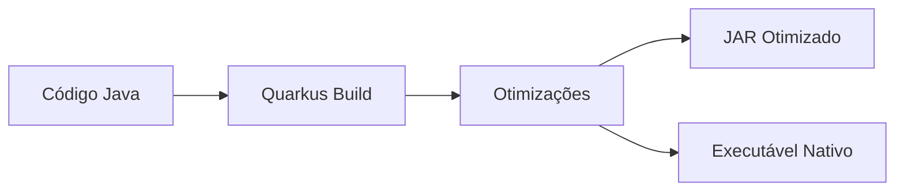

# Guia Completo do Quarkus

## 1. Introdução - O que é Quarkus?

Imagine que você precisa construir uma aplicação Java, mas quer que ela seja **rápida para iniciar**, **consuma pouca memória** e seja **ideal para containers**. O Quarkus é exatamente isso: um framework Java moderno que resolve os problemas tradicionais do Java em ambientes cloud-native.

### Analogia Simples
Se o Java tradicional fosse um carro grande e pesado (consome mais combustível, demora para acelerar), o Quarkus seria um carro esportivo otimizado (acelera rapidamente, consome menos combustível, mas mantém toda a potência).

### Principais Características
- **Tempo de inicialização**: Milissegundos vs segundos
- **Consumo de memória**: Redução de até 90%
- **Compilação nativa**: Gera executáveis nativos com GraalVM
- **Developer Experience**: Recarga a quente (live reload)
- **Cloud-native**: Pensado para Kubernetes desde o início

---

## 2. Por que o Quarkus Existe?

### O Problema do Java Tradicional
Java sempre foi conhecido por:
- Alto consumo de memória (JVM overhead)
- Tempo lento de inicialização
- Não otimizado para containers e microsserviços

### A Solução Quarkus
O Quarkus resolve isso através de:

1. **Compilation-time optimization**: Move processamento do runtime para compile-time
2. **Closed-world assumption**: Assume que o código não muda em runtime
3. **Native compilation**: Usa GraalVM para gerar executáveis nativos



---

## 3. Arquitetura do Quarkus

### Conceitos Fundamentais

#### 3.1 Build Time vs Runtime
**Build Time (Compile-time)**:
- Análise de dependências
- Configuração de frameworks
- Otimizações
- Dead code elimination

**Runtime**:
- Apenas execução do código essencial
- Sem reflexão desnecessária
- Sem class loading dinâmico

#### 3.2 Extensions (Extensões)
As extensões são "plugins" que integram bibliotecas ao Quarkus:

```java
// Sem Quarkus - configuração manual
@Configuration
public class DataSourceConfig {
    @Bean
    public DataSource dataSource() {
        // Configuração complexa...
    }
}

// Com Quarkus - extensão configura automaticamente
// Apenas adiciona: quarkus-hibernate-orm
// E usa: application.properties
```

---

## 4. Instalação e Setup

### 4.1 Pré-requisitos
```bash
# Java 11+ (recomendado Java 17)
java -version

# Maven 3.8.1+ ou Gradle 7+
mvn --version

# GraalVM (opcional, para compilação nativa)
# Baixar de: https://www.graalvm.org/
```

### 4.2 Criando um Projeto

#### Método 1: Quarkus CLI
```bash
# Instalar CLI
curl -Ls https://sh.jbang.dev | bash -s - trust add https://repo1.maven.org/maven2/io/quarkus/quarkus-cli/
curl -Ls https://sh.jbang.dev | bash -s - app install --fresh --force quarkus@quarkusio

# Criar projeto
quarkus create app com.exemplo:minha-app
cd minha-app
```

#### Método 2: Maven
```bash
mvn io.quarkus.platform:quarkus-maven-plugin:3.6.0:create \
    -DprojectGroupId=com.exemplo \
    -DprojectArtifactId=minha-app \
    -Dextensions="resteasy-reactive,hibernate-orm-panache,jdbc-postgresql"
```

#### Método 3: Quarkus Start (Web)
Acesse: https://code.quarkus.io/

### 4.3 Estrutura do Projeto
```
minha-app/
├── pom.xml                          # Dependências Maven
├── src/
│   ├── main/
│   │   ├── java/
│   │   │   └── com/exemplo/
│   │   │       └── GreetingResource.java
│   │   ├── resources/
│   │   │   ├── application.properties
│   │   │   └── META-INF/resources/
│   │   └── docker/
│   └── test/
└── mvnw                            # Maven wrapper
```

---

## 5. Primeiro Exemplo Prático

### 5.1 REST API Simples

```java
package com.exemplo;

import jakarta.ws.rs.GET;
import jakarta.ws.rs.Path;
import jakarta.ws.rs.Produces;
import jakarta.ws.rs.core.MediaType;

@Path("/hello")
public class GreetingResource {

    @GET
    @Produces(MediaType.TEXT_PLAIN)
    public String hello() {
        return "Hello, World!";
    }
}
```

### 5.2 Executando o Projeto

#### Modo Desenvolvimento (com hot reload)
```bash
./mvnw quarkus:dev
# Aplicação roda em: http://localhost:8080
# Teste: curl http://localhost:8080/hello
```

#### Empacotamento JAR
```bash
./mvnw clean package
java -jar target/quarkus-app/quarkus-run.jar
```

#### Compilação Nativa
```bash
./mvnw clean package -Pnative
./target/minha-app-1.0-SNAPSHOT-runner
```

### 5.3 Comparando Performance

| Métrica | Java Tradicional | Quarkus JVM | Quarkus Native |
|---------|------------------|-------------|----------------|
| Startup | ~3-5s | ~1s | ~0.1s |
| Memória | ~200MB | ~80MB | ~20MB |
| Throughput | 100% | 95% | 90% |

---

## 6. Configuração

### 6.1 Application Properties
```properties
# application.properties

# Configuração do servidor
quarkus.http.port=8080
quarkus.http.host=0.0.0.0

# Configuração de banco
quarkus.datasource.db-kind=postgresql
quarkus.datasource.username=usuario
quarkus.datasource.password=senha
quarkus.datasource.jdbc.url=jdbc:postgresql://localhost:5432/meudb

# Hibernate
quarkus.hibernate-orm.database.generation=drop-and-create
quarkus.hibernate-orm.log.sql=true

# Configuração de log
quarkus.log.console.enable=true
quarkus.log.console.level=INFO
```

### 6.2 Profiles de Configuração
```properties
# application.properties (padrão)
%dev.quarkus.http.port=8080
%test.quarkus.http.port=8081
%prod.quarkus.http.port=80

%dev.quarkus.hibernate-orm.database.generation=drop-and-create
%prod.quarkus.hibernate-orm.database.generation=validate
```

### 6.3 Configuração via Código
```java
@ConfigProperty(name = "app.greeting.message")
String message;

@ConfigProperty(name = "app.timeout", defaultValue = "30")
int timeout;
```

---

## 7. Principais Extensões

### 7.1 Web (RESTEasy Reactive)
```bash
./mvnw quarkus:add-extension -Dextensions="resteasy-reactive"
```

```java
@Path("/api/users")
public class UserResource {
    
    @GET
    @Produces(MediaType.APPLICATION_JSON)
    public List<User> list() {
        return User.listAll();
    }
    
    @POST
    @Consumes(MediaType.APPLICATION_JSON)
    @Transactional
    public Response create(User user) {
        user.persist();
        return Response.status(201).entity(user).build();
    }
}
```

### 7.2 Persistência (Hibernate ORM + Panache)
```bash
./mvnw quarkus:add-extension -Dextensions="hibernate-orm-panache,jdbc-postgresql"
```

```java
@Entity
public class User extends PanacheEntity {
    public String name;
    public String email;
    
    // Métodos automáticos do Panache
    // User.findAll()
    // User.findById(id)
    // user.persist()
    // user.delete()
    
    // Queries customizadas
    public static List<User> findByName(String name) {
        return find("name", name).list();
    }
}
```

### 7.3 Validação
```bash
./mvnw quarkus:add-extension -Dextensions="hibernate-validator"
```

```java
@Entity
public class User extends PanacheEntity {
    @NotBlank
    @Size(min = 2, max = 50)
    public String name;
    
    @Email
    public String email;
}
```

### 7.4 JSON (Jackson)
```java
@Path("/api/users")
public class UserResource {
    
    @GET
    @Produces(MediaType.APPLICATION_JSON)
    public List<User> list() {
        return User.listAll(); // Automaticamente serializado para JSON
    }
}
```

---

## 8. Injeção de Dependência (CDI)

### 8.1 Conceito Básico
CDI = Contexts and Dependency Injection. É o mecanismo que gerencia criação e ciclo de vida de objetos.

```java
// Serviço
@ApplicationScoped
public class UserService {
    
    public List<User> findAll() {
        return User.listAll();
    }
    
    @Transactional
    public User create(User user) {
        user.persist();
        return user;
    }
}

// Resource que usa o serviço
@Path("/api/users")
public class UserResource {
    
    @Inject
    UserService userService; // Injetado automaticamente
    
    @GET
    @Produces(MediaType.APPLICATION_JSON)
    public List<User> list() {
        return userService.findAll();
    }
}
```

### 8.2 Escopos
```java
@ApplicationScoped  // Uma instância por aplicação
@RequestScoped     // Uma instância por requisição HTTP
@SessionScoped     // Uma instância por sessão HTTP
@Dependent         // Nova instância a cada injeção (padrão)
```

### 8.3 Producers
```java
@ApplicationScoped
public class DatabaseConfig {
    
    @Produces
    @ApplicationScoped
    public EntityManager entityManager() {
        // Configuração customizada do EntityManager
        return Persistence.createEntityManagerFactory("myPU")
                         .createEntityManager();
    }
}
```

---

## 9. Transações

### 9.1 Transações Declarativas
```java
@ApplicationScoped
public class UserService {
    
    @Transactional
    public User create(User user) {
        user.persist();
        return user;
    }
    
    @Transactional
    public void transfer(Long fromId, Long toId, BigDecimal amount) {
        Account from = Account.findById(fromId);
        Account to = Account.findById(toId);
        
        from.balance = from.balance.subtract(amount);
        to.balance = to.balance.add(amount);
        
        // Se der erro, faz rollback automático
    }
}
```

### 9.2 Controle Manual de Transação
```java
@Inject
UserTransaction transaction;

public void manualTransaction() {
    try {
        transaction.begin();
        
        // Operações
        
        transaction.commit();
    } catch (Exception e) {
        transaction.rollback();
        throw new RuntimeException(e);
    }
}
```

---

## 10. Testes

### 10.1 Testes de Integração
```java
@QuarkusTest
class UserResourceTest {

    @Test
    public void testListUsers() {
        given()
                .when().get("/api/users")
                .then()
                .statusCode(200)
                .contentType(ContentType.JSON);
    }

    @Test
    @Transactional
    public void testCreateUser() {
        User user = new User();
        user.name = "João";
        user.email = "joao@teste.com";

        given()
                .contentType(ContentType.JSON)
                .body(user)
                .when().post("/api/users")
                .then()
                .statusCode(201);
    }
}
```

### 10.2 Test Profiles
```java
@QuarkusTest
@TestProfile(CustomTestProfile.class)
class UserServiceTest {
    // ...
}

public class CustomTestProfile implements QuarkusTestProfile {
    
    @Override
    public Map<String, String> getConfigOverrides() {
        return Map.of(
            "quarkus.datasource.db-kind", "h2",
            "quarkus.datasource.jdbc.url", "jdbc:h2:mem:test"
        );
    }
}
```

### 10.3 Mocking
```java
@QuarkusTest
class UserResourceTest {

    @InjectMock
    UserService userService;

    @Test
    public void testMockedService() {
        when(userService.findAll()).thenReturn(List.of(new User()));

        given()
                .when().get("/api/users")
                .then()
                .statusCode(200);
    }
}
```

---

## 11. Segurança

### 11.1 Basic Auth
```bash
./mvnw quarkus:add-extension -Dextensions="security"
```

```properties
quarkus.security.users.embedded.enabled=true
quarkus.security.users.embedded.users.alice=alice
quarkus.security.users.embedded.roles.alice=user,admin
```

```java
@Path("/api/admin")
@RolesAllowed("admin")
public class AdminResource {
    
    @GET
    public String secret() {
        return "Informação secreta";
    }
}
```

### 11.2 JWT
```bash
./mvnw quarkus:add-extension -Dextensions="smallrye-jwt"
```

```properties
mp.jwt.verify.publickey.location=META-INF/resources/publicKey.pem
mp.jwt.verify.issuer=https://example.com/issuer
```

```java
@Path("/api/protected")
public class ProtectedResource {
    
    @Inject
    JsonWebToken jwt;
    
    @GET
    @RolesAllowed("user")
    public String hello() {
        return "Hello " + jwt.getName();
    }
}
```

### 11.3 OAuth2
```bash
./mvnw quarkus:add-extension -Dextensions="oidc"
```

```properties
quarkus.oidc.auth-server-url=https://localhost:8543/auth/realms/quarkus
quarkus.oidc.client-id=backend-service
quarkus.oidc.credentials.secret=secret
```

---

## 12. Observabilidade

### 12.1 Health Checks
```bash
./mvnw quarkus:add-extension -Dextensions="smallrye-health"
```

```java
@ApplicationScoped
public class DatabaseHealthCheck implements HealthCheck {
    
    @Inject
    DataSource dataSource;
    
    @Override
    public HealthCheckResponse call() {
        try (Connection connection = dataSource.getConnection()) {
            return HealthCheckResponse.up("Database connection");
        } catch (SQLException e) {
            return HealthCheckResponse.down("Database connection failed");
        }
    }
}
```

Endpoints automáticos:
- `/q/health` - Status geral
- `/q/health/live` - Liveness probe
- `/q/health/ready` - Readiness probe

### 12.2 Métricas
```bash
./mvnw quarkus:add-extension -Dextensions="micrometer-registry-prometheus"
```

```java
@Path("/api/users")
public class UserResource {
    
    @Inject
    MeterRegistry registry;
    
    @GET
    @Timed(name = "user.list")
    @Counted(name = "user.list.count")
    public List<User> list() {
        return User.listAll();
    }
}
```

### 12.3 Logs Estruturados
```properties
quarkus.log.console.json=true
quarkus.log.console.json.pretty-print=true
```

```java
@Slf4j
@Path("/api/users")
public class UserResource {
    
    @GET
    public List<User> list() {
        log.info("Listando usuários");
        return User.listAll();
    }
}
```

### 12.4 Tracing
```bash
./mvnw quarkus:add-extension -Dextensions="opentelemetry"
```

```properties
quarkus.opentelemetry.enabled=true
quarkus.opentelemetry.tracer.exporter.otlp.endpoint=http://localhost:4317
```

---

## 13. Containerização

### 13.1 Docker

#### Dockerfile JVM
```dockerfile
FROM registry.access.redhat.com/ubi8/openjdk-17:1.14

COPY target/quarkus-app/lib/ /deployments/lib/
COPY target/quarkus-app/*.jar /deployments/
COPY target/quarkus-app/app/ /deployments/app/
COPY target/quarkus-app/quarkus/ /deployments/quarkus/

EXPOSE 8080
USER 185
ENV JAVA_OPTS="-Dquarkus.http.host=0.0.0.0 -Djava.util.logging.manager=org.jboss.logmanager.LogManager"
ENV JAVA_APP_JAR="/deployments/quarkus-run.jar"
```

#### Build Docker JVM
```bash
./mvnw clean package
docker build -f src/main/docker/Dockerfile.jvm -t minha-app:jvm .
docker run -i --rm -p 8080:8080 minha-app:jvm
```

#### Build Docker Native
```bash
./mvnw clean package -Pnative -Dquarkus.native.container-build=true
docker build -f src/main/docker/Dockerfile.native -t minha-app:native .
docker run -i --rm -p 8080:8080 minha-app:native
```

### 13.2 Comparação de Tamanhos
```bash
# Imagem JVM: ~400MB
# Imagem Native: ~150MB
# Tempo de startup: JVM ~2s, Native ~0.1s
```

---

## 14. Deploy no Kubernetes

### 14.1 Kubernetes Extension
```bash
./mvnw quarkus:add-extension -Dextensions="kubernetes"
```

### 14.2 Configuração Kubernetes
```properties
quarkus.kubernetes.deployment-target=kubernetes
quarkus.kubernetes.replicas=3
quarkus.kubernetes.service-type=load-balancer

# Resources
quarkus.kubernetes.resources.requests.memory=64Mi
quarkus.kubernetes.resources.requests.cpu=250m
quarkus.kubernetes.resources.limits.memory=256Mi
quarkus.kubernetes.resources.limits.cpu=1000m

# Health checks
quarkus.kubernetes.readiness-probe.initial-delay=5s
quarkus.kubernetes.readiness-probe.period=10s
quarkus.kubernetes.liveness-probe.initial-delay=10s
quarkus.kubernetes.liveness-probe.period=30s
```

### 14.3 Manifests Gerados
```bash
./mvnw clean package
# Gera em: target/kubernetes/kubernetes.yml
```

```yaml
apiVersion: apps/v1
kind: Deployment
metadata:
  name: minha-app
spec:
  replicas: 3
  selector:
    matchLabels:
      app.kubernetes.io/name: minha-app
  template:
    spec:
      containers:
      - name: minha-app
        image: minha-app:latest
        ports:
        - containerPort: 8080
        resources:
          requests:
            memory: "64Mi"
            cpu: "250m"
          limits:
            memory: "256Mi"
            cpu: "1000m"
```

---

## 15. Compilação Nativa com GraalVM

### 15.1 Instalação GraalVM
```bash
# Download GraalVM
wget https://github.com/graalvm/graalvm-ce-builds/releases/download/vm-22.3.0/graalvm-ce-java17-linux-amd64-22.3.0.tar.gz

# Extrair e configurar
tar -xzf graalvm-ce-java17-linux-amd64-22.3.0.tar.gz
export JAVA_HOME=$PWD/graalvm-ce-java17-22.3.0
export PATH="$JAVA_HOME/bin:$PATH"

# Instalar native-image
gu install native-image
```

### 15.2 Compilação Nativa
```bash
# Método 1: Maven
./mvnw clean package -Pnative

# Método 2: Container
./mvnw clean package -Pnative -Dquarkus.native.container-build=true

# Método 3: Quarkus CLI
quarkus build --native
```

### 15.3 Configurações para Native
```properties
# Reflection config (quando necessário)
quarkus.native.additional-build-args=--initialize-at-run-time=org.example.MyClass

# Resources
quarkus.native.resources.includes=config/*.properties,templates/*.html

# Logging
quarkus.native.enable-logging=true
```

### 15.4 Troubleshooting Native
```java
// Para classes que usam reflection
@RegisterForReflection
public class MyClass {
    // ...
}

// Para resources
@RegisterForReflection(targets = {
    MyClass.class,
    AnotherClass.class
})
public class ReflectionConfiguration {
}
```

---

## 16. Performance e Otimizações

### 16.1 Métricas de Performance

#### Tempo de Startup
```bash
# JVM mode
time java -jar target/quarkus-app/quarkus-run.jar
# ~1-2 segundos

# Native mode  
time ./target/minha-app-1.0-SNAPSHOT-runner
# ~0.1 segundos
```

#### Consumo de Memória
```bash
# JVM mode: ~80MB
# Native mode: ~20MB

# Monitoramento
docker stats
ps -o pid,vsz,rss,comm
```

### 16.2 Otimizações JVM
```properties
# JVM tuning
quarkus.native.additional-build-args=-H:+ReportExceptionStackTraces
-XX:MaxRAMPercentage=75.0
-XX:+UseG1GC
-XX:+UseStringDeduplication
```

### 16.3 Build Time Optimizations
```xml
<profiles>
  <profile>
    <id>fast</id>
    <properties>
      <quarkus.package.type>fast-jar</quarkus.package.type>
    </properties>
  </profile>
</profiles>
```

### 16.4 Runtime Optimizations
```java
// Use Panache ao invés de JPA tradicional
// Evite reflection desnecessária
// Use connection pools otimizados

@ConfigProperty(name = "quarkus.datasource.jdbc.max-size")
int maxPoolSize; // Pool size otimizado
```

---

## 17. Integração com Mensageria

### 17.1 Apache Kafka
```bash
./mvnw quarkus:add-extension -Dextensions="smallrye-reactive-messaging-kafka"
```

```properties
kafka.bootstrap.servers=localhost:9092

# Outgoing channel
mp.messaging.outgoing.user-events.connector=smallrye-kafka
mp.messaging.outgoing.user-events.topic=user-events

# Incoming channel  
mp.messaging.incoming.user-events.connector=smallrye-kafka
mp.messaging.incoming.user-events.topic=user-events
mp.messaging.incoming.user-events.group.id=user-service
```

```java
// Producer
@ApplicationScoped
public class UserEventProducer {
    
    @Channel("user-events")
    Emitter<String> userEventEmitter;
    
    public void sendUserCreated(String userId) {
        userEventEmitter.send("User created: " + userId);
    }
}

// Consumer
@ApplicationScoped
public class UserEventConsumer {
    
    @Incoming("user-events")
    public void consume(String event) {
        System.out.println("Received: " + event);
    }
}
```

### 17.2 RabbitMQ
```bash
./mvnw quarkus:add-extension -Dextensions="smallrye-reactive-messaging-rabbitmq"
```

```properties
rabbitmq-host=localhost
rabbitmq-port=5672
rabbitmq-username=guest
rabbitmq-password=guest

mp.messaging.outgoing.orders.connector=smallrye-rabbitmq
mp.messaging.outgoing.orders.exchange.name=orders
```

---

## 18. GraphQL

### 18.1 Setup GraphQL
```bash
./mvnw quarkus:add-extension -Dextensions="smallrye-graphql"
```

```java
@GraphQLApi
public class UserApi {
    
    @Query
    public List<User> users() {
        return User.listAll();
    }
    
    @Query
    public User user(@Name("id") Long id) {
        return User.findById(id);
    }
    
    @Mutation
    public User createUser(@Name("user") User user) {
        user.persist();
        return user;
    }
}
```

### 18.2 Schema GraphQL
```graphql
type User {
  id: ID!
  name: String!
  email: String!
}

type Query {
  users: [User!]!
  user(id: ID!): User
}

type Mutation {
  createUser(user: UserInput!): User!
}
```

### 18.3 GraphQL UI
```
# Disponível em: http://localhost:8080/q/graphql-ui/
```

---

## 19. WebSockets

### 19.1 WebSocket Endpoint
```bash
./mvnw quarkus:add-extension -Dextensions="websockets"
```

```java
@ServerEndpoint("/chat")
@ApplicationScoped
public class ChatSocket {

    private Map<String, Session> sessions = new ConcurrentHashMap<>();

    @OnOpen
    public void onOpen(Session session, @PathParam("username") String username) {
        sessions.put(username, session);
        broadcast("User " + username + " joined");
    }

    @OnClose
    public void onClose(Session session, @PathParam("username") String username) {
        sessions.remove(username);
        broadcast("User " + username + " left");
    }

    @OnMessage
    public void onMessage(String message, @PathParam("username") String username) {
        broadcast(username + ": " + message);
    }

    private void broadcast(String message) {
        sessions.values().forEach(s -> {
            s.getAsyncRemote().sendObject(message);
        });
    }
}
```

### 19.2 Cliente WebSocket (JavaScript)
```javascript
const socket = new WebSocket('ws://localhost:8080/chat/usuario1');

socket.onopen = function(event) {
    console.log('Conectado ao chat');
};

socket.onmessage = function(event) {
    console.log('Mensagem recebida:', event.data);
};

socket.send('Olá pessoal!');
```

---

## 20. Programação Reativa

### 20.1 Mutiny - Reactive Streams
```bash
./mvnw quarkus:add-extension -Dextensions="resteasy-reactive,hibernate-reactive-panache"
```

```java
@Path("/api/reactive/users")
public class ReactiveUserResource {
    
    @GET
    @Produces(MediaType.APPLICATION_JSON)
    public Uni<List<User>> listUsers() {
        return User.listAll(); // Retorna Uni<List<User>>
    }
    
    @GET
    @Path("/{id}")
    public Uni<User> getUser(@PathParam("id") Long id) {
        return User.findById(id);
    }
    
    @POST
    @Consumes(MediaType.APPLICATION_JSON)
    public Uni<Response> createUser(User user) {
        return user.persist()
                  .map(u -> Response.status(201).entity(u).build());
    }
}
```

### 20.2 Reactive Entity
```java
@Entity
public class User extends PanacheEntityBase {
    @Id
    @GeneratedValue
    public Long id;
    
    public String name;
    public String email;
    
    // Métodos reativos automáticos
    // User.listAll() -> Uni<List<User>>
    // User.findById(id) -> Uni<User>
    // user.persist() -> Uni<User>
    
    public static Uni<List<User>> findByName(String name) {
        return find("name", name).list();
    }
}
```

### 20.3 Reactive Streams
```java
@ApplicationScoped
public class UserStreamService {
    
    public Multi<User> streamUsers() {
        return Multi.createFrom().ticks().every(Duration.ofSeconds(1))
                   .map(tick -> User.findAll())
                   .flatMap(uni -> uni.toMulti());
    }
}
```

---

## 21. Boas Práticas

### 21.1 Estrutura de Projeto
```
src/main/java/
├── com/exemplo/
│   ├── config/           # Configurações
│   ├── entity/          # Entidades JPA
│   ├── repository/      # Repositórios (se não usar Panache)
│   ├── service/         # Lógica de negócio
│   ├── resource/        # Endpoints REST
│   ├── dto/             # Data Transfer Objects
│   └── exception/       # Exceções customizadas
```

### 21.2 Configuration
```java
// Agrupe configurações relacionadas
@ConfigMapping(prefix = "app.database")
public interface DatabaseConfig {
    String host();
    int port();
    String name();
    String username();
    String password();
    
    @WithDefault("10")
    int maxConnections();
}

// Uso da configuração
@ApplicationScoped
public class DatabaseService {
    
    @Inject
    DatabaseConfig config;
    
    public void connect() {
        String url = String.format("jdbc:postgresql://%s:%d/%s", 
            config.host(), config.port(), config.name());
        // ...
    }
}
```

### 21.3 Exception Handling
```java
// Exception customizada
public class BusinessException extends RuntimeException {
    public BusinessException(String message) {
        super(message);
    }
}

// Global Exception Handler
@Provider
public class GlobalExceptionHandler implements ExceptionMapper<Exception> {
    
    private static final Logger LOG = Logger.getLogger(GlobalExceptionHandler.class);
    
    @Override
    public Response toResponse(Exception e) {
        LOG.error("Erro não tratado", e);
        
        if (e instanceof BusinessException) {
            return Response.status(400)
                    .entity(Map.of("error", e.getMessage()))
                    .build();
        }
        
        if (e instanceof NotFoundException) {
            return Response.status(404)
                    .entity(Map.of("error", "Recurso não encontrado"))
                    .build();
        }
        
        // Erro genérico
        return Response.status(500)
                .entity(Map.of("error", "Erro interno do servidor"))
                .build();
    }
}
```

### 21.4 DTOs e Validação
```java
// DTO de entrada
public class CreateUserRequest {
    @NotBlank(message = "Nome é obrigatório")
    @Size(min = 2, max = 50, message = "Nome deve ter entre 2 e 50 caracteres")
    public String name;
    
    @Email(message = "Email deve ser válido")
    @NotBlank(message = "Email é obrigatório")
    public String email;
    
    @NotNull(message = "Idade é obrigatória")
    @Min(value = 18, message = "Idade mínima é 18 anos")
    public Integer age;
}

// DTO de saída
public class UserResponse {
    public Long id;
    public String name;
    public String email;
    public Integer age;
    public LocalDateTime createdAt;
    
    public static UserResponse from(User user) {
        UserResponse response = new UserResponse();
        response.id = user.id;
        response.name = user.name;
        response.email = user.email;
        response.age = user.age;
        response.createdAt = user.createdAt;
        return response;
    }
}
```

### 21.5 Service Layer Pattern
```java
@ApplicationScoped
public class UserService {
    
    private static final Logger LOG = Logger.getLogger(UserService.class);
    
    @Inject
    EmailService emailService;
    
    public List<UserResponse> findAll() {
        return User.<User>listAll()
                   .stream()
                   .map(UserResponse::from)
                   .collect(Collectors.toList());
    }
    
    @Transactional
    public UserResponse create(CreateUserRequest request) {
        // Validação de negócio
        if (User.find("email", request.email).firstResult() != null) {
            throw new BusinessException("Email já cadastrado");
        }
        
        // Criação da entidade
        User user = new User();
        user.name = request.name;
        user.email = request.email;
        user.age = request.age;
        user.createdAt = LocalDateTime.now();
        
        user.persist();
        
        // Ação pós-criação
        emailService.sendWelcomeEmail(user.email);
        
        LOG.info("Usuário criado: {}", user.id);
        
        return UserResponse.from(user);
    }
    
    @Transactional
    public UserResponse update(Long id, CreateUserRequest request) {
        User user = User.findById(id);
        if (user == null) {
            throw new NotFoundException("Usuário não encontrado");
        }
        
        user.name = request.name;
        user.email = request.email;
        user.age = request.age;
        
        return UserResponse.from(user);
    }
    
    @Transactional
    public void delete(Long id) {
        User user = User.findById(id);
        if (user == null) {
            throw new NotFoundException("Usuário não encontrado");
        }
        
        user.delete();
        LOG.info("Usuário removido: {}", id);
    }
}
```

### 21.6 Resource Layer (Controller)
```java
@Path("/api/users")
@Produces(MediaType.APPLICATION_JSON)
@Consumes(MediaType.APPLICATION_JSON)
public class UserResource {
    
    @Inject
    UserService userService;
    
    @GET
    public List<UserResponse> list() {
        return userService.findAll();
    }
    
    @GET
    @Path("/{id}")
    public UserResponse get(@PathParam("id") Long id) {
        return userService.findById(id);
    }
    
    @POST
    public Response create(@Valid CreateUserRequest request) {
        UserResponse user = userService.create(request);
        return Response.status(201)
                .entity(user)
                .build();
    }
    
    @PUT
    @Path("/{id}")
    public UserResponse update(@PathParam("id") Long id, 
                              @Valid CreateUserRequest request) {
        return userService.update(id, request);
    }
    
    @DELETE
    @Path("/{id}")
    public Response delete(@PathParam("id") Long id) {
        userService.delete(id);
        return Response.noContent().build();
    }
}
```

---

## 22. Patterns Avançados

### 22.1 Repository Pattern (Alternativa ao Panache)
```java
// Interface do repositório
public interface UserRepository {
    List<User> findAll();
    Optional<User> findById(Long id);
    List<User> findByName(String name);
    User save(User user);
    void delete(User user);
}

// Implementação
@ApplicationScoped
public class UserRepositoryImpl implements UserRepository {
    
    @Inject
    EntityManager em;
    
    @Override
    public List<User> findAll() {
        return em.createQuery("SELECT u FROM User u", User.class)
                 .getResultList();
    }
    
    @Override
    public Optional<User> findById(Long id) {
        return Optional.ofNullable(em.find(User.class, id));
    }
    
    @Override
    public List<User> findByName(String name) {
        return em.createQuery("SELECT u FROM User u WHERE u.name LIKE :name", User.class)
                 .setParameter("name", "%" + name + "%")
                 .getResultList();
    }
    
    @Override
    @Transactional
    public User save(User user) {
        if (user.id == null) {
            em.persist(user);
            return user;
        } else {
            return em.merge(user);
        }
    }
    
    @Override
    @Transactional
    public void delete(User user) {
        if (!em.contains(user)) {
            user = em.merge(user);
        }
        em.remove(user);
    }
}
```

### 22.2 CQRS Pattern
```java
// Command
public class CreateUserCommand {
    public String name;
    public String email;
    public Integer age;
}

// Query
public class FindUserByEmailQuery {
    public String email;
}

// Command Handler
@ApplicationScoped
public class UserCommandHandler {
    
    @Transactional
    public UserResponse handle(CreateUserCommand command) {
        User user = new User();
        user.name = command.name;
        user.email = command.email;
        user.age = command.age;
        user.createdAt = LocalDateTime.now();
        
        user.persist();
        return UserResponse.from(user);
    }
}

// Query Handler
@ApplicationScoped
public class UserQueryHandler {
    
    public Optional<UserResponse> handle(FindUserByEmailQuery query) {
        return User.<User>find("email", query.email)
                   .firstResultOptional()
                   .map(UserResponse::from);
    }
}
```

### 22.3 Event-Driven Architecture
```java
// Event
public class UserCreatedEvent {
    public Long userId;
    public String email;
    public String name;
    public LocalDateTime createdAt;
}

// Event Publisher
@ApplicationScoped
public class EventPublisher {
    
    @Inject
    Event<UserCreatedEvent> userCreatedEvent;
    
    public void publishUserCreated(User user) {
        UserCreatedEvent event = new UserCreatedEvent();
        event.userId = user.id;
        event.email = user.email;
        event.name = user.name;
        event.createdAt = user.createdAt;
        
        userCreatedEvent.fire(event);
    }
}

// Event Listener
@ApplicationScoped
public class UserCreatedEventListener {
    
    @Inject
    EmailService emailService;
    
    @Inject
    AuditService auditService;
    
    public void onUserCreated(@Observes UserCreatedEvent event) {
        // Enviar email de boas-vindas
        emailService.sendWelcomeEmail(event.email);
        
        // Registrar auditoria
        auditService.log("User created: " + event.userId);
    }
}
```

---

## 23. Cache

### 23.1 Cache com Redis
```bash
./mvnw quarkus:add-extension -Dextensions="redis-cache"
```

```properties
quarkus.redis.hosts=redis://localhost:6379
```

```java
@ApplicationScoped
public class UserService {
    
    @CacheResult(cacheName = "user-cache")
    public User findById(@CacheKey Long id) {
        return User.findById(id);
    }
    
    @CacheInvalidate(cacheName = "user-cache")
    @Transactional
    public User update(@CacheKey Long id, User user) {
        User existing = User.findById(id);
        existing.name = user.name;
        existing.email = user.email;
        return existing;
    }
    
    @CacheInvalidateAll(cacheName = "user-cache")
    @Transactional
    public User create(User user) {
        user.persist();
        return user;
    }
}
```

### 23.2 Cache Programático
```java
@ApplicationScoped
public class UserService {
    
    @Inject
    @CacheName("user-cache")
    Cache cache;
    
    public User findById(Long id) {
        return cache.get(id, k -> User.findById(k)).await().indefinitely();
    }
    
    @Transactional
    public User update(Long id, User user) {
        User updated = // lógica de atualização
        cache.invalidate(id).await().indefinitely();
        return updated;
    }
}
```

---

## 24. Scheduled Tasks

### 24.1 Scheduler Básico
```bash
./mvnw quarkus:add-extension -Dextensions="scheduler"
```

```java
@ApplicationScoped
public class ScheduledTasks {
    
    private static final Logger LOG = Logger.getLogger(ScheduledTasks.class);
    
    @Scheduled(every = "30s")
    public void performHealthCheck() {
        LOG.info("Executando health check: {}", LocalDateTime.now());
        // Lógica de health check
    }
    
    @Scheduled(cron = "0 0 2 * * ?") // Todo dia às 2:00
    public void dailyCleanup() {
        LOG.info("Executando limpeza diária");
        // Lógica de limpeza
    }
    
    @Scheduled(every = "1h", delay = 10, delayUnit = TimeUnit.MINUTES)
    public void hourlyReport() {
        LOG.info("Gerando relatório por hora");
        // Lógica de relatório
    }
}
```

### 24.2 Scheduled Tasks Condicionais
```java
@ApplicationScoped
public class ConditionalTasks {
    
    @Scheduled(every = "10s", identity = "heartbeat")
    @ScheduledExecution(ScheduledExecution.ExecutionType.SKIP_IF_RUNNING)
    public void heartbeat() {
        // Só executa se a anterior já terminou
        LOG.info("Heartbeat");
    }
    
    @Scheduled(every = "5m")
    public void conditionalTask() {
        if (shouldRun()) {
            LOG.info("Executando tarefa condicional");
            // Lógica da tarefa
        }
    }
    
    private boolean shouldRun() {
        // Lógica para determinar se deve executar
        return LocalTime.now().getHour() >= 9 && LocalTime.now().getHour() <= 17;
    }
}
```

---

## 25. Migração de Dados

### 25.1 Flyway
```bash
./mvnw quarkus:add-extension -Dextensions="flyway"
```

```properties
# Flyway configuration
quarkus.flyway.migrate-at-start=true
quarkus.flyway.baseline-on-migrate=true
quarkus.flyway.locations=db/migration
```

```sql
-- src/main/resources/db/migration/V1.0.0__Create_user_table.sql
CREATE TABLE users (
    id BIGSERIAL PRIMARY KEY,
    name VARCHAR(50) NOT NULL,
    email VARCHAR(100) NOT NULL UNIQUE,
    age INTEGER,
    created_at TIMESTAMP DEFAULT CURRENT_TIMESTAMP
);
```

```sql
-- src/main/resources/db/migration/V1.0.1__Add_user_index.sql
CREATE INDEX idx_users_email ON users(email);
CREATE INDEX idx_users_name ON users(name);
```

### 25.2 Liquibase (Alternativa)
```bash
./mvnw quarkus:add-extension -Dextensions="liquibase"
```

```xml
<!-- src/main/resources/db/changeLog.xml -->
<?xml version="1.0" encoding="UTF-8"?>
<databaseChangeLog
        xmlns="http://www.liquibase.org/xml/ns/dbchangelog"
        xmlns:xsi="http://www.w3.org/2001/XMLSchema-instance"
        xsi:schemaLocation="http://www.liquibase.org/xml/ns/dbchangelog
        http://www.liquibase.org/xml/ns/dbchangelog/dbchangelog-3.8.xsd">

    <changeSet id="1" author="developer">
        <createTable tableName="users">
            <column name="id" type="bigint" autoIncrement="true">
                <constraints primaryKey="true"/>
            </column>
            <column name="name" type="varchar(50)">
                <constraints nullable="false"/>
            </column>
            <column name="email" type="varchar(100)">
                <constraints nullable="false" unique="true"/>
            </column>
        </createTable>
    </changeSet>
</databaseChangeLog>
```

---

## 26. Ambiente de Desenvolvimento

### 26.1 Dev Services
```properties
# Quarkus automaticamente inicia containers para desenvolvimento
# PostgreSQL
quarkus.datasource.db-kind=postgresql
# Container PostgreSQL será iniciado automaticamente

# Redis  
quarkus.redis.hosts=redis://localhost:6379
# Container Redis será iniciado automaticamente

# Kafka
kafka.bootstrap.servers=localhost:9092
# Container Kafka será iniciado automaticamente
```

### 26.2 Hot Reload
```bash
# Inicie em modo desenvolvimento
./mvnw quarkus:dev

# Qualquer mudança no código será automaticamente recarregada
# Suporta:
# - Classes Java
# - Resources (HTML, CSS, JS)
# - Configurações (application.properties)
# - Dependências (pom.xml)
```

### 26.3 Dev UI
```
# Acesse: http://localhost:8080/q/dev/
# Interface web com:
# - Informações da aplicação
# - Configurações
# - Health checks
# - Métricas
# - Database console
# - Extensions instaladas
```

### 26.4 Continuous Testing
```bash
# Modo de teste contínuo
./mvnw quarkus:test

# Executa testes automaticamente quando código muda
# Comandos disponíveis:
# r - executar todos os testes
# f - executar apenas testes que falharam
# b - quebrar na primeira falha
# v - visualizar saída completa
# q - sair
```

---

## 27. Monitoramento em Produção

### 27.1 Application Performance Monitoring (APM)
```bash
./mvnw quarkus:add-extension -Dextensions="opentelemetry"
```

```properties
# Jaeger tracing
quarkus.opentelemetry.enabled=true
quarkus.opentelemetry.tracer.exporter.otlp.endpoint=http://jaeger:14250

# Métricas para Prometheus
quarkus.micrometer.export.prometheus.enabled=true
quarkus.micrometer.export.prometheus.path=/q/metrics
```

### 27.2 Custom Metrics
```java
@ApplicationScoped
public class BusinessMetrics {
    
    @Inject
    MeterRegistry registry;
    
    private Counter orderCounter;
    private Timer orderProcessingTime;
    
    @PostConstruct
    public void init() {
        orderCounter = Counter.builder("orders.created")
                             .description("Total orders created")
                             .register(registry);
                             
        orderProcessingTime = Timer.builder("orders.processing.time")
                                  .description("Order processing time")
                                  .register(registry);
    }
    
    public void recordOrder() {
        orderCounter.increment();
    }
    
    public void recordProcessingTime(Duration duration) {
        orderProcessingTime.record(duration);
    }
}
```

### 27.3 Structured Logging
```properties
# JSON logging para produção
quarkus.log.console.json=true
quarkus.log.console.json.additional-field."service.name".value=user-service
quarkus.log.console.json.additional-field."service.version".value=${quarkus.application.version}
```

```java
@ApplicationScoped
public class UserService {
    
    private static final Logger LOG = Logger.getLogger(UserService.class);
    
    public User createUser(CreateUserRequest request) {
        try (MDCCloseable mdc = MDC.putCloseable("operation", "create_user")) {
            LOG.info("Criando usuário: {}", request.email);
            
            User user = new User();
            // ... lógica de criação
            
            LOG.info("Usuário criado com sucesso. ID: {}", user.id);
            return user;
        } catch (Exception e) {
            LOG.error("Erro ao criar usuário", e);
            throw e;
        }
    }
}
```

---

## 28. Troubleshooting

### 28.1 Problemas Comuns em Native Build

#### OutOfMemoryError durante build
```bash
# Aumente memória para build nativo
./mvnw clean package -Pnative -Dquarkus.native.native-image-xmx=8g
```

#### ClassNotFoundException em runtime
```java
// Registre classes para reflection
@RegisterForReflection
public class MyClass {
    // ...
}

// Ou via configuration
@RegisterForReflection(targets = {
    MyClass.class,
    AnotherClass.class
})
public class ReflectionConfig {
}
```

#### Resources não encontrados
```properties
# Inclua resources no native build
quarkus.native.resources.includes=config/*.properties,templates/*.html,static/**
```

### 28.2 Performance Issues

#### Startup lento
```bash
# Analise startup
java -XX:+PrintGCDetails -XX:+PrintGCTimeStamps -jar app.jar

# Use fast-jar para desenvolvimento
./mvnw clean package -Dquarkus.package.type=fast-jar
```

#### Alto consumo de memória
```properties
# Tune JVM
-XX:MaxRAMPercentage=75.0
-XX:+UseG1GC
-XX:MaxGCPauseMillis=100
```

#### Database connection issues
```properties
# Otimize pool de conexões
quarkus.datasource.jdbc.initial-size=5
quarkus.datasource.jdbc.min-size=5
quarkus.datasource.jdbc.max-size=20
quarkus.datasource.jdbc.acquisition-timeout=5
```

### 28.3 Debug

#### Remote Debug
```bash
# JVM mode
java -agentlib:jdwp=transport=dt_socket,server=y,suspend=n,address=5005 -jar app.jar

# Maven dev mode com debug
./mvnw quarkus:dev -Ddebug=5005
```

#### Native Debug
```bash
# Build com debug info
./mvnw clean package -Pnative -Dquarkus.native.debug.enabled=true

# Execute com GDB
gdb ./target/app-runner
```

---

## 29. Comparação com Outros Frameworks

### 29.1 Quarkus vs Spring Boot

| Aspecto | Quarkus | Spring Boot |
|---------|---------|-------------|
| **Startup Time** | ~0.1s (native) / ~1s (JVM) | ~3-5s |
| **Memory Usage** | ~20MB (native) / ~80MB (JVM) | ~200MB |
| **Ecosystem** | Crescendo rapidamente | Muito maduro |
| **Learning Curve** | Moderada | Suave |
| **Native Support** | Primeira classe | Experimental |
| **Cloud-Native** | Construído para isso | Adaptado |
| **Standards** | Jakarta EE / MicroProfile | Spring específico |

### 29.2 Quarkus vs Micronaut

| Aspecto | Quarkus | Micronaut |
|---------|---------|-----------|
| **Compilation** | Build-time + Runtime | Compile-time |
| **GraalVM** | Excelente | Bom |
| **Ecosystem** | Java/Kotlin | Java/Kotlin/Groovy |
| **DI** | CDI | Micronaut DI |
| **Performance** | Excelente | Muito boa |

### 29.3 Quando Usar Quarkus

**✅ Use Quarkus quando:**
- Desenvolver microsserviços cloud-native
- Performance e baixo consumo de recursos são críticos
- Quer usar padrões Jakarta EE/MicroProfile
- Planeja usar containers/Kubernetes
- Equipe tem experiência com Java EE

**❌ Evite Quarkus quando:**
- Aplicação monolítica tradicional
- Equipe prefere Spring ecosystem
- Precisa de muitas bibliotecas não suportadas
- Aplicação usa muito reflection/dynamic loading

---

## 30. Roadmap e Futuro

### 30.1 Versões e Release Cycle
```
Quarkus segue versionamento semântico:
- Major: Mudanças breaking
- Minor: Novas features (a cada 3-4 meses)  
- Patch: Bug fixes

LTS (Long Term Support):
- Quarkus 2.x: LTS até 2024
- Quarkus 3.x: LTS até 2026
```

### 30.2 Tendências e Novidades
- **Project Loom**: Integração com virtual threads
- **Project Panama**: Foreign Function & Memory API
- **CRaC**: Coordinated Restore at Checkpoint
- **Mandrel**: GraalVM nativo para Quarkus
- **Reactive**: Maior integração com Mutiny
- **AI/ML**: Extensions para machine learning

### 30.3 Comunidade e Recursos

#### Documentação Oficial
- https://quarkus.io/guides/
- https://quarkus.io/blog/

#### Comunidade
- GitHub: https://github.com/quarkusio/quarkus
- Stack Overflow: tag `quarkus`
- Zulip Chat: https://quarkusio.zulipchat.com/

#### Training e Certificação
- Red Hat Training
- Workshops oficiais
- Quarkus Insights (YouTube)

---

## Conclusão

O Quarkus representa uma evolução natural do Java para a era cloud-native. Ele resolve os principais problemas do Java tradicional (startup lento, alto consumo de memória) mantendo a produtividade e o ecossistema que os desenvolvedores Java conhecem.

### Principais Benefícios Resumidos

1. **Performance**: Startup em milissegundos, baixo consumo de memória
2. **Produtividade**: Hot reload, dev services, developer experience excepcional
3. **Standards**: Jakarta EE, MicroProfile - conhecimento reutilizável
4. **Cloud-Native**: Kubernetes, containers, observabilidade built-in
5. **Flexibilidade**: JVM mode para desenvolvimento, native para produção

### Primeiros Passos Recomendados

1. **Experimente**: Crie um projeto simples com REST API
2. **Explore**: Use dev mode e dev UI 
3. **Integre**: Adicione database com Panache
4. **Containerize**: Faça build nativo e rode em container
5. **Monitor**: Adicione métricas e health checks
6. **Deploy**: Publique no Kubernetes

O Quarkus não é apenas mais um framework Java - é uma nova forma de pensar desenvolvimento Java para aplicações modernas. A curva de aprendizado é suave para desenvolvedores Java, mas os benefícios são enormes.

**Comece agora**: `quarkus create app com.exemplo:meu-primeiro-app`

