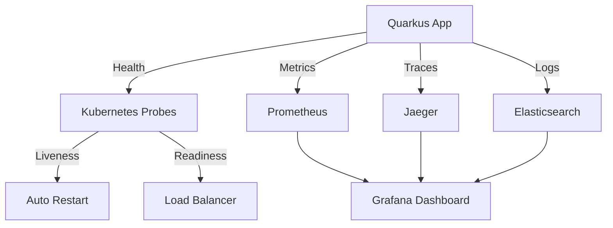

# 🎯 MicroProfile - Quarkus MicroProfile APIs

> **Versão:** Quarkus 3.15.1 | MicroProfile 6.1  
> **Última Atualização:** Outubro 2024  
> **Objetivo:** Guia completo das principais especificações MicroProfile no Quarkus - Health Check, Metrics, Fault Tolerance, Config, OpenAPI e JWT

---

## 📖 **Índice**

1. [Introdução](#1-introdução)
2. [Health Check](#2-health-check)
3. [Metrics](#3-metrics)
4. [Fault Tolerance](#4-fault-tolerance)
5. [Config](#5-config)
6. [OpenAPI](#6-openapi)
7. [JWT Authentication](#7-jwt-authentication)
8. [REST Client](#8-rest-client)
9. [Integração entre Specs](#9-integração-entre-specs)
10. [Observabilidade Completa](#10-observabilidade-completa)
11. [Testes](#11-testes)
12. [Padrões e Boas Práticas](#12-padrões-e-boas-práticas)
13. [Performance](#13-performance)
14. [Troubleshooting](#14-troubleshooting)
15. [Recursos](#15-recursos)

---

## 1. 🤔 **Introdução**

### O que é MicroProfile?

**MicroProfile** é um conjunto de especificações Java para desenvolvimento de microservices, focado em:

- ✅ **Cloud Native** - APIs otimizadas para containers e Kubernetes
- ✅ **Observabilidade** - Health, Metrics, Tracing
- ✅ **Resiliência** - Fault Tolerance (Retry, CircuitBreaker, etc.)
- ✅ **Configuração** - Externalização de configs
- ✅ **Segurança** - JWT, OAuth2
- ✅ **Documentação** - OpenAPI/Swagger automático

### Analogia Simples

```
┌─────────────────────────────────────────────────────────────────┐
│  Imagine que você está construindo um prédio (microservice):    │
│                                                                   │
│  🏗️  MicroProfile é como um kit completo de ferramentas:        │
│                                                                   │
│  🔍 Health Check     → Inspeção estrutural do prédio            │
│  📊 Metrics          → Medidores de água, luz, gás              │
│  🛡️ Fault Tolerance  → Sistema de segurança e backup           │
│  ⚙️ Config           → Plantas e especificações                 │
│  📝 OpenAPI          → Documentação e manual                     │
│  🔐 JWT Auth         → Porteiro e controle de acesso           │
│                                                                   │
│  Sem MicroProfile: Você teria que construir tudo do zero!       │
└─────────────────────────────────────────────────────────────────┘
```

### Especificações MicroProfile no Quarkus

| Spec | Descrição | Extension |
|------|-----------|-----------|
| **Health** | Health checks (liveness/readiness) | `quarkus-smallrye-health` |
| **Metrics** | Métricas da aplicação | `quarkus-micrometer-registry-prometheus` |
| **Fault Tolerance** | Resiliência (retry, circuit breaker) | `quarkus-smallrye-fault-tolerance` |
| **Config** | Configuração externalizada | `quarkus-config-yaml` |
| **OpenAPI** | Documentação automática | `quarkus-smallrye-openapi` |
| **JWT** | Autenticação JWT | `quarkus-smallrye-jwt` |
| **REST Client** | Cliente HTTP declarativo | `quarkus-rest-client-reactive` |
| **OpenTracing** | Distributed tracing | `quarkus-opentelemetry` |

### Arquitetura MicroProfile

```mermaid
graph TB
    subgraph "Aplicação Quarkus"
        A[REST Endpoints] --> B[Business Logic]
        B --> C[Data Access]
    end
    
    subgraph "MicroProfile Specs"
        D[Health Check] -.->|monitora| A
        E[Metrics] -.->|coleta| B
        F[Fault Tolerance] -.->|protege| B
        G[Config] -.->|configura| B
        H[OpenAPI] -.->|documenta| A
        I[JWT] -.->|autentica| A
    end
    
    subgraph "Infraestrutura"
        J[Kubernetes] -->|readiness/liveness| D
        K[Prometheus] -->|scrape| E
        L[Grafana] -->|visualiza| K
        M[Vault/ConfigMap| -->|provide| G
    end
    
    style D fill:#e1f5ff
    style E fill:#fff3e0
    style F fill:#f3e5f5
    style G fill:#e8f5e9
```

---

## 2. 🏥 **Health Check**

### 2.1. Setup

```xml
<dependency>
    <groupId>io.quarkus</groupId>
    <artifactId>quarkus-smallrye-health</artifactId>
</dependency>
```

### 2.2. Tipos de Health Checks

#### 📍 Liveness vs Readiness vs Startup

```
┌────────────────────────────────────────────────────────────────┐
│  TIPOS DE HEALTH CHECKS                                        │
├────────────────────────────────────────────────────────────────┤
│                                                                │
│  🟢 LIVENESS (Está vivo?)                                      │
│     - Verifica se app está rodando                             │
│     - Kubernetes reinicia pod se falhar                         │
│     - Exemplo: Deadlock detection, OutOfMemory                 │
│                                                                │
│  🟡 READINESS (Está pronto?)                                   │
│     - Verifica se app pode receber tráfego                     │
│     - Kubernetes remove pod do load balancer se falhar         │
│     - Exemplo: DB conectado, cache carregado                   │
│                                                                │
│  🔵 STARTUP (Inicializou?)                                     │
│     - Verifica se app terminou de inicializar                  │
│     - Executado apenas no início                               │
│     - Exemplo: Migração de dados, warmup                       │
│                                                                │
└────────────────────────────────────────────────────────────────┘
```

### 2.3. Liveness Check

```java
package com.example.health;

import org.eclipse.microprofile.health.HealthCheck;
import org.eclipse.microprofile.health.HealthCheckResponse;
import org.eclipse.microprofile.health.Liveness;
import org.slf4j.Logger;
import org.slf4j.LoggerFactory;
import jakarta.enterprise.context.ApplicationScoped;
import java.lang.management.ManagementFactory;
import java.lang.management.ThreadMXBean;

/**
 * Health check de liveness - verifica se aplicação está viva.
 * 
 * <p>Kubernetes reinicia o pod se este check falhar.
 */
@Liveness
@ApplicationScoped
public class LivenessHealthCheck implements HealthCheck {
    
    private static final Logger log = LoggerFactory.getLogger(LivenessHealthCheck.class);
    private static final int DEADLOCK_THRESHOLD = 5;
    
    @Override
    public HealthCheckResponse call() {
        try {
            // Verificar deadlocks
            ThreadMXBean threadBean = ManagementFactory.getThreadMXBean();
            long[] deadlockedThreads = threadBean.findDeadlockedThreads();
            
            if (deadlockedThreads != null && deadlockedThreads.length > DEADLOCK_THRESHOLD) {
                log.error("Deadlock detectado em {} threads!", deadlockedThreads.length);
                
                return HealthCheckResponse
                    .named("liveness-deadlock-check")
                    .down()
                    .withData("deadlocked-threads", deadlockedThreads.length)
                    .withData("threshold", DEADLOCK_THRESHOLD)
                    .build();
            }
            
            // Verificar memória
            Runtime runtime = Runtime.getRuntime();
            long maxMemory = runtime.maxMemory();
            long usedMemory = runtime.totalMemory() - runtime.freeMemory();
            double memoryUsage = (double) usedMemory / maxMemory * 100;
            
            if (memoryUsage > 95) {
                log.warn("Uso de memória crítico: {}%", String.format("%.2f", memoryUsage));
                
                return HealthCheckResponse
                    .named("liveness-memory-check")
                    .down()
                    .withData("memory-usage-percent", String.format("%.2f", memoryUsage))
                    .withData("used-memory-mb", usedMemory / 1024 / 1024)
                    .withData("max-memory-mb", maxMemory / 1024 / 1024)
                    .build();
            }
            
            // Tudo OK
            return HealthCheckResponse
                .named("liveness-check")
                .up()
                .withData("status", "Application is alive")
                .withData("memory-usage-percent", String.format("%.2f", memoryUsage))
                .withData("active-threads", Thread.activeCount())
                .build();
            
        } catch (Exception e) {
            log.error("Erro no liveness check", e);
            return HealthCheckResponse
                .named("liveness-check")
                .down()
                .withData("error", e.getMessage())
                .build();
        }
    }
}
```

### 2.4. Readiness Check

```java
package com.example.health;

import io.agroal.api.AgroalDataSource;
import org.eclipse.microprofile.health.HealthCheck;
import org.eclipse.microprofile.health.HealthCheckResponse;
import org.eclipse.microprofile.health.Readiness;
import org.slf4j.Logger;
import org.slf4j.LoggerFactory;
import jakarta.enterprise.context.ApplicationScoped;
import jakarta.inject.Inject;
import java.sql.Connection;

/**
 * Health check de readiness - verifica se aplicação está pronta.
 * 
 * <p>Kubernetes remove pod do load balancer se este check falhar.
 */
@Readiness
@ApplicationScoped
public class ReadinessHealthCheck implements HealthCheck {
    
    private static final Logger log = LoggerFactory.getLogger(ReadinessHealthCheck.class);
    
    @Inject
    AgroalDataSource dataSource;
    
    @Override
    public HealthCheckResponse call() {
        HealthCheckResponse.HealthCheckResponseBuilder builder = 
            HealthCheckResponse.named("readiness-check");
        
        try {
            // 1. Verificar conexão com banco de dados
            boolean dbHealthy = checkDatabase();
            if (!dbHealthy) {
                return builder
                    .down()
                    .withData("database", "unavailable")
                    .build();
            }
            
            // 2. Verificar cache (exemplo)
            boolean cacheHealthy = checkCache();
            if (!cacheHealthy) {
                return builder
                    .down()
                    .withData("cache", "unavailable")
                    .build();
            }
            
            // 3. Verificar APIs externas (opcional)
            boolean externalApiHealthy = checkExternalApis();
            
            // Tudo OK
            return builder
                .up()
                .withData("database", "available")
                .withData("cache", "available")
                .withData("external-apis", externalApiHealthy ? "available" : "degraded")
                .build();
            
        } catch (Exception e) {
            log.error("Erro no readiness check", e);
            return builder
                .down()
                .withData("error", e.getMessage())
                .build();
        }
    }
    
    /**
     * Verifica conexão com banco de dados.
     */
    private boolean checkDatabase() {
        try (Connection conn = dataSource.getConnection()) {
            return conn.isValid(3); // Timeout de 3 segundos
        } catch (Exception e) {
            log.error("Erro ao verificar database", e);
            return false;
        }
    }
    
    /**
     * Verifica cache (exemplo com Redis/Infinispan).
     */
    private boolean checkCache() {
        try {
            // Exemplo: verificar se cache está respondendo
            // cacheManager.getCache("my-cache").get("health-check-key");
            return true;
        } catch (Exception e) {
            log.error("Erro ao verificar cache", e);
            return false;
        }
    }
    
    /**
     * Verifica APIs externas críticas.
     */
    private boolean checkExternalApis() {
        try {
            // Exemplo: verificar se API externa responde
            // externalClient.healthCheck();
            return true;
        } catch (Exception e) {
            log.warn("API externa não disponível (modo degradado)", e);
            return false; // Não crítico, apenas degrada
        }
    }
}
```

### 2.5. Startup Check

```java
package com.example.health;

import org.eclipse.microprofile.health.HealthCheck;
import org.eclipse.microprofile.health.HealthCheckResponse;
import org.eclipse.microprofile.health.Startup;
import org.slf4j.Logger;
import org.slf4j.LoggerFactory;
import jakarta.enterprise.context.ApplicationScoped;
import jakarta.inject.Inject;

/**
 * Health check de startup - verifica se inicialização completou.
 * 
 * <p>Executado apenas durante startup da aplicação.
 */
@Startup
@ApplicationScoped
public class StartupHealthCheck implements HealthCheck {
    
    private static final Logger log = LoggerFactory.getLogger(StartupHealthCheck.class);
    
    @Inject
    DataMigrationService migrationService;
    
    @Inject
    CacheWarmupService warmupService;
    
    @Override
    public HealthCheckResponse call() {
        HealthCheckResponse.HealthCheckResponseBuilder builder = 
            HealthCheckResponse.named("startup-check");
        
        try {
            // 1. Verificar se migração de dados completou
            if (!migrationService.isCompleted()) {
                return builder
                    .down()
                    .withData("migration", "in-progress")
                    .build();
            }
            
            // 2. Verificar se cache warmup completou
            if (!warmupService.isCompleted()) {
                return builder
                    .down()
                    .withData("cache-warmup", "in-progress")
                    .build();
            }
            
            // 3. Verificar se todas as dependências estão prontas
            if (!allDependenciesReady()) {
                return builder
                    .down()
                    .withData("dependencies", "not-ready")
                    .build();
            }
            
            log.info("Startup completo com sucesso!");
            
            return builder
                .up()
                .withData("migration", "completed")
                .withData("cache-warmup", "completed")
                .withData("dependencies", "ready")
                .build();
            
        } catch (Exception e) {
            log.error("Erro no startup check", e);
            return builder
                .down()
                .withData("error", e.getMessage())
                .build();
        }
    }
    
    private boolean allDependenciesReady() {
        // Verificar dependências críticas
        return true;
    }
}

/**
 * Service de exemplo para migração de dados.
 */
@ApplicationScoped
class DataMigrationService {
    private volatile boolean completed = false;
    
    public boolean isCompleted() {
        return completed;
    }
    
    public void setCompleted(boolean completed) {
        this.completed = completed;
    }
}

/**
 * Service de exemplo para warmup de cache.
 */
@ApplicationScoped
class CacheWarmupService {
    private volatile boolean completed = false;
    
    public boolean isCompleted() {
        return completed;
    }
    
    public void setCompleted(boolean completed) {
        this.completed = completed;
    }
}
```

### 2.6. Health Check com Estado Mutável

```java
package com.example.health;

import org.eclipse.microprofile.health.HealthCheck;
import org.eclipse.microprofile.health.HealthCheckResponse;
import org.eclipse.microprofile.health.Readiness;
import jakarta.enterprise.context.ApplicationScoped;
import java.util.concurrent.atomic.AtomicBoolean;

/**
 * Health check com estado que pode ser alterado programaticamente.
 */
@Readiness
@ApplicationScoped
public class ManageableHealthCheck implements HealthCheck {
    
    private final AtomicBoolean healthy = new AtomicBoolean(true);
    private String reason = "OK";
    
    @Override
    public HealthCheckResponse call() {
        HealthCheckResponse.HealthCheckResponseBuilder builder = 
            HealthCheckResponse.named("manageable-check");
        
        if (healthy.get()) {
            return builder.up().withData("reason", reason).build();
        } else {
            return builder.down().withData("reason", reason).build();
        }
    }
    
    /**
     * Marca aplicação como unhealthy (ex: durante manutenção).
     */
    public void markUnhealthy(String reason) {
        this.healthy.set(false);
        this.reason = reason;
    }
    
    /**
     * Marca aplicação como healthy novamente.
     */
    public void markHealthy() {
        this.healthy.set(true);
        this.reason = "OK";
    }
}
```

### 2.7. Endpoints de Health

```properties
# ═══════════════════════════════════════════════════════════════
# HEALTH CHECK - CONFIGURAÇÕES
# ═══════════════════════════════════════════════════════════════

# Habilitar health checks
quarkus.smallrye-health.enabled=true

# Paths dos endpoints
quarkus.smallrye-health.root-path=/health
quarkus.smallrye-health.liveness-path=/health/live
quarkus.smallrye-health.readiness-path=/health/ready
quarkus.smallrye-health.startup-path=/health/started

# Incluir informações adicionais
quarkus.smallrye-health.ui.enable=true
quarkus.smallrye-health.ui.always-include=true
```

**Endpoints disponíveis:**

```bash
# Health geral (todos os checks)
GET http://localhost:8080/q/health

# Apenas liveness
GET http://localhost:8080/q/health/live

# Apenas readiness
GET http://localhost:8080/q/health/ready

# Apenas startup
GET http://localhost:8080/q/health/started

# UI Web (dev mode)
http://localhost:8080/q/health-ui/
```

**Resposta JSON:**

```json
{
  "status": "UP",
  "checks": [
    {
      "name": "liveness-check",
      "status": "UP",
      "data": {
        "status": "Application is alive",
        "memory-usage-percent": "45.32",
        "active-threads": 42
      }
    },
    {
      "name": "readiness-check",
      "status": "UP",
      "data": {
        "database": "available",
        "cache": "available",
        "external-apis": "available"
      }
    }
  ]
}
```

### 2.8. Health Check para Kubernetes

```yaml
# deployment.yaml
apiVersion: apps/v1
kind: Deployment
metadata:
  name: my-quarkus-app
spec:
  replicas: 3
  template:
    spec:
      containers:
      - name: app
        image: my-quarkus-app:1.0
        ports:
        - containerPort: 8080
        
        # Liveness Probe - reinicia pod se falhar
        livenessProbe:
          httpGet:
            path: /q/health/live
            port: 8080
            scheme: HTTP
          initialDelaySeconds: 30
          periodSeconds: 10
          timeoutSeconds: 3
          failureThreshold: 3
        
        # Readiness Probe - remove do load balancer se falhar
        readinessProbe:
          httpGet:
            path: /q/health/ready
            port: 8080
            scheme: HTTP
          initialDelaySeconds: 10
          periodSeconds: 5
          timeoutSeconds: 3
          failureThreshold: 3
        
        # Startup Probe - aguarda inicialização completa
        startupProbe:
          httpGet:
            path: /q/health/started
            port: 8080
            scheme: HTTP
          initialDelaySeconds: 0
          periodSeconds: 5
          timeoutSeconds: 3
          failureThreshold: 30  # 30 * 5s = 150s máximo para startup
```

### 2.9. Health Check Reativo

```java
package com.example.health;

import io.smallrye.health.api.AsyncHealthCheck;
import io.smallrye.mutiny.Uni;
import org.eclipse.microprofile.health.HealthCheckResponse;
import org.eclipse.microprofile.health.Readiness;
import jakarta.enterprise.context.ApplicationScoped;
import jakarta.inject.Inject;

/**
 * Health check reativo usando Mutiny.
 */
@Readiness
@ApplicationScoped
public class ReactiveHealthCheck implements AsyncHealthCheck {
    
    @Inject
    ReactiveDataSource dataSource;
    
    @Override
    public Uni<HealthCheckResponse> call() {
        return dataSource.healthCheck()
            .map(healthy -> HealthCheckResponse
                .named("reactive-database-check")
                .status(healthy)
                .withData("datasource", healthy ? "available" : "unavailable")
                .build())
            .onFailure().recoverWithItem(err -> 
                HealthCheckResponse
                    .named("reactive-database-check")
                    .down()
                    .withData("error", err.getMessage())
                    .build()
            );
    }
}
```

---

## 3. 📊 **Metrics**

### 3.1. Setup

```xml
<dependencies>
    <!-- Micrometer + Prometheus -->
    <dependency>
        <groupId>io.quarkus</groupId>
        <artifactId>quarkus-micrometer-registry-prometheus</artifactId>
    </dependency>
    
    <!-- Opcional: Métricas de JVM -->
    <dependency>
        <groupId>io.micrometer</groupId>
        <artifactId>micrometer-registry-prometheus</artifactId>
    </dependency>
</dependencies>
```

```properties
# ═══════════════════════════════════════════════════════════════
# METRICS - CONFIGURAÇÕES
# ═══════════════════════════════════════════════════════════════

# Habilitar métricas
quarkus.micrometer.enabled=true
quarkus.micrometer.export.prometheus.enabled=true

# Path do endpoint
quarkus.micrometer.export.prometheus.path=/q/metrics

# Métricas de sistema
quarkus.micrometer.binder.jvm=true
quarkus.micrometer.binder.system=true
quarkus.micrometer.binder.http-server.enabled=true

# Prefixo das métricas
quarkus.micrometer.export.prometheus.prefix=app
```

### 3.2. Tipos de Métricas

#### 📈 Counter - Contador Incremental

```java
package com.example.metrics;

import io.micrometer.core.instrument.Counter;
import io.micrometer.core.instrument.MeterRegistry;
import org.slf4j.Logger;
import org.slf4j.LoggerFactory;
import jakarta.enterprise.context.ApplicationScoped;
import jakarta.inject.Inject;
import jakarta.annotation.PostConstruct;

/**
 * Service com contador de operações.
 */
@ApplicationScoped
public class OrderService {
    
    private static final Logger log = LoggerFactory.getLogger(OrderService.class);
    
    @Inject
    MeterRegistry registry;
    
    private Counter ordersCreatedCounter;
    private Counter ordersCancelledCounter;
    private Counter ordersCompletedCounter;
    
    @PostConstruct
    void init() {
        // Criar contadores
        ordersCreatedCounter = Counter.builder("orders.created")
            .description("Total de pedidos criados")
            .tag("type", "business")
            .register(registry);
        
        ordersCancelledCounter = Counter.builder("orders.cancelled")
            .description("Total de pedidos cancelados")
            .tag("type", "business")
            .register(registry);
        
        ordersCompletedCounter = Counter.builder("orders.completed")
            .description("Total de pedidos completados")
            .tag("type", "business")
            .register(registry);
    }
    
    /**
     * Cria novo pedido.
     */
    public Order createOrder(Order order) {
        log.info("Criando pedido: {}", order.getId());
        
        // Lógica de criação...
        Order created = saveOrder(order);
        
        // Incrementar contador
        ordersCreatedCounter.increment();
        
        return created;
    }
    
    /**
     * Cancela pedido.
     */
    public void cancelOrder(Long orderId) {
        log.info("Cancelando pedido: {}", orderId);
        
        // Lógica de cancelamento...
        
        // Incrementar contador
        ordersCancelledCounter.increment();
    }
    
    /**
     * Completa pedido.
     */
    public void completeOrder(Long orderId) {
        log.info("Completando pedido: {}", orderId);
        
        // Lógica de conclusão...
        
        // Incrementar contador
        ordersCompletedCounter.increment();
    }
    
    private Order saveOrder(Order order) {
        // Implementação...
        return order;
    }
}
```

#### ⏱️ Timer - Medição de Tempo

```java
package com.example.metrics;

import io.micrometer.core.instrument.MeterRegistry;
import io.micrometer.core.instrument.Timer;
import org.slf4j.Logger;
import org.slf4j.LoggerFactory;
import jakarta.enterprise.context.ApplicationScoped;
import jakarta.inject.Inject;
import java.time.Duration;
import java.util.concurrent.TimeUnit;

/**
 * Service com medição de tempo de execução.
 */
@ApplicationScoped
public class PaymentService {
    
    private static final Logger log = LoggerFactory.getLogger(PaymentService.class);
    
    @Inject
    MeterRegistry registry;
    
    /**
     * Processa pagamento com timer manual.
     */
    public PaymentResult processPayment(Payment payment) {
        // Criar timer
        Timer.Sample sample = Timer.start(registry);
        
        try {
            log.info("Processando pagamento de R$ {}", payment.getAmount());
            
            // Lógica de processamento...
            PaymentResult result = executePayment(payment);
            
            // Registrar tempo com tag de sucesso
            sample.stop(Timer.builder("payment.processing.time")
                .description("Tempo de processamento de pagamento")
                .tag("status", "success")
                .tag("method", payment.getMethod())
                .register(registry));
            
            return result;
            
        } catch (Exception e) {
            log.error("Erro ao processar pagamento", e);
            
            // Registrar tempo com tag de erro
            sample.stop(Timer.builder("payment.processing.time")
                .description("Tempo de processamento de pagamento")
                .tag("status", "error")
                .tag("method", payment.getMethod())
                .tag("error", e.getClass().getSimpleName())
                .register(registry));
            
            throw e;
        }
    }
    
    /**
     * Processa pagamento com timer wrapper.
     */
    public PaymentResult processPaymentWithWrapper(Payment payment) {
        Timer timer = Timer.builder("payment.processing")
            .description("Processamento de pagamento")
            .tag("method", payment.getMethod())
            .register(registry);
        
        return timer.record(() -> executePayment(payment));
    }
    
    /**
     * Registra tempo customizado.
     */
    public void recordCustomTime(String operation, Duration duration) {
        Timer.builder("custom.operation.time")
            .description("Tempo de operação customizada")
            .tag("operation", operation)
            .register(registry)
            .record(duration);
    }
    
    private PaymentResult executePayment(Payment payment) {
        // Simular processamento
        try {
            Thread.sleep(100);
        } catch (InterruptedException e) {
            Thread.currentThread().interrupt();
        }
        
        return new PaymentResult(true, "Payment processed");
    }
}
```

#### 📏 Gauge - Medidor de Valor Atual

```java
package com.example.metrics;

import io.micrometer.core.instrument.Gauge;
import io.micrometer.core.instrument.MeterRegistry;
import jakarta.enterprise.context.ApplicationScoped;
import jakarta.inject.Inject;
import jakarta.annotation.PostConstruct;
import java.util.concurrent.atomic.AtomicInteger;
import java.util.concurrent.ConcurrentHashMap;
import java.util.Map;

/**
 * Service com gauges para valores atuais.
 */
@ApplicationScoped
public class CacheMonitoringService {
    
    @Inject
    MeterRegistry registry;
    
    private final Map<String, Object> cache = new ConcurrentHashMap<>();
    private final AtomicInteger activeConnections = new AtomicInteger(0);
    
    @PostConstruct
    void registerGauges() {
        // Gauge para tamanho do cache
        Gauge.builder("cache.size", cache, Map::size)
            .description("Número de itens no cache")
            .tag("type", "memory")
            .register(registry);
        
        // Gauge para conexões ativas
        Gauge.builder("connections.active", activeConnections, AtomicInteger::get)
            .description("Número de conexões ativas")
            .tag("type", "database")
            .register(registry);
        
        // Gauge para memória usada
        Gauge.builder("memory.used.bytes", Runtime.getRuntime(), 
            runtime -> runtime.totalMemory() - runtime.freeMemory())
            .description("Memória usada pela JVM")
            .tag("type", "jvm")
            .baseUnit("bytes")
            .register(registry);
        
        // Gauge para percentual de memória
        Gauge.builder("memory.usage.percent", Runtime.getRuntime(), 
            runtime -> {
                long total = runtime.totalMemory();
                long free = runtime.freeMemory();
                return ((double)(total - free) / runtime.maxMemory()) * 100;
            })
            .description("Percentual de memória usada")
            .tag("type", "jvm")
            .baseUnit("percent")
            .register(registry);
    }
    
    /**
     * Adiciona item ao cache.
     */
    public void put(String key, Object value) {
        cache.put(key, value);
    }
    
    /**
     * Incrementa conexões ativas.
     */
    public void openConnection() {
        activeConnections.incrementAndGet();
    }
    
    /**
     * Decrementa conexões ativas.
     */
    public void closeConnection() {
        activeConnections.decrementAndGet();
    }
}
```

#### 📊 Distribution Summary - Distribuição de Valores

```java
package com.example.metrics;

import io.micrometer.core.instrument.DistributionSummary;
import io.micrometer.core.instrument.MeterRegistry;
import jakarta.enterprise.context.ApplicationScoped;
import jakarta.inject.Inject;
import jakarta.annotation.PostConstruct;

/**
 * Service com distribuição de valores (ex: tamanho de requests).
 */
@ApplicationScoped
public class RequestMonitoringService {
    
    @Inject
    MeterRegistry registry;
    
    private DistributionSummary requestSizeSummary;
    private DistributionSummary responseSizeSummary;
    
    @PostConstruct
    void init() {
        // Distribution summary para tamanho de requests
        requestSizeSummary = DistributionSummary.builder("http.request.size")
            .description("Tamanho das requisições HTTP")
            .baseUnit("bytes")
            .tag("type", "request")
            .publishPercentiles(0.5, 0.95, 0.99)  // Percentis
            .publishPercentileHistogram()
            .register(registry);
        
        // Distribution summary para tamanho de responses
        responseSizeSummary = DistributionSummary.builder("http.response.size")
            .description("Tamanho das respostas HTTP")
            .baseUnit("bytes")
            .tag("type", "response")
            .publishPercentiles(0.5, 0.95, 0.99)
            .register(registry);
    }
    
    /**
     * Registra tamanho de request.
     */
    public void recordRequestSize(long bytes) {
        requestSizeSummary.record(bytes);
    }
    
    /**
     * Registra tamanho de response.
     */
    public void recordResponseSize(long bytes) {
        responseSizeSummary.record(bytes);
    }
}
```

### 3.3. Anotações de Métricas

```java
package com.example.metrics;

import io.micrometer.core.annotation.Counted;
import io.micrometer.core.annotation.Timed;
import jakarta.enterprise.context.ApplicationScoped;
import org.slf4j.Logger;
import org.slf4j.LoggerFactory;

/**
 * Service usando anotações de métricas.
 */
@ApplicationScoped
public class UserService {
    
    private static final Logger log = LoggerFactory.getLogger(UserService.class);
    
    /**
     * Método com contador automático.
     */
    @Counted(
        value = "user.created",
        description = "Número de usuários criados"
    )
    public User createUser(User user) {
        log.info("Criando usuário: {}", user.getName());
        // Lógica de criação...
        return user;
    }
    
    /**
     * Método com timer automático.
     */
    @Timed(
        value = "user.search",
        description = "Tempo de busca de usuários",
        percentiles = {0.5, 0.95, 0.99}
    )
    public List<User> searchUsers(String query) {
        log.info("Buscando usuários: {}", query);
        // Lógica de busca...
        return List.of();
    }
    
    /**
     * Método com múltiplas métricas.
     */
    @Counted(value = "user.deleted")
    @Timed(value = "user.delete.time", percentiles = {0.95, 0.99})
    public void deleteUser(Long id) {
        log.info("Deletando usuário: {}", id);
        // Lógica de deleção...
    }
}
```

### 3.4. Métricas Customizadas Completas

```java
package com.example.metrics;

import io.micrometer.core.instrument.*;
import org.slf4j.Logger;
import org.slf4j.LoggerFactory;
import jakarta.enterprise.context.ApplicationScoped;
import jakarta.inject.Inject;
import jakarta.annotation.PostConstruct;
import java.util.concurrent.atomic.AtomicInteger;

/**
 * Service completo com todas as métricas customizadas.
 */
@ApplicationScoped
public class BusinessMetricsService {
    
    private static final Logger log = LoggerFactory.getLogger(BusinessMetricsService.class);
    
    @Inject
    MeterRegistry registry;
    
    // Contadores
    private Counter successCounter;
    private Counter errorCounter;
    
    // Timers
    private Timer operationTimer;
    
    // Gauges
    private final AtomicInteger queueSize = new AtomicInteger(0);
    
    // Distribution Summary
    private DistributionSummary transactionAmountSummary;
    
    @PostConstruct
    void initMetrics() {
        // Contadores
        successCounter = Counter.builder("business.operations.success")
            .description("Operações bem-sucedidas")
            .tags("service", "business", "result", "success")
            .register(registry);
        
        errorCounter = Counter.builder("business.operations.error")
            .description("Operações com erro")
            .tags("service", "business", "result", "error")
            .register(registry);
        
        // Timer
        operationTimer = Timer.builder("business.operation.duration")
            .description("Duração de operações de negócio")
            .tags("service", "business")
            .publishPercentiles(0.5, 0.75, 0.95, 0.99)
            .publishPercentileHistogram()
            .register(registry);
        
        // Gauge
        Gauge.builder("business.queue.size", queueSize, AtomicInteger::get)
            .description("Tamanho da fila de processamento")
            .tags("service", "business", "type", "queue")
            .register(registry);
        
        // Distribution Summary
        transactionAmountSummary = DistributionSummary.builder("business.transaction.amount")
            .description("Valores de transações")
            .baseUnit("BRL")
            .tags("service", "business", "type", "transaction")
            .publishPercentiles(0.5, 0.95, 0.99)
            .scale(100) // Converter para centavos
            .register(registry);
    }
    
    /**
     * Executa operação de negócio com métricas completas.
     */
    public Result executeBusinessOperation(Transaction transaction) {
        Timer.Sample sample = Timer.start(registry);
        queueSize.incrementAndGet();
        
        try {
            log.info("Executando operação: {}", transaction.getId());
            
            // Lógica de negócio...
            Result result = processTransaction(transaction);
            
            // Registrar sucesso
            successCounter.increment();
            transactionAmountSummary.record(transaction.getAmount());
            
            sample.stop(operationTimer);
            
            return result;
            
        } catch (Exception e) {
            log.error("Erro na operação", e);
            
            // Registrar erro
            errorCounter.increment();
            
            // Registrar tempo mesmo com erro
            sample.stop(Timer.builder("business.operation.duration")
                .tags("service", "business", "result", "error")
                .register(registry));
            
            throw e;
            
        } finally {
            queueSize.decrementAndGet();
        }
    }
    
    private Result processTransaction(Transaction transaction) {
        // Implementação...
        return new Result(true, "Success");
    }
}
```

### 3.5. Endpoint de Métricas

```bash
# Acessar métricas Prometheus
curl http://localhost:8080/q/metrics

# Formato Prometheus
# HELP orders_created_total Total de pedidos criados
# TYPE orders_created_total counter
orders_created_total{type="business"} 1523.0

# HELP payment_processing_time_seconds Tempo de processamento de pagamento
# TYPE payment_processing_time_seconds summary
payment_processing_time_seconds{method="credit_card",status="success",quantile="0.5"} 0.125
payment_processing_time_seconds{method="credit_card",status="success",quantile="0.95"} 0.342
payment_processing_time_seconds{method="credit_card",status="success",quantile="0.99"} 0.521
payment_processing_time_seconds_count{method="credit_card",status="success"} 1000.0
payment_processing_time_seconds_sum{method="credit_card",status="success"} 156.234

# HELP cache_size Número de itens no cache
# TYPE cache_size gauge
cache_size{type="memory"} 4523.0

# HELP memory_used_bytes Memória usada pela JVM
# TYPE memory_used_bytes gauge
memory_used_bytes{type="jvm"} 536870912.0
```

### 3.6. Integração com Prometheus

```yaml
# prometheus.yml
global:
  scrape_interval: 15s
  evaluation_interval: 15s

scrape_configs:
  - job_name: 'quarkus-app'
    metrics_path: '/q/metrics'
    static_configs:
      - targets: ['localhost:8080']
        labels:
          application: 'my-quarkus-app'
          environment: 'production'
```

### 3.7. Grafana Dashboard

```json
{
  "dashboard": {
    "title": "Quarkus Application Metrics",
    "panels": [
      {
        "title": "Request Rate",
        "targets": [
          {
            "expr": "rate(http_server_requests_seconds_count[5m])"
          }
        ]
      },
      {
        "title": "Response Time (P95)",
        "targets": [
          {
            "expr": "histogram_quantile(0.95, http_server_requests_seconds_bucket)"
          }
        ]
      },
      {
        "title": "Error Rate",
        "targets": [
          {
            "expr": "rate(http_server_requests_seconds_count{status=~\"5..\"}[5m])"
          }
        ]
      },
      {
        "title": "JVM Memory Usage",
        "targets": [
          {
            "expr": "jvm_memory_used_bytes{area=\"heap\"}"
          }
        ]
      }
    ]
  }
}
```

---

## 4. 🛡️ **Fault Tolerance**

### 4.1. Setup

```xml
<dependency>
    <groupId>io.quarkus</groupId>
    <artifactId>quarkus-smallrye-fault-tolerance</artifactId>
</dependency>
```

```properties
# ═══════════════════════════════════════════════════════════════
# FAULT TOLERANCE - CONFIGURAÇÕES GLOBAIS
# ═══════════════════════════════════════════════════════════════

# Habilitar fault tolerance
quarkus.fault-tolerance.enabled=true

# Métricas de fault tolerance
MP.Fault.Tolerance.Metrics.Enabled=true

# Thread pool para execução assíncrona
quarkus.thread-pool.core-threads=10
quarkus.thread-pool.max-threads=50
```

### 4.2. @Retry - Tentativas Automáticas

```java
package com.example.faulttolerance;

import org.eclipse.microprofile.faulttolerance.Retry;
import org.slf4j.Logger;
import org.slf4j.LoggerFactory;
import jakarta.enterprise.context.ApplicationScoped;
import java.time.temporal.ChronoUnit;

/**
 * Service com retry automático.
 */
@ApplicationScoped
public class ExternalApiService {
    
    private static final Logger log = LoggerFactory.getLogger(ExternalApiService.class);
    
    /**
     * Retry básico - até 3 tentativas.
     */
    @Retry(maxRetries = 3)
    public String callExternalApi() {
        log.info("Chamando API externa...");
        return makeApiCall();
    }
    
    /**
     * Retry com delay entre tentativas.
     */
    @Retry(
        maxRetries = 5,
        delay = 1000,                    // 1 segundo entre tentativas
        delayUnit = ChronoUnit.MILLIS,
        maxDuration = 10000,             // Máximo 10s total
        durationUnit = ChronoUnit.MILLIS,
        jitter = 200                     // Variação de ±200ms no delay
    )
    public String callApiWithDelay() {
        log.info("Tentando chamar API com delay...");
        return makeApiCall();
    }
    
    /**
     * Retry apenas para erros específicos.
     */
    @Retry(
        maxRetries = 3,
        retryOn = {IOException.class, TimeoutException.class},  // Retry nestes
        abortOn = {UnauthorizedException.class}                 // Não retry nestes
    )
    public String callApiWithSelectiveRetry() {
        log.info("Chamando API com retry seletivo...");
        return makeApiCall();
    }
    
    /**
     * Retry com backoff exponencial (via jitter alto).
     */
    @Retry(
        maxRetries = 4,
        delay = 500,
        delayUnit = ChronoUnit.MILLIS,
        jitter = 500  // Jitter alto cria backoff exponencial
    )
    public String callApiWithExponentialBackoff() {
        log.info("Tentando com backoff exponencial...");
        return makeApiCall();
    }
    
    private String makeApiCall() {
        // Simular falha intermitente
        if (Math.random() < 0.7) {
            throw new RuntimeException("API temporariamente indisponível");
        }
        return "Success";
    }
}
```

### 4.3. @Timeout - Limite de Tempo

```java
package com.example.faulttolerance;

import org.eclipse.microprofile.faulttolerance.Timeout;
import org.slf4j.Logger;
import org.slf4j.LoggerFactory;
import jakarta.enterprise.context.ApplicationScoped;
import java.time.temporal.ChronoUnit;

/**
 * Service com timeout.
 */
@ApplicationScoped
public class DatabaseService {
    
    private static final Logger log = LoggerFactory.getLogger(DatabaseService.class);
    
    /**
     * Timeout de 5 segundos.
     */
    @Timeout(value = 5, unit = ChronoUnit.SECONDS)
    public String queryDatabase(String query) {
        log.info("Executando query: {}", query);
        return executeQuery(query);
    }
    
    /**
     * Timeout curto para operações rápidas.
     */
    @Timeout(value = 500, unit = ChronoUnit.MILLIS)
    public String quickQuery(String query) {
        log.info("Query rápida: {}", query);
        return executeQuery(query);
    }
    
    /**
     * Timeout longo para operações pesadas.
     */
    @Timeout(value = 60, unit = ChronoUnit.SECONDS)
    public String heavyQuery(String query) {
        log.info("Query pesada: {}", query);
        return executeQuery(query);
    }
    
    /**
     * Combinando Timeout e Retry.
     */
    @Timeout(value = 3, unit = ChronoUnit.SECONDS)
    @Retry(maxRetries = 3, delay = 1, delayUnit = ChronoUnit.SECONDS)
    public String queryWithTimeoutAndRetry(String query) {
        log.info("Query com timeout e retry: {}", query);
        return executeQuery(query);
    }
    
    private String executeQuery(String query) {
        // Simular execução
        try {
            Thread.sleep(100);
        } catch (InterruptedException e) {
            Thread.currentThread().interrupt();
        }
        return "Result";
    }
}
```

### 4.4. @Fallback - Valor Alternativo

```java
package com.example.faulttolerance;

import org.eclipse.microprofile.faulttolerance.Fallback;
import org.eclipse.microprofile.faulttolerance.ExecutionContext;
import org.eclipse.microprofile.faulttolerance.FallbackHandler;
import org.slf4j.Logger;
import org.slf4j.LoggerFactory;
import jakarta.enterprise.context.ApplicationScoped;
import jakarta.inject.Inject;

/**
 * Service com fallback.
 */
@ApplicationScoped
public class UserService {
    
    private static final Logger log = LoggerFactory.getLogger(UserService.class);
    
    @Inject
    CacheService cache;
    
    /**
     * Fallback com método default.
     */
    @Fallback(fallbackMethod = "getDefaultUser")
    public User getUserById(Long id) {
        log.info("Buscando usuário: {}", id);
        
        // Simular falha
        if (id > 100) {
            throw new RuntimeException("User not found");
        }
        
        return new User(id, "User " + id);
    }
    
    /**
     * Método de fallback (mesma assinatura).
     */
    public User getDefaultUser(Long id) {
        log.warn("Fallback: retornando usuário default para ID {}", id);
        return new User(id, "Unknown User");
    }
    
    /**
     * Fallback com handler customizado.
     */
    @Fallback(value = UserFallbackHandler.class)
    public User getUserWithCache(Long id) {
        log.info("Buscando usuário {} (com cache fallback)", id);
        
        // Tentar buscar da API
        return fetchFromApi(id);
    }
    
    /**
     * Fallback em cadeia (múltiplos níveis).
     */
    @Fallback(fallbackMethod = "getUserFromCache")
    public User getUserWithMultipleFallbacks(Long id) {
        log.info("Tentando buscar usuário {} da API principal", id);
        return fetchFromApi(id);
    }
    
    @Fallback(fallbackMethod = "getDefaultUser")
    public User getUserFromCache(Long id) {
        log.info("API falhou, tentando buscar do cache");
        User cached = cache.get(id);
        if (cached == null) {
            throw new RuntimeException("Cache miss");
        }
        return cached;
    }
    
    private User fetchFromApi(Long id) {
        throw new RuntimeException("API unavailable");
    }
}

/**
 * Handler de fallback customizado.
 */
@ApplicationScoped
class UserFallbackHandler implements FallbackHandler<User> {
    
    private static final Logger log = LoggerFactory.getLogger(UserFallbackHandler.class);
    
    @Inject
    CacheService cache;
    
    @Override
    public User handle(ExecutionContext context) {
        Long id = (Long) context.getParameters()[0];
        
        log.warn("FallbackHandler: Buscando usuário {} do cache após falha", id);
        
        // Tentar cache primeiro
        User cached = cache.get(id);
        if (cached != null) {
            log.info("Usuário {} encontrado no cache", id);
            return cached;
        }
        
        // Se cache falhar, retornar default
        log.warn("Cache miss, retornando usuário default");
        return new User(id, "Unknown User (from handler)");
    }
}
```

### 4.5. @CircuitBreaker - Proteção contra Falhas

```java
package com.example.faulttolerance;

import org.eclipse.microprofile.faulttolerance.CircuitBreaker;
import org.eclipse.microprofile.faulttolerance.Fallback;
import org.slf4j.Logger;
import org.slf4j.LoggerFactory;
import jakarta.enterprise.context.ApplicationScoped;
import java.time.temporal.ChronoUnit;

/**
 * Service com circuit breaker.
 */
@ApplicationScoped
public class PaymentService {
    
    private static final Logger log = LoggerFactory.getLogger(PaymentService.class);
    
    /**
     * Circuit breaker básico.
     * 
     * Se 4 de 10 requisições falharem (40%), o circuito abre por 5 segundos.
     */
    @CircuitBreaker(
        requestVolumeThreshold = 10,   // Mínimo de requests para avaliar
        failureRatio = 0.4,             // 40% de falha abre circuito
        delay = 5000,                   // Circuito aberto por 5s
        delayUnit = ChronoUnit.MILLIS,
        successThreshold = 3            // 3 sucessos para fechar
    )
    public PaymentResult processPayment(Payment payment) {
        log.info("Processando pagamento de R$ {}", payment.getAmount());
        return executePayment(payment);
    }
    
    /**
     * Circuit breaker com fallback.
     */
    @CircuitBreaker(
        requestVolumeThreshold = 5,
        failureRatio = 0.5,
        delay = 10,
        delayUnit = ChronoUnit.SECONDS
    )
    @Fallback(fallbackMethod = "processPaymentOffline")
    public PaymentResult processPaymentWithFallback(Payment payment) {
        log.info("Processando pagamento online: R$ {}", payment.getAmount());
        return executePayment(payment);
    }
    
    /**
     * Fallback para pagamento offline.
     */
    public PaymentResult processPaymentOffline(Payment payment) {
        log.warn("Gateway de pagamento indisponível, processando offline");
        
        // Salvar para processar depois
        saveForLaterProcessing(payment);
        
        return new PaymentResult(
            false, 
            "Payment queued for processing",
            "PENDING"
        );
    }
    
    /**
     * Circuit breaker seletivo (apenas certos erros).
     */
    @CircuitBreaker(
        requestVolumeThreshold = 10,
        failureRatio = 0.3,
        delay = 5000,
        delayUnit = ChronoUnit.MILLIS,
        failOn = {TimeoutException.class, IOException.class},
        skipOn = {ValidationException.class}  // Não conta como falha
    )
    public PaymentResult processPaymentSelective(Payment payment) {
        log.info("Processando pagamento com circuit breaker seletivo");
        return executePayment(payment);
    }
    
    private PaymentResult executePayment(Payment payment) {
        // Simular falhas
        if (Math.random() < 0.5) {
            throw new RuntimeException("Payment gateway error");
        }
        return new PaymentResult(true, "Payment successful", "APPROVED");
    }
    
    private void saveForLaterProcessing(Payment payment) {
        log.info("Salvando pagamento para processamento posterior");
        // Implementação...
    }
}
```

**Estados do Circuit Breaker:**

```
CLOSED (Normal) → OPEN (Bloqueado) → HALF_OPEN (Testando) → CLOSED
       ↑                                                          │
       └──────────────────────────────────────────────────────────┘
```

### 4.6. @Bulkhead - Isolamento de Recursos

```java
package com.example.faulttolerance;

import org.eclipse.microprofile.faulttolerance.Bulkhead;
import org.eclipse.microprofile.faulttolerance.Asynchronous;
import org.slf4j.Logger;
import org.slf4j.LoggerFactory;
import jakarta.enterprise.context.ApplicationScoped;
import java.util.concurrent.CompletionStage;
import java.util.concurrent.CompletableFuture;

/**
 * Service com bulkhead (limitação de concorrência).
 */
@ApplicationScoped
public class ReportService {
    
    private static final Logger log = LoggerFactory.getLogger(ReportService.class);
    
    /**
     * Bulkhead síncrono - máximo 10 execuções concorrentes.
     */
    @Bulkhead(value = 10)
    public Report generateReport(String reportType) {
        log.info("Gerando relatório: {}", reportType);
        
        // Operação pesada
        try {
            Thread.sleep(5000);
        } catch (InterruptedException e) {
            Thread.currentThread().interrupt();
        }
        
        return new Report(reportType, "Report content");
    }
    
    /**
     * Bulkhead assíncrono com fila de espera.
     */
    @Asynchronous
    @Bulkhead(
        value = 5,              // Máximo 5 execuções concorrentes
        waitingTaskQueue = 20   // Fila de espera para 20 tasks
    )
    public CompletionStage<Report> generateReportAsync(String reportType) {
        log.info("Gerando relatório assíncrono: {}", reportType);
        
        Report report = new Report(reportType, "Report content");
        return CompletableFuture.completedFuture(report);
    }
    
    /**
     * Bulkhead com fallback quando pool estiver cheio.
     */
    @Bulkhead(value = 3)
    @Fallback(fallbackMethod = "getPreGeneratedReport")
    public Report generateReportWithFallback(String reportType) {
        log.info("Gerando relatório com fallback: {}", reportType);
        
        // Simular operação pesada
        heavyOperation();
        
        return new Report(reportType, "Fresh report");
    }
    
    public Report getPreGeneratedReport(String reportType) {
        log.warn("Pool cheio, retornando relatório pré-gerado");
        return new Report(reportType, "Pre-generated report (cached)");
    }
    
    private void heavyOperation() {
        try {
            Thread.sleep(3000);
        } catch (InterruptedException e) {
            Thread.currentThread().interrupt();
        }
    }
}

record Report(String type, String content) {}
```

### 4.7. Combinando Todas as Anotações

```java
package com.example.faulttolerance;

import org.eclipse.microprofile.faulttolerance.*;
import org.slf4j.Logger;
import org.slf4j.LoggerFactory;
import jakarta.enterprise.context.ApplicationScoped;
import java.time.temporal.ChronoUnit;

/**
 * Service com stack completo de Fault Tolerance.
 * 
 * Ordem de execução:
 * 1. Bulkhead (controle de concorrência)
 * 2. Timeout (limite de tempo)
 * 3. CircuitBreaker (proteção contra falhas repetidas)
 * 4. Retry (tentativas automáticas)
 * 5. Fallback (valor alternativo final)
 */
@ApplicationScoped
public class ResilientOrderService {
    
    private static final Logger log = LoggerFactory.getLogger(ResilientOrderService.class);
    
    /**
     * Operação resiliente completa.
     */
    @Bulkhead(value = 20)                                   // 1. Máximo 20 concorrentes
    @Timeout(value = 10, unit = ChronoUnit.SECONDS)         // 2. Timeout de 10s
    @CircuitBreaker(
        requestVolumeThreshold = 10,
        failureRatio = 0.5,
        delay = 30,
        delayUnit = ChronoUnit.SECONDS
    )                                                        // 3. Circuit Breaker
    @Retry(
        maxRetries = 3,
        delay = 1,
        delayUnit = ChronoUnit.SECONDS,
        jitter = 500
    )                                                        // 4. Retry até 3x
    @Fallback(fallbackMethod = "createOrderOffline")        // 5. Fallback final
    public Order createOrder(Order order) {
        log.info("Criando pedido: {}", order.getId());
        
        // Lógica que pode falhar
        return processOrder(order);
    }
    
    /**
     * Fallback: salvar pedido para processar depois.
     */
    public Order createOrderOffline(Order order) {
        log.warn("Sistema degradado, salvando pedido para processamento posterior");
        
        order.setStatus("PENDING_SYNC");
        saveForLaterProcessing(order);
        
        return order;
    }
    
    private Order processOrder(Order order) {
        // Simular processamento
        if (Math.random() < 0.3) {
            throw new RuntimeException("Order processing failed");
        }
        
        order.setStatus("CONFIRMED");
        return order;
    }
    
    private void saveForLaterProcessing(Order order) {
        log.info("Pedido {} salvo para sincronização posterior", order.getId());
        // Salvar em fila, banco, etc.
    }
}
```

### 4.8. Configuração via Properties

```properties
# ═══════════════════════════════════════════════════════════════
# FAULT TOLERANCE - CONFIGURAÇÕES POR MÉTODO
# ═══════════════════════════════════════════════════════════════

# Retry
com.example.faulttolerance.ExternalApiService/callExternalApi/Retry/maxRetries=5
com.example.faulttolerance.ExternalApiService/callExternalApi/Retry/delay=2000

# Timeout
com.example.faulttolerance.DatabaseService/queryDatabase/Timeout/value=8000

# Circuit Breaker
com.example.faulttolerance.PaymentService/processPayment/CircuitBreaker/requestVolumeThreshold=20
com.example.faulttolerance.PaymentService/processPayment/CircuitBreaker/failureRatio=0.3
com.example.faulttolerance.PaymentService/processPayment/CircuitBreaker/delay=10000

# Bulkhead
com.example.faulttolerance.ReportService/generateReport/Bulkhead/value=15

# Desabilitar fault tolerance para método específico
com.example.faulttolerance.UserService/getUserById/Retry/enabled=false
```

---

## 5. ⚙️ **Config**

### 5.1. Setup

```xml
<dependencies>
    <!-- Config básico (já incluído no Quarkus) -->
    <dependency>
        <groupId>io.quarkus</groupId>
        <artifactId>quarkus-arc</artifactId>
    </dependency>
    
    <!-- Suporte a YAML (opcional) -->
    <dependency>
        <groupId>io.quarkus</groupId>
        <artifactId>quarkus-config-yaml</artifactId>
    </dependency>
</dependencies>
```

### 5.2. @ConfigProperty - Injeção de Configuração

```java
package com.example.config;

import org.eclipse.microprofile.config.inject.ConfigProperty;
import org.slf4j.Logger;
import org.slf4j.LoggerFactory;
import jakarta.enterprise.context.ApplicationScoped;
import java.time.Duration;
import java.util.List;
import java.util.Optional;

/**
 * Service com configurações injetadas.
 */
@ApplicationScoped
public class AppConfigService {
    
    private static final Logger log = LoggerFactory.getLogger(AppConfigService.class);
    
    // String simples
    @ConfigProperty(name = "app.name")
    String appName;
    
    // Com valor default
    @ConfigProperty(name = "app.version", defaultValue = "1.0.0")
    String appVersion;
    
    // Número
    @ConfigProperty(name = "app.max-connections", defaultValue = "100")
    int maxConnections;
    
    // Boolean
    @ConfigProperty(name = "app.debug-mode", defaultValue = "false")
    boolean debugMode;
    
    // Duration (ex: "5s", "10m", "1h")
    @ConfigProperty(name = "app.timeout", defaultValue = "30s")
    Duration timeout;
    
    // Optional (não obrigatório)
    @ConfigProperty(name = "app.feature.experimental")
    Optional<Boolean> experimentalFeature;
    
    // Lista (separada por vírgula)
    @ConfigProperty(name = "app.allowed-origins", defaultValue = "localhost,127.0.0.1")
    List<String> allowedOrigins;
    
    // Enum
    @ConfigProperty(name = "app.log-level", defaultValue = "INFO")
    LogLevel logLevel;
    
    public void printConfig() {
        log.info("App Name: {}", appName);
        log.info("App Version: {}", appVersion);
        log.info("Max Connections: {}", maxConnections);
        log.info("Debug Mode: {}", debugMode);
        log.info("Timeout: {}", timeout);
        log.info("Experimental Feature: {}", experimentalFeature.orElse(false));
        log.info("Allowed Origins: {}", allowedOrigins);
        log.info("Log Level: {}", logLevel);
    }
}

enum LogLevel {
    TRACE, DEBUG, INFO, WARN, ERROR
}
```

```properties
# application.properties
app.name=My Quarkus App
app.version=2.0.0
app.max-connections=200
app.debug-mode=true
app.timeout=1m
app.feature.experimental=true
app.allowed-origins=localhost,*.example.com,api.company.com
app.log-level=DEBUG
```

### 5.3. ConfigMapping - Configuração Type-Safe

```java
package com.example.config;

import io.smallrye.config.ConfigMapping;
import io.smallrye.config.WithDefault;
import io.smallrye.config.WithName;
import java.time.Duration;
import java.util.List;
import java.util.Optional;

/**
 * Configuração type-safe com interface.
 */
@ConfigMapping(prefix = "database")
public interface DatabaseConfig {
    
    /**
     * URL do banco de dados.
     */
    String url();
    
    /**
     * Usuário do banco.
     */
    String username();
    
    /**
     * Senha do banco.
     */
    String password();
    
    /**
     * Pool de conexões.
     */
    Pool pool();
    
    /**
     * Configurações de SSL.
     */
    Optional<Ssl> ssl();
    
    /**
     * Interface aninhada para pool.
     */
    interface Pool {
        
        @WithName("min-size")
        @WithDefault("5")
        int minSize();
        
        @WithName("max-size")
        @WithDefault("20")
        int maxSize();
        
        @WithName("timeout")
        @WithDefault("30s")
        Duration timeout();
    }
    
    /**
     * Interface aninhada para SSL.
     */
    interface Ssl {
        
        @WithDefault("true")
        boolean enabled();
        
        @WithName("trust-store")
        String trustStore();
        
        @WithName("trust-store-password")
        String trustStorePassword();
    }
}
```

```properties
# application.properties
database.url=jdbc:postgresql://localhost:5432/mydb
database.username=admin
database.password=secret

database.pool.min-size=10
database.pool.max-size=50
database.pool.timeout=45s

database.ssl.enabled=true
database.ssl.trust-store=classpath:truststore.jks
database.ssl.trust-store-password=${TRUSTSTORE_PASSWORD}
```

```java
// Uso
@ApplicationScoped
public class DatabaseService {
    
    @Inject
    DatabaseConfig dbConfig;
    
    public void connect() {
        log.info("Conectando a: {}", dbConfig.url());
        log.info("Pool: min={}, max={}", 
            dbConfig.pool().minSize(), 
            dbConfig.pool().maxSize());
        
        if (dbConfig.ssl().isPresent()) {
            log.info("SSL habilitado: {}", dbConfig.ssl().get().enabled());
        }
    }
}
```

### 5.4. Profiles - Configurações por Ambiente

```properties
# ═══════════════════════════════════════════════════════════════
# CONFIGURAÇÕES GLOBAIS (todos os ambientes)
# ═══════════════════════════════════════════════════════════════

app.name=My Quarkus App

# ═══════════════════════════════════════════════════════════════
# DESENVOLVIMENTO
# ═══════════════════════════════════════════════════════════════

%dev.app.debug-mode=true
%dev.database.url=jdbc:postgresql://localhost:5432/mydb_dev
%dev.database.username=dev_user
%dev.database.password=dev_pass
%dev.quarkus.log.level=DEBUG

# ═══════════════════════════════════════════════════════════════
# TESTES
# ═══════════════════════════════════════════════════════════════

%test.database.url=jdbc:h2:mem:testdb
%test.database.username=sa
%test.database.password=
%test.quarkus.log.level=INFO

# ═══════════════════════════════════════════════════════════════
# PRODUÇÃO
# ═══════════════════════════════════════════════════════════════

%prod.app.debug-mode=false
%prod.database.url=${DATABASE_URL}
%prod.database.username=${DATABASE_USER}
%prod.database.password=${DATABASE_PASSWORD}
%prod.quarkus.log.level=WARN
```

### 5.5. ConfigSource Customizado

```java
package com.example.config;

import org.eclipse.microprofile.config.spi.ConfigSource;
import java.util.HashMap;
import java.util.Map;
import java.util.Set;

/**
 * ConfigSource customizado (ex: buscar do banco de dados).
 */
public class DatabaseConfigSource implements ConfigSource {
    
    private final Map<String, String> properties;
    
    public DatabaseConfigSource() {
        this.properties = loadFromDatabase();
    }
    
    @Override
    public Map<String, String> getProperties() {
        return properties;
    }
    
    @Override
    public Set<String> getPropertyNames() {
        return properties.keySet();
    }
    
    @Override
    public String getValue(String key) {
        return properties.get(key);
    }
    
    @Override
    public String getName() {
        return "DatabaseConfigSource";
    }
    
    @Override
    public int getOrdinal() {
        return 275; // Prioridade (maior = mais prioritário)
    }
    
    private Map<String, String> loadFromDatabase() {
        // Carregar configurações do banco de dados
        Map<String, String> config = new HashMap<>();
        config.put("app.feature.newui", "true");
        config.put("app.max-file-size", "10MB");
        return config;
    }
}
```

Registrar em `src/main/resources/META-INF/services/org.eclipse.microprofile.config.spi.ConfigSource`:

```
com.example.config.DatabaseConfigSource
```

---

## 6. 📝 **OpenAPI**

### 6.1. Setup

```xml
<dependency>
    <groupId>io.quarkus</groupId>
    <artifactId>quarkus-smallrye-openapi</artifactId>
</dependency>
```

```properties
# ═══════════════════════════════════════════════════════════════
# OPENAPI - CONFIGURAÇÕES
# ═══════════════════════════════════════════════════════════════

# Informações da API
quarkus.smallrye-openapi.info-title=My Quarkus API
quarkus.smallrye-openapi.info-version=1.0.0
quarkus.smallrye-openapi.info-description=API completa para gerenciamento de usuários
quarkus.smallrye-openapi.info-contact-email=dev@example.com
quarkus.smallrye-openapi.info-contact-name=Dev Team
quarkus.smallrye-openapi.info-license-name=Apache 2.0
quarkus.smallrye-openapi.info-license-url=https://www.apache.org/licenses/LICENSE-2.0

# Path do endpoint OpenAPI
quarkus.smallrye-openapi.path=/openapi

# Swagger UI
quarkus.swagger-ui.enable=true
quarkus.swagger-ui.path=/swagger-ui
quarkus.swagger-ui.always-include=true
```

**Endpoints disponíveis:**

```bash
# OpenAPI JSON
http://localhost:8080/q/openapi

# OpenAPI YAML
http://localhost:8080/q/openapi?format=yaml

# Swagger UI
http://localhost:8080/q/swagger-ui/
```

### 6.2. Anotações OpenAPI

```java
package com.example.rest;

import org.eclipse.microprofile.openapi.annotations.Operation;
import org.eclipse.microprofile.openapi.annotations.media.Content;
import org.eclipse.microprofile.openapi.annotations.media.Schema;
import org.eclipse.microprofile.openapi.annotations.parameters.Parameter;
import org.eclipse.microprofile.openapi.annotations.responses.APIResponse;
import org.eclipse.microprofile.openapi.annotations.responses.APIResponses;
import org.eclipse.microprofile.openapi.annotations.tags.Tag;
import jakarta.ws.rs.*;
import jakarta.ws.rs.core.MediaType;
import jakarta.ws.rs.core.Response;
import java.util.List;

/**
 * REST Resource com documentação OpenAPI completa.
 */
@Path("/api/users")
@Tag(name = "Users", description = "Operações de gerenciamento de usuários")
@Produces(MediaType.APPLICATION_JSON)
@Consumes(MediaType.APPLICATION_JSON)
public class UserResource {
    
    /**
     * Lista todos os usuários.
     */
    @GET
    @Operation(
        summary = "Listar usuários",
        description = "Retorna lista paginada de todos os usuários do sistema"
    )
    @APIResponses(value = {
        @APIResponse(
            responseCode = "200",
            description = "Lista de usuários retornada com sucesso",
            content = @Content(schema = @Schema(implementation = User[].class))
        ),
        @APIResponse(
            responseCode = "500",
            description = "Erro interno do servidor"
        )
    })
    public Response getAllUsers(
        @Parameter(description = "Número da página", example = "0")
        @QueryParam("page") @DefaultValue("0") int page,
        
        @Parameter(description = "Tamanho da página", example = "20")
        @QueryParam("size") @DefaultValue("20") int size
    ) {
        List<User> users = userService.findAll(page, size);
        return Response.ok(users).build();
    }
    
    /**
     * Busca usuário por ID.
     */
    @GET
    @Path("/{id}")
    @Operation(
        summary = "Buscar usuário por ID",
        description = "Retorna um usuário específico baseado no ID fornecido"
    )
    @APIResponses(value = {
        @APIResponse(
            responseCode = "200",
            description = "Usuário encontrado",
            content = @Content(schema = @Schema(implementation = User.class))
        ),
        @APIResponse(
            responseCode = "404",
            description = "Usuário não encontrado",
            content = @Content(schema = @Schema(implementation = ErrorResponse.class))
        )
    })
    public Response getUserById(
        @Parameter(description = "ID do usuário", required = true, example = "1")
        @PathParam("id") Long id
    ) {
        User user = userService.findById(id);
        return Response.ok(user).build();
    }
    
    /**
     * Cria novo usuário.
     */
    @POST
    @Operation(
        summary = "Criar usuário",
        description = "Cria um novo usuário no sistema"
    )
    @APIResponses(value = {
        @APIResponse(
            responseCode = "201",
            description = "Usuário criado com sucesso",
            content = @Content(schema = @Schema(implementation = User.class))
        ),
        @APIResponse(
            responseCode = "400",
            description = "Dados inválidos",
            content = @Content(schema = @Schema(implementation = ErrorResponse.class))
        )
    })
    public Response createUser(
        @Parameter(description = "Dados do usuário a ser criado", required = true)
        User user
    ) {
        User created = userService.create(user);
        return Response.status(Response.Status.CREATED).entity(created).build();
    }
}
```

### 6.3. Schema com Validação

```java
package com.example.dto;

import org.eclipse.microprofile.openapi.annotations.media.Schema;
import jakarta.validation.constraints.*;
import java.time.LocalDate;
import java.time.LocalDateTime;

/**
 * DTO de usuário com schema OpenAPI.
 */
@Schema(description = "Representação de um usuário do sistema")
public class User {
    
    @Schema(description = "ID único do usuário", example = "1", readOnly = true)
    private Long id;
    
    @NotBlank(message = "Nome é obrigatório")
    @Size(min = 3, max = 100)
    @Schema(
        description = "Nome completo do usuário",
        example = "João da Silva",
        required = true,
        minLength = 3,
        maxLength = 100
    )
    private String name;
    
    @NotBlank
    @Email(message = "Email inválido")
    @Schema(
        description = "Email do usuário",
        example = "joao@example.com",
        required = true,
        format = "email"
    )
    private String email;
    
    @Past(message = "Data de nascimento deve estar no passado")
    @Schema(
        description = "Data de nascimento",
        example = "1990-01-15",
        format = "date"
    )
    private LocalDate birthDate;
    
    @Schema(
        description = "Status do usuário",
        example = "ACTIVE",
        enumeration = {"ACTIVE", "INACTIVE", "PENDING"},
        defaultValue = "PENDING"
    )
    private UserStatus status;
    
    @Schema(description = "Data de criação do registro", readOnly = true)
    private LocalDateTime createdAt;
    
    // Getters e Setters
}

enum UserStatus {
    ACTIVE, INACTIVE, PENDING
}
```

### 6.4. Segurança no OpenAPI

```java
package com.example.config;

import org.eclipse.microprofile.openapi.annotations.OpenAPIDefinition;
import org.eclipse.microprofile.openapi.annotations.enums.SecuritySchemeType;
import org.eclipse.microprofile.openapi.annotations.info.Contact;
import org.eclipse.microprofile.openapi.annotations.info.Info;
import org.eclipse.microprofile.openapi.annotations.info.License;
import org.eclipse.microprofile.openapi.annotations.security.SecurityRequirement;
import org.eclipse.microprofile.openapi.annotations.security.SecurityScheme;
import org.eclipse.microprofile.openapi.annotations.servers.Server;
import jakarta.ws.rs.core.Application;

/**
 * Configuração central do OpenAPI.
 */
@OpenAPIDefinition(
    info = @Info(
        title = "My Quarkus API",
        version = "1.0.0",
        description = "API completa para gerenciamento de recursos",
        contact = @Contact(
            name = "Dev Team",
            email = "dev@example.com",
            url = "https://example.com"
        ),
        license = @License(
            name = "Apache 2.0",
            url = "https://www.apache.org/licenses/LICENSE-2.0"
        )
    ),
    servers = {
        @Server(url = "http://localhost:8080", description = "Development"),
        @Server(url = "https://api.example.com", description = "Production")
    },
    security = @SecurityRequirement(name = "bearer-jwt")
)
@SecurityScheme(
    securitySchemeName = "bearer-jwt",
    type = SecuritySchemeType.HTTP,
    scheme = "bearer",
    bearerFormat = "JWT",
    description = "JWT token authentication"
)
public class OpenApiConfig extends Application {
}
```

```java
// Usar segurança em endpoints específicos
@Path("/api/admin")
@SecurityRequirement(name = "bearer-jwt")
public class AdminResource {
    
    @GET
    @Path("/users")
    public Response getAllUsers() {
        // Endpoint protegido
        return Response.ok().build();
    }
}
```

---

## 7. 🔐 **JWT Authentication**

### 7.1. Setup

```xml
<dependency>
    <groupId>io.quarkus</groupId>
    <artifactId>quarkus-smallrye-jwt</artifactId>
</dependency>
```

```properties
# ═══════════════════════════════════════════════════════════════
# JWT - CONFIGURAÇÕES
# ═══════════════════════════════════════════════════════════════

# Public key para validação (arquivo .pem)
mp.jwt.verify.publickey.location=META-INF/resources/publicKey.pem

# Issuer esperado
mp.jwt.verify.issuer=https://example.com/issuer

# Token expiration grace period
mp.jwt.token.header=Authorization
mp.jwt.token.cookie=jwt
```

### 7.2. Gerar Chaves RSA

```bash
# Gerar par de chaves (private + public)
openssl genrsa -out rsaPrivateKey.pem 2048
openssl rsa -pubout -in rsaPrivateKey.pem -out publicKey.pem

# Converter para formato PKCS#8
openssl pkcs8 -topk8 -nocrypt -inform PEM -outform PEM \
  -in rsaPrivateKey.pem -out privateKey.pem
```

### 7.3. Endpoints Protegidos

```java
package com.example.security;

import org.eclipse.microprofile.jwt.JsonWebToken;
import org.eclipse.microprofile.jwt.Claims;
import jakarta.annotation.security.RolesAllowed;
import jakarta.annotation.security.PermitAll;
import jakarta.annotation.security.DenyAll;
import jakarta.enterprise.context.RequestScoped;
import jakarta.inject.Inject;
import jakarta.ws.rs.*;
import jakarta.ws.rs.core.Context;
import jakarta.ws.rs.core.MediaType;
import jakarta.ws.rs.core.Response;
import jakarta.ws.rs.core.SecurityContext;
import java.util.Map;

/**
 * REST Resource com autenticação JWT.
 */
@Path("/api/secure")
@RequestScoped
@Produces(MediaType.APPLICATION_JSON)
public class SecureResource {
    
    @Inject
    JsonWebToken jwt;
    
    @Context
    SecurityContext securityContext;
    
    /**
     * Endpoint público (sem autenticação).
     */
    @GET
    @Path("/public")
    @PermitAll
    public Response publicEndpoint() {
        return Response.ok("Public endpoint - no authentication required").build();
    }
    
    /**
     * Endpoint protegido (qualquer usuário autenticado).
     */
    @GET
    @Path("/user")
    @RolesAllowed({"user", "admin"})
    public Response userEndpoint() {
        String username = jwt.getName();
        String email = jwt.getClaim("email");
        
        return Response.ok()
            .entity(Map.of(
                "message", "Authenticated endpoint",
                "username", username,
                "email", email,
                "roles", jwt.getGroups()
            ))
            .build();
    }
    
    /**
     * Endpoint apenas para admin.
     */
    @GET
    @Path("/admin")
    @RolesAllowed("admin")
    public Response adminEndpoint() {
        return Response.ok("Admin-only endpoint").build();
    }
    
    /**
     * Endpoint negado para todos (exemplo).
     */
    @GET
    @Path("/denied")
    @DenyAll
    public Response deniedEndpoint() {
        return Response.status(Response.Status.FORBIDDEN).build();
    }
    
    /**
     * Informações do JWT.
     */
    @GET
    @Path("/jwt-info")
    @RolesAllowed({"user", "admin"})
    public Response getJwtInfo() {
        return Response.ok()
            .entity(Map.of(
                "subject", jwt.getSubject(),
                "name", jwt.getName(),
                "issuer", jwt.getIssuer(),
                "audience", jwt.getAudience(),
                "expiration", jwt.getExpirationTime(),
                "issuedAt", jwt.getIssuedAtTime(),
                "groups", jwt.getGroups(),
                "claims", jwt.getClaimNames()
            ))
            .build();
    }
}
```

### 7.4. Geração de JWT

```java
package com.example.security;

import io.smallrye.jwt.build.Jwt;
import org.eclipse.microprofile.config.inject.ConfigProperty;
import jakarta.enterprise.context.ApplicationScoped;
import java.time.Duration;
import java.util.Set;

/**
 * Service para gerar tokens JWT.
 */
@ApplicationScoped
public class JwtService {
    
    @ConfigProperty(name = "mp.jwt.verify.issuer")
    String issuer;
    
    /**
     * Gera token JWT para usuário.
     */
    public String generateToken(String username, String email, Set<String> roles) {
        return Jwt.issuer(issuer)
            .subject(username)
            .upn(username)
            .claim("email", email)
            .groups(roles)
            .expiresIn(Duration.ofHours(24))
            .sign();
    }
    
    /**
     * Gera token de curta duração (1 hora).
     */
    public String generateShortLivedToken(String username, Set<String> roles) {
        return Jwt.issuer(issuer)
            .subject(username)
            .upn(username)
            .groups(roles)
            .expiresIn(Duration.ofHours(1))
            .sign();
    }
    
    /**
     * Gera refresh token (30 dias).
     */
    public String generateRefreshToken(String username) {
        return Jwt.issuer(issuer)
            .subject(username)
            .upn(username)
            .claim("refresh", true)
            .expiresIn(Duration.ofDays(30))
            .sign();
    }
}
```

### 7.5. Login Endpoint

```java
package com.example.auth;

import com.example.security.JwtService;
import jakarta.inject.Inject;
import jakarta.ws.rs.*;
import jakarta.ws.rs.core.MediaType;
import jakarta.ws.rs.core.Response;
import java.util.Map;
import java.util.Set;

/**
 * Endpoint de autenticação.
 */
@Path("/auth")
@Produces(MediaType.APPLICATION_JSON)
@Consumes(MediaType.APPLICATION_JSON)
public class AuthResource {
    
    @Inject
    JwtService jwtService;
    
    @Inject
    UserAuthService userAuthService;
    
    /**
     * Login e geração de token.
     */
    @POST
    @Path("/login")
    public Response login(LoginRequest request) {
        // Validar credenciais
        User user = userAuthService.authenticate(
            request.username(), 
            request.password()
        );
        
        if (user == null) {
            return Response.status(Response.Status.UNAUTHORIZED)
                .entity(Map.of("error", "Invalid credentials"))
                .build();
        }
        
        // Gerar tokens
        String accessToken = jwtService.generateToken(
            user.getUsername(),
            user.getEmail(),
            user.getRoles()
        );
        
        String refreshToken = jwtService.generateRefreshToken(user.getUsername());
        
        return Response.ok()
            .entity(Map.of(
                "access_token", accessToken,
                "refresh_token", refreshToken,
                "token_type", "Bearer",
                "expires_in", 86400  // 24 horas em segundos
            ))
            .build();
    }
    
    /**
     * Refresh token.
     */
    @POST
    @Path("/refresh")
    public Response refresh(RefreshRequest request) {
        // Validar refresh token e gerar novo access token
        // Implementação...
        return Response.ok().build();
    }
}

record LoginRequest(String username, String password) {}
record RefreshRequest(String refreshToken) {}
```

---

## 8. 🔗 **Integração entre Especificações**

### 8.1. Health + Metrics + Fault Tolerance

```java
package com.example.integration;

import io.micrometer.core.instrument.MeterRegistry;
import io.micrometer.core.instrument.Counter;
import io.micrometer.core.instrument.Timer;
import org.eclipse.microprofile.faulttolerance.*;
import org.eclipse.microprofile.health.HealthCheck;
import org.eclipse.microprofile.health.HealthCheckResponse;
import org.eclipse.microprofile.health.Readiness;
import jakarta.enterprise.context.ApplicationScoped;
import jakarta.inject.Inject;
import java.time.Duration;

/**
 * Service integrando Health Check, Metrics e Fault Tolerance.
 */
@ApplicationScoped
public class PaymentService {
    
    @Inject
    MeterRegistry registry;
    
    private Counter successCounter;
    private Counter failureCounter;
    private Timer paymentTimer;
    
    @jakarta.annotation.PostConstruct
    void init() {
        successCounter = registry.counter("payment.success");
        failureCounter = registry.counter("payment.failure");
        paymentTimer = registry.timer("payment.duration");
    }
    
    /**
     * Processa pagamento com Fault Tolerance e Metrics.
     */
    @Retry(maxRetries = 3, delay = 1000, jitter = 500)
    @Timeout(value = 5, unit = ChronoUnit.SECONDS)
    @Fallback(fallbackMethod = "paymentFallback")
    @CircuitBreaker(
        requestVolumeThreshold = 4,
        failureRatio = 0.5,
        delay = 10000
    )
    @Bulkhead(value = 10, waitingTaskQueue = 20)
    public PaymentResult processPayment(PaymentRequest request) {
        return paymentTimer.record(() -> {
            try {
                // Processar pagamento
                PaymentResult result = externalPaymentApi.process(request);
                successCounter.increment();
                return result;
            } catch (Exception e) {
                failureCounter.increment();
                throw e;
            }
        });
    }
    
    private PaymentResult paymentFallback(PaymentRequest request) {
        return new PaymentResult("PENDING", "Payment queued for retry");
    }
}

/**
 * Health Check para serviço de pagamento.
 */
@Readiness
@ApplicationScoped
class PaymentHealthCheck implements HealthCheck {
    
    @Inject
    PaymentService paymentService;
    
    @Inject
    MeterRegistry registry;
    
    @Override
    public HealthCheckResponse call() {
        // Verificar taxa de falhas
        double failureRate = calculateFailureRate();
        
        boolean healthy = failureRate < 0.5; // Menos de 50% falhas
        
        return HealthCheckResponse.named("payment-service")
            .status(healthy)
            .withData("failure_rate", failureRate)
            .withData("circuit_breaker_state", getCircuitBreakerState())
            .build();
    }
    
    private double calculateFailureRate() {
        Counter success = registry.counter("payment.success");
        Counter failure = registry.counter("payment.failure");
        
        double total = success.count() + failure.count();
        return total > 0 ? failure.count() / total : 0;
    }
    
    private String getCircuitBreakerState() {
        // Obter estado do Circuit Breaker
        return "CLOSED"; // Implementação real consultaria SmallRye
    }
}
```

### 8.2. Config + JWT + OpenAPI

```java
package com.example.integration;

import org.eclipse.microprofile.config.inject.ConfigProperty;
import org.eclipse.microprofile.jwt.JsonWebToken;
import org.eclipse.microprofile.openapi.annotations.security.SecurityRequirement;
import org.eclipse.microprofile.openapi.annotations.Operation;
import jakarta.annotation.security.RolesAllowed;
import jakarta.inject.Inject;
import jakarta.ws.rs.*;
import jakarta.ws.rs.core.MediaType;
import jakarta.ws.rs.core.Response;

/**
 * API integrando Config, JWT e OpenAPI.
 */
@Path("/api/reports")
@Produces(MediaType.APPLICATION_JSON)
@SecurityRequirement(name = "bearer-jwt")
public class ReportResource {
    
    @ConfigProperty(name = "report.max-size")
    int maxReportSize;
    
    @ConfigProperty(name = "report.retention-days")
    int retentionDays;
    
    @Inject
    JsonWebToken jwt;
    
    @GET
    @Path("/sales")
    @RolesAllowed({"admin", "manager"})
    @Operation(
        summary = "Relatório de vendas",
        description = "Gera relatório de vendas com base nas permissões do usuário"
    )
    public Response getSalesReport(
        @QueryParam("startDate") String startDate,
        @QueryParam("endDate") String endDate
    ) {
        // Verificar permissões baseado em JWT claims
        String department = jwt.getClaim("department");
        boolean isAdmin = jwt.getGroups().contains("admin");
        
        // Aplicar configurações
        ReportConfig config = new ReportConfig(maxReportSize, retentionDays);
        
        // Gerar relatório com filtros baseados em permissões
        SalesReport report = isAdmin 
            ? reportService.getAllSales(startDate, endDate, config)
            : reportService.getDepartmentSales(department, startDate, endDate, config);
        
        return Response.ok(report).build();
    }
}
```

### 8.3. Observabilidade Completa (Health + Metrics + OpenAPI)

```java
package com.example.observability;

import io.micrometer.core.annotation.Counted;
import io.micrometer.core.annotation.Timed;
import org.eclipse.microprofile.health.HealthCheck;
import org.eclipse.microprofile.health.HealthCheckResponse;
import org.eclipse.microprofile.health.Liveness;
import org.eclipse.microprofile.openapi.annotations.Operation;
import org.eclipse.microprofile.openapi.annotations.responses.APIResponse;
import jakarta.enterprise.context.ApplicationScoped;
import jakarta.ws.rs.*;
import jakarta.ws.rs.core.MediaType;
import jakarta.ws.rs.core.Response;

/**
 * API com observabilidade completa.
 */
@Path("/api/orders")
@Produces(MediaType.APPLICATION_JSON)
@ApplicationScoped
public class OrderResource {
    
    @POST
    @Counted(value = "orders.created", description = "Total de pedidos criados")
    @Timed(value = "orders.create.duration", description = "Tempo para criar pedido")
    @Operation(summary = "Criar pedido", description = "Cria um novo pedido no sistema")
    @APIResponse(responseCode = "201", description = "Pedido criado com sucesso")
    public Response createOrder(OrderRequest request) {
        Order order = orderService.create(request);
        return Response.status(Response.Status.CREATED).entity(order).build();
    }
    
    @GET
    @Path("/{id}")
    @Counted(value = "orders.retrieved", description = "Total de consultas de pedidos")
    @Timed(value = "orders.retrieve.duration", description = "Tempo para consultar pedido")
    @Operation(summary = "Buscar pedido", description = "Busca pedido por ID")
    @APIResponse(responseCode = "200", description = "Pedido encontrado")
    @APIResponse(responseCode = "404", description = "Pedido não encontrado")
    public Response getOrder(@PathParam("id") Long id) {
        Order order = orderService.findById(id);
        return Response.ok(order).build();
    }
}

/**
 * Health Check do serviço de pedidos.
 */
@Liveness
@ApplicationScoped
class OrderServiceHealthCheck implements HealthCheck {
    
    @Override
    public HealthCheckResponse call() {
        // Verificar se serviço está operacional
        boolean canProcessOrders = orderService.isAvailable();
        
        return HealthCheckResponse.named("order-service")
            .status(canProcessOrders)
            .withData("pending_orders", orderService.getPendingCount())
            .withData("last_order_time", orderService.getLastOrderTime())
            .build();
    }
}
```

---

## 9. 🔍 **Observabilidade Avançada**

### 9.1. Distributed Tracing com OpenTelemetry

```xml
<dependency>
    <groupId>io.quarkus</groupId>
    <artifactId>quarkus-opentelemetry</artifactId>
</dependency>
```

```properties
# ═══════════════════════════════════════════════════════════════
# OPENTELEMETRY - TRACING
# ═══════════════════════════════════════════════════════════════

quarkus.otel.exporter.otlp.endpoint=http://jaeger:4317
quarkus.otel.service.name=my-quarkus-app
quarkus.otel.traces.sampler=always_on

# Propagação de contexto
quarkus.otel.propagators=tracecontext,baggage
```

```java
package com.example.tracing;

import io.opentelemetry.api.trace.Span;
import io.opentelemetry.api.trace.Tracer;
import io.opentelemetry.instrumentation.annotations.WithSpan;
import jakarta.enterprise.context.ApplicationScoped;
import jakarta.inject.Inject;

/**
 * Service com tracing customizado.
 */
@ApplicationScoped
public class OrderProcessingService {
    
    @Inject
    Tracer tracer;
    
    /**
     * Método automaticamente rastreado.
     */
    @WithSpan("process-order")
    public void processOrder(Order order) {
        Span span = Span.current();
        span.setAttribute("order.id", order.getId());
        span.setAttribute("order.amount", order.getAmount());
        
        validateOrder(order);
        chargePayment(order);
        shipOrder(order);
    }
    
    @WithSpan("validate-order")
    private void validateOrder(Order order) {
        // Validação
    }
    
    @WithSpan("charge-payment")
    private void chargePayment(Order order) {
        Span span = Span.current();
        span.addEvent("Payment initiated");
        
        // Processar pagamento
        
        span.addEvent("Payment completed");
    }
    
    @WithSpan("ship-order")
    private void shipOrder(Order order) {
        // Envio
    }
}
```

### 9.2. Logging Estruturado

```properties
# ═══════════════════════════════════════════════════════════════
# LOGGING - JSON FORMAT
# ═══════════════════════════════════════════════════════════════

quarkus.log.console.format=%d{yyyy-MM-dd HH:mm:ss} %-5p [%c{3.}] (%t) %s%e%n
quarkus.log.console.json=true
quarkus.log.console.json.pretty-print=false

# Incluir trace ID nos logs
quarkus.log.console.json.additional-field."trace_id".value=${quarkus.otel.trace-id}
quarkus.log.console.json.additional-field."span_id".value=${quarkus.otel.span-id}
```

```java
package com.example.logging;

import org.jboss.logging.Logger;
import org.jboss.logging.MDC;
import jakarta.enterprise.context.ApplicationScoped;

/**
 * Service com logging estruturado.
 */
@ApplicationScoped
public class PaymentProcessor {
    
    private static final Logger LOG = Logger.getLogger(PaymentProcessor.class);
    
    public void processPayment(String orderId, double amount) {
        // Adicionar contexto ao MDC
        MDC.put("order_id", orderId);
        MDC.put("amount", amount);
        
        try {
            LOG.info("Iniciando processamento de pagamento");
            
            // Processar pagamento
            boolean success = executePayment(orderId, amount);
            
            if (success) {
                LOG.info("Pagamento processado com sucesso");
            } else {
                LOG.warn("Pagamento falhou");
            }
        } catch (Exception e) {
            LOG.error("Erro ao processar pagamento", e);
            throw e;
        } finally {
            MDC.clear();
        }
    }
}
```

### 9.3. Dashboard Grafana Completo

```json
{
  "dashboard": {
    "title": "Quarkus MicroProfile Observability",
    "panels": [
      {
        "title": "Health Status",
        "targets": [
          {
            "expr": "up{job='quarkus-app'}",
            "legendFormat": "Application Up"
          }
        ]
      },
      {
        "title": "Request Rate",
        "targets": [
          {
            "expr": "rate(http_server_requests_seconds_count[5m])",
            "legendFormat": "{{uri}} - {{method}}"
          }
        ]
      },
      {
        "title": "Request Duration (p95)",
        "targets": [
          {
            "expr": "histogram_quantile(0.95, rate(http_server_requests_seconds_bucket[5m]))",
            "legendFormat": "{{uri}}"
          }
        ]
      },
      {
        "title": "Circuit Breaker State",
        "targets": [
          {
            "expr": "resilience4j_circuitbreaker_state",
            "legendFormat": "{{name}} - {{state}}"
          }
        ]
      },
      {
        "title": "Error Rate",
        "targets": [
          {
            "expr": "rate(http_server_requests_seconds_count{status=~'5..'}[5m])",
            "legendFormat": "5xx Errors"
          }
        ]
      },
      {
        "title": "JVM Memory",
        "targets": [
          {
            "expr": "jvm_memory_used_bytes{area='heap'}",
            "legendFormat": "Heap Used"
          },
          {
            "expr": "jvm_memory_max_bytes{area='heap'}",
            "legendFormat": "Heap Max"
          }
        ]
      }
    ]
  }
}
```

---

## 10. 🧪 **Testes**

### 10.1. Testes de Health Check

```java
package com.example.health;

import io.quarkus.test.junit.QuarkusTest;
import io.restassured.RestAssured;
import org.junit.jupiter.api.Test;

import static io.restassured.RestAssured.given;
import static org.hamcrest.Matchers.*;

/**
 * Testes de Health Check.
 */
@QuarkusTest
class HealthCheckTest {
    
    @Test
    void testLivenessEndpoint() {
        given()
            .when().get("/q/health/live")
            .then()
            .statusCode(200)
            .body("status", equalTo("UP"))
            .body("checks", hasSize(greaterThan(0)));
    }
    
    @Test
    void testReadinessEndpoint() {
        given()
            .when().get("/q/health/ready")
            .then()
            .statusCode(200)
            .body("status", equalTo("UP"))
            .body("checks.name", hasItem("database"));
    }
    
    @Test
    void testStartupEndpoint() {
        given()
            .when().get("/q/health/started")
            .then()
            .statusCode(200)
            .body("status", equalTo("UP"));
    }
    
    @Test
    void testHealthEndpointComplete() {
        given()
            .when().get("/q/health")
            .then()
            .statusCode(200)
            .body("status", equalTo("UP"))
            .body("checks", hasSize(greaterThan(0)))
            .body("checks[0].name", notNullValue())
            .body("checks[0].status", equalTo("UP"));
    }
}
```

### 10.2. Testes de Metrics

```java
package com.example.metrics;

import io.quarkus.test.junit.QuarkusTest;
import io.restassured.RestAssured;
import org.junit.jupiter.api.Test;

import static io.restassured.RestAssured.given;
import static org.hamcrest.Matchers.*;

/**
 * Testes de Metrics.
 */
@QuarkusTest
class MetricsTest {
    
    @Test
    void testPrometheusEndpoint() {
        given()
            .when().get("/q/metrics")
            .then()
            .statusCode(200)
            .contentType("text/plain")
            .body(containsString("# HELP"))
            .body(containsString("# TYPE"));
    }
    
    @Test
    void testCustomMetricIncrement() {
        // Chamar endpoint que incrementa métrica
        given()
            .when().post("/api/orders")
            .then()
            .statusCode(201);
        
        // Verificar se métrica foi incrementada
        String metrics = given()
            .when().get("/q/metrics")
            .then()
            .statusCode(200)
            .extract().asString();
        
        assert metrics.contains("orders_created_total");
    }
}
```

### 10.3. Testes de Fault Tolerance

```java
package com.example.faulttolerance;

import io.quarkus.test.junit.QuarkusTest;
import io.quarkus.test.junit.mockito.InjectMock;
import org.junit.jupiter.api.Test;
import org.mockito.Mockito;

import jakarta.inject.Inject;

import static org.junit.jupiter.api.Assertions.*;
import static org.mockito.ArgumentMatchers.any;

/**
 * Testes de Fault Tolerance.
 */
@QuarkusTest
class FaultToleranceTest {
    
    @Inject
    ResilientService resilientService;
    
    @InjectMock
    ExternalService externalService;
    
    @Test
    void testRetryOnFailure() {
        // Simular falhas seguidas de sucesso
        Mockito.when(externalService.call())
            .thenThrow(new RuntimeException("Error 1"))
            .thenThrow(new RuntimeException("Error 2"))
            .thenReturn("Success");
        
        String result = resilientService.callWithRetry();
        
        assertEquals("Success", result);
        Mockito.verify(externalService, Mockito.times(3)).call();
    }
    
    @Test
    void testFallbackOnFailure() {
        Mockito.when(externalService.call())
            .thenThrow(new RuntimeException("Service down"));
        
        String result = resilientService.callWithFallback();
        
        assertEquals("Fallback response", result);
    }
    
    @Test
    void testCircuitBreakerOpens() {
        // Simular múltiplas falhas para abrir circuit breaker
        Mockito.when(externalService.call())
            .thenThrow(new RuntimeException("Service down"));
        
        // Primeiras chamadas falham
        for (int i = 0; i < 5; i++) {
            assertThrows(RuntimeException.class, 
                () -> resilientService.callWithCircuitBreaker());
        }
        
        // Circuit breaker deve estar aberto
        // Próxima chamada falha imediatamente (sem chamar serviço)
        assertThrows(CircuitBreakerOpenException.class,
            () -> resilientService.callWithCircuitBreaker());
    }
    
    @Test
    void testBulkheadLimitsRequests() throws InterruptedException {
        // Simular chamadas lentas
        Mockito.when(externalService.call())
            .thenAnswer(invocation -> {
                Thread.sleep(1000);
                return "Slow response";
            });
        
        // Iniciar múltiplas chamadas concorrentes
        List<CompletableFuture<String>> futures = new ArrayList<>();
        for (int i = 0; i < 15; i++) {
            futures.add(CompletableFuture.supplyAsync(
                () -> resilientService.callWithBulkhead()
            ));
        }
        
        // Algumas devem falhar por exceder bulkhead
        long failures = futures.stream()
            .map(f -> {
                try {
                    return f.get();
                } catch (Exception e) {
                    return null;
                }
            })
            .filter(Objects::isNull)
            .count();
        
        assertTrue(failures > 0, "Bulkhead should reject some requests");
    }
}
```

### 10.4. Testes de JWT

```java
package com.example.security;

import io.quarkus.test.junit.QuarkusTest;
import io.quarkus.test.security.TestSecurity;
import io.quarkus.test.security.jwt.Claim;
import io.quarkus.test.security.jwt.JwtSecurity;
import org.junit.jupiter.api.Test;

import static io.restassured.RestAssured.given;
import static org.hamcrest.Matchers.*;

/**
 * Testes de JWT Authentication.
 */
@QuarkusTest
class JwtSecurityTest {
    
    @Test
    void testPublicEndpoint() {
        given()
            .when().get("/api/secure/public")
            .then()
            .statusCode(200);
    }
    
    @Test
    void testProtectedEndpointWithoutToken() {
        given()
            .when().get("/api/secure/user")
            .then()
            .statusCode(401);
    }
    
    @Test
    @TestSecurity(user = "testUser", roles = "user")
    void testProtectedEndpointWithUser() {
        given()
            .when().get("/api/secure/user")
            .then()
            .statusCode(200)
            .body("username", equalTo("testUser"));
    }
    
    @Test
    @TestSecurity(user = "admin", roles = "admin")
    void testAdminEndpointWithAdmin() {
        given()
            .when().get("/api/secure/admin")
            .then()
            .statusCode(200);
    }
    
    @Test
    @TestSecurity(user = "user", roles = "user")
    void testAdminEndpointWithUser() {
        given()
            .when().get("/api/secure/admin")
            .then()
            .statusCode(403);
    }
    
    @Test
    @JwtSecurity(claims = {
        @Claim(key = "email", value = "test@example.com"),
        @Claim(key = "department", value = "IT")
    })
    void testJwtClaims() {
        given()
            .when().get("/api/secure/jwt-info")
            .then()
            .statusCode(200)
            .body("email", equalTo("test@example.com"))
            .body("claims", hasItem("department"));
    }
}
```

---

## 11. 📋 **Best Practices**

### 11.1. Health Check

✅ **Boas Práticas:**
- Separar Liveness (aplicação viva) de Readiness (pronta para tráfego)
- Liveness: verificações leves (não testar dependências externas)
- Readiness: verificar dependências críticas (DB, cache, APIs)
- Usar Startup para inicializações longas
- Incluir dados úteis em `withData()`

❌ **Evitar:**
- Health checks pesados que causam timeout
- Verificar todas as dependências em Liveness
- Retornar DOWN permanentemente (sem auto-recuperação)

### 11.2. Metrics

✅ **Boas Práticas:**
- Nomear métricas de forma consistente (prefixo por domínio)
- Usar tags para segmentar métricas
- Counter para eventos acumulativos
- Timer para duração de operações
- Gauge para valores instantâneos
- DistributionSummary para histogramas

❌ **Evitar:**
- Tags com alta cardinalidade (IDs únicos)
- Métricas duplicadas
- Nomes genéricos sem contexto

### 11.3. Fault Tolerance

✅ **Boas Práticas:**
- Combinar anotações na ordem correta
- Usar @Timeout para operações externas
- @Retry com delay e jitter para evitar thundering herd
- @CircuitBreaker para proteção de cascata
- @Bulkhead para isolamento de recursos
- @Fallback para degradação graciosa

❌ **Evitar:**
- Retry infinito sem limite
- Timeout muito curto ou muito longo
- Circuit breaker muito sensível
- Fallback que chama mesmo serviço externo

### 11.4. Config

✅ **Boas Práticas:**
- Usar @ConfigMapping para configurações complexas
- Profiles para ambientes (%dev, %test, %prod)
- Variáveis de ambiente para secrets
- Optional para configs opcionais
- Validação de configurações no startup

❌ **Evitar:**
- Hardcode de valores
- Secrets em arquivo properties
- Configurações sem defaults
- Acoplamento direto a fonte de config

### 11.5. JWT

✅ **Boas Práticas:**
- Tokens de curta duração (1-24h)
- Refresh tokens para renovação
- Validar issuer, audience, expiration
- Usar HTTPS em produção
- Armazenar chaves privadas seguramente

❌ **Evitar:**
- Tokens de longa duração sem refresh
- Armazenar dados sensíveis no JWT
- Chaves privadas no repositório
- Ignorar validação de claims

---

## 12. ⚡ **Performance**

### 12.1. Health Check Performance

```java
/**
 * Health check otimizado com cache.
 */
@Readiness
@ApplicationScoped
public class CachedDatabaseHealthCheck implements HealthCheck {
    
    private volatile HealthCheckResponse cachedResponse;
    private volatile long lastCheck = 0;
    private static final long CACHE_DURATION = 5000; // 5 segundos
    
    @Override
    public HealthCheckResponse call() {
        long now = System.currentTimeMillis();
        
        if (cachedResponse != null && (now - lastCheck) < CACHE_DURATION) {
            return cachedResponse;
        }
        
        boolean healthy = performHealthCheck();
        
        cachedResponse = HealthCheckResponse.named("database")
            .status(healthy)
            .withData("last_check", now)
            .build();
        
        lastCheck = now;
        return cachedResponse;
    }
    
    private boolean performHealthCheck() {
        // Verificação real do banco
        return true;
    }
}
```

### 12.2. Metrics Performance

```properties
# Reduzir overhead de métricas
quarkus.micrometer.binder.http-server.ignore-patterns=/q/.*,/health.*
quarkus.micrometer.binder.jvm.enabled=true
quarkus.micrometer.binder.system=false

# Ajustar histogramas
management.metrics.distribution.percentiles-histogram.http.server.requests=false
management.metrics.distribution.slo.http.server.requests=50ms,100ms,200ms,500ms,1s
```

### 12.3. JWT Performance

```java
/**
 * Cache de validação de JWT.
 */
@ApplicationScoped
public class JwtCacheService {
    
    private final Cache<String, JsonWebToken> tokenCache = Caffeine.newBuilder()
        .maximumSize(1000)
        .expireAfterWrite(Duration.ofMinutes(5))
        .build();
    
    public JsonWebToken validateAndCache(String rawToken) {
        return tokenCache.get(rawToken, this::validateToken);
    }
    
    private JsonWebToken validateToken(String rawToken) {
        // Validação real do token
        return jwtParser.parse(rawToken);
    }
}
```

---

## 13. 🐛 **Troubleshooting**

### 13.1. Health Check não funciona

**Problema:** `/q/health` retorna 404

**Solução:**
```xml
<!-- Verificar dependência -->
<dependency>
    <groupId>io.quarkus</groupId>
    <artifactId>quarkus-smallrye-health</artifactId>
</dependency>
```

```properties
# Verificar se health está habilitado
quarkus.smallrye-health.enabled=true
```

### 13.2. Metrics vazias

**Problema:** `/q/metrics` não mostra métricas customizadas

**Solução:**
```java
// Verificar se MeterRegistry está injetado
@Inject
MeterRegistry registry;

// Verificar se métrica foi registrada
Counter counter = registry.counter("my.metric");
counter.increment();
```

### 13.3. Circuit Breaker não abre

**Problema:** Circuit Breaker não abre mesmo com falhas

**Solução:**
```java
// Verificar configurações
@CircuitBreaker(
    requestVolumeThreshold = 4,  // Mínimo de requests
    failureRatio = 0.5,          // 50% de falhas
    delay = 10000,               // 10s para half-open
    successThreshold = 2         // 2 sucessos para fechar
)
```

```properties
# Logs para debug
quarkus.log.category."io.smallrye.faulttolerance".level=DEBUG
```

### 13.4. JWT inválido

**Problema:** Token JWT rejeitado com "Invalid signature"

**Solução:**
```bash
# Verificar chave pública
cat src/main/resources/META-INF/resources/publicKey.pem

# Verificar issuer
mp.jwt.verify.issuer=https://example.com/issuer

# Testar geração de token
curl -X POST http://localhost:8080/auth/login \
  -H "Content-Type: application/json" \
  -d '{"username":"test","password":"pass"}'
```

---

## 14. 📚 **Recursos**

### 14.1. Documentação Oficial

- [MicroProfile](https://microprofile.io/)
- [SmallRye](https://smallrye.io/)
- [Quarkus MicroProfile](https://quarkus.io/guides/microprofile)

### 14.2. Especificações

- [Health Check 4.0](https://github.com/eclipse/microprofile-health)
- [Metrics 5.0](https://github.com/eclipse/microprofile-metrics)
- [Fault Tolerance 4.0](https://github.com/eclipse/microprofile-fault-tolerance)
- [Config 3.0](https://github.com/eclipse/microprofile-config)
- [OpenAPI 3.1](https://github.com/eclipse/microprofile-open-api)
- [JWT 2.1](https://github.com/eclipse/microprofile-jwt-auth)

### 14.3. Tools

- **Prometheus:** https://prometheus.io/
- **Grafana:** https://grafana.com/
- **Jaeger:** https://www.jaegertracing.io/
- **Kubernetes:** https://kubernetes.io/

### 14.4. Exemplos

```bash
# Clone exemplos oficiais
git clone https://github.com/quarkusio/quarkus-quickstarts.git

# Exemplos relevantes:
cd quarkus-quickstarts/microprofile-health-quickstart
cd quarkus-quickstarts/microprofile-metrics-quickstart
cd quarkus-quickstarts/microprofile-fault-tolerance-quickstart
cd quarkus-quickstarts/security-jwt-quickstart
```

---

## 15. 🎯 **Resumo**

### Principais Componentes

| Especificação | Uso | Endpoint |
|--------------|-----|----------|
| **Health Check** | Monitoramento de saúde | `/q/health`, `/q/health/live`, `/q/health/ready` |
| **Metrics** | Telemetria e métricas | `/q/metrics` |
| **Fault Tolerance** | Resiliência | N/A (anotações) |
| **Config** | Configuração | N/A (injeção) |
| **OpenAPI** | Documentação API | `/q/openapi`, `/q/swagger-ui` |
| **JWT** | Autenticação | N/A (validação) |

### Comandos Úteis

```bash
# Health Check
curl http://localhost:8080/q/health
curl http://localhost:8080/q/health/live
curl http://localhost:8080/q/health/ready

# Metrics
curl http://localhost:8080/q/metrics

# OpenAPI
curl http://localhost:8080/q/openapi
curl http://localhost:8080/q/openapi?format=yaml

# Swagger UI
open http://localhost:8080/q/swagger-ui/

# Login JWT
curl -X POST http://localhost:8080/auth/login \
  -H "Content-Type: application/json" \
  -d '{"username":"user","password":"pass"}'

# Chamada autenticada
curl http://localhost:8080/api/secure/user \
  -H "Authorization: Bearer <token>"
```

### Stack Completa de Observabilidade



---

**Documentação MicroProfile completa! 🎉**

Este guia cobre todas as principais especificações MicroProfile integradas ao Quarkus, com exemplos práticos, configurações, testes e best practices.

