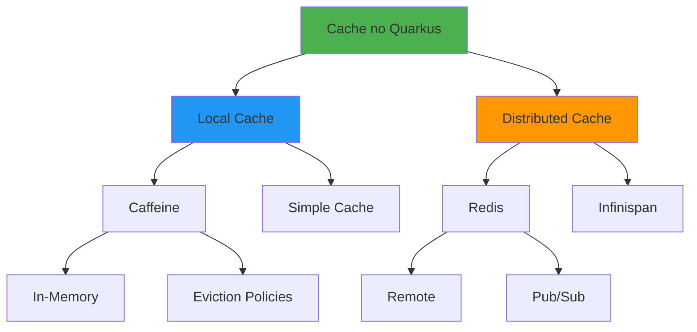
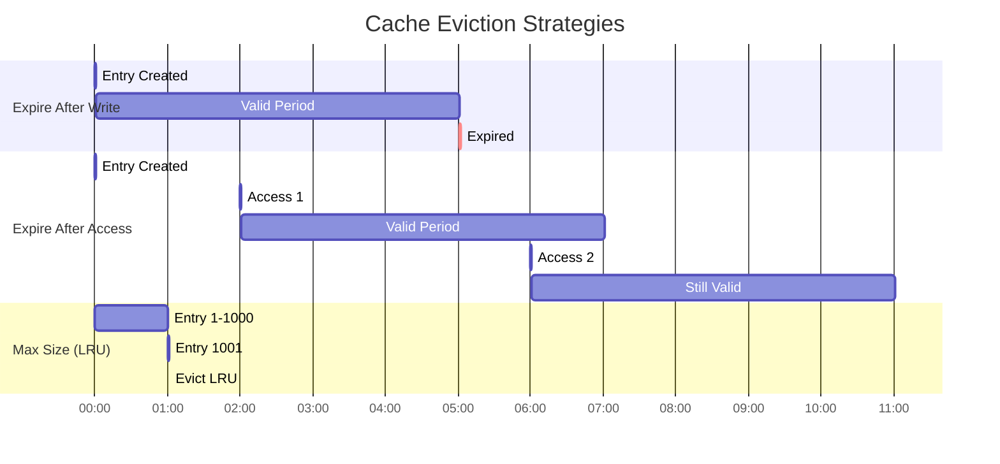
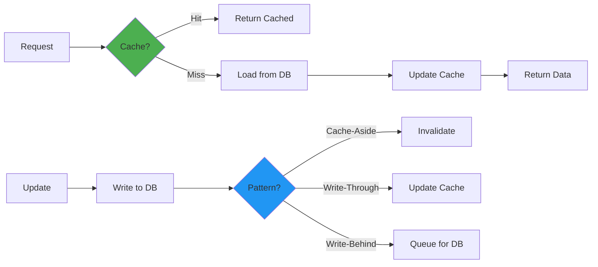

# Cache no Quarkus

## 📑 Índice

1. [Introdução](#1-introdução)
2. [Cache Annotations](#2-cache-annotations)
3. [Caffeine Cache](#3-caffeine-cache)
4. [Redis Cache](#4-redis-cache)
5. [Cache Patterns](#5-cache-patterns)
6. [Cache Strategies](#6-cache-strategies)
7. [Distributed Cache](#7-distributed-cache)
8. [Cache Eviction](#8-cache-eviction)
9. [Observabilidade](#9-observabilidade)
10. [Testes](#10-testes)
11. [Best Practices](#11-best-practices)
12. [Troubleshooting](#12-troubleshooting)
13. [Recursos](#13-recursos)

---

## 1. 📚 **Introdução**

### 1.1. O que é Cache?

**Cache** armazena dados frequentemente acessados em memória para melhorar performance.

**Analogia:** Cache é como uma **gaveta de utensílios na cozinha**:
- 🏃‍♂️ Acesso rápido ao que você usa mais
- 💾 Evita ir ao armário principal toda vez
- 🔄 Guarda cópias dos itens mais usados
- 🧹 Periodicamente precisa limpar

### 1.2. Tipos de Cache no Quarkus



### 1.3. Comparação

| Tipo | Scope | Performance | Clustering | Persistência |
|------|-------|-------------|------------|--------------|
| **Caffeine** | Local JVM | ⚡ Muito alta | ❌ Não | ❌ Não |
| **Redis** | Distributed | ⚡ Alta | ✅ Sim | ✅ Sim |
| **Infinispan** | Distributed | ⚡ Alta | ✅ Sim | ✅ Sim |

### 1.4. Setup

**Caffeine (Local Cache):**
```xml
<dependency>
    <groupId>io.quarkus</groupId>
    <artifactId>quarkus-cache</artifactId>
</dependency>
```

**Redis:**
```xml
<dependency>
    <groupId>io.quarkus</groupId>
    <artifactId>quarkus-redis-cache</artifactId>
</dependency>
<dependency>
    <groupId>io.quarkus</groupId>
    <artifactId>quarkus-redis-client</artifactId>
</dependency>
```

---

## 2. 🏷️ **Cache Annotations**

### 2.1. @CacheResult

Cacheia o resultado de um método:

```java
package com.example.cache;

import io.quarkus.cache.CacheResult;
import jakarta.enterprise.context.ApplicationScoped;
import org.jboss.logging.Logger;

/**
 * Service com cache de resultados.
 */
@ApplicationScoped
public class ProductService {
    
    private static final Logger LOG = Logger.getLogger(ProductService.class);
    
    /**
     * Cacheia resultado por productId.
     * Primeira chamada: executa método e cacheia
     * Próximas chamadas: retorna do cache
     */
    @CacheResult(cacheName = "products")
    public Product findById(Long productId) {
        LOG.infof("Cache MISS - Loading product: %d", productId);
        
        // Operação custosa (DB, API externa, etc)
        Product product = database.findProduct(productId);
        
        return product;
    }
    
    /**
     * Cache com múltiplos parâmetros.
     * Cache key = categoryId + page + size
     */
    @CacheResult(cacheName = "product-list")
    public List<Product> findByCategory(Long categoryId, int page, int size) {
        LOG.infof("Cache MISS - Loading category: %d, page: %d", categoryId, page);
        
        return database.findProductsByCategory(categoryId, page, size);
    }
    
    /**
     * Cache com objeto complexo como parâmetro.
     */
    @CacheResult(cacheName = "product-search")
    public List<Product> search(ProductFilter filter) {
        LOG.infof("Cache MISS - Searching with filter: %s", filter);
        
        return database.searchProducts(filter);
    }
}
```

**Comportamento:**
```java
// 1ª chamada - Cache MISS
Product p1 = productService.findById(1L); 
// LOG: "Cache MISS - Loading product: 1"
// Executa método, cacheia resultado

// 2ª chamada - Cache HIT
Product p2 = productService.findById(1L);
// Retorna do cache (sem log)
// Não executa método

// 3ª chamada com ID diferente - Cache MISS
Product p3 = productService.findById(2L);
// LOG: "Cache MISS - Loading product: 2"
// Executa método, cacheia resultado
```

### 2.2. @CacheInvalidate

Remove entrada do cache:

```java
package com.example.cache;

import io.quarkus.cache.CacheInvalidate;
import io.quarkus.cache.CacheResult;
import jakarta.enterprise.context.ApplicationScoped;

/**
 * Service com invalidação de cache.
 */
@ApplicationScoped
public class UserService {
    
    @CacheResult(cacheName = "users")
    public User findById(Long userId) {
        LOG.infof("Loading user: %d", userId);
        return database.findUser(userId);
    }
    
    /**
     * Invalida entrada específica do cache.
     */
    @CacheInvalidate(cacheName = "users")
    public void update(Long userId, User user) {
        LOG.infof("Updating user: %d", userId);
        database.updateUser(userId, user);
        // Cache invalidado automaticamente para este userId
    }
    
    /**
     * Invalida entrada específica do cache.
     */
    @CacheInvalidate(cacheName = "users")
    public void delete(Long userId) {
        LOG.infof("Deleting user: %d", userId);
        database.deleteUser(userId);
        // Cache invalidado automaticamente
    }
}
```

**Exemplo de uso:**
```java
// Carregar usuário (cache miss)
User user1 = userService.findById(1L);
// LOG: "Loading user: 1"

// Carregar novamente (cache hit)
User user2 = userService.findById(1L);
// Retorna do cache (sem log)

// Atualizar usuário (invalida cache)
userService.update(1L, updatedUser);
// LOG: "Updating user: 1"

// Carregar novamente (cache miss - foi invalidado)
User user3 = userService.findById(1L);
// LOG: "Loading user: 1"
```

### 2.3. @CacheInvalidateAll

Remove todas as entradas do cache:

```java
package com.example.cache;

import io.quarkus.cache.CacheInvalidateAll;
import io.quarkus.cache.CacheResult;
import jakarta.enterprise.context.ApplicationScoped;

/**
 * Service com invalidação total do cache.
 */
@ApplicationScoped
public class CategoryService {
    
    @CacheResult(cacheName = "categories")
    public Category findById(Long categoryId) {
        LOG.infof("Loading category: %d", categoryId);
        return database.findCategory(categoryId);
    }
    
    @CacheResult(cacheName = "categories")
    public List<Category> findAll() {
        LOG.info("Loading all categories");
        return database.findAllCategories();
    }
    
    /**
     * Invalida TODO o cache de categories.
     */
    @CacheInvalidateAll(cacheName = "categories")
    public Category create(Category category) {
        LOG.info("Creating new category");
        Category saved = database.saveCategory(category);
        // TODO o cache "categories" é limpo
        return saved;
    }
    
    /**
     * Invalida múltiplos caches.
     */
    @CacheInvalidateAll(cacheName = "categories")
    @CacheInvalidateAll(cacheName = "products")
    public void rebuildHierarchy() {
        LOG.info("Rebuilding category hierarchy");
        database.rebuildHierarchy();
        // Limpa ambos os caches
    }
}
```

### 2.4. Custom Cache Key

Customizar como a chave do cache é gerada:

```java
package com.example.cache;

import io.quarkus.cache.CacheKey;
import io.quarkus.cache.CacheResult;
import jakarta.enterprise.context.ApplicationScoped;

/**
 * Cache com chaves customizadas.
 */
@ApplicationScoped
public class OrderService {
    
    /**
     * Cache key = apenas customerId (ignora status).
     */
    @CacheResult(cacheName = "customer-orders")
    public List<Order> findByCustomer(
        @CacheKey Long customerId,  // Apenas customerId é usado na key
        String status               // status é ignorado na key
    ) {
        LOG.infof("Loading orders for customer: %d with status: %s", customerId, status);
        return database.findOrders(customerId, status);
    }
    
    /**
     * Cache key composta (userId + date).
     */
    @CacheResult(cacheName = "user-activity")
    public List<Activity> findUserActivity(
        @CacheKey Long userId,
        @CacheKey LocalDate date,
        int limit  // limit não faz parte da key
    ) {
        LOG.infof("Loading activity for user: %d on date: %s", userId, date);
        return database.findActivity(userId, date, limit);
    }
    
    /**
     * Cache key customizada com método.
     */
    @CacheResult(cacheName = "complex-search")
    public List<Result> complexSearch(SearchCriteria criteria) {
        LOG.infof("Complex search with: %s", criteria);
        return database.search(criteria);
    }
}

/**
 * SearchCriteria deve implementar equals/hashCode para ser cache key.
 */
record SearchCriteria(
    String keyword,
    List<String> categories,
    PriceRange priceRange
) {
    // equals/hashCode gerados automaticamente pelo record
}
```

### 2.5. Conditional Caching

Cachear condicionalmente:

```java
package com.example.cache;

import io.quarkus.cache.CacheResult;
import jakarta.enterprise.context.ApplicationScoped;

/**
 * Cache condicional.
 */
@ApplicationScoped
public class ReportService {
    
    /**
     * Cacheia apenas se userId não for nulo.
     */
    @CacheResult(cacheName = "reports")
    public Report generateReport(Long userId, String reportType) {
        if (userId == null) {
            // Não cacheia para usuários anônimos
            return generateAnonymousReport(reportType);
        }
        
        LOG.infof("Generating report for user: %d, type: %s", userId, reportType);
        return generateUserReport(userId, reportType);
    }
    
    /**
     * Cache com lógica condicional interna.
     */
    @CacheResult(cacheName = "expensive-data")
    public Data loadData(String key) {
        // Cacheia resultado, mas pode ter lógica condicional interna
        if (isDataCacheable(key)) {
            return loadExpensiveData(key);
        }
        
        return loadQuickData(key);
    }
}
```

### 2.6. Lock do Cache

Controlar concorrência no cache:

```java
package com.example.cache;

import io.quarkus.cache.CacheResult;
import jakarta.enterprise.context.ApplicationScoped;
import java.util.concurrent.locks.Lock;
import java.util.concurrent.locks.ReentrantLock;

/**
 * Cache com controle de concorrência.
 */
@ApplicationScoped
public class DataService {
    
    private final Lock cacheLock = new ReentrantLock();
    
    /**
     * Apenas uma thread por vez pode popular o cache.
     */
    @CacheResult(cacheName = "shared-data", lockTimeout = 5000)
    public Data loadData(String key) {
        // Quarkus gerencia lock automaticamente
        // Se múltiplas threads chamarem simultaneamente,
        // apenas uma executa, outras aguardam
        
        LOG.infof("Loading data for key: %s", key);
        
        // Operação cara (3 segundos)
        Thread.sleep(3000);
        
        return fetchExpensiveData(key);
    }
}
```

---

## 3. ☕ **Caffeine Cache**

### 3.1. Configuração Básica

```properties
# ═══════════════════════════════════════════════════════════════
# CAFFEINE CACHE - CONFIGURAÇÕES
# ═══════════════════════════════════════════════════════════════

# Cache "products"
quarkus.cache.caffeine."products".initial-capacity=100
quarkus.cache.caffeine."products".maximum-size=1000
quarkus.cache.caffeine."products".expire-after-write=10M

# Cache "users"
quarkus.cache.caffeine."users".initial-capacity=50
quarkus.cache.caffeine."users".maximum-size=500
quarkus.cache.caffeine."users".expire-after-access=30M

# Cache "sessions"
quarkus.cache.caffeine."sessions".initial-capacity=200
quarkus.cache.caffeine."sessions".maximum-size=5000
quarkus.cache.caffeine."sessions".expire-after-write=2H

# Métricas
quarkus.cache.caffeine."products".metrics-enabled=true
quarkus.cache.caffeine."users".metrics-enabled=true
```

### 3.2. Eviction Policies

```properties
# ═══════════════════════════════════════════════════════════════
# EVICTION POLICIES
# ═══════════════════════════════════════════════════════════════

# Baseado em tamanho (LRU - Least Recently Used)
quarkus.cache.caffeine."size-based".maximum-size=1000

# Baseado em tempo desde escrita
quarkus.cache.caffeine."time-write".expire-after-write=5M

# Baseado em tempo desde último acesso
quarkus.cache.caffeine."time-access".expire-after-access=10M

# Combinado (o que ocorrer primeiro)
quarkus.cache.caffeine."combined".maximum-size=500
quarkus.cache.caffeine."combined".expire-after-write=15M
quarkus.cache.caffeine."combined".expire-after-access=30M

# Weak keys/values (GC pode remover)
quarkus.cache.caffeine."weak".weak-keys=true
quarkus.cache.caffeine."weak".weak-values=true

# Soft values (GC remove se memória baixa)
quarkus.cache.caffeine."soft".soft-values=true
```

**Comportamento:**



### 3.3. Programmatic Cache Access

```java
package com.example.cache;

import io.quarkus.cache.Cache;
import io.quarkus.cache.CacheName;
import io.smallrye.mutiny.Uni;
import jakarta.enterprise.context.ApplicationScoped;
import jakarta.inject.Inject;
import java.util.concurrent.CompletableFuture;

/**
 * Acesso programático ao cache.
 */
@ApplicationScoped
public class CacheManager {
    
    @Inject
    @CacheName("products")
    Cache productCache;
    
    @Inject
    @CacheName("users")
    Cache userCache;
    
    /**
     * Obter valor do cache ou computar se não existir.
     */
    public Product getProduct(Long productId) {
        return productCache.get(productId, id -> {
            LOG.infof("Cache miss - loading product: %d", id);
            return database.findProduct(id);
        }).await().indefinitely();
    }
    
    /**
     * Versão assíncrona com Uni.
     */
    public Uni<Product> getProductAsync(Long productId) {
        return productCache.get(productId, id -> {
            return Uni.createFrom().item(() -> database.findProduct(id));
        });
    }
    
    /**
     * Versão assíncrona com CompletableFuture.
     */
    public CompletableFuture<Product> getProductFuture(Long productId) {
        return productCache.get(productId, id -> {
            return CompletableFuture.supplyAsync(() -> database.findProduct(id));
        }).subscribeAsCompletionStage();
    }
    
    /**
     * Colocar valor diretamente no cache.
     */
    public void putProduct(Long productId, Product product) {
        productCache.as(CaffeineCache.class)
            .put(productId, product);
    }
    
    /**
     * Verificar se existe no cache.
     */
    public boolean hasProduct(Long productId) {
        return productCache.as(CaffeineCache.class)
            .getIfPresent(productId) != null;
    }
    
    /**
     * Invalidar entrada específica.
     */
    public void invalidateProduct(Long productId) {
        productCache.invalidate(productId).await().indefinitely();
    }
    
    /**
     * Invalidar todo o cache.
     */
    public void invalidateAllProducts() {
        productCache.invalidateAll().await().indefinitely();
    }
    
    /**
     * Obter estatísticas do cache.
     */
    public CacheStats getProductCacheStats() {
        CaffeineCache caffeine = productCache.as(CaffeineCache.class);
        com.github.benmanes.caffeine.cache.Cache<Object, Object> nativeCache = 
            caffeine.getNativeCache();
        
        com.github.benmanes.caffeine.cache.stats.CacheStats stats = 
            nativeCache.stats();
        
        return new CacheStats(
            stats.hitCount(),
            stats.missCount(),
            stats.hitRate(),
            stats.evictionCount(),
            nativeCache.estimatedSize()
        );
    }
}

record CacheStats(
    long hits,
    long misses,
    double hitRate,
    long evictions,
    long size
) {}
```

### 3.4. Cache Warming

```java
package com.example.cache;

import io.quarkus.runtime.StartupEvent;
import jakarta.enterprise.context.ApplicationScoped;
import jakarta.enterprise.event.Observes;
import jakarta.inject.Inject;

/**
 * Pre-popular cache no startup.
 */
@ApplicationScoped
public class CacheWarmer {
    
    @Inject
    ProductService productService;
    
    @Inject
    CategoryService categoryService;
    
    /**
     * Warm up cache quando aplicação inicia.
     */
    void onStart(@Observes StartupEvent event) {
        LOG.info("Warming up caches...");
        
        warmupProducts();
        warmupCategories();
        
        LOG.info("Cache warmup completed");
    }
    
    private void warmupProducts() {
        // Carregar produtos mais populares
        List<Long> popularProductIds = database.getMostPopularProductIds(100);
        
        popularProductIds.forEach(id -> {
            try {
                productService.findById(id);  // Popula cache
            } catch (Exception e) {
                LOG.warnf("Failed to warm up product: %d", id);
            }
        });
        
        LOG.infof("Warmed up %d products", popularProductIds.size());
    }
    
    private void warmupCategories() {
        // Carregar todas as categorias (quantidade pequena)
        categoryService.findAll();  // Popula cache
        
        LOG.info("Warmed up all categories");
    }
}
```

### 3.5. Cache Metrics

```java
package com.example.cache;

import io.micrometer.core.instrument.MeterRegistry;
import io.micrometer.core.instrument.Tag;
import io.quarkus.cache.Cache;
import io.quarkus.cache.CacheName;
import io.quarkus.scheduler.Scheduled;
import jakarta.enterprise.context.ApplicationScoped;
import jakarta.inject.Inject;
import java.util.Arrays;

/**
 * Exportar métricas de cache.
 */
@ApplicationScoped
public class CacheMetrics {
    
    @Inject
    MeterRegistry registry;
    
    @Inject
    @CacheName("products")
    Cache productCache;
    
    /**
     * Atualizar métricas periodicamente.
     */
    @Scheduled(every = "30s")
    void updateMetrics() {
        CaffeineCache caffeine = productCache.as(CaffeineCache.class);
        com.github.benmanes.caffeine.cache.Cache<Object, Object> nativeCache = 
            caffeine.getNativeCache();
        
        com.github.benmanes.caffeine.cache.stats.CacheStats stats = 
            nativeCache.stats();
        
        Iterable<Tag> tags = Arrays.asList(Tag.of("cache", "products"));
        
        // Hit rate
        registry.gauge("cache.hit.rate", tags, stats.hitRate());
        
        // Size
        registry.gauge("cache.size", tags, nativeCache.estimatedSize());
        
        // Evictions
        registry.gauge("cache.evictions", tags, stats.evictionCount());
        
        // Load time
        registry.gauge("cache.load.average.time", tags, 
            stats.averageLoadPenalty() / 1_000_000); // Convert to ms
    }
}
```

---

## 4. 🔴 **Redis Cache**

### 4.1. Configuração

```properties
# ═══════════════════════════════════════════════════════════════
# REDIS CACHE - CONFIGURAÇÕES
# ═══════════════════════════════════════════════════════════════

# Redis Connection
quarkus.redis.hosts=redis://localhost:6379
quarkus.redis.password=secret
quarkus.redis.database=0
quarkus.redis.client-type=standalone

# Pool de conexões
quarkus.redis.max-pool-size=20
quarkus.redis.max-pool-waiting=50

# Timeout
quarkus.redis.timeout=10s

# Cache type (use Redis)
quarkus.cache.type=redis

# Cache "products" via Redis
quarkus.cache.redis."products".expire-after-write=10M
quarkus.cache.redis."products".prefix=app:products

# Cache "users" via Redis
quarkus.cache.redis."users".expire-after-write=30M
quarkus.cache.redis."users".prefix=app:users

# Cache "sessions" via Redis
quarkus.cache.redis."sessions".expire-after-write=2H
quarkus.cache.redis."sessions".prefix=app:sessions

# Serialização (JSON)
quarkus.cache.redis.value-type=java.lang.String
quarkus.cache.redis.key-type=java.lang.String

# Cluster mode (opcional)
#quarkus.redis.client-type=cluster
#quarkus.redis.hosts=redis://node1:6379,redis://node2:6379,redis://node3:6379
```

### 4.2. Redis Cache Service

```java
package com.example.cache;

import io.quarkus.cache.CacheResult;
import io.quarkus.cache.CacheInvalidate;
import io.quarkus.redis.datasource.RedisDataSource;
import io.quarkus.redis.datasource.value.ValueCommands;
import jakarta.enterprise.context.ApplicationScoped;
import jakarta.inject.Inject;
import java.time.Duration;

/**
 * Service usando Redis Cache.
 */
@ApplicationScoped
public class RedisProductService {
    
    @Inject
    RedisDataSource redisDS;
    
    /**
     * Cache via annotation (usa configuração do application.properties).
     */
    @CacheResult(cacheName = "products")
    public Product findById(Long productId) {
        LOG.infof("Cache MISS - Loading product: %d", productId);
        return database.findProduct(productId);
    }
    
    /**
     * Cache programático com controle fino.
     */
    public Product findByIdWithCustomCache(Long productId) {
        ValueCommands<String, Product> commands = 
            redisDS.value(Product.class);
        
        String key = "product:" + productId;
        
        // Tentar obter do cache
        Product product = commands.get(key);
        
        if (product != null) {
            LOG.infof("Cache HIT - product: %d", productId);
            return product;
        }
        
        // Cache miss - carregar do DB
        LOG.infof("Cache MISS - Loading product: %d", productId);
        product = database.findProduct(productId);
        
        // Salvar no cache (TTL 10 minutos)
        commands.setex(key, Duration.ofMinutes(10), product);
        
        return product;
    }
    
    /**
     * Invalidar cache.
     */
    @CacheInvalidate(cacheName = "products")
    public void update(Long productId, Product product) {
        database.updateProduct(productId, product);
    }
    
    /**
     * Invalidação programática.
     */
    public void deleteWithCustomCache(Long productId) {
        ValueCommands<String, Product> commands = 
            redisDS.value(Product.class);
        
        String key = "product:" + productId;
        
        // Deletar do DB
        database.deleteProduct(productId);
        
        // Deletar do cache
        commands.getdel(key);
    }
}
```

### 4.3. Redis com JSON Serialization

```java
package com.example.cache;

import io.quarkus.redis.datasource.RedisDataSource;
import io.quarkus.redis.datasource.value.ValueCommands;
import jakarta.enterprise.context.ApplicationScoped;
import jakarta.inject.Inject;
import com.fasterxml.jackson.databind.ObjectMapper;
import java.time.Duration;

/**
 * Cache Redis com serialização JSON customizada.
 */
@ApplicationScoped
public class JsonCacheService {
    
    @Inject
    RedisDataSource redisDS;
    
    @Inject
    ObjectMapper objectMapper;
    
    /**
     * Cachear objeto complexo como JSON.
     */
    public void cacheComplexObject(String key, ComplexData data) {
        ValueCommands<String, String> commands = redisDS.value(String.class);
        
        try {
            String json = objectMapper.writeValueAsString(data);
            commands.setex(key, Duration.ofMinutes(15), json);
            
            LOG.infof("Cached complex object: %s", key);
        } catch (Exception e) {
            LOG.errorf(e, "Failed to serialize: %s", key);
        }
    }
    
    /**
     * Recuperar objeto complexo do cache.
     */
    public ComplexData getComplexObject(String key) {
        ValueCommands<String, String> commands = redisDS.value(String.class);
        
        String json = commands.get(key);
        if (json == null) {
            return null;
        }
        
        try {
            return objectMapper.readValue(json, ComplexData.class);
        } catch (Exception e) {
            LOG.errorf(e, "Failed to deserialize: %s", key);
            return null;
        }
    }
}

record ComplexData(
    String id,
    Map<String, Object> attributes,
    List<NestedObject> nested,
    Instant timestamp
) {}
```

### 4.4. Cache-Aside Pattern (Lazy Loading)

```java
package com.example.cache;

import io.quarkus.redis.datasource.RedisDataSource;
import io.quarkus.redis.datasource.value.ValueCommands;
import jakarta.enterprise.context.ApplicationScoped;
import jakarta.inject.Inject;
import java.time.Duration;
import java.util.Optional;

/**
 * Implementação do padrão Cache-Aside.
 */
@ApplicationScoped
public class CacheAsideService {
    
    @Inject
    RedisDataSource redisDS;
    
    /**
     * Cache-Aside: verifica cache, senão carrega do DB.
     */
    public User getUser(Long userId) {
        ValueCommands<String, User> commands = redisDS.value(User.class);
        String key = "user:" + userId;
        
        // 1. Tentar cache
        User user = commands.get(key);
        if (user != null) {
            LOG.infof("Cache HIT: user:%d", userId);
            return user;
        }
        
        // 2. Cache miss - carregar do DB
        LOG.infof("Cache MISS: user:%d", userId);
        user = database.findUser(userId);
        
        if (user == null) {
            return null;
        }
        
        // 3. Salvar no cache
        commands.setex(key, Duration.ofMinutes(30), user);
        
        return user;
    }
    
    /**
     * Update: invalida cache.
     */
    public void updateUser(Long userId, User user) {
        ValueCommands<String, User> commands = redisDS.value(User.class);
        String key = "user:" + userId;
        
        // 1. Atualizar DB
        database.updateUser(userId, user);
        
        // 2. Deletar do cache (próxima leitura recarrega)
        commands.getdel(key);
        
        LOG.infof("Updated and invalidated cache: user:%d", userId);
    }
}
```

### 4.5. Write-Through Pattern

```java
package com.example.cache;

import io.quarkus.redis.datasource.RedisDataSource;
import io.quarkus.redis.datasource.value.ValueCommands;
import jakarta.enterprise.context.ApplicationScoped;
import jakarta.inject.Inject;
import jakarta.transaction.Transactional;
import java.time.Duration;

/**
 * Implementação do padrão Write-Through.
 */
@ApplicationScoped
public class WriteThroughService {
    
    @Inject
    RedisDataSource redisDS;
    
    /**
     * Write-Through: salva no DB e cache simultaneamente.
     */
    @Transactional
    public Product createProduct(Product product) {
        ValueCommands<String, Product> commands = redisDS.value(Product.class);
        
        // 1. Salvar no DB (transação)
        Product saved = database.saveProduct(product);
        
        // 2. Salvar no cache imediatamente
        String key = "product:" + saved.getId();
        commands.setex(key, Duration.ofMinutes(10), saved);
        
        LOG.infof("Created product and cached: %d", saved.getId());
        
        return saved;
    }
    
    /**
     * Write-Through: atualiza DB e cache.
     */
    @Transactional
    public Product updateProduct(Long productId, Product product) {
        ValueCommands<String, Product> commands = redisDS.value(Product.class);
        
        // 1. Atualizar DB
        Product updated = database.updateProduct(productId, product);
        
        // 2. Atualizar cache
        String key = "product:" + productId;
        commands.setex(key, Duration.ofMinutes(10), updated);
        
        LOG.infof("Updated product and cache: %d", productId);
        
        return updated;
    }
}
```

### 4.6. Write-Behind (Write-Back) Pattern

```java
package com.example.cache;

import io.quarkus.redis.datasource.RedisDataSource;
import io.quarkus.redis.datasource.value.ValueCommands;
import io.quarkus.redis.datasource.list.ListCommands;
import io.quarkus.scheduler.Scheduled;
import jakarta.enterprise.context.ApplicationScoped;
import jakarta.inject.Inject;
import jakarta.transaction.Transactional;
import java.time.Duration;
import java.util.List;

/**
 * Implementação do padrão Write-Behind.
 */
@ApplicationScoped
public class WriteBehindService {
    
    private static final String PENDING_QUEUE = "pending:updates";
    
    @Inject
    RedisDataSource redisDS;
    
    /**
     * Write-Behind: salva no cache imediatamente,
     * enfileira para salvar no DB depois.
     */
    public void updateProduct(Product product) {
        ValueCommands<String, Product> valueCommands = 
            redisDS.value(Product.class);
        ListCommands<String, Long> listCommands = 
            redisDS.list(Long.class);
        
        // 1. Salvar no cache imediatamente (resposta rápida)
        String key = "product:" + product.getId();
        valueCommands.setex(key, Duration.ofMinutes(10), product);
        
        // 2. Enfileirar ID para processamento assíncrono
        listCommands.rpush(PENDING_QUEUE, product.getId());
        
        LOG.infof("Product cached, queued for DB write: %d", product.getId());
    }
    
    /**
     * Processar fila periodicamente e persistir no DB.
     */
    @Scheduled(every = "30s")
    @Transactional
    void processPendingWrites() {
        ListCommands<String, Long> listCommands = 
            redisDS.list(Long.class);
        ValueCommands<String, Product> valueCommands = 
            redisDS.value(Product.class);
        
        // Processar até 100 itens por vez
        for (int i = 0; i < 100; i++) {
            Long productId = listCommands.lpop(PENDING_QUEUE);
            
            if (productId == null) {
                break; // Fila vazia
            }
            
            try {
                // Obter do cache
                String key = "product:" + productId;
                Product product = valueCommands.get(key);
                
                if (product != null) {
                    // Persistir no DB
                    database.saveProduct(product);
                    LOG.infof("Persisted product: %d", productId);
                }
            } catch (Exception e) {
                LOG.errorf(e, "Failed to persist product: %d", productId);
                // Re-enfileirar para retry
                listCommands.rpush(PENDING_QUEUE, productId);
            }
        }
    }
}
```

### 4.7. Redis Pub/Sub para Cache Invalidation

```java
package com.example.cache;

import io.quarkus.redis.datasource.RedisDataSource;
import io.quarkus.redis.datasource.pubsub.PubSubCommands;
import io.quarkus.redis.datasource.value.ValueCommands;
import io.quarkus.runtime.StartupEvent;
import jakarta.enterprise.context.ApplicationScoped;
import jakarta.enterprise.event.Observes;
import jakarta.inject.Inject;

/**
 * Invalidação de cache via Redis Pub/Sub.
 */
@ApplicationScoped
public class CacheInvalidationService {
    
    private static final String INVALIDATION_CHANNEL = "cache:invalidation";
    
    @Inject
    RedisDataSource redisDS;
    
    /**
     * Subscribe ao canal de invalidação no startup.
     */
    void onStart(@Observes StartupEvent event) {
        PubSubCommands<CacheInvalidationMessage> pubsub = 
            redisDS.pubsub(CacheInvalidationMessage.class);
        
        pubsub.subscribe(INVALIDATION_CHANNEL, message -> {
            LOG.infof("Received invalidation: %s", message);
            handleInvalidation(message);
        });
        
        LOG.info("Subscribed to cache invalidation channel");
    }
    
    /**
     * Publicar mensagem de invalidação para todos os nodes.
     */
    public void invalidateAcrossCluster(String cacheName, String key) {
        PubSubCommands<CacheInvalidationMessage> pubsub = 
            redisDS.pubsub(CacheInvalidationMessage.class);
        
        CacheInvalidationMessage message = new CacheInvalidationMessage(
            cacheName,
            key,
            Instant.now()
        );
        
        pubsub.publish(INVALIDATION_CHANNEL, message);
        
        LOG.infof("Published invalidation: %s:%s", cacheName, key);
    }
    
    /**
     * Processar invalidação recebida.
     */
    private void handleInvalidation(CacheInvalidationMessage message) {
        ValueCommands<String, Object> commands = redisDS.value(Object.class);
        
        String fullKey = message.cacheName() + ":" + message.key();
        
        commands.getdel(fullKey);
        
        LOG.infof("Invalidated local cache: %s", fullKey);
    }
}

record CacheInvalidationMessage(
    String cacheName,
    String key,
    Instant timestamp
) {}
```

---

## 5. 🎯 **Cache Patterns**

### 5.1. Read-Through Cache

```java
package com.example.patterns;

import io.quarkus.cache.Cache;
import io.quarkus.cache.CacheName;
import jakarta.enterprise.context.ApplicationScoped;
import jakarta.inject.Inject;

/**
 * Read-Through: cache intercepta leituras.
 */
@ApplicationScoped
public class ReadThroughService {
    
    @Inject
    @CacheName("products")
    Cache cache;
    
    @Inject
    ProductRepository repository;
    
    /**
     * Cache gerencia carregamento automaticamente.
     */
    public Product getProduct(Long productId) {
        return cache.get(productId, id -> {
            LOG.infof("Loading from database: %d", id);
            return repository.findById(id);
        }).await().indefinitely();
    }
}
```

### 5.2. Refresh-Ahead Cache

```java
package com.example.patterns;

import io.quarkus.cache.Cache;
import io.quarkus.cache.CacheName;
import io.quarkus.scheduler.Scheduled;
import jakarta.enterprise.context.ApplicationScoped;
import jakarta.inject.Inject;
import java.time.Duration;
import java.time.Instant;
import java.util.concurrent.ConcurrentHashMap;

/**
 * Refresh-Ahead: atualiza cache antes de expirar.
 */
@ApplicationScoped
public class RefreshAheadService {
    
    @Inject
    @CacheName("products")
    Cache cache;
    
    @Inject
    ProductRepository repository;
    
    // Rastrear tempo de último acesso
    private final ConcurrentHashMap<Long, Instant> lastAccess = 
        new ConcurrentHashMap<>();
    
    /**
     * Obter produto (registra acesso).
     */
    public Product getProduct(Long productId) {
        lastAccess.put(productId, Instant.now());
        
        return cache.get(productId, id -> {
            LOG.infof("Loading from database: %d", id);
            return repository.findById(id);
        }).await().indefinitely();
    }
    
    /**
     * Refresh proativo de itens frequentemente acessados.
     */
    @Scheduled(every = "5m")
    void refreshHotEntries() {
        Instant threshold = Instant.now().minus(Duration.ofMinutes(8));
        
        lastAccess.forEach((productId, lastAccessTime) -> {
            // Se acessado recentemente (últimos 8 min)
            // e cache expira em 10 min, refresh proativo
            if (lastAccessTime.isAfter(threshold)) {
                LOG.infof("Proactive refresh: product:%d", productId);
                
                Product fresh = repository.findById(productId);
                
                // Atualizar cache
                cache.as(CaffeineCache.class).put(productId, fresh);
            }
        });
        
        // Limpar entradas antigas do tracking
        lastAccess.entrySet().removeIf(entry -> 
            entry.getValue().isBefore(threshold)
        );
    }
}
```

### 5.3. Cache Warming Pattern

```java
package com.example.patterns;

import io.quarkus.cache.Cache;
import io.quarkus.cache.CacheName;
import io.quarkus.runtime.StartupEvent;
import io.quarkus.scheduler.Scheduled;
import jakarta.enterprise.context.ApplicationScoped;
import jakarta.enterprise.event.Observes;
import jakarta.inject.Inject;
import java.util.List;
import java.util.concurrent.CompletableFuture;

/**
 * Cache Warming: pre-carregar dados no cache.
 */
@ApplicationScoped
public class CacheWarmingService {
    
    @Inject
    @CacheName("products")
    Cache productCache;
    
    @Inject
    @CacheName("categories")
    Cache categoryCache;
    
    @Inject
    ProductRepository productRepository;
    
    @Inject
    CategoryRepository categoryRepository;
    
    /**
     * Warm-up no startup.
     */
    void onStart(@Observes StartupEvent event) {
        LOG.info("Starting cache warm-up...");
        warmupCaches();
        LOG.info("Cache warm-up completed");
    }
    
    /**
     * Re-warm periodicamente (durante madrugada).
     */
    @Scheduled(cron = "0 0 3 * * ?")  // 3 AM daily
    void scheduledWarmup() {
        LOG.info("Starting scheduled cache warm-up...");
        invalidateAndWarmup();
        LOG.info("Scheduled warm-up completed");
    }
    
    /**
     * Warm-up inicial.
     */
    private void warmupCaches() {
        // Parallel warm-up
        CompletableFuture<Void> products = CompletableFuture.runAsync(this::warmupProducts);
        CompletableFuture<Void> categories = CompletableFuture.runAsync(this::warmupCategories);
        
        CompletableFuture.allOf(products, categories).join();
    }
    
    /**
     * Warm-up de produtos.
     */
    private void warmupProducts() {
        // Top 100 produtos mais vendidos
        List<Long> topProductIds = productRepository.getTopSellingIds(100);
        
        topProductIds.parallelStream().forEach(id -> {
            try {
                Product product = productRepository.findById(id);
                productCache.as(CaffeineCache.class).put(id, product);
            } catch (Exception e) {
                LOG.warnf("Failed to warm product: %d", id);
            }
        });
        
        LOG.infof("Warmed up %d products", topProductIds.size());
    }
    
    /**
     * Warm-up de categorias.
     */
    private void warmupCategories() {
        List<Category> allCategories = categoryRepository.findAll();
        
        allCategories.forEach(category -> {
            categoryCache.as(CaffeineCache.class)
                .put(category.getId(), category);
        });
        
        LOG.infof("Warmed up %d categories", allCategories.size());
    }
    
    /**
     * Invalidar e re-warm.
     */
    private void invalidateAndWarmup() {
        // Limpar caches
        productCache.invalidateAll().await().indefinitely();
        categoryCache.invalidateAll().await().indefinitely();
        
        // Re-warm
        warmupCaches();
    }
}
```

### 5.4. Multi-Level Cache

```java
package com.example.patterns;

import io.quarkus.cache.Cache;
import io.quarkus.cache.CacheName;
import io.quarkus.redis.datasource.RedisDataSource;
import io.quarkus.redis.datasource.value.ValueCommands;
import jakarta.enterprise.context.ApplicationScoped;
import jakarta.inject.Inject;
import java.time.Duration;

/**
 * Multi-Level Cache: L1 (Caffeine) + L2 (Redis).
 */
@ApplicationScoped
public class MultiLevelCacheService {
    
    @Inject
    @CacheName("products-l1")  // Caffeine (local)
    Cache l1Cache;
    
    @Inject
    RedisDataSource redisDS;  // L2 (distributed)
    
    @Inject
    ProductRepository repository;
    
    /**
     * Buscar produto em múltiplos níveis de cache.
     */
    public Product getProduct(Long productId) {
        // L1 - Caffeine (mais rápido)
        Product product = getFromL1(productId);
        if (product != null) {
            LOG.infof("L1 Cache HIT: product:%d", productId);
            return product;
        }
        
        // L2 - Redis (médio)
        product = getFromL2(productId);
        if (product != null) {
            LOG.infof("L2 Cache HIT: product:%d", productId);
            // Promover para L1
            putInL1(productId, product);
            return product;
        }
        
        // L3 - Database (mais lento)
        LOG.infof("Cache MISS: product:%d - loading from DB", productId);
        product = repository.findById(productId);
        
        if (product != null) {
            // Salvar em ambos os níveis
            putInL1(productId, product);
            putInL2(productId, product);
        }
        
        return product;
    }
    
    /**
     * Obter do L1 (Caffeine).
     */
    private Product getFromL1(Long productId) {
        return l1Cache.as(CaffeineCache.class)
            .getIfPresent(productId)
            .map(obj -> (Product) obj)
            .orElse(null);
    }
    
    /**
     * Obter do L2 (Redis).
     */
    private Product getFromL2(Long productId) {
        ValueCommands<String, Product> commands = 
            redisDS.value(Product.class);
        
        String key = "product:" + productId;
        return commands.get(key);
    }
    
    /**
     * Salvar no L1.
     */
    private void putInL1(Long productId, Product product) {
        l1Cache.as(CaffeineCache.class).put(productId, product);
    }
    
    /**
     * Salvar no L2.
     */
    private void putInL2(Long productId, Product product) {
        ValueCommands<String, Product> commands = 
            redisDS.value(Product.class);
        
        String key = "product:" + productId;
        commands.setex(key, Duration.ofMinutes(30), product);
    }
    
    /**
     * Invalidar em ambos os níveis.
     */
    public void invalidateProduct(Long productId) {
        // Invalidar L1
        l1Cache.invalidate(productId).await().indefinitely();
        
        // Invalidar L2
        ValueCommands<String, Product> commands = 
            redisDS.value(Product.class);
        commands.getdel("product:" + productId);
        
        LOG.infof("Invalidated L1 and L2: product:%d", productId);
    }
}
```

### 5.5. Cache Stampede Prevention

```java
package com.example.patterns;

import io.quarkus.cache.Cache;
import io.quarkus.cache.CacheName;
import jakarta.enterprise.context.ApplicationScoped;
import jakarta.inject.Inject;
import java.util.concurrent.CompletableFuture;
import java.util.concurrent.ConcurrentHashMap;

/**
 * Prevenir Cache Stampede (thundering herd).
 */
@ApplicationScoped
public class StampedePreventionService {
    
    @Inject
    @CacheName("products")
    Cache cache;
    
    @Inject
    ProductRepository repository;
    
    // Rastrear carregamentos em andamento
    private final ConcurrentHashMap<Long, CompletableFuture<Product>> 
        inflightRequests = new ConcurrentHashMap<>();
    
    /**
     * Apenas uma thread carrega por vez para cada key.
     */
    public CompletableFuture<Product> getProduct(Long productId) {
        // Verificar cache primeiro
        Product cached = cache.as(CaffeineCache.class)
            .getIfPresent(productId)
            .map(obj -> (Product) obj)
            .orElse(null);
        
        if (cached != null) {
            return CompletableFuture.completedFuture(cached);
        }
        
        // Verificar se já está carregando
        return inflightRequests.computeIfAbsent(productId, id -> {
            LOG.infof("Starting load for product: %d", id);
            
            return CompletableFuture.supplyAsync(() -> {
                try {
                    // Carregar do DB
                    Product product = repository.findById(id);
                    
                    // Salvar no cache
                    cache.as(CaffeineCache.class).put(id, product);
                    
                    return product;
                } finally {
                    // Remover do tracking quando completo
                    inflightRequests.remove(id);
                }
            });
        });
    }
}
```

---

## 6. ⚙️ **Cache Strategies**

### 6.1. TTL Strategy (Time-To-Live)

```java
package com.example.strategies;

import io.quarkus.redis.datasource.RedisDataSource;
import io.quarkus.redis.datasource.value.ValueCommands;
import jakarta.enterprise.context.ApplicationScoped;
import jakarta.inject.Inject;
import java.time.Duration;

/**
 * Estratégia baseada em TTL.
 */
@ApplicationScoped
public class TtlStrategy {
    
    @Inject
    RedisDataSource redisDS;
    
    /**
     * TTL fixo.
     */
    public void cacheWithFixedTtl(String key, Object value) {
        ValueCommands<String, Object> commands = redisDS.value(Object.class);
        
        // TTL fixo de 10 minutos
        commands.setex(key, Duration.ofMinutes(10), value);
    }
    
    /**
     * TTL variável baseado no tipo de dado.
     */
    public void cacheWithVariableTtl(String key, Object value, DataType type) {
        ValueCommands<String, Object> commands = redisDS.value(Object.class);
        
        Duration ttl = switch (type) {
            case STATIC -> Duration.ofHours(24);      // Dados estáticos
            case SEMI_STATIC -> Duration.ofHours(1);  // Muda raramente
            case DYNAMIC -> Duration.ofMinutes(5);    // Muda frequentemente
            case REALTIME -> Duration.ofSeconds(30);  // Tempo real
        };
        
        commands.setex(key, ttl, value);
        
        LOG.infof("Cached %s with TTL: %s", key, ttl);
    }
    
    /**
     * TTL com jitter (evitar expiração simultânea).
     */
    public void cacheWithJitter(String key, Object value, Duration baseTtl) {
        ValueCommands<String, Object> commands = redisDS.value(Object.class);
        
        // Adicionar jitter aleatório (±20%)
        long baseSeconds = baseTtl.getSeconds();
        long jitter = (long) (baseSeconds * 0.2 * Math.random());
        Duration ttl = Duration.ofSeconds(baseSeconds + jitter - (baseSeconds / 10));
        
        commands.setex(key, ttl, value);
        
        LOG.infof("Cached %s with jittered TTL: %s", key, ttl);
    }
}

enum DataType {
    STATIC,
    SEMI_STATIC,
    DYNAMIC,
    REALTIME
}
```

### 6.2. LRU Strategy (Least Recently Used)

```properties
# ═══════════════════════════════════════════════════════════════
# LRU CONFIGURATION
# ═══════════════════════════════════════════════════════════════

# Caffeine (LRU automático)
quarkus.cache.caffeine."lru-cache".maximum-size=1000

# Redis LRU
quarkus.redis.maxmemory=256mb
quarkus.redis.maxmemory-policy=allkeys-lru
```

### 6.3. LFU Strategy (Least Frequently Used)

```properties
# ═══════════════════════════════════════════════════════════════
# LFU CONFIGURATION
# ═══════════════════════════════════════════════════════════════

# Redis LFU
quarkus.redis.maxmemory=256mb
quarkus.redis.maxmemory-policy=allkeys-lfu
quarkus.redis.lfu-log-factor=10
quarkus.redis.lfu-decay-time=1
```

### 6.4. Probabilistic Early Expiration

```java
package com.example.strategies;

import io.quarkus.redis.datasource.RedisDataSource;
import io.quarkus.redis.datasource.value.ValueCommands;
import jakarta.enterprise.context.ApplicationScoped;
import jakarta.inject.Inject;
import java.time.Duration;
import java.time.Instant;
import java.util.concurrent.ThreadLocalRandom;

/**
 * Expiração probabilística antecipada.
 * Previne Cache Stampede com refresh antecipado.
 */
@ApplicationScoped
public class ProbabilisticExpirationStrategy {
    
    @Inject
    RedisDataSource redisDS;
    
    @Inject
    ProductRepository repository;
    
    /**
     * Get com refresh probabilístico antes da expiração.
     */
    public Product getProduct(Long productId) {
        ValueCommands<String, Product> commands = redisDS.value(Product.class);
        String key = "product:" + productId;
        
        // Obter do cache
        Product cached = commands.get(key);
        
        if (cached != null) {
            // Verificar se deve fazer refresh antecipado
            if (shouldRefreshEarly(key)) {
                LOG.infof("Probabilistic early refresh: %s", key);
                return refreshCache(productId, key);
            }
            
            return cached;
        }
        
        // Cache miss
        return refreshCache(productId, key);
    }
    
    /**
     * Decidir se deve refresh antecipadamente.
     */
    private boolean shouldRefreshEarly(String key) {
        ValueCommands<String, Product> commands = redisDS.value(Product.class);
        
        // Obter TTL restante
        Duration ttl = commands.ttl(key);
        
        if (ttl == null || ttl.isNegative()) {
            return true;  // Já expirou
        }
        
        // TTL original: 10 minutos = 600 segundos
        long originalTtl = 600;
        long remainingTtl = ttl.getSeconds();
        
        // Fórmula: delta = currentTime - timeStored
        // beta = ln(random) * ttl * delta
        double delta = originalTtl - remainingTtl;
        double random = ThreadLocalRandom.current().nextDouble();
        double beta = Math.log(random) * remainingTtl * delta;
        
        // Se beta > 0, fazer refresh
        boolean refresh = beta > 0;
        
        LOG.debugf("TTL: %ds, Delta: %.1f, Beta: %.2f, Refresh: %s", 
            remainingTtl, delta, beta, refresh);
        
        return refresh;
    }
    
    /**
     * Refresh do cache.
     */
    private Product refreshCache(Long productId, String key) {
        ValueCommands<String, Product> commands = redisDS.value(Product.class);
        
        // Carregar fresh data
        Product product = repository.findById(productId);
        
        // Salvar com TTL original
        commands.setex(key, Duration.ofMinutes(10), product);
        
        return product;
    }
}
```

---

## 7. 🌐 **Distributed Cache**

### 7.1. Redis Cluster Setup

```properties
# ═══════════════════════════════════════════════════════════════
# REDIS CLUSTER
# ═══════════════════════════════════════════════════════════════

# Modo cluster
quarkus.redis.client-type=cluster

# Nodes do cluster
quarkus.redis.hosts=redis://node1:6379,redis://node2:6379,redis://node3:6379

# Pool
quarkus.redis.max-pool-size=50

# Retry
quarkus.redis.max-redirects=5

# Timeout
quarkus.redis.timeout=5s
```

### 7.2. Cache Replication

```java
package com.example.distributed;

import io.quarkus.redis.datasource.RedisDataSource;
import io.quarkus.redis.datasource.value.ValueCommands;
import io.quarkus.redis.datasource.pubsub.PubSubCommands;
import jakarta.enterprise.context.ApplicationScoped;
import jakarta.inject.Inject;
import java.time.Duration;

/**
 * Replicação de cache entre nodes.
 */
@ApplicationScoped
public class CacheReplicationService {
    
    private static final String REPLICATION_CHANNEL = "cache:replication";
    
    @Inject
    RedisDataSource redisDS;
    
    /**
     * Salvar e replicar para outros nodes.
     */
    public void setWithReplication(String key, Object value, Duration ttl) {
        ValueCommands<String, Object> commands = redisDS.value(Object.class);
        
        // Salvar no Redis
        commands.setex(key, ttl, value);
        
        // Publicar para replicação
        publishReplication(key, value, ttl);
    }
    
    /**
     * Publicar evento de replicação.
     */
    private void publishReplication(String key, Object value, Duration ttl) {
        PubSubCommands<ReplicationMessage> pubsub = 
            redisDS.pubsub(ReplicationMessage.class);
        
        ReplicationMessage message = new ReplicationMessage(
            key,
            value,
            ttl.getSeconds(),
            Instant.now()
        );
        
        pubsub.publish(REPLICATION_CHANNEL, message);
    }
}

record ReplicationMessage(
    String key,
    Object value,
    long ttlSeconds,
    Instant timestamp
) {}
```

### 7.3. Consistent Hashing

```java
package com.example.distributed;

import jakarta.enterprise.context.ApplicationScoped;
import java.nio.charset.StandardCharsets;
import java.security.MessageDigest;
import java.util.List;
import java.util.SortedMap;
import java.util.TreeMap;

/**
 * Consistent Hashing para distribuir cache.
 */
@ApplicationScoped
public class ConsistentHashRing {
    
    private final TreeMap<Long, String> ring = new TreeMap<>();
    private final int virtualNodesPerServer = 150;
    
    /**
     * Adicionar servidor ao ring.
     */
    public void addServer(String server) {
        for (int i = 0; i < virtualNodesPerServer; i++) {
            String virtualNode = server + "#" + i;
            long hash = hash(virtualNode);
            ring.put(hash, server);
        }
        
        LOG.infof("Added server to ring: %s (%d virtual nodes)", 
            server, virtualNodesPerServer);
    }
    
    /**
     * Remover servidor do ring.
     */
    public void removeServer(String server) {
        for (int i = 0; i < virtualNodesPerServer; i++) {
            String virtualNode = server + "#" + i;
            long hash = hash(virtualNode);
            ring.remove(hash);
        }
        
        LOG.infof("Removed server from ring: %s", server);
    }
    
    /**
     * Obter servidor para uma key.
     */
    public String getServer(String key) {
        if (ring.isEmpty()) {
            return null;
        }
        
        long hash = hash(key);
        
        // Encontrar primeiro servidor >= hash
        SortedMap<Long, String> tailMap = ring.tailMap(hash);
        
        Long serverHash = tailMap.isEmpty() ? 
            ring.firstKey() :  // Wrap around
            tailMap.firstKey();
        
        return ring.get(serverHash);
    }
    
    /**
     * Hash MD5.
     */
    private long hash(String key) {
        try {
            MessageDigest md = MessageDigest.getInstance("MD5");
            byte[] digest = md.digest(key.getBytes(StandardCharsets.UTF_8));
            
            // Usar primeiros 8 bytes como long
            long hash = 0;
            for (int i = 0; i < 8; i++) {
                hash = (hash << 8) | (digest[i] & 0xFF);
            }
            
            return hash;
        } catch (Exception e) {
            throw new RuntimeException("Hash failed", e);
        }
    }
}
```

---

## 8. 🧹 **Cache Eviction**

### 8.1. Manual Eviction

```java
package com.example.eviction;

import io.quarkus.cache.Cache;
import io.quarkus.cache.CacheName;
import io.quarkus.cache.CacheInvalidate;
import io.quarkus.cache.CacheInvalidateAll;
import jakarta.enterprise.context.ApplicationScoped;
import jakarta.inject.Inject;
import jakarta.ws.rs.*;
import jakarta.ws.rs.core.Response;

/**
 * API REST para gerenciar eviction de cache.
 */
@Path("/api/cache")
@ApplicationScoped
public class CacheEvictionResource {
    
    @Inject
    @CacheName("products")
    Cache productCache;
    
    @Inject
    @CacheName("users")
    Cache userCache;
    
    /**
     * Invalidar entrada específica.
     */
    @DELETE
    @Path("/products/{id}")
    public Response invalidateProduct(@PathParam("id") Long productId) {
        productCache.invalidate(productId).await().indefinitely();
        
        LOG.infof("Invalidated cache: product:%d", productId);
        
        return Response.ok()
            .entity(Map.of("invalidated", "product:" + productId))
            .build();
    }
    
    /**
     * Invalidar todo o cache de produtos.
     */
    @DELETE
    @Path("/products")
    public Response invalidateAllProducts() {
        productCache.invalidateAll().await().indefinitely();
        
        LOG.info("Invalidated all products cache");
        
        return Response.ok()
            .entity(Map.of("invalidated", "all products"))
            .build();
    }
    
    /**
     * Invalidar múltiplos caches.
     */
    @DELETE
    @Path("/all")
    public Response invalidateAll() {
        productCache.invalidateAll().await().indefinitely();
        userCache.invalidateAll().await().indefinitely();
        
        LOG.info("Invalidated all caches");
        
        return Response.ok()
            .entity(Map.of("invalidated", "all caches"))
            .build();
    }
    
    /**
     * Obter estatísticas do cache.
     */
    @GET
    @Path("/stats/{cacheName}")
    public Response getStats(@PathParam("cacheName") String cacheName) {
        Cache cache = switch (cacheName) {
            case "products" -> productCache;
            case "users" -> userCache;
            default -> throw new NotFoundException("Cache not found");
        };
        
        CaffeineCache caffeine = cache.as(CaffeineCache.class);
        com.github.benmanes.caffeine.cache.Cache<Object, Object> nativeCache = 
            caffeine.getNativeCache();
        
        com.github.benmanes.caffeine.cache.stats.CacheStats stats = 
            nativeCache.stats();
        
        return Response.ok(Map.of(
            "hitCount", stats.hitCount(),
            "missCount", stats.missCount(),
            "hitRate", stats.hitRate(),
            "evictionCount", stats.evictionCount(),
            "size", nativeCache.estimatedSize()
        )).build();
    }
}
```

### 8.2. Scheduled Eviction

```java
package com.example.eviction;

import io.quarkus.cache.Cache;
import io.quarkus.cache.CacheName;
import io.quarkus.scheduler.Scheduled;
import jakarta.enterprise.context.ApplicationScoped;
import jakarta.inject.Inject;
import java.time.LocalTime;

/**
 * Eviction agendada.
 */
@ApplicationScoped
public class ScheduledEvictionService {
    
    @Inject
    @CacheName("products")
    Cache productCache;
    
    @Inject
    @CacheName("reports")
    Cache reportCache;
    
    /**
     * Limpar cache durante madrugada.
     */
    @Scheduled(cron = "0 0 2 * * ?")  // 2 AM daily
    void dailyEviction() {
        LOG.info("Starting daily cache eviction...");
        
        productCache.invalidateAll().await().indefinitely();
        
        LOG.info("Daily eviction completed");
    }
    
    /**
     * Limpar cache de relatórios a cada hora.
     */
    @Scheduled(every = "1h")
    void hourlyReportEviction() {
        LOG.info("Evicting report cache");
        
        reportCache.invalidateAll().await().indefinitely();
    }
    
    /**
     * Eviction seletiva baseada em horário.
     */
    @Scheduled(every = "30m")
    void selectiveEviction() {
        LocalTime now = LocalTime.now();
        
        // Durante horário comercial, manter cache
        if (now.getHour() >= 8 && now.getHour() < 18) {
            LOG.debug("Business hours - skipping eviction");
            return;
        }
        
        // Fora do horário, pode limpar cache para liberar memória
        LOG.info("Off-hours - clearing cache");
        productCache.invalidateAll().await().indefinitely();
    }
}
```

### 8.3. Event-Based Eviction

```java
package com.example.eviction;

import io.quarkus.cache.Cache;
import io.quarkus.cache.CacheName;
import jakarta.enterprise.context.ApplicationScoped;
import jakarta.enterprise.event.Observes;
import jakarta.inject.Inject;

/**
 * Eviction baseada em eventos.
 */
@ApplicationScoped
public class EventBasedEvictionService {
    
    @Inject
    @CacheName("products")
    Cache productCache;
    
    @Inject
    @CacheName("categories")
    Cache categoryCache;
    
    /**
     * Limpar cache quando produto é atualizado.
     */
    void onProductUpdated(@Observes ProductUpdatedEvent event) {
        LOG.infof("Product updated event: %d", event.productId());
        
        // Invalidar produto específico
        productCache.invalidate(event.productId()).await().indefinitely();
        
        // Se categoria mudou, invalidar cache de categoria também
        if (event.categoryChanged()) {
            categoryCache.invalidate(event.categoryId()).await().indefinitely();
        }
    }
    
    /**
     * Limpar todo cache quando catálogo é rebuild.
     */
    void onCatalogRebuilt(@Observes CatalogRebuiltEvent event) {
        LOG.info("Catalog rebuilt - clearing all caches");
        
        productCache.invalidateAll().await().indefinitely();
        categoryCache.invalidateAll().await().indefinitely();
    }
    
    /**
     * Limpar cache quando promoção inicia/termina.
     */
    void onPromotionChanged(@Observes PromotionChangedEvent event) {
        LOG.infof("Promotion changed: %s", event.promotionId());
        
        // Invalidar produtos afetados pela promoção
        event.affectedProductIds().forEach(productId -> {
            productCache.invalidate(productId).await().indefinitely();
        });
    }
}

record ProductUpdatedEvent(
    Long productId,
    Long categoryId,
    boolean categoryChanged
) {}

record CatalogRebuiltEvent(
    String reason,
    Instant timestamp
) {}

record PromotionChangedEvent(
    String promotionId,
    List<Long> affectedProductIds
) {}
```

### 8.4. Conditional Eviction

```java
package com.example.eviction;

import io.quarkus.cache.Cache;
import io.quarkus.cache.CacheName;
import io.quarkus.scheduler.Scheduled;
import jakarta.enterprise.context.ApplicationScoped;
import jakarta.inject.Inject;
import java.time.Instant;
import java.time.Duration;

/**
 * Eviction condicional.
 */
@ApplicationScoped
public class ConditionalEvictionService {
    
    @Inject
    @CacheName("products")
    Cache productCache;
    
    @Inject
    MemoryMonitor memoryMonitor;
    
    /**
     * Eviction baseada em uso de memória.
     */
    @Scheduled(every = "5m")
    void memoryBasedEviction() {
        double memoryUsage = memoryMonitor.getUsagePercentage();
        
        if (memoryUsage > 80) {
            LOG.warnf("High memory usage: %.1f%% - clearing cache", memoryUsage);
            productCache.invalidateAll().await().indefinitely();
            
            // Force GC
            System.gc();
        } else if (memoryUsage > 60) {
            LOG.infof("Moderate memory usage: %.1f%% - partial eviction", memoryUsage);
            partialEviction();
        }
    }
    
    /**
     * Eviction parcial (remove metade das entradas).
     */
    private void partialEviction() {
        CaffeineCache caffeine = productCache.as(CaffeineCache.class);
        com.github.benmanes.caffeine.cache.Cache<Object, Object> nativeCache = 
            caffeine.getNativeCache();
        
        long currentSize = nativeCache.estimatedSize();
        long targetSize = currentSize / 2;
        
        // Força eviction até atingir tamanho alvo
        nativeCache.cleanUp();
        
        LOG.infof("Partial eviction: %d -> %d entries", 
            currentSize, nativeCache.estimatedSize());
    }
}
```

---

## 9. 📊 **Observabilidade**

### 9.1. Micrometer Metrics

```java
package com.example.observability;

import io.micrometer.core.instrument.MeterRegistry;
import io.micrometer.core.instrument.Timer;
import io.micrometer.core.instrument.Counter;
import io.quarkus.cache.Cache;
import io.quarkus.cache.CacheName;
import jakarta.enterprise.context.ApplicationScoped;
import jakarta.inject.Inject;

/**
 * Métricas de cache com Micrometer.
 */
@ApplicationScoped
public class CacheMetricsService {
    
    @Inject
    MeterRegistry registry;
    
    @Inject
    @CacheName("products")
    Cache productCache;
    
    @Inject
    ProductRepository repository;
    
    private final Timer cacheGetTimer;
    private final Counter cacheHitCounter;
    private final Counter cacheMissCounter;
    
    public CacheMetricsService(MeterRegistry registry) {
        this.registry = registry;
        
        this.cacheGetTimer = Timer.builder("cache.get")
            .tag("cache", "products")
            .description("Time to get from cache")
            .register(registry);
        
        this.cacheHitCounter = Counter.builder("cache.hit")
            .tag("cache", "products")
            .description("Cache hits")
            .register(registry);
        
        this.cacheMissCounter = Counter.builder("cache.miss")
            .tag("cache", "products")
            .description("Cache misses")
            .register(registry);
    }
    
    /**
     * Get com métricas.
     */
    public Product getProduct(Long productId) {
        return cacheGetTimer.record(() -> {
            Product product = productCache.as(CaffeineCache.class)
                .getIfPresent(productId)
                .map(obj -> (Product) obj)
                .orElse(null);
            
            if (product != null) {
                cacheHitCounter.increment();
                return product;
            }
            
            // Cache miss
            cacheMissCounter.increment();
            
            product = repository.findById(productId);
            
            if (product != null) {
                productCache.as(CaffeineCache.class).put(productId, product);
            }
            
            return product;
        });
    }
}
```

### 9.2. Cache Health Checks

```java
package com.example.observability;

import io.quarkus.cache.Cache;
import io.quarkus.cache.CacheName;
import io.quarkus.redis.datasource.RedisDataSource;
import org.eclipse.microprofile.health.HealthCheck;
import org.eclipse.microprofile.health.HealthCheckResponse;
import org.eclipse.microprofile.health.Liveness;
import org.eclipse.microprofile.health.Readiness;
import jakarta.enterprise.context.ApplicationScoped;
import jakarta.inject.Inject;

/**
 * Health checks para cache.
 */
@Liveness
@ApplicationScoped
public class CacheLivenessCheck implements HealthCheck {
    
    @Inject
    @CacheName("products")
    Cache productCache;
    
    @Override
    public HealthCheckResponse call() {
        try {
            // Verificar se cache está acessível
            CaffeineCache caffeine = productCache.as(CaffeineCache.class);
            com.github.benmanes.caffeine.cache.Cache<Object, Object> nativeCache = 
                caffeine.getNativeCache();
            
            long size = nativeCache.estimatedSize();
            
            return HealthCheckResponse.up("cache-liveness")
                .withData("cache_size", size)
                .build();
        } catch (Exception e) {
            return HealthCheckResponse.down("cache-liveness")
                .withData("error", e.getMessage())
                .build();
        }
    }
}

/**
 * Readiness check para Redis.
 */
@Readiness
@ApplicationScoped
class RedisReadinessCheck implements HealthCheck {
    
    @Inject
    RedisDataSource redisDS;
    
    @Override
    public HealthCheckResponse call() {
        try {
            // Ping Redis
            redisDS.execute("PING");
            
            return HealthCheckResponse.up("redis-cache")
                .withData("status", "connected")
                .build();
        } catch (Exception e) {
            return HealthCheckResponse.down("redis-cache")
                .withData("error", e.getMessage())
                .build();
        }
    }
}
```

### 9.3. Structured Logging

```java
package com.example.observability;

import io.quarkus.cache.Cache;
import io.quarkus.cache.CacheName;
import jakarta.enterprise.context.ApplicationScoped;
import jakarta.inject.Inject;
import org.jboss.logging.Logger;
import org.jboss.logging.MDC;

/**
 * Logging estruturado para cache.
 */
@ApplicationScoped
public class CacheLoggingService {
    
    private static final Logger LOG = Logger.getLogger(CacheLoggingService.class);
    
    @Inject
    @CacheName("products")
    Cache productCache;
    
    @Inject
    ProductRepository repository;
    
    /**
     * Get com logging estruturado.
     */
    public Product getProduct(Long productId) {
        Instant start = Instant.now();
        
        try {
            MDC.put("cache_name", "products");
            MDC.put("product_id", productId);
            
            Product product = productCache.as(CaffeineCache.class)
                .getIfPresent(productId)
                .map(obj -> (Product) obj)
                .orElse(null);
            
            if (product != null) {
                MDC.put("cache_status", "HIT");
                LOG.infof("Cache hit: product:%d", productId);
                return product;
            }
            
            // Cache miss
            MDC.put("cache_status", "MISS");
            LOG.infof("Cache miss: product:%d - loading from DB", productId);
            
            product = repository.findById(productId);
            
            if (product != null) {
                productCache.as(CaffeineCache.class).put(productId, product);
                LOG.infof("Cached product:%d", productId);
            }
            
            return product;
        } finally {
            long durationMs = Duration.between(start, Instant.now()).toMillis();
            MDC.put("duration_ms", durationMs);
            
            LOG.infof("Cache operation completed in %dms", durationMs);
            
            MDC.clear();
        }
    }
}
```

### 9.4. Distributed Tracing

```java
package com.example.observability;

import io.opentelemetry.api.trace.Span;
import io.opentelemetry.api.trace.Tracer;
import io.opentelemetry.context.Scope;
import io.quarkus.cache.Cache;
import io.quarkus.cache.CacheName;
import jakarta.enterprise.context.ApplicationScoped;
import jakarta.inject.Inject;

/**
 * Tracing distribuído para cache.
 */
@ApplicationScoped
public class CacheTracingService {
    
    @Inject
    Tracer tracer;
    
    @Inject
    @CacheName("products")
    Cache productCache;
    
    @Inject
    ProductRepository repository;
    
    /**
     * Get com tracing.
     */
    public Product getProduct(Long productId) {
        Span span = tracer.spanBuilder("cache.get")
            .setAttribute("cache.name", "products")
            .setAttribute("product.id", productId)
            .startSpan();
        
        try (Scope scope = span.makeCurrent()) {
            Product product = productCache.as(CaffeineCache.class)
                .getIfPresent(productId)
                .map(obj -> (Product) obj)
                .orElse(null);
            
            if (product != null) {
                span.setAttribute("cache.hit", true);
                return product;
            }
            
            // Cache miss
            span.setAttribute("cache.hit", false);
            
            Span dbSpan = tracer.spanBuilder("db.query")
                .setAttribute("operation", "findProduct")
                .startSpan();
            
            try (Scope dbScope = dbSpan.makeCurrent()) {
                product = repository.findById(productId);
                
                if (product != null) {
                    productCache.as(CaffeineCache.class).put(productId, product);
                }
                
                return product;
            } finally {
                dbSpan.end();
            }
        } catch (Exception e) {
            span.recordException(e);
            span.setAttribute("error", true);
            throw e;
        } finally {
            span.end();
        }
    }
}
```

### 9.5. Grafana Dashboard

```json
{
  "dashboard": {
    "title": "Cache Metrics",
    "panels": [
      {
        "title": "Cache Hit Rate",
        "targets": [
          {
            "expr": "rate(cache_hit_total[5m]) / (rate(cache_hit_total[5m]) + rate(cache_miss_total[5m]))",
            "legendFormat": "{{cache}}"
          }
        ],
        "type": "graph"
      },
      {
        "title": "Cache Size",
        "targets": [
          {
            "expr": "cache_size",
            "legendFormat": "{{cache}}"
          }
        ],
        "type": "graph"
      },
      {
        "title": "Cache Evictions",
        "targets": [
          {
            "expr": "rate(cache_evictions_total[5m])",
            "legendFormat": "{{cache}}"
          }
        ],
        "type": "graph"
      },
      {
        "title": "Cache Operation Duration (p95)",
        "targets": [
          {
            "expr": "histogram_quantile(0.95, rate(cache_get_seconds_bucket[5m]))",
            "legendFormat": "{{cache}} p95"
          }
        ],
        "type": "graph"
      }
    ]
  }
}
```

---

## 10. 🧪 **Testes**

### 10.1. Testes com @QuarkusTest

```java
package com.example.cache;

import io.quarkus.test.junit.QuarkusTest;
import io.quarkus.cache.Cache;
import io.quarkus.cache.CacheName;
import org.junit.jupiter.api.Test;
import org.junit.jupiter.api.BeforeEach;
import jakarta.inject.Inject;

import static org.junit.jupiter.api.Assertions.*;

/**
 * Testes de cache.
 */
@QuarkusTest
class CacheTest {
    
    @Inject
    ProductService productService;
    
    @Inject
    @CacheName("products")
    Cache productCache;
    
    @BeforeEach
    void setUp() {
        // Limpar cache antes de cada teste
        productCache.invalidateAll().await().indefinitely();
    }
    
    @Test
    void testCacheResult() {
        // 1ª chamada - cache miss
        Product p1 = productService.findById(1L);
        assertNotNull(p1);
        
        // 2ª chamada - cache hit (mesmo objeto)
        Product p2 = productService.findById(1L);
        assertSame(p1, p2);
    }
    
    @Test
    void testCacheInvalidate() {
        // Carregar produto
        Product p1 = productService.findById(1L);
        
        // Atualizar (invalida cache)
        Product updated = new Product(1L, "Updated", 99.99);
        productService.update(1L, updated);
        
        // Próxima leitura deve buscar do DB
        Product p2 = productService.findById(1L);
        assertNotSame(p1, p2);
        assertEquals("Updated", p2.getName());
    }
    
    @Test
    void testCacheWithDifferentKeys() {
        Product p1 = productService.findById(1L);
        Product p2 = productService.findById(2L);
        
        assertNotSame(p1, p2);
        
        // Ambos devem estar em cache
        Product p1Cached = productService.findById(1L);
        Product p2Cached = productService.findById(2L);
        
        assertSame(p1, p1Cached);
        assertSame(p2, p2Cached);
    }
}
```

### 10.2. Mock de Cache

```java
package com.example.cache;

import io.quarkus.test.junit.QuarkusTest;
import io.quarkus.test.junit.mockito.InjectMock;
import org.junit.jupiter.api.Test;
import jakarta.inject.Inject;
import org.mockito.Mockito;

import static org.junit.jupiter.api.Assertions.*;
import static org.mockito.ArgumentMatchers.any;

/**
 * Testes com mock de repository.
 */
@QuarkusTest
class CacheWithMockTest {
    
    @Inject
    ProductService productService;
    
    @InjectMock
    ProductRepository repository;
    
    @Test
    void testCacheMiss() {
        Product expected = new Product(1L, "Test", 10.0);
        
        // Mock repository
        Mockito.when(repository.findById(1L))
            .thenReturn(expected);
        
        // 1ª chamada - deve chamar repository
        Product p1 = productService.findById(1L);
        assertEquals(expected, p1);
        
        // Verificar que repository foi chamado
        Mockito.verify(repository, Mockito.times(1))
            .findById(1L);
        
        // 2ª chamada - cache hit, NÃO deve chamar repository
        Product p2 = productService.findById(1L);
        assertEquals(expected, p2);
        
        // Repository ainda foi chamado apenas 1 vez
        Mockito.verify(repository, Mockito.times(1))
            .findById(1L);
    }
}
```

### 10.3. Testes de Performance

```java
package com.example.cache;

import io.quarkus.test.junit.QuarkusTest;
import org.junit.jupiter.api.Test;
import jakarta.inject.Inject;
import java.time.Duration;
import java.time.Instant;

import static org.junit.jupiter.api.Assertions.*;

/**
 * Testes de performance de cache.
 */
@QuarkusTest
class CachePerformanceTest {
    
    @Inject
    ProductService productService;
    
    @Test
    void testCachePerformance() {
        Long productId = 1L;
        
        // 1ª chamada - sem cache (lenta)
        Instant start1 = Instant.now();
        productService.findById(productId);
        Duration duration1 = Duration.between(start1, Instant.now());
        
        // 2ª chamada - com cache (rápida)
        Instant start2 = Instant.now();
        productService.findById(productId);
        Duration duration2 = Duration.between(start2, Instant.now());
        
        // Cache deve ser significativamente mais rápido
        assertTrue(duration2.toMillis() < duration1.toMillis() / 10,
            "Cache should be at least 10x faster");
        
        System.out.printf("Without cache: %dms, With cache: %dms%n",
            duration1.toMillis(), duration2.toMillis());
    }
    
    @Test
    void testCacheThroughput() {
        int iterations = 1000;
        Long productId = 1L;
        
        // Warm-up
        productService.findById(productId);
        
        // Medir throughput com cache
        Instant start = Instant.now();
        for (int i = 0; i < iterations; i++) {
            productService.findById(productId);
        }
        Duration duration = Duration.between(start, Instant.now());
        
        double throughput = (double) iterations / duration.toMillis() * 1000;
        
        System.out.printf("Throughput: %.2f ops/sec%n", throughput);
        
        // Deve processar pelo menos 10k ops/sec com cache
        assertTrue(throughput > 10000,
            "Cache throughput should be > 10k ops/sec");
    }
}
```

### 10.4. Integration Tests com Redis

```java
package com.example.cache;

import io.quarkus.test.junit.QuarkusTest;
import io.quarkus.test.junit.TestProfile;
import io.quarkus.test.junit.QuarkusTestProfile;
import org.junit.jupiter.api.Test;
import jakarta.inject.Inject;
import java.util.Map;

/**
 * Testes de integração com Redis.
 */
@QuarkusTest
@TestProfile(RedisCacheTest.Profile.class)
class RedisCacheTest {
    
    @Inject
    RedisProductService productService;
    
    @Test
    void testRedisCache() {
        // Teste similar aos anteriores, mas usando Redis
        Product p1 = productService.findById(1L);
        assertNotNull(p1);
        
        Product p2 = productService.findById(1L);
        assertEquals(p1, p2);
    }
    
    /**
     * Profile para usar Redis em testes.
     */
    public static class Profile implements QuarkusTestProfile {
        @Override
        public Map<String, String> getConfigOverrides() {
            return Map.of(
                "quarkus.cache.type", "redis",
                "quarkus.redis.devservices.enabled", "true"
            );
        }
    }
}
```

---

## 11. ✅ **Best Practices**

### 11.1. Cache Design

```java
package com.example.bestpractices;

import io.quarkus.cache.CacheResult;
import jakarta.enterprise.context.ApplicationScoped;
import java.util.Objects;

/**
 * Best practices para design de cache.
 */
@ApplicationScoped
public class CacheDesignBestPractices {
    
    /**
     * ✅ BOM: Cache key imutável e com equals/hashCode.
     */
    @CacheResult(cacheName = "good-cache")
    public Data getData(CacheKey key) {
        return fetchData(key);
    }
    
    /**
     * ❌ RUIM: Cache key mutável.
     */
    @CacheResult(cacheName = "bad-cache")
    public Data getBadData(MutableKey key) {
        // Se key mudar após cache, lookup falhará
        return fetchData(key);
    }
}

/**
 * ✅ Cache key imutável (record).
 */
record CacheKey(String tenant, Long userId) {}

/**
 * ❌ Cache key mutável.
 */
class MutableKey {
    private String value;
    
    public void setValue(String value) {
        this.value = value;  // Mutável - PROBLEMA!
    }
}
```

### 11.2. TTL Configuration

```properties
# ═══════════════════════════════════════════════════════════════
# BEST PRACTICES - TTL
# ═══════════════════════════════════════════════════════════════

# ✅ Dados estáticos - TTL longo
quarkus.cache.caffeine."static-data".expire-after-write=24H

# ✅ Dados semi-estáticos - TTL médio
quarkus.cache.caffeine."semi-static".expire-after-write=1H

# ✅ Dados dinâmicos - TTL curto
quarkus.cache.caffeine."dynamic".expire-after-write=5M

# ✅ Session data - TTL médio + access-based
quarkus.cache.caffeine."sessions".expire-after-access=30M
quarkus.cache.caffeine."sessions".expire-after-write=2H

# ✅ Tamanho máximo para evitar OutOfMemory
quarkus.cache.caffeine."products".maximum-size=10000

# ✅ Métricas habilitadas
quarkus.cache.caffeine."products".metrics-enabled=true
```

### 11.3. Error Handling

```java
package com.example.bestpractices;

import io.quarkus.cache.Cache;
import io.quarkus.cache.CacheName;
import jakarta.enterprise.context.ApplicationScoped;
import jakarta.inject.Inject;
import java.util.Optional;

/**
 * Best practices para error handling.
 */
@ApplicationScoped
public class CacheErrorHandling {
    
    @Inject
    @CacheName("products")
    Cache cache;
    
    @Inject
    ProductRepository repository;
    
    /**
     * ✅ Nunca cachear null (use Optional).
     */
    public Optional<Product> getProduct(Long productId) {
        return cache.get(productId, id -> {
            Product product = repository.findById(id);
            return Optional.ofNullable(product);
        }).await().indefinitely();
    }
    
    /**
     * ✅ Graceful degradation em erro.
     */
    public Product getProductWithFallback(Long productId) {
        try {
            return cache.get(productId, id -> {
                return repository.findById(id);
            }).await().indefinitely();
        } catch (Exception e) {
            LOG.warnf(e, "Cache failed for product:%d - using DB directly", productId);
            
            // Fallback: buscar direto do DB
            return repository.findById(productId);
        }
    }
    
    /**
     * ❌ RUIM: Cachear exceptions.
     */
    public Product getBadProduct(Long productId) {
        return cache.get(productId, id -> {
            // Se lançar exception, ela será cacheada!
            if (id < 0) {
                throw new IllegalArgumentException("Invalid ID");
            }
            return repository.findById(id);
        }).await().indefinitely();
    }
}
```

### 11.4. Memory Management

```java
package com.example.bestpractices;

import io.quarkus.cache.Cache;
import io.quarkus.cache.CacheName;
import io.quarkus.scheduler.Scheduled;
import jakarta.enterprise.context.ApplicationScoped;
import jakarta.inject.Inject;

/**
 * Best practices para gerenciamento de memória.
 */
@ApplicationScoped
public class MemoryManagement {
    
    @Inject
    @CacheName("large-objects")
    Cache cache;
    
    /**
     * ✅ Monitorar uso de memória.
     */
    @Scheduled(every = "1m")
    void monitorMemory() {
        Runtime runtime = Runtime.getRuntime();
        long maxMemory = runtime.maxMemory();
        long usedMemory = runtime.totalMemory() - runtime.freeMemory();
        double usagePercent = (double) usedMemory / maxMemory * 100;
        
        if (usagePercent > 80) {
            LOG.warnf("High memory usage: %.1f%% - clearing cache", usagePercent);
            cache.invalidateAll().await().indefinitely();
        }
    }
    
    /**
     * ✅ Limitar tamanho de objetos cacheados.
     */
    public void cacheLargeObject(String key, LargeObject obj) {
        // Verificar tamanho antes de cachear
        long estimatedSize = obj.estimatedSize();
        
        if (estimatedSize > 1_000_000) {  // 1 MB
            LOG.warnf("Object too large to cache: %s (%d bytes)", key, estimatedSize);
            return;  // Não cachear
        }
        
        cache.as(CaffeineCache.class).put(key, obj);
    }
}
```

### 11.5. Cache Checklist

✅ **Design:**
- [ ] Cache keys são imutáveis
- [ ] equals/hashCode implementados corretamente
- [ ] Não cachear objetos mutáveis
- [ ] Usar Optional para valores opcionais

✅ **Configuration:**
- [ ] TTL apropriado para tipo de dado
- [ ] Maximum size configurado
- [ ] Eviction policy adequada
- [ ] Métricas habilitadas

✅ **Error Handling:**
- [ ] Não cachear exceptions
- [ ] Graceful degradation
- [ ] Fallback para DB em erro
- [ ] Logging apropriado

✅ **Performance:**
- [ ] Cache warming para dados críticos
- [ ] Monitorar hit rate
- [ ] Evitar cache stampede
- [ ] Usar async quando possível

✅ **Operations:**
- [ ] Health checks configurados
- [ ] Métricas expostas
- [ ] Alertas para low hit rate
- [ ] Procedure para invalidação manual

---

## 12. 🔧 **Troubleshooting**

### 12.1. Low Hit Rate

**Problema:** Taxa de cache hit baixa (<50%).

**Diagnóstico:**
```java
CaffeineCache caffeine = cache.as(CaffeineCache.class);
com.github.benmanes.caffeine.cache.stats.CacheStats stats = 
    caffeine.getNativeCache().stats();

double hitRate = stats.hitRate();
System.out.printf("Hit rate: %.2f%%%n", hitRate * 100);
```

**Soluções:**

1. **TTL muito curto:**
```properties
# ❌ TTL muito curto
quarkus.cache.caffeine."products".expire-after-write=10S

# ✅ Aumentar TTL
quarkus.cache.caffeine."products".expire-after-write=10M
```

2. **Cache size muito pequeno:**
```properties
# ❌ Tamanho insuficiente
quarkus.cache.caffeine."products".maximum-size=100

# ✅ Aumentar tamanho
quarkus.cache.caffeine."products".maximum-size=10000
```

3. **Cache keys não consistentes:**
```java
// ❌ RUIM: keys diferentes para mesmo dado
@CacheResult(cacheName = "bad")
public Data getData(SearchFilter filter) {
    // Se filter não tem equals correto, cada chamada terá key diferente
    return fetch(filter);
}

// ✅ BOM: key consistente
record SearchFilter(String query, int page) {}  // equals/hashCode automático
```

### 12.2. Memory Leaks

**Problema:** Memória cresce indefinidamente.

**Diagnóstico:**
```bash
# Heap dump
jmap -dump:live,format=b,file=heap.bin <pid>

# Analisar com VisualVM ou MAT
```

**Soluções:**

1. **Configurar maximum size:**
```properties
quarkus.cache.caffeine."products".maximum-size=10000
```

2. **Configurar TTL:**
```properties
quarkus.cache.caffeine."products".expire-after-write=1H
```

3. **Usar weak/soft references:**
```properties
quarkus.cache.caffeine."products".weak-keys=true
quarkus.cache.caffeine."products".soft-values=true
```

### 12.3. Cache Stampede

**Problema:** Múltiplas threads carregam mesmo dado simultaneamente.

**Sintomas:**
- Picos de latência quando cache expira
- Múltiplas queries simultâneas ao DB

**Solução:**
```java
// ✅ Quarkus gerencia lock automaticamente
@CacheResult(cacheName = "products", lockTimeout = 5000)
public Product findById(Long id) {
    // Apenas uma thread executa por vez para cada key
    return database.findProduct(id);
}
```

### 12.4. Stale Data

**Problema:** Dados desatualizados em cache.

**Soluções:**

1. **Invalidação em updates:**
```java
@CacheInvalidate(cacheName = "products")
public void update(Long id, Product product) {
    database.updateProduct(id, product);
    // Cache invalidado automaticamente
}
```

2. **Write-through:**
```java
@Transactional
public Product save(Product product) {
    Product saved = database.save(product);
    cache.as(CaffeineCache.class).put(saved.getId(), saved);
    return saved;
}
```

3. **Eventos de invalidação:**
```java
void onProductUpdated(@Observes ProductUpdatedEvent event) {
    cache.invalidate(event.productId()).await().indefinitely();
}
```

### 12.5. Redis Connection Issues

**Problema:** Falhas de conexão com Redis.

**Diagnóstico:**
```bash
# Verificar conectividade
redis-cli -h localhost -p 6379 ping

# Verificar health
curl http://localhost:8080/q/health
```

**Soluções:**

1. **Configurar timeout e retry:**
```properties
quarkus.redis.timeout=10s
quarkus.redis.reconnect-interval=1s
quarkus.redis.max-reconnect-attempts=10
```

2. **Fallback para DB:**
```java
public Product getProduct(Long id) {
    try {
        return getFromCache(id);
    } catch (RedisConnectionException e) {
        LOG.warn("Redis unavailable - using DB", e);
        return database.findById(id);
    }
}
```

3. **Circuit breaker:**
```java
@Retry(maxRetries = 3)
@Fallback(fallbackMethod = "getFromDatabase")
public Product getFromCache(Long id) {
    return redisCache.get(id);
}

public Product getFromDatabase(Long id) {
    return database.findById(id);
}
```

---

## 13. 📚 **Recursos**

### 13.1. Documentação Oficial

- **Quarkus Cache:** https://quarkus.io/guides/cache
- **Quarkus Redis Cache:** https://quarkus.io/guides/redis-cache
- **Caffeine:** https://github.com/ben-manes/caffeine
- **Redis:** https://redis.io/docs/

### 13.2. Exemplos

```bash
# Quarkus Quickstarts
git clone https://github.com/quarkusio/quarkus-quickstarts.git
cd quarkus-quickstarts/cache-quickstart

# Redis examples
cd redis-quickstart
```

### 13.3. Ferramentas

- **Redis CLI:**
```bash
redis-cli -h localhost -p 6379
> KEYS *
> GET product:123
> TTL product:123
> FLUSHALL
```

- **Redis Insight:** UI para Redis
- **Grafana:** Dashboards de métricas
- **Prometheus:** Coleta de métricas

### 13.4. Comandos Úteis

```bash
# ═══════════════════════════════════════════════════════════════
# COMANDOS ÚTEIS
# ═══════════════════════════════════════════════════════════════

# Cache stats via API
curl http://localhost:8080/api/cache/stats/products

# Invalidar cache
curl -X DELETE http://localhost:8080/api/cache/products/123

# Health check
curl http://localhost:8080/q/health

# Métricas
curl http://localhost:8080/q/metrics

# Redis ping
redis-cli ping

# Ver todas as keys
redis-cli KEYS "product:*"

# Monitor Redis em tempo real
redis-cli MONITOR

# Limpar cache Redis
redis-cli FLUSHDB
```

---

## 📝 **Resumo**

### Quando Usar Cada Tipo de Cache

| Cenário | Recomendação | Justificativa |
|---------|--------------|---------------|
| Single instance | **Caffeine** | Mais rápido, mais simples |
| Múltiplas instâncias | **Redis** | Compartilhado entre nodes |
| Dados pequenos, hot | **Caffeine** | Latência mínima |
| Dados grandes | **Redis** | Não sobrecarrega JVM heap |
| Precisa persistência | **Redis** | Sobrevive a restarts |
| Desenvolvimento/testes | **Caffeine** | Sem dependências externas |
| Produção clustered | **Redis** | Consistência entre nodes |
| Multi-level | **Caffeine + Redis** | L1 local + L2 distribuído |

### Cache Patterns Summary



### Exemplo Completo de Produção

```java
package com.example.production;

import io.quarkus.cache.CacheResult;
import io.quarkus.cache.CacheInvalidate;
import io.micrometer.core.instrument.MeterRegistry;
import io.micrometer.core.instrument.Timer;
import jakarta.enterprise.context.ApplicationScoped;
import jakarta.inject.Inject;
import org.jboss.logging.Logger;
import org.jboss.logging.MDC;

/**
 * Exemplo completo: cache + metrics + logging + error handling.
 */
@ApplicationScoped
public class ProductionCacheService {
    
    private static final Logger LOG = Logger.getLogger(ProductionCacheService.class);
    
    @Inject
    MeterRegistry registry;
    
    @Inject
    ProductRepository repository;
    
    /**
     * Get com todas as best practices.
     */
    @CacheResult(cacheName = "products", lockTimeout = 5000)
    public Product getProduct(Long productId) {
        Instant start = Instant.now();
        
        try {
            MDC.put("product_id", productId);
            MDC.put("operation", "getProduct");
            
            LOG.infof("Loading product: %d", productId);
            
            Product product = repository.findById(productId);
            
            if (product == null) {
                LOG.warnf("Product not found: %d", productId);
                return null;
            }
            
            return product;
        } catch (Exception e) {
            LOG.errorf(e, "Failed to load product: %d", productId);
            
            // Metrics
            registry.counter("cache.error",
                "cache", "products",
                "error", e.getClass().getSimpleName()
            ).increment();
            
            throw e;
        } finally {
            long durationMs = Duration.between(start, Instant.now()).toMillis();
            MDC.put("duration_ms", durationMs);
            
            // Metrics
            Timer.builder("cache.operation")
                .tag("cache", "products")
                .tag("operation", "get")
                .register(registry)
                .record(Duration.ofMillis(durationMs));
            
            LOG.infof("Operation completed in %dms", durationMs);
            MDC.clear();
        }
    }
    
    /**
     * Update com invalidação.
     */
    @CacheInvalidate(cacheName = "products")
    public void updateProduct(Long productId, Product product) {
        try {
            MDC.put("product_id", productId);
            MDC.put("operation", "updateProduct");
            
            LOG.infof("Updating product: %d", productId);
            
            repository.update(productId, product);
            
            // Metrics
            registry.counter("cache.invalidation",
                "cache", "products",
                "reason", "update"
            ).increment();
            
        } finally {
            MDC.clear();
        }
    }
}
```

**Cache no Quarkus** oferece performance excepcional com configuração simples. Use **Caffeine para single instance** e **Redis para ambientes distribuídos**. Combine com métricas e observabilidade para máximo controle! 🚀
