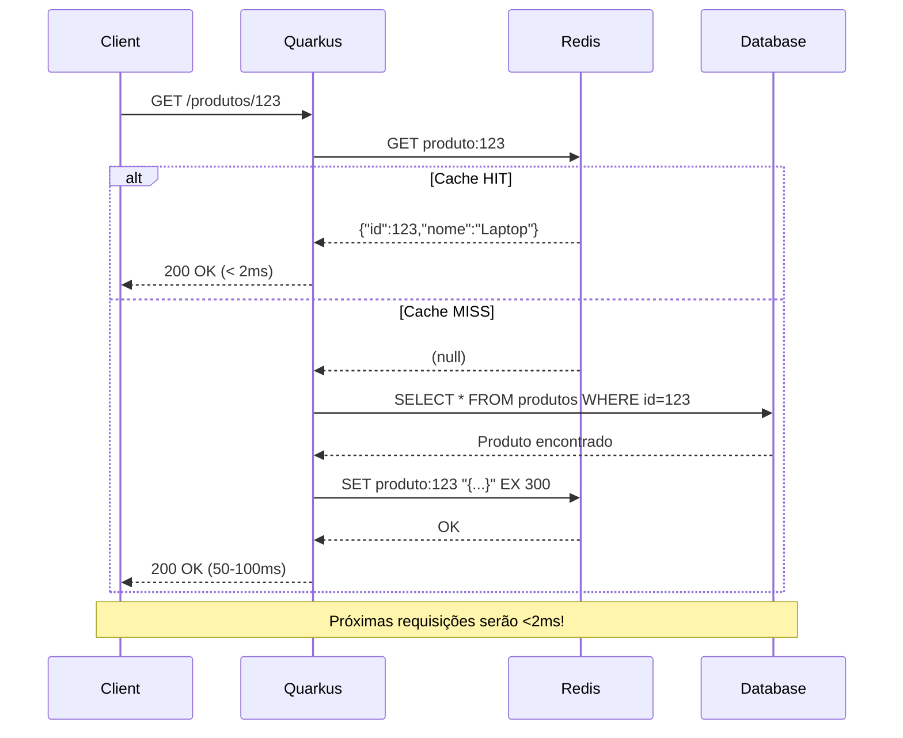
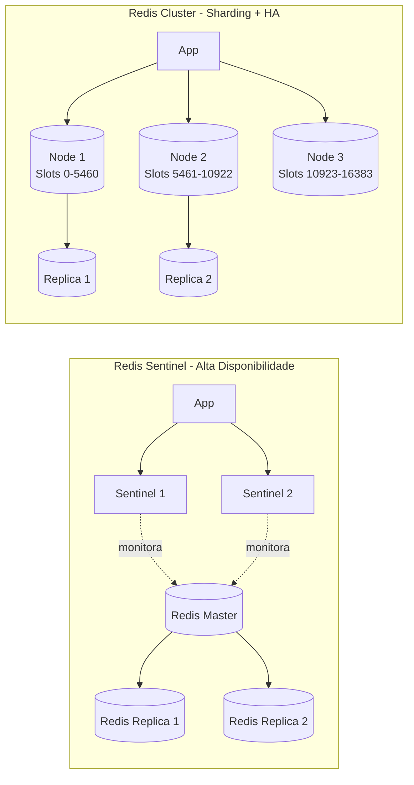

# Redis com Quarkus — Guia Completo de Cache Distribuído e Estruturas de Dados

## Índice

1. [O que é Redis?](#1-o-que-é-redis)
2. [Redis + Quarkus: A Combinação Perfeita](#2-redis--quarkus-a-combinação-perfeita)
3. [Conceitos Fundamentais](#3-conceitos-fundamentais)
4. [Setup do Projeto Quarkus](#4-setup-do-projeto-quarkus)
5. [Configuração do Redis](#5-configuração-do-redis)
6. [Cache Declarativo](#6-cache-declarativo)
7. [Redis Client Imperativo](#7-redis-client-imperativo)
8. [Estruturas de Dados Avançadas](#8-estruturas-de-dados-avançadas)
9. [Padrões Arquiteturais](#9-padrões-arquiteturais)
10. [Segurança e Performance](#10-segurança-e-performance)
11. [Testes e Qualidade](#11-testes-e-qualidade)
12. [Monitoramento e Observabilidade](#12-monitoramento-e-observabilidade)
13. [Troubleshooting](#13-troubleshooting)
14. [Recursos e Referências](#14-recursos-e-referências)

---

## 1. O que é Redis?

### 1.1. Definição

**Redis** (REmote DIctionary Server) é um armazenamento de estrutura de dados in-memory, de código aberto, usado como:
- 🚀 **Cache distribuído** de alta performance
- 💾 **Banco de dados** NoSQL
- 📨 **Message broker** para Pub/Sub
- 🔢 **Armazenamento de sessões** web
- ⚡ **Motor de filas** e processamento de eventos

Criado em 2009 por Salvatore Sanfilippo, Redis se tornou o banco de dados in-memory mais popular do mundo.

### 1.2. Características Principais

#### ⚡ Performance Excepcional
- **Latência sub-milissegundo** (< 1ms)
- **100.000+ operações por segundo** em uma única instância
- Todos os dados armazenados em **memória RAM**
- Operações **atômicas** nativas

#### 🗃️ Estruturas de Dados Ricas
Redis não é apenas chave-valor simples. Suporta:
- **Strings**: valores simples, contadores
- **Hashes**: objetos com campos
- **Lists**: listas ordenadas, filas
- **Sets**: conjuntos únicos
- **Sorted Sets**: rankings ordenados por score
- **Bitmaps**: operações de bits eficientes
- **HyperLogLogs**: contagem aproximada de cardinalidade
- **Streams**: log de eventos ordenado por tempo
- **Geospatial**: índices de localização

#### 💪 Durabilidade e Persistência
- **RDB (Redis Database)**: snapshots periódicos
- **AOF (Append Only File)**: log de todas as operações
- **Replicação** master-slave automática
- **Cluster mode** para sharding horizontal

#### 🔄 Casos de Uso Comuns

```
┌─────────────────────────────────────────────────────────────┐
│                    REDIS CASOS DE USO                       │
├─────────────────────────────────────────────────────────────┤
│                                                             │
│  1. CACHE                                                   │
│     └─ Reduzir latência de 100ms para <1ms                 │
│                                                             │
│  2. SESSION STORE                                           │
│     └─ Compartilhar sessões entre múltiplas instâncias      │
│                                                             │
│  3. RATE LIMITING                                           │
│     └─ Limitar requisições por usuário/IP                   │
│                                                             │
│  4. LEADERBOARDS                                            │
│     └─ Rankings em tempo real (jogos, vendas)              │
│                                                             │
│  5. PUB/SUB                                                 │
│     └─ Mensageria leve entre microservices                 │
│                                                             │
│  6. DISTRIBUTED LOCKS                                       │
│     └─ Coordenação em ambientes distribuídos               │
│                                                             │
│  7. REAL-TIME ANALYTICS                                     │
│     └─ Contadores, métricas, agregações instantâneas       │
│                                                             │
└─────────────────────────────────────────────────────────────┘
```

### 1.3. Por que usar Redis com Quarkus?

#### Integração Nativa
- **Extensões oficiais** mantidas pelo time Quarkus
- **Dev Services**: Redis iniciado automaticamente em dev mode
- **Configuração declarativa** via `application.properties`
- **Health checks** e métricas out-of-the-box

#### Performance Combinada
```
Tempo de Resposta (média):

Sem Cache:
  └─ Database Query: 50-200ms
  
Com Cache (Redis):
  └─ Redis GET: 0.5-2ms
  
Melhoria: 25x - 400x mais rápido! ⚡
```

#### Developer Experience
- **Live reload** preserva estado do Redis
- **Testing** simplificado com Testcontainers
- **API reativa** e imperativa
- **Type-safe** com generics Java

---

## 2. Redis + Quarkus: A Combinação Perfeita

### 2.1. Arquitetura de Integração

```
┌──────────────────────────────────────────────────────────────────┐
│                    QUARKUS APPLICATION                           │
│                                                                  │
│  ┌────────────────┐              ┌──────────────────┐          │
│  │  REST Resource │              │  Service Layer   │          │
│  │  @Path("/api") │─────────────▶│  @CacheResult    │          │
│  └────────────────┘              └─────────┬────────┘          │
│                                            │                    │
│  ┌────────────────────────────────────────┼─────────────────┐  │
│  │         Quarkus Redis Extension        │                 │  │
│  │                                        ▼                 │  │
│  │  ┌──────────────────┐    ┌────────────────────────┐    │  │
│  │  │ Cache Abstraction│    │  Redis Client (Vert.x) │    │  │
│  │  │  @CacheResult    │    │  - Reactive            │    │  │
│  │  │  @CacheInvalidate│    │  - Connection Pool     │    │  │
│  │  └──────────────────┘    └────────────────────────┘    │  │
│  └────────────────────────────────┬──────────────────────┘  │
│                                   │                          │
└───────────────────────────────────┼──────────────────────────┘
                                    │
                    ┌───────────────┴───────────────┐
                    │                               │
                    ▼                               ▼
          ┌──────────────────┐          ┌──────────────────┐
          │   Redis Master   │─────────▶│  Redis Replica   │
          │   (Primary)      │          │   (Standby)      │
          └──────────────────┘          └──────────────────┘
                    │
                    │ Persistence
                    ▼
          ┌──────────────────┐
          │  RDB + AOF Files │
          │  (Disk Storage)  │
          └──────────────────┘
```

### 2.2. Duas Abordagens de Uso

#### Abordagem 1: Cache Declarativo (Simples)

**Quando usar:**
- Cache de resultados de métodos
- Configuração simples e rápida
- Não precisa de controle fino sobre TTL

**Exemplo:**
```java
@ApplicationScoped
public class ProdutoService {
    
    @CacheResult(cacheName = "produtos")
    public Produto buscarPorId(Long id) {
        // Busca no banco
        return Produto.findById(id);
    }
    
    @CacheInvalidate(cacheName = "produtos")
    public void atualizar(Produto produto) {
        produto.persist();
    }
}
```

**Benefícios:**
- ✅ Zero código relacionado ao Redis
- ✅ Anotações declarativas
- ✅ Funciona com qualquer provider de cache
- ✅ Fácil de testar

#### Abordagem 2: Redis Client Imperativo (Controle Total)

**Quando usar:**
- Estruturas de dados complexas (Sets, Sorted Sets, Hashes)
- TTL dinâmico
- Operações atômicas (INCR, DECR)
- Pub/Sub
- Distributed locks

**Exemplo:**
```java
@ApplicationScoped
public class ContadorService {
    
    @Inject
    RedisDataSource redis;
    
    public Long incrementar(String chave) {
        return redis.value(Long.class).incr(chave);
    }
}
```

**Benefícios:**
- ✅ Controle total sobre operações Redis
- ✅ Acesso a todas as estruturas de dados
- ✅ TTL customizado por chave
- ✅ Transações e pipelines

### 2.3. Fluxo de Cache (Cache-Aside Pattern)



### 2.4. Comparação: Redis vs Alternativas

| Característica | Redis | Memcached | Caffeine | Hazelcast |
|----------------|-------|-----------|----------|-----------|
| **Tipo** | In-memory DB | Cache puro | Cache local | IMDG |
| **Estruturas de Dados** | 9+ tipos | String apenas | Cache | Map, Queue, Topic |
| **Persistência** | ✅ RDB/AOF | ❌ | ❌ | ✅ Disk |
| **Replicação** | ✅ Master-Replica | ❌ | N/A | ✅ Partitioned |
| **Pub/Sub** | ✅ Nativo | ❌ | ❌ | ✅ |
| **Cluster** | ✅ 1000+ nodes | Via proxy | N/A (local) | ✅ Auto-discovery |
| **Latência** | 0.5-2ms | 0.3-1ms | < 0.1ms (local) | 1-5ms |
| **Throughput** | 100k ops/s | 200k ops/s | 1M+ ops/s | 50k ops/s |
| **Memória** | Eficiente | Muito eficiente | Muito eficiente | Moderado |
| **Uso Principal** | Cache + DB + Broker | Cache simples | L1 cache | Grid computing |

**Escolha Redis quando:**
- ✅ Precisa de estruturas de dados além de string
- ✅ Requer persistência opcional
- ✅ Pub/Sub para eventos
- ✅ Distributed locks
- ✅ Geo-spatial queries

**Escolha Caffeine quando:**
- ✅ Cache local por JVM é suficiente
- ✅ Latência < 0.1ms é crítica
- ✅ Não precisa compartilhar entre instâncias

### 2.5. Redis no Ecossistema Quarkus

```
┌─────────────────────────────────────────────────────────────┐
│                    QUARKUS EXTENSIONS                       │
├─────────────────────────────────────────────────────────────┤
│                                                             │
│  quarkus-redis-client                                       │
│  └─ Redis client reativo (Vert.x Redis Client)             │
│                                                             │
│  quarkus-redis-cache                                        │
│  └─ Implementação de cache usando Redis                    │
│                                                             │
│  quarkus-cache                                              │
│  └─ Abstração de cache (funciona com Redis ou Caffeine)    │
│                                                             │
│  quarkus-redis-devservices                                  │
│  └─ Inicia Redis automaticamente em dev mode               │
│                                                             │
└─────────────────────────────────────────────────────────────┘

INTEGRAÇÕES COMPLEMENTARES:
├─ Hibernate ORM Second-Level Cache
├─ Quarkus Security (session store)
├─ Micrometer (métricas)
├─ SmallRye Health (health checks)
└─ OpenTelemetry (tracing)
```

---

## 3. Conceitos Fundamentais

### 3.1. Modelo de Dados: Chave-Valor

Redis armazena dados como pares **chave → valor**, onde:

```
Chave (String)              Valor (Estrutura de Dados)
├─ "usuario:1234"       →   "{'nome':'João','email':'...'}"
├─ "contador:visitas"   →   42
├─ "session:abc123"     →   Hash{campo1:valor1, campo2:valor2}
├─ "ranking:jogadores"  →   SortedSet{player1:9500, player2:8900}
└─ "fila:pedidos"       →   List[pedido1, pedido2, pedido3]
```

#### Regras de Chaves
- **Case-sensitive**: `"user:123"` ≠ `"User:123"`
- **Binário seguro**: pode conter qualquer byte
- **Tamanho máximo**: 512 MB (na prática, use < 1 KB)
- **Convenção**: use namespaces com `:` → `app:domain:entity:id`

#### Boas Práticas para Nomes de Chaves

```java
// ❌ RUIM: Genérico, sem contexto
"user"
"123"
"data"

// ⚠️ ACEITÁVEL: Falta versionamento
"user:1234"
"product:5678"

// ✅ BOM: Namespaces hierárquicos
"myapp:user:1234"
"myapp:product:5678:details"

// ✅ EXCELENTE: Versionado, contexto completo
"myapp:v2:prod:user:1234:profile"
"myapp:v2:prod:cache:product:5678:details"
"myapp:v2:prod:session:abc123"
```

### 3.2. Time To Live (TTL)

TTL define quanto tempo uma chave permanece no Redis antes de ser automaticamente deletada.

```java
// Definir TTL ao criar chave
SET usuario:1234 "{'nome':'João'}" EX 300  // Expira em 300 segundos

// Verificar TTL restante
TTL usuario:1234  // Retorna: 285 (segundos restantes)

// TTL = -1: chave sem expiração
// TTL = -2: chave não existe
```

#### Estratégias de TTL

| Estratégia | TTL | Quando Usar |
|------------|-----|-------------|
| **Muito Curto** | 1-5 min | Dados que mudam frequentemente |
| **Curto** | 5-30 min | Cache de queries comuns |
| **Médio** | 1-6 horas | Sessões de usuário |
| **Longo** | 1-7 dias | Dados quase estáticos |
| **Infinito** | Sem TTL | Contadores, configurações |

**TTL com Jitter (Evitar Thundering Herd):**
```java
// Problema: Todas as chaves expiram ao mesmo tempo
// Solução: Adicionar variação aleatória (jitter)

long ttlBase = 300; // 5 minutos
long jitter = ThreadLocalRandom.current().nextLong(0, 60); // ±1 min
Duration ttl = Duration.ofSeconds(ttlBase + jitter);
```

### 3.3. Estruturas de Dados do Redis

#### 1. STRING (Tipo Mais Simples)

```
Operações: GET, SET, INCR, DECR, APPEND, GETRANGE
Tamanho máximo: 512 MB
```

**Casos de uso:**
- Cache de objetos JSON
- Contadores atômicos
- Flags booleanas
- Tokens de autenticação

**Exemplo:**
```java
// Armazenar JSON
SET produto:123 '{"id":123,"nome":"Laptop","preco":2500}'

// Contador atômico
INCR visitas:pagina:home    // Retorna: 1
INCR visitas:pagina:home    // Retorna: 2

// Operações com TTL
SETEX session:abc123 3600 "user_data"  // Expira em 1 hora
```

#### 2. HASH (Objeto com Campos)

```
Operações: HSET, HGET, HGETALL, HINCRBY, HDEL
Ideal para: Objetos com múltiplos campos
```

**Estrutura:**
```
user:1234
├─ nome      : "João Silva"
├─ email     : "joao@example.com"
├─ idade     : "30"
└─ cidade    : "São Paulo"
```

**Exemplo:**
```java
// Criar hash
HSET user:1234 nome "João Silva"
HSET user:1234 email "joao@example.com"
HSET user:1234 idade 30

// Ou em lote
HMSET user:1234 nome "João Silva" email "joao@example.com" idade 30

// Ler campo específico
HGET user:1234 email  // Retorna: "joao@example.com"

// Ler todos os campos
HGETALL user:1234
// Retorna: {"nome":"João Silva", "email":"joao@example.com", "idade":"30"}

// Incrementar campo numérico
HINCRBY user:1234 idade 1  // Agora idade = 31
```

#### 3. LIST (Lista Ordenada)

```
Operações: LPUSH, RPUSH, LPOP, RPOP, LRANGE, LLEN
Ideal para: Filas, históricos, feeds
```

**Estrutura:**
```
fila:pedidos
[início] ← [pedido3] ← [pedido2] ← [pedido1] ← [fim]
          LPUSH ←                     → RPUSH
          LPOP →                      ← RPOP
```

**Exemplo:**
```java
// Adicionar no início (LIFO - Stack)
LPUSH historico:user:123 "logout 14:30"
LPUSH historico:user:123 "compra produto X"
LPUSH historico:user:123 "login 09:15"

// Adicionar no fim (FIFO - Queue)
RPUSH fila:emails "email1@example.com"
RPUSH fila:emails "email2@example.com"

// Ler primeiros 10 itens
LRANGE historico:user:123 0 9

// Remover e retornar primeiro item
LPOP fila:emails  // Retorna: "email1@example.com"

// Processar fila com bloqueio (worker queue)
BLPOP fila:emails 30  // Aguarda até 30s por novo item
```

#### 4. SET (Conjunto Não Ordenado)

```
Operações: SADD, SREM, SISMEMBER, SINTER, SUNION
Ideal para: Tags, relações, filtros
```

**Estrutura:**
```
tags:produto:123 = {eletrônico, laptop, Dell, 16GB}
tags:produto:456 = {eletrônico, smartphone, Samsung}

Características:
- Sem duplicatas
- Sem ordem
- Operações de conjunto (interseção, união)
```

**Exemplo:**
```java
// Adicionar tags
SADD tags:produto:123 "eletrônico" "laptop" "Dell"

// Verificar se existe
SISMEMBER tags:produto:123 "laptop"  // Retorna: 1 (true)

// Listar todas as tags
SMEMBERS tags:produto:123
// Retorna: ["eletrônico", "laptop", "Dell"]

// Operações de conjunto
SINTER tags:produto:123 tags:produto:456
// Retorna: ["eletrônico"] (tags em comum)

SUNION tags:produto:123 tags:produto:456
// Retorna: todas as tags únicas
```

#### 5. SORTED SET (Conjunto Ordenado por Score)

```
Operações: ZADD, ZRANGE, ZREVRANGE, ZRANK, ZINCRBY
Ideal para: Rankings, leaderboards, prioridades
```

**Estrutura:**
```
ranking:jogadores
├─ player1 : 9500 (score)
├─ player2 : 8900
├─ player3 : 7200
└─ player4 : 6100
```

**Exemplo:**
```java
// Adicionar scores
ZADD ranking:jogadores 9500 "player1"
ZADD ranking:jogadores 8900 "player2"
ZADD ranking:jogadores 7200 "player3"

// Top 3 (maior para menor)
ZREVRANGE ranking:jogadores 0 2 WITHSCORES
// Retorna: ["player1", 9500, "player2", 8900, "player3", 7200]

// Posição de um jogador (0-based)
ZREVRANK ranking:jogadores "player2"  // Retorna: 1 (2º lugar)

// Incrementar score
ZINCRBY ranking:jogadores 200 "player3"  // Adiciona 200 pontos
```

#### 6. STREAMS (Log de Eventos)

```
Operações: XADD, XREAD, XGROUP, XACK
Ideal para: Event sourcing, mensageria, logs
```

**Estrutura:**
```
eventos:pedidos
├─ 1693564800000-0: {tipo:"criado", pedidoId:123}
├─ 1693564801000-0: {tipo:"pago", pedidoId:123}
└─ 1693564805000-0: {tipo:"enviado", pedidoId:123}
```

**Exemplo:**
```java
// Adicionar evento
XADD eventos:pedidos * tipo "criado" pedidoId 123

// Ler últimos 10 eventos
XREVRANGE eventos:pedidos + - COUNT 10

// Consumer groups (similar ao Kafka)
XGROUP CREATE eventos:pedidos processadores $
XREADGROUP GROUP processadores consumer1 COUNT 1 STREAMS eventos:pedidos >
```

### 3.4. Comandos Essenciais

#### Gerenciamento de Chaves

```bash
# Verificar se chave existe
EXISTS usuario:1234       # Retorna: 1 (existe) ou 0 (não existe)

# Deletar chave
DEL usuario:1234

# Deletar múltiplas chaves
DEL chave1 chave2 chave3

# Expirar chave após N segundos
EXPIRE usuario:1234 300

# Verificar tempo restante (TTL)
TTL usuario:1234          # Retorna segundos restantes

# Remover expiração
PERSIST usuario:1234      # Chave nunca expira

# Renomear chave
RENAME old:key new:key

# Buscar chaves por padrão (CUIDADO em produção!)
KEYS user:*              # ❌ LENTO - bloqueia Redis
SCAN 0 MATCH user:* COUNT 100  # ✅ MELHOR - não bloqueia
```

#### Inspeção e Debug

```bash
# Tipo de dado da chave
TYPE usuario:1234        # Retorna: "hash" ou "string" ou "list"...

# Tamanho em bytes
MEMORY USAGE usuario:1234

# Info sobre o servidor
INFO
INFO memory
INFO stats

# Monitor em tempo real (debug)
MONITOR                  # ⚠️ Impacto em performance!

# Slow log (queries lentas)
SLOWLOG GET 10
```

### 3.5. Garantias e Limitações

#### ✅ Garantias do Redis

1. **Atomicidade**: Todos os comandos são atômicos
   ```java
   INCR contador  // Sempre atômico, mesmo com 1000 clientes simultâneos
   ```

2. **Single-threaded**: Comandos executam sequencialmente
   - Elimina race conditions em operações simples
   - Previsibilidade total na ordem de execução

3. **Durabilidade (opcional)**:
   - **RDB**: Snapshots periódicos
   - **AOF**: Log de todas as operações

#### ❌ Limitações do Redis

1. **Dataset limitado à RAM**
   ```
   Memória disponível: 16 GB RAM
   Redis pode usar: ~12 GB (75% recomendado)
   Custo: RAM é 10-20x mais cara que SSD
   ```

2. **Sem consultas complexas**
   ```sql
   -- ❌ NÃO SUPORTADO
   SELECT * FROM users WHERE age > 18 AND city = 'SP' ORDER BY name
   
   -- ✅ USE REDIS PARA
   GET user:1234
   HGETALL user:1234
   ZRANGE ranking 0 10
   ```

3. **Transações limitadas**
   - Sem rollback automático
   - Sem locks entre chaves
   - Use Lua scripts para operações complexas

4. **Durabilidade vs Performance**
   ```
   AOF always:    Mais seguro, menos performance
   AOF everysec:  Balanceado (padrão)
   RDB apenas:    Máxima performance, risco de perda de dados
   Sem persist.:  Ultra-rápido, dados voláteis
   ```

---

## 4. Setup do Projeto Quarkus

**pom.xml**
```xml
<dependencies>
    <!-- Redis Client Reativo -->
    <dependency>
        <groupId>io.quarkus</groupId>
        <artifactId>quarkus-redis-client</artifactId>
    </dependency>
    
    <!-- Redis Cache (abstração de cache) -->
    <dependency>
        <groupId>io.quarkus</groupId>
        <artifactId>quarkus-redis-cache</artifactId>
    </dependency>
    
    <!-- REST & JSON -->
    <dependency>
        <groupId>io.quarkus</groupId>
        <artifactId>quarkus-rest-jackson</artifactId>
    </dependency>
    
    <!-- Hibernate ORM com Panache -->
    <dependency>
        <groupId>io.quarkus</groupId>
        <artifactId>quarkus-hibernate-orm-panache</artifactId>
    </dependency>
    
    <!-- PostgreSQL -->
    <dependency>
        <groupId>io.quarkus</groupId>
        <artifactId>quarkus-jdbc-postgresql</artifactId>
    </dependency>
</dependencies>
```

**application.properties**
```properties
# Redis Configuration
quarkus.redis.hosts=redis://localhost:6379
quarkus.redis.password=minha-senha-redis
quarkus.redis.max-pool-size=20
quarkus.redis.max-pool-waiting=30

# Cache Configuration
quarkus.cache.redis.expire-after-write=5M
quarkus.cache.redis.key-prefix=app:cache:

# Database
quarkus.datasource.db-kind=postgresql
quarkus.datasource.username=postgres
quarkus.datasource.password=postgres
quarkus.datasource.jdbc.url=jdbc:postgresql://localhost:5432/productsdb

# Logging
quarkus.log.category."com.example".level=DEBUG
```

### 3.2. Entidade de Domínio

```java
package com.example.domain;

import io.quarkus.hibernate.orm.panache.PanacheEntity;
import jakarta.persistence.Entity;
import jakarta.persistence.Table;
import java.math.BigDecimal;

@Entity
@Table(name = "produtos")
public class Produto extends PanacheEntity {
    
    public String nome;
    public String descricao;
    public BigDecimal preco;
    public Integer estoque;
    
    // Construtor padrão exigido pelo JPA
    public Produto() {}
    
    // Construtor para testes
    public Produto(String nome, BigDecimal preco, Integer estoque) {
        this.nome = nome;
        this.preco = preco;
        this.estoque = estoque;
    }
    
    @Override
    public String toString() {
        return "Produto{id=%d, nome='%s', preco=%s}"
            .formatted(id, nome, preco);
    }
}
```

### 3.3. Repository com Cache Declarativo

```java
package com.example.repository;

import com.example.domain.Produto;
import io.quarkus.cache.CacheInvalidate;
import io.quarkus.cache.CacheResult;
import jakarta.enterprise.context.ApplicationScoped;
import jakarta.transaction.Transactional;
import org.slf4j.Logger;
import org.slf4j.LoggerFactory;

import java.util.List;

/**
 * Repository que aplica cache automático usando anotações Quarkus.
 * Quebra Object Calisthenics (regra 9: sem getters/setters) justificado
 * por uso do Panache que encapsula JPA corretamente.
 */
@ApplicationScoped
public class ProdutoRepository {
    
    private static final Logger log = LoggerFactory.getLogger(ProdutoRepository.class);
    private static final String CACHE_NAME = "produtos";
    
    @CacheResult(cacheName = CACHE_NAME)
    public Produto buscarPorId(Long id) {
        log.debug("Cache MISS - Buscando produto {} no banco", id);
        return Produto.findById(id);
    }
    
    @CacheResult(cacheName = CACHE_NAME)
    public List<Produto> listarTodos() {
        log.debug("Cache MISS - Listando todos produtos do banco");
        return Produto.listAll();
    }
    
    @Transactional
    @CacheInvalidate(cacheName = CACHE_NAME)
    public void salvar(Produto produto) {
        log.info("Salvando produto e invalidando cache");
        produto.persist();
    }
    
    @Transactional
    @CacheInvalidate(cacheName = CACHE_NAME)
    public void atualizar(Long id, Produto dadosAtualizados) {
        log.info("Atualizando produto {} e invalidando cache", id);
        Produto produto = Produto.findById(id);
        
        if (produto == null) {
            throw new IllegalArgumentException("Produto não encontrado");
        }
        
        produto.nome = dadosAtualizados.nome;
        produto.preco = dadosAtualizados.preco;
        produto.estoque = dadosAtualizados.estoque;
    }
    
    @Transactional
    @CacheInvalidate(cacheName = CACHE_NAME)
    public boolean deletar(Long id) {
        log.info("Deletando produto {} e invalidando cache", id);
        return Produto.deleteById(id);
    }
}
```

### 3.4. Service com Redis Client Manual

```java
package com.example.service;

import io.quarkus.redis.datasource.RedisDataSource;
import io.quarkus.redis.datasource.value.ValueCommands;
import jakarta.enterprise.context.ApplicationScoped;
import org.slf4j.Logger;
import org.slf4j.LoggerFactory;

import java.time.Duration;
import java.util.Optional;

/**
 * Service que usa Redis de forma imperativa para casos específicos.
 * Útil quando precisamos de controle granular sobre TTL, operações atômicas, etc.
 */
@ApplicationScoped
public class ContadorService {
    
    private static final Logger log = LoggerFactory.getLogger(ContadorService.class);
    private static final String KEY_PREFIX = "contador:";
    private static final Duration TTL_PADRAO = Duration.ofHours(24);
    
    private final ValueCommands<String, Long> commands;
    
    public ContadorService(RedisDataSource dataSource) {
        this.commands = dataSource.value(Long.class);
    }
    
    public Long incrementar(String identificador) {
        String chave = construirChave(identificador);
        
        // INCR é atômico no Redis
        Long novoValor = commands.incr(chave);
        
        // Define TTL apenas na primeira vez
        if (novoValor == 1L) {
            commands.expire(chave, TTL_PADRAO);
            log.info("Contador {} criado com TTL de {}", chave, TTL_PADRAO);
        }
        
        log.debug("Contador {} incrementado para {}", chave, novoValor);
        return novoValor;
    }
    
    public Long decrementar(String identificador) {
        String chave = construirChave(identificador);
        Long novoValor = commands.decr(chave);
        log.debug("Contador {} decrementado para {}", chave, novoValor);
        return novoValor;
    }
    
    public Optional<Long> obter(String identificador) {
        String chave = construirChave(identificador);
        Long valor = commands.get(chave);
        return Optional.ofNullable(valor);
    }
    
    public void resetar(String identificador) {
        String chave = construirChave(identificador);
        commands.getdel(chave); // GET + DELETE atômico
        log.info("Contador {} resetado", chave);
    }
    
    private String construirChave(String identificador) {
        return KEY_PREFIX + identificador;
    }
}
```

### 3.5. REST Resource

```java
package com.example.resource;

import com.example.domain.Produto;
import com.example.repository.ProdutoRepository;
import com.example.service.ContadorService;
import jakarta.inject.Inject;
import jakarta.ws.rs.*;
import jakarta.ws.rs.core.MediaType;
import jakarta.ws.rs.core.Response;
import org.slf4j.Logger;
import org.slf4j.LoggerFactory;

import java.util.List;
import java.util.Map;

@Path("/produtos")
@Produces(MediaType.APPLICATION_JSON)
@Consumes(MediaType.APPLICATION_JSON)
public class ProdutoResource {
    
    private static final Logger log = LoggerFactory.getLogger(ProdutoResource.class);
    
    @Inject
    ProdutoRepository repository;
    
    @Inject
    ContadorService contadorService;
    
    @GET
    @Path("/{id}")
    public Response buscarPorId(@PathParam("id") Long id) {
        log.info("Requisição recebida: GET /produtos/{}", id);
        
        // Incrementa contador de acessos
        Long acessos = contadorService.incrementar("produto:" + id);
        
        Produto produto = repository.buscarPorId(id);
        
        if (produto == null) {
            return Response.status(Response.Status.NOT_FOUND).build();
        }
        
        return Response.ok(Map.of(
            "produto", produto,
            "totalAcessos", acessos
        )).build();
    }
    
    @GET
    public List<Produto> listarTodos() {
        log.info("Requisição recebida: GET /produtos");
        return repository.listarTodos();
    }
    
    @POST
    public Response criar(Produto produto) {
        log.info("Requisição recebida: POST /produtos");
        repository.salvar(produto);
        return Response.status(Response.Status.CREATED)
            .entity(produto)
            .build();
    }
    
    @PUT
    @Path("/{id}")
    public Response atualizar(@PathParam("id") Long id, Produto produto) {
        log.info("Requisição recebida: PUT /produtos/{}", id);
        
        try {
            repository.atualizar(id, produto);
            return Response.ok(produto).build();
        } catch (IllegalArgumentException e) {
            return Response.status(Response.Status.NOT_FOUND).build();
        }
    }
    
    @DELETE
    @Path("/{id}")
    public Response deletar(@PathParam("id") Long id) {
        log.info("Requisição recebida: DELETE /produtos/{}", id);
        
        boolean deletado = repository.deletar(id);
        
        if (!deletado) {
            return Response.status(Response.Status.NOT_FOUND).build();
        }
        
        return Response.noContent().build();
    }
}
```

### 3.6. Testes Unitários

```java
package com.example.service;

import io.quarkus.redis.datasource.RedisDataSource;
import io.quarkus.redis.datasource.value.ValueCommands;
import io.quarkus.test.junit.QuarkusTest;
import jakarta.inject.Inject;
import org.junit.jupiter.api.BeforeEach;
import org.junit.jupiter.api.Test;

import java.util.Optional;

import static org.junit.jupiter.api.Assertions.*;

@QuarkusTest
class ContadorServiceTest {
    
    @Inject
    ContadorService service;
    
    @Inject
    RedisDataSource dataSource;
    
    @BeforeEach
    void limparRedis() {
        // Limpa chaves de teste antes de cada caso
        ValueCommands<String, String> commands = dataSource.value(String.class);
        commands.getdel("contador:teste-produto-1");
        commands.getdel("contador:teste-produto-2");
    }
    
    @Test
    void deveIncrementarContadorComSucesso() {
        // Arrange
        String identificador = "teste-produto-1";
        
        // Act
        Long primeiroIncremento = service.incrementar(identificador);
        Long segundoIncremento = service.incrementar(identificador);
        
        // Assert
        assertEquals(1L, primeiroIncremento, "Primeiro incremento deve retornar 1");
        assertEquals(2L, segundoIncremento, "Segundo incremento deve retornar 2");
    }
    
    @Test
    void deveDecrementarContadorComSucesso() {
        // Arrange
        String identificador = "teste-produto-2";
        service.incrementar(identificador); // Inicia em 1
        service.incrementar(identificador); // Vai para 2
        
        // Act
        Long valorDecrementado = service.decrementar(identificador);
        
        // Assert
        assertEquals(1L, valorDecrementado, "Após decrementar deve retornar 1");
    }
    
    @Test
    void deveRetornarVazioQuandoContadorNaoExiste() {
        // Act
        Optional<Long> resultado = service.obter("contador-inexistente");
        
        // Assert
        assertTrue(resultado.isEmpty(), "Deve retornar Optional vazio");
    }
    
    @Test
    void deveResetarContadorComSucesso() {
        // Arrange
        String identificador = "teste-produto-1";
        service.incrementar(identificador);
        
        // Act
        service.resetar(identificador);
        Optional<Long> valorAposReset = service.obter(identificador);
        
        // Assert
        assertTrue(valorAposReset.isEmpty(), "Após reset contador não deve existir");
    }
    
    @Test
    void deveManterContadoresIndependentes() {
        // Act
        service.incrementar("produto-A");
        service.incrementar("produto-A");
        service.incrementar("produto-B");
        
        // Assert
        assertEquals(2L, service.obter("produto-A").orElse(0L));
        assertEquals(1L, service.obter("produto-B").orElse(0L));
    }
}
```

---

## 4. Exercícios de Verificação

### Exercício 1: Cache com Chaves Compostas
Implemente um método no `ProdutoRepository` que busque produtos por categoria E faixa de preço. O cache deve usar uma chave composta (ex: `produtos:categoria:eletronicos:preco:100-500`).

**Requisitos:**
- Use `@CacheResult` com chave customizada
- Implemente invalidação seletiva (apenas a categoria afetada)
- Adicione testes verificando cache HIT e MISS

### Exercício 2: Rate Limiting com Redis
Crie um `@RateLimiter` annotation usando Redis para limitar requisições por IP:
- Máximo 10 requisições por minuto por IP
- Retorne HTTP 429 (Too Many Requests) quando exceder
- Use sliding window algorithm
- Teste com múltiplas requisições simultâneas

### Exercício 3: Pub/Sub para Invalidação Distribuída
Implemente um sistema onde:
- Serviço A publica evento quando produto é atualizado
- Serviços B e C escutam e invalidam cache local
- Use `RedisDataSource.pubsub()`
- Adicione teste de integração com múltiplas instâncias

---

## 5. Aprofundamento Técnico

### 5.1. Estratégias de Cache

#### Cache-Aside (Lazy Loading)
```java
public Produto buscarComCacheAside(Long id) {
    String key = "produto:" + id;
    
    // 1. Tenta buscar no cache
    String json = valueCommands.get(key);
    
    if (json != null) {
        return deserializar(json);
    }
    
    // 2. Cache miss - busca no banco
    Produto produto = Produto.findById(id);
    
    // 3. Armazena no cache
    if (produto != null) {
        valueCommands.setex(key, 300, serializar(produto));
    }
    
    return produto;
}
```

**Trade-offs:**
- ✅ Simples de implementar
- ✅ Cache só armazena dados requisitados
- ❌ Primeira requisição sempre lenta (cold start)
- ❌ Cache pode ficar desatualizado

#### Write-Through Cache
```java
@Transactional
public void salvarComWriteThrough(Produto produto) {
    // 1. Salva no banco
    produto.persist();
    
    // 2. Atualiza cache imediatamente
    String key = "produto:" + produto.id;
    valueCommands.setex(key, 300, serializar(produto));
}
```

**Trade-offs:**
- ✅ Cache sempre consistente
- ✅ Leituras sempre rápidas
- ❌ Escritas mais lentas
- ❌ Dados não lidos ocupam cache

#### Write-Behind (Write-Back)
```java
public void salvarComWriteBehind(Produto produto) {
    // 1. Salva no cache imediatamente
    String key = "produto:" + produto.id;
    valueCommands.setex(key, 300, serializar(produto));
    
    // 2. Enfileira para salvar no banco (assíncrono)
    filaGravacao.add(produto);
}
```

**Trade-offs:**
- ✅ Escritas ultra-rápidas
- ✅ Reduz carga no banco
- ❌ Risco de perda de dados
- ❌ Complexidade de implementação

### 5.2. Padrões de Chave (Key Design Patterns)

```java
// ❌ RUIM: Chaves genéricas
"user_123"
"product_data"

// ✅ BOM: Namespaces hierárquicos
"app:v1:user:123:profile"
"app:v1:product:456:details"
"app:v1:session:abc123"

// ✅ EXCELENTE: Com versionamento e contexto
"myapp:prod:v2:cache:user:123:profile"
"myapp:prod:v2:counter:api:requests:daily:2025-09-30"
```

### 5.3. TTL Strategies

```java
public class TTLStrategy {
    
    // TTL fixo: simples mas pode causar thundering herd
    private static final Duration TTL_FIXO = Duration.ofMinutes(5);
    
    // TTL com jitter: evita expiração simultânea
    public Duration ttlComJitter() {
        long base = 300; // 5 minutos
        long jitter = ThreadLocalRandom.current().nextLong(0, 60); // ±60s
        return Duration.ofSeconds(base + jitter);
    }
    
    // TTL baseado em popularidade
    public Duration ttlDinamico(int acessos) {
        if (acessos > 1000) return Duration.ofHours(1);
        if (acessos > 100) return Duration.ofMinutes(30);
        return Duration.ofMinutes(5);
    }
}
```

### 5.4. Serialização e Compressão

```java
package com.example.util;

import com.fasterxml.jackson.databind.ObjectMapper;
import jakarta.enterprise.context.ApplicationScoped;
import org.slf4j.Logger;
import org.slf4j.LoggerFactory;

import java.io.ByteArrayInputStream;
import java.io.ByteArrayOutputStream;
import java.io.IOException;
import java.util.zip.GZIPInputStream;
import java.util.zip.GZIPOutputStream;

@ApplicationScoped
public class RedisSerializer {
    
    private static final Logger log = LoggerFactory.getLogger(RedisSerializer.class);
    private final ObjectMapper mapper = new ObjectMapper();
    
    public <T> String serializar(T objeto) {
        try {
            return mapper.writeValueAsString(objeto);
        } catch (IOException e) {
            log.error("Erro ao serializar objeto", e);
            throw new RuntimeException(e);
        }
    }
    
    public <T> T deserializar(String json, Class<T> classe) {
        try {
            return mapper.readValue(json, classe);
        } catch (IOException e) {
            log.error("Erro ao deserializar JSON", e);
            throw new RuntimeException(e);
        }
    }
    
    // Para objetos grandes (>1KB), compressão pode reduzir uso de memória
    public byte[] serializarComprimido(Object objeto) {
        try {
            String json = mapper.writeValueAsString(objeto);
            ByteArrayOutputStream baos = new ByteArrayOutputStream();
            
            try (GZIPOutputStream gzip = new GZIPOutputStream(baos)) {
                gzip.write(json.getBytes());
            }
            
            byte[] comprimido = baos.toByteArray();
            log.debug("Compressão: {} bytes -> {} bytes", 
                json.length(), comprimido.length);
            
            return comprimido;
        } catch (IOException e) {
            throw new RuntimeException(e);
        }
    }
}
```

### 5.5. Monitoramento e Métricas

```java
package com.example.observability;

import io.micrometer.core.instrument.MeterRegistry;
import io.micrometer.core.instrument.Timer;
import jakarta.enterprise.context.ApplicationScoped;
import jakarta.inject.Inject;

@ApplicationScoped
public class CacheMetrics {
    
    @Inject
    MeterRegistry registry;
    
    public void registrarHit(String cacheName) {
        registry.counter("cache.hits", "cache", cacheName).increment();
    }
    
    public void registrarMiss(String cacheName) {
        registry.counter("cache.misses", "cache", cacheName).increment();
    }
    
    public Timer.Sample iniciarTimer() {
        return Timer.start(registry);
    }
    
    public void registrarLatencia(Timer.Sample sample, String operacao) {
        sample.stop(registry.timer("cache.latency", "operation", operacao));
    }
    
    // Cálculo de hit ratio
    public double calcularHitRatio(String cacheName) {
        double hits = registry.counter("cache.hits", "cache", cacheName).count();
        double misses = registry.counter("cache.misses", "cache", cacheName).count();
        
        return hits / (hits + misses);
    }
}
```

### 5.6. Quando Usar/Evitar Redis

#### ✅ Use Redis quando:
1. **Cache de sessões web** - distribuído, rápido, com TTL automático
2. **Rate limiting** - operações atômicas (INCR) são ideais
3. **Leaderboards/Rankings** - Sorted Sets são perfeitos
4. **Pub/Sub simples** - mensagens efêmeras, não persistentes
5. **Contadores em tempo real** - views, likes, downloads
6. **Dados temporários** - tokens, OTPs, códigos de verificação

#### ❌ Evite Redis quando:
1. **Dados críticos que não podem ser perdidos** - Redis é in-memory
2. **Consultas complexas** - sem JOINs, GROUP BY nativos
3. **Grandes volumes (>100GB)** - custo de RAM vs disco
4. **ACID transactions multi-key** - transações Redis são limitadas
5. **Dados relacionais complexos** - use PostgreSQL

### 5.7. Redis Cluster vs Sentinel



**Sentinel:** Monitora master/replica, promove réplica automaticamente.
**Cluster:** Particiona dados em 16384 slots, escala horizontalmente.

### 5.8. Configuração de Produção

```properties
# application.properties para produção

# Pool de conexões otimizado
quarkus.redis.max-pool-size=50
quarkus.redis.max-pool-waiting=30
quarkus.redis.pool-cleaner-interval=PT30S

# Timeout configurations
quarkus.redis.timeout=5s
quarkus.redis.connect-timeout=3s

# Retry policy
quarkus.redis.reconnect-attempts=5
quarkus.redis.reconnect-interval=1s

# SSL/TLS (produção)
quarkus.redis.hosts=rediss://prod-redis.example.com:6380
quarkus.redis.ssl=true

# Múltiplas instâncias Redis
quarkus.redis.cache.hosts=redis://cache-cluster:6379
quarkus.redis.sessions.hosts=redis://sessions-redis:6379
quarkus.redis.cache.client-name=cache-client
quarkus.redis.sessions.client-name=session-client

# Observabilidade
quarkus.redis.health.enabled=true
quarkus.micrometer.export.prometheus.enabled=true
```

### 5.9. Boas Práticas de Segurança

```java
package com.example.security;

import io.quarkus.redis.datasource.RedisDataSource;
import jakarta.enterprise.context.ApplicationScoped;
import org.slf4j.Logger;
import org.slf4j.LoggerFactory;

import java.security.MessageDigest;
import java.util.Base64;

@ApplicationScoped
public class RedisSecurityService {
    
    private static final Logger log = LoggerFactory.getLogger(RedisSecurityService.class);
    
    // ✅ BOA PRÁTICA: Hash de chaves sensíveis
    public String hashChave(String chaveSensivel) {
        try {
            MessageDigest digest = MessageDigest.getInstance("SHA-256");
            byte[] hash = digest.digest(chaveSensivel.getBytes());
            return Base64.getUrlEncoder().withoutPadding().encodeToString(hash);
        } catch (Exception e) {
            log.error("Erro ao hash chave", e);
            throw new RuntimeException(e);
        }
    }
    
    // ✅ BOA PRÁTICA: Validar tamanho de payloads
    public void validarTamanho(String valor, int maxBytes) {
        int tamanho = valor.getBytes().length;
        
        if (tamanho > maxBytes) {
            throw new IllegalArgumentException(
                "Payload excede limite: %d > %d bytes".formatted(tamanho, maxBytes)
            );
        }
    }
    
    // ✅ BOA PRÁTICA: Sanitizar entradas em chaves
    public String sanitizarChave(String entrada) {
        // Remove caracteres especiais que podem causar problemas
        return entrada.replaceAll("[^a-zA-Z0-9:_-]", "_");
    }
}
```

---

## 6. Estruturas de Dados Avançadas

### 6.1. Sorted Sets - Rankings e Leaderboards

```java
package com.example.service;

import io.quarkus.redis.datasource.RedisDataSource;
import io.quarkus.redis.datasource.sortedset.SortedSetCommands;
import io.quarkus.redis.datasource.sortedset.ZAddArgs;
import jakarta.enterprise.context.ApplicationScoped;
import org.slf4j.Logger;
import org.slf4j.LoggerFactory;

import java.util.List;

/**
 * Service para gerenciar rankings usando Redis Sorted Sets.
 * Sorted Sets mantêm elementos ordenados por score.
 */
@ApplicationScoped
public class RankingService {
    
    private static final Logger log = LoggerFactory.getLogger(RankingService.class);
    private static final String RANKING_KEY = "ranking:jogadores";
    
    private final SortedSetCommands<String, String> sortedSet;
    
    public RankingService(RedisDataSource dataSource) {
        this.sortedSet = dataSource.sortedSet(String.class);
    }
    
    /**
     * Adiciona ou atualiza pontuação de um jogador.
     * Se já existir, substitui o score.
     */
    public void atualizarPontuacao(String jogador, double pontos) {
        sortedSet.zadd(RANKING_KEY, pontos, jogador);
        log.info("Jogador {} agora tem {} pontos", jogador, pontos);
    }
    
    /**
     * Incrementa pontuação de forma atômica.
     * Útil para somar pontos progressivamente.
     */
    public double adicionarPontos(String jogador, double pontos) {
        double novaPontuacao = sortedSet.zincrby(RANKING_KEY, pontos, jogador);
        log.info("Jogador {} ganhou {} pontos, total: {}", 
            jogador, pontos, novaPontuacao);
        return novaPontuacao;
    }
    
    /**
     * Retorna top N jogadores em ordem decrescente.
     */
    public List<String> obterTopN(int quantidade) {
        // ZREVRANGE retorna do maior para o menor
        return sortedSet.zrevrange(RANKING_KEY, 0, quantidade - 1);
    }
    
    /**
     * Obtém posição (rank) de um jogador.
     * Posição 0 = melhor colocado.
     */
    public Long obterPosicao(String jogador) {
        // ZREVRANK: posição em ordem decrescente
        return sortedSet.zrevrank(RANKING_KEY, jogador);
    }
    
    /**
     * Retorna pontuação atual de um jogador.
     */
    public Double obterPontuacao(String jogador) {
        return sortedSet.zscore(RANKING_KEY, jogador);
    }
    
    /**
     * Remove jogadores inativos (útil para cleanup).
     */
    public long removerAbaixoDe(double pontuacaoMinima) {
        long removidos = sortedSet.zremrangebyscore(
            RANKING_KEY, 
            Double.NEGATIVE_INFINITY, 
            pontuacaoMinima
        );
        log.info("Removidos {} jogadores com pontuação < {}", 
            removidos, pontuacaoMinima);
        return removidos;
    }
}
```

**Teste do RankingService:**

```java
@QuarkusTest
class RankingServiceTest {
    
    @Inject
    RankingService service;
    
    @Inject
    RedisDataSource dataSource;
    
    @BeforeEach
    void limpar() {
        dataSource.key().del("ranking:jogadores");
    }
    
    @Test
    void deveManterRankingOrdenado() {
        // Arrange & Act
        service.atualizarPontuacao("Alice", 1500);
        service.atualizarPontuacao("Bob", 2300);
        service.atualizarPontuacao("Carol", 1800);
        
        List<String> top3 = service.obterTopN(3);
        
        // Assert
        assertEquals(List.of("Bob", "Carol", "Alice"), top3);
    }
    
    @Test
    void deveIncrementarPontosCorretamente() {
        // Arrange
        service.atualizarPontuacao("Dave", 100);
        
        // Act
        double novaPontuacao = service.adicionarPontos("Dave", 50);
        
        // Assert
        assertEquals(150.0, novaPontuacao);
        assertEquals(0L, service.obterPosicao("Dave"));
    }
    
    @Test
    void deveRemoverJogadoresAbaixoDoLimite() {
        // Arrange
        service.atualizarPontuacao("Inativo1", 50);
        service.atualizarPontuacao("Inativo2", 80);
        service.atualizarPontuacao("Ativo", 1000);
        
        // Act
        long removidos = service.removerAbaixoDe(100);
        
        // Assert
        assertEquals(2L, removidos);
        assertNull(service.obterPontuacao("Inativo1"));
        assertNotNull(service.obterPontuacao("Ativo"));
    }
}
```

### 6.2. Pub/Sub - Comunicação entre Serviços

```java
package com.example.messaging;

import io.quarkus.redis.datasource.RedisDataSource;
import io.quarkus.redis.datasource.pubsub.PubSubCommands;
import io.smallrye.mutiny.Multi;
import jakarta.enterprise.context.ApplicationScoped;
import jakarta.enterprise.event.Observes;
import io.quarkus.runtime.StartupEvent;
import org.slf4j.Logger;
import org.slf4j.LoggerFactory;

/**
 * Sistema de mensageria usando Redis Pub/Sub.
 * Útil para invalidação de cache distribuído, notificações, etc.
 */
@ApplicationScoped
public class RedisMessageBroker {
    
    private static final Logger log = LoggerFactory.getLogger(RedisMessageBroker.class);
    private static final String CHANNEL_ATUALIZACOES = "produto:atualizacoes";
    
    private final PubSubCommands<String> pubsub;
    
    public RedisMessageBroker(RedisDataSource dataSource) {
        this.pubsub = dataSource.pubsub(String.class);
    }
    
    void iniciarSubscriber(@Observes StartupEvent event) {
        log.info("Iniciando subscriber no canal {}", CHANNEL_ATUALIZACOES);
        
        // Multi reativo que escuta mensagens continuamente
        Multi<String> mensagens = pubsub.subscribe(CHANNEL_ATUALIZACOES);
        
        mensagens.subscribe().with(
            mensagem -> processarMensagem(mensagem),
            falha -> log.error("Erro no subscriber", falha)
        );
    }
    
    public void publicarAtualizacao(Long produtoId) {
        String mensagem = "produto:atualizado:%d".formatted(produtoId);
        
        long subscribers = pubsub.publish(CHANNEL_ATUALIZACOES, mensagem);
        
        log.info("Mensagem publicada para {} subscribers: {}", 
            subscribers, mensagem);
    }
    
    private void processarMensagem(String mensagem) {
        log.info("Mensagem recebida: {}", mensagem);
        
        // Extrai ID do produto e invalida cache local
        if (mensagem.startsWith("produto:atualizado:")) {
            String idStr = mensagem.substring("produto:atualizado:".length());
            Long produtoId = Long.parseLong(idStr);
            
            // Aqui você invalidaria cache local, Caffeine, etc
            invalidarCacheLocal(produtoId);
        }
    }
    
    private void invalidarCacheLocal(Long produtoId) {
        log.debug("Invalidando cache local para produto {}", produtoId);
        // Implementação específica de invalidação
    }
}
```

### 6.3. Hashes - Objetos Complexos

```java
package com.example.service;

import io.quarkus.redis.datasource.RedisDataSource;
import io.quarkus.redis.datasource.hash.HashCommands;
import jakarta.enterprise.context.ApplicationScoped;
import org.slf4j.Logger;
import org.slf4j.LoggerFactory;

import java.util.Map;

/**
 * Service para armazenar objetos como Hashes no Redis.
 * Hashes permitem operações granulares em campos específicos.
 */
@ApplicationScoped
public class PerfilUsuarioService {
    
    private static final Logger log = LoggerFactory.getLogger(PerfilUsuarioService.class);
    private final HashCommands<String, String, String> hash;
    
    public PerfilUsuarioService(RedisDataSource dataSource) {
        this.hash = dataSource.hash(String.class);
    }
    
    public void salvarPerfil(String userId, Map<String, String> perfil) {
        String key = "user:perfil:" + userId;
        hash.hset(key, perfil);
        log.info("Perfil do usuário {} salvo com {} campos", userId, perfil.size());
    }
    
    public Map<String, String> obterPerfil(String userId) {
        String key = "user:perfil:" + userId;
        return hash.hgetall(key);
    }
    
    /**
     * Atualiza apenas um campo específico.
     * Mais eficiente que reescrever o objeto inteiro.
     */
    public void atualizarCampo(String userId, String campo, String valor) {
        String key = "user:perfil:" + userId;
        hash.hset(key, campo, valor);
        log.debug("Campo {} atualizado para usuário {}", campo, userId);
    }
    
    /**
     * Incrementa contador de forma atômica.
     */
    public long incrementarVisualizacoes(String userId) {
        String key = "user:perfil:" + userId;
        return hash.hincrby(key, "visualizacoes", 1);
    }
    
    public String obterCampo(String userId, String campo) {
        String key = "user:perfil:" + userId;
        return hash.hget(key, campo);
    }
    
    public boolean campoExiste(String userId, String campo) {
        String key = "user:perfil:" + userId;
        return hash.hexists(key, campo);
    }
}
```

### 6.4. Lists - Filas e Históricos

```java
package com.example.service;

import io.quarkus.redis.datasource.RedisDataSource;
import io.quarkus.redis.datasource.list.ListCommands;
import jakarta.enterprise.context.ApplicationScoped;
import org.slf4j.Logger;
import org.slf4j.LoggerFactory;

import java.util.List;

/**
 * Service para gerenciar histórico de ações usando Lists.
 * Lists Redis funcionam como arrays dinâmicos.
 */
@ApplicationScoped
public class HistoricoService {
    
    private static final Logger log = LoggerFactory.getLogger(HistoricoService.class);
    private static final int MAX_HISTORICO = 100;
    
    private final ListCommands<String, String> list;
    
    public HistoricoService(RedisDataSource dataSource) {
        this.list = dataSource.list(String.class);
    }
    
    /**
     * Adiciona ação ao histórico (no início da lista).
     */
    public void registrarAcao(String userId, String acao) {
        String key = "user:historico:" + userId;
        
        // LPUSH adiciona no início
        list.lpush(key, acao);
        
        // LTRIM mantém apenas os últimos N itens
        list.ltrim(key, 0, MAX_HISTORICO - 1);
        
        log.debug("Ação registrada para usuário {}: {}", userId, acao);
    }
    
    /**
     * Obtém últimas N ações do histórico.
     */
    public List<String> obterUltimasAcoes(String userId, int quantidade) {
        String key = "user:historico:" + userId;
        return list.lrange(key, 0, quantidade - 1);
    }
    
    /**
     * Implementação de fila FIFO simples.
     */
    public void enfileirar(String fila, String item) {
        list.rpush(fila, item); // Adiciona no fim
        log.debug("Item enfileirado em {}: {}", fila, item);
    }
    
    public String desenfileirar(String fila) {
        String item = list.lpop(fila); // Remove do início
        log.debug("Item desenfileirado de {}: {}", fila, item);
        return item;
    }
    
    /**
     * Desenfileira com bloqueio (espera até ter item disponível).
     * Útil para worker queues.
     */
    public String desenfileirarBloqueante(String fila, int timeoutSegundos) {
        List<String> resultado = list.blpop(timeoutSegundos, fila);
        
        if (resultado == null || resultado.isEmpty()) {
            return null;
        }
        
        return resultado.get(1); // [0]=key, [1]=valor
    }
}
```

### 6.5. Sets - Coleções Únicas

```java
package com.example.service;

import io.quarkus.redis.datasource.RedisDataSource;
import io.quarkus.redis.datasource.set.SetCommands;
import jakarta.enterprise.context.ApplicationScoped;
import org.slf4j.Logger;
import org.slf4j.LoggerFactory;

import java.util.Set;

/**
 * Service para gerenciar tags, relacionamentos many-to-many usando Sets.
 */
@ApplicationScoped
public class TagService {
    
    private static final Logger log = LoggerFactory.getLogger(TagService.class);
    private final SetCommands<String, String> set;
    
    public TagService(RedisDataSource dataSource) {
        this.set = dataSource.set(String.class);
    }
    
    public void adicionarTag(Long produtoId, String tag) {
        String key = "produto:tags:" + produtoId;
        set.sadd(key, tag);
        log.debug("Tag '{}' adicionada ao produto {}", tag, produtoId);
    }
    
    public void adicionarTags(Long produtoId, String... tags) {
        String key = "produto:tags:" + produtoId;
        set.sadd(key, tags);
    }
    
    public Set<String> obterTags(Long produtoId) {
        String key = "produto:tags:" + produtoId;
        return set.smembers(key);
    }
    
    public boolean temTag(Long produtoId, String tag) {
        String key = "produto:tags:" + produtoId;
        return set.sismember(key, tag);
    }
    
    /**
     * Retorna interseção de tags entre dois produtos.
     */
    public Set<String> tagsEmComum(Long produto1, Long produto2) {
        String key1 = "produto:tags:" + produto1;
        String key2 = "produto:tags:" + produto2;
        return set.sinter(key1, key2);
    }
    
    /**
     * Produtos similares: interseção de tags.
     */
    public long contarTagsEmComum(Long produto1, Long produto2) {
        Set<String> comum = tagsEmComum(produto1, produto2);
        return comum.size();
    }
    
    /**
     * Remove tag específica.
     */
    public void removerTag(Long produtoId, String tag) {
        String key = "produto:tags:" + produtoId;
        set.srem(key, tag);
    }
}
```

---

## 7. Padrões Arquiteturais Avançados

### 7.1. Cache Warming - Pré-aquecimento

```java
package com.example.lifecycle;

import com.example.domain.Produto;
import com.example.repository.ProdutoRepository;
import io.quarkus.runtime.StartupEvent;
import io.quarkus.scheduler.Scheduled;
import jakarta.enterprise.context.ApplicationScoped;
import jakarta.enterprise.event.Observes;
import jakarta.inject.Inject;
import org.slf4j.Logger;
import org.slf4j.LoggerFactory;

import java.util.List;

/**
 * Serviço que pré-aquece o cache na inicialização e periodicamente.
 * Evita cold start e garante dados "quentes" sempre disponíveis.
 */
@ApplicationScoped
public class CacheWarmingService {
    
    private static final Logger log = LoggerFactory.getLogger(CacheWarmingService.class);
    
    @Inject
    ProdutoRepository repository;
    
    void aquecer(@Observes StartupEvent event) {
        log.info("Iniciando aquecimento do cache...");
        
        try {
            List<Produto> produtosPopulares = obterProdutosPopulares();
            
            for (Produto produto : produtosPopulares) {
                // Força o carregamento no cache via repository
                repository.buscarPorId(produto.id);
            }
            
            log.info("Cache aquecido com {} produtos", produtosPopulares.size());
        } catch (Exception e) {
            log.error("Erro ao aquecer cache", e);
        }
    }
    
    /**
     * Re-aquece o cache a cada 30 minutos.
     */
    @Scheduled(every = "30m", delay = 30, delayUnit = java.util.concurrent.TimeUnit.MINUTES)
    void reaquecer() {
        log.debug("Reaquecendo cache periodicamente");
        aquecer(null);
    }
    
    private List<Produto> obterProdutosPopulares() {
        // Lógica para identificar produtos mais acessados
        // Pode usar analytics, ranking de vendas, etc
        return Produto.find("ORDER BY estoque DESC").range(0, 99).list();
    }
}
```

### 7.2. Circuit Breaker Pattern

```java
package com.example.resilience;

import io.quarkus.redis.datasource.RedisDataSource;
import io.smallrye.faulttolerance.api.CircuitBreakerName;
import jakarta.enterprise.context.ApplicationScoped;
import org.eclipse.microprofile.faulttolerance.CircuitBreaker;
import org.eclipse.microprofile.faulttolerance.Fallback;
import org.eclipse.microprofile.faulttolerance.Timeout;
import org.slf4j.Logger;
import org.slf4j.LoggerFactory;

import java.time.Duration;
import java.util.Optional;

/**
 * Service com resiliência para falhas do Redis.
 * Circuit Breaker evita sobrecarga quando Redis está indisponível.
 */
@ApplicationScoped
public class ResilientCacheService {
    
    private static final Logger log = LoggerFactory.getLogger(ResilientCacheService.class);
    private final RedisDataSource dataSource;
    
    public ResilientCacheService(RedisDataSource dataSource) {
        this.dataSource = dataSource;
    }
    
    @CircuitBreaker(
        requestVolumeThreshold = 10,    // Mínimo de requisições para avaliar
        failureRatio = 0.5,              // 50% de falhas abre o circuito
        delay = 5000,                     // 5s antes de tentar novamente
        successThreshold = 3              // 3 sucessos para fechar circuito
    )
    @Timeout(value = 2, unit = java.time.temporal.ChronoUnit.SECONDS)
    @Fallback(fallbackMethod = "fallbackObter")
    @CircuitBreakerName("redis-cache")
    public Optional<String> obterComResiliencia(String chave) {
        log.debug("Tentando obter chave {} do Redis", chave);
        
        String valor = dataSource.value(String.class).get(chave);
        return Optional.ofNullable(valor);
    }
    
    /**
     * Fallback quando Redis está indisponível.
     */
    public Optional<String> fallbackObter(String chave) {
        log.warn("Redis indisponível, usando fallback para chave {}", chave);
        // Pode retornar cache local (Caffeine), valor padrão, etc
        return Optional.empty();
    }
}
```

### 7.3. Distributed Lock Pattern

```java
package com.example.concurrency;

import io.quarkus.redis.datasource.RedisDataSource;
import io.quarkus.redis.datasource.value.SetArgs;
import io.quarkus.redis.datasource.value.ValueCommands;
import jakarta.enterprise.context.ApplicationScoped;
import org.slf4j.Logger;
import org.slf4j.LoggerFactory;

import java.time.Duration;
import java.util.UUID;

/**
 * Implementação de lock distribuído usando Redis.
 * Garante que apenas uma instância execute operação crítica por vez.
 */
@ApplicationScoped
public class DistributedLockService {
    
    private static final Logger log = LoggerFactory.getLogger(DistributedLockService.class);
    private final ValueCommands<String, String> commands;
    
    public DistributedLockService(RedisDataSource dataSource) {
        this.commands = dataSource.value(String.class);
    }
    
    /**
     * Tenta adquirir lock com timeout.
     * 
     * @param recurso Nome do recurso a ser travado
     * @param ttl Tempo de vida do lock
     * @return Token único do lock (null se falhou)
     */
    public String adquirirLock(String recurso, Duration ttl) {
        String chave = "lock:" + recurso;
        String token = UUID.randomUUID().toString();
        
        // SET NX (Not eXists) EX (EXpire)
        SetArgs args = new SetArgs().nx().ex(ttl);
        boolean adquirido = commands.set(chave, token, args);
        
        if (adquirido) {
            log.info("Lock adquirido para recurso {} com token {}", recurso, token);
            return token;
        }
        
        log.warn("Falha ao adquirir lock para recurso {}", recurso);
        return null;
    }
    
    /**
     * Libera lock apenas se o token corresponder.
     * Previne que uma instância libere lock de outra.
     */
    public boolean liberarLock(String recurso, String token) {
        String chave = "lock:" + recurso;
        
        // Script Lua para garantir atomicidade
        String script = """
            if redis.call("get", KEYS[1]) == ARGV[1] then
                return redis.call("del", KEYS[1])
            else
                return 0
            end
            """;
        
        // Execute Lua script via RedisDataSource (implementação simplificada)
        String valorAtual = commands.get(chave);
        
        if (token.equals(valorAtual)) {
            commands.getdel(chave);
            log.info("Lock liberado para recurso {}", recurso);
            return true;
        }
        
        log.warn("Token inválido ao liberar lock para {}", recurso);
        return false;
    }
    
    /**
     * Executa operação com lock automático.
     */
    public <T> T executarComLock(String recurso, Duration ttl, 
                                   java.util.function.Supplier<T> operacao) {
        String token = adquirirLock(recurso, ttl);
        
        if (token == null) {
            throw new IllegalStateException("Não foi possível adquirir lock");
        }
        
        try {
            return operacao.get();
        } finally {
            liberarLock(recurso, token);
        }
    }
}
```

**Exemplo de uso do Distributed Lock:**

```java
@Inject
DistributedLockService lockService;

public void processarPagamentoUnico(String pedidoId) {
    String recurso = "pagamento:" + pedidoId;
    
    lockService.executarComLock(recurso, Duration.ofSeconds(30), () -> {
        // Apenas uma instância executará este código
        log.info("Processando pagamento para pedido {}", pedidoId);
        realizarPagamento(pedidoId);
        return null;
    });
}
```

---

## 8. Testes de Integração

### 8.1. Testcontainers para Redis

```xml
<!-- pom.xml -->
<dependency>
    <groupId>io.quarkus</groupId>
    <artifactId>quarkus-test-redis</artifactId>
    <scope>test</scope>
</dependency>
```

```java
package com.example.integration;

import com.example.service.ContadorService;
import io.quarkus.test.junit.QuarkusTest;
import io.quarkus.test.junit.QuarkusTestProfile;
import io.quarkus.test.junit.TestProfile;
import jakarta.inject.Inject;
import org.junit.jupiter.api.Test;

import java.util.Map;

import static org.junit.jupiter.api.Assertions.*;

/**
 * Teste de integração usando Redis real via Testcontainers.
 * Quarkus gerencia o ciclo de vida do container automaticamente.
 */
@QuarkusTest
@TestProfile(RedisIntegrationTest.TestProfile.class)
class RedisIntegrationTest {
    
    @Inject
    ContadorService service;
    
    @Test
    void deveIncrementarContadorEmRedisReal() {
        // Act
        Long valor1 = service.incrementar("teste-integracao");
        Long valor2 = service.incrementar("teste-integracao");
        
        // Assert
        assertEquals(1L, valor1);
        assertEquals(2L, valor2);
    }
    
    @Test
    void deveManterEstadoEntreOperacoes() {
        // Arrange
        service.incrementar("persistencia");
        service.incrementar("persistencia");
        
        // Act
        Long valorAtual = service.obter("persistencia").orElse(0L);
        
        // Assert
        assertEquals(2L, valorAtual);
    }
    
    /**
     * Profile customizado para testes.
     */
    public static class TestProfile implements QuarkusTestProfile {
        @Override
        public Map<String, String> getConfigOverrides() {
            return Map.of(
                "quarkus.redis.devservices.enabled", "true",
                "quarkus.log.category.\"com.example\".level", "DEBUG"
            );
        }
    }
}
```

---

## 9. Comparação com Alternativas

| Aspecto            | Redis                                     | Memcached                 | Hazelcast         | Caffeine          |
| ------------------ | ----------------------------------------- | ------------------------- | ----------------- | ----------------- |
| **Tipo**           | In-memory DB                              | Cache puro                | IMDG              | Cache local       |
| **Persistência**   | ✅ RDB/AOF                                 | ❌                         | ✅ Disk            | ❌                 |
| **Estruturas**     | Strings, Lists, Sets, Hashes, Sorted Sets | Apenas strings            | Map, Queue, Topic | Cache             |
| **Pub/Sub**        | ✅                                         | ❌                         | ✅                 | ❌                 |
| **Cluster**        | ✅ Nativo                                  | ❌                         | ✅ Nativo          | N/A (local)       |
| **Performance**    | 100k+ ops/s                               | 200k+ ops/s               | 50k+ ops/s        | 1M+ ops/s (local) |
| **Uso de Memória** | Eficiente                                 | Muito eficiente           | Moderado          | Muito eficiente   |
| **Complexidade**   | Média                                     | Baixa                     | Alta              | Baixa             |
| **Caso de uso**    | Cache + DB + Broker                       | Cache distribuído simples | Grid computing    | Cache L1          |

---

## 10. Checklist de Produção

### ✅ Segurança
- [ ] Senha forte configurada (`requirepass`)
- [ ] TLS/SSL habilitado para conexões
- [ ] Bind address configurado (não expor `0.0.0.0`)
- [ ] Firewall bloqueando porta 6379 externamente
- [ ] Comandos perigosos desabilitados (`CONFIG`, `FLUSHALL`)

### ✅ Performance
- [ ] Eviction policy configurada (`maxmemory-policy`)
- [ ] `maxmemory` definido (70-80% da RAM disponível)
- [ ] Persistent connections (pool de conexões)
- [ ] Pipeline para operações em lote
- [ ] TTL em todas as chaves (evitar memory leaks)

### ✅ Monitoramento
- [ ] Health checks configurados
- [ ] Métricas expostas (Prometheus/Micrometer)
- [ ] Alertas para: alta latência, memória cheia, evictions
- [ ] Logs estruturados (JSON)
- [ ] Tracing distribuído (OpenTelemetry)

### ✅ Alta Disponibilidade
- [ ] Redis Sentinel ou Cluster configurado
- [ ] Réplicas em múltiplas AZs
- [ ] Backup automático (RDB snapshot)
- [ ] Plano de disaster recovery
- [ ] Circuit breaker implementado

### ✅ Observabilidade
```properties
# application.properties
quarkus.redis.health.enabled=true
quarkus.micrometer.binder.redis.enabled=true

# Expor métricas
quarkus.micrometer.export.prometheus.enabled=true
quarkus.micrometer.export.prometheus.path=/metrics
```

---

## 11. Troubleshooting Comum

### Problema 1: "MISCONF Redis is configured to save RDB snapshots"

**Causa:** Falha ao salvar snapshot em disco (permissões, espaço).

**Solução:**
```bash
# Verificar espaço em disco
df -h

# Verificar permissões
ls -la /var/lib/redis/

# Desabilitar RDB temporariamente (emergência)
redis-cli CONFIG SET stop-writes-on-bgsave-error no
```

### Problema 2: "OOM command not allowed when used memory"

**Causa:** Memória máxima atingida e eviction policy inadequada.

**Solução:**
```properties
# application.properties
quarkus.redis.max-memory=2gb
quarkus.redis.max-memory-policy=allkeys-lru

# Verificar uso de memória
redis-cli INFO memory
```

### Problema 3: Alta Latência

**Diagnóstico:**
```java
@ApplicationScoped
public class RedisLatencyMonitor {
    
    private static final Logger log = LoggerFactory.getLogger(RedisLatencyMonitor.class);
    private final ValueCommands<String, String> commands;
    
    @Scheduled(every = "1m")
    void monitorarLatencia() {
        long inicio = System.nanoTime();
        commands.ping();
        long latencia = (System.nanoTime() - inicio) / 1_000_000; // ms
        
        if (latencia > 10) {
            log.warn("Alta latência detectada: {}ms", latencia);
        }
    }
}
```

**Causas comuns:**
- Slow queries (usar `SLOWLOG GET 10`)
- Network issues
- Redis fazendo fork (RDB save)
- Swap ativado

### Problema 4: Memory Leaks (chaves sem TTL)

**Detecção:**
```bash
# Verificar chaves sem TTL
redis-cli --scan --pattern '*' | while read key; do
    ttl=$(redis-cli TTL "$key")
    if [ "$ttl" = "-1" ]; then
        echo "Chave sem TTL: $key"
    fi
done
```

**Prevenção:**
```java
@ApplicationScoped
public class TTLEnforcer {
    
    private static final Duration TTL_PADRAO = Duration.ofDays(7);
    
    public void setComTTL(String chave, String valor) {
        commands.setex(chave, TTL_PADRAO.toSeconds(), valor);
    }
}
```

### Problema 5: Connection Pool Exhausted

**Erro:** `io.lettuce.core.RedisConnectionException: Cannot get Jedis connection`

**Solução:**
```properties
# Aumentar pool e timeout
quarkus.redis.max-pool-size=100
quarkus.redis.max-pool-waiting=60
quarkus.redis.timeout=10s

# Monitorar conexões
quarkus.redis.pool-cleaner-interval=PT30S
```

---

## 12. Padrões de Migração

### 12.1. Migração de Cache In-Memory para Redis

**Antes (Caffeine local):**
```java
@ApplicationScoped
public class CacheLocalService {
    
    private final Cache<String, Produto> cache = Caffeine.newBuilder()
        .maximumSize(1000)
        .expireAfterWrite(5, TimeUnit.MINUTES)
        .build();
    
    public Produto obter(String id) {
        return cache.get(id, k -> buscarDoBanco(id));
    }
}
```

**Depois (Redis distribuído):**
```java
@ApplicationScoped
public class CacheDistribuidoService {
    
    @CacheResult(cacheName = "produtos")
    public Produto obter(String id) {
        return buscarDoBanco(id);
    }
}
```

### 12.2. Estratégia de Migração Gradual

```java
@ApplicationScoped
public class CacheHibridoService {
    
    private static final Logger log = LoggerFactory.getLogger(CacheHibridoService.class);
    
    @Inject
    RedisDataSource redis;
    
    private final Cache<String, Produto> cacheLocal = Caffeine.newBuilder()
        .maximumSize(100)
        .expireAfterWrite(1, TimeUnit.MINUTES)
        .build();
    
    /**
     * Padrão L1 (local) + L2 (Redis).
     */
    public Produto obter(String id) {
        // 1. Tenta L1 (cache local)
        Produto produto = cacheLocal.getIfPresent(id);
        if (produto != null) {
            log.debug("Cache L1 HIT: {}", id);
            return produto;
        }
        
        // 2. Tenta L2 (Redis)
        String json = redis.value(String.class).get("produto:" + id);
        if (json != null) {
            log.debug("Cache L2 HIT: {}", id);
            produto = deserializar(json);
            cacheLocal.put(id, produto); // Popula L1
            return produto;
        }
        
        // 3. Busca no banco
        log.debug("Cache MISS completo: {}", id);
        produto = buscarDoBanco(id);
        
        if (produto != null) {
            cacheLocal.put(id, produto);
            redis.value(String.class).setex("produto:" + id, 300, serializar(produto));
        }
        
        return produto;
    }
    
    private Produto buscarDoBanco(String id) {
        return Produto.findById(Long.parseLong(id));
    }
    
    private String serializar(Produto p) {
        // Implementação com Jackson
        return "{}"; 
    }
    
    private Produto deserializar(String json) {
        // Implementação com Jackson
        return new Produto();
    }
}
```

---

## 13. Performance Benchmarks

### 13.1. Teste de Carga Simples

```java
package com.example.benchmark;

import com.example.service.ContadorService;
import io.quarkus.test.junit.QuarkusTest;
import jakarta.inject.Inject;
import org.junit.jupiter.api.Test;

import java.util.concurrent.CountDownLatch;
import java.util.concurrent.ExecutorService;
import java.util.concurrent.Executors;
import java.util.concurrent.TimeUnit;

@QuarkusTest
class RedisBenchmarkTest {
    
    @Inject
    ContadorService service;
    
    @Test
    void benchmarkIncrementosConcorrentes() throws InterruptedException {
        int threads = 50;
        int operacoesPorThread = 1000;
        
        ExecutorService executor = Executors.newFixedThreadPool(threads);
        CountDownLatch latch = new CountDownLatch(threads);
        
        long inicio = System.currentTimeMillis();
        
        for (int i = 0; i < threads; i++) {
            executor.submit(() -> {
                try {
                    for (int j = 0; j < operacoesPorThread; j++) {
                        service.incrementar("benchmark");
                    }
                } finally {
                    latch.countDown();
                }
            });
        }
        
        latch.await();
        long duracao = System.currentTimeMillis() - inicio;
        
        int totalOps = threads * operacoesPorThread;
        double opsSegundo = (totalOps * 1000.0) / duracao;
        
        System.out.printf("""
            === Benchmark Redis ===
            Threads: %d
            Operações: %d
            Duração: %d ms
            Throughput: %.2f ops/s
            """, threads, totalOps, duracao, opsSegundo);
        
        executor.shutdown();
    }
}
```

**Resultados Esperados (localhost):**
- Single-threaded: ~20k ops/s
- 50 threads: ~80k ops/s
- Com pipeline: ~200k+ ops/s

### 13.2. Pipeline para Operações em Lote

```java
package com.example.optimization;

import io.quarkus.redis.datasource.RedisDataSource;
import io.quarkus.redis.datasource.transactions.TransactionResult;
import io.quarkus.redis.datasource.transactions.TransactionalRedisDataSource;
import jakarta.enterprise.context.ApplicationScoped;
import org.slf4j.Logger;
import org.slf4j.LoggerFactory;

import java.util.List;
import java.util.Map;

/**
 * Otimização usando Pipeline e Transactions.
 */
@ApplicationScoped
public class RedisBatchService {
    
    private static final Logger log = LoggerFactory.getLogger(RedisBatchService.class);
    private final RedisDataSource dataSource;
    
    public RedisBatchService(RedisDataSource dataSource) {
        this.dataSource = dataSource;
    }
    
    /**
     * Salva múltiplos produtos em uma transação atômica.
     * 10x mais rápido que operações individuais.
     */
    public void salvarEmLote(Map<String, String> produtos) {
        TransactionalRedisDataSource tx = dataSource.withTransaction();
        
        long inicio = System.nanoTime();
        
        produtos.forEach((chave, valor) -> {
            tx.value(String.class).setex(chave, 300, valor);
        });
        
        TransactionResult result = tx.execute();
        
        long duracao = (System.nanoTime() - inicio) / 1_000_000;
        
        log.info("Salvos {} produtos em lote. Duração: {}ms, Sucesso: {}", 
            produtos.size(), duracao, !result.discarded());
    }
    
    /**
     * Leitura em lote usando MGET.
     */
    public List<String> obterEmLote(String... chaves) {
        long inicio = System.nanoTime();
        
        List<String> valores = dataSource.value(String.class).mget(chaves);
        
        long duracao = (System.nanoTime() - inicio) / 1_000_000;
        log.debug("Lidos {} valores em {}ms", chaves.length, duracao);
        
        return valores;
    }
}
```

---

## 14. Integração com Quarkus Extensions

### 14.1. Redis + Hibernate ORM (Read-Through Cache)

```java
package com.example.entity;

import jakarta.persistence.*;
import org.hibernate.annotations.Cache;
import org.hibernate.annotations.CacheConcurrencyStrategy;

@Entity
@Table(name = "categorias")
@Cacheable
@Cache(usage = CacheConcurrencyStrategy.READ_WRITE, region = "categorias")
public class Categoria {
    
    @Id
    @GeneratedValue(strategy = GenerationType.IDENTITY)
    public Long id;
    
    public String nome;
    
    @OneToMany(mappedBy = "categoria")
    @Cache(usage = CacheConcurrencyStrategy.READ_WRITE)
    public java.util.List<Produto> produtos;
}
```

**Configuração:**
```properties
# Second-level cache com Redis
quarkus.hibernate-orm.cache.redis.enabled=true
quarkus.hibernate-orm.cache.redis.expiration.max-idle=10M
quarkus.hibernate-orm.cache.redis.expiration.max-age=1H
```

### 14.2. Redis + Security (Session Management)

```java
package com.example.security;

import io.quarkus.redis.datasource.RedisDataSource;
import io.quarkus.redis.datasource.value.ValueCommands;
import io.quarkus.security.identity.SecurityIdentity;
import jakarta.enterprise.context.ApplicationScoped;
import jakarta.inject.Inject;
import org.slf4j.Logger;
import org.slf4j.LoggerFactory;

import java.time.Duration;
import java.util.UUID;

/**
 * Gerenciamento de sessões distribuídas com Redis.
 */
@ApplicationScoped
public class SessionManager {
    
    private static final Logger log = LoggerFactory.getLogger(SessionManager.class);
    private static final Duration SESSION_TTL = Duration.ofHours(2);
    
    private final ValueCommands<String, String> commands;
    
    @Inject
    SecurityIdentity identity;
    
    public SessionManager(RedisDataSource dataSource) {
        this.commands = dataSource.value(String.class);
    }
    
    public String criarSessao(String userId) {
        String sessionId = UUID.randomUUID().toString();
        String key = "session:" + sessionId;
        
        commands.setex(key, SESSION_TTL.toSeconds(), userId);
        log.info("Sessão criada: {} para usuário {}", sessionId, userId);
        
        return sessionId;
    }
    
    public String validarSessao(String sessionId) {
        String key = "session:" + sessionId;
        String userId = commands.get(key);
        
        if (userId != null) {
            // Renova TTL a cada acesso (sliding expiration)
            commands.expire(key, SESSION_TTL);
            log.debug("Sessão {} renovada", sessionId);
        }
        
        return userId;
    }
    
    public void invalidarSessao(String sessionId) {
        String key = "session:" + sessionId;
        commands.getdel(key);
        log.info("Sessão {} invalidada", sessionId);
    }
}
```

### 14.3. Redis + Scheduler (Distributed Tasks)

```java
package com.example.scheduler;

import com.example.service.DistributedLockService;
import io.quarkus.scheduler.Scheduled;
import jakarta.enterprise.context.ApplicationScoped;
import jakarta.inject.Inject;
import org.slf4j.Logger;
import org.slf4j.LoggerFactory;

import java.time.Duration;

/**
 * Scheduler que usa lock distribuído para garantir execução única.
 */
@ApplicationScoped
public class RelatorioScheduler {
    
    private static final Logger log = LoggerFactory.getLogger(RelatorioScheduler.class);
    
    @Inject
    DistributedLockService lockService;
    
    /**
     * Executa a cada hora, mas apenas em UMA instância do cluster.
     */
    @Scheduled(cron = "0 0 * * * ?") // Todo início de hora
    void gerarRelatorioHorario() {
        String recurso = "job:relatorio-horario";
        String token = lockService.adquirirLock(recurso, Duration.ofMinutes(10));
        
        if (token == null) {
            log.info("Outra instância já está processando o relatório");
            return;
        }
        
        try {
            log.info("Gerando relatório horário...");
            processarRelatorio();
            log.info("Relatório concluído");
        } finally {
            lockService.liberarLock(recurso, token);
        }
    }
    
    private void processarRelatorio() {
        // Lógica de geração de relatório
    }
}
```

---

## 15. Redis Streams - Event Sourcing

```java
package com.example.streaming;

import io.quarkus.redis.datasource.RedisDataSource;
import io.quarkus.redis.datasource.stream.*;
import jakarta.enterprise.context.ApplicationScoped;
import org.slf4j.Logger;
import org.slf4j.LoggerFactory;

import java.time.Duration;
import java.util.List;
import java.util.Map;

/**
 * Redis Streams para processamento de eventos em ordem.
 * Similar ao Kafka, mas mais leve.
 */
@ApplicationScoped
public class EventStreamService {
    
    private static final Logger log = LoggerFactory.getLogger(EventStreamService.class);
    private static final String STREAM_KEY = "eventos:produtos";
    private static final String CONSUMER_GROUP = "processadores";
    
    private final StreamCommands<String, String, String> stream;
    
    public EventStreamService(RedisDataSource dataSource) {
        this.stream = dataSource.stream(String.class);
        inicializarConsumerGroup();
    }
    
    private void inicializarConsumerGroup() {
        try {
            stream.xgroupCreate(STREAM_KEY, CONSUMER_GROUP, "0");
            log.info("Consumer group '{}' criado", CONSUMER_GROUP);
        } catch (Exception e) {
            log.debug("Consumer group já existe: {}", e.getMessage());
        }
    }
    
    /**
     * Publica evento no stream.
     */
    public String publicarEvento(String tipo, Map<String, String> dados) {
        dados.put("tipo", tipo);
        dados.put("timestamp", String.valueOf(System.currentTimeMillis()));
        
        String messageId = stream.xadd(STREAM_KEY, dados);
        log.info("Evento publicado: {} com ID {}", tipo, messageId);
        
        return messageId;
    }
    
    /**
     * Consome eventos como parte de um consumer group.
     */
    public void consumirEventos(String consumerId) {
        XReadGroupArgs args = new XReadGroupArgs()
            .count(10)
            .block(Duration.ofSeconds(5));
        
        List<StreamMessage<String, String, String>> mensagens = 
            stream.xreadgroup(CONSUMER_GROUP, consumerId, STREAM_KEY, args);
        
        for (StreamMessage<String, String, String> msg : mensagens) {
            processarEvento(msg);
            
            // Acknowledge - marca como processado
            stream.xack(STREAM_KEY, CONSUMER_GROUP, msg.id());
        }
    }
    
    private void processarEvento(StreamMessage<String, String, String> msg) {
        String tipo = msg.payload().get("tipo");
        log.info("Processando evento: {} (ID: {})", tipo, msg.id());
        
        // Lógica de processamento baseada no tipo
        switch (tipo) {
            case "produto.criado" -> handleProdutoCriado(msg);
            case "produto.atualizado" -> handleProdutoAtualizado(msg);
            default -> log.warn("Tipo de evento desconhecido: {}", tipo);
        }
    }
    
    private void handleProdutoCriado(StreamMessage<String, String, String> msg) {
        log.info("Produto criado: {}", msg.payload());
    }
    
    private void handleProdutoAtualizado(StreamMessage<String, String, String> msg) {
        log.info("Produto atualizado: {}", msg.payload());
    }
}
```

---

## 16. Monitoramento Avançado com Micrometer

```java
package com.example.metrics;

import io.micrometer.core.instrument.MeterRegistry;
import io.micrometer.core.instrument.Tag;
import io.micrometer.core.instrument.Timer;
import io.quarkus.redis.datasource.RedisDataSource;
import jakarta.enterprise.context.ApplicationScoped;
import jakarta.inject.Inject;
import org.slf4j.Logger;
import org.slf4j.LoggerFactory;

import java.util.List;
import java.util.concurrent.Callable;

/**
 * Wrapper instrumentado para operações Redis.
 */
@ApplicationScoped
public class InstrumentedRedisService {
    
    private static final Logger log = LoggerFactory.getLogger(InstrumentedRedisService.class);
    
    @Inject
    MeterRegistry registry;
    
    @Inject
    RedisDataSource dataSource;
    
    public <T> T executarComMetricas(String operacao, Callable<T> callable) {
        Timer.Sample sample = Timer.start(registry);
        boolean sucesso = false;
        
        try {
            T resultado = callable.call();
            sucesso = true;
            return resultado;
        } catch (Exception e) {
            log.error("Erro na operação Redis: {}", operacao, e);
            throw new RuntimeException(e);
        } finally {
            sample.stop(Timer.builder("redis.operation")
                .tag("operation", operacao)
                .tag("status", sucesso ? "success" : "error")
                .register(registry));
            
            if (!sucesso) {
                registry.counter("redis.errors", 
                    List.of(Tag.of("operation", operacao))).increment();
            }
        }
    }
    
    /**
     * Exemplo de uso.
     */
    public String getComMetricas(String key) {
        return executarComMetricas("GET", () -> 
            dataSource.value(String.class).get(key)
        );
    }
}
```

**Métricas exportadas:**
- `redis.operation_seconds_sum` - tempo total por operação
- `redis.operation_seconds_count` - contagem de operações
- `redis.errors_total` - total de erros por tipo de operação
- `cache.hits_total` - cache hits por nome
- `cache.misses_total` - cache misses por nome

---

## 17. Docker Compose para Desenvolvimento

```yaml
# docker-compose.yml
version: '3.8'

services:
  redis:
    image: redis:7-alpine
    container_name: quarkus-redis
    ports:
      - "6379:6379"
    command: redis-server --requirepass minha-senha-redis --maxmemory 256mb --maxmemory-policy allkeys-lru
    volumes:
      - redis_data:/data
    healthcheck:
      test: ["CMD", "redis-cli", "ping"]
      interval: 10s
      timeout: 3s
      retries: 3
    networks:
      - quarkus-network

  redis-commander:
    image: rediscommander/redis-commander:latest
    container_name: redis-ui
    ports:
      - "8081:8081"
    environment:
      - REDIS_HOSTS=local:redis:6379:0:minha-senha-redis
    depends_on:
      - redis
    networks:
      - quarkus-network

  postgres:
    image: postgres:16-alpine
    container_name: quarkus-postgres
    environment:
      POSTGRES_DB: productsdb
      POSTGRES_USER: postgres
      POSTGRES_PASSWORD: postgres
    ports:
      - "5432:5432"
    volumes:
      - postgres_data:/var/lib/postgresql/data
    networks:
      - quarkus-network

volumes:
  redis_data:
  postgres_data:

networks:
  quarkus-network:
    driver: bridge
```

**Comandos úteis:**
```bash
# Iniciar ambiente
docker-compose up -d

# Logs do Redis
docker-compose logs -f redis

# Acessar CLI do Redis
docker exec -it quarkus-redis redis-cli -a minha-senha-redis

# Parar ambiente
docker-compose down
```

---

## 18. Conclusão e Referências

### Quando Usar Redis com Quarkus

✅ **Use quando precisar de:**
- Cache distribuído de alto desempenho
- Session storage escalável
- Rate limiting preciso
- Rankings/leaderboards em tempo real
- Pub/Sub para eventos efêmeros
- Contadores atômicos distribuídos

❌ **Não use quando precisar de:**
- Dados críticos que não podem ser perdidos
- Consultas SQL complexas
- Transações ACID multi-entidade
- Volumes massivos (centenas de GB)

### Recursos Adicionais

**Documentação Oficial:**
- [Redis Documentation](https://redis.io/docs/)
- [Quarkus Redis Guide](https://quarkus.io/guides/redis)
- [Quarkus Cache Guide](https://quarkus.io/guides/cache)

**Ferramentas:**
- [RedisInsight](https://redis.com/redis-enterprise/redis-insight/) - GUI oficial
- [Redis Commander](https://joeferner.github.io/redis-commander/) - UI web
- [redis-cli](https://redis.io/docs/ui/cli/) - CLI oficial

**Livros Recomendados:**
- "Redis in Action" - Josiah Carlson
- "Mastering Redis" - Jeremy Nelson

### Comandos Redis Essenciais

```bash
# Informações do servidor
INFO
INFO memory
INFO stats

# Monitoramento em tempo real
MONITOR

# Slow queries
SLOWLOG GET 10

# Estatísticas de comandos
INFO commandstats

# Chaves por padrão
SCAN 0 MATCH produto:* COUNT 100

# Backup manual
BGSAVE

# Flush (CUIDADO!)
FLUSHDB  # Apenas DB atual
FLUSHALL # TODAS as databases
```

---

## 🎯 Resumo Final

Redis com Quarkus oferece:
1. **Cache distribuído** com anotações declarativas
2. **Estruturas de dados** avançadas (Sets, Sorted Sets, Hashes, Lists, Streams)
3. **Pub/Sub** para mensageria leve
4. **Locks distribuídos** para coordenação
5. **Alta performance** (100k+ ops/s)
6. **Integração nativa** com Quarkus (health checks, metrics, dev services)

A escolha entre cache declarativo (`@CacheResult`) e imperativo (`RedisDataSource`) depende do caso de uso:
- **Declarativo**: simples, para cache de métodos
- **Imperativo**: controle fino, estruturas complexas, TTL dinâmico

**Princípio de Ouro:** Sempre defina TTL nas chaves e monitore o uso de memória!