# 🌐 REST Client - Quarkus REST Client Reactive

> **Versão:** Quarkus 3.15.1  
> **Última Atualização:** Outubro 2024  
> **Objetivo:** Guia completo de REST Client no Quarkus - desde chamadas HTTP básicas até integração avançada com Mutiny, Fault Tolerance e observabilidade

---

## 📖 **Índice**

1. [Introdução](#1-introdução)
2. [Conceitos Fundamentais](#2-conceitos-fundamentais)
3. [Setup e Configuração](#3-setup-e-configuração)
4. [REST Client Básico](#4-rest-client-básico)
5. [REST Client Reativo](#5-rest-client-reativo)
6. [Headers e Autenticação](#6-headers-e-autenticação)
7. [Tratamento de Erros](#7-tratamento-de-erros)
8. [Fault Tolerance](#8-fault-tolerance)
9. [Configurações Avançadas](#9-configurações-avançadas)
10. [Multipart e Upload](#10-multipart-e-upload)
11. [Proxy e SSL](#11-proxy-e-ssl)
12. [Testes](#12-testes)
13. [Observabilidade](#13-observabilidade)
14. [Padrões e Boas Práticas](#14-padrões-e-boas-práticas)
15. [Performance](#15-performance)
16. [Troubleshooting](#16-troubleshooting)
17. [Recursos](#17-recursos)

---

## 1. 🤔 **Introdução**

### O que é REST Client?

O **Quarkus REST Client** é uma implementação type-safe do MicroProfile REST Client que permite consumir APIs REST de forma declarativa usando interfaces Java anotadas.

### Analogia Simples

```
┌─────────────────────────────────────────────────────────────────┐
│  Imagine que você quer pedir comida pelo telefone:              │
│                                                                   │
│  ❌ SEM REST Client (Telefone Manual):                          │
│     - Discar o número manualmente                                │
│     - Falar cada detalhe do pedido                               │
│     - Esperar na linha                                            │
│     - Anotar a resposta                                           │
│     - Verificar se deu certo                                      │
│                                                                   │
│  ✅ COM REST Client (App de Delivery):                          │
│     - Abrir o app                                                 │
│     - Clicar no prato desejado                                    │
│     - App cuida de toda comunicação                               │
│     - Você recebe notificação automática                          │
└─────────────────────────────────────────────────────────────────┘
```

### Por que usar?

| Benefício | Descrição |
|-----------|-----------|
| 🎯 **Type-Safe** | Erros detectados em tempo de compilação |
| 🧹 **Código Limpo** | Sem boilerplate de HttpClient manual |
| 🔄 **Reativo** | Suporte nativo a Mutiny (Uni/Multi) |
| 🛡️ **Resiliente** | Integração com Fault Tolerance |
| 📊 **Observável** | Métricas e tracing automáticos |
| ⚙️ **Configurável** | Timeouts, retries, proxies via properties |
| 🧪 **Testável** | Fácil de mockar com WireMock |

### Comparação: REST Client vs HttpClient Manual

#### ❌ Antes - HttpClient Manual (Código Verboso)

```java
import java.net.URI;
import java.net.http.HttpClient;
import java.net.http.HttpRequest;
import java.net.http.HttpResponse;
import com.fasterxml.jackson.databind.ObjectMapper;

@ApplicationScoped
public class UserService {
    
    private final HttpClient httpClient = HttpClient.newHttpClient();
    private final ObjectMapper objectMapper = new ObjectMapper();
    
    public User getUserById(Long id) {
        try {
            // 1. Construir URL manualmente
            String url = "https://api.example.com/users/" + id;
            
            // 2. Criar requisição
            HttpRequest request = HttpRequest.newBuilder()
                .uri(URI.create(url))
                .header("Accept", "application/json")
                .header("Authorization", "Bearer token...")
                .GET()
                .build();
            
            // 3. Executar
            HttpResponse<String> response = httpClient.send(
                request, 
                HttpResponse.BodyHandlers.ofString()
            );
            
            // 4. Verificar status code
            if (response.statusCode() != 200) {
                throw new RuntimeException("HTTP error: " + response.statusCode());
            }
            
            // 5. Deserializar JSON manualmente
            return objectMapper.readValue(response.body(), User.class);
            
        } catch (Exception e) {
            throw new RuntimeException("Failed to fetch user", e);
        }
    }
    
    public User createUser(User user) {
        try {
            String url = "https://api.example.com/users";
            String json = objectMapper.writeValueAsString(user);
            
            HttpRequest request = HttpRequest.newBuilder()
                .uri(URI.create(url))
                .header("Content-Type", "application/json")
                .header("Authorization", "Bearer token...")
                .POST(HttpRequest.BodyPublishers.ofString(json))
                .build();
            
            HttpResponse<String> response = httpClient.send(
                request,
                HttpResponse.BodyHandlers.ofString()
            );
            
            if (response.statusCode() != 201) {
                throw new RuntimeException("HTTP error: " + response.statusCode());
            }
            
            return objectMapper.readValue(response.body(), User.class);
            
        } catch (Exception e) {
            throw new RuntimeException("Failed to create user", e);
        }
    }
}
```

**Problemas:**
- 🔴 **50+ linhas** de código boilerplate
- 🔴 **Sem type-safety** - erros só em runtime
- 🔴 **Serialização manual** - JSON conversions
- 🔴 **Tratamento de erro genérico**
- 🔴 **Configuração hardcoded**
- 🔴 **Difícil de testar**

#### ✅ Depois - REST Client (Código Limpo)

```java
import org.eclipse.microprofile.rest.client.inject.RegisterRestClient;
import org.eclipse.microprofile.rest.client.inject.RestClient;
import jakarta.ws.rs.*;
import jakarta.enterprise.context.ApplicationScoped;

/**
 * Interface do REST Client para API de Usuários.
 * 
 * <p>O Quarkus gera automaticamente a implementação desta interface,
 * cuidando de serialização JSON, headers, tratamento de erros, etc.
 */
@Path("/users")
@RegisterRestClient(configKey = "user-api")
@Produces(MediaType.APPLICATION_JSON)
@Consumes(MediaType.APPLICATION_JSON)
public interface UserClient {
    
    /**
     * Busca usuário por ID.
     *
     * @param id ID do usuário
     * @return Dados do usuário
     */
    @GET
    @Path("/{id}")
    User getUserById(@PathParam("id") Long id);
    
    /**
     * Cria novo usuário.
     *
     * @param user Dados do usuário
     * @return Usuário criado com ID gerado
     */
    @POST
    User createUser(User user);
}

/**
 * Service que usa o REST Client.
 */
@ApplicationScoped
public class UserService {
    
    @RestClient
    UserClient userClient;
    
    public User getUserById(Long id) {
        return userClient.getUserById(id);
    }
    
    public User createUser(User user) {
        return userClient.createUser(user);
    }
}
```

**Configuração em `application.properties`:**

```properties
# URL base da API
quarkus.rest-client.user-api.url=https://api.example.com

# Timeout de conexão (ms)
quarkus.rest-client.user-api.connect-timeout=5000

# Timeout de leitura (ms)
quarkus.rest-client.user-api.read-timeout=30000

# Headers padrão
quarkus.rest-client.user-api.headers.Authorization=Bearer ${api.token}
```

**Benefícios:**
- ✅ **10x menos código** - apenas interface
- ✅ **Type-safe** - erros em tempo de compilação
- ✅ **JSON automático** - serialização/deserialização
- ✅ **Configurável** - via properties
- ✅ **Testável** - fácil de mockar
- ✅ **Integrado** - CDI, Fault Tolerance, Metrics

---

## 2. 📚 **Conceitos Fundamentais**

### 2.1. Arquitetura do REST Client

```mermaid
graph TB
    subgraph "Sua Aplicação"
        A[Service Layer] -->|@Inject @RestClient| B[UserClient Interface]
        B -->|Proxy Gerado| C[REST Client Implementation]
    end
    
    subgraph "Quarkus Framework"
        C -->|Serialização| D[JSON-B / Jackson]
        C -->|HTTP Request| E[Vert.x HTTP Client]
        C -->|Interceptors| F[Filters / Interceptors]
    end
    
    subgraph "Infraestrutura"
        E -->|Network| G[API Externa]
        F -->|Logging| H[Logs]
        F -->|Metrics| I[Prometheus]
        F -->|Tracing| J[Jaeger/OpenTelemetry]
    end
    
    style B fill:#e1f5ff
    style C fill:#fff3e0
    style G fill:#f3e5f5
```

### 2.2. Tipos de REST Client

| Tipo | Retorno | Uso | Performance |
|------|---------|-----|-------------|
| **Síncrono** | `User` | APIs rápidas, operações simples | ⭐⭐⭐ |
| **Assíncrono** | `CompletionStage<User>` | Múltiplas chamadas paralelas | ⭐⭐⭐⭐ |
| **Reativo** | `Uni<User>` / `Multi<User>` | Apps reativos, backpressure | ⭐⭐⭐⭐⭐ |

### 2.3. Fluxo de Requisição


### 2.4. Anotações Principais

#### Anotações de Configuração

```java
@RegisterRestClient(configKey = "user-api")
// Registra o client com configuração específica

@RegisterRestClient(baseUri = "https://api.example.com")
// URL hardcoded (não recomendado)

@RegisterProvider(MyExceptionMapper.class)
// Registra provider customizado
```

#### Anotações JAX-RS (HTTP Methods)

```java
@GET        // HTTP GET
@POST       // HTTP POST
@PUT        // HTTP PUT
@PATCH      // HTTP PATCH
@DELETE     // HTTP DELETE
@HEAD       // HTTP HEAD
@OPTIONS    // HTTP OPTIONS
```

#### Anotações de Parâmetros

```java
@PathParam("id")           // Path parameter: /users/{id}
@QueryParam("name")        // Query string: ?name=John
@HeaderParam("X-Token")    // Header HTTP
@FormParam("username")     // Form data
@CookieParam("session")    // Cookie
@BeanParam                 // Bean com múltiplos params
```

---

## 3. ⚙️ **Setup e Configuração**

### 3.1. Dependências Maven

```xml
<dependencies>
    <!-- REST Client Reactive -->
    <dependency>
        <groupId>io.quarkus</groupId>
        <artifactId>quarkus-rest-client-reactive</artifactId>
    </dependency>
    
    <!-- JSON-B para serialização JSON -->
    <dependency>
        <groupId>io.quarkus</groupId>
        <artifactId>quarkus-rest-client-reactive-jsonb</artifactId>
    </dependency>
    
    <!-- OU Jackson (alternativa ao JSON-B) -->
    <dependency>
        <groupId>io.quarkus</groupId>
        <artifactId>quarkus-rest-client-reactive-jackson</artifactId>
    </dependency>
    
    <!-- Opcional: Fault Tolerance -->
    <dependency>
        <groupId>io.quarkus</groupId>
        <artifactId>quarkus-smallrye-fault-tolerance</artifactId>
    </dependency>
    
    <!-- Opcional: Testes com WireMock -->
    <dependency>
        <groupId>io.quarkus</groupId>
        <artifactId>quarkus-junit5-mockito</artifactId>
        <scope>test</scope>
    </dependency>
</dependencies>
```

### 3.2. Configuração Básica

**`application.properties`:**

```properties
# ═══════════════════════════════════════════════════════════════
# REST CLIENT - CONFIGURAÇÕES BÁSICAS
# ═══════════════════════════════════════════════════════════════

# URL base da API
quarkus.rest-client.user-api.url=https://api.example.com

# Scope do bean (Singleton ou Dependent)
quarkus.rest-client.user-api.scope=jakarta.enterprise.context.ApplicationScoped

# ═══════════════════════════════════════════════════════════════
# TIMEOUTS
# ═══════════════════════════════════════════════════════════════

# Timeout de conexão (ms) - tempo para estabelecer conexão
quarkus.rest-client.user-api.connect-timeout=5000

# Timeout de leitura (ms) - tempo máximo para receber resposta
quarkus.rest-client.user-api.read-timeout=30000

# ═══════════════════════════════════════════════════════════════
# HEADERS PADRÃO
# ═══════════════════════════════════════════════════════════════

quarkus.rest-client.user-api.headers.Accept=application/json
quarkus.rest-client.user-api.headers.User-Agent=Quarkus REST Client
quarkus.rest-client.user-api.headers.X-API-Version=v1

# ═══════════════════════════════════════════════════════════════
# SSL/TLS
# ═══════════════════════════════════════════════════════════════

# Desabilitar verificação SSL (APENAS DEV!)
quarkus.rest-client.user-api.verify-host=false
quarkus.rest-client.user-api.trust-all=true

# ═══════════════════════════════════════════════════════════════
# PROXY
# ═══════════════════════════════════════════════════════════════

quarkus.rest-client.user-api.proxy-address=proxy.company.com:8080
quarkus.rest-client.user-api.proxy-user=username
quarkus.rest-client.user-api.proxy-password=${PROXY_PASSWORD}

# ═══════════════════════════════════════════════════════════════
# LOGGING
# ═══════════════════════════════════════════════════════════════

# Log de requisições/respostas HTTP
quarkus.log.category."org.jboss.resteasy.reactive.client".level=DEBUG
```

### 3.3. Configuração por Ambiente

```properties
# application.properties (defaults)
quarkus.rest-client.user-api.url=https://api.example.com

# application-dev.properties
%dev.quarkus.rest-client.user-api.url=http://localhost:8081
%dev.quarkus.rest-client.user-api.connect-timeout=10000

# application-test.properties
%test.quarkus.rest-client.user-api.url=http://localhost:8082
%test.quarkus.rest-client.user-api.trust-all=true

# application-prod.properties
%prod.quarkus.rest-client.user-api.url=${API_URL}
%prod.quarkus.rest-client.user-api.connect-timeout=3000
%prod.quarkus.rest-client.user-api.read-timeout=15000
```

### 3.4. Estrutura do Projeto

```
src/main/java/com/example/
├── client/
│   ├── UserClient.java              # Interface REST Client
│   ├── ProductClient.java
│   ├── OrderClient.java
│   ├── filter/                      # Filtros HTTP
│   │   ├── AuthenticationFilter.java
│   │   ├── LoggingFilter.java
│   │   └── CorrelationIdFilter.java
│   ├── mapper/                      # Exception Mappers
│   │   ├── ApiExceptionMapper.java
│   │   └── TimeoutExceptionMapper.java
│   └── dto/                         # DTOs
│       ├── UserDTO.java
│       ├── ErrorResponse.java
│       └── PageResponse.java
├── service/
│   └── UserService.java             # Service que usa o client
└── rest/
    └── UserResource.java            # REST endpoint
```

---

## 4. 🔷 **REST Client Básico**

### 4.1. Interface Básica

```java
package com.example.client;

import org.eclipse.microprofile.rest.client.inject.RegisterRestClient;
import jakarta.ws.rs.*;
import jakarta.ws.rs.core.MediaType;
import java.util.List;

/**
 * REST Client para API de Usuários.
 * 
 * <p>Exemplo de uso:
 * <pre>
 * {@code
 * @Inject
 * @RestClient
 * UserClient userClient;
 * 
 * User user = userClient.getUserById(1L);
 * }
 * </pre>
 */
@Path("/users")
@RegisterRestClient(configKey = "user-api")
@Produces(MediaType.APPLICATION_JSON)
@Consumes(MediaType.APPLICATION_JSON)
public interface UserClient {
    
    /**
     * Lista todos os usuários.
     *
     * @return Lista de usuários
     */
    @GET
    List<User> getAllUsers();
    
    /**
     * Busca usuário por ID.
     *
     * @param id ID do usuário
     * @return Dados do usuário
     */
    @GET
    @Path("/{id}")
    User getUserById(@PathParam("id") Long id);
    
    /**
     * Busca usuários por nome (query string).
     *
     * @param name Nome para filtrar
     * @return Lista de usuários filtrados
     */
    @GET
    @Path("/search")
    List<User> searchByName(@QueryParam("name") String name);
    
    /**
     * Cria novo usuário.
     *
     * @param user Dados do usuário
     * @return Usuário criado com ID gerado
     */
    @POST
    User createUser(User user);
    
    /**
     * Atualiza usuário existente.
     *
     * @param id ID do usuário
     * @param user Novos dados
     * @return Usuário atualizado
     */
    @PUT
    @Path("/{id}")
    User updateUser(@PathParam("id") Long id, User user);
    
    /**
     * Atualização parcial do usuário.
     *
     * @param id ID do usuário
     * @param updates Campos a atualizar
     * @return Usuário atualizado
     */
    @PATCH
    @Path("/{id}")
    User patchUser(@PathParam("id") Long id, Map<String, Object> updates);
    
    /**
     * Remove usuário.
     *
     * @param id ID do usuário
     */
    @DELETE
    @Path("/{id}")
    void deleteUser(@PathParam("id") Long id);
    
    /**
     * Verifica se usuário existe (HEAD request).
     *
     * @param id ID do usuário
     * @return Response com status code apenas
     */
    @HEAD
    @Path("/{id}")
    Response checkUserExists(@PathParam("id") Long id);
}
```

### 4.2. DTO (Data Transfer Object)

```java
package com.example.client.dto;

import com.fasterxml.jackson.annotation.JsonProperty;
import jakarta.validation.constraints.*;
import java.time.LocalDateTime;

/**
 * DTO de Usuário para API externa.
 */
public class User {
    
    @JsonProperty("id")
    private Long id;
    
    @NotBlank(message = "Nome é obrigatório")
    @Size(min = 3, max = 100)
    @JsonProperty("name")
    private String name;
    
    @NotBlank
    @Email(message = "Email inválido")
    @JsonProperty("email")
    private String email;
    
    @JsonProperty("active")
    private Boolean active;
    
    @JsonProperty("created_at")
    private LocalDateTime createdAt;
    
    @JsonProperty("updated_at")
    private LocalDateTime updatedAt;
    
    // Constructors
    public User() {}
    
    public User(String name, String email) {
        this.name = name;
        this.email = email;
        this.active = true;
    }
    
    // Getters e Setters
    public Long getId() { return id; }
    public void setId(Long id) { this.id = id; }
    
    public String getName() { return name; }
    public void setName(String name) { this.name = name; }
    
    public String getEmail() { return email; }
    public void setEmail(String email) { this.email = email; }
    
    public Boolean getActive() { return active; }
    public void setActive(Boolean active) { this.active = active; }
    
    public LocalDateTime getCreatedAt() { return createdAt; }
    public void setCreatedAt(LocalDateTime createdAt) { this.createdAt = createdAt; }
    
    public LocalDateTime getUpdatedAt() { return updatedAt; }
    public void setUpdatedAt(LocalDateTime updatedAt) { this.updatedAt = updatedAt; }
    
    @Override
    public String toString() {
        return "User{id=" + id + ", name='" + name + "', email='" + email + "', active=" + active + "}";
    }
}
```

### 4.3. Service com REST Client

```java
package com.example.service;

import com.example.client.UserClient;
import com.example.client.dto.User;
import org.eclipse.microprofile.rest.client.inject.RestClient;
import org.slf4j.Logger;
import org.slf4j.LoggerFactory;
import jakarta.enterprise.context.ApplicationScoped;
import jakarta.inject.Inject;
import jakarta.validation.Valid;
import java.util.List;

/**
 * Service de Usuários que integra com API externa.
 */
@ApplicationScoped
public class UserService {
    
    private static final Logger log = LoggerFactory.getLogger(UserService.class);
    
    @Inject
    @RestClient
    UserClient userClient;
    
    /**
     * Lista todos os usuários.
     *
     * @return Lista de usuários
     */
    public List<User> listAllUsers() {
        log.info("Buscando todos os usuários da API externa");
        
        try {
            List<User> users = userClient.getAllUsers();
            log.info("Encontrados {} usuários", users.size());
            return users;
            
        } catch (Exception e) {
            log.error("Erro ao buscar usuários", e);
            throw new RuntimeException("Falha ao comunicar com API de usuários", e);
        }
    }
    
    /**
     * Busca usuário por ID.
     *
     * @param id ID do usuário
     * @return Dados do usuário
     * @throws UserNotFoundException se usuário não existir
     */
    public User findById(Long id) {
        log.info("Buscando usuário ID: {}", id);
        
        if (id == null || id <= 0) {
            throw new IllegalArgumentException("ID inválido: " + id);
        }
        
        try {
            User user = userClient.getUserById(id);
            log.info("Usuário encontrado: {}", user.getName());
            return user;
            
        } catch (NotFoundException e) {
            log.warn("Usuário não encontrado: {}", id);
            throw new UserNotFoundException("Usuário ID " + id + " não existe");
            
        } catch (Exception e) {
            log.error("Erro ao buscar usuário {}", id, e);
            throw new RuntimeException("Falha ao buscar usuário", e);
        }
    }
    
    /**
     * Busca usuários por nome.
     *
     * @param name Nome para filtrar
     * @return Lista de usuários
     */
    public List<User> searchByName(String name) {
        log.info("Buscando usuários com nome: {}", name);
        
        if (name == null || name.trim().isEmpty()) {
            return List.of();
        }
        
        try {
            List<User> users = userClient.searchByName(name);
            log.info("Encontrados {} usuários com nome '{}'", users.size(), name);
            return users;
            
        } catch (Exception e) {
            log.error("Erro ao buscar usuários por nome: {}", name, e);
            throw new RuntimeException("Falha na busca de usuários", e);
        }
    }
    
    /**
     * Cria novo usuário.
     *
     * @param user Dados do usuário
     * @return Usuário criado
     */
    public User createUser(@Valid User user) {
        log.info("Criando novo usuário: {}", user.getName());
        
        try {
            User created = userClient.createUser(user);
            log.info("Usuário criado com sucesso - ID: {}", created.getId());
            return created;
            
        } catch (BadRequestException e) {
            log.warn("Dados inválidos para criar usuário: {}", e.getMessage());
            throw new IllegalArgumentException("Dados do usuário inválidos", e);
            
        } catch (Exception e) {
            log.error("Erro ao criar usuário", e);
            throw new RuntimeException("Falha ao criar usuário", e);
        }
    }
    
    /**
     * Atualiza usuário existente.
     *
     * @param id ID do usuário
     * @param user Novos dados
     * @return Usuário atualizado
     */
    public User updateUser(Long id, @Valid User user) {
        log.info("Atualizando usuário ID: {}", id);
        
        if (id == null || id <= 0) {
            throw new IllegalArgumentException("ID inválido: " + id);
        }
        
        try {
            User updated = userClient.updateUser(id, user);
            log.info("Usuário {} atualizado com sucesso", id);
            return updated;
            
        } catch (NotFoundException e) {
            log.warn("Usuário não encontrado para atualizar: {}", id);
            throw new UserNotFoundException("Usuário ID " + id + " não existe");
            
        } catch (Exception e) {
            log.error("Erro ao atualizar usuário {}", id, e);
            throw new RuntimeException("Falha ao atualizar usuário", e);
        }
    }
    
    /**
     * Remove usuário.
     *
     * @param id ID do usuário
     */
    public void deleteUser(Long id) {
        log.info("Removendo usuário ID: {}", id);
        
        if (id == null || id <= 0) {
            throw new IllegalArgumentException("ID inválido: " + id);
        }
        
        try {
            userClient.deleteUser(id);
            log.info("Usuário {} removido com sucesso", id);
            
        } catch (NotFoundException e) {
            log.warn("Usuário não encontrado para remover: {}", id);
            throw new UserNotFoundException("Usuário ID " + id + " não existe");
            
        } catch (Exception e) {
            log.error("Erro ao remover usuário {}", id, e);
            throw new RuntimeException("Falha ao remover usuário", e);
        }
    }
    
    /**
     * Verifica se usuário existe.
     *
     * @param id ID do usuário
     * @return true se existir, false caso contrário
     */
    public boolean userExists(Long id) {
        log.debug("Verificando existência do usuário ID: {}", id);
        
        try {
            Response response = userClient.checkUserExists(id);
            boolean exists = response.getStatus() == 200;
            log.debug("Usuário {} existe: {}", id, exists);
            return exists;
            
        } catch (Exception e) {
            log.warn("Erro ao verificar usuário {}: {}", id, e.getMessage());
            return false;
        }
    }
}

/**
 * Exception customizada para usuário não encontrado.
 */
class UserNotFoundException extends RuntimeException {
    public UserNotFoundException(String message) {
        super(message);
    }
}
```

### 4.4. REST Resource (Endpoint)

```java
package com.example.rest;

import com.example.client.dto.User;
import com.example.service.UserService;
import org.slf4j.Logger;
import org.slf4j.LoggerFactory;
import jakarta.inject.Inject;
import jakarta.validation.Valid;
import jakarta.ws.rs.*;
import jakarta.ws.rs.core.MediaType;
import jakarta.ws.rs.core.Response;
import java.util.List;

/**
 * REST endpoint que expõe funcionalidades do UserService.
 */
@Path("/api/users")
@Produces(MediaType.APPLICATION_JSON)
@Consumes(MediaType.APPLICATION_JSON)
public class UserResource {
    
    private static final Logger log = LoggerFactory.getLogger(UserResource.class);
    
    @Inject
    UserService userService;
    
    /**
     * GET /api/users - Lista todos os usuários
     */
    @GET
    public Response getAllUsers() {
        log.info("GET /api/users");
        List<User> users = userService.listAllUsers();
        return Response.ok(users).build();
    }
    
    /**
     * GET /api/users/{id} - Busca usuário por ID
     */
    @GET
    @Path("/{id}")
    public Response getUserById(@PathParam("id") Long id) {
        log.info("GET /api/users/{}", id);
        User user = userService.findById(id);
        return Response.ok(user).build();
    }
    
    /**
     * GET /api/users/search?name=John - Busca por nome
     */
    @GET
    @Path("/search")
    public Response searchByName(@QueryParam("name") String name) {
        log.info("GET /api/users/search?name={}", name);
        List<User> users = userService.searchByName(name);
        return Response.ok(users).build();
    }
    
    /**
     * POST /api/users - Cria novo usuário
     */
    @POST
    public Response createUser(@Valid User user) {
        log.info("POST /api/users - {}", user.getName());
        User created = userService.createUser(user);
        return Response.status(Response.Status.CREATED)
            .entity(created)
            .build();
    }
    
    /**
     * PUT /api/users/{id} - Atualiza usuário
     */
    @PUT
    @Path("/{id}")
    public Response updateUser(@PathParam("id") Long id, @Valid User user) {
        log.info("PUT /api/users/{}", id);
        User updated = userService.updateUser(id, user);
        return Response.ok(updated).build();
    }
    
    /**
     * DELETE /api/users/{id} - Remove usuário
     */
    @DELETE
    @Path("/{id}")
    public Response deleteUser(@PathParam("id") Long id) {
        log.info("DELETE /api/users/{}", id);
        userService.deleteUser(id);
        return Response.noContent().build();
    }
    
    /**
     * HEAD /api/users/{id} - Verifica se usuário existe
     */
    @HEAD
    @Path("/{id}")
    public Response checkUserExists(@PathParam("id") Long id) {
        log.info("HEAD /api/users/{}", id);
        boolean exists = userService.userExists(id);
        return exists 
            ? Response.ok().build() 
            : Response.status(Response.Status.NOT_FOUND).build();
    }
}
```

---

## 5. ⚡ **REST Client Reativo**

### 5.1. Interface Reativa com Uni

```java
package com.example.client;

import io.smallrye.mutiny.Uni;
import org.eclipse.microprofile.rest.client.inject.RegisterRestClient;
import jakarta.ws.rs.*;
import jakarta.ws.rs.core.MediaType;
import java.util.List;

/**
 * REST Client Reativo usando Mutiny Uni.
 * 
 * <p>Uni representa uma operação assíncrona que retorna 0 ou 1 item.
 * Ideal para operações single-item (GET /users/1, POST, PUT, DELETE).
 */
@Path("/users")
@RegisterRestClient(configKey = "user-api")
@Produces(MediaType.APPLICATION_JSON)
@Consumes(MediaType.APPLICATION_JSON)
public interface UserClientReactive {
    
    /**
     * Busca usuário por ID (retorno reativo).
     *
     * @param id ID do usuário
     * @return Uni com dados do usuário
     */
    @GET
    @Path("/{id}")
    Uni<User> getUserById(@PathParam("id") Long id);
    
    /**
     * Lista todos os usuários (Uni<List>).
     *
     * @return Uni com lista de usuários
     */
    @GET
    Uni<List<User>> getAllUsers();
    
    /**
     * Cria novo usuário (reativo).
     *
     * @param user Dados do usuário
     * @return Uni com usuário criado
     */
    @POST
    Uni<User> createUser(User user);
    
    /**
     * Atualiza usuário (reativo).
     *
     * @param id ID do usuário
     * @param user Novos dados
     * @return Uni com usuário atualizado
     */
    @PUT
    @Path("/{id}")
    Uni<User> updateUser(@PathParam("id") Long id, User user);
    
    /**
     * Remove usuário (reativo).
     *
     * @param id ID do usuário
     * @return Uni<Void> representando conclusão
     */
    @DELETE
    @Path("/{id}")
    Uni<Void> deleteUser(@PathParam("id") Long id);
}
```

### 5.2. Interface Reativa com Multi (Stream)

```java
package com.example.client;

import io.smallrye.mutiny.Multi;
import org.eclipse.microprofile.rest.client.inject.RegisterRestClient;
import jakarta.ws.rs.*;
import jakarta.ws.rs.core.MediaType;

/**
 * REST Client para streaming de dados com Multi.
 * 
 * <p>Multi representa um stream de 0..N itens.
 * Ideal para Server-Sent Events (SSE) ou streaming.
 */
@Path("/users")
@RegisterRestClient(configKey = "user-api")
public interface UserStreamClient {
    
    /**
     * Stream de usuários via SSE.
     *
     * @return Multi com stream de usuários
     */
    @GET
    @Path("/stream")
    @Produces(MediaType.SERVER_SENT_EVENTS)
    Multi<User> streamUsers();
    
    /**
     * Stream de notificações de um usuário.
     *
     * @param userId ID do usuário
     * @return Multi com stream de notificações
     */
    @GET
    @Path("/{userId}/notifications")
    @Produces(MediaType.SERVER_SENT_EVENTS)
    Multi<Notification> streamNotifications(@PathParam("userId") Long userId);
}
```

### 5.3. Service Reativo

```java
package com.example.service;

import com.example.client.UserClientReactive;
import com.example.client.dto.User;
import io.smallrye.mutiny.Uni;
import io.smallrye.mutiny.Multi;
import org.eclipse.microprofile.rest.client.inject.RestClient;
import org.slf4j.Logger;
import org.slf4j.LoggerFactory;
import jakarta.enterprise.context.ApplicationScoped;
import jakarta.inject.Inject;
import java.time.Duration;
import java.util.List;

/**
 * Service reativo usando Mutiny.
 */
@ApplicationScoped
public class UserServiceReactive {
    
    private static final Logger log = LoggerFactory.getLogger(UserServiceReactive.class);
    
    @Inject
    @RestClient
    UserClientReactive userClient;
    
    /**
     * Busca usuário por ID (reativo).
     *
     * @param id ID do usuário
     * @return Uni com usuário
     */
    public Uni<User> findById(Long id) {
        log.info("Buscando usuário ID: {} (reativo)", id);
        
        return userClient.getUserById(id)
            .onItem().invoke(user -> log.info("Usuário encontrado: {}", user.getName()))
            .onFailure().invoke(err -> log.error("Erro ao buscar usuário {}", id, err))
            .onFailure(NotFoundException.class)
                .transform(err -> new UserNotFoundException("Usuário " + id + " não existe"));
    }
    
    /**
     * Lista todos os usuários com timeout.
     *
     * @return Uni com lista de usuários
     */
    public Uni<List<User>> listAll() {
        log.info("Listando todos os usuários (reativo)");
        
        return userClient.getAllUsers()
            .ifNoItem().after(Duration.ofSeconds(5))
                .failWith(new TimeoutException("Timeout ao buscar usuários"))
            .onItem().invoke(users -> log.info("Encontrados {} usuários", users.size()));
    }
    
    /**
     * Cria usuário com retry automático.
     *
     * @param user Dados do usuário
     * @return Uni com usuário criado
     */
    public Uni<User> createUser(User user) {
        log.info("Criando usuário: {} (reativo)", user.getName());
        
        return userClient.createUser(user)
            .onFailure().retry().atMost(3)  // Retry até 3x
            .onFailure().retry().withBackOff(Duration.ofSeconds(1))  // Backoff exponencial
            .onItem().invoke(created -> log.info("Usuário criado - ID: {}", created.getId()))
            .onFailure().invoke(err -> log.error("Falha ao criar usuário", err));
    }
    
    /**
     * Atualiza múltiplos usuários em paralelo.
     *
     * @param updates Lista de atualizações
     * @return Uni com lista de usuários atualizados
     */
    public Uni<List<User>> updateMultiple(List<UserUpdate> updates) {
        log.info("Atualizando {} usuários em paralelo", updates.size());
        
        // Transforma cada update em Uni<User> e combina todos
        List<Uni<User>> unis = updates.stream()
            .map(update -> userClient.updateUser(update.id(), update.user()))
            .toList();
        
        return Uni.combine().all().unis(unis).combinedWith(users -> {
            log.info("Todos os {} usuários atualizados", users.size());
            return (List<User>) users;
        });
    }
    
    /**
     * Busca usuário com fallback em caso de erro.
     *
     * @param id ID do usuário
     * @return Uni com usuário ou default
     */
    public Uni<User> findByIdWithFallback(Long id) {
        return userClient.getUserById(id)
            .onFailure().recoverWithItem(() -> {
                log.warn("Erro ao buscar usuário {}, retornando fallback", id);
                return createDefaultUser(id);
            });
    }
    
    /**
     * Remove usuário com callback de sucesso.
     *
     * @param id ID do usuário
     * @return Uni<Boolean> - true se removido
     */
    public Uni<Boolean> deleteUser(Long id) {
        log.info("Removendo usuário ID: {} (reativo)", id);
        
        return userClient.deleteUser(id)
            .replaceWith(true)  // Converte Void para Boolean
            .onFailure().recoverWithItem(false)
            .onItem().invoke(success -> {
                if (success) {
                    log.info("Usuário {} removido com sucesso", id);
                } else {
                    log.warn("Falha ao remover usuário {}", id);
                }
            });
    }
    
    /**
     * Operações combinadas (buscar + atualizar).
     *
     * @param id ID do usuário
     * @param name Novo nome
     * @return Uni com usuário atualizado
     */
    public Uni<User> updateUserName(Long id, String name) {
        return userClient.getUserById(id)
            .onItem().transform(user -> {
                user.setName(name);
                return user;
            })
            .onItem().transformToUni(user -> userClient.updateUser(id, user));
    }
    
    private User createDefaultUser(Long id) {
        User user = new User();
        user.setId(id);
        user.setName("Unknown User");
        user.setEmail("unknown@example.com");
        return user;
    }
}

record UserUpdate(Long id, User user) {}
```

### 5.4. REST Resource Reativo

```java
package com.example.rest;

import com.example.client.dto.User;
import com.example.service.UserServiceReactive;
import io.smallrye.mutiny.Uni;
import org.slf4j.Logger;
import org.slf4j.LoggerFactory;
import jakarta.inject.Inject;
import jakarta.ws.rs.*;
import jakarta.ws.rs.core.MediaType;
import jakarta.ws.rs.core.Response;
import java.util.List;

/**
 * REST endpoint reativo usando Mutiny.
 */
@Path("/api/reactive/users")
@Produces(MediaType.APPLICATION_JSON)
@Consumes(MediaType.APPLICATION_JSON)
public class UserReactiveResource {
    
    private static final Logger log = LoggerFactory.getLogger(UserReactiveResource.class);
    
    @Inject
    UserServiceReactive userService;
    
    /**
     * GET /api/reactive/users - Lista todos os usuários
     */
    @GET
    public Uni<Response> getAllUsers() {
        log.info("GET /api/reactive/users");
        
        return userService.listAll()
            .onItem().transform(users -> Response.ok(users).build())
            .onFailure().recoverWithItem(err -> 
                Response.serverError().entity(err.getMessage()).build()
            );
    }
    
    /**
     * GET /api/reactive/users/{id} - Busca usuário por ID
     */
    @GET
    @Path("/{id}")
    public Uni<Response> getUserById(@PathParam("id") Long id) {
        log.info("GET /api/reactive/users/{}", id);
        
        return userService.findById(id)
            .onItem().transform(user -> Response.ok(user).build())
            .onFailure(UserNotFoundException.class).recoverWithItem(
                Response.status(Response.Status.NOT_FOUND).build()
            );
    }
    
    /**
     * POST /api/reactive/users - Cria novo usuário
     */
    @POST
    public Uni<Response> createUser(User user) {
        log.info("POST /api/reactive/users - {}", user.getName());
        
        return userService.createUser(user)
            .onItem().transform(created -> 
                Response.status(Response.Status.CREATED).entity(created).build()
            )
            .onFailure().recoverWithItem(err ->
                Response.status(Response.Status.BAD_REQUEST)
                    .entity(err.getMessage())
                    .build()
            );
    }
    
    /**
     * DELETE /api/reactive/users/{id} - Remove usuário
     */
    @DELETE
    @Path("/{id}")
    public Uni<Response> deleteUser(@PathParam("id") Long id) {
        log.info("DELETE /api/reactive/users/{}", id);
        
        return userService.deleteUser(id)
            .onItem().transform(success -> 
                success 
                    ? Response.noContent().build()
                    : Response.status(Response.Status.NOT_FOUND).build()
            );
    }
}
```

---

## 6. 🔐 **Headers e Autenticação**

### 6.1. Headers Estáticos (via Properties)

```properties
# application.properties
quarkus.rest-client.user-api.url=https://api.example.com
quarkus.rest-client.user-api.headers.Authorization=Bearer ${API_TOKEN}
quarkus.rest-client.user-api.headers.X-API-Key=${API_KEY}
quarkus.rest-client.user-api.headers.X-Client-Id=my-app
quarkus.rest-client.user-api.headers.Accept=application/json
quarkus.rest-client.user-api.headers.User-Agent=Quarkus REST Client 3.15
```

### 6.2. Headers Dinâmicos (via Anotação @HeaderParam)

```java
@Path("/users")
@RegisterRestClient(configKey = "user-api")
public interface UserClient {
    
    /**
     * Busca usuário com token dinâmico.
     *
     * @param token Token de autenticação
     * @param id ID do usuário
     * @return Dados do usuário
     */
    @GET
    @Path("/{id}")
    User getUserById(
        @HeaderParam("Authorization") String token,
        @PathParam("id") Long id
    );
    
    /**
     * Busca com múltiplos headers dinâmicos.
     *
     * @param apiKey API Key
     * @param correlationId ID de correlação
     * @param userId ID do usuário
     * @return Dados do usuário
     */
    @GET
    @Path("/search/{userId}")
    User searchUser(
        @HeaderParam("X-API-Key") String apiKey,
        @HeaderParam("X-Correlation-ID") String correlationId,
        @HeaderParam("X-Request-ID") String requestId,
        @PathParam("userId") Long userId
    );
}
```

### 6.3. ClientHeadersFactory (Headers Computados)

```java
package com.example.client.filter;

import org.eclipse.microprofile.rest.client.ext.ClientHeadersFactory;
import org.slf4j.Logger;
import org.slf4j.LoggerFactory;
import jakarta.enterprise.context.ApplicationScoped;
import jakarta.ws.rs.core.MultivaluedHashMap;
import jakarta.ws.rs.core.MultivaluedMap;
import java.util.UUID;

/**
 * Factory para gerar headers automaticamente em cada requisição.
 */
@ApplicationScoped
public class CustomHeadersFactory implements ClientHeadersFactory {
    
    private static final Logger log = LoggerFactory.getLogger(CustomHeadersFactory.class);
    
    @Override
    public MultivaluedMap<String, String> update(
            MultivaluedMap<String, String> incomingHeaders,
            MultivaluedMap<String, String> clientOutgoingHeaders) {
        
        MultivaluedMap<String, String> headers = new MultivaluedHashMap<>();
        
        // 1. Correlation ID único para cada request
        String correlationId = UUID.randomUUID().toString();
        headers.add("X-Correlation-ID", correlationId);
        
        // 2. Timestamp da requisição
        headers.add("X-Request-Time", String.valueOf(System.currentTimeMillis()));
        
        // 3. Propagar headers do request original (se existir)
        if (incomingHeaders.containsKey("Authorization")) {
            headers.addAll("Authorization", incomingHeaders.get("Authorization"));
        }
        
        // 4. User Agent customizado
        headers.add("User-Agent", "Quarkus-App/1.0");
        
        log.debug("Headers adicionados: Correlation-ID={}", correlationId);
        
        return headers;
    }
}
```

**Registrar no Client:**

```java
import org.eclipse.microprofile.rest.client.annotation.RegisterClientHeaders;

@Path("/users")
@RegisterRestClient(configKey = "user-api")
@RegisterClientHeaders(CustomHeadersFactory.class)
public interface UserClient {
    // métodos...
}
```

### 6.4. ClientRequestFilter (Interceptor de Request)

```java
package com.example.client.filter;

import org.eclipse.microprofile.config.inject.ConfigProperty;
import org.slf4j.Logger;
import org.slf4j.LoggerFactory;
import jakarta.ws.rs.client.ClientRequestContext;
import jakarta.ws.rs.client.ClientRequestFilter;
import jakarta.ws.rs.ext.Provider;
import java.io.IOException;
import java.util.Base64;

/**
 * Filtro para adicionar autenticação automática.
 */
@Provider
public class AuthenticationFilter implements ClientRequestFilter {
    
    private static final Logger log = LoggerFactory.getLogger(AuthenticationFilter.class);
    
    @ConfigProperty(name = "api.username")
    String username;
    
    @ConfigProperty(name = "api.password")
    String password;
    
    @Override
    public void filter(ClientRequestContext requestContext) throws IOException {
        String uri = requestContext.getUri().toString();
        log.debug("Adicionando autenticação para: {}", uri);
        
        // Basic Authentication
        String credentials = username + ":" + password;
        String encoded = Base64.getEncoder().encodeToString(credentials.getBytes());
        requestContext.getHeaders().add("Authorization", "Basic " + encoded);
        
        // Outros headers
        requestContext.getHeaders().add("X-Client-Version", "1.0.0");
        requestContext.getHeaders().add("X-Environment", "production");
    }
}
```

**Registrar no Client:**

```java
import org.eclipse.microprofile.rest.client.annotation.RegisterProvider;

@Path("/users")
@RegisterRestClient(configKey = "user-api")
@RegisterProvider(AuthenticationFilter.class)
public interface UserClient {
    // métodos...
}
```

### 6.5. Bearer Token Authentication

```java
package com.example.client.filter;

import org.eclipse.microprofile.config.inject.ConfigProperty;
import org.slf4j.Logger;
import org.slf4j.LoggerFactory;
import jakarta.ws.rs.client.ClientRequestContext;
import jakarta.ws.rs.client.ClientRequestFilter;
import jakarta.ws.rs.ext.Provider;
import jakarta.inject.Inject;
import java.io.IOException;

/**
 * Filtro para adicionar Bearer Token automaticamente.
 */
@Provider
public class BearerTokenFilter implements ClientRequestFilter {
    
    private static final Logger log = LoggerFactory.getLogger(BearerTokenFilter.class);
    
    @Inject
    TokenService tokenService;
    
    @Override
    public void filter(ClientRequestContext requestContext) throws IOException {
        // Obter token (pode ser de cache, OAuth2, etc.)
        String token = tokenService.getAccessToken();
        
        if (token != null && !token.isEmpty()) {
            requestContext.getHeaders().add("Authorization", "Bearer " + token);
            log.debug("Bearer token adicionado à requisição");
        } else {
            log.warn("Token não disponível para requisição: {}", 
                requestContext.getUri());
        }
    }
}

/**
 * Service para gerenciar tokens (exemplo simplificado).
 */
@ApplicationScoped
class TokenService {
    
    @ConfigProperty(name = "api.token")
    String staticToken;
    
    public String getAccessToken() {
        // Em produção, implementar:
        // - Cache de token
        // - Refresh automático
        // - OAuth2 flow
        return staticToken;
    }
}
```

### 6.6. OAuth2 Token Propagation

```xml
<!-- pom.xml -->
<dependency>
    <groupId>io.quarkus</groupId>
    <artifactId>quarkus-oidc-token-propagation</artifactId>
</dependency>
```

```properties
# application.properties
quarkus.rest-client.user-api.url=https://api.example.com
quarkus.oidc-token-propagation.enabled=true
quarkus.oidc-token-propagation.exchange-token=true
```

```java
import io.quarkus.oidc.token.propagation.AccessToken;

@Path("/users")
@RegisterRestClient(configKey = "user-api")
@AccessToken  // Propaga token OIDC automaticamente
public interface UserClient {
    
    @GET
    @Path("/{id}")
    User getUserById(@PathParam("id") Long id);
}
```

---

## 7. ⚠️ **Tratamento de Erros**

### 7.1. Exception Mapper Básico

```java
package com.example.client.mapper;

import org.eclipse.microprofile.rest.client.ext.ResponseExceptionMapper;
import org.slf4j.Logger;
import org.slf4j.LoggerFactory;
import jakarta.ws.rs.core.MultivaluedMap;
import jakarta.ws.rs.core.Response;
import jakarta.ws.rs.ext.Provider;

/**
 * Mapper para converter respostas HTTP em exceptions customizadas.
 */
@Provider
public class ApiExceptionMapper implements ResponseExceptionMapper<ApiException> {
    
    private static final Logger log = LoggerFactory.getLogger(ApiExceptionMapper.class);
    
    @Override
    public ApiException toThrowable(Response response) {
        int status = response.getStatus();
        String body = response.readEntity(String.class);
        
        log.error("Erro na API - Status: {}, Body: {}", status, body);
        
        return switch (status) {
            case 400 -> new BadRequestException("Requisição inválida: " + body);
            case 401 -> new UnauthorizedException("Não autorizado");
            case 403 -> new ForbiddenException("Acesso negado");
            case 404 -> new NotFoundException("Recurso não encontrado");
            case 409 -> new ConflictException("Conflito: " + body);
            case 429 -> new RateLimitException("Rate limit excedido");
            case 500 -> new InternalServerErrorException("Erro no servidor: " + body);
            case 503 -> new ServiceUnavailableException("Serviço indisponível");
            default -> new ApiException("Erro HTTP " + status + ": " + body);
        };
    }
    
    @Override
    public boolean handles(int status, MultivaluedMap<String, Object> headers) {
        // Trata todos os erros 4xx e 5xx
        return status >= 400;
    }
}

/**
 * Exception base para erros de API.
 */
class ApiException extends RuntimeException {
    public ApiException(String message) {
        super(message);
    }
}

class BadRequestException extends ApiException {
    public BadRequestException(String message) {
        super(message);
    }
}

class UnauthorizedException extends ApiException {
    public UnauthorizedException(String message) {
        super(message);
    }
}

class ForbiddenException extends ApiException {
    public ForbiddenException(String message) {
        super(message);
    }
}

class NotFoundException extends ApiException {
    public NotFoundException(String message) {
        super(message);
    }
}

class ConflictException extends ApiException {
    public ConflictException(String message) {
        super(message);
    }
}

class RateLimitException extends ApiException {
    public RateLimitException(String message) {
        super(message);
    }
}

class InternalServerErrorException extends ApiException {
    public InternalServerErrorException(String message) {
        super(message);
    }
}

class ServiceUnavailableException extends ApiException {
    public ServiceUnavailableException(String message) {
        super(message);
    }
}
```

**Registrar no Client:**

```java
@Path("/users")
@RegisterRestClient(configKey = "user-api")
@RegisterProvider(ApiExceptionMapper.class)
public interface UserClient {
    // métodos...
}
```

### 7.2. Error Response DTO

```java
package com.example.client.dto;

import com.fasterxml.jackson.annotation.JsonProperty;
import java.time.LocalDateTime;
import java.util.List;

/**
 * DTO para respostas de erro da API.
 */
public class ErrorResponse {
    
    @JsonProperty("status")
    private Integer status;
    
    @JsonProperty("error")
    private String error;
    
    @JsonProperty("message")
    private String message;
    
    @JsonProperty("timestamp")
    private LocalDateTime timestamp;
    
    @JsonProperty("path")
    private String path;
    
    @JsonProperty("errors")
    private List<FieldError> fieldErrors;
    
    // Constructors, Getters e Setters
    
    public static class FieldError {
        @JsonProperty("field")
        private String field;
        
        @JsonProperty("message")
        private String message;
        
        @JsonProperty("rejected_value")
        private Object rejectedValue;
        
        // Getters e Setters
    }
}
```

### 7.3. Exception Mapper Avançado com DTO

```java
package com.example.client.mapper;

import com.example.client.dto.ErrorResponse;
import org.eclipse.microprofile.rest.client.ext.ResponseExceptionMapper;
import org.slf4j.Logger;
import org.slf4j.LoggerFactory;
import jakarta.ws.rs.core.Response;
import jakarta.ws.rs.ext.Provider;

/**
 * Mapper avançado que parseia ErrorResponse da API.
 */
@Provider
public class AdvancedExceptionMapper implements ResponseExceptionMapper<ApiException> {
    
    private static final Logger log = LoggerFactory.getLogger(AdvancedExceptionMapper.class);
    
    @Override
    public ApiException toThrowable(Response response) {
        int status = response.getStatus();
        
        try {
            // Tentar parsear ErrorResponse
            ErrorResponse errorResponse = response.readEntity(ErrorResponse.class);
            
            log.error("Erro na API - Status: {}, Mensagem: {}", 
                status, errorResponse.getMessage());
            
            return createException(status, errorResponse);
            
        } catch (Exception e) {
            // Fallback para string simples
            String body = response.readEntity(String.class);
            log.error("Erro na API - Status: {}, Body: {}", status, body);
            return new ApiException("Erro HTTP " + status + ": " + body);
        }
    }
    
    private ApiException createException(int status, ErrorResponse error) {
        String message = error.getMessage() != null 
            ? error.getMessage() 
            : "Erro HTTP " + status;
        
        return switch (status) {
            case 400 -> new ValidationException(message, error.getFieldErrors());
            case 401 -> new UnauthorizedException(message);
            case 403 -> new ForbiddenException(message);
            case 404 -> new NotFoundException(message);
            case 409 -> new ConflictException(message);
            case 422 -> new UnprocessableEntityException(message, error.getFieldErrors());
            case 429 -> new RateLimitException(message, error.getRetryAfter());
            case 500 -> new InternalServerErrorException(message);
            case 503 -> new ServiceUnavailableException(message);
            default -> new ApiException(message);
        };
    }
    
    @Override
    public boolean handles(int status, MultivaluedMap<String, Object> headers) {
        return status >= 400;
    }
}

/**
 * Exception de validação com detalhes dos campos.
 */
class ValidationException extends ApiException {
    private final List<ErrorResponse.FieldError> fieldErrors;
    
    public ValidationException(String message, List<ErrorResponse.FieldError> fieldErrors) {
        super(message);
        this.fieldErrors = fieldErrors;
    }
    
    public List<ErrorResponse.FieldError> getFieldErrors() {
        return fieldErrors;
    }
}

/**
 * Exception de rate limit com tempo de retry.
 */
class RateLimitException extends ApiException {
    private final Integer retryAfter;
    
    public RateLimitException(String message, Integer retryAfter) {
        super(message);
        this.retryAfter = retryAfter;
    }
    
    public Integer getRetryAfter() {
        return retryAfter;
    }
}
```

### 7.4. Tratamento com Mutiny (Reativo)

```java
@ApplicationScoped
public class UserServiceReactive {
    
    @Inject
    @RestClient
    UserClientReactive userClient;
    
    /**
     * Tratamento de erros específicos com Mutiny.
     */
    public Uni<User> findByIdWithHandling(Long id) {
        return userClient.getUserById(id)
            // Erro 404 -> retorna usuário default
            .onFailure(NotFoundException.class)
                .recoverWithItem(() -> createDefaultUser(id))
            
            // Erro 401/403 -> lança exception customizada
            .onFailure(UnauthorizedException.class)
                .transform(err -> new SecurityException("Acesso negado"))
            
            // Timeout -> retorna cached ou default
            .onFailure(TimeoutException.class)
                .recoverWithUni(() -> getCachedUser(id))
            
            // Rate Limit -> aguarda e tenta novamente
            .onFailure(RateLimitException.class)
                .retry().withBackOff(Duration.ofSeconds(5)).atMost(3)
            
            // Qualquer outro erro -> log e propaga
            .onFailure()
                .invoke(err -> log.error("Erro ao buscar usuário {}", id, err));
    }
    
    /**
     * Múltiplos fallbacks em cadeia.
     */
    public Uni<User> findByIdWithMultipleFallbacks(Long id) {
        return userClient.getUserById(id)
            .onFailure().recoverWithUni(() -> {
                log.warn("API principal falhou, tentando API secundária");
                return backupClient.getUserById(id);
            })
            .onFailure().recoverWithUni(() -> {
                log.warn("API secundária falhou, buscando cache");
                return getCachedUser(id);
            })
            .onFailure().recoverWithItem(() -> {
                log.warn("Cache falhou, retornando usuário default");
                return createDefaultUser(id);
            });
    }
}
```

---

## 8. 🛡️ **Fault Tolerance**

### 8.1. Dependência

```xml
<dependency>
    <groupId>io.quarkus</groupId>
    <artifactId>quarkus-smallrye-fault-tolerance</artifactId>
</dependency>
```

### 8.2. @Retry - Tentativas Automáticas

```java
package com.example.client;

import org.eclipse.microprofile.faulttolerance.Retry;
import org.eclipse.microprofile.rest.client.inject.RegisterRestClient;
import jakarta.ws.rs.*;
import java.time.temporal.ChronoUnit;

/**
 * Client com retry automático.
 */
@Path("/users")
@RegisterRestClient(configKey = "user-api")
public interface UserClientWithRetry {
    
    /**
     * Busca com retry automático - até 5 tentativas.
     *
     * @param id ID do usuário
     * @return Dados do usuário
     */
    @GET
    @Path("/{id}")
    @Retry(
        maxRetries = 5,                      // Máximo de tentativas
        delay = 1000,                        // Delay entre tentativas (ms)
        delayUnit = ChronoUnit.MILLIS,
        maxDuration = 10000,                 // Duração máxima total (ms)
        durationUnit = ChronoUnit.MILLIS,
        jitter = 200,                        // Variação aleatória no delay
        retryOn = {SocketTimeoutException.class, IOException.class},  // Retry apenas nestes erros
        abortOn = {UnauthorizedException.class, ForbiddenException.class}  // Não retry nestes erros
    )
    User getUserById(@PathParam("id") Long id);
    
    /**
     * Criação com retry e backoff exponencial.
     */
    @POST
    @Retry(
        maxRetries = 3,
        delay = 500,
        delayUnit = ChronoUnit.MILLIS,
        jitter = 100
    )
    User createUser(User user);
}
```

### 8.3. @Timeout - Limite de Tempo

```java
import org.eclipse.microprofile.faulttolerance.Timeout;

@Path("/users")
@RegisterRestClient(configKey = "user-api")
public interface UserClientWithTimeout {
    
    /**
     * Busca com timeout de 5 segundos.
     *
     * @param id ID do usuário
     * @return Dados do usuário
     * @throws TimeoutException se exceder 5s
     */
    @GET
    @Path("/{id}")
    @Timeout(
        value = 5000,
        unit = ChronoUnit.MILLIS
    )
    User getUserById(@PathParam("id") Long id);
    
    /**
     * Operação pesada com timeout maior.
     */
    @GET
    @Path("/export")
    @Timeout(value = 60, unit = ChronoUnit.SECONDS)
    byte[] exportAllUsers();
}
```

### 8.4. @Fallback - Valor Alternativo

```java
import org.eclipse.microprofile.faulttolerance.Fallback;
import org.eclipse.microprofile.faulttolerance.ExecutionContext;
import org.eclipse.microprofile.faulttolerance.FallbackHandler;

/**
 * Client com fallback.
 */
@Path("/users")
@RegisterRestClient(configKey = "user-api")
public interface UserClientWithFallback {
    
    /**
     * Busca com fallback para valor default.
     *
     * @param id ID do usuário
     * @return Dados do usuário ou default
     */
    @GET
    @Path("/{id}")
    @Fallback(fallbackMethod = "getDefaultUser")
    User getUserById(@PathParam("id") Long id);
    
    /**
     * Método de fallback (mesmo nome definido acima).
     */
    default User getDefaultUser(Long id) {
        User user = new User();
        user.setId(id);
        user.setName("Unknown User");
        user.setEmail("unknown@example.com");
        user.setActive(false);
        return user;
    }
    
    /**
     * Fallback usando handler customizado.
     */
    @GET
    @Fallback(value = UserFallbackHandler.class)
    List<User> getAllUsers();
}

/**
 * Handler de fallback customizado.
 */
@Dependent
class UserFallbackHandler implements FallbackHandler<List<User>> {
    
    private static final Logger log = LoggerFactory.getLogger(UserFallbackHandler.class);
    
    @Inject
    CacheService cacheService;
    
    @Override
    public List<User> handle(ExecutionContext context) {
        log.warn("Fallback ativado, retornando dados do cache");
        
        // Tentar cache primeiro
        List<User> cached = cacheService.getCachedUsers();
        if (cached != null && !cached.isEmpty()) {
            return cached;
        }
        
        // Se cache vazio, retorna lista vazia
        return List.of();
    }
}
```

### 8.5. @CircuitBreaker - Proteção contra Falhas Repetidas

```java
import org.eclipse.microprofile.faulttolerance.CircuitBreaker;

/**
 * Client com Circuit Breaker.
 */
@Path("/users")
@RegisterRestClient(configKey = "user-api")
public interface UserClientWithCircuitBreaker {
    
    /**
     * Busca com Circuit Breaker.
     * 
     * <p>Se 4 de 10 requisições falharem, o circuito abre por 5 segundos.
     *
     * @param id ID do usuário
     * @return Dados do usuário
     */
    @GET
    @Path("/{id}")
    @CircuitBreaker(
        requestVolumeThreshold = 10,        // Mínimo de requisições para avaliar
        failureRatio = 0.4,                 // 40% de falha abre o circuito
        delay = 5000,                       // Tempo com circuito aberto (ms)
        delayUnit = ChronoUnit.MILLIS,
        successThreshold = 3,               // Sucessos necessários para fechar circuito
        failOn = {ApiException.class, TimeoutException.class},  // Falhas que contam
        skipOn = {NotFoundException.class}  // Falhas ignoradas
    )
    @Timeout(value = 3, unit = ChronoUnit.SECONDS)
    @Retry(maxRetries = 2, delay = 500, delayUnit = ChronoUnit.MILLIS)
    User getUserById(@PathParam("id") Long id);
}
```

**Estados do Circuit Breaker:**

```mermaid
stateDiagram-v2
    [*] --> Closed: Inicialização
    
    Closed --> Open: Muitas falhas\n(40% de 10 requests)
    Open --> HalfOpen: Após 5 segundos
    HalfOpen --> Closed: 3 sucessos consecutivos
    HalfOpen --> Open: Falha
    
    note right of Closed
        Normal: Permite requisições
    end note
    
    note right of Open
        Bloqueado: Rejeita requisições
        (retorna erro imediatamente)
    end note
    
    note right of HalfOpen
        Testando: Permite algumas requisições
        para verificar se serviço voltou
    end note
```



### 8.6. @Bulkhead - Limite de Concorrência

```java
import org.eclipse.microprofile.faulttolerance.Bulkhead;
import org.eclipse.microprofile.faulttolerance.Asynchronous;

/**
 * Client com Bulkhead (isolamento de recursos).
 */
@Path("/users")
@RegisterRestClient(configKey = "user-api")
public interface UserClientWithBulkhead {
    
    /**
     * Limita a 10 execuções concorrentes.
     * 
     * <p>Se 10 threads estiverem executando, novas chamadas são rejeitadas.
     *
     * @param id ID do usuário
     * @return Dados do usuário
     */
    @GET
    @Path("/{id}")
    @Bulkhead(value = 10)  // Máximo 10 execuções simultâneas
    User getUserById(@PathParam("id") Long id);
    
    /**
     * Bulkhead assíncrono com fila de espera.
     */
    @GET
    @Path("/async/{id}")
    @Asynchronous
    @Bulkhead(
        value = 10,           // Máximo de execuções concorrentes
        waitingTaskQueue = 20 // Fila de espera para 20 tasks
    )
    CompletionStage<User> getUserByIdAsync(@PathParam("id") Long id);
}
```

### 8.7. Combinando Múltiplas Anotações

```java
package com.example.client;

import org.eclipse.microprofile.faulttolerance.*;
import org.eclipse.microprofile.rest.client.inject.RegisterRestClient;
import jakarta.ws.rs.*;
import java.time.temporal.ChronoUnit;

/**
 * Client com stack completo de Fault Tolerance.
 * 
 * <p>Ordem de execução:
 * 1. Bulkhead (controle de concorrência)
 * 2. Timeout (limite de tempo)
 * 3. CircuitBreaker (proteção contra falhas repetidas)
 * 4. Retry (tentativas automáticas)
 * 5. Fallback (valor alternativo se tudo falhar)
 */
@Path("/users")
@RegisterRestClient(configKey = "user-api")
public interface ResilientUserClient {
    
    /**
     * Busca resiliente com todas as proteções.
     *
     * @param id ID do usuário
     * @return Dados do usuário
     */
    @GET
    @Path("/{id}")
    @Bulkhead(value = 20)                               // 1. Máximo 20 concorrentes
    @Timeout(value = 5, unit = ChronoUnit.SECONDS)      // 2. Timeout de 5s
    @CircuitBreaker(
        requestVolumeThreshold = 10,
        failureRatio = 0.5,
        delay = 10,
        delayUnit = ChronoUnit.SECONDS
    )                                                    // 3. Circuit Breaker
    @Retry(
        maxRetries = 3,
        delay = 1,
        delayUnit = ChronoUnit.SECONDS,
        jitter = 200
    )                                                    // 4. Retry até 3x
    @Fallback(fallbackMethod = "getUserByIdFallback")   // 5. Fallback final
    User getUserById(@PathParam("id") Long id);
    
    /**
     * Fallback method.
     */
    default User getUserByIdFallback(Long id) {
        return createDefaultUser(id);
    }
    
    private User createDefaultUser(Long id) {
        User user = new User();
        user.setId(id);
        user.setName("Unknown User (Fallback)");
        user.setEmail("fallback@example.com");
        return user;
    }
}
```

### 8.8. Configuração de Fault Tolerance via Properties

```properties
# ═══════════════════════════════════════════════════════════════
# FAULT TOLERANCE - CONFIGURAÇÕES GLOBAIS
# ═══════════════════════════════════════════════════════════════

# Habilitar/Desabilitar globalmente
MP.Fault.Tolerance.NonFallback.Enabled=true
MP.Fault.Tolerance.Metrics.Enabled=true

# ═══════════════════════════════════════════════════════════════
# CONFIGURAÇÕES POR MÉTODO
# ═══════════════════════════════════════════════════════════════

# Retry
com.example.client.UserClient/getUserById/Retry/maxRetries=5
com.example.client.UserClient/getUserById/Retry/delay=1000
com.example.client.UserClient/getUserById/Retry/maxDuration=10000

# Timeout
com.example.client.UserClient/getUserById/Timeout/value=5000

# Circuit Breaker
com.example.client.UserClient/getUserById/CircuitBreaker/requestVolumeThreshold=10
com.example.client.UserClient/getUserById/CircuitBreaker/failureRatio=0.4
com.example.client.UserClient/getUserById/CircuitBreaker/delay=5000

# Bulkhead
com.example.client.UserClient/getUserById/Bulkhead/value=20

# ═══════════════════════════════════════════════════════════════
# CONFIGURAÇÕES POR CLASSE (aplica a todos os métodos)
# ═══════════════════════════════════════════════════════════════

com.example.client.UserClient/Retry/maxRetries=3
com.example.client.UserClient/Timeout/value=3000
com.example.client.UserClient/CircuitBreaker/failureRatio=0.5
```

---

## 9. 🔧 **Configurações Avançadas**

### 9.1. Múltiplos Clients para Mesma API

```java
// Client para operações públicas
@Path("/public/users")
@RegisterRestClient(configKey = "user-api-public")
public interface PublicUserClient {
    @GET
    List<User> getPublicUsers();
}

// Client para operações administrativas
@Path("/admin/users")
@RegisterRestClient(configKey = "user-api-admin")
public interface AdminUserClient {
    @GET
    List<User> getAllUsers();
    
    @DELETE
    @Path("/{id}")
    void deleteUser(@PathParam("id") Long id);
}
```

```properties
# Client público (sem auth)
quarkus.rest-client.user-api-public.url=https://api.example.com
quarkus.rest-client.user-api-public.connect-timeout=3000
quarkus.rest-client.user-api-public.read-timeout=10000

# Client admin (com auth)
quarkus.rest-client.user-api-admin.url=https://api.example.com
quarkus.rest-client.user-api-admin.connect-timeout=5000
quarkus.rest-client.user-api-admin.read-timeout=30000
quarkus.rest-client.user-api-admin.headers.Authorization=Bearer ${ADMIN_TOKEN}
quarkus.rest-client.user-api-admin.headers.X-Admin-Key=${ADMIN_KEY}
```

### 9.2. Query Parameters Complexos

```java
@Path("/users")
@RegisterRestClient(configKey = "user-api")
public interface UserClient {
    
    /**
     * Busca com múltiplos query parameters.
     */
    @GET
    @Path("/search")
    List<User> search(
        @QueryParam("name") String name,
        @QueryParam("email") String email,
        @QueryParam("active") Boolean active,
        @QueryParam("min_age") Integer minAge,
        @QueryParam("max_age") Integer maxAge,
        @QueryParam("page") @DefaultValue("0") int page,
        @QueryParam("size") @DefaultValue("20") int size,
        @QueryParam("sort") @DefaultValue("name") String sort
    );
    
    /**
     * Query parameters com lista (ex: ?tags=java&tags=spring).
     */
    @GET
    @Path("/search/tags")
    List<User> searchByTags(@QueryParam("tags") List<String> tags);
}
```

### 9.3. Bean Parameter (Agrupamento)

```java
package com.example.client.dto;

import jakarta.ws.rs.QueryParam;
import jakarta.ws.rs.DefaultValue;

/**
 * Bean que agrupa múltiplos query parameters.
 */
public class UserSearchParams {
    
    @QueryParam("name")
    private String name;
    
    @QueryParam("email")
    private String email;
    
    @QueryParam("active")
    @DefaultValue("true")
    private Boolean active;
    
    @QueryParam("page")
    @DefaultValue("0")
    private Integer page;
    
    @QueryParam("size")
    @DefaultValue("20")
    private Integer size;
    
    @QueryParam("sort")
    @DefaultValue("name,asc")
    private String sort;
    
    // Constructors, Getters e Setters
    
    public static Builder builder() {
        return new Builder();
    }
    
    public static class Builder {
        private final UserSearchParams params = new UserSearchParams();
        
        public Builder name(String name) {
            params.name = name;
            return this;
        }
        
        public Builder email(String email) {
            params.email = email;
            return this;
        }
        
        public Builder active(Boolean active) {
            params.active = active;
            return this;
        }
        
        public Builder page(Integer page) {
            params.page = page;
            return this;
        }
        
        public Builder size(Integer size) {
            params.size = size;
            return this;
        }
        
        public Builder sort(String sort) {
            params.sort = sort;
            return this;
        }
        
        public UserSearchParams build() {
            return params;
        }
    }
}
```

```java
import jakarta.ws.rs.BeanParam;

@Path("/users")
@RegisterRestClient(configKey = "user-api")
public interface UserClient {
    
    /**
     * Busca usando BeanParam.
     */
    @GET
    @Path("/search")
    List<User> search(@BeanParam UserSearchParams params);
}

// Uso
UserSearchParams params = UserSearchParams.builder()
    .name("John")
    .active(true)
    .page(0)
    .size(50)
    .sort("name,asc")
    .build();

List<User> users = userClient.search(params);
```

### 9.4. Response com Informações Extras

```java
import jakarta.ws.rs.core.Response;

@Path("/users")
@RegisterRestClient(configKey = "user-api")
public interface UserClient {
    
    /**
     * Retorna Response completo (status, headers, body).
     */
    @GET
    @Path("/{id}")
    Response getUserResponse(@PathParam("id") Long id);
}

// Service usando Response completo
@ApplicationScoped
public class UserService {
    
    @Inject
    @RestClient
    UserClient userClient;
    
    public UserWithMetadata getUserWithMetadata(Long id) {
        Response response = userClient.getUserResponse(id);
        
        try {
            // Acessar status code
            int status = response.getStatus();
            
            // Acessar headers
            String contentType = response.getHeaderString("Content-Type");
            String etag = response.getHeaderString("ETag");
            String rateLimit = response.getHeaderString("X-RateLimit-Remaining");
            String lastModified = response.getHeaderString("Last-Modified");
            
            // Acessar body
            User user = response.readEntity(User.class);
            
            log.info("User {} - Status: {}, Rate Limit: {}, ETag: {}", 
                id, status, rateLimit, etag);
            
            return new UserWithMetadata(user, etag, lastModified, rateLimit);
            
        } finally {
            response.close();
        }
    }
}

record UserWithMetadata(User user, String etag, String lastModified, String rateLimit) {}
```

### 9.5. Paginação

```java
package com.example.client.dto;

import com.fasterxml.jackson.annotation.JsonProperty;
import java.util.List;

/**
 * DTO genérico para respostas paginadas.
 */
public class PageResponse<T> {
    
    @JsonProperty("content")
    private List<T> content;
    
    @JsonProperty("page")
    private int page;
    
    @JsonProperty("size")
    private int size;
    
    @JsonProperty("total_elements")
    private long totalElements;
    
    @JsonProperty("total_pages")
    private int totalPages;
    
    @JsonProperty("first")
    private boolean first;
    
    @JsonProperty("last")
    private boolean last;
    
    // Getters e Setters
    
    public boolean hasNext() {
        return !last;
    }
    
    public boolean hasPrevious() {
        return !first;
    }
}
```

```java
@Path("/users")
@RegisterRestClient(configKey = "user-api")
public interface UserClient {
    
    /**
     * Busca paginada de usuários.
     */
    @GET
    PageResponse<User> getUsers(
        @QueryParam("page") @DefaultValue("0") int page,
        @QueryParam("size") @DefaultValue("20") int size,
        @QueryParam("sort") String sort
    );
}

// Service com paginação
@ApplicationScoped
public class UserService {
    
    @Inject
    @RestClient
    UserClient userClient;
    
    public PageResponse<User> getUsersPaginated(int page, int size) {
        return userClient.getUsers(page, size, "name,asc");
    }
    
    /**
     * Busca todos os usuários de todas as páginas.
     */
    public List<User> getAllUsersFromAllPages() {
        List<User> allUsers = new ArrayList<>();
        int page = 0;
        PageResponse<User> response;
        
        do {
            response = userClient.getUsers(page, 100, "id,asc");
            allUsers.addAll(response.getContent());
            page++;
        } while (response.hasNext());
        
        log.info("Total de usuários carregados: {}", allUsers.size());
        return allUsers;
    }
    
    /**
     * Busca paginada reativa.
     */
    public Uni<PageResponse<User>> getUsersPaginatedReactive(int page, int size) {
        return userClientReactive.getUsers(page, size, "name,asc")
            .onItem().invoke(p -> log.info("Página {}/{} carregada", 
                p.getPage() + 1, p.getTotalPages()));
    }
}
```

---

## 10. 📤 **Multipart e Upload**

### 10.1. Dependência Multipart

```xml
<dependency>
    <groupId>io.quarkus</groupId>
    <artifactId>quarkus-rest-client-reactive-multipart</artifactId>
</dependency>
```

### 10.2. Upload de Arquivo Simples

```java
import org.jboss.resteasy.reactive.multipart.FileUpload;
import jakarta.ws.rs.core.MediaType;
import java.io.File;

@Path("/files")
@RegisterRestClient(configKey = "file-api")
public interface FileClient {
    
    /**
     * Upload de arquivo simples.
     *
     * @param file Arquivo para upload
     * @return Resposta com URL do arquivo
     */
    @POST
    @Path("/upload")
    @Consumes(MediaType.MULTIPART_FORM_DATA)
    @Produces(MediaType.APPLICATION_JSON)
    FileUploadResponse uploadFile(@MultipartForm FileUploadForm file);
}

/**
 * Form para upload de arquivo.
 */
public class FileUploadForm {
    
    @FormParam("file")
    @PartType(MediaType.APPLICATION_OCTET_STREAM)
    public File file;
    
    @FormParam("description")
    @PartType(MediaType.TEXT_PLAIN)
    public String description;
    
    @FormParam("category")
    @PartType(MediaType.TEXT_PLAIN)
    public String category;
}

/**
 * Response do upload.
 */
public class FileUploadResponse {
    private String fileId;
    private String url;
    private Long size;
    private String contentType;
    
    // Getters e Setters
}
```

### 10.3. Upload com InputStream

```java
import java.io.InputStream;

@Path("/files")
@RegisterRestClient(configKey = "file-api")
public interface FileClient {
    
    /**
     * Upload usando InputStream.
     *
     * @param fileName Nome do arquivo
     * @param contentType Tipo de conteúdo
     * @param inputStream Stream de dados
     * @return Response do upload
     */
    @POST
    @Path("/upload/stream")
    @Consumes(MediaType.MULTIPART_FORM_DATA)
    FileUploadResponse uploadStream(
        @FormParam("fileName") String fileName,
        @FormParam("contentType") String contentType,
        @FormParam("file") InputStream inputStream
    );
}

// Service
@ApplicationScoped
public class FileService {
    
    @Inject
    @RestClient
    FileClient fileClient;
    
    public FileUploadResponse uploadFromBytes(String fileName, byte[] data) {
        try (InputStream is = new ByteArrayInputStream(data)) {
            return fileClient.uploadStream(
                fileName,
                "application/octet-stream",
                is
            );
        } catch (IOException e) {
            throw new RuntimeException("Erro ao fazer upload", e);
        }
    }
}
```

### 10.4. Upload Múltiplo

```java
@Path("/files")
@RegisterRestClient(configKey = "file-api")
public interface FileClient {
    
    /**
     * Upload de múltiplos arquivos.
     *
     * @param files Lista de arquivos
     * @return Lista de responses
     */
    @POST
    @Path("/upload/multiple")
    @Consumes(MediaType.MULTIPART_FORM_DATA)
    List<FileUploadResponse> uploadMultiple(@MultipartForm MultiFileUploadForm files);
}

/**
 * Form para upload múltiplo.
 */
public class MultiFileUploadForm {
    
    @FormParam("files")
    @PartType(MediaType.APPLICATION_OCTET_STREAM)
    public List<File> files;
    
    @FormParam("userId")
    @PartType(MediaType.TEXT_PLAIN)
    public String userId;
}
```

### 10.5. Upload com Progresso (Reativo)

```java
import io.smallrye.mutiny.Uni;
import io.smallrye.mutiny.Multi;

@Path("/files")
@RegisterRestClient(configKey = "file-api")
public interface FileClientReactive {
    
    /**
     * Upload reativo com progresso.
     *
     * @param form Dados do upload
     * @return Uni com response
     */
    @POST
    @Path("/upload")
    @Consumes(MediaType.MULTIPART_FORM_DATA)
    Uni<FileUploadResponse> uploadFileReactive(@MultipartForm FileUploadForm form);
}

// Service com progresso
@ApplicationScoped
public class FileServiceReactive {
    
    private static final Logger log = LoggerFactory.getLogger(FileServiceReactive.class);
    
    @Inject
    @RestClient
    FileClientReactive fileClient;
    
    public Uni<FileUploadResponse> uploadWithProgress(File file, String description) {
        FileUploadForm form = new FileUploadForm();
        form.file = file;
        form.description = description;
        
        return fileClient.uploadFileReactive(form)
            .onSubscription().invoke(() -> 
                log.info("Iniciando upload do arquivo: {}", file.getName()))
            .onItem().invoke(response -> 
                log.info("Upload concluído - ID: {}, URL: {}", 
                    response.getFileId(), response.getUrl()))
            .onFailure().invoke(err -> 
                log.error("Erro no upload do arquivo: {}", file.getName(), err));
    }
    
    /**
     * Upload de múltiplos arquivos em paralelo.
     */
    public Uni<List<FileUploadResponse>> uploadMultipleParallel(List<File> files) {
        List<Uni<FileUploadResponse>> uploads = files.stream()
            .map(file -> {
                FileUploadForm form = new FileUploadForm();
                form.file = file;
                form.description = file.getName();
                return fileClient.uploadFileReactive(form);
            })
            .toList();
        
        return Uni.combine().all().unis(uploads)
            .combinedWith(results -> {
                log.info("Todos os {} arquivos foram enviados", results.size());
                return (List<FileUploadResponse>) results;
            });
    }
}
```

### 10.6. Download de Arquivo

```java
import jakarta.ws.rs.core.Response;

@Path("/files")
@RegisterRestClient(configKey = "file-api")
public interface FileClient {
    
    /**
     * Download de arquivo por ID.
     *
     * @param fileId ID do arquivo
     * @return Response com arquivo
     */
    @GET
    @Path("/download/{fileId}")
    @Produces(MediaType.APPLICATION_OCTET_STREAM)
    Response downloadFile(@PathParam("fileId") String fileId);
    
    /**
     * Download como byte array.
     */
    @GET
    @Path("/download/{fileId}/bytes")
    @Produces(MediaType.APPLICATION_OCTET_STREAM)
    byte[] downloadFileBytes(@PathParam("fileId") String fileId);
    
    /**
     * Download reativo.
     */
    @GET
    @Path("/download/{fileId}/reactive")
    @Produces(MediaType.APPLICATION_OCTET_STREAM)
    Uni<byte[]> downloadFileReactive(@PathParam("fileId") String fileId);
}

// Service para download
@ApplicationScoped
public class FileService {
    
    @Inject
    @RestClient
    FileClient fileClient;
    
    /**
     * Download e salva em disco.
     */
    public void downloadAndSave(String fileId, String targetPath) {
        try (Response response = fileClient.downloadFile(fileId);
             InputStream is = response.readEntity(InputStream.class);
             FileOutputStream fos = new FileOutputStream(targetPath)) {
            
            // Pegar metadata do response
            String fileName = response.getHeaderString("Content-Disposition");
            String contentType = response.getHeaderString("Content-Type");
            
            log.info("Baixando arquivo: {}, tipo: {}", fileName, contentType);
            
            // Copiar dados
            is.transferTo(fos);
            
            log.info("Arquivo salvo em: {}", targetPath);
            
        } catch (IOException e) {
            throw new RuntimeException("Erro ao baixar arquivo", e);
        }
    }
    
    /**
     * Download direto como bytes.
     */
    public byte[] downloadAsBytes(String fileId) {
        byte[] data = fileClient.downloadFileBytes(fileId);
        log.info("Arquivo {} baixado - {} bytes", fileId, data.length);
        return data;
    }
}
```

---

## 11. 🔒 **Proxy e SSL**

### 11.1. Configuração de Proxy

```properties
# ═══════════════════════════════════════════════════════════════
# PROXY - CONFIGURAÇÕES
# ═══════════════════════════════════════════════════════════════

# Endereço do proxy
quarkus.rest-client.user-api.proxy-address=proxy.company.com:8080

# Autenticação do proxy
quarkus.rest-client.user-api.proxy-user=proxy_username
quarkus.rest-client.user-api.proxy-password=${PROXY_PASSWORD}

# Hosts que não devem usar proxy (non-proxy hosts)
quarkus.rest-client.user-api.non-proxy-hosts=localhost|127.0.0.1|*.internal.com
```

### 11.2. SSL/TLS Configuração

```properties
# ═══════════════════════════════════════════════════════════════
# SSL/TLS - PRODUÇÃO
# ═══════════════════════════════════════════════════════════════

# Truststore customizado
quarkus.rest-client.user-api.trust-store=classpath:truststore.jks
quarkus.rest-client.user-api.trust-store-password=${TRUSTSTORE_PASSWORD}
quarkus.rest-client.user-api.trust-store-type=JKS

# Keystore para autenticação mútua (mTLS)
quarkus.rest-client.user-api.key-store=classpath:keystore.p12
quarkus.rest-client.user-api.key-store-password=${KEYSTORE_PASSWORD}
quarkus.rest-client.user-api.key-store-type=PKCS12

# Verificação de hostname
quarkus.rest-client.user-api.verify-host=true

# ═══════════════════════════════════════════════════════════════
# SSL/TLS - DESENVOLVIMENTO (NÃO USAR EM PRODUÇÃO!)
# ═══════════════════════════════════════════════════════════════

%dev.quarkus.rest-client.user-api.trust-all=true
%dev.quarkus.rest-client.user-api.verify-host=false
```

### 11.3. Certificados Customizados

```java
package com.example.config;

import io.quarkus.runtime.StartupEvent;
import org.slf4j.Logger;
import org.slf4j.LoggerFactory;
import jakarta.enterprise.context.ApplicationScoped;
import jakarta.enterprise.event.Observes;
import java.io.InputStream;
import java.security.KeyStore;
import java.security.cert.Certificate;
import java.security.cert.CertificateFactory;

/**
 * Configuração customizada de SSL.
 */
@ApplicationScoped
public class SslConfiguration {
    
    private static final Logger log = LoggerFactory.getLogger(SslConfiguration.class);
    
    void onStart(@Observes StartupEvent event) {
        try {
            // Carregar certificado customizado
            loadCustomCertificate();
            log.info("Certificados SSL customizados carregados com sucesso");
        } catch (Exception e) {
            log.error("Erro ao carregar certificados SSL", e);
        }
    }
    
    private void loadCustomCertificate() throws Exception {
        // Carregar certificado do classpath
        InputStream certInputStream = getClass()
            .getResourceAsStream("/certificates/custom-ca.crt");
        
        CertificateFactory cf = CertificateFactory.getInstance("X.509");
        Certificate cert = cf.generateCertificate(certInputStream);
        
        // Adicionar ao truststore
        KeyStore trustStore = KeyStore.getInstance(KeyStore.getDefaultType());
        trustStore.load(null, null);
        trustStore.setCertificateEntry("custom-ca", cert);
        
        log.info("Certificado customizado adicionado ao truststore");
    }
}
```

---

## 12. 🧪 **Testes**

### 12.1. Dependências para Testes

```xml
<dependencies>
    <!-- WireMock para mock de APIs -->
    <dependency>
        <groupId>com.github.tomakehurst</groupId>
        <artifactId>wiremock-jre8</artifactId>
        <version>2.35.0</version>
        <scope>test</scope>
    </dependency>
    
    <!-- Quarkus Test -->
    <dependency>
        <groupId>io.quarkus</groupId>
        <artifactId>quarkus-junit5</artifactId>
        <scope>test</scope>
    </dependency>
    
    <!-- REST Assured -->
    <dependency>
        <groupId>io.rest-assured</groupId>
        <artifactId>rest-assured</artifactId>
        <scope>test</scope>
    </dependency>
</dependencies>
```

### 12.2. Mock com WireMock

```java
package com.example.client;

import com.github.tomakehurst.wiremock.WireMockServer;
import com.github.tomakehurst.wiremock.client.WireMock;
import io.quarkus.test.junit.QuarkusTest;
import org.eclipse.microprofile.rest.client.inject.RestClient;
import org.junit.jupiter.api.*;
import jakarta.inject.Inject;
import java.util.List;

import static com.github.tomakehurst.wiremock.client.WireMock.*;
import static org.junit.jupiter.api.Assertions.*;

/**
 * Testes do UserClient com WireMock.
 */
@QuarkusTest
@TestMethodOrder(MethodOrderer.OrderAnnotation.class)
class UserClientTest {
    
    private static WireMockServer wireMockServer;
    
    @Inject
    @RestClient
    UserClient userClient;
    
    @BeforeAll
    static void startWireMock() {
        wireMockServer = new WireMockServer(8089);
        wireMockServer.start();
        WireMock.configureFor("localhost", 8089);
        
        // Configurar URL do client para apontar para WireMock
        System.setProperty("quarkus.rest-client.user-api.url", 
            "http://localhost:8089");
    }
    
    @AfterAll
    static void stopWireMock() {
        if (wireMockServer != null) {
            wireMockServer.stop();
        }
    }
    
    @BeforeEach
    void resetWireMock() {
        wireMockServer.resetAll();
    }
    
    @Test
    @Order(1)
    @DisplayName("Deve buscar usuário por ID com sucesso")
    void testGetUserById_Success() {
        // Arrange
        Long userId = 1L;
        stubFor(get(urlEqualTo("/users/" + userId))
            .willReturn(aResponse()
                .withStatus(200)
                .withHeader("Content-Type", "application/json")
                .withBody("""
                    {
                        "id": 1,
                        "name": "John Doe",
                        "email": "john@example.com",
                        "active": true
                    }
                    """)));
        
        // Act
        User user = userClient.getUserById(userId);
        
        // Assert
        assertNotNull(user);
        assertEquals(1L, user.getId());
        assertEquals("John Doe", user.getName());
        assertEquals("john@example.com", user.getEmail());
        assertTrue(user.getActive());
        
        // Verificar que a chamada foi feita
        verify(exactly(1), getRequestedFor(urlEqualTo("/users/1")));
    }
    
    @Test
    @Order(2)
    @DisplayName("Deve lançar exceção quando usuário não for encontrado")
    void testGetUserById_NotFound() {
        // Arrange
        Long userId = 999L;
        stubFor(get(urlEqualTo("/users/" + userId))
            .willReturn(aResponse()
                .withStatus(404)
                .withBody("""
                    {
                        "status": 404,
                        "error": "Not Found",
                        "message": "User not found"
                    }
                    """)));
        
        // Act & Assert
        assertThrows(NotFoundException.class, () -> {
            userClient.getUserById(userId);
        });
    }
    
    @Test
    @Order(3)
    @DisplayName("Deve criar usuário com sucesso")
    void testCreateUser_Success() {
        // Arrange
        User newUser = new User("Jane Doe", "jane@example.com");
        
        stubFor(post(urlEqualTo("/users"))
            .withRequestBody(matchingJsonPath("$.name", equalTo("Jane Doe")))
            .withRequestBody(matchingJsonPath("$.email", equalTo("jane@example.com")))
            .willReturn(aResponse()
                .withStatus(201)
                .withHeader("Content-Type", "application/json")
                .withBody("""
                    {
                        "id": 2,
                        "name": "Jane Doe",
                        "email": "jane@example.com",
                        "active": true
                    }
                    """)));
        
        // Act
        User created = userClient.createUser(newUser);
        
        // Assert
        assertNotNull(created);
        assertEquals(2L, created.getId());
        assertEquals("Jane Doe", created.getName());
        
        verify(postRequestedFor(urlEqualTo("/users"))
            .withHeader("Content-Type", equalTo("application/json")));
    }
    
    @Test
    @Order(4)
    @DisplayName("Deve listar todos os usuários")
    void testGetAllUsers_Success() {
        // Arrange
        stubFor(get(urlEqualTo("/users"))
            .willReturn(aResponse()
                .withStatus(200)
                .withHeader("Content-Type", "application/json")
                .withBody("""
                    [
                        {
                            "id": 1,
                            "name": "John Doe",
                            "email": "john@example.com",
                            "active": true
                        },
                        {
                            "id": 2,
                            "name": "Jane Doe",
                            "email": "jane@example.com",
                            "active": true
                        }
                    ]
                    """)));
        
        // Act
        List<User> users = userClient.getAllUsers();
        
        // Assert
        assertNotNull(users);
        assertEquals(2, users.size());
        assertEquals("John Doe", users.get(0).getName());
        assertEquals("Jane Doe", users.get(1).getName());
    }
    
    @Test
    @Order(5)
    @DisplayName("Deve fazer retry em caso de timeout")
    void testGetUserById_RetryOnTimeout() {
        // Arrange - Primeira tentativa timeout, segunda sucesso
        stubFor(get(urlEqualTo("/users/1"))
            .inScenario("Retry")
            .whenScenarioStateIs(STARTED)
            .willReturn(aResponse()
                .withStatus(200)
                .withFixedDelay(10000))  // Delay maior que timeout
            .willSetStateTo("Second Attempt"));
        
        stubFor(get(urlEqualTo("/users/1"))
            .inScenario("Retry")
            .whenScenarioStateIs("Second Attempt")
            .willReturn(aResponse()
                .withStatus(200)
                .withHeader("Content-Type", "application/json")
                .withBody("""
                    {
                        "id": 1,
                        "name": "John Doe",
                        "email": "john@example.com",
                        "active": true
                    }
                    """)));
        
        // Act & Assert - Depende da configuração de retry do client
    }
    
    @Test
    @Order(6)
    @DisplayName("Deve tratar erro 500 do servidor")
    void testGetUserById_ServerError() {
        // Arrange
        stubFor(get(urlEqualTo("/users/1"))
            .willReturn(aResponse()
                .withStatus(500)
                .withBody("Internal Server Error")));
        
        // Act & Assert
        assertThrows(InternalServerErrorException.class, () -> {
            userClient.getUserById(1L);
        });
    }
}
```

### 12.3. Testes com @QuarkusTestResourceLifecycleManager

```java
package com.example.test;

import com.github.tomakehurst.wiremock.WireMockServer;
import io.quarkus.test.common.QuarkusTestResourceLifecycleManager;
import java.util.Map;

/**
 * Resource para gerenciar WireMock nos testes.
 */
public class WireMockResource implements QuarkusTestResourceLifecycleManager {
    
    private WireMockServer wireMockServer;
    
    @Override
    public Map<String, String> start() {
        wireMockServer = new WireMockServer(8089);
        wireMockServer.start();
        
        // Configurar URL para os testes
        return Map.of(
            "quarkus.rest-client.user-api.url", "http://localhost:8089",
            "quarkus.rest-client.user-api.connect-timeout", "1000",
            "quarkus.rest-client.user-api.read-timeout", "3000"
        );
    }
    
    @Override
    public void stop() {
        if (wireMockServer != null) {
            wireMockServer.stop();
        }
    }
}
```

```java
import io.quarkus.test.common.QuarkusTestResource;

@QuarkusTest
@QuarkusTestResource(WireMockResource.class)
class UserClientIntegrationTest {
    
    @Inject
    @RestClient
    UserClient userClient;
    
    @Test
    void testIntegration() {
        // Testes aqui...
    }
}
```

### 12.4. Testes Reativos com Mutiny

```java
package com.example.client;

import io.quarkus.test.junit.QuarkusTest;
import io.smallrye.mutiny.helpers.test.UniAssertSubscriber;
import org.eclipse.microprofile.rest.client.inject.RestClient;
import org.junit.jupiter.api.Test;
import jakarta.inject.Inject;
import java.time.Duration;

/**
 * Testes reativos do UserClientReactive.
 */
@QuarkusTest
class UserClientReactiveTest {
    
    @Inject
    @RestClient
    UserClientReactive userClient;
    
    @Test
    @DisplayName("Deve buscar usuário reativamente")
    void testGetUserById_Reactive() {
        // Arrange
        Long userId = 1L;
        
        // Act & Assert
        userClient.getUserById(userId)
            .subscribe().withSubscriber(UniAssertSubscriber.create())
            .assertSubscribed()
            .awaitItem(Duration.ofSeconds(5))
            .assertItem(user -> {
                assertEquals(userId, user.getId());
                assertNotNull(user.getName());
                return true;
            });
    }
    
    @Test
    @DisplayName("Deve tratar erro reativamente")
    void testGetUserById_ReactiveError() {
        // Arrange
        Long userId = 999L;
        
        // Act & Assert
        userClient.getUserById(userId)
            .subscribe().withSubscriber(UniAssertSubscriber.create())
            .assertSubscribed()
            .awaitFailure(Duration.ofSeconds(5))
            .assertFailedWith(NotFoundException.class);
    }
    
    @Test
    @DisplayName("Deve criar usuário reativamente")
    void testCreateUser_Reactive() {
        // Arrange
        User newUser = new User("Test User", "test@example.com");
        
        // Act & Assert
        userClient.createUser(newUser)
            .subscribe().withSubscriber(UniAssertSubscriber.create())
            .assertSubscribed()
            .awaitItem(Duration.ofSeconds(5))
            .assertItem(created -> {
                assertNotNull(created.getId());
                assertEquals("Test User", created.getName());
                return true;
            });
    }
}
```

---

## 13. 📊 **Observabilidade**

### 13.1. Métricas (Micrometer)

```xml
<dependency>
    <groupId>io.quarkus</groupId>
    <artifactId>quarkus-micrometer-registry-prometheus</artifactId>
</dependency>
```

```properties
# Habilitar métricas do REST Client
quarkus.micrometer.binder.http-client.enabled=true
quarkus.micrometer.binder.jvm.enabled=true
quarkus.micrometer.export.prometheus.enabled=true
```

**Métricas disponíveis:**

```
# Tempo de resposta das requisições
http_client_requests_seconds_count{method="GET",uri="/users/{id}",status="200"}
http_client_requests_seconds_sum{method="GET",uri="/users/{id}",status="200"}

# Requisições ativas
http_client_requests_active{method="GET",uri="/users/{id}"}

# Tamanho das respostas
http_client_requests_response_size_bytes_count
http_client_requests_response_size_bytes_sum
```

### 13.2. Tracing (OpenTelemetry)

```xml
<dependency>
    <groupId>io.quarkus</groupId>
    <artifactId>quarkus-opentelemetry</artifactId>
</dependency>
```

```properties
# Configuração do OpenTelemetry
quarkus.otel.exporter.otlp.traces.endpoint=http://jaeger:4317
quarkus.otel.traces.sampler=always_on
quarkus.application.name=my-quarkus-app

# Propagação de trace context
quarkus.opentelemetry.tracer.enabled=true
quarkus.opentelemetry.tracer.resource-attributes=service.name=my-service
```

**Tracing automático:**

```java
@ApplicationScoped
public class UserService {
    
    @Inject
    @RestClient
    UserClient userClient;
    
    /**
     * O tracing é automático, mas você pode adicionar spans customizados.
     */
    @WithSpan("get-user-with-cache")  // Span customizado
    public User getUserWithCache(Long id) {
        // Tentar cache primeiro
        User cached = cache.get(id);
        if (cached != null) {
            Span.current().setAttribute("cache.hit", true);
            return cached;
        }
        
        Span.current().setAttribute("cache.hit", false);
        
        // Buscar da API (trace automático)
        User user = userClient.getUserById(id);
        cache.put(id, user);
        
        return user;
    }
}
```

### 13.3. Logging Estruturado

```java
package com.example.client.filter;

import org.slf4j.Logger;
import org.slf4j.LoggerFactory;
import org.slf4j.MDC;
import jakarta.ws.rs.client.ClientRequestContext;
import jakarta.ws.rs.client.ClientRequestFilter;
import jakarta.ws.rs.client.ClientResponseContext;
import jakarta.ws.rs.client.ClientResponseFilter;
import jakarta.ws.rs.ext.Provider;
import java.io.IOException;
import java.util.UUID;

/**
 * Filtro para logging estruturado de requisições/respostas.
 */
@Provider
public class LoggingFilter implements ClientRequestFilter, ClientResponseFilter {
    
    private static final Logger log = LoggerFactory.getLogger(LoggingFilter.class);
    private static final String REQUEST_ID = "request-id";
    private static final String START_TIME = "start-time";
    
    @Override
    public void filter(ClientRequestContext requestContext) throws IOException {
        String requestId = UUID.randomUUID().toString();
        long startTime = System.currentTimeMillis();
        
        // Adicionar ao MDC para logging estruturado
        MDC.put(REQUEST_ID, requestId);
        
        // Armazenar no contexto
        requestContext.setProperty(REQUEST_ID, requestId);
        requestContext.setProperty(START_TIME, startTime);
        
        // Adicionar header
        requestContext.getHeaders().add("X-Request-ID", requestId);
        
        log.info("REST Client Request: {} {} - Request-ID: {}", 
            requestContext.getMethod(),
            requestContext.getUri(),
            requestId);
    }
    
    @Override
    public void filter(ClientRequestContext requestContext, 
                      ClientResponseContext responseContext) throws IOException {
        String requestId = (String) requestContext.getProperty(REQUEST_ID);
        Long startTime = (Long) requestContext.getProperty(START_TIME);
        long duration = System.currentTimeMillis() - startTime;
        
        log.info("REST Client Response: {} {} - Status: {} - Duration: {}ms - Request-ID: {}",
            requestContext.getMethod(),
            requestContext.getUri(),
            responseContext.getStatus(),
            duration,
            requestId);
        
        // Limpar MDC
        MDC.remove(REQUEST_ID);
    }
}
```

---

## 14. 🎯 **Padrões e Boas Práticas**

### 14.1. Separation of Concerns

```
┌──────────────────────────────────────────────────────────────┐
│  CAMADAS DE ABSTRAÇÃO                                        │
├──────────────────────────────────────────────────────────────┤
│                                                              │
│  REST Resource (Presentation)                                │
│       ↓                                                       │
│  Service (Business Logic)                                     │
│       ↓                                                       │
│  REST Client Interface (Integration)                          │
│       ↓                                                       │
│  DTO (Data Transfer)                                          │
│                                                              │
└──────────────────────────────────────────────────────────────┘
```

```java
// DTO - Apenas dados
public class UserDTO {
    private Long id;
    private String name;
    private String email;
    // Getters/Setters
}

// Client - Apenas comunicação HTTP
@RegisterRestClient(configKey = "user-api")
public interface UserClient {
    @GET
    @Path("/{id}")
    UserDTO getUserById(@PathParam("id") Long id);
}

// Service - Lógica de negócio
@ApplicationScoped
public class UserService {
    @Inject @RestClient UserClient client;
    
    public User findById(Long id) {
        UserDTO dto = client.getUserById(id);
        return mapToEntity(dto);  // Conversão DTO → Entity
    }
}

// Resource - Endpoints HTTP
@Path("/api/users")
public class UserResource {
    @Inject UserService service;
    
    @GET
    @Path("/{id}")
    public Response getUser(@PathParam("id") Long id) {
        User user = service.findById(id);
        return Response.ok(user).build();
    }
}
```

### 14.2. Client Factory Pattern

```java
package com.example.client.factory;

import org.eclipse.microprofile.rest.client.RestClientBuilder;
import jakarta.enterprise.context.ApplicationScoped;
import jakarta.inject.Inject;
import org.eclipse.microprofile.config.inject.ConfigProperty;
import java.net.URI;
import java.util.concurrent.TimeUnit;

/**
 * Factory para criar REST Clients programaticamente.
 */
@ApplicationScoped
public class RestClientFactory {
    
    @ConfigProperty(name = "user-api.base-url")
    String baseUrl;
    
    @ConfigProperty(name = "user-api.connect-timeout", defaultValue = "5000")
    Long connectTimeout;
    
    @ConfigProperty(name = "user-api.read-timeout", defaultValue = "30000")
    Long readTimeout;
    
    /**
     * Cria instance de UserClient programaticamente.
     */
    public UserClient createUserClient() {
        return RestClientBuilder.newBuilder()
            .baseUri(URI.create(baseUrl))
            .connectTimeout(connectTimeout, TimeUnit.MILLISECONDS)
            .readTimeout(readTimeout, TimeUnit.MILLISECONDS)
            .register(AuthenticationFilter.class)
            .register(LoggingFilter.class)
            .register(ApiExceptionMapper.class)
            .build(UserClient.class);
    }
    
    /**
     * Cria client com configurações customizadas.
     */
    public <T> T createClient(Class<T> clientClass, String baseUrl) {
        return RestClientBuilder.newBuilder()
            .baseUri(URI.create(baseUrl))
            .connectTimeout(5000, TimeUnit.MILLISECONDS)
            .readTimeout(30000, TimeUnit.MILLISECONDS)
            .build(clientClass);
    }
}

// Uso
@ApplicationScoped
public class UserService {
    
    @Inject
    RestClientFactory clientFactory;
    
    public User findUser(Long id) {
        UserClient client = clientFactory.createUserClient();
        return client.getUserById(id);
    }
}
```

### 14.3. Circuit Breaker Pattern com Métricas

```java
@ApplicationScoped
public class ResilientUserService {
    
    private static final Logger log = LoggerFactory.getLogger(ResilientUserService.class);
    
    @Inject
    @RestClient
    UserClient userClient;
    
    @Inject
    MeterRegistry registry;
    
    private final Counter successCounter;
    private final Counter failureCounter;
    private final Counter fallbackCounter;
    
    @PostConstruct
    void init() {
        successCounter = registry.counter("user.service.success");
        failureCounter = registry.counter("user.service.failure");
        fallbackCounter = registry.counter("user.service.fallback");
    }
    
    @CircuitBreaker(
        requestVolumeThreshold = 10,
        failureRatio = 0.5,
        delay = 10000,
        successThreshold = 3
    )
    @Retry(maxRetries = 3, delay = 1000)
    @Timeout(value = 5000)
    @Fallback(fallbackMethod = "getUserFallback")
    public User getUserById(Long id) {
        try {
            User user = userClient.getUserById(id);
            successCounter.increment();
            return user;
        } catch (Exception e) {
            failureCounter.increment();
            throw e;
        }
    }
    
    public User getUserFallback(Long id) {
        fallbackCounter.increment();
        log.warn("Fallback ativado para usuário {}", id);
        return createDefaultUser(id);
    }
    
    private User createDefaultUser(Long id) {
        User user = new User();
        user.setId(id);
        user.setName("Unknown User (Fallback)");
        user.setEmail("fallback@example.com");
        return user;
    }
}
```

### 14.4. Cache Pattern

```java
package com.example.service;

import io.quarkus.cache.CacheResult;
import io.quarkus.cache.CacheInvalidate;
import io.quarkus.cache.CacheKey;
import jakarta.enterprise.context.ApplicationScoped;
import jakarta.inject.Inject;
import org.eclipse.microprofile.rest.client.inject.RestClient;

/**
 * Service com cache de resultados.
 */
@ApplicationScoped
public class CachedUserService {
    
    @Inject
    @RestClient
    UserClient userClient;
    
    /**
     * Resultado é cacheado por 10 minutos.
     */
    @CacheResult(cacheName = "user-cache")
    public User getUserById(@CacheKey Long id) {
        log.info("Buscando usuário {} da API (cache miss)", id);
        return userClient.getUserById(id);
    }
    
    /**
     * Invalida cache ao atualizar.
     */
    @CacheInvalidate(cacheName = "user-cache")
    public User updateUser(@CacheKey Long id, User user) {
        log.info("Atualizando usuário {} e invalidando cache", id);
        return userClient.updateUser(id, user);
    }
    
    /**
     * Invalida cache ao deletar.
     */
    @CacheInvalidate(cacheName = "user-cache")
    public void deleteUser(@CacheKey Long id) {
        log.info("Deletando usuário {} e invalidando cache", id);
        userClient.deleteUser(id);
    }
}
```

```properties
# Configuração de cache
quarkus.cache.caffeine.user-cache.initial-capacity=100
quarkus.cache.caffeine.user-cache.maximum-size=1000
quarkus.cache.caffeine.user-cache.expire-after-write=10M
```

---

## 15. ⚡ **Performance**

### 15.1. Connection Pooling

```properties
# ═══════════════════════════════════════════════════════════════
# CONNECTION POOLING
# ═══════════════════════════════════════════════════════════════

# Tamanho máximo do pool de conexões
quarkus.rest-client.user-api.max-pool-size=50

# Conexões idle antes de serem fechadas (ms)
quarkus.rest-client.user-api.connection-ttl=60000

# Keep-alive para reusar conexões
quarkus.rest-client.user-api.keep-alive-enabled=true
```

### 15.2. HTTP/2

```properties
# Habilitar HTTP/2
quarkus.rest-client.user-api.http2=true

# Multiplexing de requests
quarkus.rest-client.user-api.max-concurrent-streams=100
```

### 15.3. Compressão

```properties
# Habilitar compressão de requests/responses
quarkus.rest-client.user-api.compression=true

# Aceitar respostas comprimidas
quarkus.rest-client.user-api.headers.Accept-Encoding=gzip, deflate
```

### 15.4. Batch Requests (Múltiplas Chamadas)

```java
@ApplicationScoped
public class BatchUserService {
    
    @Inject
    @RestClient
    UserClientReactive userClient;
    
    /**
     * Busca múltiplos usuários em paralelo.
     */
    public Uni<List<User>> getUsersByIds(List<Long> ids) {
        List<Uni<User>> requests = ids.stream()
            .map(id -> userClient.getUserById(id)
                .onFailure().recoverWithNull())  // Ignora falhas individuais
            .toList();
        
        return Uni.combine().all().unis(requests)
            .combinedWith(users -> {
                // Filtrar nulls (falhas)
                return users.stream()
                    .filter(Objects::nonNull)
                    .map(u -> (User) u)
                    .toList();
            });
    }
    
    /**
     * Busca com limite de concorrência.
     */
    public Uni<List<User>> getUsersByIdsWithLimit(List<Long> ids, int concurrency) {
        return Multi.createFrom().iterable(ids)
            .onItem().transformToUniAndMerge(
                id -> userClient.getUserById(id)
                    .onFailure().recoverWithNull(),
                concurrency  // Máximo de requests paralelos
            )
            .filter(Objects::nonNull)
            .collect().asList();
    }
}
```

### 15.5. Benchmarks

```java
import org.openjdk.jmh.annotations.*;
import java.util.concurrent.TimeUnit;

@State(Scope.Benchmark)
@BenchmarkMode(Mode.AverageTime)
@OutputTimeUnit(TimeUnit.MILLISECONDS)
@Warmup(iterations = 3)
@Measurement(iterations = 5)
public class UserClientBenchmark {
    
    private UserClient syncClient;
    private UserClientReactive reactiveClient;
    
    @Setup
    public void setup() {
        syncClient = createSyncClient();
        reactiveClient = createReactiveClient();
    }
    
    @Benchmark
    public User testSyncClient() {
        return syncClient.getUserById(1L);
    }
    
    @Benchmark
    public User testReactiveClient() {
        return reactiveClient.getUserById(1L).await().indefinitely();
    }
    
    @Benchmark
    public List<User> testBatchSync() {
        return List.of(1L, 2L, 3L, 4L, 5L).stream()
            .map(syncClient::getUserById)
            .toList();
    }
    
    @Benchmark
    public List<User> testBatchReactive() {
        return Uni.combine().all()
            .unis(List.of(1L, 2L, 3L, 4L, 5L).stream()
                .map(reactiveClient::getUserById)
                .toList())
            .combinedWith(l -> (List<User>) l)
            .await().indefinitely();
    }
}
```

---

## 16. 🔧 **Troubleshooting**

### 16.1. Erros Comuns

#### Erro: "No REST Client found for interface"

```
Caused by: jakarta.enterprise.inject.UnsatisfiedResolutionException: 
No REST Client found for interface com.example.client.UserClient
```

**Solução:**

```java
// Adicionar @RegisterRestClient
@Path("/users")
@RegisterRestClient(configKey = "user-api")  // ✅ Adicionar esta anotação
public interface UserClient {
    // ...
}
```

```properties
# Adicionar configuração
quarkus.rest-client.user-api.url=https://api.example.com
```

#### Erro: "Connection timeout"

```
java.net.ConnectException: Connection timed out
```

**Solução:**

```properties
# Aumentar timeout de conexão
quarkus.rest-client.user-api.connect-timeout=10000

# Verificar firewall/proxy
quarkus.rest-client.user-api.proxy-address=proxy.company.com:8080
```

#### Erro: "Read timeout"

```
java.net.SocketTimeoutException: Read timed out
```

**Solução:**

```properties
# Aumentar timeout de leitura
quarkus.rest-client.user-api.read-timeout=60000
```

```java
// Ou adicionar @Timeout
@GET
@Path("/{id}")
@Timeout(value = 30, unit = ChronoUnit.SECONDS)
User getUserById(@PathParam("id") Long id);
```

#### Erro: "SSL handshake failed"

```
javax.net.ssl.SSLHandshakeException: PKIX path building failed
```

**Solução:**

```properties
# DEV: Desabilitar verificação SSL (NÃO EM PRODUÇÃO!)
%dev.quarkus.rest-client.user-api.trust-all=true
%dev.quarkus.rest-client.user-api.verify-host=false

# PROD: Adicionar certificado ao truststore
quarkus.rest-client.user-api.trust-store=classpath:truststore.jks
quarkus.rest-client.user-api.trust-store-password=${TRUSTSTORE_PASSWORD}
```

#### Erro: "JSON parsing error"

```
com.fasterxml.jackson.databind.exc.UnrecognizedPropertyException: 
Unrecognized field "user_name"
```

**Solução:**

```java
// Mapear propriedades com @JsonProperty
public class User {
    @JsonProperty("user_name")  // ✅ Mapear campo da API
    private String name;
    
    // Ou ignorar campos desconhecidos
    @JsonIgnoreProperties(ignoreUnknown = true)
    public class User {
        // ...
    }
}
```

### 16.2. Debug Mode

```properties
# Habilitar debug do REST Client
quarkus.log.category."org.jboss.resteasy.reactive.client".level=DEBUG
quarkus.log.category."io.vertx.core.http".level=DEBUG

# Log completo de requests/responses
quarkus.rest-client.logging.scope=request-response
quarkus.rest-client.logging.body-limit=1000
```

### 16.3. Health Checks

```java
package com.example.health;

import org.eclipse.microprofile.health.HealthCheck;
import org.eclipse.microprofile.health.HealthCheckResponse;
import org.eclipse.microprofile.health.Readiness;
import org.eclipse.microprofile.rest.client.inject.RestClient;
import jakarta.enterprise.context.ApplicationScoped;
import jakarta.inject.Inject;

/**
 * Health check para verificar se API externa está disponível.
 */
@Readiness
@ApplicationScoped
public class UserApiHealthCheck implements HealthCheck {
    
    @Inject
    @RestClient
    UserClient userClient;
    
    @Override
    public HealthCheckResponse call() {
        try {
            // Tentar buscar usuário de teste
            userClient.getUserById(1L);
            
            return HealthCheckResponse.up("user-api");
            
        } catch (Exception e) {
            return HealthCheckResponse
                .down("user-api")
                .withData("error", e.getMessage())
                .build();
        }
    }
}
```

### 16.4. Monitoring Dashboard

```java
package com.example.metrics;

import io.micrometer.core.instrument.MeterRegistry;
import io.micrometer.core.instrument.Timer;
import jakarta.enterprise.context.ApplicationScoped;
import jakarta.inject.Inject;
import org.eclipse.microprofile.rest.client.inject.RestClient;

@ApplicationScoped
public class MonitoredUserService {
    
    @Inject
    @RestClient
    UserClient userClient;
    
    @Inject
    MeterRegistry registry;
    
    public User getUserById(Long id) {
        Timer.Sample sample = Timer.start(registry);
        
        try {
            User user = userClient.getUserById(id);
            
            sample.stop(Timer.builder("user.api.request")
                .tag("method", "getUserById")
                .tag("status", "success")
                .register(registry));
            
            return user;
            
        } catch (Exception e) {
            sample.stop(Timer.builder("user.api.request")
                .tag("method", "getUserById")
                .tag("status", "error")
                .tag("error", e.getClass().getSimpleName())
                .register(registry));
            
            throw e;
        }
    }
}
```

---

## 17. 📚 **Recursos**

### 17.1. Documentação Oficial

- [Quarkus REST Client Guide](https://quarkus.io/guides/rest-client)
- [Quarkus REST Client Reactive](https://quarkus.io/guides/rest-client-reactive)
- [MicroProfile REST Client Specification](https://github.com/eclipse/microprofile-rest-client)
- [SmallRye Fault Tolerance](https://smallrye.io/docs/smallrye-fault-tolerance/)
- [Mutiny Documentation](https://smallrye.io/smallrye-mutiny/)

### 17.2. Exemplos Completos

**Projeto Exemplo Completo:**

```
quarkus-rest-client-demo/
├── src/main/java/com/example/
│   ├── client/
│   │   ├── UserClient.java
│   │   ├── UserClientReactive.java
│   │   ├── dto/
│   │   │   ├── User.java
│   │   │   ├── ErrorResponse.java
│   │   │   └── PageResponse.java
│   │   ├── filter/
│   │   │   ├── AuthenticationFilter.java
│   │   │   ├── LoggingFilter.java
│   │   │   └── CustomHeadersFactory.java
│   │   └── mapper/
│   │       └── ApiExceptionMapper.java
│   ├── service/
│   │   ├── UserService.java
│   │   └── UserServiceReactive.java
│   └── rest/
│       ├── UserResource.java
│       └── UserReactiveResource.java
├── src/main/resources/
│   └── application.properties
└── src/test/java/com/example/
    └── client/
        ├── UserClientTest.java
        └── UserClientReactiveTest.java
```

### 17.3. Checklist de Implementação

- [ ] ✅ Adicionar dependência `quarkus-rest-client-reactive`
- [ ] ✅ Criar interface com `@RegisterRestClient`
- [ ] ✅ Configurar URL em `application.properties`
- [ ] ✅ Injetar com `@Inject @RestClient`
- [ ] ✅ Adicionar DTOs com `@JsonProperty`
- [ ] ✅ Implementar Exception Mapper
- [ ] ✅ Configurar timeouts adequados
- [ ] ✅ Adicionar Fault Tolerance (@Retry, @CircuitBreaker)
- [ ] ✅ Implementar autenticação (Bearer Token, Basic Auth)
- [ ] ✅ Adicionar logging estruturado
- [ ] ✅ Configurar métricas (Micrometer)
- [ ] ✅ Implementar testes com WireMock
- [ ] ✅ Adicionar Health Checks
- [ ] ✅ Documentar configurações de ambiente

### 17.4. Comparação de Abordagens

| Aspecto | Síncrono | Reativo (Uni) | Reativo (Multi) |
|---------|----------|---------------|-----------------|
| **Retorno** | `User` | `Uni<User>` | `Multi<User>` |
| **Performance** | ⭐⭐⭐ | ⭐⭐⭐⭐⭐ | ⭐⭐⭐⭐⭐ |
| **Complexidade** | Baixa | Média | Alta |
| **Composição** | Difícil | Fácil | Muito fácil |
| **Backpressure** | Não | Sim | Sim |
| **Uso** | APIs simples | Apps reativos | Streaming |
| **Thread Blocking** | Sim | Não | Não |

### 17.5. Migração de HttpClient para REST Client

**Antes (HttpClient):**

```java
HttpClient client = HttpClient.newHttpClient();
HttpRequest request = HttpRequest.newBuilder()
    .uri(URI.create("https://api.example.com/users/1"))
    .header("Authorization", "Bearer token")
    .GET()
    .build();
HttpResponse<String> response = client.send(request, BodyHandlers.ofString());
User user = objectMapper.readValue(response.body(), User.class);
```

**Depois (REST Client):**

```java
@Inject @RestClient UserClient userClient;
User user = userClient.getUserById(1L);
```

---

## 🎉 **Conclusão**

O **Quarkus REST Client** oferece uma solução completa e elegante para consumir APIs REST:

✅ **Type-safe** - Erros em tempo de compilação  
✅ **Declarativo** - Menos código boilerplate  
✅ **Reativo** - Suporte nativo a Mutiny  
✅ **Resiliente** - Fault Tolerance integrado  
✅ **Observável** - Métricas e tracing automáticos  
✅ **Testável** - Fácil integração com WireMock  
✅ **Configurável** - Properties externalizadas  

**Próximos Passos:**

1. Implementar cache para reduzir chamadas à API
2. Adicionar circuit breaker em produção
3. Configurar métricas e alertas
4. Implementar retry strategies adequadas
5. Adicionar tracing distribuído com OpenTelemetry

**Lembre-se:** Sempre configure timeouts adequados, implemente retry com backoff exponencial, e use circuit breakers para proteger sua aplicação contra APIs instáveis! 🚀

