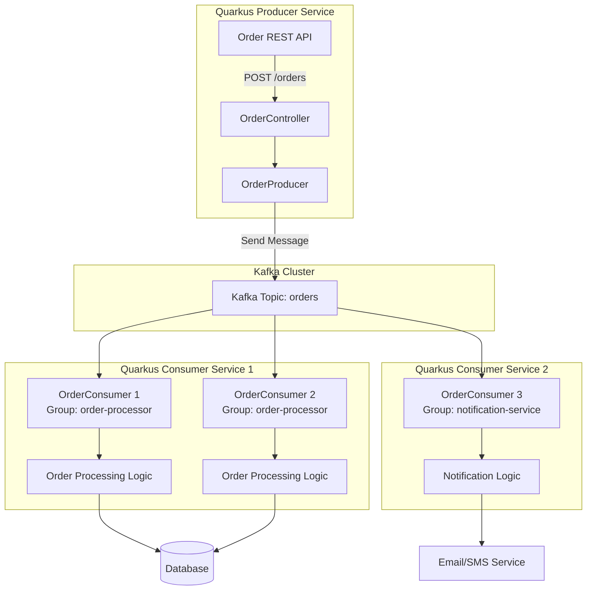
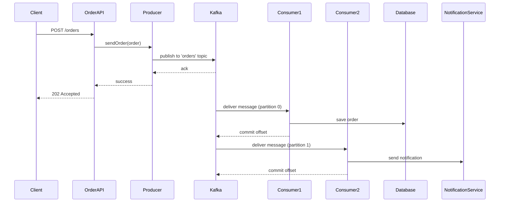

# Kafka com Quarkus — Guia Completo de Integração e Microservices

## Índice

1. [O que é Apache Kafka?](#1-o-que-é-apache-kafka)
2. [Conceitos Fundamentais do Kafka](#2-conceitos-fundamentais-do-kafka)
3. [Kafka + Quarkus: A Combinação Perfeita](#3-kafka--quarkus-a-combinação-perfeita)
4. [Setup do Projeto Quarkus](#4-setup-do-projeto-quarkus)
5. [Configuração do Kafka](#5-configuração-do-kafka)
6. [Produzindo Mensagens](#6-produzindo-mensagens)
7. [Consumindo Mensagens](#7-consumindo-mensagens)
8. [Fluxos e Arquiteturas](#8-fluxos-e-arquiteturas)
9. [Boas Práticas](#9-boas-práticas)
10. [Configurações Avançadas](#10-configurações-avançadas)
11. [Testes e Qualidade](#11-testes-e-qualidade)
12. [Exercícios Práticos](#12-exercícios-práticos)
13. [Recursos e Referências](#13-recursos-e-referências)

---

## 1. O que é Apache Kafka?

### Definição

**Apache Kafka** é uma plataforma de streaming de eventos distribuída e de código aberto, capaz de processar trilhões de eventos por dia. Criado originalmente pelo LinkedIn e posteriormente doado à Apache Software Foundation, Kafka se tornou o padrão de facto para streaming de dados em tempo real.

### Características Principais

#### 📊 Alta Taxa de Transferência (High Throughput)
- Capaz de processar **milhões de mensagens por segundo**
- Latência extremamente baixa (milissegundos)
- Escala horizontal com facilidade

#### 💾 Durabilidade e Persistência
- Armazena mensagens em disco de forma durável
- Replicação de dados entre múltiplos brokers
- Tolerância a falhas nativa

#### 🔄 Processamento em Tempo Real
- Stream processing nativo
- Integração com Kafka Streams e ksqlDB
- Processamento de eventos complexos (CEP)

#### 📈 Escalabilidade Horizontal
- Adicione brokers conforme a demanda cresce
- Particionamento automático de tópicos
- Distribuição de carga entre consumidores

### Casos de Uso Comuns

#### 1. **Mensageria entre Microservices**
```
Order Service → Kafka → [Payment Service, Inventory Service, Notification Service]
```

#### 2. **Event Sourcing e CQRS**
- Armazenar todos os eventos como fonte da verdade
- Reconstruir estado a qualquer momento
- Separação de leitura e escrita

#### 3. **Log Aggregation**
- Centralizar logs de múltiplas aplicações
- Processamento e análise em tempo real
- Integração com Elasticsearch, Splunk, etc.

#### 4. **Stream Processing**
- Análise de dados em tempo real
- Detecção de fraudes
- Monitoramento de IoT

#### 5. **Data Pipeline**
- ETL em tempo real
- Sincronização entre sistemas
- Data Lake ingestion

---

## 2. Conceitos Fundamentais do Kafka

### 2.1. Arquitetura do Kafka

```
┌─────────────────────────────────────────────────────────────┐
│                     KAFKA CLUSTER                           │
│  ┌──────────────┐  ┌──────────────┐  ┌──────────────┐      │
│  │   Broker 1   │  │   Broker 2   │  │   Broker 3   │      │
│  │              │  │              │  │              │      │
│  │  Topic A     │  │  Topic A     │  │  Topic B     │      │
│  │  Partition 0 │  │  Partition 1 │  │  Partition 0 │      │
│  │  (Leader)    │  │  (Leader)    │  │  (Leader)    │      │
│  │              │  │              │  │              │      │
│  │  Topic B     │  │  Topic A     │  │  Topic A     │      │
│  │  Partition 1 │  │  Partition 0 │  │  Partition 1 │      │
│  │  (Replica)   │  │  (Replica)   │  │  (Replica)   │      │
│  └──────────────┘  └──────────────┘  └──────────────┘      │
└─────────────────────────────────────────────────────────────┘

        ▲                                           │
        │ Produce                          Consume  │
        │                                           ▼

   ┌──────────┐                              ┌──────────┐
   │ Producer │                              │ Consumer │
   │  App 1   │                              │ Group A  │
   └──────────┘                              └──────────┘
```

### 2.2. Componentes Essenciais

#### **Producer (Produtor)**
> Aplicação que publica (envia) mensagens para tópicos Kafka.

**Responsabilidades:**
- Serializar dados
- Escolher partição (por chave ou round-robin)
- Gerenciar buffers e batches
- Lidar com retries e confirmações

#### **Consumer (Consumidor)**
> Aplicação que lê mensagens de um ou mais tópicos Kafka.

**Responsabilidades:**
- Deserializar dados
- Gerenciar offsets (posição de leitura)
- Fazer parte de um consumer group
- Processar mensagens

#### **Broker**
> Servidor Kafka que armazena dados e atende requisições.

**Responsabilidades:**
- Armazenar mensagens em disco
- Replicar dados entre brokers
- Gerenciar líderes e réplicas de partições
- Servir requisições de producers e consumers

#### **Topic (Tópico)**
> Categoria ou nome de feed onde mensagens são publicadas.

**Características:**
- Similar a uma tabela em banco de dados
- Multi-subscriber (vários consumidores)
- Pode ter múltiplas partições
- Configurável (retenção, replicação, etc.)

#### **Partition (Partição)**
> Subdivisão de um tópico para paralelização e escalabilidade.

**Características:**
- Ordenação garantida **dentro da partição**
- Cada partição tem um líder e réplicas
- Distribuídas entre brokers
- Permite processamento paralelo

**Exemplo de Particionamento:**
```
Topic: orders
├── Partition 0: [msg1, msg4, msg7, msg10]  → Consumer 1
├── Partition 1: [msg2, msg5, msg8, msg11]  → Consumer 2
└── Partition 2: [msg3, msg6, msg9, msg12]  → Consumer 3
```

#### **Offset**
> Identificador único sequencial de cada mensagem dentro de uma partição.

**Características:**
- Número inteiro incremental (0, 1, 2, 3...)
- Único por partição
- Permite replay de mensagens
- Gerenciado automaticamente ou manualmente

#### **Consumer Group**
> Grupo de consumidores que trabalham juntos para processar um tópico.

**Características:**
- Cada partição é consumida por apenas **um** consumidor do grupo
- Permite escalabilidade horizontal
- Rebalanceamento automático quando consumidores entram/saem
- Garante que cada mensagem seja processada uma vez por grupo

**Exemplo:**
```
Topic: payments (3 partições)

Consumer Group "payment-processor":
├── Consumer A → Partition 0
├── Consumer B → Partition 1
└── Consumer C → Partition 2

Consumer Group "audit-service":
├── Consumer D → Partitions 0, 1, 2
```

### 2.3. Garantias de Entrega

#### **At Most Once (No máximo uma vez)**
- Mensagem pode ser perdida
- Nunca será processada mais de uma vez
- Menor latência
```properties
enable.auto.commit=true
acks=0
```

#### **At Least Once (Pelo menos uma vez)**
- Mensagem nunca é perdida
- Pode ser processada mais de uma vez
- Requer idempotência na aplicação
```properties
enable.auto.commit=false
acks=all
retries=3
```

#### **Exactly Once (Exatamente uma vez)**
- Mensagem é processada exatamente uma vez
- Maior complexidade
- Usa transações do Kafka
```properties
enable.idempotence=true
transactional.id=unique-id
acks=all
```

### 2.4. Retenção de Dados

Kafka pode reter mensagens baseado em:

#### **Tempo (Time-based)**
```properties
# Reter por 7 dias
retention.ms=604800000
```

#### **Tamanho (Size-based)**
```properties
# Reter até 1GB por partição
retention.bytes=1073741824
```

#### **Compactação (Log Compaction)**
- Mantém apenas a última versão de cada chave
- Útil para change data capture (CDC)
```properties
cleanup.policy=compact
```

---

## 3. Kafka + Quarkus: A Combinação Perfeita

### Por que usar Kafka com Quarkus?

#### ⚡ **Performance Excepcional**

**Quarkus:**
- Inicialização em milissegundos (0.042s)
- Consumo de memória reduzido (70% menos que frameworks tradicionais)
- Compilação nativa com GraalVM

**Kafka:**
- Throughput massivo (milhões de msg/s)
- Latência baixa (< 10ms)
- Processamento em tempo real

**Resultado:**
```
Aplicação tradicional:  Startup: 10s  | Memory: 200MB
Aplicação Quarkus:      Startup: 0.05s | Memory: 30MB
```

#### 🔄 **Reatividade Nativa**

Quarkus utiliza **SmallRye Reactive Messaging** que implementa a especificação MicroProfile Reactive Messaging, oferecendo:

- **Non-blocking I/O**: Processamento assíncrono eficiente
- **Backpressure**: Controle de fluxo automático
- **Reactive Streams**: Interoperabilidade com outras bibliotecas reativas

```java
@Incoming("orders")
@Outgoing("processed-orders")
public Uni<Order> processOrder(Order order) {
    return orderService.validate(order)
        .onItem().transform(this::enrich)
        .onItem().invoke(this::audit);
}
```

#### 🎯 **Developer Experience Superior**

- **Live Coding**: Mudanças refletidas instantaneamente
- **Dev Services**: Kafka iniciado automaticamente em dev mode
- **Configuração Declarativa**: Menos código, mais produtividade

```bash
# Inicia Kafka automaticamente
./mvnw quarkus:dev
```

#### 🐳 **Cloud-Native por Design**

- **Containers Otimizados**: Imagens pequenas (< 100MB)
- **Kubernetes-Ready**: Integração nativa com K8s
- **Health Checks**: Liveness e readiness automáticos
- **Metrics**: Prometheus out-of-the-box

#### 📦 **Ecossistema Rico**

```xml
<!-- Reactive Messaging -->
<dependency>
    <groupId>io.quarkus</groupId>
    <artifactId>quarkus-smallrye-reactive-messaging-kafka</artifactId>
</dependency>

<!-- Kafka Streams -->
<dependency>
    <groupId>io.quarkus</groupId>
    <artifactId>quarkus-kafka-streams</artifactId>
</dependency>

<!-- Schema Registry (Avro) -->
<dependency>
    <groupId>io.quarkus</groupId>
    <artifactId>quarkus-confluent-registry-avro</artifactId>
</dependency>
```

### Benefícios da Integração Nativa

#### 1. **Configuração Simplificada**

**Antes (Kafka Client puro):**
```java
Properties props = new Properties();
props.put("bootstrap.servers", "localhost:9092");
props.put("key.serializer", "org.apache.kafka.common.serialization.StringSerializer");
props.put("value.serializer", "org.apache.kafka.common.serialization.StringSerializer");
props.put("acks", "all");
// ... 20+ linhas de configuração

KafkaProducer<String, String> producer = new KafkaProducer<>(props);
producer.send(new ProducerRecord<>("topic", "key", "value"));
```

**Com Quarkus:**
```properties
mp.messaging.outgoing.orders.connector=smallrye-kafka
mp.messaging.outgoing.orders.topic=orders
```

```java
@Inject @Channel("orders") Emitter<Order> emitter;
emitter.send(order); // Pronto!
```

#### 2. **Injeção de Dependências**

```java
@ApplicationScoped
public class OrderService {
    
    @Inject @Channel("orders") 
    Emitter<Order> orderEmitter;
    
    @Inject @Channel("notifications") 
    Emitter<Notification> notificationEmitter;
    
    @Inject
    OrderRepository repository;
    
    @Transactional
    public void createOrder(Order order) {
        repository.persist(order);
        orderEmitter.send(order);
        notificationEmitter.send(new Notification(order));
    }
}
```

#### 3. **Health Checks Automáticos**

```bash
$ curl http://localhost:8080/q/health

{
  "status": "UP",
  "checks": [
    {
      "name": "SmallRye Reactive Messaging - liveness check",
      "status": "UP"
    },
    {
      "name": "SmallRye Reactive Messaging - readiness check",
      "status": "UP",
      "data": {
        "orders-in": "[OK]",
        "orders-out": "[OK]"
      }
    }
  ]
}
```

#### 4. **Desenvolvimento Facilitado**

```bash
# Dev mode com Kafka automático
./mvnw quarkus:dev

# Quarkus inicia container Kafka automaticamente!
# Nenhuma configuração manual necessária
```

#### 5. **Observabilidade Integrada**

```properties
# Métricas automáticas
quarkus.micrometer.enabled=true
quarkus.micrometer.export.prometheus.enabled=true
```

Métricas disponíveis automaticamente:
- `kafka_consumer_fetch_manager_records_consumed_total`
- `kafka_producer_topic_record_send_total`
- `kafka_consumer_coordinator_commit_latency_avg`
- E muitas outras...

### Arquitetura Recomendada

```
┌─────────────────────────────────────────────────────────────┐
│                    Quarkus Application                      │
│                                                             │
│  ┌──────────────┐     ┌──────────────┐     ┌────────────┐ │
│  │   REST API   │────▶│   Service    │────▶│  Producer  │ │
│  │  Controller  │     │    Layer     │     │  (Emitter) │ │
│  └──────────────┘     └──────────────┘     └─────┬──────┘ │
│                                                   │        │
│                                                   ▼        │
└───────────────────────────────────────────────────┼────────┘
                                                    │
                    ┌───────────────────────────────┘
                    │
                    ▼
          ┌─────────────────┐
          │  Kafka Cluster  │
          └─────────┬───────┘
                    │
        ┌───────────┴───────────┐
        │                       │
        ▼                       ▼
┌───────────────┐       ┌───────────────┐
│   Consumer    │       │   Consumer    │
│   Service 1   │       │   Service 2   │
│  (Quarkus)    │       │  (Quarkus)    │
└───────────────┘       └───────────────┘
```

---

## 4. Setup do Projeto Quarkus

### 4.1. Criando o Projeto

#### Opção 1: Quarkus CLI (Recomendado)

```bash
# Instalar Quarkus CLI (se ainda não tiver)
# Windows (PowerShell)
iex "& { $(irm https://ps.jbang.dev) } app install --fresh --force quarkus@quarkusio"

# Criar projeto
quarkus create app com.example:kafka-demo \
    --extension='quarkus-smallrye-reactive-messaging-kafka,quarkus-rest-jackson,quarkus-arc' \
    --java=21
```

#### Opção 2: Maven

```bash
mvn io.quarkus.platform:quarkus-maven-plugin:3.15.1:create \
    -DprojectGroupId=com.example \
    -DprojectArtifactId=kafka-demo \
    -DprojectVersion=1.0.0-SNAPSHOT \
    -Dextensions="smallrye-reactive-messaging-kafka,rest-jackson,arc" \
    -DjavaVersion=21
```

#### Opção 3: Maven (Projeto Existente)

```bash
cd seu-projeto
./mvnw quarkus:add-extension -Dextensions="smallrye-reactive-messaging-kafka"
```

#### Opção 4: Code.quarkus.io

1. Acesse https://code.quarkus.io
2. Configure:
   - **Group:** com.example
   - **Artifact:** kafka-demo
   - **Build Tool:** Maven
   - **Java Version:** 21
3. Adicione extensões:
   - SmallRye Reactive Messaging - Kafka
   - REST
   - REST Jackson
4. Clique em "Generate your application"

### 4.2. Estrutura do Projeto

```
kafka-demo/
├── src/
│   ├── main/
│   │   ├── java/
│   │   │   └── com/
│   │   │       └── example/
│   │   │           ├── model/
│   │   │           │   └── Order.java
│   │   │           ├── producer/
│   │   │           │   └── OrderProducer.java
│   │   │           ├── consumer/
│   │   │           │   └── OrderConsumer.java
│   │   │           ├── resource/
│   │   │           │   └── OrderResource.java
│   │   │           └── config/
│   │   │               └── KafkaConfig.java
│   │   └── resources/
│   │       ├── application.properties
│   │       └── application-prod.properties
│   └── test/
│       └── java/
│           └── com/
│               └── example/
│                   └── OrderResourceTest.java
├── pom.xml
└── docker-compose.yml
```

### 4.3. Dependências Essenciais (pom.xml)

```xml
<?xml version="1.0" encoding="UTF-8"?>
<project xmlns="http://maven.apache.org/POM/4.0.0"
         xmlns:xsi="http://www.w3.org/2001/XMLSchema-instance"
         xsi:schemaLocation="http://maven.apache.org/POM/4.0.0 
         https://maven.apache.org/xsd/maven-4.0.0.xsd">
    <modelVersion>4.0.0</modelVersion>
    
    <groupId>com.example</groupId>
    <artifactId>kafka-demo</artifactId>
    <version>1.0.0-SNAPSHOT</version>
    
    <properties>
        <quarkus.platform.version>3.15.1</quarkus.platform.version>
        <maven.compiler.release>21</maven.compiler.release>
        <project.build.sourceEncoding>UTF-8</project.build.sourceEncoding>
    </properties>
    
    <dependencyManagement>
        <dependencies>
            <dependency>
                <groupId>io.quarkus.platform</groupId>
                <artifactId>quarkus-bom</artifactId>
                <version>${quarkus.platform.version}</version>
                <type>pom</type>
                <scope>import</scope>
            </dependency>
        </dependencies>
    </dependencyManagement>
    
    <dependencies>
        <!-- Core Kafka Reactive Messaging -->
        <dependency>
            <groupId>io.quarkus</groupId>
            <artifactId>quarkus-smallrye-reactive-messaging-kafka</artifactId>
        </dependency>
        
        <!-- REST API -->
        <dependency>
            <groupId>io.quarkus</groupId>
            <artifactId>quarkus-rest</artifactId>
        </dependency>
        
        <!-- JSON Serialization -->
        <dependency>
            <groupId>io.quarkus</groupId>
            <artifactId>quarkus-rest-jackson</artifactId>
        </dependency>
        
        <!-- CDI (Dependency Injection) -->
        <dependency>
            <groupId>io.quarkus</groupId>
            <artifactId>quarkus-arc</artifactId>
        </dependency>
        
        <!-- Health Checks -->
        <dependency>
            <groupId>io.quarkus</groupId>
            <artifactId>quarkus-smallrye-health</artifactId>
        </dependency>
        
        <!-- Metrics -->
        <dependency>
            <groupId>io.quarkus</groupId>
            <artifactId>quarkus-micrometer-registry-prometheus</artifactId>
        </dependency>
        
        <!-- Logging -->
        <dependency>
            <groupId>io.quarkus</groupId>
            <artifactId>quarkus-logging-json</artifactId>
        </dependency>
        
        <!-- Bean Validation -->
        <dependency>
            <groupId>io.quarkus</groupId>
            <artifactId>quarkus-hibernate-validator</artifactId>
        </dependency>
        
        <!-- Testing -->
        <dependency>
            <groupId>io.quarkus</groupId>
            <artifactId>quarkus-junit5</artifactId>
            <scope>test</scope>
        </dependency>
        
        <dependency>
            <groupId>io.rest-assured</groupId>
            <artifactId>rest-assured</artifactId>
            <scope>test</scope>
        </dependency>
        
        <!-- In-Memory Kafka for Tests -->
        <dependency>
            <groupId>io.smallrye.reactive</groupId>
            <artifactId>smallrye-reactive-messaging-in-memory</artifactId>
            <scope>test</scope>
        </dependency>
    </dependencies>
    
    <build>
        <plugins>
            <plugin>
                <groupId>io.quarkus.platform</groupId>
                <artifactId>quarkus-maven-plugin</artifactId>
                <version>${quarkus.platform.version}</version>
                <executions>
                    <execution>
                        <goals>
                            <goal>build</goal>
                            <goal>generate-code</goal>
                            <goal>generate-code-tests</goal>
                        </goals>
                    </execution>
                </executions>
            </plugin>
        </plugins>
    </build>
</project>
```

### 4.4. Configuração Completa (application.properties)

```properties
# ============================================================================
# APPLICATION
# ============================================================================
quarkus.application.name=kafka-demo
quarkus.application.version=1.0.0

# ============================================================================
# KAFKA BOOTSTRAP CONFIGURATION
# ============================================================================
kafka.bootstrap.servers=localhost:9092

# ============================================================================
# PRODUCER CONFIGURATION - Orders Out
# ============================================================================
# Connector Configuration
mp.messaging.outgoing.orders-out.connector=smallrye-kafka
mp.messaging.outgoing.orders-out.topic=orders
mp.messaging.outgoing.orders-out.key.serializer=org.apache.kafka.common.serialization.StringSerializer
mp.messaging.outgoing.orders-out.value.serializer=io.quarkus.kafka.client.serialization.ObjectMapperSerializer

# Producer Performance
mp.messaging.outgoing.orders-out.acks=all
mp.messaging.outgoing.orders-out.retries=3
mp.messaging.outgoing.orders-out.batch.size=16384
mp.messaging.outgoing.orders-out.linger.ms=5
mp.messaging.outgoing.orders-out.compression.type=snappy
mp.messaging.outgoing.orders-out.max.in.flight.requests.per.connection=5

# Idempotence
mp.messaging.outgoing.orders-out.enable.idempotence=true

# ============================================================================
# CONSUMER CONFIGURATION - Orders In
# ============================================================================
# Connector Configuration
mp.messaging.incoming.orders-in.connector=smallrye-kafka
mp.messaging.incoming.orders-in.topic=orders
mp.messaging.incoming.orders-in.group.id=order-processor-group
mp.messaging.incoming.orders-in.key.deserializer=org.apache.kafka.common.serialization.StringDeserializer
mp.messaging.incoming.orders-in.value.deserializer=io.quarkus.kafka.client.serialization.ObjectMapperDeserializer

# Deserialization Type
mp.messaging.incoming.orders-in.value.deserializer.type=com.example.model.Order

# Offset Management
mp.messaging.incoming.orders-in.auto.offset.reset=earliest
mp.messaging.incoming.orders-in.enable.auto.commit=false
mp.messaging.incoming.orders-in.commit-strategy=throttled

# Consumer Performance
mp.messaging.incoming.orders-in.fetch.min.bytes=1024
mp.messaging.incoming.orders-in.fetch.max.wait.ms=500
mp.messaging.incoming.orders-in.max.poll.records=500
mp.messaging.incoming.orders-in.session.timeout.ms=30000
mp.messaging.incoming.orders-in.heartbeat.interval.ms=3000

# Failure Handling
mp.messaging.incoming.orders-in.failure-strategy=ignore
mp.messaging.incoming.orders-in.throttled.unprocessed-record-max-age.ms=10000

# ============================================================================
# DEAD LETTER QUEUE (DLQ)
# ============================================================================
mp.messaging.outgoing.orders-dlq.connector=smallrye-kafka
mp.messaging.outgoing.orders-dlq.topic=orders-dlq
mp.messaging.outgoing.orders-dlq.value.serializer=org.apache.kafka.common.serialization.StringSerializer

# ============================================================================
# LOGGING
# ============================================================================
quarkus.log.level=INFO
quarkus.log.category."org.apache.kafka".level=WARN
quarkus.log.category."com.example".level=DEBUG
quarkus.log.console.format=%d{HH:mm:ss} %-5p [%c{2.}] (%t) %s%e%n

# JSON Logging (Production)
quarkus.log.console.json=false

# ============================================================================
# HEALTH CHECKS
# ============================================================================
quarkus.smallrye-health.root-path=/health
quarkus.smallrye-health.liveness-path=/live
quarkus.smallrye-health.readiness-path=/ready

# ============================================================================
# METRICS
# ============================================================================
quarkus.micrometer.enabled=true
quarkus.micrometer.export.prometheus.enabled=true
quarkus.micrometer.export.prometheus.path=/metrics
quarkus.micrometer.binder.kafka.enabled=true

# ============================================================================
# DEVELOPMENT MODE
# ============================================================================
%dev.quarkus.log.level=DEBUG
%dev.quarkus.log.category."org.apache.kafka".level=DEBUG

# Dev Services - Kafka automático em modo dev
%dev.quarkus.kafka.devservices.enabled=true
%dev.quarkus.kafka.devservices.port=9092
%dev.quarkus.kafka.devservices.topic-partitions.orders=3
%dev.quarkus.kafka.devservices.topic-partitions.notifications=2

# ============================================================================
# TEST MODE
# ============================================================================
%test.quarkus.kafka.devservices.enabled=false

# ============================================================================
# PRODUCTION MODE
# ============================================================================
%prod.kafka.bootstrap.servers=${KAFKA_BOOTSTRAP_SERVERS:kafka:9092}
%prod.quarkus.log.console.json=true
%prod.quarkus.log.level=WARN
%prod.quarkus.log.category."com.example".level=INFO
```

### 4.5. Configurações Adicionais por Ambiente

#### application-dev.properties
```properties
# Desenvolvimento Local
kafka.bootstrap.servers=localhost:9092
quarkus.log.level=DEBUG
mp.messaging.incoming.orders-in.auto.offset.reset=earliest
```

#### application-prod.properties
```properties
# Produção
kafka.bootstrap.servers=${KAFKA_BOOTSTRAP_SERVERS}
quarkus.log.console.json=true
quarkus.log.level=WARN

# Security
kafka.security.protocol=SASL_SSL
kafka.sasl.mechanism=PLAIN
kafka.sasl.jaas.config=org.apache.kafka.common.security.plain.PlainLoginModule required username="${KAFKA_USERNAME}" password="${KAFKA_PASSWORD}";

# SSL
kafka.ssl.truststore.location=/etc/ssl/certs/kafka-truststore.jks
kafka.ssl.truststore.password=${TRUSTSTORE_PASSWORD}

# Performance
mp.messaging.incoming.orders-in.concurrency=5
mp.messaging.outgoing.orders-out.max-inflight-messages=1000
```

### 4.6. Validação da Configuração

```bash
# Iniciar em modo dev
./mvnw quarkus:dev

# Verificar health
curl http://localhost:8080/q/health

# Verificar métricas
curl http://localhost:8080/q/metrics

# Ver informações da aplicação
curl http://localhost:8080/q/info
```

---

## 5. Configuração do Kafka

### 5.1. Docker Compose Completo (docker-compose.yml)

```yaml
version: '3.8'

# ============================================================================
# Kafka com KRaft (sem Zookeeper) + UI + Schema Registry
# ============================================================================

services:
  # --------------------------------------------------------------------------
  # Kafka Broker com KRaft
  # --------------------------------------------------------------------------
  kafka:
    image: confluentinc/cp-kafka:7.6.0
    hostname: kafka
    container_name: kafka-broker
    ports:
      - "9092:9092"      # Cliente externo
      - "9101:9101"      # JMX Metrics
    environment:
      # KRaft Configuration
      KAFKA_NODE_ID: 1
      KAFKA_PROCESS_ROLES: 'broker,controller'
      KAFKA_CONTROLLER_QUORUM_VOTERS: '1@kafka:29093'
      KAFKA_CONTROLLER_LISTENER_NAMES: 'CONTROLLER'
      
      # Listeners
      KAFKA_LISTENERS: 'PLAINTEXT://kafka:29092,CONTROLLER://kafka:29093,PLAINTEXT_HOST://0.0.0.0:9092'
      KAFKA_ADVERTISED_LISTENERS: 'PLAINTEXT://kafka:29092,PLAINTEXT_HOST://localhost:9092'
      KAFKA_LISTENER_SECURITY_PROTOCOL_MAP: 'CONTROLLER:PLAINTEXT,PLAINTEXT:PLAINTEXT,PLAINTEXT_HOST:PLAINTEXT'
      KAFKA_INTER_BROKER_LISTENER_NAME: 'PLAINTEXT'
      
      # Cluster ID (gerado com: kafka-storage random-uuid)
      CLUSTER_ID: 'MkU3OEVBNTcwNTJENDM2Qk'
      
      # Storage
      KAFKA_LOG_DIRS: '/tmp/kraft-combined-logs'
      
      # Topic Defaults
      KAFKA_OFFSETS_TOPIC_REPLICATION_FACTOR: 1
      KAFKA_TRANSACTION_STATE_LOG_MIN_ISR: 1
      KAFKA_TRANSACTION_STATE_LOG_REPLICATION_FACTOR: 1
      KAFKA_GROUP_INITIAL_REBALANCE_DELAY_MS: 0
      
      # Performance
      KAFKA_NUM_NETWORK_THREADS: 3
      KAFKA_NUM_IO_THREADS: 8
      KAFKA_SOCKET_SEND_BUFFER_BYTES: 102400
      KAFKA_SOCKET_RECEIVE_BUFFER_BYTES: 102400
      KAFKA_SOCKET_REQUEST_MAX_BYTES: 104857600
      
      # Compression
      KAFKA_COMPRESSION_TYPE: 'snappy'
      
      # Retention
      KAFKA_LOG_RETENTION_HOURS: 168
      KAFKA_LOG_SEGMENT_BYTES: 1073741824
      KAFKA_LOG_RETENTION_CHECK_INTERVAL_MS: 300000
      
      # JMX
      KAFKA_JMX_PORT: 9101
      KAFKA_JMX_HOSTNAME: localhost
      
    volumes:
      - kafka-data:/tmp/kraft-combined-logs
    healthcheck:
      test: ["CMD-SHELL", "kafka-broker-api-versions --bootstrap-server localhost:9092"]
      interval: 10s
      timeout: 5s
      retries: 5
    networks:
      - kafka-network

  # --------------------------------------------------------------------------
  # Kafka UI (Interface Gráfica)
  # --------------------------------------------------------------------------
  kafka-ui:
    image: provectuslabs/kafka-ui:latest
    container_name: kafka-ui
    ports:
      - "8080:8080"
    environment:
      - KAFKA_CLUSTERS_0_NAME=local-kafka
      - KAFKA_CLUSTERS_0_BOOTSTRAPSERVERS=kafka:29092
      - KAFKA_CLUSTERS_0_METRICS_PORT=9101
      - KAFKA_CLUSTERS_0_SCHEMAREGISTRY=http://schema-registry:8081
      - DYNAMIC_CONFIG_ENABLED=true
      - LOGGING_LEVEL_ROOT=INFO
      - LOGGING_LEVEL_COM_PROVECTUS=DEBUG
    depends_on:
      kafka:
        condition: service_healthy
    networks:
      - kafka-network

  # --------------------------------------------------------------------------
  # Schema Registry (para Avro/Protobuf)
  # --------------------------------------------------------------------------
  schema-registry:
    image: confluentinc/cp-schema-registry:7.6.0
    hostname: schema-registry
    container_name: schema-registry
    ports:
      - "8081:8081"
    environment:
      SCHEMA_REGISTRY_HOST_NAME: schema-registry
      SCHEMA_REGISTRY_KAFKASTORE_BOOTSTRAP_SERVERS: 'kafka:29092'
      SCHEMA_REGISTRY_LISTENERS: http://0.0.0.0:8081
      SCHEMA_REGISTRY_SCHEMA_REGISTRY_GROUP_ID: schema-registry
      SCHEMA_REGISTRY_STORAGE_TOPIC: _schemas
      SCHEMA_REGISTRY_STORAGE_REPLICATION_FACTOR: 1
    depends_on:
      kafka:
        condition: service_healthy
    healthcheck:
      test: ["CMD", "curl", "-f", "http://localhost:8081"]
      interval: 10s
      timeout: 5s
      retries: 5
    networks:
      - kafka-network

  # --------------------------------------------------------------------------
  # Kafka Connect (opcional - para integração com outros sistemas)
  # --------------------------------------------------------------------------
  kafka-connect:
    image: confluentinc/cp-kafka-connect:7.6.0
    hostname: kafka-connect
    container_name: kafka-connect
    ports:
      - "8083:8083"
    environment:
      CONNECT_BOOTSTRAP_SERVERS: 'kafka:29092'
      CONNECT_REST_ADVERTISED_HOST_NAME: kafka-connect
      CONNECT_REST_PORT: 8083
      CONNECT_GROUP_ID: kafka-connect-group
      CONNECT_CONFIG_STORAGE_TOPIC: _connect-configs
      CONNECT_OFFSET_STORAGE_TOPIC: _connect-offsets
      CONNECT_STATUS_STORAGE_TOPIC: _connect-status
      CONNECT_CONFIG_STORAGE_REPLICATION_FACTOR: 1
      CONNECT_OFFSET_STORAGE_REPLICATION_FACTOR: 1
      CONNECT_STATUS_STORAGE_REPLICATION_FACTOR: 1
      CONNECT_KEY_CONVERTER: org.apache.kafka.connect.storage.StringConverter
      CONNECT_VALUE_CONVERTER: org.apache.kafka.connect.json.JsonConverter
      CONNECT_VALUE_CONVERTER_SCHEMAS_ENABLE: "false"
      CONNECT_PLUGIN_PATH: "/usr/share/java,/usr/share/confluent-hub-components"
    depends_on:
      kafka:
        condition: service_healthy
    networks:
      - kafka-network

volumes:
  kafka-data:
    driver: local

networks:
  kafka-network:
    driver: bridge
```

### 5.2. Iniciando o Ambiente

```powershell
# Iniciar todos os serviços
docker-compose up -d

# Verificar status
docker-compose ps

# Ver logs do Kafka
docker-compose logs -f kafka

# Ver logs de todos os serviços
docker-compose logs -f

# Parar todos os serviços
docker-compose down

# Parar e remover volumes (limpar dados)
docker-compose down -v
```

### 5.3. Gerenciamento de Tópicos

#### Criar Tópicos via CLI

```powershell
# Tópico para pedidos (3 partições)
docker exec -it kafka-broker kafka-topics --create `
    --topic orders `
    --bootstrap-server localhost:9092 `
    --partitions 3 `
    --replication-factor 1 `
    --config retention.ms=604800000 `
    --config compression.type=snappy

# Tópico para notificações (2 partições)
docker exec -it kafka-broker kafka-topics --create `
    --topic notifications `
    --bootstrap-server localhost:9092 `
    --partitions 2 `
    --replication-factor 1

# Tópico para auditoria (log compaction)
docker exec -it kafka-broker kafka-topics --create `
    --topic audit-log `
    --bootstrap-server localhost:9092 `
    --partitions 1 `
    --replication-factor 1 `
    --config cleanup.policy=compact

# Dead Letter Queue
docker exec -it kafka-broker kafka-topics --create `
    --topic orders-dlq `
    --bootstrap-server localhost:9092 `
    --partitions 1 `
    --replication-factor 1
```

#### Listar Tópicos

```powershell
docker exec -it kafka-broker kafka-topics --list `
    --bootstrap-server localhost:9092
```

#### Descrever Tópico

```powershell
docker exec -it kafka-broker kafka-topics --describe `
    --topic orders `
    --bootstrap-server localhost:9092
```

**Saída esperada:**
```
Topic: orders	TopicId: xyz123	PartitionCount: 3	ReplicationFactor: 1
	Topic: orders	Partition: 0	Leader: 1	Replicas: 1	Isr: 1
	Topic: orders	Partition: 1	Leader: 1	Replicas: 1	Isr: 1
	Topic: orders	Partition: 2	Leader: 1	Replicas: 1	Isr: 1
```

#### Alterar Configurações

```powershell
# Aumentar retenção para 30 dias
docker exec -it kafka-broker kafka-configs --alter `
    --entity-type topics `
    --entity-name orders `
    --add-config retention.ms=2592000000 `
    --bootstrap-server localhost:9092
```

#### Adicionar Partições

```powershell
docker exec -it kafka-broker kafka-topics --alter `
    --topic orders `
    --partitions 5 `
    --bootstrap-server localhost:9092
```

#### Deletar Tópico

```powershell
docker exec -it kafka-broker kafka-topics --delete `
    --topic orders `
    --bootstrap-server localhost:9092
```

### 5.4. Produzir e Consumir Mensagens via CLI (Para Testes)

#### Producer Console

```powershell
# Produzir mensagens
docker exec -it kafka-broker kafka-console-producer `
    --topic orders `
    --bootstrap-server localhost:9092

# Digite as mensagens (Enter para enviar)
> {"id": "1", "product": "Laptop", "amount": 1500}
> {"id": "2", "product": "Mouse", "amount": 25}
```

#### Producer com Chave

```powershell
docker exec -it kafka-broker kafka-console-producer `
    --topic orders `
    --bootstrap-server localhost:9092 `
    --property "parse.key=true" `
    --property "key.separator=:"

# Formato: chave:valor
> customer-123:{"id": "1", "product": "Laptop"}
> customer-456:{"id": "2", "product": "Mouse"}
```

#### Consumer Console

```powershell
# Consumir do início
docker exec -it kafka-broker kafka-console-consumer `
    --topic orders `
    --bootstrap-server localhost:9092 `
    --from-beginning

# Consumir com chave
docker exec -it kafka-broker kafka-console-consumer `
    --topic orders `
    --bootstrap-server localhost:9092 `
    --from-beginning `
    --property print.key=true `
    --property print.timestamp=true `
    --property key.separator=" | "
```

#### Consumer Group

```powershell
docker exec -it kafka-broker kafka-console-consumer `
    --topic orders `
    --bootstrap-server localhost:9092 `
    --group my-consumer-group `
    --from-beginning
```

### 5.5. Gerenciamento de Consumer Groups

#### Listar Consumer Groups

```powershell
docker exec -it kafka-broker kafka-consumer-groups --list `
    --bootstrap-server localhost:9092
```

#### Descrever Consumer Group

```powershell
docker exec -it kafka-broker kafka-consumer-groups --describe `
    --group order-processor-group `
    --bootstrap-server localhost:9092
```

**Saída esperada:**
```
GROUP                TOPIC       PARTITION  CURRENT-OFFSET  LOG-END-OFFSET  LAG
order-processor-group orders     0          100             100             0
order-processor-group orders     1          150             155             5
order-processor-group orders     2          200             200             0
```

#### Reset Offset (Cuidado em Produção!)

```powershell
# Reset para o início
docker exec -it kafka-broker kafka-consumer-groups --reset-offsets `
    --group order-processor-group `
    --topic orders `
    --to-earliest `
    --execute `
    --bootstrap-server localhost:9092

# Reset para offset específico
docker exec -it kafka-broker kafka-consumer-groups --reset-offsets `
    --group order-processor-group `
    --topic orders:0 `
    --to-offset 50 `
    --execute `
    --bootstrap-server localhost:9092

# Reset para timestamp
docker exec -it kafka-broker kafka-consumer-groups --reset-offsets `
    --group order-processor-group `
    --topic orders `
    --to-datetime 2025-09-30T10:00:00.000 `
    --execute `
    --bootstrap-server localhost:9092
```

### 5.6. Monitoramento via Kafka UI

Acesse: **http://localhost:8080**

Funcionalidades disponíveis:
- 📊 **Brokers**: Status e configuração
- 📁 **Topics**: Gerenciamento visual de tópicos
- 👥 **Consumer Groups**: Monitoramento de lag e offset
- 📨 **Messages**: Visualizar e produzir mensagens
- 📈 **Metrics**: Gráficos de performance
- ⚙️ **Configuration**: Alterar configurações dinamicamente

### 5.7. Script de Inicialização (init-kafka.sh)

Crie um script para automatizar a criação de tópicos:

```bash
#!/bin/bash

echo "Aguardando Kafka inicializar..."
sleep 10

echo "Criando tópicos..."

docker exec -it kafka-broker kafka-topics --create \
    --if-not-exists \
    --topic orders \
    --bootstrap-server localhost:9092 \
    --partitions 3 \
    --replication-factor 1

docker exec -it kafka-broker kafka-topics --create \
    --if-not-exists \
    --topic notifications \
    --bootstrap-server localhost:9092 \
    --partitions 2 \
    --replication-factor 1

docker exec -it kafka-broker kafka-topics --create \
    --if-not-exists \
    --topic orders-dlq \
    --bootstrap-server localhost:9092 \
    --partitions 1 \
    --replication-factor 1

echo "Tópicos criados com sucesso!"
docker exec -it kafka-broker kafka-topics --list --bootstrap-server localhost:9092
```

```powershell
# PowerShell equivalente (init-kafka.ps1)
Write-Host "Aguardando Kafka inicializar..."
Start-Sleep -Seconds 10

Write-Host "Criando tópicos..."

docker exec kafka-broker kafka-topics --create `
    --if-not-exists `
    --topic orders `
    --bootstrap-server localhost:9092 `
    --partitions 3 `
    --replication-factor 1

docker exec kafka-broker kafka-topics --create `
    --if-not-exists `
    --topic notifications `
    --bootstrap-server localhost:9092 `
    --partitions 2 `
    --replication-factor 1

docker exec kafka-broker kafka-topics --create `
    --if-not-exists `
    --topic orders-dlq `
    --bootstrap-server localhost:9092 `
    --partitions 1 `
    --replication-factor 1

Write-Host "Tópicos criados com sucesso!"
docker exec kafka-broker kafka-topics --list --bootstrap-server localhost:9092
```

---

## 6. Produzindo Mensagens

### 6.1. Modelo de Dados (com Validação)

```java
package com.example.model;

import com.fasterxml.jackson.annotation.JsonFormat;
import jakarta.validation.constraints.*;
import java.math.BigDecimal;
import java.time.LocalDateTime;
import java.util.Objects;
import java.util.UUID;

/**
 * Representa um pedido no sistema de e-commerce.
 * 
 * <p>Esta classe é utilizada para comunicação via Kafka entre microservices.
 * Inclui validações Bean Validation para garantir integridade dos dados.</p>
 * 
 * @author Bruno Felix
 * @version 1.0
 * @since 2025-09-30
 */
public class Order {
    
    /**
     * Identificador único do pedido (UUID).
     */
    @NotBlank(message = "ID do pedido não pode ser vazio")
    private String id;
    
    /**
     * Identificador do cliente que realizou o pedido.
     */
    @NotBlank(message = "ID do cliente é obrigatório")
    @Size(min = 3, max = 50, message = "ID do cliente deve ter entre 3 e 50 caracteres")
    private String customerId;
    
    /**
     * Nome do produto.
     */
    @NotBlank(message = "Nome do produto é obrigatório")
    @Size(min = 2, max = 200, message = "Nome do produto deve ter entre 2 e 200 caracteres")
    private String product;
    
    /**
     * Valor total do pedido.
     */
    @NotNull(message = "Valor do pedido é obrigatório")
    @DecimalMin(value = "0.01", message = "Valor deve ser maior que zero")
    @Digits(integer = 10, fraction = 2, message = "Valor inválido")
    private BigDecimal amount;
    
    /**
     * Quantidade de itens.
     */
    @Min(value = 1, message = "Quantidade mínima é 1")
    @Max(value = 9999, message = "Quantidade máxima é 9999")
    private Integer quantity;
    
    /**
     * Status do pedido.
     */
    @NotNull(message = "Status é obrigatório")
    private OrderStatus status;
    
    /**
     * Timestamp de criação do pedido.
     */
    @JsonFormat(pattern = "yyyy-MM-dd'T'HH:mm:ss")
    private LocalDateTime timestamp;
    
    /**
     * Email do cliente (para notificações).
     */
    @Email(message = "Email inválido")
    private String customerEmail;
    
    /**
     * Construtor padrão (necessário para deserialização).
     */
    public Order() {
        this.timestamp = LocalDateTime.now();
        this.status = OrderStatus.PENDING;
    }
    
    /**
     * Construtor completo para criação de pedidos.
     *
     * @param customerId ID do cliente
     * @param product Nome do produto
     * @param amount Valor total
     * @param quantity Quantidade
     * @param customerEmail Email do cliente
     */
    public Order(String customerId, String product, BigDecimal amount, 
                 Integer quantity, String customerEmail) {
        this();
        this.id = UUID.randomUUID().toString();
        this.customerId = customerId;
        this.product = product;
        this.amount = amount;
        this.quantity = quantity;
        this.customerEmail = customerEmail;
    }
    
    // Getters e Setters
    
    public String getId() {
        return id;
    }
    
    public void setId(String id) {
        this.id = id;
    }
    
    public String getCustomerId() {
        return customerId;
    }
    
    public void setCustomerId(String customerId) {
        this.customerId = customerId;
    }
    
    public String getProduct() {
        return product;
    }
    
    public void setProduct(String product) {
        this.product = product;
    }
    
    public BigDecimal getAmount() {
        return amount;
    }
    
    public void setAmount(BigDecimal amount) {
        this.amount = amount;
    }
    
    public Integer getQuantity() {
        return quantity;
    }
    
    public void setQuantity(Integer quantity) {
        this.quantity = quantity;
    }
    
    public OrderStatus getStatus() {
        return status;
    }
    
    public void setStatus(OrderStatus status) {
        this.status = status;
    }
    
    public LocalDateTime getTimestamp() {
        return timestamp;
    }
    
    public void setTimestamp(LocalDateTime timestamp) {
        this.timestamp = timestamp;
    }
    
    public String getCustomerEmail() {
        return customerEmail;
    }
    
    public void setCustomerEmail(String customerEmail) {
        this.customerEmail = customerEmail;
    }
    
    @Override
    public boolean equals(Object o) {
        if (this == o) return true;
        if (o == null || getClass() != o.getClass()) return false;
        Order order = (Order) o;
        return Objects.equals(id, order.id);
    }
    
    @Override
    public int hashCode() {
        return Objects.hash(id);
    }
    
    @Override
    public String toString() {
        return "Order{" +
                "id='" + id + '\'' +
                ", customerId='" + customerId + '\'' +
                ", product='" + product + '\'' +
                ", amount=" + amount +
                ", quantity=" + quantity +
                ", status=" + status +
                ", timestamp=" + timestamp +
                '}';
    }
}
```

```java
package com.example.model;

/**
 * Status possíveis de um pedido.
 */
public enum OrderStatus {
    /**
     * Pedido criado, aguardando processamento.
     */
    PENDING,
    
    /**
     * Pedido confirmado e em processamento.
     */
    CONFIRMED,
    
    /**
     * Pedido pago com sucesso.
     */
    PAID,
    
    /**
     * Pedido enviado para entrega.
     */
    SHIPPED,
    
    /**
     * Pedido entregue ao cliente.
     */
    DELIVERED,
    
    /**
     * Pedido cancelado.
     */
    CANCELLED,
    
    /**
     * Pedido com erro no processamento.
     */
    FAILED
}
```

### 6.2. Producer Service (Completo e Documentado)

```java
package com.example.producer;

import com.example.model.Order;
import com.fasterxml.jackson.core.JsonProcessingException;
import com.fasterxml.jackson.databind.ObjectMapper;
import io.smallrye.reactive.messaging.kafka.api.OutgoingKafkaRecordMetadata;
import jakarta.enterprise.context.ApplicationScoped;
import jakarta.inject.Inject;
import org.eclipse.microprofile.reactive.messaging.Channel;
import org.eclipse.microprofile.reactive.messaging.Emitter;
import org.eclipse.microprofile.reactive.messaging.Message;
import org.eclipse.microprofile.reactive.messaging.Metadata;
import org.jboss.logging.Logger;

import java.util.concurrent.CompletionStage;

/**
 * Serviço responsável por produzir mensagens Kafka para pedidos.
 * 
 * <p>Utiliza o SmallRye Reactive Messaging para enviar mensagens de forma
 * assíncrona e não bloqueante. Suporta envio com headers personalizados,
 * particionamento por chave e tratamento de erros.</p>
 * 
 * <h3>Configurações Relacionadas:</h3>
 * <ul>
 *   <li>mp.messaging.outgoing.orders-out.connector=smallrye-kafka</li>
 *   <li>mp.messaging.outgoing.orders-out.topic=orders</li>
 * </ul>
 * 
 * @author Bruno Felix
 * @version 1.0
 * @since 2025-09-30
 */
@ApplicationScoped
public class OrderProducer {
    
    private static final Logger LOG = Logger.getLogger(OrderProducer.class);
    
    /**
     * Emitter para envio de mensagens para o canal 'orders-out'.
     * Configurado via application.properties para publicar no tópico 'orders'.
     */
    @Inject
    @Channel("orders-out")
    Emitter<String> orderEmitter;
    
    /**
     * ObjectMapper para serialização JSON.
     */
    @Inject
    ObjectMapper objectMapper;
    
    /**
     * Envia um pedido para o Kafka de forma simples.
     * 
     * <p>Este método serializa o pedido para JSON e envia para o tópico
     * configurado. O particionamento é feito de forma round-robin.</p>
     * 
     * @param order Pedido a ser enviado
     * @throws RuntimeException se houver erro na serialização ou envio
     */
    public void sendOrder(Order order) {
        try {
            String orderJson = objectMapper.writeValueAsString(order);
            
            orderEmitter.send(orderJson)
                .whenComplete((success, failure) -> {
                    if (failure != null) {
                        LOG.errorf("Erro ao enviar pedido %s: %s", 
                                  order.getId(), failure.getMessage());
                    } else {
                        LOG.infof("Pedido %s enviado com sucesso", order.getId());
                    }
                });
                
        } catch (JsonProcessingException e) {
            LOG.error("Erro na serialização do pedido", e);
            throw new RuntimeException("Falha ao serializar pedido", e);
        }
    }
    
    /**
     * Envia um pedido com chave para garantir ordenação por cliente.
     * 
     * <p>Mensagens com a mesma chave são enviadas para a mesma partição,
     * garantindo ordenação. Útil para processar pedidos de um cliente
     * de forma sequencial.</p>
     * 
     * @param order Pedido a ser enviado
     * @return CompletionStage que completa quando a mensagem é acknowledged
     */
    public CompletionStage<Void> sendOrderWithKey(Order order) {
        try {
            String orderJson = objectMapper.writeValueAsString(order);
            
            // Criar metadata com a chave (customerId)
            OutgoingKafkaRecordMetadata<String> metadata = 
                OutgoingKafkaRecordMetadata.<String>builder()
                    .withKey(order.getCustomerId())
                    .build();
            
            Message<String> message = Message.of(orderJson, Metadata.of(metadata));
            
            LOG.debugf("Enviando pedido %s com chave %s", 
                      order.getId(), order.getCustomerId());
            
            return orderEmitter.send(message);
            
        } catch (JsonProcessingException e) {
            LOG.error("Erro na serialização do pedido", e);
            throw new RuntimeException("Falha ao serializar pedido", e);
        }
    }
    
    /**
     * Envia um pedido com headers personalizados e chave.
     * 
     * <p>Headers são úteis para filtros, roteamento e metadados adicionais
     * que não fazem parte do payload principal.</p>
     * 
     * @param order Pedido a ser enviado
     * @return CompletionStage que completa quando a mensagem é acknowledged
     */
    public CompletionStage<Void> sendOrderWithHeaders(Order order) {
        try {
            String orderJson = objectMapper.writeValueAsString(order);
            
            // Criar metadata com chave e headers
            OutgoingKafkaRecordMetadata<String> metadata = 
                OutgoingKafkaRecordMetadata.<String>builder()
                    .withKey(order.getCustomerId())
                    .withHeader("order-id", order.getId())
                    .withHeader("order-status", order.getStatus().name())
                    .withHeader("product", order.getProduct())
                    .withHeader("timestamp", order.getTimestamp().toString())
                    .withHeader("source", "order-service")
                    .withHeader("version", "1.0")
                    .build();
            
            Message<String> message = Message.of(orderJson, Metadata.of(metadata));
            
            LOG.infof("Enviando pedido %s com headers customizados", order.getId());
            
            return orderEmitter.send(message)
                .thenRun(() -> LOG.infof("Pedido %s confirmado pelo Kafka", order.getId()))
                .exceptionally(throwable -> {
                    LOG.errorf("Falha ao enviar pedido %s: %s", 
                              order.getId(), throwable.getMessage());
                    return null;
                });
            
        } catch (JsonProcessingException e) {
            LOG.error("Erro na serialização do pedido", e);
            throw new RuntimeException("Falha ao serializar pedido", e);
        }
    }
    
    /**
     * Envia um pedido e aguarda a confirmação de forma síncrona.
     * 
     * <p><b>ATENÇÃO:</b> Este método bloqueia a thread atual até que o Kafka
     * confirme o recebimento. Use apenas quando necessário, pois pode impactar
     * a performance.</p>
     * 
     * @param order Pedido a ser enviado
     * @throws RuntimeException se houver erro no envio
     */
    public void sendOrderSync(Order order) {
        try {
            String orderJson = objectMapper.writeValueAsString(order);
            
            // toCompletableFuture().join() bloqueia até completar
            orderEmitter.send(orderJson).toCompletableFuture().join();
            
            LOG.infof("Pedido %s enviado e confirmado (sync)", order.getId());
            
        } catch (Exception e) {
            LOG.errorf("Erro ao enviar pedido %s (sync): %s", 
                      order.getId(), e.getMessage());
            throw new RuntimeException("Falha no envio síncrono", e);
        }
    }
    
    /**
     * Envia múltiplos pedidos de forma eficiente (batch).
     * 
     * @param orders Lista de pedidos
     */
    public void sendOrderBatch(java.util.List<Order> orders) {
        LOG.infof("Enviando batch de %d pedidos", orders.size());
        
        orders.forEach(order -> {
            try {
                sendOrderWithKey(order);
            } catch (Exception e) {
                LOG.errorf("Erro ao enviar pedido %s no batch: %s", 
                          order.getId(), e.getMessage());
            }
        });
        
        LOG.info("Batch enviado com sucesso");
    }
}
```

### 6.3. REST Controller para Producer

```java
package com.example.resource;

import com.example.model.Order;
import com.example.producer.OrderProducer;
import jakarta.inject.Inject;
import jakarta.validation.Valid;
import jakarta.ws.rs.*;
import jakarta.ws.rs.core.MediaType;
import jakarta.ws.rs.core.Response;
import org.jboss.logging.Logger;

import java.net.URI;
import java.util.List;
import java.util.UUID;

/**
 * REST API para gerenciamento de pedidos.
 * 
 * <p>Expõe endpoints para criação de pedidos que são publicados no Kafka
 * para processamento assíncrono por outros microservices.</p>
 * 
 * <h3>Endpoints:</h3>
 * <ul>
 *   <li>POST /api/orders - Criar pedido único</li>
 *   <li>POST /api/orders/batch - Criar múltiplos pedidos</li>
 *   <li>POST /api/orders/with-key - Criar pedido com chave</li>
 * </ul>
 * 
 * @author Bruno Felix
 * @version 1.0
 * @since 2025-09-30
 */
@Path("/api/orders")
@Produces(MediaType.APPLICATION_JSON)
@Consumes(MediaType.APPLICATION_JSON)
public class OrderResource {
    
    private static final Logger LOG = Logger.getLogger(OrderResource.class);
    
    @Inject
    OrderProducer orderProducer;
    
    /**
     * Cria um novo pedido e envia para processamento.
     * 
     * <p>O pedido é validado antes do envio. Se a validação falhar,
     * retorna HTTP 400 com detalhes dos erros.</p>
     * 
     * @param order Dados do pedido
     * @return Response 202 (Accepted) com o pedido criado
     */
    @POST
    public Response createOrder(@Valid Order order) {
        LOG.infof("Recebida requisição para criar pedido: %s", order.getProduct());
        
        // Gerar ID se não foi fornecido
        if (order.getId() == null || order.getId().isBlank()) {
            order.setId(UUID.randomUUID().toString());
        }
        
        // Enviar para Kafka
        orderProducer.sendOrder(order);
        
        LOG.infof("Pedido %s aceito para processamento", order.getId());
        
        return Response.accepted(order)
                .location(URI.create("/api/orders/" + order.getId()))
                .build();
    }
    
    /**
     * Cria um pedido garantindo ordenação por cliente.
     * 
     * @param order Dados do pedido
     * @return Response 202 (Accepted)
     */
    @POST
    @Path("/with-key")
    public Response createOrderWithKey(@Valid Order order) {
        LOG.infof("Criando pedido com chave para cliente: %s", order.getCustomerId());
        
        if (order.getId() == null || order.getId().isBlank()) {
            order.setId(UUID.randomUUID().toString());
        }
        
        orderProducer.sendOrderWithKey(order);
        
        return Response.accepted(order).build();
    }
    
    /**
     * Cria múltiplos pedidos em lote.
     * 
     * @param orders Lista de pedidos
     * @return Response 202 (Accepted) com quantidade processada
     */
    @POST
    @Path("/batch")
    public Response createOrderBatch(@Valid List<Order> orders) {
        LOG.infof("Recebido batch de %d pedidos", orders.size());
        
        // Garantir que todos têm ID
        orders.forEach(order -> {
            if (order.getId() == null || order.getId().isBlank()) {
                order.setId(UUID.randomUUID().toString());
            }
        });
        
        orderProducer.sendOrderBatch(orders);
        
        return Response.accepted()
                .entity(new BatchResponse(orders.size(), "Pedidos aceitos para processamento"))
                .build();
    }
    
    /**
     * DTO para resposta de operações em lote.
     */
    public record BatchResponse(int count, String message) {}
}
```

### 6.4. Exemplos de Uso (cURL)

```powershell
# Criar pedido único
curl -X POST http://localhost:8080/api/orders `
  -H "Content-Type: application/json" `
  -d '{
    "customerId": "customer-123",
    "product": "Laptop Dell XPS 15",
    "amount": 8500.00,
    "quantity": 1,
    "customerEmail": "cliente@example.com"
  }'

# Criar pedido com chave
curl -X POST http://localhost:8080/api/orders/with-key `
  -H "Content-Type: application/json" `
  -d '{
    "customerId": "customer-456",
    "product": "Mouse Logitech MX Master",
    "amount": 450.00,
    "quantity": 2,
    "customerEmail": "cliente2@example.com"
  }'

# Criar batch de pedidos
curl -X POST http://localhost:8080/api/orders/batch `
  -H "Content-Type: application/json" `
  -d '[
    {
      "customerId": "customer-789",
      "product": "Teclado Mecânico",
      "amount": 650.00,
      "quantity": 1,
      "customerEmail": "cliente3@example.com"
    },
    {
      "customerId": "customer-789",
      "product": "Monitor 4K",
      "amount": 2500.00,
      "quantity": 1,
      "customerEmail": "cliente3@example.com"
    }
  ]'
```

---

## 7. Consumindo Mensagens

### 7.1. Consumer Básico (Fire and Forget)

```java
package com.example.consumer;

import com.example.model.Order;
import com.fasterxml.jackson.databind.ObjectMapper;
import jakarta.enterprise.context.ApplicationScoped;
import jakarta.inject.Inject;
import org.eclipse.microprofile.reactive.messaging.Incoming;
import org.jboss.logging.Logger;

import java.util.concurrent.CompletableFuture;
import java.util.concurrent.CompletionStage;

/**
 * Consumer básico de pedidos.
 * 
 * <p>Processa mensagens de forma assíncrona e retorna CompletionStage
 * para controle de fluxo reativo.</p>
 * 
 * @author Bruno Felix
 * @version 1.0
 * @since 2025-09-30
 */
@ApplicationScoped
public class OrderConsumerBasic {
    
    private static final Logger LOG = Logger.getLogger(OrderConsumerBasic.class);
    
    @Inject
    ObjectMapper objectMapper;
    
    /**
     * Consome mensagens do tópico 'orders'.
     * 
     * <p>O método é chamado automaticamente para cada mensagem recebida.
     * O offset é commitado automaticamente após o retorno bem-sucedido.</p>
     * 
     * @param orderJson JSON do pedido
     * @return CompletionStage que completa após processamento
     */
    @Incoming("orders-in")
    public CompletionStage<Void> consume(String orderJson) {
        return CompletableFuture.runAsync(() -> {
            try {
                Order order = objectMapper.readValue(orderJson, Order.class);
                processOrder(order);
                LOG.infof("✓ Pedido %s processado com sucesso", order.getId());
            } catch (Exception e) {
                LOG.errorf("✗ Erro ao processar pedido: %s", e.getMessage());
                // Exceções não tratadas causarão nack e possivelmente retry
                throw new RuntimeException("Falha no processamento", e);
            }
        });
    }
    
    /**
     * Lógica de negócio para processar o pedido.
     * 
     * @param order Pedido deserializado
     */
    private void processOrder(Order order) {
        LOG.infof("Processando pedido do cliente: %s", order.getCustomerId());
        LOG.debugf("Produto: %s | Qtd: %d | Valor: %s", 
                  order.getProduct(), order.getQuantity(), order.getAmount());
        
        // Simular processamento
        try {
            Thread.sleep(500);
        } catch (InterruptedException e) {
            Thread.currentThread().interrupt();
        }
        
        // Aqui entraria a lógica real: salvar em banco, chamar APIs, etc.
    }
}
```

### 7.2. Consumer com Metadata (Avançado)

```java
package com.example.consumer;

import com.example.model.Order;
import com.example.model.OrderStatus;
import com.fasterxml.jackson.databind.ObjectMapper;
import io.smallrye.reactive.messaging.kafka.api.IncomingKafkaRecordMetadata;
import jakarta.enterprise.context.ApplicationScoped;
import jakarta.inject.Inject;
import org.apache.kafka.common.header.Header;
import org.eclipse.microprofile.reactive.messaging.Incoming;
import org.eclipse.microprofile.reactive.messaging.Message;
import org.jboss.logging.Logger;

import java.nio.charset.StandardCharsets;
import java.time.Instant;
import java.util.concurrent.CompletableFuture;
import java.util.concurrent.CompletionStage;

/**
 * Consumer avançado com acesso a metadata do Kafka.
 * 
 * <p>Extrai informações como partition, offset, headers e timestamp
 * para processamento contextual e auditoria.</p>
 * 
 * @author Bruno Felix
 * @version 1.0
 * @since 2025-09-30
 */
@ApplicationScoped
public class OrderConsumerAdvanced {
    
    private static final Logger LOG = Logger.getLogger(OrderConsumerAdvanced.class);
    
    @Inject
    ObjectMapper objectMapper;
    
    /**
     * Consome mensagens com acesso completo a metadata.
     * 
     * @param message Mensagem completa com payload e metadata
     * @return CompletionStage que completa após processamento
     */
    @Incoming("orders-in")
    public CompletionStage<Void> consumeWithMetadata(Message<String> message) {
        return CompletableFuture.runAsync(() -> {
            try {
                // Extrair metadata do Kafka
                IncomingKafkaRecordMetadata metadata = message
                    .getMetadata(IncomingKafkaRecordMetadata.class)
                    .orElseThrow(() -> new RuntimeException("Metadata não disponível"));
                
                // Informações da mensagem
                logMetadata(metadata);
                
                // Deserializar payload
                Order order = objectMapper.readValue(message.getPayload(), Order.class);
                
                // Processar com contexto da metadata
                processOrderWithContext(order, metadata);
                
                // Acknowledge manual (commit offset)
                message.ack();
                
                LOG.infof("✓ Pedido %s processado | Partition: %d | Offset: %d",
                         order.getId(), metadata.getPartition(), metadata.getOffset());
                
            } catch (Exception e) {
                LOG.errorf("✗ Erro no processamento: %s", e.getMessage());
                
                // Negative acknowledge (pode causar retry dependendo da configuração)
                message.nack(e);
            }
        });
    }
    
    /**
     * Loga informações de metadata da mensagem.
     */
    private void logMetadata(IncomingKafkaRecordMetadata metadata) {
        LOG.debugf("=== Metadata Kafka ===");
        LOG.debugf("Topic: %s", metadata.getTopic());
        LOG.debugf("Partition: %d", metadata.getPartition());
        LOG.debugf("Offset: %d", metadata.getOffset());
        LOG.debugf("Key: %s", metadata.getKey());
        LOG.debugf("Timestamp: %s", 
                  Instant.ofEpochMilli(metadata.getTimestamp()));
        
        // Headers
        metadata.getHeaders().forEach(header -> 
            LOG.debugf("Header: %s = %s", 
                      header.key(), 
                      new String(header.value(), StandardCharsets.UTF_8))
        );
    }
    
    /**
     * Processa pedido com informações contextuais da metadata.
     */
    private void processOrderWithContext(Order order, IncomingKafkaRecordMetadata metadata) {
        // Extrair headers customizados
        String source = getHeaderValue(metadata, "source");
        String version = getHeaderValue(metadata, "version");
        
        LOG.infof("Processando pedido de %s (versão %s)", source, version);
        
        // Lógica de negócio
        if (order.getStatus() == OrderStatus.PENDING) {
            order.setStatus(OrderStatus.CONFIRMED);
            LOG.infof("Status atualizado: %s -> CONFIRMED", order.getId());
        }
        
        // Aqui você poderia:
        // - Salvar no banco de dados
        // - Publicar evento de confirmação
        // - Enviar notificação
        // - Atualizar cache
    }
    
    /**
     * Extrai valor de um header específico.
     */
    private String getHeaderValue(IncomingKafkaRecordMetadata metadata, String headerName) {
        return metadata.getHeaders().lastHeader(headerName) != null
            ? new String(metadata.getHeaders().lastHeader(headerName).value(), StandardCharsets.UTF_8)
            : "N/A";
    }
}
```

### 7.3. Consumer com Filtro e Transformação

```java
package com.example.consumer;

import com.example.model.Order;
import com.example.model.OrderStatus;
import com.fasterxml.jackson.databind.ObjectMapper;
import jakarta.enterprise.context.ApplicationScoped;
import jakarta.inject.Inject;
import org.eclipse.microprofile.reactive.messaging.Incoming;
import org.eclipse.microprofile.reactive.messaging.Outgoing;
import org.jboss.logging.Logger;

import java.math.BigDecimal;

/**
 * Consumer que filtra e transforma mensagens.
 * 
 * <p>Implementa padrão de filtro para processar apenas pedidos de alto valor
 * e transformá-los antes de encaminhar para outro tópico.</p>
 * 
 * @author Bruno Felix
 * @version 1.0
 * @since 2025-09-30
 */
@ApplicationScoped
public class HighValueOrderConsumer {
    
    private static final Logger LOG = Logger.getLogger(HighValueOrderConsumer.class);
    private static final BigDecimal HIGH_VALUE_THRESHOLD = new BigDecimal("5000.00");
    
    @Inject
    ObjectMapper objectMapper;
    
    /**
     * Filtra pedidos de alto valor e os transforma.
     * 
     * <p>Pedidos com valor inferior ao threshold são ignorados.
     * Pedidos de alto valor são transformados e enviados para
     * o canal 'high-value-orders-out'.</p>
     * 
     * @param orderJson JSON do pedido
     * @return JSON do pedido transformado ou null se filtrado
     */
    @Incoming("orders-in")
    @Outgoing("high-value-orders-out")
    public String filterAndTransform(String orderJson) {
        try {
            Order order = objectMapper.readValue(orderJson, Order.class);
            
            // Filtrar apenas pedidos de alto valor
            if (order.getAmount().compareTo(HIGH_VALUE_THRESHOLD) < 0) {
                LOG.debugf("Pedido %s ignorado (valor baixo: %s)", 
                          order.getId(), order.getAmount());
                return null; // null = mensagem não é propagada
            }
            
            // Transformar pedido
            order.setStatus(OrderStatus.CONFIRMED);
            
            // Adicionar flag de alto valor
            LOG.infof("🔥 Pedido de ALTO VALOR detectado: %s (R$ %s)", 
                     order.getId(), order.getAmount());
            
            // Retornar transformado
            return objectMapper.writeValueAsString(order);
            
        } catch (Exception e) {
            LOG.error("Erro ao filtrar/transformar pedido", e);
            return null;
        }
    }
}
```

### 7.4. Consumer com Retry e Dead Letter Queue

```java
package com.example.consumer;

import com.example.model.Order;
import com.fasterxml.jackson.databind.ObjectMapper;
import io.smallrye.faulttolerance.api.CircuitBreakerName;
import io.smallrye.reactive.messaging.kafka.api.IncomingKafkaRecordMetadata;
import jakarta.enterprise.context.ApplicationScoped;
import jakarta.inject.Inject;
import org.eclipse.microprofile.faulttolerance.CircuitBreaker;
import org.eclipse.microprofile.faulttolerance.Fallback;
import org.eclipse.microprofile.faulttolerance.Retry;
import org.eclipse.microprofile.reactive.messaging.Channel;
import org.eclipse.microprofile.reactive.messaging.Emitter;
import org.eclipse.microprofile.reactive.messaging.Incoming;
import org.eclipse.microprofile.reactive.messaging.Message;
import org.jboss.logging.Logger;

import java.time.temporal.ChronoUnit;
import java.util.concurrent.CompletableFuture;
import java.util.concurrent.CompletionStage;

/**
 * Consumer resiliente com retry, circuit breaker e dead letter queue.
 * 
 * <p>Implementa padrões de resiliência para lidar com falhas transientes
 * e permanentes no processamento de mensagens.</p>
 * 
 * @author Bruno Felix
 * @version 1.0
 * @since 2025-09-30
 */
@ApplicationScoped
public class ResilientOrderConsumer {
    
    private static final Logger LOG = Logger.getLogger(ResilientOrderConsumer.class);
    
    @Inject
    ObjectMapper objectMapper;
    
    /**
     * Emitter para Dead Letter Queue.
     */
    @Inject
    @Channel("orders-dlq")
    Emitter<String> dlqEmitter;
    
    /**
     * Consome mensagens com estratégia de retry.
     * 
     * <p>Tenta processar até 3 vezes antes de enviar para DLQ.
     * Usa circuit breaker para prevenir sobrecarga em caso de
     * falhas sistemáticas.</p>
     * 
     * @param message Mensagem do Kafka
     * @return CompletionStage que completa após processamento
     */
    @Incoming("orders-in")
    @Retry(
        maxRetries = 3,
        delay = 1000,
        delayUnit = ChronoUnit.MILLIS,
        jitter = 200
    )
    @CircuitBreaker(
        requestVolumeThreshold = 4,
        failureRatio = 0.5,
        delay = 5000,
        successThreshold = 2
    )
    @CircuitBreakerName("order-processing")
    @Fallback(fallbackMethod = "sendToDLQ")
    public CompletionStage<Void> processWithRetry(Message<String> message) {
        return CompletableFuture.runAsync(() -> {
            try {
                IncomingKafkaRecordMetadata metadata = message
                    .getMetadata(IncomingKafkaRecordMetadata.class)
                    .orElseThrow();
                
                Order order = objectMapper.readValue(message.getPayload(), Order.class);
                
                // Simular possível falha
                processOrderWithPossibleFailure(order);
                
                message.ack();
                LOG.infof("✓ Pedido %s processado (tentativa bem-sucedida)", order.getId());
                
            } catch (Exception e) {
                LOG.warnf("✗ Erro ao processar (será retentado): %s", e.getMessage());
                throw new RuntimeException("Falha no processamento", e);
            }
        });
    }
    
    /**
     * Fallback: envia mensagem para Dead Letter Queue.
     * 
     * <p>Este método é chamado quando todas as tentativas de retry
     * falharam ou quando o circuit breaker está aberto.</p>
     */
    public CompletionStage<Void> sendToDLQ(Message<String> message) {
        return CompletableFuture.runAsync(() -> {
            try {
                Order order = objectMapper.readValue(message.getPayload(), Order.class);
                
                LOG.errorf("❌ Pedido %s enviado para DLQ após múltiplas falhas", order.getId());
                
                // Criar mensagem de erro para DLQ
                String dlqMessage = String.format(
                    "{\"originalMessage\": %s, \"reason\": \"Max retries exceeded\", \"timestamp\": \"%s\"}",
                    message.getPayload(),
                    java.time.LocalDateTime.now()
                );
                
                dlqEmitter.send(dlqMessage);
                message.ack(); // Acknowledge para não reprocessar
                
            } catch (Exception e) {
                LOG.fatal("Falha crítica ao enviar para DLQ", e);
                message.nack(e);
            }
        });
    }
    
    /**
     * Simula processamento que pode falhar.
     * 
     * <p>Em produção, aqui estaria a lógica real que pode falhar
     * (chamadas a APIs externas, banco de dados, etc.).</p>
     */
    private void processOrderWithPossibleFailure(Order order) {
        // Simular falha aleatória (30% de chance)
        if (Math.random() < 0.3) {
            throw new RuntimeException("Falha transiente no processamento");
        }
        
        LOG.infof("Processando pedido: %s", order.getId());
        
        // Lógica de negócio aqui...
    }
}
```

### 7.5. Consumer com Processamento em Batch

```java
package com.example.consumer;

import com.example.model.Order;
import com.fasterxml.jackson.databind.ObjectMapper;
import io.smallrye.mutiny.Multi;
import jakarta.enterprise.context.ApplicationScoped;
import jakarta.inject.Inject;
import org.eclipse.microprofile.reactive.messaging.Incoming;
import org.jboss.logging.Logger;

import java.time.Duration;
import java.util.List;

/**
 * Consumer que processa mensagens em lote para maior eficiência.
 * 
 * <p>Agrupa mensagens por janela de tempo ou quantidade para
 * processamento em batch (útil para operações em banco de dados).</p>
 * 
 * @author Bruno Felix
 * @version 1.0
 * @since 2025-09-30
 */
@ApplicationScoped
public class BatchOrderConsumer {
    
    private static final Logger LOG = Logger.getLogger(BatchOrderConsumer.class);
    private static final int BATCH_SIZE = 10;
    private static final Duration BATCH_TIMEOUT = Duration.ofSeconds(5);
    
    @Inject
    ObjectMapper objectMapper;
    
    /**
     * Recebe stream de mensagens.
     */
    @Incoming("orders-in")
    public Multi<Order> receiveOrders(String orderJson) {
        try {
            Order order = objectMapper.readValue(orderJson, Order.class);
            return Multi.createFrom().item(order);
        } catch (Exception e) {
            LOG.error("Erro ao deserializar pedido", e);
            return Multi.createFrom().empty();
        }
    }
    
    /**
     * Processa pedidos em batch.
     * 
     * <p>Agrupa por tamanho ou tempo, o que ocorrer primeiro.</p>
     */
    @Incoming("order-stream")
    public void processBatch(Multi<Order> orders) {
        orders
            .group().intoLists().of(BATCH_SIZE, BATCH_TIMEOUT)
            .subscribe().with(
                batch -> processBatchOfOrders(batch),
                failure -> LOG.errorf("Erro no processamento de batch: %s", failure.getMessage())
            );
    }
    
    /**
     * Processa um lote de pedidos.
     */
    private void processBatchOfOrders(List<Order> orders) {
        LOG.infof("📦 Processando batch de %d pedidos", orders.size());
        
        try {
            // Processar todos de uma vez (ex: INSERT em batch no banco)
            // batchInsert(orders);
            
            orders.forEach(order -> 
                LOG.debugf("  - Pedido: %s | Cliente: %s", 
                          order.getId(), order.getCustomerId())
            );
            
            LOG.infof("✓ Batch de %d pedidos processado com sucesso", orders.size());
            
        } catch (Exception e) {
            LOG.errorf("Erro ao processar batch: %s", e.getMessage());
            // Aqui você poderia reprocessar individualmente
        }
    }
}
```

### 7.6. Consumer com Múltiplos Tópicos

```java
package com.example.consumer;

import com.example.model.Order;
import com.fasterxml.jackson.databind.ObjectMapper;
import io.smallrye.reactive.messaging.kafka.api.IncomingKafkaRecordMetadata;
import jakarta.enterprise.context.ApplicationScoped;
import jakarta.inject.Inject;
import org.eclipse.microprofile.reactive.messaging.Incoming;
import org.eclipse.microprofile.reactive.messaging.Message;
import org.jboss.logging.Logger;

import java.util.concurrent.CompletableFuture;
import java.util.concurrent.CompletionStage;

/**
 * Consumer que escuta múltiplos tópicos.
 * 
 * @author Bruno Felix
 * @version 1.0
 * @since 2025-09-30
 */
@ApplicationScoped
public class MultiTopicConsumer {
    
    private static final Logger LOG = Logger.getLogger(MultiTopicConsumer.class);
    
    @Inject
    ObjectMapper objectMapper;
    
    /**
     * Consome mensagens de múltiplos tópicos.
     * 
     * <p>Útil quando a mesma lógica de processamento se aplica
     * a eventos de diferentes fontes.</p>
     */
    @Incoming("orders-in")
    @Incoming("orders-retry-in")
    public CompletionStage<Void> consumeFromMultipleTopics(Message<String> message) {
        return CompletableFuture.runAsync(() -> {
            try {
                IncomingKafkaRecordMetadata metadata = message
                    .getMetadata(IncomingKafkaRecordMetadata.class)
                    .orElseThrow();
                
                String topic = metadata.getTopic();
                Order order = objectMapper.readValue(message.getPayload(), Order.class);
                
                LOG.infof("Processando pedido %s do tópico: %s", order.getId(), topic);
                
                // Lógica diferenciada por tópico
                if ("orders-retry".equals(topic)) {
                    processRetryOrder(order);
                } else {
                    processNormalOrder(order);
                }
                
                message.ack();
                
            } catch (Exception e) {
                LOG.error("Erro no processamento multi-tópico", e);
                message.nack(e);
            }
        });
    }
    
    private void processNormalOrder(Order order) {
        LOG.infof("Processamento normal: %s", order.getId());
    }
    
    private void processRetryOrder(Order order) {
        LOG.infof("Processamento de retry: %s", order.getId());
    }
}
```

---

## 8. Fluxos e Arquiteturas

## 6. Fluxo Kafka + Quarkus



### Fluxo de Processamento Detalhado



## 7. Boas Práticas

### Separação de Tópicos por Contexto de Negócio

```properties
# Separar por bounded context
mp.messaging.outgoing.orders-created.topic=ecommerce.orders.created
mp.messaging.outgoing.orders-updated.topic=ecommerce.orders.updated
mp.messaging.outgoing.inventory-updated.topic=inventory.stock.updated
mp.messaging.outgoing.payments-processed.topic=payment.transactions.completed
```

### Configuração de Grupos de Consumidores para Escalabilidade

```properties
# Grupo para processamento de pedidos
mp.messaging.incoming.order-processing.group.id=order-processing-service
mp.messaging.incoming.order-processing.concurrency=3

# Grupo para notificações
mp.messaging.incoming.order-notifications.group.id=notification-service
mp.messaging.incoming.order-notifications.concurrency=2

# Configuração de performance
mp.messaging.incoming.order-processing.batch.size=100
mp.messaging.incoming.order-processing.fetch.min.bytes=1024
```

### Monitoramento com Quarkus Metrics

```xml
<dependency>
    <groupId>io.quarkus</groupId>
    <artifactId>quarkus-micrometer-registry-prometheus</artifactId>
</dependency>
```

```java
@ApplicationScoped
public class OrderMetrics {
    
    @Inject
    MeterRegistry registry;
    
    private final Counter ordersProcessed;
    private final Timer processingTime;
    
    @PostConstruct
    public void init() {
        ordersProcessed = Counter.builder("orders.processed")
            .description("Total de pedidos processados")
            .register(registry);
            
        processingTime = Timer.builder("orders.processing.time")
            .description("Tempo de processamento de pedidos")
            .register(registry);
    }
    
    public void recordOrderProcessed() {
        ordersProcessed.increment();
    }
    
    public Timer.Sample startProcessingTimer() {
        return Timer.start(registry);
    }
}
```

### Configuração de Retry e Error Handling

```properties
# Configuração de retry
mp.messaging.incoming.orders-in.retry=true
mp.messaging.incoming.orders-in.retry.max-retries=3
mp.messaging.incoming.orders-in.retry.delay=1000

# Dead letter queue
mp.messaging.incoming.orders-in.failure-strategy=ignore
mp.messaging.outgoing.orders-dlq.connector=smallrye-kafka
mp.messaging.outgoing.orders-dlq.topic=orders-dlq
```

```java
@ApplicationScoped
public class OrderConsumerWithRetry {
    
    @Incoming("orders-in")
    @Retry(maxRetries = 3, delay = 1000)
    @Fallback(fallbackMethod = "fallbackProcessOrder")
    public CompletionStage<Void> processOrder(String orderJson) {
        return CompletableFuture.runAsync(() -> {
            // Lógica que pode falhar
            if (Math.random() > 0.7) {
                throw new RuntimeException("Falha simulada");
            }
            System.out.println("Pedido processado com sucesso");
        });
    }
    
    public CompletionStage<Void> fallbackProcessOrder(String orderJson) {
        return CompletableFuture.runAsync(() -> {
            System.out.println("Enviando para DLQ: " + orderJson);
            // Lógica para enviar para Dead Letter Queue
        });
    }
}
```

## 8. Exercícios Práticos

### Exercício 1: Sistema de E-commerce com Múltiplos Serviços

Crie três microservices Quarkus que se comunicam via Kafka:

1. **Order Service** (Producer):
```java
@Path("/orders")
public class OrderService {
    @Inject @Channel("orders-out") Emitter<Order> orderEmitter;
    @Inject @Channel("inventory-check") Emitter<InventoryCheck> inventoryEmitter;
    
    @POST
    public Response createOrder(Order order) {
        // Verificar estoque primeiro
        InventoryCheck check = new InventoryCheck(order.productId, order.quantity);
        inventoryEmitter.send(check);
        
        // Enviar pedido
        orderEmitter.send(order);
        return Response.accepted().build();
    }
}
```

2. **Inventory Service** (Consumer/Producer):
```java
@ApplicationScoped
public class InventoryService {
    @Incoming("inventory-check")
    @Outgoing("inventory-result")
    public InventoryResult checkStock(InventoryCheck check) {
        boolean available = getCurrentStock(check.productId) >= check.quantity;
        return new InventoryResult(check.orderId, available);
    }
}
```

3. **Notification Service** (Consumer):
```java
@ApplicationScoped
public class NotificationService {
    @Incoming("orders-in")
    public void notifyOrderCreated(Order order) {
        sendEmail(order.customerEmail, "Pedido criado: " + order.id);
    }
    
    @Incoming("inventory-result")
    public void notifyInventoryStatus(InventoryResult result) {
        if (!result.available) {
            sendEmail(result.customerEmail, "Produto indisponível");
        }
    }
}
```

### Exercício 2: Implementar Padrão Saga com Kafka

```java
@ApplicationScoped
public class OrderSaga {
    
    @Incoming("order-created")
    @Outgoing("payment-requested")
    public PaymentRequest processOrder(OrderCreated event) {
        return new PaymentRequest(event.orderId, event.amount);
    }
    
    @Incoming("payment-completed")
    @Outgoing("shipping-requested")  
    public ShippingRequest processPayment(PaymentCompleted event) {
        return new ShippingRequest(event.orderId, event.address);
    }
    
    @Incoming("payment-failed")
    @Outgoing("order-cancelled")
    public OrderCancelled handlePaymentFailure(PaymentFailed event) {
        return new OrderCancelled(event.orderId, "Payment failed");
    }
}
```

### Exercício 3: Sistema de Auditoria

```java
@ApplicationScoped
public class AuditService {
    
    @Incoming("orders-in")
    @Incoming("payments-in") 
    @Incoming("shipments-in")
    public CompletionStage<Void> auditEvent(Message<String> message) {
        return CompletableFuture.runAsync(() -> {
            AuditLog log = new AuditLog();
            log.timestamp = LocalDateTime.now();
            log.topic = getTopicName(message);
            log.payload = message.getPayload();
            log.partition = getPartition(message);
            log.offset = getOffset(message);
            
            saveAuditLog(log);
        });
    }
}
```

## 9. Configurações Avançadas

### Exactly-Once Semantics

```properties
# Producer idempotente
mp.messaging.outgoing.orders-out.enable.idempotence=true
mp.messaging.outgoing.orders-out.retries=3
mp.messaging.outgoing.orders-out.max.in.flight.requests.per.connection=1

# Transações
mp.messaging.outgoing.orders-out.transactional.id=orders-producer-1
```

```java
@ApplicationScoped
public class TransactionalProducer {
    
    @Inject
    @Channel("orders-out")
    Emitter<Order> emitter;
    
    @Transactional
    public void processOrderTransactionally(Order order) {
        // Salvar no banco
        orderRepository.save(order);
        
        // Enviar para Kafka (será commitado junto com a transação do banco)
        emitter.send(order);
    }
}
```

### Schema Registry Integration

```xml
<dependency>
    <groupId>io.apicurio</groupId>
    <artifactId>apicurio-registry-serdes-avro-serde</artifactId>
</dependency>
```

```properties
# Schema Registry
mp.messaging.connector.smallrye-kafka.apicurio.registry.url=http://localhost:8081
mp.messaging.outgoing.orders-out.value.serializer=io.apicurio.registry.serde.avro.AvroKafkaSerializer
mp.messaging.incoming.orders-in.value.deserializer=io.apicurio.registry.serde.avro.AvroKafkaDeserializer
```

### Configuração de SSL/SASL

```properties
# SSL Configuration
kafka.security.protocol=SASL_SSL
kafka.sasl.mechanism=PLAIN
kafka.sasl.jaas.config=org.apache.kafka.common.security.plain.PlainLoginModule required username="user" password="password";

# SSL Truststore
kafka.ssl.truststore.location=/path/to/truststore.jks
kafka.ssl.truststore.password=truststorepassword
```

## 10. Recursos Extras

### Documentação Oficial

- [Quarkus Kafka Guide](https://quarkus.io/guides/kafka)
- [SmallRye Reactive Messaging](https://smallrye.io/smallrye-reactive-messaging/)
- [Apache Kafka Documentation](https://kafka.apache.org/documentation/)

### Ferramentas de Desenvolvimento

1. **Kafka UI**: Interface web para gerenciar tópicos e mensagens
2. **Conduktor**: IDE para desenvolvimento Kafka
3. **Offset Explorer**: Cliente gráfico para Kafka

### Exemplos de Código Completos

Repositório GitHub com exemplos práticos:
```bash
git clone https://github.com/quarkusio/quarkus-quickstarts
cd quarkus-quickstarts/kafka-quickstart
```

### Padrões Arquiteturais

1. **Event Sourcing**: Armazenar eventos como fonte da verdade
2. **CQRS**: Separar comandos de consultas
3. **Saga Pattern**: Coordenar transações distribuídas
4. **Outbox Pattern**: Garantir consistência entre banco e mensageria

### Performance Tuning

```properties
# Configurações de performance do consumer
mp.messaging.incoming.orders-in.fetch.min.bytes=50000
mp.messaging.incoming.orders-in.fetch.max.wait.ms=500
mp.messaging.incoming.orders-in.max.poll.records=500
mp.messaging.incoming.orders-in.session.timeout.ms=30000

# Configurações de performance do producer
mp.messaging.outgoing.orders-out.batch.size=16384
mp.messaging.outgoing.orders-out.linger.ms=5
mp.messaging.outgoing.orders-out.compression.type=snappy
mp.messaging.outgoing.orders-out.buffer.memory=33554432
```

### Monitoramento e Observabilidade

```yaml
# Prometheus + Grafana
version: '3.8'
services:
  prometheus:
    image: prom/prometheus
    ports:
      - "9090:9090"
    volumes:
      - ./prometheus.yml:/etc/prometheus/prometheus.yml
      
  grafana:
    image: grafana/grafana
    ports:
      - "3000:3000"
    environment:
      - GF_SECURITY_ADMIN_PASSWORD=admin
```

### Testes Automatizados

```java
@QuarkusTest
@TestProfile(KafkaTestProfile.class)
class OrderServiceTest {
    
    @Inject
    @Any
    InMemoryConnector connector;
    
    @Test
    void testOrderProcessing() {
        InMemorySource<Order> orders = connector.source("orders-in");
        InMemorySink<String> notifications = connector.sink("notifications-out");
        
        Order order = new Order("123", "customer1", "product1", 100.0);
        orders.send(order);
        
        await().atMost(Duration.ofSeconds(5))
               .until(() -> notifications.received().size() == 1);
        
        assertThat(notifications.received().get(0).getPayload())
               .contains("customer1");
    }
}
```

---

## 13. Recursos e Referências

### 13.1. Documentação Oficial

#### Quarkus
- **Guia Oficial do Kafka:** https://quarkus.io/guides/kafka
- **Reactive Messaging:** https://quarkus.io/guides/reactive-messaging
- **Kafka Streams:** https://quarkus.io/guides/kafka-streams
- **Dev Services:** https://quarkus.io/guides/dev-services

#### SmallRye Reactive Messaging
- **Documentação Completa:** https://smallrye.io/smallrye-reactive-messaging/
- **Kafka Connector:** https://smallrye.io/smallrye-reactive-messaging/smallrye-reactive-messaging/3.0/kafka/kafka.html
- **Exemplos:** https://github.com/smallrye/smallrye-reactive-messaging/tree/main/examples

#### Apache Kafka
- **Documentação Oficial:** https://kafka.apache.org/documentation/
- **Getting Started:** https://kafka.apache.org/quickstart
- **Configuration Reference:** https://kafka.apache.org/documentation/#configuration

### 13.2. Ferramentas de Desenvolvimento

#### IDE e Plugins
- **IntelliJ IDEA Kafka Plugin:** Visualizar tópicos e mensagens
- **VS Code Kafka Extension:** Gerenciamento de clusters Kafka
- **Quarkus Tools:** Extensões para desenvolvimento Quarkus

#### Ferramentas de Gerenciamento
1. **Kafka UI (Provectus)**
   - Interface web moderna
   - Gerenciamento de tópicos e consumer groups
   - https://github.com/provectus/kafka-ui

2. **Conduktor**
   - IDE completa para Kafka
   - Testing e debugging avançado
   - https://www.conduktor.io/

3. **Offset Explorer (antigo Kafka Tool)**
   - Cliente desktop gratuito
   - Visualização de mensagens
   - https://www.kafkatool.com/

4. **Kafdrop**
   - Interface web leve
   - Visualização de dados
   - https://github.com/obsidiandynamics/kafdrop

### 13.3. Repositórios de Exemplo

```bash
# Quarkus Quickstarts
git clone https://github.com/quarkusio/quarkus-quickstarts
cd quarkus-quickstarts/kafka-quickstart

# SmallRye Examples
git clone https://github.com/smallrye/smallrye-reactive-messaging
cd smallrye-reactive-messaging/examples

# Awesome Kafka
# Curadoria de recursos Kafka
https://github.com/infoslack/awesome-kafka
```

### 13.4. Livros Recomendados

- **"Kafka: The Definitive Guide"** - Neha Narkhede, Gwen Shapira, Todd Palino
- **"Designing Event-Driven Systems"** - Ben Stopford
- **"Event Streaming with Kafka Streams and ksqlDB"** - Mitch Seymour
- **"Building Microservices with Quarkus"** - Dmitry Chaban

### 13.5. Cursos Online

- **Confluent Kafka Fundamentals** (Gratuito)
- **Apache Kafka Series** - Stephane Maarek (Udemy)
- **Quarkus - Supersonic Subatomic Java** (Red Hat Learning)

### 13.6. Comunidades e Suporte

#### Fóruns e Grupos
- **Quarkus Zulip Chat:** https://quarkusio.zulipchat.com/
- **Stack Overflow:** Tag `quarkus` e `apache-kafka`
- **Reddit:** r/apachekafka, r/quarkus

#### GitHub
- **Quarkus Issues:** https://github.com/quarkusio/quarkus/issues
- **SmallRye Messaging:** https://github.com/smallrye/smallrye-reactive-messaging/issues

### 13.7. Padrões Arquiteturais com Kafka

#### Event Sourcing
**Conceito:** Armazenar todos os eventos como fonte da verdade.

```java
@ApplicationScoped
public class EventStore {
    
    @Inject @Channel("events") 
    Emitter<Event> eventEmitter;
    
    public void storeEvent(Event event) {
        // Todos os eventos são armazenados no Kafka
        eventEmitter.send(event);
    }
    
    @Incoming("events")
    public void projectEvent(Event event) {
        // Atualizar read models/projeções
        updateProjection(event);
    }
}
```

#### CQRS (Command Query Responsibility Segregation)
**Conceito:** Separar comandos (escrita) de consultas (leitura).

```java
// Write Side (Command)
@Path("/api/orders")
public class OrderCommandResource {
    @Inject @Channel("commands") 
    Emitter<CreateOrderCommand> commandEmitter;
    
    @POST
    public Response createOrder(CreateOrderCommand cmd) {
        commandEmitter.send(cmd);
        return Response.accepted().build();
    }
}

// Read Side (Query)
@Path("/api/orders")
public class OrderQueryResource {
    @Inject OrderQueryRepository repository;
    
    @GET
    public List<OrderView> listOrders() {
        return repository.findAll();
    }
}
```

#### Saga Pattern
**Conceito:** Coordenar transações distribuídas através de eventos.

```java
@ApplicationScoped
public class OrderSaga {
    
    @Incoming("order-created")
    @Outgoing("payment-requested")
    public PaymentCommand initiatePayment(OrderCreated event) {
        return new PaymentCommand(event.orderId, event.amount);
    }
    
    @Incoming("payment-completed")
    @Outgoing("shipping-requested")
    public ShipmentCommand initiateShipping(PaymentCompleted event) {
        return new ShipmentCommand(event.orderId);
    }
    
    @Incoming("payment-failed")
    @Outgoing("order-cancelled")
    public CancelOrder compensate(PaymentFailed event) {
        return new CancelOrder(event.orderId);
    }
}
```

#### Outbox Pattern
**Conceito:** Garantir consistência entre banco de dados e mensageria.

```java
@ApplicationScoped
public class OrderService {
    
    @Inject EntityManager em;
    
    @Transactional
    public void createOrder(Order order) {
        // Salvar no banco
        em.persist(order);
        
        // Salvar evento na tabela outbox
        OutboxEvent event = new OutboxEvent(
            "OrderCreated",
            objectMapper.writeValueAsString(order)
        );
        em.persist(event);
        
        // Commit atômico: tanto order quanto event são salvos juntos
    }
}

// Processo separado lê da outbox e publica no Kafka
@ApplicationScoped
public class OutboxPolling {
    
    @Scheduled(every = "1s")
    public void publishEvents() {
        List<OutboxEvent> pendingEvents = outboxRepository.findPending();
        pendingEvents.forEach(event -> {
            kafkaProducer.send(event);
            outboxRepository.markAsPublished(event.id);
        });
    }
}
```

### 13.8. Performance Tuning - Checklist

#### Producer
- [ ] Habilitar compressão (`compression.type=snappy`)
- [ ] Configurar batch size adequado (`batch.size=16384`)
- [ ] Ajustar linger.ms (`linger.ms=5-10`)
- [ ] Habilitar idempotência (`enable.idempotence=true`)
- [ ] Configurar acks (`acks=all` para durabilidade)
- [ ] Tunar buffer memory (`buffer.memory=33554432`)

#### Consumer
- [ ] Ajustar fetch.min.bytes (`fetch.min.bytes=1024`)
- [ ] Configurar max.poll.records (`max.poll.records=500`)
- [ ] Tunar session.timeout.ms (`session.timeout.ms=30000`)
- [ ] Configurar concorrência (`mp.messaging.incoming.*.concurrency=3`)
- [ ] Usar processamento em batch quando possível
- [ ] Implementar health checks

#### Broker/Cluster
- [ ] Configurar replication factor adequado (≥3 em produção)
- [ ] Ajustar num.partitions baseado na carga
- [ ] Configurar log.segment.bytes e log.retention.bytes
- [ ] Monitorar disk I/O e network throughput
- [ ] Habilitar log compaction se necessário
- [ ] Configurar min.insync.replicas

### 13.9. Troubleshooting Comum

#### Problema: Consumer Lag Alto
**Sintomas:** Offset não acompanha a produção.

**Soluções:**
```properties
# Aumentar paralelismo
mp.messaging.incoming.orders-in.concurrency=5

# Aumentar fetch size
mp.messaging.incoming.orders-in.fetch.min.bytes=50000
mp.messaging.incoming.orders-in.max.poll.records=1000

# Adicionar mais partições ao tópico
# Escalar horizontalmente (mais instances do consumer)
```

#### Problema: Mensagens Duplicadas
**Sintomas:** Mesma mensagem processada múltiplas vezes.

**Soluções:**
```properties
# Habilitar idempotência no producer
mp.messaging.outgoing.orders-out.enable.idempotence=true

# Implementar idempotência na aplicação
@Incoming("orders-in")
public void processIdempotent(Order order) {
    if (processedOrders.contains(order.getId())) {
        LOG.warn("Pedido já processado, ignorando");
        return;
    }
    process(order);
    processedOrders.add(order.getId());
}
```

#### Problema: Timeout de Conexão
**Sintomas:** `TimeoutException` ao produzir/consumir.

**Soluções:**
```properties
# Aumentar timeouts
kafka.connections.max.idle.ms=600000
kafka.request.timeout.ms=30000
mp.messaging.outgoing.orders-out.max.block.ms=10000
```

#### Problema: Rebalance Frequente
**Sintomas:** Logs mostrando "Revoke" e "Assign" constantemente.

**Soluções:**
```properties
# Aumentar session timeout
mp.messaging.incoming.orders-in.session.timeout.ms=45000
mp.messaging.incoming.orders-in.heartbeat.interval.ms=3000

# Reduzir max.poll.records se processamento é lento
mp.messaging.incoming.orders-in.max.poll.records=100
```

---

## 14. Conclusão

### Recapitulação

Neste guia completo, você aprendeu:

✅ **Fundamentos do Kafka**
- Arquitetura e componentes principais
- Conceitos de tópicos, partições e consumer groups
- Garantias de entrega e retenção de dados

✅ **Integração com Quarkus**
- Setup e configuração de projetos
- SmallRye Reactive Messaging
- Produtores e consumidores reativos

✅ **Padrões e Boas Práticas**
- Event Sourcing, CQRS e Saga
- Retry, Circuit Breaker e DLQ
- Performance tuning e monitoramento

✅ **Produção Ready**
- Configurações avançadas de segurança
- Testes automatizados
- Observabilidade e troubleshooting

### Próximos Passos

#### Nível Iniciante → Intermediário
1. **Implemente os exercícios práticos** da seção 12
2. **Configure um cluster Kafka real** (não Docker)
3. **Adicione Schema Registry** para validação de schemas
4. **Implemente testes de integração** completos

#### Nível Intermediário → Avançado
1. **Explore Kafka Streams** para processamento complexo
2. **Implemente padrão Saga** em um sistema real
3. **Configure Kafka em Kubernetes** com operadores
4. **Adicione observabilidade** com Grafana + Prometheus
5. **Estude ksqlDB** para SQL sobre streams

#### Recursos para Continuar Aprendendo
- [ ] Certificação **Confluent Certified Developer**
- [ ] Implementar **CDC com Debezium + Kafka**
- [ ] Estudar **Kafka Connect** para integração com bancos
- [ ] Explorar **Apache Flink** para stream processing avançado

### Filosofia de Desenvolvimento

> **"Kafka + Quarkus = Microservices Supersônicos"**

A combinação de Kafka e Quarkus oferece:
- ⚡ **Performance excepcional** para aplicações cloud-native
- 🔄 **Reatividade nativa** para escalabilidade
- 🎯 **Developer experience superior** com live coding
- 🐳 **Container-friendly** com footprint mínimo
- 📊 **Observabilidade built-in** para produção

### Checklist Final para Produção

Antes de colocar sua aplicação Kafka + Quarkus em produção:

#### Funcionalidade
- [ ] Produtores enviam mensagens com chave apropriada
- [ ] Consumidores processam idempotentemente
- [ ] Dead Letter Queue configurada
- [ ] Retry com backoff exponencial
- [ ] Circuit breaker implementado

#### Performance
- [ ] Load testing realizado
- [ ] Latência P99 < 100ms
- [ ] Throughput atende SLA
- [ ] Consumer lag monitorado
- [ ] Partições dimensionadas corretamente

#### Confiabilidade
- [ ] Replication factor ≥ 3
- [ ] Min insync replicas = 2
- [ ] Acks = all para dados críticos
- [ ] Backup e disaster recovery planejados
- [ ] Runbooks documentados

#### Segurança
- [ ] SSL/TLS habilitado
- [ ] SASL autenticação configurada
- [ ] ACLs definidas
- [ ] Secrets em vault (não hardcoded)
- [ ] Auditoria habilitada

#### Observabilidade
- [ ] Métricas exportadas para Prometheus
- [ ] Dashboards no Grafana configurados
- [ ] Alertas críticos definidos
- [ ] Logs estruturados (JSON)
- [ ] Distributed tracing (OpenTelemetry)

#### Documentação
- [ ] Arquitetura documentada
- [ ] APIs documentadas (OpenAPI)
- [ ] Runbooks atualizados
- [ ] Diagramas de fluxo criados
- [ ] Knowledge base mantida

---

## Apêndice A: Glossário

| Termo | Definição |
|-------|-----------|
| **Broker** | Servidor Kafka que armazena e serve dados |
| **Topic** | Categoria lógica onde mensagens são publicadas |
| **Partition** | Subdivisão de um tópico para paralelização |
| **Offset** | Identificador único sequencial de mensagem |
| **Consumer Group** | Grupo de consumidores que compartilham o trabalho |
| **Replication** | Cópias de partições em múltiplos brokers |
| **Leader** | Broker responsável por reads/writes de uma partição |
| **Replica** | Cópia backup de uma partição |
| **Producer** | Aplicação que publica mensagens no Kafka |
| **Consumer** | Aplicação que lê mensagens do Kafka |
| **Commit** | Persistir offset de mensagem processada |
| **Lag** | Diferença entre último offset e offset atual do consumer |
| **Retention** | Tempo/tamanho que mensagens são mantidas |
| **Compaction** | Manter apenas última versão de cada chave |

---

## Apêndice B: Comandos Úteis (Referência Rápida)

### Gerenciamento de Tópicos

```powershell
# Criar tópico
docker exec kafka-broker kafka-topics --create --topic my-topic --bootstrap-server localhost:9092 --partitions 3 --replication-factor 1

# Listar tópicos
docker exec kafka-broker kafka-topics --list --bootstrap-server localhost:9092

# Descrever tópico
docker exec kafka-broker kafka-topics --describe --topic my-topic --bootstrap-server localhost:9092

# Deletar tópico
docker exec kafka-broker kafka-topics --delete --topic my-topic --bootstrap-server localhost:9092

# Aumentar partições
docker exec kafka-broker kafka-topics --alter --topic my-topic --partitions 5 --bootstrap-server localhost:9092
```

### Consumer Groups

```powershell
# Listar grupos
docker exec kafka-broker kafka-consumer-groups --list --bootstrap-server localhost:9092

# Descrever grupo
docker exec kafka-broker kafka-consumer-groups --describe --group my-group --bootstrap-server localhost:9092

# Reset offset para início
docker exec kafka-broker kafka-consumer-groups --reset-offsets --group my-group --topic my-topic --to-earliest --execute --bootstrap-server localhost:9092

# Reset offset para timestamp
docker exec kafka-broker kafka-consumer-groups --reset-offsets --group my-group --topic my-topic --to-datetime 2025-09-30T10:00:00.000 --execute --bootstrap-server localhost:9092
```

### Produção/Consumo

```powershell
# Produzir mensagens
docker exec -it kafka-broker kafka-console-producer --topic my-topic --bootstrap-server localhost:9092

# Consumir do início
docker exec -it kafka-broker kafka-console-consumer --topic my-topic --from-beginning --bootstrap-server localhost:9092

# Consumir com chave
docker exec -it kafka-broker kafka-console-consumer --topic my-topic --from-beginning --property print.key=true --bootstrap-server localhost:9092
```

### Quarkus

```powershell
# Dev mode
./mvnw quarkus:dev

# Build nativo
./mvnw package -Dnative

# Build container
./mvnw package -Dquarkus.container-image.build=true

# Adicionar extensão
./mvnw quarkus:add-extension -Dextensions="kafka"
```

---

**🎉 Parabéns!** Você completou o guia completo de Kafka com Quarkus. Agora você está pronto para construir arquiteturas de microservices robustas, escaláveis e reativas!

**Desenvolvido com ❤️ por Bruno Felix**  
**Versão:** 2.0  
**Data:** 30 de Setembro de 2025  
**Licença:** MIT

---

Com este guia completo, você tem todas as ferramentas, conhecimentos e melhores práticas necessárias para implementar uma arquitetura robusta de microservices usando Apache Kafka e Quarkus, desde conceitos fundamentais até configurações avançadas prontas para produção.