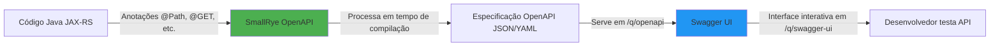
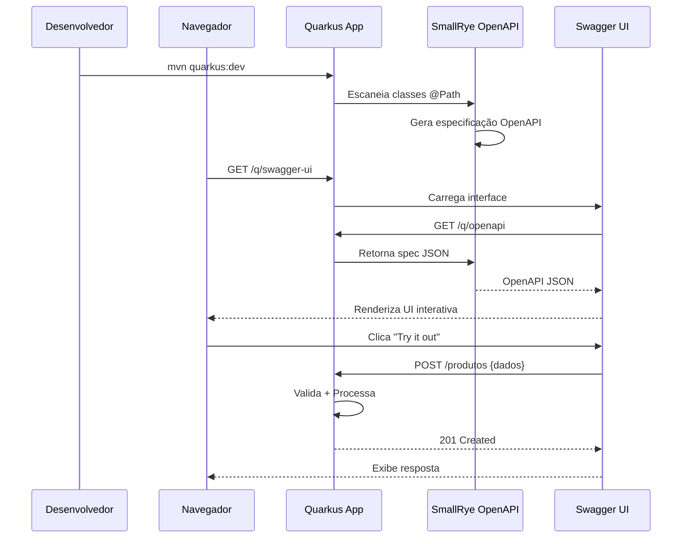

# Documentação Completa: quarkus-smallrye-openapi

## 📋 Resumo Executivo

O `quarkus-smallrye-openapi` é uma extensão do Quarkus que implementa a especificação OpenAPI (antiga Swagger) através do projeto Eclipse MicroProfile. Ele gera automaticamente documentação interativa (Swagger UI) para suas APIs REST, permitindo que você documente, teste e compartilhe seus endpoints de forma padronizada.

---

## 🎓 Explicação para Iniciantes

### Analogia

Imagine que você administra uma biblioteca. Sem um catálogo, os visitantes precisariam perguntar constantemente "quais livros vocês têm?" e "onde fica a seção de ficção?". O OpenAPI é como um **catálogo automático e interativo** da sua API: ele lista todos os "livros" (endpoints), descreve o que cada um faz, quais "informações" (parâmetros) você precisa fornecer e o que você receberá de volta.

### Diagrama: Como Funciona



### Como o Processo Acontece

1. **Você escreve** seus endpoints REST com JAX-RS (`@Path`, `@GET`, `@POST`)
2. **SmallRye OpenAPI escaneia** suas classes em tempo de compilação
3. **Gera automaticamente** uma especificação OpenAPI (arquivo JSON/YAML)
4. **Disponibiliza** duas rotas especiais:
   - `/q/openapi` → especificação em JSON/YAML
   - `/q/swagger-ui` → interface gráfica para testar

---

## 💡 Exemplo Prático

### 1. Configuração Inicial

**pom.xml**
```xml
<dependency>
    <groupId>io.quarkus</groupId>
    <artifactId>quarkus-smallrye-openapi</artifactId>
</dependency>
```

**application.properties**
```properties
# Informações gerais da API
quarkus.smallrye-openapi.info-title=API de Produtos
quarkus.smallrye-openapi.info-version=1.0.0
quarkus.smallrye-openapi.info-description=API para gerenciamento de produtos
quarkus.smallrye-openapi.info-contact-email=dev@empresa.com.br

# Configuração do Swagger UI (dev mode)
quarkus.swagger-ui.always-include=true
quarkus.swagger-ui.path=/swagger-ui
```

### 2. Código Java com Documentação

```java
package com.empresa.produto;

import org.eclipse.microprofile.openapi.annotations.Operation;
import org.eclipse.microprofile.openapi.annotations.media.Content;
import org.eclipse.microprofile.openapi.annotations.media.Schema;
import org.eclipse.microprofile.openapi.annotations.parameters.Parameter;
import org.eclipse.microprofile.openapi.annotations.responses.APIResponse;
import org.eclipse.microprofile.openapi.annotations.tags.Tag;

import jakarta.validation.Valid;
import jakarta.validation.constraints.NotBlank;
import jakarta.validation.constraints.Positive;
import jakarta.ws.rs.*;
import jakarta.ws.rs.core.MediaType;
import jakarta.ws.rs.core.Response;
import java.util.List;
import java.util.Objects;

@Path("/produtos")
@Produces(MediaType.APPLICATION_JSON)
@Consumes(MediaType.APPLICATION_JSON)
@Tag(name = "Produtos", description = "Operações relacionadas a produtos")
public class ProdutoResource {

    private final ProdutoService service;

    public ProdutoResource(final ProdutoService service) {
        this.service = Objects.requireNonNull(service);
    }

    @GET
    @Operation(
        summary = "Lista todos os produtos",
        description = "Retorna uma lista paginada de todos os produtos disponíveis"
    )
    @APIResponse(
        responseCode = "200",
        description = "Lista de produtos retornada com sucesso",
        content = @Content(schema = @Schema(implementation = Produto[].class))
    )
    public Response listar() {
        final List<Produto> produtos = service.listarTodos();
        return Response.ok(produtos).build();
    }

    @GET
    @Path("/{id}")
    @Operation(summary = "Busca produto por ID")
    @APIResponse(responseCode = "200", description = "Produto encontrado")
    @APIResponse(responseCode = "404", description = "Produto não encontrado")
    public Response buscarPorId(
        @Parameter(description = "ID do produto", required = true)
        @PathParam("id") final Long id
    ) {
        return service.buscarPorId(id)
            .map(produto -> Response.ok(produto).build())
            .orElse(Response.status(Response.Status.NOT_FOUND).build());
    }

    @POST
    @Operation(summary = "Cria um novo produto")
    @APIResponse(
        responseCode = "201",
        description = "Produto criado com sucesso",
        content = @Content(schema = @Schema(implementation = Produto.class))
    )
    @APIResponse(responseCode = "400", description = "Dados inválidos")
    public Response criar(@Valid final ProdutoDTO dto) {
        final Produto produto = service.criar(dto);
        return Response.status(Response.Status.CREATED).entity(produto).build();
    }

    @DELETE
    @Path("/{id}")
    @Operation(summary = "Remove um produto")
    @APIResponse(responseCode = "204", description = "Produto removido com sucesso")
    @APIResponse(responseCode = "404", description = "Produto não encontrado")
    public Response remover(@PathParam("id") final Long id) {
        final boolean removido = service.remover(id);
        return removido 
            ? Response.noContent().build()
            : Response.status(Response.Status.NOT_FOUND).build();
    }
}
```

### 3. Entidades Documentadas

```java
package com.empresa.produto;

import org.eclipse.microprofile.openapi.annotations.media.Schema;
import jakarta.validation.constraints.NotBlank;
import jakarta.validation.constraints.Positive;

@Schema(description = "Representação de um produto")
public class ProdutoDTO {

    @Schema(description = "Nome do produto", example = "Notebook Dell")
    @NotBlank(message = "Nome é obrigatório")
    private String nome;

    @Schema(description = "Preço do produto em reais", example = "3500.00")
    @Positive(message = "Preço deve ser positivo")
    private Double preco;

    @Schema(description = "Categoria do produto", example = "Eletrônicos")
    private String categoria;

    // Construtor, getters e setters seguindo Object Calisthenics
    public ProdutoDTO(final String nome, final Double preco, final String categoria) {
        this.nome = nome;
        this.preco = preco;
        this.categoria = categoria;
    }

    public String nome() {
        return nome;
    }

    public Double preco() {
        return preco;
    }

    public String categoria() {
        return categoria;
    }
}
```

### 4. Teste Unitário

```java
package com.empresa.produto;

import io.quarkus.test.junit.QuarkusTest;
import io.restassured.http.ContentType;
import org.junit.jupiter.api.Test;

import static io.restassured.RestAssured.given;
import static org.hamcrest.CoreMatchers.is;
import static org.hamcrest.CoreMatchers.notNullValue;

@QuarkusTest
class ProdutoResourceTest {

    @Test
    void deveListarProdutos() {
        given()
            .when().get("/produtos")
            .then()
            .statusCode(200)
            .contentType(ContentType.JSON);
    }

    @Test
    void deveCriarProdutoComDadosValidos() {
        final String payload = """
            {
                "nome": "Mouse Logitech",
                "preco": 120.50,
                "categoria": "Periféricos"
            }
            """;

        given()
            .contentType(ContentType.JSON)
            .body(payload)
            .when().post("/produtos")
            .then()
            .statusCode(201)
            .body("nome", is("Mouse Logitech"))
            .body("preco", is(120.5f));
    }

    @Test
    void deveRetornar404ParaProdutoInexistente() {
        given()
            .when().get("/produtos/99999")
            .then()
            .statusCode(404);
    }

    @Test
    void deveExporEspecificacaoOpenAPI() {
        given()
            .when().get("/q/openapi")
            .then()
            .statusCode(200)
            .contentType(ContentType.JSON)
            .body("openapi", notNullValue())
            .body("info.title", is("API de Produtos"));
    }
}
```

### 5. Casos de Entrada/Saída

| Endpoint | Método | Entrada | Saída Esperada | Status |
|----------|--------|---------|----------------|--------|
| `/produtos` | GET | - | `[{...produtos}]` | 200 |
| `/produtos/1` | GET | - | `{id: 1, nome: "..."}` | 200 |
| `/produtos/999` | GET | - | (vazio) | 404 |
| `/produtos` | POST | `{nome: "X", preco: 100}` | `{id: 2, nome: "X", ...}` | 201 |
| `/produtos` | POST | `{preco: -10}` | `{errors: [...]}` | 400 |
| `/produtos/1` | DELETE | - | (vazio) | 204 |

---

## 🧠 Mini-Exercício de Verificação

### Pergunta 1
**Qual a diferença entre as rotas `/q/openapi` e `/q/swagger-ui`?**

<details>
<summary>Resposta</summary>

- `/q/openapi`: Retorna a **especificação** OpenAPI em formato JSON/YAML (máquina-legível)
- `/q/swagger-ui`: Exibe uma **interface gráfica** interativa para humanos testarem a API
</details>

### Pergunta 2
**Por que usar `@Schema` nas propriedades da classe `ProdutoDTO`?**

<details>
<summary>Resposta</summary>

Para enriquecer a documentação OpenAPI com descrições, exemplos e tipos de dados, facilitando o entendimento dos consumidores da API.
</details>

### Pergunta 3
**O que acontece se você não adicionar `@Tag` no recurso?**

<details>
<summary>Resposta</summary>

O SmallRye OpenAPI agrupará os endpoints sob uma tag genérica (geralmente "default"), dificultando a organização no Swagger UI. A tag permite organizar logicamente os endpoints relacionados.
</details>

---

## 🔧 Aprofundamento Técnico

### Trade-offs e Decisões de Design

#### 1. **Geração Automática vs. Manual**

| Abordagem | Vantagens | Desvantagens |
|-----------|-----------|--------------|
| **Automática** (padrão) | Sempre sincronizada com código; zero manutenção | Menos controle sobre detalhes; pode expor informações indesejadas |
| **Manual** (OpenAPI estático) | Controle total; documentação pode preceder código | Desatualização rápida; duplicação de esforço |

**Recomendação**: Use geração automática + anotações para customização pontual.

#### 2. **Segurança: Expor ou Não em Produção?**

```properties
# Desabilitar em produção (recomendado)
%prod.quarkus.swagger-ui.enable=false

# Ou proteger com autenticação
quarkus.http.auth.permission.swagger.paths=/q/swagger-ui,/q/openapi
quarkus.http.auth.permission.swagger.policy=authenticated
```

**Justificativa**: Expor Swagger UI em produção pode revelar estrutura da API a atacantes.

#### 3. **Object Calisthenics Aplicado**

**Regras seguidas no código**:
- ✅ **Regra 1** (Um nível de indentação): Métodos curtos e diretos
- ✅ **Regra 2** (Sem `else`): Uso de `orElse` e retorno early
- ✅ **Regra 9** (Sem getters/setters públicos): Uso de métodos nomeados (`nome()`, `preco()`)

**Quebra justificada**:
- ⚠️ **Regra 3** (Encapsular primitivos): `Double preco` poderia ser `Preco` (value object), mas para DTOs simples seria over-engineering.

### Opções Alternativas

#### 1. **SpringDoc OpenAPI** (alternativa para Spring Boot)
```xml
<!-- Se estivesse usando Spring -->
<dependency>
    <groupId>org.springdoc</groupId>
    <artifactId>springdoc-openapi-starter-webmvc-ui</artifactId>
</dependency>
```

#### 2. **Geração Code-First vs. Contract-First**

**Code-First** (SmallRye OpenAPI - usado aqui):
```java
// Código → OpenAPI spec gerada
@GET
public List<Produto> listar() { ... }
```

**Contract-First** (escrever OpenAPI YAML primeiro):
```yaml
# openapi.yaml manual
paths:
  /produtos:
    get:
      responses:
        '200':
          ...
```

Com Quarkus OpenAPI Generator:
```xml
<dependency>
    <groupId>io.quarkus</groupId>
    <artifactId>quarkus-openapi-generator</artifactId>
</dependency>
```

### Boas Práticas

#### 1. **Documentação Completa e Consistente**

```java
@Operation(
    summary = "Resumo curto (< 50 chars)",
    description = "Descrição detalhada com regras de negócio e comportamentos especiais"
)
@APIResponse(
    responseCode = "200",
    description = "Descreva o que significa sucesso neste contexto",
    content = @Content(
        mediaType = MediaType.APPLICATION_JSON,
        schema = @Schema(implementation = ProdutoDTO.class),
        examples = @ExampleObject(
            name = "Exemplo 1",
            value = "{\"nome\": \"Teclado\", \"preco\": 250.0}"
        )
    )
)
```

#### 2. **Versionamento de API**

```java
@Path("/v1/produtos")  // Versionamento via path
@Tag(name = "Produtos v1")
public class ProdutoResourceV1 { ... }

// Ou via header
@HeaderParam("API-Version") String version
```

#### 3. **Filtros de Segurança**

```java
import org.eclipse.microprofile.openapi.OASFilter;
import org.eclipse.microprofile.openapi.models.OpenAPI;

public class OcultarEndpointsInternosFilter implements OASFilter {
    @Override
    public void filterOpenAPI(final OpenAPI openAPI) {
        openAPI.getPaths().remove("/admin/internal");
    }
}
```

**Configuração**:
```properties
mp.openapi.filter=com.empresa.OcultarEndpointsInternosFilter
```

#### 4. **Schemas Reutilizáveis**

```java
@Schema(name = "Erro")
public class ErroResponse {
    @Schema(description = "Código do erro", example = "PRODUTO_NAO_ENCONTRADO")
    private String codigo;
    
    @Schema(description = "Mensagem descritiva", example = "Produto ID 123 não existe")
    private String mensagem;
}

// Referenciar em múltiplos endpoints
@APIResponse(
    responseCode = "404",
    content = @Content(schema = @Schema(implementation = ErroResponse.class))
)
```

### Diagrama de Sequência: Fluxo Completo



### Configurações Avançadas

```properties
# application.properties completo

# === Informações da API ===
quarkus.smallrye-openapi.info-title=API Produtos
quarkus.smallrye-openapi.info-version=2.0.0
quarkus.smallrye-openapi.info-description=API RESTful para gerenciamento de produtos
quarkus.smallrye-openapi.info-terms-of-service=https://empresa.com/termos
quarkus.smallrye-openapi.info-contact-email=suporte@empresa.com.br
quarkus.smallrye-openapi.info-contact-name=Time de Produtos
quarkus.smallrye-openapi.info-contact-url=https://empresa.com/contato
quarkus.smallrye-openapi.info-license-name=Apache 2.0
quarkus.smallrye-openapi.info-license-url=https://www.apache.org/licenses/LICENSE-2.0.html

# === Servidores ===
mp.openapi.servers=https://api-dev.empresa.com,https://api.empresa.com

# === Swagger UI ===
quarkus.swagger-ui.always-include=true
quarkus.swagger-ui.path=/swagger-ui
quarkus.swagger-ui.theme=flattop
quarkus.swagger-ui.doc-expansion=list
quarkus.swagger-ui.filter=true

# === Segurança em Produção ===
%prod.quarkus.swagger-ui.enable=false
%prod.mp.openapi.extensions.smallrye.operationIdStrategy=METHOD

# === Filtros e Customizações ===
mp.openapi.filter=com.empresa.security.OpenAPISecurityFilter
mp.openapi.scan.disable=false
mp.openapi.scan.packages=com.empresa.api
mp.openapi.scan.classes=com.empresa.api.ProdutoResource

# === Schema de Segurança (OAuth2/JWT) ===
mp.openapi.extensions.smallrye.openapi.security.scheme.jwt=JWT
```

### Integrações Comuns

#### 1. **Com Bean Validation**

```java
public class ProdutoDTO {
    @NotBlank(message = "Nome obrigatório")
    @Size(min = 3, max = 100, message = "Nome entre 3 e 100 caracteres")
    @Schema(description = "Nome do produto", minLength = 3, maxLength = 100)
    private String nome;
}
```

#### 2. **Com Segurança JWT**

```java
@GET
@RolesAllowed("admin")
@SecurityScheme(
    securitySchemeName = "jwt",
    type = SecuritySchemeType.HTTP,
    scheme = "bearer",
    bearerFormat = "JWT"
)
@SecurityRequirement(name = "jwt")
public Response listarAdmin() { ... }
```

#### 3. **Com Paginação**

```java
@GET
@Operation(summary = "Lista produtos paginados")
public Response listar(
    @QueryParam("page") @DefaultValue("0") int page,
    @QueryParam("size") @DefaultValue("20") int size
) {
    return Response.ok(service.listarPaginado(page, size)).build();
}
```

---

## 📚 Recursos e Referências

### Documentação Oficial
- [Quarkus OpenAPI Guide](https://quarkus.io/guides/openapi-swaggerui)
- [SmallRye OpenAPI](https://github.com/smallrye/smallrye-open-api)
- [MicroProfile OpenAPI Spec](https://github.com/eclipse/microprofile-open-api)

### Anotações Principais

| Anotação | Uso | Exemplo |
|----------|-----|---------|
| `@Tag` | Agrupa endpoints | `@Tag(name = "Produtos")` |
| `@Operation` | Documenta método | `@Operation(summary = "Lista produtos")` |
| `@APIResponse` | Documenta resposta | `@APIResponse(responseCode = "200")` |
| `@Schema` | Documenta modelo | `@Schema(description = "Produto")` |
| `@Parameter` | Documenta parâmetro | `@Parameter(description = "ID")` |
| `@SecurityScheme` | Define esquema de segurança | `@SecurityScheme(type = HTTP)` |

### Troubleshooting Comum

**Problema**: Swagger UI não aparece
```properties
# Solução: Forçar inclusão em dev
quarkus.swagger-ui.always-include=true
```

**Problema**: Endpoints não aparecem na spec
```properties
# Solução: Verificar pacotes escaneados
mp.openapi.scan.packages=com.empresa.api
```

**Problema**: Erro CORS no Swagger UI
```properties
# Solução: Configurar CORS
quarkus.http.cors=true
quarkus.http.cors.origins=*
```

---

## 🎯 Checklist de Implementação

- [ ] Adicionar dependência `quarkus-smallrye-openapi`
- [ ] Configurar informações básicas em `application.properties`
- [ ] Adicionar `@Tag` nos recursos REST
- [ ] Documentar cada endpoint com `@Operation`
- [ ] Adicionar `@APIResponse` para todos os status codes
- [ ] Usar `@Schema` em DTOs para exemplos
- [ ] Criar testes para verificar spec OpenAPI
- [ ] Desabilitar Swagger UI em produção
- [ ] Considerar autenticação para acesso à documentação
- [ ] Versionar sua API adequadamente

---

**Observação sobre versões**: Este documento foi elaborado considerando Quarkus 3.x e SmallRye OpenAPI 3.x (compatíveis com OpenAPI 3.1). Para versões específicas, consulte a [documentação oficial do Quarkus](https://quarkus.io/guides/openapi-swaggerui).