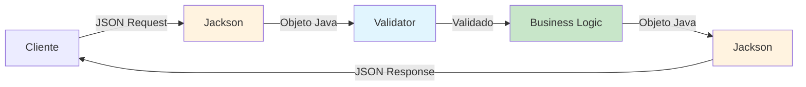
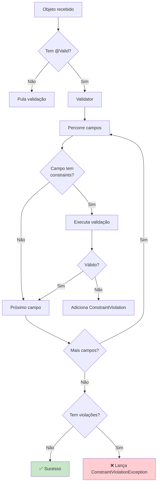

# Hibernate Validator & REST Jackson - Validação e Serialização no Quarkus

## Índice
1. [Introdução](#1-introdução)
2. [Conceitos Fundamentais](#2-conceitos-fundamentais)
3. [Setup e Configuração](#3-setup-e-configuração)
4. [Hibernate Validator - Validação de Dados](#4-hibernate-validator---validação-de-dados)
5. [Validações Built-in](#5-validações-built-in)
6. [Validações Customizadas](#6-validações-customizadas)
7. [Validação em Endpoints REST](#7-validação-em-endpoints-rest)
8. [REST Jackson - Serialização JSON](#8-rest-jackson---serialização-json)
9. [Controle de Serialização](#9-controle-de-serialização)
10. [ObjectMapper Customizado](#10-objectmapper-customizado)
11. [Integração Validator + Jackson](#11-integração-validator--jackson)
12. [Tratamento de Erros](#12-tratamento-de-erros)
13. [Testes](#13-testes)
14. [Padrões e Boas Práticas](#14-padrões-e-boas-práticas)
15. [Troubleshooting](#15-troubleshooting)
16. [Recursos e Referências](#16-recursos-e-referências)

---

## 1. Introdução

### 1.1 O que são Hibernate Validator e REST Jackson?

Ao construir APIs REST no Quarkus, você precisa de duas funcionalidades essenciais:

1. **Validar dados de entrada** - garantir que os dados recebidos estão corretos
2. **Serializar/Deserializar JSON** - converter entre JSON e objetos Java



### 1.2 Por que usar essas bibliotecas?

#### Hibernate Validator

| Benefício | Descrição |
|-----------|-----------|
| **Padrão da Indústria** | Implementa Bean Validation (JSR 380) |
| **Declarativo** | Validações através de anotações |
| **Extensível** | Crie validadores customizados facilmente |
| **Integrado** | Funciona nativamente com Quarkus |
| **Feedback Claro** | Mensagens de erro personalizáveis |

#### REST Jackson

| Benefício | Descrição |
|-----------|-----------|
| **Performance** | Serialização/deserialização rápida |
| **Flexível** | Controle total sobre JSON |
| **Padrão** | Biblioteca mais usada no ecossistema Java |
| **Rico em Features** | Suporte a tipos complexos, datas, etc. |
| **Configurável** | Customização global ou por campo |

### 1.3 Fluxo de uma Requisição

```
┌─────────────────────────────────────────────────────────────┐
│ 1. CLIENTE ENVIA JSON                                       │
│    POST /api/usuarios                                        │
│    {                                                         │
│      "nome": "João Silva",                                   │
│      "email": "joao@example.com",                           │
│      "idade": 25                                            │
│    }                                                         │
└─────────────────────────────────────────────────────────────┘
                          ↓
┌─────────────────────────────────────────────────────────────┐
│ 2. JACKSON DESERIALIZA (JSON → Objeto Java)                │
│    UsuarioDTO usuario = new UsuarioDTO();                   │
│    usuario.nome = "João Silva";                             │
│    usuario.email = "joao@example.com";                      │
│    usuario.idade = 25;                                      │
└─────────────────────────────────────────────────────────────┘
                          ↓
┌─────────────────────────────────────────────────────────────┐
│ 3. HIBERNATE VALIDATOR VALIDA                               │
│    ✅ @NotBlank: nome não está vazio                        │
│    ✅ @Email: email é válido                                │
│    ✅ @Min(18): idade >= 18                                 │
└─────────────────────────────────────────────────────────────┘
                          ↓
┌─────────────────────────────────────────────────────────────┐
│ 4. PROCESSAMENTO (se válido)                                │
│    Usuario salvo = service.salvar(usuario);                 │
└─────────────────────────────────────────────────────────────┘
                          ↓
┌─────────────────────────────────────────────────────────────┐
│ 5. JACKSON SERIALIZA (Objeto Java → JSON)                  │
│    {                                                         │
│      "id": 1,                                               │
│      "nome": "João Silva",                                  │
│      "email": "joao@example.com",                           │
│      "dataCriacao": "2025-09-30T10:00:00"                   │
│    }                                                         │
└─────────────────────────────────────────────────────────────┘
```

### 1.4 Quando usar?

#### ✅ Use Hibernate Validator quando:

- Validar dados de entrada da API
- Garantir integridade de dados
- Fornecer feedback claro ao cliente
- Prevenir dados inválidos no banco
- Implementar regras de negócio declarativas

#### ✅ Use REST Jackson quando:

- Construindo APIs RESTful
- Precisar converter JSON ↔ Java
- Customizar formato de JSON
- Trabalhar com datas, números, coleções
- Controlar quais campos serializar

---

## 2. Conceitos Fundamentais

### 2.1 Bean Validation (JSR 380)

**Bean Validation** é uma especificação Java que define um modelo de validação através de anotações.

#### Hierarquia de Especificações

```
Bean Validation 2.0 (JSR 380)
    ↓
Hibernate Validator 8.x (Implementação)
    ↓
Quarkus Hibernate Validator (Integração)
```

### 2.2 Tipos de Validação

#### 2.2.1 Validação de Campo (Field Validation)

```java
public class Usuario {
    @NotNull  // ← Validação no campo
    @Size(min = 2, max = 50)
    private String nome;
}
```

#### 2.2.2 Validação de Método (Method Validation)

```java
public class UsuarioService {
    public void salvar(@Valid Usuario usuario) {  // ← Validação no parâmetro
        // ...
    }
}
```

#### 2.2.3 Validação de Classe (Class-level Validation)

```java
@ValidPassword  // ← Validação na classe inteira
public class AlterarSenhaDTO {
    private String senhaAtual;
    private String novaSenha;
    private String confirmarSenha;
}
```

### 2.3 Serialização vs Deserialização

```java
// ═══════════════════════════════════════════════════════════
// SERIALIZAÇÃO: Java → JSON
// ═══════════════════════════════════════════════════════════
Usuario usuario = new Usuario("João", "joao@email.com");
String json = objectMapper.writeValueAsString(usuario);
// Resultado: {"nome":"João","email":"joao@email.com"}

// ═══════════════════════════════════════════════════════════
// DESERIALIZAÇÃO: JSON → Java
// ═══════════════════════════════════════════════════════════
String json = "{\"nome\":\"João\",\"email\":\"joao@email.com\"}";
Usuario usuario = objectMapper.readValue(json, Usuario.class);
// Resultado: Usuario(nome=João, email=joao@email.com)
```

### 2.4 ConstraintViolation

Quando uma validação falha, é gerado um **ConstraintViolation**:

```java
/**
 * Estrutura de um ConstraintViolation
 */
public class ViolationExample {
    
    // Campo inválido
    String propertyPath = "email";
    
    // Valor que falhou
    Object invalidValue = "email-invalido";
    
    // Mensagem de erro
    String message = "Email deve ser válido";
    
    // Tipo da constraint
    Class<? extends Annotation> constraintType = Email.class;
}
```

---

## 3. Setup e Configuração

### 3.1 Criação do Projeto

#### Método 1: Quarkus CLI

```powershell
# Criar projeto com Validator e Jackson
quarkus create app com.exemplo:validation-demo `
    --extension=hibernate-validator,resteasy-reactive-jackson

cd validation-demo
```

#### Método 2: Maven

```powershell
mvn io.quarkus:quarkus-maven-plugin:3.15.1:create `
    -DprojectGroupId=com.exemplo `
    -DprojectArtifactId=validation-demo `
    -Dextensions="hibernate-validator,resteasy-reactive-jackson"

cd validation-demo
```

#### Método 3: code.quarkus.io

1. Acesse https://code.quarkus.io
2. Selecione:
   - ✅ Hibernate Validator
   - ✅ RESTEasy Reactive Jackson
3. Generate

### 3.2 Dependências Maven

#### pom.xml Completo

```xml
<?xml version="1.0" encoding="UTF-8"?>
<project xmlns="http://maven.apache.org/POM/4.0.0"
         xmlns:xsi="http://www.w3.org/2001/XMLSchema-instance"
         xsi:schemaLocation="http://maven.apache.org/POM/4.0.0 
         http://maven.apache.org/xsd/maven-4.0.0.xsd">
    <modelVersion>4.0.0</modelVersion>

    <groupId>com.exemplo</groupId>
    <artifactId>validation-demo</artifactId>
    <version>1.0.0-SNAPSHOT</version>

    <properties>
        <quarkus.version>3.15.1</quarkus.version>
        <java.version>21</java.version>
        <maven.compiler.source>21</maven.compiler.source>
        <maven.compiler.target>21</maven.compiler.target>
        <project.build.sourceEncoding>UTF-8</project.build.sourceEncoding>
    </properties>

    <dependencyManagement>
        <dependencies>
            <dependency>
                <groupId>io.quarkus.platform</groupId>
                <artifactId>quarkus-bom</artifactId>
                <version>${quarkus.version}</version>
                <type>pom</type>
                <scope>import</scope>
            </dependency>
        </dependencies>
    </dependencyManagement>

    <dependencies>
        <!-- ═══════════════════════════════════════════════════════════ -->
        <!-- Validação -->
        <!-- ═══════════════════════════════════════════════════════════ -->
        <dependency>
            <groupId>io.quarkus</groupId>
            <artifactId>quarkus-hibernate-validator</artifactId>
        </dependency>

        <!-- ═══════════════════════════════════════════════════════════ -->
        <!-- REST e JSON -->
        <!-- ═══════════════════════════════════════════════════════════ -->
        <dependency>
            <groupId>io.quarkus</groupId>
            <artifactId>quarkus-resteasy-reactive</artifactId>
        </dependency>
        <dependency>
            <groupId>io.quarkus</groupId>
            <artifactId>quarkus-resteasy-reactive-jackson</artifactId>
        </dependency>

        <!-- ═══════════════════════════════════════════════════════════ -->
        <!-- Banco de Dados (Opcional) -->
        <!-- ═══════════════════════════════════════════════════════════ -->
        <dependency>
            <groupId>io.quarkus</groupId>
            <artifactId>quarkus-hibernate-orm-panache</artifactId>
        </dependency>
        <dependency>
            <groupId>io.quarkus</groupId>
            <artifactId>quarkus-jdbc-postgresql</artifactId>
        </dependency>

        <!-- ═══════════════════════════════════════════════════════════ -->
        <!-- Utilities -->
        <!-- ═══════════════════════════════════════════════════════════ -->
        <dependency>
            <groupId>io.quarkus</groupId>
            <artifactId>quarkus-arc</artifactId>
        </dependency>

        <!-- ═══════════════════════════════════════════════════════════ -->
        <!-- Testes -->
        <!-- ═══════════════════════════════════════════════════════════ -->
        <dependency>
            <groupId>io.quarkus</groupId>
            <artifactId>quarkus-junit5</artifactId>
            <scope>test</scope>
        </dependency>
        <dependency>
            <groupId>io.rest-assured</groupId>
            <artifactId>rest-assured</artifactId>
            <scope>test</scope>
        </dependency>
    </dependencies>

    <build>
        <plugins>
            <plugin>
                <groupId>io.quarkus</groupId>
                <artifactId>quarkus-maven-plugin</artifactId>
                <version>${quarkus.version}</version>
                <executions>
                    <execution>
                        <goals>
                            <goal>build</goal>
                        </goals>
                    </execution>
                </executions>
            </plugin>
        </plugins>
    </build>
</project>
```

### 3.3 Configuração - application.properties

```properties
# ═══════════════════════════════════════════════════════════
# Aplicação
# ═══════════════════════════════════════════════════════════
quarkus.application.name=validation-demo
quarkus.application.version=1.0.0

# ═══════════════════════════════════════════════════════════
# Hibernate Validator
# ═══════════════════════════════════════════════════════════
# Fail-fast: parar na primeira violação (false = retornar todas)
quarkus.hibernate-validator.fail-fast=false

# Permitir sobrescrever constraints de parâmetros em métodos
quarkus.hibernate-validator.method-validation.allow-overriding-parameter-constraints=true

# Permitir múltiplas violações do mesmo tipo
quarkus.hibernate-validator.method-validation.allow-multiple-cascaded-validation-on-return-values=true

# ═══════════════════════════════════════════════════════════
# Jackson (Serialização JSON)
# ═══════════════════════════════════════════════════════════
# Não falhar em propriedades desconhecidas
quarkus.jackson.fail-on-unknown-properties=false

# Não escrever datas como timestamps
quarkus.jackson.write-dates-as-timestamps=false

# Não escrever durations como timestamps
quarkus.jackson.write-durations-as-timestamps=false

# Incluir apenas valores não-null
quarkus.jackson.serialization-inclusion=non-null

# Strategy de nomenclatura (SNAKE_CASE, KEBAB_CASE, etc.)
# quarkus.jackson.property-naming-strategy=SNAKE_CASE

# Aceitar números como strings e vice-versa
quarkus.jackson.accept-case-insensitive-enums=true

# ═══════════════════════════════════════════════════════════
# Logging
# ═══════════════════════════════════════════════════════════
quarkus.log.level=INFO
quarkus.log.category."org.hibernate.validator".level=DEBUG
quarkus.log.category."com.fasterxml.jackson".level=DEBUG
quarkus.log.category."com.exemplo".level=DEBUG

quarkus.log.console.format=%d{HH:mm:ss} %-5p [%c{2.}] (%t) %s%e%n

# ═══════════════════════════════════════════════════════════
# Dev Mode
# ═══════════════════════════════════════════════════════════
%dev.quarkus.log.level=DEBUG
%dev.quarkus.hibernate-validator.fail-fast=false

# ═══════════════════════════════════════════════════════════
# Test Profile
# ═══════════════════════════════════════════════════════════
%test.quarkus.hibernate-validator.fail-fast=true

# ═══════════════════════════════════════════════════════════
# Production Profile
# ═══════════════════════════════════════════════════════════
%prod.quarkus.log.level=WARN
%prod.quarkus.jackson.fail-on-unknown-properties=true
```

### 3.4 Configuração de Mensagens de Validação

#### ValidationMessages.properties

Crie o arquivo `src/main/resources/ValidationMessages.properties`:

```properties
# ═══════════════════════════════════════════════════════════
# Mensagens Customizadas de Validação
# ═══════════════════════════════════════════════════════════

# Mensagens gerais
campo.obrigatorio=O campo {0} é obrigatório
campo.tamanho.invalido=O campo {0} deve ter entre {min} e {max} caracteres
campo.formato.invalido=O campo {0} possui formato inválido

# Usuário
usuario.nome.obrigatorio=Nome do usuário é obrigatório
usuario.nome.tamanho=Nome deve ter entre 2 e 100 caracteres
usuario.email.obrigatorio=Email é obrigatório
usuario.email.invalido=Email deve ser válido (exemplo: usuario@dominio.com)
usuario.senha.obrigatorio=Senha é obrigatória
usuario.senha.fraca=Senha deve ter no mínimo 8 caracteres, incluindo letras e números
usuario.idade.minima=Idade mínima é 18 anos
usuario.idade.maxima=Idade máxima é 120 anos

# CPF/CNPJ
cpf.invalido=CPF inválido
cnpj.invalido=CNPJ inválido

# Telefone
telefone.invalido=Telefone deve estar no formato (XX) XXXXX-XXXX

# Endereço
cep.invalido=CEP deve estar no formato XXXXX-XXX

# Produto
produto.preco.invalido=Preço deve ser maior que zero
produto.estoque.negativo=Estoque não pode ser negativo

# Pedido
pedido.itens.vazio=Pedido deve conter pelo menos um item
pedido.valor.minimo=Valor mínimo do pedido é R$ 10,00
```

### 3.5 Estrutura do Projeto

```
validation-demo/
├── src/
│   ├── main/
│   │   ├── java/com/exemplo/
│   │   │   ├── dto/              # DTOs com validações
│   │   │   │   ├── UsuarioDTO.java
│   │   │   │   ├── ProdutoDTO.java
│   │   │   │   └── PedidoDTO.java
│   │   │   ├── model/            # Entidades
│   │   │   │   ├── Usuario.java
│   │   │   │   └── Produto.java
│   │   │   ├── resource/         # Endpoints REST
│   │   │   │   ├── UsuarioResource.java
│   │   │   │   └── ProdutoResource.java
│   │   │   ├── service/          # Lógica de negócio
│   │   │   │   └── UsuarioService.java
│   │   │   ├── validation/       # Validadores customizados
│   │   │   │   ├── CPF.java
│   │   │   │   ├── CPFValidator.java
│   │   │   │   └── SenhaForte.java
│   │   │   ├── exception/        # Tratamento de erros
│   │   │   │   ├── ErrorResponse.java
│   │   │   │   └── ValidationExceptionHandler.java
│   │   │   └── config/           # Configurações
│   │   │       └── JacksonConfig.java
│   │   └── resources/
│   │       ├── application.properties
│   │       └── ValidationMessages.properties
│   └── test/
│       └── java/com/exemplo/
│           ├── UsuarioResourceTest.java
│           └── ValidacaoTest.java
└── pom.xml
```

---

## 4. Hibernate Validator - Validação de Dados

### 4.1 Anatomia de uma Validação

```java
/**
 * Estrutura de uma validação
 */
public class Usuario {
    
    @NotBlank                              // ← Constraint (restrição)
    @Size(min = 2, max = 100)             // ← Constraint com parâmetros
    private String nome;                   // ← Campo validado
    //            ↑
    //      Mensagem padrão ou customizada
}
```

### 4.2 Como Funciona a Validação



### 4.3 Validação em Cascata

Use `@Valid` para validar objetos aninhados:

```java
/**
 * Validação em cascata
 */
public class Pedido {
    
    @NotNull(message = "Cliente é obrigatório")
    @Valid  // ← Valida o objeto Cliente também
    private Cliente cliente;
    
    @NotEmpty(message = "Pedido deve ter pelo menos um item")
    @Valid  // ← Valida cada ItemPedido da lista
    private List<ItemPedido> itens;
}

public class Cliente {
    @NotBlank
    @Email
    private String email;  // ← Será validado quando validar Pedido
}

public class ItemPedido {
    @NotNull
    @Positive
    private Integer quantidade;  // ← Será validado quando validar Pedido
}
```

### 4.4 Grupos de Validação

Use **grupos** para aplicar validações diferentes em contextos diferentes:

```java
/**
 * Interfaces para definir grupos
 */
public interface OnCreate {}
public interface OnUpdate {}

/**
 * DTO com validações por grupo
 */
public class UsuarioDTO {
    
    @Null(groups = OnCreate.class, message = "ID deve ser null ao criar")
    @NotNull(groups = OnUpdate.class, message = "ID é obrigatório ao atualizar")
    private Long id;
    
    @NotBlank(groups = {OnCreate.class, OnUpdate.class})
    @Size(min = 2, max = 100, groups = {OnCreate.class, OnUpdate.class})
    private String nome;
    
    @NotBlank(groups = OnCreate.class, message = "Senha obrigatória ao criar")
    @Size(min = 8, groups = OnCreate.class)
    private String senha;
}

/**
 * Uso em endpoints
 */
@Path("/usuarios")
public class UsuarioResource {
    
    @POST
    public Response criar(@Valid @ConvertGroup(to = OnCreate.class) UsuarioDTO dto) {
        // Valida com grupo OnCreate
        return Response.status(201).build();
    }
    
    @PUT
    @Path("/{id}")
    public Response atualizar(
        @PathParam("id") Long id,
        @Valid @ConvertGroup(to = OnUpdate.class) UsuarioDTO dto
    ) {
        // Valida com grupo OnUpdate
        return Response.ok().build();
    }
}
```

### 4.5 Validação Condicional

```java
/**
 * Validação condicional com expressões
 */
@ScriptAssert(
    lang = "javascript",
    script = "_this.tipoPessoa == 'FISICA' ? _this.cpf != null : _this.cnpj != null",
    message = "CPF obrigatório para pessoa física, CNPJ para pessoa jurídica"
)
public class PessoaDTO {
    
    @NotNull
    private TipoPessoa tipoPessoa;
    
    private String cpf;
    private String cnpj;
}

enum TipoPessoa {
    FISICA, JURIDICA
}
```

---

## 5. Validações Built-in

### 5.1 Validações de Null e Vazio

#### Tabela Comparativa

| Anotação | null | "" (vazio) | " " (espaços) | Tipos Suportados |
|----------|------|------------|---------------|------------------|
| **@NotNull** | ❌ | ✅ | ✅ | Qualquer objeto |
| **@NotEmpty** | ❌ | ❌ | ✅ | String, Collection, Map, Array |
| **@NotBlank** | ❌ | ❌ | ❌ | String (apenas) |

```java
/**
 * Exemplo prático das diferenças
 */
public class ExemploNullVazio {
    
    // ═══════════════════════════════════════════════════════════
    // @NotNull - Apenas não-null
    // ═══════════════════════════════════════════════════════════
    @NotNull(message = "Nome não pode ser null")
    private String nome1;
    // ✅ "João"
    // ✅ ""
    // ✅ "   "
    // ❌ null
    
    // ═══════════════════════════════════════════════════════════
    // @NotEmpty - Não-null E não-vazio
    // ═══════════════════════════════════════════════════════════
    @NotEmpty(message = "Nome não pode ser vazio")
    private String nome2;
    // ✅ "João"
    // ✅ "   "
    // ❌ ""
    // ❌ null
    
    @NotEmpty(message = "Lista não pode ser vazia")
    private List<String> itens;
    // ✅ ["item1"]
    // ❌ []
    // ❌ null
    
    // ═══════════════════════════════════════════════════════════
    // @NotBlank - Não-null, não-vazio E não-espaços
    // ═══════════════════════════════════════════════════════════
    @NotBlank(message = "Nome não pode estar em branco")
    private String nome3;
    // ✅ "João"
    // ✅ "  João  "
    // ❌ "   "
    // ❌ ""
    // ❌ null
}
```

### 5.2 Validações de Tamanho

```java
/**
 * Validações de tamanho
 */
public class ValidacoesTamanho {
    
    // ═══════════════════════════════════════════════════════════
    // @Size - Tamanho de Strings, Collections, Maps, Arrays
    // ═══════════════════════════════════════════════════════════
    @Size(min = 2, max = 100, message = "Nome deve ter entre 2 e 100 caracteres")
    private String nome;
    
    @Size(min = 1, max = 10, message = "Máximo de 10 itens")
    private List<String> tags;
    
    @Size(min = 8, max = 20, message = "Senha deve ter entre 8 e 20 caracteres")
    private String senha;
    
    // ═══════════════════════════════════════════════════════════
    // @Length - Específico para Strings (Hibernate Validator)
    // ═══════════════════════════════════════════════════════════
    @Length(min = 11, max = 11, message = "CPF deve ter 11 dígitos")
    private String cpf;
}
```

### 5.3 Validações Numéricas

```java
/**
 * Validações numéricas completas
 */
public class ValidacoesNumericas {
    
    // ═══════════════════════════════════════════════════════════
    // Valores Mínimos e Máximos
    // ═══════════════════════════════════════════════════════════
    @Min(value = 18, message = "Idade mínima é 18 anos")
    private Integer idade;
    
    @Max(value = 120, message = "Idade máxima é 120 anos")
    private Integer idadeMaxima;
    
    @DecimalMin(value = "0.01", message = "Preço deve ser maior que zero")
    private BigDecimal preco;
    
    @DecimalMax(value = "999999.99", message = "Preço máximo excedido")
    private BigDecimal precoMaximo;
    
    // ═══════════════════════════════════════════════════════════
    // Positivo e Negativo
    // ═══════════════════════════════════════════════════════════
    @Positive(message = "Quantidade deve ser positiva")
    private Integer quantidade;
    
    @PositiveOrZero(message = "Estoque não pode ser negativo")
    private Integer estoque;
    
    @Negative(message = "Desconto deve ser negativo")
    private BigDecimal desconto;
    
    @NegativeOrZero(message = "Valor deve ser negativo ou zero")
    private BigDecimal ajuste;
    
    // ═══════════════════════════════════════════════════════════
    // Precisão de Números Decimais
    // ═══════════════════════════════════════════════════════════
    @Digits(
        integer = 10,      // Máximo 10 dígitos inteiros
        fraction = 2,      // Máximo 2 casas decimais
        message = "Preço deve ter no máximo 10 dígitos e 2 casas decimais"
    )
    private BigDecimal valor;
    // ✅ 123456.78
    // ✅ 99.99
    // ❌ 12345678901.23 (mais de 10 inteiros)
    // ❌ 100.123 (mais de 2 decimais)
}
```

### 5.4 Validações de String

```java
/**
 * Validações de formato de String
 */
public class ValidacoesString {
    
    // ═══════════════════════════════════════════════════════════
    // Email
    // ═══════════════════════════════════════════════════════════
    @Email(message = "Email inválido")
    private String email;
    // ✅ usuario@dominio.com
    // ✅ nome.sobrenome@empresa.com.br
    // ❌ email@
    // ❌ @dominio.com
    
    @Email(regexp = ".+@.+\\..+", message = "Email deve ter formato válido")
    private String emailRegex;
    
    // ═══════════════════════════════════════════════════════════
    // Pattern (Regex)
    // ═══════════════════════════════════════════════════════════
    @Pattern(regexp = "\\d{11}", message = "CPF deve ter 11 dígitos")
    private String cpf;
    // ✅ 12345678901
    // ❌ 123.456.789-01
    // ❌ 123456789
    
    @Pattern(
        regexp = "^\\(\\d{2}\\) \\d{4,5}-\\d{4}$",
        message = "Telefone deve estar no formato (XX) XXXXX-XXXX"
    )
    private String telefone;
    // ✅ (11) 98765-4321
    // ✅ (11) 3456-7890
    // ❌ 11987654321
    
    @Pattern(regexp = "\\d{5}-\\d{3}", message = "CEP inválido")
    private String cep;
    // ✅ 12345-678
    // ❌ 12345678
    
    @Pattern(
        regexp = "^(?=.*[A-Za-z])(?=.*\\d)[A-Za-z\\d@$!%*#?&]{8,}$",
        message = "Senha deve ter no mínimo 8 caracteres, incluindo letras e números"
    )
    private String senha;
    // ✅ Senha123
    // ✅ MinhaSenha2024!
    // ❌ senha (sem números)
    // ❌ 12345678 (sem letras)
}
```

### 5.5 Validações de Data e Tempo

```java
/**
 * Validações temporais
 */
public class ValidacoesTemporais {
    
    // ═══════════════════════════════════════════════════════════
    // Datas Passadas
    // ═══════════════════════════════════════════════════════════
    @Past(message = "Data de nascimento deve ser no passado")
    private LocalDate dataNascimento;
    
    @PastOrPresent(message = "Data não pode ser futura")
    private LocalDateTime dataRegistro;
    
    // ═══════════════════════════════════════════════════════════
    // Datas Futuras
    // ═══════════════════════════════════════════════════════════
    @Future(message = "Data de vencimento deve ser futura")
    private LocalDate dataVencimento;
    
    @FutureOrPresent(message = "Data de entrega deve ser hoje ou futura")
    private LocalDate dataEntrega;
    
    // ═══════════════════════════════════════════════════════════
    // Exemplo com diferentes tipos
    // ═══════════════════════════════════════════════════════════
    @Past
    private Date dataAntiga;          // java.util.Date
    
    @Future
    private Instant instanteFuturo;   // java.time.Instant
    
    @PastOrPresent
    private OffsetDateTime offset;    // java.time.OffsetDateTime
}
```

### 5.6 Validações Booleanas

```java
/**
 * Validações booleanas
 */
public class ValidacoesBooleanas {
    
    @AssertTrue(message = "Você deve aceitar os termos de uso")
    private Boolean aceitouTermos;
    // ✅ true
    // ❌ false
    // ❌ null
    
    @AssertFalse(message = "Conta não pode estar bloqueada")
    private Boolean contaBloqueada;
    // ✅ false
    // ❌ true
}
```

### 5.7 Tabela Resumo de Todas as Validações

| Categoria | Anotação | Tipos Suportados | Exemplo |
|-----------|----------|------------------|---------|
| **Null** | `@NotNull` | Qualquer | `@NotNull String nome` |
| **Vazio** | `@NotEmpty` | String, Collection, Map, Array | `@NotEmpty List<String> itens` |
| **Branco** | `@NotBlank` | String | `@NotBlank String texto` |
| **Tamanho** | `@Size` | String, Collection, Map, Array | `@Size(min=2, max=50)` |
| **Tamanho** | `@Length` | String | `@Length(min=11, max=11)` |
| **Numérico** | `@Min` | Number | `@Min(18) Integer idade` |
| **Numérico** | `@Max` | Number | `@Max(120) Integer idade` |
| **Decimal** | `@DecimalMin` | BigDecimal, BigInteger | `@DecimalMin("0.01")` |
| **Decimal** | `@DecimalMax` | BigDecimal, BigInteger | `@DecimalMax("999.99")` |
| **Positivo** | `@Positive` | Number | `@Positive Integer qtd` |
| **Positivo** | `@PositiveOrZero` | Number | `@PositiveOrZero Integer estoque` |
| **Negativo** | `@Negative` | Number | `@Negative BigDecimal desc` |
| **Negativo** | `@NegativeOrZero` | Number | `@NegativeOrZero BigDecimal ajuste` |
| **Dígitos** | `@Digits` | Number, String | `@Digits(integer=10, fraction=2)` |
| **Email** | `@Email` | String | `@Email String email` |
| **Pattern** | `@Pattern` | String | `@Pattern(regexp="\\d{11}")` |
| **Passado** | `@Past` | Date, LocalDate, etc. | `@Past LocalDate data` |
| **Passado** | `@PastOrPresent` | Date, LocalDate, etc. | `@PastOrPresent LocalDateTime` |
| **Futuro** | `@Future` | Date, LocalDate, etc. | `@Future LocalDate data` |
| **Futuro** | `@FutureOrPresent` | Date, LocalDate, etc. | `@FutureOrPresent LocalDate` |
| **Booleano** | `@AssertTrue` | Boolean | `@AssertTrue Boolean aceito` |
| **Booleano** | `@AssertFalse` | Boolean | `@AssertFalse Boolean bloqueado` |

---

## 6. Validações Customizadas

### 6.1 Criando um Validador Simples

#### Passo 1: Criar a Anotação

```java
package com.exemplo.validation;

import jakarta.validation.Constraint;
import jakarta.validation.Payload;
import java.lang.annotation.*;

/**
 * Validação customizada para CPF
 */
@Target({ElementType.FIELD, ElementType.PARAMETER})
@Retention(RetentionPolicy.RUNTIME)
@Constraint(validatedBy = CPFValidator.class)
@Documented
public @interface CPF {
    
    String message() default "CPF inválido";
    
    Class<?>[] groups() default {};
    
    Class<? extends Payload>[] payload() default {};
}
```

#### Passo 2: Implementar o Validador

```java
package com.exemplo.validation;

import jakarta.validation.ConstraintValidator;
import jakarta.validation.ConstraintValidatorContext;

/**
 * Implementação da validação de CPF
 */
public class CPFValidator implements ConstraintValidator<CPF, String> {
    
    @Override
    public void initialize(CPF constraintAnnotation) {
        // Inicialização se necessário
    }
    
    @Override
    public boolean isValid(String cpf, ConstraintValidatorContext context) {
        // null é considerado válido (use @NotNull separadamente)
        if (cpf == null) {
            return true;
        }
        
        // Remove caracteres não numéricos
        cpf = cpf.replaceAll("[^\\d]", "");
        
        // Verifica se tem 11 dígitos
        if (cpf.length() != 11) {
            return false;
        }
        
        // Verifica se todos os dígitos são iguais (ex: 111.111.111-11)
        if (cpf.matches("(\\d)\\1{10}")) {
            return false;
        }
        
        // Validação dos dígitos verificadores
        return validarDigitosCPF(cpf);
    }
    
    private boolean validarDigitosCPF(String cpf) {
        // Cálculo do primeiro dígito verificador
        int soma = 0;
        for (int i = 0; i < 9; i++) {
            soma += Character.getNumericValue(cpf.charAt(i)) * (10 - i);
        }
        int primeiroDigito = 11 - (soma % 11);
        if (primeiroDigito > 9) {
            primeiroDigito = 0;
        }
        
        // Cálculo do segundo dígito verificador
        soma = 0;
        for (int i = 0; i < 10; i++) {
            soma += Character.getNumericValue(cpf.charAt(i)) * (11 - i);
        }
        int segundoDigito = 11 - (soma % 11);
        if (segundoDigito > 9) {
            segundoDigito = 0;
        }
        
        // Verifica se os dígitos calculados correspondem aos informados
        return Character.getNumericValue(cpf.charAt(9)) == primeiroDigito &&
               Character.getNumericValue(cpf.charAt(10)) == segundoDigito;
    }
}
```

#### Passo 3: Usar a Validação

```java
/**
 * Usando a validação customizada
 */
public class PessoaDTO {
    
    @NotBlank(message = "Nome é obrigatório")
    private String nome;
    
    @CPF  // ← Nossa validação customizada
    @NotBlank(message = "CPF é obrigatório")
    private String cpf;
}
```

### 6.2 Validador com Parâmetros

```java
/**
 * Validação de senha forte com parâmetros configuráveis
 */
@Target({ElementType.FIELD})
@Retention(RetentionPolicy.RUNTIME)
@Constraint(validatedBy = SenhaForteValidator.class)
public @interface SenhaForte {
    
    String message() default "Senha não atende aos requisitos de segurança";
    
    Class<?>[] groups() default {};
    
    Class<? extends Payload>[] payload() default {};
    
    // Parâmetros configuráveis
    int tamanhoMinimo() default 8;
    
    boolean exigirMaiuscula() default true;
    
    boolean exigirMinuscula() default true;
    
    boolean exigirNumero() default true;
    
    boolean exigirCaractereEspecial() default false;
}

/**
 * Implementação
 */
public class SenhaForteValidator implements ConstraintValidator<SenhaForte, String> {
    
    private int tamanhoMinimo;
    private boolean exigirMaiuscula;
    private boolean exigirMinuscula;
    private boolean exigirNumero;
    private boolean exigirCaractereEspecial;
    
    @Override
    public void initialize(SenhaForte constraintAnnotation) {
        this.tamanhoMinimo = constraintAnnotation.tamanhoMinimo();
        this.exigirMaiuscula = constraintAnnotation.exigirMaiuscula();
        this.exigirMinuscula = constraintAnnotation.exigirMinuscula();
        this.exigirNumero = constraintAnnotation.exigirNumero();
        this.exigirCaractereEspecial = constraintAnnotation.exigirCaractereEspecial();
    }
    
    @Override
    public boolean isValid(String senha, ConstraintValidatorContext context) {
        if (senha == null) {
            return true;
        }
        
        // Tamanho mínimo
        if (senha.length() < tamanhoMinimo) {
            adicionarMensagem(context, "Senha deve ter no mínimo " + tamanhoMinimo + " caracteres");
            return false;
        }
        
        // Maiúscula
        if (exigirMaiuscula && !senha.matches(".*[A-Z].*")) {
            adicionarMensagem(context, "Senha deve conter pelo menos uma letra maiúscula");
            return false;
        }
        
        // Minúscula
        if (exigirMinuscula && !senha.matches(".*[a-z].*")) {
            adicionarMensagem(context, "Senha deve conter pelo menos uma letra minúscula");
            return false;
        }
        
        // Número
        if (exigirNumero && !senha.matches(".*\\d.*")) {
            adicionarMensagem(context, "Senha deve conter pelo menos um número");
            return false;
        }
        
        // Caractere especial
        if (exigirCaractereEspecial && !senha.matches(".*[!@#$%^&*()_+\\-=\\[\\]{};':\"\\\\|,.<>\\/?].*")) {
            adicionarMensagem(context, "Senha deve conter pelo menos um caractere especial");
            return false;
        }
        
        return true;
    }
    
    private void adicionarMensagem(ConstraintValidatorContext context, String mensagem) {
        context.disableDefaultConstraintViolation();
        context.buildConstraintViolationWithTemplate(mensagem)
               .addConstraintViolation();
    }
}

/**
 * Uso com diferentes configurações
 */
public class UsuarioDTO {
    
    // Configuração padrão
    @SenhaForte
    private String senha1;
    
    // Configuração customizada
    @SenhaForte(
        tamanhoMinimo = 12,
        exigirCaractereEspecial = true,
        message = "Senha de administrador deve ser mais forte"
    )
    private String senhaAdmin;
}
```

### 6.3 Validação em Nível de Classe

```java
/**
 * Validação que compara múltiplos campos
 */
@Target({ElementType.TYPE})
@Retention(RetentionPolicy.RUNTIME)
@Constraint(validatedBy = SenhasIguaisValidator.class)
public @interface SenhasIguais {
    
    String message() default "Senhas não coincidem";
    
    Class<?>[] groups() default {};
    
    Class<? extends Payload>[] payload() default {};
    
    String campo1() default "senha";
    
    String campo2() default "confirmarSenha";
}

/**
 * Implementação do validador de classe
 */
public class SenhasIguaisValidator implements ConstraintValidator<SenhasIguais, Object> {
    
    private String campo1;
    private String campo2;
    
    @Override
    public void initialize(SenhasIguais constraintAnnotation) {
        this.campo1 = constraintAnnotation.campo1();
        this.campo2 = constraintAnnotation.campo2();
    }
    
    @Override
    public boolean isValid(Object objeto, ConstraintValidatorContext context) {
        try {
            // Usa reflection para obter valores dos campos
            Object valor1 = getValorCampo(objeto, campo1);
            Object valor2 = getValorCampo(objeto, campo2);
            
            if (valor1 == null && valor2 == null) {
                return true;
            }
            
            if (valor1 == null || valor2 == null) {
                return false;
            }
            
            return valor1.equals(valor2);
            
        } catch (Exception e) {
            return false;
        }
    }
    
    private Object getValorCampo(Object objeto, String nomeCampo) throws Exception {
        String nomeGetter = "get" + nomeCampo.substring(0, 1).toUpperCase() + 
                           nomeCampo.substring(1);
        return objeto.getClass().getMethod(nomeGetter).invoke(objeto);
    }
}

/**
 * Uso da validação de classe
 */
@SenhasIguais(
    campo1 = "novaSenha",
    campo2 = "confirmarNovaSenha",
    message = "As senhas devem ser iguais"
)
public class AlterarSenhaDTO {
    
    @NotBlank
    private String senhaAtual;
    
    @NotBlank
    @SenhaForte
    private String novaSenha;
    
    @NotBlank
    private String confirmarNovaSenha;
    
    // Getters e setters
}
```

### 6.4 Validador com Injeção de Dependências

```java
/**
 * Validação que verifica se email já existe no banco
 */
@Target({ElementType.FIELD})
@Retention(RetentionPolicy.RUNTIME)
@Constraint(validatedBy = EmailUnicoValidator.class)
public @interface EmailUnico {
    
    String message() default "Email já está em uso";
    
    Class<?>[] groups() default {};
    
    Class<? extends Payload>[] payload() default {};
}

/**
 * Validador que injeta serviço
 */
@ApplicationScoped
public class EmailUnicoValidator implements ConstraintValidator<EmailUnico, String> {
    
    @Inject
    UsuarioRepository usuarioRepository;  // ← Injeção de dependência
    
    @Override
    public boolean isValid(String email, ConstraintValidatorContext context) {
        if (email == null || email.isBlank()) {
            return true;
        }
        
        // Consulta o banco de dados
        return !usuarioRepository.existsByEmail(email);
    }
}

/**
 * Uso
 */
public class CriarUsuarioDTO {
    
    @NotBlank
    @Email
    @EmailUnico  // ← Verifica no banco se email já existe
    private String email;
}
```

---

## 7. Validação em Endpoints REST

### 7.1 Anatomia de um Endpoint com Validação

```java
@Path("/api/usuarios")
@ApplicationScoped
@Produces(MediaType.APPLICATION_JSON)
@Consumes(MediaType.APPLICATION_JSON)
public class UsuarioResource {
    
    @Inject
    UsuarioService service;
    
    /**
     * POST - Criar usuário
     */
    @POST
    public Response criar(@Valid UsuarioDTO dto) {
        //                 ↑
        //            Trigger da validação
        
        // Se chegou aqui, todas as validações passaram ✅
        Usuario usuario = service.criar(dto);
        return Response.status(201).entity(usuario).build();
    }
    
    /**
     * PUT - Atualizar usuário
     */
    @PUT
    @Path("/{id}")
    public Response atualizar(
        @PathParam("id") @Min(1) Long id,  // ← Valida path param
        @Valid UsuarioDTO dto               // ← Valida body
    ) {
        Usuario usuario = service.atualizar(id, dto);
        return Response.ok(usuario).build();
    }
    
    /**
     * GET - Buscar com validação de query params
     */
    @GET
    public Response listar(
        @QueryParam("page") @Min(0) Integer page,
        @QueryParam("size") @Min(1) @Max(100) Integer size,
        @QueryParam("email") @Email String email
    ) {
        List<Usuario> usuarios = service.listar(page, size, email);
        return Response.ok(usuarios).build();
    }
}
```

### 7.2 Validação de Path Parameters

```java
@Path("/api/produtos")
public class ProdutoResource {
    
    @GET
    @Path("/{id}")
    public Response buscarPorId(
        @PathParam("id") 
        @NotNull(message = "ID é obrigatório")
        @Min(value = 1, message = "ID deve ser maior que zero")
        Long id
    ) {
        Produto produto = service.buscar(id);
        return Response.ok(produto).build();
    }
    
    @DELETE
    @Path("/{id}")
    public Response deletar(
        @PathParam("id") @Positive Long id
    ) {
        service.deletar(id);
        return Response.noContent().build();
    }
}
```

### 7.3 Validação de Query Parameters

```java
@Path("/api/relatorios")
public class RelatorioResource {
    
    @GET
    @Path("/vendas")
    public Response relatorioVendas(
        @QueryParam("dataInicio")
        @NotNull(message = "Data de início é obrigatória")
        @Past(message = "Data de início deve ser no passado")
        LocalDate dataInicio,
        
        @QueryParam("dataFim")
        @NotNull(message = "Data fim é obrigatória")
        @PastOrPresent(message = "Data fim não pode ser futura")
        LocalDate dataFim,
        
        @QueryParam("categoria")
        @Size(min = 2, max = 50, message = "Categoria inválida")
        String categoria,
        
        @QueryParam("valorMinimo")
        @DecimalMin(value = "0.00", message = "Valor mínimo inválido")
        BigDecimal valorMinimo
    ) {
        RelatorioDTO relatorio = service.gerarRelatorio(
            dataInicio, dataFim, categoria, valorMinimo
        );
        return Response.ok(relatorio).build();
    }
}
```

### 7.4 Validação em Métodos de Serviço

```java
/**
 * Serviço com validação de métodos
 */
@ApplicationScoped
public class PedidoService {
    
    /**
     * Validação nos parâmetros
     */
    public Pedido criar(
        @NotNull @Valid PedidoDTO dto,
        @NotNull @Positive Long clienteId
    ) {
        // Lógica de criação
        return new Pedido();
    }
    
    /**
     * Validação no retorno
     */
    @Valid  // ← Valida o objeto retornado
    public Pedido buscar(@NotNull @Positive Long id) {
        Pedido pedido = repository.findById(id);
        return pedido;  // Será validado antes de retornar
    }
    
    /**
     * Validação de lista
     */
    public void processar(
        @NotEmpty(message = "Lista de pedidos não pode ser vazia")
        @Valid  // ← Valida cada item da lista
        List<Pedido> pedidos
    ) {
        pedidos.forEach(this::processarPedido);
    }
}
```

### 7.5 DTOs para Diferentes Operações

```java
/**
 * DTO base
 */
public abstract class UsuarioBaseDTO {
    
    @NotBlank(message = "Nome é obrigatório")
    @Size(min = 2, max = 100, message = "Nome deve ter entre 2 e 100 caracteres")
    protected String nome;
    
    @NotBlank(message = "Email é obrigatório")
    @Email(message = "Email inválido")
    protected String email;
}

/**
 * DTO para criação (sem ID, com senha)
 */
public class CriarUsuarioDTO extends UsuarioBaseDTO {
    
    @Null(message = "ID deve ser null ao criar")
    private Long id;
    
    @NotBlank(message = "Senha é obrigatória")
    @SenhaForte
    private String senha;
    
    @Min(value = 18, message = "Idade mínima é 18 anos")
    @Max(value = 120, message = "Idade máxima é 120 anos")
    private Integer idade;
}

/**
 * DTO para atualização (com ID, sem senha)
 */
public class AtualizarUsuarioDTO extends UsuarioBaseDTO {
    
    @NotNull(message = "ID é obrigatório")
    @Positive
    private Long id;
    
    @Min(value = 18, message = "Idade mínima é 18 anos")
    @Max(value = 120, message = "Idade máxima é 120 anos")
    private Integer idade;
}

/**
 * DTO para resposta (sem senha)
 */
public class UsuarioResponseDTO {
    
    private Long id;
    private String nome;
    private String email;
    private Integer idade;
    
    @JsonFormat(pattern = "dd/MM/yyyy HH:mm:ss")
    private LocalDateTime dataCriacao;
}
```

---

## 8. REST Jackson - Serialização JSON

### 8.1 O que é Serialização/Deserialização?

```java
/**
 * Fluxo de serialização e deserialização
 */
public class JacksonFlowExample {
    
    // ═══════════════════════════════════════════════════════════
    // DESERIALIZAÇÃO: JSON (String) → Objeto Java
    // ═══════════════════════════════════════════════════════════
    public void exemploDeserializacao() throws Exception {
        String json = """
            {
                "id": 1,
                "nome": "João Silva",
                "email": "joao@example.com",
                "idade": 30
            }
            """;
        
        ObjectMapper mapper = new ObjectMapper();
        Usuario usuario = mapper.readValue(json, Usuario.class);
        
        System.out.println(usuario.getNome());  // "João Silva"
    }
    
    // ═══════════════════════════════════════════════════════════
    // SERIALIZAÇÃO: Objeto Java → JSON (String)
    // ═══════════════════════════════════════════════════════════
    public void exemploSerializacao() throws Exception {
        Usuario usuario = new Usuario();
        usuario.setId(1L);
        usuario.setNome("João Silva");
        usuario.setEmail("joao@example.com");
        usuario.setIdade(30);
        
        ObjectMapper mapper = new ObjectMapper();
        String json = mapper.writeValueAsString(usuario);
        
        System.out.println(json);
        // {"id":1,"nome":"João Silva","email":"joao@example.com","idade":30}
    }
}
```

### 8.2 Convenções de Nomenclatura

```java
/**
 * Diferentes estratégias de nomenclatura
 */
public class NamingStrategyExample {
    
    // ═══════════════════════════════════════════════════════════
    // Padrão: camelCase (Java) → camelCase (JSON)
    // ═══════════════════════════════════════════════════════════
    private String nomeCompleto;
    // JSON: "nomeCompleto": "João Silva"
    
    // ═══════════════════════════════════════════════════════════
    // SNAKE_CASE: camelCase → snake_case
    // ═══════════════════════════════════════════════════════════
    @JsonProperty("nome_completo")
    private String nomeCompletoSnake;
    // JSON: "nome_completo": "João Silva"
    
    // ═══════════════════════════════════════════════════════════
    // KEBAB_CASE: camelCase → kebab-case
    // ═══════════════════════════════════════════════════════════
    @JsonProperty("nome-completo")
    private String nomeCompletoKebab;
    // JSON: "nome-completo": "João Silva"
    
    // ═══════════════════════════════════════════════════════════
    // UPPER_CAMEL_CASE: camelCase → PascalCase
    // ═══════════════════════════════════════════════════════════
    @JsonProperty("NomeCompleto")
    private String nomeCompletoPascal;
    // JSON: "NomeCompleto": "João Silva"
}
```

### 8.3 Configuração Global de Nomenclatura

```properties
# application.properties

# SNAKE_CASE
quarkus.jackson.property-naming-strategy=SNAKE_CASE

# Outras opções:
# LOWER_CAMEL_CASE (padrão)
# UPPER_CAMEL_CASE
# LOWER_CASE
# KEBAB_CASE
# LOWER_DOT_CASE
```

---

## 9. Controle de Serialização

### 9.1 @JsonProperty - Renomear Campos

```java
/**
 * Mapeamento de nomes entre Java e JSON
 */
public class UsuarioDTO {
    
    private Long id;
    
    @JsonProperty("nome_completo")  // ← Nome no JSON diferente
    private String nome;            //   Nome no Java
    
    @JsonProperty("endereco_email")
    private String email;
    
    @JsonProperty("data_nascimento")
    @JsonFormat(pattern = "dd/MM/yyyy")
    private LocalDate dataNascimento;
}

// JSON resultante:
/*
{
    "id": 1,
    "nome_completo": "João Silva",
    "endereco_email": "joao@example.com",
    "data_nascimento": "15/03/1990"
}
*/
```

### 9.2 @JsonIgnore - Ocultar Campos

```java
/**
 * Controlando quais campos são serializados
 */
public class UsuarioDTO {
    
    private Long id;
    private String nome;
    private String email;
    
    @JsonIgnore  // ← Nunca aparece no JSON
    private String senha;
    
    @JsonIgnore  // ← Nunca aparece no JSON
    private String tokenInterno;
    
    private LocalDateTime dataCriacao;
}

// JSON (senha e tokenInterno não aparecem):
/*
{
    "id": 1,
    "nome": "João Silva",
    "email": "joao@example.com",
    "dataCriacao": "2025-09-30T10:00:00"
}
*/
```

### 9.3 @JsonProperty.Access - Controle de Leitura/Escrita

```java
/**
 * Controle fino de acesso
 */
public class UsuarioDTO {
    
    private Long id;
    private String nome;
    private String email;
    
    // ═══════════════════════════════════════════════════════════
    // WRITE_ONLY: Aceita na entrada, mas não retorna na saída
    // ═══════════════════════════════════════════════════════════
    @JsonProperty(access = JsonProperty.Access.WRITE_ONLY)
    private String senha;
    // POST/PUT: ✅ Aceita {"senha": "123456"}
    // GET: ❌ Não retorna senha no JSON
    
    // ═══════════════════════════════════════════════════════════
    // READ_ONLY: Retorna na saída, mas ignora na entrada
    // ═══════════════════════════════════════════════════════════
    @JsonProperty(access = JsonProperty.Access.READ_ONLY)
    private LocalDateTime dataCriacao;
    // GET: ✅ Retorna {"dataCriacao": "2025-09-30T10:00:00"}
    // POST/PUT: ❌ Ignora se vier {"dataCriacao": "..."}
    
    // ═══════════════════════════════════════════════════════════
    // AUTO (padrão): Lê e escreve normalmente
    // ═══════════════════════════════════════════════════════════
    @JsonProperty(access = JsonProperty.Access.AUTO)
    private String telefone;
}
```

### 9.4 @JsonInclude - Controlar Valores Nulos

```java
/**
 * Controle de inclusão de campos
 */
public class ProdutoDTO {
    
    private Long id;
    private String nome;
    
    // ═══════════════════════════════════════════════════════════
    // NON_NULL: Só inclui se não for null
    // ═══════════════════════════════════════════════════════════
    @JsonInclude(JsonInclude.Include.NON_NULL)
    private String descricao;
    // null → campo não aparece no JSON
    // "Descrição" → {"descricao": "Descrição"}
    
    // ═══════════════════════════════════════════════════════════
    // NON_EMPTY: Só inclui se não for null E não for vazio
    // ═══════════════════════════════════════════════════════════
    @JsonInclude(JsonInclude.Include.NON_EMPTY)
    private List<String> categorias;
    // null → não aparece
    // [] → não aparece
    // ["Eletrônicos"] → {"categorias": ["Eletrônicos"]}
    
    // ═══════════════════════════════════════════════════════════
    // NON_DEFAULT: Só inclui se não for valor padrão
    // ═══════════════════════════════════════════════════════════
    @JsonInclude(JsonInclude.Include.NON_DEFAULT)
    private Boolean ativo = true;
    // true → não aparece (é o padrão)
    // false → {"ativo": false}
    
    // ═══════════════════════════════════════════════════════════
    // ALWAYS: Sempre inclui, mesmo se null
    // ═══════════════════════════════════════════════════════════
    @JsonInclude(JsonInclude.Include.ALWAYS)
    private BigDecimal preco;
    // null → {"preco": null}
    // 100.00 → {"preco": 100.00}
}

// Configuração global em application.properties:
// quarkus.jackson.serialization-inclusion=non_null
```

### 9.5 @JsonFormat - Formatação de Datas e Números

```java
/**
 * Formatação de tipos especiais
 */
public class PedidoDTO {
    
    // ═══════════════════════════════════════════════════════════
    // Formatação de Datas
    // ═══════════════════════════════════════════════════════════
    @JsonFormat(pattern = "dd/MM/yyyy")
    private LocalDate dataEntrega;
    // 2025-09-30 → "30/09/2025"
    
    @JsonFormat(pattern = "dd/MM/yyyy HH:mm:ss")
    private LocalDateTime dataCriacao;
    // 2025-09-30T10:30:00 → "30/09/2025 10:30:00"
    
    @JsonFormat(pattern = "HH:mm")
    private LocalTime horario;
    // 14:30:00 → "14:30"
    
    // ═══════════════════════════════════════════════════════════
    // Formatação de Números
    // ═══════════════════════════════════════════════════════════
    @JsonFormat(shape = JsonFormat.Shape.STRING)
    private BigDecimal valorTotal;
    // Força serialização como string: "150.50" ao invés de 150.5
    
    // ═══════════════════════════════════════════════════════════
    // Timezone
    // ═══════════════════════════════════════════════════════════
    @JsonFormat(
        pattern = "dd/MM/yyyy HH:mm:ss",
        timezone = "America/Sao_Paulo"
    )
    private LocalDateTime dataHoraLocal;
}
```

### 9.6 @JsonAlias - Múltiplos Nomes na Deserialização

```java
/**
 * Aceitar múltiplos nomes para o mesmo campo
 */
public class ProdutoDTO {
    
    // Aceita "nome", "name" ou "titulo" no JSON de entrada
    @JsonAlias({"name", "titulo", "produto_nome"})
    private String nome;
    
    // Aceita "preco", "price" ou "valor"
    @JsonAlias({"price", "valor"})
    private BigDecimal preco;
}

// Todos estes JSONs funcionam:
/*
{"nome": "Notebook"}
{"name": "Notebook"}
{"titulo": "Notebook"}
{"produto_nome": "Notebook"}
*/
```

### 9.7 @JsonUnwrapped - Achatar Objetos Aninhados

```java
/**
 * Achatar hierarquia de objetos
 */
public class UsuarioComEndereco {
    
    private Long id;
    private String nome;
    
    @JsonUnwrapped  // ← Achata os campos de Endereco
    private Endereco endereco;
}

public class Endereco {
    private String rua;
    private String cidade;
    private String cep;
}

// Sem @JsonUnwrapped:
/*
{
    "id": 1,
    "nome": "João",
    "endereco": {
        "rua": "Rua A",
        "cidade": "São Paulo",
        "cep": "01234-567"
    }
}
*/

// Com @JsonUnwrapped:
/*
{
    "id": 1,
    "nome": "João",
    "rua": "Rua A",
    "cidade": "São Paulo",
    "cep": "01234-567"
}
*/
```

### 9.8 @JsonView - Diferentes Visões do Mesmo Objeto

```java
/**
 * Classes marcadoras para views
 */
public class Views {
    public static class Public {}
    public static class Internal extends Public {}
    public static class Admin extends Internal {}
}

/**
 * DTO com diferentes views
 */
public class UsuarioDTO {
    
    @JsonView(Views.Public.class)  // ← Visível para todos
    private Long id;
    
    @JsonView(Views.Public.class)
    private String nome;
    
    @JsonView(Views.Internal.class)  // ← Visível apenas internamente
    private String email;
    
    @JsonView(Views.Internal.class)
    private String telefone;
    
    @JsonView(Views.Admin.class)  // ← Visível apenas para admins
    private String cpf;
    
    @JsonView(Views.Admin.class)
    private LocalDateTime ultimoAcesso;
}

/**
 * Uso em endpoints
 */
@Path("/usuarios")
public class UsuarioResource {
    
    @GET
    @Path("/public/{id}")
    @JsonView(Views.Public.class)  // ← Retorna apenas campos Public
    public Usuario buscarPublico(@PathParam("id") Long id) {
        return service.buscar(id);
        // JSON: {"id": 1, "nome": "João"}
    }
    
    @GET
    @Path("/internal/{id}")
    @JsonView(Views.Internal.class)  // ← Retorna Public + Internal
    public Usuario buscarInterno(@PathParam("id") Long id) {
        return service.buscar(id);
        // JSON: {"id": 1, "nome": "João", "email": "...", "telefone": "..."}
    }
    
    @GET
    @Path("/admin/{id}")
    @JsonView(Views.Admin.class)  // ← Retorna tudo
    public Usuario buscarAdmin(@PathParam("id") Long id) {
        return service.buscar(id);
        // JSON: todos os campos
    }
}
```

---

## 10. ObjectMapper Customizado

### 10.1 Configuração Global do ObjectMapper

```java
package com.exemplo.config;

import com.fasterxml.jackson.databind.*;
import com.fasterxml.jackson.databind.module.SimpleModule;
import com.fasterxml.jackson.datatype.jsr310.JavaTimeModule;
import io.quarkus.jackson.ObjectMapperCustomizer;
import jakarta.inject.Singleton;

/**
 * Customização global do ObjectMapper
 */
@Singleton
public class JacksonConfig implements ObjectMapperCustomizer {
    
    @Override
    public void customize(ObjectMapper mapper) {
        
        // ═══════════════════════════════════════════════════════════
        // Configurações de Deserialização
        // ═══════════════════════════════════════════════════════════
        
        // Não falhar em propriedades desconhecidas
        mapper.configure(
            DeserializationFeature.FAIL_ON_UNKNOWN_PROPERTIES, 
            false
        );
        
        // Aceitar valores vazios como null
        mapper.configure(
            DeserializationFeature.ACCEPT_EMPTY_STRING_AS_NULL_OBJECT,
            true
        );
        
        // Aceitar aspas simples
        mapper.configure(
            DeserializationFeature.ALLOW_SINGLE_QUOTES,
            true
        );
        
        // ═══════════════════════════════════════════════════════════
        // Configurações de Serialização
        // ═══════════════════════════════════════════════════════════
        
        // Não escrever datas como timestamps
        mapper.configure(
            SerializationFeature.WRITE_DATES_AS_TIMESTAMPS,
            false
        );
        
        // Indentar JSON (apenas para desenvolvimento)
        mapper.configure(
            SerializationFeature.INDENT_OUTPUT,
            false  // true em dev
        );
        
        // Ordenar propriedades alfabeticamente
        mapper.configure(
            MapperFeature.SORT_PROPERTIES_ALPHABETICALLY,
            true
        );
        
        // ═══════════════════════════════════════════════════════════
        // Inclusão de campos
        // ═══════════════════════════════════════════════════════════
        mapper.setSerializationInclusion(JsonInclude.Include.NON_NULL);
        
        // ═══════════════════════════════════════════════════════════
        // Módulos adicionais
        // ═══════════════════════════════════════════════════════════
        
        // Suporte a Java 8 Date/Time API
        mapper.registerModule(new JavaTimeModule());
        
        // Módulo customizado
        mapper.registerModule(createCustomModule());
    }
    
    private SimpleModule createCustomModule() {
        SimpleModule module = new SimpleModule("CustomModule");
        
        // Registrar serializers customizados
        module.addSerializer(BigDecimal.class, new MoneySerializer());
        module.addSerializer(CPF.class, new CPFSerializer());
        
        // Registrar deserializers customizados
        module.addDeserializer(BigDecimal.class, new MoneyDeserializer());
        
        return module;
    }
}
```

### 10.2 Serializer Customizado

```java
/**
 * Serializer para BigDecimal (formato monetário)
 */
public class MoneySerializer extends JsonSerializer<BigDecimal> {
    
    @Override
    public void serialize(
        BigDecimal value,
        JsonGenerator gen,
        SerializerProvider serializers
    ) throws IOException {
        
        if (value == null) {
            gen.writeNull();
            return;
        }
        
        // Formata como moeda brasileira
        String formatted = String.format(
            "R$ %,.2f",
            value
        ).replace(',', 'X')
         .replace('.', ',')
         .replace('X', '.');
        
        gen.writeString(formatted);
    }
}

/**
 * Uso no DTO
 */
public class ProdutoDTO {
    
    @JsonSerialize(using = MoneySerializer.class)
    private BigDecimal preco;
    // 150.50 → "R$ 150,50"
}
```

### 10.3 Deserializer Customizado

```java
/**
 * Deserializer para BigDecimal (aceita formato monetário)
 */
public class MoneyDeserializer extends JsonDeserializer<BigDecimal> {
    
    @Override
    public BigDecimal deserialize(
        JsonParser p,
        DeserializationContext ctxt
    ) throws IOException {
        
        String value = p.getText();
        
        if (value == null || value.isBlank()) {
            return null;
        }
        
        // Remove formatação monetária
        value = value.replace("R$", "")
                     .replace(".", "")
                     .replace(",", ".")
                     .trim();
        
        return new BigDecimal(value);
    }
}

// Entrada aceita:
// "R$ 150,50" → 150.50
// "150.50" → 150.50
// "150,50" → 150.50
```

### 10.4 Módulo Customizado Completo

```java
/**
 * Módulo para tipos brasileiros
 */
public class BrazilianModule extends SimpleModule {
    
    public BrazilianModule() {
        super("BrazilianModule");
        
        // Serializers
        addSerializer(BigDecimal.class, new MoneySerializer());
        addSerializer(LocalDate.class, new BrazilianDateSerializer());
        
        // Deserializers
        addDeserializer(BigDecimal.class, new MoneyDeserializer());
        addDeserializer(LocalDate.class, new BrazilianDateDeserializer());
    }
}

/**
 * Serializer de datas no formato brasileiro
 */
public class BrazilianDateSerializer extends JsonSerializer<LocalDate> {
    
    private static final DateTimeFormatter FORMATTER = 
        DateTimeFormatter.ofPattern("dd/MM/yyyy");
    
    @Override
    public void serialize(
        LocalDate value,
        JsonGenerator gen,
        SerializerProvider serializers
    ) throws IOException {
        gen.writeString(value.format(FORMATTER));
    }
}

/**
 * Deserializer de datas no formato brasileiro
 */
public class BrazilianDateDeserializer extends JsonDeserializer<LocalDate> {
    
    private static final DateTimeFormatter FORMATTER = 
        DateTimeFormatter.ofPattern("dd/MM/yyyy");
    
    @Override
    public LocalDate deserialize(
        JsonParser p,
        DeserializationContext ctxt
    ) throws IOException {
        return LocalDate.parse(p.getText(), FORMATTER);
    }
}
```

---

## 11. Integração Validator + Jackson

### 11.1 DTO Completo com Validação e Serialização

```java
/**
 * DTO completo integrando Validator e Jackson
 */
@SenhasIguais(
    campo1 = "senha",
    campo2 = "confirmarSenha",
    groups = OnCreate.class
)
public class UsuarioDTO {
    
    // ═══════════════════════════════════════════════════════════
    // ID - Validação condicional por grupo
    // ═══════════════════════════════════════════════════════════
    @Null(groups = OnCreate.class, message = "ID deve ser null ao criar")
    @NotNull(groups = OnUpdate.class, message = "ID obrigatório ao atualizar")
    @Positive(groups = OnUpdate.class)
    @JsonProperty(access = JsonProperty.Access.READ_ONLY)
    private Long id;
    
    // ═══════════════════════════════════════════════════════════
    // Nome - Validação + Formatação JSON
    // ═══════════════════════════════════════════════════════════
    @NotBlank(message = "Nome é obrigatório")
    @Size(min = 2, max = 100, message = "Nome deve ter entre 2 e 100 caracteres")
    @JsonProperty("nome_completo")
    private String nome;
    
    // ═══════════════════════════════════════════════════════════
    // Email - Validação + Aliases
    // ═══════════════════════════════════════════════════════════
    @NotBlank(message = "Email é obrigatório")
    @Email(message = "Email inválido")
    @EmailUnico  // Validação customizada
    @JsonProperty("endereco_email")
    @JsonAlias({"email", "e-mail", "mail"})
    private String email;
    
    // ═══════════════════════════════════════════════════════════
    // CPF - Validação customizada + Formatação
    // ═══════════════════════════════════════════════════════════
    @CPF  // Validação customizada
    @NotBlank(message = "CPF é obrigatório")
    @JsonSerialize(using = CPFSerializer.class)
    @JsonDeserialize(using = CPFDeserializer.class)
    private String cpf;
    
    // ═══════════════════════════════════════════════════════════
    // Senha - Write-only + Validação forte
    // ═══════════════════════════════════════════════════════════
    @NotBlank(groups = OnCreate.class, message = "Senha obrigatória")
    @SenhaForte(groups = {OnCreate.class, OnUpdate.class})
    @JsonProperty(access = JsonProperty.Access.WRITE_ONLY)
    @JsonIgnore  // Extra segurança
    private String senha;
    
    @JsonProperty(access = JsonProperty.Access.WRITE_ONLY)
    private String confirmarSenha;
    
    // ═══════════════════════════════════════════════════════════
    // Idade - Validação numérica
    // ═══════════════════════════════════════════════════════════
    @NotNull(message = "Idade é obrigatória")
    @Min(value = 18, message = "Idade mínima é 18 anos")
    @Max(value = 120, message = "Idade máxima é 120 anos")
    private Integer idade;
    
    // ═══════════════════════════════════════════════════════════
    // Telefone - Opcional + Pattern
    // ═══════════════════════════════════════════════════════════
    @Pattern(
        regexp = "^\\(\\d{2}\\) \\d{4,5}-\\d{4}$",
        message = "Telefone inválido. Formato: (XX) XXXXX-XXXX"
    )
    @JsonInclude(JsonInclude.Include.NON_NULL)
    private String telefone;
    
    // ═══════════════════════════════════════════════════════════
    // Data de Nascimento - Validação temporal + Formato
    // ═══════════════════════════════════════════════════════════
    @Past(message = "Data de nascimento deve ser no passado")
    @JsonFormat(pattern = "dd/MM/yyyy")
    @JsonProperty("data_nascimento")
    private LocalDate dataNascimento;
    
    // ═══════════════════════════════════════════════════════════
    // Endereço - Validação em cascata
    // ═══════════════════════════════════════════════════════════
    @Valid  // Valida objeto aninhado
    @NotNull(message = "Endereço é obrigatório")
    @JsonUnwrapped(prefix = "endereco_")
    private EnderecoDTO endereco;
    
    // ═══════════════════════════════════════════════════════════
    // Metadados - Read-only
    // ═══════════════════════════════════════════════════════════
    @JsonProperty(access = JsonProperty.Access.READ_ONLY)
    @JsonFormat(pattern = "dd/MM/yyyy HH:mm:ss")
    private LocalDateTime dataCriacao;
    
    @JsonProperty(access = JsonProperty.Access.READ_ONLY)
    @JsonFormat(pattern = "dd/MM/yyyy HH:mm:ss")
    private LocalDateTime dataAtualizacao;
    
    @JsonProperty(access = JsonProperty.Access.READ_ONLY)
    private Boolean ativo = true;
    
    // Getters e Setters
}

/**
 * DTO de Endereço
 */
public class EnderecoDTO {
    
    @NotBlank(message = "CEP é obrigatório")
    @Pattern(regexp = "\\d{5}-\\d{3}", message = "CEP inválido")
    private String cep;
    
    @NotBlank(message = "Rua é obrigatória")
    @Size(max = 200)
    private String rua;
    
    @NotBlank(message = "Número é obrigatório")
    @Size(max = 10)
    private String numero;
    
    @Size(max = 100)
    @JsonInclude(JsonInclude.Include.NON_EMPTY)
    private String complemento;
    
    @NotBlank(message = "Bairro é obrigatório")
    @Size(max = 100)
    private String bairro;
    
    @NotBlank(message = "Cidade é obrigatória")
    @Size(max = 100)
    private String cidade;
    
    @NotBlank(message = "Estado é obrigatório")
    @Size(min = 2, max = 2, message = "Estado deve ter 2 caracteres")
    @Pattern(regexp = "[A-Z]{2}", message = "Estado deve ser sigla maiúscula")
    private String estado;
}
```

### 11.2 Endpoint Completo

```java
@Path("/api/usuarios")
@ApplicationScoped
@Produces(MediaType.APPLICATION_JSON)
@Consumes(MediaType.APPLICATION_JSON)
public class UsuarioResource {
    
    @Inject
    UsuarioService service;
    
    /**
     * POST - Criar usuário
     * Validação com grupo OnCreate
     */
    @POST
    public Response criar(
        @Valid @ConvertGroup(to = OnCreate.class) UsuarioDTO dto
    ) {
        Usuario usuario = service.criar(dto);
        return Response
            .status(Response.Status.CREATED)
            .entity(usuario)
            .build();
    }
    
    /**
     * PUT - Atualizar usuário
     * Validação com grupo OnUpdate
     */
    @PUT
    @Path("/{id}")
    public Response atualizar(
        @PathParam("id") @Positive Long id,
        @Valid @ConvertGroup(to = OnUpdate.class) UsuarioDTO dto
    ) {
        Usuario usuario = service.atualizar(id, dto);
        return Response.ok(usuario).build();
    }
    
    /**
     * GET - Buscar usuário
     */
    @GET
    @Path("/{id}")
    public Response buscar(
        @PathParam("id") @Positive Long id
    ) {
        Usuario usuario = service.buscar(id);
        return Response.ok(usuario).build();
    }
}
```

---

## 12. Tratamento de Erros

### 12.1 ExceptionMapper para ConstraintViolationException

```java
package com.exemplo.exception;

import jakarta.validation.ConstraintViolation;
import jakarta.validation.ConstraintViolationException;
import jakarta.ws.rs.core.Response;
import jakarta.ws.rs.ext.ExceptionMapper;
import jakarta.ws.rs.ext.Provider;
import java.time.LocalDateTime;
import java.util.List;
import java.util.stream.Collectors;

/**
 * Tratamento de erros de validação
 */
@Provider
public class ValidationExceptionHandler 
    implements ExceptionMapper<ConstraintViolationException> {
    
    @Override
    public Response toResponse(ConstraintViolationException exception) {
        
        List<FieldError> errors = exception.getConstraintViolations()
            .stream()
            .map(this::criarFieldError)
            .collect(Collectors.toList());
        
        ErrorResponse errorResponse = new ErrorResponse(
            "Erro de validação",
            "Um ou mais campos possuem erros",
            400,
            LocalDateTime.now(),
            errors
        );
        
        return Response
            .status(Response.Status.BAD_REQUEST)
            .entity(errorResponse)
            .build();
    }
    
    private FieldError criarFieldError(ConstraintViolation<?> violation) {
        String campo = violation.getPropertyPath().toString();
        String mensagem = violation.getMessage();
        Object valorInvalido = violation.getInvalidValue();
        
        return new FieldError(campo, mensagem, valorInvalido);
    }
}

/**
 * DTO de erro de campo
 */
public class FieldError {
    private String campo;
    private String mensagem;
    private Object valorInvalido;
    
    public FieldError(String campo, String mensagem, Object valorInvalido) {
        this.campo = campo;
        this.mensagem = mensagem;
        this.valorInvalido = valorInvalido;
    }
    
    // Getters e Setters
}

/**
 * DTO de resposta de erro
 */
public class ErrorResponse {
    private String tipo;
    private String mensagem;
    private Integer status;
    
    @JsonFormat(pattern = "dd/MM/yyyy HH:mm:ss")
    private LocalDateTime timestamp;
    
    private List<FieldError> erros;
    
    public ErrorResponse(
        String tipo,
        String mensagem,
        Integer status,
        LocalDateTime timestamp,
        List<FieldError> erros
    ) {
        this.tipo = tipo;
        this.mensagem = mensagem;
        this.status = status;
        this.timestamp = timestamp;
        this.erros = erros;
    }
    
    // Getters e Setters
}
```

### 12.2 Exemplo de Resposta de Erro

```json
{
    "tipo": "Erro de validação",
    "mensagem": "Um ou mais campos possuem erros",
    "status": 400,
    "timestamp": "30/09/2025 10:30:00",
    "erros": [
        {
            "campo": "nome",
            "mensagem": "Nome é obrigatório",
            "valorInvalido": null
        },
        {
            "campo": "email",
            "mensagem": "Email inválido",
            "valorInvalido": "email-invalido"
        },
        {
            "campo": "idade",
            "mensagem": "Idade mínima é 18 anos",
            "valorInvalido": 15
        }
    ]
}
```

### 12.3 Exception Mapper para Outras Exceções

```java
/**
 * Tratamento para JsonProcessingException (erro de parsing JSON)
 */
@Provider
public class JsonExceptionHandler 
    implements ExceptionMapper<JsonProcessingException> {
    
    @Override
    public Response toResponse(JsonProcessingException exception) {
        ErrorResponse error = new ErrorResponse(
            "Erro de formato JSON",
            "O JSON enviado está mal formatado: " + exception.getOriginalMessage(),
            400,
            LocalDateTime.now(),
            List.of()
        );
        
        return Response
            .status(Response.Status.BAD_REQUEST)
            .entity(error)
            .build();
    }
}

/**
 * Tratamento genérico de exceções
 */
@Provider
public class GenericExceptionHandler 
    implements ExceptionMapper<Exception> {
    
    private static final Logger LOG = Logger.getLogger(GenericExceptionHandler.class);
    
    @Override
    public Response toResponse(Exception exception) {
        LOG.error("Erro não tratado", exception);
        
        ErrorResponse error = new ErrorResponse(
            "Erro interno",
            "Ocorreu um erro inesperado. Tente novamente mais tarde.",
            500,
            LocalDateTime.now(),
            List.of()
        );
        
        return Response
            .status(Response.Status.INTERNAL_SERVER_ERROR)
            .entity(error)
            .build();
    }
}
```

---

## 13. Testes

### 13.1 Testes de Validação Unitários

```java
package com.exemplo.validation;

import io.quarkus.test.junit.QuarkusTest;
import jakarta.inject.Inject;
import jakarta.validation.ConstraintViolation;
import jakarta.validation.Validator;
import org.junit.jupiter.api.Test;
import java.util.Set;

import static org.junit.jupiter.api.Assertions.*;

/**
 * Testes unitários de validação
 */
@QuarkusTest
public class UsuarioDTOValidationTest {
    
    @Inject
    Validator validator;
    
    @Test
    public void deveValidarUsuarioCompleto() {
        // Arrange
        UsuarioDTO usuario = new UsuarioDTO();
        usuario.setNome("João Silva");
        usuario.setEmail("joao@example.com");
        usuario.setIdade(25);
        usuario.setCpf("123.456.789-01");
        
        // Act
        Set<ConstraintViolation<UsuarioDTO>> violations = 
            validator.validate(usuario);
        
        // Assert
        assertTrue(violations.isEmpty(), 
            "Não deveria ter violações para usuário válido");
    }
    
    @Test
    public void deveRejeitarNomeVazio() {
        // Arrange
        UsuarioDTO usuario = new UsuarioDTO();
        usuario.setNome("");  // Nome vazio
        usuario.setEmail("joao@example.com");
        usuario.setIdade(25);
        
        // Act
        Set<ConstraintViolation<UsuarioDTO>> violations = 
            validator.validate(usuario);
        
        // Assert
        assertFalse(violations.isEmpty());
        assertTrue(violations.stream()
            .anyMatch(v -> v.getPropertyPath().toString().equals("nome")));
    }
    
    @Test
    public void deveRejeitarEmailInvalido() {
        // Arrange
        UsuarioDTO usuario = new UsuarioDTO();
        usuario.setNome("João Silva");
        usuario.setEmail("email-invalido");  // Email sem @
        usuario.setIdade(25);
        
        // Act
        Set<ConstraintViolation<UsuarioDTO>> violations = 
            validator.validate(usuario);
        
        // Assert
        assertEquals(1, violations.size());
        
        ConstraintViolation<UsuarioDTO> violation = violations.iterator().next();
        assertEquals("email", violation.getPropertyPath().toString());
        assertTrue(violation.getMessage().contains("Email"));
    }
    
    @Test
    public void deveRejeitarIdadeMenorQue18() {
        // Arrange
        UsuarioDTO usuario = new UsuarioDTO();
        usuario.setNome("João Silva");
        usuario.setEmail("joao@example.com");
        usuario.setIdade(15);  // Menor de idade
        
        // Act
        Set<ConstraintViolation<UsuarioDTO>> violations = 
            validator.validate(usuario);
        
        // Assert
        assertFalse(violations.isEmpty());
        assertTrue(violations.stream()
            .anyMatch(v -> 
                v.getPropertyPath().toString().equals("idade") &&
                v.getMessage().contains("18")
            ));
    }
    
    @Test
    public void deveValidarMultiplosCamposInvalidos() {
        // Arrange - Usuário com múltiplos erros
        UsuarioDTO usuario = new UsuarioDTO();
        usuario.setNome("");              // Nome vazio
        usuario.setEmail("invalido");     // Email inválido
        usuario.setIdade(10);             // Idade menor que 18
        
        // Act
        Set<ConstraintViolation<UsuarioDTO>> violations = 
            validator.validate(usuario);
        
        // Assert
        assertEquals(3, violations.size());
        
        // Verifica se todos os campos esperados estão nas violações
        Set<String> camposInvalidos = violations.stream()
            .map(v -> v.getPropertyPath().toString())
            .collect(java.util.stream.Collectors.toSet());
        
        assertTrue(camposInvalidos.contains("nome"));
        assertTrue(camposInvalidos.contains("email"));
        assertTrue(camposInvalidos.contains("idade"));
    }
}
```

### 13.2 Testes de Validação Customizada

```java
/**
 * Teste do validador de CPF
 */
@QuarkusTest
public class CPFValidatorTest {
    
    @Inject
    Validator validator;
    
    @Test
    public void deveAceitarCPFValido() {
        PessoaDTO pessoa = new PessoaDTO();
        pessoa.setCpf("123.456.789-09");  // CPF válido (exemplo)
        
        Set<ConstraintViolation<PessoaDTO>> violations = 
            validator.validate(pessoa);
        
        assertTrue(violations.isEmpty());
    }
    
    @Test
    public void deveRejeitarCPFInvalido() {
        PessoaDTO pessoa = new PessoaDTO();
        pessoa.setCpf("111.111.111-11");  // CPF inválido
        
        Set<ConstraintViolation<PessoaDTO>> violations = 
            validator.validate(pessoa);
        
        assertFalse(violations.isEmpty());
        assertTrue(violations.stream()
            .anyMatch(v -> v.getMessage().contains("CPF")));
    }
    
    @Test
    public void deveRejeitarCPFComTamanhoIncorreto() {
        PessoaDTO pessoa = new PessoaDTO();
        pessoa.setCpf("123.456.789");  // Menos de 11 dígitos
        
        Set<ConstraintViolation<PessoaDTO>> violations = 
            validator.validate(pessoa);
        
        assertFalse(violations.isEmpty());
    }
}
```

### 13.3 Testes de Integração de Endpoints

```java
package com.exemplo.resource;

import io.quarkus.test.junit.QuarkusTest;
import io.restassured.http.ContentType;
import org.junit.jupiter.api.Test;

import static io.restassured.RestAssured.given;
import static org.hamcrest.CoreMatchers.*;

/**
 * Testes de integração com validação
 */
@QuarkusTest
public class UsuarioResourceTest {
    
    @Test
    public void deveCriarUsuarioComSucesso() {
        String jsonBody = """
            {
                "nome": "João Silva",
                "email": "joao@example.com",
                "idade": 25,
                "cpf": "123.456.789-01"
            }
            """;
        
        given()
            .contentType(ContentType.JSON)
            .body(jsonBody)
        .when()
            .post("/api/usuarios")
        .then()
            .statusCode(201)
            .body("id", notNullValue())
            .body("nome", equalTo("João Silva"))
            .body("email", equalTo("joao@example.com"));
    }
    
    @Test
    public void deveRetornar400ParaNomeVazio() {
        String jsonBody = """
            {
                "nome": "",
                "email": "joao@example.com",
                "idade": 25
            }
            """;
        
        given()
            .contentType(ContentType.JSON)
            .body(jsonBody)
        .when()
            .post("/api/usuarios")
        .then()
            .statusCode(400)
            .body("tipo", equalTo("Erro de validação"))
            .body("erros", hasItem(
                hasEntry("campo", "nome")
            ));
    }
    
    @Test
    public void deveRetornar400ParaEmailInvalido() {
        String jsonBody = """
            {
                "nome": "João Silva",
                "email": "email-invalido",
                "idade": 25
            }
            """;
        
        given()
            .contentType(ContentType.JSON)
            .body(jsonBody)
        .when()
            .post("/api/usuarios")
        .then()
            .statusCode(400)
            .body("erros.size()", is(1))
            .body("erros[0].campo", equalTo("email"))
            .body("erros[0].mensagem", containsString("Email"));
    }
    
    @Test
    public void deveRetornar400ParaMultiplosErros() {
        String jsonBody = """
            {
                "nome": "",
                "email": "invalido",
                "idade": 15
            }
            """;
        
        given()
            .contentType(ContentType.JSON)
            .body(jsonBody)
        .when()
            .post("/api/usuarios")
        .then()
            .statusCode(400)
            .body("erros.size()", is(3));
    }
}
```

### 13.4 Testes de Serialização Jackson

```java
/**
 * Testes de serialização/deserialização
 */
@QuarkusTest
public class JacksonSerializationTest {
    
    @Inject
    ObjectMapper objectMapper;
    
    @Test
    public void deveSerializarUsuarioCorretamente() throws Exception {
        // Arrange
        UsuarioDTO usuario = new UsuarioDTO();
        usuario.setId(1L);
        usuario.setNome("João Silva");
        usuario.setEmail("joao@example.com");
        usuario.setDataCriacao(LocalDateTime.of(2025, 9, 30, 10, 0));
        
        // Act
        String json = objectMapper.writeValueAsString(usuario);
        
        // Assert
        assertTrue(json.contains("\"id\":1"));
        assertTrue(json.contains("\"nome\":\"João Silva\""));
        assertTrue(json.contains("\"email\":\"joao@example.com\""));
        assertFalse(json.contains("senha"));  // Senha não deve aparecer
    }
    
    @Test
    public void deveDeserializarUsuarioCorretamente() throws Exception {
        // Arrange
        String json = """
            {
                "nome": "João Silva",
                "email": "joao@example.com",
                "idade": 25
            }
            """;
        
        // Act
        UsuarioDTO usuario = objectMapper.readValue(json, UsuarioDTO.class);
        
        // Assert
        assertEquals("João Silva", usuario.getNome());
        assertEquals("joao@example.com", usuario.getEmail());
        assertEquals(25, usuario.getIdade());
    }
    
    @Test
    public void deveIgnorarCamposDesconhecidos() throws Exception {
        // Arrange
        String json = """
            {
                "nome": "João Silva",
                "email": "joao@example.com",
                "campoDesconhecido": "valor qualquer"
            }
            """;
        
        // Act & Assert - Não deve lançar exceção
        UsuarioDTO usuario = objectMapper.readValue(json, UsuarioDTO.class);
        assertEquals("João Silva", usuario.getNome());
    }
}
```

---

## 14. Padrões e Boas Práticas

### 14.1 DTOs: Separar Input e Output

```java
// ❌ Evitar: Um DTO para tudo
public class UsuarioDTO {
    private Long id;
    private String nome;
    private String senha;  // Problema: senha no output
}

// ✅ Recomendado: DTOs específicos
public class CriarUsuarioRequest {
    @NotBlank
    private String nome;
    
    @NotBlank
    @SenhaForte
    private String senha;  // Apenas input
}

public class UsuarioResponse {
    private Long id;
    private String nome;
    private String email;
    // Sem senha!
}
```

### 14.2 Validações: Fail-Fast vs Collect All

```properties
# Configuração no application.properties

# ❌ Fail-fast: para na primeira violação
quarkus.hibernate-validator.fail-fast=true

# ✅ Collect all: retorna todas as violações de uma vez
quarkus.hibernate-validator.fail-fast=false
```

### 14.3 Mensagens de Erro: Claras e Acionáveis

```java
// ❌ Mensagem vaga
@NotBlank(message = "Campo inválido")
private String email;

// ✅ Mensagem específica
@Email(message = "Email deve ser válido. Exemplo: usuario@dominio.com")
private String email;

// ✅ Mensagem com internacionalização
@NotBlank(message = "{usuario.email.obrigatorio}")
private String email;
```

### 14.4 Validação: Declarativa vs Imperativa

```java
// ✅ Declarativa (preferida)
public class UsuarioDTO {
    @NotBlank
    @Email
    private String email;
}

// ❌ Imperativa (evitar quando possível)
public class UsuarioService {
    public void criar(UsuarioDTO dto) {
        if (dto.getEmail() == null || dto.getEmail().isBlank()) {
            throw new IllegalArgumentException("Email obrigatório");
        }
        if (!dto.getEmail().contains("@")) {
            throw new IllegalArgumentException("Email inválido");
        }
        // ...
    }
}
```

### 14.5 Jackson: Configuração Global vs Local

```java
// ✅ Global: Para comportamento padrão
@ApplicationScoped
public class JacksonConfig implements ObjectMapperCustomizer {
    @Override
    public void customize(ObjectMapper mapper) {
        mapper.setSerializationInclusion(JsonInclude.Include.NON_NULL);
    }
}

// ✅ Local: Para casos específicos
public class ProdutoDTO {
    @JsonInclude(JsonInclude.Include.ALWAYS)
    private BigDecimal preco;  // Sempre incluir, mesmo se null
}
```

### 14.6 Estrutura de Pacotes Recomendada

```
com.exemplo/
├── dto/
│   ├── request/
│   │   ├── CriarUsuarioRequest.java
│   │   └── AtualizarUsuarioRequest.java
│   └── response/
│       └── UsuarioResponse.java
├── validation/
│   ├── CPF.java
│   ├── CPFValidator.java
│   ├── SenhaForte.java
│   └── SenhaForteValidator.java
├── serialization/
│   ├── MoneySerializer.java
│   └── CPFSerializer.java
├── exception/
│   ├── ErrorResponse.java
│   ├── FieldError.java
│   └── ValidationExceptionHandler.java
└── config/
    └── JacksonConfig.java
```

### 14.7 Checklist de Boas Práticas

#### Validação

- [ ] Use `@Valid` em todos os endpoints que recebem DTOs
- [ ] Separe DTOs de criação e atualização
- [ ] Use grupos de validação para contextos diferentes
- [ ] Mensagens de erro claras e específicas
- [ ] Validações customizadas em package separado
- [ ] Teste todas as validações

#### Serialização

- [ ] Use `@JsonProperty(access = WRITE_ONLY)` para senhas
- [ ] Use `@JsonInclude(NON_NULL)` globalmente
- [ ] Formate datas com `@JsonFormat`
- [ ] Documente serializers customizados
- [ ] Configure ObjectMapper globalmente
- [ ] Teste serialização e deserialização

#### Tratamento de Erros

- [ ] Implemente ExceptionMappers
- [ ] Retorne erros estruturados
- [ ] Inclua timestamp nos erros
- [ ] Liste todos os campos inválidos
- [ ] Use HTTP status codes corretos (400, 422, etc.)

---

## 15. Troubleshooting

### 15.1 Validação Não Funciona

**Problema**: Dados inválidos passam sem erro

**Causas Comuns**:
1. Falta `@Valid` no parâmetro
2. Falta extensão `quarkus-hibernate-validator`
3. Anotação importada do pacote errado

**Solução**:
```java
// ❌ Errado
@POST
public Response criar(UsuarioDTO dto) {  // Sem @Valid
    //...
}

// ❌ Errado - Import incorreto
import org.springframework.validation.annotation.Validated;  // Spring

// ✅ Correto
import jakarta.validation.Valid;

@POST
public Response criar(@Valid UsuarioDTO dto) {
    //...
}
```

### 15.2 JSON Não Deserializa

**Problema**: Campos chegam como `null`

**Causas Comuns**:
1. Nomes diferentes entre JSON e Java
2. Falta getters/setters
3. Construtor privado sem `@JsonCreator`

**Solução**:
```java
// ❌ Problema
public class UsuarioDTO {
    private String nomeCompleto;
    // JSON: {"nome": "João"} → null
}

// ✅ Solução 1: Mapear nome
public class UsuarioDTO {
    @JsonProperty("nome")
    private String nomeCompleto;
}

// ✅ Solução 2: Alias
public class UsuarioDTO {
    @JsonAlias({"nome", "name"})
    private String nomeCompleto;
}
```

### 15.3 Erro "No serializer found"

**Problema**: `JsonMappingException: No serializer found for class`

**Causa**: Classe sem getters ou com visibilidade privada

**Solução**:
```java
// ❌ Problema
public class UsuarioDTO {
    private String nome;
    // Sem getters!
}

// ✅ Solução
public class UsuarioDTO {
    private String nome;
    
    public String getNome() {
        return nome;
    }
    
    public void setNome(String nome) {
        this.nome = nome;
    }
}
```

### 15.4 Datas com Formato Errado

**Problema**: Datas aparecem como timestamps

**Solução**:
```properties
# application.properties
quarkus.jackson.write-dates-as-timestamps=false
```

```java
// Ou por campo
@JsonFormat(pattern = "dd/MM/yyyy")
private LocalDate data;
```

### 15.5 Circular Reference ao Serializar

**Problema**: `JsonMappingException: Infinite recursion`

**Causa**: Referências circulares entre entidades

**Solução**:
```java
// ❌ Problema
public class Usuario {
    private List<Pedido> pedidos;
}
public class Pedido {
    private Usuario usuario;  // Referência circular!
}

// ✅ Solução 1: @JsonIgnore
public class Pedido {
    @JsonIgnore
    private Usuario usuario;
}

// ✅ Solução 2: @JsonManagedReference e @JsonBackReference
public class Usuario {
    @JsonManagedReference
    private List<Pedido> pedidos;
}
public class Pedido {
    @JsonBackReference
    private Usuario usuario;
}

// ✅ Solução 3: DTOs (melhor abordagem)
public class UsuarioResponse {
    private Long id;
    private List<PedidoSimpleDTO> pedidos;  // DTO sem referência ao usuário
}
```

---

## 16. Recursos e Referências

### 16.1 Documentação Oficial

#### Quarkus
- [Quarkus Validation Guide](https://quarkus.io/guides/validation)
- [Quarkus REST Jackson](https://quarkus.io/guides/rest-json)
- [Quarkus Configuration Reference](https://quarkus.io/guides/config-reference)

#### Bean Validation
- [Bean Validation 3.0 Spec](https://beanvalidation.org/)
- [Hibernate Validator Documentation](https://hibernate.org/validator/documentation/)
- [Jakarta Validation API](https://jakarta.ee/specifications/bean-validation/)

#### Jackson
- [Jackson Documentation](https://github.com/FasterXML/jackson-docs)
- [Jackson Annotations](https://github.com/FasterXML/jackson-annotations/wiki/Jackson-Annotations)
- [Jackson Databind](https://github.com/FasterXML/jackson-databind)

### 16.2 Anotações de Validação - Referência Rápida

#### Null/Empty
```java
@NotNull       // Não pode ser null
@NotEmpty      // Não pode ser null nem vazio (String, Collection, Map, Array)
@NotBlank      // Não pode ser null, vazio ou apenas espaços (String)
@Null          // Deve ser null
```

#### String
```java
@Size(min=, max=)     // Tamanho de String, Collection, Map, Array
@Length(min=, max=)   // Tamanho de String
@Email                // Email válido
@Pattern(regexp="")   // Regex customizado
```

#### Numérico
```java
@Min(value)           // Valor mínimo
@Max(value)           // Valor máximo
@DecimalMin(value)    // Valor decimal mínimo
@DecimalMax(value)    // Valor decimal máximo
@Positive             // Deve ser > 0
@PositiveOrZero       // Deve ser >= 0
@Negative             // Deve ser < 0
@NegativeOrZero       // Deve ser <= 0
@Digits(integer=, fraction=)  // Precisão de decimais
```

#### Temporal
```java
@Past                 // Data no passado
@PastOrPresent        // Data no passado ou presente
@Future               // Data no futuro
@FutureOrPresent      // Data no futuro ou presente
```

#### Boolean
```java
@AssertTrue           // Deve ser true
@AssertFalse          // Deve ser false
```

#### Outros
```java
@Valid                // Validação em cascata
@GroupSequence        // Ordem de validação de grupos
```

### 16.3 Anotações Jackson - Referência Rápida

#### Nomenclatura
```java
@JsonProperty("nome")          // Mapear nome
@JsonAlias({"nome", "name"})   // Aceitar múltiplos nomes
```

#### Visibilidade
```java
@JsonIgnore                    // Ignorar campo
@JsonProperty(access=WRITE_ONLY)  // Apenas input
@JsonProperty(access=READ_ONLY)   // Apenas output
```

#### Inclusão
```java
@JsonInclude(NON_NULL)         // Não incluir se null
@JsonInclude(NON_EMPTY)        // Não incluir se vazio
@JsonInclude(ALWAYS)           // Sempre incluir
```

#### Formatação
```java
@JsonFormat(pattern="dd/MM/yyyy")  // Formato de data
@JsonFormat(shape=STRING)          // Serializar como string
```

#### Estrutura
```java
@JsonUnwrapped                 // Achatar objeto
@JsonView(Views.Public.class)  // Views diferentes
```

### 16.4 Próximos Passos

1. ✅ **Compreender os conceitos** - Validação vs Serialização
2. ✅ **Configurar o projeto** - Dependências e application.properties
3. ✅ **Implementar validações básicas** - @NotNull, @Email, etc.
4. ✅ **Customizar serialização** - @JsonProperty, @JsonFormat
5. 📚 **Criar validadores customizados** - CPF, senha forte, etc.
6. 📚 **Implementar tratamento de erros** - ExceptionMappers
7. 📚 **Escrever testes** - Unitários e de integração
8. 📚 **Aplicar boas práticas** - DTOs separados, mensagens claras

### 16.5 Exemplos Completos

Para exemplos completos e funcionais, consulte:
- [Quarkus Quickstarts](https://github.com/quarkusio/quarkus-quickstarts)
- [Awesome Quarkus](https://github.com/quarkusio/quarkus/blob/main/ADOPTERS.md)

---

## Conclusão

**Hibernate Validator** e **REST Jackson** são ferramentas essenciais para construir APIs robustas no Quarkus:

### Principais Benefícios

| Ferramenta | Benefício Principal |
|------------|---------------------|
| **Hibernate Validator** | Garante **integridade dos dados** de forma declarativa |
| **REST Jackson** | Simplifica **conversão JSON ↔ Java** com controle total |
| **Juntas** | Fornecem **APIs profissionais** com validação e serialização perfeitas |

### Resumo do Fluxo

```
Cliente → JSON Request → Jackson (Deserializa) →
Validator (Valida) → Business Logic →
Jackson (Serializa) → JSON Response → Cliente
```

### Quando Usar

- ✅ **Sempre** em APIs REST produção
- ✅ **Sempre** para validar dados de entrada
- ✅ **Sempre** para controlar formato de JSON

Com estas ferramentas bem configuradas, você terá:
- 🛡️ **Segurança**: Dados validados antes do processamento
- 🎯 **Clareza**: Erros específicos e acionáveis
- 🚀 **Produtividade**: Menos código boilerplate
- 📊 **Qualidade**: APIs profissionais e consistentes