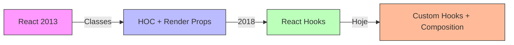
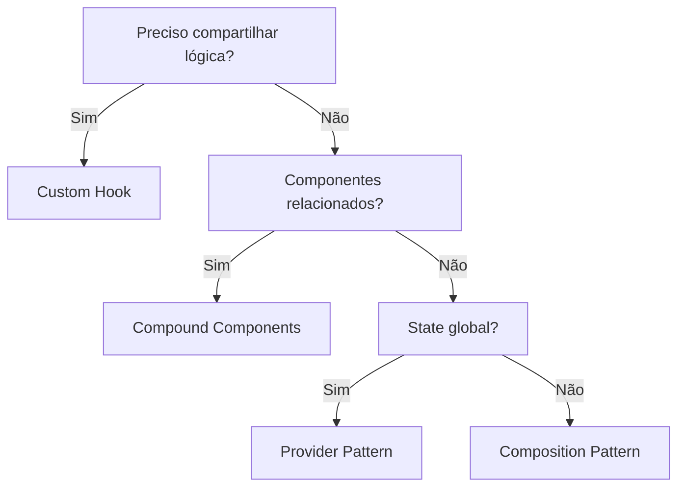

# 🎨 **React Patterns - Guia Completo**

> **Padrões de design e composição para criar componentes React reutilizáveis, flexíveis e escaláveis**

---

## 📑 **Índice**

1. [Introdução aos Patterns](#1-introdução-aos-patterns)
2. [Composition Pattern](#2-composition-pattern)
3. [Container/Presentational Pattern](#3-containerpresentational-pattern)
4. [Higher-Order Components (HOC)](#4-higher-order-components-hoc)
5. [Render Props Pattern](#5-render-props-pattern)
6. [Compound Components Pattern](#6-compound-components-pattern)
7. [Control Props Pattern](#7-control-props-pattern)
8. [Custom Hooks Pattern](#8-custom-hooks-pattern)
9. [State Reducer Pattern](#9-state-reducer-pattern)
10. [Provider Pattern](#10-provider-pattern)
11. [Proxy Pattern](#11-proxy-pattern)
12. [Observer Pattern](#12-observer-pattern)
13. [Module Pattern](#13-module-pattern)
14. [Comparação de Patterns](#14-comparação-de-patterns)
15. [Recursos e Referências](#15-recursos-e-referências)

---

## 1. 🎯 **Introdução aos Patterns**

### 1.1. O que são React Patterns?

**React Patterns** são soluções reutilizáveis para problemas comuns no desenvolvimento React.

**Por que usar patterns?**
- ✅ **Reutilização** de código
- ✅ **Manutenibilidade** melhor
- ✅ **Flexibilidade** e extensibilidade
- ✅ **Separação de responsabilidades**
- ✅ **Testabilidade** mais fácil

### 1.2. Evolução dos Patterns



**Timeline:**

| Ano | Pattern | Status |
|-----|---------|--------|
| 2013-2018 | **Container/Presentational** | 🟡 Ainda usado |
| 2015-2019 | **HOC (Higher-Order Components)** | 🟡 Legacy (use hooks) |
| 2016-2019 | **Render Props** | 🟡 Legacy (use hooks) |
| 2018+ | **Compound Components** | ✅ Ainda relevante |
| 2019+ | **Custom Hooks** | ✅ Padrão moderno |
| 2020+ | **Composition** | ✅ Recomendado |

### 1.3. Quando Usar Cada Pattern

```jsx
// Problema: Compartilhar lógica entre componentes

// ❌ 2015: Mixins (descontinuado)
// ❌ 2016: HOC (verboso)
// ❌ 2017: Render Props (callback hell)
// ✅ 2019+: Custom Hooks (simples!)

// Exemplo:
// Antes (HOC)
const UserProfile = withAuth(withTheme(withData(Component)));

// Depois (Hooks)
function UserProfile() {
  const user = useAuth();
  const theme = useTheme();
  const data = useData();
  
  return <div>...</div>;
}
```

---

## 2. 🧩 **Composition Pattern**

### 2.1. Conceito

**Composition** é o pattern fundamental do React: **construir componentes complexos combinando componentes simples**.

**Princípio:** "Prefira composição a herança"

### 2.2. Composition vs Herança

**❌ Herança (não use em React):**

```jsx
// ❌ ANTI-PATTERN: Herança
class Button extends React.Component {
  render() {
    return <button>{this.props.children}</button>;
  }
}

class PrimaryButton extends Button {  // ❌ Herança
  render() {
    return (
      <button className="primary">
        {this.props.children}
      </button>
    );
  }
}

// Problemas:
// - Acoplamento forte
// - Difícil de estender
// - Não idiomático em React
```

**✅ Composition:**

```jsx
// ✅ COMPOSITION: Componentes pequenos e compostos
function Button({ variant = 'default', children, ...props }) {
  const className = `btn btn-${variant}`;
  
  return (
    <button className={className} {...props}>
      {children}
    </button>
  );
}

// Uso
<Button variant="primary">Click me</Button>
<Button variant="secondary">Cancel</Button>

// ✅ Flexível, simples, idiomático
```

### 2.3. Children Composition

```jsx
// ═══════════════════════════════════════════════════════════
// CHILDREN: Slot básico
// ═══════════════════════════════════════════════════════════

function Card({ children }) {
  return (
    <div className="card">
      {children}
    </div>
  );
}

// Uso
<Card>
  <h2>Title</h2>
  <p>Content here...</p>
</Card>

// ═══════════════════════════════════════════════════════════
// NAMED SLOTS: Múltiplos slots
// ═══════════════════════════════════════════════════════════

function Card({ header, content, footer }) {
  return (
    <div className="card">
      <div className="card-header">{header}</div>
      <div className="card-content">{content}</div>
      <div className="card-footer">{footer}</div>
    </div>
  );
}

// Uso
<Card
  header={<h2>Title</h2>}
  content={<p>Content here...</p>}
  footer={<button>Action</button>}
/>

// ═══════════════════════════════════════════════════════════
// ESPECIALIZAÇÃO: Componentes específicos
// ═══════════════════════════════════════════════════════════

function Dialog({ children }) {
  return (
    <div className="dialog">
      <div className="dialog-overlay" />
      <div className="dialog-content">
        {children}
      </div>
    </div>
  );
}

function WelcomeDialog() {
  return (
    <Dialog>
      <h1>Welcome!</h1>
      <p>Thank you for visiting our site.</p>
    </Dialog>
  );
}

function ConfirmDialog({ onConfirm, onCancel }) {
  return (
    <Dialog>
      <h1>Are you sure?</h1>
      <p>This action cannot be undone.</p>
      <button onClick={onConfirm}>Confirm</button>
      <button onClick={onCancel}>Cancel</button>
    </Dialog>
  );
}
```

### 2.4. Layout Composition

```jsx
// ═══════════════════════════════════════════════════════════
// LAYOUT PATTERN: Separar estrutura de conteúdo
// ═══════════════════════════════════════════════════════════

// ─────────────────────────────────────────────────────
// Layout genérico
// ─────────────────────────────────────────────────────
function PageLayout({ sidebar, content }) {
  return (
    <div className="page-layout">
      <aside className="sidebar">{sidebar}</aside>
      <main className="content">{content}</main>
    </div>
  );
}

// ─────────────────────────────────────────────────────
// Página específica
// ─────────────────────────────────────────────────────
function DashboardPage() {
  return (
    <PageLayout
      sidebar={
        <nav>
          <a href="/dashboard">Dashboard</a>
          <a href="/profile">Profile</a>
          <a href="/settings">Settings</a>
        </nav>
      }
      content={
        <div>
          <h1>Dashboard</h1>
          <DashboardWidgets />
        </div>
      }
    />
  );
}

// ═══════════════════════════════════════════════════════════
// SPLIT PANE: Divisão responsiva
// ═══════════════════════════════════════════════════════════

function SplitPane({ left, right }) {
  return (
    <div className="split-pane">
      <div className="split-pane-left">{left}</div>
      <div className="split-pane-right">{right}</div>
    </div>
  );
}

// Uso
function App() {
  return (
    <SplitPane
      left={<ContactList />}
      right={<ChatWindow />}
    />
  );
}
```

### 2.5. Composition com Props

```jsx
// ═══════════════════════════════════════════════════════════
// FORWARDING PROPS: Passar props para children
// ═══════════════════════════════════════════════════════════

function FancyBorder({ color, children }) {
  return (
    <div className={`fancy-border fancy-border-${color}`}>
      {children}
    </div>
  );
}

function WelcomeDialog() {
  return (
    <FancyBorder color="blue">
      <h1 className="dialog-title">Welcome</h1>
      <p className="dialog-message">Thank you!</p>
    </FancyBorder>
  );
}

// ═══════════════════════════════════════════════════════════
// CLONING CHILDREN: Adicionar props aos children
// ═══════════════════════════════════════════════════════════

import { Children, cloneElement } from 'react';

function RadioGroup({ children, name, value, onChange }) {
  return (
    <div className="radio-group">
      {Children.map(children, (child) => {
        // ✅ Injeta props nos children
        return cloneElement(child, {
          name,
          checked: child.props.value === value,
          onChange
        });
      })}
    </div>
  );
}

function Radio({ value, checked, onChange, children }) {
  return (
    <label>
      <input
        type="radio"
        value={value}
        checked={checked}
        onChange={(e) => onChange(e.target.value)}
      />
      {children}
    </label>
  );
}

// Uso
function ColorPicker() {
  const [color, setColor] = useState('red');
  
  return (
    <RadioGroup name="color" value={color} onChange={setColor}>
      <Radio value="red">Red</Radio>
      <Radio value="green">Green</Radio>
      <Radio value="blue">Blue</Radio>
    </RadioGroup>
  );
}

// ✅ RadioGroup injeta name, checked, onChange automaticamente!
```

### 2.6. Exemplo Completo - Card System

```jsx
// ═══════════════════════════════════════════════════════════
// CARD SYSTEM: Composition completo
// ═══════════════════════════════════════════════════════════

// ─────────────────────────────────────────────────────
// Componentes base
// ─────────────────────────────────────────────────────
function Card({ children, className = '' }) {
  return (
    <div className={`card ${className}`}>
      {children}
    </div>
  );
}

function CardHeader({ children }) {
  return <div className="card-header">{children}</div>;
}

function CardBody({ children }) {
  return <div className="card-body">{children}</div>;
}

function CardFooter({ children }) {
  return <div className="card-footer">{children}</div>;
}

function CardTitle({ children }) {
  return <h2 className="card-title">{children}</h2>;
}

function CardText({ children }) {
  return <p className="card-text">{children}</p>;
}

// ─────────────────────────────────────────────────────
// Uso: Componha como quiser!
// ─────────────────────────────────────────────────────
function UserCard({ user }) {
  return (
    <Card>
      <CardHeader>
        <CardTitle>{user.name}</CardTitle>
      </CardHeader>
      <CardBody>
        <CardText>{user.bio}</CardText>
        <CardText>Email: {user.email}</CardText>
      </CardBody>
      <CardFooter>
        <button>Follow</button>
        <button>Message</button>
      </CardFooter>
    </Card>
  );
}

function ProductCard({ product }) {
  return (
    <Card>
      <CardBody>
        
        <CardTitle>{product.name}</CardTitle>
        <CardText>${product.price}</CardText>
      </CardBody>
      <CardFooter>
        <button>Add to Cart</button>
      </CardFooter>
    </Card>
  );
}

function StatCard({ title, value, icon }) {
  return (
    <Card className="stat-card">
      <CardBody>
        <div className="stat-icon">{icon}</div>
        <CardText>{title}</CardText>
        <CardTitle>{value}</CardTitle>
      </CardBody>
    </Card>
  );
}

// ✅ Extremamente flexível!
// ✅ Cada card usa apenas o que precisa
// ✅ Fácil de entender e manter
```

---

## 3. 📦 **Container/Presentational Pattern**

### 3.1. Conceito

**Separar lógica (Container) de apresentação (Presentational).**

**Container (Smart Component):**
- Gerencia **state e lógica**
- Conecta com **APIs/stores**
- Não tem **estilos visuais**

**Presentational (Dumb Component):**
- Apenas **UI**
- Recebe dados via **props**
- **Stateless** (ou state local UI)

### 3.2. Exemplo Básico

```jsx
// ═══════════════════════════════════════════════════════════
// PRESENTATIONAL: Apenas UI
// ═══════════════════════════════════════════════════════════

function UserList({ users, onUserClick }) {
  return (
    <ul className="user-list">
      {users.map(user => (
        <li key={user.id} onClick={() => onUserClick(user)}>
          
          <div>
            <h3>{user.name}</h3>
            <p>{user.email}</p>
          </div>
        </li>
      ))}
    </ul>
  );
}

// ═══════════════════════════════════════════════════════════
// CONTAINER: Lógica e dados
// ═══════════════════════════════════════════════════════════

function UserListContainer() {
  const [users, setUsers] = useState([]);
  const [loading, setLoading] = useState(true);
  const navigate = useNavigate();

  useEffect(() => {
    fetch('/api/users')
      .then(res => res.json())
      .then(data => {
        setUsers(data);
        setLoading(false);
      });
  }, []);

  const handleUserClick = (user) => {
    navigate(`/users/${user.id}`);
  };

  if (loading) return <div>Loading...</div>;

  // ✅ Passa dados e callbacks para apresentação
  return <UserList users={users} onUserClick={handleUserClick} />;
}
```

### 3.3. Exemplo Completo - Todo App

```jsx
// ═══════════════════════════════════════════════════════════
// PRESENTATIONAL COMPONENTS
// ═══════════════════════════════════════════════════════════

// ─────────────────────────────────────────────────────
// TodoItem.jsx (apenas apresentação)
// ─────────────────────────────────────────────────────
function TodoItem({ todo, onToggle, onDelete }) {
  return (
    <li className={todo.completed ? 'completed' : ''}>
      <input
        type="checkbox"
        checked={todo.completed}
        onChange={() => onToggle(todo.id)}
      />
      <span>{todo.text}</span>
      <button onClick={() => onDelete(todo.id)}>Delete</button>
    </li>
  );
}

// ─────────────────────────────────────────────────────
// TodoList.jsx (apenas apresentação)
// ─────────────────────────────────────────────────────
function TodoList({ todos, onToggle, onDelete }) {
  if (todos.length === 0) {
    return <p>No todos yet!</p>;
  }

  return (
    <ul className="todo-list">
      {todos.map(todo => (
        <TodoItem
          key={todo.id}
          todo={todo}
          onToggle={onToggle}
          onDelete={onDelete}
        />
      ))}
    </ul>
  );
}

// ─────────────────────────────────────────────────────
// TodoForm.jsx (apresentação com state local UI)
// ─────────────────────────────────────────────────────
function TodoForm({ onSubmit }) {
  const [text, setText] = useState('');

  const handleSubmit = (e) => {
    e.preventDefault();
    if (text.trim()) {
      onSubmit(text);
      setText('');
    }
  };

  return (
    <form onSubmit={handleSubmit}>
      <input
        type="text"
        value={text}
        onChange={(e) => setText(e.target.value)}
        placeholder="What needs to be done?"
      />
      <button type="submit">Add</button>
    </form>
  );
}

// ─────────────────────────────────────────────────────
// TodoFilters.jsx (apenas apresentação)
// ─────────────────────────────────────────────────────
function TodoFilters({ filter, onFilterChange }) {
  return (
    <div className="filters">
      <button
        className={filter === 'all' ? 'active' : ''}
        onClick={() => onFilterChange('all')}
      >
        All
      </button>
      <button
        className={filter === 'active' ? 'active' : ''}
        onClick={() => onFilterChange('active')}
      >
        Active
      </button>
      <button
        className={filter === 'completed' ? 'active' : ''}
        onClick={() => onFilterChange('completed')}
      >
        Completed
      </button>
    </div>
  );
}

// ═══════════════════════════════════════════════════════════
// CONTAINER COMPONENT
// ═══════════════════════════════════════════════════════════

function TodoAppContainer() {
  const [todos, setTodos] = useState([]);
  const [filter, setFilter] = useState('all');

  // ─────────────────────────────────────────────────────
  // Lógica de negócio
  // ─────────────────────────────────────────────────────
  const addTodo = (text) => {
    setTodos([
      ...todos,
      { id: Date.now(), text, completed: false }
    ]);
  };

  const toggleTodo = (id) => {
    setTodos(
      todos.map(todo =>
        todo.id === id ? { ...todo, completed: !todo.completed } : todo
      )
    );
  };

  const deleteTodo = (id) => {
    setTodos(todos.filter(todo => todo.id !== id));
  };

  // ─────────────────────────────────────────────────────
  // Filtrar todos
  // ─────────────────────────────────────────────────────
  const filteredTodos = todos.filter(todo => {
    if (filter === 'active') return !todo.completed;
    if (filter === 'completed') return todo.completed;
    return true;
  });

  // ─────────────────────────────────────────────────────
  // Renderiza componentes apresentacionais
  // ─────────────────────────────────────────────────────
  return (
    <div className="todo-app">
      <h1>Todos</h1>
      
      <TodoForm onSubmit={addTodo} />
      
      <TodoFilters filter={filter} onFilterChange={setFilter} />
      
      <TodoList
        todos={filteredTodos}
        onToggle={toggleTodo}
        onDelete={deleteTodo}
      />
      
      <div className="stats">
        {todos.filter(t => !t.completed).length} items left
      </div>
    </div>
  );
}

// ✅ BENEFÍCIOS:
// - TodoList, TodoItem, TodoForm: reutilizáveis
// - Fácil de testar (componentes puros)
// - Lógica centralizada no container
// - UI components podem ser no Storybook
```

### 3.4. Quando Usar

**✅ Use Container/Presentational quando:**
- Componente tem **lógica complexa**
- Quer **reutilizar UI** com dados diferentes
- Precisa **testar** lógica separadamente
- **Storybook** para design system

**❌ Não use quando:**
- Componente é **muito simples**
- Não vai **reutilizar**
- **Custom hooks** resolvem melhor (moderno)

**🔄 Alternativa Moderna: Custom Hooks**

```jsx
// ✅ MODERNO: Extrair lógica para hook
function useTodos() {
  const [todos, setTodos] = useState([]);
  const [filter, setFilter] = useState('all');

  const addTodo = (text) => {
    setTodos([...todos, { id: Date.now(), text, completed: false }]);
  };

  const toggleTodo = (id) => {
    setTodos(todos.map(t => t.id === id ? { ...t, completed: !t.completed } : t));
  };

  const filteredTodos = todos.filter(todo => {
    if (filter === 'active') return !todo.completed;
    if (filter === 'completed') return todo.completed;
    return true;
  });

  return { todos: filteredTodos, filter, addTodo, toggleTodo, setFilter };
}

// Componente
function TodoApp() {
  const { todos, filter, addTodo, toggleTodo, setFilter } = useTodos();

  return (
    <div>
      <TodoForm onSubmit={addTodo} />
      <TodoFilters filter={filter} onFilterChange={setFilter} />
      <TodoList todos={todos} onToggle={toggleTodo} />
    </div>
  );
}

// ✅ Mesmo benefício, menos verbosidade!
```

---

## 4. 🎭 **Higher-Order Components (HOC)**

### 4.1. Conceito

**HOC** é uma função que **recebe um componente e retorna um novo componente** com funcionalidade adicional.

```jsx
// Pattern
const EnhancedComponent = higherOrderComponent(WrappedComponent);
```

**⚠️ Status:** Legacy pattern (use Custom Hooks em código novo)

**Ainda usado em:**
- React Router (`withRouter`)
- Redux (`connect`)
- Material-UI (`withStyles`)
- Bibliotecas antigas

### 4.2. Exemplo Básico

```jsx
// ═══════════════════════════════════════════════════════════
// HOC BÁSICO: withLoading
// ═══════════════════════════════════════════════════════════

function withLoading(Component) {
  return function WithLoadingComponent({ isLoading, ...props }) {
    if (isLoading) {
      return <div>Loading...</div>;
    }
    
    return <Component {...props} />;
  };
}

// Componente original
function UserList({ users }) {
  return (
    <ul>
      {users.map(user => (
        <li key={user.id}>{user.name}</li>
      ))}
    </ul>
  );
}

// ✅ Componente aprimorado
const UserListWithLoading = withLoading(UserList);

// Uso
function App() {
  const [users, setUsers] = useState([]);
  const [loading, setLoading] = useState(true);

  useEffect(() => {
    fetch('/api/users')
      .then(res => res.json())
      .then(data => {
        setUsers(data);
        setLoading(false);
      });
  }, []);

  return <UserListWithLoading isLoading={loading} users={users} />;
}
```

### 4.3. HOC com Props Adicionais

```jsx
// ═══════════════════════════════════════════════════════════
// withAuth: Proteger rotas
// ═══════════════════════════════════════════════════════════

function withAuth(Component) {
  return function WithAuthComponent(props) {
    const { user, loading } = useAuth();  // Custom hook
    const navigate = useNavigate();

    useEffect(() => {
      if (!loading && !user) {
        navigate('/login');
      }
    }, [user, loading, navigate]);

    if (loading) {
      return <div>Loading...</div>;
    }

    if (!user) {
      return null;
    }

    // ✅ Injeta user como prop
    return <Component {...props} user={user} />;
  };
}

// Uso
function Dashboard({ user }) {
  return <h1>Welcome, {user.name}!</h1>;
}

const ProtectedDashboard = withAuth(Dashboard);

// ═══════════════════════════════════════════════════════════
// withTheme: Injetar tema
// ═══════════════════════════════════════════════════════════

function withTheme(Component) {
  return function WithThemeComponent(props) {
    const theme = useContext(ThemeContext);
    
    return <Component {...props} theme={theme} />;
  };
}

// Uso
function Button({ theme, children }) {
  return (
    <button style={{ background: theme.primary }}>
      {children}
    </button>
  );
}

const ThemedButton = withTheme(Button);
```

### 4.4. Composição de HOCs

```jsx
// ═══════════════════════════════════════════════════════════
// COMPOSIÇÃO: Múltiplos HOCs
// ═══════════════════════════════════════════════════════════

// ❌ RUIM: Pyramid of doom
const EnhancedComponent = withAuth(
  withTheme(
    withLoading(
      withError(Component)
    )
  )
);

// ✅ BOM: Compose helper
function compose(...funcs) {
  return funcs.reduce((a, b) => (...args) => a(b(...args)));
}

const enhance = compose(
  withAuth,
  withTheme,
  withLoading,
  withError
);

const EnhancedComponent = enhance(Component);

// ✅ MELHOR: Usar biblioteca (recompose está deprecated, use hooks!)
import { compose } from 'redux';

const EnhancedComponent = compose(
  withAuth,
  withTheme,
  withLoading
)(Component);
```

### 4.5. HOC vs Custom Hooks

**❌ HOC (Legacy):**

```jsx
// ❌ ANTES: HOC
function withMouse(Component) {
  return function WithMouseComponent(props) {
    const [position, setPosition] = useState({ x: 0, y: 0 });

    useEffect(() => {
      const handleMove = (e) => {
        setPosition({ x: e.clientX, y: e.clientY });
      };
      
      window.addEventListener('mousemove', handleMove);
      return () => window.removeEventListener('mousemove', handleMove);
    }, []);

    return <Component {...props} mouse={position} />;
  };
}

// Uso
function MouseTracker({ mouse }) {
  return <div>Mouse: {mouse.x}, {mouse.y}</div>;
}

const EnhancedMouseTracker = withMouse(MouseTracker);

// Problemas:
// - Props collision (e se já existir prop 'mouse'?)
// - Wrapper hell (muitos HOCs = muitos wrappers)
// - Difícil debug (DevTools cheio de WithXComponent)
```

**✅ Custom Hook (Moderno):**

```jsx
// ✅ AGORA: Custom Hook
function useMouse() {
  const [position, setPosition] = useState({ x: 0, y: 0 });

  useEffect(() => {
    const handleMove = (e) => {
      setPosition({ x: e.clientX, y: e.clientY });
    };
    
    window.addEventListener('mousemove', handleMove);
    return () => window.removeEventListener('mousemove', handleMove);
  }, []);

  return position;
}

// Uso
function MouseTracker() {
  const mouse = useMouse();
  
  return <div>Mouse: {mouse.x}, {mouse.y}</div>;
}

// ✅ Vantagens:
// - Sem wrapper components
// - Composição clara
// - Fácil debug
// - TypeScript melhor
```

### 4.6. Quando Ainda Usar HOC

**✅ Use HOC quando:**
- **Biblioteca antiga** requer (Redux `connect`, Router `withRouter`)
- Precisa **wrapping visual** (ex: adicionar layout)
- **Lazy loading** ou code splitting

**❌ Não use para:**
- Compartilhar **lógica** (use hooks)
- Injetar **props** (use hooks)
- **Composição** (use children/composition pattern)

---

## 5. 🎨 **Render Props Pattern**

### 5.1. Conceito

**Render Props** é passar uma **função como prop** que retorna um elemento React.

```jsx
<Component render={(data) => <div>{data}</div>} />
```

**⚠️ Status:** Legacy (use hooks), mas ainda útil em alguns casos

### 5.2. Exemplo Básico

```jsx
// ═══════════════════════════════════════════════════════════
// RENDER PROP: Mouse tracker
// ═══════════════════════════════════════════════════════════

function Mouse({ render }) {
  const [position, setPosition] = useState({ x: 0, y: 0 });

  useEffect(() => {
    const handleMove = (e) => {
      setPosition({ x: e.clientX, y: e.clientY });
    };
    
    window.addEventListener('mousemove', handleMove);
    return () => window.removeEventListener('mousemove', handleMove);
  }, []);

  // ✅ Chama função render com dados
  return render(position);
}

// Uso
function App() {
  return (
    <Mouse
      render={(mouse) => (
        <div>
          Mouse position: {mouse.x}, {mouse.y}
        </div>
      )}
    />
  );
}

// Ou com children (common pattern)
function MouseWithChildren({ children }) {
  const [position, setPosition] = useState({ x: 0, y: 0 });

  useEffect(() => {
    const handleMove = (e) => {
      setPosition({ x: e.clientX, y: e.clientY });
    };
    
    window.addEventListener('mousemove', handleMove);
    return () => window.removeEventListener('mousemove', handleMove);
  }, []);

  return children(position);
}

// Uso
<MouseWithChildren>
  {(mouse) => (
    <div>Mouse: {mouse.x}, {mouse.y}</div>
  )}
</MouseWithChildren>
```

### 5.3. Exemplo Completo - DataFetcher

```jsx
// ═══════════════════════════════════════════════════════════
// RENDER PROP: Data fetching
// ═══════════════════════════════════════════════════════════

function DataFetcher({ url, render }) {
  const [data, setData] = useState(null);
  const [loading, setLoading] = useState(true);
  const [error, setError] = useState(null);

  useEffect(() => {
    setLoading(true);
    
    fetch(url)
      .then(res => res.json())
      .then(data => {
        setData(data);
        setLoading(false);
      })
      .catch(err => {
        setError(err);
        setLoading(false);
      });
  }, [url]);

  // ✅ Passa estado para render function
  return render({ data, loading, error });
}

// ─────────────────────────────────────────────────────
// Uso: Users list
// ─────────────────────────────────────────────────────
function UsersList() {
  return (
    <DataFetcher
      url="/api/users"
      render={({ data, loading, error }) => {
        if (loading) return <div>Loading users...</div>;
        if (error) return <div>Error: {error.message}</div>;
        
        return (
          <ul>
            {data.map(user => (
              <li key={user.id}>{user.name}</li>
            ))}
          </ul>
        );
      }}
    />
  );
}

// ─────────────────────────────────────────────────────
// Uso: Posts list (reutiliza DataFetcher!)
// ─────────────────────────────────────────────────────
function PostsList() {
  return (
    <DataFetcher
      url="/api/posts"
      render={({ data, loading, error }) => {
        if (loading) return <div>Loading posts...</div>;
        if (error) return <div>Error: {error.message}</div>;
        
        return (
          <div>
            {data.map(post => (
              <article key={post.id}>
                <h2>{post.title}</h2>
                <p>{post.body}</p>
              </article>
            ))}
          </div>
        );
      }}
    />
  );
}
```

### 5.4. Children as Function

```jsx
// ═══════════════════════════════════════════════════════════
// CHILDREN AS FUNCTION: Variação comum
// ═══════════════════════════════════════════════════════════

function Toggle({ children }) {
  const [on, setOn] = useState(false);

  const toggle = () => setOn(!on);

  // ✅ children é uma função
  return children({ on, toggle });
}

// Uso
function App() {
  return (
    <Toggle>
      {({ on, toggle }) => (
        <div>
          <p>The button is {on ? 'ON' : 'OFF'}</p>
          <button onClick={toggle}>Toggle</button>
        </div>
      )}
    </Toggle>
  );
}

// ═══════════════════════════════════════════════════════════
// TABS: Exemplo prático
// ═══════════════════════════════════════════════════════════

function Tabs({ children, defaultTab = 0 }) {
  const [activeTab, setActiveTab] = useState(defaultTab);

  return children({
    activeTab,
    setActiveTab
  });
}

// Uso
<Tabs defaultTab={0}>
  {({ activeTab, setActiveTab }) => (
    <div>
      <div className="tab-headers">
        <button onClick={() => setActiveTab(0)}>Tab 1</button>
        <button onClick={() => setActiveTab(1)}>Tab 2</button>
        <button onClick={() => setActiveTab(2)}>Tab 3</button>
      </div>
      
      <div className="tab-content">
        {activeTab === 0 && <div>Content 1</div>}
        {activeTab === 1 && <div>Content 2</div>}
        {activeTab === 2 && <div>Content 3</div>}
      </div>
    </div>
  )}
</Tabs>
```

### 5.5. Render Props vs Hooks

**❌ Render Props (Legacy):**

```jsx
// ❌ ANTES: Render prop
<DataFetcher url="/api/users">
  {({ data, loading }) => (
    loading ? <div>Loading...</div> : <UserList users={data} />
  )}
</DataFetcher>

// Problemas:
// - Callback hell (múltiplos render props aninhados)
// - Verboso
// - Performance (re-cria função toda render)
```

**✅ Custom Hook (Moderno):**

```jsx
// ✅ AGORA: Custom hook
function useDataFetch(url) {
  const [data, setData] = useState(null);
  const [loading, setLoading] = useState(true);

  useEffect(() => {
    fetch(url)
      .then(res => res.json())
      .then(setData)
      .finally(() => setLoading(false));
  }, [url]);

  return { data, loading };
}

// Uso
function UsersList() {
  const { data, loading } = useDataFetch('/api/users');

  if (loading) return <div>Loading...</div>;
  return <UserList users={data} />;
}

// ✅ Mais limpo, mais simples!
```

### 5.6. Quando Ainda Usar Render Props

**✅ Use Render Props quando:**
- **UI variations** (mesmo data, múltiplas UIs)
- **Lib externa** usa (React Router `<Route render={...} />`)
- **Layout control** pelo consumidor

**Exemplo válido - React Router:**

```jsx
<Route
  path="/users/:id"
  render={({ match }) => (
    <UserProfile userId={match.params.id} />
  )}
/>
```

---

## 6. 🔗 **Compound Components Pattern**

### 6.1. Conceito

**Compound Components** são componentes que **trabalham juntos** compartilhando estado implícito.

**Exemplo:** `<select>` e `<option>` em HTML

```html
<select>
  <option value="1">Option 1</option>
  <option value="2">Option 2</option>
</select>
```

**Em React:**

```jsx
<Tabs>
  <Tab label="Tab 1">Content 1</Tab>
  <Tab label="Tab 2">Content 2</Tab>
</Tabs>
```

### 6.2. Exemplo Básico - Toggle

```jsx
// ═══════════════════════════════════════════════════════════
// COMPOUND COMPONENTS: Toggle
// ═══════════════════════════════════════════════════════════

import { createContext, useContext, useState } from 'react';

// ─────────────────────────────────────────────────────
// Context para compartilhar state
// ─────────────────────────────────────────────────────
const ToggleContext = createContext();

function useToggleContext() {
  const context = useContext(ToggleContext);
  if (!context) {
    throw new Error('Toggle components must be used within <Toggle>');
  }
  return context;
}

// ─────────────────────────────────────────────────────
// Componente pai
// ─────────────────────────────────────────────────────
function Toggle({ children }) {
  const [on, setOn] = useState(false);

  const toggle = () => setOn(!on);

  return (
    <ToggleContext.Provider value={{ on, toggle }}>
      {children}
    </ToggleContext.Provider>
  );
}

// ─────────────────────────────────────────────────────
// Sub-componentes
// ─────────────────────────────────────────────────────
function ToggleOn({ children }) {
  const { on } = useToggleContext();
  return on ? children : null;
}

function ToggleOff({ children }) {
  const { on } = useToggleContext();
  return on ? null : children;
}

function ToggleButton({ children }) {
  const { on, toggle } = useToggleContext();
  
  return (
    <button onClick={toggle}>
      {children || (on ? 'ON' : 'OFF')}
    </button>
  );
}

// ─────────────────────────────────────────────────────
// Exportar como compound
// ─────────────────────────────────────────────────────
Toggle.On = ToggleOn;
Toggle.Off = ToggleOff;
Toggle.Button = ToggleButton;

export default Toggle;

// ═══════════════════════════════════════════════════════════
// USO
// ═══════════════════════════════════════════════════════════

function App() {
  return (
    <Toggle>
      <Toggle.On>
        <div>✅ The toggle is ON</div>
      </Toggle.On>
      
      <Toggle.Off>
        <div>❌ The toggle is OFF</div>
      </Toggle.Off>
      
      <Toggle.Button />
    </Toggle>
  );
}

// ✅ BENEFÍCIOS:
// - API declarativa e intuitiva
// - Componentes sabem uns dos outros (via Context)
// - Flexível: ordene como quiser!
```

### 6.3. Exemplo Completo - Tabs

```jsx
// ═══════════════════════════════════════════════════════════
// COMPOUND COMPONENTS: Tabs System
// ═══════════════════════════════════════════════════════════

import { createContext, useContext, useState, Children, cloneElement } from 'react';

// ─────────────────────────────────────────────────────
// Context
// ─────────────────────────────────────────────────────
const TabsContext = createContext();

function useTabsContext() {
  const context = useContext(TabsContext);
  if (!context) {
    throw new Error('Tabs components must be used within <Tabs>');
  }
  return context;
}

// ─────────────────────────────────────────────────────
// Tabs (pai)
// ─────────────────────────────────────────────────────
function Tabs({ children, defaultIndex = 0, onChange }) {
  const [activeIndex, setActiveIndex] = useState(defaultIndex);

  const selectTab = (index) => {
    setActiveIndex(index);
    onChange?.(index);
  };

  return (
    <TabsContext.Provider value={{ activeIndex, selectTab }}>
      <div className="tabs">{children}</div>
    </TabsContext.Provider>
  );
}

// ─────────────────────────────────────────────────────
// TabList
// ─────────────────────────────────────────────────────
function TabList({ children }) {
  const childrenWithProps = Children.map(children, (child, index) => {
    // ✅ Injeta index automaticamente
    return cloneElement(child, { index });
  });

  return (
    <div className="tab-list" role="tablist">
      {childrenWithProps}
    </div>
  );
}

// ─────────────────────────────────────────────────────
// Tab
// ─────────────────────────────────────────────────────
function Tab({ children, index }) {
  const { activeIndex, selectTab } = useTabsContext();
  const isActive = activeIndex === index;

  return (
    <button
      role="tab"
      aria-selected={isActive}
      className={`tab ${isActive ? 'active' : ''}`}
      onClick={() => selectTab(index)}
    >
      {children}
    </button>
  );
}

// ─────────────────────────────────────────────────────
// TabPanels
// ─────────────────────────────────────────────────────
function TabPanels({ children }) {
  const childrenWithProps = Children.map(children, (child, index) => {
    return cloneElement(child, { index });
  });

  return <div className="tab-panels">{childrenWithProps}</div>;
}

// ─────────────────────────────────────────────────────
// TabPanel
// ─────────────────────────────────────────────────────
function TabPanel({ children, index }) {
  const { activeIndex } = useTabsContext();
  
  if (activeIndex !== index) return null;

  return (
    <div role="tabpanel" className="tab-panel">
      {children}
    </div>
  );
}

// ─────────────────────────────────────────────────────
// Compound export
// ─────────────────────────────────────────────────────
Tabs.List = TabList;
Tabs.Tab = Tab;
Tabs.Panels = TabPanels;
Tabs.Panel = TabPanel;

export default Tabs;

// ═══════════════════════════════════════════════════════════
// USO
// ═══════════════════════════════════════════════════════════

function App() {
  return (
    <Tabs defaultIndex={0} onChange={(index) => console.log(index)}>
      <Tabs.List>
        <Tabs.Tab>Profile</Tabs.Tab>
        <Tabs.Tab>Settings</Tabs.Tab>
        <Tabs.Tab>Notifications</Tabs.Tab>
      </Tabs.List>

      <Tabs.Panels>
        <Tabs.Panel>
          <h2>Profile</h2>
          <p>Your profile information...</p>
        </Tabs.Panel>
        
        <Tabs.Panel>
          <h2>Settings</h2>
          <p>Your settings...</p>
        </Tabs.Panel>
        
        <Tabs.Panel>
          <h2>Notifications</h2>
          <p>Your notifications...</p>
        </Tabs.Panel>
      </Tabs.Panels>
    </Tabs>
  );
}

// ✅ API limpa e declarativa!
// ✅ Ordem flexível
// ✅ Compartilhamento implícito de state
```

### 6.4. Exemplo - Accordion

```jsx
// ═══════════════════════════════════════════════════════════
// COMPOUND COMPONENTS: Accordion
// ═══════════════════════════════════════════════════════════

const AccordionContext = createContext();

function Accordion({ children, allowMultiple = false }) {
  const [openItems, setOpenItems] = useState([]);

  const toggle = (index) => {
    if (allowMultiple) {
      setOpenItems(prev =>
        prev.includes(index)
          ? prev.filter(i => i !== index)
          : [...prev, index]
      );
    } else {
      setOpenItems(prev =>
        prev.includes(index) ? [] : [index]
      );
    }
  };

  const isOpen = (index) => openItems.includes(index);

  return (
    <AccordionContext.Provider value={{ toggle, isOpen }}>
      <div className="accordion">{children}</div>
    </AccordionContext.Provider>
  );
}

function AccordionItem({ children, index }) {
  return <div className="accordion-item">{children}</div>;
}

function AccordionButton({ children, index }) {
  const { toggle, isOpen } = useContext(AccordionContext);
  const open = isOpen(index);

  return (
    <button
      className="accordion-button"
      onClick={() => toggle(index)}
      aria-expanded={open}
    >
      {children}
      <span>{open ? '▲' : '▼'}</span>
    </button>
  );
}

function AccordionPanel({ children, index }) {
  const { isOpen } = useContext(AccordionContext);
  
  if (!isOpen(index)) return null;

  return (
    <div className="accordion-panel">
      {children}
    </div>
  );
}

Accordion.Item = AccordionItem;
Accordion.Button = AccordionButton;
Accordion.Panel = AccordionPanel;

// USO
<Accordion allowMultiple>
  <Accordion.Item index={0}>
    <Accordion.Button index={0}>
      Section 1
    </Accordion.Button>
    <Accordion.Panel index={0}>
      Content for section 1
    </Accordion.Panel>
  </Accordion.Item>

  <Accordion.Item index={1}>
    <Accordion.Button index={1}>
      Section 2
    </Accordion.Button>
    <Accordion.Panel index={1}>
      Content for section 2
    </Accordion.Panel>
  </Accordion.Item>
</Accordion>
```

### 6.5. Flexible Compound Components

```jsx
// ═══════════════════════════════════════════════════════════
// FLEXIBLE: Aceita componentes em qualquer ordem
// ═══════════════════════════════════════════════════════════

function Modal({ children, isOpen, onClose }) {
  if (!isOpen) return null;

  return (
    <ModalContext.Provider value={{ onClose }}>
      <div className="modal-overlay" onClick={onClose}>
        <div className="modal-content" onClick={(e) => e.stopPropagation()}>
          {children}
        </div>
      </div>
    </ModalContext.Provider>
  );
}

function ModalHeader({ children }) {
  return <div className="modal-header">{children}</div>;
}

function ModalBody({ children }) {
  return <div className="modal-body">{children}</div>;
}

function ModalFooter({ children }) {
  return <div className="modal-footer">{children}</div>;
}

function ModalCloseButton() {
  const { onClose } = useContext(ModalContext);
  return <button onClick={onClose}>×</button>;
}

Modal.Header = ModalHeader;
Modal.Body = ModalBody;
Modal.Footer = ModalFooter;
Modal.Close = ModalCloseButton;

// USO: Ordem flexível!
<Modal isOpen={isOpen} onClose={handleClose}>
  <Modal.Header>
    <h2>Title</h2>
    <Modal.Close />
  </Modal.Header>
  
  <Modal.Body>
    <p>Content here...</p>
  </Modal.Body>
  
  <Modal.Footer>
    <button onClick={handleClose}>Cancel</button>
    <button onClick={handleSave}>Save</button>
  </Modal.Footer>
</Modal>

// Ou ordem diferente:
<Modal isOpen={isOpen} onClose={handleClose}>
  <Modal.Close />
  <Modal.Body>
    <h2>Simple modal</h2>
    <p>No header/footer needed!</p>
  </Modal.Body>
</Modal>
```

### 6.6. Quando Usar Compound Components

**✅ Use quando:**
- Componentes **relacionados** que compartilham state
- API **declarativa** é desejada
- **Flexibilidade** na composição
- **Design systems** (Tabs, Accordion, Menu, etc)

**❌ Não use quando:**
- Componentes **não relacionados**
- **Props simples** resolvem
- **Performance crítica** (Context pode re-render)

**Exemplos reais:**
- React Router: `<Switch>`, `<Route>`
- Reach UI: `<Menu>`, `<MenuItem>`
- Chakra UI: `<Tabs>`, `<Tab>`, `<TabPanel>`
- Headless UI: `<Disclosure>`, `<Disclosure.Button>`

---

## 7. 🎛️ **Control Props Pattern**

### 7.1. Conceito

**Control Props** permite ao **usuário do componente controlar o state** internamente.

**Tipos:**
- **Uncontrolled:** Componente gerencia próprio state
- **Controlled:** Pai controla o state via props
- **Hybrid:** Ambos (state interno + override via props)

### 7.2. Uncontrolled vs Controlled

```jsx
// ═══════════════════════════════════════════════════════════
// UNCONTROLLED: Componente gerencia state
// ═══════════════════════════════════════════════════════════

function UncontrolledInput({ defaultValue = '' }) {
  const [value, setValue] = useState(defaultValue);

  return (
    <input
      value={value}
      onChange={(e) => setValue(e.target.value)}
    />
  );
}

// Uso
<UncontrolledInput defaultValue="Hello" />

// ✅ Simples de usar
// ❌ Pai não controla state

// ═══════════════════════════════════════════════════════════
// CONTROLLED: Pai gerencia state
// ═══════════════════════════════════════════════════════════

function ControlledInput({ value, onChange }) {
  return (
    <input
      value={value}
      onChange={(e) => onChange(e.target.value)}
    />
  );
}

// Uso
function App() {
  const [value, setValue] = useState('');

  return <ControlledInput value={value} onChange={setValue} />;
}

// ✅ Pai tem controle total
// ❌ Mais verboso
```

### 7.3. Hybrid Pattern (Recomendado)

```jsx
// ═══════════════════════════════════════════════════════════
// HYBRID: Suporta ambos os modos
// ═══════════════════════════════════════════════════════════

function Input({
  value: controlledValue,
  defaultValue = '',
  onChange,
  ...props
}) {
  // ✅ State interno
  const [internalValue, setInternalValue] = useState(defaultValue);

  // ✅ Detecta se é controlled
  const isControlled = controlledValue !== undefined;
  const value = isControlled ? controlledValue : internalValue;

  const handleChange = (e) => {
    const newValue = e.target.value;

    // Atualiza state interno se uncontrolled
    if (!isControlled) {
      setInternalValue(newValue);
    }

    // Chama callback
    onChange?.(newValue);
  };

  return (
    <input
      {...props}
      value={value}
      onChange={handleChange}
    />
  );
}

// ═══════════════════════════════════════════════════════════
// USO: Ambos os modos funcionam!
// ═══════════════════════════════════════════════════════════

// Uncontrolled (simples)
<Input defaultValue="Hello" onChange={(val) => console.log(val)} />

// Controlled (controle total)
function App() {
  const [value, setValue] = useState('');
  
  return <Input value={value} onChange={setValue} />;
}
```

### 7.4. Exemplo Completo - Tabs Controlled

```jsx
// ═══════════════════════════════════════════════════════════
// TABS: Hybrid (controlled + uncontrolled)
// ═══════════════════════════════════════════════════════════

function Tabs({
  children,
  activeTab: controlledActiveTab,
  defaultActiveTab = 0,
  onTabChange
}) {
  const [internalActiveTab, setInternalActiveTab] = useState(defaultActiveTab);

  const isControlled = controlledActiveTab !== undefined;
  const activeTab = isControlled ? controlledActiveTab : internalActiveTab;

  const setActiveTab = (index) => {
    if (!isControlled) {
      setInternalActiveTab(index);
    }
    onTabChange?.(index);
  };

  return (
    <TabsContext.Provider value={{ activeTab, setActiveTab }}>
      <div className="tabs">{children}</div>
    </TabsContext.Provider>
  );
}

// ═══════════════════════════════════════════════════════════
// USO
// ═══════════════════════════════════════════════════════════

// ─────────────────────────────────────────────────────
// Modo 1: Uncontrolled (simples)
// ─────────────────────────────────────────────────────
<Tabs defaultActiveTab={0}>
  <Tabs.List>
    <Tabs.Tab>Tab 1</Tabs.Tab>
    <Tabs.Tab>Tab 2</Tabs.Tab>
  </Tabs.List>
  <Tabs.Panels>
    <Tabs.Panel>Content 1</Tabs.Panel>
    <Tabs.Panel>Content 2</Tabs.Panel>
  </Tabs.Panels>
</Tabs>

// ─────────────────────────────────────────────────────
// Modo 2: Controlled (controle total)
// ─────────────────────────────────────────────────────
function App() {
  const [activeTab, setActiveTab] = useState(0);

  return (
    <div>
      <button onClick={() => setActiveTab(0)}>Go to tab 1</button>
      <button onClick={() => setActiveTab(1)}>Go to tab 2</button>

      <Tabs activeTab={activeTab} onTabChange={setActiveTab}>
        <Tabs.List>
          <Tabs.Tab>Tab 1</Tabs.Tab>
          <Tabs.Tab>Tab 2</Tabs.Tab>
        </Tabs.List>
        <Tabs.Panels>
          <Tabs.Panel>Content 1</Tabs.Panel>
          <Tabs.Panel>Content 2</Tabs.Panel>
        </Tabs.Panels>
      </Tabs>
    </div>
  );
}
```

### 7.5. useControlled Hook

```jsx
// ═══════════════════════════════════════════════════════════
// HOOK REUTILIZÁVEL: useControlled
// ═══════════════════════════════════════════════════════════

function useControlled({
  controlled,
  default: defaultProp,
  name = 'Component'
}) {
  const { current: isControlled } = useRef(controlled !== undefined);
  const [valueState, setValue] = useState(defaultProp);
  const value = isControlled ? controlled : valueState;

  // ⚠️ Warn se mudar de controlled para uncontrolled
  useEffect(() => {
    if (isControlled !== (controlled !== undefined)) {
      console.error(
        `Warning: ${name} is changing from ${
          isControlled ? 'controlled' : 'uncontrolled'
        } to ${controlled !== undefined ? 'controlled' : 'uncontrolled'}.`
      );
    }
  }, [controlled, isControlled, name]);

  const setValueIfUncontrolled = useCallback((newValue) => {
    if (!isControlled) {
      setValue(newValue);
    }
  }, [isControlled]);

  return [value, setValueIfUncontrolled];
}

// ═══════════════════════════════════════════════════════════
// USO do hook
// ═══════════════════════════════════════════════════════════

function Checkbox({
  checked: checkedProp,
  defaultChecked = false,
  onChange,
  ...props
}) {
  const [checked, setChecked] = useControlled({
    controlled: checkedProp,
    default: defaultChecked,
    name: 'Checkbox'
  });

  const handleChange = (event) => {
    const newChecked = event.target.checked;
    
    setChecked(newChecked);
    onChange?.(newChecked);
  };

  return (
    <input
      type="checkbox"
      checked={checked}
      onChange={handleChange}
      {...props}
    />
  );
}

// Uso uncontrolled
<Checkbox defaultChecked onChange={(val) => console.log(val)} />

// Uso controlled
<Checkbox checked={isChecked} onChange={setIsChecked} />
```

---

## 8. 🪝 **Custom Hooks Pattern**

### 8.1. Conceito

**Custom Hooks** extraem **lógica reutilizável** em funções que usam hooks do React.

**Regras:**
- Nome começa com `use`
- Pode usar outros hooks
- Retorna qualquer valor (state, functions, etc)

### 8.2. Exemplo Básico

```jsx
// ═══════════════════════════════════════════════════════════
// CUSTOM HOOK: useToggle
// ═══════════════════════════════════════════════════════════

function useToggle(initialValue = false) {
  const [value, setValue] = useState(initialValue);

  const toggle = useCallback(() => {
    setValue(v => !v);
  }, []);

  const setTrue = useCallback(() => setValue(true), []);
  const setFalse = useCallback(() => setValue(false), []);

  return {
    value,
    toggle,
    setTrue,
    setFalse,
    setValue
  };
}

// Uso
function App() {
  const modal = useToggle(false);
  const sidebar = useToggle(true);

  return (
    <div>
      <button onClick={sidebar.toggle}>Toggle Sidebar</button>
      <button onClick={modal.setTrue}>Open Modal</button>

      {sidebar.value && <Sidebar />}
      {modal.value && <Modal onClose={modal.setFalse} />}
    </div>
  );
}
```

### 8.3. Padrões Comuns de Custom Hooks

**useLocalStorage:**

```jsx
// ═══════════════════════════════════════════════════════════
// useLocalStorage
// ═══════════════════════════════════════════════════════════

function useLocalStorage(key, initialValue) {
  // State lazy initialization
  const [storedValue, setStoredValue] = useState(() => {
    try {
      const item = window.localStorage.getItem(key);
      return item ? JSON.parse(item) : initialValue;
    } catch (error) {
      console.error(error);
      return initialValue;
    }
  });

  // Wrapper para setItem
  const setValue = (value) => {
    try {
      const valueToStore = value instanceof Function
        ? value(storedValue)
        : value;
      
      setStoredValue(valueToStore);
      window.localStorage.setItem(key, JSON.stringify(valueToStore));
    } catch (error) {
      console.error(error);
    }
  };

  return [storedValue, setValue];
}

// Uso
function App() {
  const [theme, setTheme] = useLocalStorage('theme', 'light');
  const [user, setUser] = useLocalStorage('user', null);

  return (
    <div className={theme}>
      <button onClick={() => setTheme(t => t === 'light' ? 'dark' : 'light')}>
        Toggle Theme
      </button>
    </div>
  );
}
```

**useFetch:**

```jsx
// ═══════════════════════════════════════════════════════════
// useFetch
// ═══════════════════════════════════════════════════════════

function useFetch(url, options = {}) {
  const [data, setData] = useState(null);
  const [loading, setLoading] = useState(true);
  const [error, setError] = useState(null);

  useEffect(() => {
    const abortController = new AbortController();

    const fetchData = async () => {
      setLoading(true);
      
      try {
        const response = await fetch(url, {
          ...options,
          signal: abortController.signal
        });

        if (!response.ok) {
          throw new Error(`HTTP ${response.status}`);
        }

        const json = await response.json();
        setData(json);
        setError(null);
      } catch (err) {
        if (err.name !== 'AbortError') {
          setError(err.message);
        }
      } finally {
        setLoading(false);
      }
    };

    fetchData();

    return () => abortController.abort();
  }, [url]);

  const refetch = useCallback(() => {
    setLoading(true);
    // Re-trigger useEffect
  }, [url]);

  return { data, loading, error, refetch };
}

// Uso
function UsersList() {
  const { data: users, loading, error } = useFetch('/api/users');

  if (loading) return <div>Loading...</div>;
  if (error) return <div>Error: {error}</div>;

  return (
    <ul>
      {users.map(user => (
        <li key={user.id}>{user.name}</li>
      ))}
    </ul>
  );
}
```

**useDebounce:**

```jsx
// ═══════════════════════════════════════════════════════════
// useDebounce
// ═══════════════════════════════════════════════════════════

function useDebounce(value, delay = 500) {
  const [debouncedValue, setDebouncedValue] = useState(value);

  useEffect(() => {
    const handler = setTimeout(() => {
      setDebouncedValue(value);
    }, delay);

    return () => clearTimeout(handler);
  }, [value, delay]);

  return debouncedValue;
}

// Uso: Search
function SearchBox() {
  const [searchTerm, setSearchTerm] = useState('');
  const debouncedSearch = useDebounce(searchTerm, 500);

  useEffect(() => {
    if (debouncedSearch) {
      // Faz busca apenas após 500ms sem digitar
      fetch(`/api/search?q=${debouncedSearch}`)
        .then(res => res.json())
        .then(setResults);
    }
  }, [debouncedSearch]);

  return (
    <input
      value={searchTerm}
      onChange={(e) => setSearchTerm(e.target.value)}
      placeholder="Search..."
    />
  );
}
```

**useMediaQuery:**

```jsx
// ═══════════════════════════════════════════════════════════
// useMediaQuery
// ═══════════════════════════════════════════════════════════

function useMediaQuery(query) {
  const [matches, setMatches] = useState(
    () => window.matchMedia(query).matches
  );

  useEffect(() => {
    const mediaQuery = window.matchMedia(query);
    
    const handleChange = (e) => setMatches(e.matches);
    
    mediaQuery.addEventListener('change', handleChange);
    
    return () => mediaQuery.removeEventListener('change', handleChange);
  }, [query]);

  return matches;
}

// Uso
function App() {
  const isMobile = useMediaQuery('(max-width: 768px)');
  const isDark = useMediaQuery('(prefers-color-scheme: dark)');

  return (
    <div>
      {isMobile ? <MobileNav /> : <DesktopNav />}
      <p>Theme: {isDark ? 'Dark' : 'Light'}</p>
    </div>
  );
}
```

### 8.4. Composição de Hooks

```jsx
// ═══════════════════════════════════════════════════════════
// COMPOSIÇÃO: Hooks usando outros hooks
// ═══════════════════════════════════════════════════════════

// Hook 1
function useAuth() {
  const [user, setUser] = useLocalStorage('user', null);
  const [token, setToken] = useLocalStorage('token', null);

  const login = async (credentials) => {
    const response = await fetch('/api/login', {
      method: 'POST',
      body: JSON.stringify(credentials)
    });
    const data = await response.json();
    
    setUser(data.user);
    setToken(data.token);
  };

  const logout = () => {
    setUser(null);
    setToken(null);
  };

  return { user, token, login, logout };
}

// Hook 2 (usa Hook 1)
function useProtectedFetch(url) {
  const { token } = useAuth();
  
  return useFetch(url, {
    headers: {
      'Authorization': `Bearer ${token}`
    }
  });
}

// Hook 3 (usa Hook 2)
function useUserProfile() {
  const { user } = useAuth();
  const { data, loading, error } = useProtectedFetch(`/api/users/${user?.id}`);

  return { profile: data, loading, error };
}

// Componente
function ProfilePage() {
  const { profile, loading } = useUserProfile();

  if (loading) return <div>Loading...</div>;

  return <div>{profile?.name}</div>;
}

// ✅ Composição poderosa de hooks!
```

---

## 9. 🔄 **State Reducer Pattern**

### 9.1. Conceito

**State Reducer** dá ao usuário **controle total sobre como o state muda**.

Inspirado no Redux: usuário pode **interceptar e modificar** actions antes de aplicar.

### 9.2. Exemplo Básico

```jsx
// ═══════════════════════════════════════════════════════════
// STATE REDUCER: Toggle com override
// ═══════════════════════════════════════════════════════════

const toggleReducer = (state, action) => {
  switch (action.type) {
    case 'TOGGLE':
      return { on: !state.on };
    case 'SET_ON':
      return { on: true };
    case 'SET_OFF':
      return { on: false };
    default:
      return state;
  }
};

function useToggle({ initialOn = false, reducer = toggleReducer } = {}) {
  const [state, dispatch] = useReducer(reducer, { on: initialOn });

  const toggle = () => dispatch({ type: 'TOGGLE' });
  const setOn = () => dispatch({ type: 'SET_ON' });
  const setOff = () => dispatch({ type: 'SET_OFF' });

  return {
    on: state.on,
    toggle,
    setOn,
    setOff
  };
}

// ═══════════════════════════════════════════════════════════
// USO: Override reducer
// ═══════════════════════════════════════════════════════════

function App() {
  // ✅ Custom reducer: limita toggles a 4x
  const customReducer = (state, action) => {
    const changes = toggleReducer(state, action);
    
    if (action.type === 'TOGGLE' && state.toggleCount >= 4) {
      return state; // ❌ Bloqueia após 4 toggles
    }
    
    return {
      ...changes,
      toggleCount: state.toggleCount + 1
    };
  };

  const toggle = useToggle({
    reducer: customReducer
  });

  return (
    <div>
      <p>State: {toggle.on ? 'ON' : 'OFF'}</p>
      <button onClick={toggle.toggle}>Toggle</button>
      <p>Toggles: {toggle.toggleCount || 0} / 4</p>
    </div>
  );
}
```

### 9.3. Exemplo Completo - Dropdown

```jsx
// ═══════════════════════════════════════════════════════════
// DROPDOWN com State Reducer
// ═══════════════════════════════════════════════════════════

const dropdownReducer = (state, action) => {
  switch (action.type) {
    case 'OPEN':
      return { ...state, isOpen: true };
    case 'CLOSE':
      return { ...state, isOpen: false };
    case 'TOGGLE':
      return { ...state, isOpen: !state.isOpen };
    case 'SELECT':
      return {
        ...state,
        selectedItem: action.payload,
        isOpen: false
      };
    default:
      return state;
  }
};

function useDropdown({
  items,
  initialSelectedItem = null,
  reducer = dropdownReducer,
  onSelect
} = {}) {
  const [state, dispatch] = useReducer(
    reducer,
    {
      isOpen: false,
      selectedItem: initialSelectedItem
    }
  );

  const open = () => dispatch({ type: 'OPEN' });
  const close = () => dispatch({ type: 'CLOSE' });
  const toggle = () => dispatch({ type: 'TOGGLE' });
  
  const selectItem = (item) => {
    dispatch({ type: 'SELECT', payload: item });
    onSelect?.(item);
  };

  return {
    isOpen: state.isOpen,
    selectedItem: state.selectedItem,
    open,
    close,
    toggle,
    selectItem
  };
}

// ═══════════════════════════════════════════════════════════
// USO 1: Básico
// ═══════════════════════════════════════════════════════════

function BasicDropdown() {
  const items = ['Option 1', 'Option 2', 'Option 3'];
  const dropdown = useDropdown({ items });

  return (
    <div>
      <button onClick={dropdown.toggle}>
        {dropdown.selectedItem || 'Select...'}
      </button>

      {dropdown.isOpen && (
        <ul>
          {items.map(item => (
            <li key={item} onClick={() => dropdown.selectItem(item)}>
              {item}
            </li>
          ))}
        </ul>
      )}
    </div>
  );
}

// ═══════════════════════════════════════════════════════════
// USO 2: Custom reducer (multi-select)
// ═══════════════════════════════════════════════════════════

function MultiSelectDropdown() {
  const items = ['Option 1', 'Option 2', 'Option 3'];

  // ✅ Override reducer para multi-select
  const multiSelectReducer = (state, action) => {
    const changes = dropdownReducer(state, action);

    if (action.type === 'SELECT') {
      const selected = state.selectedItem || [];
      const item = action.payload;

      return {
        ...state,
        selectedItem: selected.includes(item)
          ? selected.filter(i => i !== item)
          : [...selected, item],
        isOpen: true  // Mantém aberto em multi-select
      };
    }

    return changes;
  };

  const dropdown = useDropdown({
    items,
    reducer: multiSelectReducer
  });

  return (
    <div>
      <button onClick={dropdown.toggle}>
        {dropdown.selectedItem?.length
          ? `${dropdown.selectedItem.length} selected`
          : 'Select...'}
      </button>

      {dropdown.isOpen && (
        <ul>
          {items.map(item => (
            <li key={item} onClick={() => dropdown.selectItem(item)}>
              <input
                type="checkbox"
                checked={dropdown.selectedItem?.includes(item)}
                readOnly
              />
              {item}
            </li>
          ))}
        </ul>
      )}
    </div>
  );
}
```

### 9.4. Quando Usar State Reducer

**✅ Use quando:**
- Usuários precisam **customizar comportamento**
- **Lógica complexa** de state
- Quer dar **máximo controle** aos consumers
- **Library/Design System** (flexibilidade)

**❌ Não use quando:**
- App **simples**
- Não precisa **override** de comportamento
- **useState** resolve

**Exemplos reais:**
- Downshift (Autocomplete library)
- React Table
- React Hook Form

---

## 10. 🏪 **Provider Pattern**

### 10.1. Conceito

**Provider Pattern** usa **Context API** para fornecer dados/funcionalidades para árvore de componentes.

**Quando usar:**
- **Theme** global
- **Auth** state
- **i18n** (internacionalização)
- **Feature flags**

### 10.2. Exemplo Básico - Theme

```jsx
// ═══════════════════════════════════════════════════════════
// PROVIDER: Theme
// ═══════════════════════════════════════════════════════════

import { createContext, useContext, useState } from 'react';

// ─────────────────────────────────────────────────────
// 1. Create Context
// ─────────────────────────────────────────────────────
const ThemeContext = createContext();

// ─────────────────────────────────────────────────────
// 2. Provider Component
// ─────────────────────────────────────────────────────
export function ThemeProvider({ children }) {
  const [theme, setTheme] = useState('light');

  const toggleTheme = () => {
    setTheme(prev => prev === 'light' ? 'dark' : 'light');
  };

  const value = {
    theme,
    setTheme,
    toggleTheme
  };

  return (
    <ThemeContext.Provider value={value}>
      {children}
    </ThemeContext.Provider>
  );
}

// ─────────────────────────────────────────────────────
// 3. Custom Hook (conveniente)
// ─────────────────────────────────────────────────────
export function useTheme() {
  const context = useContext(ThemeContext);
  
  if (!context) {
    throw new Error('useTheme must be used within ThemeProvider');
  }
  
  return context;
}

// ═══════════════════════════════════════════════════════════
// USO
// ═══════════════════════════════════════════════════════════

// App.jsx
import { ThemeProvider } from './ThemeProvider';

function App() {
  return (
    <ThemeProvider>
      <Header />
      <Main />
      <Footer />
    </ThemeProvider>
  );
}

// Qualquer componente filho
function Header() {
  const { theme, toggleTheme } = useTheme();

  return (
    <header className={theme}>
      <button onClick={toggleTheme}>
        {theme === 'light' ? '🌙' : '☀️'}
      </button>
    </header>
  );
}
```

### 10.3. Provider com useReducer

```jsx
// ═══════════════════════════════════════════════════════════
// PROVIDER: Auth com useReducer
// ═══════════════════════════════════════════════════════════

const AuthContext = createContext();

// Reducer
const authReducer = (state, action) => {
  switch (action.type) {
    case 'LOGIN':
      return {
        ...state,
        user: action.payload,
        isAuthenticated: true
      };
    case 'LOGOUT':
      return {
        ...state,
        user: null,
        isAuthenticated: false
      };
    case 'UPDATE_USER':
      return {
        ...state,
        user: { ...state.user, ...action.payload }
      };
    default:
      return state;
  }
};

export function AuthProvider({ children }) {
  const [state, dispatch] = useReducer(authReducer, {
    user: null,
    isAuthenticated: false
  });

  const login = async (credentials) => {
    const response = await fetch('/api/login', {
      method: 'POST',
      body: JSON.stringify(credentials)
    });
    const user = await response.json();
    
    dispatch({ type: 'LOGIN', payload: user });
  };

  const logout = () => {
    dispatch({ type: 'LOGOUT' });
  };

  const updateUser = (updates) => {
    dispatch({ type: 'UPDATE_USER', payload: updates });
  };

  const value = {
    ...state,
    login,
    logout,
    updateUser
  };

  return (
    <AuthContext.Provider value={value}>
      {children}
    </AuthContext.Provider>
  );
}

export function useAuth() {
  const context = useContext(AuthContext);
  
  if (!context) {
    throw new Error('useAuth must be used within AuthProvider');
  }
  
  return context;
}
```

### 10.4. Composição de Providers

```jsx
// ═══════════════════════════════════════════════════════════
// COMPOSIÇÃO: Múltiplos providers
// ═══════════════════════════════════════════════════════════

// ❌ RUIM: Pyramid of doom
function App() {
  return (
    <ThemeProvider>
      <AuthProvider>
        <LanguageProvider>
          <NotificationProvider>
            <RouterProvider>
              <YourApp />
            </RouterProvider>
          </NotificationProvider>
        </LanguageProvider>
      </AuthProvider>
    </ThemeProvider>
  );
}

// ✅ BOM: Compose providers
function AppProviders({ children }) {
  return (
    <ThemeProvider>
      <AuthProvider>
        <LanguageProvider>
          <NotificationProvider>
            {children}
          </NotificationProvider>
        </LanguageProvider>
      </AuthProvider>
    </ThemeProvider>
  );
}

function App() {
  return (
    <AppProviders>
      <YourApp />
    </AppProviders>
  );
}

// ✅ MELHOR: Compose helper
function composeProviders(...providers) {
  return providers.reduce(
    (Acc, Provider) =>
      ({ children }) => (
        <Acc>
          <Provider>{children}</Provider>
        </Acc>
      ),
    ({ children }) => <>{children}</>
  );
}

const AllProviders = composeProviders(
  ThemeProvider,
  AuthProvider,
  LanguageProvider,
  NotificationProvider
);

function App() {
  return (
    <AllProviders>
      <YourApp />
    </AllProviders>
  );
}
```

---

## 11. 🔍 **Proxy Pattern**

### 11.1. Conceito

**Proxy Pattern** usa **JavaScript Proxy** para interceptar operações em objetos.

**Usado em:**
- Valtio (state management)
- Immer (immutability)
- Validação automática
- Logging

### 11.2. Exemplo com Valtio

```jsx
// ═══════════════════════════════════════════════════════════
// PROXY: State management com Valtio
// ═══════════════════════════════════════════════════════════

import { proxy, useSnapshot } from 'valtio';

// ✅ Proxy object (mutable)
const state = proxy({
  count: 0,
  user: {
    name: 'John',
    age: 30
  }
});

// Component
function Counter() {
  const snap = useSnapshot(state);  // Snapshot imutável

  return (
    <div>
      <p>Count: {snap.count}</p>
      <p>User: {snap.user.name}</p>
      
      {/* ✅ Muta diretamente! Proxy detecta mudanças */}
      <button onClick={() => state.count++}>+</button>
      <button onClick={() => state.user.age++}>Grow older</button>
    </div>
  );
}
```

### 11.3. Proxy para Validação

```jsx
// ═══════════════════════════════════════════════════════════
// PROXY: Validação automática
// ═══════════════════════════════════════════════════════════

function createValidatedProxy(target, validators) {
  return new Proxy(target, {
    set(obj, prop, value) {
      const validator = validators[prop];
      
      if (validator && !validator(value)) {
        throw new Error(`Invalid value for ${prop}: ${value}`);
      }
      
      obj[prop] = value;
      return true;
    }
  });
}

// Uso
const userSchema = {
  age: (value) => value >= 0 && value <= 120,
  email: (value) => value.includes('@')
};

const user = createValidatedProxy(
  { name: '', age: 0, email: '' },
  userSchema
);

user.age = 25;  // ✅ OK
user.age = -5;  // ❌ Error: Invalid value for age: -5

user.email = 'test@example.com';  // ✅ OK
user.email = 'invalid';  // ❌ Error: Invalid value for email: invalid
```

### 11.4. Proxy para Logging

```jsx
// ═══════════════════════════════════════════════════════════
// PROXY: Logging de mudanças
// ═══════════════════════════════════════════════════════════

function createLoggedProxy(target, name = 'Object') {
  return new Proxy(target, {
    get(obj, prop) {
      console.log(`[GET] ${name}.${String(prop)}`);
      return obj[prop];
    },
    
    set(obj, prop, value) {
      console.log(`[SET] ${name}.${String(prop)} = ${value}`);
      obj[prop] = value;
      return true;
    }
  });
}

// Uso
const state = createLoggedProxy({ count: 0 }, 'AppState');

state.count;  // Log: [GET] AppState.count
state.count = 10;  // Log: [SET] AppState.count = 10
```

---

## 12. 👁️ **Observer Pattern**

### 12.1. Conceito

**Observer Pattern** permite que objetos **"observem"** e reajam a mudanças em outros objetos.

**Em React:**
- Context API (observers = components)
- Zustand/Redux (subscribers)
- RxJS observables

### 12.2. Implementação Simples

```jsx
// ═══════════════════════════════════════════════════════════
// OBSERVER: Subject + Observers
// ═══════════════════════════════════════════════════════════

class Subject {
  constructor() {
    this.observers = [];
  }

  subscribe(observer) {
    this.observers.push(observer);
    return () => {
      this.observers = this.observers.filter(obs => obs !== observer);
    };
  }

  notify(data) {
    this.observers.forEach(observer => observer(data));
  }
}

// ═══════════════════════════════════════════════════════════
// USO em React
// ═══════════════════════════════════════════════════════════

const userSubject = new Subject();

// Component 1: Observa mudanças
function UserProfile() {
  const [user, setUser] = useState(null);

  useEffect(() => {
    const unsubscribe = userSubject.subscribe((newUser) => {
      setUser(newUser);
    });

    return unsubscribe;
  }, []);

  return <div>{user?.name}</div>;
}

// Component 2: Notifica mudanças
function LoginForm() {
  const handleLogin = async (credentials) => {
    const user = await login(credentials);
    
    // ✅ Notifica todos observers
    userSubject.notify(user);
  };

  return <form onSubmit={handleLogin}>...</form>;
}
```

### 12.3. Event Emitter Pattern

```jsx
// ═══════════════════════════════════════════════════════════
// EVENT EMITTER
// ═══════════════════════════════════════════════════════════

class EventEmitter {
  constructor() {
    this.events = {};
  }

  on(event, listener) {
    if (!this.events[event]) {
      this.events[event] = [];
    }
    this.events[event].push(listener);

    // Return unsubscribe function
    return () => this.off(event, listener);
  }

  off(event, listenerToRemove) {
    if (!this.events[event]) return;

    this.events[event] = this.events[event].filter(
      listener => listener !== listenerToRemove
    );
  }

  emit(event, ...args) {
    if (!this.events[event]) return;

    this.events[event].forEach(listener => {
      listener(...args);
    });
  }
}

// ═══════════════════════════════════════════════════════════
// USO: Notifications
// ═══════════════════════════════════════════════════════════

const notificationEmitter = new EventEmitter();

// Hook customizado
function useNotifications() {
  const [notifications, setNotifications] = useState([]);

  useEffect(() => {
    const unsubscribe = notificationEmitter.on('notify', (message) => {
      setNotifications(prev => [...prev, message]);
    });

    return unsubscribe;
  }, []);

  const clear = () => setNotifications([]);

  return { notifications, clear };
}

// Component: Display notifications
function NotificationList() {
  const { notifications, clear } = useNotifications();

  return (
    <div>
      {notifications.map((msg, i) => (
        <div key={i}>{msg}</div>
      ))}
      <button onClick={clear}>Clear</button>
    </div>
  );
}

// Component: Emit notification
function LoginForm() {
  const handleLogin = async () => {
    // ...
    notificationEmitter.emit('notify', 'Login successful!');
  };

  return <form onSubmit={handleLogin}>...</form>;
}
```

---

## 13. 📦 **Module Pattern**

### 13.1. Conceito

**Module Pattern** encapsula lógica e expõe apenas API pública.

**Em React:**
- Custom hooks são módulos
- Store factories (Zustand)
- Service layers

### 13.2. Service Module

```jsx
// ═══════════════════════════════════════════════════════════
// MODULE: API Service
// ═══════════════════════════════════════════════════════════

// services/api.js
const API_BASE = 'https://api.example.com';

class ApiService {
  constructor(baseURL) {
    this.baseURL = baseURL;
    this.token = null;
  }

  setToken(token) {
    this.token = token;
  }

  async request(endpoint, options = {}) {
    const url = `${this.baseURL}${endpoint}`;
    const headers = {
      'Content-Type': 'application/json',
      ...options.headers
    };

    if (this.token) {
      headers.Authorization = `Bearer ${this.token}`;
    }

    const response = await fetch(url, {
      ...options,
      headers
    });

    if (!response.ok) {
      throw new Error(`HTTP ${response.status}`);
    }

    return response.json();
  }

  // Public API
  get(endpoint) {
    return this.request(endpoint, { method: 'GET' });
  }

  post(endpoint, data) {
    return this.request(endpoint, {
      method: 'POST',
      body: JSON.stringify(data)
    });
  }

  put(endpoint, data) {
    return this.request(endpoint, {
      method: 'PUT',
      body: JSON.stringify(data)
    });
  }

  delete(endpoint) {
    return this.request(endpoint, { method: 'DELETE' });
  }
}

// ✅ Export singleton
export const api = new ApiService(API_BASE);

// ═══════════════════════════════════════════════════════════
// USO
// ═══════════════════════════════════════════════════════════

import { api } from './services/api';

function useUsers() {
  const [users, setUsers] = useState([]);

  useEffect(() => {
    api.get('/users').then(setUsers);
  }, []);

  const createUser = async (userData) => {
    const newUser = await api.post('/users', userData);
    setUsers([...users, newUser]);
  };

  return { users, createUser };
}
```

### 13.3. Store Factory Pattern

```jsx
// ═══════════════════════════════════════════════════════════
// MODULE: Store Factory (Zustand)
// ═══════════════════════════════════════════════════════════

import { create } from 'zustand';

// Factory function
function createStore(name) {
  return create((set) => ({
    items: [],
    loading: false,
    error: null,

    fetch: async () => {
      set({ loading: true });
      try {
        const response = await fetch(`/api/${name}`);
        const items = await response.json();
        set({ items, loading: false });
      } catch (error) {
        set({ error: error.message, loading: false });
      }
    },

    add: (item) => set((state) => ({
      items: [...state.items, item]
    })),

    remove: (id) => set((state) => ({
      items: state.items.filter(item => item.id !== id)
    })),

    clear: () => set({ items: [] })
  }));
}

// ✅ Cria múltiplas stores
export const useUsersStore = createStore('users');
export const usePostsStore = createStore('posts');
export const useProductsStore = createStore('products');

// Uso
function UsersList() {
  const { items, fetch, loading } = useUsersStore();

  useEffect(() => {
    fetch();
  }, [fetch]);

  if (loading) return <div>Loading...</div>;

  return (
    <ul>
      {items.map(user => (
        <li key={user.id}>{user.name}</li>
      ))}
    </ul>
  );
}
```

---

## 14. 📊 **Comparação de Patterns**

### 14.1. Tabela Comparativa

| Pattern | Problema que Resolve | Quando Usar | Moderno? |
|---------|---------------------|-------------|----------|
| **Composition** | Reutilizar UI | Sempre | ✅ Sempre relevante |
| **Container/Presentational** | Separar lógica de UI | Design systems | 🟡 Hooks são melhor |
| **HOC** | Compartilhar lógica | Libs antigas | ❌ Use hooks |
| **Render Props** | UI variations | Casos específicos | 🟡 Hooks são melhor |
| **Compound Components** | Componentes relacionados | Design systems | ✅ Ainda relevante |
| **Control Props** | Flexibilidade controlled/uncontrolled | Libraries | ✅ Sempre relevante |
| **Custom Hooks** | Compartilhar lógica | Sempre | ✅ Padrão moderno |
| **State Reducer** | Customizar comportamento | Libraries avançadas | ✅ Para libs |
| **Provider** | State global | Auth, theme, i18n | ✅ Sempre relevante |
| **Proxy** | Mutações diretas | Valtio, Immer | 🟡 Caso específico |
| **Observer** | Pub/Sub events | Event-driven | 🟡 Zustand melhor |
| **Module** | Encapsular lógica | Services | ✅ Sempre relevante |

### 14.2. Evolução: Legacy → Moderno

```jsx
// ═══════════════════════════════════════════════════════════
// COMPARTILHAR LÓGICA: Evolução
// ═══════════════════════════════════════════════════════════

// ❌ 2015: Mixins (React.createClass)
const MouseMixin = {
  getInitialState() {
    return { x: 0, y: 0 };
  },
  // ...
};

// ❌ 2016: HOC
const withMouse = (Component) => {
  return class extends React.Component {
    // ...
  };
};

// ❌ 2017: Render Props
<Mouse render={mouse => <div>{mouse.x}</div>} />

// ✅ 2019+: Custom Hooks
function useMouse() {
  const [pos, setPos] = useState({ x: 0, y: 0 });
  // ...
  return pos;
}
```

### 14.3. Decisão: Qual Pattern Usar?



**Fluxograma de Decisão:**

**1. Compartilhar Lógica?**
- ✅ Sim → **Custom Hook**

**2. Componentes Relacionados? (Tabs, Accordion, Modal)**
- ✅ Sim → **Compound Components**

**3. Precisa State Global? (Auth, Theme)**
- ✅ Sim → **Provider Pattern**

**4. Componentes reutilizáveis? (Button, Card)**
- ✅ Sim → **Composition Pattern**

**5. Library pública?**
- ✅ Sim → **Control Props + State Reducer**

**6. Legacy code?**
- Redux → Keep (ou migre para Toolkit)
- HOC → Migre para hooks
- Render Props → Migre para hooks

### 14.4. Padrões por Caso de Uso

**Design System / Component Library:**
```
✅ Composition
✅ Compound Components
✅ Control Props
✅ TypeScript + Generic Props
```

**App Simples:**
```
✅ Composition
✅ Custom Hooks
✅ Context (theme/auth)
```

**App Complexa:**
```
✅ Custom Hooks
✅ Provider Pattern
✅ Zustand/Redux Toolkit
✅ Module Pattern (services)
```

**Library Pública:**
```
✅ Compound Components
✅ Control Props
✅ State Reducer
✅ Render Props (casos específicos)
```

---

## 15. 📚 **Recursos e Referências**

### 15.1. Documentação Oficial

**React Patterns:**
- React Docs (Patterns): https://react.dev/learn/passing-data-deeply-with-context
- Thinking in React: https://react.dev/learn/thinking-in-react
- Composition vs Inheritance: https://react.dev/learn/passing-props-to-a-component

**Hooks:**
- Hooks API: https://react.dev/reference/react
- Custom Hooks: https://react.dev/learn/reusing-logic-with-custom-hooks

### 15.2. Artigos e Tutoriais

**Patterns:**
- Kent C. Dodds - Advanced React Patterns: https://kentcdodds.com/blog/advanced-react-component-patterns
- Patterns.dev: https://www.patterns.dev/posts/react-patterns
- React Patterns (GitHub): https://github.com/reactpatterns

**HOC vs Render Props vs Hooks:**
- https://www.robinwieruch.de/react-hooks-higher-order-components
- https://kentcdodds.com/blog/how-to-use-react-context-effectively

**Compound Components:**
- https://kentcdodds.com/blog/compound-components-with-react-hooks
- https://www.smashingmagazine.com/2021/08/compound-components-react/

**State Reducer:**
- https://kentcdodds.com/blog/the-state-reducer-pattern-with-react-hooks
- https://github.com/downshift-js/downshift (exemplo real)

### 15.3. Bibliotecas que Usam Esses Patterns

**Compound Components:**
- Radix UI: https://www.radix-ui.com/
- Headless UI: https://headlessui.com/
- Reach UI: https://reach.tech/

**State Reducer:**
- Downshift: https://www.downshift-js.com/
- React Table: https://tanstack.com/table/

**Custom Hooks:**
- usehooks-ts: https://usehooks-ts.com/
- react-use: https://github.com/streamich/react-use
- ahooks: https://ahooks.js.org/

**Provider Pattern:**
- React Query: https://tanstack.com/query
- Zustand: https://zustand-demo.pmnd.rs/

### 15.4. Exemplo Completo - Design System

```jsx
// ═══════════════════════════════════════════════════════════
// DESIGN SYSTEM: Combinando todos os patterns
// ═══════════════════════════════════════════════════════════

// ─────────────────────────────────────────────────────
// 1. PROVIDER: Theme
// ─────────────────────────────────────────────────────
import { createContext, useContext, useState } from 'react';

const ThemeContext = createContext();

export function ThemeProvider({ children }) {
  const [theme, setTheme] = useState('light');
  
  return (
    <ThemeContext.Provider value={{ theme, setTheme }}>
      {children}
    </ThemeContext.Provider>
  );
}

export const useTheme = () => useContext(ThemeContext);

// ─────────────────────────────────────────────────────
// 2. CUSTOM HOOKS: Utilitários
// ─────────────────────────────────────────────────────
function useToggle(initial = false) {
  const [value, setValue] = useState(initial);
  const toggle = () => setValue(v => !v);
  return [value, toggle];
}

function useDisclosure() {
  const [isOpen, setOpen] = useState(false);
  const open = () => setOpen(true);
  const close = () => setOpen(false);
  const toggle = () => setOpen(v => !v);
  
  return { isOpen, open, close, toggle };
}

// ─────────────────────────────────────────────────────
// 3. COMPOSITION: Button variants
// ─────────────────────────────────────────────────────
function Button({ variant = 'primary', size = 'md', children, ...props }) {
  const { theme } = useTheme();
  
  const className = `btn btn-${variant} btn-${size} theme-${theme}`;
  
  return (
    <button className={className} {...props}>
      {children}
    </button>
  );
}

// Especialização
function PrimaryButton(props) {
  return <Button variant="primary" {...props} />;
}

function SecondaryButton(props) {
  return <Button variant="secondary" {...props} />;
}

// ─────────────────────────────────────────────────────
// 4. COMPOUND COMPONENTS: Modal
// ─────────────────────────────────────────────────────
const ModalContext = createContext();

function Modal({ children, isOpen, onClose }) {
  if (!isOpen) return null;

  return (
    <ModalContext.Provider value={{ onClose }}>
      <div className="modal-overlay" onClick={onClose}>
        <div className="modal" onClick={(e) => e.stopPropagation()}>
          {children}
        </div>
      </div>
    </ModalContext.Provider>
  );
}

Modal.Header = function ModalHeader({ children }) {
  return <div className="modal-header">{children}</div>;
};

Modal.Body = function ModalBody({ children }) {
  return <div className="modal-body">{children}</div>;
};

Modal.Footer = function ModalFooter({ children }) {
  return <div className="modal-footer">{children}</div>;
};

Modal.Close = function ModalClose() {
  const { onClose } = useContext(ModalContext);
  return <button onClick={onClose}>×</button>;
};

// ─────────────────────────────────────────────────────
// 5. CONTROL PROPS: Tabs (hybrid)
// ─────────────────────────────────────────────────────
function Tabs({
  children,
  activeTab: controlledTab,
  defaultTab = 0,
  onChange
}) {
  const [internalTab, setInternalTab] = useState(defaultTab);
  const isControlled = controlledTab !== undefined;
  const activeTab = isControlled ? controlledTab : internalTab;

  const setActiveTab = (index) => {
    if (!isControlled) setInternalTab(index);
    onChange?.(index);
  };

  return (
    <TabsContext.Provider value={{ activeTab, setActiveTab }}>
      <div className="tabs">{children}</div>
    </TabsContext.Provider>
  );
}

// Sub-components...

// ─────────────────────────────────────────────────────
// 6. USO: App completo
// ─────────────────────────────────────────────────────
function App() {
  const modal = useDisclosure();

  return (
    <ThemeProvider>
      <div>
        <PrimaryButton onClick={modal.open}>
          Open Modal
        </PrimaryButton>

        <Modal isOpen={modal.isOpen} onClose={modal.close}>
          <Modal.Header>
            <h2>Welcome</h2>
            <Modal.Close />
          </Modal.Header>
          
          <Modal.Body>
            <Tabs defaultTab={0}>
              <Tabs.List>
                <Tabs.Tab>Tab 1</Tabs.Tab>
                <Tabs.Tab>Tab 2</Tabs.Tab>
              </Tabs.List>
              
              <Tabs.Panels>
                <Tabs.Panel>Content 1</Tabs.Panel>
                <Tabs.Panel>Content 2</Tabs.Panel>
              </Tabs.Panels>
            </Tabs>
          </Modal.Body>
          
          <Modal.Footer>
            <SecondaryButton onClick={modal.close}>
              Cancel
            </SecondaryButton>
            <PrimaryButton>Confirm</PrimaryButton>
          </Modal.Footer>
        </Modal>
      </div>
    </ThemeProvider>
  );
}

// ✅ COMBINA:
// - Provider (Theme)
// - Custom Hooks (useDisclosure)
// - Composition (Button variants)
// - Compound Components (Modal, Tabs)
// - Control Props (Tabs hybrid)
```

### 15.5. Checklist de Boas Práticas

**✅ Composition Pattern:**
- [ ] Prefira composition a herança
- [ ] Use `children` para slots
- [ ] Crie componentes pequenos e reutilizáveis
- [ ] Evite prop drilling (use composition)

**✅ Custom Hooks:**
- [ ] Nome sempre começa com `use`
- [ ] Extraia lógica reutilizável
- [ ] Um hook = uma responsabilidade
- [ ] Retorne objeto (não array se > 2 valores)

**✅ Compound Components:**
- [ ] Use Context para compartilhar state
- [ ] Export como `Component.SubComponent`
- [ ] Valide Context (throw error se fora do Provider)
- [ ] Permita ordem flexível dos children

**✅ Provider Pattern:**
- [ ] Crie custom hook (`useContext`)
- [ ] Valide se dentro do Provider
- [ ] Componha múltiplos Providers
- [ ] Use `useMemo` no value para performance

**✅ Control Props:**
- [ ] Suporte `value` + `defaultValue`
- [ ] Detecte modo controlled
- [ ] Chame `onChange` sempre
- [ ] Warn se mudar de controlled para uncontrolled

---

## 🎯 **Conclusão**

### **Recomendações 2024:**

**🥇 Sempre Use:**
1. **Composition Pattern** - Base do React
2. **Custom Hooks** - Compartilhar lógica
3. **Provider Pattern** - State global

**🥈 Use Quando Apropriado:**
4. **Compound Components** - Design systems
5. **Control Props** - Libraries públicas
6. **State Reducer** - Máximo controle

**🥉 Evite (Legacy):**
7. ❌ **HOC** - Use hooks
8. ❌ **Render Props** - Use hooks
9. ❌ **Mixins** - Descontinuado

### **Progressão de Aprendizado:**

**Iniciante:**
- Composition
- Custom Hooks básicos
- Provider (Context)

**Intermediário:**
- Compound Components
- Control Props
- Custom Hooks avançados

**Avançado:**
- State Reducer
- Proxy Pattern
- Module Pattern

**Happy Coding!** 🚀

---

**Criado em 2024 | React Patterns Guide**

