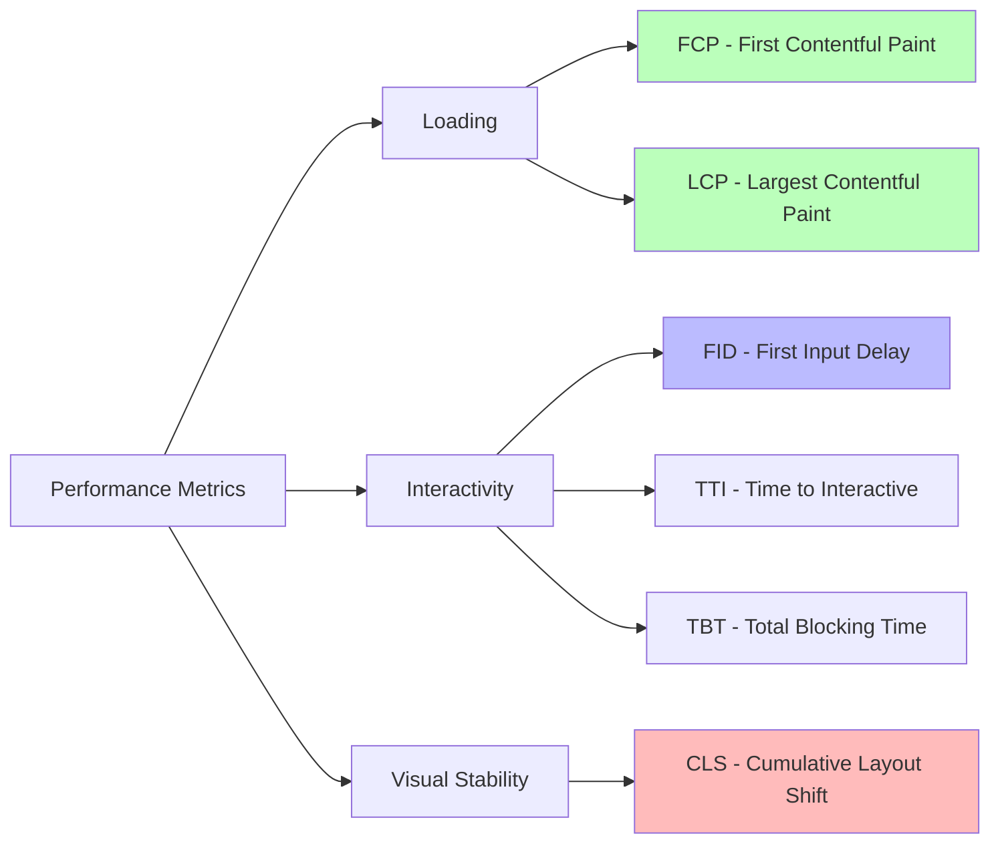
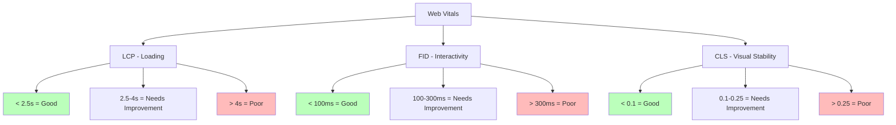

# ⚡ **React Performance - Guia Completo**

> **Otimizações, memoization, lazy loading, code splitting e técnicas avançadas para aplicações React rápidas**

---

## 📑 **Índice**

1. [Introdução à Performance](#1-introdução-à-performance)
2. [React DevTools Profiler](#2-react-devtools-profiler)
3. [Memoization com useMemo](#3-memoization-com-usememo)
4. [Callbacks com useCallback](#4-callbacks-com-usecallback)
5. [React.memo - Componentes Puros](#5-reactmemo---componentes-puros)
6. [Code Splitting](#6-code-splitting)
7. [Lazy Loading](#7-lazy-loading)
8. [Virtualização de Listas](#8-virtualização-de-listas)
9. [Otimização de Imagens](#9-otimização-de-imagens)
10. [Web Vitals](#10-web-vitals)
11. [Bundle Analysis](#11-bundle-analysis)
12. [Concurrent Features](#12-concurrent-features)
13. [Performance Patterns](#13-performance-patterns)
14. [Debugging Performance](#14-debugging-performance)
15. [Recursos e Referências](#15-recursos-e-referências)

---

## 1. 🎯 **Introdução à Performance**

### 1.1. Por que Performance Importa?

**Impacto direto:**
- **53%** dos usuários abandonam sites que demoram > 3s
- **Cada 100ms** de delay = 1% menos conversões (Amazon)
- **SEO** melhor (Google Core Web Vitals)
- **Experiência do usuário** superior

### 1.2. Métricas Principais



**Core Web Vitals (Google):**

| Métrica | Descrição | Meta | Impacto |
|---------|-----------|------|---------|
| **LCP** (Largest Contentful Paint) | Tempo até maior elemento carregar | < 2.5s | Loading |
| **FID** (First Input Delay) | Tempo até primeira interação | < 100ms | Interactivity |
| **CLS** (Cumulative Layout Shift) | Mudanças inesperadas de layout | < 0.1 | Visual Stability |

### 1.3. Onde React Gasta Tempo

```jsx
// ═══════════════════════════════════════════════════════════
// RENDER CYCLE: O que React faz
// ═══════════════════════════════════════════════════════════

// 1. RENDER PHASE (Pode ser interrompida - Concurrent Mode)
function Component() {
  // ✅ Executa função do componente
  const data = expensiveCalculation();  // ⚠️ Pode ser lento!
  
  return <div>{data}</div>;
}

// 2. RECONCILIATION (Virtual DOM Diff)
// React compara virtual DOM antigo vs novo
// ⚠️ Muitos componentes = diff lento

// 3. COMMIT PHASE (Não pode ser interrompida)
// React aplica mudanças no DOM real
// ⚠️ Manipulações DOM são custosas
```

**Problemas Comuns:**

1. **Re-renders desnecessários**
   - Componente renderiza mesmo sem mudanças
   - Props com novas referências

2. **Cálculos pesados no render**
   - Loops grandes
   - Transformações de dados
   - Regex complexos

3. **Listas não virtualizadas**
   - Renderizar 10.000+ itens

4. **Bundle grande**
   - Download lento
   - Parse/Execute lento

### 1.4. Estratégias de Otimização

```
┌─────────────────────────────────────────────────────────┐
│ OTIMIZAÇÃO EM CAMADAS                                   │
├─────────────────────────────────────────────────────────┤
│                                                         │
│  1. BUILD TIME                                          │
│     • Code splitting                                    │
│     • Tree shaking                                      │
│     • Minification                                      │
│     • Compression (gzip/brotli)                         │
│                                                         │
│  2. LOAD TIME                                           │
│     • Lazy loading                                      │
│     • Preload/Prefetch                                  │
│     • CDN                                               │
│     • Caching                                           │
│                                                         │
│  3. RUNTIME                                             │
│     • useMemo / useCallback                             │
│     • React.memo                                        │
│     • Virtualization                                    │
│     • Debounce/Throttle                                 │
│                                                         │
└─────────────────────────────────────────────────────────┘
```

---

## 2. 🔍 **React DevTools Profiler**

### 2.1. Instalação

**Chrome/Edge:**
https://chrome.google.com/webstore/detail/react-developer-tools

**Firefox:**
https://addons.mozilla.org/en-US/firefox/addon/react-devtools/

### 2.2. Como Usar o Profiler

```jsx
// ═══════════════════════════════════════════════════════════
// PROFILER COMPONENT (opcional, para prod)
// ═══════════════════════════════════════════════════════════

import { Profiler } from 'react';

function App() {
  const onRenderCallback = (
    id, // Identificador do Profiler
    phase, // "mount" ou "update"
    actualDuration, // Tempo gasto renderizando
    baseDuration, // Tempo estimado sem memoization
    startTime, // Quando começou
    commitTime, // Quando commitou
    interactions // Set de interactions sendo rastreadas
  ) => {
    console.log(`${id} (${phase}):`, {
      actualDuration,
      baseDuration
    });

    // Enviar para analytics
    // analytics.track('render', { id, phase, actualDuration });
  };

  return (
    <Profiler id="App" onRender={onRenderCallback}>
      <YourApp />
    </Profiler>
  );
}
```

**Passos no DevTools:**

1. Abra **React DevTools** → Aba **Profiler**
2. Clique em **⏺️ Record**
3. Interaja com a aplicação
4. Clique em **⏹️ Stop**
5. Analise resultados:
   - **Flame Chart:** Hierarquia de componentes
   - **Ranked Chart:** Componentes mais lentos
   - **Timeline:** Commits ao longo do tempo

**O que procurar:**

```
❌ PROBLEMAS:
- Componentes com tempo > 16ms (60fps)
- Re-renders frequentes sem motivo
- Muitos componentes renderizando juntos
- Componentes "cinza" (não renderizaram mas foram verificados)

✅ BOM:
- Poucos componentes renderizam por interação
- Tempos < 16ms
- Re-renders apenas quando necessário
```

### 2.3. Exemplo Prático - Diagnóstico

```jsx
// ═══════════════════════════════════════════════════════════
// PROBLEMA: Re-render desnecessário
// ═══════════════════════════════════════════════════════════

// ❌ RUIM
function Parent() {
  const [count, setCount] = useState(0);

  // ❌ Nova função toda render
  const handleClick = () => {
    console.log('Clicked!');
  };

  return (
    <div>
      <button onClick={() => setCount(count + 1)}>Count: {count}</button>
      <ExpensiveChild onClick={handleClick} />
    </div>
  );
}

function ExpensiveChild({ onClick }) {
  console.log('ExpensiveChild rendered');
  
  // Cálculo pesado
  const data = Array.from({ length: 10000 }, (_, i) => i * 2);
  
  return <button onClick={onClick}>Child Button</button>;
}

// 🔍 PROFILER MOSTRA:
// - Parent renderiza (esperado)
// - ExpensiveChild renderiza (desnecessário!)
// - handleClick é nova referência toda vez

// ✅ SOLUÇÃO: useCallback + React.memo
function Parent() {
  const [count, setCount] = useState(0);

  const handleClick = useCallback(() => {
    console.log('Clicked!');
  }, []);

  return (
    <div>
      <button onClick={() => setCount(count + 1)}>Count: {count}</button>
      <ExpensiveChild onClick={handleClick} />
    </div>
  );
}

const ExpensiveChild = React.memo(({ onClick }) => {
  console.log('ExpensiveChild rendered');
  
  const data = useMemo(
    () => Array.from({ length: 10000 }, (_, i) => i * 2),
    []
  );
  
  return <button onClick={onClick}>Child Button</button>;
});

// ✅ PROFILER MOSTRA:
// - Parent renderiza
// - ExpensiveChild NÃO renderiza (memo!)
```

---

## 3. 🧠 **Memoization com useMemo**

### 3.1. Conceito

**useMemo** memoriza o **resultado de um cálculo** e só recalcula quando dependências mudam.

```jsx
const memoizedValue = useMemo(() => computeExpensiveValue(a, b), [a, b]);
```

**Quando usar:**
- ✅ Cálculos pesados (loops, transformações)
- ✅ Evitar re-criar objetos/arrays complexos
- ✅ Otimizar dependências de outros hooks

**Quando NÃO usar:**
- ❌ Cálculos simples (custo do useMemo > cálculo)
- ❌ Por padrão em tudo (premature optimization)

### 3.2. Exemplo Básico

```jsx
// ═══════════════════════════════════════════════════════════
// useMemo: Cálculo pesado
// ═══════════════════════════════════════════════════════════

function ProductList({ products, searchTerm }) {
  // ❌ SEM useMemo: Calcula toda render
  const filteredProducts = products.filter(product =>
    product.name.toLowerCase().includes(searchTerm.toLowerCase())
  );

  // ✅ COM useMemo: Só recalcula se products ou searchTerm mudar
  const filteredProducts = useMemo(() => {
    console.log('Filtering products...');
    return products.filter(product =>
      product.name.toLowerCase().includes(searchTerm.toLowerCase())
    );
  }, [products, searchTerm]);

  return (
    <ul>
      {filteredProducts.map(product => (
        <li key={product.id}>{product.name}</li>
      ))}
    </ul>
  );
}

// Sem useMemo: Se qualquer prop mudar, filtra novamente
// Com useMemo: Só filtra se products ou searchTerm mudarem
```

### 3.3. Casos de Uso Comuns

**Filtrar/Ordenar Listas:**

```jsx
// ═══════════════════════════════════════════════════════════
// FILTRAR + ORDENAR
// ═══════════════════════════════════════════════════════════

function UserTable({ users, searchTerm, sortBy }) {
  const processedUsers = useMemo(() => {
    console.log('Processing users...');
    
    // 1. Filtrar
    let result = users.filter(user =>
      user.name.toLowerCase().includes(searchTerm.toLowerCase())
    );

    // 2. Ordenar
    result.sort((a, b) => {
      if (sortBy === 'name') {
        return a.name.localeCompare(b.name);
      }
      if (sortBy === 'age') {
        return a.age - b.age;
      }
      return 0;
    });

    return result;
  }, [users, searchTerm, sortBy]);

  return (
    <table>
      <tbody>
        {processedUsers.map(user => (
          <tr key={user.id}>
            <td>{user.name}</td>
            <td>{user.age}</td>
          </tr>
        ))}
      </tbody>
    </table>
  );
}
```

**Evitar Re-criar Objetos:**

```jsx
// ═══════════════════════════════════════════════════════════
// OBJETO DE CONFIGURAÇÃO
// ═══════════════════════════════════════════════════════════

function Chart({ data, width, height }) {
  // ❌ RUIM: Novo objeto toda render
  const options = {
    width,
    height,
    responsive: true,
    plugins: {
      legend: { position: 'top' }
    }
  };

  // ✅ BOM: Memoriza objeto
  const options = useMemo(() => ({
    width,
    height,
    responsive: true,
    plugins: {
      legend: { position: 'top' }
    }
  }), [width, height]);

  return <ChartComponent data={data} options={options} />;
}

// Por que isso importa?
// Se ChartComponent usa React.memo e compara options,
// sem useMemo options é sempre novo = re-render sempre!
```

**Derivar Estado:**

```jsx
// ═══════════════════════════════════════════════════════════
// ESTADO DERIVADO
// ═══════════════════════════════════════════════════════════

function ShoppingCart({ items }) {
  // ✅ Calcula total apenas quando items muda
  const total = useMemo(() => {
    return items.reduce((sum, item) => sum + item.price * item.quantity, 0);
  }, [items]);

  const itemCount = useMemo(() => {
    return items.reduce((sum, item) => sum + item.quantity, 0);
  }, [items]);

  const hasDiscount = useMemo(() => {
    return total > 100;
  }, [total]);

  return (
    <div>
      <p>Items: {itemCount}</p>
      <p>Total: ${total.toFixed(2)}</p>
      {hasDiscount && <p>🎉 Discount applied!</p>}
    </div>
  );
}
```

### 3.4. useMemo vs Recalcular Sempre

**Regra geral:** Se o cálculo leva **< 1ms**, não use useMemo.

```jsx
// ❌ NÃO VALE A PENA
const doubled = useMemo(() => value * 2, [value]);

// ✅ VALE A PENA
const filtered = useMemo(() => {
  // Loop grande, operações pesadas
  return largeArray.filter(item => complexCondition(item));
}, [largeArray]);
```

**Benchmark:**

```jsx
function BenchmarkUseMemo() {
  const [count, setCount] = useState(0);

  // Sem useMemo
  const start1 = performance.now();
  const result1 = Array.from({ length: 100000 }, (_, i) => i * 2);
  console.log('Without useMemo:', performance.now() - start1, 'ms');

  // Com useMemo
  const result2 = useMemo(() => {
    const start2 = performance.now();
    const res = Array.from({ length: 100000 }, (_, i) => i * 2);
    console.log('With useMemo:', performance.now() - start2, 'ms');
    return res;
  }, []);

  return <button onClick={() => setCount(c => c + 1)}>{count}</button>;
}

// Resultado:
// Without useMemo: ~3ms (toda render!)
// With useMemo: ~3ms (primeira render), ~0ms (próximas)
```

---

## 4. 🔗 **Callbacks com useCallback**

### 4.1. Conceito

**useCallback** memoriza uma **função** e retorna a mesma referência quando dependências não mudam.

```jsx
const memoizedCallback = useCallback(() => {
  doSomething(a, b);
}, [a, b]);
```

**useCallback vs useMemo:**

```jsx
// São equivalentes:
useCallback(fn, deps)
useMemo(() => fn, deps)

// useCallback é sugar syntax para:
useMemo(() => () => doSomething(), [])
```

### 4.2. Quando Usar

**✅ USE quando:**
- Passar função para componente com `React.memo`
- Função é dependência de `useEffect`/`useMemo`/`useCallback`
- Criar event handlers em loops

**❌ NÃO use quando:**
- Função só é usada no componente atual
- Componente filho não é memo
- "Por precaução" em tudo

### 4.3. Exemplo Básico

```jsx
// ═══════════════════════════════════════════════════════════
// useCallback: Evitar re-render de filho
// ═══════════════════════════════════════════════════════════

function Parent() {
  const [count, setCount] = useState(0);
  const [text, setText] = useState('');

  // ❌ SEM useCallback: Nova função toda render
  const handleClick = () => {
    console.log('Clicked!', text);
  };

  // ✅ COM useCallback: Mesma função se text não mudar
  const handleClick = useCallback(() => {
    console.log('Clicked!', text);
  }, [text]);

  return (
    <div>
      <input value={text} onChange={(e) => setText(e.target.value)} />
      <button onClick={() => setCount(count + 1)}>Count: {count}</button>
      
      {/* ExpensiveChild só re-renderiza se handleClick mudar */}
      <ExpensiveChild onClick={handleClick} />
    </div>
  );
}

const ExpensiveChild = React.memo(({ onClick }) => {
  console.log('ExpensiveChild rendered');
  return <button onClick={onClick}>Click me</button>;
});

// Sem useCallback:
// - count muda → Parent renderiza → handleClick nova → Child renderiza

// Com useCallback:
// - count muda → Parent renderiza → handleClick mesma → Child NÃO renderiza
// - text muda → Parent renderiza → handleClick nova → Child renderiza
```

### 4.4. useCallback em useEffect

```jsx
// ═══════════════════════════════════════════════════════════
// useCallback como dependência de useEffect
// ═══════════════════════════════════════════════════════════

function UserProfile({ userId }) {
  const [user, setUser] = useState(null);

  // ❌ SEM useCallback: useEffect roda toda render!
  const fetchUser = () => {
    fetch(`/api/users/${userId}`)
      .then(res => res.json())
      .then(setUser);
  };

  useEffect(() => {
    fetchUser();
  }, [fetchUser]);  // ❌ fetchUser muda toda render!

  // ✅ COM useCallback: useEffect só roda se userId mudar
  const fetchUser = useCallback(() => {
    fetch(`/api/users/${userId}`)
      .then(res => res.json())
      .then(setUser);
  }, [userId]);

  useEffect(() => {
    fetchUser();
  }, [fetchUser]);  // ✅ fetchUser só muda se userId mudar

  return <div>{user?.name}</div>;
}
```

### 4.5. Event Handlers em Loops

```jsx
// ═══════════════════════════════════════════════════════════
// useCallback em listas
// ═══════════════════════════════════════════════════════════

function TodoList({ todos, onToggle, onDelete }) {
  return (
    <ul>
      {todos.map(todo => (
        <TodoItem
          key={todo.id}
          todo={todo}
          onToggle={onToggle}
          onDelete={onDelete}
        />
      ))}
    </ul>
  );
}

// ❌ RUIM: Cria nova função para cada item
function TodoItem({ todo, onToggle, onDelete }) {
  return (
    <li>
      <input
        type="checkbox"
        checked={todo.completed}
        onChange={() => onToggle(todo.id)}  // ❌ Nova função
      />
      <span>{todo.text}</span>
      <button onClick={() => onDelete(todo.id)}>  // ❌ Nova função
        Delete
      </button>
    </li>
  );
}

// ✅ MELHOR: useCallback nos handlers do pai
function TodoApp() {
  const [todos, setTodos] = useState([]);

  const handleToggle = useCallback((id) => {
    setTodos(todos =>
      todos.map(todo =>
        todo.id === id ? { ...todo, completed: !todo.completed } : todo
      )
    );
  }, []);

  const handleDelete = useCallback((id) => {
    setTodos(todos => todos.filter(todo => todo.id !== id));
  }, []);

  return (
    <TodoList
      todos={todos}
      onToggle={handleToggle}
      onDelete={handleDelete}
    />
  );
}
```

### 4.6. useCallback com Inline Functions

```jsx
// ═══════════════════════════════════════════════════════════
// QUANDO NÃO USAR useCallback
// ═══════════════════════════════════════════════════════════

function SearchBox() {
  const [query, setQuery] = useState('');

  // ❌ DESNECESSÁRIO: onChange é inline e filho não é memo
  const handleChange = useCallback((e) => {
    setQuery(e.target.value);
  }, []);

  return (
    <input
      value={query}
      onChange={handleChange}  // ❌ Sem benefício
    />
  );
}

// ✅ MELHOR: Inline diretamente
function SearchBox() {
  const [query, setQuery] = useState('');

  return (
    <input
      value={query}
      onChange={(e) => setQuery(e.target.value)}  // ✅ Simples
    />
  );
}

// useCallback só ajuda se:
// 1. Função é passada para componente com React.memo
// 2. Função é dependência de hook
```

---

## 5. ⚛️ **React.memo - Componentes Puros**

### 5.1. Conceito

**React.memo** é um **Higher-Order Component** que memoriza o resultado do render.

```jsx
const MemoizedComponent = React.memo(Component);
```

**Como funciona:**
- React faz **shallow comparison** das props
- Se props não mudaram, **reutiliza render anterior**
- Se mudaram, **renderiza novamente**

### 5.2. Exemplo Básico

```jsx
// ═══════════════════════════════════════════════════════════
// React.memo básico
// ═══════════════════════════════════════════════════════════

// ❌ SEM React.memo
function ExpensiveComponent({ value }) {
  console.log('ExpensiveComponent rendered');
  
  // Simulação de cálculo pesado
  const result = Array.from({ length: 10000 }, (_, i) => i * value);
  
  return <div>Value: {value}</div>;
}

// Problema: renderiza mesmo se value não mudou!

// ✅ COM React.memo
const ExpensiveComponent = React.memo(({ value }) => {
  console.log('ExpensiveComponent rendered');
  
  const result = Array.from({ length: 10000 }, (_, i) => i * value);
  
  return <div>Value: {value}</div>;
});

// Solução: só renderiza se value mudar!

// Uso
function App() {
  const [count, setCount] = useState(0);
  const [value, setValue] = useState(10);

  return (
    <div>
      <button onClick={() => setCount(c => c + 1)}>Count: {count}</button>
      <button onClick={() => setValue(v => v + 1)}>Value: {value}</button>
      
      {/* Só re-renderiza quando value muda, não quando count muda */}
      <ExpensiveComponent value={value} />
    </div>
  );
}
```

### 5.3. Custom Comparison Function

```jsx
// ═══════════════════════════════════════════════════════════
// React.memo com comparação customizada
// ═══════════════════════════════════════════════════════════

const UserCard = React.memo(
  ({ user }) => {
    return (
      <div>
        <h2>{user.name}</h2>
        <p>{user.email}</p>
      </div>
    );
  },
  (prevProps, nextProps) => {
    // ✅ Retorna true se props são iguais (NÃO renderizar)
    // ❌ Retorna false se props mudaram (renderizar)
    
    // Compara apenas id (ignora outras propriedades)
    return prevProps.user.id === nextProps.user.id;
  }
);

// Uso: Só re-renderiza se user.id mudar
<UserCard user={{ id: 1, name: 'John', timestamp: Date.now() }} />
```

### 5.4. React.memo com Props Complexas

```jsx
// ═══════════════════════════════════════════════════════════
// PROBLEMA: Props com objetos/arrays/funções
// ═══════════════════════════════════════════════════════════

const List = React.memo(({ items, onItemClick }) => {
  console.log('List rendered');
  
  return (
    <ul>
      {items.map(item => (
        <li key={item.id} onClick={() => onItemClick(item)}>
          {item.name}
        </li>
      ))}
    </ul>
  );
});

function App() {
  const [count, setCount] = useState(0);

  // ❌ PROBLEMA: Novo array toda render
  const items = [{ id: 1, name: 'Item 1' }];
  
  // ❌ PROBLEMA: Nova função toda render
  const handleItemClick = (item) => {
    console.log(item);
  };

  return (
    <div>
      <button onClick={() => setCount(c => c + 1)}>Count: {count}</button>
      {/* List re-renderiza sempre, mesmo com React.memo! */}
      <List items={items} onItemClick={handleItemClick} />
    </div>
  );
}

// ✅ SOLUÇÃO: useMemo + useCallback
function App() {
  const [count, setCount] = useState(0);

  // ✅ Memoriza array
  const items = useMemo(() => [
    { id: 1, name: 'Item 1' }
  ], []);
  
  // ✅ Memoriza função
  const handleItemClick = useCallback((item) => {
    console.log(item);
  }, []);

  return (
    <div>
      <button onClick={() => setCount(c => c + 1)}>Count: {count}</button>
      {/* List NÃO re-renderiza! */}
      <List items={items} onItemClick={handleItemClick} />
    </div>
  );
}
```

### 5.5. Quando Usar React.memo

**✅ USE quando:**
- Componente renderiza **frequentemente**
- Com **mesmas props**
- Render é **custoso** (cálculos, muitos elementos)
- **Lista de items** (cada item pode ser memo)

**❌ NÃO use quando:**
- Componente sempre renderiza com **props diferentes**
- Render é **barato** (custo do memo > render)
- Props mudam **sempre**

**Exemplo: Lista de items**

```jsx
// ═══════════════════════════════════════════════════════════
// LISTA: Memorizar items individuais
// ═══════════════════════════════════════════════════════════

// ✅ Cada TodoItem é memo
const TodoItem = React.memo(({ todo, onToggle, onDelete }) => {
  console.log(`TodoItem ${todo.id} rendered`);
  
  return (
    <li>
      <input
        type="checkbox"
        checked={todo.completed}
        onChange={() => onToggle(todo.id)}
      />
      <span>{todo.text}</span>
      <button onClick={() => onDelete(todo.id)}>Delete</button>
    </li>
  );
});

function TodoList({ todos, onToggle, onDelete }) {
  return (
    <ul>
      {todos.map(todo => (
        <TodoItem
          key={todo.id}
          todo={todo}
          onToggle={onToggle}
          onDelete={onDelete}
        />
      ))}
    </ul>
  );
}

// Benefício: Quando um todo muda, apenas ESSE item re-renderiza!
// Sem memo: Todos os items re-renderizam
```

### 5.6. React.memo vs PureComponent

```jsx
// ═══════════════════════════════════════════════════════════
// Class Components: PureComponent (legacy)
// ═══════════════════════════════════════════════════════════

class ExpensiveComponent extends React.PureComponent {
  render() {
    return <div>{this.props.value}</div>;
  }
}

// Função equivalente: React.memo
const ExpensiveComponent = React.memo(({ value }) => {
  return <div>{value}</div>;
});

// ✅ React.memo é preferível (function components)
```

---

## 6. 📦 **Code Splitting**

### 6.1. Conceito

**Code Splitting** divide o bundle em **chunks menores** que carregam **sob demanda**.

**Benefícios:**
- ✅ **Initial bundle menor** (carrega mais rápido)
- ✅ **Carrega apenas o necessário**
- ✅ **Cache melhor** (chunks não mudam)

### 6.2. Dynamic Import

```jsx
// ═══════════════════════════════════════════════════════════
// DYNAMIC IMPORT (vanilla JS)
// ═══════════════════════════════════════════════════════════

// ❌ IMPORT ESTÁTICO: Tudo no bundle principal
import HeavyLibrary from 'heavy-library';

function Component() {
  const handleClick = () => {
    HeavyLibrary.doSomething();
  };

  return <button onClick={handleClick}>Click</button>;
}

// ✅ IMPORT DINÂMICO: Chunk separado
function Component() {
  const handleClick = async () => {
    const HeavyLibrary = await import('heavy-library');
    HeavyLibrary.doSomething();
  };

  return <button onClick={handleClick}>Click</button>;
}

// Benefício: heavy-library só carrega quando clica!
```

### 6.3. Route-based Code Splitting

```jsx
// ═══════════════════════════════════════════════════════════
// CODE SPLITTING POR ROTA (React Router)
// ═══════════════════════════════════════════════════════════

import { lazy, Suspense } from 'react';
import { BrowserRouter, Routes, Route } from 'react-router-dom';

// ❌ RUIM: Todas as páginas no bundle principal
import Home from './pages/Home';
import About from './pages/About';
import Dashboard from './pages/Dashboard';
import Profile from './pages/Profile';

// ✅ BOM: Cada rota em chunk separado
const Home = lazy(() => import('./pages/Home'));
const About = lazy(() => import('./pages/About'));
const Dashboard = lazy(() => import('./pages/Dashboard'));
const Profile = lazy(() => import('./pages/Profile'));

function App() {
  return (
    <BrowserRouter>
      <Suspense fallback={<div>Loading...</div>}>
        <Routes>
          <Route path="/" element={<Home />} />
          <Route path="/about" element={<About />} />
          <Route path="/dashboard" element={<Dashboard />} />
          <Route path="/profile" element={<Profile />} />
        </Routes>
      </Suspense>
    </BrowserRouter>
  );
}

// Resultado:
// main.js: 50KB (App + Home, primeira rota)
// about.chunk.js: 20KB (carrega ao navegar /about)
// dashboard.chunk.js: 100KB (carrega ao navegar /dashboard)
// profile.chunk.js: 30KB (carrega ao navegar /profile)
```

### 6.4. Component-based Code Splitting

```jsx
// ═══════════════════════════════════════════════════════════
// CODE SPLITTING POR COMPONENTE
// ═══════════════════════════════════════════════════════════

import { lazy, Suspense } from 'react';

// Componente pesado (ex: editor de texto)
const HeavyEditor = lazy(() => import('./components/HeavyEditor'));

function DocumentPage() {
  const [showEditor, setShowEditor] = useState(false);

  return (
    <div>
      <h1>Document</h1>
      
      {!showEditor ? (
        <button onClick={() => setShowEditor(true)}>
          Edit Document
        </button>
      ) : (
        <Suspense fallback={<div>Loading editor...</div>}>
          <HeavyEditor />
        </Suspense>
      )}
    </div>
  );
}

// HeavyEditor (1MB) só carrega quando clica "Edit"!
```

### 6.5. Preloading

```jsx
// ═══════════════════════════════════════════════════════════
// PRELOAD: Carregar antes de usar
// ═══════════════════════════════════════════════════════════

const HeavyComponent = lazy(() => import('./HeavyComponent'));

// Preload ao hover
function App() {
  const handleMouseEnter = () => {
    // ✅ Inicia download antes de clicar
    import('./HeavyComponent');
  };

  return (
    <div>
      <button onMouseEnter={handleMouseEnter}>
        Show Component
      </button>
      
      <Suspense fallback={<div>Loading...</div>}>
        <HeavyComponent />
      </Suspense>
    </div>
  );
}

// Técnica: Preload on hover = UX melhor (usuário não espera)
```

### 6.6. Named Exports com lazy

```jsx
// ═══════════════════════════════════════════════════════════
// LAZY com named exports
// ═══════════════════════════════════════════════════════════

// ❌ NÃO FUNCIONA: lazy espera default export
const MyComponent = lazy(() => import('./MyComponent').then(m => m.MyComponent));

// ✅ SOLUÇÃO 1: Re-export como default
// MyComponent.js
export { MyComponent as default } from './MyComponent';

const MyComponent = lazy(() => import('./MyComponent'));

// ✅ SOLUÇÃO 2: Wrapper
const MyComponent = lazy(() =>
  import('./MyComponent').then(module => ({
    default: module.MyComponent
  }))
);
```

---

## 7. 🚀 **Lazy Loading**

### 7.1. React.lazy + Suspense

```jsx
// ═══════════════════════════════════════════════════════════
// React.lazy: Carregamento sob demanda
// ═══════════════════════════════════════════════════════════

import { lazy, Suspense } from 'react';

// ✅ Componente carrega apenas quando renderiza
const LazyComponent = lazy(() => import('./LazyComponent'));

function App() {
  return (
    <div>
      <h1>My App</h1>
      
      {/* Suspense mostra fallback enquanto carrega */}
      <Suspense fallback={<div>Loading...</div>}>
        <LazyComponent />
      </Suspense>
    </div>
  );
}
```

### 7.2. Múltiplos Suspense Boundaries

```jsx
// ═══════════════════════════════════════════════════════════
// SUSPENSE: Boundaries granulares
// ═══════════════════════════════════════════════════════════

const Header = lazy(() => import('./Header'));
const Sidebar = lazy(() => import('./Sidebar'));
const Content = lazy(() => import('./Content'));
const Footer = lazy(() => import('./Footer'));

// ❌ RUIM: Um Suspense para tudo
function App() {
  return (
    <Suspense fallback={<FullPageLoader />}>
      <Header />
      <Sidebar />
      <Content />
      <Footer />
    </Suspense>
  );
}
// Problema: Usuário vê loader da página inteira até TUDO carregar

// ✅ BOM: Suspense separados
function App() {
  return (
    <div>
      <Suspense fallback={<HeaderSkeleton />}>
        <Header />
      </Suspense>

      <div style={{ display: 'flex' }}>
        <Suspense fallback={<SidebarSkeleton />}>
          <Sidebar />
        </Suspense>

        <Suspense fallback={<ContentSkeleton />}>
          <Content />
        </Suspense>
      </div>

      <Suspense fallback={<FooterSkeleton />}>
        <Footer />
      </Suspense>
    </div>
  );
}
// ✅ Cada parte carrega independentemente (melhor UX)
```

### 7.3. Error Boundaries com Lazy

```jsx
// ═══════════════════════════════════════════════════════════
// ERROR BOUNDARY para lazy loading
// ═══════════════════════════════════════════════════════════

class ErrorBoundary extends React.Component {
  state = { hasError: false };

  static getDerivedStateFromError(error) {
    return { hasError: true };
  }

  componentDidCatch(error, errorInfo) {
    console.error('Lazy loading error:', error, errorInfo);
  }

  render() {
    if (this.state.hasError) {
      return (
        <div>
          <h2>Failed to load component</h2>
          <button onClick={() => window.location.reload()}>
            Reload page
          </button>
        </div>
      );
    }

    return this.props.children;
  }
}

// Uso com lazy
const LazyComponent = lazy(() => import('./LazyComponent'));

function App() {
  return (
    <ErrorBoundary>
      <Suspense fallback={<div>Loading...</div>}>
        <LazyComponent />
      </Suspense>
    </ErrorBoundary>
  );
}
```

### 7.4. Lazy Loading com Retry

```jsx
// ═══════════════════════════════════════════════════════════
// RETRY: Tentar novamente se falhar
// ═══════════════════════════════════════════════════════════

function lazyWithRetry(importFn, retriesLeft = 3, interval = 1000) {
  return new Promise((resolve, reject) => {
    importFn()
      .then(resolve)
      .catch((error) => {
        if (retriesLeft === 0) {
          reject(error);
          return;
        }

        setTimeout(() => {
          console.log(`Retrying... (${retriesLeft} attempts left)`);
          lazyWithRetry(importFn, retriesLeft - 1, interval)
            .then(resolve)
            .catch(reject);
        }, interval);
      });
  });
}

// Uso
const LazyComponent = lazy(() =>
  lazyWithRetry(() => import('./LazyComponent'))
);

// Benefício: Se network falhar, tenta novamente!
```

### 7.5. Preload Strategy

```jsx
// ═══════════════════════════════════════════════════════════
// ESTRATÉGIAS DE PRELOAD
// ═══════════════════════════════════════════════════════════

const LazyDashboard = lazy(() => import('./Dashboard'));

function App() {
  const [showDashboard, setShowDashboard] = useState(false);

  // ✅ ESTRATÉGIA 1: Preload on mount
  useEffect(() => {
    import('./Dashboard');
  }, []);

  // ✅ ESTRATÉGIA 2: Preload on hover
  const handleMouseEnter = () => {
    import('./Dashboard');
  };

  // ✅ ESTRATÉGIA 3: Preload on idle
  useEffect(() => {
    if ('requestIdleCallback' in window) {
      requestIdleCallback(() => {
        import('./Dashboard');
      });
    }
  }, []);

  return (
    <div>
      <button
        onMouseEnter={handleMouseEnter}
        onClick={() => setShowDashboard(true)}
      >
        Show Dashboard
      </button>

      {showDashboard && (
        <Suspense fallback={<div>Loading...</div>}>
          <LazyDashboard />
        </Suspense>
      )}
    </div>
  );
}
```

### 7.6. Route Prefetching

```jsx
// ═══════════════════════════════════════════════════════════
// PREFETCH de rotas (React Router)
// ═══════════════════════════════════════════════════════════

import { Link } from 'react-router-dom';

// Mapa de preloads
const preloadMap = {
  '/dashboard': () => import('./pages/Dashboard'),
  '/profile': () => import('./pages/Profile'),
  '/settings': () => import('./pages/Settings')
};

function NavigationLink({ to, children }) {
  const handleMouseEnter = () => {
    const preload = preloadMap[to];
    if (preload) {
      preload();
    }
  };

  return (
    <Link to={to} onMouseEnter={handleMouseEnter}>
      {children}
    </Link>
  );
}

// Uso
function Navigation() {
  return (
    <nav>
      <NavigationLink to="/dashboard">Dashboard</NavigationLink>
      <NavigationLink to="/profile">Profile</NavigationLink>
      <NavigationLink to="/settings">Settings</NavigationLink>
    </nav>
  );
}

// ✅ Quando mouse passa em cima, começa download!
```

---

## 8. 📜 **Virtualização de Listas**

### 8.1. Problema: Listas Grandes

```jsx
// ═══════════════════════════════════════════════════════════
// PROBLEMA: Renderizar 10.000 items
// ═══════════════════════════════════════════════════════════

function UserList({ users }) {
  return (
    <div>
      {users.map(user => (
        <UserCard key={user.id} user={user} />
      ))}
    </div>
  );
}

// ❌ PROBLEMAS:
// - 10.000 elementos DOM (PESADO!)
// - Scroll lento
// - Render inicial lento
// - Alto uso de memória
```

**Métricas:**
- 10.000 items × 100px altura = **1.000.000px** de altura
- Viewport: apenas **800px** visíveis
- **99.2%** dos items não são visíveis!

### 8.2. react-window (Básico)

```bash
npm install react-window
```

```jsx
// ═══════════════════════════════════════════════════════════
// react-window: Lista virtualizada
// ═══════════════════════════════════════════════════════════

import { FixedSizeList } from 'react-window';

function VirtualizedUserList({ users }) {
  // Cada item tem altura fixa de 50px
  const Row = ({ index, style }) => (
    <div style={style}>
      <UserCard user={users[index]} />
    </div>
  );

  return (
    <FixedSizeList
      height={600}        // Altura do container
      itemCount={users.length}  // Total de items
      itemSize={50}       // Altura de cada item
      width="100%"
    >
      {Row}
    </FixedSizeList>
  );
}

// ✅ BENEFÍCIOS:
// - Renderiza apenas ~12 items visíveis (não 10.000!)
// - Scroll suave
// - Baixo uso de memória
```

### 8.3. react-window (Variable Size)

```jsx
// ═══════════════════════════════════════════════════════════
// ALTURA VARIÁVEL
// ═══════════════════════════════════════════════════════════

import { VariableSizeList } from 'react-window';

function VariableHeightList({ items }) {
  // Função que retorna altura de cada item
  const getItemSize = (index) => {
    const item = items[index];
    // Item pequeno: 50px, Item grande: 100px
    return item.type === 'small' ? 50 : 100;
  };

  const Row = ({ index, style }) => (
    <div style={style}>
      {items[index].content}
    </div>
  );

  return (
    <VariableSizeList
      height={600}
      itemCount={items.length}
      itemSize={getItemSize}  // ✅ Função dinâmica
      width="100%"
    >
      {Row}
    </VariableSizeList>
  );
}
```

### 8.4. react-window (Grid)

```jsx
// ═══════════════════════════════════════════════════════════
// GRID VIRTUALIZADO (2D)
// ═══════════════════════════════════════════════════════════

import { FixedSizeGrid } from 'react-window';

function VirtualizedGrid({ items }) {
  const COLUMN_COUNT = 5;
  const ROW_COUNT = Math.ceil(items.length / COLUMN_COUNT);

  const Cell = ({ columnIndex, rowIndex, style }) => {
    const index = rowIndex * COLUMN_COUNT + columnIndex;
    const item = items[index];

    if (!item) return null;

    return (
      <div style={style}>
        
        <p>{item.name}</p>
      </div>
    );
  };

  return (
    <FixedSizeGrid
      columnCount={COLUMN_COUNT}
      columnWidth={200}
      height={600}
      rowCount={ROW_COUNT}
      rowHeight={200}
      width={1000}
    >
      {Cell}
    </FixedSizeGrid>
  );
}
```

### 8.5. react-virtualized (AutoSizer)

```bash
npm install react-virtualized
```

```jsx
// ═══════════════════════════════════════════════════════════
// react-virtualized: Mais features
// ═══════════════════════════════════════════════════════════

import { List, AutoSizer } from 'react-virtualized';

function VirtualizedList({ items }) {
  const rowRenderer = ({ key, index, style }) => (
    <div key={key} style={style}>
      {items[index].name}
    </div>
  );

  return (
    <AutoSizer>
      {({ height, width }) => (
        <List
          width={width}      // ✅ AutoSizer ajusta automaticamente
          height={height}
          rowCount={items.length}
          rowHeight={50}
          rowRenderer={rowRenderer}
        />
      )}
    </AutoSizer>
  );
}
```

### 8.6. Infinite Scroll com Virtualização

```jsx
// ═══════════════════════════════════════════════════════════
// INFINITE SCROLL
// ═══════════════════════════════════════════════════════════

import { FixedSizeList } from 'react-window';
import InfiniteLoader from 'react-window-infinite-loader';

function InfiniteScrollList() {
  const [items, setItems] = useState([]);
  const [hasNextPage, setHasNextPage] = useState(true);

  const loadMoreItems = async (startIndex, stopIndex) => {
    const newItems = await fetchItems(startIndex, stopIndex);
    setItems(prev => [...prev, ...newItems]);
    
    if (newItems.length === 0) {
      setHasNextPage(false);
    }
  };

  const isItemLoaded = (index) => !hasNextPage || index < items.length;

  return (
    <InfiniteLoader
      isItemLoaded={isItemLoaded}
      itemCount={hasNextPage ? items.length + 1 : items.length}
      loadMoreItems={loadMoreItems}
    >
      {({ onItemsRendered, ref }) => (
        <FixedSizeList
          height={600}
          itemCount={items.length}
          itemSize={50}
          onItemsRendered={onItemsRendered}
          ref={ref}
          width="100%"
        >
          {({ index, style }) => (
            <div style={style}>
              {isItemLoaded(index) ? items[index].name : 'Loading...'}
            </div>
          )}
        </FixedSizeList>
      )}
    </InfiniteLoader>
  );
}
```

### 8.7. Virtualização: Quando Usar

**✅ USE quando:**
- Lista com **> 100 items**
- Items com **DOM complexo**
- Performance é **crítica**

**❌ NÃO use quando:**
- Lista com **< 50 items**
- Items **muito simples** (apenas texto)
- Altura **muito variável** (difícil calcular)

---

## 9. 🖼️ **Otimização de Imagens**

### 9.1. Lazy Loading de Imagens

```jsx
// ═══════════════════════════════════════════════════════════
// LAZY LOADING (Native)
// ═══════════════════════════════════════════════════════════

function ImageGallery({ images }) {
  return (
    <div>
      {images.map(image => (
        
      ))}
    </div>
  );
}
```

### 9.2. Intersection Observer

```jsx
// ═══════════════════════════════════════════════════════════
// INTERSECTION OBSERVER (Custom)
// ═══════════════════════════════════════════════════════════

function LazyImage({ src, alt, placeholder = '/placeholder.jpg' }) {
  const [imageSrc, setImageSrc] = useState(placeholder);
  const [isLoaded, setIsLoaded] = useState(false);
  const imgRef = useRef(null);

  useEffect(() => {
    const observer = new IntersectionObserver(
      (entries) => {
        entries.forEach(entry => {
          if (entry.isIntersecting) {
            // ✅ Imagem está visível, carrega!
            setImageSrc(src);
            observer.disconnect();
          }
        });
      },
      { rootMargin: '100px' }  // Começa a carregar 100px antes
    );

    if (imgRef.current) {
      observer.observe(imgRef.current);
    }

    return () => observer.disconnect();
  }, [src]);

  return (
     setIsLoaded(true)}
      style={{
        opacity: isLoaded ? 1 : 0,
        transition: 'opacity 0.3s'
      }}
    />
  );
}
```

### 9.3. Responsive Images

```jsx
// ═══════════════════════════════════════════════════════════
// RESPONSIVE IMAGES (srcset)
// ═══════════════════════════════════════════════════════════

function ResponsiveImage({ image }) {
  return (
    
  );
}

// Browser escolhe melhor resolução baseado em:
// - Tamanho da tela
// - DPI (Retina displays)
```

### 9.4. WebP com Fallback

```jsx
// ═══════════════════════════════════════════════════════════
// WEBP com fallback para JPG
// ═══════════════════════════════════════════════════════════

function OptimizedImage({ src, alt }) {
  const webpSrc = src.replace(/\.(jpg|png)$/, '.webp');

  return (
    <picture>
      {/* ✅ Tenta WebP primeiro (menor tamanho) */}
      <source srcSet={webpSrc} type="image/webp" />
      
      {/* ❌ Fallback para JPG se browser não suporta WebP */}
      
    </picture>
  );
}

// WebP: ~30% menor que JPG com mesma qualidade!
```

### 9.5. Blur Placeholder

```jsx
// ═══════════════════════════════════════════════════════════
// BLUR PLACEHOLDER (Medium style)
// ═══════════════════════════════════════════════════════════

function BlurImage({ src, blurDataURL, alt }) {
  const [isLoaded, setIsLoaded] = useState(false);

  return (
    <div style={{ position: 'relative' }}>
      {/* Blur placeholder (base64 tiny image) */}
      

      {/* Imagem real */}
       setIsLoaded(true)}
        loading="lazy"
        style={{
          opacity: isLoaded ? 1 : 0,
          transition: 'opacity 0.3s'
        }}
      />
    </div>
  );
}

// blurDataURL: base64 da imagem 10x10px (~200 bytes)
```

### 9.6. Next.js Image Component

```jsx
// ═══════════════════════════════════════════════════════════
// NEXT.JS IMAGE (recomendado se usar Next.js)
// ═══════════════════════════════════════════════════════════

import Image from 'next/image';

function OptimizedGallery({ images }) {
  return (
    <div>
      {images.map(image => (
        <Image
          key={image.id}
          src={image.url}
          alt={image.alt}
          width={800}
          height={600}
          placeholder="blur"
          blurDataURL={image.blurDataURL}
          quality={75}  // 1-100 (default: 75)
          priority={image.isPriority}  // LCP images
        />
      ))}
    </div>
  );
}

// ✅ Next.js faz automaticamente:
// - Lazy loading
// - Responsive images
// - WebP conversion
// - Blur placeholder
// - CDN optimization
```

---

## 10. 📊 **Web Vitals**

### 10.1. Conceito

**Core Web Vitals** são métricas essenciais para UX:



### 10.2. Medir Web Vitals

```bash
npm install web-vitals
```

```jsx
// ═══════════════════════════════════════════════════════════
// MEDIR WEB VITALS
// ═══════════════════════════════════════════════════════════

import { getCLS, getFID, getFCP, getLCP, getTTFB } from 'web-vitals';

function reportWebVitals(metric) {
  console.log(metric);
  
  // Enviar para analytics
  // analytics.track('web-vitals', {
  //   name: metric.name,
  //   value: metric.value,
  //   rating: metric.rating
  // });
}

// Medir todas as métricas
getCLS(reportWebVitals);
getFID(reportWebVitals);
getFCP(reportWebVitals);
getLCP(reportWebVitals);
getTTFB(reportWebVitals);

// Output:
// { name: 'LCP', value: 1234, rating: 'good' }
// { name: 'FID', value: 56, rating: 'good' }
// { name: 'CLS', value: 0.05, rating: 'good' }
```

### 10.3. Otimizar LCP (Largest Contentful Paint)

**LCP:** Tempo até maior elemento visível carregar.

```jsx
// ═══════════════════════════════════════════════════════════
// OTIMIZAR LCP
// ═══════════════════════════════════════════════════════════

// ❌ RUIM: Imagem grande sem otimização
function Hero() {
  return (
    <div>
      
    </div>
  );
}

// ✅ BOM: Otimizações
function Hero() {
  return (
    <div>
      {/* 1. Preload da imagem */}
      <link rel="preload" as="image" href="/hero-optimized.webp" />
      
      {/* 2. WebP + srcset */}
      <picture>
        <source
          srcSet="/hero-optimized.webp"
          type="image/webp"
        />
        
      </picture>
    </div>
  );
}

// ✅ Next.js: Automático
<Image
  src="/hero.jpg"
  alt="Hero"
  width={1920}
  height={1080}
  priority  // ✅ Preload + fetchPriority="high"
/>
```

**Checklist LCP:**
- ✅ Comprimir imagens (WebP, ~75% quality)
- ✅ Usar CDN
- ✅ Preload imagens críticas
- ✅ Lazy load imagens não-críticas
- ✅ Evitar render-blocking JS/CSS

### 10.4. Otimizar FID (First Input Delay)

**FID:** Tempo até primeira interação (click, input).

```jsx
// ═══════════════════════════════════════════════════════════
// OTIMIZAR FID
// ═══════════════════════════════════════════════════════════

// ❌ RUIM: JS pesado bloqueia main thread
function App() {
  useEffect(() => {
    // Processamento pesado no mount
    const data = Array.from({ length: 1000000 }, (_, i) => i * 2);
    processData(data);
  }, []);

  return <Button>Click me</Button>;
}
// Problema: Botão não responde até JS terminar!

// ✅ BOM: Processar em idle
function App() {
  useEffect(() => {
    if ('requestIdleCallback' in window) {
      requestIdleCallback(() => {
        const data = Array.from({ length: 1000000 }, (_, i) => i * 2);
        processData(data);
      });
    }
  }, []);

  return <Button>Click me</Button>;
}

// ✅ MELHOR: Web Worker (não bloqueia main thread)
function App() {
  useEffect(() => {
    const worker = new Worker('/worker.js');
    worker.postMessage({ type: 'PROCESS_DATA' });
    worker.onmessage = (e) => {
      console.log('Result:', e.data);
    };
  }, []);

  return <Button>Click me</Button>;
}
```

**Checklist FID:**
- ✅ Code splitting (menor JS inicial)
- ✅ Defer non-critical JS
- ✅ Break up long tasks (< 50ms)
- ✅ Use Web Workers para cálculos pesados
- ✅ Minimize 3rd-party scripts

### 10.5. Otimizar CLS (Cumulative Layout Shift)

**CLS:** Mudanças inesperadas de layout.

```jsx
// ═══════════════════════════════════════════════════════════
// OTIMIZAR CLS
// ═══════════════════════════════════════════════════════════

// ❌ RUIM: Imagem sem width/height
function Card() {
  return (
    <div>
        {/* ❌ Layout shift! */}
      <p>Content below</p>
    </div>
  );
}

// ✅ BOM: width/height explícitos
function Card() {
  return (
    <div>
      
      <p>Content below</p>
    </div>
  );
}

// ✅ BOM: aspect-ratio CSS
function Card() {
  return (
    <div>
      
      <p>Content below</p>
    </div>
  );
}
```

**Causas comuns de CLS:**

```jsx
// ❌ PROBLEMA 1: Anúncios sem espaço reservado
<div>
  <AdBanner />  {/* Carrega depois, empurra conteúdo */}
  <Content />
</div>

// ✅ SOLUÇÃO: Reservar espaço
<div>
  <div style={{ minHeight: '250px' }}>
    <AdBanner />
  </div>
  <Content />
</div>

// ❌ PROBLEMA 2: Fontes web sem fallback
<h1 style={{ fontFamily: 'Custom Font' }}>Title</h1>

// ✅ SOLUÇÃO: font-display
@font-face {
  font-family: 'Custom Font';
  font-display: swap;  /* ✅ Mostra fallback até carregar */
}

// ❌ PROBLEMA 3: Injetar conteúdo dinamicamente
const [content, setContent] = useState(null);

useEffect(() => {
  fetchContent().then(setContent);
}, []);

return (
  <div>
    {content}  {/* ❌ Aparece depois, empurra tudo */}
    <Footer />
</div>

// ✅ SOLUÇÃO: Skeleton
return (
  <div>
    {content || <Skeleton />}  {/* ✅ Espaço reservado */}
    <Footer />
  </div>
);
```

**Checklist CLS:**
- ✅ Sempre defina width/height em imagens/vídeos
- ✅ Use aspect-ratio CSS
- ✅ Reservar espaço para ads/embeds
- ✅ font-display: swap
- ✅ Skeleton loaders
- ✅ Evitar injetar conteúdo acima de conteúdo existente

---

## 11. 📦 **Bundle Analysis**

### 11.1. Analisar Bundle

```bash
# Vite
npm install --save-dev rollup-plugin-visualizer

# Webpack
npm install --save-dev webpack-bundle-analyzer
```

**Vite (vite.config.js):**

```javascript
// ═══════════════════════════════════════════════════════════
// BUNDLE ANALYZER (Vite)
// ═══════════════════════════════════════════════════════════

import { defineConfig } from 'vite';
import react from '@vitejs/plugin-react';
import { visualizer } from 'rollup-plugin-visualizer';

export default defineConfig({
  plugins: [
    react(),
    visualizer({
      open: true,  // Abre automaticamente
      gzipSize: true,
      brotliSize: true,
      filename: './dist/stats.html'
    })
  ]
});

// ✅ Build: npm run build
// ✅ Abre stats.html com visualização interativa
```

**Webpack (webpack.config.js):**

```javascript
// ═══════════════════════════════════════════════════════════
// BUNDLE ANALYZER (Webpack)
// ═══════════════════════════════════════════════════════════

const BundleAnalyzerPlugin = require('webpack-bundle-analyzer').BundleAnalyzerPlugin;

module.exports = {
  plugins: [
    new BundleAnalyzerPlugin({
      analyzerMode: 'static',
      openAnalyzer: true,
      reportFilename: 'bundle-report.html'
    })
  ]
};
```

### 11.2. Identificar Problemas

**O que procurar no bundle:**

```
❌ PROBLEMAS COMUNS:

1. BIBLIOTECAS DUPLICADAS
   - React aparece 2x (CJS + ESM)
   - Lodash completo ao invés de lodash-es

2. BIBLIOTECAS GRANDES
   - Moment.js (237 KB) → use date-fns (11 KB)
   - Lodash inteiro → use lodash-es com tree-shaking

3. CÓDIGO NÃO USADO
   - Importa biblioteca inteira mas usa 1 função
   - Polyfills desnecessários

4. SOURCE MAPS EM PRODUÇÃO
   - .map files no bundle (REMOVER!)
```

### 11.3. Tree Shaking

```jsx
// ═══════════════════════════════════════════════════════════
// TREE SHAKING: Remover código não usado
// ═══════════════════════════════════════════════════════════

// ❌ RUIM: Importa tudo (lodash CJS não faz tree-shake)
import _ from 'lodash';
const result = _.debounce(fn, 300);

// ✅ BOM: Import nomeado (lodash-es faz tree-shake)
import { debounce } from 'lodash-es';
const result = debounce(fn, 300);

// ❌ RUIM: Importa biblioteca inteira
import * as Icons from 'react-icons/fa';
<Icons.FaBeer />

// ✅ BOM: Import específico
import { FaBeer } from 'react-icons/fa';
<FaBeer />

// ❌ RUIM: date-fns não faz tree-shake bem
import { format } from 'date-fns';

// ✅ BOM: Import direto (melhor tree-shake)
import format from 'date-fns/format';
```

### 11.4. Replace Heavy Dependencies

```jsx
// ═══════════════════════════════════════════════════════════
// SUBSTITUIR DEPENDÊNCIAS PESADAS
// ═══════════════════════════════════════════════════════════

// ❌ Moment.js: 237 KB (gzipped)
import moment from 'moment';
const formatted = moment().format('YYYY-MM-DD');

// ✅ date-fns: 11 KB (gzipped) - apenas funções usadas
import { format } from 'date-fns';
const formatted = format(new Date(), 'yyyy-MM-dd');

// ✅ dayjs: 2 KB (gzipped) - API similar ao moment
import dayjs from 'dayjs';
const formatted = dayjs().format('YYYY-MM-DD');

// ❌ Lodash: 72 KB (gzipped)
import _ from 'lodash';

// ✅ lodash-es: Tree-shakeable
import { debounce, throttle } from 'lodash-es';

// ✅ Native JS (melhor opção)
const debounce = (fn, delay) => {
  let timeout;
  return (...args) => {
    clearTimeout(timeout);
    timeout = setTimeout(() => fn(...args), delay);
  };
};
```

**Comparação de libs:**

| Biblioteca | Tamanho | Alternativa | Tamanho |
|------------|---------|-------------|---------|
| moment.js | 237 KB | date-fns | 11 KB |
| lodash | 72 KB | lodash-es | tree-shakeable |
| axios | 13 KB | fetch (native) | 0 KB |
| jquery | 87 KB | Native DOM | 0 KB |

### 11.5. Dynamic Imports para Reduzir Bundle

```jsx
// ═══════════════════════════════════════════════════════════
// IMPORT DINÂMICO de libs pesadas
// ═══════════════════════════════════════════════════════════

// ❌ RUIM: Chart.js no bundle principal
import Chart from 'chart.js/auto';

function Dashboard() {
  return <Chart data={data} />;
}

// ✅ BOM: Chart.js em chunk separado
const Chart = lazy(() => import('chart.js/auto'));

function Dashboard() {
  return (
    <Suspense fallback={<div>Loading chart...</div>}>
      <Chart data={data} />
    </Suspense>
  );
}

// ❌ RUIM: React Icons todas no bundle
import * as Icons from 'react-icons/fa';

// ✅ BOM: Apenas ícones usados
import { FaBeer, FaCoffee } from 'react-icons/fa';
```

---

## 12. ⚡ **Concurrent Features**

### 12.1. Concurrent Rendering

**React 18+:** Rendering pode ser **interrompido** para tarefas prioritárias.

```jsx
// ═══════════════════════════════════════════════════════════
// CONCURRENT MODE (React 18)
// ═══════════════════════════════════════════════════════════

import { createRoot } from 'react-dom/client';

const root = createRoot(document.getElementById('root'));
root.render(<App />);

// ✅ Concurrent features habilitadas automaticamente!
```

### 12.2. useTransition

**useTransition:** Marcar updates como **não urgentes**.

```jsx
// ═══════════════════════════════════════════════════════════
// useTransition: Defer updates
// ═══════════════════════════════════════════════════════════

import { useState, useTransition } from 'react';

function SearchPage() {
  const [query, setQuery] = useState('');
  const [results, setResults] = useState([]);
  const [isPending, startTransition] = useTransition();

  const handleChange = (e) => {
    const value = e.target.value;
    
    // ✅ Update urgente: input sempre responde rápido
    setQuery(value);

    // ✅ Update não urgente: filtrar pode demorar
    startTransition(() => {
      const filtered = hugeList.filter(item =>
        item.name.toLowerCase().includes(value.toLowerCase())
      );
      setResults(filtered);
    });
  };

  return (
    <div>
      <input
        value={query}
        onChange={handleChange}
        placeholder="Search..."
      />
      
      {isPending && <Spinner />}
      
      <ul>
        {results.map(item => (
          <li key={item.id}>{item.name}</li>
        ))}
      </ul>
    </div>
  );
}

// Sem useTransition: Input trava enquanto filtra
// Com useTransition: Input sempre responsivo!
```

### 12.3. useDeferredValue

**useDeferredValue:** Versão "atrasada" de um valor.

```jsx
// ═══════════════════════════════════════════════════════════
// useDeferredValue: Defer expensive renders
// ═══════════════════════════════════════════════════════════

import { useState, useDeferredValue } from 'react';

function SearchPage() {
  const [query, setQuery] = useState('');
  const deferredQuery = useDeferredValue(query);

  // ✅ query: Atualiza imediatamente (input responsivo)
  // ✅ deferredQuery: Atualiza depois (render pode demorar)

  return (
    <div>
      <input
        value={query}
        onChange={(e) => setQuery(e.target.value)}
        placeholder="Search..."
      />
      
      {/* Usa versão deferida para render pesado */}
      <ExpensiveList query={deferredQuery} />
    </div>
  );
}

function ExpensiveList({ query }) {
  const results = useMemo(() => {
    // Filtrar 10.000 items (lento!)
    return hugeList.filter(item =>
      item.name.toLowerCase().includes(query.toLowerCase())
    );
  }, [query]);

  return (
    <ul>
      {results.map(item => (
        <li key={item.id}>{item.name}</li>
      ))}
    </ul>
  );
}
```

**useTransition vs useDeferredValue:**

| Hook | Uso | Quando usar |
|------|-----|-------------|
| **useTransition** | Marcar **setState** como não urgente | Você controla o state |
| **useDeferredValue** | Criar **versão atrasada** de prop/state | State vem de prop ou não pode mudar setState |

### 12.4. Suspense for Data Fetching

```jsx
// ═══════════════════════════════════════════════════════════
// SUSPENSE com Data Fetching
// ═══════════════════════════════════════════════════════════

// ❌ SEM Suspense: Cada componente tem loading
function UserProfile({ userId }) {
  const [user, setUser] = useState(null);
  const [loading, setLoading] = useState(true);

  useEffect(() => {
    fetch(`/api/users/${userId}`)
      .then(res => res.json())
      .then(data => {
        setUser(data);
        setLoading(false);
      });
  }, [userId]);

  if (loading) return <Spinner />;
  return <div>{user.name}</div>;
}

// ✅ COM Suspense: Loading centralizado
function UserProfile({ userId }) {
  const user = use(fetchUser(userId));  // React 19
  return <div>{user.name}</div>;
}

function App() {
  return (
    <Suspense fallback={<Spinner />}>
      <UserProfile userId={1} />
    </Suspense>
  );
}
```

---

## 13. 🎨 **Performance Patterns**

### 13.1. Windowing Pattern

```jsx
// ═══════════════════════════════════════════════════════════
// WINDOWING: Renderizar apenas items visíveis
// ═══════════════════════════════════════════════════════════

import { FixedSizeList } from 'react-window';

function MessagesWindow({ messages }) {
  const Row = ({ index, style }) => (
    <div style={style} className="message">
      <strong>{messages[index].author}:</strong> {messages[index].text}
    </div>
  );

  return (
    <FixedSizeList
      height={500}
      itemCount={messages.length}
      itemSize={60}
      width="100%"
    >
      {Row}
    </FixedSizeList>
  );
}

// ✅ Benefício: 10.000 mensagens → renderiza apenas 8-10 visíveis
```

### 13.2. Debounce Pattern

```jsx
// ═══════════════════════════════════════════════════════════
// DEBOUNCE: Atrasar execução
// ═══════════════════════════════════════════════════════════

function useDebounce(value, delay) {
  const [debouncedValue, setDebouncedValue] = useState(value);

  useEffect(() => {
    const timer = setTimeout(() => {
      setDebouncedValue(value);
    }, delay);

    return () => clearTimeout(timer);
  }, [value, delay]);

  return debouncedValue;
}

// Uso: Search com API call
function SearchBox() {
  const [searchTerm, setSearchTerm] = useState('');
  const debouncedSearchTerm = useDebounce(searchTerm, 500);

  useEffect(() => {
    if (debouncedSearchTerm) {
      // ✅ API call apenas 500ms depois de parar de digitar
      fetch(`/api/search?q=${debouncedSearchTerm}`)
        .then(res => res.json())
        .then(setResults);
    }
  }, [debouncedSearchTerm]);

  return (
    <input
      value={searchTerm}
      onChange={(e) => setSearchTerm(e.target.value)}
      placeholder="Search..."
    />
  );
}

// Sem debounce: API call a cada tecla (100 calls!)
// Com debounce: API call apenas quando para de digitar (1 call!)
```

### 13.3. Throttle Pattern

```jsx
// ═══════════════════════════════════════════════════════════
// THROTTLE: Limitar frequência
// ═══════════════════════════════════════════════════════════

function useThrottle(callback, delay) {
  const lastRun = useRef(Date.now());

  return useCallback((...args) => {
    const now = Date.now();
    
    if (now - lastRun.current >= delay) {
      callback(...args);
      lastRun.current = now;
    }
  }, [callback, delay]);
}

// Uso: Scroll tracking
function InfiniteScroll() {
  const [items, setItems] = useState([]);

  const handleScroll = useThrottle(() => {
    const bottom = window.innerHeight + window.scrollY >= document.body.offsetHeight;
    
    if (bottom) {
      loadMoreItems();
    }
  }, 200);

  useEffect(() => {
    window.addEventListener('scroll', handleScroll);
    return () => window.removeEventListener('scroll', handleScroll);
  }, [handleScroll]);

  return <ItemList items={items} />;
}

// Scroll dispara 100x/segundo
// Throttle: Executa no máximo a cada 200ms (5x/segundo)
```

### 13.4. Memoization Pattern

```jsx
// ═══════════════════════════════════════════════════════════
// MEMOIZATION COMBINADA
// ═══════════════════════════════════════════════════════════

// Item individual com React.memo
const TodoItem = React.memo(({ todo, onToggle, onDelete }) => {
  console.log(`Rendering TodoItem ${todo.id}`);
  
  return (
    <li>
      <input
        type="checkbox"
        checked={todo.completed}
        onChange={() => onToggle(todo.id)}
      />
      <span>{todo.text}</span>
      <button onClick={() => onDelete(todo.id)}>Delete</button>
    </li>
  );
});

function TodoList() {
  const [todos, setTodos] = useState([]);

  // ✅ Callbacks memorizados
  const handleToggle = useCallback((id) => {
    setTodos(prev =>
      prev.map(todo =>
        todo.id === id ? { ...todo, completed: !todo.completed } : todo
      )
    );
  }, []);

  const handleDelete = useCallback((id) => {
    setTodos(prev => prev.filter(todo => todo.id !== id));
  }, []);

  // ✅ Lista filtrada memoizada
  const activeTodos = useMemo(() => {
    return todos.filter(todo => !todo.completed);
  }, [todos]);

  return (
    <ul>
      {activeTodos.map(todo => (
        <TodoItem
          key={todo.id}
          todo={todo}
          onToggle={handleToggle}
          onDelete={handleDelete}
        />
      ))}
    </ul>
  );
}

// ✅ Resultado: Quando um todo muda, apenas ESSE item re-renderiza!
```

### 13.5. Pagination Pattern

```jsx
// ═══════════════════════════════════════════════════════════
// PAGINATION: Carregar em páginas
// ═══════════════════════════════════════════════════════════

function PaginatedList({ items, itemsPerPage = 20 }) {
  const [currentPage, setCurrentPage] = useState(1);

  // ✅ Apenas items da página atual
  const paginatedItems = useMemo(() => {
    const start = (currentPage - 1) * itemsPerPage;
    const end = start + itemsPerPage;
    return items.slice(start, end);
  }, [items, currentPage, itemsPerPage]);

  const totalPages = Math.ceil(items.length / itemsPerPage);

  return (
    <div>
      <ul>
        {paginatedItems.map(item => (
          <li key={item.id}>{item.name}</li>
        ))}
      </ul>

      <div>
        <button
          onClick={() => setCurrentPage(p => Math.max(1, p - 1))}
          disabled={currentPage === 1}
        >
          Previous
        </button>
        
        <span>Page {currentPage} of {totalPages}</span>
        
        <button
          onClick={() => setCurrentPage(p => Math.min(totalPages, p + 1))}
          disabled={currentPage === totalPages}
        >
          Next
        </button>
      </div>
    </div>
  );
}

// 10.000 items → Renderiza apenas 20 por vez
```

### 13.6. Optimistic UI Pattern

```jsx
// ═══════════════════════════════════════════════════════════
// OPTIMISTIC UI: Atualizar UI antes da API
// ═══════════════════════════════════════════════════════════

function TodoList() {
  const [todos, setTodos] = useState([]);

  const handleToggle = async (id) => {
    // ✅ 1. Atualiza UI imediatamente (optimistic)
    setTodos(prev =>
      prev.map(todo =>
        todo.id === id ? { ...todo, completed: !todo.completed } : todo
      )
    );

    try {
      // 2. Envia para API
      await fetch(`/api/todos/${id}/toggle`, { method: 'POST' });
    } catch (error) {
      // ❌ 3. Se falhar, reverte mudança
      setTodos(prev =>
        prev.map(todo =>
          todo.id === id ? { ...todo, completed: !todo.completed } : todo
        )
      );
      
      alert('Failed to update todo');
    }
  };

  return (
    <ul>
      {todos.map(todo => (
        <li key={todo.id}>
          <input
            type="checkbox"
            checked={todo.completed}
            onChange={() => handleToggle(todo.id)}
          />
          {todo.text}
        </li>
      ))}
    </ul>
  );
}

// ✅ UX instantânea (não espera API)
```

### 13.7. Skeleton Pattern

```jsx
// ═══════════════════════════════════════════════════════════
// SKELETON: Placeholder enquanto carrega
// ═══════════════════════════════════════════════════════════

function Skeleton({ width = '100%', height = '20px' }) {
  return (
    <div
      style={{
        width,
        height,
        background: 'linear-gradient(90deg, #f0f0f0 25%, #e0e0e0 50%, #f0f0f0 75%)',
        backgroundSize: '200% 100%',
        animation: 'shimmer 1.5s infinite',
        borderRadius: '4px'
      }}
    />
  );
}

function UserCardSkeleton() {
  return (
    <div style={{ padding: '16px' }}>
      <Skeleton width="60px" height="60px" />  {/* Avatar */}
      <Skeleton width="200px" height="24px" /> {/* Nome */}
      <Skeleton width="150px" height="16px" /> {/* Email */}
    </div>
  );
}

function UserCard({ userId }) {
  const [user, setUser] = useState(null);
  const [loading, setLoading] = useState(true);

  useEffect(() => {
    fetch(`/api/users/${userId}`)
      .then(res => res.json())
      .then(data => {
        setUser(data);
        setLoading(false);
      });
  }, [userId]);

  if (loading) return <UserCardSkeleton />;

  return (
    <div>
      
      <h2>{user.name}</h2>
      <p>{user.email}</p>
    </div>
  );
}

// ✅ Melhor UX que spinner (usuário sabe o que vem)
```

### 13.8. Prefetch Pattern

```jsx
// ═══════════════════════════════════════════════════════════
// PREFETCH: Carregar dados antes de precisar
// ═══════════════════════════════════════════════════════════

// Cache simples
const cache = new Map();

function prefetch(url) {
  if (cache.has(url)) return;

  fetch(url)
    .then(res => res.json())
    .then(data => cache.set(url, data));
}

function usePrefetchedData(url) {
  const [data, setData] = useState(cache.get(url) || null);
  const [loading, setLoading] = useState(!cache.has(url));

  useEffect(() => {
    if (cache.has(url)) {
      setData(cache.get(url));
      setLoading(false);
      return;
    }

    fetch(url)
      .then(res => res.json())
      .then(data => {
        cache.set(url, data);
        setData(data);
        setLoading(false);
      });
  }, [url]);

  return { data, loading };
}

// Uso: Prefetch ao hover
function UserLink({ userId }) {
  const handleMouseEnter = () => {
    // ✅ Inicia fetch antes de clicar
    prefetch(`/api/users/${userId}`);
  };

  return (
    <Link
      to={`/users/${userId}`}
      onMouseEnter={handleMouseEnter}
    >
      View Profile
    </Link>
  );
}

function UserProfile({ userId }) {
  const { data: user, loading } = usePrefetchedData(`/api/users/${userId}`);

  if (loading) return <Spinner />;
  return <div>{user.name}</div>;
}

// ✅ Quando clica, dados já estão carregados!
```

---

## 14. 🐛 **Debugging Performance**

### 14.1. React DevTools Profiler

**Identificar componentes lentos:**

```jsx
// ═══════════════════════════════════════════════════════════
// PROFILER: Medir tempo de render
// ═══════════════════════════════════════════════════════════

import { Profiler } from 'react';

function App() {
  const onRenderCallback = (
    id,
    phase,
    actualDuration,
    baseDuration,
    startTime,
    commitTime
  ) => {
    console.log(`${id} (${phase}):`, {
      actualDuration,  // Tempo gasto renderizando
      baseDuration     // Tempo estimado sem memo
    });

    // ⚠️ Se actualDuration > 16ms → Problema de performance!
    if (actualDuration > 16) {
      console.warn(`⚠️ ${id} is slow (${actualDuration}ms)`);
    }
  };

  return (
    <Profiler id="App" onRender={onRenderCallback}>
      <Dashboard />
    </Profiler>
  );
}
```

**Interpretar resultados:**

```
✅ BOM:
- Componente renderiza < 16ms (60 FPS)
- actualDuration ≈ baseDuration (memoization efetiva)
- Poucos componentes renderizam por interação

❌ RUIM:
- Componente renderiza > 16ms
- actualDuration << baseDuration (muito overhead de memo)
- Muitos componentes renderizam sem necessidade
```

### 14.2. why-did-you-render

```bash
npm install @welldone-software/why-did-you-render
```

```jsx
// ═══════════════════════════════════════════════════════════
// WHY-DID-YOU-RENDER: Detectar re-renders desnecessários
// ═══════════════════════════════════════════════════════════

// wdyr.js
import React from 'react';

if (process.env.NODE_ENV === 'development') {
  const whyDidYouRender = require('@welldone-software/why-did-you-render');
  
  whyDidYouRender(React, {
    trackAllPureComponents: true,
    trackHooks: true,
    logOnDifferentValues: true
  });
}

// index.js
import './wdyr';  // ✅ Import antes do React
import React from 'react';
import ReactDOM from 'react-dom/client';
import App from './App';

// Componente para rastrear
ExpensiveComponent.whyDidYouRender = true;

function ExpensiveComponent({ value, onClick }) {
  return <button onClick={onClick}>{value}</button>;
}

// Console mostra:
// ⚠️ ExpensiveComponent re-rendered
// Reason: onClick changed
// Prev: function() {}
// Next: function() {}
```

### 14.3. Performance Monitoring

```jsx
// ═══════════════════════════════════════════════════════════
// PERFORMANCE MONITORING
// ═══════════════════════════════════════════════════════════

function usePerformanceMonitor(componentName) {
  useEffect(() => {
    const start = performance.now();
    
    return () => {
      const duration = performance.now() - start;
      
      if (duration > 16) {
        console.warn(
          `⚠️ ${componentName} render took ${duration.toFixed(2)}ms`
        );
      }
    };
  });
}

// Uso
function SlowComponent() {
  usePerformanceMonitor('SlowComponent');
  
  // Simulação de render lento
  const data = Array.from({ length: 10000 }, (_, i) => i * 2);
  
  return <div>{data.length} items</div>;
}

// Console:
// ⚠️ SlowComponent render took 45.23ms
```

### 14.4. Render Count

```jsx
// ═══════════════════════════════════════════════════════════
// CONTAR RE-RENDERS
// ═══════════════════════════════════════════════════════════

function useRenderCount(componentName) {
  const count = useRef(0);
  
  useEffect(() => {
    count.current += 1;
    console.log(`${componentName} rendered ${count.current} times`);
  });
}

// Uso
function MyComponent() {
  useRenderCount('MyComponent');
  
  return <div>Content</div>;
}

// Console:
// MyComponent rendered 1 times
// MyComponent rendered 2 times  ← Investigar por quê!
```

### 14.5. Memory Leaks

```jsx
// ═══════════════════════════════════════════════════════════
// DETECTAR MEMORY LEAKS
// ═══════════════════════════════════════════════════════════

// ❌ LEAK: Event listener não removido
function BadComponent() {
  useEffect(() => {
    const handleScroll = () => console.log('Scrolling');
    window.addEventListener('scroll', handleScroll);
    
    // ❌ Esqueceu de remover!
  }, []);

  return <div>Content</div>;
}

// ✅ CORRETO: Cleanup
function GoodComponent() {
  useEffect(() => {
    const handleScroll = () => console.log('Scrolling');
    window.addEventListener('scroll', handleScroll);
    
    return () => {
      // ✅ Remove listener
      window.removeEventListener('scroll', handleScroll);
    };
  }, []);

  return <div>Content</div>;
}

// ❌ LEAK: Timers não limpos
function BadTimer() {
  useEffect(() => {
    setInterval(() => console.log('Tick'), 1000);
    // ❌ Timer continua rodando após unmount!
  }, []);

  return <div>Timer</div>;
}

// ✅ CORRETO: Limpar timer
function GoodTimer() {
  useEffect(() => {
    const timer = setInterval(() => console.log('Tick'), 1000);
    
    return () => clearInterval(timer);  // ✅ Limpa timer
  }, []);

  return <div>Timer</div>;
}

// ❌ LEAK: setState após unmount
function BadFetch() {
  const [data, setData] = useState(null);

  useEffect(() => {
    fetch('/api/data')
      .then(res => res.json())
      .then(setData);  // ❌ Pode chamar setData após unmount!
  }, []);

  return <div>{data}</div>;
}

// ✅ CORRETO: Cancelar fetch
function GoodFetch() {
  const [data, setData] = useState(null);

  useEffect(() => {
    const controller = new AbortController();

    fetch('/api/data', { signal: controller.signal })
      .then(res => res.json())
      .then(setData)
      .catch(err => {
        if (err.name === 'AbortError') return;  // ✅ Ignorar abort
        console.error(err);
      });

    return () => controller.abort();  // ✅ Cancela fetch
  }, []);

  return <div>{data}</div>;
}
```

### 14.6. Chrome DevTools Performance

**Como usar:**

1. Abra **Chrome DevTools** → Aba **Performance**
2. Clique em **⏺️ Record**
3. Interaja com a aplicação
4. Clique em **⏹️ Stop**
5. Analise:
   - **Main thread:** JavaScript execution
   - **Long tasks (> 50ms):** Bloqueiam UI
   - **Layout/Paint:** Mudanças visuais

**O que procurar:**

```
❌ PROBLEMAS:
- Long tasks > 50ms (bloqueiam UI)
- Muitos recalculate style
- Layout thrashing (read → write → read DOM)
- Muitos paints

✅ IDEAL:
- Tasks < 50ms
- Poucos recalculations
- Paint apenas quando necessário
```

---

## 15. 📚 **Recursos e Referências**

### 15.1. Documentação Oficial

**React:**
- [React Performance](https://react.dev/learn/render-and-commit)
- [React DevTools](https://react.dev/learn/react-developer-tools)
- [React.memo API](https://react.dev/reference/react/memo)
- [useMemo Hook](https://react.dev/reference/react/useMemo)
- [useCallback Hook](https://react.dev/reference/react/useCallback)
- [lazy() API](https://react.dev/reference/react/lazy)
- [Suspense Component](https://react.dev/reference/react/Suspense)
- [useTransition Hook](https://react.dev/reference/react/useTransition)
- [useDeferredValue Hook](https://react.dev/reference/react/useDeferredValue)

**Web Performance:**
- [Web Vitals](https://web.dev/vitals/)
- [Lighthouse](https://developers.google.com/web/tools/lighthouse)
- [Chrome DevTools Performance](https://developer.chrome.com/docs/devtools/performance/)

### 15.2. Ferramentas

**Performance:**
- [React DevTools Profiler](https://react.dev/blog/2018/09/10/introducing-the-react-profiler)
- [why-did-you-render](https://github.com/welldone-software/why-did-you-render)
- [web-vitals](https://github.com/GoogleChrome/web-vitals)

**Bundle Analysis:**
- [webpack-bundle-analyzer](https://github.com/webpack-contrib/webpack-bundle-analyzer)
- [rollup-plugin-visualizer](https://github.com/btd/rollup-plugin-visualizer)
- [source-map-explorer](https://github.com/danvk/source-map-explorer)

**Virtualização:**
- [react-window](https://github.com/bvaughn/react-window)
- [react-virtualized](https://github.com/bvaughn/react-virtualized)
- [TanStack Virtual](https://tanstack.com/virtual)

**Imagens:**
- [Next.js Image](https://nextjs.org/docs/api-reference/next/image)
- [react-lazy-load-image-component](https://github.com/Aljullu/react-lazy-load-image-component)

### 15.3. Artigos e Tutoriais

**Performance:**
- [Before You memo()](https://overreacted.io/before-you-memo/) - Dan Abramov
- [React Performance Optimization](https://kentcdodds.com/blog/usememo-and-usecallback) - Kent C. Dodds
- [Optimize React Performance](https://web.dev/react/) - web.dev
- [React Performance Tips](https://reacthandbook.dev/react-performance) - React Handbook

**Web Vitals:**
- [Optimize LCP](https://web.dev/optimize-lcp/)
- [Optimize FID](https://web.dev/optimize-fid/)
- [Optimize CLS](https://web.dev/optimize-cls/)

**Code Splitting:**
- [Code Splitting in React](https://reactjs.org/docs/code-splitting.html)
- [Route-based Code Splitting](https://web.dev/code-splitting-suspense/)

### 15.4. Checklist de Otimização

**Build/Bundle:**
- ✅ Usar Vite ou Webpack 5 (tree-shaking)
- ✅ Code splitting por rotas
- ✅ Lazy load componentes pesados
- ✅ Minification + Compression (gzip/brotli)
- ✅ Analisar bundle (webpack-bundle-analyzer)
- ✅ Remover source maps de produção
- ✅ CDN para assets estáticos

**Componentes:**
- ✅ React.memo para componentes custosos
- ✅ useMemo para cálculos pesados
- ✅ useCallback para funções passadas a memo components
- ✅ Evitar inline objects/arrays em props
- ✅ Key props corretas em listas

**Listas:**
- ✅ Virtualização (react-window) para > 100 items
- ✅ Pagination ou infinite scroll
- ✅ Cada item com React.memo

**Imagens:**
- ✅ Lazy loading (loading="lazy")
- ✅ WebP com fallback
- ✅ srcset para responsive
- ✅ width/height para evitar CLS
- ✅ Blur placeholder
- ✅ Next.js Image component (se usar Next)

**Data Fetching:**
- ✅ React Query ou SWR para cache
- ✅ Prefetch dados críticos
- ✅ Debounce search inputs
- ✅ AbortController para cancelar requests

**Web Vitals:**
- ✅ LCP < 2.5s
- ✅ FID < 100ms
- ✅ CLS < 0.1
- ✅ Medir com web-vitals lib
- ✅ Lighthouse CI no deploy

**Runtime:**
- ✅ useTransition para updates não urgentes
- ✅ useDeferredValue para renders pesados
- ✅ Debounce/Throttle eventos frequentes
- ✅ Web Workers para cálculos pesados
- ✅ requestIdleCallback para tarefas não críticas

### 15.5. Exemplo Completo - Dashboard Otimizado

```jsx
// ═══════════════════════════════════════════════════════════
// DASHBOARD COMPLETO COM TODAS OTIMIZAÇÕES
// ═══════════════════════════════════════════════════════════

import { lazy, Suspense, memo, useMemo, useCallback, useTransition } from 'react';
import { FixedSizeList } from 'react-window';

// ✅ 1. CODE SPLITTING: Componentes pesados
const Chart = lazy(() => import('./Chart'));
const HeavyTable = lazy(() => import('./HeavyTable'));

// ✅ 2. VIRTUALIZAÇÃO: Lista grande
const VirtualizedList = memo(({ items }) => {
  const Row = ({ index, style }) => (
    <div style={style}>{items[index].name}</div>
  );

  return (
    <FixedSizeList
      height={400}
      itemCount={items.length}
      itemSize={40}
      width="100%"
    >
      {Row}
    </FixedSizeList>
  );
});

// ✅ 3. REACT.MEMO: Componente custoso
const StatsCard = memo(({ title, value, icon }) => {
  console.log(`Rendering StatsCard: ${title}`);
  
  return (
    <div className="stats-card">
      {icon}
      <h3>{title}</h3>
      <p>{value}</p>
    </div>
  );
});

function Dashboard() {
  const [searchTerm, setSearchTerm] = useState('');
  const [items, setItems] = useState(generateLargeDataset(10000));
  const [isPending, startTransition] = useTransition();

  // ✅ 4. useMemo: Filtrar lista grande
  const filteredItems = useMemo(() => {
    return items.filter(item =>
      item.name.toLowerCase().includes(searchTerm.toLowerCase())
    );
  }, [items, searchTerm]);

  // ✅ 5. useMemo: Estatísticas derivadas
  const stats = useMemo(() => ({
    total: items.length,
    active: items.filter(i => i.active).length,
    inactive: items.filter(i => !i.active).length
  }), [items]);

  // ✅ 6. useCallback: Handlers memorizados
  const handleSearch = useCallback((e) => {
    const value = e.target.value;
    setSearchTerm(value);

    // ✅ 7. useTransition: Filtro não urgente
    startTransition(() => {
      // Filtro acontece em background
    });
  }, []);

  const handleItemClick = useCallback((id) => {
    console.log('Clicked item:', id);
  }, []);

  return (
    <div className="dashboard">
      <h1>Performance-Optimized Dashboard</h1>

      {/* ✅ 8. STATS: React.memo evita re-render */}
      <div className="stats">
        <StatsCard title="Total" value={stats.total} icon="📊" />
        <StatsCard title="Active" value={stats.active} icon="✅" />
        <StatsCard title="Inactive" value={stats.inactive} icon="❌" />
      </div>

      {/* ✅ 9. SEARCH: Debounced */}
      <input
        type="text"
        value={searchTerm}
        onChange={handleSearch}
        placeholder="Search..."
      />
      {isPending && <span>🔄 Updating...</span>}

      {/* ✅ 10. LAZY LOADING: Charts */}
      <Suspense fallback={<ChartSkeleton />}>
        <Chart data={filteredItems} />
      </Suspense>

      {/* ✅ 11. VIRTUALIZATION: Lista grande */}
      <VirtualizedList items={filteredItems} />

      {/* ✅ 12. LAZY LOADING: Tabela pesada */}
      <Suspense fallback={<TableSkeleton />}>
        <HeavyTable data={filteredItems} onItemClick={handleItemClick} />
      </Suspense>
    </div>
  );
}

// ✅ 13. SKELETON: Melhor UX
function ChartSkeleton() {
  return (
    <div className="chart-skeleton">
      <div className="skeleton-bar" />
      <div className="skeleton-bar" />
      <div className="skeleton-bar" />
    </div>
  );
}

function TableSkeleton() {
  return (
    <div className="table-skeleton">
      {[1, 2, 3, 4, 5].map(i => (
        <div key={i} className="skeleton-row" />
      ))}
    </div>
  );
}

// CSS para skeletons
const styles = `
.skeleton-bar,
.skeleton-row {
  background: linear-gradient(90deg, #f0f0f0 25%, #e0e0e0 50%, #f0f0f0 75%);
  background-size: 200% 100%;
  animation: shimmer 1.5s infinite;
}

@keyframes shimmer {
  0% { background-position: -200% 0; }
  100% { background-position: 200% 0; }
}
`;

export default Dashboard;
```

**Resultado:**

```
ANTES:
- Bundle: 500 KB
- Initial load: 3.2s
- LCP: 4.1s
- FID: 250ms
- Scroll lag com 10.000 items
- Re-renders desnecessários

DEPOIS:
- Bundle: 150 KB (main) + chunks
- Initial load: 1.1s
- LCP: 1.8s ✅
- FID: 45ms ✅
- Scroll suave (virtualização)
- Re-renders apenas quando necessário

TÉCNICAS APLICADAS:
✅ Code splitting (lazy + Suspense)
✅ Virtualização (react-window)
✅ Memoization (useMemo, useCallback, React.memo)
✅ Concurrent features (useTransition)
✅ Skeleton loaders
✅ Bundle otimizado
```

### 15.6. Performance Goals (2024)

**Mobile (4G):**
- LCP: < 2.5s
- FID: < 100ms
- CLS: < 0.1
- Bundle inicial: < 200 KB
- Time to Interactive: < 3.5s

**Desktop:**
- LCP: < 1.5s
- FID: < 50ms
- CLS: < 0.05
- Bundle inicial: < 300 KB
- Time to Interactive: < 2s

**Lighthouse Scores:**
- Performance: > 90
- Accessibility: > 95
- Best Practices: > 95
- SEO: > 90

---

## 🎯 **Conclusão**

### Hierarquia de Otimizações

```
1️⃣ CRITICAL (Fazer primeiro):
   ✅ Code splitting por rotas
   ✅ Lazy load componentes pesados
   ✅ Otimizar imagens (WebP, lazy loading)
   ✅ Medir Web Vitals

2️⃣ HIGH PRIORITY:
   ✅ React.memo em componentes custosos
   ✅ Virtualização de listas > 100 items
   ✅ useMemo para cálculos pesados
   ✅ useCallback para handlers em loops

3️⃣ MEDIUM PRIORITY:
   ✅ Debounce/throttle eventos frequentes
   ✅ Prefetch rotas/dados
   ✅ Bundle analysis e tree-shaking
   ✅ CDN para assets

4️⃣ NICE TO HAVE:
   ✅ useTransition para updates não urgentes
   ✅ Web Workers para cálculos
   ✅ Skeleton loaders
   ✅ Optimistic UI
```

### Regra de Ouro

> **"Meça antes de otimizar. Otimize apenas o que importa."**

**Processo:**

1. **Medir** → React DevTools Profiler + Lighthouse
2. **Identificar** → Componentes lentos, bundle grande
3. **Otimizar** → Aplicar técnica apropriada
4. **Validar** → Medir novamente, confirmar melhoria
5. **Repetir** → Próximo gargalo

**Lembre-se:**
- ✅ Otimização prematura é raiz de todo mal
- ✅ UX > Performance absoluta
- ✅ 80% dos ganhos vem de 20% das otimizações
- ✅ Performance é feature, não afterthought

---

**🎉 Fim do Guia de Performance!**

**Próximos passos:**
1. Instale React DevTools
2. Profile sua aplicação
3. Identifique 1-3 gargalos principais
4. Aplique otimizações deste guia
5. Meça resultado e comemore! 🚀

