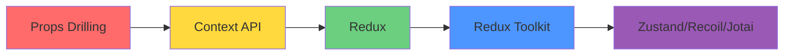
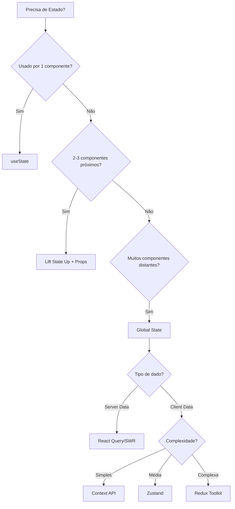
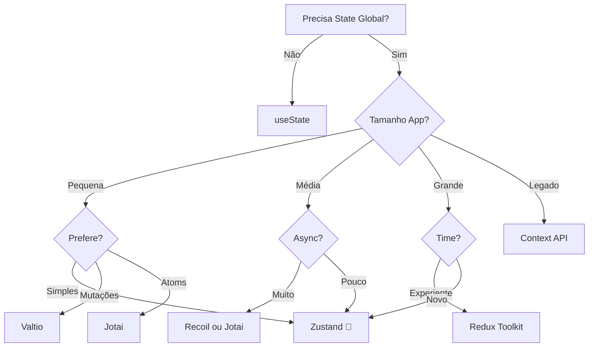
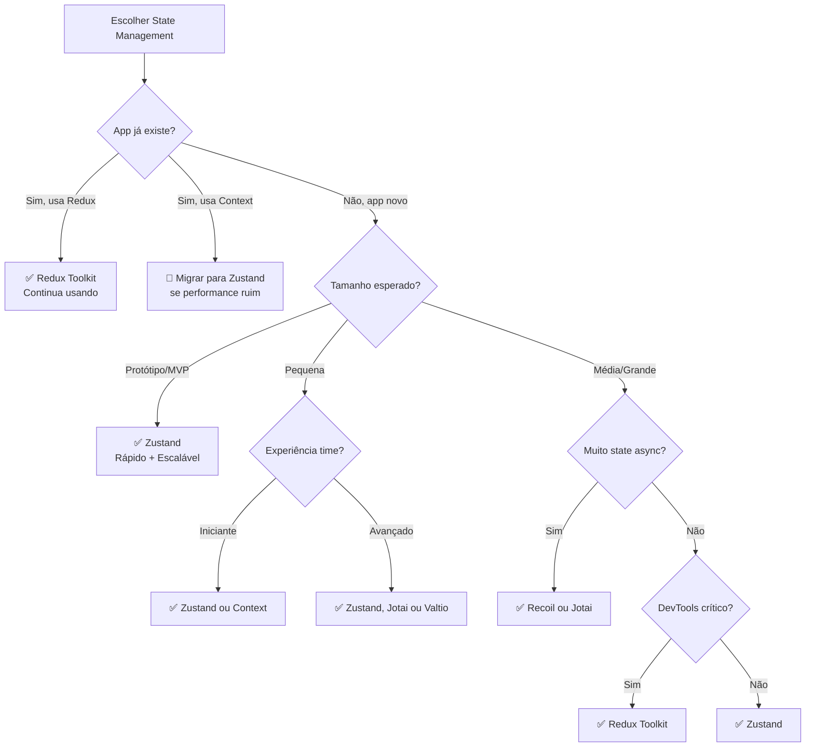

# 🗂️ **React State Management - Guia Completo**

> **Versão React:** 18+  
> **Última atualização:** Outubro 2024  
> **Nível:** Intermediário a Avançado

---

## 📋 **Índice**

1. [Introdução ao State Management](#1-introdução-ao-state-management)
2. [Local State vs Global State](#2-local-state-vs-global-state)
3. [Context API - Nativo do React](#3-context-api---nativo-do-react)
4. [Redux Toolkit - O Padrão da Indústria](#4-redux-toolkit---o-padrão-da-indústria)
5. [Zustand - Simples e Poderoso](#5-zustand---simples-e-poderoso)
6. [Recoil - Atômico e Flexível](#6-recoil---atômico-e-flexível)
7. [Jotai - Minimalista](#7-jotai---minimalista)
8. [Valtio - Proxy-based](#8-valtio---proxy-based)
9. [Comparação de Bibliotecas](#9-comparação-de-bibliotecas)
10. [Quando Usar Cada Solução](#10-quando-usar-cada-solução)
11. [Padrões e Best Practices](#11-padrões-e-best-practices)
12. [Performance e Otimização](#12-performance-e-otimização)
13. [Server State vs Client State](#13-server-state-vs-client-state)
14. [Troubleshooting](#14-troubleshooting)
15. [Recursos e Referências](#15-recursos-e-referências)

---

## 1. 📚 **Introdução ao State Management**

### 1.1. O que é State Management?

**State Management** (Gerenciamento de Estado) é a forma como você organiza, atualiza e compartilha dados entre componentes da sua aplicação React.

```jsx
// ═══════════════════════════════════════════════════════════
// PROBLEMA: Como compartilhar estado entre componentes?
// ═══════════════════════════════════════════════════════════

function App() {
  const [user, setUser] = useState(null);

  return (
    <div>
      <Header />           {/* Precisa de user */}
      <Sidebar />          {/* Precisa de user */}
      <Main />             {/* Precisa de user */}
      <Profile />          {/* Precisa de user */}
    </div>
  );
}

// 🤔 Como todos os componentes acessam 'user'?
```

### 1.2. Evolução do State Management



### 1.3. Por que Gerenciar Estado?

| **Sem State Management** | **Com State Management** |
|---------------------------|--------------------------|
| ❌ Props drilling (passar props por muitos níveis) | ✅ Acesso direto ao estado |
| ❌ Código duplicado | ✅ Single source of truth |
| ❌ Difícil debugar | ✅ DevTools para inspecionar |
| ❌ Re-renders desnecessários | ✅ Otimização automática |
| ❌ Lógica espalhada | ✅ Lógica centralizada |

### 1.4. Tipos de Estado

```jsx
// ═══════════════════════════════════════════════════════════
// 1. LOCAL STATE (useState)
// ═══════════════════════════════════════════════════════════
function Counter() {
  const [count, setCount] = useState(0);  // ✅ Só este componente usa
  return <div>{count}</div>;
}

// ═══════════════════════════════════════════════════════════
// 2. LIFTED STATE (props)
// ═══════════════════════════════════════════════════════════
function Parent() {
  const [count, setCount] = useState(0);  // Estado no pai
  
  return (
    <>
      <Child1 count={count} />             {/* Props */}
      <Child2 count={count} />
    </>
  );
}

// ═══════════════════════════════════════════════════════════
// 3. GLOBAL STATE (Context/Redux/Zustand)
// ═══════════════════════════════════════════════════════════
// Qualquer componente acessa sem props!
function AnyComponent() {
  const { user } = useGlobalState();
  return <div>{user.name}</div>;
}

// ═══════════════════════════════════════════════════════════
// 4. SERVER STATE (React Query/SWR)
// ═══════════════════════════════════════════════════════════
function UserProfile() {
  const { data: user } = useQuery('/api/user');
  return <div>{user?.name}</div>;
}

// ═══════════════════════════════════════════════════════════
// 5. URL STATE (React Router)
// ═══════════════════════════════════════════════════════════
function SearchPage() {
  const [searchParams] = useSearchParams();
  const query = searchParams.get('q');  // Estado na URL
  return <div>Buscando: {query}</div>;
}
```

---

## 2. 🎯 **Local State vs Global State**

### 2.1. Quando Usar Local State

```jsx
// ✅ USE LOCAL STATE QUANDO:
// - Estado usado por 1 componente
// - Estado não precisa persistir
// - Estado não precisa ser compartilhado

// Exemplo 1: Toggle de menu
function Menu() {
  const [isOpen, setIsOpen] = useState(false);  // ✅ Local
  
  return (
    <div>
      <button onClick={() => setIsOpen(!isOpen)}>Menu</button>
      {isOpen && <MenuItems />}
    </div>
  );
}

// Exemplo 2: Input de formulário
function SearchBox() {
  const [query, setQuery] = useState('');  // ✅ Local
  
  return (
    <input
      value={query}
      onChange={e => setQuery(e.target.value)}
    />
  );
}

// Exemplo 3: Paginação
function Table() {
  const [page, setPage] = useState(1);  // ✅ Local
  
  return (
    <div>
      <TableData page={page} />
      <Pagination page={page} onPageChange={setPage} />
    </div>
  );
}
```

### 2.2. Quando Usar Global State

```jsx
// ✅ USE GLOBAL STATE QUANDO:
// - Estado compartilhado por muitos componentes
// - Estado precisa persistir entre páginas
// - Estado complexo com lógica

// Exemplo 1: Autenticação (usado em toda app)
const { user, login, logout } = useAuth();  // ✅ Global

// Exemplo 2: Tema (usado em todos componentes)
const { theme, toggleTheme } = useTheme();  // ✅ Global

// Exemplo 3: Carrinho de compras (múltiplas páginas)
const { items, addItem, removeItem } = useCart();  // ✅ Global

// Exemplo 4: Notificações (aparecem em qualquer lugar)
const { notifications, addNotification } = useNotifications();  // ✅ Global
```

### 2.3. Diagrama de Decisão



---

## 3. 🌐 **Context API - Nativo do React**

### 3.1. Introdução

**Context API** é a solução **nativa do React** para compartilhar estado sem prop drilling.

**Quando usar:**
- ✅ Estado global simples (tema, idioma, auth)
- ✅ Não quer adicionar biblioteca externa
- ✅ Poucos updates no estado

**Quando NÃO usar:**
- ❌ Muitas atualizações frequentes (performance)
- ❌ Estado muito complexo
- ❌ Precisa de DevTools avançado

### 3.2. Exemplo Básico

```jsx
import { createContext, useContext, useState } from 'react';

// ═══════════════════════════════════════════════════════════
// 1. CRIAR CONTEXT
// ═══════════════════════════════════════════════════════════
const ThemeContext = createContext();

// ═══════════════════════════════════════════════════════════
// 2. CUSTOM HOOK (opcional mas recomendado)
// ═══════════════════════════════════════════════════════════
export function useTheme() {
  const context = useContext(ThemeContext);
  
  if (!context) {
    throw new Error('useTheme deve ser usado dentro de ThemeProvider');
  }
  
  return context;
}

// ═══════════════════════════════════════════════════════════
// 3. PROVIDER COMPONENT
// ═══════════════════════════════════════════════════════════
export function ThemeProvider({ children }) {
  const [theme, setTheme] = useState('light');

  const toggleTheme = () => {
    setTheme(prev => prev === 'light' ? 'dark' : 'light');
  };

  const value = {
    theme,
    toggleTheme
  };

  return (
    <ThemeContext.Provider value={value}>
      {children}
    </ThemeContext.Provider>
  );
}

// ═══════════════════════════════════════════════════════════
// 4. USO EM APP
// ═══════════════════════════════════════════════════════════
function App() {
  return (
    <ThemeProvider>
      <Header />
      <Main />
      <Footer />
    </ThemeProvider>
  );
}

// ═══════════════════════════════════════════════════════════
// 5. CONSUMIR EM QUALQUER COMPONENTE
// ═══════════════════════════════════════════════════════════
function Header() {
  const { theme, toggleTheme } = useTheme();

  return (
    <header className={theme}>
      <h1>Minha App</h1>
      <button onClick={toggleTheme}>
        Mudar para {theme === 'light' ? 'dark' : 'light'}
      </button>
    </header>
  );
}

function Main() {
  const { theme } = useTheme();
  
  return (
    <main className={theme}>
      <p>Tema atual: {theme}</p>
    </main>
  );
}
```

### 3.3. Context com useReducer (Pattern Avançado)

```jsx
import { createContext, useContext, useReducer } from 'react';

// ═══════════════════════════════════════════════════════════
// ACTIONS
// ═══════════════════════════════════════════════════════════
const ACTIONS = {
  LOGIN: 'LOGIN',
  LOGOUT: 'LOGOUT',
  UPDATE_PROFILE: 'UPDATE_PROFILE'
};

// ═══════════════════════════════════════════════════════════
// REDUCER
// ═══════════════════════════════════════════════════════════
function authReducer(state, action) {
  switch (action.type) {
    case ACTIONS.LOGIN:
      return {
        ...state,
        user: action.payload,
        isAuthenticated: true
      };
    
    case ACTIONS.LOGOUT:
      return {
        ...state,
        user: null,
        isAuthenticated: false
      };
    
    case ACTIONS.UPDATE_PROFILE:
      return {
        ...state,
        user: { ...state.user, ...action.payload }
      };
    
    default:
      return state;
  }
}

// ═══════════════════════════════════════════════════════════
// CONTEXT
// ═══════════════════════════════════════════════════════════
const AuthContext = createContext();

export function useAuth() {
  const context = useContext(AuthContext);
  if (!context) {
    throw new Error('useAuth deve ser usado dentro de AuthProvider');
  }
  return context;
}

// ═══════════════════════════════════════════════════════════
// PROVIDER
// ═══════════════════════════════════════════════════════════
export function AuthProvider({ children }) {
  const [state, dispatch] = useReducer(authReducer, {
    user: null,
    isAuthenticated: false
  });

  // ─────────────────────────────────────────────────────
  // ACTIONS (wrapped)
  // ─────────────────────────────────────────────────────
  const login = async (email, password) => {
    try {
      // Simula API call
      const response = await fetch('/api/login', {
        method: 'POST',
        headers: { 'Content-Type': 'application/json' },
        body: JSON.stringify({ email, password })
      });
      
      const user = await response.json();
      
      dispatch({
        type: ACTIONS.LOGIN,
        payload: user
      });
    } catch (error) {
      console.error('Login failed:', error);
      throw error;
    }
  };

  const logout = () => {
    dispatch({ type: ACTIONS.LOGOUT });
  };

  const updateProfile = (data) => {
    dispatch({
      type: ACTIONS.UPDATE_PROFILE,
      payload: data
    });
  };

  const value = {
    user: state.user,
    isAuthenticated: state.isAuthenticated,
    login,
    logout,
    updateProfile
  };

  return (
    <AuthContext.Provider value={value}>
      {children}
    </AuthContext.Provider>
  );
}

// ═══════════════════════════════════════════════════════════
// USO
// ═══════════════════════════════════════════════════════════
function LoginPage() {
  const { login } = useAuth();
  const [email, setEmail] = useState('');
  const [password, setPassword] = useState('');

  const handleSubmit = async (e) => {
    e.preventDefault();
    await login(email, password);
  };

  return (
    <form onSubmit={handleSubmit}>
      <input value={email} onChange={e => setEmail(e.target.value)} />
      <input type="password" value={password} onChange={e => setPassword(e.target.value)} />
      <button type="submit">Login</button>
    </form>
  );
}

function ProfilePage() {
  const { user, isAuthenticated, logout } = useAuth();

  if (!isAuthenticated) {
    return <div>Faça login primeiro</div>;
  }

  return (
    <div>
      <h1>Bem-vindo, {user.name}</h1>
      <p>Email: {user.email}</p>
      <button onClick={logout}>Sair</button>
    </div>
  );
}
```

### 3.4. Múltiplos Contexts

```jsx
import { createContext, useContext, useState } from 'react';

// ═══════════════════════════════════════════════════════════
// AUTH CONTEXT
// ═══════════════════════════════════════════════════════════
const AuthContext = createContext();

export function useAuth() {
  return useContext(AuthContext);
}

export function AuthProvider({ children }) {
  const [user, setUser] = useState(null);

  const login = (userData) => setUser(userData);
  const logout = () => setUser(null);

  return (
    <AuthContext.Provider value={{ user, login, logout }}>
      {children}
    </AuthContext.Provider>
  );
}

// ═══════════════════════════════════════════════════════════
// THEME CONTEXT
// ═══════════════════════════════════════════════════════════
const ThemeContext = createContext();

export function useTheme() {
  return useContext(ThemeContext);
}

export function ThemeProvider({ children }) {
  const [theme, setTheme] = useState('light');

  const toggleTheme = () => {
    setTheme(prev => prev === 'light' ? 'dark' : 'light');
  };

  return (
    <ThemeContext.Provider value={{ theme, toggleTheme }}>
      {children}
    </ThemeContext.Provider>
  );
}

// ═══════════════════════════════════════════════════════════
// LANGUAGE CONTEXT
// ═══════════════════════════════════════════════════════════
const LanguageContext = createContext();

export function useLanguage() {
  return useContext(LanguageContext);
}

export function LanguageProvider({ children }) {
  const [language, setLanguage] = useState('pt-BR');

  return (
    <LanguageContext.Provider value={{ language, setLanguage }}>
      {children}
    </LanguageContext.Provider>
  );
}

// ═══════════════════════════════════════════════════════════
// APP: Combinar providers
// ═══════════════════════════════════════════════════════════

// ❌ RUIM: Pyramid of doom
function App() {
  return (
    <AuthProvider>
      <ThemeProvider>
        <LanguageProvider>
          <Dashboard />
        </LanguageProvider>
      </ThemeProvider>
    </AuthProvider>
  );
}

// ✅ MELHOR: Componente combiner
function AppProviders({ children }) {
  return (
    <AuthProvider>
      <ThemeProvider>
        <LanguageProvider>
          {children}
        </LanguageProvider>
      </ThemeProvider>
    </AuthProvider>
  );
}

function App() {
  return (
    <AppProviders>
      <Dashboard />
    </AppProviders>
  );
}

// ═══════════════════════════════════════════════════════════
// USO: Múltiplos contexts em um componente
// ═══════════════════════════════════════════════════════════
function Dashboard() {
  const { user, logout } = useAuth();
  const { theme, toggleTheme } = useTheme();
  const { language, setLanguage } = useLanguage();

  return (
    <div className={theme}>
      <header>
        <p>Bem-vindo, {user?.name}</p>
        <button onClick={logout}>Sair</button>
      </header>

      <aside>
        <button onClick={toggleTheme}>
          Tema: {theme}
        </button>
        <select value={language} onChange={e => setLanguage(e.target.value)}>
          <option value="pt-BR">Português</option>
          <option value="en-US">English</option>
          <option value="es-ES">Español</option>
        </select>
      </aside>

      <main>
        <p>Conteúdo principal</p>
      </main>
    </div>
  );
}
```

### 3.5. Otimização de Context (Evitar Re-renders)

```jsx
import { createContext, useContext, useState, useMemo, memo } from 'react';

// ❌ PROBLEMA: Re-renders desnecessários
function BadProvider({ children }) {
  const [user, setUser] = useState(null);
  const [theme, setTheme] = useState('light');

  // ❌ Novo objeto toda renderização!
  const value = {
    user,
    setUser,
    theme,
    setTheme
  };

  return (
    <Context.Provider value={value}>
      {children}
    </Context.Provider>
  );
  
  // Problema: Qualquer mudança em user ou theme
  // faz TODOS os consumidores re-renderizarem!
}

// ✅ SOLUÇÃO 1: useMemo no value
function GoodProvider1({ children }) {
  const [user, setUser] = useState(null);
  const [theme, setTheme] = useState('light');

  const value = useMemo(() => ({
    user,
    setUser,
    theme,
    setTheme
  }), [user, theme]);  // ✅ Só cria novo objeto se mudar

  return (
    <Context.Provider value={value}>
      {children}
    </Context.Provider>
  );
}

// ✅ SOLUÇÃO 2: Separar contexts
const UserContext = createContext();
const ThemeContext = createContext();

function BetterProvider({ children }) {
  const [user, setUser] = useState(null);
  const [theme, setTheme] = useState('light');

  const userValue = useMemo(() => ({ user, setUser }), [user]);
  const themeValue = useMemo(() => ({ theme, setTheme }), [theme]);

  return (
    <UserContext.Provider value={userValue}>
      <ThemeContext.Provider value={themeValue}>
        {children}
      </ThemeContext.Provider>
    </UserContext.Provider>
  );
}

// Componente que só usa theme não re-renderiza quando user muda! ✅
function ThemeButton() {
  const { theme, setTheme } = useContext(ThemeContext);
  console.log('ThemeButton renderizou');
  
  return <button onClick={() => setTheme('dark')}>{theme}</button>;
}

// ✅ SOLUÇÃO 3: Split state e actions
const StateContext = createContext();
const ActionsContext = createContext();

function OptimalProvider({ children }) {
  const [state, setState] = useState({
    user: null,
    theme: 'light'
  });

  // Actions nunca mudam (referência estável)
  const actions = useMemo(() => ({
    setUser: (user) => setState(prev => ({ ...prev, user })),
    setTheme: (theme) => setState(prev => ({ ...prev, theme }))
  }), []);

  return (
    <StateContext.Provider value={state}>
      <ActionsContext.Provider value={actions}>
        {children}
      </ActionsContext.Provider>
    </StateContext.Provider>
  );
}

export function useAppState() {
  return useContext(StateContext);
}

export function useAppActions() {
  return useContext(ActionsContext);
}

// Uso: Componente que só chama actions não re-renderiza! ✅
const AddButton = memo(function AddButton() {
  const { setUser } = useAppActions();
  console.log('AddButton renderizou');  // Só renderiza 1x!
  
  return (
    <button onClick={() => setUser({ name: 'João' })}>
      Add User
    </button>
  );
});
```

### 3.6. Context com Persist (localStorage)

```jsx
import { createContext, useContext, useState, useEffect } from 'react';

const SettingsContext = createContext();

export function useSettings() {
  return useContext(SettingsContext);
}

export function SettingsProvider({ children }) {
  // ✅ Lazy initialization: lê localStorage só no mount
  const [settings, setSettings] = useState(() => {
    const saved = localStorage.getItem('settings');
    return saved ? JSON.parse(saved) : {
      theme: 'light',
      language: 'pt-BR',
      notifications: true
    };
  });

  // ✅ Sync com localStorage quando settings mudar
  useEffect(() => {
    localStorage.setItem('settings', JSON.stringify(settings));
  }, [settings]);

  const updateSettings = (updates) => {
    setSettings(prev => ({ ...prev, ...updates }));
  };

  const resetSettings = () => {
    setSettings({
      theme: 'light',
      language: 'pt-BR',
      notifications: true
    });
  };

  const value = {
    settings,
    updateSettings,
    resetSettings
  };

  return (
    <SettingsContext.Provider value={value}>
      {children}
    </SettingsContext.Provider>
  );
}

// USO
function SettingsPage() {
  const { settings, updateSettings } = useSettings();

  return (
    <div>
      <h2>Configurações</h2>
      
      <label>
        Tema:
        <select
          value={settings.theme}
          onChange={e => updateSettings({ theme: e.target.value })}
        >
          <option value="light">Light</option>
          <option value="dark">Dark</option>
        </select>
      </label>

      <label>
        Idioma:
        <select
          value={settings.language}
          onChange={e => updateSettings({ language: e.target.value })}
        >
          <option value="pt-BR">Português</option>
          <option value="en-US">English</option>
        </select>
      </label>

      <label>
        <input
          type="checkbox"
          checked={settings.notifications}
          onChange={e => updateSettings({ notifications: e.target.checked })}
        />
        Notificações
      </label>
    </div>
  );
}
```

### 3.7. Prós e Contras do Context API

**✅ Prós:**
- Nativo do React (sem libs externas)
- Simples de implementar
- Ótimo para estado global simples
- Zero configuração
- TypeScript friendly

**❌ Contras:**
- Performance em apps grandes (muitos consumers)
- Sem DevTools nativo
- Sem middleware
- Sem time-travel debugging
- Pode causar re-renders desnecessários se mal otimizado
- Boilerplate para cada context

**Quando usar Context API:**
- ✅ Tema, idioma, preferências
- ✅ Autenticação simples
- ✅ Protótipos e MVPs
- ✅ Apps pequenas/médias (<50 componentes)
- ❌ Estado muito complexo
- ❌ Atualizações frequentes
- ❌ Precisa de DevTools avançado

---

## 4. 🔴 **Redux Toolkit - O Padrão da Indústria**

### 4.1. Introdução

**Redux Toolkit** é a forma **oficial e recomendada** de usar Redux. Simplifica drasticamente o código Redux tradicional.

**Instalação:**

```bash
npm install @reduxjs/toolkit react-redux
```

**Quando usar:**
- ✅ Apps grandes e complexas
- ✅ Estado compartilhado por muitos componentes
- ✅ Lógica complexa de updates
- ✅ Precisa de DevTools poderoso
- ✅ Time-travel debugging
- ✅ Middleware (logging, async)

**Quando NÃO usar:**
- ❌ App pequena/simples
- ❌ Prototipagem rápida
- ❌ Estado local suficiente

### 4.2. Conceitos Básicos

```jsx
// ═══════════════════════════════════════════════════════════
// CONCEITOS DO REDUX
// ═══════════════════════════════════════════════════════════

// 1. STORE: Armazena todo o estado da aplicação
const store = configureStore({
  reducer: {
    counter: counterReducer,
    user: userReducer
  }
});

// 2. SLICE: Pedaço do estado com reducer e actions
const counterSlice = createSlice({
  name: 'counter',
  initialState: { value: 0 },
  reducers: {
    increment: (state) => { state.value += 1 },
    decrement: (state) => { state.value -= 1 }
  }
});

// 3. ACTION: Objeto que descreve o que aconteceu
dispatch({ type: 'counter/increment' });

// 4. REDUCER: Função pura que atualiza o estado
function reducer(state, action) {
  switch (action.type) {
    case 'counter/increment':
      return { ...state, value: state.value + 1 };
    default:
      return state;
  }
}

// 5. DISPATCH: Envia action para store
dispatch(increment());

// 6. SELECTOR: Extrai dados do store
const count = useSelector(state => state.counter.value);
```

### 4.3. Setup Completo

```jsx
// ═══════════════════════════════════════════════════════════
// src/store/store.js
// ═══════════════════════════════════════════════════════════
import { configureStore } from '@reduxjs/toolkit';
import counterReducer from './slices/counterSlice';
import userReducer from './slices/userSlice';
import todoReducer from './slices/todoSlice';

export const store = configureStore({
  reducer: {
    counter: counterReducer,
    user: userReducer,
    todos: todoReducer
  },
  // DevTools habilitado por padrão em development
  devTools: process.env.NODE_ENV !== 'production'
});

// ═══════════════════════════════════════════════════════════
// src/main.jsx
// ═══════════════════════════════════════════════════════════
import React from 'react';
import ReactDOM from 'react-dom/client';
import { Provider } from 'react-redux';
import { store } from './store/store';
import App from './App';

ReactDOM.createRoot(document.getElementById('root')).render(
  <React.StrictMode>
    <Provider store={store}>
      <App />
    </Provider>
  </React.StrictMode>
);
```

### 4.4. Criando um Slice (Counter Exemplo)

```jsx
// ═══════════════════════════════════════════════════════════
// src/store/slices/counterSlice.js
// ═══════════════════════════════════════════════════════════
import { createSlice } from '@reduxjs/toolkit';

const counterSlice = createSlice({
  // ─────────────────────────────────────────────────────
  // 1. NOME DO SLICE
  // ─────────────────────────────────────────────────────
  name: 'counter',

  // ─────────────────────────────────────────────────────
  // 2. ESTADO INICIAL
  // ─────────────────────────────────────────────────────
  initialState: {
    value: 0,
    history: []
  },

  // ─────────────────────────────────────────────────────
  // 3. REDUCERS (ações síncronas)
  // ─────────────────────────────────────────────────────
  reducers: {
    increment: (state) => {
      // ✅ Immer permite "mutação" direta!
      state.value += 1;
      state.history.push({ action: 'increment', value: state.value });
    },

    decrement: (state) => {
      state.value -= 1;
      state.history.push({ action: 'decrement', value: state.value });
    },

    incrementByAmount: (state, action) => {
      // action.payload contém o valor
      state.value += action.payload;
      state.history.push({ action: 'incrementByAmount', value: state.value });
    },

    reset: (state) => {
      state.value = 0;
      state.history = [];
    }
  }
});

// ─────────────────────────────────────────────────────
// 4. EXPORTAR ACTIONS
// ─────────────────────────────────────────────────────
export const { increment, decrement, incrementByAmount, reset } = counterSlice.actions;

// ─────────────────────────────────────────────────────
// 5. EXPORTAR REDUCER
// ─────────────────────────────────────────────────────
export default counterSlice.reducer;

// ─────────────────────────────────────────────────────
// 6. SELECTORS (opcional mas recomendado)
// ─────────────────────────────────────────────────────
export const selectCount = (state) => state.counter.value;
export const selectHistory = (state) => state.counter.history;
```

### 4.5. Usando no Componente

```jsx
// ═══════════════════════════════════════════════════════════
// src/components/Counter.jsx
// ═══════════════════════════════════════════════════════════
import { useSelector, useDispatch } from 'react-redux';
import {
  increment,
  decrement,
  incrementByAmount,
  reset,
  selectCount,
  selectHistory
} from '../store/slices/counterSlice';

function Counter() {
  // ─────────────────────────────────────────────────────
  // 1. ACESSAR ESTADO (useSelector)
  // ─────────────────────────────────────────────────────
  const count = useSelector(selectCount);
  const history = useSelector(selectHistory);

  // OU diretamente:
  // const count = useSelector(state => state.counter.value);

  // ─────────────────────────────────────────────────────
  // 2. DISPATCH PARA ATUALIZAR (useDispatch)
  // ─────────────────────────────────────────────────────
  const dispatch = useDispatch();

  return (
    <div className="counter">
      <h2>Count: {count}</h2>

      <div className="buttons">
        <button onClick={() => dispatch(decrement())}>-</button>
        <button onClick={() => dispatch(increment())}>+</button>
        <button onClick={() => dispatch(incrementByAmount(5))}>+5</button>
        <button onClick={() => dispatch(reset())}>Reset</button>
      </div>

      <div className="history">
        <h3>Histórico</h3>
        <ul>
          {history.map((item, index) => (
            <li key={index}>
              {item.action}: {item.value}
            </li>
          ))}
        </ul>
      </div>
    </div>
  );
}

export default Counter;
```

### 4.6. Slice Complexo - User Authentication

```jsx
// ═══════════════════════════════════════════════════════════
// src/store/slices/userSlice.js
// ═══════════════════════════════════════════════════════════
import { createSlice, createAsyncThunk } from '@reduxjs/toolkit';

// ─────────────────────────────────────────────────────
// ASYNC THUNKS (ações assíncronas)
// ─────────────────────────────────────────────────────

// Login assíncrono
export const loginUser = createAsyncThunk(
  'user/login',
  async ({ email, password }, { rejectWithValue }) => {
    try {
      const response = await fetch('/api/login', {
        method: 'POST',
        headers: { 'Content-Type': 'application/json' },
        body: JSON.stringify({ email, password })
      });

      if (!response.ok) {
        throw new Error('Login failed');
      }

      const data = await response.json();
      
      // Salva token
      localStorage.setItem('token', data.token);
      
      return data.user;
    } catch (error) {
      return rejectWithValue(error.message);
    }
  }
);

// Fetch user profile
export const fetchUserProfile = createAsyncThunk(
  'user/fetchProfile',
  async (userId) => {
    const response = await fetch(`/api/users/${userId}`);
    return response.json();
  }
);

// Update profile
export const updateUserProfile = createAsyncThunk(
  'user/updateProfile',
  async (updates) => {
    const response = await fetch('/api/user', {
      method: 'PATCH',
      headers: { 'Content-Type': 'application/json' },
      body: JSON.stringify(updates)
    });
    return response.json();
  }
);

// ─────────────────────────────────────────────────────
// SLICE
// ─────────────────────────────────────────────────────
const userSlice = createSlice({
  name: 'user',
  
  initialState: {
    currentUser: null,
    isAuthenticated: false,
    loading: false,
    error: null
  },

  reducers: {
    // Ações síncronas
    logout: (state) => {
      state.currentUser = null;
      state.isAuthenticated = false;
      localStorage.removeItem('token');
    },

    clearError: (state) => {
      state.error = null;
    }
  },

  // ─────────────────────────────────────────────────────
  // EXTRA REDUCERS (para async thunks)
  // ─────────────────────────────────────────────────────
  extraReducers: (builder) => {
    // ──────────────────────────────────────────────────
    // LOGIN
    // ──────────────────────────────────────────────────
    builder
      .addCase(loginUser.pending, (state) => {
        state.loading = true;
        state.error = null;
      })
      .addCase(loginUser.fulfilled, (state, action) => {
        state.loading = false;
        state.currentUser = action.payload;
        state.isAuthenticated = true;
      })
      .addCase(loginUser.rejected, (state, action) => {
        state.loading = false;
        state.error = action.payload;
      })

    // ──────────────────────────────────────────────────
    // FETCH PROFILE
    // ──────────────────────────────────────────────────
      .addCase(fetchUserProfile.pending, (state) => {
        state.loading = true;
      })
      .addCase(fetchUserProfile.fulfilled, (state, action) => {
        state.loading = false;
        state.currentUser = { ...state.currentUser, ...action.payload };
      })
      .addCase(fetchUserProfile.rejected, (state, action) => {
        state.loading = false;
        state.error = action.error.message;
      })

    // ──────────────────────────────────────────────────
    // UPDATE PROFILE
    // ──────────────────────────────────────────────────
      .addCase(updateUserProfile.fulfilled, (state, action) => {
        state.currentUser = { ...state.currentUser, ...action.payload };
      });
  }
});

// ─────────────────────────────────────────────────────
// EXPORTS
// ─────────────────────────────────────────────────────
export const { logout, clearError } = userSlice.actions;

// Selectors
export const selectCurrentUser = (state) => state.user.currentUser;
export const selectIsAuthenticated = (state) => state.user.isAuthenticated;
export const selectUserLoading = (state) => state.user.loading;
export const selectUserError = (state) => state.user.error;

export default userSlice.reducer;
```

### 4.7. Usando User Slice

```jsx
// ═══════════════════════════════════════════════════════════
// LoginPage.jsx
// ═══════════════════════════════════════════════════════════
import { useState } from 'react';
import { useDispatch, useSelector } from 'react-redux';
import {
  loginUser,
  selectUserLoading,
  selectUserError
} from '../store/slices/userSlice';

function LoginPage() {
  const dispatch = useDispatch();
  const loading = useSelector(selectUserLoading);
  const error = useSelector(selectUserError);

  const [email, setEmail] = useState('');
  const [password, setPassword] = useState('');

  const handleSubmit = async (e) => {
    e.preventDefault();
    
    // Dispatch async thunk
    const result = await dispatch(loginUser({ email, password }));
    
    if (loginUser.fulfilled.match(result)) {
      console.log('Login success!');
      // Redirecionar...
    }
  };

  return (
    <form onSubmit={handleSubmit}>
      <h2>Login</h2>

      {error && <div className="error">{error}</div>}

      <input
        type="email"
        value={email}
        onChange={e => setEmail(e.target.value)}
        placeholder="Email"
      />

      <input
        type="password"
        value={password}
        onChange={e => setPassword(e.target.value)}
        placeholder="Senha"
      />

      <button type="submit" disabled={loading}>
        {loading ? 'Entrando...' : 'Entrar'}
      </button>
    </form>
  );
}

// ═══════════════════════════════════════════════════════════
// ProfilePage.jsx
// ═══════════════════════════════════════════════════════════
import { useDispatch, useSelector } from 'react-redux';
import {
  logout,
  updateUserProfile,
  selectCurrentUser,
  selectIsAuthenticated
} from '../store/slices/userSlice';

function ProfilePage() {
  const dispatch = useDispatch();
  const user = useSelector(selectCurrentUser);
  const isAuthenticated = useSelector(selectIsAuthenticated);

  if (!isAuthenticated) {
    return <div>Faça login primeiro</div>;
  }

  const handleLogout = () => {
    dispatch(logout());
  };

  const handleUpdateName = () => {
    dispatch(updateUserProfile({ name: 'Novo Nome' }));
  };

  return (
    <div>
      <h1>Perfil</h1>
      <p>Nome: {user.name}</p>
      <p>Email: {user.email}</p>
      
      <button onClick={handleUpdateName}>Atualizar Nome</button>
      <button onClick={handleLogout}>Sair</button>
    </div>
  );
}
```

### 4.8. Slice Completo - Todo List

```jsx
// ═══════════════════════════════════════════════════════════
// src/store/slices/todoSlice.js
// ═══════════════════════════════════════════════════════════
import { createSlice, createAsyncThunk, nanoid } from '@reduxjs/toolkit';

// ─────────────────────────────────────────────────────
// ASYNC THUNKS
// ─────────────────────────────────────────────────────
export const fetchTodos = createAsyncThunk(
  'todos/fetchTodos',
  async () => {
    const response = await fetch('/api/todos');
    return response.json();
  }
);

export const addTodoAsync = createAsyncThunk(
  'todos/addTodo',
  async (text) => {
    const response = await fetch('/api/todos', {
      method: 'POST',
      headers: { 'Content-Type': 'application/json' },
      body: JSON.stringify({ text })
    });
    return response.json();
  }
);

export const toggleTodoAsync = createAsyncThunk(
  'todos/toggleTodo',
  async (id) => {
    const response = await fetch(`/api/todos/${id}/toggle`, {
      method: 'PATCH'
    });
    return response.json();
  }
);

export const deleteTodoAsync = createAsyncThunk(
  'todos/deleteTodo',
  async (id) => {
    await fetch(`/api/todos/${id}`, { method: 'DELETE' });
    return id;
  }
);

// ─────────────────────────────────────────────────────
// SLICE
// ─────────────────────────────────────────────────────
const todoSlice = createSlice({
  name: 'todos',
  
  initialState: {
    items: [],
    filter: 'all',  // 'all' | 'active' | 'completed'
    loading: false,
    error: null
  },

  reducers: {
    // Ações síncronas (otimistas/offline-first)
    addTodo: {
      reducer: (state, action) => {
        state.items.push(action.payload);
      },
      prepare: (text) => {
        return {
          payload: {
            id: nanoid(),
            text,
            completed: false,
            createdAt: new Date().toISOString()
          }
        };
      }
    },

    toggleTodo: (state, action) => {
      const todo = state.items.find(t => t.id === action.payload);
      if (todo) {
        todo.completed = !todo.completed;
      }
    },

    deleteTodo: (state, action) => {
      state.items = state.items.filter(t => t.id !== action.payload);
    },

    updateTodo: (state, action) => {
      const { id, text } = action.payload;
      const todo = state.items.find(t => t.id === id);
      if (todo) {
        todo.text = text;
      }
    },

    setFilter: (state, action) => {
      state.filter = action.payload;
    },

    clearCompleted: (state) => {
      state.items = state.items.filter(t => !t.completed);
    }
  },

  extraReducers: (builder) => {
    builder
      // Fetch
      .addCase(fetchTodos.pending, (state) => {
        state.loading = true;
      })
      .addCase(fetchTodos.fulfilled, (state, action) => {
        state.loading = false;
        state.items = action.payload;
      })
      .addCase(fetchTodos.rejected, (state, action) => {
        state.loading = false;
        state.error = action.error.message;
      })

      // Add
      .addCase(addTodoAsync.fulfilled, (state, action) => {
        state.items.push(action.payload);
      })

      // Toggle
      .addCase(toggleTodoAsync.fulfilled, (state, action) => {
        const todo = state.items.find(t => t.id === action.payload.id);
        if (todo) {
          todo.completed = action.payload.completed;
        }
      })

      // Delete
      .addCase(deleteTodoAsync.fulfilled, (state, action) => {
        state.items = state.items.filter(t => t.id !== action.payload);
      });
  }
});

// ─────────────────────────────────────────────────────
// EXPORTS
// ─────────────────────────────────────────────────────
export const {
  addTodo,
  toggleTodo,
  deleteTodo,
  updateTodo,
  setFilter,
  clearCompleted
} = todoSlice.actions;

// ─────────────────────────────────────────────────────
// SELECTORS (com lógica)
// ─────────────────────────────────────────────────────
export const selectAllTodos = (state) => state.todos.items;

export const selectFilteredTodos = (state) => {
  const { items, filter } = state.todos;
  
  switch (filter) {
    case 'active':
      return items.filter(t => !t.completed);
    case 'completed':
      return items.filter(t => t.completed);
    default:
      return items;
  }
};

export const selectTodoStats = (state) => {
  const items = state.todos.items;
  
  return {
    total: items.length,
    active: items.filter(t => !t.completed).length,
    completed: items.filter(t => t.completed).length
  };
};

export const selectFilter = (state) => state.todos.filter;
export const selectTodosLoading = (state) => state.todos.loading;

export default todoSlice.reducer;
```

### 4.9. Todo Component

```jsx
// ═══════════════════════════════════════════════════════════
// TodoApp.jsx
// ═══════════════════════════════════════════════════════════
import { useEffect } from 'react';
import { useDispatch, useSelector } from 'react-redux';
import {
  fetchTodos,
  addTodo,
  toggleTodo,
  deleteTodo,
  setFilter,
  clearCompleted,
  selectFilteredTodos,
  selectTodoStats,
  selectFilter,
  selectTodosLoading
} from '../store/slices/todoSlice';

function TodoApp() {
  const dispatch = useDispatch();
  
  // Selectors
  const todos = useSelector(selectFilteredTodos);
  const stats = useSelector(selectTodoStats);
  const filter = useSelector(selectFilter);
  const loading = useSelector(selectTodosLoading);

  // Fetch ao montar
  useEffect(() => {
    dispatch(fetchTodos());
  }, [dispatch]);

  const handleAddTodo = (text) => {
    if (text.trim()) {
      dispatch(addTodo(text));
    }
  };

  if (loading) return <div>Carregando...</div>;

  return (
    <div className="todo-app">
      <h1>📝 Todo List (Redux)</h1>

      {/* Add Form */}
      <AddTodoForm onAdd={handleAddTodo} />

      {/* Stats */}
      <div className="stats">
        <span>Total: {stats.total}</span>
        <span>Ativas: {stats.active}</span>
        <span>Completas: {stats.completed}</span>
      </div>

      {/* Filters */}
      <div className="filters">
        <button
          className={filter === 'all' ? 'active' : ''}
          onClick={() => dispatch(setFilter('all'))}
        >
          Todas
        </button>
        <button
          className={filter === 'active' ? 'active' : ''}
          onClick={() => dispatch(setFilter('active'))}
        >
          Ativas
        </button>
        <button
          className={filter === 'completed' ? 'active' : ''}
          onClick={() => dispatch(setFilter('completed'))}
        >
          Completas
        </button>
      </div>

      {/* Todo List */}
      <ul className="todo-list">
        {todos.map(todo => (
          <li key={todo.id} className={todo.completed ? 'completed' : ''}>
            <input
              type="checkbox"
              checked={todo.completed}
              onChange={() => dispatch(toggleTodo(todo.id))}
            />
            <span>{todo.text}</span>
            <button onClick={() => dispatch(deleteTodo(todo.id))}>
              ❌
            </button>
          </li>
        ))}
      </ul>

      {/* Clear Completed */}
      {stats.completed > 0 && (
        <button onClick={() => dispatch(clearCompleted())}>
          Limpar Completas ({stats.completed})
        </button>
      )}
    </div>
  );
}

function AddTodoForm({ onAdd }) {
  const [text, setText] = useState('');

  const handleSubmit = (e) => {
    e.preventDefault();
    onAdd(text);
    setText('');
  };

  return (
    <form onSubmit={handleSubmit}>
      <input
        value={text}
        onChange={e => setText(e.target.value)}
        placeholder="O que precisa ser feito?"
      />
      <button type="submit">Adicionar</button>
    </form>
  );
}

export default TodoApp;
```

### 4.10. Redux DevTools

```jsx
// ═══════════════════════════════════════════════════════════
// REDUX DEVTOOLS - Já vem configurado no Redux Toolkit!
// ═══════════════════════════════════════════════════════════

// Instale a extensão do navegador:
// Chrome: https://chrome.google.com/webstore (Redux DevTools)
// Firefox: https://addons.mozilla.org/firefox/ (Redux DevTools)

// No código, já está habilitado por padrão:
const store = configureStore({
  reducer: {
    todos: todoReducer
  },
  // DevTools automático em development
  devTools: process.env.NODE_ENV !== 'production'
});

// ═══════════════════════════════════════════════════════════
// RECURSOS DO DEVTOOLS:
// ═══════════════════════════════════════════════════════════

// 1. Visualizar state completo
// 2. Ver todas as actions disparadas
// 3. Time-travel (voltar no tempo)
// 4. Replay de actions
// 5. Diff de state (antes/depois)
// 6. Export/Import de state
// 7. Dispatch manual de actions
```

### 4.11. Prós e Contras do Redux Toolkit

**✅ Prós:**
- DevTools poderoso (time-travel, replay)
- Padrão da indústria (muito material/jobs)
- Escalável para apps grandes
- Immer integrado (mutações "diretas")
- TypeScript excellent
- Middleware ecosystem (logging, persist, etc.)
- Previsível e testável
- Async thunks built-in

**❌ Contras:**
- Curva de aprendizado
- Boilerplate (menos que Redux antigo, mas ainda tem)
- Pode ser overkill para apps pequenas
- Precisa entender conceitos (actions, reducers, selectors)
- Performance overhead em comparação com soluções mais simples

**Quando usar Redux Toolkit:**
- ✅ Apps grandes/complexas (50+ componentes)
- ✅ Time grande (padrão conhecido)
- ✅ Estado compartilhado extensivamente
- ✅ Precisa de time-travel debugging
- ✅ Lógica complexa de updates
- ❌ Protótipos/MVPs rápidos
- ❌ Apps muito simples
- ❌ Time pequeno sem experiência Redux

---

## 5. 🐻 **Zustand - Simples e Poderoso**

### 5.1. Introdução

**Zustand** (alemão para "estado") é uma biblioteca de state management **minimalista, rápida e escalável**.

**Instalação:**

```bash
npm install zustand
```

**Por que Zustand?**
- ✅ **Extremamente simples** (sem boilerplate)
- ✅ **Performance excelente** (re-renders mínimos)
- ✅ **Sem Context Provider** necessário
- ✅ **API intuitiva** (useState-like)
- ✅ **TypeScript first-class**
- ✅ **Pequeno** (~1KB gzipped)
- ✅ **Middleware** (persist, devtools, immer)

### 5.2. Exemplo Básico - Counter

```jsx
// ═══════════════════════════════════════════════════════════
// src/stores/counterStore.js
// ═══════════════════════════════════════════════════════════
import { create } from 'zustand';

// ✅ Cria store com create()
const useCounterStore = create((set) => ({
  // ─────────────────────────────────────────────────────
  // STATE
  // ─────────────────────────────────────────────────────
  count: 0,
  
  // ─────────────────────────────────────────────────────
  // ACTIONS
  // ─────────────────────────────────────────────────────
  increment: () => set((state) => ({ count: state.count + 1 })),
  
  decrement: () => set((state) => ({ count: state.count - 1 })),
  
  incrementByAmount: (amount) => 
    set((state) => ({ count: state.count + amount })),
  
  reset: () => set({ count: 0 })
}));

export default useCounterStore;

// ═══════════════════════════════════════════════════════════
// src/components/Counter.jsx
// ═══════════════════════════════════════════════════════════
import useCounterStore from '../stores/counterStore';

function Counter() {
  // ✅ Usa o hook diretamente (sem Provider!)
  const count = useCounterStore((state) => state.count);
  const increment = useCounterStore((state) => state.increment);
  const decrement = useCounterStore((state) => state.decrement);
  const reset = useCounterStore((state) => state.reset);

  return (
    <div>
      <h2>Count: {count}</h2>
      <button onClick={decrement}>-</button>
      <button onClick={increment}>+</button>
      <button onClick={reset}>Reset</button>
    </div>
  );
}

// ✅ OU pegue tudo de uma vez
function CounterAlt() {
  const { count, increment, decrement, reset } = useCounterStore();

  return (
    <div>
      <h2>Count: {count}</h2>
      <button onClick={decrement}>-</button>
      <button onClick={increment}>+</button>
      <button onClick={reset}>Reset</button>
    </div>
  );
}
```

**🎯 Não precisa de Provider!** A store é global automaticamente.

### 5.3. Store Completo - Auth

```jsx
// ═══════════════════════════════════════════════════════════
// src/stores/authStore.js
// ═══════════════════════════════════════════════════════════
import { create } from 'zustand';

const useAuthStore = create((set, get) => ({
  // ─────────────────────────────────────────────────────
  // STATE
  // ─────────────────────────────────────────────────────
  user: null,
  token: null,
  isAuthenticated: false,
  loading: false,
  error: null,

  // ─────────────────────────────────────────────────────
  // ACTIONS
  // ─────────────────────────────────────────────────────
  
  // Login
  login: async (email, password) => {
    set({ loading: true, error: null });

    try {
      const response = await fetch('/api/login', {
        method: 'POST',
        headers: { 'Content-Type': 'application/json' },
        body: JSON.stringify({ email, password })
      });

      if (!response.ok) {
        throw new Error('Login failed');
      }

      const data = await response.json();

      set({
        user: data.user,
        token: data.token,
        isAuthenticated: true,
        loading: false
      });

      // Salva token
      localStorage.setItem('token', data.token);
    } catch (error) {
      set({
        error: error.message,
        loading: false
      });
      throw error;
    }
  },

  // Logout
  logout: () => {
    set({
      user: null,
      token: null,
      isAuthenticated: false
    });
    localStorage.removeItem('token');
  },

  // Update Profile
  updateProfile: (updates) => {
    set((state) => ({
      user: { ...state.user, ...updates }
    }));
  },

  // Fetch Profile
  fetchProfile: async () => {
    set({ loading: true });

    try {
      const token = get().token;  // ✅ get() acessa state atual
      
      const response = await fetch('/api/profile', {
        headers: {
          'Authorization': `Bearer ${token}`
        }
      });

      const user = await response.json();

      set({ user, loading: false });
    } catch (error) {
      set({ error: error.message, loading: false });
    }
  },

  // Clear Error
  clearError: () => set({ error: null })
}));

export default useAuthStore;
```

### 5.4. Usando Auth Store

```jsx
// ═══════════════════════════════════════════════════════════
// LoginPage.jsx
// ═══════════════════════════════════════════════════════════
import { useState } from 'react';
import useAuthStore from '../stores/authStore';

function LoginPage() {
  const [email, setEmail] = useState('');
  const [password, setPassword] = useState('');

  // ✅ Seleciona apenas o que precisa (otimização)
  const login = useAuthStore((state) => state.login);
  const loading = useAuthStore((state) => state.loading);
  const error = useAuthStore((state) => state.error);

  const handleSubmit = async (e) => {
    e.preventDefault();
    
    try {
      await login(email, password);
      // Redirecionar após sucesso...
    } catch (err) {
      console.error('Login error:', err);
    }
  };

  return (
    <form onSubmit={handleSubmit}>
      <h2>Login</h2>

      {error && <div className="error">{error}</div>}

      <input
        type="email"
        value={email}
        onChange={e => setEmail(e.target.value)}
        placeholder="Email"
      />

      <input
        type="password"
        value={password}
        onChange={e => setPassword(e.target.value)}
        placeholder="Senha"
      />

      <button type="submit" disabled={loading}>
        {loading ? 'Entrando...' : 'Entrar'}
      </button>
    </form>
  );
}

// ═══════════════════════════════════════════════════════════
// ProfilePage.jsx
// ═══════════════════════════════════════════════════════════
import useAuthStore from '../stores/authStore';

function ProfilePage() {
  const { user, isAuthenticated, logout } = useAuthStore();

  if (!isAuthenticated) {
    return <div>Faça login primeiro</div>;
  }

  return (
    <div>
      <h1>Perfil</h1>
      <p>Nome: {user.name}</p>
      <p>Email: {user.email}</p>
      <button onClick={logout}>Sair</button>
    </div>
  );
}
```

### 5.5. Seletores Otimizados

```jsx
// ❌ RUIM: Re-renderiza quando qualquer parte muda
function BadComponent() {
  const store = useAuthStore();  // ❌ Pega tudo
  
  return <div>{store.user?.name}</div>;
  // Re-renderiza se loading, error, etc mudarem!
}

// ✅ BOM: Só re-renderiza quando user muda
function GoodComponent() {
  const user = useAuthStore((state) => state.user);  // ✅ Seletor específico
  
  return <div>{user?.name}</div>;
  // Só re-renderiza se user mudar!
}

// ✅ MELHOR: Seletor com lógica
function BetterComponent() {
  const userName = useAuthStore((state) => state.user?.name);
  
  return <div>{userName}</div>;
  // Só re-renderiza se user.name mudar!
}

// ✅ MÚLTIPLOS VALORES: shallow comparison
import { shallow } from 'zustand/shallow';

function MultipleValues() {
  const { user, loading } = useAuthStore(
    (state) => ({ user: state.user, loading: state.loading }),
    shallow  // ✅ Compara propriedades, não referência
  );

  return (
    <div>
      {loading ? 'Loading...' : user?.name}
    </div>
  );
}
```

### 5.6. Store com Slice Pattern

```jsx
// ═══════════════════════════════════════════════════════════
// SLICE PATTERN: Organizar store grande em slices
// ═══════════════════════════════════════════════════════════

// ─────────────────────────────────────────────────────
// src/stores/slices/userSlice.js
// ─────────────────────────────────────────────────────
export const createUserSlice = (set, get) => ({
  user: null,
  isAuthenticated: false,
  
  login: async (credentials) => {
    const response = await fetch('/api/login', {
      method: 'POST',
      body: JSON.stringify(credentials)
    });
    const user = await response.json();
    set({ user, isAuthenticated: true });
  },
  
  logout: () => set({ user: null, isAuthenticated: false })
});

// ─────────────────────────────────────────────────────
// src/stores/slices/cartSlice.js
// ─────────────────────────────────────────────────────
export const createCartSlice = (set, get) => ({
  items: [],
  
  addItem: (product) => set((state) => ({
    items: [...state.items, { ...product, quantity: 1 }]
  })),
  
  removeItem: (id) => set((state) => ({
    items: state.items.filter(item => item.id !== id)
  })),
  
  clearCart: () => set({ items: [] })
});

// ─────────────────────────────────────────────────────
// src/stores/slices/settingsSlice.js
// ─────────────────────────────────────────────────────
export const createSettingsSlice = (set) => ({
  theme: 'light',
  language: 'pt-BR',
  
  setTheme: (theme) => set({ theme }),
  setLanguage: (language) => set({ language })
});

// ─────────────────────────────────────────────────────
// src/stores/appStore.js (combina tudo)
// ─────────────────────────────────────────────────────
import { create } from 'zustand';
import { createUserSlice } from './slices/userSlice';
import { createCartSlice } from './slices/cartSlice';
import { createSettingsSlice } from './slices/settingsSlice';

const useAppStore = create((...args) => ({
  ...createUserSlice(...args),
  ...createCartSlice(...args),
  ...createSettingsSlice(...args)
}));

export default useAppStore;

// ─────────────────────────────────────────────────────
// USO
// ─────────────────────────────────────────────────────
function MyComponent() {
  const { user, items, theme } = useAppStore();
  
  return (
    <div className={theme}>
      <p>User: {user?.name}</p>
      <p>Cart: {items.length} items</p>
    </div>
  );
}
```

### 5.7. Middleware - Persist (localStorage)

```jsx
// ═══════════════════════════════════════════════════════════
// PERSIST: Salva state no localStorage automaticamente
// ═══════════════════════════════════════════════════════════
import { create } from 'zustand';
import { persist } from 'zustand/middleware';

const useSettingsStore = create(
  persist(
    (set) => ({
      theme: 'light',
      language: 'pt-BR',
      notifications: true,
      
      setTheme: (theme) => set({ theme }),
      setLanguage: (language) => set({ language }),
      toggleNotifications: () => set((state) => ({
        notifications: !state.notifications
      }))
    }),
    {
      name: 'settings-storage',  // Nome da key no localStorage
      
      // Opções avançadas
      partialize: (state) => ({
        theme: state.theme,
        language: state.language
        // Não persiste 'notifications'
      }),
      
      version: 1,  // Versão do schema
      
      migrate: (persistedState, version) => {
        // Migração entre versões
        if (version === 0) {
          persistedState.theme = 'light';
        }
        return persistedState;
      }
    }
  )
);

export default useSettingsStore;

// ✅ State persiste automaticamente no localStorage!
// Quando recarrega a página, state volta como estava
```

### 5.8. Middleware - DevTools

```jsx
// ═══════════════════════════════════════════════════════════
// DEVTOOLS: Integra com Redux DevTools
// ═══════════════════════════════════════════════════════════
import { create } from 'zustand';
import { devtools } from 'zustand/middleware';

const useCounterStore = create(
  devtools(
    (set) => ({
      count: 0,
      increment: () => set((state) => ({ count: state.count + 1 }), false, 'increment'),
      decrement: () => set((state) => ({ count: state.count - 1 }), false, 'decrement'),
      reset: () => set({ count: 0 }, false, 'reset')
    }),
    { name: 'CounterStore' }  // Nome no DevTools
  )
);

// ✅ Agora aparece no Redux DevTools!
// Time-travel, action history, etc.
```

### 5.9. Combinando Middlewares

```jsx
// ═══════════════════════════════════════════════════════════
// PERSIST + DEVTOOLS + IMMER
// ═══════════════════════════════════════════════════════════
import { create } from 'zustand';
import { persist, devtools } from 'zustand/middleware';
import { immer } from 'zustand/middleware/immer';

const useTodoStore = create(
  devtools(
    persist(
      immer((set) => ({
        todos: [],
        
        addTodo: (text) => set((state) => {
          // ✅ Immer permite mutação direta
          state.todos.push({
            id: Date.now(),
            text,
            completed: false
          });
        }),
        
        toggleTodo: (id) => set((state) => {
          const todo = state.todos.find(t => t.id === id);
          if (todo) {
            todo.completed = !todo.completed;
          }
        }),
        
        deleteTodo: (id) => set((state) => {
          const index = state.todos.findIndex(t => t.id === id);
          state.todos.splice(index, 1);
        })
      })),
      { name: 'todos-storage' }
    ),
    { name: 'TodoStore' }
  )
);

export default useTodoStore;
```

### 5.10. Ações Assíncronas

```jsx
// ═══════════════════════════════════════════════════════════
// ASYNC ACTIONS
// ═══════════════════════════════════════════════════════════
import { create } from 'zustand';

const useUserStore = create((set, get) => ({
  users: [],
  loading: false,
  error: null,

  // Fetch users
  fetchUsers: async () => {
    set({ loading: true, error: null });

    try {
      const response = await fetch('/api/users');
      const users = await response.json();
      
      set({ users, loading: false });
    } catch (error) {
      set({ error: error.message, loading: false });
    }
  },

  // Add user
  addUser: async (userData) => {
    set({ loading: true });

    try {
      const response = await fetch('/api/users', {
        method: 'POST',
        headers: { 'Content-Type': 'application/json' },
        body: JSON.stringify(userData)
      });

      const newUser = await response.json();

      set((state) => ({
        users: [...state.users, newUser],
        loading: false
      }));
    } catch (error) {
      set({ error: error.message, loading: false });
    }
  },

  // Update user (optimistic)
  updateUser: async (id, updates) => {
    // ✅ Optimistic update
    const prevUsers = get().users;
    
    set((state) => ({
      users: state.users.map(user =>
        user.id === id ? { ...user, ...updates } : user
      )
    }));

    try {
      await fetch(`/api/users/${id}`, {
        method: 'PATCH',
        headers: { 'Content-Type': 'application/json' },
        body: JSON.stringify(updates)
      });
    } catch (error) {
      // ❌ Rollback em caso de erro
      set({ users: prevUsers, error: error.message });
    }
  },

  // Delete user
  deleteUser: async (id) => {
    try {
      await fetch(`/api/users/${id}`, { method: 'DELETE' });

      set((state) => ({
        users: state.users.filter(user => user.id !== id)
      }));
    } catch (error) {
      set({ error: error.message });
    }
  }
}));

export default useUserStore;
```

### 5.11. Subscriptions (reagir a mudanças)

```jsx
// ═══════════════════════════════════════════════════════════
// SUBSCRIBE: Reagir a mudanças fora de componentes
// ═══════════════════════════════════════════════════════════
import useAuthStore from './stores/authStore';

// Subscribe a toda mudança
const unsubscribe = useAuthStore.subscribe((state) => {
  console.log('State mudou:', state);
});

// Subscribe a parte específica
const unsubscribe2 = useAuthStore.subscribe(
  (state) => state.user,
  (user) => {
    console.log('User mudou:', user);
    
    // Exemplo: Salvar em analytics
    if (user) {
      analytics.identify(user.id, { name: user.name });
    }
  }
);

// Cleanup
unsubscribe();
unsubscribe2();

// ═══════════════════════════════════════════════════════════
// Exemplo prático: Sync com localStorage manualmente
// ═══════════════════════════════════════════════════════════
useAuthStore.subscribe(
  (state) => state.token,
  (token) => {
    if (token) {
      localStorage.setItem('token', token);
    } else {
      localStorage.removeItem('token');
    }
  }
);
```

### 5.12. Acessar Store fora de Components

```jsx
// ═══════════════════════════════════════════════════════════
// FORA DE COMPONENTES: Use .getState() e .setState()
// ═══════════════════════════════════════════════════════════
import useAuthStore from './stores/authStore';

// ─────────────────────────────────────────────────────
// LER STATE
// ─────────────────────────────────────────────────────
const currentUser = useAuthStore.getState().user;
const isAuth = useAuthStore.getState().isAuthenticated;

// ─────────────────────────────────────────────────────
// ATUALIZAR STATE
// ─────────────────────────────────────────────────────
useAuthStore.setState({ user: newUser });

// Com função
useAuthStore.setState((state) => ({
  user: { ...state.user, name: 'Novo Nome' }
}));

// ─────────────────────────────────────────────────────
// Exemplo: Axios interceptor
// ─────────────────────────────────────────────────────
import axios from 'axios';
import useAuthStore from './stores/authStore';

axios.interceptors.request.use((config) => {
  const token = useAuthStore.getState().token;
  
  if (token) {
    config.headers.Authorization = `Bearer ${token}`;
  }
  
  return config;
});

axios.interceptors.response.use(
  (response) => response,
  (error) => {
    if (error.response?.status === 401) {
      // Logout se não autorizado
      useAuthStore.getState().logout();
    }
    return Promise.reject(error);
  }
);
```

### 5.13. Prós e Contras do Zustand

**✅ Prós:**
- **Extremamente simples** (menor curva aprendizado)
- **Performance excelente** (re-renders otimizados)
- **Sem boilerplate** (menos código)
- **Sem Provider** necessário
- **Bundle pequeno** (~1KB)
- **TypeScript excelente**
- **Middleware rico** (persist, devtools, immer)
- **Fácil migração** de Context API ou Redux
- **API intuitiva** (como useState)

**❌ Contras:**
- **Menos conhecido** que Redux (menos recursos/jobs)
- **DevTools** requer middleware extra
- **Menos estruturado** (pode ficar bagunçado se não organizar)
- **Sem padrões rígidos** (liberdade pode ser ruim)

**Quando usar Zustand:**
- ✅ Apps de qualquer tamanho (pequenas a grandes)
- ✅ Quer simplicidade sem sacrificar poder
- ✅ Performance crítica
- ✅ Quer código limpo/mínimo
- ✅ Não quer Context Provider hell
- ✅ **Recomendado para maioria dos projetos novos!** 🌟

---

## 6. ⚛️ **Recoil - Atômico e Flexível**

### 6.1. Introdução

**Recoil** é uma biblioteca de state management **atômica** criada pelo **Facebook/Meta**.

**Instalação:**

```bash
npm install recoil
```

**Conceitos principais:**
- **Atoms**: State primitivo (como useState global)
- **Selectors**: State derivado/computed (como useMemo global)
- **RecoilRoot**: Provider obrigatório

**Por que Recoil?**
- ✅ **Atômico** (state granular)
- ✅ **Performance** (re-renders mínimos)
- ✅ **Async built-in** (sem libs extras)
- ✅ **DevTools** integrado
- ✅ **TypeScript** excelente
- ✅ **Concurrent Mode** ready

### 6.2. Setup Inicial

```jsx
// ═══════════════════════════════════════════════════════════
// main.jsx ou App.jsx
// ═══════════════════════════════════════════════════════════
import React from 'react';
import ReactDOM from 'react-dom/client';
import { RecoilRoot } from 'recoil';
import App from './App';

ReactDOM.createRoot(document.getElementById('root')).render(
  <React.StrictMode>
    <RecoilRoot>
      <App />
    </RecoilRoot>
  </React.StrictMode>
);

// ✅ RecoilRoot é obrigatório (como Provider do Redux)
```

### 6.3. Atoms - State Primitivo

```jsx
// ═══════════════════════════════════════════════════════════
// src/atoms/counterAtom.js
// ═══════════════════════════════════════════════════════════
import { atom } from 'recoil';

// ✅ Atom: state compartilhado
export const counterState = atom({
  key: 'counterState',  // ⚠️ Deve ser único globalmente
  default: 0            // Valor inicial
});

// ═══════════════════════════════════════════════════════════
// src/components/Counter.jsx
// ═══════════════════════════════════════════════════════════
import { useRecoilState, useRecoilValue, useSetRecoilState } from 'recoil';
import { counterState } from '../atoms/counterAtom';

// ─────────────────────────────────────────────────────
// Opção 1: useRecoilState (como useState)
// ─────────────────────────────────────────────────────
function Counter1() {
  const [count, setCount] = useRecoilState(counterState);

  return (
    <div>
      <h2>Count: {count}</h2>
      <button onClick={() => setCount(count - 1)}>-</button>
      <button onClick={() => setCount(count + 1)}>+</button>
      <button onClick={() => setCount(0)}>Reset</button>
    </div>
  );
}

// ─────────────────────────────────────────────────────
// Opção 2: useRecoilValue (só leitura)
// ─────────────────────────────────────────────────────
function CounterDisplay() {
  const count = useRecoilValue(counterState);  // ✅ Só lê
  
  return <h2>Count: {count}</h2>;
}

// ─────────────────────────────────────────────────────
// Opção 3: useSetRecoilState (só escrita)
// ─────────────────────────────────────────────────────
function CounterControls() {
  const setCount = useSetRecoilState(counterState);  // ✅ Só escreve
  
  return (
    <div>
      <button onClick={() => setCount(c => c - 1)}>-</button>
      <button onClick={() => setCount(c => c + 1)}>+</button>
      <button onClick={() => setCount(0)}>Reset</button>
    </div>
  );
}
```

### 6.4. Atoms - Objetos Complexos

```jsx
// ═══════════════════════════════════════════════════════════
// src/atoms/authAtom.js
// ═══════════════════════════════════════════════════════════
import { atom } from 'recoil';

export const authState = atom({
  key: 'authState',
  default: {
    user: null,
    token: null,
    isAuthenticated: false
  }
});

// ═══════════════════════════════════════════════════════════
// USO
// ═══════════════════════════════════════════════════════════
import { useRecoilState } from 'recoil';
import { authState } from '../atoms/authAtom';

function LoginPage() {
  const [auth, setAuth] = useRecoilState(authState);

  const handleLogin = async (email, password) => {
    const response = await fetch('/api/login', {
      method: 'POST',
      body: JSON.stringify({ email, password })
    });

    const data = await response.json();

    setAuth({
      user: data.user,
      token: data.token,
      isAuthenticated: true
    });
  };

  const handleLogout = () => {
    setAuth({
      user: null,
      token: null,
      isAuthenticated: false
    });
  };

  return (
    <div>
      {auth.isAuthenticated ? (
        <div>
          <p>Welcome, {auth.user?.name}</p>
          <button onClick={handleLogout}>Logout</button>
        </div>
      ) : (
        <button onClick={() => handleLogin('test@test.com', '123')}>
          Login
        </button>
      )}
    </div>
  );
}
```

### 6.5. Selectors - State Derivado

```jsx
// ═══════════════════════════════════════════════════════════
// SELECTORS: Computed values (como useMemo global)
// ═══════════════════════════════════════════════════════════
import { atom, selector } from 'recoil';

// ─────────────────────────────────────────────────────
// Atoms
// ─────────────────────────────────────────────────────
export const todosState = atom({
  key: 'todosState',
  default: []
});

export const todoFilterState = atom({
  key: 'todoFilterState',
  default: 'all'  // 'all' | 'active' | 'completed'
});

// ─────────────────────────────────────────────────────
// Selectors (derivam de atoms)
// ─────────────────────────────────────────────────────

// Selector 1: Todos filtrados
export const filteredTodosState = selector({
  key: 'filteredTodosState',
  get: ({ get }) => {
    const filter = get(todoFilterState);
    const todos = get(todosState);

    switch (filter) {
      case 'active':
        return todos.filter(todo => !todo.completed);
      case 'completed':
        return todos.filter(todo => todo.completed);
      default:
        return todos;
    }
  }
});

// Selector 2: Estatísticas
export const todoStatsState = selector({
  key: 'todoStatsState',
  get: ({ get }) => {
    const todos = get(todosState);
    
    return {
      total: todos.length,
      completed: todos.filter(t => t.completed).length,
      active: todos.filter(t => !t.completed).length,
      percentComplete: todos.length === 0
        ? 0
        : (todos.filter(t => t.completed).length / todos.length) * 100
    };
  }
});

// ═══════════════════════════════════════════════════════════
// USANDO SELECTORS
// ═══════════════════════════════════════════════════════════
import { useRecoilValue, useRecoilState } from 'recoil';
import {
  todosState,
  todoFilterState,
  filteredTodosState,
  todoStatsState
} from '../atoms/todoAtoms';

function TodoList() {
  const [todos, setTodos] = useRecoilState(todosState);
  const [filter, setFilter] = useRecoilState(todoFilterState);
  
  // ✅ Usa selector (re-calcula automaticamente!)
  const filteredTodos = useRecoilValue(filteredTodosState);
  const stats = useRecoilValue(todoStatsState);

  const addTodo = (text) => {
    setTodos([
      ...todos,
      { id: Date.now(), text, completed: false }
    ]);
  };

  const toggleTodo = (id) => {
    setTodos(
      todos.map(todo =>
        todo.id === id ? { ...todo, completed: !todo.completed } : todo
      )
    );
  };

  return (
    <div>
      <h2>Todos ({stats.total})</h2>
      <p>
        Completed: {stats.completed} / Active: {stats.active}
        ({stats.percentComplete.toFixed(0)}%)
      </p>

      {/* Filtros */}
      <div>
        <button onClick={() => setFilter('all')}>All</button>
        <button onClick={() => setFilter('active')}>Active</button>
        <button onClick={() => setFilter('completed')}>Completed</button>
      </div>

      {/* Lista filtrada */}
      <ul>
        {filteredTodos.map(todo => (
          <li key={todo.id} onClick={() => toggleTodo(todo.id)}>
            <input type="checkbox" checked={todo.completed} readOnly />
            {todo.text}
          </li>
        ))}
      </ul>
    </div>
  );
}
```

### 6.6. Async Selectors

```jsx
// ═══════════════════════════════════════════════════════════
// ASYNC SELECTORS: Fetch data automaticamente
// ═══════════════════════════════════════════════════════════
import { selector } from 'recoil';

// ─────────────────────────────────────────────────────
// Selector assíncrono
// ─────────────────────────────────────────────────────
export const usersQuery = selector({
  key: 'usersQuery',
  get: async () => {
    const response = await fetch('/api/users');
    return response.json();
  }
});

// ─────────────────────────────────────────────────────
// Usando com Suspense
// ─────────────────────────────────────────────────────
import { Suspense } from 'react';
import { useRecoilValue } from 'recoil';
import { usersQuery } from '../atoms/userAtoms';

function UsersList() {
  const users = useRecoilValue(usersQuery);  // ✅ Suspende automaticamente!

  return (
    <ul>
      {users.map(user => (
        <li key={user.id}>{user.name}</li>
      ))}
    </ul>
  );
}

function App() {
  return (
    <Suspense fallback={<div>Loading users...</div>}>
      <UsersList />
    </Suspense>
  );
}

// ═══════════════════════════════════════════════════════════
// Async com parâmetro
// ═══════════════════════════════════════════════════════════
import { selectorFamily } from 'recoil';

export const userByIdQuery = selectorFamily({
  key: 'userByIdQuery',
  get: (userId) => async () => {
    const response = await fetch(`/api/users/${userId}`);
    return response.json();
  }
});

// USO
function UserProfile({ userId }) {
  const user = useRecoilValue(userByIdQuery(userId));

  return <div>{user.name}</div>;
}
```

### 6.7. Atom Families - Arrays Dinâmicos

```jsx
// ═══════════════════════════════════════════════════════════
// ATOM FAMILIES: Criar atoms dinamicamente
// ═══════════════════════════════════════════════════════════
import { atom, atomFamily } from 'recoil';

// ─────────────────────────────────────────────────────
// Lista de IDs
// ─────────────────────────────────────────────────────
export const todoIdsState = atom({
  key: 'todoIdsState',
  default: []
});

// ─────────────────────────────────────────────────────
// Atom family: um atom para cada TODO
// ─────────────────────────────────────────────────────
export const todoItemState = atomFamily({
  key: 'todoItemState',
  default: (id) => ({
    id,
    text: '',
    completed: false
  })
});

// ═══════════════════════════════════════════════════════════
// Componente para TODO individual
// ═══════════════════════════════════════════════════════════
import { useRecoilState } from 'recoil';
import { todoItemState } from '../atoms/todoAtoms';

function TodoItem({ id }) {
  const [todo, setTodo] = useRecoilState(todoItemState(id));

  const toggleComplete = () => {
    setTodo({ ...todo, completed: !todo.completed });
  };

  return (
    <li onClick={toggleComplete}>
      <input type="checkbox" checked={todo.completed} readOnly />
      {todo.text}
    </li>
  );
}

// ═══════════════════════════════════════════════════════════
// Lista de TODOs
// ═══════════════════════════════════════════════════════════
import { useRecoilState, useRecoilValue, useSetRecoilState } from 'recoil';
import { todoIdsState, todoItemState } from '../atoms/todoAtoms';
import TodoItem from './TodoItem';

function TodoList() {
  const [todoIds, setTodoIds] = useRecoilState(todoIdsState);

  const addTodo = (text) => {
    const id = Date.now();
    
    // Adiciona ID à lista
    setTodoIds([...todoIds, id]);
    
    // Inicializa atom do TODO
    // (é feito automaticamente, mas podemos customizar)
  };

  return (
    <div>
      <button onClick={() => addTodo('New Todo')}>Add Todo</button>
      
      <ul>
        {todoIds.map(id => (
          <TodoItem key={id} id={id} />
        ))}
      </ul>
    </div>
  );
}

// ✅ Performance excelente: só o TODO modificado re-renderiza!
```

### 6.8. Persist com Local Storage

```jsx
// ═══════════════════════════════════════════════════════════
// PERSIST: Recoil Sync ou efeito customizado
// ═══════════════════════════════════════════════════════════
import { atom, useRecoilState } from 'recoil';
import { useEffect } from 'recoil';

// ─────────────────────────────────────────────────────
// Opção 1: Efeito personalizado
// ─────────────────────────────────────────────────────
export const settingsState = atom({
  key: 'settingsState',
  default: {
    theme: 'light',
    language: 'pt-BR'
  },
  effects: [
    ({ setSelf, onSet }) => {
      // ✅ Carrega do localStorage
      const savedValue = localStorage.getItem('settings');
      if (savedValue) {
        setSelf(JSON.parse(savedValue));
      }

      // ✅ Salva quando muda
      onSet((newValue, _, isReset) => {
        if (isReset) {
          localStorage.removeItem('settings');
        } else {
          localStorage.setItem('settings', JSON.stringify(newValue));
        }
      });
    }
  ]
});

// ─────────────────────────────────────────────────────
// Opção 2: Effect reusável
// ─────────────────────────────────────────────────────
const localStorageEffect = (key) => ({ setSelf, onSet }) => {
  const savedValue = localStorage.getItem(key);
  if (savedValue) {
    setSelf(JSON.parse(savedValue));
  }

  onSet((newValue, _, isReset) => {
    if (isReset) {
      localStorage.removeItem(key);
    } else {
      localStorage.setItem(key, JSON.stringify(newValue));
    }
  });
};

// Uso
export const themeState = atom({
  key: 'themeState',
  default: 'light',
  effects: [localStorageEffect('theme')]
});

export const authState = atom({
  key: 'authState',
  default: { user: null, token: null },
  effects: [localStorageEffect('auth')]
});
```

### 6.9. Resetar State

```jsx
// ═══════════════════════════════════════════════════════════
// RESET: Voltar ao default
// ═══════════════════════════════════════════════════════════
import { useResetRecoilState, useRecoilCallback } from 'recoil';
import { counterState, todosState, authState } from '../atoms';

function ResetButtons() {
  // Resetar um atom
  const resetCounter = useResetRecoilState(counterState);
  const resetTodos = useResetRecoilState(todosState);

  // Resetar múltiplos atoms
  const resetAll = useRecoilCallback(({ reset }) => () => {
    reset(counterState);
    reset(todosState);
    reset(authState);
  });

  return (
    <div>
      <button onClick={resetCounter}>Reset Counter</button>
      <button onClick={resetTodos}>Reset Todos</button>
      <button onClick={resetAll}>Reset Everything</button>
    </div>
  );
}
```

### 6.10. Waitables (Loading States)

```jsx
// ═══════════════════════════════════════════════════════════
// WAITABLES: Handle loading/error states
// ═══════════════════════════════════════════════════════════
import { useRecoilValueLoadable } from 'recoil';
import { usersQuery } from '../atoms/userAtoms';

function UsersList() {
  const usersLoadable = useRecoilValueLoadable(usersQuery);

  switch (usersLoadable.state) {
    case 'loading':
      return <div>Loading users...</div>;
      
    case 'hasError':
      return <div>Error: {usersLoadable.contents.message}</div>;
      
    case 'hasValue':
      const users = usersLoadable.contents;
      return (
        <ul>
          {users.map(user => (
            <li key={user.id}>{user.name}</li>
          ))}
        </ul>
      );
  }
}

// ✅ Não precisa Suspense/ErrorBoundary!
```

### 6.11. DevTools

```jsx
// ═══════════════════════════════════════════════════════════
// DEVTOOLS
// ═══════════════════════════════════════════════════════════

// Instale: Chrome Extension "Recoil DevTools"
// https://chrome.google.com/webstore/detail/recoil-dev-tools

// No RecoilRoot, não precisa configuração extra:
import { RecoilRoot } from 'recoil';

function App() {
  return (
    <RecoilRoot>
      <YourApp />
    </RecoilRoot>
  );
}

// ✅ Automaticamente detectado pela extensão!
// Features:
// - Ver todos atoms/selectors
// - Time-travel debugging
// - Inspecionar dependências
// - Modificar state manualmente
```

### 6.12. Exemplo Completo - Shopping Cart

```jsx
// ═══════════════════════════════════════════════════════════
// EXEMPLO COMPLETO: Carrinho de Compras
// ═══════════════════════════════════════════════════════════

// ─────────────────────────────────────────────────────
// atoms/cartAtoms.js
// ─────────────────────────────────────────────────────
import { atom, selector } from 'recoil';

// Atom: items no carrinho
export const cartItemsState = atom({
  key: 'cartItemsState',
  default: [],
  effects: [localStorageEffect('cart')]
});

// Selector: total de items
export const cartTotalItemsState = selector({
  key: 'cartTotalItemsState',
  get: ({ get }) => {
    const items = get(cartItemsState);
    return items.reduce((total, item) => total + item.quantity, 0);
  }
});

// Selector: preço total
export const cartTotalPriceState = selector({
  key: 'cartTotalPriceState',
  get: ({ get }) => {
    const items = get(cartItemsState);
    return items.reduce(
      (total, item) => total + (item.price * item.quantity),
      0
    );
  }
});

// ─────────────────────────────────────────────────────
// components/ShoppingCart.jsx
// ─────────────────────────────────────────────────────
import { useRecoilState, useRecoilValue } from 'recoil';
import {
  cartItemsState,
  cartTotalItemsState,
  cartTotalPriceState
} from '../atoms/cartAtoms';

function ShoppingCart() {
  const [items, setItems] = useRecoilState(cartItemsState);
  const totalItems = useRecoilValue(cartTotalItemsState);
  const totalPrice = useRecoilValue(cartTotalPriceState);

  const addItem = (product) => {
    setItems((currentItems) => {
      const existingItem = currentItems.find(
        item => item.id === product.id
      );

      if (existingItem) {
        // Incrementa quantidade
        return currentItems.map(item =>
          item.id === product.id
            ? { ...item, quantity: item.quantity + 1 }
            : item
        );
      } else {
        // Adiciona novo item
        return [...currentItems, { ...product, quantity: 1 }];
      }
    });
  };

  const removeItem = (productId) => {
    setItems(items.filter(item => item.id !== productId));
  };

  const updateQuantity = (productId, quantity) => {
    if (quantity <= 0) {
      removeItem(productId);
    } else {
      setItems(
        items.map(item =>
          item.id === productId ? { ...item, quantity } : item
        )
      );
    }
  };

  const clearCart = () => setItems([]);

  return (
    <div>
      <h2>Shopping Cart ({totalItems} items)</h2>

      {items.length === 0 ? (
        <p>Cart is empty</p>
      ) : (
        <>
          <ul>
            {items.map(item => (
              <li key={item.id}>
                <span>{item.name}</span>
                <span>${item.price}</span>
                
                <input
                  type="number"
                  value={item.quantity}
                  onChange={(e) =>
                    updateQuantity(item.id, parseInt(e.target.value))
                  }
                  min="0"
                />
                
                <button onClick={() => removeItem(item.id)}>
                  Remove
                </button>
              </li>
            ))}
          </ul>

          <div>
            <h3>Total: ${totalPrice.toFixed(2)}</h3>
            <button onClick={clearCart}>Clear Cart</button>
            <button>Checkout</button>
          </div>
        </>
      )}
    </div>
  );
}

// ─────────────────────────────────────────────────────
// components/ProductList.jsx
// ─────────────────────────────────────────────────────
import { useSetRecoilState } from 'recoil';
import { cartItemsState } from '../atoms/cartAtoms';

function ProductList({ products }) {
  const setCartItems = useSetRecoilState(cartItemsState);

  const addToCart = (product) => {
    setCartItems((items) => {
      const existing = items.find(item => item.id === product.id);
      
      if (existing) {
        return items.map(item =>
          item.id === product.id
            ? { ...item, quantity: item.quantity + 1 }
            : item
        );
      }
      
      return [...items, { ...product, quantity: 1 }];
    });
  };

  return (
    <div>
      <h2>Products</h2>
      {products.map(product => (
        <div key={product.id}>
          <h3>{product.name}</h3>
          <p>${product.price}</p>
          <button onClick={() => addToCart(product)}>
            Add to Cart
          </button>
        </div>
      ))}
    </div>
  );
}
```

### 6.13. Prós e Contras do Recoil

**✅ Prós:**
- **State atômico** (granular, performance excelente)
- **Selectors poderosos** (derived state automático)
- **Async built-in** (com Suspense)
- **DevTools** integrado
- **TypeScript** excelente
- **Concurrent Mode** ready (futuro do React)
- **Criado pela Meta** (mesmo time do React)
- **Atom families** (escalável)

**❌ Contras:**
- **Experimental** (ainda não v1.0)
- **Breaking changes** podem ocorrer
- **RecoilRoot** obrigatório
- **Curva aprendizado** (atoms, selectors, families)
- **Bundle maior** (~14KB) que Zustand
- **Menos maduro** que Redux
- **Documentação** pode ser confusa

**Quando usar Recoil:**
- ✅ Apps com state complexo e derivado
- ✅ Precisa performance extrema
- ✅ Usa/quer usar Concurrent Mode
- ✅ State granular (muitos atoms pequenos)
- ✅ Async state é predominante
- ✅ Team confortável com experimentação

**Quando NÃO usar:**
- ❌ Precisa estabilidade (produção crítica)
- ❌ App simples (overhead desnecessário)
- ❌ Time avesso a breaking changes
- ❌ Preferência por soluções maduras

---

## 7. ⚛️ **Jotai - Minimalista**

### 7.1. Introdução

**Jotai** (japonês para "estado") é uma biblioteca **minimalista** inspirada no Recoil, mas **mais simples**.

**Instalação:**

```bash
npm install jotai
```

**Diferenças do Recoil:**
- ✅ **Mais simples** (menos conceitos)
- ✅ **Menor** (~3KB vs ~14KB)
- ✅ **Sem string keys** (atoms são objetos)
- ✅ **Sem Provider** obrigatório (opcional)
- ✅ **TypeScript melhor**

### 7.2. Atoms Básicos

```jsx
// ═══════════════════════════════════════════════════════════
// src/atoms/counterAtom.js
// ═══════════════════════════════════════════════════════════
import { atom } from 'jotai';

// ✅ Simples: não precisa de key!
export const countAtom = atom(0);

// ═══════════════════════════════════════════════════════════
// src/components/Counter.jsx
// ═══════════════════════════════════════════════════════════
import { useAtom, useAtomValue, useSetAtom } from 'jotai';
import { countAtom } from '../atoms/counterAtom';

// Opção 1: useAtom (lê + escreve)
function Counter() {
  const [count, setCount] = useAtom(countAtom);

  return (
    <div>
      <h2>Count: {count}</h2>
      <button onClick={() => setCount(c => c - 1)}>-</button>
      <button onClick={() => setCount(c => c + 1)}>+</button>
      <button onClick={() => setCount(0)}>Reset</button>
    </div>
  );
}

// Opção 2: useAtomValue (só lê)
function CountDisplay() {
  const count = useAtomValue(countAtom);
  return <h2>{count}</h2>;
}

// Opção 3: useSetAtom (só escreve)
function CountControls() {
  const setCount = useSetAtom(countAtom);
  
  return (
    <div>
      <button onClick={() => setCount(c => c - 1)}>-</button>
      <button onClick={() => setCount(c => c + 1)}>+</button>
    </div>
  );
}
```

### 7.3. Derived Atoms (Computed)

```jsx
// ═══════════════════════════════════════════════════════════
// DERIVED ATOMS: Read-only atoms derivados
// ═══════════════════════════════════════════════════════════
import { atom } from 'jotai';

// Atoms primitivos
export const firstNameAtom = atom('John');
export const lastNameAtom = atom('Doe');

// ✅ Derived atom (read-only)
export const fullNameAtom = atom((get) => {
  const first = get(firstNameAtom);
  const last = get(lastNameAtom);
  return `${first} ${last}`;
});

// USO
import { useAtomValue, useAtom } from 'jotai';

function NameForm() {
  const [firstName, setFirstName] = useAtom(firstNameAtom);
  const [lastName, setLastName] = useAtom(lastNameAtom);
  const fullName = useAtomValue(fullNameAtom);  // ✅ Auto-atualiza!

  return (
    <div>
      <input
        value={firstName}
        onChange={e => setFirstName(e.target.value)}
      />
      <input
        value={lastName}
        onChange={e => setLastName(e.target.value)}
      />
      <p>Full Name: {fullName}</p>
    </div>
  );
}
```

### 7.4. Read-Write Atoms

```jsx
// ═══════════════════════════════════════════════════════════
// READ-WRITE ATOMS: Derived atoms que também escrevem
// ═══════════════════════════════════════════════════════════
import { atom } from 'jotai';

const celsiusAtom = atom(0);

// ✅ Derived atom com getter + setter
const fahrenheitAtom = atom(
  (get) => get(celsiusAtom) * 9/5 + 32,  // read
  (get, set, newValue) => {              // write
    set(celsiusAtom, (newValue - 32) * 5/9);
  }
);

// USO
function TemperatureConverter() {
  const [celsius, setCelsius] = useAtom(celsiusAtom);
  const [fahrenheit, setFahrenheit] = useAtom(fahrenheitAtom);

  return (
    <div>
      <input
        type="number"
        value={celsius}
        onChange={e => setCelsius(Number(e.target.value))}
      />
      <span>°C</span>

      <input
        type="number"
        value={fahrenheit}
        onChange={e => setFahrenheit(Number(e.target.value))}
      />
      <span>°F</span>
    </div>
  );
}

// ✅ Atualiza um, o outro sincroniza automaticamente!
```

### 7.5. Async Atoms

```jsx
// ═══════════════════════════════════════════════════════════
// ASYNC ATOMS
// ═══════════════════════════════════════════════════════════
import { atom } from 'jotai';

// Async atom (retorna Promise)
export const usersAtom = atom(async () => {
  const response = await fetch('/api/users');
  return response.json();
});

// ─────────────────────────────────────────────────────
// USO com Suspense
// ─────────────────────────────────────────────────────
import { Suspense } from 'react';
import { useAtomValue } from 'jotai';
import { usersAtom } from '../atoms/userAtoms';

function UsersList() {
  const users = useAtomValue(usersAtom);  // ✅ Suspende automaticamente

  return (
    <ul>
      {users.map(user => (
        <li key={user.id}>{user.name}</li>
      ))}
    </ul>
  );
}

function App() {
  return (
    <Suspense fallback={<div>Loading...</div>}>
      <UsersList />
    </Suspense>
  );
}

// ─────────────────────────────────────────────────────
// Async com dependências
// ─────────────────────────────────────────────────────
const userIdAtom = atom(1);

const userAtom = atom(async (get) => {
  const userId = get(userIdAtom);  // ✅ Depende de outro atom
  const response = await fetch(`/api/users/${userId}`);
  return response.json();
});

// Quando userIdAtom muda, userAtom re-fetcha!
```

### 7.6. atomWithStorage (Persist)

```jsx
// ═══════════════════════════════════════════════════════════
// ATOM WITH STORAGE: Persist no localStorage
// ═══════════════════════════════════════════════════════════
import { atomWithStorage } from 'jotai/utils';

// ✅ Persiste automaticamente!
export const themeAtom = atomWithStorage('theme', 'light');

export const settingsAtom = atomWithStorage('settings', {
  language: 'pt-BR',
  notifications: true
});

// USO (igual a atom normal)
import { useAtom } from 'jotai';

function Settings() {
  const [theme, setTheme] = useAtom(themeAtom);
  const [settings, setSettings] = useAtom(settingsAtom);

  return (
    <div>
      <button onClick={() => setTheme(theme === 'light' ? 'dark' : 'light')}>
        Toggle Theme (current: {theme})
      </button>

      <button onClick={() => setSettings({
        ...settings,
        notifications: !settings.notifications
      })}>
        Toggle Notifications
      </button>
    </div>
  );
}

// ✅ Recarregar página mantém state!
```

### 7.7. Write-Only Atoms (Actions)

```jsx
// ═══════════════════════════════════════════════════════════
// WRITE-ONLY ATOMS: Actions
// ═══════════════════════════════════════════════════════════
import { atom } from 'jotai';

const todosAtom = atom([]);

// ✅ Action atom (write-only)
const addTodoAtom = atom(
  null,  // Não tem valor (write-only)
  (get, set, text) => {
    const todos = get(todosAtom);
    set(todosAtom, [
      ...todos,
      { id: Date.now(), text, completed: false }
    ]);
  }
);

const toggleTodoAtom = atom(
  null,
  (get, set, id) => {
    const todos = get(todosAtom);
    set(todosAtom,
      todos.map(todo =>
        todo.id === id ? { ...todo, completed: !todo.completed } : todo
      )
    );
  }
);

const deleteTodoAtom = atom(
  null,
  (get, set, id) => {
    const todos = get(todosAtom);
    set(todosAtom, todos.filter(todo => todo.id !== id));
  }
);

// ═══════════════════════════════════════════════════════════
// USO
// ═══════════════════════════════════════════════════════════
import { useAtomValue, useSetAtom } from 'jotai';

function TodoList() {
  const todos = useAtomValue(todosAtom);
  const addTodo = useSetAtom(addTodoAtom);
  const toggleTodo = useSetAtom(toggleTodoAtom);
  const deleteTodo = useSetAtom(deleteTodoAtom);

  return (
    <div>
      <button onClick={() => addTodo('New Todo')}>Add</button>

      <ul>
        {todos.map(todo => (
          <li key={todo.id}>
            <input
              type="checkbox"
              checked={todo.completed}
              onChange={() => toggleTodo(todo.id)}
            />
            {todo.text}
            <button onClick={() => deleteTodo(todo.id)}>Delete</button>
          </li>
        ))}
      </ul>
    </div>
  );
}
```

### 7.8. Provider (Scoped State)

```jsx
// ═══════════════════════════════════════════════════════════
// PROVIDER: State isolado por contexto
// ═══════════════════════════════════════════════════════════
import { Provider } from 'jotai';
import { countAtom } from './atoms';

function App() {
  return (
    <div>
      {/* Counter global (sem Provider) */}
      <Counter />

      {/* Counters isolados (com Provider) */}
      <Provider>
        <Counter />
      </Provider>

      <Provider>
        <Counter />
      </Provider>
    </div>
  );
}

// ✅ Cada Provider tem seu próprio state!
// Útil para modais, tabs, etc.
```

### 7.9. Prós e Contras do Jotai

**✅ Prós:**
- **Extremamente simples** (API minimalista)
- **Pequeno** (~3KB)
- **Sem string keys** (menos bugs)
- **TypeScript excelente**
- **Sem Provider** obrigatório
- **Async built-in**
- **Utils prontos** (atomWithStorage, atomFamily, etc)
- **Mais maduro** que Recoil

**❌ Contras:**
- **Menos conhecido** (comunidade menor)
- **DevTools limitado** (Recoil tem melhor)
- **Documentação** pode ser superficial
- **Menos recursos** que Redux/Recoil

**Quando usar Jotai:**
- ✅ Quer simplicidade do Zustand + atoms do Recoil
- ✅ Apps pequenas/médias
- ✅ TypeScript
- ✅ Não quer boilerplate
- ✅ **Alternativa simples ao Recoil** 🌟

---

## 8. 🔮 **Valtio - Proxy-Based**

### 8.1. Introdução

**Valtio** é uma biblioteca **proxy-based** (usa JavaScript Proxy API).

**Instalação:**

```bash
npm install valtio
```

**Diferencial:**
- ✅ **Mutações diretas** (como immer, mas automático)
- ✅ **Extremamente simples**
- ✅ **Pequeno** (~3KB)
- ✅ **Sem hooks especiais** (useSnapshot)
- ✅ **Performance excelente**

### 8.2. Exemplo Básico

```jsx
// ═══════════════════════════════════════════════════════════
// src/stores/counterStore.js
// ═══════════════════════════════════════════════════════════
import { proxy } from 'valtio';

// ✅ Cria state com proxy()
export const counterState = proxy({
  count: 0
});

// ═══════════════════════════════════════════════════════════
// src/components/Counter.jsx
// ═══════════════════════════════════════════════════════════
import { useSnapshot } from 'valtio';
import { counterState } from '../stores/counterStore';

function Counter() {
  const snap = useSnapshot(counterState);  // ✅ Snapshot imutável

  return (
    <div>
      <h2>Count: {snap.count}</h2>
      
      {/* ✅ Muta diretamente! */}
      <button onClick={() => counterState.count--}>-</button>
      <button onClick={() => counterState.count++}>+</button>
      <button onClick={() => counterState.count = 0}>Reset</button>
    </div>
  );
}

// ✅ Simples: muta diretamente, componente re-renderiza!
```

### 8.3. Store Completo - Auth

```jsx
// ═══════════════════════════════════════════════════════════
// src/stores/authStore.js
// ═══════════════════════════════════════════════════════════
import { proxy } from 'valtio';

export const authState = proxy({
  user: null,
  token: null,
  isAuthenticated: false,
  loading: false,
  error: null
});

// ✅ Actions como funções normais
export const authActions = {
  async login(email, password) {
    authState.loading = true;
    authState.error = null;

    try {
      const response = await fetch('/api/login', {
        method: 'POST',
        body: JSON.stringify({ email, password })
      });

      const data = await response.json();

      // ✅ Muta diretamente!
      authState.user = data.user;
      authState.token = data.token;
      authState.isAuthenticated = true;
      authState.loading = false;

      localStorage.setItem('token', data.token);
    } catch (error) {
      authState.error = error.message;
      authState.loading = false;
    }
  },

  logout() {
    authState.user = null;
    authState.token = null;
    authState.isAuthenticated = false;
    localStorage.removeItem('token');
  },

  updateProfile(updates) {
    Object.assign(authState.user, updates);
  }
};

// ═══════════════════════════════════════════════════════════
// USO
// ═══════════════════════════════════════════════════════════
import { useSnapshot } from 'valtio';
import { authState, authActions } from '../stores/authStore';

function LoginPage() {
  const snap = useSnapshot(authState);

  const handleLogin = () => {
    authActions.login('test@test.com', '123');
  };

  return (
    <div>
      {snap.loading && <div>Loading...</div>}
      {snap.error && <div>Error: {snap.error}</div>}

      {snap.isAuthenticated ? (
        <div>
          <p>Welcome, {snap.user?.name}</p>
          <button onClick={authActions.logout}>Logout</button>
        </div>
      ) : (
        <button onClick={handleLogin}>Login</button>
      )}
    </div>
  );
}
```

### 8.4. Computed Values (Derived State)

```jsx
// ═══════════════════════════════════════════════════════════
// COMPUTED: Use derive() ou getters
// ═══════════════════════════════════════════════════════════
import { proxy } from 'valtio';
import { derive } from 'valtio/utils';

const todosState = proxy({
  items: [],
  filter: 'all'
});

// ✅ Opção 1: derive (recomendado)
const derivedState = derive({
  filteredTodos: (get) => {
    const { items, filter } = get(todosState);
    
    if (filter === 'active') return items.filter(t => !t.completed);
    if (filter === 'completed') return items.filter(t => t.completed);
    return items;
  },
  
  stats: (get) => {
    const { items } = get(todosState);
    return {
      total: items.length,
      completed: items.filter(t => t.completed).length,
      active: items.filter(t => !t.completed).length
    };
  }
});

// ✅ Opção 2: Getters nativos
const todosState2 = proxy({
  items: [],
  filter: 'all',
  
  get filteredTodos() {
    if (this.filter === 'active') {
      return this.items.filter(t => !t.completed);
    }
    if (this.filter === 'completed') {
      return this.items.filter(t => t.completed);
    }
    return this.items;
  },
  
  get stats() {
    return {
      total: this.items.length,
      completed: this.items.filter(t => t.completed).length,
      active: this.items.filter(t => !t.completed).length
    };
  }
});

// USO
function TodoList() {
  const snap = useSnapshot(todosState2);

  return (
    <div>
      <p>Stats: {snap.stats.completed}/{snap.stats.total}</p>

      <button onClick={() => todosState2.filter = 'all'}>All</button>
      <button onClick={() => todosState2.filter = 'active'}>Active</button>

      <ul>
        {snap.filteredTodos.map(todo => (
          <li key={todo.id}>{todo.text}</li>
        ))}
      </ul>
    </div>
  );
}
```

### 8.5. Subscriptions

```jsx
// ═══════════════════════════════════════════════════════════
// SUBSCRIBE: Reagir a mudanças
// ═══════════════════════════════════════════════════════════
import { subscribe } from 'valtio';
import { authState } from './stores/authStore';

// Subscribe a qualquer mudança
const unsubscribe = subscribe(authState, () => {
  console.log('Auth state changed:', authState);
});

// Cleanup
unsubscribe();

// ═══════════════════════════════════════════════════════════
// Sync com localStorage
// ═══════════════════════════════════════════════════════════
import { subscribeKey } from 'valtio/utils';

subscribeKey(authState, 'token', (token) => {
  if (token) {
    localStorage.setItem('token', token);
  } else {
    localStorage.removeItem('token');
  }
});
```

### 8.6. Prós e Contras do Valtio

**✅ Prós:**
- **Extremamente simples** (mutação direta)
- **Pequeno** (~3KB)
- **Performance excelente**
- **Sem boilerplate**
- **TypeScript bom**
- **DX incrível** (código natural)

**❌ Contras:**
- **Proxy API** (pode confundir iniciantes)
- **Sem DevTools nativo**
- **Menos maduro** que Redux/Zustand
- **Menor comunidade**
- **Debugging pode ser difícil** (mutações implícitas)

**Quando usar Valtio:**
- ✅ Quer DX incrível (escrever menos código)
- ✅ Prefere mutações diretas
- ✅ Apps pequenas/médias
- ✅ Não precisa DevTools avançado

---

## 9. 📊 **Comparação de Bibliotecas**

### 9.1. Tabela Comparativa

| Característica | Context API | Redux Toolkit | Zustand | Recoil | Jotai | Valtio |
|----------------|-------------|---------------|---------|--------|-------|--------|
| **Bundle Size** | 0 (nativo) | ~15KB | ~1KB | ~14KB | ~3KB | ~3KB |
| **Learning Curve** | Baixa | Alta | Muito Baixa | Média | Baixa | Muito Baixa |
| **Boilerplate** | Médio | Alto | Muito Baixo | Baixo | Muito Baixo | Muito Baixo |
| **Provider Necessário** | ✅ Sim | ✅ Sim | ❌ Não | ✅ Sim | ❌ Não | ❌ Não |
| **DevTools** | ❌ Não | ✅ Excelente | 🟡 Middleware | ✅ Bom | 🟡 Básico | ❌ Não |
| **TypeScript** | 🟡 Bom | ✅ Excelente | ✅ Excelente | ✅ Excelente | ✅ Excelente | 🟡 Bom |
| **Async Support** | Manual | Thunks | Manual | ✅ Built-in | ✅ Built-in | Manual |
| **Performance** | 🟡 Depende | ✅ Boa | ✅ Excelente | ✅ Excelente | ✅ Excelente | ✅ Excelente |
| **Middleware** | ❌ Não | ✅ Rico | ✅ Sim | 🟡 Básico | ✅ Utils | 🟡 Básico |
| **Persist** | Manual | Middleware | Middleware | Effects | atomWithStorage | Manual |
| **Computed State** | Manual | Selectors | Manual | Selectors | Derived atoms | Derive/Getters |
| **Maturidade** | ✅ Nativo | ✅ Muito maduro | ✅ Maduro | 🟡 Experimental | 🟡 Crescendo | 🟡 Novo |
| **Comunidade** | ✅ Enorme | ✅ Enorme | 🟡 Crescendo | 🟡 Média | 🟡 Pequena | 🟡 Pequena |
| **Empresa** | Meta | Redux team | Community | Meta | Poimandres | Poimandres |
| **GitHub Stars** | - | 60k+ | 42k+ | 19k+ | 16k+ | 8k+ |
| **Jobs/Demand** | ✅ Alta | ✅ Muito Alta | 🟡 Crescendo | 🟡 Baixa | 🟡 Muito Baixa | 🟡 Muito Baixa |

### 9.2. Performance Benchmarks

**Re-render Performance** (1000 items, mudança em 1 item):

```
1. Jotai/Zustand/Valtio    ~0.5ms   ⚡ (granular)
2. Recoil                  ~0.8ms   ⚡ (atoms)
3. Redux Toolkit           ~1.2ms   ✅ (normalizado)
4. Context API (otimizado) ~5ms     🟡 (split contexts)
5. Context API (básico)    ~50ms    ❌ (re-render tudo)
```

**Bundle Size** (minified + gzipped):

```
1. Context API     0KB    ⚡ (nativo)
2. Zustand         1KB    ⚡
3. Jotai           3KB    ✅
4. Valtio          3KB    ✅
5. Recoil         14KB    🟡
6. Redux Toolkit  15KB    🟡
```

**Developer Experience** (subjetivo):

```
1. Valtio/Zustand      ⭐⭐⭐⭐⭐ (mutações diretas/simples)
2. Jotai               ⭐⭐⭐⭐⭐ (minimalista)
3. Context API         ⭐⭐⭐ (familiar, mas verboso)
4. Recoil              ⭐⭐⭐ (poderoso, mas complexo)
5. Redux Toolkit       ⭐⭐⭐ (estruturado, mas boilerplate)
```

### 9.3. Casos de Uso Recomendados



**Por Tamanho:**

**🟢 Apps Pequenas** (< 10 componentes com state global)
- **1ª opção:** Zustand (simplicidade + poder)
- **2ª opção:** Jotai (atoms simples)
- **3ª opção:** Context API (se já usa)

**🟡 Apps Médias** (10-50 componentes)
- **1ª opção:** Zustand (escalabilidade)
- **2ª opção:** Recoil (se muito async)
- **3ª opção:** Redux Toolkit (estrutura)

**🔴 Apps Grandes** (50+ componentes)
- **1ª opção:** Redux Toolkit (estrutura + DevTools)
- **2ª opção:** Zustand (se time experiente)
- **3ª opção:** Recoil (se Meta/Facebook stack)

**Por Característica:**

**⚡ Performance Crítica:**
- Zustand, Jotai, Valtio (re-renders mínimos)

**🔄 Muito State Async:**
- Recoil, Jotai (built-in Suspense)

**🛠️ DevTools Essencial:**
- Redux Toolkit (melhor DevTools)

**📦 Bundle Size Crítico:**
- Zustand (1KB), Jotai/Valtio (3KB)

**👥 Time Grande:**
- Redux Toolkit (padrões rígidos)

**🚀 Startup/MVP:**
- Zustand (rápido + escalável)

**🎓 Time Iniciante:**
- Zustand ou Context API

### 9.4. Migração Entre Bibliotecas

**Context API → Zustand:**

```jsx
// ❌ ANTES: Context API
const ThemeContext = createContext();

export const ThemeProvider = ({ children }) => {
  const [theme, setTheme] = useState('light');
  
  return (
    <ThemeContext.Provider value={{ theme, setTheme }}>
      {children}
    </ThemeContext.Provider>
  );
};

export const useTheme = () => useContext(ThemeContext);

// ✅ DEPOIS: Zustand
import { create } from 'zustand';

export const useThemeStore = create((set) => ({
  theme: 'light',
  setTheme: (theme) => set({ theme })
}));

// Uso: const { theme, setTheme } = useThemeStore();
```

**Redux → Zustand:**

```jsx
// ❌ ANTES: Redux slice
const counterSlice = createSlice({
  name: 'counter',
  initialState: { value: 0 },
  reducers: {
    increment: (state) => { state.value += 1; },
    decrement: (state) => { state.value -= 1; }
  }
});

// ✅ DEPOIS: Zustand
const useCounterStore = create((set) => ({
  value: 0,
  increment: () => set((state) => ({ value: state.value + 1 })),
  decrement: () => set((state) => ({ value: state.value - 1 }))
}));
```

**Zustand → Jotai:**

```jsx
// ❌ ANTES: Zustand
const useCounterStore = create((set) => ({
  count: 0,
  increment: () => set((state) => ({ count: state.count + 1 }))
}));

// ✅ DEPOIS: Jotai
import { atom } from 'jotai';

export const countAtom = atom(0);

export const incrementAtom = atom(
  null,
  (get, set) => set(countAtom, get(countAtom) + 1)
);

// Uso:
// const [count] = useAtom(countAtom);
// const increment = useSetAtom(incrementAtom);
```

### 9.5. Quando NÃO Usar State Management

**❌ Use `useState` se:**
- State usado em **1 componente apenas**
- Não precisa compartilhar
- Forms simples
- UI state (aberto/fechado, hover, etc)

**❌ Use `Props` se:**
- Passar state para **filho direto**
- Componente é **controlled**
- Menos de 3 níveis de profundidade

**❌ Use `URL` se:**
- State precisa ser **shareable** (link)
- Filtros, busca, paginação
- Navegação (tabs, wizards)

**❌ Use `Server State` (React Query) se:**
- Dados do **servidor**
- Cache, refetch, optimistic updates
- Sincronização com backend

**✅ Use State Management Global se:**
- Compartilhado por **múltiplos componentes**
- **Prop drilling** se tornaria complexo
- State **persiste** entre navegações
- Precisa **DevTools**
- State **global** da aplicação (auth, theme, etc)

---

## 10. 🎯 **Quando Usar Cada Solução**

### 10.1. Decision Tree



### 10.2. Por Tipo de Aplicação

**🌐 E-commerce:**
```
Recomendado: Redux Toolkit
Por quê:
- Carrinho de compras (state complexo)
- Checkout multi-step
- DevTools para debug
- Time-travel útil
- Normalização de produtos

Alternativa: Zustand (se time pequeno)
```

**📱 Dashboard/Admin:**
```
Recomendado: Zustand
Por quê:
- Múltiplas views/filtros
- Performance (muitos gráficos)
- Simplicidade
- Fácil de entender/manter

Alternativa: Recoil (se muito async)
```

**📝 SaaS / Produtividade:**
```
Recomendado: Redux Toolkit
Por quê:
- State complexo (docs, collab)
- Sync real-time
- Undo/redo necessário
- DevTools essencial

Alternativa: Jotai (se granular)
```

**🎮 Jogo/Animação:**
```
Recomendado: Valtio ou Zustand
Por quê:
- Performance crítica
- Mutações frequentes
- Simplicidade
- Bundle size pequeno

Alternativa: Context (se muito simples)
```

**📰 Blog/Conteúdo:**
```
Recomendado: Context API ou nenhum
Por quê:
- State mínimo (theme, user)
- Não justifica biblioteca
- Server-rendered

Alternativa: Zustand (se crescer)
```

**🏦 Fintech/Banking:**
```
Recomendado: Redux Toolkit
Por quê:
- Segurança (audit logs via middleware)
- DevTools (debug transações)
- Estrutura rígida
- Time grande

NÃO usar: Valtio (mutações implícitas perigosas)
```

### 10.3. Por Stack Tecnológica

**Next.js:**
```
Recomendado: Zustand
Por quê:
- SSR friendly
- Não precisa Provider no _app
- Slice pattern para features

Alternativa: Context (se simples)
```

**Remix:**
```
Recomendado: Context API ou nenhum
Por quê:
- Remix já gerencia server state
- Minimizar client state
- Loaders/Actions suficientes

Alternativa: Zustand (client state complexo)
```

**React Native:**
```
Recomendado: Zustand ou Redux Toolkit
Por quê:
- Zustand: simplicidade + performance
- Redux: Flipper debugger integration

Evitar: Recoil (experimental, RN issues)
```

**Electron:**
```
Recomendado: Redux Toolkit
Por quê:
- IPC entre renderer/main
- DevTools crucial
- State complexo

Alternativa: Zustand (se simples)
```

### 10.4. Por Tamanho de Time

**👤 Solo Developer:**
```
✅ Zustand (velocidade + DX)
✅ Valtio (menos código)
🟡 Context (se já conhece)
❌ Redux (overhead)
```

**👥 Time Pequeno (2-5):**
```
✅ Zustand (produtividade)
✅ Jotai (TypeScript)
🟡 Redux Toolkit (se preferem estrutura)
❌ Recoil (experimental)
```

**👥👥 Time Médio (5-15):**
```
✅ Redux Toolkit (padrões claros)
✅ Zustand (se time sênior)
🟡 Recoil (se Meta stack)
```

**👥👥👥 Time Grande (15+):**
```
✅ Redux Toolkit (onboarding estruturado)
🟡 Zustand (se guidelines claros)
❌ Valtio (difícil revisar code)
```

### 10.5. Por Fase do Projeto

**🚀 MVP / Prototipagem:**
```
1. Zustand (rápido + escalável)
2. Valtio (menos código)
3. Context (se já no React)

EVITAR: Redux (slow start)
```

**📈 Crescimento / Product-Market Fit:**
```
1. Zustand (escala bem)
2. Redux Toolkit (se crescendo rápido time)
3. Recoil (se stack Meta)

Migrar de Context se performance ruim
```

**🏢 Mature / Enterprise:**
```
1. Redux Toolkit (padrões + DevTools)
2. Zustand (se time experiente)

Não migrar se já funciona bem!
```

**🔧 Manutenção / Legado:**
```
Se Context: Manter ou migrar Zustand
Se Redux: Migrar para Redux Toolkit
Se Zustand: Manter

EVITAR: Reescrever tudo em nova lib!
```

### 10.6. Recomendação Geral 2024

**🌟 Para MAIORIA dos projetos:**

```
1º Zustand    (90% dos casos)
2º Redux TK   (apps grandes/complexas)
3º Jotai      (gosta de atoms)
4º Context    (apps muito simples)
```

**Por quê Zustand?**
- ✅ Simplicidade (learning curve baixa)
- ✅ Performance excelente
- ✅ Escala bem (pequeno → grande)
- ✅ Sem Provider hell
- ✅ TypeScript excelente
- ✅ Middleware rico
- ✅ Comunidade crescendo
- ✅ Fácil migração de Context/Redux
- ✅ **Melhor custo-benefício** 🎯

**Quando NÃO usar Zustand:**
- ❌ App enorme com 20+ devs (Redux melhor)
- ❌ Precisa time-travel debug constante
- ❌ Regulatory/compliance rígido (Redux + middleware)
- ❌ Já usa Redux e funciona bem (não migre!)

---

## 11. 🎨 **Padrões e Best Practices**

### 11.1. Organização de State

**❌ NÃO faça:**

```jsx
// ❌ Tudo em um state gigante
const useAppStore = create((set) => ({
  // Auth
  user: null,
  token: null,
  isAuthenticated: false,
  
  // Cart
  cartItems: [],
  cartTotal: 0,
  
  // UI
  theme: 'light',
  sidebarOpen: false,
  modalOpen: false,
  
  // Todos
  todos: [],
  filter: 'all',
  
  // ... 50+ propriedades
}));

// ❌ Componente re-renderiza quando QUALQUER coisa muda!
```

**✅ FAÇA:**

```jsx
// ✅ Separe por domínio (Slice Pattern)
// stores/authStore.js
export const useAuthStore = create((set) => ({
  user: null,
  token: null,
  login: async (credentials) => { /* ... */ },
  logout: () => { /* ... */ }
}));

// stores/cartStore.js
export const useCartStore = create((set) => ({
  items: [],
  addItem: (item) => { /* ... */ },
  removeItem: (id) => { /* ... */ }
}));

// stores/uiStore.js
export const useUIStore = create((set) => ({
  theme: 'light',
  sidebarOpen: false,
  setTheme: (theme) => set({ theme }),
  toggleSidebar: () => set((state) => ({ sidebarOpen: !state.sidebarOpen }))
}));

// ✅ Componente só re-renderiza quando state relevante muda
```

### 11.2. Seletores Otimizados

**❌ NÃO faça:**

```jsx
// ❌ Pega store inteiro
function UserProfile() {
  const store = useAuthStore();  // Re-renderiza se QUALQUER coisa mudar
  
  return <div>{store.user?.name}</div>;
}

// ❌ Cria novo objeto toda vez
function TodoList() {
  const { todos, filter } = useTodoStore();  // Nova referência = re-render
  
  return <div>{todos.length}</div>;
}
```

**✅ FAÇA:**

```jsx
// ✅ Seleciona apenas o necessário
function UserProfile() {
  const userName = useAuthStore((state) => state.user?.name);
  
  return <div>{userName}</div>;
}

// ✅ Usa shallow para múltiplos valores
import { shallow } from 'zustand/shallow';

function TodoList() {
  const { todos, filter } = useTodoStore(
    (state) => ({ todos: state.todos, filter: state.filter }),
    shallow  // Compara propriedades
  );
  
  return <div>{todos.length}</div>;
}

// ✅ Memoriza seletor complexo
import { useCallback } from 'react';

function TodoList() {
  const selectFilteredTodos = useCallback(
    (state) => {
      if (state.filter === 'active') {
        return state.todos.filter(t => !t.completed);
      }
      return state.todos;
    },
    []
  );
  
  const filteredTodos = useTodoStore(selectFilteredTodos);
  
  return <ul>{/* ... */}</ul>;
}
```

### 11.3. Actions Pattern

**❌ NÃO faça:**

```jsx
// ❌ Lógica no componente
function TodoItem({ id }) {
  const todos = useTodoStore((state) => state.todos);
  const setTodos = useTodoStore((state) => state.setTodos);
  
  const handleToggle = () => {
    setTodos(
      todos.map(todo =>
        todo.id === id ? { ...todo, completed: !todo.completed } : todo
      )
    );
  };
  
  return <button onClick={handleToggle}>Toggle</button>;
}
```

**✅ FAÇA:**

```jsx
// ✅ Lógica na store (actions)
const useTodoStore = create((set) => ({
  todos: [],
  
  toggleTodo: (id) => set((state) => ({
    todos: state.todos.map(todo =>
      todo.id === id ? { ...todo, completed: !todo.completed } : todo
    )
  }))
}));

// Componente simples
function TodoItem({ id }) {
  const toggleTodo = useTodoStore((state) => state.toggleTodo);
  
  return <button onClick={() => toggleTodo(id)}>Toggle</button>;
}
```

### 11.4. Normalização de Dados

**❌ NÃO faça:**

```jsx
// ❌ Arrays aninhados
const useBlogStore = create((set) => ({
  posts: [
    {
      id: 1,
      title: 'Post 1',
      author: { id: 10, name: 'John' },
      comments: [
        { id: 100, text: 'Comment 1', author: { id: 10, name: 'John' } },
        { id: 101, text: 'Comment 2', author: { id: 20, name: 'Jane' } }
      ]
    }
  ]
}));

// ❌ Duplicação de dados (author aparece 2x)
// ❌ Update difícil (atualizar author em todos lugares)
```

**✅ FAÇA:**

```jsx
// ✅ Normalizado (Redux pattern)
const useBlogStore = create((set) => ({
  posts: {
    byId: {
      1: { id: 1, title: 'Post 1', authorId: 10, commentIds: [100, 101] }
    },
    allIds: [1]
  },
  
  comments: {
    byId: {
      100: { id: 100, text: 'Comment 1', authorId: 10 },
      101: { id: 101, text: 'Comment 2', authorId: 20 }
    },
    allIds: [100, 101]
  },
  
  users: {
    byId: {
      10: { id: 10, name: 'John' },
      20: { id: 20, name: 'Jane' }
    },
    allIds: [10, 20]
  },
  
  // Actions
  updateUser: (id, updates) => set((state) => ({
    users: {
      ...state.users,
      byId: {
        ...state.users.byId,
        [id]: { ...state.users.byId[id], ...updates }
      }
    }
  }))
}));

// ✅ Dados não duplicados
// ✅ Updates fáceis
// ✅ Performance melhor
```

### 11.5. Error Handling

**❌ NÃO faça:**

```jsx
// ❌ Sem tratamento de erro
const useUserStore = create((set) => ({
  users: [],
  
  fetchUsers: async () => {
    const res = await fetch('/api/users');
    const users = await res.json();
    set({ users });  // E se falhar?
  }
}));
```

**✅ FAÇA:**

```jsx
// ✅ Error handling completo
const useUserStore = create((set) => ({
  users: [],
  loading: false,
  error: null,
  
  fetchUsers: async () => {
    set({ loading: true, error: null });
    
    try {
      const res = await fetch('/api/users');
      
      if (!res.ok) {
        throw new Error(`HTTP ${res.status}: ${res.statusText}`);
      }
      
      const users = await res.json();
      set({ users, loading: false });
    } catch (error) {
      set({
        error: error.message,
        loading: false,
        users: []  // Reset em caso de erro
      });
      
      // Log para monitoring
      console.error('Failed to fetch users:', error);
      
      // Opcional: toast notification
      // toast.error('Failed to load users');
    }
  },
  
  clearError: () => set({ error: null })
}));

// Componente
function UsersList() {
  const { users, loading, error, fetchUsers } = useUserStore();
  
  useEffect(() => {
    fetchUsers();
  }, [fetchUsers]);
  
  if (loading) return <div>Loading...</div>;
  if (error) return <div>Error: {error}</div>;
  
  return <ul>{/* ... */}</ul>;
}
```

### 11.6. Testing

**Redux Toolkit:**

```jsx
// store.test.js
import { configureStore } from '@reduxjs/toolkit';
import counterReducer from './counterSlice';

describe('Counter Store', () => {
  let store;
  
  beforeEach(() => {
    store = configureStore({
      reducer: { counter: counterReducer }
    });
  });
  
  it('should increment', () => {
    expect(store.getState().counter.value).toBe(0);
    
    store.dispatch(increment());
    
    expect(store.getState().counter.value).toBe(1);
  });
});
```

**Zustand:**

```jsx
// counterStore.test.js
import { renderHook, act } from '@testing-library/react';
import { useCounterStore } from './counterStore';

describe('Counter Store', () => {
  beforeEach(() => {
    // Reset store antes de cada teste
    useCounterStore.setState({ count: 0 });
  });
  
  it('should increment', () => {
    const { result } = renderHook(() => useCounterStore());
    
    expect(result.current.count).toBe(0);
    
    act(() => {
      result.current.increment();
    });
    
    expect(result.current.count).toBe(1);
  });
});
```

**Jotai:**

```jsx
// counterAtom.test.js
import { renderHook } from '@testing-library/react';
import { useAtom } from 'jotai';
import { countAtom } from './counterAtom';

describe('Counter Atom', () => {
  it('should increment', () => {
    const { result } = renderHook(() => useAtom(countAtom));
    
    const [count, setCount] = result.current;
    expect(count).toBe(0);
    
    act(() => {
      setCount(c => c + 1);
    });
    
    expect(result.current[0]).toBe(1);
  });
});
```

### 11.7. Code Splitting

```jsx
// ✅ Carrega store só quando necessário
const CartPage = lazy(() => import('./pages/CartPage'));

// CartPage.jsx
import { useCartStore } from '../stores/cartStore';  // Carrega aqui

function CartPage() {
  const cart = useCartStore();
  return <div>{/* ... */}</div>;
}

// ✅ Store só carrega quando rota /cart é acessada
```

---

## 12. ⚡ **Performance e Otimização**

### 12.1. Re-render Optimization

**Problema: Re-renders desnecessários**

```jsx
// ❌ Re-renderiza sempre que store muda
function UserName() {
  const user = useAuthStore((state) => state.user);
  
  return <div>{user?.name}</div>;
}

// Se `state.loading` muda, componente re-renderiza mesmo sem usar `loading`!
```

**✅ Soluções:**

```jsx
// 1. Seletor específico
function UserName() {
  const userName = useAuthStore((state) => state.user?.name);
  
  return <div>{userName}</div>;
  // Só re-renderiza se user.name mudar!
}

// 2. Múltiplos seletores
function UserProfile() {
  const name = useAuthStore((state) => state.user?.name);
  const email = useAuthStore((state) => state.user?.email);
  
  return (
    <div>
      <p>{name}</p>
      <p>{email}</p>
    </div>
  );
  // Só re-renderiza se name OU email mudarem!
}

// 3. Shallow comparison
import { shallow } from 'zustand/shallow';

function UserProfile() {
  const { name, email } = useAuthStore(
    (state) => ({
      name: state.user?.name,
      email: state.user?.email
    }),
    shallow
  );
  
  return (
    <div>
      <p>{name}</p>
      <p>{email}</p>
    </div>
  );
}

// 4. React.memo
const UserName = React.memo(({ userId }) => {
  const name = useUserStore((state) => state.users[userId]?.name);
  
  return <div>{name}</div>;
});
```

### 12.2. Derivar State no Render

**❌ NÃO derive state na store:**

```jsx
// ❌ RUIM: Derivado na store
const useTodoStore = create((set) => ({
  todos: [],
  completedTodos: [],  // ❌ Duplicação!
  
  addTodo: (todo) => set((state) => {
    const newTodos = [...state.todos, todo];
    return {
      todos: newTodos,
      completedTodos: newTodos.filter(t => t.completed)  // Recalcula sempre
    };
  })
}));
```

**✅ FAÇA: Derive no selector ou component**

```jsx
// ✅ BOM: Calcula on-demand
const useTodoStore = create((set) => ({
  todos: [],
  addTodo: (todo) => set((state) => ({ todos: [...state.todos, todo] }))
}));

// Opção 1: No componente
function TodoStats() {
  const completedCount = useTodoStore(
    (state) => state.todos.filter(t => t.completed).length
  );
  
  return <div>Completed: {completedCount}</div>;
}

// Opção 2: Selector customizado (com useMemo implícito do Zustand)
const selectCompletedCount = (state) =>
  state.todos.filter(t => t.completed).length;

function TodoStats() {
  const completedCount = useTodoStore(selectCompletedCount);
  
  return <div>Completed: {completedCount}</div>;
}
```

### 12.3. Batch Updates

**Redux Toolkit:**

```jsx
import { batch } from 'react-redux';

// ✅ Agrupa múltiplos dispatches
batch(() => {
  dispatch(action1());
  dispatch(action2());
  dispatch(action3());
});
// Só 1 re-render no final!
```

**Zustand:**

```jsx
// ✅ Zustand já faz batch automaticamente (React 18)
const useStore = create((set) => ({
  count: 0,
  text: '',
  
  updateBoth: () => {
    set({ count: 1 });
    set({ text: 'updated' });
    // Apenas 1 re-render!
  }
}));
```

### 12.4. Lazy Initialization

```jsx
// ❌ Calcula sempre (mesmo sem usar)
const useStore = create((set) => ({
  expensiveData: computeExpensiveData()  // ❌ Roda sempre
}));

// ✅ Lazy init (só quando necessário)
const useStore = create((set) => ({
  expensiveData: null,
  
  getExpensiveData: () => {
    const { expensiveData } = useStore.getState();
    
    if (!expensiveData) {
      set({ expensiveData: computeExpensiveData() });
    }
    
    return expensiveData;
  }
}));
```

### 12.5. Debugging Performance

**React DevTools Profiler:**

```jsx
// 1. Abre React DevTools → Profiler
// 2. Clica "Record"
// 3. Interage com app
// 4. Stop
// 5. Vê componentes que re-renderizaram

// Procure por:
// - Componentes com muitos re-renders
// - Re-renders sem mudança visual
// - Flame graph muito alto
```

**Why Did You Render:**

```bash
npm install @welldone-software/why-did-you-render
```

```jsx
// whyDidYouRender.js
import React from 'react';

if (process.env.NODE_ENV === 'development') {
  const whyDidYouRender = require('@welldone-software/why-did-you-render');
  whyDidYouRender(React, {
    trackAllPureComponents: true
  });
}

// MyComponent.jsx
function MyComponent() {
  // ...
}

MyComponent.whyDidYouRender = true;  // ✅ Track este componente

export default MyComponent;
```

---

## 13. 🌐 **Server State vs Client State**

### 13.1. Diferença

**Client State:**
- Dados que só existem no browser
- Exemplos: UI state (sidebar aberto), form inputs temporários, theme
- **Gerenciado por:** Redux, Zustand, Context, etc

**Server State:**
- Dados que vêm do servidor
- Exemplos: usuários, posts, produtos
- **Gerenciado por:** React Query, SWR, Apollo Client

### 13.2. Problema com Server State em Redux/Zustand

**❌ NÃO faça:**

```jsx
// ❌ Gerenciar server state manualmente
const useUserStore = create((set) => ({
  users: [],
  loading: false,
  error: null,
  lastFetch: null,
  
  fetchUsers: async () => {
    // Verificar cache
    const { lastFetch } = useUserStore.getState();
    if (lastFetch && Date.now() - lastFetch < 60000) {
      return;  // Cache válido
    }
    
    set({ loading: true });
    
    try {
      const res = await fetch('/api/users');
      const users = await res.json();
      set({ users, loading: false, lastFetch: Date.now() });
    } catch (error) {
      set({ error: error.message, loading: false });
    }
  },
  
  invalidateCache: () => set({ lastFetch: null })
}));

// ❌ Muito código boilerplate!
// ❌ Cache manual difícil
// ❌ Refetch difícil
// ❌ Sem background updates
```

### 13.3. React Query - Solução Moderna

**Instalação:**

```bash
npm install @tanstack/react-query
```

**Setup:**

```jsx
// main.jsx
import { QueryClient, QueryClientProvider } from '@tanstack/react-query';
import { ReactQueryDevtools } from '@tanstack/react-query-devtools';

const queryClient = new QueryClient({
  defaultOptions: {
    queries: {
      staleTime: 60 * 1000,  // 1 minuto
      cacheTime: 5 * 60 * 1000,  // 5 minutos
      refetchOnWindowFocus: false
    }
  }
});

function App() {
  return (
    <QueryClientProvider client={queryClient}>
      <YourApp />
      <ReactQueryDevtools />  {/* DevTools */}
    </QueryClientProvider>
  );
}
```

**✅ USO:**

```jsx
// hooks/useUsers.js
import { useQuery, useMutation, useQueryClient } from '@tanstack/react-query';

// ✅ Fetch users
export function useUsers() {
  return useQuery({
    queryKey: ['users'],
    queryFn: async () => {
      const res = await fetch('/api/users');
      if (!res.ok) throw new Error('Failed to fetch');
      return res.json();
    }
  });
}

// ✅ Fetch single user
export function useUser(userId) {
  return useQuery({
    queryKey: ['users', userId],
    queryFn: async () => {
      const res = await fetch(`/api/users/${userId}`);
      return res.json();
    },
    enabled: !!userId  // Só fetcha se userId existe
  });
}

// ✅ Create user (mutation)
export function useCreateUser() {
  const queryClient = useQueryClient();
  
  return useMutation({
    mutationFn: async (newUser) => {
      const res = await fetch('/api/users', {
        method: 'POST',
        body: JSON.stringify(newUser)
      });
      return res.json();
    },
    onSuccess: () => {
      // Invalida cache (refetch automático)
      queryClient.invalidateQueries({ queryKey: ['users'] });
    }
  });
}

// Components
function UsersList() {
  const { data: users, isLoading, error } = useUsers();
  
  if (isLoading) return <div>Loading...</div>;
  if (error) return <div>Error: {error.message}</div>;
  
  return (
    <ul>
      {users.map(user => (
        <li key={user.id}>{user.name}</li>
      ))}
    </ul>
  );
}

function CreateUserButton() {
  const createUser = useCreateUser();
  
  const handleClick = () => {
    createUser.mutate({ name: 'John Doe', email: 'john@example.com' });
  };
  
  return (
    <button onClick={handleClick} disabled={createUser.isPending}>
      {createUser.isPending ? 'Creating...' : 'Create User'}
    </button>
  );
}
```

### 13.4. Quando Usar React Query vs Zustand

```
┌─────────────────────────┬──────────────────┬──────────────────┐
│ Tipo de Dado            │ Usar             │ Exemplo          │
├─────────────────────────┼──────────────────┼──────────────────┤
│ Server data (REST/GraphQL) │ React Query   │ Users, Posts     │
│ Client-only UI state    │ Zustand/Context  │ Sidebar, Theme   │
│ Form data (unsaved)     │ React Hook Form  │ Input values     │
│ URL state               │ React Router     │ Filters, Page    │
│ Global app state        │ Zustand/Redux    │ Auth, Cart       │
└─────────────────────────┴──────────────────┴──────────────────┘
```

### 13.5. Combinando React Query + Zustand

```jsx
// ✅ PADRÃO RECOMENDADO: React Query para server + Zustand para client

// Server state (React Query)
function useProducts() {
  return useQuery({
    queryKey: ['products'],
    queryFn: fetchProducts
  });
}

// Client state (Zustand)
const useCartStore = create((set) => ({
  items: [],
  addItem: (product) => set((state) => ({
    items: [...state.items, product]
  }))
}));

// Component
function ProductList() {
  const { data: products } = useProducts();  // Server
  const addToCart = useCartStore((state) => state.addItem);  // Client
  
  return (
    <div>
      {products?.map(product => (
        <div key={product.id}>
          <h3>{product.name}</h3>
          <button onClick={() => addToCart(product)}>
            Add to Cart
          </button>
        </div>
      ))}
    </div>
  );
}
```

---

## 14. 🐛 **Troubleshooting**

### 14.1. Context API - Re-renders Excessivos

**Problema:**

```jsx
// ❌ Todo consumidor re-renderiza quando qualquer valor muda
const AppContext = createContext();

function AppProvider({ children }) {
  const [user, setUser] = useState(null);
  const [theme, setTheme] = useState('light');
  
  return (
    <AppContext.Provider value={{ user, setUser, theme, setTheme }}>
      {children}
    </AppContext.Provider>
  );
}

// Component que só usa theme re-renderiza se user mudar!
```

**Solução:**

```jsx
// ✅ Split contexts
const UserContext = createContext();
const ThemeContext = createContext();

// Ou use useMemo
function AppProvider({ children }) {
  const [user, setUser] = useState(null);
  const [theme, setTheme] = useState('light');
  
  const userValue = useMemo(() => ({ user, setUser }), [user]);
  const themeValue = useMemo(() => ({ theme, setTheme }), [theme]);
  
  return (
    <UserContext.Provider value={userValue}>
      <ThemeContext.Provider value={themeValue}>
        {children}
      </ThemeContext.Provider>
    </UserContext.Provider>
  );
}
```

### 14.2. Redux - "Cannot read property of undefined"

**Problema:**

```jsx
// ❌ State inicial não definido
const userSlice = createSlice({
  name: 'user',
  initialState: {},  // ❌ Vazio
  reducers: {
    setUser: (state, action) => {
      state.data = action.payload;  // ❌ state.data não existe
    }
  }
});

// Component
const userName = useSelector(state => state.user.data.name);  // ❌ Erro!
```

**Solução:**

```jsx
// ✅ Defina initialState completo
const initialState = {
  data: null,
  loading: false,
  error: null
};

const userSlice = createSlice({
  name: 'user',
  initialState,
  reducers: {
    setUser: (state, action) => {
      state.data = action.payload;
    }
  }
});

// Component com optional chaining
const userName = useSelector(state => state.user.data?.name);  // ✅
```

### 14.3. Zustand - Store não atualiza

**Problema:**

```jsx
// ❌ Mutação direta (sem set)
const useStore = create((set) => ({
  user: { name: 'John' },
  
  updateName: (name) => {
    useStore.getState().user.name = name;  // ❌ Mutação direta!
    // State não atualiza!
  }
}));
```

**Solução:**

```jsx
// ✅ Use set() sempre
const useStore = create((set) => ({
  user: { name: 'John' },
  
  updateName: (name) => set((state) => ({
    user: { ...state.user, name }  // ✅ Novo objeto
  }))
}));

// ✅ Ou use immer middleware
import { immer } from 'zustand/middleware/immer';

const useStore = create(
  immer((set) => ({
    user: { name: 'John' },
    
    updateName: (name) => set((state) => {
      state.user.name = name;  // ✅ Immer permite mutação
    })
  }))
);
```

### 14.4. Jotai/Recoil - "Duplicate atom key"

**Problema:**

```jsx
// ❌ Recoil: Keys duplicadas
export const userAtom = atom({
  key: 'user',  // ❌ Se outro arquivo usar 'user'...
  default: null
});

// outro arquivo
export const userAtom = atom({
  key: 'user',  // ❌ ERRO: Duplicate key!
  default: {}
});
```

**Solução:**

```jsx
// ✅ Recoil: Keys únicas (namespace)
export const currentUserAtom = atom({
  key: 'auth/currentUser',  // ✅ Prefixo único
  default: null
});

export const userProfileAtom = atom({
  key: 'profile/user',  // ✅ Diferente
  default: {}
});

// ✅ Jotai: Não tem keys! (usa referência do objeto)
export const userAtom = atom(null);  // ✅ Sem key
export const profileAtom = atom({});  // ✅ OK
```

### 14.5. React Query - Infinite refetch

**Problema:**

```jsx
// ❌ queryKey muda toda render
function UserProfile({ userId }) {
  const { data } = useQuery({
    queryKey: ['user', { id: userId }],  // ❌ Novo objeto toda vez!
    queryFn: () => fetchUser(userId)
  });
  
  // Refetch infinito!
}
```

**Solução:**

```jsx
// ✅ queryKey estável
function UserProfile({ userId }) {
  const { data } = useQuery({
    queryKey: ['user', userId],  // ✅ Primitivo
    queryFn: () => fetchUser(userId)
  });
}
```

---

## 15. 📚 **Recursos e Referências**

### 15.1. Documentação Oficial

**Context API:**
- Docs: https://react.dev/learn/passing-data-deeply-with-context
- useContext: https://react.dev/reference/react/useContext

**Redux Toolkit:**
- Docs: https://redux-toolkit.js.org/
- Tutorial: https://redux-toolkit.js.org/tutorials/quick-start
- DevTools: https://github.com/reduxjs/redux-devtools

**Zustand:**
- Docs: https://docs.pmnd.rs/zustand/getting-started/introduction
- GitHub: https://github.com/pmndrs/zustand
- Recipes: https://docs.pmnd.rs/zustand/guides/practice-with-no-store-actions

**Recoil:**
- Docs: https://recoiljs.org/
- Tutorial: https://recoiljs.org/docs/basic-tutorial/intro
- DevTools: https://chrome.google.com/webstore/detail/recoil-dev-tools

**Jotai:**
- Docs: https://jotai.org/
- Tutorial: https://jotai.org/docs/introduction
- Utils: https://jotai.org/docs/utilities/storage

**Valtio:**
- Docs: https://valtio.pmnd.rs/
- GitHub: https://github.com/pmndrs/valtio

**React Query:**
- Docs: https://tanstack.com/query/latest/docs/react/overview
- Tutorial: https://tanstack.com/query/latest/docs/react/quick-start
- DevTools: https://tanstack.com/query/latest/docs/react/devtools

### 15.2. Comparações e Benchmarks

- **State Management Comparison**: https://github.com/pmndrs/zustand/wiki/Comparison
- **React State Management in 2024**: https://leerob.io/blog/react-state-management
- **Jotai vs Recoil vs Zustand**: https://blog.logrocket.com/jotai-vs-recoil-what-are-the-differences/

### 15.3. Cursos e Tutoriais

**Redux:**
- Redux Toolkit Tutorial (oficial): https://redux-toolkit.js.org/tutorials/overview
- Redux Essentials (grátis): https://redux.js.org/tutorials/essentials/part-1-overview-concepts

**Zustand:**
- Zustand Full Tutorial: https://www.youtube.com/watch?v=AYO4qHAnLQI
- Build a Shopping Cart with Zustand: https://www.youtube.com/watch?v=sqTPGMipjHk

**React Query:**
- TanStack Query Course: https://ui.dev/react-query
- React Query Tutorial: https://www.youtube.com/watch?v=r8Dg0KVnfMA

### 15.4. Ferramentas

**DevTools:**
- Redux DevTools: https://github.com/reduxjs/redux-devtools
- Recoil DevTools: https://chrome.google.com/webstore/detail/recoil-dev-tools
- React Query DevTools: https://tanstack.com/query/latest/docs/react/devtools
- React DevTools Profiler: https://react.dev/learn/react-developer-tools

**Testing:**
- @testing-library/react: https://testing-library.com/docs/react-testing-library/intro/
- Vitest: https://vitest.dev/

**Code Generators:**
- RTK Query Code Generator: https://redux-toolkit.js.org/rtk-query/usage/code-generation

### 15.5. Exemplo Completo - Full Stack App

```jsx
// ═══════════════════════════════════════════════════════════
// EXEMPLO FINAL: E-commerce com TODAS as técnicas
// ═══════════════════════════════════════════════════════════

// ─────────────────────────────────────────────────────
// 1. Client State (Zustand) - UI + Cart
// ─────────────────────────────────────────────────────
// stores/uiStore.js
import { create } from 'zustand';
import { persist } from 'zustand/middleware';

export const useUIStore = create(
  persist(
    (set) => ({
      theme: 'light',
      sidebarOpen: false,
      setTheme: (theme) => set({ theme }),
      toggleSidebar: () => set((state) => ({ sidebarOpen: !state.sidebarOpen }))
    }),
    { name: 'ui-storage' }
  )
);

// stores/cartStore.js
export const useCartStore = create(
  persist(
    (set, get) => ({
      items: [],
      
      addItem: (product) => set((state) => {
        const existing = state.items.find(item => item.id === product.id);
        
        if (existing) {
          return {
            items: state.items.map(item =>
              item.id === product.id
                ? { ...item, quantity: item.quantity + 1 }
                : item
            )
          };
        }
        
        return {
          items: [...state.items, { ...product, quantity: 1 }]
        };
      }),
      
      removeItem: (id) => set((state) => ({
        items: state.items.filter(item => item.id !== id)
      })),
      
      updateQuantity: (id, quantity) => set((state) => ({
        items: state.items.map(item =>
          item.id === id ? { ...item, quantity } : item
        )
      })),
      
      clearCart: () => set({ items: [] }),
      
      // Selectors
      get total() {
        return get().items.reduce(
          (sum, item) => sum + (item.price * item.quantity),
          0
        );
      },
      
      get totalItems() {
        return get().items.reduce((sum, item) => sum + item.quantity, 0);
      }
    }),
    { name: 'cart-storage' }
  )
);

// ─────────────────────────────────────────────────────
// 2. Server State (React Query) - Products + Auth
// ─────────────────────────────────────────────────────
// hooks/useProducts.js
import { useQuery, useMutation, useQueryClient } from '@tanstack/react-query';

export function useProducts(filters = {}) {
  return useQuery({
    queryKey: ['products', filters],
    queryFn: async () => {
      const params = new URLSearchParams(filters);
      const res = await fetch(`/api/products?${params}`);
      return res.json();
    },
    staleTime: 5 * 60 * 1000  // 5 min
  });
}

export function useProduct(id) {
  return useQuery({
    queryKey: ['products', id],
    queryFn: async () => {
      const res = await fetch(`/api/products/${id}`);
      return res.json();
    }
  });
}

// hooks/useAuth.js
export function useLogin() {
  const queryClient = useQueryClient();
  
  return useMutation({
    mutationFn: async (credentials) => {
      const res = await fetch('/api/login', {
        method: 'POST',
        body: JSON.stringify(credentials)
      });
      return res.json();
    },
    onSuccess: (data) => {
      localStorage.setItem('token', data.token);
      queryClient.setQueryData(['user'], data.user);
    }
  });
}

export function useUser() {
  return useQuery({
    queryKey: ['user'],
    queryFn: async () => {
      const token = localStorage.getItem('token');
      if (!token) return null;
      
      const res = await fetch('/api/user', {
        headers: { Authorization: `Bearer ${token}` }
      });
      return res.json();
    },
    staleTime: Infinity  // Não revalidar automaticamente
  });
}

// ─────────────────────────────────────────────────────
// 3. Components
// ─────────────────────────────────────────────────────
// ProductList.jsx
function ProductList() {
  const { data: products, isLoading } = useProducts();
  const addToCart = useCartStore((state) => state.addItem);
  
  if (isLoading) return <div>Loading...</div>;
  
  return (
    <div className="grid grid-cols-3 gap-4">
      {products?.map(product => (
        <ProductCard
          key={product.id}
          product={product}
          onAddToCart={() => addToCart(product)}
        />
      ))}
    </div>
  );
}

// Cart.jsx
function Cart() {
  const { items, total, totalItems, removeItem, updateQuantity } =
    useCartStore();
  
  return (
    <div>
      <h2>Cart ({totalItems} items)</h2>
      
      {items.map(item => (
        <div key={item.id}>
          <span>{item.name}</span>
          <input
            type="number"
            value={item.quantity}
            onChange={(e) => updateQuantity(item.id, Number(e.target.value))}
          />
          <button onClick={() => removeItem(item.id)}>Remove</button>
        </div>
      ))}
      
      <div>Total: ${total.toFixed(2)}</div>
    </div>
  );
}

// Header.jsx
function Header() {
  const { theme, toggleTheme } = useUIStore();
  const { data: user } = useUser();
  const totalItems = useCartStore((state) => state.totalItems);
  
  return (
    <header className={theme}>
      <h1>My Shop</h1>
      
      {user ? (
        <div>Welcome, {user.name}</div>
      ) : (
        <Link to="/login">Login</Link>
      )}
      
      <button onClick={toggleTheme}>
        {theme === 'light' ? '🌙' : '☀️'}
      </button>
      
      <Link to="/cart">
        🛒 Cart ({totalItems})
      </Link>
    </header>
  );
}

// ─────────────────────────────────────────────────────
// 4. App Setup
// ─────────────────────────────────────────────────────
// main.jsx
import { QueryClient, QueryClientProvider } from '@tanstack/react-query';
import { ReactQueryDevtools } from '@tanstack/react-query-devtools';

const queryClient = new QueryClient();

ReactDOM.createRoot(document.getElementById('root')).render(
  <QueryClientProvider client={queryClient}>
    <App />
    <ReactQueryDevtools />
  </QueryClientProvider>
);

// ✅ STACK COMPLETO:
// - Zustand: UI state + Cart (client state)
// - React Query: Products + Auth (server state)
// - Persist: localStorage para cart + theme
// - DevTools: React Query DevTools
// - Performance: Selectors otimizados
// - TypeScript ready
```

---

## 🎯 **Conclusão**

### **Recomendações Finais 2024:**

**🥇 1º Lugar: Zustand**
- Para **90% dos projetos**
- Melhor custo-benefício
- Escalabilidade excelente

**🥈 2º Lugar: Redux Toolkit**
- Apps **grandes e complexas**
- Times **grandes**
- DevTools **crítico**

**🥉 3º Lugar: React Query + Zustand**
- **Server state** (React Query)
- **Client state** (Zustand)
- **Stack moderna recomendada!** 🌟

**Evite:**
- ❌ Context API para state complexo (use Zustand)
- ❌ Redux clássico (use Redux Toolkit)
- ❌ Recoil em produção (ainda experimental)

**Happy Coding!** 🚀

---

**Criado em 2025 | React State Management Guide**

