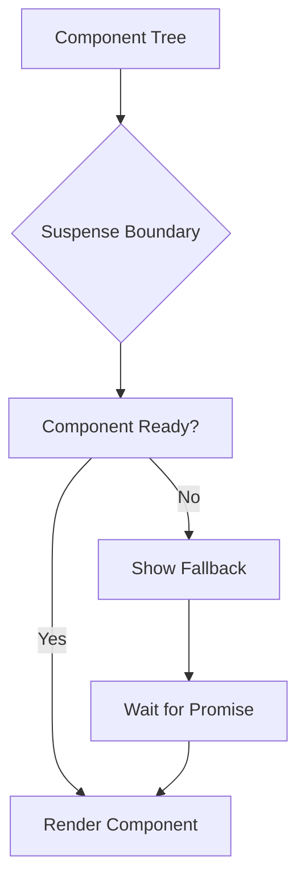

# ⏳ **React Suspense e Concurrent Features**

## 📋 **Índice**

1. [Introdução ao Suspense](#1-introdução-ao-suspense)
2. [Suspense Básico](#2-suspense-básico)
3. [Lazy Loading com Suspense](#3-lazy-loading-com-suspense)
4. [Data Fetching com Suspense](#4-data-fetching-com-suspense)
5. [useTransition Hook](#5-usetransition-hook)
6. [useDeferredValue Hook](#6-usedeferredvalue-hook)
7. [Concurrent Rendering](#7-concurrent-rendering)
8. [Streaming SSR](#8-streaming-ssr)
9. [Error Boundaries com Suspense](#9-error-boundaries-com-suspense)
10. [Suspense Patterns](#10-suspense-patterns)
11. [Performance Optimization](#11-performance-optimization)
12. [React Server Components](#12-react-server-components)
13. [Testing](#13-testing)
14. [Advanced Patterns](#14-advanced-patterns)
15. [Recursos e Referências](#15-recursos-e-referências)

---

## 1. 🎯 **Introdução ao Suspense**

### 1.1. O que é Suspense?

**Suspense** permite que componentes "esperem" por algo antes de renderizar, mostrando um fallback enquanto aguarda.

```tsx
// ═══════════════════════════════════════════════════════════
// SUSPENSE: Declarative loading states
// ═══════════════════════════════════════════════════════════

import { Suspense } from 'react';

function App() {
  return (
    <Suspense fallback={<Loading />}>
      {/* ✅ Component que pode "suspender" */}
      <UserProfile />
    </Suspense>
  );
}

// Enquanto UserProfile carrega → mostra <Loading />
// Quando UserProfile está pronto → mostra <UserProfile />
```

### 1.2. Conceitos Core



**Principais conceitos:**

- **🎯 Suspense Boundary**: Componente `<Suspense>` que captura loading states
- **⏳ Fallback**: UI mostrada enquanto aguarda (spinner, skeleton, etc)
- **🔄 Suspend**: Componente "lança" uma Promise para suspender
- **✅ Resume**: Quando Promise resolve, componente renderiza

### 1.3. Use Cases

```tsx
// ═══════════════════════════════════════════════════════════
// USE CASES
// ═══════════════════════════════════════════════════════════

// ✅ 1. Code splitting (lazy loading)
const Dashboard = lazy(() => import('./Dashboard'));

<Suspense fallback={<Spinner />}>
  <Dashboard />
</Suspense>

// ✅ 2. Data fetching
<Suspense fallback={<Skeleton />}>
  <UserData />
</Suspense>

// ✅ 3. Image loading
<Suspense fallback={<Placeholder />}>
  <Image src="..." />
</Suspense>

// ✅ 4. Async components (RSC)
<Suspense fallback={<Loading />}>
  <ServerComponent />
</Suspense>
```

### 1.4. Suspense vs Loading States

```tsx
// ═══════════════════════════════════════════════════════════
// ANTES (sem Suspense)
// ═══════════════════════════════════════════════════════════

function UserProfile() {
  const [user, setUser] = useState(null);
  const [loading, setLoading] = useState(true);

  useEffect(() => {
    fetchUser().then(data => {
      setUser(data);
      setLoading(false);
    });
  }, []);

  if (loading) return <Spinner />;

  return <div>{user.name}</div>;
}

// ❌ Problemas:
// - Loading state em cada componente
// - Waterfalls (carrega um após outro)
// - Código imperativo

// ═══════════════════════════════════════════════════════════
// DEPOIS (com Suspense)
// ═══════════════════════════════════════════════════════════

function UserProfile() {
  const user = use(fetchUser());  // ✅ Suspende se não pronto

  return <div>{user.name}</div>;
}

<Suspense fallback={<Spinner />}>
  <UserProfile />
</Suspense>

// ✅ Benefícios:
// - Declarativo
// - Carregamento paralelo
// - Centralized loading UI
// - Melhor UX com Concurrent Features
```

### 1.5. Suspense Timeline

```tsx
// ═══════════════════════════════════════════════════════════
// TIMELINE
// ═══════════════════════════════════════════════════════════

/**
 * React 16.6 (2018)
 * - React.lazy + Suspense para code splitting
 * 
 * React 18.0 (2022)
 * - Concurrent Rendering
 * - useTransition
 * - useDeferredValue
 * - Suspense no servidor (SSR)
 * 
 * React 19.0 (2024+)
 * - use() hook
 * - React Server Components
 * - Async components
 */
```

---

## 2. 🎨 **Suspense Básico**

### 2.1. Suspense Boundary

```tsx
// ═══════════════════════════════════════════════════════════
// SUSPENSE BOUNDARY
// ═══════════════════════════════════════════════════════════

import { Suspense } from 'react';

function App() {
  return (
    <div>
      <h1>My App</h1>
      
      {/* ✅ Suspense boundary */}
      <Suspense fallback={<Spinner />}>
        <UserProfile />
        <Posts />
      </Suspense>
    </div>
  );
}

// Se UserProfile OU Posts suspender → mostra <Spinner />
// Quando AMBOS estiverem prontos → renderiza ambos
```

### 2.2. Nested Suspense

```tsx
// ═══════════════════════════════════════════════════════════
// NESTED SUSPENSE: Granular loading states
// ═══════════════════════════════════════════════════════════

function Dashboard() {
  return (
    <div>
      <h1>Dashboard</h1>
      
      {/* ✅ Top-level Suspense */}
      <Suspense fallback={<PageSkeleton />}>
        <Header />
        
        {/* ✅ Nested Suspense para sidebar */}
        <Suspense fallback={<SidebarSkeleton />}>
          <Sidebar />
        </Suspense>
        
        {/* ✅ Nested Suspense para conteúdo */}
        <Suspense fallback={<ContentSkeleton />}>
          <MainContent />
          <RelatedPosts />
        </Suspense>
      </Suspense>
    </div>
  );
}

/**
 * Comportamento:
 * 1. Mostra PageSkeleton inicialmente
 * 2. Quando Header pronto, mostra Header + SidebarSkeleton + ContentSkeleton
 * 3. Quando Sidebar pronto, mostra Sidebar
 * 4. Quando MainContent + RelatedPosts prontos, mostra conteúdo
 */
```

### 2.3. Multiple Fallbacks

```tsx
// ═══════════════════════════════════════════════════════════
// MÚLTIPLOS FALLBACKS
// ═══════════════════════════════════════════════════════════

function ProductPage() {
  return (
    <div>
      {/* Imagem */}
      <Suspense fallback={<ImagePlaceholder />}>
        <ProductImage />
      </Suspense>

      {/* Detalhes */}
      <Suspense fallback={<DetailsSkeleton />}>
        <ProductDetails />
      </Suspense>

      {/* Reviews */}
      <Suspense fallback={<ReviewsSkeleton />}>
        <ProductReviews />
      </Suspense>

      {/* Recomendações */}
      <Suspense fallback={<RecommendationsSkeleton />}>
        <Recommendations />
      </Suspense>
    </div>
  );
}

// ✅ Cada seção carrega independentemente
// ✅ UX progressiva (conteúdo aparece gradualmente)
```

### 2.4. Fallback Components

```tsx
// ═══════════════════════════════════════════════════════════
// FALLBACK COMPONENTS
// ═══════════════════════════════════════════════════════════

// ✅ Spinner simples
function Spinner() {
  return <div className="spinner">Loading...</div>;
}

// ✅ Skeleton screen
function UserSkeleton() {
  return (
    <div className="skeleton">
      <div className="skeleton-avatar" />
      <div className="skeleton-name" />
      <div className="skeleton-email" />
    </div>
  );
}

// ✅ Progressive skeleton
function PostsSkeleton() {
  return (
    <div>
      {[1, 2, 3, 4, 5].map(i => (
        <div key={i} className="post-skeleton">
          <div className="skeleton-title" />
          <div className="skeleton-content" />
        </div>
      ))}
    </div>
  );
}

// ✅ Custom loading com animação
function FancyLoader() {
  return (
    <div className="loader-container">
      <div className="loader-animation">
        <svg>...</svg>
      </div>
      <p>Loading amazing content...</p>
    </div>
  );
}

// CSS
/**
.skeleton {
  animation: pulse 1.5s ease-in-out infinite;
}

@keyframes pulse {
  0%, 100% { opacity: 1; }
  50% { opacity: 0.5; }
}
*/
```

### 2.5. No Fallback (Bubbling)

```tsx
// ═══════════════════════════════════════════════════════════
// SUSPENSE BUBBLING
// ═══════════════════════════════════════════════════════════

function App() {
  return (
    {/* ✅ Suspense na raiz */}
    <Suspense fallback={<AppLoader />}>
      <Router>
        <Routes>
          <Route path="/" element={<Home />} />
          
          {/* ❌ Sem Suspense aqui */}
          <Route path="/dashboard" element={<Dashboard />} />
          
          {/* ✅ Suspense local */}
          <Route
            path="/profile"
            element={
              <Suspense fallback={<ProfileSkeleton />}>
                <Profile />
              </Suspense>
            }
          />
        </Routes>
      </Router>
    </Suspense>
  );
}

/**
 * Comportamento:
 * - <Home /> suspende → usa <AppLoader />
 * - <Dashboard /> suspende → usa <AppLoader /> (bubbles up)
 * - <Profile /> suspende → usa <ProfileSkeleton /> (local)
 */
```

---

## 3. 📦 **Lazy Loading com Suspense**

### 3.1. React.lazy

```tsx
// ═══════════════════════════════════════════════════════════
// REACT.LAZY: Code splitting
// ═══════════════════════════════════════════════════════════

import { lazy, Suspense } from 'react';

// ✅ Lazy import
const Dashboard = lazy(() => import('./pages/Dashboard'));
const Profile = lazy(() => import('./pages/Profile'));
const Settings = lazy(() => import('./pages/Settings'));

function App() {
  return (
    <Suspense fallback={<PageLoader />}>
      <Routes>
        <Route path="/dashboard" element={<Dashboard />} />
        <Route path="/profile" element={<Profile />} />
        <Route path="/settings" element={<Settings />} />
      </Routes>
    </Suspense>
  );
}

/**
 * Bundle splitting:
 * - Dashboard.js (lazy loaded)
 * - Profile.js (lazy loaded)
 * - Settings.js (lazy loaded)
 */
```

### 3.2. Named Exports

```tsx
// ═══════════════════════════════════════════════════════════
// NAMED EXPORTS
// ═══════════════════════════════════════════════════════════

// pages/Dashboard.tsx
export function Dashboard() {
  return <div>Dashboard</div>;
}

// App.tsx
const Dashboard = lazy(() =>
  import('./pages/Dashboard').then(module => ({
    default: module.Dashboard  // ✅ Wrapper para named export
  }))
);
```

### 3.3. Preloading

```tsx
// ═══════════════════════════════════════════════════════════
// PRELOADING: Carrega antes do clique
// ═══════════════════════════════════════════════════════════

// Armazena promise do lazy import
const DashboardLoader = () => import('./pages/Dashboard');
const Dashboard = lazy(DashboardLoader);

function Navigation() {
  const handleMouseEnter = () => {
    // ✅ Preload on hover
    DashboardLoader();
  };

  return (
    <Link to="/dashboard" onMouseEnter={handleMouseEnter}>
      Dashboard
    </Link>
  );
}

// Ou com custom hook
function usePrefetch(importFn: () => Promise<any>) {
  const prefetch = useCallback(() => {
    importFn();
  }, [importFn]);

  return prefetch;
}

// Uso
function Navigation() {
  const prefetchDashboard = usePrefetch(DashboardLoader);

  return (
    <Link to="/dashboard" onMouseEnter={prefetchDashboard}>
      Dashboard
    </Link>
  );
}
```

### 3.4. Retry on Error

```tsx
// ═══════════════════════════════════════════════════════════
// RETRY: Retry lazy import on error
// ═══════════════════════════════════════════════════════════

function lazyWithRetry<T extends React.ComponentType<any>>(
  importFn: () => Promise<{ default: T }>,
  retries = 3
) {
  return lazy(() => {
    return new Promise<{ default: T }>((resolve, reject) => {
      const attemptImport = (retriesLeft: number) => {
        importFn()
          .then(resolve)
          .catch((error) => {
            if (retriesLeft === 0) {
              reject(error);
              return;
            }

            setTimeout(() => {
              console.log(`Retrying import... (${retriesLeft} retries left)`);
              attemptImport(retriesLeft - 1);
            }, 1000);
          });
      };

      attemptImport(retries);
    });
  });
}

// Uso
const Dashboard = lazyWithRetry(() => import('./pages/Dashboard'));
```

### 3.5. Lazy com Prefetch Service

```tsx
// ═══════════════════════════════════════════════════════════
// PREFETCH SERVICE
// ═══════════════════════════════════════════════════════════

class PrefetchService {
  private cache = new Map<string, Promise<any>>();

  prefetch(name: string, importFn: () => Promise<any>) {
    if (!this.cache.has(name)) {
      this.cache.set(name, importFn());
    }
  }

  lazy<T extends React.ComponentType<any>>(
    name: string,
    importFn: () => Promise<{ default: T }>
  ) {
    return lazy(() => {
      if (this.cache.has(name)) {
        return this.cache.get(name)!;
      }

      const promise = importFn();
      this.cache.set(name, promise);
      return promise;
    });
  }
}

const prefetchService = new PrefetchService();

// Prefetch na navegação
function Navigation() {
  return (
    <nav>
      <Link
        to="/dashboard"
        onMouseEnter={() =>
          prefetchService.prefetch('dashboard', () => import('./Dashboard'))
        }
      >
        Dashboard
      </Link>
    </nav>
  );
}

// Lazy component
const Dashboard = prefetchService.lazy('dashboard', () => import('./Dashboard'));
```

---

## 4. 🌐 **Data Fetching com Suspense**

### 4.1. use() Hook (React 19+)

```tsx
// ═══════════════════════════════════════════════════════════
// use() HOOK: Read promises in render
// ═══════════════════════════════════════════════════════════

import { use, Suspense } from 'react';

// ✅ Fetch function que retorna Promise
function fetchUser(id: number) {
  return fetch(`/api/users/${id}`).then(r => r.json());
}

function UserProfile({ userId }: { userId: number }) {
  // ✅ use() suspende até Promise resolver
  const user = use(fetchUser(userId));

  return (
    <div>
      <h1>{user.name}</h1>
      <p>{user.email}</p>
    </div>
  );
}

function App() {
  return (
    <Suspense fallback={<Skeleton />}>
      <UserProfile userId={123} />
    </Suspense>
  );
}
```

### 4.2. Suspense-Enabled Cache

```tsx
// ═══════════════════════════════════════════════════════════
// SUSPENSE CACHE
// ═══════════════════════════════════════════════════════════

type CacheEntry<T> = {
  status: 'pending' | 'fulfilled' | 'rejected';
  value?: T;
  error?: Error;
  promise?: Promise<T>;
};

class SuspenseCache {
  private cache = new Map<string, CacheEntry<any>>();

  read<T>(key: string, fetcher: () => Promise<T>): T {
    let entry = this.cache.get(key);

    if (!entry) {
      // ✅ Primeira chamada: inicia fetch
      const promise = fetcher()
        .then(value => {
          entry!.status = 'fulfilled';
          entry!.value = value;
          return value;
        })
        .catch(error => {
          entry!.status = 'rejected';
          entry!.error = error;
          throw error;
        });

      entry = { status: 'pending', promise };
      this.cache.set(key, entry);
    }

    // ✅ Durante fetch: suspende
    if (entry.status === 'pending') {
      throw entry.promise!;
    }

    // ✅ Erro: lança erro
    if (entry.status === 'rejected') {
      throw entry.error!;
    }

    // ✅ Sucesso: retorna valor
    return entry.value!;
  }

  invalidate(key: string) {
    this.cache.delete(key);
  }

  clear() {
    this.cache.clear();
  }
}

const cache = new SuspenseCache();

// Uso
function UserProfile({ userId }: { userId: number }) {
  const user = cache.read(`user-${userId}`, () =>
    fetch(`/api/users/${userId}`).then(r => r.json())
  );

  return <div>{user.name}</div>;
}
```

### 4.3. React Query com Suspense

```tsx
// ═══════════════════════════════════════════════════════════
// REACT QUERY + SUSPENSE
// ═══════════════════════════════════════════════════════════

import { QueryClient, QueryClientProvider, useSuspenseQuery } from '@tanstack/react-query';

const queryClient = new QueryClient({
  defaultOptions: {
    queries: {
      suspense: true  // ✅ Enable Suspense mode
    }
  }
});

function UserProfile({ userId }: { userId: number }) {
  // ✅ useSuspenseQuery suspende automaticamente
  const { data: user } = useSuspenseQuery({
    queryKey: ['user', userId],
    queryFn: () => fetch(`/api/users/${userId}`).then(r => r.json())
  });

  return <div>{user.name}</div>;
}

function App() {
  return (
    <QueryClientProvider client={queryClient}>
      <Suspense fallback={<Skeleton />}>
        <UserProfile userId={123} />
      </Suspense>
    </QueryClientProvider>
  );
}
```

### 4.4. Parallel Data Fetching

```tsx
// ═══════════════════════════════════════════════════════════
// PARALLEL FETCHING
// ═══════════════════════════════════════════════════════════

function Dashboard() {
  return (
    <Suspense fallback={<DashboardSkeleton />}>
      {/* ✅ Carrega em paralelo */}
      <UserInfo />
      <Stats />
      <RecentPosts />
    </Suspense>
  );
}

function UserInfo() {
  const user = use(fetchUser());  // Inicia fetch
  return <div>{user.name}</div>;
}

function Stats() {
  const stats = use(fetchStats());  // Inicia fetch (paralelo!)
  return <div>Posts: {stats.posts}</div>;
}

function RecentPosts() {
  const posts = use(fetchRecentPosts());  // Inicia fetch (paralelo!)
  return <div>{posts.length} posts</div>;
}

/**
 * Timeline:
 * t=0ms:   Inicia fetchUser(), fetchStats(), fetchRecentPosts()
 * t=100ms: Todos requests em andamento (paralelo)
 * t=200ms: Todos completam → renderiza Dashboard
 * 
 * ✅ Muito mais rápido que waterfall (sequencial)
 */
```

### 4.5. Waterfall vs Parallel

```tsx
// ═══════════════════════════════════════════════════════════
// WATERFALL (❌ Lento)
// ═══════════════════════════════════════════════════════════

function BadDashboard() {
  return (
    <Suspense fallback={<Skeleton />}>
      <UserInfo />  {/* Carrega primeiro */}
      <Suspense fallback={<Skeleton />}>
        <Stats />  {/* Só carrega depois de UserInfo */}
        <Suspense fallback={<Skeleton />}>
          <RecentPosts />  {/* Só carrega depois de Stats */}
        </Suspense>
      </Suspense>
    </Suspense>
  );
}

// Timeline: 200ms + 200ms + 200ms = 600ms total

// ═══════════════════════════════════════════════════════════
// PARALLEL (✅ Rápido)
// ═══════════════════════════════════════════════════════════

function GoodDashboard() {
  return (
    <Suspense fallback={<Skeleton />}>
      {/* ✅ Mesmo Suspense boundary = paralelo */}
      <UserInfo />
      <Stats />
      <RecentPosts />
    </Suspense>
  );
}

// Timeline: max(200ms, 200ms, 200ms) = 200ms total
```

---

## 5. 🔄 **useTransition Hook**

### 5.1. Basic useTransition

```tsx
// ═══════════════════════════════════════════════════════════
// useTransition: Non-blocking updates
// ═══════════════════════════════════════════════════════════

import { useState, useTransition } from 'react';

function SearchResults() {
  const [query, setQuery] = useState('');
  const [isPending, startTransition] = useTransition();

  const handleChange = (e: React.ChangeEvent<HTMLInputElement>) => {
    const value = e.target.value;
    
    // ✅ Atualização urgente (input responsivo)
    setQuery(value);
    
    // ✅ Atualização não-urgente (pode ser interrompida)
    startTransition(() => {
      // Atualiza resultados (operação pesada)
      setResults(filterResults(value));
    });
  };

  return (
    <div>
      <input
        value={query}
        onChange={handleChange}
        placeholder="Search..."
      />
      
      {/* ✅ Mostra estado de loading */}
      {isPending && <Spinner />}
      
      <Results />
    </div>
  );
}

/**
 * Benefícios:
 * - Input sempre responsivo (atualização urgente)
 * - Resultados atualizam sem bloquear (transição)
 * - isPending indica loading state
 */
```

### 5.2. Transition Priority

```tsx
// ═══════════════════════════════════════════════════════════
// TRANSITION PRIORITY
// ═══════════════════════════════════════════════════════════

function TabsExample() {
  const [tab, setTab] = useState('home');
  const [isPending, startTransition] = useTransition();

  const handleTabClick = (newTab: string) => {
    startTransition(() => {
      setTab(newTab);  // ✅ Low priority update
    });
  };

  return (
    <div>
      <div>
        <button onClick={() => handleTabClick('home')}>Home</button>
        <button onClick={() => handleTabClick('posts')}>Posts</button>
        <button onClick={() => handleTabClick('profile')}>Profile</button>
      </div>

      {isPending && <div>Loading...</div>}

      {/* ✅ Renderização pesada */}
      <TabContent tab={tab} />
    </div>
  );
}

/**
 * Se usuário clica rapidamente em múltiplas tabs:
 * - React interrompe transições antigas
 * - Só completa a última
 * - Evita trabalho desnecessário
 */
```

### 5.3. Transition com Suspense

```tsx
// ═══════════════════════════════════════════════════════════
// useTransition + Suspense
// ═══════════════════════════════════════════════════════════

function UserSearch() {
  const [userId, setUserId] = useState(1);
  const [isPending, startTransition] = useTransition();

  const handleSearch = (newUserId: number) => {
    startTransition(() => {
      setUserId(newUserId);  // ✅ Triggera Suspense
    });
  };

  return (
    <div>
      <input
        type="number"
        onChange={(e) => handleSearch(Number(e.target.value))}
        placeholder="User ID"
      />

      {/* ✅ Durante transição: mantém UI antiga + isPending */}
      {isPending && <div>Searching...</div>}

      <Suspense fallback={<Skeleton />}>
        <UserProfile userId={userId} />
      </Suspense>
    </div>
  );
}

/**
 * Comportamento:
 * 1. Usuário digita novo ID
 * 2. isPending = true (mostra "Searching...")
 * 3. Mantém UserProfile antigo visível
 * 4. Quando novo UserProfile carrega:
 *    - isPending = false
 *    - Troca para novo UserProfile
 * 
 * ✅ Sem "flash" de skeleton!
 */
```

### 5.4. Custom useTransitionState

```tsx
// ═══════════════════════════════════════════════════════════
// CUSTOM HOOK: useTransitionState
// ═══════════════════════════════════════════════════════════

function useTransitionState<T>(initialValue: T) {
  const [value, setValue] = useState(initialValue);
  const [isPending, startTransition] = useTransition();

  const setTransitionValue = useCallback((newValue: T | ((prev: T) => T)) => {
    startTransition(() => {
      setValue(newValue);
    });
  }, []);

  return [value, setTransitionValue, isPending] as const;
}

// Uso
function SearchPage() {
  const [query, setQuery, isPending] = useTransitionState('');

  return (
    <div>
      <input
        value={query}
        onChange={(e) => setQuery(e.target.value)}
      />
      
      {isPending && <Spinner />}
      
      <Results query={query} />
    </div>
  );
}
```

### 5.5. Timeout para Transitions

```tsx
// ═══════════════════════════════════════════════════════════
// TIMEOUT: Mostra fallback após delay
// ═══════════════════════════════════════════════════════════

function useTransitionWithTimeout(timeoutMs = 300) {
  const [isPending, startTransition] = useTransition();
  const [showFallback, setShowFallback] = useState(false);
  const timeoutRef = useRef<NodeJS.Timeout>();

  const startTransitionWithTimeout = useCallback((callback: () => void) => {
    setShowFallback(false);
    
    // ✅ Timeout para mostrar fallback
    timeoutRef.current = setTimeout(() => {
      setShowFallback(true);
    }, timeoutMs);

    startTransition(() => {
      callback();
      clearTimeout(timeoutRef.current);
      setShowFallback(false);
    });
  }, [timeoutMs]);

  return [isPending, showFallback, startTransitionWithTimeout] as const;
}

// Uso
function SearchPage() {
  const [query, setQuery] = useState('');
  const [isPending, showFallback, startTransition] = useTransitionWithTimeout(300);

  const handleChange = (value: string) => {
    setQuery(value);
    
    startTransition(() => {
      // Atualização pesada
      setResults(filterResults(value));
    });
  };

  return (
    <div>
      <input value={query} onChange={(e) => handleChange(e.target.value)} />
      
      {/* ✅ Só mostra loading após 300ms */}
      {showFallback && <Spinner />}
      
      <Results />
    </div>
  );
}
```

---

## 6. ⏱️ **useDeferredValue Hook**

### 6.1. Basic useDeferredValue

```tsx
// ═══════════════════════════════════════════════════════════
// useDeferredValue: Defer non-urgent updates
// ═══════════════════════════════════════════════════════════

import { useState, useDeferredValue } from 'react';

function SearchPage() {
  const [query, setQuery] = useState('');
  
  // ✅ Versão "atrasada" de query
  const deferredQuery = useDeferredValue(query);

  return (
    <div>
      {/* ✅ Input sempre responsivo */}
      <input
        value={query}
        onChange={(e) => setQuery(e.target.value)}
        placeholder="Search..."
      />

      {/* ✅ Results usa versão deferred */}
      <Results query={deferredQuery} />
    </div>
  );
}

function Results({ query }: { query: string }) {
  // ✅ Renderização pesada
  const results = expensiveFilter(query);

  return (
    <div>
      {results.map(item => (
        <div key={item.id}>{item.name}</div>
      ))}
    </div>
  );
}

/**
 * Comportamento:
 * 1. Usuário digita "r" → query = "r"
 * 2. Input atualiza imediatamente
 * 3. deferredQuery ainda = "" (usa valor antigo)
 * 4. Quando CPU disponível:
 *    - deferredQuery = "r"
 *    - Results re-renderiza
 */
```

### 6.2. useDeferredValue vs useTransition

```tsx
// ═══════════════════════════════════════════════════════════
// COMPARAÇÃO
// ═══════════════════════════════════════════════════════════

// ✅ useDeferredValue: Quando você NÃO controla o state
function SearchPage({ externalQuery }: { externalQuery: string }) {
  const deferredQuery = useDeferredValue(externalQuery);
  
  return <Results query={deferredQuery} />;
}

// ✅ useTransition: Quando você CONTROLA o state
function SearchPage() {
  const [query, setQuery] = useState('');
  const [isPending, startTransition] = useTransition();

  const handleChange = (value: string) => {
    setQuery(value);  // Urgente
    
    startTransition(() => {
      setResults(filter(value));  // Não-urgente
    });
  };

  return (
    <div>
      <input value={query} onChange={(e) => handleChange(e.target.value)} />
      {isPending && <Spinner />}
      <Results />
    </div>
  );
}
```

### 6.3. Deferred List Rendering

```tsx
// ═══════════════════════════════════════════════════════════
// DEFERRED LIST
// ═══════════════════════════════════════════════════════════

function LargeList({ items }: { items: Item[] }) {
  const [query, setQuery] = useState('');
  const deferredQuery = useDeferredValue(query);

  // ✅ Filtro pesado usa deferred value
  const filteredItems = useMemo(() => {
    return items.filter(item =>
      item.name.toLowerCase().includes(deferredQuery.toLowerCase())
    );
  }, [items, deferredQuery]);

  // ✅ Indica se está "atrasado"
  const isStale = query !== deferredQuery;

  return (
    <div>
      <input
        value={query}
        onChange={(e) => setQuery(e.target.value)}
        placeholder="Filter list..."
      />

      {/* ✅ Opacity quando stale */}
      <div style={{ opacity: isStale ? 0.5 : 1 }}>
        {filteredItems.map(item => (
          <div key={item.id}>{item.name}</div>
        ))}
      </div>
    </div>
  );
}
```

### 6.4. Deferred Chart

```tsx
// ═══════════════════════════════════════════════════════════
// DEFERRED CHART (renderização pesada)
// ═══════════════════════════════════════════════════════════

function Dashboard() {
  const [dateRange, setDateRange] = useState({ start: '', end: '' });
  const deferredDateRange = useDeferredValue(dateRange);

  return (
    <div>
      <DateRangePicker
        value={dateRange}
        onChange={setDateRange}  // ✅ Responsivo
      />

      {/* ✅ Chart usa deferred value */}
      <ExpensiveChart dateRange={deferredDateRange} />
    </div>
  );
}

function ExpensiveChart({ dateRange }: { dateRange: DateRange }) {
  // ✅ Cálculos pesados
  const chartData = useMemo(() => {
    return computeChartData(dateRange);  // Lento!
  }, [dateRange]);

  return <ChartComponent data={chartData} />;
}
```

### 6.5. Custom useDeferredState

```tsx
// ═══════════════════════════════════════════════════════════
// CUSTOM HOOK: useDeferredState
// ═══════════════════════════════════════════════════════════

function useDeferredState<T>(initialValue: T) {
  const [value, setValue] = useState(initialValue);
  const deferredValue = useDeferredValue(value);

  const isStale = value !== deferredValue;

  return [value, setValue, deferredValue, isStale] as const;
}

// Uso
function SearchPage() {
  const [query, setQuery, deferredQuery, isStale] = useDeferredState('');

  return (
    <div>
      <input
        value={query}
        onChange={(e) => setQuery(e.target.value)}
      />

      <div style={{ opacity: isStale ? 0.5 : 1 }}>
        <Results query={deferredQuery} />
      </div>
    </div>
  );
}
```

---

## 7. ⚙️ **Concurrent Rendering**

### 7.1. O que é Concurrent Rendering?

```tsx
// ═══════════════════════════════════════════════════════════
// CONCURRENT RENDERING
// ═══════════════════════════════════════════════════════════

/**
 * ANTES (Sync Rendering - React ≤17):
 * 
 * User types → React starts rendering → BLOCKS → Render completes → UI updates
 *              |←────────── 100ms ──────────→|
 * 
 * ❌ UI congelada durante render
 * 
 * 
 * DEPOIS (Concurrent Rendering - React 18+):
 * 
 * User types → React starts rendering → Interruptible → UI updates
 *              |── 20ms ──| pause | 20ms | pause | 20ms |
 *              ↑ Input works!  ↑ Click works!
 * 
 * ✅ UI responsiva durante render
 * ✅ Pode interromper render
 * ✅ Prioriza atualizações urgentes
 */
```

### 7.2. Enabling Concurrent Mode

```tsx
// ═══════════════════════════════════════════════════════════
// HABILITAR CONCURRENT MODE
// ═══════════════════════════════════════════════════════════

// ❌ React 17 (Legacy)
import ReactDOM from 'react-dom';

ReactDOM.render(<App />, document.getElementById('root'));

// ✅ React 18+ (Concurrent)
import { createRoot } from 'react-dom/client';

const root = createRoot(document.getElementById('root')!);
root.render(<App />);

/**
 * createRoot() habilita:
 * - Concurrent rendering
 * - useTransition
 * - useDeferredValue
 * - Automatic batching
 * - Suspense SSR
 */
```

### 7.3. Automatic Batching

```tsx
// ═══════════════════════════════════════════════════════════
// AUTOMATIC BATCHING
// ═══════════════════════════════════════════════════════════

// ❌ React 17: Só batching em event handlers
function handleClick() {
  setCount(c => c + 1);  // Re-render
  setFlag(f => !f);      // Re-render
  // 2 re-renders total
}

setTimeout(() => {
  setCount(c => c + 1);  // Re-render
  setFlag(f => !f);      // Re-render
  // 2 re-renders total
}, 1000);

// ✅ React 18: Batching em TUDO
function handleClick() {
  setCount(c => c + 1);
  setFlag(f => !f);
  // 1 re-render total ✅
}

setTimeout(() => {
  setCount(c => c + 1);
  setFlag(f => !f);
  // 1 re-render total ✅
}, 1000);

fetch('/api/data').then(() => {
  setCount(c => c + 1);
  setFlag(f => !f);
  // 1 re-render total ✅
});
```

### 7.4. flushSync (Opt-out Batching)

```tsx
// ═══════════════════════════════════════════════════════════
// flushSync: Force synchronous update
// ═══════════════════════════════════════════════════════════

import { flushSync } from 'react-dom';

function handleClick() {
  // ✅ Batched
  setCount(c => c + 1);
  setFlag(f => !f);

  // ❌ Force sync update (rare!)
  flushSync(() => {
    setUrgent(true);
  });

  // DOM atualizado aqui (urgente aplicado)
  console.log(ref.current.textContent);  // Novo valor
}
```

### 7.5. Priority Levels

```tsx
// ═══════════════════════════════════════════════════════════
// PRIORITY LEVELS (interno do React)
// ═══════════════════════════════════════════════════════════

/**
 * React Scheduler (interno):
 * 
 * 1. ImmediatePriority (sync)
 *    - User input (clicks, typing)
 *    - flushSync()
 * 
 * 2. UserBlockingPriority
 *    - Hover, scroll
 * 
 * 3. NormalPriority (default)
 *    - Data fetching
 *    - Network responses
 * 
 * 4. LowPriority
 *    - Analytics
 *    - Logging
 * 
 * 5. IdlePriority
 *    - Offscreen content
 */

// Você não controla diretamente, mas pode influenciar:

// ✅ Alta prioridade (sync)
setState(newValue);

// ✅ Baixa prioridade (interruptible)
startTransition(() => {
  setState(newValue);
});
```

---

## 8. 🌊 **Streaming SSR**

### 8.1. O que é Streaming SSR?

```tsx
// ═══════════════════════════════════════════════════════════
// STREAMING SSR (React 18+)
// ═══════════════════════════════════════════════════════════

/**
 * ANTES (Traditional SSR):
 * 
 * Server: Wait for ALL data → Render ALL HTML → Send HTML
 * Client: Receives HTML → Hydrate → Interactive
 * 
 * ❌ TTFB (Time to First Byte) alto
 * ❌ TTI (Time to Interactive) alto
 * 
 * 
 * DEPOIS (Streaming SSR):
 * 
 * Server: Send shell → Stream components → Stream Suspense boundaries
 * Client: Show shell → Hydrate incrementally → Interactive progressively
 * 
 * ✅ TTFB baixo (shell rápido)
 * ✅ TTI progressivo (partes interativas antes)
 * ✅ FCP (First Contentful Paint) rápido
 */
```

### 8.2. renderToPipeableStream (Node.js)

```tsx
// ═══════════════════════════════════════════════════════════
// SERVER (Node.js)
// ═══════════════════════════════════════════════════════════

import { renderToPipeableStream } from 'react-dom/server';

// Express server
app.get('/', (req, res) => {
  const { pipe, abort } = renderToPipeableStream(
    <App />,
    {
      bootstrapScripts: ['/client.js'],
      
      onShellReady() {
        // ✅ Shell pronto (sem Suspense boundaries)
        res.statusCode = 200;
        res.setHeader('Content-Type', 'text/html');
        pipe(res);  // ✅ Começa streaming
      },
      
      onShellError(error) {
        // ❌ Erro no shell
        res.statusCode = 500;
        res.send('<h1>Server Error</h1>');
      },
      
      onAllReady() {
        // ✅ TUDO pronto (incluindo Suspense)
        // Não usado em streaming (só em static generation)
      },
      
      onError(error) {
        console.error(error);
      }
    }
  );

  // Timeout
  setTimeout(abort, 10000);
});

// App.tsx
function App() {
  return (
    <html>
      <head>
        <title>My App</title>
      </head>
      <body>
        <Header />
        
        {/* ✅ Suspense boundary: streamed */}
        <Suspense fallback={<Skeleton />}>
          <SlowComponent />
        </Suspense>
        
        <Footer />
      </body>
    </html>
  );
}

/**
 * Timeline:
 * t=0ms:   Client recebe: <Header /> + <Skeleton /> + <Footer />
 * t=500ms: Client recebe: <SlowComponent /> (substitui Skeleton)
 * 
 * ✅ Usuário vê conteúdo em 0ms!
 */
```

### 8.3. Selective Hydration

```tsx
// ═══════════════════════════════════════════════════════════
// SELECTIVE HYDRATION
// ═══════════════════════════════════════════════════════════

function App() {
  return (
    <div>
      <Header />
      
      {/* ✅ Boundary 1 */}
      <Suspense fallback={<CommentsSkeleton />}>
        <Comments />
      </Suspense>
      
      {/* ✅ Boundary 2 */}
      <Suspense fallback={<SidebarSkeleton />}>
        <Sidebar />
      </Suspense>
    </div>
  );
}

/**
 * Comportamento:
 * 
 * 1. Server streams HTML:
 *    - Header (imediato)
 *    - CommentsSkeleton (imediato)
 *    - SidebarSkeleton (imediato)
 * 
 * 2. Client mostra página
 * 
 * 3. Server streams componentes:
 *    - Comments HTML chega → substitui skeleton
 *    - Sidebar HTML chega → substitui skeleton
 * 
 * 4. Hydration seletiva:
 *    - Header hydrata primeiro (prioridade)
 *    - Se usuário clica em Comments:
 *      → Comments hydrata ANTES (prioridade)
 *    - Sidebar hydrata por último
 * 
 * ✅ Hydration inteligente baseada em interação!
 */
```

### 8.4. hydrateRoot

```tsx
// ═══════════════════════════════════════════════════════════
// CLIENT (Hydration)
// ═══════════════════════════════════════════════════════════

// client.tsx
import { hydrateRoot } from 'react-dom/client';

const root = hydrateRoot(
  document.getElementById('root')!,
  <App />
);

// ✅ Hydration automática + selective + progressive
```

### 8.5. Streaming com Next.js

```tsx
// ═══════════════════════════════════════════════════════════
// NEXT.JS APP ROUTER (streaming automático)
// ═══════════════════════════════════════════════════════════

// app/page.tsx
import { Suspense } from 'react';

export default function Page() {
  return (
    <div>
      <h1>Dashboard</h1>
      
      {/* ✅ Streaming automático */}
      <Suspense fallback={<Skeleton />}>
        <SlowComponent />
      </Suspense>
    </div>
  );
}

// ✅ Next.js configura streaming automaticamente!
```

---

## 9. 🚨 **Error Boundaries com Suspense**

### 9.1. Error Boundary Básico

```tsx
// ═══════════════════════════════════════════════════════════
// ERROR BOUNDARY
// ═══════════════════════════════════════════════════════════

import React from 'react';

interface Props {
  children: React.ReactNode;
  fallback?: React.ReactNode;
}

interface State {
  hasError: boolean;
  error?: Error;
}

class ErrorBoundary extends React.Component<Props, State> {
  constructor(props: Props) {
    super(props);
    this.state = { hasError: false };
  }

  static getDerivedStateFromError(error: Error): State {
    return { hasError: true, error };
  }

  componentDidCatch(error: Error, errorInfo: React.ErrorInfo) {
    console.error('Error caught:', error, errorInfo);
    // ✅ Log para serviço (Sentry, etc)
  }

  render() {
    if (this.state.hasError) {
      return this.props.fallback || (
        <div>
          <h1>Something went wrong</h1>
          <p>{this.state.error?.message}</p>
        </div>
      );
    }

    return this.props.children;
  }
}
```

### 9.2. Error Boundary + Suspense

```tsx
// ═══════════════════════════════════════════════════════════
// ERROR BOUNDARY + SUSPENSE
// ═══════════════════════════════════════════════════════════

function App() {
  return (
    <ErrorBoundary fallback={<ErrorFallback />}>
      <Suspense fallback={<Loading />}>
        <UserProfile />
      </Suspense>
    </ErrorBoundary>
  );
}

/**
 * Estados possíveis:
 * 1. Loading: <Loading />
 * 2. Success: <UserProfile />
 * 3. Error: <ErrorFallback />
 */
```

### 9.3. Nested Error Boundaries

```tsx
// ═══════════════════════════════════════════════════════════
// NESTED ERROR BOUNDARIES
// ═══════════════════════════════════════════════════════════

function Dashboard() {
  return (
    <ErrorBoundary fallback={<PageError />}>
      <h1>Dashboard</h1>
      
      {/* ✅ Error boundary local para sidebar */}
      <ErrorBoundary fallback={<SidebarError />}>
        <Suspense fallback={<SidebarSkeleton />}>
          <Sidebar />
        </Suspense>
      </ErrorBoundary>
      
      {/* ✅ Error boundary local para conteúdo */}
      <ErrorBoundary fallback={<ContentError />}>
        <Suspense fallback={<ContentSkeleton />}>
          <MainContent />
        </Suspense>
      </ErrorBoundary>
    </ErrorBoundary>
  );
}

/**
 * Isolamento de erros:
 * - Erro em Sidebar → SidebarError (resto funciona)
 * - Erro em MainContent → ContentError (resto funciona)
 * - Erro em Dashboard → PageError (tudo falha)
 */
```

### 9.4. Reset Error Boundary

```tsx
// ═══════════════════════════════════════════════════════════
// RESET ERROR BOUNDARY
// ═══════════════════════════════════════════════════════════

class ErrorBoundary extends React.Component<Props, State> {
  state = { hasError: false, error: undefined };

  static getDerivedStateFromError(error: Error) {
    return { hasError: true, error };
  }

  // ✅ Reset method
  reset = () => {
    this.setState({ hasError: false, error: undefined });
  };

  render() {
    if (this.state.hasError) {
      return (
        <div>
          <h1>Error</h1>
          <p>{this.state.error?.message}</p>
          {/* ✅ Botão de retry */}
          <button onClick={this.reset}>Try Again</button>
        </div>
      );
    }

    return this.props.children;
  }
}
```

### 9.5. React Error Boundary Hook

```tsx
// ═══════════════════════════════════════════════════════════
// REACT-ERROR-BOUNDARY (library)
// ═══════════════════════════════════════════════════════════

import { ErrorBoundary } from 'react-error-boundary';

function ErrorFallback({ error, resetErrorBoundary }: any) {
  return (
    <div>
      <h1>Something went wrong</h1>
      <pre>{error.message}</pre>
      <button onClick={resetErrorBoundary}>Try again</button>
    </div>
  );
}

function App() {
  return (
    <ErrorBoundary
      FallbackComponent={ErrorFallback}
      onReset={() => {
        // ✅ Reset app state
      }}
      onError={(error, errorInfo) => {
        // ✅ Log error
        console.error(error, errorInfo);
      }}
    >
      <Suspense fallback={<Loading />}>
        <UserProfile />
      </Suspense>
    </ErrorBoundary>
  );
}
```

---

## 10. 🎨 **Suspense Patterns**

### 10.1. Skeleton Screens

```tsx
// ═══════════════════════════════════════════════════════════
// SKELETON SCREENS
// ═══════════════════════════════════════════════════════════

function UserProfileSkeleton() {
  return (
    <div className="skeleton-container">
      <div className="skeleton-avatar" />
      <div className="skeleton-name" />
      <div className="skeleton-bio" />
      
      <div className="skeleton-stats">
        <div className="skeleton-stat" />
        <div className="skeleton-stat" />
        <div className="skeleton-stat" />
      </div>
    </div>
  );
}

// CSS
/**
.skeleton-container > * {
  background: linear-gradient(
    90deg,
    #f0f0f0 25%,
    #e0e0e0 50%,
    #f0f0f0 75%
  );
  background-size: 200% 100%;
  animation: skeleton-loading 1.5s infinite;
}

@keyframes skeleton-loading {
  0% { background-position: 200% 0; }
  100% { background-position: -200% 0; }
}
*/

// Uso
<Suspense fallback={<UserProfileSkeleton />}>
  <UserProfile />
</Suspense>
```

### 10.2. Progressive Rendering

```tsx
// ═══════════════════════════════════════════════════════════
// PROGRESSIVE RENDERING
// ═══════════════════════════════════════════════════════════

function ProductPage() {
  return (
    <div>
      {/* ✅ 1. Imagem (crítico) */}
      <Suspense fallback={<ImagePlaceholder />}>
        <ProductImage />
      </Suspense>

      {/* ✅ 2. Detalhes (importante) */}
      <Suspense fallback={<DetailsSkeleton />}>
        <ProductDetails />
      </Suspense>

      {/* ✅ 3. Reviews (menos importante) */}
      <Suspense fallback={<ReviewsSkeleton />}>
        <ProductReviews />
      </Suspense>

      {/* ✅ 4. Recomendações (pode esperar) */}
      <Suspense fallback={<RecommendationsSkeleton />}>
        <Recommendations />
      </Suspense>
    </div>
  );
}

/**
 * Timeline:
 * t=0ms:   Placeholders
 * t=100ms: Imagem aparece
 * t=200ms: Detalhes aparecem
 * t=500ms: Reviews aparecem
 * t=800ms: Recomendações aparecem
 * 
 * ✅ Usuário vê conteúdo progressivamente!
 */
```

### 10.3. Stale-While-Revalidate

```tsx
// ═══════════════════════════════════════════════════════════
// STALE-WHILE-REVALIDATE
// ═══════════════════════════════════════════════════════════

function useSWR<T>(
  key: string,
  fetcher: () => Promise<T>
): { data?: T; isStale: boolean } {
  const [data, setData] = useState<T>();
  const [isStale, setIsStale] = useState(false);

  useEffect(() => {
    let cancelled = false;

    // ✅ Marca como stale
    setIsStale(true);

    // ✅ Fetch novo dado
    fetcher().then(newData => {
      if (!cancelled) {
        setData(newData);
        setIsStale(false);
      }
    });

    return () => {
      cancelled = true;
    };
  }, [key]);

  return { data, isStale };
}

// Uso
function UserProfile({ userId }: { userId: number }) {
  const { data: user, isStale } = useSWR(
    `user-${userId}`,
    () => fetchUser(userId)
  );

  if (!user) {
    throw new Promise(() => {});  // Suspende
  }

  return (
    <div style={{ opacity: isStale ? 0.5 : 1 }}>
      {user.name}
    </div>
  );
}
```

### 10.4. Render-as-You-Fetch

```tsx
// ═══════════════════════════════════════════════════════════
// RENDER-AS-YOU-FETCH
// ═══════════════════════════════════════════════════════════

// ❌ BAD: Fetch-on-render (waterfall)
function UserProfile() {
  const user = use(fetchUser());  // Espera user
  const posts = use(fetchPosts(user.id));  // Depois espera posts
  
  return <div>...</div>;
}

// ✅ GOOD: Render-as-you-fetch (parallel)
function UserProfilePage() {
  // ✅ Inicia fetches ANTES de renderizar
  const userPromise = fetchUser();
  const postsPromise = fetchPosts();

  return (
    <Suspense fallback={<Skeleton />}>
      <UserProfile userPromise={userPromise} postsPromise={postsPromise} />
    </Suspense>
  );
}

function UserProfile({ userPromise, postsPromise }: {
  userPromise: Promise<User>;
  postsPromise: Promise<Post[]>;
}) {
  const user = use(userPromise);  // ✅ Paralelo
  const posts = use(postsPromise);  // ✅ Paralelo
  
  return <div>...</div>;
}
```

### 10.5. Coordinated Loading

```tsx
// ═══════════════════════════════════════════════════════════
// COORDINATED LOADING
// ═══════════════════════════════════════════════════════════

function Dashboard() {
  return (
    <Suspense fallback={<DashboardSkeleton />}>
      {/* ✅ Todos carregam juntos, mostram juntos */}
      <UserInfo />
      <Stats />
      <RecentActivity />
    </Suspense>
  );
}

/**
 * vs Isolated Loading:
 */

function Dashboard() {
  return (
    <div>
      {/* ✅ Cada um aparece quando pronto */}
      <Suspense fallback={<UserInfoSkeleton />}>
        <UserInfo />
      </Suspense>
      
      <Suspense fallback={<StatsSkeleton />}>
        <Stats />
      </Suspense>
      
      <Suspense fallback={<ActivitySkeleton />}>
        <RecentActivity />
      </Suspense>
    </div>
  );
}
```

---

## 11. ⚡ **Performance Optimization**

### 11.1. Preloading Data

```tsx
// ═══════════════════════════════════════════════════════════
// PRELOAD DATA
// ═══════════════════════════════════════════════════════════

// Cache
const dataCache = new Map<string, Promise<any>>();

function preloadData<T>(key: string, fetcher: () => Promise<T>) {
  if (!dataCache.has(key)) {
    dataCache.set(key, fetcher());
  }
}

function readData<T>(key: string): T {
  const promise = dataCache.get(key);
  if (!promise) {
    throw new Error('Data not preloaded');
  }
  
  return use(promise);
}

// Uso
function UserList() {
  return (
    <div>
      {users.map(user => (
        <Link
          key={user.id}
          to={`/users/${user.id}`}
          onMouseEnter={() => {
            // ✅ Preload on hover
            preloadData(`user-${user.id}`, () => fetchUser(user.id));
          }}
        >
          {user.name}
        </Link>
      ))}
    </div>
  );
}

function UserProfile({ userId }: { userId: number }) {
  // ✅ Data já carregada (se preloaded)
  const user = readData<User>(`user-${userId}`);
  
  return <div>{user.name}</div>;
}
```

### 11.2. Resource Preloading

```tsx
// ═══════════════════════════════════════════════════════════
// RESOURCE PRELOADING (images, fonts, etc)
// ═══════════════════════════════════════════════════════════

function preloadImage(src: string): Promise<void> {
  return new Promise((resolve, reject) => {
    const img = new Image();
    img.onload = () => resolve();
    img.onerror = reject;
    img.src = src;
  });
}

function ProductImage({ src }: { src: string }) {
  use(preloadImage(src));  // ✅ Suspende até imagem carregar
  
  return ;
}

<Suspense fallback={<ImagePlaceholder />}>
  <ProductImage src="/product.jpg" />
</Suspense>
```

### 11.3. Throttling Suspense

```tsx
// ═══════════════════════════════════════════════════════════
// THROTTLE SUSPENSE (evita flash de loading)
// ═══════════════════════════════════════════════════════════

function ThrottledSuspense({
  fallback,
  children,
  minDuration = 500
}: {
  fallback: React.ReactNode;
  children: React.ReactNode;
  minDuration?: number;
}) {
  const [showFallback, setShowFallback] = useState(false);
  const timeoutRef = useRef<NodeJS.Timeout>();

  return (
    <Suspense
      fallback={
        <SuspenseListener
          onSuspend={() => {
            timeoutRef.current = setTimeout(() => {
              setShowFallback(true);
            }, minDuration);
          }}
          onResume={() => {
            clearTimeout(timeoutRef.current);
            setShowFallback(false);
          }}
        >
          {showFallback ? fallback : null}
        </SuspenseListener>
      }
    >
      {children}
    </Suspense>
  );
}

/**
 * Comportamento:
 * - Se loading < 500ms → não mostra fallback (evita flash)
 * - Se loading ≥ 500ms → mostra fallback
 */
```

### 11.4. Suspense List (Experimental)

```tsx
// ═══════════════════════════════════════════════════════════
// SUSPENSE LIST (coordena múltiplos Suspense)
// ═══════════════════════════════════════════════════════════

import { SuspenseList } from 'react';

function Feed() {
  return (
    <SuspenseList revealOrder="forwards" tail="collapsed">
      {posts.map(post => (
        <Suspense key={post.id} fallback={<PostSkeleton />}>
          <Post id={post.id} />
        </Suspense>
      ))}
    </SuspenseList>
  );
}

/**
 * revealOrder:
 * - "forwards": Mostra na ordem (1, 2, 3)
 * - "backwards": Mostra na ordem reversa (3, 2, 1)
 * - "together": Mostra todos juntos
 * 
 * tail:
 * - "collapsed": Só mostra 1 skeleton
 * - "hidden": Não mostra skeleton
 */
```

### 11.5. Measuring Performance

```tsx
// ═══════════════════════════════════════════════════════════
// PERFORMANCE MEASUREMENT
// ═══════════════════════════════════════════════════════════

function useSuspenseMetrics(name: string) {
  const startTimeRef = useRef<number>();

  useEffect(() => {
    // ✅ Marca início
    startTimeRef.current = performance.now();

    return () => {
      // ✅ Marca fim
      const duration = performance.now() - startTimeRef.current!;
      
      console.log(`${name} loaded in ${duration}ms`);
      
      // ✅ Send to analytics
      analytics.track('suspense_load', {
        component: name,
        duration
      });
    };
  }, [name]);
}

// Uso
function UserProfile() {
  useSuspenseMetrics('UserProfile');
  
  const user = use(fetchUser());
  
  return <div>{user.name}</div>;
}
```

---

## 12. 🖥️ **React Server Components**

### 12.1. Server Components Básico

```tsx
// ═══════════════════════════════════════════════════════════
// REACT SERVER COMPONENTS (RSC)
// ═══════════════════════════════════════════════════════════

// ✅ Server Component (default no Next.js App Router)
async function UserProfile({ userId }: { userId: number }) {
  // ✅ Fetch direto no servidor
  const user = await fetchUser(userId);
  
  // ✅ Acesso direto ao DB
  const posts = await db.posts.findMany({
    where: { authorId: userId }
  });

  return (
    <div>
      <h1>{user.name}</h1>
      <PostsList posts={posts} />
    </div>
  );
}

/**
 * Benefícios:
 * - Fetch no servidor (zero waterfalls)
 * - Acesso direto ao DB
 * - Zero JS no cliente
 * - Secrets seguros (API keys, etc)
 */
```

### 12.2. Client Components

```tsx
// ═══════════════════════════════════════════════════════════
// CLIENT COMPONENTS
// ═══════════════════════════════════════════════════════════

'use client';  // ✅ Marca como Client Component

import { useState } from 'react';

export function Counter() {
  const [count, setCount] = useState(0);

  return (
    <button onClick={() => setCount(count + 1)}>
      Count: {count}
    </button>
  );
}

/**
 * Client Components:
 * - Hooks (useState, useEffect, etc)
 * - Event handlers
 * - Browser APIs
 * - Interatividade
 */
```

### 12.3. Server + Client Mix

```tsx
// ═══════════════════════════════════════════════════════════
// MIX: Server + Client
// ═══════════════════════════════════════════════════════════

// ✅ Server Component
async function UserProfile({ userId }: { userId: number }) {
  const user = await fetchUser(userId);

  return (
    <div>
      <h1>{user.name}</h1>
      
      {/* ✅ Client Component dentro de Server */}
      <LikeButton initialLikes={user.likes} />
      
      {/* ✅ Server Component */}
      <UserPosts userId={userId} />
    </div>
  );
}

// ✅ Client Component
'use client';

function LikeButton({ initialLikes }: { initialLikes: number }) {
  const [likes, setLikes] = useState(initialLikes);

  return (
    <button onClick={() => setLikes(likes + 1)}>
      ❤️ {likes}
    </button>
  );
}
```

### 12.4. Streaming com RSC

```tsx
// ═══════════════════════════════════════════════════════════
// STREAMING com RSC
// ═══════════════════════════════════════════════════════════

// app/page.tsx (Server Component)
async function Page() {
  return (
    <div>
      <h1>Dashboard</h1>
      
      {/* ✅ Componente rápido (shell) */}
      <Header />
      
      {/* ✅ Componente lento (streamed) */}
      <Suspense fallback={<Skeleton />}>
        <SlowServerComponent />
      </Suspense>
    </div>
  );
}

async function SlowServerComponent() {
  // ✅ Query lenta
  const data = await db.complexQuery();
  
  return <div>{data.result}</div>;
}

/**
 * Timeline:
 * t=0ms:   Client recebe shell (Header + Skeleton)
 * t=500ms: Client recebe SlowServerComponent (streamed)
 * 
 * ✅ FCP rápido + streaming!
 */
```

### 12.5. Server Actions

```tsx
// ═══════════════════════════════════════════════════════════
// SERVER ACTIONS
// ═══════════════════════════════════════════════════════════

// ✅ Server Action
async function createPost(formData: FormData) {
  'use server';  // ✅ Marca como Server Action

  const title = formData.get('title');
  const content = formData.get('content');

  await db.posts.create({
    data: { title, content }
  });

  revalidatePath('/posts');  // ✅ Revalida cache
}

// ✅ Client Component
'use client';

export function CreatePostForm() {
  return (
    <form action={createPost}>
      <input name="title" />
      <textarea name="content" />
      <button type="submit">Create</button>
    </form>
  );
}

/**
 * Benefícios:
 * - Form submission no servidor
 * - Progressive enhancement
 * - Funciona sem JS
 */
```

---

## 13. 🧪 **Testing**

### 13.1. Testing Suspense

```tsx
// ═══════════════════════════════════════════════════════════
// TESTING SUSPENSE
// ═══════════════════════════════════════════════════════════

import { render, screen, waitFor } from '@testing-library/react';
import { Suspense } from 'react';

test('shows fallback then content', async () => {
  render(
    <Suspense fallback={<div>Loading...</div>}>
      <UserProfile userId={1} />
    </Suspense>
  );

  // ✅ Fallback visível inicialmente
  expect(screen.getByText('Loading...')).toBeInTheDocument();

  // ✅ Aguarda conteúdo
  await waitFor(() => {
    expect(screen.getByText('John Doe')).toBeInTheDocument();
  });

  // ✅ Fallback não visível
  expect(screen.queryByText('Loading...')).not.toBeInTheDocument();
});
```

### 13.2. Testing useTransition

```tsx
// ═══════════════════════════════════════════════════════════
// TESTING useTransition
// ═══════════════════════════════════════════════════════════

import { act } from '@testing-library/react';

test('shows pending state', async () => {
  const { getByPlaceholderText, getByText } = render(<SearchPage />);

  const input = getByPlaceholderText('Search...');

  // ✅ Type
  await act(async () => {
    fireEvent.change(input, { target: { value: 'react' } });
  });

  // ✅ Pending state
  expect(getByText('Searching...')).toBeInTheDocument();

  // ✅ Aguarda resultados
  await waitFor(() => {
    expect(getByText('Results for: react')).toBeInTheDocument();
  });
});
```

### 13.3. Mocking Suspense

```tsx
// ═══════════════════════════════════════════════════════════
// MOCKING SUSPENSE DATA
// ═══════════════════════════════════════════════════════════

// Mock cache
const mockCache = new Map();

beforeEach(() => {
  mockCache.clear();
});

test('uses cached data', async () => {
  // ✅ Pre-populate cache
  mockCache.set('user-1', Promise.resolve({ id: 1, name: 'John' }));

  render(
    <Suspense fallback={<div>Loading...</div>}>
      <UserProfile userId={1} />
    </Suspense>
  );

  // ✅ Sem loading (usa cache)
  expect(screen.queryByText('Loading...')).not.toBeInTheDocument();
  expect(screen.getByText('John')).toBeInTheDocument();
});
```

### 13.4. Testing Error Boundaries

```tsx
// ═══════════════════════════════════════════════════════════
// TESTING ERROR BOUNDARIES
// ═══════════════════════════════════════════════════════════

test('shows error fallback', async () => {
  // ✅ Mock error
  jest.spyOn(console, 'error').mockImplementation(() => {});
  
  const ErrorComponent = () => {
    throw new Error('Test error');
  };

  render(
    <ErrorBoundary fallback={<div>Error occurred</div>}>
      <ErrorComponent />
    </ErrorBoundary>
  );

  expect(screen.getByText('Error occurred')).toBeInTheDocument();
});
```

---

## 14. 🚀 **Advanced Patterns**

### 14.1. Suspense Cache Factory

```tsx
// ═══════════════════════════════════════════════════════════
// SUSPENSE CACHE FACTORY
// ═══════════════════════════════════════════════════════════

function createSuspenseCache<T>() {
  const cache = new Map<string, CacheEntry<T>>();

  return {
    read(key: string, fetcher: () => Promise<T>): T {
      let entry = cache.get(key);

      if (!entry) {
        const promise = fetcher()
          .then(value => {
            entry!.status = 'fulfilled';
            entry!.value = value;
            return value;
          })
          .catch(error => {
            entry!.status = 'rejected';
            entry!.error = error;
            throw error;
          });

        entry = { status: 'pending', promise };
        cache.set(key, entry);
      }

      if (entry.status === 'pending') throw entry.promise!;
      if (entry.status === 'rejected') throw entry.error!;
      
      return entry.value!;
    },

    prefetch(key: string, fetcher: () => Promise<T>) {
      if (!cache.has(key)) {
        this.read(key, fetcher);
      }
    },

    invalidate(key: string) {
      cache.delete(key);
    },

    invalidateAll(predicate?: (key: string) => boolean) {
      if (predicate) {
        for (const key of cache.keys()) {
          if (predicate(key)) cache.delete(key);
        }
      } else {
        cache.clear();
      }
    },

    getSnapshot() {
      return new Map(cache);
    }
  };
}

// Uso
const userCache = createSuspenseCache<User>();
const postsCache = createSuspenseCache<Post[]>();
```

### 14.2. Suspense Router

```tsx
// ═══════════════════════════════════════════════════════════
// SUSPENSE ROUTER INTEGRATION
// ═══════════════════════════════════════════════════════════

import { useTransition } from 'react';
import { useNavigate } from 'react-router-dom';

function useSuspenseNavigate() {
  const navigate = useNavigate();
  const [isPending, startTransition] = useTransition();

  const suspenseNavigate = useCallback((to: string) => {
    startTransition(() => {
      navigate(to);
    });
  }, [navigate]);

  return [suspenseNavigate, isPending] as const;
}

// Uso
function Navigation() {
  const [navigate, isPending] = useSuspenseNavigate();

  return (
    <div>
      <button onClick={() => navigate('/dashboard')}>
        Dashboard {isPending && '...'}
      </button>
    </div>
  );
}
```

### 14.3. Infinite Scroll com Suspense

```tsx
// ═══════════════════════════════════════════════════════════
// INFINITE SCROLL
// ═══════════════════════════════════════════════════════════

function InfinitePostList() {
  const [pages, setPages] = useState([1]);

  const loadMore = () => {
    setPages(prev => [...prev, prev.length + 1]);
  };

  return (
    <div>
      {pages.map(page => (
        <Suspense key={page} fallback={<PostsSkeleton />}>
          <PostsPage page={page} />
        </Suspense>
      ))}
      
      <button onClick={loadMore}>Load More</button>
    </div>
  );
}

function PostsPage({ page }: { page: number }) {
  const posts = use(fetchPosts(page));
  
  return (
    <>
      {posts.map(post => (
        <Post key={post.id} {...post} />
      ))}
    </>
  );
}
```

### 14.4. Optimistic Updates

```tsx
// ═══════════════════════════════════════════════════════════
// OPTIMISTIC UPDATES
// ═══════════════════════════════════════════════════════════

function useSuspenseMutation<T, Args extends any[]>(
  mutationFn: (...args: Args) => Promise<T>
) {
  const [isPending, startTransition] = useTransition();
  const [optimisticValue, setOptimisticValue] = useState<T>();

  const mutate = useCallback(
    async (optimistic: T, ...args: Args) => {
      // ✅ Update optimista
      setOptimisticValue(optimistic);

      startTransition(async () => {
        try {
          // ✅ Mutation real
          const result = await mutationFn(...args);
          setOptimisticValue(undefined);
          return result;
        } catch (error) {
          // ✅ Rollback
          setOptimisticValue(undefined);
          throw error;
        }
      });
    },
    [mutationFn]
  );

  return { mutate, isPending, optimisticValue };
}

// Uso
function LikeButton({ postId, initialLikes }: Props) {
  const [likes, setLikes] = useState(initialLikes);
  const { mutate, optimisticValue } = useSuspenseMutation(
    (newLikes: number) => updateLikes(postId, newLikes)
  );

  const handleLike = () => {
    const newLikes = likes + 1;
    setLikes(newLikes);
    mutate(newLikes, newLikes);
  };

  return (
    <button onClick={handleLike}>
      ❤️ {optimisticValue ?? likes}
    </button>
  );
}
```

### 14.5. Suspense Context

```tsx
// ═══════════════════════════════════════════════════════════
// SUSPENSE CONTEXT
// ═══════════════════════════════════════════════════════════

interface SuspenseContextValue {
  cache: SuspenseCache;
  prefetch: (key: string, fetcher: () => Promise<any>) => void;
  invalidate: (key: string) => void;
}

const SuspenseContext = createContext<SuspenseContextValue | null>(null);

export function SuspenseProvider({ children }: { children: React.ReactNode }) {
  const cache = useMemo(() => createSuspenseCache(), []);

  const value = useMemo(() => ({
    cache,
    prefetch: (key: string, fetcher: () => Promise<any>) => {
      cache.prefetch(key, fetcher);
    },
    invalidate: (key: string) => {
      cache.invalidate(key);
    }
  }), [cache]);

  return (
    <SuspenseContext.Provider value={value}>
      {children}
    </SuspenseContext.Provider>
  );
}

export function useSuspenseCache() {
  const context = useContext(SuspenseContext);
  if (!context) throw new Error('Missing SuspenseProvider');
  return context;
}
```

---

## 15. 📚 **Recursos e Referências**

### 15.1. Documentação Oficial

**React Docs:**
- 📖 **Suspense**: https://react.dev/reference/react/Suspense
- 🎯 **useTransition**: https://react.dev/reference/react/useTransition
- ⏱️ **useDeferredValue**: https://react.dev/reference/react/useDeferredValue
- 🔄 **use() hook**: https://react.dev/reference/react/use

**Concurrent Features:**
- ✅ Concurrent React: https://react.dev/blog/2022/03/29/react-v18
- ✅ React 18 Features: https://react.dev/blog/2022/03/08/react-18-upgrade-guide

**Server Components:**
- 🖥️ RSC: https://react.dev/blog/2023/03/22/react-labs-what-we-have-been-working-on-march-2023
- 🖥️ Next.js RSC: https://nextjs.org/docs/app/building-your-application/rendering/server-components

### 15.2. Bibliotecas

```bash
# React Query (Suspense mode)
npm install @tanstack/react-query

# SWR (Suspense mode)
npm install swr

# React Error Boundary
npm install react-error-boundary

# Next.js (built-in Suspense/RSC)
npx create-next-app@latest
```

### 15.3. Best Practices

```markdown
✅ **Suspense:**
- [ ] Use Suspense para lazy loading (React.lazy)
- [ ] Coloque Suspense próximo ao conteúdo (granular)
- [ ] Use skeletons realistas (não só spinners)
- [ ] Evite suspense muito granular (performance)

✅ **Data Fetching:**
- [ ] Prefira render-as-you-fetch (não fetch-on-render)
- [ ] Use cache para evitar re-fetching
- [ ] Prefetch em hover/focus
- [ ] Carregue dados em paralelo (mesmo Suspense)

✅ **Transitions:**
- [ ] Use useTransition para updates não-urgentes
- [ ] Use useDeferredValue para props externas
- [ ] Mostre isPending para feedback
- [ ] Evite transitions muito frequentes

✅ **SSR:**
- [ ] Use streaming SSR (renderToPipeableStream)
- [ ] Configure Suspense boundaries estrategicamente
- [ ] Aproveite selective hydration
- [ ] Meça TTFB, FCP, TTI

✅ **Error Handling:**
- [ ] Sempre use Error Boundaries com Suspense
- [ ] Error boundaries em múltiplos níveis
- [ ] Forneça retry mechanisms
- [ ] Log erros para analytics

✅ **Performance:**
- [ ] Code splitting por rota
- [ ] Preload componentes críticos
- [ ] Use SuspenseList para coordenação
- [ ] Meça performance (React DevTools Profiler)
```

### 15.4. Exemplo Completo

```tsx
// ═══════════════════════════════════════════════════════════
// APLICAÇÃO COMPLETA: E-COMMERCE
// ═══════════════════════════════════════════════════════════

// ────────────────────────────────────────────────────────────
// App.tsx
// ────────────────────────────────────────────────────────────

import { Suspense, lazy } from 'react';
import { BrowserRouter, Routes, Route } from 'react-router-dom';
import { ErrorBoundary } from 'react-error-boundary';
import { QueryClient, QueryClientProvider } from '@tanstack/react-query';

const HomePage = lazy(() => import('./pages/Home'));
const ProductPage = lazy(() => import('./pages/Product'));
const CartPage = lazy(() => import('./pages/Cart'));

const queryClient = new QueryClient({
  defaultOptions: {
    queries: { suspense: true }
  }
});

function App() {
  return (
    <QueryClientProvider client={queryClient}>
      <BrowserRouter>
        <ErrorBoundary fallback={<ErrorPage />}>
          <Layout>
            <Suspense fallback={<PageLoader />}>
              <Routes>
                <Route path="/" element={<HomePage />} />
                <Route path="/products/:id" element={<ProductPage />} />
                <Route path="/cart" element={<CartPage />} />
              </Routes>
            </Suspense>
          </Layout>
        </ErrorBoundary>
      </BrowserRouter>
    </QueryClientProvider>
  );
}

// ────────────────────────────────────────────────────────────
// pages/Product.tsx
// ────────────────────────────────────────────────────────────

import { Suspense } from 'react';
import { useParams } from 'react-router-dom';
import { useSuspenseQuery } from '@tanstack/react-query';

export default function ProductPage() {
  const { id } = useParams();

  return (
    <div>
      {/* ✅ Image (critical) */}
      <Suspense fallback={<ImageSkeleton />}>
        <ProductImage productId={id!} />
      </Suspense>

      {/* ✅ Details (important) */}
      <Suspense fallback={<DetailsSkeleton />}>
        <ProductDetails productId={id!} />
      </Suspense>

      {/* ✅ Reviews (less important) */}
      <Suspense fallback={<ReviewsSkeleton />}>
        <ProductReviews productId={id!} />
      </Suspense>

      {/* ✅ Recommendations (can wait) */}
      <Suspense fallback={<RecommendationsSkeleton />}>
        <Recommendations productId={id!} />
      </Suspense>
    </div>
  );
}

function ProductImage({ productId }: { productId: string }) {
  const { data: product } = useSuspenseQuery({
    queryKey: ['product', productId],
    queryFn: () => fetchProduct(productId)
  });

  return ;
}

function ProductDetails({ productId }: { productId: string }) {
  const { data: product } = useSuspenseQuery({
    queryKey: ['product', productId],
    queryFn: () => fetchProduct(productId)
  });

  const [isPending, startTransition] = useTransition();

  const handleAddToCart = () => {
    startTransition(async () => {
      await addToCart(product.id);
    });
  };

  return (
    <div>
      <h1>{product.name}</h1>
      <p>{product.description}</p>
      <p>${product.price}</p>
      
      <button onClick={handleAddToCart} disabled={isPending}>
        {isPending ? 'Adding...' : 'Add to Cart'}
      </button>
    </div>
  );
}

function ProductReviews({ productId }: { productId: string }) {
  const { data: reviews } = useSuspenseQuery({
    queryKey: ['reviews', productId],
    queryFn: () => fetchReviews(productId)
  });

  return (
    <div>
      <h2>Reviews</h2>
      {reviews.map(review => (
        <Review key={review.id} {...review} />
      ))}
    </div>
  );
}

function Recommendations({ productId }: { productId: string }) {
  const { data: recommendations } = useSuspenseQuery({
    queryKey: ['recommendations', productId],
    queryFn: () => fetchRecommendations(productId)
  });

  return (
    <div>
      <h2>You might also like</h2>
      <div className="grid">
        {recommendations.map(product => (
          <ProductCard key={product.id} {...product} />
        ))}
      </div>
    </div>
  );
}

// ────────────────────────────────────────────────────────────
// pages/Home.tsx
// ────────────────────────────────────────────────────────────

export default function HomePage() {
  const [query, setQuery] = useState('');
  const deferredQuery = useDeferredValue(query);

  return (
    <div>
      <SearchInput value={query} onChange={setQuery} />

      <Suspense fallback={<ProductGridSkeleton />}>
        <ProductGrid query={deferredQuery} />
      </Suspense>
    </div>
  );
}

function ProductGrid({ query }: { query: string }) {
  const { data: products } = useSuspenseQuery({
    queryKey: ['products', query],
    queryFn: () => searchProducts(query)
  });

  return (
    <div className="grid">
      {products.map(product => (
        <ProductCard key={product.id} {...product} />
      ))}
    </div>
  );
}

// ────────────────────────────────────────────────────────────
// components/ProductCard.tsx
// ────────────────────────────────────────────────────────────

function ProductCard({ id, name, price, imageUrl }: Product) {
  const navigate = useSuspenseNavigate();

  const handleClick = () => {
    // ✅ Prefetch product data
    queryClient.prefetchQuery({
      queryKey: ['product', id],
      queryFn: () => fetchProduct(id)
    });

    navigate(`/products/${id}`);
  };

  return (
    <div
      onClick={handleClick}
      onMouseEnter={() => {
        // ✅ Prefetch on hover
        queryClient.prefetchQuery({
          queryKey: ['product', id],
          queryFn: () => fetchProduct(id)
        });
      }}
    >
      
      <h3>{name}</h3>
      <p>${price}</p>
    </div>
  );
}
```

### 15.5. Performance Checklist

```markdown
✅ **Bundle Size:**
- [ ] Code splitting por rota ✅
- [ ] Lazy loading de componentes pesados ✅
- [ ] Tree shaking ✅
- [ ] Dynamic imports ✅

✅ **Data Loading:**
- [ ] Parallel fetching ✅
- [ ] Prefetching ✅
- [ ] Caching ✅
- [ ] Stale-while-revalidate ✅

✅ **Rendering:**
- [ ] Suspense boundaries estratégicos ✅
- [ ] useTransition para updates não-urgentes ✅
- [ ] useDeferredValue para listas ✅
- [ ] React.memo para componentes pesados ✅

✅ **SSR:**
- [ ] Streaming SSR ✅
- [ ] Selective hydration ✅
- [ ] Progressive enhancement ✅

✅ **UX:**
- [ ] Skeleton screens ✅
- [ ] Loading indicators ✅
- [ ] Optimistic updates ✅
- [ ] Error recovery ✅
```

---

## 🎯 **Conclusão**

### **React Suspense e Concurrent Features** em resumo:

✅ **Suspense**: Loading states declarativos  
✅ **useTransition**: Updates não-bloqueantes  
✅ **useDeferredValue**: Defer non-urgent updates  
✅ **Concurrent Rendering**: Interruptible rendering  
✅ **Streaming SSR**: Progressive server rendering  
✅ **Selective Hydration**: Smart client-side hydration  
✅ **React Server Components**: Zero-bundle server components  
✅ **Error Boundaries**: Graceful error handling  

**Happy suspending!** ⏳🚀

---

