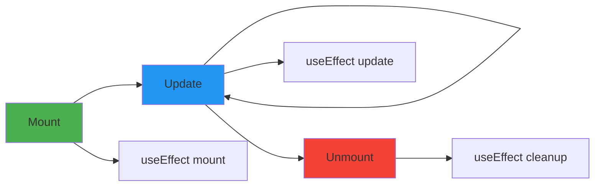

# React - Fundamentos

## 📑 Índice

1. [Introdução](#1-introdução)
2. [Setup e Primeiro Projeto](#2-setup-e-primeiro-projeto)
3. [JSX - JavaScript XML](#3-jsx---javascript-xml)
4. [Componentes](#4-componentes)
5. [Props](#5-props)
6. [State](#6-state)
7. [Hooks Essenciais](#7-hooks-essenciais)
8. [Eventos](#8-eventos)
9. [Renderização Condicional](#9-renderização-condicional)
10. [Listas e Keys](#10-listas-e-keys)
11. [Lifecycle e Effects](#11-lifecycle-e-effects)
12. [Composição de Componentes](#12-composição-de-componentes)
13. [Best Practices](#13-best-practices)
14. [Troubleshooting](#14-troubleshooting)
15. [Recursos](#15-recursos)

---

## 1. 📚 **Introdução**

### 1.1. O que é React?

**React** é uma biblioteca JavaScript para construir interfaces de usuário (UI) baseada em **componentes reutilizáveis**.

**Analogia:** React é como **LEGO** 🧱:
- Você cria **peças pequenas** (componentes)
- **Combina** essas peças para formar estruturas maiores
- Pode **reutilizar** as mesmas peças em diferentes lugares
- Cada peça tem sua **função específica**

### 1.2. Conceitos-Chave

```mermaid
graph TB
    A[React App] --> B[Componentes]
    B --> C[Props - Dados de Entrada]
    B --> D[State - Dados Internos]
    B --> E[Events - Interações]
    
    C --> F[Imutáveis]
    D --> G[Mutáveis]
    E --> H[Atualizam State]
    
    H --> I[Re-renderização]
    I --> J[Virtual DOM]
    J --> K[Real DOM]
    
    style A fill:#61dafb
    style B fill:#282c34
    style J fill:#ffd700
```



### 1.3. Comparação: React vs. Vanilla JavaScript

**Vanilla JavaScript (Imperativo):**
```javascript
// ❌ Código imperativo - você diz COMO fazer
const button = document.createElement('button');
button.textContent = 'Clique aqui';
button.addEventListener('click', () => {
  const counter = document.getElementById('counter');
  counter.textContent = parseInt(counter.textContent) + 1;
});
document.body.appendChild(button);
```

**React (Declarativo):**
```jsx
// ✅ Código declarativo - você diz O QUE quer
function Counter() {
  const [count, setCount] = useState(0);
  
  return (
    <button onClick={() => setCount(count + 1)}>
      Cliques: {count}
    </button>
  );
}
```

### 1.4. Por que usar React?

| Vantagem | Descrição | Impacto |
|----------|-----------|---------|
| **Componentização** | UI dividida em peças reutilizáveis | 🔄 70% menos código duplicado |
| **Virtual DOM** | Atualizações eficientes | ⚡ 10x mais rápido que DOM direto |
| **Declarativo** | Descreve o que quer, não como | 📖 Código 50% mais legível |
| **Unidirecional** | Fluxo de dados previsível | 🐛 90% menos bugs |
| **Ecossistema** | Maior comunidade JavaScript | 📦 Milhares de bibliotecas |

---

## 2. 🚀 **Setup e Primeiro Projeto**

### 2.1. Pré-requisitos

```bash
# Verificar Node.js instalado (mínimo v18)
node --version
# v20.11.0

# Verificar npm
npm --version
# 10.2.4
```

### 2.2. Criar Projeto com Vite (Recomendado 2024+)

```bash
# Criar projeto React com Vite
npm create vite@latest my-react-app -- --template react

# Entrar no diretório
cd my-react-app

# Instalar dependências
npm install

# Iniciar servidor de desenvolvimento
npm run dev
```

**Estrutura criada:**
```
my-react-app/
├── node_modules/
├── public/
│   └── vite.svg
├── src/
│   ├── assets/
│   ├── App.css
│   ├── App.jsx          # Componente principal
│   ├── index.css
│   └── main.jsx         # Entry point
├── .gitignore
├── index.html
├── package.json
├── vite.config.js
└── README.md
```

### 2.3. Alternativa: Create React App (Legado)

```bash
# Método antigo (não recomendado para novos projetos)
npx create-react-app my-app
cd my-app
npm start
```

### 2.4. Primeiro Componente

**src/main.jsx** (Entry Point):
```jsx
import React from 'react'
import ReactDOM from 'react-dom/client'
import App from './App.jsx'
import './index.css'

/**
 * Renderiza a aplicação React no DOM
 */
ReactDOM.createRoot(document.getElementById('root')).render(
  <React.StrictMode>
    <App />
  </React.StrictMode>,
)
```

**src/App.jsx** (Componente Principal):
```jsx
import { useState } from 'react'
import './App.css'

/**
 * Componente principal da aplicação
 */
function App() {
  const [count, setCount] = useState(0)

  return (
    <div className="App">
      <h1>Meu Primeiro App React</h1>
      <button onClick={() => setCount(count + 1)}>
        Cliques: {count}
      </button>
    </div>
  )
}

export default App
```

### 2.5. Scripts Úteis

```json
// package.json
{
  "scripts": {
    "dev": "vite",              // Desenvolvimento (hot reload)
    "build": "vite build",       // Build para produção
    "preview": "vite preview",   // Preview do build
    "lint": "eslint src"         // Linter
  }
}
```

---

## 3. 🎨 **JSX - JavaScript XML**

### 3.1. O que é JSX?

**JSX** é uma extensão de sintaxe que permite escrever HTML dentro do JavaScript.

```jsx
// JSX - Parece HTML, mas é JavaScript
const element = <h1>Hello, React!</h1>;

// É transformado em:
const element = React.createElement('h1', null, 'Hello, React!');
```

### 3.2. Regras do JSX

**1. Um único elemento raiz:**
```jsx
// ❌ Erro: Múltiplos elementos raiz
function App() {
  return (
    <h1>Título</h1>
    <p>Parágrafo</p>
  );
}

// ✅ Correto: Envolva em um elemento pai
function App() {
  return (
    <div>
      <h1>Título</h1>
      <p>Parágrafo</p>
    </div>
  );
}

// ✅ Melhor: Use Fragment (não adiciona elemento extra no DOM)
function App() {
  return (
    <>
      <h1>Título</h1>
      <p>Parágrafo</p>
    </>
  );
}
```

**2. Tags devem ser fechadas:**
```jsx
// ❌ Erro: Tag não fechada
<input type="text">

// ✅ Correto: Self-closing
<input type="text" />

<br />
```

**3. camelCase para atributos:**
```jsx
// ❌ HTML tradicional
<div class="container" onclick="handleClick()"></div>

// ✅ JSX
<div className="container" onClick={handleClick}></div>
```

### 3.3. Expressões JavaScript em JSX

```jsx
function Greeting() {
  const name = 'João';
  const age = 25;
  const isAdult = age >= 18;

  return (
    <div>
      {/* Variáveis */}
      <h1>Olá, {name}!</h1>
      
      {/* Expressões */}
      <p>Você tem {age} anos</p>
      <p>Ano de nascimento: {2024 - age}</p>
      
      {/* Operações */}
      <p>Status: {isAdult ? 'Adulto' : 'Menor'}</p>
      
      {/* Chamadas de função */}
      <p>{getGreeting(name)}</p>
      
      {/* Arrays */}
      <ul>
        {['React', 'Vue', 'Angular'].map(item => (
          <li key={item}>{item}</li>
        ))}
      </ul>
    </div>
  );
}

function getGreeting(name) {
  return `Bem-vindo, ${name}!`;
}
```

### 3.4. Atributos em JSX

```jsx
function Profile() {
  const user = {
    name: 'Maria',
    avatar: 'https://example.com/avatar.jpg'
  };
  
  const buttonStyle = {
    backgroundColor: '#007bff',
    color: 'white',
    padding: '10px 20px',
    border: 'none',
    borderRadius: '5px'
  };

  return (
    <div>
      {/* String literal */}
      
      
      {/* Expressão */}
      
      
      {/* Classe CSS */}
      <div className="card">Conteúdo</div>
      
      {/* Múltiplas classes */}
      <div className={`card ${user.premium ? 'premium' : ''}`}>
        Premium
      </div>
      
      {/* Estilo inline (objeto) */}
      <button style={buttonStyle}>Clique</button>
      
      {/* Estilo inline (literal) */}
      <p style={{ fontSize: '18px', color: 'red' }}>Texto</p>
      
      {/* Atributos booleanos */}
      <input type="checkbox" checked={true} disabled={false} />
      
      {/* Data attributes */}
      <div data-user-id={user.id} data-role="admin">
        Info
      </div>
    </div>
  );
}
```

### 3.5. Comentários em JSX

```jsx
function Component() {
  return (
    <div>
      {/* Comentário dentro do JSX */}
      
      {/* 
        Comentário
        em múltiplas
        linhas
      */}
      
      <p>Texto</p>
      
      {/* Comentário condicional
      <p>Esse parágrafo está comentado</p>
      */}
    </div>
  );
}
```

### 3.6. JSX Avançado

```jsx
function AdvancedJSX() {
  const items = ['Café', 'Chá', 'Suco'];
  const showTitle = true;

  return (
    <div>
      {/* Renderização condicional inline */}
      {showTitle && <h1>Lista de Bebidas</h1>}
      
      {/* Operador ternário */}
      {items.length > 0 ? (
        <ul>
          {items.map((item, index) => (
            <li key={index}>{item}</li>
          ))}
        </ul>
      ) : (
        <p>Nenhum item disponível</p>
      )}
      
      {/* IIFE (Immediately Invoked Function Expression) */}
      {(() => {
        const now = new Date();
        const hour = now.getHours();
        
        if (hour < 12) return <p>Bom dia! ☀️</p>;
        if (hour < 18) return <p>Boa tarde! 🌤️</p>;
        return <p>Boa noite! 🌙</p>;
      })()}
    </div>
  );
}
```

---

## 4. 🧩 **Componentes**

### 4.1. Tipos de Componentes

**Function Components (Recomendado):**
```jsx
// Componente funcional simples
function Welcome(props) {
  return <h1>Olá, {props.name}!</h1>;
}

// Arrow function
const Welcome = (props) => {
  return <h1>Olá, {props.name}!</h1>;
};

// Implícito (sem return)
const Welcome = (props) => <h1>Olá, {props.name}!</h1>;

// Com destructuring
const Welcome = ({ name }) => <h1>Olá, {name}!</h1>;
```

**Class Components (Legado):**
```jsx
// ⚠️ Sintaxe antiga - evite em novos projetos
import React, { Component } from 'react';

class Welcome extends Component {
  render() {
    return <h1>Olá, {this.props.name}!</h1>;
  }
}
```

### 4.2. Anatomia de um Componente

```jsx
import React, { useState, useEffect } from 'react';
import './UserCard.css';

/**
 * Componente que exibe informações de um usuário
 * 
 * @param {Object} props - Propriedades do componente
 * @param {string} props.name - Nome do usuário
 * @param {string} props.email - Email do usuário
 * @param {string} props.avatar - URL do avatar
 * @param {Function} props.onDelete - Callback ao deletar
 */
function UserCard({ name, email, avatar, onDelete }) {
  // ─────────────────────────────────────────────────────
  // 1. HOOKS (sempre no topo, mesma ordem)
  // ─────────────────────────────────────────────────────
  const [isHovered, setIsHovered] = useState(false);
  const [isLoading, setIsLoading] = useState(false);

  // ─────────────────────────────────────────────────────
  // 2. EFFECTS
  // ─────────────────────────────────────────────────────
  useEffect(() => {
    console.log(`UserCard montado: ${name}`);
    
    return () => {
      console.log(`UserCard desmontado: ${name}`);
    };
  }, [name]);

  // ─────────────────────────────────────────────────────
  // 3. HANDLERS (funções de eventos)
  // ─────────────────────────────────────────────────────
  const handleMouseEnter = () => setIsHovered(true);
  const handleMouseLeave = () => setIsHovered(false);
  
  const handleDelete = async () => {
    setIsLoading(true);
    await onDelete();
    setIsLoading(false);
  };

  // ─────────────────────────────────────────────────────
  // 4. DERIVED STATE (valores computados)
  // ─────────────────────────────────────────────────────
  const cardClassName = `user-card ${isHovered ? 'hovered' : ''}`;
  const initials = name.split(' ').map(n => n[0]).join('');

  // ─────────────────────────────────────────────────────
  // 5. RENDER (sempre por último)
  // ─────────────────────────────────────────────────────
  return (
    <div 
      className={cardClassName}
      onMouseEnter={handleMouseEnter}
      onMouseLeave={handleMouseLeave}
    >
      
      <h3>{name}</h3>
      <p>{email}</p>
      <button 
        onClick={handleDelete}
        disabled={isLoading}
      >
        {isLoading ? 'Deletando...' : 'Deletar'}
      </button>
    </div>
  );
}

// ─────────────────────────────────────────────────────
// 6. DEFAULT PROPS (opcional)
// ─────────────────────────────────────────────────────
UserCard.defaultProps = {
  avatar: 'https://via.placeholder.com/150',
  onDelete: () => console.log('Delete não implementado')
};

export default UserCard;
```

### 4.3. Organização de Componentes

```
src/
├── components/
│   ├── common/                 # Componentes reutilizáveis
│   │   ├── Button/
│   │   │   ├── Button.jsx
│   │   │   ├── Button.css
│   │   │   ├── Button.test.jsx
│   │   │   └── index.js       # Re-export
│   │   ├── Input/
│   │   └── Card/
│   │
│   ├── layout/                 # Componentes de layout
│   │   ├── Header.jsx
│   │   ├── Footer.jsx
│   │   └── Sidebar.jsx
│   │
│   └── features/              # Componentes específicos
│       ├── UserProfile/
│       ├── ProductList/
│       └── ShoppingCart/
│
├── pages/                     # Páginas/Rotas
│   ├── Home.jsx
│   ├── About.jsx
│   └── Contact.jsx
│
├── hooks/                     # Custom hooks
│   ├── useAuth.js
│   └── useFetch.js
│
├── utils/                     # Utilitários
│   ├── formatters.js
│   └── validators.js
│
└── App.jsx
```

### 4.4. Composição de Componentes

```jsx
// ─────────────────────────────────────────────────────
// Componentes base
// ─────────────────────────────────────────────────────
function Avatar({ src, alt, size = 'medium' }) {
  const sizes = {
    small: '40px',
    medium: '80px',
    large: '120px'
  };

  return (
    
  );
}

function Badge({ children, color = 'blue' }) {
  const colors = {
    blue: '#007bff',
    green: '#28a745',
    red: '#dc3545'
  };

  return (
    <span style={{
      backgroundColor: colors[color],
      color: 'white',
      padding: '4px 8px',
      borderRadius: '4px',
      fontSize: '12px'
    }}>
      {children}
    </span>
  );
}

// ─────────────────────────────────────────────────────
// Composição
// ─────────────────────────────────────────────────────
function UserProfile({ user }) {
  return (
    <div className="user-profile">
      <Avatar 
        src={user.avatar} 
        alt={user.name}
        size="large"
      />
      <h2>{user.name}</h2>
      <Badge color={user.isOnline ? 'green' : 'red'}>
        {user.isOnline ? 'Online' : 'Offline'}
      </Badge>
      {user.isPremium && (
        <Badge color="blue">Premium</Badge>
      )}
      <p>{user.bio}</p>
    </div>
  );
}

// ─────────────────────────────────────────────────────
// Uso
// ─────────────────────────────────────────────────────
function App() {
  const user = {
    name: 'Maria Silva',
    avatar: 'https://example.com/avatar.jpg',
    isOnline: true,
    isPremium: true,
    bio: 'Desenvolvedora React'
  };

  return <UserProfile user={user} />;
}
```

### 4.5. Componentes Reutilizáveis

```jsx
// ─────────────────────────────────────────────────────
// Button reutilizável
// ─────────────────────────────────────────────────────
function Button({ 
  children, 
  variant = 'primary', 
  size = 'medium',
  disabled = false,
  onClick,
  type = 'button',
  ...rest  // Resto dos props
}) {
  const baseClass = 'btn';
  const variantClass = `btn-${variant}`;
  const sizeClass = `btn-${size}`;
  const className = `${baseClass} ${variantClass} ${sizeClass}`;

  return (
    <button
      type={type}
      className={className}
      disabled={disabled}
      onClick={onClick}
      {...rest}  // Espalha props adicionais
    >
      {children}
    </button>
  );
}

// ─────────────────────────────────────────────────────
// Uso do Button
// ─────────────────────────────────────────────────────
function App() {
  return (
    <div>
      <Button variant="primary" size="small">
        Pequeno
      </Button>
      
      <Button variant="secondary" size="medium">
        Médio
      </Button>
      
      <Button variant="danger" size="large" onClick={() => alert('Deletado!')}>
        Deletar
      </Button>
      
      <Button disabled>
        Desabilitado
      </Button>
      
      {/* Props adicionais são passados */}
      <Button data-testid="submit-btn" aria-label="Enviar">
        Enviar
      </Button>
    </div>
  );
}
```

---

## 5. 📦 **Props**

### 5.1. O que são Props?

**Props** (properties) são argumentos passados de um componente pai para filho. São **imutáveis** (read-only).

**Analogia:** Props são como **parâmetros de função** 📋:
```javascript
// Função JavaScript
function greet(name, age) {
  return `Olá ${name}, você tem ${age} anos`;
}
greet('João', 25);

// Componente React
function Greeting({ name, age }) {
  return <p>Olá {name}, você tem {age} anos</p>;
}
<Greeting name="João" age={25} />
```

### 5.2. Passando Props

```jsx
function App() {
  const user = {
    name: 'João',
    age: 25,
    isActive: true
  };

  return (
    <div>
      {/* String literal */}
      <Greeting name="Maria" />
      
      {/* Número */}
      <Greeting name="João" age={25} />
      
      {/* Booleano */}
      <Greeting name="Ana" isActive={true} />
      <Greeting name="Ana" isActive />  {/* Shorthand para true */}
      
      {/* Objeto */}
      <Greeting user={user} />
      
      {/* Array */}
      <Greeting hobbies={['React', 'Node', 'TypeScript']} />
      
      {/* Função */}
      <Greeting onGreet={() => alert('Hello!')} />
      
      {/* Múltiplos props */}
      <Greeting 
        name="Pedro"
        age={30}
        isActive={true}
        hobbies={['Soccer', 'Music']}
      />
    </div>
  );
}
```

### 5.3. Recebendo Props

```jsx
// ─────────────────────────────────────────────────────
// 1. Props object
// ─────────────────────────────────────────────────────
function Greeting(props) {
  return (
    <div>
      <h1>Olá, {props.name}!</h1>
      <p>Idade: {props.age}</p>
    </div>
  );
}

// ─────────────────────────────────────────────────────
// 2. Destructuring (Recomendado)
// ─────────────────────────────────────────────────────
function Greeting({ name, age }) {
  return (
    <div>
      <h1>Olá, {name}!</h1>
      <p>Idade: {age}</p>
    </div>
  );
}

// ─────────────────────────────────────────────────────
// 3. Destructuring com valores padrão
// ─────────────────────────────────────────────────────
function Greeting({ name = 'Visitante', age = 0 }) {
  return (
    <div>
      <h1>Olá, {name}!</h1>
      <p>Idade: {age}</p>
    </div>
  );
}

// ─────────────────────────────────────────────────────
// 4. Rest operator para props adicionais
// ─────────────────────────────────────────────────────
function Greeting({ name, age, ...otherProps }) {
  return (
    <div {...otherProps}>  {/* Espalha props restantes */}
      <h1>Olá, {name}!</h1>
      <p>Idade: {age}</p>
    </div>
  );
}

// Uso:
<Greeting 
  name="João" 
  age={25}
  className="greeting"
  data-testid="user-greeting"
/>
```

### 5.4. Props Children

```jsx
// ─────────────────────────────────────────────────────
// Children como prop especial
// ─────────────────────────────────────────────────────
function Card({ children }) {
  return (
    <div className="card">
      {children}
    </div>
  );
}

// Uso:
function App() {
  return (
    <Card>
      <h2>Título do Card</h2>
      <p>Conteúdo do card aqui...</p>
      <button>Ação</button>
    </Card>
  );
}

// ─────────────────────────────────────────────────────
// Children com props nomeados
// ─────────────────────────────────────────────────────
function Modal({ title, children, footer }) {
  return (
    <div className="modal">
      <div className="modal-header">
        <h3>{title}</h3>
      </div>
      <div className="modal-body">
        {children}
      </div>
      <div className="modal-footer">
        {footer}
      </div>
    </div>
  );
}

// Uso:
<Modal
  title="Confirmar Ação"
  footer={
    <>
      <button>Cancelar</button>
      <button>Confirmar</button>
    </>
  }
>
  <p>Tem certeza que deseja continuar?</p>
</Modal>
```

### 5.5. Prop Drilling (e como evitar)

```jsx
// ❌ Problema: Prop Drilling (passar props por muitos níveis)
function App() {
  const user = { name: 'João', role: 'admin' };
  
  return <Layout user={user} />;
}

function Layout({ user }) {
  return (
    <div>
      <Header user={user} />
      <Main user={user} />
    </div>
  );
}

function Header({ user }) {
  return <UserMenu user={user} />;
}

function UserMenu({ user }) {
  return <p>Olá, {user.name}</p>;  // user passou por 3 componentes!
}

// ✅ Solução 1: Context API (veremos depois)
// ✅ Solução 2: Composição
function App() {
  const user = { name: 'João', role: 'admin' };
  
  return (
    <Layout>
      <Header>
        <UserMenu user={user} />  {/* Passa direto */}
      </Header>
      <Main />
    </Layout>
  );
}
```

### 5.6. Props Validation (desenvolvimento)

```jsx
import PropTypes from 'prop-types';

function UserCard({ name, age, email, isActive, hobbies, onDelete }) {
  return (
    <div className="user-card">
      <h3>{name}</h3>
      <p>Idade: {age}</p>
      <p>Email: {email}</p>
      <p>Status: {isActive ? 'Ativo' : 'Inativo'}</p>
      <ul>
        {hobbies.map(hobby => <li key={hobby}>{hobby}</li>)}
      </ul>
      <button onClick={onDelete}>Deletar</button>
    </div>
  );
}

// Validação de tipos (apenas em desenvolvimento)
UserCard.propTypes = {
  name: PropTypes.string.isRequired,        // Obrigatório
  age: PropTypes.number.isRequired,
  email: PropTypes.string,                   // Opcional
  isActive: PropTypes.bool,
  hobbies: PropTypes.arrayOf(PropTypes.string),
  onDelete: PropTypes.func.isRequired
};

// Valores padrão
UserCard.defaultProps = {
  email: 'email@example.com',
  isActive: true,
  hobbies: []
};

export default UserCard;
```

---

## 6. 🎯 **State**

### 6.1. O que é State?

**State** é a memória interna de um componente. Quando o state muda, o componente **re-renderiza**.

**Analogia:** State é como uma **caixa de memória** 📦:
- Guarda dados que podem **mudar ao longo do tempo**
- Quando você **modifica** a caixa, React **atualiza a UI**
- Cada componente tem sua **própria caixa** (state local)

### 6.2. useState Hook

```jsx
import { useState } from 'react';

function Counter() {
  // ─────────────────────────────────────────────────────
  // Sintaxe: const [state, setState] = useState(valorInicial)
  // ─────────────────────────────────────────────────────
  const [count, setCount] = useState(0);
  //      ↑       ↑              ↑
  //   valor   setter      valor inicial

  return (
    <div>
      <p>Contagem: {count}</p>
      <button onClick={() => setCount(count + 1)}>
        Incrementar
      </button>
    </div>
  );
}
```

### 6.3. Múltiplos States

```jsx
function UserForm() {
  // ✅ Múltiplos useState para valores independentes
  const [name, setName] = useState('');
  const [email, setEmail] = useState('');
  const [age, setAge] = useState(0);
  const [isSubscribed, setIsSubscribed] = useState(false);

  return (
    <form>
      <input 
        type="text"
        value={name}
        onChange={(e) => setName(e.target.value)}
        placeholder="Nome"
      />
      
      <input 
        type="email"
        value={email}
        onChange={(e) => setEmail(e.target.value)}
        placeholder="Email"
      />
      
      <input 
        type="number"
        value={age}
        onChange={(e) => setAge(Number(e.target.value))}
        placeholder="Idade"
      />
      
      <label>
        <input 
          type="checkbox"
          checked={isSubscribed}
          onChange={(e) => setIsSubscribed(e.target.checked)}
        />
        Assinar newsletter
      </label>
    </form>
  );
}
```

### 6.4. State Object

```jsx
function UserForm() {
  // ✅ State object para dados relacionados
  const [user, setUser] = useState({
    name: '',
    email: '',
    age: 0,
    isSubscribed: false
  });

  // Handler genérico
  const handleChange = (field, value) => {
    setUser(prevUser => ({
      ...prevUser,      // Copia estado anterior
      [field]: value    // Atualiza campo específico
    }));
  };

  return (
    <form>
      <input 
        type="text"
        value={user.name}
        onChange={(e) => handleChange('name', e.target.value)}
        placeholder="Nome"
      />
      
      <input 
        type="email"
        value={user.email}
        onChange={(e) => handleChange('email', e.target.value)}
        placeholder="Email"
      />
      
      <input 
        type="number"
        value={user.age}
        onChange={(e) => handleChange('age', Number(e.target.value))}
        placeholder="Idade"
      />
      
      <label>
        <input 
          type="checkbox"
          checked={user.isSubscribed}
          onChange={(e) => handleChange('isSubscribed', e.target.checked)}
        />
        Assinar newsletter
      </label>
      
      <pre>{JSON.stringify(user, null, 2)}</pre>
    </form>
  );
}
```

### 6.5. Atualizações Assíncronas

```jsx
function Counter() {
  const [count, setCount] = useState(0);

  // ❌ ERRADO: Atualizações baseadas no estado atual
  const handleBadIncrement = () => {
    setCount(count + 1);
    setCount(count + 1);  // Não funciona como esperado!
    setCount(count + 1);  // count ainda é 0 aqui
    // Resultado: count = 1 (não 3!)
  };

  // ✅ CORRETO: Use função de atualização
  const handleGoodIncrement = () => {
    setCount(prev => prev + 1);  // prev = 0, retorna 1
    setCount(prev => prev + 1);  // prev = 1, retorna 2
    setCount(prev => prev + 1);  // prev = 2, retorna 3
    // Resultado: count = 3 ✓
  };

  return (
    <div>
      <p>Contagem: {count}</p>
      <button onClick={handleBadIncrement}>
        Incremento Errado (+1)
      </button>
      <button onClick={handleGoodIncrement}>
        Incremento Correto (+3)
      </button>
    </div>
  );
}
```

### 6.6. State com Arrays

```jsx
function TodoList() {
  const [todos, setTodos] = useState([
    { id: 1, text: 'Aprender React', done: false },
    { id: 2, text: 'Fazer exercícios', done: false }
  ]);

  // ─────────────────────────────────────────────────────
  // Adicionar item
  // ─────────────────────────────────────────────────────
  const addTodo = (text) => {
    const newTodo = {
      id: Date.now(),
      text,
      done: false
    };
    
    setTodos(prevTodos => [...prevTodos, newTodo]);
  };

  // ─────────────────────────────────────────────────────
  // Remover item
  // ─────────────────────────────────────────────────────
  const removeTodo = (id) => {
    setTodos(prevTodos => prevTodos.filter(todo => todo.id !== id));
  };

  // ─────────────────────────────────────────────────────
  // Atualizar item
  // ─────────────────────────────────────────────────────
  const toggleTodo = (id) => {
    setTodos(prevTodos =>
      prevTodos.map(todo =>
        todo.id === id
          ? { ...todo, done: !todo.done }
          : todo
      )
    );
  };

  // ─────────────────────────────────────────────────────
  // Limpar todos
  // ─────────────────────────────────────────────────────
  const clearCompleted = () => {
    setTodos(prevTodos => prevTodos.filter(todo => !todo.done));
  };

  return (
    <div>
      <ul>
        {todos.map(todo => (
          <li key={todo.id}>
            <input 
              type="checkbox"
              checked={todo.done}
              onChange={() => toggleTodo(todo.id)}
            />
            <span style={{ 
              textDecoration: todo.done ? 'line-through' : 'none' 
            }}>
              {todo.text}
            </span>
            <button onClick={() => removeTodo(todo.id)}>
              Remover
            </button>
          </li>
        ))}
      </ul>
      
      <button onClick={() => addTodo('Nova tarefa')}>
        Adicionar
      </button>
      <button onClick={clearCompleted}>
        Limpar Completas
      </button>
    </div>
  );
}
```

### 6.7. State Lazy Initialization

```jsx
function ExpensiveComponent() {
  // ❌ Executa toda renderização
  const [data, setData] = useState(expensiveCalculation());

  // ✅ Executa apenas na primeira renderização
  const [data, setData] = useState(() => {
    console.log('Calculando... (apenas uma vez)');
    return expensiveCalculation();
  });

  return <div>{data}</div>;
}

function expensiveCalculation() {
  // Operação custosa
  let result = 0;
  for (let i = 0; i < 1000000; i++) {
    result += i;
  }
  return result;
}
```

---

## 7. 🎣 **Hooks Essenciais**

### 7.1. Regras dos Hooks

**⚠️ Regras que DEVEM ser seguidas:**

1. **Apenas no topo do componente** (não dentro de loops, condições ou funções aninhadas)
2. **Apenas em function components** ou custom hooks
3. **Mesma ordem** em todas as renderizações

```jsx
function Component() {
  // ✅ CORRETO
  const [count, setCount] = useState(0);
  const [name, setName] = useState('');

  // ❌ ERRADO: Hook dentro de condição
  if (count > 0) {
    const [error, setError] = useState('');  // ❌
  }

  // ❌ ERRADO: Hook dentro de loop
  for (let i = 0; i < 10; i++) {
    const [items, setItems] = useState([]);  // ❌
  }

  // ❌ ERRADO: Hook dentro de função
  const handleClick = () => {
    const [clicked, setClicked] = useState(false);  // ❌
  };

  return <div>{count}</div>;
}
```

### 7.2. useState em Detalhes

```jsx
import { useState } from 'react';

function StateExamples() {
  // ─────────────────────────────────────────────────────
  // Tipos primitivos
  // ─────────────────────────────────────────────────────
  const [count, setCount] = useState(0);
  const [name, setName] = useState('João');
  const [isActive, setIsActive] = useState(true);

  // ─────────────────────────────────────────────────────
  // Objetos
  // ─────────────────────────────────────────────────────
  const [user, setUser] = useState({
    name: 'Maria',
    age: 25,
    email: 'maria@example.com'
  });

  // Atualizar objeto (imutável)
  const updateUser = () => {
    setUser(prevUser => ({
      ...prevUser,
      age: prevUser.age + 1
    }));
  };

  // ─────────────────────────────────────────────────────
  // Arrays
  // ─────────────────────────────────────────────────────
  const [items, setItems] = useState(['a', 'b', 'c']);

  const addItem = (item) => {
    setItems(prev => [...prev, item]);
  };

  const removeItem = (index) => {
    setItems(prev => prev.filter((_, i) => i !== index));
  };

  // ─────────────────────────────────────────────────────
  // Inicialização lazy (função)
  // ─────────────────────────────────────────────────────
  const [data, setData] = useState(() => {
    const stored = localStorage.getItem('data');
    return stored ? JSON.parse(stored) : [];
  });

  return (
    <div>
      <p>Count: {count}</p>
      <p>Name: {name}</p>
      <p>User: {user.name}, {user.age}</p>
      <ul>
        {items.map((item, i) => <li key={i}>{item}</li>)}
      </ul>
    </div>
  );
}
```

### 7.3. useEffect

```jsx
import { useState, useEffect } from 'react';

function EffectExamples() {
  const [count, setCount] = useState(0);
  const [user, setUser] = useState(null);

  // ─────────────────────────────────────────────────────
  // 1. Executa em TODA renderização (sem dependency array)
  // ─────────────────────────────────────────────────────
  useEffect(() => {
    console.log('Renderizou!');
  });

  // ─────────────────────────────────────────────────────
  // 2. Executa apenas UMA VEZ (mount) - [] vazio
  // ─────────────────────────────────────────────────────
  useEffect(() => {
    console.log('Componente montado!');
    
    // Buscar dados da API
    fetchUser();
    
    // Cleanup (executa no unmount)
    return () => {
      console.log('Componente desmontado!');
    };
  }, []);

  // ─────────────────────────────────────────────────────
  // 3. Executa quando DEPENDÊNCIAS mudam
  // ─────────────────────────────────────────────────────
  useEffect(() => {
    console.log(`Count mudou para: ${count}`);
    
    // Salvar no localStorage
    localStorage.setItem('count', count.toString());
  }, [count]);  // Re-executa quando count muda

  // ─────────────────────────────────────────────────────
  // 4. Múltiplas dependências
  // ─────────────────────────────────────────────────────
  useEffect(() => {
    if (user) {
      console.log(`User ${user.name} com count ${count}`);
    }
  }, [user, count]);  // Re-executa quando user OU count muda

  // ─────────────────────────────────────────────────────
  // 5. Cleanup function
  // ─────────────────────────────────────────────────────
  useEffect(() => {
    const timer = setInterval(() => {
      console.log('Tick');
    }, 1000);

    // Cleanup: limpa interval no unmount
    return () => {
      clearInterval(timer);
    };
  }, []);

  const fetchUser = async () => {
    const response = await fetch('/api/user');
    const data = await response.json();
    setUser(data);
  };

  return (
    <div>
      <p>Count: {count}</p>
      <button onClick={() => setCount(count + 1)}>Incrementar</button>
      {user && <p>User: {user.name}</p>}
    </div>
  );
}
```

### 7.4. useEffect - Casos de Uso Comuns

```jsx
import { useState, useEffect } from 'react';

function CommonEffectPatterns() {
  // ─────────────────────────────────────────────────────
  // 1. Fetch de dados
  // ─────────────────────────────────────────────────────
  const [data, setData] = useState(null);
  const [loading, setLoading] = useState(true);
  const [error, setError] = useState(null);

  useEffect(() => {
    const fetchData = async () => {
      try {
        setLoading(true);
        const response = await fetch('/api/data');
        const json = await response.json();
        setData(json);
      } catch (err) {
        setError(err.message);
      } finally {
        setLoading(false);
      }
    };

    fetchData();
  }, []);

  // ─────────────────────────────────────────────────────
  // 2. Sincronizar com localStorage
  // ─────────────────────────────────────────────────────
  const [theme, setTheme] = useState(() => {
    return localStorage.getItem('theme') || 'light';
  });

  useEffect(() => {
    localStorage.setItem('theme', theme);
    document.body.className = theme;
  }, [theme]);

  // ─────────────────────────────────────────────────────
  // 3. Event listeners
  // ─────────────────────────────────────────────────────
  const [windowWidth, setWindowWidth] = useState(window.innerWidth);

  useEffect(() => {
    const handleResize = () => {
      setWindowWidth(window.innerWidth);
    };

    window.addEventListener('resize', handleResize);

    // Cleanup
    return () => {
      window.removeEventListener('resize', handleResize);
    };
  }, []);

  // ─────────────────────────────────────────────────────
  // 4. Timer/Interval
  // ─────────────────────────────────────────────────────
  const [seconds, setSeconds] = useState(0);

  useEffect(() => {
    const interval = setInterval(() => {
      setSeconds(prev => prev + 1);
    }, 1000);

    return () => clearInterval(interval);
  }, []);

  // ─────────────────────────────────────────────────────
  // 5. Document title
  // ─────────────────────────────────────────────────────
  useEffect(() => {
    document.title = `Você clicou ${seconds} vezes`;
  }, [seconds]);

  // ─────────────────────────────────────────────────────
  // 6. Subscription (WebSocket, EventSource)
  // ─────────────────────────────────────────────────────
  useEffect(() => {
    const ws = new WebSocket('ws://localhost:8080');

    ws.onmessage = (event) => {
      console.log('Mensagem:', event.data);
    };

    return () => {
      ws.close();
    };
  }, []);

  return (
    <div>
      <p>Width: {windowWidth}px</p>
      <p>Seconds: {seconds}</p>
      <button onClick={() => setTheme(theme === 'light' ? 'dark' : 'light')}>
        Toggle Theme
      </button>
    </div>
  );
}
```

### 7.5. useRef

```jsx
import { useRef, useState, useEffect } from 'react';

function RefExamples() {
  // ─────────────────────────────────────────────────────
  // 1. Acessar elementos DOM
  // ─────────────────────────────────────────────────────
  const inputRef = useRef(null);

  const focusInput = () => {
    inputRef.current.focus();
  };

  // ─────────────────────────────────────────────────────
  // 2. Guardar valor mutável (não causa re-render)
  // ─────────────────────────────────────────────────────
  const renderCount = useRef(0);

  useEffect(() => {
    renderCount.current += 1;
    console.log(`Renderizações: ${renderCount.current}`);
  });

  // ─────────────────────────────────────────────────────
  // 3. Guardar valor anterior
  // ─────────────────────────────────────────────────────
  const [count, setCount] = useState(0);
  const prevCountRef = useRef();

  useEffect(() => {
    prevCountRef.current = count;
  }, [count]);

  const prevCount = prevCountRef.current;

  // ─────────────────────────────────────────────────────
  // 4. Guardar timer/interval ID
  // ─────────────────────────────────────────────────────
  const intervalRef = useRef(null);

  const startTimer = () => {
    intervalRef.current = setInterval(() => {
      console.log('Tick');
    }, 1000);
  };

  const stopTimer = () => {
    if (intervalRef.current) {
      clearInterval(intervalRef.current);
    }
  };

  // ─────────────────────────────────────────────────────
  // 5. Evitar chamadas múltiplas
  // ─────────────────────────────────────────────────────
  const isFirstRender = useRef(true);

  useEffect(() => {
    if (isFirstRender.current) {
      isFirstRender.current = false;
      return; // Pula primeira execução
    }

    console.log('Não é primeira renderização');
  });

  return (
    <div>
      <input ref={inputRef} type="text" />
      <button onClick={focusInput}>Focar Input</button>
      
      <p>Count: {count}</p>
      <p>Previous Count: {prevCount}</p>
      <button onClick={() => setCount(count + 1)}>Incrementar</button>
      
      <p>Renderizações: {renderCount.current}</p>
      
      <button onClick={startTimer}>Start Timer</button>
      <button onClick={stopTimer}>Stop Timer</button>
    </div>
  );
}
```

### 7.6. useCallback e useMemo

```jsx
import { useState, useCallback, useMemo } from 'react';

function PerformanceHooks() {
  const [count, setCount] = useState(0);
  const [items, setItems] = useState([1, 2, 3, 4, 5]);

  // ─────────────────────────────────────────────────────
  // useCallback: Memoriza FUNÇÃO
  // ─────────────────────────────────────────────────────
  // ❌ Sem useCallback: função é recriada toda renderização
  const handleClick = () => {
    console.log('Clicked');
  };

  // ✅ Com useCallback: função é memorizada
  const handleClickMemoized = useCallback(() => {
    console.log('Clicked');
  }, []); // Dependências vazias = mesma função sempre

  const handleIncrement = useCallback(() => {
    setCount(prev => prev + 1);
  }, []); // Não depende de nada externo

  // ─────────────────────────────────────────────────────
  // useMemo: Memoriza VALOR COMPUTADO
  // ─────────────────────────────────────────────────────
  // ❌ Sem useMemo: cálculo executado toda renderização
  const sum = items.reduce((acc, item) => acc + item, 0);

  // ✅ Com useMemo: cálculo só quando items mudar
  const sumMemoized = useMemo(() => {
    console.log('Calculando soma...');
    return items.reduce((acc, item) => acc + item, 0);
  }, [items]); // Recalcula apenas quando items muda

  // Exemplo complexo
  const expensiveCalculation = useMemo(() => {
    console.log('Cálculo caro...');
    let result = 0;
    for (let i = 0; i < 1000000; i++) {
      result += i;
    }
    return result;
  }, []); // Executa apenas uma vez

  // ─────────────────────────────────────────────────────
  // Exemplo prático: Filtrar lista
  // ─────────────────────────────────────────────────────
  const [filter, setFilter] = useState('');

  const filteredItems = useMemo(() => {
    console.log('Filtrando items...');
    return items.filter(item => 
      item.toString().includes(filter)
    );
  }, [items, filter]); // Recalcula quando items OU filter muda

  return (
    <div>
      <p>Count: {count}</p>
      <button onClick={handleIncrement}>Incrementar</button>
      
      <p>Soma: {sumMemoized}</p>
      <p>Cálculo caro: {expensiveCalculation}</p>
      
      <input 
        type="text"
        value={filter}
        onChange={(e) => setFilter(e.target.value)}
        placeholder="Filtrar"
      />
      <ul>
        {filteredItems.map(item => (
          <li key={item}>{item}</li>
        ))}
      </ul>
    </div>
  );
}
```

---

## 8. 🖱️ **Eventos**

### 8.1. Eventos Básicos

```jsx
function EventExamples() {
  // ─────────────────────────────────────────────────────
  // 1. Click
  // ─────────────────────────────────────────────────────
  const handleClick = () => {
    alert('Clicou!');
  };

  // ─────────────────────────────────────────────────────
  // 2. Input/Change
  // ─────────────────────────────────────────────────────
  const [text, setText] = useState('');
  
  const handleChange = (event) => {
    setText(event.target.value);
  };

  // ─────────────────────────────────────────────────────
  // 3. Submit
  // ─────────────────────────────────────────────────────
  const handleSubmit = (event) => {
    event.preventDefault(); // Previne reload da página
    console.log('Formulário enviado');
  };

  // ─────────────────────────────────────────────────────
  // 4. Mouse Events
  // ─────────────────────────────────────────────────────
  const handleMouseEnter = () => console.log('Mouse entrou');
  const handleMouseLeave = () => console.log('Mouse saiu');
  const handleDoubleClick = () => console.log('Duplo clique');

  // ─────────────────────────────────────────────────────
  // 5. Keyboard Events
  // ─────────────────────────────────────────────────────
  const handleKeyDown = (event) => {
    if (event.key === 'Enter') {
      console.log('Enter pressionado');
    }
  };

  return (
    <div>
      {/* Click */}
      <button onClick={handleClick}>Clique aqui</button>
      
      {/* Inline arrow function */}
      <button onClick={() => alert('Inline!')}>Inline</button>
      
      {/* Input */}
      <input 
        type="text"
        value={text}
        onChange={handleChange}
      />
      
      {/* Form */}
      <form onSubmit={handleSubmit}>
        <input type="text" />
        <button type="submit">Enviar</button>
      </form>
      
      {/* Mouse */}
      <div 
        onMouseEnter={handleMouseEnter}
        onMouseLeave={handleMouseLeave}
        onDoubleClick={handleDoubleClick}
        style={{ padding: '20px', border: '1px solid' }}
      >
        Hover me
      </div>
      
      {/* Keyboard */}
      <input 
        type="text"
        onKeyDown={handleKeyDown}
        placeholder="Pressione Enter"
      />
    </div>
  );
}
```

### 8.2. Event Object

```jsx
function EventObjectExample() {
  const handleEvent = (event) => {
    console.log('Event type:', event.type);
    console.log('Target element:', event.target);
    console.log('Current target:', event.currentTarget);
    console.log('Value:', event.target.value);
    console.log('Checked:', event.target.checked);
    
    // Prevenir comportamento padrão
    event.preventDefault();
    
    // Parar propagação
    event.stopPropagation();
  };

  const handleClick = (event) => {
    console.log('Click position:', event.clientX, event.clientY);
    console.log('Shift key pressed:', event.shiftKey);
    console.log('Ctrl key pressed:', event.ctrlKey);
    console.log('Alt key pressed:', event.altKey);
  };

  const handleKeyPress = (event) => {
    console.log('Key:', event.key);
    console.log('Key code:', event.keyCode);
    console.log('Char code:', event.charCode);
  };

  return (
    <div>
      <button onClick={handleClick}>Click Info</button>
      <input onKeyPress={handleKeyPress} />
    </div>
  );
}
```

### 8.3. Passando Argumentos para Handlers

```jsx
function ArgumentHandlers() {
  // ─────────────────────────────────────────────────────
  // Método 1: Arrow function inline
  // ─────────────────────────────────────────────────────
  const handleDelete = (id) => {
    console.log('Deletando:', id);
  };

  // ❌ ERRADO: Invoca imediatamente
  // <button onClick={handleDelete(123)}>Delete</button>

  // ✅ CORRETO: Arrow function
  // <button onClick={() => handleDelete(123)}>Delete</button>

  // ─────────────────────────────────────────────────────
  // Método 2: Bind
  // ─────────────────────────────────────────────────────
  // <button onClick={handleDelete.bind(null, 123)}>Delete</button>

  // ─────────────────────────────────────────────────────
  // Método 3: Data attributes
  // ─────────────────────────────────────────────────────
  const handleClick = (event) => {
    const id = event.target.dataset.id;
    console.log('ID:', id);
  };

  // <button data-id="123" onClick={handleClick}>Delete</button>

  const items = [
    { id: 1, name: 'Item 1' },
    { id: 2, name: 'Item 2' },
    { id: 3, name: 'Item 3' }
  ];

  return (
    <ul>
      {items.map(item => (
        <li key={item.id}>
          {item.name}
          
          {/* Método 1: Arrow function */}
          <button onClick={() => handleDelete(item.id)}>
            Delete
          </button>
          
          {/* Método 2: Bind */}
          <button onClick={handleDelete.bind(null, item.id)}>
            Delete
          </button>
          
          {/* Método 3: Data attribute */}
          <button data-id={item.id} onClick={handleClick}>
            Delete
          </button>
        </li>
      ))}
    </ul>
  );
}
```

### 8.4. Event Pooling (React <17)

```jsx
// ⚠️ No React 16 e anterior, events eram pooled
// No React 17+, isso NÃO é mais necessário

function OldReactPattern() {
  const handleClick = (event) => {
    // ❌ React <17: event é reutilizado (undefined em async)
    setTimeout(() => {
      console.log(event.type); // undefined no React <17
    }, 1000);

    // ✅ React <17: Persist event
    event.persist();
    setTimeout(() => {
      console.log(event.type); // Funciona
    }, 1000);
  };

  // ✅ React 17+: Funciona automaticamente
  const handleClickModern = (event) => {
    setTimeout(() => {
      console.log(event.type); // Funciona!
    }, 1000);
  };

  return <button onClick={handleClickModern}>Click</button>;
}
```

---

## 9. 🔀 **Renderização Condicional**

### 9.1. If/Else com Variável

```jsx
function ConditionalRendering({ isLoggedIn }) {
  let content;
  
  if (isLoggedIn) {
    content = <UserDashboard />;
  } else {
    content = <LoginForm />;
  }

  return (
    <div>
      <h1>Minha App</h1>
      {content}
    </div>
  );
}
```

### 9.2. Operador Ternário

```jsx
function TernaryExample({ isLoggedIn }) {
  return (
    <div>
      {isLoggedIn ? (
        <UserDashboard />
      ) : (
        <LoginForm />
      )}
    </div>
  );
}

// Ternário inline
function Badge({ count }) {
  return (
    <span className={count > 0 ? 'badge-active' : 'badge-inactive'}>
      {count > 0 ? count : 'Nenhum'}
    </span>
  );
}
```

### 9.3. Operador &&

```jsx
function AndOperator({ hasNotifications, notificationCount }) {
  return (
    <div>
      {/* Renderiza apenas se true */}
      {hasNotifications && <NotificationBell />}
      
      {/* Renderiza badge se count > 0 */}
      {notificationCount > 0 && (
        <span className="badge">{notificationCount}</span>
      )}
      
      {/* ⚠️ CUIDADO: 0 é falsy mas renderiza! */}
      {notificationCount && <span>{notificationCount}</span>}
      {/* Renderiza "0" quando count = 0 */}
      
      {/* ✅ CORRETO: Comparação explícita */}
      {notificationCount > 0 && <span>{notificationCount}</span>}
    </div>
  );
}
```

### 9.4. Switch/Case

```jsx
function StatusMessage({ status }) {
  // ─────────────────────────────────────────────────────
  // Método 1: Switch com variável
  // ─────────────────────────────────────────────────────
  let message;
  
  switch (status) {
    case 'loading':
      message = <Spinner />;
      break;
    case 'success':
      message = <SuccessMessage />;
      break;
    case 'error':
      message = <ErrorMessage />;
      break;
    default:
      message = <DefaultMessage />;
  }

  return <div>{message}</div>;
}

function StatusMessageImproved({ status }) {
  // ─────────────────────────────────────────────────────
  // Método 2: Object lookup (melhor)
  // ─────────────────────────────────────────────────────
  const statusComponents = {
    loading: <Spinner />,
    success: <SuccessMessage />,
    error: <ErrorMessage />,
    default: <DefaultMessage />
  };

  return (
    <div>
      {statusComponents[status] || statusComponents.default}
    </div>
  );
}
```

### 9.5. Renderização de Múltiplas Condições

```jsx
function ComplexConditional({ user, isLoading, error }) {
  // ─────────────────────────────────────────────────────
  // Early return pattern
  // ─────────────────────────────────────────────────────
  if (isLoading) {
    return <LoadingSpinner />;
  }

  if (error) {
    return <ErrorMessage error={error} />;
  }

  if (!user) {
    return <LoginPrompt />;
  }

  if (!user.isVerified) {
    return <VerificationRequired />;
  }

  // Conteúdo principal
  return (
    <div>
      <h1>Bem-vindo, {user.name}!</h1>
      <UserDashboard user={user} />
    </div>
  );
}
```

### 9.6. Null/Nothing Rendering

```jsx
function OptionalComponent({ show }) {
  // Não renderiza nada
  if (!show) {
    return null;
  }

  return <div>Conteúdo</div>;
}

// Alternativa com &&
function OptionalComponentAlt({ show }) {
  return show && <div>Conteúdo</div>;
}

// Fragment vazio
function EmptyFragment({ items }) {
  if (items.length === 0) {
    return <></>;
  }

  return (
    <ul>
      {items.map(item => <li key={item.id}>{item.name}</li>)}
    </ul>
  );
}
```

---

## 10. 📋 **Listas e Keys**

### 10.1. Renderizando Listas

```jsx
function ListRendering() {
  const items = ['React', 'Vue', 'Angular', 'Svelte'];

  return (
    <ul>
      {items.map((item, index) => (
        <li key={index}>{item}</li>
      ))}
    </ul>
  );
}

// Com objetos
function UserList() {
  const users = [
    { id: 1, name: 'João', age: 25 },
    { id: 2, name: 'Maria', age: 30 },
    { id: 3, name: 'Pedro', age: 28 }
  ];

  return (
    <ul>
      {users.map(user => (
        <li key={user.id}>
          {user.name} - {user.age} anos
        </li>
      ))}
    </ul>
  );
}
```

### 10.2. Por que Keys são Importantes?

```jsx
// ❌ SEM KEY: React não identifica itens corretamente
function BadList({ items }) {
  return (
    <ul>
      {items.map(item => (
        <li>{item.name}</li>  // ❌ Faltando key
      ))}
    </ul>
  );
}

// ⚠️ INDEX COMO KEY: Problemático se lista muda de ordem
function OkayList({ items }) {
  return (
    <ul>
      {items.map((item, index) => (
        <li key={index}>{item.name}</li>  // ⚠️ Index pode causar bugs
      ))}
    </ul>
  );
}

// ✅ ID ÚNICO COMO KEY: Correto
function GoodList({ items }) {
  return (
    <ul>
      {items.map(item => (
        <li key={item.id}>{item.name}</li>  // ✅ ID único
      ))}
    </ul>
  );
}
```

**Problema com index como key:**
```jsx
// Estado inicial
['Alice', 'Bob', 'Carol']
// Keys: 0, 1, 2

// Após remover Bob
['Alice', 'Carol']
// Keys: 0, 1 (Carol agora tem key 1, antes era 2!)
// React pensa que Carol é um item diferente!
```

### 10.3. Keys Corretas

```jsx
function ProperKeys() {
  const todos = [
    { id: 'abc123', text: 'Aprender React' },
    { id: 'def456', text: 'Fazer exercícios' },
    { id: 'ghi789', text: 'Revisar código' }
  ];

  return (
    <ul>
      {todos.map(todo => (
        // ✅ ID único do banco de dados
        <li key={todo.id}>{todo.text}</li>
      ))}
    </ul>
  );
}

// Se não há ID único, gere um
function GenerateIds() {
  const items = ['React', 'Vue', 'Angular'].map((name, index) => ({
    id: `item-${index}`,  // ou use crypto.randomUUID()
    name
  }));

  return (
    <ul>
      {items.map(item => (
        <li key={item.id}>{item.name}</li>
      ))}
    </ul>
  );
}
```

### 10.4. Fragments em Listas

```jsx
function ListWithFragments() {
  const items = [
    { id: 1, title: 'Item 1', description: 'Desc 1' },
    { id: 2, title: 'Item 2', description: 'Desc 2' }
  ];

  return (
    <div>
      {items.map(item => (
        // Fragment com key
        <React.Fragment key={item.id}>
          <h3>{item.title}</h3>
          <p>{item.description}</p>
          <hr />
        </React.Fragment>
      ))}
    </div>
  );

  // ❌ <> não aceita key
  // <>{item.title}</> 
}
```

### 10.5. Listas Aninhadas

```jsx
function NestedLists() {
  const categories = [
    {
      id: 1,
      name: 'Frutas',
      items: [
        { id: 101, name: 'Maçã' },
        { id: 102, name: 'Banana' }
      ]
    },
    {
      id: 2,
      name: 'Legumes',
      items: [
        { id: 201, name: 'Cenoura' },
        { id: 202, name: 'Brócolis' }
      ]
    }
  ];

  return (
    <div>
      {categories.map(category => (
        <div key={category.id}>
          <h2>{category.name}</h2>
          <ul>
            {category.items.map(item => (
              <li key={item.id}>{item.name}</li>
            ))}
          </ul>
        </div>
      ))}
    </div>
  );
}
```

---

## 11. ⏰ **Lifecycle e Effects**

### 11.1. Component Lifecycle (Conceitual)



### 11.2. Lifecycle com useEffect

```jsx
import { useState, useEffect } from 'react';

function LifecycleExample({ userId }) {
  const [user, setUser] = useState(null);

  // ─────────────────────────────────────────────────────
  // MOUNT (componentDidMount)
  // ─────────────────────────────────────────────────────
  useEffect(() => {
    console.log('🟢 Componente MONTADO');
    
    // Setup inicial
    fetchUser(userId);
    
    // UNMOUNT (componentWillUnmount)
    return () => {
      console.log('🔴 Componente DESMONTADO');
      // Cleanup
    };
  }, []); // [] = executa apenas no mount

  // ─────────────────────────────────────────────────────
  // UPDATE (componentDidUpdate)
  // ─────────────────────────────────────────────────────
  useEffect(() => {
    console.log('🔄 userId MUDOU para:', userId);
    
    fetchUser(userId);
  }, [userId]); // Re-executa quando userId muda

  // ─────────────────────────────────────────────────────
  // TODA renderização
  // ─────────────────────────────────────────────────────
  useEffect(() => {
    console.log('🔁 Renderizou');
  }); // Sem dependency array

  const fetchUser = async (id) => {
    const response = await fetch(`/api/users/${id}`);
    const data = await response.json();
    setUser(data);
  };

  return <div>{user?.name}</div>;
}
```

### 11.3. Cleanup Functions

```jsx
function CleanupExamples() {
  // ─────────────────────────────────────────────────────
  // 1. Timers
  // ─────────────────────────────────────────────────────
  useEffect(() => {
    const timer = setTimeout(() => {
      console.log('Timer executado');
    }, 1000);

    return () => {
      clearTimeout(timer);  // Cleanup
    };
  }, []);

  // ─────────────────────────────────────────────────────
  // 2. Intervals
  // ─────────────────────────────────────────────────────
  useEffect(() => {
    const interval = setInterval(() => {
      console.log('Tick');
    }, 1000);

    return () => {
      clearInterval(interval);  // Cleanup
    };
  }, []);

  // ─────────────────────────────────────────────────────
  // 3. Event Listeners
  // ─────────────────────────────────────────────────────
  useEffect(() => {
    const handleScroll = () => {
      console.log('Scrolled');
    };

    window.addEventListener('scroll', handleScroll);

    return () => {
      window.removeEventListener('scroll', handleScroll);  // Cleanup
    };
  }, []);

  // ─────────────────────────────────────────────────────
  // 4. Subscriptions (WebSocket, etc)
  // ─────────────────────────────────────────────────────
  useEffect(() => {
    const ws = new WebSocket('ws://localhost:8080');

    ws.onmessage = (event) => {
      console.log('Mensagem:', event.data);
    };

    return () => {
      ws.close();  // Cleanup
    };
  }, []);

  // ─────────────────────────────────────────────────────
  // 5. Fetch Abort
  // ─────────────────────────────────────────────────────
  useEffect(() => {
    const abortController = new AbortController();

    fetch('/api/data', { signal: abortController.signal })
      .then(res => res.json())
      .then(data => console.log(data))
      .catch(err => {
        if (err.name === 'AbortError') {
          console.log('Fetch cancelado');
        }
      });

    return () => {
      abortController.abort();  // Cleanup
    };
  }, []);

  return <div>Lifecycle Example</div>;
}
```

### 11.4. Dependencies Array

```jsx
function DependenciesExample() {
  const [count, setCount] = useState(0);
  const [name, setName] = useState('');

  // ❌ Faltando dependência
  useEffect(() => {
    console.log(`Count is ${count}`);  // Usa count
  }, []);  // ❌ count não está nas dependências!

  // ✅ Dependência correta
  useEffect(() => {
    console.log(`Count is ${count}`);
  }, [count]);  // ✅ count nas dependências

  // ❌ Dependências desnecessárias
  useEffect(() => {
    console.log('Mounted');
  }, [count, name]);  // ❌ Não usa count nem name

  // ✅ Sem dependências desnecessárias
  useEffect(() => {
    console.log('Mounted');
  }, []);  // ✅ Array vazio

  return <div>{count}</div>;
}
```

---

## 12. 🧱 **Composição de Componentes**

### 12.1. Children Pattern

```jsx
// ─────────────────────────────────────────────────────
// Container genérico
// ─────────────────────────────────────────────────────
function Card({ children, title }) {
  return (
    <div className="card">
      {title && <h2>{title}</h2>}
      <div className="card-body">
        {children}
      </div>
    </div>
  );
}

// Uso
function App() {
  return (
    <Card title="Usuário">
      <p>Nome: João</p>
      <p>Email: joao@example.com</p>
      <button>Editar</button>
    </Card>
  );
}
```

### 12.2. Render Props

```jsx
// ─────────────────────────────────────────────────────
// Componente com lógica compartilhada
// ─────────────────────────────────────────────────────
function MouseTracker({ render }) {
  const [position, setPosition] = useState({ x: 0, y: 0 });

  useEffect(() => {
    const handleMouseMove = (event) => {
      setPosition({ x: event.clientX, y: event.clientY });
    };

    window.addEventListener('mousemove', handleMouseMove);

    return () => {
      window.removeEventListener('mousemove', handleMouseMove);
    };
  }, []);

  return render(position);
}

// Uso
function App() {
  return (
    <MouseTracker 
      render={({ x, y }) => (
        <div>
          <p>Mouse em: {x}, {y}</p>
        </div>
      )}
    />
  );
}
```

### 12.3. Compound Components

```jsx
// ─────────────────────────────────────────────────────
// Componentes que trabalham juntos
// ─────────────────────────────────────────────────────
function Tabs({ children, defaultTab = 0 }) {
  const [activeTab, setActiveTab] = useState(defaultTab);

  return (
    <div className="tabs">
      {React.Children.map(children, (child, index) => {
        return React.cloneElement(child, {
          isActive: index === activeTab,
          onClick: () => setActiveTab(index)
        });
      })}
    </div>
  );
}

function Tab({ label, children, isActive, onClick }) {
  return (
    <div>
      <button 
        className={isActive ? 'tab-active' : 'tab'}
        onClick={onClick}
      >
        {label}
      </button>
      {isActive && <div className="tab-content">{children}</div>}
    </div>
  );
}

// Uso
function App() {
  return (
    <Tabs defaultTab={0}>
      <Tab label="Home">
        <p>Conteúdo Home</p>
      </Tab>
      <Tab label="Profile">
        <p>Conteúdo Profile</p>
      </Tab>
      <Tab label="Settings">
        <p>Conteúdo Settings</p>
      </Tab>
    </Tabs>
  );
}
```

### 12.4. Higher-Order Components (HOC)

```jsx
// ─────────────────────────────────────────────────────
// HOC: Função que recebe componente e retorna novo componente
// ─────────────────────────────────────────────────────
function withLoading(Component) {
  return function WithLoadingComponent({ isLoading, ...props }) {
    if (isLoading) {
      return <div>Carregando...</div>;
    }

    return <Component {...props} />;
  };
}

// Componente base
function UserList({ users }) {
  return (
    <ul>
      {users.map(user => (
        <li key={user.id}>{user.name}</li>
      ))}
    </ul>
  );
}

// Componente com loading
const UserListWithLoading = withLoading(UserList);

// Uso
function App() {
  const [isLoading, setIsLoading] = useState(true);
  const [users, setUsers] = useState([]);

  return (
    <UserListWithLoading 
      isLoading={isLoading}
      users={users}
    />
  );
}
```

### 12.5. Slot Pattern

```jsx
// ─────────────────────────────────────────────────────
// Layout com slots nomeados
// ─────────────────────────────────────────────────────
function PageLayout({ header, sidebar, content, footer }) {
  return (
    <div className="page-layout">
      <header className="header">{header}</header>
      <div className="main">
        <aside className="sidebar">{sidebar}</aside>
        <main className="content">{content}</main>
      </div>
      <footer className="footer">{footer}</footer>
    </div>
  );
}

// Uso
function App() {
  return (
    <PageLayout
      header={
        <div>
          <h1>Logo</h1>
          <nav>Menu</nav>
        </div>
      }
      sidebar={
        <ul>
          <li>Link 1</li>
          <li>Link 2</li>
        </ul>
      }
      content={
        <div>
          <h2>Conteúdo Principal</h2>
          <p>Texto aqui...</p>
        </div>
      }
      footer={
        <p>&copy; 2024 Minha Empresa</p>
      }
    />
  );
}
```

---

## 13. ✅ **Best Practices**

### 13.1. Estrutura de Componentes

```jsx
// ✅ BOM: Componente bem estruturado
import React, { useState, useEffect } from 'react';
import PropTypes from 'prop-types';
import './UserCard.css';

/**
 * Exibe informações do usuário em um card
 * @param {Object} user - Dados do usuário
 * @param {Function} onDelete - Callback ao deletar
 */
function UserCard({ user, onDelete }) {
  // 1. Hooks
  const [isHovered, setIsHovered] = useState(false);

  // 2. Effects
  useEffect(() => {
    console.log(`UserCard montado: ${user.name}`);
  }, [user.name]);

  // 3. Handlers
  const handleMouseEnter = () => setIsHovered(true);
  const handleMouseLeave = () => setIsHovered(false);
  const handleDelete = () => onDelete(user.id);

  // 4. Derived state
  const className = `user-card ${isHovered ? 'hovered' : ''}`;

  // 5. Early returns
  if (!user) {
    return null;
  }

  // 6. Render
  return (
    <div 
      className={className}
      onMouseEnter={handleMouseEnter}
      onMouseLeave={handleMouseLeave}
    >
      
      <h3>{user.name}</h3>
      <p>{user.email}</p>
      <button onClick={handleDelete}>Deletar</button>
    </div>
  );
}

// 7. PropTypes
UserCard.propTypes = {
  user: PropTypes.shape({
    id: PropTypes.number.isRequired,
    name: PropTypes.string.isRequired,
    email: PropTypes.string.isRequired,
    avatar: PropTypes.string
  }).isRequired,
  onDelete: PropTypes.func.isRequired
};

// 8. Default props
UserCard.defaultProps = {
  user: {
    avatar: 'https://via.placeholder.com/150'
  }
};

export default UserCard;
```

### 13.2. Naming Conventions

```jsx
// ─────────────────────────────────────────────────────
// COMPONENTES: PascalCase
// ─────────────────────────────────────────────────────
function UserProfile() {}
function ProductCard() {}
function ShoppingCart() {}

// ─────────────────────────────────────────────────────
// HOOKS: use + nome
// ─────────────────────────────────────────────────────
function useAuth() {}
function useFetch() {}
function useLocalStorage() {}

// ─────────────────────────────────────────────────────
// HANDLERS: handle + ação
// ─────────────────────────────────────────────────────
const handleClick = () => {};
const handleSubmit = () => {};
const handleChange = () => {};

// ─────────────────────────────────────────────────────
// BOOLEAN: is/has/should + descrição
// ─────────────────────────────────────────────────────
const isLoading = true;
const hasError = false;
const shouldRender = true;
const canEdit = false;

// ─────────────────────────────────────────────────────
// CONSTANTES: UPPER_SNAKE_CASE
// ─────────────────────────────────────────────────────
const API_URL = 'https://api.example.com';
const MAX_ITEMS = 100;
const DEFAULT_TIMEOUT = 5000;
```

### 13.3. Performance

```jsx
// ❌ RUIM: Cria função nova toda renderização
function BadComponent() {
  return (
    <button onClick={() => console.log('Click')}>
      Clique
    </button>
  );
}

// ✅ BOM: Define função uma vez
function GoodComponent() {
  const handleClick = () => {
    console.log('Click');
  };

  return <button onClick={handleClick}>Clique</button>;
}

// ✅ MELHOR: useCallback para funções passadas como props
function BetterComponent() {
  const handleClick = useCallback(() => {
    console.log('Click');
  }, []);

  return <ChildComponent onClick={handleClick} />;
}

// ✅ React.memo para evitar re-renders desnecessários
const MemoizedChild = React.memo(function ChildComponent({ onClick }) {
  console.log('Child renderizado');
  return <button onClick={onClick}>Clique</button>;
});
```

### 13.4. Evitar Props Drilling

```jsx
// ❌ RUIM: Prop Drilling
function App() {
  const user = { name: 'João' };
  return <Level1 user={user} />;
}

function Level1({ user }) {
  return <Level2 user={user} />;
}

function Level2({ user }) {
  return <Level3 user={user} />;
}

function Level3({ user }) {
  return <p>{user.name}</p>;
}

// ✅ BOM: Context API
const UserContext = React.createContext();

function App() {
  const user = { name: 'João' };
  
  return (
    <UserContext.Provider value={user}>
      <Level1 />
    </UserContext.Provider>
  );
}

function Level1() {
  return <Level2 />;
}

function Level2() {
  return <Level3 />;
}

function Level3() {
  const user = useContext(UserContext);
  return <p>{user.name}</p>;
}
```

### 13.5. Error Boundaries

```jsx
// Error Boundary (Class Component - único caso que ainda usa)
class ErrorBoundary extends React.Component {
  constructor(props) {
    super(props);
    this.state = { hasError: false, error: null };
  }

  static getDerivedStateFromError(error) {
    return { hasError: true, error };
  }

  componentDidCatch(error, errorInfo) {
    console.error('Error caught:', error, errorInfo);
    // Enviar para serviço de logging
  }

  render() {
    if (this.state.hasError) {
      return (
        <div className="error-boundary">
          <h2>Algo deu errado!</h2>
          <p>{this.state.error?.message}</p>
          <button onClick={() => this.setState({ hasError: false })}>
            Tentar novamente
          </button>
        </div>
      );
    }

    return this.props.children;
  }
}

// Uso
function App() {
  return (
    <ErrorBoundary>
      <MyComponent />
    </ErrorBoundary>
  );
}
```

### 13.6. Code Organization

```
// ─────────────────────────────────────────────────────
// ✅ ORGANIZAÇÃO RECOMENDADA
// ─────────────────────────────────────────────────────
src/
├── components/
│   ├── common/              # Componentes reutilizáveis
│   │   ├── Button/
│   │   │   ├── Button.jsx
│   │   │   ├── Button.css
│   │   │   ├── Button.test.jsx
│   │   │   └── index.js
│   │   ├── Input/
│   │   └── Card/
│   │
│   ├── layout/              # Layout
│   │   ├── Header.jsx
│   │   ├── Footer.jsx
│   │   └── Sidebar.jsx
│   │
│   └── features/            # Features específicos
│       ├── UserProfile/
│       ├── ProductList/
│       └── ShoppingCart/
│
├── pages/                   # Páginas (rotas)
│   ├── Home.jsx
│   ├── About.jsx
│   └── Contact.jsx
│
├── hooks/                   # Custom hooks
│   ├── useAuth.js
│   ├── useFetch.js
│   └── useLocalStorage.js
│
├── contexts/                # Context API
│   ├── AuthContext.jsx
│   └── ThemeContext.jsx
│
├── services/                # Chamadas API
│   ├── api.js
│   ├── userService.js
│   └── productService.js
│
├── utils/                   # Utilitários
│   ├── formatters.js
│   ├── validators.js
│   └── constants.js
│
├── styles/                  # Estilos globais
│   ├── globals.css
│   └── variables.css
│
├── App.jsx
└── main.jsx
```

---

## 14. 🔧 **Troubleshooting**

### 14.1. Problemas Comuns

#### 14.1.1. "Cannot read property of undefined"

```jsx
// ❌ PROBLEMA
function UserProfile({ user }) {
  return <p>{user.name}</p>;  // Erro se user for undefined
}

// ✅ SOLUÇÃO 1: Optional chaining
function UserProfile({ user }) {
  return <p>{user?.name}</p>;
}

// ✅ SOLUÇÃO 2: Early return
function UserProfile({ user }) {
  if (!user) {
    return <p>Carregando...</p>;
  }
  
  return <p>{user.name}</p>;
}

// ✅ SOLUÇÃO 3: Default props
function UserProfile({ user = { name: 'Anônimo' } }) {
  return <p>{user.name}</p>;
}
```

#### 14.1.2. State não atualiza imediatamente

```jsx
// ❌ PROBLEMA
function Counter() {
  const [count, setCount] = useState(0);

  const handleClick = () => {
    setCount(count + 1);
    console.log(count);  // ❌ Ainda mostra valor antigo!
  };

  return <button onClick={handleClick}>Count: {count}</button>;
}

// ✅ SOLUÇÃO 1: Use useEffect para reagir a mudanças
function Counter() {
  const [count, setCount] = useState(0);

  useEffect(() => {
    console.log('Count atualizado:', count);
  }, [count]);

  const handleClick = () => {
    setCount(count + 1);
  };

  return <button onClick={handleClick}>Count: {count}</button>;
}

// ✅ SOLUÇÃO 2: Use callback no setState
function Counter() {
  const [count, setCount] = useState(0);

  const handleClick = () => {
    setCount(prevCount => {
      const newCount = prevCount + 1;
      console.log('Novo count:', newCount);
      return newCount;
    });
  };

  return <button onClick={handleClick}>Count: {count}</button>;
}
```

#### 14.1.3. Infinite Loop

```jsx
// ❌ PROBLEMA: Loop infinito
function BadComponent() {
  const [count, setCount] = useState(0);

  useEffect(() => {
    setCount(count + 1);  // ❌ Atualiza count, causa re-render, executa effect novamente...
  }, [count]);  // ❌ Depende de count que está sendo modificado

  return <p>{count}</p>;
}

// ✅ SOLUÇÃO 1: Remova dependência se não necessário
function GoodComponent() {
  const [count, setCount] = useState(0);

  useEffect(() => {
    setCount(1);  // Define uma vez
  }, []);  // ✅ Array vazio = executa apenas no mount

  return <p>{count}</p>;
}

// ✅ SOLUÇÃO 2: Use função de atualização
function GoodComponent2() {
  const [count, setCount] = useState(0);

  useEffect(() => {
    const timer = setInterval(() => {
      setCount(prev => prev + 1);  // ✅ Não depende de count externo
    }, 1000);

    return () => clearInterval(timer);
  }, []);  // ✅ Sem dependências

  return <p>{count}</p>;
}
```

#### 14.1.4. Key Warning em Listas

```jsx
// ❌ PROBLEMA
function List({ items }) {
  return (
    <ul>
      {items.map(item => (
        <li>{item.name}</li>  // ❌ Warning: Each child should have a unique "key" prop
      ))}
    </ul>
  );
}

// ✅ SOLUÇÃO
function List({ items }) {
  return (
    <ul>
      {items.map(item => (
        <li key={item.id}>{item.name}</li>  // ✅ Key único
      ))}
    </ul>
  );
}
```

#### 14.1.5. Event Handler não funciona

```jsx
// ❌ PROBLEMA: Invoca função imediatamente
function BadComponent() {
  const handleClick = () => {
    alert('Clicou!');
  };

  return <button onClick={handleClick()}>Clique</button>;  // ❌ Executa ao renderizar
}

// ✅ SOLUÇÃO: Passe referência da função
function GoodComponent() {
  const handleClick = () => {
    alert('Clicou!');
  };

  return <button onClick={handleClick}>Clique</button>;  // ✅ Passa referência
}

// ✅ ALTERNATIVA: Arrow function inline
function GoodComponent2() {
  return (
    <button onClick={() => alert('Clicou!')}>Clique</button>
  );
}
```

### 14.2. DevTools

```jsx
// ─────────────────────────────────────────────────────
// React DevTools - Extensão do navegador
// ─────────────────────────────────────────────────────

// 1. Instalar React DevTools
// Chrome: https://chrome.google.com/webstore (React Developer Tools)
// Firefox: https://addons.mozilla.org/firefox/ (React Developer Tools)

// 2. useDebugValue para custom hooks
function useCustomHook() {
  const [value, setValue] = useState(0);
  
  // Mostra no DevTools
  useDebugValue(value > 5 ? 'Alto' : 'Baixo');
  
  return [value, setValue];
}

// 3. displayName para componentes
const MyComponent = () => <div>Test</div>;
MyComponent.displayName = 'CustomComponentName';

// 4. Profiler para medir performance
import { Profiler } from 'react';

function onRenderCallback(
  id,
  phase,
  actualDuration,
  baseDuration,
  startTime,
  commitTime
) {
  console.log(`${id} (${phase}) took ${actualDuration}ms`);
}

function App() {
  return (
    <Profiler id="App" onRender={onRenderCallback}>
      <MyComponent />
    </Profiler>
  );
}
```

---

## 15. 📚 **Recursos**

### 15.1. Documentação Oficial

- **React Docs:** https://react.dev/
- **React Beta Docs:** https://react.dev/learn
- **React Reference:** https://react.dev/reference/react

### 15.2. Ferramentas Essenciais

```bash
# ═══════════════════════════════════════════════════════════
# CRIAR PROJETO
# ═══════════════════════════════════════════════════════════

# Vite (Recomendado 2024+)
npm create vite@latest my-app -- --template react
npm create vite@latest my-app -- --template react-ts  # TypeScript

# Create React App (Legado)
npx create-react-app my-app

# Next.js (Full-stack React)
npx create-next-app@latest my-app

# ═══════════════════════════════════════════════════════════
# EXTENSÕES VS CODE
# ═══════════════════════════════════════════════════════════

# ES7+ React/Redux/React-Native snippets
# Simple React Snippets
# Prettier - Code formatter
# ESLint
# Auto Import
# Auto Rename Tag

# ═══════════════════════════════════════════════════════════
# SNIPPETS ÚTEIS
# ═══════════════════════════════════════════════════════════

# rafce - React Arrow Function Component Export
# rfc - React Function Component
# useState - useState hook
# useEffect - useEffect hook
```

### 15.3. Bibliotecas Essenciais

```json
{
  "dependencies": {
    // ROTEAMENTO
    "react-router-dom": "^6.21.0",
    
    // STATE MANAGEMENT
    "zustand": "^4.4.7",           // Simples e moderno
    "@reduxjs/toolkit": "^2.0.1",  // Redux moderno
    
    // DATA FETCHING
    "@tanstack/react-query": "^5.17.0",  // Essencial!
    "axios": "^1.6.5",
    
    // FORMS
    "react-hook-form": "^7.49.3",
    "zod": "^3.22.4",
    "@hookform/resolvers": "^3.3.4",
    
    // UI COMPONENTS
    "@radix-ui/react-*": "^1.0.0",  // Headless UI
    "shadcn/ui": "latest",           // Components prontos
    
    // STYLING
    "tailwindcss": "^3.4.1",
    "styled-components": "^6.1.8",
    
    // UTILS
    "date-fns": "^3.0.6",
    "lodash": "^4.17.21",
    "clsx": "^2.1.0"
  },
  
  "devDependencies": {
    // TESTING
    "vitest": "^1.2.0",
    "@testing-library/react": "^14.1.2",
    "@testing-library/jest-dom": "^6.1.5",
    
    // TYPES
    "@types/react": "^18.2.48",
    "@types/react-dom": "^18.2.18",
    
    // LINTING
    "eslint": "^8.56.0",
    "eslint-plugin-react": "^7.33.2",
    "eslint-plugin-react-hooks": "^4.6.0"
  }
}
```

### 15.4. Comandos Úteis

```bash
# ═══════════════════════════════════════════════════════════
# DESENVOLVIMENTO
# ═══════════════════════════════════════════════════════════

# Iniciar dev server
npm run dev
npm start

# Build para produção
npm run build

# Preview do build
npm run preview

# Testes
npm test
npm run test:watch
npm run test:coverage

# Linting
npm run lint
npm run lint:fix

# Format
npm run format

# ═══════════════════════════════════════════════════════════
# ANÁLISE
# ═══════════════════════════════════════════════════════════

# Analisar bundle size
npm run build -- --analyze

# Verificar dependências desatualizadas
npm outdated

# Atualizar dependências
npm update

# Limpar cache
npm cache clean --force
rm -rf node_modules package-lock.json
npm install
```

### 15.5. Recursos de Aprendizado

**Tutoriais:**
- React Official Tutorial: https://react.dev/learn
- FreeCodeCamp React: https://www.freecodecamp.org/learn
- Scrimba React Course: https://scrimba.com/learn/learnreact

**Práticas:**
- Frontend Mentor: https://www.frontendmentor.io/
- LeetCode Frontend: https://leetcode.com/
- Codewars: https://www.codewars.com/

**Comunidade:**
- React Discord: https://discord.gg/react
- Stack Overflow: https://stackoverflow.com/questions/tagged/reactjs
- Reddit: https://www.reddit.com/r/reactjs/

**Blogs:**
- Kent C. Dodds: https://kentcdodds.com/blog
- Dan Abramov: https://overreacted.io/
- Josh Comeau: https://www.joshwcomeau.com/

---

## 📝 **Resumo**

### Checklist de Fundamentos

✅ **Conceitos Base:**
- [ ] Entende JSX e suas regras
- [ ] Sabe criar componentes funcionais
- [ ] Diferencia Props vs State
- [ ] Conhece os hooks essenciais (useState, useEffect, useRef)

✅ **Práticas:**
- [ ] Usa destructuring em props
- [ ] Aplica keys corretas em listas
- [ ] Implementa cleanup em useEffect
- [ ] Segue naming conventions

✅ **Performance:**
- [ ] Evita re-renders desnecessários
- [ ] Usa useCallback/useMemo quando apropriado
- [ ] Entende quando usar React.memo

✅ **Organização:**
- [ ] Estrutura de pastas lógica
- [ ] Componentes pequenos e focados
- [ ] Separação de concerns
- [ ] Reutilização via composição

### Próximos Passos

1. **Hooks Avançados** → useContext, useReducer, custom hooks
2. **Roteamento** → React Router v6
3. **Data Fetching** → React Query/TanStack Query
4. **Formulários** → React Hook Form + Zod
5. **Estilização** → Tailwind CSS / Styled Components
6. **Testes** → Vitest + Testing Library

**React Fundamentos** estabelece a base sólida. Pratique muito! A melhor forma de aprender é **construindo projetos reais**. 🚀

### Exemplo Completo de Produção

```jsx
import { useState, useEffect, useCallback } from 'react';
import './App.css';

/**
 * Aplicação de TODO list completa
 * Demonstra todos os conceitos fundamentais
 */
function TodoApp() {
  // ─────────────────────────────────────────────────────
  // STATE
  // ─────────────────────────────────────────────────────
  const [todos, setTodos] = useState(() => {
    const saved = localStorage.getItem('todos');
    return saved ? JSON.parse(saved) : [];
  });
  const [inputValue, setInputValue] = useState('');
  const [filter, setFilter] = useState('all');

  // ─────────────────────────────────────────────────────
  // EFFECTS
  // ─────────────────────────────────────────────────────
  useEffect(() => {
    localStorage.setItem('todos', JSON.stringify(todos));
  }, [todos]);

  useEffect(() => {
    document.title = `Tarefas: ${todos.filter(t => !t.completed).length}`;
  }, [todos]);

  // ─────────────────────────────────────────────────────
  // HANDLERS
  // ─────────────────────────────────────────────────────
  const addTodo = useCallback((e) => {
    e.preventDefault();
    
    if (!inputValue.trim()) return;

    const newTodo = {
      id: Date.now(),
      text: inputValue,
      completed: false,
      createdAt: new Date().toISOString()
    };

    setTodos(prev => [...prev, newTodo]);
    setInputValue('');
  }, [inputValue]);

  const toggleTodo = useCallback((id) => {
    setTodos(prev =>
      prev.map(todo =>
        todo.id === id
          ? { ...todo, completed: !todo.completed }
          : todo
      )
    );
  }, []);

  const deleteTodo = useCallback((id) => {
    setTodos(prev => prev.filter(todo => todo.id !== id));
  }, []);

  const clearCompleted = useCallback(() => {
    setTodos(prev => prev.filter(todo => !todo.completed));
  }, []);

  // ─────────────────────────────────────────────────────
  // DERIVED STATE
  // ─────────────────────────────────────────────────────
  const filteredTodos = todos.filter(todo => {
    if (filter === 'active') return !todo.completed;
    if (filter === 'completed') return todo.completed;
    return true;
  });

  const stats = {
    total: todos.length,
    active: todos.filter(t => !t.completed).length,
    completed: todos.filter(t => t.completed).length
  };

  // ─────────────────────────────────────────────────────
  // RENDER
  // ─────────────────────────────────────────────────────
  return (
    <div className="todo-app">
      <h1>📝 Todo List</h1>

      {/* ADD FORM */}
      <form onSubmit={addTodo} className="add-form">
        <input
          type="text"
          value={inputValue}
          onChange={(e) => setInputValue(e.target.value)}
          placeholder="O que precisa ser feito?"
          autoFocus
        />
        <button type="submit">Adicionar</button>
      </form>

      {/* FILTERS */}
      <div className="filters">
        <button
          className={filter === 'all' ? 'active' : ''}
          onClick={() => setFilter('all')}
        >
          Todas ({stats.total})
        </button>
        <button
          className={filter === 'active' ? 'active' : ''}
          onClick={() => setFilter('active')}
        >
          Ativas ({stats.active})
        </button>
        <button
          className={filter === 'completed' ? 'active' : ''}
          onClick={() => setFilter('completed')}
        >
          Completas ({stats.completed})
        </button>
      </div>

      {/* TODO LIST */}
      <ul className="todo-list">
        {filteredTodos.length === 0 ? (
          <li className="empty">
            {filter === 'completed' 
              ? 'Nenhuma tarefa completa'
              : 'Nenhuma tarefa'}
          </li>
        ) : (
          filteredTodos.map(todo => (
            <TodoItem
              key={todo.id}
              todo={todo}
              onToggle={toggleTodo}
              onDelete={deleteTodo}
            />
          ))
        )}
      </ul>

      {/* FOOTER */}
      {stats.completed > 0 && (
        <div className="footer">
          <button onClick={clearCompleted}>
            Limpar completas ({stats.completed})
          </button>
        </div>
      )}
    </div>
  );
}

/**
 * Componente de item individual
 */
function TodoItem({ todo, onToggle, onDelete }) {
  return (
    <li className={`todo-item ${todo.completed ? 'completed' : ''}`}>
      <input
        type="checkbox"
        checked={todo.completed}
        onChange={() => onToggle(todo.id)}
      />
      <span onClick={() => onToggle(todo.id)}>{todo.text}</span>
      <button
        onClick={() => onDelete(todo.id)}
        className="delete-btn"
        aria-label="Deletar"
      >
        ❌
      </button>
    </li>
  );
}

export default TodoApp;
```

**Parabéns!** 🎉 Você agora domina os fundamentos do React. Continue praticando e explorando conceitos avançados! 🚀
