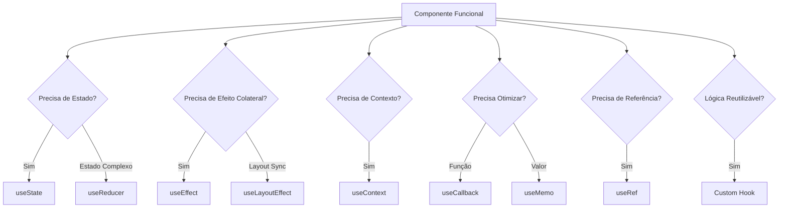

# ⚛️ **React Hooks - Guia Completo**

> **Versão React:** 18+  
> **Última atualização:** Outubro 2024  
> **Nível:** Intermediário a Avançado

---

## 📋 **Índice**

1. [Introdução aos Hooks](#1-introdução-aos-hooks)
2. [useState - Gerenciamento de Estado](#2-usestate---gerenciamento-de-estado)
3. [useEffect - Efeitos Colaterais](#3-useeffect---efeitos-colaterais)
4. [useContext - Compartilhamento de Estado](#4-usecontext---compartilhamento-de-estado)
5. [useReducer - Estado Complexo](#5-usereducer---estado-complexo)
6. [useCallback - Memoização de Funções](#6-usecallback---memoização-de-funções)
7. [useMemo - Memoização de Valores](#7-usememo---memoização-de-valores)
8. [useRef - Referências Mutáveis](#8-useref---referências-mutáveis)
9. [useImperativeHandle - Ref Customizada](#9-useimperativehandle---ref-customizada)
10. [useLayoutEffect - Efeitos Síncronos](#10-uselayouteffect---efeitos-síncronos)
11. [useDebugValue - Debug de Hooks](#11-usedebugvalue---debug-de-hooks)
12. [useId - IDs Únicos](#12-useid---ids-únicos)
13. [Custom Hooks - Criando seus Hooks](#13-custom-hooks---criando-seus-hooks)
14. [Hooks Avançados - Padrões e Práticas](#14-hooks-avançados---padrões-e-práticas)
15. [Performance e Otimização](#15-performance-e-otimização)
16. [Troubleshooting e Erros Comuns](#16-troubleshooting-e-erros-comuns)
17. [Recursos e Referências](#17-recursos-e-referências)

---

## 1. 📚 **Introdução aos Hooks**

### 1.1. O que são Hooks?

**Hooks** são funções especiais que permitem "conectar-se" aos recursos do React (estado, ciclo de vida, contexto, etc.) dentro de **componentes funcionais**.

```jsx
// ❌ ANTES (Class Components)
class Counter extends React.Component {
  constructor(props) {
    super(props);
    this.state = { count: 0 };
  }

  componentDidMount() {
    document.title = `Count: ${this.state.count}`;
  }

  componentDidUpdate() {
    document.title = `Count: ${this.state.count}`;
  }

  render() {
    return (
      <div>
        <p>Count: {this.state.count}</p>
        <button onClick={() => this.setState({ count: this.state.count + 1 })}>
          Incrementar
        </button>
      </div>
    );
  }
}

// ✅ DEPOIS (Hooks)
import { useState, useEffect } from 'react';

function Counter() {
  const [count, setCount] = useState(0);

  useEffect(() => {
    document.title = `Count: ${count}`;
  }, [count]);

  return (
    <div>
      <p>Count: {count}</p>
      <button onClick={() => setCount(count + 1)}>
        Incrementar
      </button>
    </div>
  );
}
```

### 1.2. Por que Hooks?

| **Problema com Classes** | **Solução com Hooks** |
|--------------------------|------------------------|
| Código verboso e complexo | Código conciso e direto |
| Lógica duplicada (componentDidMount + componentDidUpdate) | useEffect unificado |
| `this` confuso | Sem `this` |
| Difícil reutilizar lógica stateful | Custom Hooks |
| Componentes gigantes | Lógica organizada por concern |
| HOC/Render Props aninhados | Composição limpa |

### 1.3. Regras dos Hooks

```jsx
// ═══════════════════════════════════════════════════════════
// 🚫 REGRA 1: Apenas no topo do componente
// ═══════════════════════════════════════════════════════════

// ❌ ERRADO: Hook dentro de condição
function BadComponent({ condition }) {
  if (condition) {
    const [count, setCount] = useState(0);  // ❌ ERRO!
  }
  return <div>Bad</div>;
}

// ✅ CORRETO: Hook no topo
function GoodComponent({ condition }) {
  const [count, setCount] = useState(0);  // ✅ OK
  
  if (condition) {
    // Lógica aqui
  }
  
  return <div>Good</div>;
}

// ═══════════════════════════════════════════════════════════
// 🚫 REGRA 2: Apenas em componentes React ou custom hooks
// ═══════════════════════════════════════════════════════════

// ❌ ERRADO: Hook em função normal
function calculateTotal() {
  const [total, setTotal] = useState(0);  // ❌ ERRO!
  return total;
}

// ✅ CORRETO: Hook em componente
function Calculator() {
  const [total, setTotal] = useState(0);  // ✅ OK
  return <div>{total}</div>;
}

// ✅ CORRETO: Hook em custom hook
function useCalculator() {
  const [total, setTotal] = useState(0);  // ✅ OK
  return [total, setTotal];
}

// ═══════════════════════════════════════════════════════════
// 🚫 REGRA 3: Mesma ordem em toda renderização
// ═══════════════════════════════════════════════════════════

// ❌ ERRADO: Ordem condicional
function BadComponent({ showName }) {
  const [count, setCount] = useState(0);
  
  if (showName) {
    const [name, setName] = useState('');  // ❌ Ordem muda!
  }
  
  const [age, setAge] = useState(0);
  return <div>Bad</div>;
}

// ✅ CORRETO: Ordem sempre a mesma
function GoodComponent({ showName }) {
  const [count, setCount] = useState(0);
  const [name, setName] = useState('');
  const [age, setAge] = useState(0);
  
  return (
    <div>
      {showName && <p>{name}</p>}
    </div>
  );
}
```

### 1.4. Hooks Nativos do React

```jsx
// ═══════════════════════════════════════════════════════════
// HOOKS BÁSICOS (mais usados)
// ═══════════════════════════════════════════════════════════
import {
  useState,      // Estado local
  useEffect,     // Efeitos colaterais
  useContext,    // Context API
} from 'react';

// ═══════════════════════════════════════════════════════════
// HOOKS ADICIONAIS (casos específicos)
// ═══════════════════════════════════════════════════════════
import {
  useReducer,           // Estado complexo (tipo Redux)
  useCallback,          // Memoizar funções
  useMemo,              // Memoizar valores
  useRef,               // Referências mutáveis
  useImperativeHandle,  // Customizar ref
  useLayoutEffect,      // Effect síncrono
  useDebugValue,        // Debug de custom hooks
  useId,                // IDs únicos (React 18+)
  useTransition,        // Transições (React 18+)
  useDeferredValue,     // Valores diferidos (React 18+)
} from 'react';
```

### 1.5. Diagrama de Fluxo



### 1.6. Quando Usar Cada Hook?

| Hook | Quando Usar | Exemplo |
|------|-------------|---------|
| `useState` | Estado simples (primitivos, objetos pequenos) | Counter, toggle, form input |
| `useEffect` | Side effects (fetch, subscription, DOM) | Fetch data, event listeners |
| `useContext` | Compartilhar estado globalmente | Theme, auth, i18n |
| `useReducer` | Estado complexo com lógica | Shopping cart, form wizard |
| `useCallback` | Memoizar função passada como prop | Callbacks em React.memo |
| `useMemo` | Memoizar cálculo caro | Filtragem/ordenação de lista |
| `useRef` | Referência mutável ou acesso DOM | Focus, scroll, timer ID |
| Custom Hook | Reutilizar lógica stateful | useFetch, useLocalStorage |

---

## 2. 🎯 **useState - Gerenciamento de Estado**

### 2.1. Sintaxe Básica

```jsx
import { useState } from 'react';

function Component() {
  // const [estado, setEstado] = useState(valorInicial);
  const [count, setCount] = useState(0);
  
  return (
    <div>
      <p>Count: {count}</p>
      <button onClick={() => setCount(count + 1)}>+</button>
    </div>
  );
}
```

**Anatomia:**
- `count`: Valor atual do estado
- `setCount`: Função para atualizar o estado
- `0`: Valor inicial

### 2.2. Tipos de Estado

#### 2.2.1. Estado Primitivo

```jsx
function PrimitiveStates() {
  // Number
  const [age, setAge] = useState(25);
  
  // String
  const [name, setName] = useState('João');
  
  // Boolean
  const [isOpen, setIsOpen] = useState(false);
  
  // Null/Undefined
  const [data, setData] = useState(null);
  
  return (
    <div>
      <p>Idade: {age}</p>
      <p>Nome: {name}</p>
      <p>Aberto: {isOpen ? 'Sim' : 'Não'}</p>
      <p>Data: {data ?? 'Carregando...'}</p>
      
      <button onClick={() => setAge(age + 1)}>Aumentar idade</button>
      <button onClick={() => setName('Maria')}>Mudar nome</button>
      <button onClick={() => setIsOpen(!isOpen)}>Toggle</button>
      <button onClick={() => setData({ id: 1 })}>Carregar data</button>
    </div>
  );
}
```

#### 2.2.2. Estado de Objeto

```jsx
function ObjectState() {
  const [user, setUser] = useState({
    name: 'João',
    age: 25,
    email: 'joao@example.com'
  });

  // ❌ ERRADO: Mutação direta
  const updateNameWrong = () => {
    user.name = 'Maria';  // ❌ NÃO faz re-render!
    setUser(user);        // ❌ Mesma referência
  };

  // ✅ CORRETO: Novo objeto
  const updateNameCorrect = () => {
    setUser({
      ...user,           // Copia propriedades existentes
      name: 'Maria'      // Sobrescreve name
    });
  };

  // ✅ MELHOR: Função de atualização
  const updateAge = () => {
    setUser(prevUser => ({
      ...prevUser,
      age: prevUser.age + 1
    }));
  };

  return (
    <div>
      <p>Nome: {user.name}</p>
      <p>Idade: {user.age}</p>
      <p>Email: {user.email}</p>
      
      <button onClick={updateNameCorrect}>Mudar Nome</button>
      <button onClick={updateAge}>Aumentar Idade</button>
    </div>
  );
}
```

#### 2.2.3. Estado de Array

```jsx
function ArrayState() {
  const [items, setItems] = useState(['Maçã', 'Banana', 'Laranja']);

  // ──────────────────────────────────────────────────
  // ADICIONAR
  // ──────────────────────────────────────────────────
  
  // No final
  const addItem = (item) => {
    setItems([...items, item]);
  };

  // No início
  const addItemStart = (item) => {
    setItems([item, ...items]);
  };

  // Em posição específica
  const addItemAt = (item, index) => {
    setItems([
      ...items.slice(0, index),
      item,
      ...items.slice(index)
    ]);
  };

  // ──────────────────────────────────────────────────
  // REMOVER
  // ──────────────────────────────────────────────────
  
  // Por índice
  const removeAt = (index) => {
    setItems(items.filter((_, i) => i !== index));
  };

  // Por valor
  const removeItem = (item) => {
    setItems(items.filter(i => i !== item));
  };

  // Primeiro/Último
  const removeFirst = () => setItems(items.slice(1));
  const removeLast = () => setItems(items.slice(0, -1));

  // ──────────────────────────────────────────────────
  // ATUALIZAR
  // ──────────────────────────────────────────────────
  
  const updateAt = (index, newValue) => {
    setItems(items.map((item, i) => 
      i === index ? newValue : item
    ));
  };

  // ──────────────────────────────────────────────────
  // ORDENAR/REVERTER
  // ──────────────────────────────────────────────────
  
  const sortItems = () => {
    setItems([...items].sort());  // Cria cópia antes de ordenar
  };

  const reverseItems = () => {
    setItems([...items].reverse());
  };

  // ──────────────────────────────────────────────────
  // LIMPAR
  // ──────────────────────────────────────────────────
  
  const clearItems = () => {
    setItems([]);
  };

  return (
    <div>
      <ul>
        {items.map((item, index) => (
          <li key={index}>
            {item}
            <button onClick={() => removeAt(index)}>❌</button>
          </li>
        ))}
      </ul>
      
      <button onClick={() => addItem('Uva')}>Adicionar Uva</button>
      <button onClick={sortItems}>Ordenar</button>
      <button onClick={clearItems}>Limpar</button>
    </div>
  );
}
```

### 2.3. Lazy Initialization

```jsx
// ❌ EXECUTADO EM TODA RENDERIZAÇÃO
function BadComponent() {
  const [state, setState] = useState(
    expensiveCalculation()  // ❌ Executa sempre!
  );
  
  return <div>{state}</div>;
}

// ✅ EXECUTADO APENAS UMA VEZ
function GoodComponent() {
  const [state, setState] = useState(() => 
    expensiveCalculation()  // ✅ Executa só no mount
  );
  
  return <div>{state}</div>;
}

// Exemplo prático
function TodoList() {
  // ✅ Lazy: lê localStorage apenas no mount
  const [todos, setTodos] = useState(() => {
    const saved = localStorage.getItem('todos');
    return saved ? JSON.parse(saved) : [];
  });

  return (
    <ul>
      {todos.map(todo => (
        <li key={todo.id}>{todo.text}</li>
      ))}
    </ul>
  );
}
```

### 2.4. Functional Updates

```jsx
function Counter() {
  const [count, setCount] = useState(0);

  // ❌ PROBLEMA: Closure desatualizada
  const incrementThreeTimes = () => {
    setCount(count + 1);  // count = 0 → 1
    setCount(count + 1);  // count = 0 → 1 (mesma closure!)
    setCount(count + 1);  // count = 0 → 1
    // Resultado: count = 1 (esperado: 3)
  };

  // ✅ SOLUÇÃO: Functional update
  const incrementThreeTimesCorrect = () => {
    setCount(prev => prev + 1);  // 0 → 1
    setCount(prev => prev + 1);  // 1 → 2
    setCount(prev => prev + 1);  // 2 → 3
    // Resultado: count = 3 ✅
  };

  return (
    <div>
      <p>Count: {count}</p>
      <button onClick={incrementThreeTimes}>+3 (errado)</button>
      <button onClick={incrementThreeTimesCorrect}>+3 (correto)</button>
    </div>
  );
}
```

### 2.5. Multiple States vs Single Object

```jsx
// ═══════════════════════════════════════════════════════════
// OPÇÃO 1: Múltiplos estados
// ═══════════════════════════════════════════════════════════
function MultipleStates() {
  const [name, setName] = useState('');
  const [age, setAge] = useState(0);
  const [email, setEmail] = useState('');
  
  // ✅ Prós: Simples, atualização independente
  // ❌ Contras: Verboso se muitos campos
  
  return (
    <form>
      <input value={name} onChange={e => setName(e.target.value)} />
      <input value={age} onChange={e => setAge(e.target.value)} />
      <input value={email} onChange={e => setEmail(e.target.value)} />
    </form>
  );
}

// ═══════════════════════════════════════════════════════════
// OPÇÃO 2: Objeto único
// ═══════════════════════════════════════════════════════════
function SingleObjectState() {
  const [form, setForm] = useState({
    name: '',
    age: 0,
    email: ''
  });
  
  // ✅ Prós: Organizado, menos linhas
  // ❌ Contras: Spread necessário, pode causar re-renders extras
  
  const handleChange = (e) => {
    const { name, value } = e.target;
    setForm(prev => ({
      ...prev,
      [name]: value
    }));
  };
  
  return (
    <form>
      <input name="name" value={form.name} onChange={handleChange} />
      <input name="age" value={form.age} onChange={handleChange} />
      <input name="email" value={form.email} onChange={handleChange} />
    </form>
  );
}
```

**Quando usar o quê?**

| Situação | Recomendação |
|----------|--------------|
| 2-3 campos simples | Multiple states |
| Muitos campos (5+) | Single object |
| Campos relacionados (endereço) | Single object |
| Campos independentes | Multiple states |
| Form complexo | useReducer |

### 2.6. Exemplo Completo: Form com Validação

```jsx
import { useState } from 'react';

function RegistrationForm() {
  // ─────────────────────────────────────────────────────
  // STATE
  // ─────────────────────────────────────────────────────
  const [form, setForm] = useState({
    name: '',
    email: '',
    password: '',
    confirmPassword: ''
  });

  const [errors, setErrors] = useState({});
  const [isSubmitting, setIsSubmitting] = useState(false);

  // ─────────────────────────────────────────────────────
  // HANDLERS
  // ─────────────────────────────────────────────────────
  const handleChange = (e) => {
    const { name, value } = e.target;
    
    setForm(prev => ({
      ...prev,
      [name]: value
    }));

    // Limpa erro do campo ao digitar
    if (errors[name]) {
      setErrors(prev => ({
        ...prev,
        [name]: ''
      }));
    }
  };

  const validate = () => {
    const newErrors = {};

    // Nome
    if (!form.name.trim()) {
      newErrors.name = 'Nome é obrigatório';
    } else if (form.name.length < 3) {
      newErrors.name = 'Nome deve ter pelo menos 3 caracteres';
    }

    // Email
    if (!form.email.trim()) {
      newErrors.email = 'Email é obrigatório';
    } else if (!/\S+@\S+\.\S+/.test(form.email)) {
      newErrors.email = 'Email inválido';
    }

    // Password
    if (!form.password) {
      newErrors.password = 'Senha é obrigatória';
    } else if (form.password.length < 6) {
      newErrors.password = 'Senha deve ter pelo menos 6 caracteres';
    }

    // Confirm Password
    if (form.password !== form.confirmPassword) {
      newErrors.confirmPassword = 'Senhas não conferem';
    }

    return newErrors;
  };

  const handleSubmit = (e) => {
    e.preventDefault();

    const newErrors = validate();

    if (Object.keys(newErrors).length > 0) {
      setErrors(newErrors);
      return;
    }

    // Submit
    setIsSubmitting(true);
    
    // Simula API call
    setTimeout(() => {
      console.log('Form submitted:', form);
      alert('Cadastro realizado com sucesso!');
      
      // Reset form
      setForm({
        name: '',
        email: '',
        password: '',
        confirmPassword: ''
      });
      setIsSubmitting(false);
    }, 2000);
  };

  // ─────────────────────────────────────────────────────
  // RENDER
  // ─────────────────────────────────────────────────────
  return (
    <form onSubmit={handleSubmit} className="registration-form">
      <h2>Cadastro</h2>

      {/* NAME */}
      <div className="form-group">
        <label htmlFor="name">Nome</label>
        <input
          id="name"
          name="name"
          type="text"
          value={form.name}
          onChange={handleChange}
          className={errors.name ? 'error' : ''}
        />
        {errors.name && <span className="error-message">{errors.name}</span>}
      </div>

      {/* EMAIL */}
      <div className="form-group">
        <label htmlFor="email">Email</label>
        <input
          id="email"
          name="email"
          type="email"
          value={form.email}
          onChange={handleChange}
          className={errors.email ? 'error' : ''}
        />
        {errors.email && <span className="error-message">{errors.email}</span>}
      </div>

      {/* PASSWORD */}
      <div className="form-group">
        <label htmlFor="password">Senha</label>
        <input
          id="password"
          name="password"
          type="password"
          value={form.password}
          onChange={handleChange}
          className={errors.password ? 'error' : ''}
        />
        {errors.password && <span className="error-message">{errors.password}</span>}
      </div>

      {/* CONFIRM PASSWORD */}
      <div className="form-group">
        <label htmlFor="confirmPassword">Confirmar Senha</label>
        <input
          id="confirmPassword"
          name="confirmPassword"
          type="password"
          value={form.confirmPassword}
          onChange={handleChange}
          className={errors.confirmPassword ? 'error' : ''}
        />
        {errors.confirmPassword && (
          <span className="error-message">{errors.confirmPassword}</span>
        )}
      </div>

      {/* SUBMIT */}
      <button type="submit" disabled={isSubmitting}>
        {isSubmitting ? 'Cadastrando...' : 'Cadastrar'}
      </button>
    </form>
  );
}

export default RegistrationForm;
```

### 2.7. Batching de Updates (React 18+)

```jsx
import { useState } from 'react';

function BatchingExample() {
  const [count, setCount] = useState(0);
  const [flag, setFlag] = useState(false);

  console.log('Renderizou');  // Conta quantas vezes renderiza

  // ═══════════════════════════════════════════════════════════
  // React 17: 2 renderizações
  // React 18: 1 renderização (batching automático)
  // ═══════════════════════════════════════════════════════════
  
  const handleClick = () => {
    setCount(c => c + 1);  // Agendado
    setFlag(f => !f);      // Agendado
    // React 18 agrupa em 1 única renderização! ✅
  };

  // ═══════════════════════════════════════════════════════════
  // MESMO em setTimeout, fetch, etc. (novidade React 18)
  // ═══════════════════════════════════════════════════════════
  
  const handleAsyncClick = () => {
    setTimeout(() => {
      setCount(c => c + 1);  // React 17: renderiza
      setFlag(f => !f);      // React 17: renderiza
      // React 18: 1 renderização ✅
    }, 1000);
  };

  // ═══════════════════════════════════════════════════════════
  // Forçar renderização imediata (raro)
  // ═══════════════════════════════════════════════════════════
  
  const handleFlushSync = () => {
    flushSync(() => {
      setCount(c => c + 1);  // Renderiza imediatamente
    });
    // Código aqui já vê o novo valor no DOM
    setFlag(f => !f);  // Renderiza separadamente
  };

  return (
    <div>
      <p>Count: {count}</p>
      <p>Flag: {flag.toString()}</p>
      <button onClick={handleClick}>Update (batched)</button>
      <button onClick={handleAsyncClick}>Update Async</button>
    </div>
  );
}
```

---

## 3. ⚡ **useEffect - Efeitos Colaterais**

### 3.1. O que é Side Effect?

**Side Effect** (efeito colateral) é qualquer operação que afeta algo **fora do componente** ou que não é relacionada diretamente ao **retorno do JSX**.

```jsx
// ═══════════════════════════════════════════════════════════
// EXEMPLOS DE SIDE EFFECTS
// ═══════════════════════════════════════════════════════════

// 1. Fetch de dados (API)
useEffect(() => {
  fetch('/api/users')
    .then(res => res.json())
    .then(data => setUsers(data));
}, []);

// 2. Manipulação DOM direta
useEffect(() => {
  document.title = `Count: ${count}`;
}, [count]);

// 3. Event listeners
useEffect(() => {
  const handleResize = () => console.log(window.innerWidth);
  window.addEventListener('resize', handleResize);
  return () => window.removeEventListener('resize', handleResize);
}, []);

// 4. Timers/Intervals
useEffect(() => {
  const timer = setTimeout(() => console.log('Hello'), 1000);
  return () => clearTimeout(timer);
}, []);

// 5. Subscriptions (WebSocket, etc.)
useEffect(() => {
  const subscription = someObservable.subscribe(data => setData(data));
  return () => subscription.unsubscribe();
}, []);

// 6. localStorage/sessionStorage
useEffect(() => {
  localStorage.setItem('count', count);
}, [count]);

// 7. Logging/Analytics
useEffect(() => {
  analytics.track('Page Viewed', { page: '/home' });
}, []);
```

### 3.2. Sintaxe e Variações

```jsx
import { useState, useEffect } from 'react';

function EffectVariations() {
  const [count, setCount] = useState(0);

  // ═══════════════════════════════════════════════════════════
  // 1. SEM DEPENDENCIES: Executa após TODA renderização
  // ═══════════════════════════════════════════════════════════
  useEffect(() => {
    console.log('Executou após cada render');
  });  // ⚠️ Raramente usado, cuidado!

  // ═══════════════════════════════════════════════════════════
  // 2. ARRAY VAZIO: Executa APENAS no mount
  // ═══════════════════════════════════════════════════════════
  useEffect(() => {
    console.log('Componente montado (componentDidMount)');
    
    // Cleanup: executa no unmount
    return () => {
      console.log('Componente desmontado (componentWillUnmount)');
    };
  }, []);  // ✅ Mais comum

  // ═══════════════════════════════════════════════════════════
  // 3. COM DEPENDENCIES: Executa quando dependências mudam
  // ═══════════════════════════════════════════════════════════
  useEffect(() => {
    console.log(`Count mudou para: ${count}`);
  }, [count]);  // ✅ Executa quando count muda

  return (
    <div>
      <p>Count: {count}</p>
      <button onClick={() => setCount(count + 1)}>+</button>
    </div>
  );
}
```

### 3.3. Ciclo de Vida com useEffect

```jsx
import { useState, useEffect } from 'react';

function LifecycleExample({ userId }) {
  const [user, setUser] = useState(null);

  // ─────────────────────────────────────────────────────
  // MOUNT: Executado uma vez ao montar
  // ─────────────────────────────────────────────────────
  useEffect(() => {
    console.log('Component MOUNTED');
    
    // Setup inicial
    document.body.classList.add('user-page');
    
    return () => {
      console.log('Component UNMOUNTED');
      document.body.classList.remove('user-page');
    };
  }, []);

  // ─────────────────────────────────────────────────────
  // UPDATE: Executado quando userId muda
  // ─────────────────────────────────────────────────────
  useEffect(() => {
    console.log('userId UPDATED:', userId);
    
    // Fetch novo user
    fetch(`/api/users/${userId}`)
      .then(res => res.json())
      .then(data => setUser(data));
    
    // Cleanup: executado ANTES do próximo effect
    return () => {
      console.log('Limpando fetch anterior');
      // Cancela fetch anterior se necessário
    };
  }, [userId]);

  // ─────────────────────────────────────────────────────
  // TODA RENDERIZAÇÃO
  // ─────────────────────────────────────────────────────
  useEffect(() => {
    console.log('Component RENDERED');
  });

  return <div>{user?.name}</div>;
}
```

**Ordem de Execução:**

```
1. Component monta
2. Render (JSX)
3. DOM atualizado
4. useEffect ([]) executa
5. useEffect ([userId]) executa
6. useEffect (sem deps) executa

--- userId muda ---

7. Cleanup do useEffect ([userId]) anterior
8. Re-render
9. DOM atualizado
10. useEffect ([userId]) executa novamente
11. useEffect (sem deps) executa

--- Component desmonta ---

12. Cleanup do useEffect ([])
13. Cleanup do useEffect ([userId])
```

### 3.4. Cleanup Functions

```jsx
// ═══════════════════════════════════════════════════════════
// 1. EVENT LISTENERS
// ═══════════════════════════════════════════════════════════
function WindowSize() {
  const [size, setSize] = useState({ width: 0, height: 0 });

  useEffect(() => {
    const handleResize = () => {
      setSize({
        width: window.innerWidth,
        height: window.innerHeight
      });
    };

    // Adiciona listener
    window.addEventListener('resize', handleResize);
    handleResize();  // Executa uma vez no mount

    // ✅ CLEANUP: Remove listener
    return () => {
      window.removeEventListener('resize', handleResize);
    };
  }, []);

  return <div>Width: {size.width}px, Height: {size.height}px</div>;
}

// ═══════════════════════════════════════════════════════════
// 2. TIMERS
// ═══════════════════════════════════════════════════════════
function Timer() {
  const [seconds, setSeconds] = useState(0);

  useEffect(() => {
    const interval = setInterval(() => {
      setSeconds(prev => prev + 1);
    }, 1000);

    // ✅ CLEANUP: Limpa interval
    return () => {
      clearInterval(interval);
    };
  }, []);

  return <div>Seconds: {seconds}</div>;
}

// ═══════════════════════════════════════════════════════════
// 3. ABORT FETCH (AbortController)
// ═══════════════════════════════════════════════════════════
function UserProfile({ userId }) {
  const [user, setUser] = useState(null);
  const [error, setError] = useState(null);

  useEffect(() => {
    const controller = new AbortController();
    const signal = controller.signal;

    fetch(`/api/users/${userId}`, { signal })
      .then(res => res.json())
      .then(data => setUser(data))
      .catch(err => {
        if (err.name === 'AbortError') {
          console.log('Fetch aborted');
        } else {
          setError(err);
        }
      });

    // ✅ CLEANUP: Aborta fetch se userId mudar
    return () => {
      controller.abort();
    };
  }, [userId]);

  if (error) return <div>Error: {error.message}</div>;
  if (!user) return <div>Loading...</div>;
  return <div>{user.name}</div>;
}

// ═══════════════════════════════════════════════════════════
// 4. WEBSOCKET
// ═══════════════════════════════════════════════════════════
function ChatRoom({ roomId }) {
  const [messages, setMessages] = useState([]);

  useEffect(() => {
    const ws = new WebSocket(`ws://localhost:3000/chat/${roomId}`);

    ws.onmessage = (event) => {
      const message = JSON.parse(event.data);
      setMessages(prev => [...prev, message]);
    };

    ws.onerror = (error) => {
      console.error('WebSocket error:', error);
    };

    // ✅ CLEANUP: Fecha conexão
    return () => {
      ws.close();
    };
  }, [roomId]);

  return (
    <div>
      {messages.map(msg => (
        <p key={msg.id}>{msg.text}</p>
      ))}
    </div>
  );
}

// ═══════════════════════════════════════════════════════════
// 5. SUBSCRIPTION (RxJS, etc.)
// ═══════════════════════════════════════════════════════════
function DataStream() {
  const [data, setData] = useState(null);

  useEffect(() => {
    const subscription = dataObservable.subscribe({
      next: (value) => setData(value),
      error: (err) => console.error(err),
    });

    // ✅ CLEANUP: Cancela subscription
    return () => {
      subscription.unsubscribe();
    };
  }, []);

  return <div>{data}</div>;
}
```

### 3.5. Dependencies Array - Regras

```jsx
// ═══════════════════════════════════════════════════════════
// ❌ PROBLEMA 1: Dependência faltando
// ═══════════════════════════════════════════════════════════
function BadExample({ userId }) {
  const [user, setUser] = useState(null);

  useEffect(() => {
    fetch(`/api/users/${userId}`)  // ❌ Usa userId mas não está nas deps
      .then(res => res.json())
      .then(data => setUser(data));
  }, []);  // ❌ ESLint vai avisar!

  return <div>{user?.name}</div>;
}

// ✅ CORRETO: Adicione TODAS as dependências
function GoodExample({ userId }) {
  const [user, setUser] = useState(null);

  useEffect(() => {
    fetch(`/api/users/${userId}`)
      .then(res => res.json())
      .then(data => setUser(data));
  }, [userId]);  // ✅ userId incluído

  return <div>{user?.name}</div>;
}

// ═══════════════════════════════════════════════════════════
// ❌ PROBLEMA 2: Dependência desnecessária
// ═══════════════════════════════════════════════════════════
function BadExample2() {
  const [count, setCount] = useState(0);

  useEffect(() => {
    const timer = setInterval(() => {
      setCount(count + 1);  // ❌ Closure obsoleta
    }, 1000);

    return () => clearInterval(timer);
  }, [count]);  // ❌ Recria interval toda vez que count muda!
}

// ✅ CORRETO: Use functional update
function GoodExample2() {
  const [count, setCount] = useState(0);

  useEffect(() => {
    const timer = setInterval(() => {
      setCount(prev => prev + 1);  // ✅ Não depende de count externo
    }, 1000);

    return () => clearInterval(timer);
  }, []);  // ✅ Array vazio

  return <div>{count}</div>;
}

// ═══════════════════════════════════════════════════════════
// ❌ PROBLEMA 3: Objeto/Array como dependência
// ═══════════════════════════════════════════════════════════
function BadExample3() {
  const [data, setData] = useState(null);
  const config = { url: '/api/data' };  // ❌ Novo objeto toda render

  useEffect(() => {
    fetch(config.url)
      .then(res => res.json())
      .then(data => setData(data));
  }, [config]);  // ❌ Loop infinito! config é sempre "diferente"
}

// ✅ SOLUÇÃO 1: Mova para dentro do effect
function GoodExample3() {
  const [data, setData] = useState(null);

  useEffect(() => {
    const config = { url: '/api/data' };  // ✅ Dentro do effect
    
    fetch(config.url)
      .then(res => res.json())
      .then(data => setData(data));
  }, []);  // ✅ Sem dependências
}

// ✅ SOLUÇÃO 2: useMemo
function GoodExample3b() {
  const [data, setData] = useState(null);
  
  const config = useMemo(() => ({ 
    url: '/api/data' 
  }), []);  // ✅ Memoizado

  useEffect(() => {
    fetch(config.url)
      .then(res => res.json())
      .then(data => setData(data));
  }, [config]);  // ✅ config estável
}

// ✅ SOLUÇÃO 3: Extraia apenas o primitivo
function GoodExample3c() {
  const [data, setData] = useState(null);
  const config = { url: '/api/data' };

  useEffect(() => {
    fetch(config.url)
      .then(res => res.json())
      .then(data => setData(data));
  }, [config.url]);  // ✅ Depende apenas da string
}
```

**Regras de Ouro:**

| Tipo | Pode ser dependência? | Observação |
|------|----------------------|------------|
| Primitivo (string, number, boolean) | ✅ Sim | Comparação por valor |
| Objeto `{}` | ⚠️ Evite | Nova referência toda render |
| Array `[]` | ⚠️ Evite | Nova referência toda render |
| Função | ⚠️ Evite | Use useCallback |
| Props | ✅ Sim | Primitivos OK, objetos cuidado |
| State | ✅ Sim | Usa functional update se possível |
| Ref (`.current`) | ❌ Não | Ref não dispara re-render |

### 3.6. Padrões Comuns de useEffect

#### 3.6.1. Data Fetching

```jsx
function UserList() {
  const [users, setUsers] = useState([]);
  const [loading, setLoading] = useState(true);
  const [error, setError] = useState(null);

  useEffect(() => {
    const fetchUsers = async () => {
      try {
        setLoading(true);
        setError(null);
        
        const response = await fetch('/api/users');
        
        if (!response.ok) {
          throw new Error(`HTTP error! status: ${response.status}`);
        }
        
        const data = await response.json();
        setUsers(data);
      } catch (err) {
        setError(err.message);
      } finally {
        setLoading(false);
      }
    };

    fetchUsers();
  }, []);

  if (loading) return <div>Carregando...</div>;
  if (error) return <div>Erro: {error}</div>;
  
  return (
    <ul>
      {users.map(user => (
        <li key={user.id}>{user.name}</li>
      ))}
    </ul>
  );
}
```

#### 3.6.2. LocalStorage Sync

```jsx
function useLocalStorage(key, initialValue) {
  const [value, setValue] = useState(() => {
    const saved = localStorage.getItem(key);
    return saved ? JSON.parse(saved) : initialValue;
  });

  useEffect(() => {
    localStorage.setItem(key, JSON.stringify(value));
  }, [key, value]);

  return [value, setValue];
}

// Uso
function Counter() {
  const [count, setCount] = useLocalStorage('count', 0);

  return (
    <div>
      <p>Count: {count}</p>
      <button onClick={() => setCount(count + 1)}>+</button>
    </div>
  );
}
```

#### 3.6.3. Document Title

```jsx
function useDocumentTitle(title) {
  useEffect(() => {
    const prevTitle = document.title;
    document.title = title;

    return () => {
      document.title = prevTitle;  // Restaura ao desmontar
    };
  }, [title]);
}

// Uso
function ProductPage({ product }) {
  useDocumentTitle(`${product.name} - Minha Loja`);

  return <div>{product.name}</div>;
}
```

#### 3.6.4. Debounce (com useEffect)

```jsx
function SearchInput() {
  const [searchTerm, setSearchTerm] = useState('');
  const [results, setResults] = useState([]);

  useEffect(() => {
    // Debounce: só faz fetch após 500ms sem digitar
    const timer = setTimeout(() => {
      if (searchTerm) {
        fetch(`/api/search?q=${searchTerm}`)
          .then(res => res.json())
          .then(data => setResults(data));
      } else {
        setResults([]);
      }
    }, 500);

    return () => clearTimeout(timer);  // Cancela timer anterior
  }, [searchTerm]);

  return (
    <div>
      <input
        value={searchTerm}
        onChange={e => setSearchTerm(e.target.value)}
        placeholder="Buscar..."
      />
      <ul>
        {results.map(item => (
          <li key={item.id}>{item.name}</li>
        ))}
      </ul>
    </div>
  );
}
```

#### 3.6.5. Intersection Observer

```jsx
function LazyImage({ src, alt }) {
  const [isVisible, setIsVisible] = useState(false);
  const imgRef = useRef();

  useEffect(() => {
    const observer = new IntersectionObserver(
      ([entry]) => {
        if (entry.isIntersecting) {
          setIsVisible(true);
          observer.disconnect();  // Para de observar após carregar
        }
      },
      { threshold: 0.1 }
    );

    if (imgRef.current) {
      observer.observe(imgRef.current);
    }

    return () => {
      observer.disconnect();
    };
  }, []);

  return (
    <div ref={imgRef}>
      {isVisible ? (
        
      ) : (
        <div className="placeholder">Carregando...</div>
      )}
    </div>
  );
}
```

### 3.7. useEffect vs useLayoutEffect

```jsx
// ═══════════════════════════════════════════════════════════
// useEffect: Assíncrono (após pintar na tela)
// ═══════════════════════════════════════════════════════════
function UseEffectExample() {
  const [value, setValue] = useState(0);

  useEffect(() => {
    // Executa DEPOIS de pintar
    if (value === 0) {
      setValue(10 + Math.random() * 200);
    }
  }, [value]);

  console.log('render', value);

  return <div>Value: {value}</div>;
  
  // Sequência:
  // 1. Render com value=0
  // 2. Pinta "Value: 0" na tela
  // 3. useEffect executa
  // 4. setValue dispara re-render
  // 5. Pinta "Value: 127" na tela
  // ⚠️ USUÁRIO VÊ "0" por alguns milissegundos (flicker)
}

// ═══════════════════════════════════════════════════════════
// useLayoutEffect: Síncrono (antes de pintar)
// ═══════════════════════════════════════════════════════════
function UseLayoutEffectExample() {
  const [value, setValue] = useState(0);

  useLayoutEffect(() => {
    // Executa ANTES de pintar
    if (value === 0) {
      setValue(10 + Math.random() * 200);
    }
  }, [value]);

  console.log('render', value);

  return <div>Value: {value}</div>;
  
  // Sequência:
  // 1. Render com value=0
  // 2. useLayoutEffect executa (ANTES de pintar)
  // 3. setValue dispara re-render
  // 4. Render com value=127
  // 5. Pinta "Value: 127" na tela
  // ✅ USUÁRIO NÃO VÊ "0" (sem flicker)
}
```

**Quando usar cada um?**

| Situação | Hook |
|----------|------|
| Fetch de dados | `useEffect` |
| Event listeners | `useEffect` |
| Subscriptions | `useEffect` |
| Timers | `useEffect` |
| **Medição DOM** | `useLayoutEffect` |
| **Animações** | `useLayoutEffect` |
| **Scroll position** | `useLayoutEffect` |
| **Tooltip position** | `useLayoutEffect` |

⚠️ **Regra geral:** Use `useEffect` por padrão. Só use `useLayoutEffect` se tiver **flicker visual**.

---

## 4. 🌐 **useContext - Compartilhamento de Estado**

### 4.1. O Problema: Prop Drilling

```jsx
// ❌ PROP DRILLING: Passar props por muitos níveis
function App() {
  const [user, setUser] = useState({ name: 'João', age: 25 });

  return <Dashboard user={user} />;
}

function Dashboard({ user }) {
  return <Sidebar user={user} />;  // Só passa adiante
}

function Sidebar({ user }) {
  return <UserMenu user={user} />;  // Só passa adiante
}

function UserMenu({ user }) {
  return <UserProfile user={user} />;  // Só passa adiante
}

function UserProfile({ user }) {
  return <p>{user.name}</p>;  // Finalmente usa!
}

// 😫 user passou por 4 componentes que nem usam ele!
```

### 4.2. A Solução: Context API

```jsx
import { createContext, useContext, useState } from 'react';

// ─────────────────────────────────────────────────────
// 1. CRIAR CONTEXT
// ─────────────────────────────────────────────────────
const UserContext = createContext();

// ─────────────────────────────────────────────────────
// 2. PROVIDER (fornece o valor)
// ─────────────────────────────────────────────────────
function App() {
  const [user, setUser] = useState({ name: 'João', age: 25 });

  return (
    <UserContext.Provider value={{ user, setUser }}>
      <Dashboard />
    </UserContext.Provider>
  );
}

// ─────────────────────────────────────────────────────
// 3. CONSUMER (consome o valor)
// ─────────────────────────────────────────────────────
function Dashboard() {
  return <Sidebar />;  // Não precisa receber user!
}

function Sidebar() {
  return <UserMenu />;  // Não precisa receber user!
}

function UserMenu() {
  return <UserProfile />;  // Não precisa receber user!
}

function UserProfile() {
  const { user, setUser } = useContext(UserContext);  // ✅ Acessa direto!

  return (
    <div>
      <p>{user.name}</p>
      <button onClick={() => setUser({ ...user, age: user.age + 1 })}>
        Fazer aniversário
      </button>
    </div>
  );
}
```

### 4.3. Padrão: Context + Custom Hook

```jsx
import { createContext, useContext, useState } from 'react';

// ─────────────────────────────────────────────────────
// 1. CRIAR CONTEXT
// ─────────────────────────────────────────────────────
const ThemeContext = createContext();

// ─────────────────────────────────────────────────────
// 2. CUSTOM HOOK (facilita uso)
// ─────────────────────────────────────────────────────
export function useTheme() {
  const context = useContext(ThemeContext);
  
  if (!context) {
    throw new Error('useTheme deve ser usado dentro de ThemeProvider');
  }
  
  return context;
}

// ─────────────────────────────────────────────────────
// 3. PROVIDER COMPONENT
// ─────────────────────────────────────────────────────
export function ThemeProvider({ children }) {
  const [theme, setTheme] = useState('light');

  const toggleTheme = () => {
    setTheme(prev => prev === 'light' ? 'dark' : 'light');
  };

  const value = {
    theme,
    toggleTheme
  };

  return (
    <ThemeContext.Provider value={value}>
      {children}
    </ThemeContext.Provider>
  );
}

// ─────────────────────────────────────────────────────
// 4. USO
// ─────────────────────────────────────────────────────

// Em App.jsx
function App() {
  return (
    <ThemeProvider>
      <Header />
      <Main />
    </ThemeProvider>
  );
}

// Em qualquer componente
function Header() {
  const { theme, toggleTheme } = useTheme();  // ✅ Simples!

  return (
    <header className={theme}>
      <button onClick={toggleTheme}>
        Mudar para {theme === 'light' ? 'dark' : 'light'}
      </button>
    </header>
  );
}
```

### 4.4. Múltiplos Contexts

```jsx
import { createContext, useContext, useState } from 'react';

// ═══════════════════════════════════════════════════════════
// AUTH CONTEXT
// ═══════════════════════════════════════════════════════════
const AuthContext = createContext();

export function useAuth() {
  return useContext(AuthContext);
}

export function AuthProvider({ children }) {
  const [user, setUser] = useState(null);

  const login = (email, password) => {
    // Lógica de login
    setUser({ email, name: 'João' });
  };

  const logout = () => {
    setUser(null);
  };

  return (
    <AuthContext.Provider value={{ user, login, logout }}>
      {children}
    </AuthContext.Provider>
  );
}

// ═══════════════════════════════════════════════════════════
// THEME CONTEXT
// ═══════════════════════════════════════════════════════════
const ThemeContext = createContext();

export function useTheme() {
  return useContext(ThemeContext);
}

export function ThemeProvider({ children }) {
  const [theme, setTheme] = useState('light');

  const toggleTheme = () => {
    setTheme(prev => prev === 'light' ? 'dark' : 'light');
  };

  return (
    <ThemeContext.Provider value={{ theme, toggleTheme }}>
      {children}
    </ThemeContext.Provider>
  );
}

// ═══════════════════════════════════════════════════════════
// APP (combina providers)
// ═══════════════════════════════════════════════════════════
function App() {
  return (
    <AuthProvider>
      <ThemeProvider>
        <Dashboard />
      </ThemeProvider>
    </AuthProvider>
  );
}

// OU com componente combiner
function AppProviders({ children }) {
  return (
    <AuthProvider>
      <ThemeProvider>
        {children}
      </ThemeProvider>
    </AuthProvider>
  );
}

function App() {
  return (
    <AppProviders>
      <Dashboard />
    </AppProviders>
  );
}

// ═══════════════════════════════════════════════════════════
// USO (componente pode usar múltiplos contexts)
// ═══════════════════════════════════════════════════════════
function Dashboard() {
  const { user, logout } = useAuth();
  const { theme, toggleTheme } = useTheme();

  return (
    <div className={theme}>
      <p>Bem-vindo, {user?.name}</p>
      <button onClick={logout}>Sair</button>
      <button onClick={toggleTheme}>Mudar tema</button>
    </div>
  );
}
```

### 4.5. Context com useReducer (Pattern Avançado)

```jsx
import { createContext, useContext, useReducer } from 'react';

// ─────────────────────────────────────────────────────
// ACTIONS
// ─────────────────────────────────────────────────────
const ACTIONS = {
  ADD_TODO: 'ADD_TODO',
  TOGGLE_TODO: 'TOGGLE_TODO',
  DELETE_TODO: 'DELETE_TODO'
};

// ─────────────────────────────────────────────────────
// REDUCER
// ─────────────────────────────────────────────────────
function todosReducer(state, action) {
  switch (action.type) {
    case ACTIONS.ADD_TODO:
      return [...state, {
        id: Date.now(),
        text: action.payload,
        completed: false
      }];
    
    case ACTIONS.TOGGLE_TODO:
      return state.map(todo =>
        todo.id === action.payload
          ? { ...todo, completed: !todo.completed }
          : todo
      );
    
    case ACTIONS.DELETE_TODO:
      return state.filter(todo => todo.id !== action.payload);
    
    default:
      return state;
  }
}

// ─────────────────────────────────────────────────────
// CONTEXT
// ─────────────────────────────────────────────────────
const TodoContext = createContext();

export function useTodos() {
  const context = useContext(TodoContext);
  if (!context) {
    throw new Error('useTodos deve ser usado dentro de TodoProvider');
  }
  return context;
}

// ─────────────────────────────────────────────────────
// PROVIDER
// ─────────────────────────────────────────────────────
export function TodoProvider({ children }) {
  const [todos, dispatch] = useReducer(todosReducer, []);

  const addTodo = (text) => {
    dispatch({ type: ACTIONS.ADD_TODO, payload: text });
  };

  const toggleTodo = (id) => {
    dispatch({ type: ACTIONS.TOGGLE_TODO, payload: id });
  };

  const deleteTodo = (id) => {
    dispatch({ type: ACTIONS.DELETE_TODO, payload: id });
  };

  const value = {
    todos,
    addTodo,
    toggleTodo,
    deleteTodo
  };

  return (
    <TodoContext.Provider value={value}>
      {children}
    </TodoContext.Provider>
  );
}

// ─────────────────────────────────────────────────────
// USO
// ─────────────────────────────────────────────────────
function App() {
  return (
    <TodoProvider>
      <TodoList />
      <AddTodo />
    </TodoProvider>
  );
}

function TodoList() {
  const { todos, toggleTodo, deleteTodo } = useTodos();

  return (
    <ul>
      {todos.map(todo => (
        <li key={todo.id}>
          <input
            type="checkbox"
            checked={todo.completed}
            onChange={() => toggleTodo(todo.id)}
          />
          <span>{todo.text}</span>
          <button onClick={() => deleteTodo(todo.id)}>❌</button>
        </li>
      ))}
    </ul>
  );
}

function AddTodo() {
  const { addTodo } = useTodos();
  const [input, setInput] = useState('');

  const handleSubmit = (e) => {
    e.preventDefault();
    if (input.trim()) {
      addTodo(input);
      setInput('');
    }
  };

  return (
    <form onSubmit={handleSubmit}>
      <input
        value={input}
        onChange={e => setInput(e.target.value)}
      />
      <button type="submit">Adicionar</button>
    </form>
  );
}
```

### 4.6. Performance: Otimizando Context

```jsx
// ❌ PROBLEMA: Re-renders desnecessários
function BadProvider({ children }) {
  const [user, setUser] = useState(null);
  const [theme, setTheme] = useState('light');

  // ❌ Novo objeto toda render!
  const value = {
    user,
    setUser,
    theme,
    setTheme
  };

  return (
    <Context.Provider value={value}>
      {children}
    </Context.Provider>
  );
  
  // Todos os componentes que usam Context re-renderizam
  // mesmo que só theme tenha mudado!
}

// ✅ SOLUÇÃO 1: useMemo
function GoodProvider({ children }) {
  const [user, setUser] = useState(null);
  const [theme, setTheme] = useState('light');

  const value = useMemo(() => ({
    user,
    setUser,
    theme,
    setTheme
  }), [user, theme]);  // ✅ Só cria novo objeto se mudar

  return (
    <Context.Provider value={value}>
      {children}
    </Context.Provider>
  );
}

// ✅ SOLUÇÃO 2: Separar contexts
const UserContext = createContext();
const ThemeContext = createContext();

function BetterProvider({ children }) {
  const [user, setUser] = useState(null);
  const [theme, setTheme] = useState('light');

  return (
    <UserContext.Provider value={{ user, setUser }}>
      <ThemeContext.Provider value={{ theme, setTheme }}>
        {children}
      </ThemeContext.Provider>
    </UserContext.Provider>
  );
}

// Componente que só precisa de theme não re-renderiza quando user muda!
function ThemeButton() {
  const { theme, setTheme } = useContext(ThemeContext);
  // ...
}
```

---

## 5. 🔄 **useReducer - Estado Complexo**

### 5.1. O que é useReducer?

**useReducer** é uma alternativa ao useState para **gerenciar estado complexo** com lógica de atualização.

```jsx
// ═══════════════════════════════════════════════════════════
// useState: Estado simples
// ═══════════════════════════════════════════════════════════
const [count, setCount] = useState(0);
setCount(count + 1);

// ═══════════════════════════════════════════════════════════
// useReducer: Estado complexo com lógica
// ═══════════════════════════════════════════════════════════
const [state, dispatch] = useReducer(reducer, initialState);
dispatch({ type: 'INCREMENT' });
```

**Analogia:** useReducer é como useState + Redux (mas local ao componente).

### 5.2. Sintaxe Básica

```jsx
import { useReducer } from 'react';

// ─────────────────────────────────────────────────────
// 1. REDUCER FUNCTION
// ─────────────────────────────────────────────────────
function counterReducer(state, action) {
  switch (action.type) {
    case 'INCREMENT':
      return { count: state.count + 1 };
    case 'DECREMENT':
      return { count: state.count - 1 };
    case 'RESET':
      return { count: 0 };
    default:
      throw new Error(`Ação desconhecida: ${action.type}`);
  }
}

// ─────────────────────────────────────────────────────
// 2. COMPONENT
// ─────────────────────────────────────────────────────
function Counter() {
  const [state, dispatch] = useReducer(counterReducer, { count: 0 });

  return (
    <div>
      <p>Count: {state.count}</p>
      <button onClick={() => dispatch({ type: 'INCREMENT' })}>+</button>
      <button onClick={() => dispatch({ type: 'DECREMENT' })}>-</button>
      <button onClick={() => dispatch({ type: 'RESET' })}>Reset</button>
    </div>
  );
}
```

**Anatomia:**
- `counterReducer`: Função que recebe (state, action) e retorna novo state
- `{ count: 0 }`: Estado inicial
- `state`: Estado atual
- `dispatch`: Função para disparar ações

### 5.3. useState vs useReducer

| **Situação** | **useState** | **useReducer** |
|--------------|--------------|----------------|
| Estado simples (primitivo) | ✅ Preferível | ❌ Overkill |
| Estado complexo (objeto com muitas propriedades) | ⚠️ OK | ✅ Melhor |
| Múltiplas atualizações relacionadas | ⚠️ Complicado | ✅ Ideal |
| Lógica de atualização complexa | ❌ Fica confuso | ✅ Organizado |
| Próximo estado depende do anterior | ⚠️ Use functional update | ✅ Natural |
| Estado compartilhado (Context) | ⚠️ OK | ✅ Excelente |
| Testes | ✅ Fácil | ✅ Muito fácil (reducer puro) |

```jsx
// ═══════════════════════════════════════════════════════════
// EXEMPLO: Formulário complexo
// ═══════════════════════════════════════════════════════════

// ❌ COM useState: Verboso e repetitivo
function FormWithState() {
  const [name, setName] = useState('');
  const [email, setEmail] = useState('');
  const [password, setPassword] = useState('');
  const [errors, setErrors] = useState({});
  const [isSubmitting, setIsSubmitting] = useState(false);

  const handleNameChange = (e) => setName(e.target.value);
  const handleEmailChange = (e) => setEmail(e.target.value);
  const handlePasswordChange = (e) => setPassword(e.target.value);

  const handleSubmit = () => {
    setIsSubmitting(true);
    // ... validação ...
    setErrors({ name: 'Nome inválido' });
    setIsSubmitting(false);
  };

  // ... JSX ...
}

// ✅ COM useReducer: Organizado e escalável
function FormWithReducer() {
  const [state, dispatch] = useReducer(formReducer, {
    values: { name: '', email: '', password: '' },
    errors: {},
    isSubmitting: false
  });

  const handleChange = (e) => {
    dispatch({
      type: 'FIELD_CHANGE',
      field: e.target.name,
      value: e.target.value
    });
  };

  const handleSubmit = () => {
    dispatch({ type: 'SUBMIT_START' });
    // ... validação ...
    dispatch({
      type: 'SUBMIT_ERROR',
      errors: { name: 'Nome inválido' }
    });
  };

  // ... JSX ...
}

function formReducer(state, action) {
  switch (action.type) {
    case 'FIELD_CHANGE':
      return {
        ...state,
        values: {
          ...state.values,
          [action.field]: action.value
        },
        errors: {
          ...state.errors,
          [action.field]: ''  // Limpa erro
        }
      };
    
    case 'SUBMIT_START':
      return {
        ...state,
        isSubmitting: true,
        errors: {}
      };
    
    case 'SUBMIT_ERROR':
      return {
        ...state,
        isSubmitting: false,
        errors: action.errors
      };
    
    case 'SUBMIT_SUCCESS':
      return {
        values: { name: '', email: '', password: '' },
        errors: {},
        isSubmitting: false
      };
    
    default:
      return state;
  }
}
```

### 5.4. Padrões de useReducer

#### 5.4.1. Actions com Payload

```jsx
// ─────────────────────────────────────────────────────
// REDUCER
// ─────────────────────────────────────────────────────
function todoReducer(state, action) {
  switch (action.type) {
    case 'ADD_TODO':
      return [...state, {
        id: Date.now(),
        text: action.payload.text,      // ✅ Payload
        completed: false
      }];
    
    case 'TOGGLE_TODO':
      return state.map(todo =>
        todo.id === action.payload.id   // ✅ Payload
          ? { ...todo, completed: !todo.completed }
          : todo
      );
    
    case 'DELETE_TODO':
      return state.filter(todo => todo.id !== action.payload.id);
    
    case 'UPDATE_TODO':
      return state.map(todo =>
        todo.id === action.payload.id
          ? { ...todo, text: action.payload.text }
          : todo
      );
    
    default:
      return state;
  }
}

// ─────────────────────────────────────────────────────
// USO
// ─────────────────────────────────────────────────────
function TodoList() {
  const [todos, dispatch] = useReducer(todoReducer, []);

  const addTodo = (text) => {
    dispatch({
      type: 'ADD_TODO',
      payload: { text }
    });
  };

  const toggleTodo = (id) => {
    dispatch({
      type: 'TOGGLE_TODO',
      payload: { id }
    });
  };

  const deleteTodo = (id) => {
    dispatch({
      type: 'DELETE_TODO',
      payload: { id }
    });
  };

  const updateTodo = (id, text) => {
    dispatch({
      type: 'UPDATE_TODO',
      payload: { id, text }
    });
  };

  return (
    <div>
      <button onClick={() => addTodo('Nova tarefa')}>
        Adicionar
      </button>
      <ul>
        {todos.map(todo => (
          <li key={todo.id}>
            <input
              type="checkbox"
              checked={todo.completed}
              onChange={() => toggleTodo(todo.id)}
            />
            <span>{todo.text}</span>
            <button onClick={() => deleteTodo(todo.id)}>❌</button>
          </li>
        ))}
      </ul>
    </div>
  );
}
```

#### 5.4.2. Action Creators (Pattern Avançado)

```jsx
// ─────────────────────────────────────────────────────
// ACTION TYPES (constantes)
// ─────────────────────────────────────────────────────
const ACTIONS = {
  ADD_TODO: 'ADD_TODO',
  TOGGLE_TODO: 'TOGGLE_TODO',
  DELETE_TODO: 'DELETE_TODO',
  SET_FILTER: 'SET_FILTER'
};

// ─────────────────────────────────────────────────────
// ACTION CREATORS (funções que criam actions)
// ─────────────────────────────────────────────────────
const actionCreators = {
  addTodo: (text) => ({
    type: ACTIONS.ADD_TODO,
    payload: { text }
  }),
  
  toggleTodo: (id) => ({
    type: ACTIONS.TOGGLE_TODO,
    payload: { id }
  }),
  
  deleteTodo: (id) => ({
    type: ACTIONS.DELETE_TODO,
    payload: { id }
  }),
  
  setFilter: (filter) => ({
    type: ACTIONS.SET_FILTER,
    payload: { filter }
  })
};

// ─────────────────────────────────────────────────────
// REDUCER
// ─────────────────────────────────────────────────────
function todoReducer(state, action) {
  switch (action.type) {
    case ACTIONS.ADD_TODO:
      return {
        ...state,
        todos: [...state.todos, {
          id: Date.now(),
          text: action.payload.text,
          completed: false
        }]
      };
    
    case ACTIONS.TOGGLE_TODO:
      return {
        ...state,
        todos: state.todos.map(todo =>
          todo.id === action.payload.id
            ? { ...todo, completed: !todo.completed }
            : todo
        )
      };
    
    case ACTIONS.DELETE_TODO:
      return {
        ...state,
        todos: state.todos.filter(todo => todo.id !== action.payload.id)
      };
    
    case ACTIONS.SET_FILTER:
      return {
        ...state,
        filter: action.payload.filter
      };
    
    default:
      return state;
  }
}

// ─────────────────────────────────────────────────────
// COMPONENTE
// ─────────────────────────────────────────────────────
function TodoApp() {
  const [state, dispatch] = useReducer(todoReducer, {
    todos: [],
    filter: 'all'
  });

  // ✅ Uso limpo e legível
  return (
    <div>
      <button onClick={() => dispatch(actionCreators.addTodo('Nova'))}>
        Adicionar
      </button>
      <button onClick={() => dispatch(actionCreators.setFilter('active'))}>
        Mostrar ativas
      </button>
      {/* ... */}
    </div>
  );
}
```

#### 5.4.3. Lazy Initialization

```jsx
// ─────────────────────────────────────────────────────
// INIT FUNCTION (executa apenas no mount)
// ─────────────────────────────────────────────────────
function init(initialCount) {
  console.log('Init executado');
  return {
    count: initialCount,
    history: [initialCount]
  };
}

function Counter({ initialCount = 0 }) {
  // useReducer(reducer, initialArg, init)
  const [state, dispatch] = useReducer(reducer, initialCount, init);
  //                                           ↑            ↑
  //                                    passado p/ init   função init

  return <div>Count: {state.count}</div>;
}

// Exemplo prático: Carregar de localStorage
function initFromStorage() {
  const saved = localStorage.getItem('todos');
  return saved ? JSON.parse(saved) : [];
}

function TodoList() {
  const [todos, dispatch] = useReducer(todoReducer, null, initFromStorage);
  
  // todos já vem do localStorage!
  return (/* ... */);
}
```

### 5.5. Exemplo Completo: Shopping Cart

```jsx
import { useReducer } from 'react';

// ═══════════════════════════════════════════════════════════
// ACTION TYPES
// ═══════════════════════════════════════════════════════════
const CART_ACTIONS = {
  ADD_ITEM: 'ADD_ITEM',
  REMOVE_ITEM: 'REMOVE_ITEM',
  UPDATE_QUANTITY: 'UPDATE_QUANTITY',
  CLEAR_CART: 'CLEAR_CART',
  APPLY_DISCOUNT: 'APPLY_DISCOUNT'
};

// ═══════════════════════════════════════════════════════════
// REDUCER
// ═══════════════════════════════════════════════════════════
function cartReducer(state, action) {
  switch (action.type) {
    case CART_ACTIONS.ADD_ITEM: {
      const existingItem = state.items.find(
        item => item.id === action.payload.id
      );

      if (existingItem) {
        // Item já existe: aumenta quantidade
        return {
          ...state,
          items: state.items.map(item =>
            item.id === action.payload.id
              ? { ...item, quantity: item.quantity + 1 }
              : item
          )
        };
      } else {
        // Novo item
        return {
          ...state,
          items: [...state.items, { ...action.payload, quantity: 1 }]
        };
      }
    }

    case CART_ACTIONS.REMOVE_ITEM:
      return {
        ...state,
        items: state.items.filter(item => item.id !== action.payload.id)
      };

    case CART_ACTIONS.UPDATE_QUANTITY:
      return {
        ...state,
        items: state.items.map(item =>
          item.id === action.payload.id
            ? { ...item, quantity: action.payload.quantity }
            : item
        ).filter(item => item.quantity > 0)  // Remove se qty = 0
      };

    case CART_ACTIONS.CLEAR_CART:
      return {
        ...state,
        items: []
      };

    case CART_ACTIONS.APPLY_DISCOUNT:
      return {
        ...state,
        discount: action.payload.discount
      };

    default:
      return state;
  }
}

// ═══════════════════════════════════════════════════════════
// INITIAL STATE
// ═══════════════════════════════════════════════════════════
const initialState = {
  items: [],
  discount: 0
};

// ═══════════════════════════════════════════════════════════
// COMPONENT
// ═══════════════════════════════════════════════════════════
function ShoppingCart() {
  const [state, dispatch] = useReducer(cartReducer, initialState);

  // ─────────────────────────────────────────────────────
  // DERIVED STATE (calculado)
  // ─────────────────────────────────────────────────────
  const subtotal = state.items.reduce(
    (sum, item) => sum + item.price * item.quantity,
    0
  );

  const discountAmount = subtotal * (state.discount / 100);
  const total = subtotal - discountAmount;

  // ─────────────────────────────────────────────────────
  // HANDLERS
  // ─────────────────────────────────────────────────────
  const addItem = (product) => {
    dispatch({
      type: CART_ACTIONS.ADD_ITEM,
      payload: product
    });
  };

  const removeItem = (id) => {
    dispatch({
      type: CART_ACTIONS.REMOVE_ITEM,
      payload: { id }
    });
  };

  const updateQuantity = (id, quantity) => {
    dispatch({
      type: CART_ACTIONS.UPDATE_QUANTITY,
      payload: { id, quantity }
    });
  };

  const clearCart = () => {
    dispatch({ type: CART_ACTIONS.CLEAR_CART });
  };

  const applyDiscount = (discount) => {
    dispatch({
      type: CART_ACTIONS.APPLY_DISCOUNT,
      payload: { discount }
    });
  };

  // ─────────────────────────────────────────────────────
  // RENDER
  // ─────────────────────────────────────────────────────
  return (
    <div className="shopping-cart">
      <h2>Carrinho de Compras</h2>

      {state.items.length === 0 ? (
        <p>Carrinho vazio</p>
      ) : (
        <>
          <ul className="cart-items">
            {state.items.map(item => (
              <li key={item.id}>
                <span>{item.name}</span>
                <span>R$ {item.price.toFixed(2)}</span>
                <input
                  type="number"
                  min="0"
                  value={item.quantity}
                  onChange={(e) =>
                    updateQuantity(item.id, parseInt(e.target.value))
                  }
                />
                <span>R$ {(item.price * item.quantity).toFixed(2)}</span>
                <button onClick={() => removeItem(item.id)}>❌</button>
              </li>
            ))}
          </ul>

          <div className="cart-summary">
            <p>Subtotal: R$ {subtotal.toFixed(2)}</p>
            
            {state.discount > 0 && (
              <p className="discount">
                Desconto ({state.discount}%): -R$ {discountAmount.toFixed(2)}
              </p>
            )}
            
            <h3>Total: R$ {total.toFixed(2)}</h3>

            <div className="cart-actions">
              <button onClick={() => applyDiscount(10)}>
                Aplicar 10% desconto
              </button>
              <button onClick={clearCart}>Limpar carrinho</button>
              <button className="checkout">Finalizar compra</button>
            </div>
          </div>
        </>
      )}

      {/* Produtos para teste */}
      <div className="products">
        <h3>Produtos</h3>
        <button onClick={() => addItem({ id: 1, name: 'Produto A', price: 50 })}>
          Adicionar Produto A (R$ 50)
        </button>
        <button onClick={() => addItem({ id: 2, name: 'Produto B', price: 75 })}>
          Adicionar Produto B (R$ 75)
        </button>
        <button onClick={() => addItem({ id: 3, name: 'Produto C', price: 100 })}>
          Adicionar Produto C (R$ 100)
        </button>
      </div>
    </div>
  );
}

export default ShoppingCart;
```

### 5.6. useReducer com TypeScript

```typescript
// ═══════════════════════════════════════════════════════════
// TYPES
// ═══════════════════════════════════════════════════════════
type Todo = {
  id: number;
  text: string;
  completed: boolean;
};

type State = {
  todos: Todo[];
  filter: 'all' | 'active' | 'completed';
};

type Action =
  | { type: 'ADD_TODO'; payload: { text: string } }
  | { type: 'TOGGLE_TODO'; payload: { id: number } }
  | { type: 'DELETE_TODO'; payload: { id: number } }
  | { type: 'SET_FILTER'; payload: { filter: State['filter'] } };

// ═══════════════════════════════════════════════════════════
// REDUCER (type-safe!)
// ═══════════════════════════════════════════════════════════
function todoReducer(state: State, action: Action): State {
  switch (action.type) {
    case 'ADD_TODO':
      return {
        ...state,
        todos: [...state.todos, {
          id: Date.now(),
          text: action.payload.text,
          completed: false
        }]
      };
    
    case 'TOGGLE_TODO':
      return {
        ...state,
        todos: state.todos.map(todo =>
          todo.id === action.payload.id
            ? { ...todo, completed: !todo.completed }
            : todo
        )
      };
    
    case 'DELETE_TODO':
      return {
        ...state,
        todos: state.todos.filter(todo => todo.id !== action.payload.id)
      };
    
    case 'SET_FILTER':
      return {
        ...state,
        filter: action.payload.filter
      };
    
    default:
      return state;
  }
}

// ═══════════════════════════════════════════════════════════
// COMPONENT
// ═══════════════════════════════════════════════════════════
function TodoApp() {
  const [state, dispatch] = useReducer(todoReducer, {
    todos: [],
    filter: 'all'
  });

  // TypeScript sabe os tipos de action.payload!
  dispatch({ type: 'ADD_TODO', payload: { text: 'Test' } });  // ✅
  dispatch({ type: 'ADD_TODO', payload: { id: 1 } });         // ❌ Erro!

  return <div>{/* ... */}</div>;
}
```

---

## 6. 🎯 **useCallback - Memoização de Funções**

### 6.1. O que é useCallback?

**useCallback** retorna uma **versão memoizada** de uma função que só muda se uma das dependências mudar.

```jsx
import { useCallback } from 'react';

const memoizedCallback = useCallback(
  () => {
    // função
  },
  [dependencies]
);
```

**Por que usar?**
- Evita criar nova função toda renderização
- Essencial quando passar função como prop para componentes memoizados
- Otimiza performance em listas grandes

### 6.2. Problema sem useCallback

```jsx
import { useState, memo } from 'react';

// ─────────────────────────────────────────────────────
// Componente filho MEMOIZADO
// ─────────────────────────────────────────────────────
const ExpensiveChild = memo(function ExpensiveChild({ onClick }) {
  console.log('ExpensiveChild renderizou');  // 👀 Observar
  
  return <button onClick={onClick}>Clique aqui</button>;
});

// ─────────────────────────────────────────────────────
// ❌ PROBLEMA: Re-render desnecessário
// ─────────────────────────────────────────────────────
function Parent() {
  const [count, setCount] = useState(0);
  const [other, setOther] = useState(0);

  // ❌ Nova função criada toda renderização
  const handleClick = () => {
    console.log('Clicou!');
  };

  return (
    <div>
      <p>Count: {count}</p>
      <button onClick={() => setCount(count + 1)}>Incrementar Count</button>
      
      <p>Other: {other}</p>
      <button onClick={() => setOther(other + 1)}>Incrementar Other</button>
      
      {/* 
        ❌ ExpensiveChild re-renderiza mesmo quando 'other' muda!
        Porque handleClick é uma "nova" função toda vez
      */}
      <ExpensiveChild onClick={handleClick} />
    </div>
  );
}

// Resultado: ExpensiveChild renderiza mesmo sem precisar
```

### 6.3. Solução com useCallback

```jsx
import { useState, useCallback, memo } from 'react';

const ExpensiveChild = memo(function ExpensiveChild({ onClick }) {
  console.log('ExpensiveChild renderizou');
  return <button onClick={onClick}>Clique aqui</button>;
});

// ─────────────────────────────────────────────────────
// ✅ SOLUÇÃO: useCallback
// ─────────────────────────────────────────────────────
function Parent() {
  const [count, setCount] = useState(0);
  const [other, setOther] = useState(0);

  // ✅ Função memoizada (mesma referência)
  const handleClick = useCallback(() => {
    console.log('Clicou!');
  }, []);  // Sem dependências = nunca muda

  return (
    <div>
      <p>Count: {count}</p>
      <button onClick={() => setCount(count + 1)}>Incrementar Count</button>
      
      <p>Other: {other}</p>
      <button onClick={() => setOther(other + 1)}>Incrementar Other</button>
      
      {/* 
        ✅ ExpensiveChild SÓ renderiza se onClick mudar
        Como handleClick é memoizado, não re-renderiza!
      */}
      <ExpensiveChild onClick={handleClick} />
    </div>
  );
}

// Resultado: ExpensiveChild NÃO re-renderiza quando 'other' muda ✅
```

### 6.4. useCallback com Dependências

```jsx
function SearchComponent() {
  const [searchTerm, setSearchTerm] = useState('');
  const [category, setCategory] = useState('all');

  // ✅ Função recriada apenas quando category muda
  const handleSearch = useCallback(() => {
    console.log(`Buscando "${searchTerm}" em ${category}`);
    
    fetch(`/api/search?q=${searchTerm}&category=${category}`)
      .then(res => res.json())
      .then(data => console.log(data));
  }, [searchTerm, category]);  // Dependências

  return (
    <div>
      <input
        value={searchTerm}
        onChange={e => setSearchTerm(e.target.value)}
      />
      <select value={category} onChange={e => setCategory(e.target.value)}>
        <option value="all">Todas</option>
        <option value="books">Livros</option>
        <option value="movies">Filmes</option>
      </select>
      <button onClick={handleSearch}>Buscar</button>
    </div>
  );
}
```

### 6.5. Quando NÃO usar useCallback

```jsx
// ❌ NÃO PRECISA: Função não é passada como prop
function BadExample1() {
  const handleClick = useCallback(() => {
    console.log('Clicou');
  }, []);  // ❌ Desnecessário!

  return <button onClick={handleClick}>Clique</button>;
  // Componente nativo <button> não é memoizado
}

// ✅ MELHOR: Função normal
function GoodExample1() {
  const handleClick = () => {
    console.log('Clicou');
  };  // ✅ Simples e suficiente

  return <button onClick={handleClick}>Clique</button>;
}

// ❌ NÃO PRECISA: useEffect já aceita funções instáveis
function BadExample2() {
  const [count, setCount] = useState(0);

  const fetchData = useCallback(() => {
    fetch('/api/data');
  }, []);  // ❌ Desnecessário!

  useEffect(() => {
    fetchData();
  }, [fetchData]);  // useEffect já lida com isso

  return <div>{count}</div>;
}

// ✅ MELHOR: Função dentro do useEffect
function GoodExample2() {
  const [count, setCount] = useState(0);

  useEffect(() => {
    const fetchData = () => {
      fetch('/api/data');
    };
    
    fetchData();
  }, []);  // ✅ Mais simples

  return <div>{count}</div>;
}
```

**Quando usar useCallback?**

| Situação | Usar? |
|----------|-------|
| Passar função para componente memoizado (React.memo) | ✅ Sim |
| Passar função para custom hook que memoiza | ✅ Sim |
| Função como dependência de useEffect | ⚠️ Talvez (mova para dentro do effect) |
| onClick em elemento nativo (button, div) | ❌ Não |
| Função nunca passada como prop | ❌ Não |

---

## 7. 💾 **useMemo - Memoização de Valores**

### 7.1. O que é useMemo?

**useMemo** retorna um **valor memoizado** que só é recalculado se uma das dependências mudar.

```jsx
import { useMemo } from 'react';

const memoizedValue = useMemo(
  () => computeExpensiveValue(a, b),
  [a, b]
);
```

**Por que usar?**
- Evita cálculos caros em toda renderização
- Otimiza performance de operações pesadas
- Estabiliza referências de objetos/arrays

### 7.2. Problema sem useMemo

```jsx
function ProductList({ products, filter }) {
  console.log('ProductList renderizou');

  // ❌ Filtragem EXECUTADA em TODA renderização
  const filteredProducts = products.filter(product => {
    console.log('Filtrando produto:', product.name);  // 👀 Observar
    return product.category === filter;
  });

  return (
    <ul>
      {filteredProducts.map(product => (
        <li key={product.id}>{product.name}</li>
      ))}
    </ul>
  );
}

// Se pai re-renderizar (mesmo sem mudar products/filter),
// a filtragem executa novamente! ❌
```

### 7.3. Solução com useMemo

```jsx
import { useMemo } from 'react';

function ProductList({ products, filter }) {
  console.log('ProductList renderizou');

  // ✅ Filtragem SÓ executa se products ou filter mudarem
  const filteredProducts = useMemo(() => {
    console.log('Filtrando produtos...');  // 👀 Só executa quando necessário
    return products.filter(product => product.category === filter);
  }, [products, filter]);

  return (
    <ul>
      {filteredProducts.map(product => (
        <li key={product.id}>{product.name}</li>
      ))}
    </ul>
  );
}

// ✅ Filtragem só acontece quando products ou filter mudam
```

### 7.4. Exemplos Práticos

#### 7.4.1. Ordenação/Filtragem

```jsx
function DataTable({ data, sortBy, filterText }) {
  // ✅ Filtra apenas quando data ou filterText mudam
  const filteredData = useMemo(() => {
    console.log('Filtrando...');
    return data.filter(item =>
      item.name.toLowerCase().includes(filterText.toLowerCase())
    );
  }, [data, filterText]);

  // ✅ Ordena apenas quando filteredData ou sortBy mudam
  const sortedData = useMemo(() => {
    console.log('Ordenando...');
    return [...filteredData].sort((a, b) => {
      if (sortBy === 'name') {
        return a.name.localeCompare(b.name);
      }
      return a[sortBy] - b[sortBy];
    });
  }, [filteredData, sortBy]);

  return (
    <table>
      {sortedData.map(item => (
        <tr key={item.id}>
          <td>{item.name}</td>
          <td>{item.price}</td>
        </tr>
      ))}
    </table>
  );
}
```

#### 7.4.2. Cálculos Complexos

```jsx
function Statistics({ numbers }) {
  // ✅ Calcula apenas quando numbers muda
  const stats = useMemo(() => {
    console.log('Calculando estatísticas...');
    
    const sum = numbers.reduce((acc, n) => acc + n, 0);
    const avg = sum / numbers.length;
    const max = Math.max(...numbers);
    const min = Math.min(...numbers);
    
    return { sum, avg, max, min };
  }, [numbers]);

  return (
    <div>
      <p>Soma: {stats.sum}</p>
      <p>Média: {stats.avg.toFixed(2)}</p>
      <p>Máximo: {stats.max}</p>
      <p>Mínimo: {stats.min}</p>
    </div>
  );
}
```

#### 7.4.3. Estabilizar Referência de Objeto

```jsx
function UserProfile({ userId }) {
  const [user, setUser] = useState(null);

  // ❌ PROBLEMA: Novo objeto toda renderização
  const config = {
    headers: { 'Authorization': `Bearer ${token}` }
  };

  useEffect(() => {
    fetch(`/api/users/${userId}`, config)
      .then(res => res.json())
      .then(data => setUser(data));
  }, [userId, config]);  // ❌ Loop infinito! config sempre "novo"

  return <div>{user?.name}</div>;
}

// ✅ SOLUÇÃO: useMemo estabiliza referência
function UserProfile({ userId }) {
  const [user, setUser] = useState(null);

  const config = useMemo(() => ({
    headers: { 'Authorization': `Bearer ${token}` }
  }), [token]);  // ✅ Só muda se token mudar

  useEffect(() => {
    fetch(`/api/users/${userId}`, config)
      .then(res => res.json())
      .then(data => setUser(data));
  }, [userId, config]);  // ✅ config estável

  return <div>{user?.name}</div>;
}
```

### 7.5. useCallback vs useMemo

```jsx
// ═══════════════════════════════════════════════════════════
// useCallback: MEMOIZA FUNÇÃO
// ═══════════════════════════════════════════════════════════
const memoizedFunction = useCallback(() => {
  doSomething(a, b);
}, [a, b]);

// Equivalente a:
const memoizedFunction = useMemo(() => {
  return () => doSomething(a, b);
}, [a, b]);

// ═══════════════════════════════════════════════════════════
// useMemo: MEMOIZA VALOR (resultado da função)
// ═══════════════════════════════════════════════════════════
const memoizedValue = useMemo(() => {
  return computeExpensiveValue(a, b);
}, [a, b]);
```

**Tabela Comparativa:**

| | **useCallback** | **useMemo** |
|---|-----------------|-------------|
| **Retorna** | Função memoizada | Valor memoizado |
| **Uso** | `useCallback(fn, deps)` | `useMemo(() => value, deps)` |
| **Quando** | Passar função como prop | Cálculo caro |
| **Exemplo** | `onClick={handleClick}` | `const total = useMemo(...)` |

### 7.6. Quando NÃO usar useMemo

```jsx
// ❌ NÃO PRECISA: Cálculo simples
function BadExample1() {
  const double = useMemo(() => {
    return 2 * 2;  // ❌ Cálculo trivial!
  }, []);

  return <div>{double}</div>;
}

// ✅ MELHOR: Cálculo direto
function GoodExample1() {
  const double = 2 * 2;  // ✅ Rápido e simples
  return <div>{double}</div>;
}

// ❌ NÃO PRECISA: Array pequeno
function BadExample2({ items }) {  // items = [1, 2, 3]
  const doubled = useMemo(() => {
    return items.map(x => x * 2);  // ❌ 3 iterações, muito rápido!
  }, [items]);

  return <div>{doubled.join(', ')}</div>;
}

// ✅ MELHOR: Sem memoização
function GoodExample2({ items }) {
  const doubled = items.map(x => x * 2);  // ✅ Rápido o suficiente
  return <div>{doubled.join(', ')}</div>;
}
```

**Quando usar useMemo?**

| Situação | Usar? |
|----------|-------|
| Filtragem/ordenação de lista grande (1000+ items) | ✅ Sim |
| Cálculos matemáticos complexos | ✅ Sim |
| Formatação de data/string complexa | ✅ Sim |
| Estabilizar objeto passado como prop | ✅ Sim |
| Cálculo simples (adição, multiplicação) | ❌ Não |
| Lista pequena (<100 items) | ❌ Não |
| Operação rápida (<1ms) | ❌ Não |

**Regra de Ouro:** Só use useMemo se o cálculo for **visivelmente lento** (>50ms).

---

## 8. 🔗 **useRef - Referências Mutáveis**

### 8.1. O que é useRef?

**useRef** retorna um objeto **mutável** com propriedade `.current` que persiste entre renderizações.

```jsx
import { useRef } from 'react';

const ref = useRef(initialValue);

// ref = { current: initialValue }
```

**Características:**
- `.current` é **mutável** (pode ser alterado sem re-render)
- **Persiste** entre renderizações
- Alterar `.current` **NÃO causa re-render**
- Usado para acessar DOM e armazenar valores mutáveis

### 8.2. Casos de Uso

#### 8.2.1. Acesso ao DOM

```jsx
import { useRef } from 'react';

function TextInput() {
  const inputRef = useRef(null);

  const focusInput = () => {
    // Acessa elemento DOM diretamente
    inputRef.current.focus();
  };

  const clearInput = () => {
    inputRef.current.value = '';
  };

  const getInputValue = () => {
    console.log(inputRef.current.value);
  };

  return (
    <div>
      <input ref={inputRef} type="text" />
      <button onClick={focusInput}>Focar</button>
      <button onClick={clearInput}>Limpar</button>
      <button onClick={getInputValue}>Ver valor</button>
    </div>
  );
}
```

#### 8.2.2. Armazenar Valor Mutável

```jsx
function Timer() {
  const [count, setCount] = useState(0);
  const intervalRef = useRef(null);  // ✅ Persiste ID do interval

  const start = () => {
    if (intervalRef.current !== null) return;  // Já rodando

    intervalRef.current = setInterval(() => {
      setCount(c => c + 1);
    }, 1000);
  };

  const stop = () => {
    clearInterval(intervalRef.current);
    intervalRef.current = null;
  };

  const reset = () => {
    stop();
    setCount(0);
  };

  // Cleanup ao desmontar
  useEffect(() => {
    return () => {
      if (intervalRef.current) {
        clearInterval(intervalRef.current);
      }
    };
  }, []);

  return (
    <div>
      <p>Segundos: {count}</p>
      <button onClick={start}>Iniciar</button>
      <button onClick={stop}>Parar</button>
      <button onClick={reset}>Resetar</button>
    </div>
  );
}
```

#### 8.2.3. Valor Anterior

```jsx
function usePrevious(value) {
  const ref = useRef();

  useEffect(() => {
    ref.current = value;  // Atualiza após renderização
  });

  return ref.current;  // Retorna valor ANTES da atualização
}

// Uso
function Counter() {
  const [count, setCount] = useState(0);
  const prevCount = usePrevious(count);

  return (
    <div>
      <p>Atual: {count}</p>
      <p>Anterior: {prevCount}</p>
      <button onClick={() => setCount(count + 1)}>+</button>
    </div>
  );
}

// Output:
// Atual: 0, Anterior: undefined
// Atual: 1, Anterior: 0
// Atual: 2, Anterior: 1
```

#### 8.2.4. Detectar Primeira Renderização

```jsx
function Component() {
  const isFirstRender = useRef(true);

  useEffect(() => {
    if (isFirstRender.current) {
      isFirstRender.current = false;
      console.log('Primeira renderização');
    } else {
      console.log('Re-renderização');
    }
  });

  return <div>Componente</div>;
}
```

#### 8.2.5. Scroll, Medição DOM

```jsx
function ScrollToBottom() {
  const messagesEndRef = useRef(null);

  const scrollToBottom = () => {
    messagesEndRef.current?.scrollIntoView({ behavior: 'smooth' });
  };

  useEffect(() => {
    scrollToBottom();
  }, [messages]);  // Scroll quando mensagens mudarem

  return (
    <div className="chat">
      {messages.map(msg => (
        <div key={msg.id}>{msg.text}</div>
      ))}
      <div ref={messagesEndRef} />  {/* Elemento invisível no final */}
    </div>
  );
}
```

### 8.3. useRef vs useState

```jsx
// ═══════════════════════════════════════════════════════════
// useState: Causa re-render
// ═══════════════════════════════════════════════════════════
function WithState() {
  const [count, setCount] = useState(0);

  const increment = () => {
    setCount(count + 1);  // ✅ Dispara re-render
    console.log('Renderizou');
  };

  return <button onClick={increment}>{count}</button>;
}

// ═══════════════════════════════════════════════════════════
// useRef: NÃO causa re-render
// ═══════════════════════════════════════════════════════════
function WithRef() {
  const countRef = useRef(0);

  const increment = () => {
    countRef.current += 1;  // ❌ NÃO dispara re-render
    console.log('count:', countRef.current);  // Valor atualiza
  };

  // UI não atualiza! Mostra sempre 0
  return <button onClick={increment}>{countRef.current}</button>;
}
```

**Tabela Comparativa:**

| | **useState** | **useRef** |
|---|--------------|------------|
| **Atualizar causa re-render?** | ✅ Sim | ❌ Não |
| **Persiste entre renders?** | ✅ Sim | ✅ Sim |
| **Quando usar?** | Dados da UI | Dados que não afetam UI |
| **Exemplo** | Count visível | Timer ID, valor anterior |

### 8.4. Forwarding Refs

```jsx
import { forwardRef, useRef } from 'react';

// ─────────────────────────────────────────────────────
// COMPONENTE FILHO (aceita ref)
// ─────────────────────────────────────────────────────
const CustomInput = forwardRef((props, ref) => {
  return <input ref={ref} {...props} />;
});

// ─────────────────────────────────────────────────────
// COMPONENTE PAI (passa ref)
// ─────────────────────────────────────────────────────
function Form() {
  const inputRef = useRef();

  const focusInput = () => {
    inputRef.current.focus();  // ✅ Acessa input do filho
  };

  return (
    <div>
      <CustomInput ref={inputRef} placeholder="Nome" />
      <button onClick={focusInput}>Focar Input</button>
    </div>
  );
}
```

---

## 9. 🎛️ **useImperativeHandle - Ref Customizada**

### 9.1. O que é?

**useImperativeHandle** customiza o valor exposto quando usando `ref` em um componente.

```jsx
import { forwardRef, useRef, useImperativeHandle } from 'react';

// ─────────────────────────────────────────────────────
// COMPONENTE com API customizada
// ─────────────────────────────────────────────────────
const FancyInput = forwardRef((props, ref) => {
  const inputRef = useRef();

  // Customiza o que o pai pode acessar via ref
  useImperativeHandle(ref, () => ({
    focus: () => {
      inputRef.current.focus();
    },
    clear: () => {
      inputRef.current.value = '';
    },
    setValue: (value) => {
      inputRef.current.value = value;
    }
  }));

  return <input ref={inputRef} {...props} />;
});

// ─────────────────────────────────────────────────────
// USO
// ─────────────────────────────────────────────────────
function Form() {
  const inputRef = useRef();

  return (
    <div>
      <FancyInput ref={inputRef} />
      
      {/* API customizada */}
      <button onClick={() => inputRef.current.focus()}>Focar</button>
      <button onClick={() => inputRef.current.clear()}>Limpar</button>
      <button onClick={() => inputRef.current.setValue('Teste')}>
        Definir Valor
      </button>
    </div>
  );
}
```

---

## 10. ⚡ **useLayoutEffect - Efeitos Síncronos**

### 10.1. Diferença para useEffect

```jsx
// ═══════════════════════════════════════════════════════════
// useEffect: ASSÍNCRONO (após pintar)
// ═══════════════════════════════════════════════════════════
useEffect(() => {
  // Executa DEPOIS de pintar na tela
}, []);

// ═══════════════════════════════════════════════════════════
// useLayoutEffect: SÍNCRONO (antes de pintar)
// ═══════════════════════════════════════════════════════════
useLayoutEffect(() => {
  // Executa ANTES de pintar na tela
}, []);
```

**Quando usar useLayoutEffect?**
- Medição DOM (getBoundingClientRect, offsetHeight, etc.)
- Animações que dependem de layout
- Posicionamento de tooltips/popovers
- Qualquer operação que cause **flicker visual** com useEffect

### 10.2. Exemplo: Tooltip Position

```jsx
import { useLayoutEffect, useRef, useState } from 'react';

function Tooltip({ children, text }) {
  const [tooltipHeight, setTooltipHeight] = useState(0);
  const tooltipRef = useRef();

  // ✅ useLayoutEffect: mede ANTES de pintar
  useLayoutEffect(() => {
    const { height } = tooltipRef.current.getBoundingClientRect();
    setTooltipHeight(height);
  }, [text]);

  return (
    <div className="tooltip-container">
      {children}
      <div
        ref={tooltipRef}
        className="tooltip"
        style={{
          top: `-${tooltipHeight + 5}px`  // Posiciona acima
        }}
      >
        {text}
      </div>
    </div>
  );
}
```

---

## 11. 🐛 **useDebugValue - Debug de Hooks**

### 11.1. O que é?

**useDebugValue** exibe label customizado no React DevTools para custom hooks.

```jsx
import { useState, useDebugValue } from 'react';

function useOnlineStatus() {
  const [isOnline, setIsOnline] = useState(true);

  // Mostra no DevTools
  useDebugValue(isOnline ? 'Online' : 'Offline');

  return isOnline;
}

// No React DevTools aparece:
// OnlineStatus: "Online"
```

### 11.2. Com Formatter

```jsx
function useFetch(url) {
  const [data, setData] = useState(null);
  const [loading, setLoading] = useState(true);

  // Formatter só executa se DevTools estiver aberto
  useDebugValue(data, (data) => {
    return data ? `${data.length} items` : 'No data';
  });

  // ... fetch logic ...

  return { data, loading };
}
```

---

## 12. 🆔 **useId - IDs Únicos (React 18+)**

### 12.1. O que é?

**useId** gera IDs únicos estáveis que funcionam com **Server-Side Rendering (SSR)**.

```jsx
import { useId } from 'react';

function PasswordField() {
  const passwordHintId = useId();

  return (
    <>
      <label>
        Senha:
        <input
          type="password"
          aria-describedby={passwordHintId}
        />
      </label>
      <p id={passwordHintId}>
        Senha deve ter pelo menos 8 caracteres
      </p>
    </>
  );
}

// Gera ID tipo: ":r1:"
```

### 12.2. Múltiplos IDs

```jsx
function Form() {
  const id = useId();

  return (
    <form>
      <label htmlFor={`${id}-name`}>Nome:</label>
      <input id={`${id}-name`} />

      <label htmlFor={`${id}-email`}>Email:</label>
      <input id={`${id}-email`} />
    </form>
  );
}
```

---

## 13. 🛠️ **Custom Hooks - Criando seus Hooks**

### 13.1. O que são Custom Hooks?

**Custom Hooks** são funções que:
- Começam com `use`
- Podem usar outros hooks
- Reutilizam lógica stateful entre componentes

### 13.2. Exemplo Básico: useToggle

```jsx
import { useState } from 'react';

// ─────────────────────────────────────────────────────
// CUSTOM HOOK
// ─────────────────────────────────────────────────────
function useToggle(initialValue = false) {
  const [value, setValue] = useState(initialValue);

  const toggle = () => setValue(v => !v);
  const setTrue = () => setValue(true);
  const setFalse = () => setValue(false);

  return [value, toggle, setTrue, setFalse];
}

// ─────────────────────────────────────────────────────
// USO
// ─────────────────────────────────────────────────────
function Modal() {
  const [isOpen, toggleOpen, open, close] = useToggle(false);

  return (
    <div>
      <button onClick={open}>Abrir Modal</button>
      
      {isOpen && (
        <div className="modal">
          <p>Conteúdo do Modal</p>
          <button onClick={close}>Fechar</button>
        </div>
      )}
    </div>
  );
}
```

### 13.3. useFetch - Data Fetching

```jsx
import { useState, useEffect } from 'react';

function useFetch(url) {
  const [data, setData] = useState(null);
  const [loading, setLoading] = useState(true);
  const [error, setError] = useState(null);

  useEffect(() => {
    const controller = new AbortController();
    const signal = controller.signal;

    setLoading(true);
    setError(null);

    fetch(url, { signal })
      .then(res => {
        if (!res.ok) {
          throw new Error(`HTTP error! status: ${res.status}`);
        }
        return res.json();
      })
      .then(data => {
        setData(data);
        setLoading(false);
      })
      .catch(err => {
        if (err.name !== 'AbortError') {
          setError(err.message);
          setLoading(false);
        }
      });

    return () => {
      controller.abort();
    };
  }, [url]);

  return { data, loading, error };
}

// ─────────────────────────────────────────────────────
// USO
// ─────────────────────────────────────────────────────
function UserList() {
  const { data: users, loading, error } = useFetch('/api/users');

  if (loading) return <div>Carregando...</div>;
  if (error) return <div>Erro: {error}</div>;

  return (
    <ul>
      {users.map(user => (
        <li key={user.id}>{user.name}</li>
      ))}
    </ul>
  );
}
```

### 13.4. useLocalStorage - Persistência

```jsx
import { useState, useEffect } from 'react';

function useLocalStorage(key, initialValue) {
  // Lazy initialization
  const [value, setValue] = useState(() => {
    try {
      const item = localStorage.getItem(key);
      return item ? JSON.parse(item) : initialValue;
    } catch (error) {
      console.error(error);
      return initialValue;
    }
  });

  // Sync com localStorage
  useEffect(() => {
    try {
      localStorage.setItem(key, JSON.stringify(value));
    } catch (error) {
      console.error(error);
    }
  }, [key, value]);

  return [value, setValue];
}

// ─────────────────────────────────────────────────────
// USO
// ─────────────────────────────────────────────────────
function Settings() {
  const [theme, setTheme] = useLocalStorage('theme', 'light');
  const [language, setLanguage] = useLocalStorage('language', 'pt-BR');

  return (
    <div>
      <select value={theme} onChange={e => setTheme(e.target.value)}>
        <option value="light">Light</option>
        <option value="dark">Dark</option>
      </select>

      <select value={language} onChange={e => setLanguage(e.target.value)}>
        <option value="pt-BR">Português</option>
        <option value="en-US">English</option>
      </select>
    </div>
  );
}
```

### 13.5. useDebounce - Input com Delay

```jsx
import { useState, useEffect } from 'react';

function useDebounce(value, delay = 500) {
  const [debouncedValue, setDebouncedValue] = useState(value);

  useEffect(() => {
    const timer = setTimeout(() => {
      setDebouncedValue(value);
    }, delay);

    return () => {
      clearTimeout(timer);
    };
  }, [value, delay]);

  return debouncedValue;
}

// ─────────────────────────────────────────────────────
// USO
// ─────────────────────────────────────────────────────
function SearchComponent() {
  const [searchTerm, setSearchTerm] = useState('');
  const debouncedSearch = useDebounce(searchTerm, 500);
  const [results, setResults] = useState([]);

  // Só faz fetch quando usuário para de digitar
  useEffect(() => {
    if (debouncedSearch) {
      fetch(`/api/search?q=${debouncedSearch}`)
        .then(res => res.json())
        .then(data => setResults(data));
    }
  }, [debouncedSearch]);

  return (
    <div>
      <input
        value={searchTerm}
        onChange={e => setSearchTerm(e.target.value)}
        placeholder="Buscar..."
      />
      <p>Buscando por: {debouncedSearch}</p>
      <ul>
        {results.map(item => (
          <li key={item.id}>{item.name}</li>
        ))}
      </ul>
    </div>
  );
}
```

### 13.6. useWindowSize - Dimensões da Janela

```jsx
import { useState, useEffect } from 'react';

function useWindowSize() {
  const [windowSize, setWindowSize] = useState({
    width: undefined,
    height: undefined,
  });

  useEffect(() => {
    function handleResize() {
      setWindowSize({
        width: window.innerWidth,
        height: window.innerHeight,
      });
    }

    // Chama uma vez no mount
    handleResize();

    window.addEventListener('resize', handleResize);
    return () => window.removeEventListener('resize', handleResize);
  }, []);

  return windowSize;
}

// ─────────────────────────────────────────────────────
// USO
// ─────────────────────────────────────────────────────
function ResponsiveComponent() {
  const { width, height } = useWindowSize();

  return (
    <div>
      <p>Largura: {width}px</p>
      <p>Altura: {height}px</p>
      {width < 768 && <p>Modo mobile</p>}
      {width >= 768 && <p>Modo desktop</p>}
    </div>
  );
}
```

### 13.7. useOnClickOutside - Detecta Click Fora

```jsx
import { useEffect } from 'react';

function useOnClickOutside(ref, handler) {
  useEffect(() => {
    const listener = (event) => {
      // Se clicou dentro do elemento, não faz nada
      if (!ref.current || ref.current.contains(event.target)) {
        return;
      }

      // Clicou fora
      handler(event);
    };

    document.addEventListener('mousedown', listener);
    document.addEventListener('touchstart', listener);

    return () => {
      document.removeEventListener('mousedown', listener);
      document.removeEventListener('touchstart', listener);
    };
  }, [ref, handler]);
}

// ─────────────────────────────────────────────────────
// USO
// ─────────────────────────────────────────────────────
function Dropdown() {
  const [isOpen, setIsOpen] = useState(false);
  const dropdownRef = useRef();

  useOnClickOutside(dropdownRef, () => {
    setIsOpen(false);
  });

  return (
    <div ref={dropdownRef}>
      <button onClick={() => setIsOpen(!isOpen)}>
        Abrir Menu
      </button>
      
      {isOpen && (
        <ul className="dropdown-menu">
          <li>Item 1</li>
          <li>Item 2</li>
          <li>Item 3</li>
        </ul>
      )}
    </div>
  );
}
```

### 13.8. useAsync - Async Operations

```jsx
import { useState, useCallback } from 'react';

function useAsync(asyncFunction) {
  const [status, setStatus] = useState('idle');
  const [data, setData] = useState(null);
  const [error, setError] = useState(null);

  const execute = useCallback(
    (...params) => {
      setStatus('pending');
      setData(null);
      setError(null);

      return asyncFunction(...params)
        .then(response => {
          setData(response);
          setStatus('success');
          return response;
        })
        .catch(error => {
          setError(error);
          setStatus('error');
          throw error;
        });
    },
    [asyncFunction]
  );

  return { execute, status, data, error };
}

// ─────────────────────────────────────────────────────
// USO
// ─────────────────────────────────────────────────────
function UserProfile({ userId }) {
  const fetchUser = useCallback((id) => {
    return fetch(`/api/users/${id}`).then(res => res.json());
  }, []);

  const { execute, status, data: user, error } = useAsync(fetchUser);

  useEffect(() => {
    execute(userId);
  }, [userId, execute]);

  if (status === 'pending') return <div>Carregando...</div>;
  if (status === 'error') return <div>Erro: {error.message}</div>;
  if (status === 'success') return <div>Nome: {user.name}</div>;

  return null;
}
```

### 13.9. usePrevious - Valor Anterior

```jsx
import { useRef, useEffect } from 'react';

function usePrevious(value) {
  const ref = useRef();

  useEffect(() => {
    ref.current = value;
  });

  return ref.current;
}

// ─────────────────────────────────────────────────────
// USO
// ─────────────────────────────────────────────────────
function Counter() {
  const [count, setCount] = useState(0);
  const prevCount = usePrevious(count);

  return (
    <div>
      <p>Atual: {count}</p>
      <p>Anterior: {prevCount}</p>
      <p>
        {count > prevCount ? 'Aumentou' : 'Diminuiu'}
      </p>
      <button onClick={() => setCount(count + 1)}>+</button>
      <button onClick={() => setCount(count - 1)}>-</button>
    </div>
  );
}
```

### 13.10. useInterval - Timer Hook

```jsx
import { useEffect, useRef } from 'react';

function useInterval(callback, delay) {
  const savedCallback = useRef();

  // Atualiza ref com callback mais recente
  useEffect(() => {
    savedCallback.current = callback;
  }, [callback]);

  // Configura interval
  useEffect(() => {
    if (delay === null) return;

    const tick = () => {
      savedCallback.current();
    };

    const id = setInterval(tick, delay);
    return () => clearInterval(id);
  }, [delay]);
}

// ─────────────────────────────────────────────────────
// USO
// ─────────────────────────────────────────────────────
function Clock() {
  const [time, setTime] = useState(new Date());

  useInterval(() => {
    setTime(new Date());
  }, 1000);

  return <div>{time.toLocaleTimeString()}</div>;
}

function Countdown() {
  const [count, setCount] = useState(10);
  const [isRunning, setIsRunning] = useState(true);

  useInterval(
    () => {
      setCount(count - 1);
      if (count <= 0) {
        setIsRunning(false);
      }
    },
    isRunning ? 1000 : null  // null = pausa
  );

  return (
    <div>
      <p>{count}</p>
      <button onClick={() => setIsRunning(!isRunning)}>
        {isRunning ? 'Pausar' : 'Continuar'}
      </button>
    </div>
  );
}
```

### 13.11. Biblioteca de Custom Hooks

Aqui estão **bibliotecas populares** com dezenas de hooks prontos:

```bash
# ═══════════════════════════════════════════════════════════
# BIBLIOTECAS DE HOOKS
# ═══════════════════════════════════════════════════════════

# React Use (100+ hooks)
npm install react-use

# Ahooks (70+ hooks)
npm install ahooks

# usehooks-ts (TypeScript)
npm install usehooks-ts
```

**Exemplos de uso:**

```jsx
import { useToggle, useDebounce, useLocalStorage } from 'react-use';

function App() {
  const [isOpen, toggle] = useToggle(false);
  const [value] = useLocalStorage('key', 'default');
  
  // ...
}
```

---

## 14. 🚀 **Hooks Avançados - Padrões e Práticas**

### 14.1. Composição de Custom Hooks

```jsx
// ─────────────────────────────────────────────────────
// HOOKS REUTILIZÁVEIS
// ─────────────────────────────────────────────────────
function useFetch(url) {
  const [data, setData] = useState(null);
  const [loading, setLoading] = useState(true);
  const [error, setError] = useState(null);

  useEffect(() => {
    fetch(url)
      .then(res => res.json())
      .then(setData)
      .catch(setError)
      .finally(() => setLoading(false));
  }, [url]);

  return { data, loading, error };
}

function useLocalStorage(key, initialValue) {
  const [value, setValue] = useState(() => {
    const saved = localStorage.getItem(key);
    return saved ? JSON.parse(saved) : initialValue;
  });

  useEffect(() => {
    localStorage.setItem(key, JSON.stringify(value));
  }, [key, value]);

  return [value, setValue];
}

// ─────────────────────────────────────────────────────
// COMPOSIÇÃO: Combina múltiplos hooks
// ─────────────────────────────────────────────────────
function usePersistedFetch(key, url) {
  const { data, loading, error } = useFetch(url);
  const [cachedData, setCachedData] = useLocalStorage(key, null);

  useEffect(() => {
    if (data) {
      setCachedData(data);
    }
  }, [data, setCachedData]);

  return {
    data: data || cachedData,
    loading,
    error
  };
}

// USO
function UserList() {
  const { data: users, loading } = usePersistedFetch(
    'users-cache',
    '/api/users'
  );

  // Mostra cache enquanto carrega
  if (loading && !users) return <div>Carregando...</div>;
  
  return (
    <ul>
      {users?.map(user => (
        <li key={user.id}>{user.name}</li>
      ))}
    </ul>
  );
}
```

### 14.2. Hook com Cleanup Complexo

```jsx
function useWebSocket(url) {
  const [data, setData] = useState(null);
  const [status, setStatus] = useState('connecting');
  const wsRef = useRef(null);

  useEffect(() => {
    let reconnectTimer;
    let heartbeatTimer;

    const connect = () => {
      setStatus('connecting');
      const ws = new WebSocket(url);
      wsRef.current = ws;

      ws.onopen = () => {
        setStatus('connected');
        
        // Heartbeat para manter conexão viva
        heartbeatTimer = setInterval(() => {
          ws.send(JSON.stringify({ type: 'ping' }));
        }, 30000);
      };

      ws.onmessage = (event) => {
        const message = JSON.parse(event.data);
        setData(message);
      };

      ws.onerror = () => {
        setStatus('error');
      };

      ws.onclose = () => {
        setStatus('disconnected');
        clearInterval(heartbeatTimer);
        
        // Reconnect após 5s
        reconnectTimer = setTimeout(() => {
          connect();
        }, 5000);
      };
    };

    connect();

    // CLEANUP: Limpa tudo
    return () => {
      clearTimeout(reconnectTimer);
      clearInterval(heartbeatTimer);
      
      if (wsRef.current) {
        wsRef.current.close();
      }
    };
  }, [url]);

  const send = useCallback((message) => {
    if (wsRef.current?.readyState === WebSocket.OPEN) {
      wsRef.current.send(JSON.stringify(message));
    }
  }, []);

  return { data, status, send };
}
```

### 14.3. Hook com Return Objeto vs Array

```jsx
// ═══════════════════════════════════════════════════════════
// OBJETO: Nomes claros, ordem não importa
// ═══════════════════════════════════════════════════════════
function useFetch(url) {
  // ... lógica ...
  
  return { data, loading, error, refetch };
}

// USO
const { data, loading } = useFetch('/api/users');
const { data: products } = useFetch('/api/products');  // Renomeia
const { loading: isLoading, error } = useFetch('/api/items');  // Pega alguns

// ═══════════════════════════════════════════════════════════
// ARRAY: Simples, renomeia fácil
// ═══════════════════════════════════════════════════════════
function useToggle(initial) {
  // ... lógica ...
  
  return [value, toggle];
}

// USO
const [isOpen, toggleOpen] = useToggle(false);
const [isDark, toggleDark] = useToggle(false);
const [show, toggle] = useToggle(true);

// ═══════════════════════════════════════════════════════════
// QUANDO USAR O QUÊ?
// ═══════════════════════════════════════════════════════════

// ✅ ARRAY quando:
// - Retorna 2-3 valores relacionados
// - Valores precisam de renomeação (useState, useToggle)

// ✅ OBJETO quando:
// - Retorna muitos valores (4+)
// - Valores têm nomes semânticos claros
// - Nem todos os valores serão sempre usados
```

---

## 15. ⚡ **Performance e Otimização**

### 15.1. Evitar Re-renders Desnecessários

```jsx
import { useState, useCallback, useMemo, memo } from 'react';

// ═══════════════════════════════════════════════════════════
// COMPONENTE FILHO MEMOIZADO
// ═══════════════════════════════════════════════════════════
const ExpensiveList = memo(function ExpensiveList({ items, onItemClick }) {
  console.log('ExpensiveList renderizou');
  
  return (
    <ul>
      {items.map(item => (
        <li key={item.id} onClick={() => onItemClick(item.id)}>
          {item.name}
        </li>
      ))}
    </ul>
  );
});

// ═══════════════════════════════════════════════════════════
// COMPONENTE PAI OTIMIZADO
// ═══════════════════════════════════════════════════════════
function ProductPage() {
  const [products, setProducts] = useState([]);
  const [filter, setFilter] = useState('');
  const [count, setCount] = useState(0);  // Estado não relacionado

  // ✅ useMemo: Lista filtrada só recalcula quando necessário
  const filteredProducts = useMemo(() => {
    console.log('Filtrando produtos...');
    return products.filter(p => 
      p.name.toLowerCase().includes(filter.toLowerCase())
    );
  }, [products, filter]);

  // ✅ useCallback: Função estável
  const handleItemClick = useCallback((id) => {
    console.log('Clicked:', id);
  }, []);

  return (
    <div>
      <input
        value={filter}
        onChange={e => setFilter(e.target.value)}
        placeholder="Filtrar..."
      />
      
      {/* Mudança em count NÃO re-renderiza ExpensiveList ✅ */}
      <p>Count: {count}</p>
      <button onClick={() => setCount(c => c + 1)}>+</button>
      
      <ExpensiveList
        items={filteredProducts}
        onItemClick={handleItemClick}
      />
    </div>
  );
}
```

### 15.2. Medição de Performance

```jsx
import { Profiler } from 'react';

function App() {
  const onRenderCallback = (
    id,
    phase,
    actualDuration,
    baseDuration,
    startTime,
    commitTime
  ) => {
    console.log({
      id,                 // Nome do Profiler
      phase,              // "mount" ou "update"
      actualDuration,     // Tempo gasto renderizando
      baseDuration,       // Tempo sem memoization
      startTime,          // Quando começou
      commitTime          // Quando terminou
    });
  };

  return (
    <Profiler id="App" onRender={onRenderCallback}>
      <MyComponent />
    </Profiler>
  );
}
```

### 15.3. Lazy Loading de Componentes

```jsx
import { lazy, Suspense } from 'react';

// ✅ Lazy: Carrega componente sob demanda
const HeavyComponent = lazy(() => import('./HeavyComponent'));

function App() {
  const [show, setShow] = useState(false);

  return (
    <div>
      <button onClick={() => setShow(true)}>
        Mostrar componente pesado
      </button>
      
      {show && (
        <Suspense fallback={<div>Carregando...</div>}>
          <HeavyComponent />
        </Suspense>
      )}
    </div>
  );
}
```

### 15.4. Checklist de Performance

| Otimização | Quando Usar |
|------------|-------------|
| **React.memo** | Componente re-renderiza com mesmas props |
| **useCallback** | Função passada como prop para React.memo |
| **useMemo** | Cálculo caro (>50ms) executado toda render |
| **Lazy loading** | Componente grande não usado inicialmente |
| **Virtualization** | Lista com 1000+ items (react-window) |
| **Code splitting** | Bundle grande (>500kb) |

---

## 16. 🔧 **Troubleshooting e Erros Comuns**

### 16.1. "Cannot read property of undefined"

```jsx
// ❌ ERRO
function Component({ user }) {
  return <p>{user.name}</p>;  // ❌ user pode ser null
}

// ✅ SOLUÇÃO 1: Optional chaining
function Component({ user }) {
  return <p>{user?.name}</p>;
}

// ✅ SOLUÇÃO 2: Early return
function Component({ user }) {
  if (!user) return null;
  return <p>{user.name}</p>;
}

// ✅ SOLUÇÃO 3: Default value
function Component({ user = { name: 'Guest' } }) {
  return <p>{user.name}</p>;
}
```

### 16.2. Infinite Loop em useEffect

```jsx
// ❌ PROBLEMA
function Bad() {
  const [count, setCount] = useState(0);

  useEffect(() => {
    setCount(count + 1);  // ❌ Loop infinito!
  }, [count]);  // count muda → executa → count muda...
}

// ✅ SOLUÇÃO
function Good() {
  const [count, setCount] = useState(0);

  useEffect(() => {
    setCount(1);  // Define uma vez
  }, []);  // ✅ Array vazio
}
```

### 16.3. Stale Closure

```jsx
// ❌ PROBLEMA
function Bad() {
  const [count, setCount] = useState(0);

  useEffect(() => {
    const timer = setInterval(() => {
      setCount(count + 1);  // ❌ count sempre 0 (closure)
    }, 1000);

    return () => clearInterval(timer);
  }, []);  // count não está nas deps
}

// ✅ SOLUÇÃO
function Good() {
  const [count, setCount] = useState(0);

  useEffect(() => {
    const timer = setInterval(() => {
      setCount(prev => prev + 1);  // ✅ Functional update
    }, 1000);

    return () => clearInterval(timer);
  }, []);
}
```

### 16.4. useEffect Executando Duas Vezes (React 18 Strict Mode)

```jsx
// No React 18, Strict Mode executa effects 2x em DEV
function Component() {
  useEffect(() => {
    console.log('Mounted');  // Aparece 2x em dev!
    
    return () => {
      console.log('Unmounted');  // Também 2x
    };
  }, []);
}

// ✅ ISSO É NORMAL em desenvolvimento!
// Em produção, executa apenas 1x
// Serve para detectar bugs de cleanup

// Se quiser desabilitar (não recomendado):
// Remove <React.StrictMode> do index.jsx
```

### 16.5. ESLint Warnings - Dependencies

```jsx
// ⚠️ WARNING: React Hook useEffect has a missing dependency
function Component({ userId }) {
  const [user, setUser] = useState(null);

  useEffect(() => {
    fetch(`/api/users/${userId}`)  // Usa userId
      .then(res => res.json())
      .then(setUser);
  }, []);  // ❌ userId faltando!

  return <div>{user?.name}</div>;
}

// ✅ SOLUÇÃO: Adicione a dependência
useEffect(() => {
  fetch(`/api/users/${userId}`)
    .then(res => res.json())
    .then(setUser);
}, [userId]);  // ✅ userId incluído
```

### 16.6. Erro: "Cannot update a component while rendering"

```jsx
// ❌ ERRO: setState durante renderização
function Bad() {
  const [count, setCount] = useState(0);
  
  setCount(1);  // ❌ ERRO! setState no corpo do componente
  
  return <div>{count}</div>;
}

// ✅ SOLUÇÃO 1: useEffect
function Good1() {
  const [count, setCount] = useState(0);
  
  useEffect(() => {
    setCount(1);  // ✅ Dentro de effect
  }, []);
  
  return <div>{count}</div>;
}

// ✅ SOLUÇÃO 2: Event handler
function Good2() {
  const [count, setCount] = useState(0);
  
  const handleClick = () => {
    setCount(1);  // ✅ Dentro de handler
  };
  
  return <button onClick={handleClick}>{count}</button>;
}
```

### 16.7. Memory Leak - Cleanup Esquecido

```jsx
// ❌ MEMORY LEAK
function Bad() {
  useEffect(() => {
    const timer = setInterval(() => {
      console.log('Tick');
    }, 1000);
    
    // ❌ Sem cleanup! Timer continua após unmount
  }, []);
}

// ✅ CORRETO: Cleanup
function Good() {
  useEffect(() => {
    const timer = setInterval(() => {
      console.log('Tick');
    }, 1000);
    
    return () => {
      clearInterval(timer);  // ✅ Limpa ao desmontar
    };
  }, []);
}
```

---

## 17. 📚 **Recursos e Referências**

### 17.1. Documentação Oficial

- **React Hooks:** https://react.dev/reference/react
- **Hooks API Reference:** https://react.dev/reference/react/hooks
- **Rules of Hooks:** https://react.dev/warnings/invalid-hook-call-warning
- **Built-in Hooks:** https://react.dev/reference/react#state-hooks

### 17.2. Bibliotecas de Custom Hooks

```bash
# ═══════════════════════════════════════════════════════════
# BIBLIOTECAS POPULARES
# ═══════════════════════════════════════════════════════════

# React Use (100+ hooks)
npm install react-use
# https://github.com/streamich/react-use

# Ahooks (70+ hooks, otimizado)
npm install ahooks
# https://ahooks.js.org/

# usehooks-ts (TypeScript first)
npm install usehooks-ts
# https://usehooks-ts.com/

# React Query (data fetching)
npm install @tanstack/react-query
# https://tanstack.com/query

# SWR (data fetching by Vercel)
npm install swr
# https://swr.vercel.app/
```

### 17.3. Ferramentas de Debug

```bash
# ═══════════════════════════════════════════════════════════
# EXTENSÕES DO NAVEGADOR
# ═══════════════════════════════════════════════════════════

# React Developer Tools
# Chrome: https://chrome.google.com/webstore
# Firefox: https://addons.mozilla.org/firefox/

# Redux DevTools (se usar Redux)
# https://github.com/reduxjs/redux-devtools

# ═══════════════════════════════════════════════════════════
# LINTING
# ═══════════════════════════════════════════════════════════

# ESLint plugin para hooks
npm install eslint-plugin-react-hooks --save-dev

# .eslintrc.json
{
  "extends": [
    "plugin:react-hooks/recommended"
  ]
}
```

### 17.4. Padrões de Código

```jsx
// ═══════════════════════════════════════════════════════════
// TEMPLATE DE COMPONENTE COM HOOKS
// ═══════════════════════════════════════════════════════════

import { useState, useEffect, useCallback, useMemo, useRef } from 'react';
import PropTypes from 'prop-types';

/**
 * Descrição do componente
 * @param {Object} props - Props do componente
 */
function MyComponent({ initialValue, onSave }) {
  // ──────────────────────────────────────────────────────
  // 1. HOOKS DE ESTADO
  // ──────────────────────────────────────────────────────
  const [value, setValue] = useState(initialValue);
  const [loading, setLoading] = useState(false);
  const [error, setError] = useState(null);

  // ──────────────────────────────────────────────────────
  // 2. REFS
  // ──────────────────────────────────────────────────────
  const inputRef = useRef(null);
  const previousValue = useRef();

  // ──────────────────────────────────────────────────────
  // 3. EFFECTS
  // ──────────────────────────────────────────────────────
  useEffect(() => {
    previousValue.current = value;
  }, [value]);

  useEffect(() => {
    // Efeito com cleanup
    const timer = setTimeout(() => {
      console.log('Delayed action');
    }, 1000);

    return () => clearTimeout(timer);
  }, []);

  // ──────────────────────────────────────────────────────
  // 4. CALLBACKS
  // ──────────────────────────────────────────────────────
  const handleChange = useCallback((e) => {
    setValue(e.target.value);
  }, []);

  const handleSave = useCallback(async () => {
    setLoading(true);
    setError(null);

    try {
      await onSave(value);
    } catch (err) {
      setError(err.message);
    } finally {
      setLoading(false);
    }
  }, [value, onSave]);

  // ──────────────────────────────────────────────────────
  // 5. MEMOIZED VALUES
  // ──────────────────────────────────────────────────────
  const isChanged = useMemo(() => {
    return value !== initialValue;
  }, [value, initialValue]);

  const characterCount = useMemo(() => {
    return value.length;
  }, [value]);

  // ──────────────────────────────────────────────────────
  // 6. RENDER
  // ──────────────────────────────────────────────────────
  return (
    <div className="my-component">
      <input
        ref={inputRef}
        value={value}
        onChange={handleChange}
        disabled={loading}
      />
      
      <p>Caracteres: {characterCount}</p>
      
      {error && <p className="error">{error}</p>}
      
      <button
        onClick={handleSave}
        disabled={loading || !isChanged}
      >
        {loading ? 'Salvando...' : 'Salvar'}
      </button>
    </div>
  );
}

// ──────────────────────────────────────────────────────
// 7. PROPTYPES
// ──────────────────────────────────────────────────────
MyComponent.propTypes = {
  initialValue: PropTypes.string.isRequired,
  onSave: PropTypes.func.isRequired
};

// ──────────────────────────────────────────────────────
// 8. DEFAULT PROPS
// ──────────────────────────────────────────────────────
MyComponent.defaultProps = {
  initialValue: ''
};

export default MyComponent;
```

### 17.5. Cheat Sheet - Hooks

```jsx
// ═══════════════════════════════════════════════════════════
// ESTADO
// ═══════════════════════════════════════════════════════════
const [state, setState] = useState(initialValue);
setState(newValue);
setState(prev => prev + 1);  // Functional update

// ═══════════════════════════════════════════════════════════
// EFEITOS COLATERAIS
// ═══════════════════════════════════════════════════════════
useEffect(() => {
  // Executa após renderização
  return () => {
    // Cleanup
  };
}, [dependencies]);

// ═══════════════════════════════════════════════════════════
// CONTEXTO
// ═══════════════════════════════════════════════════════════
const value = useContext(MyContext);

// ═══════════════════════════════════════════════════════════
// REDUCER
// ═══════════════════════════════════════════════════════════
const [state, dispatch] = useReducer(reducer, initialState);
dispatch({ type: 'ACTION', payload: data });

// ═══════════════════════════════════════════════════════════
// CALLBACK (memoiza função)
// ═══════════════════════════════════════════════════════════
const memoizedFn = useCallback(() => {
  doSomething(a, b);
}, [a, b]);

// ═══════════════════════════════════════════════════════════
// MEMO (memoiza valor)
// ═══════════════════════════════════════════════════════════
const memoizedValue = useMemo(() => {
  return computeExpensive(a, b);
}, [a, b]);

// ═══════════════════════════════════════════════════════════
// REF (valor mutável / DOM)
// ═══════════════════════════════════════════════════════════
const ref = useRef(initialValue);
ref.current = newValue;  // Não causa re-render

// ═══════════════════════════════════════════════════════════
// LAYOUT EFFECT (síncrono)
// ═══════════════════════════════════════════════════════════
useLayoutEffect(() => {
  // Executa antes de pintar
}, [dependencies]);

// ═══════════════════════════════════════════════════════════
// ID ÚNICO (React 18+)
// ═══════════════════════════════════════════════════════════
const id = useId();
```

### 17.6. Artigos e Tutoriais Recomendados

**Blogs Essenciais:**
- **Kent C. Dodds:** https://kentcdodds.com/blog
  - "useEffect vs useLayoutEffect"
  - "How to optimize your context value"
- **Dan Abramov:** https://overreacted.io/
  - "A Complete Guide to useEffect"
  - "Making setInterval Declarative with React Hooks"
- **Josh Comeau:** https://www.joshwcomeau.com/
  - "useEffect Exhaustive Deps"
- **Robin Wieruch:** https://www.robinwieruch.de/
  - "React Hooks Tutorial"

**Cursos:**
- **Epic React:** https://epicreact.dev/ (Kent C. Dodds)
- **React Official Tutorial:** https://react.dev/learn
- **FreeCodeCamp:** https://www.freecodecamp.org/

### 17.7. Comunidades

- **React Discord:** https://discord.gg/react
- **Stack Overflow:** https://stackoverflow.com/questions/tagged/react-hooks
- **Reddit r/reactjs:** https://www.reddit.com/r/reactjs/
- **Dev.to React:** https://dev.to/t/react

---

## 📝 **Resumo Final**

### Checklist de Domínio de Hooks

✅ **Fundamentos:**
- [ ] Entende as 3 regras dos hooks
- [ ] Usa useState para estado simples
- [ ] Usa useEffect com cleanup
- [ ] Entende dependencies array

✅ **Intermediário:**
- [ ] Usa useContext para estado global
- [ ] Sabe quando usar useReducer vs useState
- [ ] Usa useCallback/useMemo corretamente
- [ ] Conhece useRef para DOM e valores mutáveis

✅ **Avançado:**
- [ ] Cria custom hooks reutilizáveis
- [ ] Compõe múltiplos hooks
- [ ] Otimiza performance com React.memo
- [ ] Debug eficientemente com DevTools

✅ **Performance:**
- [ ] Evita re-renders desnecessários
- [ ] Memoiza quando apropriado
- [ ] Usa lazy loading
- [ ] Mede performance com Profiler

### Próximos Passos

1. **Praticar Custom Hooks** → Crie seus próprios hooks
2. **React Query** → Data fetching profissional
3. **Zustand/Redux** → State management global
4. **TypeScript** → Type safety em hooks
5. **Testing** → Testar componentes com hooks

**React Hooks** revolucionou o React! Agora você tem o conhecimento completo para criar aplicações React modernas, performáticas e escaláveis. 🚀

### Exemplo Completo Final: Dashboard com Múltiplos Hooks

```jsx
import { useState, useEffect, useCallback, useMemo, useContext, createContext } from 'react';

// ═══════════════════════════════════════════════════════════
// CONTEXT
// ═══════════════════════════════════════════════════════════
const ThemeContext = createContext();

export function ThemeProvider({ children }) {
  const [theme, setTheme] = useState('light');
  
  const toggleTheme = useCallback(() => {
    setTheme(prev => prev === 'light' ? 'dark' : 'light');
  }, []);

  return (
    <ThemeContext.Provider value={{ theme, toggleTheme }}>
      {children}
    </ThemeContext.Provider>
  );
}

// ═══════════════════════════════════════════════════════════
// CUSTOM HOOKS
// ═══════════════════════════════════════════════════════════
function useFetch(url) {
  const [data, setData] = useState(null);
  const [loading, setLoading] = useState(true);
  const [error, setError] = useState(null);

  useEffect(() => {
    const controller = new AbortController();

    fetch(url, { signal: controller.signal })
      .then(res => res.json())
      .then(setData)
      .catch(err => {
        if (err.name !== 'AbortError') {
          setError(err);
        }
      })
      .finally(() => setLoading(false));

    return () => controller.abort();
  }, [url]);

  return { data, loading, error };
}

function useLocalStorage(key, initialValue) {
  const [value, setValue] = useState(() => {
    const saved = localStorage.getItem(key);
    return saved ? JSON.parse(saved) : initialValue;
  });

  useEffect(() => {
    localStorage.setItem(key, JSON.stringify(value));
  }, [key, value]);

  return [value, setValue];
}

// ═══════════════════════════════════════════════════════════
// COMPONENTES
// ═══════════════════════════════════════════════════════════
function Dashboard() {
  const { theme, toggleTheme } = useContext(ThemeContext);
  const [filter, setFilter] = useLocalStorage('dashboard-filter', 'all');
  const { data: users, loading, error } = useFetch('/api/users');

  // Filtragem memoizada
  const filteredUsers = useMemo(() => {
    if (!users) return [];
    
    if (filter === 'active') {
      return users.filter(u => u.active);
    }
    return users;
  }, [users, filter]);

  // Stats calculados
  const stats = useMemo(() => {
    if (!users) return { total: 0, active: 0, inactive: 0 };

    return {
      total: users.length,
      active: users.filter(u => u.active).length,
      inactive: users.filter(u => !u.active).length
    };
  }, [users]);

  // Handler memoizado
  const handleFilterChange = useCallback((newFilter) => {
    setFilter(newFilter);
  }, [setFilter]);

  if (loading) return <div>Carregando...</div>;
  if (error) return <div>Erro: {error.message}</div>;

  return (
    <div className={`dashboard theme-${theme}`}>
      <header>
        <h1>Dashboard</h1>
        <button onClick={toggleTheme}>
          Tema: {theme}
        </button>
      </header>

      <div className="stats">
        <StatCard label="Total" value={stats.total} />
        <StatCard label="Ativos" value={stats.active} />
        <StatCard label="Inativos" value={stats.inactive} />
      </div>

      <div className="filters">
        <button
          className={filter === 'all' ? 'active' : ''}
          onClick={() => handleFilterChange('all')}
        >
          Todos
        </button>
        <button
          className={filter === 'active' ? 'active' : ''}
          onClick={() => handleFilterChange('active')}
        >
          Ativos
        </button>
      </div>

      <UserList users={filteredUsers} />
    </div>
  );
}

const StatCard = React.memo(({ label, value }) => {
  console.log(`StatCard ${label} renderizou`);
  
  return (
    <div className="stat-card">
      <p className="label">{label}</p>
      <p className="value">{value}</p>
    </div>
  );
});

const UserList = React.memo(({ users }) => {
  console.log('UserList renderizou');
  
  return (
    <ul className="user-list">
      {users.map(user => (
        <li key={user.id}>
          <span>{user.name}</span>
          <span className={user.active ? 'active' : 'inactive'}>
            {user.active ? 'Ativo' : 'Inativo'}
          </span>
        </li>
      ))}
    </ul>
  );
});

// ═══════════════════════════════════════════════════════════
// APP
// ═══════════════════════════════════════════════════════════
function App() {
  return (
    <ThemeProvider>
      <Dashboard />
    </ThemeProvider>
  );
}

export default App;
```

**Parabéns!** 🎉 Você concluiu o guia completo de React Hooks. Continue praticando e construindo projetos reais para dominar completamente essa ferramenta poderosa! 🚀
