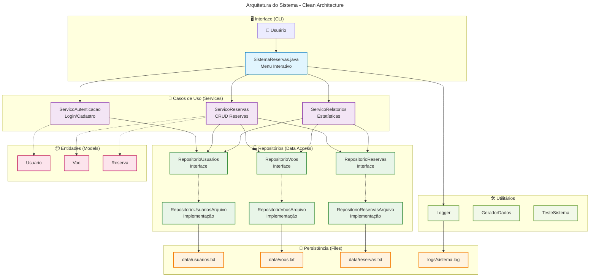
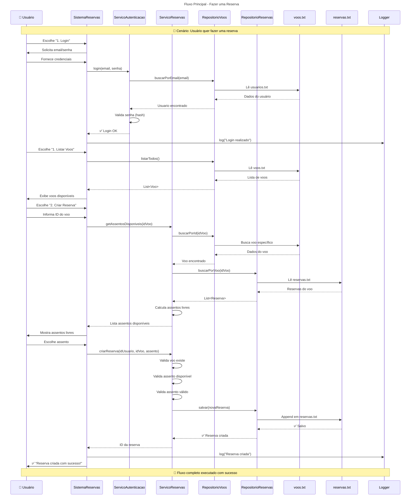

```mermaid
---
title: Interface CLI - Fluxo de Navegação Completo
---
flowchart TD
    START([🚀 Sistema Iniciado]) --> INIT_CHECK{Admin existe?}
    INIT_CHECK -->|Não| CREATE_ADMIN[Criar admin@sistema.com]
    INIT_CHECK -->|Sim| LOGIN_MENU
    CREATE_ADMIN --> LOGIN_MENU
    
    subgraph "🔐 Menu de Login"
        LOGIN_MENU["`==== LOGIN ====
        1. Fazer Login
        2. Cadastrar Usuário  
        0. Sair`"]
        
        LOGIN_MENU --> LOGIN_OPT{Escolha}
        LOGIN_OPT -->|1| DO_LOGIN[Solicitar email/senha]
        LOGIN_OPT -->|2| REGISTER[Cadastrar novo usuário]
        LOGIN_OPT -->|0| EXIT[👋 Sair do sistema]
        
        DO_LOGIN --> LOGIN_CHECK{Credenciais OK?}
        LOGIN_CHECK -->|✅| MAIN_MENU
        LOGIN_CHECK -->|❌| LOGIN_ERROR[❌ Email/senha incorretos]
        LOGIN_ERROR --> LOGIN_MENU
        
        REGISTER --> REG_FORM[Solicitar dados]
        REG_FORM --> REG_CHECK{Email disponível?}
        REG_CHECK -->|✅| REG_SUCCESS[✅ Usuário cadastrado]
        REG_CHECK -->|❌| REG_ERROR[❌ Email já existe]
        REG_SUCCESS --> LOGIN_MENU
        REG_ERROR --> LOGIN_MENU
    end
    
    subgraph "🏠 Menu Principal"
        MAIN_MENU["`==== BEM-VINDO ====
        1. Listar Voos
        2. Criar Reserva
        3. Minhas Reservas
        4. Cancelar Reserva
        5. Relatórios
        6. [ADMIN] Gerenciar Voos
        7. [ADMIN] Relatórios Admin
        8. Logout
        0. Sair`"]
        
        MAIN_MENU --> MAIN_OPT{Escolha}
        MAIN_OPT -->|1| LIST_FLIGHTS[📋 Listar Voos Disponíveis]
        MAIN_OPT -->|2| CREATE_BOOKING
        MAIN_OPT -->|3| MY_BOOKINGS[📋 Minhas Reservas]
        MAIN_OPT -->|4| CANCEL_BOOKING
        MAIN_OPT -->|5| REPORTS_USER
        MAIN_OPT -->|6| ADMIN_FLIGHTS
        MAIN_OPT -->|7| ADMIN_REPORTS
        MAIN_OPT -->|8| LOGOUT[Fazer Logout]
        MAIN_OPT -->|0| EXIT
    end
    
    subgraph "✈️ Criar Reserva"
        CREATE_BOOKING[🎯 Criar Reserva] --> SHOW_FLIGHTS[Mostrar voos disponíveis]
        SHOW_FLIGHTS --> SELECT_FLIGHT[Usuário escolhe voo]
        SELECT_FLIGHT --> SHOW_SEATS[Mostrar assentos livres]
        SHOW_SEATS --> SELECT_SEAT[Usuário escolhe assento]
        SELECT_SEAT --> BOOKING_VALID{Assento válido?}
        BOOKING_VALID -->|✅| BOOKING_SUCCESS[✅ Reserva criada!]
        BOOKING_VALID -->|❌| BOOKING_ERROR[❌ Assento ocupado]
        BOOKING_SUCCESS --> MAIN_MENU
        BOOKING_ERROR --> SHOW_SEATS
    end
    
    subgraph "❌ Cancelar Reserva"
        CANCEL_BOOKING[❌ Cancelar Reserva] --> SHOW_MY_BOOKINGS[Mostrar minhas reservas]
        SHOW_MY_BOOKINGS --> SELECT_CANCEL[Escolher reserva p/ cancelar]
        SELECT_CANCEL --> CANCEL_CONFIRM{Confirmar cancelamento?}
        CANCEL_CONFIRM -->|✅| CANCEL_SUCCESS[✅ Reserva cancelada]
        CANCEL_CONFIRM -->|❌| MAIN_MENU
        CANCEL_SUCCESS --> MAIN_MENU
    end
    
    subgraph "📊 Relatórios Usuário"
        REPORTS_USER[📊 Relatórios] --> USER_REPORTS_MENU["`1. Meu Histórico
        2. Voos Mais Reservados
        0. Voltar`"]
        USER_REPORTS_MENU --> USER_REP_OPT{Escolha}
        USER_REP_OPT -->|1| MY_HISTORY[📋 Meu Histórico Completo]
        USER_REP_OPT -->|2| TOP_FLIGHTS[📈 Top 5 Voos Mais Reservados]
        USER_REP_OPT -->|0| MAIN_MENU
        MY_HISTORY --> MAIN_MENU
        TOP_FLIGHTS --> MAIN_MENU
    end
    
    subgraph "👨‍💼 Área Admin"
        ADMIN_FLIGHTS[👨‍💼 Gerenciar Voos] --> ADMIN_FLIGHT_MENU["`1. Criar Voo
        2. Editar Voo
        3. Excluir Voo
        4. Listar Voos
        0. Voltar`"]
        
        ADMIN_FLIGHT_MENU --> ADMIN_FLIGHT_OPT{Escolha}
        ADMIN_FLIGHT_OPT -->|1| CREATE_FLIGHT[➕ Criar Novo Voo]
        ADMIN_FLIGHT_OPT -->|2| EDIT_FLIGHT[✏️ Editar Voo Existente]
        ADMIN_FLIGHT_OPT -->|3| DELETE_FLIGHT[🗑️ Excluir Voo]
        ADMIN_FLIGHT_OPT -->|4| LIST_ALL_FLIGHTS[📋 Listar Todos os Voos]
        ADMIN_FLIGHT_OPT -->|0| MAIN_MENU
        
        CREATE_FLIGHT --> FLIGHT_FORM[Preencher dados do voo]
        FLIGHT_FORM --> FLIGHT_CREATED[✅ Voo criado]
        FLIGHT_CREATED --> MAIN_MENU
        
        EDIT_FLIGHT --> SELECT_FLIGHT_EDIT[Escolher voo para editar]
        SELECT_FLIGHT_EDIT --> EDIT_FORM[Alterar dados]
        EDIT_FORM --> FLIGHT_UPDATED[✅ Voo atualizado]
        FLIGHT_UPDATED --> MAIN_MENU
        
        DELETE_FLIGHT --> SELECT_FLIGHT_DEL[Escolher voo para excluir]
        SELECT_FLIGHT_DEL --> DELETE_CONFIRM{Tem certeza?}
        DELETE_CONFIRM -->|✅| DELETE_CHECK{Há reservas ativas?}
        DELETE_CONFIRM -->|❌| MAIN_MENU
        DELETE_CHECK -->|Não| FLIGHT_DELETED[✅ Voo excluído]
        DELETE_CHECK -->|Sim| DELETE_ERROR[❌ Não pode excluir]
        FLIGHT_DELETED --> MAIN_MENU
        DELETE_ERROR --> MAIN_MENU
        
        LIST_ALL_FLIGHTS --> MAIN_MENU
    end
    
    subgraph "📈 Relatórios Admin"
        ADMIN_REPORTS[📈 Relatórios Admin] --> ADMIN_REP_MENU["`1. Reservas por Voo
        2. Assentos Livres  
        3. Receita por Voo
        4. Top 10 Voos
        0. Voltar`"]
        
        ADMIN_REP_MENU --> ADMIN_REP_OPT{Escolha}
        ADMIN_REP_OPT -->|1| REP_BOOKINGS[📊 Total Reservas por Voo]
        ADMIN_REP_OPT -->|2| REP_SEATS[🪑 Assentos Livres/Ocupados]
        ADMIN_REP_OPT -->|3| REP_REVENUE[💰 Receita por Voo]
        ADMIN_REP_OPT -->|4| REP_TOP10[🏆 Top 10 Mais Reservados]
        ADMIN_REP_OPT -->|0| MAIN_MENU
        
        REP_BOOKINGS --> MAIN_MENU
        REP_SEATS --> MAIN_MENU  
        REP_REVENUE --> MAIN_MENU
        REP_TOP10 --> MAIN_MENU
    end
    
    %% Outros fluxos
    LIST_FLIGHTS --> MAIN_MENU
    MY_BOOKINGS --> MAIN_MENU
    LOGOUT --> LOGIN_MENU
    
    %% Estilos
    classDef start fill:#4caf50,stroke:#2e7d32,stroke-width:3px,color:#fff
    classDef menu fill:#2196f3,stroke:#1565c0,stroke-width:2px,color:#fff
    classDef action fill:#ff9800,stroke:#ef6c00,stroke-width:2px,color:#fff
    classDef success fill:#4caf50,stroke:#2e7d32,stroke-width:2px,color:#fff
    classDef error fill:#f44336,stroke:#c62828,stroke-width:2px,color:#fff
    classDef admin fill:#9c27b0,stroke:#6a1b9a,stroke-width:2px,color:#fff
    classDef decision fill:#ffc107,stroke:#f57c00,stroke-width:2px,color:#000
    
    class START start
    class LOGIN_MENU,MAIN_MENU,USER_REPORTS_MENU,ADMIN_FLIGHT_MENU,ADMIN_REP_MENU menu
    class DO_LOGIN,REGISTER,CREATE_BOOKING,CANCEL_BOOKING,CREATE_FLIGHT,EDIT_FLIGHT,DELETE_FLIGHT action
    class REG_SUCCESS,BOOKING_SUCCESS,CANCEL_SUCCESS,FLIGHT_CREATED,FLIGHT_UPDATED,FLIGHT_DELETED success
    class LOGIN_ERROR,REG_ERROR,BOOKING_ERROR,DELETE_ERROR error
    class ADMIN_FLIGHTS,ADMIN_REPORTS admin
    class LOGIN_CHECK,REG_CHECK,BOOKING_VALID,CANCEL_CONFIRM,DELETE_CONFIRM,DELETE_CHECK decision
```

## Explicação Técnica Detalhada

Agora vou explicar os conceitos fundamentais usando o método Feynman:

### 1. **Arquitetura do Sistema** 

**Camadas (simples → complexo):**
```
┌─────────────────┐
│   CLI (Interface)│  ← O que o usuário vê
├─────────────────┤
│   Serviços      │  ← Regras de negócio  
├─────────────────┤
│   Repositórios  │  ← Salvam/carregam dados
├─────────────────┤
│   Arquivos      │  ← Onde os dados ficam
└─────────────────┘
```

**Por que essa separação?**
- **Interface**: Se quiser mudar de CLI para web, só muda essa parte
- **Serviços**: Lógica do negócio fica isolada e testável
- **Repositórios**: Se quiser trocar arquivo por banco de dados, só muda aqui
- **Arquivos**: Dados persistem entre execuções

### 2. **Manipulação de Arquivos (Java NIO)**

**Por que NIO em vez de IO tradicional?**
```java
// IO Antigo (evitar)
FileReader reader = new FileReader("arquivo.txt");
BufferedReader buffer = new BufferedReader(reader);

// NIO Moderno (usar)
List<String> linhas = Files.readAllLines(Paths.get("arquivo.txt"));
Files.write(path, dados, StandardOpenOption.APPEND);
```

**Vantagens do NIO:**
- Operações atômicas (ou funciona tudo, ou nada)
- Melhor tratamento de encoding
- Menos código para escrever
- Melhor performance

### 3. **Streams API e Collections**

**Transformação de dados:**
```java
// Antes (Java 7)
List<Reserva> reservasConfirmadas = new ArrayList<>();
for (Reserva r : todasReservas) {
    if (r.getStatus() == StatusReserva.CONFIRMADA) {
        reservasConfirmadas.add(r);
    }
}

// Agora (Java 8+)
List<Reserva> reservasConfirmadas = todasReservas.stream()
    .filter(r -> r.getStatus() == StatusReserva.CONFIRMADA)
    .collect(Collectors.toList());
```

### 4. **Design Patterns Aplicados**

**Repository Pattern:**
- **Problema**: Como salvar dados sem acoplar com tecnologia específica?
- **Solução**: Interface que define operações, implementação que faz o trabalho
- **Benefício**: Posso trocar arquivo por banco sem quebrar o código

**Strategy Pattern (implícito):**
- **Serialização**: Cada classe sabe como virar string e voltar
- **Validação**: Cada serviço tem suas regras específicas

### 5. **Tratamento de Erros**

**Filosofia "Fail Fast":**
```java
public String criarReserva(String idUsuario, String idVoo, String assento) throws Exception {
    // Validar TUDO antes de fazer qualquer coisa
    if (!vooExiste(idVoo)) {
        throw new IllegalArgumentException("Voo não encontrado!");
    }
    if (!assentoDisponivel(idVoo, assento)) {
        throw new IllegalArgumentException("Assento ocupado!");
    }
    // Só agora salvar
    // ...
}
```

## Como Usar o Sistema

### **Compilação e Execução:**
```bash
# 1. Compilar todos os arquivos
javac *.java

# 2. Executar o sistema
java SistemaReservas

# 3. (Opcional) Gerar dados de exemplo
java GeradorDados

# 4. (Opcional) Executar testes
java TesteSistema
```

### **Primeiro Uso:**
1. Sistema cria automaticamente usuário admin:
   - **Email**: admin@sistema.com  
   - **Senha**: admin123

2. Como admin, você pode:
   - Criar voos
   - Ver relatórios administrativos
   - Gerenciar o sistema

3. Cadastre usuários normais para fazer reservas

## Conceitos Avançados

### **Serialização Customizada:**
Cada entidade implementa `toFileString()` e `fromFileString()`:
```java
// Converte objeto para linha do arquivo
public String toFileString() {
    return String.join(";", id, nome, email, senha, tipo.toString());
}

// Reconstrói objeto da linha do arquivo  
public static Usuario fromFileString(String linha) {
    String[] partes = linha.split(";");
    return new Usuario(partes[0], partes[1], partes[2], partes[3], 
                      TipoUsuario.valueOf(partes[4]));
}
```

### **Controle de Assentos:**
Sistema gera assentos automaticamente baseado no total:
- **Configuração 3-3**: 6 assentos por fileira (A,B,C,D,E,F)
- **Exemplo**: Avião com 180 assentos = 30 fileiras (1A até 30F)

### **Hash de Senhas:**
```java
// SHA-256 para segurança básica
private String calcularHashSenha(String senha) throws Exception {
    MessageDigest md = MessageDigest.getInstance("SHA-256");
    byte[] hash = md.digest(senha.getBytes());
    return bytesToHex(hash);
}
```

### **Logs Estruturados:**
```java
// Cada ação importante é logada
logger.log("INFO", "Login realizado: " + email);
logger.log("WARNING", "Tentativa de login falhada: " + email);
logger.log("ERROR", "Erro ao salvar reserva: " + erro.getMessage());
```

## Testing e Validação

O sistema inclui testes que verificam:
- ✅ **Persistência**: Dados são salvos e recuperados corretamente
- ✅ **Validações**: Regras de negócio funcionam
- ✅ **Performance**: Sistema aguenta carga básica
- ✅ **Integridade**: Operações atômicas

## Próximos Passos

Agora que você tem a base sólida, pode:
1. **Executar o sistema** e entender o fluxo
2. **Modificar funcionalidades** para aprender
3. **Adicionar melhorias** (backup, cache, etc.)
4. **Migrar para banco de dados** quando quiser
5. **Criar interface web** mantendo a mesma lógica

O sistema foi projetado para ser **educativo** - cada parte ensina conceitos importantes de Java moderno, manipulação de arquivos e arquitetura limpa.

# Estrutura de Pastas - Sistema de Reservas Aéreas

## 📁 Estrutura Completa do Projeto

```
airline-reservation-system/
├── 📁 src/                              # Código fonte principal
│   ├── 📁 entities/                     # Modelos de domínio
│   │   ├── 📄 Usuario.java              # Entidade Usuário
│   │   ├── 📄 Voo.java                  # Entidade Voo
│   │   └── 📄 Reserva.java              # Entidade Reserva
│   │
│   ├── 📁 interfaces/                   # Contratos (interfaces)
│   │   ├── 📄 RepositorioUsuarios.java  # Interface repositório usuários
│   │   ├── 📄 RepositorioVoos.java      # Interface repositório voos
│   │   └── 📄 RepositorioReservas.java  # Interface repositório reservas
│   │
│   ├── 📁 repositories/                 # Implementações de persistência
│   │   ├── 📄 RepositorioUsuariosArquivo.java     # Persistência usuários (texto)
│   │   ├── 📄 RepositorioVoosArquivo.java         # Persistência voos (texto)
│   │   ├── 📄 RepositorioReservasArquivo.java     # Persistência reservas (texto)
│   │   └── 📄 RepositorioUsuariosBinario.java     # Persistência usuários (binário)
│   │
│   ├── 📁 services/                     # Regras de negócio (casos de uso)
│   │   ├── 📄 ServicoAutenticacao.java  # Login, cadastro, validações
│   │   ├── 📄 ServicoReservas.java      # CRUD reservas, controle assentos
│   │   └── 📄 ServicoRelatorios.java    # Estatísticas e relatórios
│   │
│   ├── 📁 utils/                        # Utilitários e ferramentas
│   │   ├── 📄 Logger.java               # Sistema de logs
│   │   ├── 📄 GeradorDados.java         # Criador de dados de exemplo
│   │   └── 📄 TesteSistema.java         # Testes automatizados
│   │
│   └── 📄 SistemaReservas.java          # Classe principal (CLI)
│
├── 📁 data/                             # Dados persistentes (criado automaticamente)
│   ├── 📄 usuarios.txt                  # Usuários em formato texto
│   ├── 📄 voos.txt                      # Voos em formato texto
│   ├── 📄 reservas.txt                  # Reservas em formato texto
│   ├── 📄 usuarios.dat                  # Usuários em formato binário (opcional)
│   └── 📁 backup/                       # Backups automáticos (futuro)
│       ├── 📄 usuarios_2025-01-01.bak
│       ├── 📄 voos_2025-01-01.bak
│       └── 📄 reservas_2025-01-01.bak
│
├── 📁 logs/                             # Arquivos de log (criado automaticamente)
│   ├── 📄 sistema.log                   # Log principal do sistema
│   ├── 📄 acesso.log                    # Log de acessos (futuro)
│   └── 📄 erro.log                      # Log apenas de erros (futuro)
│
├── 📁 docs/                             # Documentação do projeto
│   ├── 📄 README.md                     # Documentação principal
│   ├── 📄 ARCHITECTURE.md               # Explicação da arquitetura
│   ├── 📄 API.md                        # Documentação das classes
│   └── 📁 diagramas/                    # Diagramas UML e fluxogramas
│       ├── 📄 classes.puml
│       ├── 📄 sequencia.puml
│       └── 📄 arquitetura.png
│
├── 📁 config/                           # Arquivos de configuração (futuro)
│   ├── 📄 sistema.properties            # Configurações gerais
│   ├── 📄 database.properties           # Configurações de BD (futuro)
│   └── 📄 log4j.properties              # Configurações de log (futuro)
│
├── 📁 scripts/                          # Scripts de automação
│   ├── 📄 compilar.sh                   # Script de compilação (Linux/Mac)
│   ├── 📄 compilar.bat                  # Script de compilação (Windows)
│   ├── 📄 executar.sh                   # Script de execução (Linux/Mac)
│   ├── 📄 executar.bat                  # Script de execução (Windows)
│   └── 📄 limpar.sh                     # Limpar arquivos compilados
│
├── 📁 lib/                              # Bibliotecas externas (se houver)
│   └── 📄 (vazio - projeto usa apenas Java padrão)
│
├── 📁 test/                             # Testes unitários e integração
│   ├── 📁 unit/                         # Testes unitários
│   │   ├── 📄 UsuarioTest.java
│   │   ├── 📄 VooTest.java
│   │   └── 📄 ReservaTest.java
│   ├── 📁 integration/                  # Testes de integração
│   │   ├── 📄 RepositorioTest.java
│   │   └── 📄 ServicoTest.java
│   └── 📁 data/                         # Dados para testes
│       ├── 📄 usuarios_test.txt
│       └── 📄 voos_test.txt
│
├── 📁 build/                            # Arquivos compilados (criado automaticamente)
│   ├── 📁 classes/                      # Arquivos .class
│   ├── 📁 jar/                          # JAR executável (futuro)
│   └── 📁 docs/                         # Javadoc gerado (futuro)
│
├── 📄 .gitignore                        # Arquivo para ignorar arquivos no Git
├── 📄 README.md                         # Documentação principal do projeto
├── 📄 LICENSE                           # Licença do projeto
└── 📄 pom.xml                           # Maven (se usar - opcional)
```

## 📂 Explicação Detalhada das Pastas

### **📁 src/** - Código Fonte
```
src/
├── entities/     → Classes que representam dados (Usuario, Voo, Reserva)
├── interfaces/   → Contratos que definem operações (Repository patterns)
├── repositories/ → Implementações que salvam/carregam dados
├── services/     → Regras de negócio e casos de uso
├── utils/        → Ferramentas auxiliares (Logger, Gerador, Testes)
└── SistemaReservas.java → Classe principal com interface CLI
```

### **📁 data/** - Persistência (Criada Automaticamente)
```
data/
├── usuarios.txt   → id;nome;email;senha;tipo;dataCadastro
├── voos.txt       → id;origem;destino;dataHora;companhia;assentos;preco
├── reservas.txt   → id;idUsuario;idVoo;assento;status;dataReserva;valor
├── usuarios.dat   → Versão binária (mais rápida para muitos dados)
└── backup/        → Backups automáticos (implementação futura)
```

### **📁 logs/** - Sistema de Logs (Criada Automaticamente)
```
logs/
├── sistema.log → [2025-01-01 10:30:15] INFO - Login realizado: user@email.com
├── acesso.log  → Logs específicos de acesso (futuro)
└── erro.log    → Logs apenas de erros críticos (futuro)
```

## 🛠️ Como Organizar o Projeto

### **Versão Simples (Todos os arquivos na raiz):**
```
projeto/
├── Usuario.java
├── Voo.java
├── Reserva.java
├── RepositorioUsuarios.java
├── RepositorioVoos.java
├── RepositorioReservas.java
├── RepositorioUsuariosArquivo.java
├── RepositorioVoosArquivo.java
├── RepositorioReservasArquivo.java
├── ServicoAutenticacao.java
├── ServicoReservas.java
├── ServicoRelatorios.java
├── Logger.java
├── GeradorDados.java
├── TesteSistema.java
├── SistemaReservas.java
├── data/           (criada automaticamente)
└── logs/           (criada automaticamente)
```

### **Versão Organizada (Com packages):**
```java
// No início de cada arquivo, adicionar package:

// entities/Usuario.java
package entities;

// repositories/RepositorioUsuariosArquivo.java
package repositories;
import entities.Usuario;

// services/ServicoAutenticacao.java
package services;
import entities.Usuario;
import repositories.RepositorioUsuarios;
```

## 📋 Scripts de Automação

### **compilar.sh (Linux/Mac):**
```bash
#!/bin/bash
echo "Compilando Sistema de Reservas..."
find src -name "*.java" | xargs javac -d build/classes
echo "Compilação concluída!"
```

### **compilar.bat (Windows):**
```batch
@echo off
echo Compilando Sistema de Reservas...
dir /s /b src\*.java > sources.txt
javac -d build\classes @sources.txt
del sources.txt
echo Compilacao concluida!
```

### **executar.sh (Linux/Mac):**
```bash
#!/bin/bash
cd build/classes
java SistemaReservas
```

## 🗂️ Arquivo .gitignore
```gitignore
# Arquivos compilados
*.class
build/
target/

# Dados locais (não versionar dados pessoais)
data/*.txt
data/*.dat
logs/*.log

# IDEs
.idea/
.vscode/
*.iml
.project
.classpath

# Sistema operacional
.DS_Store
Thumbs.db

# Temporários
*.tmp
*.temp
```

## 📝 Como Criar a Estrutura

### **Comando para criar toda a estrutura:**
```bash
# Linux/Mac
mkdir -p airline-reservation-system/{src/{entities,interfaces,repositories,services,utils},docs/diagramas,config,scripts,lib,test/{unit,integration,data},build/{classes,jar,docs}}

# Windows (PowerShell)
New-Item -ItemType Directory -Path "airline-reservation-system\src\entities", "airline-reservation-system\src\interfaces", "airline-reservation-system\src\repositories", "airline-reservation-system\src\services", "airline-reservation-system\src\utils", "airline-reservation-system\docs\diagramas", "airline-reservation-system\config", "airline-reservation-system\scripts", "airline-reservation-system\lib", "airline-reservation-system\test\unit", "airline-reservation-system\test\integration", "airline-reservation-system\test\data", "airline-reservation-system\build\classes", "airline-reservation-system\build\jar", "airline-reservation-system\build\docs" -Force
```

## 🎯 Recomendação para Iniciantes

**Comece simples:**
1. Crie apenas uma pasta `projeto/`
2. Coloque todos os arquivos `.java` na raiz
3. Sistema criará `data/` e `logs/` automaticamente
4. Conforme for aprendendo, organize em subpastas

**Evolua gradualmente:**
1. **Semana 1**: Tudo na raiz
2. **Semana 2**: Separar em packages
3. **Semana 3**: Adicionar scripts de automação  
4. **Semana 4**: Implementar testes e documentação

A estrutura mais importante é que **funcione** - a organização vem com a experiência!





```mermaid
---
title: Modelo de Dados - Entidades e Relacionamentos
---
erDiagram
    USUARIO ||--o{ RESERVA : "faz"
    VOO ||--o{ RESERVA : "possui"
    
    USUARIO {
        string id PK "UUID"
        string nome "Nome completo"
        string email UK "Email único"
        string senha "Hash SHA-256"
        enum tipo "CLIENTE, ADMIN"
        datetime dataCadastro "Timestamp"
    }
    
    VOO {
        string id PK "UUID"
        string origem "Cidade origem"
        string destino "Cidade destino"
        datetime dataHora "Data e hora voo"
        string companhia "Nome companhia"
        int totalAssentos "Capacidade"
        decimal preco "Valor passagem"
    }
    
    RESERVA {
        string id PK "UUID"
        string idUsuario FK "Referência usuário"
        string idVoo FK "Referência voo"
        string assento "Ex: 12A, 8C"
        enum status "CONFIRMADA, CANCELADA"
        datetime dataReserva "Timestamp"
        decimal valorPago "Valor efetivo"
    }
    
    %% Exemplo de dados
    USUARIO ||--|| EXEMPLO_USUARIO : ""
    EXEMPLO_USUARIO {
        string "u123-456-789"
        string "João Silva"
        string "joao@email.com"
        string "a665a45920422f9d..."
        string "CLIENTE"
        datetime "2025-08-25T10:30:15"
    }
    
    VOO ||--|| EXEMPLO_VOO : ""
    EXEMPLO_VOO {
        string "v001-abc-def"
        string "São Paulo"
        string "Rio de Janeiro"
        datetime "2025-08-26T14:30:00"
        string "LATAM"
        int "180"
        decimal "450.00"
    }
    
    RESERVA ||--|| EXEMPLO_RESERVA : ""
    EXEMPLO_RESERVA {
        string "r001-xyz-123"
        string "u123-456-789"
        string "v001-abc-def"
        string "12A"
        string "CONFIRMADA"
        datetime "2025-08-25T11:15:30"
        decimal "450.00"
    }
```

```mermaid
---
title: Sistema de Arquivos - Organização e Fluxo de Dados
---
graph TD
    subgraph "💾 Sistema de Arquivos"
        subgraph "📁 Projeto Raiz"
            JAVA[📄 *.java<br/>Código Fonte]
            CLASS[📄 *.class<br/>Compilados]
        end
        
        subgraph "📁 data/ (Auto-criada)"
            F_USER[📄 usuarios.txt<br/>id;nome;email;senha;tipo;data]
            F_VOO[📄 voos.txt<br/>id;origem;destino;data;companhia;assentos;preco]
            F_RESERVA[📄 reservas.txt<br/>id;idUser;idVoo;assento;status;data;valor]
            F_BIN[📄 usuarios.dat<br/>Versão Binária (Opcional)]
        end
        
        subgraph "📁 logs/ (Auto-criada)"
            F_LOG[📄 sistema.log<br/>[timestamp] LEVEL - mensagem]
        end
        
        subgraph "📁 backup/ (Futuro)"
            F_BACKUP[📄 *.bak<br/>Backups Automáticos]
        end
    end
    
    subgraph "🔄 Fluxo de Persistência"
        subgraph "Escrita"
            WRITE_START[Operação CRUD]
            WRITE_VALID[Validar Dados]
            WRITE_SERIAL[Serializar toFileString()]
            WRITE_FILE[Escrever Arquivo]
            WRITE_LOG[Log da Operação]
        end
        
        subgraph "Leitura"
            READ_START[Solicitar Dados]
            READ_FILE[Ler Arquivo]
            READ_PARSE[Parse fromFileString()]
            READ_FILTER[Filtrar/Mapear]
            READ_RETURN[Retornar Objetos]
        end
    end
    
    subgraph "📊 Formato dos Dados"
        subgraph "usuarios.txt"
            USER_EX["u123;João Silva;joao@email.com;hash;CLIENTE;2025-08-25T10:30:15<br/>u456;Maria Santos;maria@email.com;hash;ADMIN;2025-08-25T09:15:30"]
        end
        
        subgraph "voos.txt"  
            VOO_EX["v001;São Paulo;Rio de Janeiro;2025-08-26T14:30:00;LATAM;180;450.00<br/>v002;Rio de Janeiro;Salvador;2025-08-27T08:15:00;GOL;144;380.00"]
        end
        
        subgraph "reservas.txt"
            RESERVA_EX["r001;u123;v001;12A;CONFIRMADA;2025-08-25T11:15:30;450.00<br/>r002;u123;v002;8C;CANCELADA;2025-08-25T12:00:00;380.00"]
        end
        
        subgraph "sistema.log"
            LOG_EX["[2025-08-25 11:15:30] INFO - Reserva criada: r001<br/>[2025-08-25 12:00:00] WARNING - Tentativa login falhada"]
        end
    end
    
    %% Conexões Escrita
    WRITE_START --> WRITE_VALID
    WRITE_VALID --> WRITE_SERIAL
    WRITE_SERIAL --> WRITE_FILE
    WRITE_FILE --> WRITE_LOG
    WRITE_LOG --> F_LOG
    
    %% Conexões Leitura  
    READ_START --> READ_FILE
    READ_FILE --> READ_PARSE
    READ_PARSE --> READ_FILTER
    READ_FILTER --> READ_RETURN
    
    %% Conexões Arquivos
    WRITE_FILE -.-> F_USER
    WRITE_FILE -.-> F_VOO
    WRITE_FILE -.-> F_RESERVA
    READ_FILE -.-> F_USER
    READ_FILE -.-> F_VOO
    READ_FILE -.-> F_RESERVA
    
    %% Backup
    F_USER -.-> F_BACKUP
    F_VOO -.-> F_BACKUP
    F_RESERVA -.-> F_BACKUP
    
    %% Alternativa binária
    F_USER -.-> F_BIN
    
    %% Estilos
    classDef file fill:#fff3e0,stroke:#f57c00,stroke-width:2px
    classDef process fill:#e3f2fd,stroke:#1976d2,stroke-width:2px
    classDef data fill:#f1f8e9,stroke:#689f38,stroke-width:2px
    
    class F_USER,F_VOO,F_RESERVA,F_LOG,F_BIN,F_BACKUP file
    class WRITE_START,WRITE_VALID,WRITE_SERIAL,WRITE_FILE,WRITE_LOG,READ_START,READ_FILE,READ_PARSE,READ_FILTER,READ_RETURN process
    class USER_EX,VOO_EX,RESERVA_EX,LOG_EX data
```


