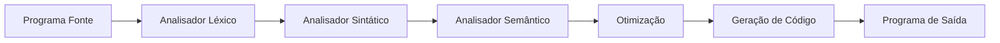

# Guia Completo de Compiladores: Teoria + Prática em Java

## 1. Introdução a Compiladores

### O que é um Compilador?

Imagine que você quer contar uma piada para um amigo que fala apenas inglês, mas você só sabe a piada em português. Você precisaria de um tradutor que entende português e sabe falar inglês. Um **compilador** é exatamente isso: um tradutor que pega código escrito em uma linguagem que nós entendemos (como Java, C++, Python) e transforma em uma linguagem que o computador entende diretamente (código de máquina).

**Definição técnica:** Um compilador é um programa que traduz código-fonte escrito em uma linguagem de programação de alto nível para uma linguagem de nível mais baixo (geralmente código de máquina ou bytecode).

### Compilador vs Interpretador

**Analogia simples:**
- **Compilador** = Tradutor de livros: lê todo o livro em português, traduz completamente para inglês, e depois você lê o livro em inglês
- **Interpretador** = Tradutor simultâneo: traduz linha por linha enquanto você está falando

**Diferenças técnicas:**

| Aspecto | Compilador | Interpretador |
|---------|------------|---------------|
| **Execução** | Traduz todo código antes da execução | Traduz e executa linha por linha |
| **Velocidade de execução** | Mais rápida (código já traduzido) | Mais lenta (traduz durante execução) |
| **Detecção de erros** | Encontra erros antes da execução | Encontra erros durante execução |
| **Exemplos** | C, C++, Rust | Python, JavaScript (tradicionalmente) |
| **Java** | Híbrido: compila para bytecode, depois interpreta/compila JIT |

### Etapas Clássicas do Processo de Compilação



**Vamos explicar cada etapa com uma analogia:**

1. **Análise Léxica** = Separar palavras em uma frase
   - Input: `int x = 10 + 20;`
   - Output: [`int`, `x`, `=`, `10`, `+`, `20`, `;`]

2. **Análise Sintática** = Verificar se a frase faz sentido gramaticalmente
   - Verifica se `int x = 10 + 20;` segue as regras da linguagem

3. **Análise Semântica** = Verificar se a frase faz sentido logicamente
   - Verifica se `x` foi declarado, se tipos são compatíveis

4. **Otimização** = Melhorar o código sem mudar o significado
   - `10 + 20` vira `30` diretamente

5. **Geração de Código** = Traduzir para a linguagem destino
   - Gera instruções de máquina ou bytecode

## 2. Análise Léxica (Lexical Analysis)

### O que é um Token?

**Analogia:** Quando você lê uma frase em português, seu cérebro automaticamente separa as palavras e identifica o tipo de cada uma (substantivo, verbo, número, etc.). O analisador léxico faz a mesma coisa com código.

**Token** = Unidade mínima significativa do código

**Tipos principais de tokens:**
- **Palavras-chave:** `if`, `while`, `int`, `class`
- **Identificadores:** nomes de variáveis, funções (`minhaVariavel`)
- **Literais:** números (`42`), strings (`"hello"`)
- **Operadores:** `+`, `-`, `==`, `!=`
- **Delimitadores:** `(`, `)`, `{`, `}`, `;`

### Exemplo Prático: Tokenizando uma Expressão

**Input:** `int x = 10 + 20;`

**Output esperado:**
```
[KEYWORD: int]
[IDENTIFIER: x]
[OPERATOR: =]
[NUMBER: 10]
[OPERATOR: +]
[NUMBER: 20]
[DELIMITER: ;]
```

### Implementação de um Lexer em Java

```java
import java.util.*;
import java.util.regex.*;

// Classe que representa um token
class Token {
    public enum Type {
        KEYWORD, IDENTIFIER, NUMBER, OPERATOR, DELIMITER, EOF
    }
    
    private Type type;
    private String value;
    private int position;
    
    public Token(Type type, String value, int position) {
        this.type = type;
        this.value = value;
        this.position = position;
    }
    
    // Getters
    public Type getType() { return type; }
    public String getValue() { return value; }
    public int getPosition() { return position; }
    
    @Override
    public String toString() {
        return String.format("[%s: %s]", type, value);
    }
}

// Analisador léxico simples
class SimpleLexer {
    private String input;
    private int position;
    private Set<String> keywords;
    
    public SimpleLexer(String input) {
        this.input = input;
        this.position = 0;
        this.keywords = new HashSet<>(Arrays.asList(
            "int", "float", "if", "else", "while", "for", "return"
        ));
    }
    
    // Pula espaços em branco
    private void skipWhitespace() {
        while (position < input.length() && Character.isWhitespace(input.charAt(position))) {
            position++;
        }
    }
    
    // Lê um número
    private Token readNumber() {
        StringBuilder sb = new StringBuilder();
        int start = position;
        
        while (position < input.length() && Character.isDigit(input.charAt(position))) {
            sb.append(input.charAt(position));
            position++;
        }
        
        return new Token(Token.Type.NUMBER, sb.toString(), start);
    }
    
    // Lê um identificador ou palavra-chave
    private Token readIdentifier() {
        StringBuilder sb = new StringBuilder();
        int start = position;
        
        while (position < input.length() && 
               (Character.isLetterOrDigit(input.charAt(position)) || 
                input.charAt(position) == '_')) {
            sb.append(input.charAt(position));
            position++;
        }
        
        String value = sb.toString();
        Token.Type type = keywords.contains(value) ? Token.Type.KEYWORD : Token.Type.IDENTIFIER;
        
        return new Token(type, value, start);
    }
    
    // Próximo token
    public Token nextToken() {
        skipWhitespace();
        
        if (position >= input.length()) {
            return new Token(Token.Type.EOF, "", position);
        }
        
        char current = input.charAt(position);
        
        // Números
        if (Character.isDigit(current)) {
            return readNumber();
        }
        
        // Identificadores e palavras-chave
        if (Character.isLetter(current) || current == '_') {
            return readIdentifier();
        }
        
        // Operadores e delimitadores
        int start = position;
        position++;
        
        switch (current) {
            case '+': case '-': case '*': case '/': case '=':
                return new Token(Token.Type.OPERATOR, String.valueOf(current), start);
            case '(': case ')': case '{': case '}': case ';':
                return new Token(Token.Type.DELIMITER, String.valueOf(current), start);
            default:
                throw new RuntimeException("Caractere inválido: " + current + " na posição " + start);
        }
    }
    
    // Método para tokenizar toda a entrada
    public List<Token> tokenize() {
        List<Token> tokens = new ArrayList<>();
        Token token;
        
        do {
            token = nextToken();
            tokens.add(token);
        } while (token.getType() != Token.Type.EOF);
        
        return tokens;
    }
}

// Exemplo de uso
public class LexerExample {
    public static void main(String[] args) {
        String code = "int x = 10 + 20;";
        SimpleLexer lexer = new SimpleLexer(code);
        
        System.out.println("Código: " + code);
        System.out.println("Tokens:");
        
        List<Token> tokens = lexer.tokenize();
        for (Token token : tokens) {
            if (token.getType() != Token.Type.EOF) {
                System.out.println(token);
            }
        }
    }
}
```

**Output esperado:**
```
Código: int x = 10 + 20;
Tokens:
[KEYWORD: int]
[IDENTIFIER: x]
[OPERATOR: =]
[NUMBER: 10]
[OPERATOR: +]
[NUMBER: 20]
[DELIMITER: ;]
```

### Expressões Regulares e Autômatos Finitos

**Por que isso importa?**
Lexers profissionais usam **expressões regulares** e **autômatos finitos** para reconhecer padrões de forma eficiente.

**Exemplo de padrões:**
- **Número inteiro:** `\d+`
- **Número decimal:** `\d+\.\d+`
- **Identificador:** `[a-zA-Z_][a-zA-Z0-9_]*`
- **String:** `"[^"]*"`

## 3. Análise Sintática (Parsing)

### O que é Análise Sintática?

**Analogia:** Você já aprendeu que "casa verde bonita" tem três palavras. Agora precisa entender que "verde" descreve "casa", e "bonita" também descreve "casa". A análise sintática organiza os tokens em uma estrutura que mostra como eles se relacionam.

### Árvores Sintáticas (AST - Abstract Syntax Tree)

**Expressão:** `1 + 2 * 3`

**Árvore sintática:**
```
      +
     / \
    1   *
       / \
      2   3
```

**Por que essa estrutura?** A multiplicação tem precedência maior que a soma, então `2 * 3` é calculado primeiro.

### Gramáticas Livres de Contexto

**Definição simples:** Regras que definem como os tokens podem ser combinados.

**Exemplo de gramática para expressões matemáticas:**
```
Expressao → Termo ('+' Termo | '-' Termo)*
Termo → Fator ('*' Fator | '/' Fator)*
Fator → NUMERO | '(' Expressao ')'
```

**Lendo as regras:**
- Uma `Expressao` é um `Termo`, seguido opcionalmente por `+` ou `-` e outro `Termo`
- Um `Termo` é um `Fator`, seguido opcionalmente por `*` ou `/` e outro `Fator`
- Um `Fator` é um `NUMERO` ou uma `Expressao` entre parênteses

### Implementação de um Parser Recursivo-Descendente

```java
import java.util.*;

// Nós da árvore sintática
abstract class ASTNode {
    public abstract String toString();
}

class NumberNode extends ASTNode {
    private int value;
    
    public NumberNode(int value) {
        this.value = value;
    }
    
    public int getValue() { return value; }
    
    @Override
    public String toString() {
        return String.valueOf(value);
    }
}

class BinaryOpNode extends ASTNode {
    private ASTNode left;
    private String operator;
    private ASTNode right;
    
    public BinaryOpNode(ASTNode left, String operator, ASTNode right) {
        this.left = left;
        this.operator = operator;
        this.right = right;
    }
    
    public ASTNode getLeft() { return left; }
    public String getOperator() { return operator; }
    public ASTNode getRight() { return right; }
    
    @Override
    public String toString() {
        return String.format("(%s %s %s)", left, operator, right);
    }
}

// Parser recursivo-descendente
class ExpressionParser {
    private List<Token> tokens;
    private int currentPosition;
    
    public ExpressionParser(List<Token> tokens) {
        this.tokens = tokens;
        this.currentPosition = 0;
    }
    
    // Token atual
    private Token currentToken() {
        if (currentPosition < tokens.size()) {
            return tokens.get(currentPosition);
        }
        return new Token(Token.Type.EOF, "", -1);
    }
    
    // Consome o token atual e avança
    private Token consume() {
        Token token = currentToken();
        currentPosition++;
        return token;
    }
    
    // Verifica se o token atual é do tipo esperado
    private boolean check(Token.Type expectedType) {
        return currentToken().getType() == expectedType;
    }
    
    // Verifica se o token atual tem o valor esperado
    private boolean checkValue(String expectedValue) {
        return currentToken().getValue().equals(expectedValue);
    }
    
    // Expressao → Termo ('+' Termo | '-' Termo)*
    public ASTNode parseExpression() {
        ASTNode left = parseTerm();
        
        while (check(Token.Type.OPERATOR) && 
               (checkValue("+") || checkValue("-"))) {
            String operator = consume().getValue();
            ASTNode right = parseTerm();
            left = new BinaryOpNode(left, operator, right);
        }
        
        return left;
    }
    
    // Termo → Fator ('*' Fator | '/' Fator)*
    private ASTNode parseTerm() {
        ASTNode left = parseFactor();
        
        while (check(Token.Type.OPERATOR) && 
               (checkValue("*") || checkValue("/"))) {
            String operator = consume().getValue();
            ASTNode right = parseFactor();
            left = new BinaryOpNode(left, operator, right);
        }
        
        return left;
    }
    
    // Fator → NUMERO | '(' Expressao ')'
    private ASTNode parseFactor() {
        if (check(Token.Type.NUMBER)) {
            int value = Integer.parseInt(consume().getValue());
            return new NumberNode(value);
        }
        
        if (check(Token.Type.DELIMITER) && checkValue("(")) {
            consume(); // consome '('
            ASTNode expr = parseExpression();
            
            if (!check(Token.Type.DELIMITER) || !checkValue(")")) {
                throw new RuntimeException("Esperado ')'");
            }
            consume(); // consome ')'
            
            return expr;
        }
        
        throw new RuntimeException("Esperado número ou '(' na posição " + currentPosition);
    }
}

// Avaliador da árvore sintática
class Evaluator {
    public static int evaluate(ASTNode node) {
        if (node instanceof NumberNode) {
            return ((NumberNode) node).getValue();
        }
        
        if (node instanceof BinaryOpNode) {
            BinaryOpNode binOp = (BinaryOpNode) node;
            int left = evaluate(binOp.getLeft());
            int right = evaluate(binOp.getRight());
            
            switch (binOp.getOperator()) {
                case "+": return left + right;
                case "-": return left - right;
                case "*": return left * right;
                case "/": return left / right;
                default: throw new RuntimeException("Operador desconhecido: " + binOp.getOperator());
            }
        }
        
        throw new RuntimeException("Tipo de nó desconhecido");
    }
}

// Exemplo de uso
public class ParserExample {
    public static void main(String[] args) {
        String expression = "1 + 2 * 3";
        
        // Tokenizar
        SimpleLexer lexer = new SimpleLexer(expression);
        List<Token> tokens = lexer.tokenize();
        
        // Remover EOF
        tokens.removeIf(token -> token.getType() == Token.Type.EOF);
        
        System.out.println("Expressão: " + expression);
        System.out.println("Tokens: " + tokens);
        
        // Parser
        ExpressionParser parser = new ExpressionParser(tokens);
        ASTNode ast = parser.parseExpression();
        
        System.out.println("AST: " + ast);
        
        // Avaliar
        int result = Evaluator.evaluate(ast);
        System.out.println("Resultado: " + result);
    }
}
```

**Output esperado:**
```
Expressão: 1 + 2 * 3
Tokens: [[NUMBER: 1], [OPERATOR: +], [NUMBER: 2], [OPERATOR: *], [NUMBER: 3]]
AST: (1 + (2 * 3))
Resultado: 7
```

### Técnicas de Parsing

**1. Recursivo-Descendente (como implementamos):**
- **Vantagem:** Simples de implementar e entender
- **Desvantagem:** Não funciona com recursão à esquerda
- **Uso:** Compiladores educacionais, protótipos

**2. LL(1) - Left-to-right, Leftmost derivation, 1 lookahead:**
- **Vantagem:** Eficiente, funciona com muitas gramáticas
- **Desvantagem:** Limitações na gramática
- **Uso:** ANTLR usa LL(*)

**3. LR(1) - Left-to-right, Rightmost derivation, 1 lookahead:**
- **Vantagem:** Mais poderoso que LL(1)
- **Desvantagem:** Mais complexo de implementar
- **Uso:** Yacc, Bison

## 4. Análise Semântica

### O que é Análise Semântica?

**Analogia:** Você já entendeu a gramática da frase "O gato bebeu a música". Gramaticalmente está correta, mas semanticamente não faz sentido - gatos não bebem música. A análise semântica verifica se o código faz sentido logicamente.

### Verificações Principais

1. **Variáveis declaradas antes do uso**
2. **Compatibilidade de tipos**
3. **Escopo de variáveis**
4. **Número correto de parâmetros em funções**

### Tabela de Símbolos

**O que é:** Uma estrutura de dados que armazena informações sobre identificadores (variáveis, funções) encontrados no código.

**Informações armazenadas:**
- Nome do símbolo
- Tipo
- Escopo
- Posição da declaração

### Implementação Básica

```java
import java.util.*;

// Informações sobre um símbolo
class Symbol {
    private String name;
    private String type;
    private int scopeLevel;
    private boolean initialized;
    
    public Symbol(String name, String type, int scopeLevel) {
        this.name = name;
        this.type = type;
        this.scopeLevel = scopeLevel;
        this.initialized = false;
    }
    
    // Getters e setters
    public String getName() { return name; }
    public String getType() { return type; }
    public int getScopeLevel() { return scopeLevel; }
    public boolean isInitialized() { return initialized; }
    public void setInitialized(boolean initialized) { this.initialized = initialized; }
    
    @Override
    public String toString() {
        return String.format("Symbol{name='%s', type='%s', scope=%d, init=%b}", 
                           name, type, scopeLevel, initialized);
    }
}

// Tabela de símbolos
class SymbolTable {
    private Map<String, Stack<Symbol>> table;
    private int currentScope;
    
    public SymbolTable() {
        this.table = new HashMap<>();
        this.currentScope = 0;
    }
    
    // Entra em um novo escopo
    public void enterScope() {
        currentScope++;
    }
    
    // Sai do escopo atual
    public void exitScope() {
        // Remove símbolos do escopo atual
        Iterator<Map.Entry<String, Stack<Symbol>>> iterator = table.entrySet().iterator();
        while (iterator.hasNext()) {
            Map.Entry<String, Stack<Symbol>> entry = iterator.next();
            Stack<Symbol> stack = entry.getValue();
            
            while (!stack.isEmpty() && stack.peek().getScopeLevel() == currentScope) {
                stack.pop();
            }
            
            if (stack.isEmpty()) {
                iterator.remove();
            }
        }
        currentScope--;
    }
    
    // Declara um símbolo
    public void declare(String name, String type) {
        Stack<Symbol> stack = table.computeIfAbsent(name, k -> new Stack<>());
        
        // Verifica se já existe no escopo atual
        if (!stack.isEmpty() && stack.peek().getScopeLevel() == currentScope) {
            throw new RuntimeException("Variável '" + name + "' já declarada neste escopo");
        }
        
        Symbol symbol = new Symbol(name, type, currentScope);
        stack.push(symbol);
        
        System.out.println("Declarado: " + symbol);
    }
    
    // Busca um símbolo
    public Symbol lookup(String name) {
        Stack<Symbol> stack = table.get(name);
        if (stack == null || stack.isEmpty()) {
            throw new RuntimeException("Variável '" + name + "' não declarada");
        }
        
        return stack.peek(); // Retorna o símbolo mais recente (escopo mais interno)
    }
    
    // Marca um símbolo como inicializado
    public void initialize(String name) {
        Symbol symbol = lookup(name);
        symbol.setInitialized(true);
        System.out.println("Inicializada: " + symbol);
    }
    
    // Verifica se um símbolo foi inicializado
    public void checkInitialized(String name) {
        Symbol symbol = lookup(name);
        if (!symbol.isInitialized()) {
            throw new RuntimeException("Variável '" + name + "' usada sem inicialização");
        }
    }
}

// Exemplo de uso
public class SemanticAnalysisExample {
    public static void main(String[] args) {
        SymbolTable symbolTable = new SymbolTable();
        
        try {
            System.out.println("=== Análise Semântica ===");
            
            // Simula análise do código:
            // int x;
            // x = 10;
            // int y = x + 5;
            
            symbolTable.declare("x", "int");
            symbolTable.initialize("x"); // x = 10
            symbolTable.checkInitialized("x"); // x é usado em x + 5
            symbolTable.declare("y", "int");
            symbolTable.initialize("y"); // y = x + 5
            
            System.out.println("\n=== Entrando em novo escopo ===");
            symbolTable.enterScope();
            
            // Simula análise dentro de um bloco:
            // {
            //   int x = 20; // shadowing
            //   print(x);
            // }
            
            symbolTable.declare("x", "int"); // x local (shadowing)
            symbolTable.initialize("x");
            symbolTable.checkInitialized("x");
            
            System.out.println("\n=== Saindo do escopo ===");
            symbolTable.exitScope();
            
            // Agora x se refere ao x original novamente
            symbolTable.checkInitialized("x");
            
        } catch (RuntimeException e) {
            System.err.println("Erro semântico: " + e.getMessage());
        }
    }
}
```

**Output esperado:**
```
=== Análise Semântica ===
Declarado: Symbol{name='x', type='int', scope=0, init=false}
Inicializada: Symbol{name='x', type='int', scope=0, init=true}
Declarado: Symbol{name='y', type='int', scope=0, init=false}
Inicializada: Symbol{name='y', type='int', scope=0, init=true}

=== Entrando em novo escopo ===
Declarado: Symbol{name='x', type='int', scope=1, init=false}
Inicializada: Symbol{name='x', type='int', scope=1, init=true}

=== Saindo do escopo ===
```

### Verificação de Tipos

```java
// Extendendo nossos nós AST para incluir tipos
abstract class TypedASTNode extends ASTNode {
    protected String type;
    
    public String getType() { return type; }
    public void setType(String type) { this.type = type; }
}

class TypedNumberNode extends TypedASTNode {
    private Object value;
    
    public TypedNumberNode(int value) {
        this.value = value;
        this.type = "int";
    }
    
    public TypedNumberNode(double value) {
        this.value = value;
        this.type = "double";
    }
    
    public Object getValue() { return value; }
    
    @Override
    public String toString() {
        return value + ":" + type;
    }
}

class TypedBinaryOpNode extends TypedASTNode {
    private TypedASTNode left;
    private String operator;
    private TypedASTNode right;
    
    public TypedBinaryOpNode(TypedASTNode left, String operator, TypedASTNode right) {
        this.left = left;
        this.operator = operator;
        this.right = right;
        this.type = inferType();
    }
    
    private String inferType() {
        String leftType = left.getType();
        String rightType = right.getType();
        
        // Regras simples de inferência de tipo
        if ("double".equals(leftType) || "double".equals(rightType)) {
            return "double";
        }
        return "int";
    }
    
    public TypedASTNode getLeft() { return left; }
    public String getOperator() { return operator; }
    public TypedASTNode getRight() { return right; }
    
    @Override
    public String toString() {
        return String.format("(%s %s %s):%s", left, operator, right, type);
    }
}

// Verificador de tipos
class TypeChecker {
    public static void checkTypes(TypedASTNode node) {
        if (node instanceof TypedBinaryOpNode) {
            TypedBinaryOpNode binOp = (TypedBinaryOpNode) node;
            
            checkTypes(binOp.getLeft());
            checkTypes(binOp.getRight());
            
            String leftType = binOp.getLeft().getType();
            String rightType = binOp.getRight().getType();
            
            // Exemplo: não permitir operações entre tipos incompatíveis
            if (binOp.getOperator().equals("/") && rightType.equals("int")) {
                // Aqui poderíamos verificar divisão por zero em tempo de compilação
                // se o valor fosse conhecido
            }
            
            System.out.println("Tipos compatíveis: " + leftType + " " + 
                             binOp.getOperator() + " " + rightType + " -> " + node.getType());
        }
    }
}
```

## 5. Otimização de Código

### O que é Otimização?

**Analogia:** Você escreveu um texto, mas depois percebe que pode dizer a mesma coisa com menos palavras ou de forma mais clara. A otimização faz isso com código: mantém o mesmo resultado, mas torna-o mais eficiente.

### Tipos de Otimização

**1. Otimizações Locais (dentro de um bloco básico):**
- Propagação de constantes: `x = 5; y = x + 10;` → `x = 5; y = 15;`
- Dobramento de constantes: `3 + 4 * 2` → `11`
- Eliminação de subexpressões comuns

**2. Otimizações Globais (entre blocos):**
- Eliminação de código morto
- Movimentação de código invariante em loops
- Análise de fluxo de dados

### Implementação de Otimizações Simples

```java
// Otimizador simples
class SimpleOptimizer {
    
    // Dobramento de constantes
    public static ASTNode constantFolding(ASTNode node) {
        if (node instanceof BinaryOpNode) {
            BinaryOpNode binOp = (BinaryOpNode) node;
            
            // Otimiza recursivamente os filhos primeiro
            ASTNode leftOpt = constantFolding(binOp.getLeft());
            ASTNode rightOpt = constantFolding(binOp.getRight());
            
            // Se ambos os lados são números, calcula o resultado
            if (leftOpt instanceof NumberNode && rightOpt instanceof NumberNode) {
                int leftVal = ((NumberNode) leftOpt).getValue();
                int rightVal = ((NumberNode) rightOpt).getValue();
                
                int result;
                switch (binOp.getOperator()) {
                    case "+": result = leftVal + rightVal; break;
                    case "-": result = leftVal - rightVal; break;
                    case "*": result = leftVal * rightVal; break;
                    case "/": 
                        if (rightVal == 0) throw new RuntimeException("Divisão por zero");
                        result = leftVal / rightVal; 
                        break;
                    default: return new BinaryOpNode(leftOpt, binOp.getOperator(), rightOpt);
                }
                
                System.out.println("Otimizado: " + leftVal + " " + binOp.getOperator() + " " + rightVal + " -> " + result);
                return new NumberNode(result);
            }
            
            // Se não pode otimizar, retorna com filhos otimizados
            return new BinaryOpNode(leftOpt, binOp.getOperator(), rightOpt);
        }
        
        return node; // Folhas não precisam otimização
    }
    
    // Otimizações algébricas simples
    public static ASTNode algebraicOptimization(ASTNode node) {
        if (node instanceof BinaryOpNode) {
            BinaryOpNode binOp = (BinaryOpNode) node;
            
            // Otimiza recursivamente os filhos primeiro
            ASTNode leftOpt = algebraicOptimization(binOp.getLeft());
            ASTNode rightOpt = algebraicOptimization(binOp.getRight());
            
            // x + 0 = x
            if (binOp.getOperator().equals("+") && 
                rightOpt instanceof NumberNode && 
                ((NumberNode) rightOpt).getValue() == 0) {
                System.out.println("Otimizado: x + 0 -> x");
                return leftOpt;
            }
            
            // 0 + x = x
            if (binOp.getOperator().equals("+") && 
                leftOpt instanceof NumberNode && 
                ((NumberNode) leftOpt).getValue() == 0) {
                System.out.println("Otimizado: 0 + x -> x");
                return rightOpt;
            }
            
            // x * 1 = x
            if (binOp.getOperator().equals("*") && 
                rightOpt instanceof NumberNode && 
                ((NumberNode) rightOpt).getValue() == 1) {
                System.out.println("Otimizado: x * 1 -> x");
                return leftOpt;
            }
            
            // 1 * x = x
            if (binOp.getOperator().equals("*") && 
                leftOpt instanceof NumberNode && 
                ((NumberNode) leftOpt).getValue() == 1) {
                System.out.println("Otimizado: 1 * x -> x");
                return rightOpt;
            }
            
            // x * 0 = 0
            if (binOp.getOperator().equals("*") && 
                ((rightOpt instanceof NumberNode && ((NumberNode) rightOpt).getValue() == 0) ||
                 (leftOpt instanceof NumberNode && ((NumberNode) leftOpt).getValue() == 0))) {
                System.out.println("Otimizado: x * 0 -> 0");
                return new NumberNode(0);
            }
            
            return new BinaryOpNode(leftOpt, binOp.getOperator(), rightOpt);
        }
        
        return node;
    }
}

// Exemplo de uso das otimizações
public class OptimizationExample {
    public static void main(String[] args) {
        // Testa otimização: 5 + 3 * 2 + 0
        String expression = "5 + 3 * 2 + 0";
        
        SimpleLexer lexer = new SimpleLexer(expression);
        List<Token> tokens = lexer.tokenize();
        tokens.removeIf(token -> token.getType() == Token.Type.EOF);
        
        ExpressionParser parser = new ExpressionParser(tokens);
        ASTNode ast = parser.parseExpression();
        
        System.out.println("Expressão original: " + expression);
        System.out.println("AST original: " + ast);
        System.out.println("Resultado original: " + Evaluator.evaluate(ast));
        
        System.out.println("\n=== Aplicando otimizações ===");
        
        // Aplica dobramento de constantes
        ASTNode optimized1 = SimpleOptimizer.constantFolding(ast);
        System.out.println("Após constant folding: " + optimized1);
        
        // Aplica otimizações algébricas
        ASTNode optimized2 = SimpleOptimizer.algebraicOptimization(optimized1);
        System.out.println("Após otimizações algébricas: " + optimized2);
        
        System.out.println("Resultado otimizado: " + Evaluator.evaluate(optimized2));
    }
}
```

## 6. Geração de Código

### O que é Geração de Código?

**Analogia:** Você já entendeu o que o código significa (análise semântica), já o otimizou. Agora precisa "traduzi-lo" para a linguagem que o computador realmente entende. É como traduzir sua receita de bolo para instruções que um robô de cozinha consegue executar.

### Opções de Saída

**1. Código de Máquina:** Instruções diretas do processador (muito baixo nível)
**2. Assembly:** Versão legível do código de máquina  
**3. Bytecode:** Código intermediário (como Java Bytecode)
**4. Código de outra linguagem:** C, JavaScript, etc.

### Gerando Java Bytecode

Para gerar bytecode Java real, usaremos a biblioteca ASM. Por simplicidade, vou mostrar como gerar código que simula as operações:

```java
import java.io.*;
import java.util.*;

// Gerador de código simples (simula bytecode)
class SimpleCodeGenerator {
    private List<String> instructions;
    private int stackPointer;
    
    public SimpleCodeGenerator() {
        this.instructions = new ArrayList<>();
        this.stackPointer = 0;
    }
    
    // Gera código para um nó da AST
    public void generate(ASTNode node) {
        if (node instanceof NumberNode) {
            generateNumber((NumberNode) node);
        } else if (node instanceof BinaryOpNode) {
            generateBinaryOp((BinaryOpNode) node);
        }
    }
    
    // Gera código para um número (push na pilha)
    private void generateNumber(NumberNode node) {
        int value = node.getValue();
        if (value >= 0 && value <= 5) {
            emit("iconst_" + value); // iconst_0, iconst_1, etc.
        } else if (value >= -128 && value <= 127) {
            emit("bipush " + value);
        } else {
            emit("ldc " + value);
        }
        stackPointer++;
    }
    
    // Gera código para operação binária
    private void generateBinaryOp(BinaryOpNode node) {
        // Gera código para operandos (ordem importante!)
        generate(node.getLeft());
        generate(node.getRight());
        
        // Gera instrução da operação
        switch (node.getOperator()) {
            case "+":
                emit("iadd");
                stackPointer--; // duas entradas, uma saída
                break;
            case "-":
                emit("isub");
                stackPointer--;
                break;
            case "*":
                emit("imul");
                stackPointer--;
                break;
            case "/":
                emit("idiv");
                stackPointer--;
                break;
            default:
                throw new RuntimeException("Operador não suportado: " + node.getOperator());
        }
    }
    
    // Emite uma instrução
    private void emit(String instruction) {
        instructions.add(instruction);
    }
    
    // Finaliza a geração (adiciona return)
    public void finish() {
        emit("ireturn");
    }
    
    // Retorna as instruções geradas
    public List<String> getInstructions() {
        return new ArrayList<>(instructions);
    }
    
    // Gera método Java completo
    public String generateJavaMethod(String methodName, String expression) {
        StringBuilder sb = new StringBuilder();
        sb.append("public static int ").append(methodName).append("() {\n");
        sb.append("    // Expressão: ").append(expression).append("\n");
        
        for (String instruction : instructions) {
            sb.append("    // ").append(instruction).append("\n");
        }
        
        // Simula o resultado da pilha
        sb.append("    return resultado;\n");
        sb.append("}\n");
        
        return sb.toString();
    }
}

// Exemplo de uso
public class CodeGenerationExample {
    public static void main(String[] args) {
        String expression = "3 + 4 * 2";
        
        // Parse
        SimpleLexer lexer = new SimpleLexer(expression);
        List<Token> tokens = lexer.tokenize();
        tokens.removeIf(token -> token.getType() == Token.Type.EOF);
        
        ExpressionParser parser = new ExpressionParser(tokens);
        ASTNode ast = parser.parseExpression();
        
        // Otimização
        ASTNode optimized = SimpleOptimizer.constantFolding(ast);
        
        // Geração de código
        SimpleCodeGenerator generator = new SimpleCodeGenerator();
        generator.generate(optimized);
        generator.finish();
        
        System.out.println("Expressão: " + expression);
        System.out.println("AST: " + ast);
        System.out.println("AST otimizada: " + optimized);
        System.out.println("\nInstruções geradas:");
        
        List<String> instructions = generator.getInstructions();
        for (int i = 0; i < instructions.size(); i++) {
            System.out.printf("%2d: %s%n", i, instructions.get(i));
        }
        
        System.out.println("\nMétodo Java simulado:");
        System.out.println(generator.generateJavaMethod("calculate", expression));
    }
}
```

## 7. Construindo um Compilador Completo: MiniLang

Agora vamos construir um compilador completo para uma linguagem simples chamada **MiniLang**.

### Especificação da MiniLang

**Sintaxe:**
```
let x = 10;
let y = 20;
print(x + y * 2);
```

**Características:**
- Declaração de variáveis com `let`
- Tipos: apenas inteiros
- Operações: `+`, `-`, `*`, `/`
- Comando: `print(expressao)`
- Terminadores: `;`

### Gramática da MiniLang

```
Programa → Comando*
Comando → DeclaracaoVar | ComandoPrint
DeclaracaoVar → 'let' IDENTIFIER '=' Expressao ';'
ComandoPrint → 'print' '(' Expressao ')' ';'
Expressao → Termo ('+' Termo | '-' Termo)*
Termo → Fator ('*' Fator | '/' Fator)*
Fator → NUMERO | IDENTIFIER | '(' Expressao ')'
```

### Implementação Completa

```java
import java.util.*;

// ========== TOKENS E LEXER ESTENDIDOS ==========

class MiniLangLexer extends SimpleLexer {
    public MiniLangLexer(String input) {
        super(input);
        // Adiciona palavras-chave da MiniLang
        keywords.addAll(Arrays.asList("let", "print"));
    }
    
    @Override
    public Token nextToken() {
        skipWhitespace();
        
        if (position >= input.length()) {
            return new Token(Token.Type.EOF, "", position);
        }
        
        char current = input.charAt(position);
        
        // Números
        if (Character.isDigit(current)) {
            return readNumber();
        }
        
        // Identificadores e palavras-chave
        if (Character.isLetter(current) || current == '_') {
            return readIdentifier();
        }
        
        // Operadores e delimitadores (incluindo parênteses)
        int start = position;
        position++;
        
        switch (current) {
            case '+': case '-': case '*': case '/': case '=':
                return new Token(Token.Type.OPERATOR, String.valueOf(current), start);
            case '(': case ')': case '{': case '}': case ';':
                return new Token(Token.Type.DELIMITER, String.valueOf(current), start);
            default:
                throw new RuntimeException("Caractere inválido: " + current + " na posição " + start);
        }
    }
}

// ========== AST NODES DA MINILANG ==========

// Programa (lista de comandos)
class ProgramNode extends ASTNode {
    private List<ASTNode> commands;
    
    public ProgramNode() {
        this.commands = new ArrayList<>();
    }
    
    public void addCommand(ASTNode command) {
        commands.add(command);
    }
    
    public List<ASTNode> getCommands() {
        return commands;
    }
    
    @Override
    public String toString() {
        return "Program" + commands;
    }
}

// Declaração de variável: let x = expr;
class VarDeclNode extends ASTNode {
    private String varName;
    private ASTNode expression;
    
    public VarDeclNode(String varName, ASTNode expression) {
        this.varName = varName;
        this.expression = expression;
    }
    
    public String getVarName() { return varName; }
    public ASTNode getExpression() { return expression; }
    
    @Override
    public String toString() {
        return String.format("let %s = %s", varName, expression);
    }
}

// Comando print: print(expr);
class PrintNode extends ASTNode {
    private ASTNode expression;
    
    public PrintNode(ASTNode expression) {
        this.expression = expression;
    }
    
    public ASTNode getExpression() { return expression; }
    
    @Override
    public String toString() {
        return String.format("print(%s)", expression);
    }
}

// Variável (identificador)
class VariableNode extends ASTNode {
    private String name;
    
    public VariableNode(String name) {
        this.name = name;
    }
    
    public String getName() { return name; }
    
    @Override
    public String toString() {
        return name;
    }
}

// ========== PARSER DA MINILANG ==========

class MiniLangParser {
    private List<Token> tokens;
    private int currentPosition;
    
    public MiniLangParser(List<Token> tokens) {
        this.tokens = tokens;
        this.currentPosition = 0;
    }
    
    private Token currentToken() {
        if (currentPosition < tokens.size()) {
            return tokens.get(currentPosition);
        }
        return new Token(Token.Type.EOF, "", -1);
    }
    
    private Token consume() {
        Token token = currentToken();
        currentPosition++;
        return token;
    }
    
    private boolean check(Token.Type expectedType) {
        return currentToken().getType() == expectedType;
    }
    
    private boolean checkValue(String expectedValue) {
        return currentToken().getValue().equals(expectedValue);
    }
    
    private void expect(Token.Type expectedType, String message) {
        if (!check(expectedType)) {
            throw new RuntimeException(message + " (encontrado: " + currentToken() + ")");
        }
    }
    
    private void expectValue(String expectedValue, String message) {
        if (!checkValue(expectedValue)) {
            throw new RuntimeException(message + " (encontrado: " + currentToken() + ")");
        }
    }
    
    // Programa → Comando*
    public ProgramNode parseProgram() {
        ProgramNode program = new ProgramNode();
        
        while (!check(Token.Type.EOF)) {
            ASTNode command = parseCommand();
            program.addCommand(command);
        }
        
        return program;
    }
    
    // Comando → DeclaracaoVar | ComandoPrint
    private ASTNode parseCommand() {
        if (check(Token.Type.KEYWORD)) {
            if (checkValue("let")) {
                return parseVarDeclaration();
            } else if (checkValue("print")) {
                return parsePrintCommand();
            }
        }
        
        throw new RuntimeException("Comando esperado (let ou print)");
    }
    
    // DeclaracaoVar → 'let' IDENTIFIER '=' Expressao ';'
    private VarDeclNode parseVarDeclaration() {
        expectValue("let", "Esperado 'let'");
        consume(); // consome 'let'
        
        expect(Token.Type.IDENTIFIER, "Esperado nome da variável");
        String varName = consume().getValue();
        
        expectValue("=", "Esperado '='");
        consume(); // consome '='
        
        ASTNode expression = parseExpression();
        
        expectValue(";", "Esperado ';'");
        consume(); // consome ';'
        
        return new VarDeclNode(varName, expression);
    }
    
    // ComandoPrint → 'print' '(' Expressao ')' ';'
    private PrintNode parsePrintCommand() {
        expectValue("print", "Esperado 'print'");
        consume(); // consome 'print'
        
        expectValue("(", "Esperado '('");
        consume(); // consome '('
        
        ASTNode expression = parseExpression();
        
        expectValue(")", "Esperado ')'");
        consume(); // consome ')'
        
        expectValue(";", "Esperado ';'");
        consume(); // consome ';'
        
        return new PrintNode(expression);
    }
    
    // Expressao → Termo ('+' Termo | '-' Termo)*
    private ASTNode parseExpression() {
        ASTNode left = parseTerm();
        
        while (check(Token.Type.OPERATOR) && 
               (checkValue("+") || checkValue("-"))) {
            String operator = consume().getValue();
            ASTNode right = parseTerm();
            left = new BinaryOpNode(left, operator, right);
        }
        
        return left;
    }
    
    // Termo → Fator ('*' Fator | '/' Fator)*
    private ASTNode parseTerm() {
        ASTNode left = parseFactor();
        
        while (check(Token.Type.OPERATOR) && 
               (checkValue("*") || checkValue("/"))) {
            String operator = consume().getValue();
            ASTNode right = parseFactor();
            left = new BinaryOpNode(left, operator, right);
        }
        
        return left;
    }
    
    // Fator → NUMERO | IDENTIFIER | '(' Expressao ')'
    private ASTNode parseFactor() {
        if (check(Token.Type.NUMBER)) {
            int value = Integer.parseInt(consume().getValue());
            return new NumberNode(value);
        }
        
        if (check(Token.Type.IDENTIFIER)) {
            String name = consume().getValue();
            return new VariableNode(name);
        }
        
        if (check(Token.Type.DELIMITER) && checkValue("(")) {
            consume(); // consome '('
            ASTNode expr = parseExpression();
            expectValue(")", "Esperado ')'");
            consume(); // consome ')'
            return expr;
        }
        
        throw new RuntimeException("Esperado número, variável ou '('");
    }
}

// ========== INTERPRETADOR DA MINILANG ==========

class MiniLangInterpreter {
    private Map<String, Integer> variables;
    
    public MiniLangInterpreter() {
        this.variables = new HashMap<>();
    }
    
    public void interpret(ProgramNode program) {
        for (ASTNode command : program.getCommands()) {
            executeCommand(command);
        }
    }
    
    private void executeCommand(ASTNode command) {
        if (command instanceof VarDeclNode) {
            VarDeclNode varDecl = (VarDeclNode) command;
            int value = evaluateExpression(varDecl.getExpression());
            variables.put(varDecl.getVarName(), value);
            System.out.println("Variável " + varDecl.getVarName() + " = " + value);
        } else if (command instanceof PrintNode) {
            PrintNode printCmd = (PrintNode) command;
            int value = evaluateExpression(printCmd.getExpression());
            System.out.println(value);
        }
    }
    
    private int evaluateExpression(ASTNode expr) {
        if (expr instanceof NumberNode) {
            return ((NumberNode) expr).getValue();
        }
        
        if (expr instanceof VariableNode) {
            String name = ((VariableNode) expr).getName();
            if (!variables.containsKey(name)) {
                throw new RuntimeException("Variável não declarada: " + name);
            }
            return variables.get(name);
        }
        
        if (expr instanceof BinaryOpNode) {
            BinaryOpNode binOp = (BinaryOpNode) expr;
            int left = evaluateExpression(binOp.getLeft());
            int right = evaluateExpression(binOp.getRight());
            
            switch (binOp.getOperator()) {
                case "+": return left + right;
                case "-": return left - right;
                case "*": return left * right;
                case "/": 
                    if (right == 0) throw new RuntimeException("Divisão por zero");
                    return left / right;
                default: throw new RuntimeException("Operador desconhecido: " + binOp.getOperator());
            }
        }
        
        throw new RuntimeException("Tipo de expressão desconhecido");
    }
}

// ========== COMPILADOR MINILANG COMPLETO ==========

public class MiniLangCompiler {
    public static void main(String[] args) {
        String program = """
            let x = 10;
            let y = 20;
            print(x + y * 2);
            let z = x - y;
            print(z);
            """;
        
        try {
            System.out.println("=== PROGRAMA MINILANG ===");
            System.out.println(program);
            
            // 1. ANÁLISE LÉXICA
            System.out.println("\n=== ANÁLISE LÉXICA ===");
            MiniLangLexer lexer = new MiniLangLexer(program);
            List<Token> tokens = lexer.tokenize();
            
            System.out.println("Tokens encontrados:");
            for (Token token : tokens) {
                if (token.getType() != Token.Type.EOF) {
                    System.out.println("  " + token);
                }
            }
            
            // 2. ANÁLISE SINTÁTICA
            System.out.println("\n=== ANÁLISE SINTÁTICA ===");
            MiniLangParser parser = new MiniLangParser(tokens);
            ProgramNode ast = parser.parseProgram();
            
            System.out.println("AST gerada:");
            for (ASTNode command : ast.getCommands()) {
                System.out.println("  " + command);
            }
            
            // 3. ANÁLISE SEMÂNTICA (simplificada - verificada durante interpretação)
            System.out.println("\n=== INTERPRETAÇÃO ===");
            MiniLangInterpreter interpreter = new MiniLangInterpreter();
            interpreter.interpret(ast);
            
        } catch (Exception e) {
            System.err.println("ERRO: " + e.getMessage());
            e.printStackTrace();
        }
    }
}
```

**Output esperado:**
```
=== PROGRAMA MINILANG ===
let x = 10;
let y = 20;
print(x + y * 2);
let z = x - y;
print(z);

=== ANÁLISE LÉXICA ===
Tokens encontrados:
  [KEYWORD: let]
  [IDENTIFIER: x]
  [OPERATOR: =]
  [NUMBER: 10]
  [DELIMITER: ;]
  [KEYWORD: let]
  [IDENTIFIER: y]
  [OPERATOR: =]
  [NUMBER: 20]
  [DELIMITER: ;]
  [KEYWORD: print]
  [DELIMITER: (]
  [IDENTIFIER: x]
  [OPERATOR: +]
  [IDENTIFIER: y]
  [OPERATOR: *]
  [NUMBER: 2]
  [DELIMITER: )]
  [DELIMITER: ;]
  [KEYWORD: let]
  [IDENTIFIER: z]
  [OPERATOR: =]
  [IDENTIFIER: x]
  [OPERATOR: -]
  [IDENTIFIER: y]
  [DELIMITER: ;]
  [KEYWORD: print]
  [DELIMITER: (]
  [IDENTIFIER: z]
  [DELIMITER: )]
  [DELIMITER: ;]

=== ANÁLISE SINTÁTICA ===
AST gerada:
  let x = 10
  let y = 20
  print((x + (y * 2)))
  let z = (x - y)
  print(z)

=== INTERPRETAÇÃO ===
Variável x = 10
Variável y = 20
50
Variável z = -10
-10
```

## 8. Ferramentas Auxiliares

### ANTLR - ANother Tool for Language Recognition

**O que é:** Um gerador poderoso de analisadores léxicos e sintáticos que usa gramáticas.

**Vantagens:**
- Gramáticas legíveis
- Geração automática de lexer/parser
- Suporte a múltiplas linguagens-alvo
- Excelente tratamento de erros

**Exemplo de gramática ANTLR para MiniLang:**

```antlr
grammar MiniLang;

// Parser rules (começam com minúscula)
program: command* EOF;

command: varDeclaration
       | printCommand
       ;

varDeclaration: 'let' IDENTIFIER '=' expression ';';
printCommand: 'print' '(' expression ')' ';';

expression: expression ('*'|'/') expression   # MulDiv
          | expression ('+'|'-') expression   # AddSub
          | '(' expression ')'                # Parens
          | IDENTIFIER                        # Variable
          | NUMBER                            # Number
          ;

// Lexer rules (começam com maiúscula)
NUMBER: [0-9]+;
IDENTIFIER: [a-zA-Z_][a-zA-Z0-9_]*;
WS: [ \t\r\n]+ -> skip;
```

**Como usar ANTLR em Java:**

```java
// Código gerado automaticamente pelo ANTLR
// (simplificado para demonstração)

import org.antlr.v4.runtime.*;
import org.antlr.v4.runtime.tree.*;

public class MiniLangANTLR {
    public static void main(String[] args) throws Exception {
        String input = "let x = 10; print(x + 5);";
        
        // Cria lexer
        ANTLRInputStream inputStream = new ANTLRInputStream(input);
        MiniLangLexer lexer = new MiniLangLexer(inputStream);
        
        // Cria parser
        CommonTokenStream tokens = new CommonTokenStream(lexer);
        MiniLangParser parser = new MiniLangParser(tokens);
        
        // Parse starting from 'program' rule
        ParseTree tree = parser.program();
        
        // Visitor pattern para percorrer a árvore
        MiniLangVisitor visitor = new MiniLangBaseVisitor<Void>() {
            @Override
            public Void visitVarDeclaration(MiniLangParser.VarDeclarationContext ctx) {
                String varName = ctx.IDENTIFIER().getText();
                // ... processar declaração
                return null;
            }
        };
        
        visitor.visit(tree);
    }
}
```

### JFlex + CUP

**JFlex:** Gerador de analisadores léxicos para Java
**CUP:** Gerador de analisadores sintáticos LALR para Java

**Vantagens:**
- Mais controle sobre o processo
- Integração nativa com Java
- Boa performance

**Exemplo JFlex:**

```jflex
%%

%class MiniLangLexer
%type Token
%line
%column

%{
  private Token token(Token.Type type, String value) {
    return new Token(type, value, yyline);
  }
%}

%%

"let"           { return token(Token.Type.KEYWORD, yytext()); }
"print"         { return token(Token.Type.KEYWORD, yytext()); }
[a-zA-Z_][a-zA-Z0-9_]* { return token(Token.Type.IDENTIFIER, yytext()); }
[0-9]+          { return token(Token.Type.NUMBER, yytext()); }
"+"             { return token(Token.Type.OPERATOR, yytext()); }
"-"             { return token(Token.Type.OPERATOR, yytext()); }
"*"             { return token(Token.Type.OPERATOR, yytext()); }
"/"             { return token(Token.Type.OPERATOR, yytext()); }
"="             { return token(Token.Type.OPERATOR, yytext()); }
"("             { return token(Token.Type.DELIMITER, yytext()); }
")"             { return token(Token.Type.DELIMITER, yytext()); }
";"             { return token(Token.Type.DELIMITER, yytext()); }
[ \t\r\n]+      { /* ignore whitespace */ }
.               { throw new RuntimeException("Illegal character: " + yytext()); }
```

### Comparação: Manual vs Ferramentas

| Aspecto | Manual | ANTLR | JFlex+CUP |
|---------|--------|-------|-----------|
| **Controle** | Total | Médio | Alto |
| **Velocidade desenvolvimento** | Lenta | Rápida | Média |
| **Performance** | Boa | Boa | Excelente |
| **Flexibilidade** | Máxima | Alta | Alta |
| **Curva aprendizado** | Média | Média | Alta |
| **Tratamento erros** | Manual | Excelente | Bom |

## 9. Exercícios Práticos

### Exercício 1: Lexer para Palavras-chave

**Objetivo:** Estender o lexer para reconhecer `if`, `else`, `while`.

```java
// Adicione estas palavras-chave ao MiniLangLexer
public class ExtendedLexer extends MiniLangLexer {
    public ExtendedLexer(String input) {
        super(input);
        keywords.addAll(Arrays.asList("if", "else", "while", "for", "return", "function"));
    }
}

// Teste
public class Exercise1 {
    public static void main(String[] args) {
        String code = "if (x > 0) { return x; } else { return -x; }";
        ExtendedLexer lexer = new ExtendedLexer(code);
        
        List<Token> tokens = lexer.tokenize();
        for (Token token : tokens) {
            if (token.getType() != Token.Type.EOF) {
                System.out.println(token);
            }
        }
    }
}
```

### Exercício 2: Parser para Expressões com Parênteses

**Objetivo:** Implementar suporte completo a parênteses aninhados.

```java
// Testador de precedência e associatividade
public class Exercise2 {
    public static void testExpression(String expr) {
        System.out.println("\n=== Testando: " + expr + " ===");
        
        MiniLangLexer lexer = new MiniLangLexer(expr);
        List<Token> tokens = lexer.tokenize();
        tokens.removeIf(token -> token.getType() == Token.Type.EOF);
        
        ExpressionParser parser = new ExpressionParser(tokens);
        ASTNode ast = parser.parseExpression();
        
        System.out.println("AST: " + ast);
        System.out.println("Resultado: " + Evaluator.evaluate(ast));
    }
    
    public static void main(String[] args) {
        // Teste precedência
        testExpression("2 + 3 * 4");      // Deve ser 14, não 20
        testExpression("(2 + 3) * 4");    // Deve ser 20
        testExpression("2 * 3 + 4");      // Deve ser 10
        
        // Teste associatividade
        testExpression("10 - 5 - 2");     // Deve ser 3 (associatividade à esquerda)
        testExpression("2 + 3 + 4");      // Deve ser 9
        
        // Teste parênteses aninhados
        testExpression("((2 + 3) * (4 - 1)) + 5"); // Deve ser 20
    }
}
```

### Exercício 3: Interpretador vs Compilador

**Objetivo:** Criar um interpretador simples antes de gerar bytecode.

```java
// Interpretador que executa direto da AST
class SimpleInterpreter {
    private Map<String, Integer> variables;
    
    public SimpleInterpreter() {
        this.variables = new HashMap<>();
    }
    
    public void execute(String program) {
        // Tokenizar
        MiniLangLexer lexer = new MiniLangLexer(program);
        List<Token> tokens = lexer.tokenize();
        
        // Parser
        MiniLangParser parser = new MiniLangParser(tokens);
        ProgramNode ast = parser.parseProgram();
        
        // Interpretar
        interpret(ast);
    }
    
    public void interpret(ProgramNode program) {
        for (ASTNode command : program.getCommands()) {
            if (command instanceof VarDeclNode) {
                VarDeclNode varDecl = (VarDeclNode) command;
                int value = evaluate(varDecl.getExpression());
                variables.put(varDecl.getVarName(), value);
            } else if (command instanceof PrintNode) {
                PrintNode print = (PrintNode) command;
                int value = evaluate(print.getExpression());
                System.out.println("Output: " + value);
            }
        }
    }
    
    private int evaluate(ASTNode expr) {
        if (expr instanceof NumberNode) {
            return ((NumberNode) expr).getValue();
        }
        
        if (expr instanceof VariableNode) {
            String name = ((VariableNode) expr).getName();
            if (!variables.containsKey(name)) {
                throw new RuntimeException("Variável não definida: " + name);
            }
            return variables.get(name);
        }
        
        if (expr instanceof BinaryOpNode) {
            BinaryOpNode bin = (BinaryOpNode) expr;
            int left = evaluate(bin.getLeft());
            int right = evaluate(bin.getRight());
            
            switch (bin.getOperator()) {
                case "+": return left + right;
                case "-": return left - right;
                case "*": return left * right;
                case "/": 
                    if (right == 0) throw new RuntimeException("Divisão por zero");
                    return left / right;
                default: throw new RuntimeException("Operador desconhecido");
            }
        }
        
        throw new RuntimeException("Expressão desconhecida");
    }
}

// Teste comparativo
public class Exercise3 {
    public static void main(String[] args) {
        String program = """
            let fibonacci = 1;
            let prev = 0;
            let temp = 0;
            let i = 0;
            
            print(prev);
            print(fibonacci);
            
            let next = prev + fibonacci;
            print(next);
            
            let next2 = fibonacci + next;
            print(next2);
            """;
        
        System.out.println("=== INTERPRETADOR ===");
        long startTime = System.nanoTime();
        
        SimpleInterpreter interpreter = new SimpleInterpreter();
        interpreter.execute(program);
        
        long endTime = System.nanoTime();
        System.out.println("Tempo: " + (endTime - startTime) / 1_000_000 + "ms");
    }
}
```

### Exercício 4: Adicionando Suporte a Tipos

**Objetivo:** Estender MiniLang para suportar diferentes tipos.

```java
// Tipos suportados
enum DataType {
    INTEGER, DOUBLE, STRING, BOOLEAN
}

// Valor tipado
class TypedValue {
    private DataType type;
    private Object value;
    
    public TypedValue(DataType type, Object value) {
        this.type = type;
        this.value = value;
    }
    
    public DataType getType() { return type; }
    public Object getValue() { return value; }
    
    public int asInt() {
        if (type == DataType.INTEGER) return (Integer) value;
        if (type == DataType.DOUBLE) return ((Double) value).intValue();
        throw new RuntimeException("Não é possível converter " + type + " para int");
    }
    
    public double asDouble() {
        if (type == DataType.DOUBLE) return (Double) value;
        if (type == DataType.INTEGER) return ((Integer) value).doubleValue();
        throw new RuntimeException("Não é possível converter " + type + " para double");
    }
    
    @Override
    public String toString() {
        return value + ":" + type;
    }
}

// Interpretador tipado
class TypedInterpreter {
    private Map<String, TypedValue> variables;
    
    public TypedInterpreter() {
        this.variables = new HashMap<>();
    }
    
    // Operações com verificação de tipo
    public TypedValue add(TypedValue left, TypedValue right) {
        if (left.getType() == DataType.STRING || right.getType() == DataType.STRING) {
            // Concatenação de strings
            return new TypedValue(DataType.STRING, left.getValue().toString() + right.getValue().toString());
        }
        
        if (left.getType() == DataType.DOUBLE || right.getType() == DataType.DOUBLE) {
            return new TypedValue(DataType.DOUBLE, left.asDouble() + right.asDouble());
        }
        
        if (left.getType() == DataType.INTEGER && right.getType() == DataType.INTEGER) {
            return new TypedValue(DataType.INTEGER, left.asInt() + right.asInt());
        }
        
        throw new RuntimeException("Tipos incompatíveis para soma: " + left.getType() + " + " + right.getType());
    }
    
    // Exemplo de uso
    public void demonstrateTypes() {
        TypedValue int1 = new TypedValue(DataType.INTEGER, 10);
        TypedValue int2 = new TypedValue(DataType.INTEGER, 20);
        TypedValue double1 = new TypedValue(DataType.DOUBLE, 3.14);
        TypedValue string1 = new TypedValue(DataType.STRING, "Hello ");
        TypedValue string2 = new TypedValue(DataType.STRING, "World!");
        
        System.out.println("10 + 20 = " + add(int1, int2));
        System.out.println("10 + 3.14 = " + add(int1, double1));
        System.out.println("'Hello ' + 'World!' = " + add(string1, string2));
        System.out.println("10 + 'World!' = " + add(int1, string2));
        
        try {
            // Isso deve falhar
            TypedValue bool = new TypedValue(DataType.BOOLEAN, true);
            add(int1, bool);
        } catch (RuntimeException e) {
            System.out.println("Erro esperado: " + e.getMessage());
        }
    }
}

public class Exercise4 {
    public static void main(String[] args) {
        TypedInterpreter interpreter = new TypedInterpreter();
        interpreter.demonstrateTypes();
    }
}
```

## 10. Conceitos Avançados

### Otimizações Avançadas

**1. Análise de Fluxo de Dados**

```java
// Análise de variáveis vivas (live variables)
class LivenessAnalysis {
    public static class BasicBlock {
        private List<ASTNode> statements;
        private Set<String> gen; // variáveis referenciadas
        private Set<String> kill; // variáveis definidas
        private Set<String> liveIn;
        private Set<String> liveOut;
        
        public BasicBlock(List<ASTNode> statements) {
            this.statements = statements;
            this.gen = new HashSet<>();
            this.kill = new HashSet<>();
            this.liveIn = new HashSet<>();
            this.liveOut = new HashSet<>();
            
            computeGenKill();
        }
        
        private void computeGenKill() {
            // Para cada statement, compute gen/kill sets
            for (ASTNode stmt : statements) {
                if (stmt instanceof VarDeclNode) {
                    VarDeclNode varDecl = (VarDeclNode) stmt;
                    kill.add(varDecl.getVarName());
                    addReferences(varDecl.getExpression(), gen);
                }
            }
        }
        
        private void addReferences(ASTNode node, Set<String> refs) {
            if (node instanceof VariableNode) {
                refs.add(((VariableNode) node).getName());
            } else if (node instanceof BinaryOpNode) {
                BinaryOpNode bin = (BinaryOpNode) node;
                addReferences(bin.getLeft(), refs);
                addReferences(bin.getRight(), refs);
            }
        }
        
        // Getters
        public Set<String> getGen() { return gen; }
        public Set<String> getKill() { return kill; }
        public Set<String> getLiveIn() { return liveIn; }
        public Set<String> getLiveOut() { return liveOut; }
    }
    
    // Algoritmo de point fixo para computar liveness
    public static void computeLiveness(List<BasicBlock> blocks) {
        boolean changed = true;
        int iterations = 0;
        
        while (changed) {
            changed = false;
            iterations++;
            
            // Processa blocos em ordem reversa
            for (int i = blocks.size() - 1; i >= 0; i--) {
                BasicBlock block = blocks.get(i);
                
                // liveOut[B] = union of liveIn[S] for all successors S
                Set<String> newLiveOut = new HashSet<>();
                // (simplificado - assume próximo bloco como sucessor)
                if (i + 1 < blocks.size()) {
                    newLiveOut.addAll(blocks.get(i + 1).getLiveIn());
                }
                
                // liveIn[B] = gen[B] union (liveOut[B] - kill[B])
                Set<String> newLiveIn = new HashSet<>(block.getGen());
                Set<String> temp = new HashSet<>(newLiveOut);
                temp.removeAll(block.getKill());
                newLiveIn.addAll(temp);
                
                if (!newLiveIn.equals(block.getLiveIn()) || 
                    !newLiveOut.equals(block.getLiveOut())) {
                    changed = true;
                    block.liveIn.clear();
                    block.liveIn.addAll(newLiveIn);
                    block.liveOut.clear();
                    block.liveOut.addAll(newLiveOut);
                }
            }
        }
        
        System.out.println("Análise de liveness convergiu em " + iterations + " iterações");
    }
}
```

**2. Eliminação de Código Morto**

```java
class DeadCodeElimination {
    public static ProgramNode eliminateDeadCode(ProgramNode program) {
        ProgramNode optimized = new ProgramNode();
        Set<String> usedVars = findUsedVariables(program);
        
        for (ASTNode command : program.getCommands()) {
            if (command instanceof VarDeclNode) {
                VarDeclNode varDecl = (VarDeclNode) command;
                if (usedVars.contains(varDecl.getVarName())) {
                    optimized.addCommand(command);
                } else {
                    System.out.println("Removendo código morto: " + varDecl);
                }
            } else {
                optimized.addCommand(command);
            }
        }
        
        return optimized;
    }
    
    private static Set<String> findUsedVariables(ProgramNode program) {
        Set<String> used = new HashSet<>();
        
        for (ASTNode command : program.getCommands()) {
            if (command instanceof PrintNode) {
                PrintNode print = (PrintNode) command;
                collectVariables(print.getExpression(), used);
            } else if (command instanceof VarDeclNode) {
                VarDeclNode varDecl = (VarDeclNode) command;
                collectVariables(varDecl.getExpression(), used);
            }
        }
        
        return used;
    }
    
    private static void collectVariables(ASTNode node, Set<String> vars) {
        if (node instanceof VariableNode) {
            vars.add(((VariableNode) node).getName());
        } else if (node instanceof BinaryOpNode) {
            BinaryOpNode bin = (BinaryOpNode) node;
            collectVariables(bin.getLeft(), vars);
            collectVariables(bin.getRight(), vars);
        }
    }
}
```

### Compilação Just-In-Time (JIT)

**Conceito:** Compilação durante a execução, combinando vantagens de interpretação (flexibilidade) e compilação (performance).

```java
// Simulação simples de JIT
class SimpleJIT {
    private Map<String, CompiledFunction> compiledFunctions;
    private Map<String, Integer> executionCount;
    private static final int JIT_THRESHOLD = 5;
    
    public SimpleJIT() {
        this.compiledFunctions = new HashMap<>();
        this.executionCount = new HashMap<>();
    }
    
    interface CompiledFunction {
        int execute(Map<String, Integer> variables);
    }
    
    public int executeExpression(String expr, Map<String, Integer> variables) {
        executionCount.put(expr, executionCount.getOrDefault(expr, 0) + 1);
        
        // Se executada muitas vezes, compila
        if (executionCount.get(expr) >= JIT_THRESHOLD && !compiledFunctions.containsKey(expr)) {
            System.out.println("JIT: Compilando expressão " + expr);
            compiledFunctions.put(expr, compileExpression(expr));
        }
        
        // Se tem versão compilada, usa ela
        if (compiledFunctions.containsKey(expr)) {
            return compiledFunctions.get(expr).execute(variables);
        }
        
        // Senão, interpreta
        return interpretExpression(expr, variables);
    }
    
    private CompiledFunction compileExpression(String expr) {
        // Simplificação: "compila" para uma lambda otimizada
        if (expr.equals("x + y * 2")) {
            return (vars) -> vars.get("x") + vars.get("y") * 2;
        }
        
        // Para outras expressões, usa interpretação
        return (vars) -> interpretExpression(expr, vars);
    }
    
    private int interpretExpression(String expr, Map<String, Integer> variables) {
        // Implementação básica de interpretação
        // (omitida por brevidade - usaria o parser normal)
        return 42; // placeholder
    }
}

// Demonstração do JIT
public class JITExample {
    public static void main(String[] args) {
        SimpleJIT jit = new SimpleJIT();
        Map<String, Integer> vars = Map.of("x", 10, "y", 20);
        
        String expr = "x + y * 2";
        
        // Primeiras execuções são interpretadas
        for (int i = 0; i < 10; i++) {
            int result = jit.executeExpression(expr, vars);
            System.out.println("Execução " + (i + 1) + ": " + result);
        }
    }
}
```

### Comparação com Compiladores Reais

**1. GCC (GNU Compiler Collection)**
```
Código C → Preprocessor → Parser → Optimization Passes → Assembly → Linker → Executable
```

**2. javac (Java Compiler)**
```
Código Java → Lexer → Parser → Semantic Analysis → Bytecode Generator → .class files
```

**3. LLVM**
```
Source → Frontend → LLVM IR → Optimization Passes → Backend → Machine Code
```

**4. Nossa MiniLang**
```
MiniLang → Lexer → Parser → AST → Interpreter/CodeGen
```

**Diferenças principais:**

| Aspecto | MiniLang | Compiladores Reais |
|---------|----------|-------------------|
| **Fases** | 4-5 fases | 10-20+ fases |
| **Otimizações** | Básicas | Centenas |
| **Tipos** | Inteiros apenas | Sistema de tipos complexo |
| **Escopo** | Global | Múltiplos níveis |
| **Tratamento erros** | Básico | Sofisticado |
| **Performance** | Educacional | Produção |

### Projeto Final: MiniLang++

**Objetivo:** Estender MiniLang com recursos mais avançados.

```java
// Recursos avançados da MiniLang++
grammar MiniLangPlusPlus;

program: (function | statement)* EOF;

function: 'function' ID '(' paramList? ')' '{' statement* '}';
paramList: ID (',' ID)*;

statement: varDeclaration
         | assignment
         | ifStatement
         | whileStatement
         | returnStatement
         | expressionStatement
         ;

varDeclaration: 'let' ID (':' type)? ('=' expression)? ';';
assignment: ID '=' expression ';';
ifStatement: 'if' '(' expression ')' '{' statement* '}' ('else' '{' statement* '}')?;
whileStatement: 'while' '(' expression ')' '{' statement* '}';
returnStatement: 'return' expression? ';';
expressionStatement: expression ';';

expression: expression '&&' expression           # LogicalAnd
          | expression '||' expression           # LogicalOr
          | expression ('=='|'!='|'<'|'>'|'<='|'>=') expression # Comparison
          | expression ('+'|'-') expression      # AddSub
          | expression ('*'|'/') expression      # MulDiv
          | '!' expression                       # LogicalNot
          | '-' expression                       # UnaryMinus
          | '(' expression ')'                   # Parens
          | ID '(' argList? ')'                  # FunctionCall
          | ID                                   # Variable
          | NUMBER                               # Number
          | 'true' | 'false'                     # Boolean
          ;

argList: expression (',' expression)*;
type: 'int' | 'bool' | 'double' | 'string';

ID: [a-zA-Z_][a-zA-Z0-9_]*;
NUMBER: [0-9]+ ('.' [0-9]+)?;
WS: [ \t\r\n]+ -> skip;
```

**Exemplo de programa MiniLang++:**

```
function factorial(n: int) {
    if (n <= 1) {
        return 1;
    } else {
        return n * factorial(n - 1);
    }
}

function main() {
    let result = factorial(5);
    print(result);
}
```

## Conclusão

Parabéns! Você percorreu toda a jornada de construção de um compilador, desde os conceitos fundamentais até implementações práticas. 

**O que você aprendeu:**

1. **Fundamentos teóricos:** Diferença entre compiladores e interpretadores, fases da compilação
2. **Análise léxica:** Como quebrar código em tokens usando regex e autômatos
3. **Análise sintática:** Como construir árvores sintáticas usando gramáticas livres de contexto
4. **Análise semântica:** Como verificar tipos e escopo usando tabelas de símbolos
5. **Otimização:** Técnicas para melhorar código sem alterar semântica
6. **Geração de código:** Como traduzir AST para código executável
7. **Implementação prática:** Um compilador completo para MiniLang
8. **Ferramentas:** ANTLR, JFlex+CUP e quando usar cada uma
9. **Conceitos avançados:** JIT, análise de fluxo de dados, comparação com compiladores reais

**Próximos passos:**

1. **Implemente os exercícios** para solidificar o conhecimento
2. **Estude LLVM** para entender compiladores modernos
3. **Explore ANTLR** para projetos mais complexos
4. **Leia sobre otimizações** em "Compilers: Principles, Techniques, and Tools" (Dragon Book)
5. **Contribua para projetos open-source** como OpenJDK ou GCC

**Lembre-se:** Compiladores são a base de toda programação moderna. Entender como funcionam te torna um programador muito mais completo e capaz de resolver problemas complexos.

O conhecimento que você adquiriu aqui é aplicável não só para criar linguagens de programação, mas também para:
- **Processamento de linguagens** (parsers para configs, DSLs)
- **Análise de código** (ferramentas de static analysis)
- **Transformação de código** (transpiladores, minifiers)
- **Otimização** (profiling, performance analysis)

Continue praticando e explorando - o mundo dos compiladores é vasto e fascinante!