# [⬅ Voltar para o índice principal](../../README.md)

# Documentação sobre Estruturas de Dados

### [Introdução](#1-introdução)

- O que são Estruturas de Dados?
- Por que são importantes?
- Classificação: primitivas vs abstratas

### [Estruturas Lineares](#2-estruturas-lineares)

### [Vetores (Arrays)](#21-vetores-arrays)

- Conceito e funcionamento
- Vantagens e limitações
- Complexidade (Big-O)
- Implementações

### [Listas Ligadas](#22-listas-ligadas)

- Simples, Duplamente Ligada, Circular
- Alocação dinâmica e ponteiros
- Casos de uso

### [Pilhas (Stacks)](#23-pilhas-stacks)

- LIFO
- Implementação com array e lista
- Aplicações reais

### [Filas (Queues)](#24-filas-queues)

- FIFO
- Fila Circular, Fila com Prioridade
- Casos de uso

---

### [Estruturas Não Lineares](#3-estruturas-não-lineares)

### [Árvores](#3-estruturas-não-lineares)

- Conceito de árvore, nós e subárvores
- Árvores Binárias, BST, AVL, B-Trees
- Operações (inserção, remoção, busca)

### [Grafos]()

- Representação (matriz, lista)
- Tipos (direcionado, não direcionado, ponderado)
- Algoritmos: DFS, BFS, Dijkstra

---

### 4. Tabelas de Dispersão (Hash Tables)

- Conceito de Hashing
- Colisões: tratamento com encadeamento e sondagem
- Aplicações práticas

---

### 5. Conjuntos e Mapas

- Set e Map (em diferentes linguagens)
- Estrutura interna (HashSet, TreeSet, HashMap, TreeMap)
- Casos de uso

---

### 6. Análise de Complexidade

- Revisão de Big-O, Big-Ω, Big-Θ
- Comparativo entre estruturas
- Impacto no desempenho real

---

### 7. Casos de Uso na Vida Real

- Escolha de estrutura ideal por cenário
- Exemplos de sistemas reais

## 1. Introdução

### O que são Estruturas de Dados?

As estruturas de dados são formas organizadas de armazenar e gerenciar dados na memória de um computador. Imagine-as como diferentes tipos de "recipientes" projetados para guardar informações de maneira que possam ser acessadas e manipuladas eficientemente.

Para entender o conceito, podemos pensar em uma analogia simples: se os dados são como objetos físicos, as estruturas de dados são como diferentes tipos de mobiliário para organizá-los. Assim como você escolheria uma estante de livros para organizar livros, uma gaveta para documentos ou um porta-talheres para organizar talheres, escolhemos diferentes estruturas de dados dependendo de como precisamos armazenar e acessar as informações.

### Por que são importantes?

As estruturas de dados são fundamentais na programação por várias razões:

1. **Eficiência**: Diferentes estruturas oferecem diferentes equilíbrios entre velocidade de operações (inserção, busca, remoção) e uso de memória.

2. **Organização**: Permitem organizar dados de forma lógica e acessível, tornando o código mais legível e manutenível.

3. **Resolução de problemas**: Muitos problemas computacionais complexos se tornam mais simples quando abordados com a estrutura de dados adequada.

4. **Base para algoritmos**: Algoritmos eficientes dependem fortemente da escolha da estrutura de dados correta.

5. **Otimização de recursos**: Ajudam a utilizar de maneira eficiente recursos limitados como memória e processamento.

Para exemplificar: imagine que você precisa pesquisar nomes em uma lista telefônica. Se os nomes estiverem organizados aleatoriamente, você teria que verificar cada entrada até encontrar o nome desejado. Mas se os nomes estiverem ordenados alfabeticamente (uma estrutura organizada), você pode usar a busca binária e encontrar o nome muito mais rapidamente.

### Classificação: primitivas vs abstratas

As estruturas de dados podem ser classificadas em dois grandes grupos:

#### Estruturas de Dados Primitivas

São os blocos básicos de construção suportados diretamente pela linguagem de programação:

- Inteiros
- Números de ponto flutuante
- Caracteres
- Booleanos
- Ponteiros

Estas são as unidades fundamentais com as quais trabalhamos.

#### Estruturas de Dados Abstratas (ADTs - Abstract Data Types)

São modelos matemáticos mais complexos definidos por suas operações e comportamentos, não por sua implementação. As ADTs descrevem:

- Quais dados são armazenados
- Quais operações são permitidas
- Como os dados se relacionam

Exemplos incluem listas, pilhas, filas, árvores e grafos.

A diferença fundamental é que as estruturas primitivas são implementadas diretamente no nível da linguagem, enquanto as abstratas são construídas usando as primitivas e definem operações e comportamentos específicos.

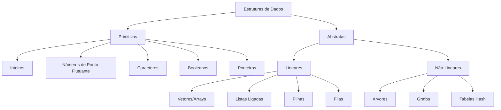

## 2. Estruturas Lineares

As estruturas de dados lineares organizam elementos em uma sequência, onde cada elemento tem no máximo um predecessor e um sucessor. São caracterizadas pela natureza sequencial de seus elementos.

### 2.1. Vetores (Arrays)

#### Conceito e funcionamento

Um vetor (ou array) é a estrutura de dados mais básica e fundamental. É uma coleção de elementos do mesmo tipo armazenados em posições contíguas na memória, indexados por um ou mais índices inteiros.

Para entender um vetor, imagine uma rua com várias casas numeradas sequencialmente. Cada casa (posição do vetor) pode armazenar um objeto (elemento). Para encontrar um objeto específico, você simplesmente vai até o número da casa (índice) onde ele está armazenado.

Características principais:

- Elementos do mesmo tipo
- Tamanho fixo (na implementação clássica)
- Acesso direto através de índices
- Elementos armazenados em posições contíguas na memória

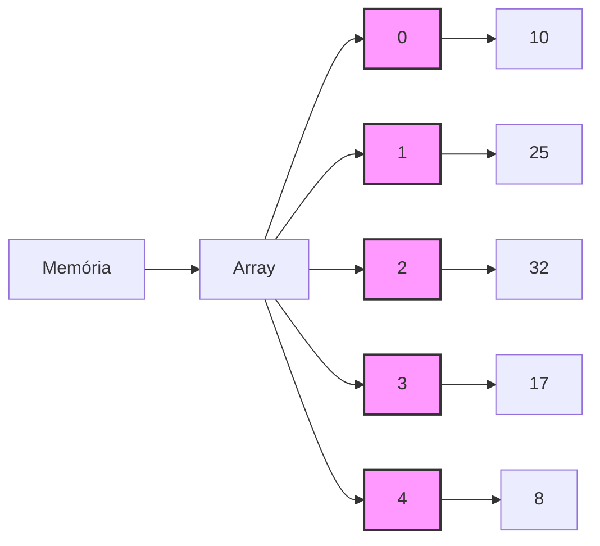

#### Vantagens e limitações

**Vantagens:**

- **Acesso rápido e direto**: O tempo para acessar qualquer elemento é constante O(1), independentemente do tamanho do array.
- **Simplicidade**: Fácil de entender e implementar.
- **Eficiência de memória**: Sem overhead de armazenamento para ponteiros ou outras informações.
- **Localidade de referência**: Elementos adjacentes estão próximos na memória, melhorando o desempenho do cache.

**Limitações:**

- **Tamanho fixo**: Na implementação clássica, o tamanho é determinado na criação e não pode ser alterado (arrays dinâmicos contornam isso realocando memória).
- **Operações de inserção e remoção ineficientes**: Especialmente no meio do array, pois requerem deslocamento de elementos.
- **Alocação contígua**: Requer um bloco contínuo de memória, que pode não estar disponível para arrays muito grandes.
- **Desperdício de espaço**: Se não for totalmente utilizado, pode haver desperdício de memória.

#### Complexidade (Big-O)

| Operação             | Complexidade      | Explicação                                               |
| -------------------- | ----------------- | -------------------------------------------------------- |
| Acesso               | O(1)              | Acesso direto por índice, tempo constante                |
| Busca (não ordenado) | O(n)              | Pior caso, precisa verificar todos os elementos          |
| Busca (ordenado)     | O(log n)          | Usando busca binária                                     |
| Inserção (no final)  | O(1) amortizado\* | Para arrays dinâmicos, considerando realocação ocasional |
| Inserção (no meio)   | O(n)              | Requer deslocamento de elementos                         |
| Remoção (no final)   | O(1)              | Apenas uma operação                                      |
| Remoção (no meio)    | O(n)              | Requer deslocamento de elementos                         |

\*Amortizado significa que, embora ocasionalmente uma operação possa ser mais cara (quando o array precisa ser redimensionado), em média, ao longo de muitas operações, o custo é o indicado.

#### Implementações

Vamos implementar um array simples e mostrar as operações básicas em diferentes linguagens:

**Java:**

```java
public class ArrayDemo {
    public static void main(String[] args) {
        // Declaração e inicialização
        int[] array = new int[5];

        // Inserção (fim)
        for (int i = 0; i < array.length; i++) {
            array[i] = i * 10;
        }

        // Acesso
        System.out.println("Elemento na posição 2: " + array[2]);

        // Busca
        int valorBuscado = 20;
        int indiceEncontrado = -1;
        for (int i = 0; i < array.length; i++) {
            if (array[i] == valorBuscado) {
                indiceEncontrado = i;
                break;
            }
        }
        System.out.println("Valor " + valorBuscado + " encontrado no índice: " + indiceEncontrado);

        // Inserção (meio) - deslocando elementos
        int posicaoInsercao = 2;
        int valorInsercao = 25;

        // Deslocar elementos para a direita
        for (int i = array.length - 1; i > posicaoInsercao; i--) {
            array[i] = array[i - 1];
        }
        array[posicaoInsercao] = valorInsercao;

        // Exibir array após inserção
        System.out.print("Array após inserção no meio: ");
        for (int valor : array) {
            System.out.print(valor + " ");
        }
        System.out.println();

        // Remoção (deslocando elementos)
        int posicaoRemocao = 1;

        // Deslocar elementos para a esquerda
        for (int i = posicaoRemocao; i < array.length - 1; i++) {
            array[i] = array[i + 1];
        }
        array[array.length - 1] = 0; // Zerando última posição

        // Exibir array após remoção
        System.out.print("Array após remoção: ");
        for (int valor : array) {
            System.out.print(valor + " ");
        }
    }
}
```

**Python:**

```python
# Declaração e inicialização
array = [0] * 5

# Inserção (fim)
for i in range(len(array)):
    array[i] = i * 10

# Acesso
print(f"Elemento na posição 2: {array[2]}")

# Busca
valor_buscado = 20
indice_encontrado = -1
for i in range(len(array)):
    if array[i] == valor_buscado:
        indice_encontrado = i
        break
print(f"Valor {valor_buscado} encontrado no índice: {indice_encontrado}")

# Inserção (meio)
posicao_insercao = 2
valor_insercao = 25

# Em Python, podemos usar slice para inserir no meio
array = array[:posicao_insercao] + [valor_insercao] + array[posicao_insercao:]
print(f"Array após inserção no meio: {array}")

# Remoção
posicao_remocao = 1
array = array[:posicao_remocao] + array[posicao_remocao+1:] + [0]
print(f"Array após remoção: {array}")
```

**JavaScript:**

```javascript
// Declaração e inicialização
const array = new Array(5);

// Inserção (fim)
for (let i = 0; i < array.length; i++) {
  array[i] = i * 10;
}

// Acesso
console.log(`Elemento na posição 2: ${array[2]}`);

// Busca
const valorBuscado = 20;
let indiceEncontrado = -1;
for (let i = 0; i < array.length; i++) {
  if (array[i] === valorBuscado) {
    indiceEncontrado = i;
    break;
  }
}
console.log(`Valor ${valorBuscado} encontrado no índice: ${indiceEncontrado}`);

// Inserção (meio)
const posicaoInsercao = 2;
const valorInsercao = 25;

// Em JavaScript, podemos usar splice para inserir no meio
array.splice(posicaoInsercao, 0, valorInsercao);
// Remover último elemento para manter o tamanho original
array.pop();
console.log(`Array após inserção no meio: ${array.join(" ")}`);

// Remoção
const posicaoRemocao = 1;
array.splice(posicaoRemocao, 1);
// Adicionar 0 no final para manter o tamanho
array.push(0);
console.log(`Array após remoção: ${array.join(" ")}`);
```

**TypeScript:**

```typescript
// Declaração e inicialização
const array: number[] = new Array(5);

// Inserção (fim)
for (let i = 0; i < array.length; i++) {
  array[i] = i * 10;
}

// Acesso
console.log(`Elemento na posição 2: ${array[2]}`);

// Busca
const valorBuscado: number = 20;
let indiceEncontrado: number = -1;
for (let i = 0; i < array.length; i++) {
  if (array[i] === valorBuscado) {
    indiceEncontrado = i;
    break;
  }
}
console.log(`Valor ${valorBuscado} encontrado no índice: ${indiceEncontrado}`);

// Inserção (meio)
const posicaoInsercao: number = 2;
const valorInsercao: number = 25;

// Em TypeScript, podemos usar splice para inserir no meio
array.splice(posicaoInsercao, 0, valorInsercao);
// Remover último elemento para manter o tamanho original
array.pop();
console.log(`Array após inserção no meio: ${array.join(" ")}`);

// Remoção
const posicaoRemocao: number = 1;
array.splice(posicaoRemocao, 1);
// Adicionar 0 no final para manter o tamanho
array.push(0);
console.log(`Array após remoção: ${array.join(" ")}`);
```

**C++:**

```cpp
#include <iostream>
using namespace std;

int main() {
    // Declaração e inicialização
    int array[5];

    // Inserção (fim)
    for (int i = 0; i < 5; i++) {
        array[i] = i * 10;
    }

    // Acesso
    cout << "Elemento na posição 2: " << array[2] << endl;

    // Busca
    int valorBuscado = 20;
    int indiceEncontrado = -1;
    for (int i = 0; i < 5; i++) {
        if (array[i] == valorBuscado) {
            indiceEncontrado = i;
            break;
        }
    }
    cout << "Valor " << valorBuscado << " encontrado no índice: " << indiceEncontrado << endl;

    // Inserção (meio) - deslocando elementos
    int posicaoInsercao = 2;
    int valorInsercao = 25;

    // Deslocar elementos para a direita
    for (int i = 4; i > posicaoInsercao; i--) {
        array[i] = array[i - 1];
    }
    array[posicaoInsercao] = valorInsercao;

    // Exibir array após inserção
    cout << "Array após inserção no meio: ";
    for (int i = 0; i < 5; i++) {
        cout << array[i] << " ";
    }
    cout << endl;

    // Remoção (deslocando elementos)
    int posicaoRemocao = 1;

    // Deslocar elementos para a esquerda
    for (int i = posicaoRemocao; i < 4; i++) {
        array[i] = array[i + 1];
    }
    array[4] = 0; // Zerando última posição

    // Exibir array após remoção
    cout << "Array após remoção: ";
    for (int i = 0; i < 5; i++) {
        cout << array[i] << " ";
    }

    return 0;
}
```

# 2.2. Listas Ligadas

## Conceito e Funcionamento

Uma lista ligada é uma estrutura de dados linear onde cada elemento (nó) contém o dado a ser armazenado e uma referência (ponteiro) para o próximo elemento da lista. Diferentemente dos arrays, onde os elementos são armazenados em posições contíguas de memória, em uma lista ligada os elementos podem estar espalhados pela memória.

Para entender o conceito de forma simples, imagine uma caça ao tesouro onde cada pista contém duas informações: um item (o dado) e a localização da próxima pista (o ponteiro). Você não sabe onde estão todas as pistas de antemão - cada pista apenas lhe diz onde encontrar a próxima.

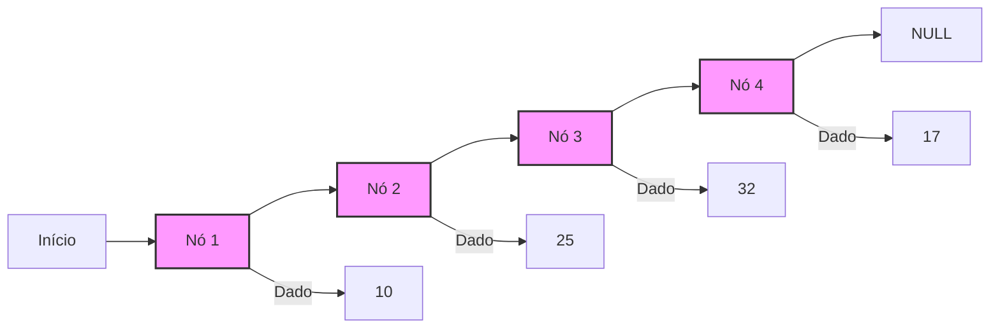

## Tipos de Listas Ligadas

### Lista Ligada Simples

Na lista ligada simples, cada nó aponta apenas para o próximo nó na sequência. O último nó aponta para NULL, indicando o fim da lista.

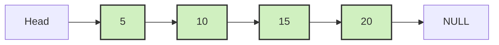

### Lista Duplamente Ligada

Na lista duplamente ligada, cada nó contém duas referências: uma para o próximo nó e outra para o nó anterior. Esta estrutura facilita a navegação em ambas as direções.

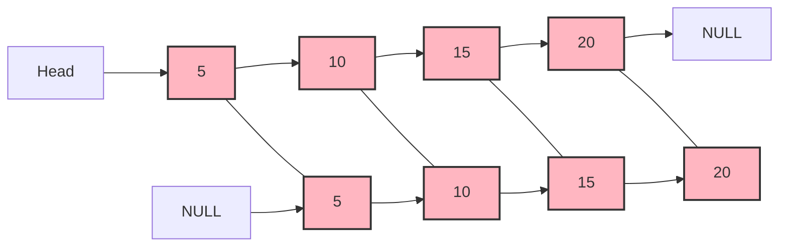

### Lista Circular

Na lista circular, o último nó, em vez de apontar para NULL, aponta de volta para o primeiro nó, formando um ciclo. Pode ser simples ou duplamente ligada.

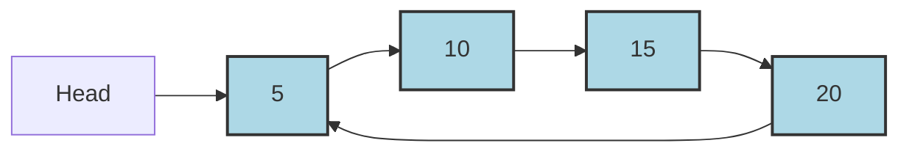

## Alocação Dinâmica e Ponteiros

Listas ligadas utilizam alocação dinâmica de memória - os nós são criados conforme necessário durante a execução do programa. Isso contrasta com arrays tradicionais, onde o tamanho precisa ser definido previamente.

Cada nó é uma estrutura que contém:

- O dado a ser armazenado
- Um ou mais ponteiros (referências) para outros nós

A grande vantagem dessa abordagem é que a lista pode crescer ou diminuir conforme necessário, limitada apenas pela memória disponível no sistema. Não há necessidade de realocar toda a lista ao adicionar ou remover elementos.

Os ponteiros são cruciais para o funcionamento das listas ligadas - eles "amarram" os nós individuais, permitindo a navegação entre eles. Quando um nó é removido, os ponteiros são simplesmente ajustados para "pular" o nó excluído, e a memória alocada para esse nó pode ser liberada.

## Complexidade de Operações

| Operação           | Complexidade   | Explicação                                                                     |
| ------------------ | -------------- | ------------------------------------------------------------------------------ |
| Acesso             | O(n)           | Precisa percorrer a lista desde o início até o elemento desejado               |
| Busca              | O(n)           | No pior caso, verificará todos os elementos                                    |
| Inserção (início)  | O(1)           | Apenas atualiza ponteiros do novo nó e cabeça da lista                         |
| Inserção (fim)     | O(n) ou O(1)\* | Precisa navegar até o final, a menos que mantenha um ponteiro para o último nó |
| Inserção (meio)    | O(n)           | Precisa primeiro localizar a posição (O(n)), depois inserir (O(1))             |
| Remoção (início)   | O(1)           | Apenas atualiza o ponteiro da cabeça                                           |
| Remoção (fim/meio) | O(n)           | Precisa localizar o nó anterior ao que será removido                           |

\*O(1) para inserção no final se a lista mantiver um ponteiro para o último nó, como em algumas implementações de lista circular ou duplamente ligada.

## Implementações

### Lista Ligada Simples

#### Java

```java
public class SinglyLinkedList<T> {
    // Classe interna para representar um nó
    private class Node {
        T data;
        Node next;

        public Node(T data) {
            this.data = data;
            this.next = null;
        }
    }

    private Node head;
    private int size;

    public SinglyLinkedList() {
        this.head = null;
        this.size = 0;
    }

    // Acesso por índice - O(n)
    public T get(int index) {
        if (index < 0 || index >= size) {
            throw new IndexOutOfBoundsException("Índice inválido");
        }

        Node current = head;
        for (int i = 0; i < index; i++) {
            current = current.next;
        }

        return current.data;
    }

    // Busca - O(n)
    public int indexOf(T element) {
        Node current = head;
        int index = 0;

        while (current != null) {
            if (current.data.equals(element)) {
                return index;
            }
            current = current.next;
            index++;
        }

        return -1; // Elemento não encontrado
    }

    // Inserção no início - O(1)
    public void addFirst(T element) {
        Node newNode = new Node(element);
        newNode.next = head;
        head = newNode;
        size++;
    }

    // Inserção no fim - O(n)
    public void addLast(T element) {
        Node newNode = new Node(element);

        if (head == null) {
            head = newNode;
        } else {
            Node current = head;
            while (current.next != null) {
                current = current.next;
            }
            current.next = newNode;
        }

        size++;
    }

    // Inserção em posição específica - O(n)
    public void add(int index, T element) {
        if (index < 0 || index > size) {
            throw new IndexOutOfBoundsException("Índice inválido");
        }

        if (index == 0) {
            addFirst(element);
            return;
        }

        Node newNode = new Node(element);
        Node current = head;

        for (int i = 0; i < index - 1; i++) {
            current = current.next;
        }

        newNode.next = current.next;
        current.next = newNode;
        size++;
    }

    // Remoção do início - O(1)
    public T removeFirst() {
        if (head == null) {
            throw new IllegalStateException("Lista vazia");
        }

        T removedData = head.data;
        head = head.next;
        size--;

        return removedData;
    }

    // Remoção do fim - O(n)
    public T removeLast() {
        if (head == null) {
            throw new IllegalStateException("Lista vazia");
        }

        if (head.next == null) {
            T removedData = head.data;
            head = null;
            size--;
            return removedData;
        }

        Node current = head;
        while (current.next.next != null) {
            current = current.next;
        }

        T removedData = current.next.data;
        current.next = null;
        size--;

        return removedData;
    }

    // Remoção por índice - O(n)
    public T remove(int index) {
        if (index < 0 || index >= size) {
            throw new IndexOutOfBoundsException("Índice inválido");
        }

        if (index == 0) {
            return removeFirst();
        }

        Node current = head;
        for (int i = 0; i < index - 1; i++) {
            current = current.next;
        }

        T removedData = current.next.data;
        current.next = current.next.next;
        size--;

        return removedData;
    }

    // Tamanho da lista
    public int size() {
        return size;
    }

    // Verifica se está vazia
    public boolean isEmpty() {
        return head == null;
    }

    @Override
    public String toString() {
        StringBuilder sb = new StringBuilder("[");
        Node current = head;

        while (current != null) {
            sb.append(current.data);
            if (current.next != null) {
                sb.append(", ");
            }
            current = current.next;
        }

        sb.append("]");
        return sb.toString();
    }

    // Exemplo de uso
    public static void main(String[] args) {
        SinglyLinkedList<Integer> list = new SinglyLinkedList<>();

        // Inserções
        list.addFirst(10);      // [10]
        list.addLast(20);       // [10, 20]
        list.addFirst(5);       // [5, 10, 20]
        list.add(2, 15);        // [5, 10, 15, 20]

        System.out.println("Lista: " + list);

        // Acesso e busca
        System.out.println("Elemento no índice 2: " + list.get(2));
        System.out.println("Índice do elemento 10: " + list.indexOf(10));
        System.out.println("Índice do elemento 30: " + list.indexOf(30));

        // Remoções
        System.out.println("Removido do início: " + list.removeFirst());
        System.out.println("Lista após remoção do início: " + list);

        System.out.println("Removido do fim: " + list.removeLast());
        System.out.println("Lista após remoção do fim: " + list);

        System.out.println("Removido do índice 0: " + list.remove(0));
        System.out.println("Lista final: " + list);
    }
}
```

#### Python

```python
class Node:
    def __init__(self, data):
        self.data = data
        self.next = None

class SinglyLinkedList:
    def __init__(self):
        self.head = None
        self.size = 0

    # Acesso por índice - O(n)
    def get(self, index):
        if index < 0 or index >= self.size:
            raise IndexError("Índice inválido")

        current = self.head
        for i in range(index):
            current = current.next

        return current.data

    # Busca - O(n)
    def index_of(self, element):
        current = self.head
        index = 0

        while current:
            if current.data == element:
                return index
            current = current.next
            index += 1

        return -1  # Elemento não encontrado

    # Inserção no início - O(1)
    def add_first(self, element):
        new_node = Node(element)
        new_node.next = self.head
        self.head = new_node
        self.size += 1

    # Inserção no fim - O(n)
    def add_last(self, element):
        new_node = Node(element)

        if self.head is None:
            self.head = new_node
        else:
            current = self.head
            while current.next:
                current = current.next
            current.next = new_node

        self.size += 1

    # Inserção em posição específica - O(n)
    def add(self, index, element):
        if index < 0 or index > self.size:
            raise IndexError("Índice inválido")

        if index == 0:
            self.add_first(element)
            return

        new_node = Node(element)
        current = self.head

        for i in range(index - 1):
            current = current.next

        new_node.next = current.next
        current.next = new_node
        self.size += 1

    # Remoção do início - O(1)
    def remove_first(self):
        if self.head is None:
            raise Exception("Lista vazia")

        removed_data = self.head.data
        self.head = self.head.next
        self.size -= 1

        return removed_data

    # Remoção do fim - O(n)
    def remove_last(self):
        if self.head is None:
            raise Exception("Lista vazia")

        if self.head.next is None:
            removed_data = self.head.data
            self.head = None
            self.size -= 1
            return removed_data

        current = self.head
        while current.next.next:
            current = current.next

        removed_data = current.next.data
        current.next = None
        self.size -= 1

        return removed_data

    # Remoção por índice - O(n)
    def remove(self, index):
        if index < 0 or index >= self.size:
            raise IndexError("Índice inválido")

        if index == 0:
            return self.remove_first()

        current = self.head
        for i in range(index - 1):
            current = current.next

        removed_data = current.next.data
        current.next = current.next.next
        self.size -= 1

        return removed_data

    # Tamanho da lista
    def length(self):
        return self.size

    # Verifica se está vazia
    def is_empty(self):
        return self.head is None

    def __str__(self):
        if self.head is None:
            return "[]"

        result = "["
        current = self.head

        while current:
            result += str(current.data)
            if current.next:
                result += ", "
            current = current.next

        result += "]"
        return result


# Exemplo de uso
if __name__ == "__main__":
    linked_list = SinglyLinkedList()

    # Inserções
    linked_list.add_first(10)   # [10]
    linked_list.add_last(20)    # [10, 20]
    linked_list.add_first(5)    # [5, 10, 20]
    linked_list.add(2, 15)      # [5, 10, 15, 20]

    print(f"Lista: {linked_list}")

    # Acesso e busca
    print(f"Elemento no índice 2: {linked_list.get(2)}")
    print(f"Índice do elemento 10: {linked_list.index_of(10)}")
    print(f"Índice do elemento 30: {linked_list.index_of(30)}")

    # Remoções
    print(f"Removido do início: {linked_list.remove_first()}")
    print(f"Lista após remoção do início: {linked_list}")

    print(f"Removido do fim: {linked_list.remove_last()}")
    print(f"Lista após remoção do fim: {linked_list}")

    print(f"Removido do índice 0: {linked_list.remove(0)}")
    print(f"Lista final: {linked_list}")
```

#### TypeScript

```typescript
class ListNode<T> {
  data: T;
  next: ListNode<T> | null;

  constructor(data: T) {
    this.data = data;
    this.next = null;
  }
}

class SinglyLinkedList<T> {
  private head: ListNode<T> | null;
  private size: number;

  constructor() {
    this.head = null;
    this.size = 0;
  }

  // Acesso por índice - O(n)
  get(index: number): T {
    if (index < 0 || index >= this.size) {
      throw new Error("Índice inválido");
    }

    let current = this.head!;
    for (let i = 0; i < index; i++) {
      current = current.next!;
    }

    return current.data;
  }

  // Busca - O(n)
  indexOf(element: T): number {
    let current = this.head;
    let index = 0;

    while (current !== null) {
      if (current.data === element) {
        return index;
      }
      current = current.next;
      index++;
    }

    return -1; // Elemento não encontrado
  }

  // Inserção no início - O(1)
  addFirst(element: T): void {
    const newNode = new ListNode<T>(element);
    newNode.next = this.head;
    this.head = newNode;
    this.size++;
  }

  // Inserção no fim - O(n)
  addLast(element: T): void {
    const newNode = new ListNode<T>(element);

    if (this.head === null) {
      this.head = newNode;
    } else {
      let current = this.head;
      while (current.next !== null) {
        current = current.next;
      }
      current.next = newNode;
    }

    this.size++;
  }

  // Inserção em posição específica - O(n)
  add(index: number, element: T): void {
    if (index < 0 || index > this.size) {
      throw new Error("Índice inválido");
    }

    if (index === 0) {
      this.addFirst(element);
      return;
    }

    const newNode = new ListNode<T>(element);
    let current = this.head!;

    for (let i = 0; i < index - 1; i++) {
      current = current.next!;
    }

    newNode.next = current.next;
    current.next = newNode;
    this.size++;
  }

  // Remoção do início - O(1)
  removeFirst(): T {
    if (this.head === null) {
      throw new Error("Lista vazia");
    }

    const removedData = this.head.data;
    this.head = this.head.next;
    this.size--;

    return removedData;
  }

  // Remoção do fim - O(n)
  removeLast(): T {
    if (this.head === null) {
      throw new Error("Lista vazia");
    }

    if (this.head.next === null) {
      const removedData = this.head.data;
      this.head = null;
      this.size--;
      return removedData;
    }

    let current = this.head;
    while (current.next!.next !== null) {
      current = current.next!;
    }

    const removedData = current.next!.data;
    current.next = null;
    this.size--;

    return removedData;
  }

  // Remoção por índice - O(n)
  remove(index: number): T {
    if (index < 0 || index >= this.size) {
      throw new Error("Índice inválido");
    }

    if (index === 0) {
      return this.removeFirst();
    }

    let current = this.head!;
    for (let i = 0; i < index - 1; i++) {
      current = current.next!;
    }

    const removedData = current.next!.data;
    current.next = current.next!.next;
    this.size--;

    return removedData;
  }

  // Tamanho da lista
  getSize(): number {
    return this.size;
  }

  // Verifica se está vazia
  isEmpty(): boolean {
    return this.head === null;
  }

  // Converter para string
  toString(): string {
    if (this.head === null) {
      return "[]";
    }

    let result = "[";
    let current = this.head;

    while (current !== null) {
      result += current.data;
      if (current.next !== null) {
        result += ", ";
      }
      current = current.next;
    }

    result += "]";
    return result;
  }
}

// Exemplo de uso
function demonstrateLinkedList(): void {
  const list = new SinglyLinkedList<number>();

  // Inserções
  list.addFirst(10); // [10]
  list.addLast(20); // [10, 20]
  list.addFirst(5); // [5, 10, 20]
  list.add(2, 15); // [5, 10, 15, 20]

  console.log(`Lista: ${list.toString()}`);

  // Acesso e busca
  console.log(`Elemento no índice 2: ${list.get(2)}`);
  console.log(`Índice do elemento 10: ${list.indexOf(10)}`);
  console.log(`Índice do elemento 30: ${list.indexOf(30)}`);

  // Remoções
  console.log(`Removido do início: ${list.removeFirst()}`);
  console.log(`Lista após remoção do início: ${list.toString()}`);

  console.log(`Removido do fim: ${list.removeLast()}`);
  console.log(`Lista após remoção do fim: ${list.toString()}`);

  console.log(`Removido do índice 0: ${list.remove(0)}`);
  console.log(`Lista final: ${list.toString()}`);
}

demonstrateLinkedList();
```

### Lista Duplamente Ligada

#### Java

```java
public class DoublyLinkedList<T> {
    // Classe interna para representar um nó
    private class Node {
        T data;
        Node prev;
        Node next;

        public Node(T data) {
            this.data = data;
            this.prev = null;
            this.next = null;
        }
    }

    private Node head;
    private Node tail;
    private int size;

    public DoublyLinkedList() {
        this.head = null;
        this.tail = null;
        this.size = 0;
    }

    // Acesso por índice - O(n), mas pode ser otimizado escolhendo
    // se começa do início ou do fim, dependendo da posição do índice
    public T get(int index) {
        if (index < 0 || index >= size) {
            throw new IndexOutOfBoundsException("Índice inválido");
        }

        Node current;

        // Se o índice está na primeira metade, começa do início
        if (index < size / 2) {
            current = head;
            for (int i = 0; i < index; i++) {
                current = current.next;
            }
        }
        // Se o índice está na segunda metade, começa do fim
        else {
            current = tail;
            for (int i = size - 1; i > index; i--) {
                current = current.prev;
            }
        }

        return current.data;
    }

    // Busca - O(n)
    public int indexOf(T element) {
        Node current = head;
        int index = 0;

        while (current != null) {
            if (current.data.equals(element)) {
                return index;
            }
            current = current.next;
            index++;
        }

        return -1; // Elemento não encontrado
    }

    // Inserção no início - O(1)
    public void addFirst(T element) {
        Node newNode = new Node(element);

        if (head == null) {
            head = newNode;
            tail = newNode;
        } else {
            newNode.next = head;
            head.prev = newNode;
            head = newNode;
        }

        size++;
    }

    // Inserção no fim - O(1) com ponteiro para tail
    public void addLast(T element) {
        Node newNode = new Node(element);

        if (tail == null) {
            head = newNode;
            tail = newNode;
        } else {
            newNode.prev = tail;
            tail.next = newNode;
            tail = newNode;
        }

        size++;
    }

    // Inserção em posição específica - O(n)
    public void add(int index, T element) {
        if (index < 0 || index > size) {
            throw new IndexOutOfBoundsException("Índice inválido");
        }

        if (index == 0) {
            addFirst(element);
            return;
        }

        if (index == size) {
            addLast(element);
            return;
        }

        // Encontra o nó na posição desejada
        Node current;
        if (index < size / 2) {
            current = head;
            for (int i = 0; i < index; i++) {
                current = current.next;
            }
        } else {
            current = tail;
            for (int i = size - 1; i > index; i--) {
                current = current.prev;
            }
        }

        // Cria o novo nó e ajusta os ponteiros
        Node newNode = new Node(element);
        newNode.prev = current.prev;
        newNode.next = current;
        current.prev.next = newNode;
        current.prev = newNode;

        size++;
    }

    // Remoção do início - O(1)
    public T removeFirst() {
        if (head == null) {
            throw new IllegalStateException("Lista vazia");
        }

        T removedData = head.data;

        if (head == tail) {
            head = null;
            tail = null;
        } else {
            head = head.next;
            head.prev = null;
        }

        size--;
        return removedData;
    }

    // Remoção do fim - O(1) com ponteiro para tail
    public T removeLast() {
        if (tail == null) {
            throw new IllegalStateException("Lista vazia");
        }

        T removedData = tail.data;

        if (head == tail) {
            head = null;
            tail = null;
        } else {
            tail = tail.prev;
            tail.next = null;
        }

        size--;
        return removedData;
    }

    // Remoção por índice - O(n)
    public T remove(int index) {
        if (index < 0 || index >= size) {
            throw new IndexOutOfBoundsException("Índice inválido");
        }

        if (index == 0) {
            return removeFirst();
        }

        if (index == size - 1) {
            return removeLast();
        }

        // Encontra o nó a ser removido
        Node current;
        if (index < size / 2) {
            current = head;
            for (int i = 0; i < index; i++) {
                current = current.next;
            }
        } else {
            current = tail;
            for (int i = size - 1; i > index; i--) {
                current = current.prev;
            }
        }

        // Ajusta os ponteiros para "pular" o nó
        current.prev.next = current.next;
        current.next.prev = current.prev;

        T removedData = current.data;
        size--;

        return removedData;
    }

    // Tamanho da lista
    public int size() {
        return size;
    }

    // Verifica se está vazia
    public boolean isEmpty() {
        return size == 0;
    }

    @Override
    public String toString() {
        StringBuilder sb = new StringBuilder("[");
        Node current = head;

        while (current != null) {
            sb.append(current.data);
            if (current.next != null) {
                sb.append(", ");
            }
            current = current.next;
        }

        sb.append("]");
        return sb.toString();
    }

    // Exemplo de uso
    public static void main(String[] args) {
        DoublyLinkedList<Integer> list = new DoublyLinkedList<>();

        // Inserções
        list.addFirst(10);      // [10]
        list.addLast(20);       // [10, 20]
        list.addFirst(5);       // [5, 10, 20]
        list.add(2, 15);        // [5, 10, 15, 20]

        System.out.println("Lista: " + list);

        // Acesso e busca
        System.out.println("Elemento no índice 2: " + list.get(2));
        System.out.println("Índice do elemento 10: " + list.indexOf(10));

        // Remoções
        System.out.println("Removido do início: " + list.removeFirst());
        System.out.println("Lista após remoção do início: " + list);

        System.out.println("Removido do fim: " + list.removeLast());
        System.out.println("Lista após remoção do fim: " + list);

        System.out.println("Removido do meio (índice 0): " + list.remove(0));
        System.out.println("Lista final: " + list);
    }
}
```

#### Python

```python
class Node:
    def __init__(self, data):
        self.data = data
        self.prev = None
        self.next = None

class DoublyLinkedList:
    def __init__(self):
        self.head = None
        self.tail = None
        self.size = 0

    # Acesso por índice - O(n), mas otimizado
    def get(self, index):
        if index < 0 or index >= self.size:
            raise IndexError("Índice inválido")

        # Escolhe começar do início ou do fim dependendo da posição
        if index < self.size // 2:
            current = self.head
            for i in range(index):
                current = current.next
        else:
            current = self.tail
            for i in range(self.size - 1, index, -1):
                current = current.prev

        return current.data

    # Busca - O(n)
    def index_of(self, element):
        current = self.head
        index = 0

        while current:
            if current.data == element:
                return index
            current = current.next
            index += 1

        return -1  # Elemento não encontrado

    # Inserção no início - O(1)
    def add_first(self, element):
        new_node = Node(element)

        if self.head is None:
            self.head = new_node
            self.tail = new_node
        else:
            new_node.next = self.head
            self.head.prev = new_node
            self.head = new_node

        self.size += 1

    # Inserção no fim - O(1) com ponteiro para tail
    def add_last(self, element):
        new_node = Node(element)

        if self.tail is None:
            self.head = new_node
            self.tail = new_node
        else:
            new_node.prev = self.tail
            self.tail.next = new_node
            self.tail = new_node

        self.size += 1

    # Inserção em posição específica - O(n)
    def add(self, index, element):
        if index < 0 or index > self.size:
            raise IndexError("Índice inválido")

        if index == 0:
            self.add_first(element)
            return

        if index == self.size:
            self.add_last(element)
            return

        # Localiza o nó na posição
        if index < self.size // 2:
            current = self.head
            for i in range(index):
                current = current.next
        else:
            current = self.tail
            for i in range(self.size - 1, index, -1):
                current = current.prev

        # Insere o novo nó antes do nó current
        new_node = Node(element)
        new_node.prev = current.prev
        new_node.next = current
        current.prev.next = new_node
        current.prev = new_node

        self.size += 1

    # Remoção do início - O(1)
    def remove_first(self):
        if self.head is None:
            raise Exception("Lista vazia")

        removed_data = self.head.data

        if self.head == self.tail:
            self.head = None
            self.tail = None
        else:
            self.head = self.head.next
            self.head.prev = None

        self.size -= 1
        return removed_data

    # Remoção do fim - O(1) com ponteiro para tail
    def remove_last(self):
        if self.tail is None:
            raise Exception("Lista vazia")

        removed_data = self.tail.data

        if self.head == self.tail:
            self.head = None
            self.tail = None
        else:
            self.tail = self.tail.prev
            self.tail.next = None

        self.size -= 1
        return removed_data

    # Remoção por índice - O(n)
    def remove(self, index):
        if index < 0 or index >= self.size:
            raise IndexError("Índice inválido")

        if index == 0:
            return self.remove_first()

        if index == self.size - 1:
            return self.remove_last()

        # Localiza o nó a ser removido
        if index < self.size // 2:
            current = self.head
            for i in range(index):
                current = current.next
        else:
            current = self.tail
            for i in range(self.size - 1, index, -1):
                current = current.prev

        # Ajusta os ponteiros para "pular" o nó
        current.prev.next = current.next
        current.next.prev = current.prev

        removed_data = current.data
        self.size -= 1

        return removed_data

    # Tamanho da lista
    def length(self):
        return self.size

    # Verifica se está vazia
    def is_empty(self):
        return self.size == 0

    def __str__(self):
        if self.head is None:
            return "[]"

        result = "["
        current = self.head

        while current:
            result += str(current.data)
            if current.next:
                result += ", "
            current = current.next

        result += "]"
        return result


# Exemplo de uso
if __name__ == "__main__":
    linked_list = DoublyLinkedList()

    # Inserções
    linked_list.add_first(10)   # [10]
    linked_list.add_last(20)    # [10, 20]
    linked_list.add_first(5)    # [5, 10, 20]
    linked_list.add(2, 15)      # [5, 10, 15, 20]

    print(f"Lista: {linked_list}")

    # Acesso e busca
    print(f"Elemento no índice 2: {linked_list.get(2)}")
    print(f"Índice do elemento 10: {linked_list.index_of(10)}")

    # Remoções
    print(f"Removido do início: {linked_list.remove_first()}")
    print(f"Lista após remoção do início: {linked_list}")

    print(f"Removido do fim: {linked_list.remove_last()}")
    print(f"Lista após remoção do fim: {linked_list}")

    print(f"Removido do meio (índice 0): {linked_list.remove(0)}")
    print(f"Lista final: {linked_list}")
```

#### TypeScript

```typescript
class DLLNode<T> {
  data: T;
  prev: DLLNode<T> | null;
  next: DLLNode<T> | null;

  constructor(data: T) {
    this.data = data;
    this.prev = null;
    this.next = null;
  }
}

class DoublyLinkedList<T> {
  private head: DLLNode<T> | null;
  private tail: DLLNode<T> | null;
  private size: number;

  constructor() {
    this.head = null;
    this.tail = null;
    this.size = 0;
  }

  // Acesso por índice - O(n), mas otimizado
  get(index: number): T {
    if (index < 0 || index >= this.size) {
      throw new Error("Índice inválido");
    }

    let current: DLLNode<T>;

    // Escolhe começar do início ou do fim dependendo da posição
    if (index < this.size / 2) {
      current = this.head!;
      for (let i = 0; i < index; i++) {
        current = current.next!;
      }
    } else {
      current = this.tail!;
      for (let i = this.size - 1; i > index; i--) {
        current = current.prev!;
      }
    }

    return current.data;
  }

  // Busca - O(n)
  indexOf(element: T): number {
    let current = this.head;
    let index = 0;

    while (current !== null) {
      if (current.data === element) {
        return index;
      }
      current = current.next;
      index++;
    }

    return -1; // Elemento não encontrado
  }

  // Inserção no início - O(1)
  addFirst(element: T): void {
    const newNode = new DLLNode<T>(element);

    if (this.head === null) {
      this.head = newNode;
      this.tail = newNode;
    } else {
      newNode.next = this.head;
      this.head.prev = newNode;
      this.head = newNode;
    }

    this.size++;
  }

  // Inserção no fim - O(1) com ponteiro para tail
  addLast(element: T): void {
    const newNode = new DLLNode<T>(element);

    if (this.tail === null) {
      this.head = newNode;
      this.tail = newNode;
    } else {
      newNode.prev = this.tail;
      this.tail.next = newNode;
      this.tail = newNode;
    }

    this.size++;
  }

  // Inserção em posição específica - O(n)
  add(index: number, element: T): void {
    if (index < 0 || index > this.size) {
      throw new Error("Índice inválido");
    }

    if (index === 0) {
      this.addFirst(element);
      return;
    }

    if (index === this.size) {
      this.addLast(element);
      return;
    }

    // Encontra o nó na posição desejada
    let current: DLLNode<T>;
    if (index < this.size / 2) {
      current = this.head!;
      for (let i = 0; i < index; i++) {
        current = current.next!;
      }
    } else {
      current = this.tail!;
      for (let i = this.size - 1; i > index; i--) {
        current = current.prev!;
      }
    }

    // Insere o novo nó antes do nó current
    const newNode = new DLLNode<T>(element);
    newNode.prev = current.prev;
    newNode.next = current;
    current.prev!.next = newNode;
    current.prev = newNode;

    this.size++;
  }

  // Remoção do início - O(1)
  removeFirst(): T {
    if (this.head === null) {
      throw new Error("Lista vazia");
    }

    const removedData = this.head.data;

    if (this.head === this.tail) {
      this.head = null;
      this.tail = null;
    } else {
      this.head = this.head.next;
      this.head!.prev = null;
    }

    this.size--;
    return removedData;
  }

  // Remoção do fim - O(1) com ponteiro para tail
  removeLast(): T {
    if (this.tail === null) {
      throw new Error("Lista vazia");
    }

    const removedData = this.tail.data;

    if (this.head === this.tail) {
      this.head = null;
      this.tail = null;
    } else {
      this.tail = this.tail.prev;
      this.tail!.next = null;
    }

    this.size--;
    return removedData;
  }

  // Remoção por índice - O(n)
  remove(index: number): T {
    if (index < 0 || index >= this.size) {
      throw new Error("Índice inválido");
    }

    if (index === 0) {
      return this.removeFirst();
    }

    if (index === this.size - 1) {
      return this.removeLast();
    }

    // Encontra o nó a ser removido
    let current: DLLNode<T>;
    if (index < this.size / 2) {
      current = this.head!;
      for (let i = 0; i < index; i++) {
        current = current.next!;
      }
    } else {
      current = this.tail!;
      for (let i = this.size - 1; i > index; i--) {
        current = current.prev!;
      }
    }

    // Ajusta os ponteiros para "pular" o nó
    current.prev!.next = current.next;
    current.next!.prev = current.prev;

    const removedData = current.data;
    this.size--;

    return removedData;
  }

  // Tamanho da lista
  getSize(): number {
    return this.size;
  }

  // Verifica se está vazia
  isEmpty(): boolean {
    return this.size === 0;
  }

  // Converter para string
  toString(): string {
    if (this.head === null) {
      return "[]";
    }

    let result = "[";
    let current = this.head;

    while (current !== null) {
      result += current.data.toString();
      if (current.next !== null) {
        result += ", ";
      }
      current = current.next;
    }

    result += "]";
    return result;
  }
}

// Exemplo de uso
function demonstrateDoublyLinkedList(): void {
  const list = new DoublyLinkedList<number>();

  // Inserções
  list.addFirst(10); // [10]
  list.addLast(20); // [10, 20]
  list.addFirst(5); // [5, 10, 20]
  list.add(2, 15); // [5, 10, 15, 20]

  console.log(`Lista: ${list.toString()}`);

  // Acesso e busca
  console.log(`Elemento no índice 2: ${list.get(2)}`);
  console.log(`Índice do elemento 10: ${list.indexOf(10)}`);

  // Remoções
  console.log(`Removido do início: ${list.removeFirst()}`);
  console.log(`Lista após remoção do início: ${list.toString()}`);

  console.log(`Removido do fim: ${list.removeLast()}`);
  console.log(`Lista após remoção do fim: ${list.toString()}`);

  console.log(`Removido do meio (índice 0): ${list.remove(0)}`);
  console.log(`Lista final: ${list.toString()}`);
}

demonstrateDoublyLinkedList();
```

### Lista Circular

#### Java

```java
public class CircularLinkedList<T> {
    // Classe interna para representar um nó
    private class Node {
        T data;
        Node next;

        public Node(T data) {
            this.data = data;
            this.next = null;
        }
    }

    private Node tail;  // Mantemos apenas referência para o último elemento
    private int size;

    public CircularLinkedList() {
        this.tail = null;
        this.size = 0;
    }

    // Acesso por índice - O(n)
    public T get(int index) {
        if (index < 0 || index >= size) {
            throw new IndexOutOfBoundsException("Índice inválido");
        }

        if (index == size - 1) {
            return tail.data;  // Acesso rápido ao último elemento
        }

        Node current = tail.next;  // Primeiro elemento (head)
        for (int i = 0; i < index; i++) {
            current = current.next;
        }

        return current.data;
    }

    // Busca - O(n)
    public int indexOf(T element) {
        if (tail == null) {
            return -1;
        }

        Node current = tail.next;  // Primeiro elemento (head)
        int index = 0;

        do {
            if (current.data.equals(element)) {
                return index;
            }
            current = current.next;
            index++;
        } while (current != tail.next);

        return -1; // Elemento não encontrado
    }

    // Inserção no início - O(1)
    public void addFirst(T element) {
        Node newNode = new Node(element);

        if (tail == null) {
            newNode.next = newNode;  // Aponta para si mesmo
            tail = newNode;
        } else {
            newNode.next = tail.next;  // Novo nó aponta para o antigo primeiro nó
            tail.next = newNode;       // Tail agora aponta para o novo primeiro nó
        }

        size++;
    }

    // Inserção no fim - O(1) com ponteiro para tail
    public void addLast(T element) {
        Node newNode = new Node(element);

        if (tail == null) {
            newNode.next = newNode;  // Aponta para si mesmo
            tail = newNode;
        } else {
            newNode.next = tail.next;  // Novo nó aponta para o primeiro nó
            tail.next = newNode;       // Antigo tail aponta para o novo nó
            tail = newNode;            // Atualiza o tail para o novo nó
        }

        size++;
    }

    // Inserção em posição específica - O(n)
    public void add(int index, T element) {
        if (index < 0 || index > size) {
            throw new IndexOutOfBoundsException("Índice inválido");
        }

        if (index == 0) {
            addFirst(element);
            return;
        }

        if (index == size) {
            addLast(element);
            return;
        }

        // Encontrar o nó anterior à posição
        Node current = tail.next;  // Primeiro elemento (head)
        for (int i = 0; i < index - 1; i++) {
            current = current.next;
        }

        // Inserir o novo nó após o nó current
        Node newNode = new Node(element);
        newNode.next = current.next;
        current.next = newNode;

        size++;
    }

    // Remoção do início - O(1)
    public T removeFirst() {
        if (tail == null) {
            throw new IllegalStateException("Lista vazia");
        }

        T removedData = tail.next.data;

        if (tail.next == tail) {
            // Só tem um elemento
            tail = null;
        } else {
            tail.next = tail.next.next;
        }

        size--;
        return removedData;
    }

    // Remoção do fim - O(n)
    public T removeLast() {
        if (tail == null) {
            throw new IllegalStateException("Lista vazia");
        }

        T removedData = tail.data;

        if (tail.next == tail) {
            // Só tem um elemento
            tail = null;
        } else {
            // Encontra o nó anterior ao tail
            Node current = tail.next;
            while (current.next != tail) {
                current = current.next;
            }

            current.next = tail.next;  // Node anterior ao tail agora aponta para o primeiro
            tail = current;            // Atualiza o tail
        }

        size--;
        return removedData;
    }

    // Remoção por índice - O(n)
    public T remove(int index) {
        if (index < 0 || index >= size) {
            throw new IndexOutOfBoundsException("Índice inválido");
        }

        if (index == 0) {
            return removeFirst();
        }

        if (index == size - 1) {
            return removeLast();
        }

        // Encontrar o nó anterior ao que será removido
        Node current = tail.next;  // Primeiro elemento (head)
        for (int i = 0; i < index - 1; i++) {
            current = current.next;
        }

        T removedData = current.next.data;
        current.next = current.next.next;  // "Pula" o nó a ser removido

        size--;
        return removedData;
    }

    // Tamanho da lista
    public int size() {
        return size;
    }

    // Verifica se está vazia
    public boolean isEmpty() {
        return size == 0;
    }

    @Override
    public String toString() {
        if (tail == null) {
            return "[]";
        }

        StringBuilder sb = new StringBuilder("[");
        Node current = tail.next;  // Primeiro elemento (head)

        do {
            sb.append(current.data);
            current = current.next;
            if (current != tail.next) {
                sb.append(", ");
            }
        } while (current != tail.next);

        sb.append("]");
        return sb.toString();
    }

    // Exemplo de uso
    public static void main(String[] args) {
        CircularLinkedList<Integer> list = new CircularLinkedList<>();

        // Inserções
        list.addFirst(10);      // [10]
        list.addLast(20);       // [10, 20]
        list.addFirst(5);       // [5, 10, 20]
        list.add(2, 15);        // [5, 10, 15, 20]

        System.out.println("Lista: " + list);

        // Acesso e busca
        System.out.println("Elemento no índice 2: " + list.get(2));
        System.out.println("Índice do elemento 10: " + list.indexOf(10));

        // Remoções
        System.out.println("Removido do início: " + list.removeFirst());
        System.out.println("Lista após remoção do início: " + list);

        System.out.println("Removido do fim: " + list.removeLast());
        System.out.println("Lista após remoção do fim: " + list);

        System.out.println("Removido do meio (índice 0): " + list.remove(0));
        System.out.println("Lista final: " + list);
    }
}
```

## Casos de Uso

As listas ligadas são especialmente úteis nos seguintes contextos:

1. **Quando o tamanho da coleção é desconhecido ou varia significativamente**:

   - Implementações de pilhas e filas
   - Cache LRU (Least Recently Used)
   - Histórico de navegação em navegadores web
   - Gerenciamento de tarefas em sistemas operacionais

2. **Quando há frequentes inserções e remoções em qualquer posição**:

   - Editores de texto (especialmente para operações de desfazer/refazer)
   - Jogos (listas de objetos que são frequentemente adicionados/removidos)
   - Controle de músicas em um player (playlist)

3. **Otimizações específicas**:

   - Listas circulares: Implementação de buffers circulares, agendadores round-robin
   - Listas duplamente ligadas: Navegação em ambas direções em históricos de navegação
   - Quando a memória está fragmentada (cada nó pode ser alocado separadamente)

4. **Implementação de outras estruturas de dados**:
   - Grafos (lista de adjacência)
   - Tabelas hash (para resolver colisões)
   - Árvores (para armazenar filhos de um nó)

## Vantagens e Limitações

### Vantagens:

- Tamanho dinâmico (cresce e diminui conforme necessário)
- Inserções e remoções eficientes (quando já se tem referência ao nó)
- Não precisa de realocação de memória como arrays
- Pode ser implementada para navegação em ambas direções (duplamente ligada)
- Pode formar ciclos (circular)

### Limitações:

- Acesso aleatório ineficiente - precisa percorrer a lista desde o início
- Maior overhead de memória (cada nó precisa armazenar ponteiros)
- Não há localidade de referência como em arrays (impacto no cache)
- Maior complexidade de implementação
- Maior risco de vazamento de memória se não gerenciada corretamente

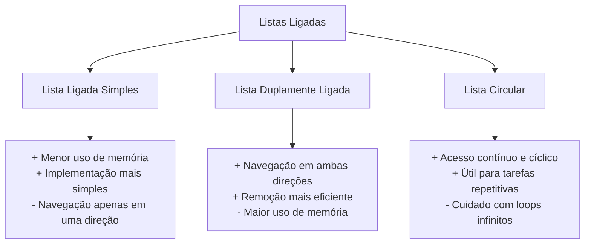

## Comparação com Arrays

| Aspecto           | Lista Ligada      | Array                 |
| ----------------- | ----------------- | --------------------- |
| Acesso            | O(n)              | O(1)                  |
| Inserção (início) | O(1)              | O(n)                  |
| Inserção (meio)   | O(n)\*            | O(n)                  |
| Inserção (fim)    | O(1)\*\*          | O(1) amortizado\*\*\* |
| Remoção (início)  | O(1)              | O(n)                  |
| Remoção (meio)    | O(n)\*            | O(n)                  |
| Remoção (fim)     | O(1)\*\*          | O(1)                  |
| Uso de memória    | Maior (ponteiros) | Menor (só dados)      |
| Localidade        | Pior              | Melhor                |
| Tamanho           | Dinâmico          | Estático\*\*\*\*      |

\* O(n) para encontrar a posição, mas O(1) para a própria inserção/remoção após encontrá-la  
\*\* O(1) para listas duplamente ligadas ou listas com referência ao último nó  
\*** Arrays dinâmicos (como ArrayList em Java ou vector em C++)  
\*\*** Arrays tradicionais; arrays dinâmicos contornam essa limitação com realocação

# 2.3. Pilhas (Stacks)

Uma pilha é uma estrutura de dados fundamental que segue o princípio LIFO (Last In, First Out), onde o último elemento inserido é o primeiro a ser removido. Imagine uma pilha de pratos: você sempre coloca e retira pratos do topo.

## Princípio LIFO (Last In, First Out)

O funcionamento de uma pilha é baseado no princípio LIFO, que se traduz em:

- **Inserção (push)**: Adiciona um elemento sempre no topo da pilha
- **Remoção (pop)**: Remove apenas o elemento que está no topo
- **Consulta (peek/top)**: Verifica o elemento do topo sem removê-lo

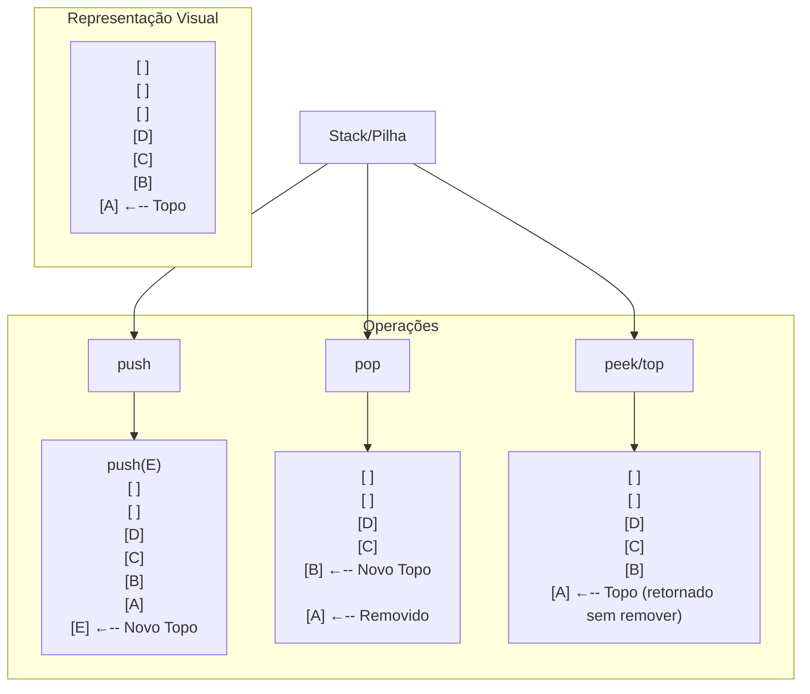

## Implementações de Pilha

### 1. Implementação com Array

A implementação com array é simples e eficiente em termos de memória, mas pode requerer redimensionamento se a pilha crescer além do tamanho inicial.

#### Java

```java
public class ArrayStack<T> {
    private Object[] stack;
    private int top; // índice do topo da pilha
    private static final int DEFAULT_CAPACITY = 10;

    public ArrayStack() {
        stack = new Object[DEFAULT_CAPACITY];
        top = -1; // pilha vazia
    }

    // Verifica se a pilha está vazia
    public boolean isEmpty() {
        return top == -1;
    }

    // Verifica se a pilha está cheia
    public boolean isFull() {
        return top == stack.length - 1;
    }

    // Retorna o tamanho atual da pilha
    public int size() {
        return top + 1;
    }

    // Adiciona um elemento no topo da pilha
    public void push(T element) {
        if (isFull()) {
            // Aumenta o tamanho do array se estiver cheio
            resize(2 * stack.length);
        }
        stack[++top] = element;
    }

    // Remove e retorna o elemento do topo
    @SuppressWarnings("unchecked")
    public T pop() {
        if (isEmpty()) {
            throw new IllegalStateException("A pilha está vazia");
        }
        T element = (T) stack[top];
        stack[top--] = null; // Para coleta de lixo

        // Reduz o tamanho do array se estiver muito vazio
        if (size() > 0 && size() == stack.length / 4) {
            resize(stack.length / 2);
        }
        return element;
    }

    // Consulta o elemento do topo sem removê-lo
    @SuppressWarnings("unchecked")
    public T peek() {
        if (isEmpty()) {
            throw new IllegalStateException("A pilha está vazia");
        }
        return (T) stack[top];
    }

    // Redimensiona o array
    private void resize(int capacity) {
        Object[] newStack = new Object[capacity];
        for (int i = 0; i <= top; i++) {
            newStack[i] = stack[i];
        }
        stack = newStack;
    }
}
```

#### Python

```python
class ArrayStack:
    def __init__(self):
        self.stack = []  # Python lists são arrays dinâmicos

    def is_empty(self):
        return len(self.stack) == 0

    def size(self):
        return len(self.stack)

    def push(self, item):
        self.stack.append(item)  # O(1) amortizado

    def pop(self):
        if self.is_empty():
            raise IndexError("A pilha está vazia")
        return self.stack.pop()  # O(1)

    def peek(self):
        if self.is_empty():
            raise IndexError("A pilha está vazia")
        return self.stack[-1]  # O(1)
```

#### JavaScript

```javascript
class ArrayStack {
  constructor() {
    this.stack = [];
  }

  isEmpty() {
    return this.stack.length === 0;
  }

  size() {
    return this.stack.length;
  }

  push(item) {
    this.stack.push(item);
  }

  pop() {
    if (this.isEmpty()) {
      throw new Error("A pilha está vazia");
    }
    return this.stack.pop();
  }

  peek() {
    if (this.isEmpty()) {
      throw new Error("A pilha está vazia");
    }
    return this.stack[this.stack.length - 1];
  }
}
```

#### TypeScript

```typescript
class ArrayStack<T> {
  private stack: T[];

  constructor() {
    this.stack = [];
  }

  isEmpty(): boolean {
    return this.stack.length === 0;
  }

  size(): number {
    return this.stack.length;
  }

  push(item: T): void {
    this.stack.push(item);
  }

  pop(): T {
    if (this.isEmpty()) {
      throw new Error("A pilha está vazia");
    }
    return this.stack.pop()!; // O '!' indica que sabemos que não será undefined
  }

  peek(): T {
    if (this.isEmpty()) {
      throw new Error("A pilha está vazia");
    }
    return this.stack[this.stack.length - 1];
  }
}
```

### 2. Implementação com Lista Encadeada

A implementação com lista encadeada não tem limite de tamanho predefinido e utiliza melhor a memória para pilhas dinâmicas.

#### Java

```java
public class LinkedStack<T> {
    private static class Node<T> {
        private T data;
        private Node<T> next;

        public Node(T data) {
            this.data = data;
        }
    }

    private Node<T> top;
    private int size;

    public LinkedStack() {
        top = null;
        size = 0;
    }

    public boolean isEmpty() {
        return top == null;
    }

    public int size() {
        return size;
    }

    // Adiciona um elemento no topo da pilha
    public void push(T element) {
        Node<T> newNode = new Node<>(element);
        newNode.next = top;
        top = newNode;
        size++;
    }

    // Remove e retorna o elemento do topo
    public T pop() {
        if (isEmpty()) {
            throw new IllegalStateException("A pilha está vazia");
        }
        T element = top.data;
        top = top.next;
        size--;
        return element;
    }

    // Consulta o elemento do topo sem removê-lo
    public T peek() {
        if (isEmpty()) {
            throw new IllegalStateException("A pilha está vazia");
        }
        return top.data;
    }
}
```

#### Python

```python
class Node:
    def __init__(self, data):
        self.data = data
        self.next = None

class LinkedStack:
    def __init__(self):
        self.top = None
        self.size = 0

    def is_empty(self):
        return self.top is None

    def get_size(self):
        return self.size

    def push(self, item):
        new_node = Node(item)
        new_node.next = self.top
        self.top = new_node
        self.size += 1

    def pop(self):
        if self.is_empty():
            raise IndexError("A pilha está vazia")
        item = self.top.data
        self.top = self.top.next
        self.size -= 1
        return item

    def peek(self):
        if self.is_empty():
            raise IndexError("A pilha está vazia")
        return self.top.data
```

#### JavaScript

```javascript
class Node {
  constructor(data) {
    this.data = data;
    this.next = null;
  }
}

class LinkedStack {
  constructor() {
    this.top = null;
    this.size = 0;
  }

  isEmpty() {
    return this.top === null;
  }

  getSize() {
    return this.size;
  }

  push(item) {
    const newNode = new Node(item);
    newNode.next = this.top;
    this.top = newNode;
    this.size++;
  }

  pop() {
    if (this.isEmpty()) {
      throw new Error("A pilha está vazia");
    }
    const item = this.top.data;
    this.top = this.top.next;
    this.size--;
    return item;
  }

  peek() {
    if (this.isEmpty()) {
      throw new Error("A pilha está vazia");
    }
    return this.top.data;
  }
}
```

#### TypeScript

```typescript
class Node<T> {
  data: T;
  next: Node<T> | null;

  constructor(data: T) {
    this.data = data;
    this.next = null;
  }
}

class LinkedStack<T> {
  private top: Node<T> | null;
  private size: number;

  constructor() {
    this.top = null;
    this.size = 0;
  }

  isEmpty(): boolean {
    return this.top === null;
  }

  getSize(): number {
    return this.size;
  }

  push(item: T): void {
    const newNode = new Node<T>(item);
    newNode.next = this.top;
    this.top = newNode;
    this.size++;
  }

  pop(): T {
    if (this.isEmpty()) {
      throw new Error("A pilha está vazia");
    }
    const item = this.top!.data;
    this.top = this.top!.next;
    this.size--;
    return item;
  }

  peek(): T {
    if (this.isEmpty()) {
      throw new Error("A pilha está vazia");
    }
    return this.top!.data;
  }
}
```

## Comparação entre Implementações

```mermaid
graph TD
    A[Implementações de Pilha] --> B[Com Array]
    A --> C[Com Lista Encadeada]

    B --> B1[Vantagens]
    B --> B2[Desvantagens]
    B1 --> B11[Acesso constante O(1) ao topo]
    B1 --> B12[Uso de memória econômico]
    B1 --> B13[Localidade de referência: melhor para cache]
    B2 --> B21[Tamanho fixo, precisa redimensionar]
    B2 --> B22[Redimensionamento pode ser O(n)]

    C --> C1[Vantagens]
    C --> C2[Desvantagens]
    C1 --> C11[Sem limite de tamanho predefinido]
    C1 --> C12[Inserção e remoção O(1)]
    C1 --> C13[Não precisa redimensionar]
    C2 --> C21[Uso adicional de memória para ponteiros]
    C2 --> C22[Menor eficiência de cache]

```

## Complexidade das Operações

| Operação | Array  | Lista Encadeada |
| -------- | ------ | --------------- |
| push     | O(1)\* | O(1)            |
| pop      | O(1)\* | O(1)            |
| peek     | O(1)   | O(1)            |
| isEmpty  | O(1)   | O(1)            |
| size     | O(1)   | O(1)            |

\* Amortizado, considerando que o redimensionamento ocorre raramente

## Aplicações Reais de Pilhas

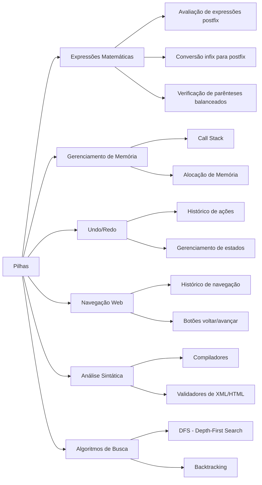

### 1. Processamento de Expressões Matemáticas

As pilhas são fundamentais para avaliar expressões matemáticas:

- **Avaliação de expressões postfix (notação polonesa reversa)**: Calculadoras HP usam esse método
- **Conversão de infix para postfix**: Transformar `a+b*c` em `abc*+`
- **Verificação de parênteses balanceados**: Validar se expressões como `(a+b)*[c-d]` têm parênteses corretamente aninhados

#### Exemplo: Verificação de parênteses balanceados

```java
public boolean isBalanced(String expr) {
    LinkedStack<Character> stack = new LinkedStack<>();

    for (char c : expr.toCharArray()) {
        if (c == '(' || c == '[' || c == '{') {
            stack.push(c);
        } else if (c == ')' || c == ']' || c == '}') {
            if (stack.isEmpty()) {
                return false;
            }

            char top = stack.pop();
            if ((c == ')' && top != '(') ||
                (c == ']' && top != '[') ||
                (c == '}' && top != '{')) {
                return false;
            }
        }
    }

    return stack.isEmpty(); // true se todos os parênteses estiverem balanceados
}
```

### 2. Gerenciamento de Memória em Computadores

- **Call Stack**: Gerencia chamadas de funções/métodos em programas
- Cada chamada de função cria um "frame" na pilha contendo variáveis locais e endereço de retorno
- Quando a função termina, seu frame é removido da pilha (pop)
- Erros como "Stack Overflow" ocorrem quando essa pilha excede seu limite (ex: recursão infinita)

### 3. Funcionalidade Undo/Redo em Aplicativos

- Editores de texto, planilhas e ferramentas de design usam pilhas para rastrear alterações
- **Undo**: Pop da pilha de ações
- **Redo**: Pop da pilha de desfazer e push na pilha de ações

#### Exemplo: Sistema simples de Undo/Redo

```python
class TextEditor:
    def __init__(self):
        self.text = ""
        self.undo_stack = LinkedStack()
        self.redo_stack = LinkedStack()

    def add_text(self, new_text):
        old_text = self.text
        self.text += new_text
        self.undo_stack.push(old_text)
        self.redo_stack = LinkedStack()  # Limpa a pilha de redo

    def undo(self):
        if not self.undo_stack.is_empty():
            self.redo_stack.push(self.text)
            self.text = self.undo_stack.pop()

    def redo(self):
        if not self.redo_stack.is_empty():
            self.undo_stack.push(self.text)
            self.text = self.redo_stack.pop()
```

### 4. Navegação Web

- Navegadores usam pilhas para implementar os botões "Voltar" e "Avançar"
- Visitar uma nova página: Push na pilha de histórico
- Botão "Voltar": Pop da pilha de histórico, push na pilha de "avançar"

### 5. Análise Sintática e Compiladores

- Compiladores usam pilhas para analisar a estrutura gramatical do código
- Validadores XML/HTML usam pilhas para verificar se as tags estão corretamente aninhadas

### 6. Algoritmos de Busca

- **Depth-First Search (DFS)**: Usa pilha para rastrear os nós a serem visitados
- **Backtracking**: Técnica que usa pilha para explorar todas as possibilidades em busca da solução

## Considerações Práticas

- As pilhas são ideais quando você precisa processar itens na ordem inversa de chegada
- A interface de uma pilha é intencionalmente limitada para garantir o comportamento LIFO
- Se você precisa acessar elementos do meio, talvez uma lista seja mais adequada
- Se você precisa acessar elementos em ambas as extremidades, considere usar uma fila de duas pontas (deque)

## Exercícios Práticos

1. Implemente uma calculadora que avalia expressões em notação polonesa reversa
2. Crie um algoritmo para converter uma expressão infix em postfix
3. Implemente um sistema de navegação de página web com botões voltar/avançar
4. Desenvolva um validador de parênteses balanceados para código-fonte

## Conclusão

As pilhas são estruturas de dados simples, mas extremamente poderosas, com um papel fundamental em inúmeras aplicações. Compreender bem seu funcionamento e implementação é essencial para qualquer programador, pois são a base de muitos algoritmos e sistemas computacionais.

# 2.4. Filas (Queues)

As filas são estruturas de dados fundamentais que seguem o princípio FIFO (First In, First Out), onde o primeiro elemento adicionado é o primeiro a ser removido. Vamos explorar esse conceito de forma detalhada.

## Princípio FIFO (First In, First Out)

Imagine uma fila de pessoas esperando para comprar ingressos. A primeira pessoa que chega é a primeira a ser atendida e a sair da fila. Da mesma forma, em uma estrutura de dados de fila, o primeiro elemento inserido é o primeiro a ser removido.

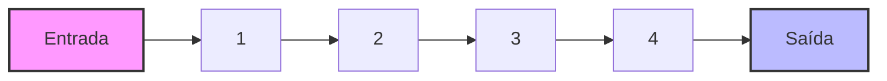

A fila possui duas operações principais:

- **Enqueue (Enfileirar)**: Adiciona um elemento ao final da fila
- **Dequeue (Desenfileirar)**: Remove o elemento do início da fila

## Tipos de Filas

### Fila Simples

Uma implementação básica da fila que segue estritamente o princípio FIFO.

### Fila Circular

Na fila circular, o final da fila está conectado logicamente ao início, formando um círculo. Isso é particularmente útil para implementações que utilizam arrays de tamanho fixo, permitindo uma utilização mais eficiente do espaço.

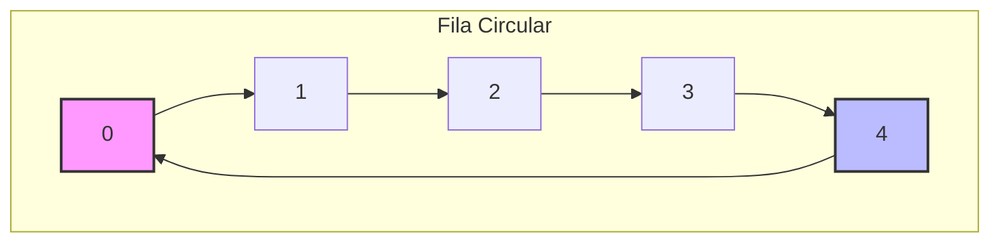

### Fila com Prioridade

Uma fila com prioridade não segue estritamente o princípio FIFO. Os elementos são removidos com base em sua prioridade, com os elementos de maior prioridade sendo removidos primeiro.

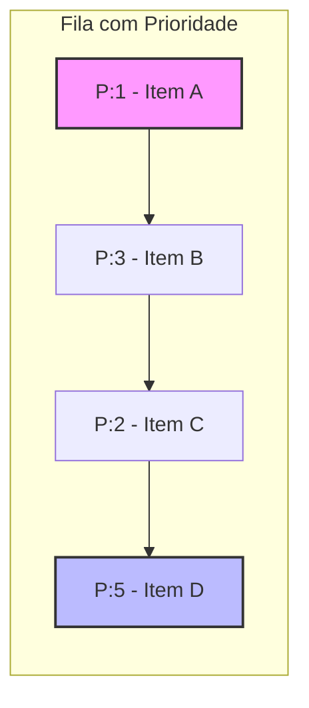

## Casos de Uso

As filas são extremamente úteis em diversos cenários:

1. **Gerenciamento de processos em sistemas operacionais**: Processos aguardando execução pela CPU.
2. **Buffers**: Dados sendo transferidos de um dispositivo para outro.
3. **Gerenciamento de recursos compartilhados**: Impressoras, servidores de arquivos.
4. **Processamento de requisições web**: Requisições HTTP em servidores web.
5. **Sistemas de mensageria**: Como Kafka, RabbitMQ.
6. **Algoritmos de busca em largura (BFS)**: Para percorrer estruturas como grafos.
7. **Escalonamento de tarefas**: Em sistemas de tempo real.

### Filas com Prioridade - Casos específicos:

- **Sistemas de atendimento hospitalar**: Pacientes com condições mais críticas são atendidos primeiro.
- **Algoritmos de escalonamento em sistemas operacionais**: Processos com prioridade mais alta são executados primeiro.
- **Algoritmos de compressão**: Como o algoritmo de Huffman.
- **Algoritmos de caminho mais curto**: Como o algoritmo de Dijkstra.

## Implementações

### Implementação em Java

```java
// Implementação de uma Fila Simples usando LinkedList
public class SimpleQueue<T> {
    private LinkedList<T> queue;

    public SimpleQueue() {
        queue = new LinkedList<>();
    }

    // Enfileirar - Adiciona um elemento ao final da fila
    public void enqueue(T item) {
        queue.addLast(item);
    }

    // Desenfileirar - Remove o elemento do início da fila
    public T dequeue() {
        if (isEmpty()) {
            throw new NoSuchElementException("A fila está vazia");
        }
        return queue.removeFirst();
    }

    // Verificar o primeiro elemento sem removê-lo
    public T peek() {
        if (isEmpty()) {
            throw new NoSuchElementException("A fila está vazia");
        }
        return queue.getFirst();
    }

    // Verificar se a fila está vazia
    public boolean isEmpty() {
        return queue.isEmpty();
    }

    // Obter o tamanho da fila
    public int size() {
        return queue.size();
    }

    // Inserir no meio (não é uma operação padrão de fila, mas adicionada para completude)
    public void insertAtMiddle(T item) {
        int middle = queue.size() / 2;
        queue.add(middle, item);
    }

    @Override
    public String toString() {
        return queue.toString();
    }
}

// Implementação de uma Fila Circular usando Array
public class CircularQueue<T> {
    private T[] array;
    private int front;  // índice do elemento frontal
    private int rear;   // índice do último elemento
    private int size;   // número de elementos na fila
    private int capacity;

    @SuppressWarnings("unchecked")
    public CircularQueue(int capacity) {
        this.capacity = capacity;
        array = (T[]) new Object[capacity];
        front = 0;
        rear = -1;
        size = 0;
    }

    // Enfileirar - Adiciona um elemento ao final da fila
    public void enqueue(T item) {
        if (isFull()) {
            throw new IllegalStateException("A fila está cheia");
        }
        rear = (rear + 1) % capacity;
        array[rear] = item;
        size++;
    }

    // Desenfileirar - Remove o elemento do início da fila
    public T dequeue() {
        if (isEmpty()) {
            throw new NoSuchElementException("A fila está vazia");
        }
        T item = array[front];
        array[front] = null;  // Ajuda o garbage collector
        front = (front + 1) % capacity;
        size--;
        return item;
    }

    // Verificar o primeiro elemento sem removê-lo
    public T peek() {
        if (isEmpty()) {
            throw new NoSuchElementException("A fila está vazia");
        }
        return array[front];
    }

    // Verificar se a fila está vazia
    public boolean isEmpty() {
        return size == 0;
    }

    // Verificar se a fila está cheia
    public boolean isFull() {
        return size == capacity;
    }

    // Obter o tamanho da fila
    public int size() {
        return size;
    }

    @Override
    public String toString() {
        if (isEmpty()) {
            return "[]";
        }
        StringBuilder sb = new StringBuilder("[");
        int count = 0;
        int i = front;
        while (count < size) {
            sb.append(array[i]);
            if (count < size - 1) {
                sb.append(", ");
            }
            i = (i + 1) % capacity;
            count++;
        }
        sb.append("]");
        return sb.toString();
    }
}

// Implementação de uma Fila com Prioridade
import java.util.PriorityQueue;
import java.util.Comparator;

public class PriorityQueueExample<T> {
    private PriorityQueue<PriorityItem<T>> queue;

    public PriorityQueueExample() {
        queue = new PriorityQueue<>();
    }

    public PriorityQueueExample(Comparator<PriorityItem<T>> comparator) {
        queue = new PriorityQueue<>(comparator);
    }

    // Enfileirar com prioridade (menor número = maior prioridade)
    public void enqueue(T item, int priority) {
        queue.add(new PriorityItem<>(item, priority));
    }

    // Desenfileirar o item de maior prioridade
    public T dequeue() {
        if (isEmpty()) {
            throw new NoSuchElementException("A fila está vazia");
        }
        return queue.poll().item;
    }

    // Verificar o item de maior prioridade sem removê-lo
    public T peek() {
        if (isEmpty()) {
            throw new NoSuchElementException("A fila está vazia");
        }
        return queue.peek().item;
    }

    // Verificar se a fila está vazia
    public boolean isEmpty() {
        return queue.isEmpty();
    }

    // Obter o tamanho da fila
    public int size() {
        return queue.size();
    }

    // Classe interna para representar um item com prioridade
    private static class PriorityItem<T> implements Comparable<PriorityItem<T>> {
        T item;
        int priority;

        public PriorityItem(T item, int priority) {
            this.item = item;
            this.priority = priority;
        }

        @Override
        public int compareTo(PriorityItem<T> other) {
            return Integer.compare(this.priority, other.priority);
        }

        @Override
        public String toString() {
            return "{" + item + " (P:" + priority + ")}";
        }
    }

    @Override
    public String toString() {
        return queue.toString();
    }
}

// Classe para testar as implementações de fila
public class QueueDemo {
    public static void main(String[] args) {
        // Demonstração da fila simples
        System.out.println("===== FILA SIMPLES =====");
        SimpleQueue<String> simpleQueue = new SimpleQueue<>();
        simpleQueue.enqueue("A");
        simpleQueue.enqueue("B");
        simpleQueue.enqueue("C");
        System.out.println("Fila: " + simpleQueue);
        System.out.println("Peek: " + simpleQueue.peek());
        System.out.println("Dequeue: " + simpleQueue.dequeue());
        System.out.println("Fila após dequeue: " + simpleQueue);
        simpleQueue.insertAtMiddle("X");
        System.out.println("Fila após inserir X no meio: " + simpleQueue);

        // Demonstração da fila circular
        System.out.println("\n===== FILA CIRCULAR =====");
        CircularQueue<Integer> circularQueue = new CircularQueue<>(5);
        circularQueue.enqueue(1);
        circularQueue.enqueue(2);
        circularQueue.enqueue(3);
        circularQueue.enqueue(4);
        circularQueue.enqueue(5);
        System.out.println("Fila circular: " + circularQueue);
        System.out.println("Dequeue: " + circularQueue.dequeue());
        System.out.println("Dequeue: " + circularQueue.dequeue());
        System.out.println("Fila circular após 2 dequeues: " + circularQueue);
        circularQueue.enqueue(6);
        circularQueue.enqueue(7);
        System.out.println("Fila circular após enfileirar 6 e 7: " + circularQueue);

        // Demonstração da fila com prioridade
        System.out.println("\n===== FILA COM PRIORIDADE =====");
        PriorityQueueExample<String> priorityQueue = new PriorityQueueExample<>();
        priorityQueue.enqueue("Processo normal", 3);
        priorityQueue.enqueue("Processo crítico", 1);
        priorityQueue.enqueue("Processo importante", 2);
        priorityQueue.enqueue("Processo de baixa prioridade", 5);
        priorityQueue.enqueue("Processo em background", 4);

        System.out.println("Fila de prioridade completa: " + priorityQueue);

        System.out.println("Processando itens em ordem de prioridade:");
        while (!priorityQueue.isEmpty()) {
            System.out.println("Processando: " + priorityQueue.dequeue());
        }
    }
}

```

### Implementação em Python

```python
from collections import deque
import heapq

# Implementação de uma Fila Simples
class SimpleQueue:
    def __init__(self):
        self.queue = deque()

    # Enfileirar - Adiciona um elemento ao final da fila
    def enqueue(self, item):
        self.queue.append(item)

    # Desenfileirar - Remove o elemento do início da fila
    def dequeue(self):
        if self.is_empty():
            raise IndexError("A fila está vazia")
        return self.queue.popleft()

    # Verificar o primeiro elemento sem removê-lo
    def peek(self):
        if self.is_empty():
            raise IndexError("A fila está vazia")
        return self.queue[0]

    # Verificar se a fila está vazia
    def is_empty(self):
        return len(self.queue) == 0

    # Obter o tamanho da fila
    def size(self):
        return len(self.queue)

    # Inserir no meio (não é uma operação padrão de fila, mas adicionada para completude)
    def insert_at_middle(self, item):
        middle = len(self.queue) // 2
        self.queue.insert(middle, item)

    def __str__(self):
        return str(list(self.queue))

# Implementação de uma Fila Circular usando Array
class CircularQueue:
    def __init__(self, capacity):
        self.capacity = capacity
        self.queue = [None] * capacity
        self.front = 0
        self.rear = -1
        self.size = 0

    # Enfileirar - Adiciona um elemento ao final da fila
    def enqueue(self, item):
        if self.is_full():
            raise Exception("A fila está cheia")
        self.rear = (self.rear + 1) % self.capacity
        self.queue[self.rear] = item
        self.size += 1

    # Desenfileirar - Remove o elemento do início da fila
    def dequeue(self):
        if self.is_empty():
            raise IndexError("A fila está vazia")
        item = self.queue[self.front]
        self.queue[self.front] = None  # Ajuda para visualização
        self.front = (self.front + 1) % self.capacity
        self.size -= 1
        return item

    # Verificar o primeiro elemento sem removê-lo
    def peek(self):
        if self.is_empty():
            raise IndexError("A fila está vazia")
        return self.queue[self.front]

    # Verificar se a fila está vazia
    def is_empty(self):
        return self.size == 0

    # Verificar se a fila está cheia
    def is_full(self):
        return self.size == self.capacity

    # Obter o tamanho da fila
    def size(self):
        return self.size

    def __str__(self):
        if self.is_empty():
            return "[]"

        items = []
        count = 0
        i = self.front

        while count < self.size:
            items.append(self.queue[i])
            i = (i + 1) % self.capacity
            count += 1

        return str(items)

# Implementação de uma Fila com Prioridade
class PriorityQueueItem:
    def __init__(self, item, priority):
        self.item = item
        self.priority = priority

    def __lt__(self, other):
        return self.priority < other.priority

    def __str__(self):
        return f"{{{self.item} (P:{self.priority})}}"

class PriorityQueue:
    def __init__(self):
        self.queue = []  # Usaremos heapq para implementar a fila de prioridade

    # Enfileirar com prioridade (menor número = maior prioridade)
    def enqueue(self, item, priority):
        heapq.heappush(self.queue, PriorityQueueItem(item, priority))

    # Desenfileirar o item de maior prioridade
    def dequeue(self):
        if self.is_empty():
            raise IndexError("A fila está vazia")
        return heapq.heappop(self.queue).item

    # Verificar o item de maior prioridade sem removê-lo
    def peek(self):
        if self.is_empty():
            raise IndexError("A fila está vazia")
        return self.queue[0].item

    # Verificar se a fila está vazia
    def is_empty(self):
        return len(self.queue) == 0

    # Obter o tamanho da fila
    def size(self):
        return len(self.queue)

    def __str__(self):
        return str([str(item) for item in self.queue])

# Demonstração das implementações de fila
if __name__ == "__main__":
    # Demonstração da fila simples
    print("===== FILA SIMPLES =====")
    simple_queue = SimpleQueue()
    simple_queue.enqueue("A")
    simple_queue.enqueue("B")
    simple_queue.enqueue("C")
    print(f"Fila: {simple_queue}")
    print(f"Peek: {simple_queue.peek()}")
    print(f"Dequeue: {simple_queue.dequeue()}")
    print(f"Fila após dequeue: {simple_queue}")
    simple_queue.insert_at_middle("X")
    print(f"Fila após inserir X no meio: {simple_queue}")

    # Demonstração da fila circular
    print("\n===== FILA CIRCULAR =====")
    circular_queue = CircularQueue(5)
    circular_queue.enqueue(1)
    circular_queue.enqueue(2)
    circular_queue.enqueue(3)
    circular_queue.enqueue(4)
    circular_queue.enqueue(5)
    print(f"Fila circular: {circular_queue}")
    print(f"Dequeue: {circular_queue.dequeue()}")
    print(f"Dequeue: {circular_queue.dequeue()}")
    print(f"Fila circular após 2 dequeues: {circular_queue}")
    circular_queue.enqueue(6)
    circular_queue.enqueue(7)
    print(f"Fila circular após enfileirar 6 e 7: {circular_queue}")

    # Demonstração da fila com prioridade
    print("\n===== FILA COM PRIORIDADE =====")
    priority_queue = PriorityQueue()
    priority_queue.enqueue("Processo normal", 3)
    priority_queue.enqueue("Processo crítico", 1)
    priority_queue.enqueue("Processo importante", 2)
    priority_queue.enqueue("Processo de baixa prioridade", 5)
    priority_queue.enqueue("Processo em background", 4)

    print(f"Fila de prioridade completa: {priority_queue}")

    print("Processando itens em ordem de prioridade:")
    while not priority_queue.is_empty():
        print(f"Processando: {priority_queue.dequeue()}")

```

### Implementação em JavaScript/TypeScript

```javascript
// Implementação de uma Fila Simples
class SimpleQueue {
  constructor() {
    this.queue = [];
  }

  // Enfileirar - Adiciona um elemento ao final da fila
  enqueue(item) {
    this.queue.push(item);
  }

  // Desenfileirar - Remove o elemento do início da fila
  dequeue() {
    if (this.isEmpty()) {
      throw new Error("A fila está vazia");
    }
    return this.queue.shift();
  }

  // Verificar o primeiro elemento sem removê-lo
  peek() {
    if (this.isEmpty()) {
      throw new Error("A fila está vazia");
    }
    return this.queue[0];
  }

  // Verificar se a fila está vazia
  isEmpty() {
    return this.queue.length === 0;
  }

  // Obter o tamanho da fila
  size() {
    return this.queue.length;
  }

  // Inserir no meio (não é uma operação padrão de fila, mas adicionada para completude)
  insertAtMiddle(item) {
    const middle = Math.floor(this.queue.length / 2);
    this.queue.splice(middle, 0, item);
  }

  toString() {
    return JSON.stringify(this.queue);
  }
}

// Implementação de uma Fila Circular usando Array
class CircularQueue {
  constructor(capacity) {
    this.capacity = capacity;
    this.queue = new Array(capacity).fill(null);
    this.front = 0;
    this.rear = -1;
    this.size = 0;
  }

  // Enfileirar - Adiciona um elemento ao final da fila
  enqueue(item) {
    if (this.isFull()) {
      throw new Error("A fila está cheia");
    }
    this.rear = (this.rear + 1) % this.capacity;
    this.queue[this.rear] = item;
    this.size++;
  }

  // Desenfileirar - Remove o elemento do início da fila
  dequeue() {
    if (this.isEmpty()) {
      throw new Error("A fila está vazia");
    }
    const item = this.queue[this.front];
    this.queue[this.front] = null; // Ajuda para visualização
    this.front = (this.front + 1) % this.capacity;
    this.size--;
    return item;
  }

  // Verificar o primeiro elemento sem removê-lo
  peek() {
    if (this.isEmpty()) {
      throw new Error("A fila está vazia");
    }
    return this.queue[this.front];
  }

  // Verificar se a fila está vazia
  isEmpty() {
    return this.size === 0;
  }

  // Verificar se a fila está cheia
  isFull() {
    return this.size === this.capacity;
  }

  // Obter o tamanho da fila
  getSize() {
    return this.size;
  }

  toString() {
    if (this.isEmpty()) {
      return "[]";
    }

    const items = [];
    let count = 0;
    let i = this.front;

    while (count < this.size) {
      items.push(this.queue[i]);
      i = (i + 1) % this.capacity;
      count++;
    }

    return JSON.stringify(items);
  }
}

// Implementação de uma Fila com Prioridade
class PriorityQueueItem {
  constructor(item, priority) {
    this.item = item;
    this.priority = priority;
  }

  toString() {
    return `{${this.item} (P:${this.priority})}`;
  }
}

class PriorityQueue {
  constructor() {
    this.queue = [];
  }

  // Enfileirar com prioridade (menor número = maior prioridade)
  enqueue(item, priority) {
    const queueItem = new PriorityQueueItem(item, priority);

    // Encontrar a posição correta para inserir o novo item
    let added = false;
    for (let i = 0; i < this.queue.length; i++) {
      if (priority < this.queue[i].priority) {
        this.queue.splice(i, 0, queueItem);
        added = true;
        break;
      }
    }

    // Se o item tiver a menor prioridade ou a fila estiver vazia, adicione ao final
    if (!added) {
      this.queue.push(queueItem);
    }
  }

  // Desenfileirar o item de maior prioridade
  dequeue() {
    if (this.isEmpty()) {
      throw new Error("A fila está vazia");
    }
    return this.queue.shift().item;
  }

  // Verificar o item de maior prioridade sem removê-lo
  peek() {
    if (this.isEmpty()) {
      throw new Error("A fila está vazia");
    }
    return this.queue[0].item;
  }

  // Verificar se a fila está vazia
  isEmpty() {
    return this.queue.length === 0;
  }

  // Obter o tamanho da fila
  size() {
    return this.queue.length;
  }

  toString() {
    return JSON.stringify(this.queue.map((item) => item.toString()));
  }
}

// Demonstração das implementações de fila
function demonstrateQueues() {
  // Demonstração da fila simples
  console.log("===== FILA SIMPLES =====");
  const simpleQueue = new SimpleQueue();
  simpleQueue.enqueue("A");
  simpleQueue.enqueue("B");
  simpleQueue.enqueue("C");
  console.log(`Fila: ${simpleQueue}`);
  console.log(`Peek: ${simpleQueue.peek()}`);
  console.log(`Dequeue: ${simpleQueue.dequeue()}`);
  console.log(`Fila após dequeue: ${simpleQueue}`);
  simpleQueue.insertAtMiddle("X");
  console.log(`Fila após inserir X no meio: ${simpleQueue}`);

  // Demonstração da fila circular
  console.log("\n===== FILA CIRCULAR =====");
  const circularQueue = new CircularQueue(5);
  circularQueue.enqueue(1);
  circularQueue.enqueue(2);
  circularQueue.enqueue(3);
  circularQueue.enqueue(4);
  circularQueue.enqueue(5);
  console.log(`Fila circular: ${circularQueue}`);
  console.log(`Dequeue: ${circularQueue.dequeue()}`);
  console.log(`Dequeue: ${circularQueue.dequeue()}`);
  console.log(`Fila circular após 2 dequeues: ${circularQueue}`);
  circularQueue.enqueue(6);
  circularQueue.enqueue(7);
  console.log(`Fila circular após enfileirar 6 e 7: ${circularQueue}`);

  // Demonstração da fila com prioridade
  console.log("\n===== FILA COM PRIORIDADE =====");
  const priorityQueue = new PriorityQueue();
  priorityQueue.enqueue("Processo normal", 3);
  priorityQueue.enqueue("Processo crítico", 1);
  priorityQueue.enqueue("Processo importante", 2);
  priorityQueue.enqueue("Processo de baixa prioridade", 5);
  priorityQueue.enqueue("Processo em background", 4);

  console.log(`Fila de prioridade completa: ${priorityQueue}`);

  console.log("Processando itens em ordem de prioridade:");
  while (!priorityQueue.isEmpty()) {
    console.log(`Processando: ${priorityQueue.dequeue()}`);
  }
}

// Executar a demonstração
demonstrateQueues();
```

```typescript
// Implementação de uma Fila Simples
class SimpleQueue<T> {
  private queue: T[];

  constructor() {
    this.queue = [];
  }

  // Enfileirar - Adiciona um elemento ao final da fila
  enqueue(item: T): void {
    this.queue.push(item);
  }

  // Desenfileirar - Remove o elemento do início da fila
  dequeue(): T {
    if (this.isEmpty()) {
      throw new Error("A fila está vazia");
    }
    return this.queue.shift() as T;
  }

  // Verificar o primeiro elemento sem removê-lo
  peek(): T {
    if (this.isEmpty()) {
      throw new Error("A fila está vazia");
    }
    return this.queue[0];
  }

  // Verificar se a fila está vazia
  isEmpty(): boolean {
    return this.queue.length === 0;
  }

  // Obter o tamanho da fila
  size(): number {
    return this.queue.length;
  }

  // Inserir no meio (não é uma operação padrão de fila, mas adicionada para completude)
  insertAtMiddle(item: T): void {
    const middle = Math.floor(this.queue.length / 2);
    this.queue.splice(middle, 0, item);
  }

  toString(): string {
    return JSON.stringify(this.queue);
  }
}

// Implementação de uma Fila Circular usando Array
class CircularQueue<T> {
  private capacity: number;
  private queue: (T | null)[];
  private front: number;
  private rear: number;
  private size: number;

  constructor(capacity: number) {
    this.capacity = capacity;
    this.queue = new Array(capacity).fill(null);
    this.front = 0;
    this.rear = -1;
    this.size = 0;
  }

  // Enfileirar - Adiciona um elemento ao final da fila
  enqueue(item: T): void {
    if (this.isFull()) {
      throw new Error("A fila está cheia");
    }
    this.rear = (this.rear + 1) % this.capacity;
    this.queue[this.rear] = item;
    this.size++;
  }

  // Desenfileirar - Remove o elemento do início da fila
  dequeue(): T {
    if (this.isEmpty()) {
      throw new Error("A fila está vazia");
    }
    const item = this.queue[this.front] as T;
    this.queue[this.front] = null; // Ajuda para visualização
    this.front = (this.front + 1) % this.capacity;
    this.size--;
    return item;
  }

  // Verificar o primeiro elemento sem removê-lo
  peek(): T {
    if (this.isEmpty()) {
      throw new Error("A fila está vazia");
    }
    return this.queue[this.front] as T;
  }

  // Verificar se a fila está vazia
  isEmpty(): boolean {
    return this.size === 0;
  }

  // Verificar se a fila está cheia
  isFull(): boolean {
    return this.size === this.capacity;
  }

  // Obter o tamanho da fila
  getSize(): number {
    return this.size;
  }

  toString(): string {
    if (this.isEmpty()) {
      return "[]";
    }

    const items = [];
    let count = 0;
    let i = this.front;

    while (count < this.size) {
      items.push(this.queue[i]);
      i = (i + 1) % this.capacity;
      count++;
    }

    return JSON.stringify(items);
  }
}

// Implementação de uma Fila com Prioridade
interface PriorityItem<T> {
  item: T;
  priority: number;
}

class PriorityQueueItem<T> implements PriorityItem<T> {
  item: T;
  priority: number;

  constructor(item: T, priority: number) {
    this.item = item;
    this.priority = priority;
  }

  toString(): string {
    return `{${String(this.item)} (P:${this.priority})}`;
  }
}

class PriorityQueue<T> {
  private queue: PriorityQueueItem<T>[];

  constructor() {
    this.queue = [];
  }

  // Enfileirar com prioridade (menor número = maior prioridade)
  enqueue(item: T, priority: number): void {
    const queueItem = new PriorityQueueItem(item, priority);

    // Encontrar a posição correta para inserir o novo item
    let added = false;
    for (let i = 0; i < this.queue.length; i++) {
      if (priority < this.queue[i].priority) {
        this.queue.splice(i, 0, queueItem);
        added = true;
        break;
      }
    }

    // Se o item tiver a menor prioridade ou a fila estiver vazia, adicione ao final
    if (!added) {
      this.queue.push(queueItem);
    }
  }

  // Desenfileirar o item de maior prioridade
  dequeue(): T {
    if (this.isEmpty()) {
      throw new Error("A fila está vazia");
    }
    return this.queue.shift()!.item;
  }

  // Verificar o item de maior prioridade sem removê-lo
  peek(): T {
    if (this.isEmpty()) {
      throw new Error("A fila está vazia");
    }
    return this.queue[0].item;
  }

  // Verificar se a fila está vazia
  isEmpty(): boolean {
    return this.queue.length === 0;
  }

  // Obter o tamanho da fila
  size(): number {
    return this.queue.length;
  }

  toString(): string {
    return JSON.stringify(this.queue.map((item) => item.toString()));
  }
}

// Demonstração das implementações de fila
function demonstrateQueues(): void {
  // Demonstração da fila simples
  console.log("===== FILA SIMPLES =====");
  const simpleQueue = new SimpleQueue<string>();
  simpleQueue.enqueue("A");
  simpleQueue.enqueue("B");
  simpleQueue.enqueue("C");
  console.log(`Fila: ${simpleQueue}`);
  console.log(`Peek: ${simpleQueue.peek()}`);
  console.log(`Dequeue: ${simpleQueue.dequeue()}`);
  console.log(`Fila após dequeue: ${simpleQueue}`);
  simpleQueue.insertAtMiddle("X");
  console.log(`Fila após inserir X no meio: ${simpleQueue}`);

  // Demonstração da fila circular
  console.log("\n===== FILA CIRCULAR =====");
  const circularQueue = new CircularQueue<number>(5);
  circularQueue.enqueue(1);
  circularQueue.enqueue(2);
  circularQueue.enqueue(3);
  circularQueue.enqueue(4);
  circularQueue.enqueue(5);
  console.log(`Fila circular: ${circularQueue}`);
  console.log(`Dequeue: ${circularQueue.dequeue()}`);
  console.log(`Dequeue: ${circularQueue.dequeue()}`);
  console.log(`Fila circular após 2 dequeues: ${circularQueue}`);
  circularQueue.enqueue(6);
  circularQueue.enqueue(7);
  console.log(`Fila circular após enfileirar 6 e 7: ${circularQueue}`);

  // Demonstração da fila com prioridade
  console.log("\n===== FILA COM PRIORIDADE =====");
  const priorityQueue = new PriorityQueue<string>();
  priorityQueue.enqueue("Processo normal", 3);
  priorityQueue.enqueue("Processo crítico", 1);
  priorityQueue.enqueue("Processo importante", 2);
  priorityQueue.enqueue("Processo de baixa prioridade", 5);
  priorityQueue.enqueue("Processo em background", 4);

  console.log(`Fila de prioridade completa: ${priorityQueue}`);

  console.log("Processando itens em ordem de prioridade:");
  while (!priorityQueue.isEmpty()) {
    console.log(`Processando: ${priorityQueue.dequeue()}`);
  }
}

// Executar a demonstração
demonstrateQueues();
```

## Complexidade das Operações em Filas

Para entender completamente o funcionamento das filas, é importante analisar a complexidade de tempo de cada operação:

| Operação           | Fila Simples | Fila Circular | Fila com Prioridade |
| ------------------ | ------------ | ------------- | ------------------- |
| Enqueue (final)    | O(1)         | O(1)          | O(log n)            |
| Dequeue (início)   | O(1)\*       | O(1)          | O(log n)            |
| Peek               | O(1)         | O(1)          | O(1)                |
| Verificar se vazia | O(1)         | O(1)          | O(1)                |
| Inserção no meio   | O(n)         | N/A           | N/A                 |

\* Em algumas implementações baseadas em arrays, o `dequeue` pode ser O(n) devido à necessidade de reposicionar todos os elementos.

## Funcionamento Detalhado

### Fila Simples (FIFO)

Quando pensamos em uma fila simples, o princípio é direto: quem chega primeiro é atendido primeiro. Vamos detalhar isso em termos práticos:

1. **Estado inicial**: `[ ]` (fila vazia)
2. **Enqueue("A")**: `[A]`
3. **Enqueue("B")**: `[A, B]`
4. **Enqueue("C")**: `[A, B, C]`
5. **Dequeue()**: Remove "A", retorna "A", fila fica `[B, C]`
6. **Peek()**: Retorna "B" (sem remover), fila continua `[B, C]`

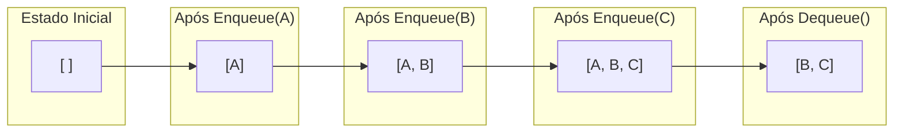

### Fila Circular

A fila circular resolve um problema comum em implementações de filas usando arrays: quando removemos elementos do início, precisamos reposicionar todos os outros elementos, o que é ineficiente. Com a fila circular:

1. **Estado inicial**: `[null, null, null, null, null]`, `front = 0`, `rear = -1`, `size = 0`
2. **Enqueue(1)**: `[1, null, null, null, null]`, `front = 0`, `rear = 0`, `size = 1`
3. **Enqueue(2)**: `[1, 2, null, null, null]`, `front = 0`, `rear = 1`, `size = 2`
4. **Dequeue()**: Remove e retorna 1, `[null, 2, null, null, null]`, `front = 1`, `rear = 1`, `size = 1`
5. **Enqueue(3)**: `[null, 2, 3, null, null]`, `front = 1`, `rear = 2`, `size = 2`
6. **Enqueue(4)**: `[null, 2, 3, 4, null]`, `front = 1`, `rear = 3`, `size = 3`
7. **Enqueue(5)**: `[null, 2, 3, 4, 5]`, `front = 1`, `rear = 4`, `size = 4`
8. **Enqueue(6)**: `[6, 2, 3, 4, 5]`, `front = 1`, `rear = 0`, `size = 5` (Observe que `rear` "deu a volta" para o início)

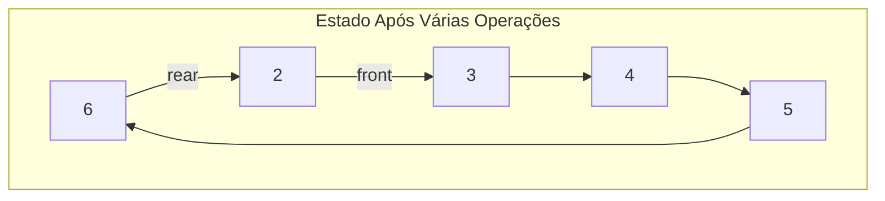

### Fila com Prioridade

Uma fila com prioridade organiza os elementos não pela ordem de chegada, mas pelo valor de prioridade:

1. **Estado inicial**: `[ ]`
2. **Enqueue("Processo normal", 3)**: `[{Processo normal (P:3)}]`
3. **Enqueue("Processo crítico", 1)**: `[{Processo crítico (P:1)}, {Processo normal (P:3)}]` (Observe que foi inserido no início devido à prioridade mais alta)
4. **Enqueue("Processo importante", 2)**: `[{Processo crítico (P:1)}, {Processo importante (P:2)}, {Processo normal (P:3)}]`
5. **Dequeue()**: Remove e retorna "Processo crítico", `[{Processo importante (P:2)}, {Processo normal (P:3)}]`

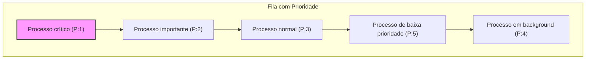

## Aplicações Específicas

### 1. Escalonamento de CPU em Sistemas Operacionais

Os sistemas operacionais usam diferentes tipos de filas para gerenciar processos:

- **Fila Simples (FCFS - First Come, First Served)**: Os processos são executados na ordem de chegada.
- **Fila com Prioridade**: Processos com prioridades mais altas são executados primeiro.
- **Round Robin**: Uma variação que utiliza fila circular e quantum de tempo.

### 2. Roteamento de Pacotes em Redes

Em roteadores e switches, pacotes são enfileirados com base em:

- **Fila Simples**: Para tráfego normal
- **Fila com Prioridade**: Para tráfego prioritário como voz/vídeo

### 3. Sistemas de Mensageria

Sistemas como Kafka, RabbitMQ e ActiveMQ implementam filas para desacoplar produtores e consumidores de mensagens.

### 4. Gerenciamento de Impressão

Impressoras usam filas para gerenciar documentos a serem impressos, muitas vezes com prioridades.

### 5. BFS (Busca em Largura)

O algoritmo BFS utiliza filas para explorar grafos nível a nível.

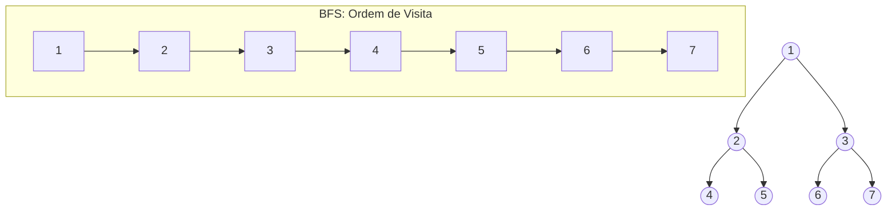

## Conclusão

As filas são estruturas de dados fundamentais que seguem o princípio FIFO, onde o primeiro elemento inserido é o primeiro a ser removido. Existem variações como a fila circular e a fila com prioridade que se adaptam a diferentes necessidades.

As filas são amplamente usadas em sistemas operacionais, redes, sistemas de mensageria, impressão e em algoritmos como o BFS. A escolha entre os diferentes tipos de filas depende das necessidades específicas de cada aplicação.

As implementações podem variar em eficiência dependendo das estruturas de dados subjacentes utilizadas. Por exemplo, filas implementadas com arrays podem ter problemas de realocação, enquanto filas baseadas em listas ligadas evitam esse problema, mas têm overhead de memória.

Ao escolher uma implementação de fila, é importante considerar as operações mais frequentes e os requisitos de desempenho da aplicação.

# 3. Estruturas Não Lineares

## 3.1. Árvores

### Conceito de árvore, nós e subárvores

Uma árvore é uma estrutura de dados hierárquica, não-linear, que consiste em nós conectados por arestas. Diferentemente das estruturas lineares como arrays e listas ligadas, as árvores permitem representar relações hierárquicas entre elementos.

#### O que é uma árvore? (Método Feynman)

Imagine uma árvore genealógica da sua família. Você tem um ancestral (raiz), que teve filhos, que tiveram filhos, e assim por diante. Cada pessoa nessa árvore é um "nó", e as relações entre pais e filhos são as "arestas" ou conexões.

Em termos computacionais:

- **Nó**: Um elemento que armazena dados e referências para outros nós
- **Raiz**: O nó superior da árvore, que não possui pai
- **Aresta**: A conexão entre dois nós (pai e filho)
- **Folha**: Um nó que não possui filhos
- **Nó interno**: Qualquer nó que tenha pelo menos um filho
- **Subárvore**: Uma árvore formada por um nó e todos os seus descendentes

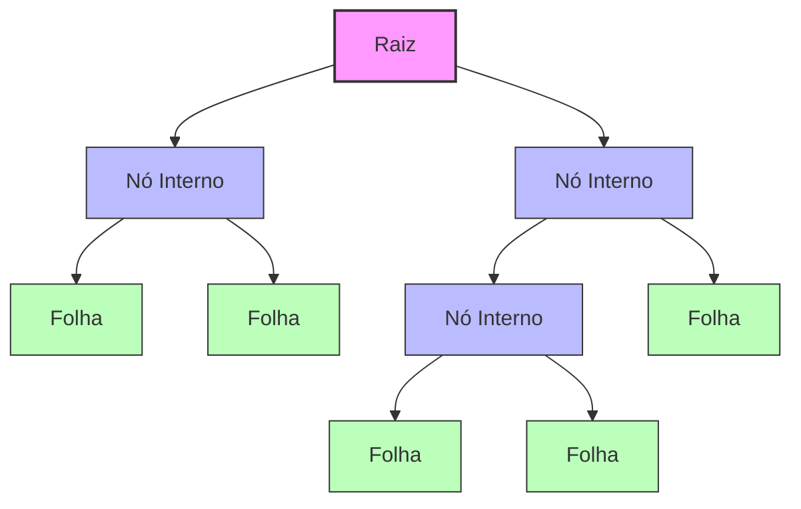

#### Terminologia importante

- **Nível**: Distância (número de arestas) de um nó até a raiz
- **Altura da árvore**: O maior nível entre todos os nós da árvore
- **Grau de um nó**: Número de filhos que um nó possui
- **Profundidade**: Distância de um nó até a raiz (similar ao nível)
- **Ancestral**: Um nó que está no caminho entre a raiz e o nó atual
- **Descendente**: Qualquer nó na subárvore enraizada no nó atual

### Árvores Binárias, BST, AVL, B-Trees

#### Árvore Binária

Uma árvore binária é uma árvore em que cada nó pode ter no máximo dois filhos, geralmente chamados de filho esquerdo e filho direito.

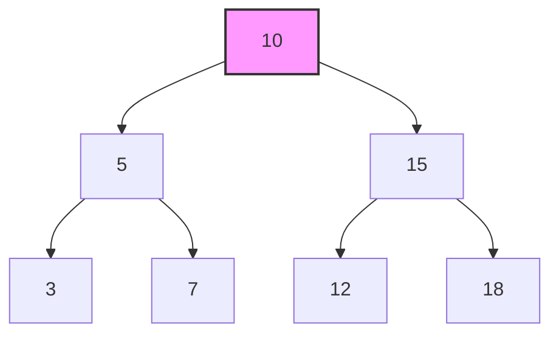

#### Código base para um nó de árvore binária

##### Java

```java
class Node {
    int data;
    Node left;
    Node right;

    public Node(int data) {
        this.data = data;
        this.left = null;
        this.right = null;
    }
}

class BinaryTree {
    Node root;

    public BinaryTree() {
        root = null;
    }
}
```

##### Python

```python
class Node:
    def __init__(self, data):
        self.data = data
        self.left = None
        self.right = None

class BinaryTree:
    def __init__(self):
        self.root = None
```

##### JavaScript

```javascript
class Node {
  constructor(data) {
    this.data = data;
    this.left = null;
    this.right = null;
  }
}

class BinaryTree {
  constructor() {
    this.root = null;
  }
}
```

##### TypeScript

```typescript
class Node {
  data: number;
  left: Node | null;
  right: Node | null;

  constructor(data: number) {
    this.data = data;
    this.left = null;
    this.right = null;
  }
}

class BinaryTree {
  root: Node | null;

  constructor() {
    this.root = null;
  }
}
```

#### Árvore Binária de Busca (BST)

Uma árvore binária de busca (BST) é uma árvore binária com uma propriedade especial: para cada nó, todos os elementos na subárvore esquerda são menores que o nó, e todos os elementos na subárvore direita são maiores.

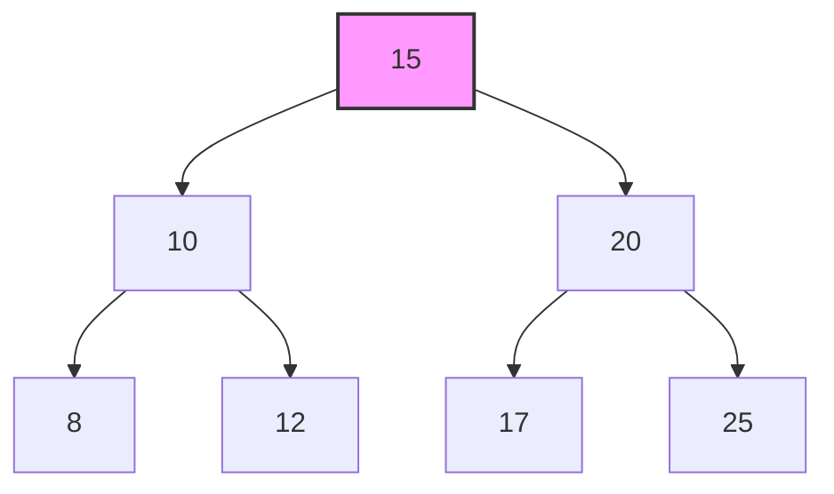

#### Árvore AVL

Uma árvore AVL é uma árvore binária de busca balanceada. Para cada nó, a diferença de altura entre as subárvores esquerda e direita (fator de balanceamento) deve ser no máximo 1. Se essa condição for violada após uma inserção ou remoção, rotações são realizadas para restaurar o balanceamento.

```mermaid
graph TD
    A[15] --> B[10]
    A --> C[20]
    B --> D[8]
    B --> E[12]
    C --> F[17]
    C --> G[25]

    subgraph Altura
    H[h=3] -.- A
    I[h=2] -.- B
    J[h=2] -.- C
    K[h=1] -.- D
    L[h=1] -.- E
    M[h=1] -.- F
    N[h=1] -.- G
    end

    style A fill:#f9f,stroke:#333,stroke-width:2px

```

#### B-Trees

As B-Trees são árvores balanceadas projetadas para sistemas de armazenamento em bloco (como discos). Diferentemente das árvores binárias, um nó pode ter mais de dois filhos, o que reduz a altura da árvore e melhora o desempenho de operações de I/O.

```mermaid
graph TD
    A["15, 30"] --> B["5, 10"]
    A --> C["20, 25"]
    A --> D["35, 40"]

    style A fill:#f9f,stroke:#333,stroke-width:2px

```

### Operações em Árvores Binárias de Busca (BST)

Vamos implementar as operações básicas para uma BST em diferentes linguagens:

#### Java

```java
class BinarySearchTree {
    Node root;

    public BinarySearchTree() {
        root = null;
    }

    // Operação de Busca
    public Node search(int key) {
        return searchRecursive(root, key);
    }

    private Node searchRecursive(Node root, int key) {
        // Caso base: raiz é nula ou a chave está presente na raiz
        if (root == null || root.data == key)
            return root;

        // Valor da chave é maior que o valor da raiz
        if (root.data < key)
            return searchRecursive(root.right, key);

        // Valor da chave é menor que o valor da raiz
        return searchRecursive(root.left, key);
    }

    // Operação de Inserção
    public void insert(int key) {
        root = insertRecursive(root, key);
    }

    private Node insertRecursive(Node root, int key) {
        // Se a árvore estiver vazia, retorna um novo nó
        if (root == null) {
            root = new Node(key);
            return root;
        }

        // Caso contrário, percorre a árvore
        if (key < root.data)
            root.left = insertRecursive(root.left, key);
        else if (key > root.data)
            root.right = insertRecursive(root.right, key);

        // Retorna o ponteiro do nó (inalterado)
        return root;
    }

    // Operação de Remoção
    public void delete(int key) {
        root = deleteRecursive(root, key);
    }

    private Node deleteRecursive(Node root, int key) {
        // Caso base: se a árvore estiver vazia
        if (root == null)
            return root;

        // Percorrendo a árvore
        if (key < root.data)
            root.left = deleteRecursive(root.left, key);
        else if (key > root.data)
            root.right = deleteRecursive(root.right, key);
        else {
            // Nó com apenas um filho ou sem filhos
            if (root.left == null)
                return root.right;
            else if (root.right == null)
                return root.left;

            // Nó com dois filhos: Obtenha o sucessor in-order (menor nó na subárvore direita)
            root.data = minValue(root.right);

            // Apaga o sucessor in-order
            root.right = deleteRecursive(root.right, root.data);
        }

        return root;
    }

    private int minValue(Node root) {
        int minv = root.data;
        while (root.left != null) {
            minv = root.left.data;
            root = root.left;
        }
        return minv;
    }

    // Percurso In-order
    public void inorder() {
        inorderRecursive(root);
        System.out.println();
    }

    private void inorderRecursive(Node root) {
        if (root != null) {
            inorderRecursive(root.left);
            System.out.print(root.data + " ");
            inorderRecursive(root.right);
        }
    }
}
```

#### Python

```python
class BinarySearchTree:
    def __init__(self):
        self.root = None

    # Operação de Busca
    def search(self, key):
        return self._search_recursive(self.root, key)

    def _search_recursive(self, root, key):
        # Caso base: raiz é nula ou a chave está presente na raiz
        if root is None or root.data == key:
            return root

        # Valor da chave é maior que o valor da raiz
        if root.data < key:
            return self._search_recursive(root.right, key)

        # Valor da chave é menor que o valor da raiz
        return self._search_recursive(root.left, key)

    # Operação de Inserção
    def insert(self, key):
        self.root = self._insert_recursive(self.root, key)

    def _insert_recursive(self, root, key):
        # Se a árvore estiver vazia, retorna um novo nó
        if root is None:
            return Node(key)

        # Caso contrário, percorre a árvore
        if key < root.data:
            root.left = self._insert_recursive(root.left, key)
        elif key > root.data:
            root.right = self._insert_recursive(root.right, key)

        # Retorna o ponteiro do nó (inalterado)
        return root

    # Operação de Remoção
    def delete(self, key):
        self.root = self._delete_recursive(self.root, key)

    def _delete_recursive(self, root, key):
        # Caso base: se a árvore estiver vazia
        if root is None:
            return root

        # Percorrendo a árvore
        if key < root.data:
            root.left = self._delete_recursive(root.left, key)
        elif key > root.data:
            root.right = self._delete_recursive(root.right, key)
        else:
            # Nó com apenas um filho ou sem filhos
            if root.left is None:
                return root.right
            elif root.right is None:
                return root.left

            # Nó com dois filhos: Obtenha o sucessor in-order (menor nó na subárvore direita)
            root.data = self._min_value(root.right)

            # Apaga o sucessor in-order
            root.right = self._delete_recursive(root.right, root.data)

        return root

    def _min_value(self, root):
        current = root
        while current.left is not None:
            current = current.left
        return current.data

    # Percurso In-order
    def inorder(self):
        result = []
        self._inorder_recursive(self.root, result)
        return result

    def _inorder_recursive(self, root, result):
        if root:
            self._inorder_recursive(root.left, result)
            result.append(root.data)
            self._inorder_recursive(root.right, result)
```

#### JavaScript

```javascript
class BinarySearchTree {
  constructor() {
    this.root = null;
  }

  // Operação de Busca
  search(key) {
    return this._searchRecursive(this.root, key);
  }

  _searchRecursive(root, key) {
    // Caso base: raiz é nula ou a chave está presente na raiz
    if (root === null || root.data === key) return root;

    // Valor da chave é maior que o valor da raiz
    if (root.data < key) return this._searchRecursive(root.right, key);

    // Valor da chave é menor que o valor da raiz
    return this._searchRecursive(root.left, key);
  }

  // Operação de Inserção
  insert(key) {
    this.root = this._insertRecursive(this.root, key);
  }

  _insertRecursive(root, key) {
    // Se a árvore estiver vazia, retorna um novo nó
    if (root === null) {
      return new Node(key);
    }

    // Caso contrário, percorre a árvore
    if (key < root.data) root.left = this._insertRecursive(root.left, key);
    else if (key > root.data) root.right = this._insertRecursive(root.right, key);

    // Retorna o ponteiro do nó (inalterado)
    return root;
  }

  // Operação de Remoção
  delete(key) {
    this.root = this._deleteRecursive(this.root, key);
  }

  _deleteRecursive(root, key) {
    // Caso base: se a árvore estiver vazia
    if (root === null) return root;

    // Percorrendo a árvore
    if (key < root.data) root.left = this._deleteRecursive(root.left, key);
    else if (key > root.data) root.right = this._deleteRecursive(root.right, key);
    else {
      // Nó com apenas um filho ou sem filhos
      if (root.left === null) return root.right;
      else if (root.right === null) return root.left;

      // Nó com dois filhos: Obtenha o sucessor in-order (menor nó na subárvore direita)
      root.data = this._minValue(root.right);

      // Apaga o sucessor in-order
      root.right = this._deleteRecursive(root.right, root.data);
    }

    return root;
  }

  _minValue(root) {
    let minv = root.data;
    let current = root;

    while (current.left !== null) {
      minv = current.left.data;
      current = current.left;
    }

    return minv;
  }

  // Percurso In-order
  inorder() {
    const result = [];
    this._inorderRecursive(this.root, result);
    return result;
  }

  _inorderRecursive(root, result) {
    if (root !== null) {
      this._inorderRecursive(root.left, result);
      result.push(root.data);
      this._inorderRecursive(root.right, result);
    }
  }
}
```

#### TypeScript

```typescript
class BinarySearchTree {
  root: Node | null;

  constructor() {
    this.root = null;
  }

  // Operação de Busca
  search(key: number): Node | null {
    return this._searchRecursive(this.root, key);
  }

  private _searchRecursive(root: Node | null, key: number): Node | null {
    // Caso base: raiz é nula ou a chave está presente na raiz
    if (root === null || root.data === key) return root;

    // Valor da chave é maior que o valor da raiz
    if (root.data < key) return this._searchRecursive(root.right, key);

    // Valor da chave é menor que o valor da raiz
    return this._searchRecursive(root.left, key);
  }

  // Operação de Inserção
  insert(key: number): void {
    this.root = this._insertRecursive(this.root, key);
  }

  private _insertRecursive(root: Node | null, key: number): Node {
    // Se a árvore estiver vazia, retorna um novo nó
    if (root === null) {
      return new Node(key);
    }

    // Caso contrário, percorre a árvore
    if (key < root.data) root.left = this._insertRecursive(root.left, key);
    else if (key > root.data) root.right = this._insertRecursive(root.right, key);

    // Retorna o ponteiro do nó (inalterado)
    return root;
  }

  // Operação de Remoção
  delete(key: number): void {
    this.root = this._deleteRecursive(this.root, key);
  }

  private _deleteRecursive(root: Node | null, key: number): Node | null {
    // Caso base: se a árvore estiver vazia
    if (root === null) return root;

    // Percorrendo a árvore
    if (key < root.data) root.left = this._deleteRecursive(root.left, key);
    else if (key > root.data) root.right = this._deleteRecursive(root.right, key);
    else {
      // Nó com apenas um filho ou sem filhos
      if (root.left === null) return root.right;
      else if (root.right === null) return root.left;

      // Nó com dois filhos: Obtenha o sucessor in-order (menor nó na subárvore direita)
      root.data = this._minValue(root.right);

      // Apaga o sucessor in-order
      root.right = this._deleteRecursive(root.right, root.data);
    }

    return root;
  }

  private _minValue(root: Node): number {
    let minv = root.data;
    let current = root;

    while (current.left !== null) {
      minv = current.left.data;
      current = current.left;
    }

    return minv;
  }

  // Percurso In-order
  inorder(): number[] {
    const result: number[] = [];
    this._inorderRecursive(this.root, result);
    return result;
  }

  private _inorderRecursive(root: Node | null, result: number[]): void {
    if (root !== null) {
      this._inorderRecursive(root.left, result);
      result.push(root.data);
      this._inorderRecursive(root.right, result);
    }
  }
}
```

### Complexidade das Operações

Para entender melhor o desempenho das árvores, vamos analisar a complexidade das operações:

| Operação | Árvore Binária | BST (média) | BST (pior) | AVL      | B-Tree   |
| -------- | -------------- | ----------- | ---------- | -------- | -------- |
| Acesso   | O(n)           | O(log n)    | O(n)       | O(log n) | O(log n) |
| Busca    | O(n)           | O(log n)    | O(n)       | O(log n) | O(log n) |
| Inserção | O(1)\*         | O(log n)    | O(n)       | O(log n) | O(log n) |
| Remoção  | O(n)           | O(log n)    | O(n)       | O(log n) | O(log n) |

\*Se soubermos onde inserir, caso contrário também é O(n)

### Comparação entre os tipos de árvores

```mermaid
graph TB
    subgraph "Árvore Binária"
    A1[8] --> B1[3]
    A1 --> C1[10]
    B1 --> D1[1]
    B1 --> E1[6]
    C1 --> F1[14]
    end

    subgraph "Árvore Binária de Busca (BST)"
    A2[8] --> B2[3]
    A2 --> C2[10]
    B2 --> D2[1]
    B2 --> E2[6]
    C2 --> F2[14]
    end

    subgraph "Árvore AVL"
    A3[8] --> B3[3]
    A3 --> C3[12]
    B3 --> D3[1]
    B3 --> E3[6]
    C3 --> F3[10]
    C3 --> G3[14]
    end

    subgraph "B-Tree (ordem 3)"
    A4["6, 12"] --> B4["1, 3"]
    A4 --> C4["8, 10"]
    A4 --> D4["14"]
    end

```

### Casos de uso e aplicações

- **Árvores binárias**:

  - Estrutura para expressões matemáticas
  - Algoritmos de Huffman para compressão de dados

- **Árvores Binárias de Busca (BST)**:

  - Implementação de dicionários
  - Estrutura para conjuntos e mapas

- **Árvores AVL**:

  - Em bancos de dados para indexação
  - Aplicações que requerem buscas frequentes e rápidas

- **B-Trees**:
  - Sistemas de arquivos (NTFS, ext4)
  - Bancos de dados relacionais (índices)
  - Aplicações com grande volume de dados armazenados em memória secundária

### Implementação de uma Árvore AVL

Uma implementação completa de uma árvore AVL em Java:

```java
class AVLNode {
    int data, height;
    AVLNode left, right;

    AVLNode(int d) {
        data = d;
        height = 1;
    }
}

class AVLTree {
    AVLNode root;

    // Função utilitária para obter altura da árvore
    int height(AVLNode N) {
        if (N == null)
            return 0;
        return N.height;
    }

    // Função utilitária para obter o máximo de dois inteiros
    int max(int a, int b) {
        return (a > b) ? a : b;
    }

    // Rotação à direita
    AVLNode rightRotate(AVLNode y) {
        AVLNode x = y.left;
        AVLNode T2 = x.right;

        // Realiza rotação
        x.right = y;
        y.left = T2;

        // Atualiza alturas
        y.height = max(height(y.left), height(y.right)) + 1;
        x.height = max(height(x.left), height(x.right)) + 1;

        // Retorna nova raiz
        return x;
    }

    // Rotação à esquerda
    AVLNode leftRotate(AVLNode x) {
        AVLNode y = x.right;
        AVLNode T2 = y.left;

        // Realiza rotação
        y.left = x;
        x.right = T2;

        // Atualiza alturas
        x.height = max(height(x.left), height(x.right)) + 1;
        y.height = max(height(y.left), height(y.right)) + 1;

        // Retorna nova raiz
        return y;
    }

    // Obtém fator de balanceamento do nó N
    int getBalance(AVLNode N) {
        if (N == null)
            return 0;
        return height(N.left) - height(N.right);
    }

    // Função recursiva para inserir um nó
    AVLNode insert(AVLNode node, int data) {
        // 1. Realiza inserção normal de BST
        if (node == null)
            return (new AVLNode(data));

        if (data < node.data)
            node.left = insert(node.left, data);
        else if (data > node.data)
            node.right = insert(node.right, data);
        else // Chaves iguais não são permitidas em BST
            return node;

        // 2. Atualiza altura do nó ancestral
        node.height = 1 + max(height(node.left), height(node.right));

        // 3. Obtém fator de balanceamento deste nó ancestral
        int balance = getBalance(node);

        // Caso Left Left
        if (balance > 1 && data < node.left.data)
            return rightRotate(node);

        // Caso Right Right
        if (balance < -1 && data > node.right.data)
            return leftRotate(node);

        // Caso Left Right
        if (balance > 1 && data > node.left.data) {
            node.left = leftRotate(node.left);
            return rightRotate(node);
        }

        // Caso Right Left
        if (balance < -1 && data < node.right.data) {
            node.right = rightRotate(node.right);
            return leftRotate(node);
        }

        // Retorna o ponteiro do nó (inalterado)
        return node;
    }

    // Método wrapper para inserção
    void insert(int data) {
        root = insert(root, data);
    }

    // Método para percorrer a árvore em ordem
    void inOrder(AVLNode node) {
        if (node != null) {
            inOrder(node.left);
            System.out.print(node.data + " ");
            inOrder(node.right);
        }
    }

    // Método wrapper para percorrer a árvore em ordem
    void inOrder() {
        inOrder(root);
        System.out.println();
    }
}
```

### Implementação de uma B-Tree

Uma implementação simplificada de uma B-Tree em Python:

````python
class BTreeNode:
    def __init__(self, leaf=False):
        self.leaf = leaf
        self.keys = []
        self.children = []

class BTree:
    def __init__(self, t):
        self.root = BTreeNode(True)
        self.t = t  # Grau mínimo

    def search(self, k, x=None):
        """Busca a chave k na árvore com raiz x"""
        if x is None:
            x = self.root
        i = 0
        # Encontre o primeiro índice i tal que k <= x.keys[i]
        while i < len(x.keys) and k > x.keys[i]:
            i += 1

        # Se a chave for encontrada no nó x
        if i < len(x.keys) and k == x.keys[i]:
            return (x, i)

        # Se x for um nó folha, a chave não está na árvore
        if x.leaf:
            return None

        # Caso contrário, procure na subárvore apropriada
        return self.search(k, x.children[i])

    def insert(self, k):
        """Insere a chave k na B-Tree"""
        root = self.root
        # Se o nó raiz estiver cheio, a árvore cresce em altura
        if len(root.keys) == (2 * self.t) - 1:
            # Cria um novo nó para ser a nova raiz
            new_root = BTreeNode()
            # O nó raiz anterior se torna filho do novo nó raiz
            new_root.children.append(root)
            # Divide o nó raiz anterior e insere uma chave no novo nó raiz
            self._split_child(new_root, 0)
            self.root = new_root
            # Insere a chave no nó aprop


            Continuando com a implementação de uma B-Tree em Python:

```python
    def _split_child(self, x, i):
        """Divide o i-ésimo filho de x"""
        t = self.t
        y = x.children[i]
        z = BTreeNode(y.leaf)

        # Move os últimos (t-1) filhos de y para z
        z.keys = y.keys[t:2*t-1]
        y.keys = y.keys[0:t-1]

        # Se y não for um nó folha, move os últimos t filhos de y para z
        if not y.leaf:
            z.children = y.children[t:2*t]
            y.children = y.children[0:t]

        # Insere o filho z em x
        x.children.insert(i + 1, z)
        # Move a chave mediana de y para x
        x.keys.insert(i, y.keys[t-1])

    def _insert_non_full(self, x, k):
        """Insere a chave k no nó x que não está cheio"""
        i = len(x.keys) - 1

        # Se for um nó folha
        if x.leaf:
            # Encontra a posição da nova chave e insere
            while i >= 0 and k < x.keys[i]:
                i -= 1
            x.keys.insert(i + 1, k)
        else:
            # Encontra o filho que vai conter a nova chave
            while i >= 0 and k < x.keys[i]:
                i -= 1
            i += 1

            # Se o filho estiver cheio, divide-o
            if len(x.children[i].keys) == (2 * self.t) - 1:
                self._split_child(x, i)
                # Após a divisão, a chave mediana do filho sobe para x
                # e o filho é dividido em dois. Vê qual dos dois vai conter k
                if k > x.keys[i]:
                    i += 1

            self._insert_non_full(x.children[i], k)
````

```mermaid
graph TD
    A["B-Tree antes da inserção<br>Chaves: 10, 20, 30, 40, 50<br>t=2"] --> B["10, 30"]
    B --> C["5"]
    B --> D["20, 25"]
    B --> E["40, 50"]

    F["Inserção da chave 35<br>(causa divisão)"] --> G["10, 30, 40"]
    G --> H["5"]
    G --> I["20, 25"]
    G --> J["35"]
    G --> K["50"]

    L["Inserção da chave 15<br>(sem divisão)"] --> M["10, 30, 40"]
    M --> N["5"]
    M --> O["15, 20, 25"]
    M --> P["35"]
    M --> Q["50"]

```

### Análise de Desempenho e Equilíbrio

O equilíbrio é um fator crítico que afeta o desempenho das árvores. Vamos entender por que as árvores balanceadas são importantes:

#### BST Desbalanceada vs. Balanceada

```mermaid
graph TD
    subgraph "BST Desbalanceada"
    A1[10] --> B1[8]
    B1 --> C1[7]
    C1 --> D1[6]
    D1 --> E1[5]
    E1 --> F1[4]
    F1 --> G1[3]
    end

    subgraph "BST Balanceada"
    A2[6] --> B2[4]
    A2 --> C2[8]
    B2 --> D2[3]
    B2 --> E2[5]
    C2 --> F2[7]
    C2 --> G2[10]
    end

```

Na árvore desbalanceada, o pior caso para busca, inserção e remoção é O(n), pois ela praticamente se comporta como uma lista ligada. Já na árvore balanceada, essas operações têm complexidade O(log n).

#### Implementação de uma Árvore AVL em JavaScript

```javascript
class AVLNode {
  constructor(data) {
    this.data = data;
    this.height = 1;
    this.left = null;
    this.right = null;
  }
}

class AVLTree {
  constructor() {
    this.root = null;
  }

  // Função utilitária para obter altura do nó
  height(node) {
    if (node === null) {
      return 0;
    }
    return node.height;
  }

  // Função utilitária para obter o máximo de dois números
  max(a, b) {
    return a > b ? a : b;
  }

  // Rotação à direita
  rightRotate(y) {
    const x = y.left;
    const T2 = x.right;

    // Realiza rotação
    x.right = y;
    y.left = T2;

    // Atualiza alturas
    y.height = this.max(this.height(y.left), this.height(y.right)) + 1;
    x.height = this.max(this.height(x.left), this.height(x.right)) + 1;

    // Retorna nova raiz
    return x;
  }

  // Rotação à esquerda
  leftRotate(x) {
    const y = x.right;
    const T2 = y.left;

    // Realiza rotação
    y.left = x;
    x.right = T2;

    // Atualiza alturas
    x.height = this.max(this.height(x.left), this.height(x.right)) + 1;
    y.height = this.max(this.height(y.left), this.height(y.right)) + 1;

    // Retorna nova raiz
    return y;
  }

  // Obtém fator de balanceamento do nó
  getBalance(node) {
    if (node === null) {
      return 0;
    }
    return this.height(node.left) - this.height(node.right);
  }

  // Insere um nó na árvore
  insert(data) {
    this.root = this._insertNode(this.root, data);
  }

  _insertNode(node, data) {
    // 1. Realiza inserção normal de BST
    if (node === null) {
      return new AVLNode(data);
    }

    if (data < node.data) {
      node.left = this._insertNode(node.left, data);
    } else if (data > node.data) {
      node.right = this._insertNode(node.right, data);
    } else {
      // Chaves duplicadas não são permitidas
      return node;
    }

    // 2. Atualiza altura do nó ancestral
    node.height = 1 + this.max(this.height(node.left), this.height(node.right));

    // 3. Obtém fator de balanceamento
    const balance = this.getBalance(node);

    // Caso Left Left
    if (balance > 1 && data < node.left.data) {
      return this.rightRotate(node);
    }

    // Caso Right Right
    if (balance < -1 && data > node.right.data) {
      return this.leftRotate(node);
    }

    // Caso Left Right
    if (balance > 1 && data > node.left.data) {
      node.left = this.leftRotate(node.left);
      return this.rightRotate(node);
    }

    // Caso Right Left
    if (balance < -1 && data < node.right.data) {
      node.right = this.rightRotate(node.right);
      return this.leftRotate(node);
    }

    // Retorna o ponteiro do nó (inalterado)
    return node;
  }

  // Encontra o nó com o valor mínimo
  findMinNode(node) {
    let current = node;
    while (current.left !== null) {
      current = current.left;
    }
    return current;
  }

  // Remove um nó da árvore
  delete(data) {
    this.root = this._deleteNode(this.root, data);
  }

  _deleteNode(root, data) {
    // 1. Realiza remoção padrão de BST
    if (root === null) {
      return root;
    }

    if (data < root.data) {
      root.left = this._deleteNode(root.left, data);
    } else if (data > root.data) {
      root.right = this._deleteNode(root.right, data);
    } else {
      // Nó com um ou nenhum filho
      if (root.left === null || root.right === null) {
        const temp = root.left ? root.left : root.right;

        // Caso sem filhos
        if (temp === null) {
          root = null;
        } else {
          // Caso com um filho
          root = temp;
        }
      } else {
        // Nó com dois filhos
        const temp = this.findMinNode(root.right);

        // Copia o sucessor in-order
        root.data = temp.data;

        // Remove o sucessor in-order
        root.right = this._deleteNode(root.right, temp.data);
      }
    }

    // Se a árvore tinha apenas um nó
    if (root === null) {
      return root;
    }

    // 2. Atualiza altura do nó atual
    root.height = 1 + this.max(this.height(root.left), this.height(root.right));

    // 3. Obtém fator de balanceamento
    const balance = this.getBalance(root);

    // Caso Left Left
    if (balance > 1 && this.getBalance(root.left) >= 0) {
      return this.rightRotate(root);
    }

    // Caso Left Right
    if (balance > 1 && this.getBalance(root.left) < 0) {
      root.left = this.leftRotate(root.left);
      return this.rightRotate(root);
    }

    // Caso Right Right
    if (balance < -1 && this.getBalance(root.right) <= 0) {
      return this.leftRotate(root);
    }

    // Caso Right Left
    if (balance < -1 && this.getBalance(root.right) > 0) {
      root.right = this.rightRotate(root.right);
      return this.leftRotate(root);
    }

    return root;
  }

  // Percorre a árvore em ordem
  inOrder() {
    const result = [];
    this._inOrderTraversal(this.root, result);
    return result;
  }

  _inOrderTraversal(node, result) {
    if (node !== null) {
      this._inOrderTraversal(node.left, result);
      result.push(node.data);
      this._inOrderTraversal(node.right, result);
    }
  }
}
```

#### Implementação de uma Árvore AVL em TypeScript

```typescript
class AVLNode {
  data: number;
  height: number;
  left: AVLNode | null;
  right: AVLNode | null;

  constructor(data: number) {
    this.data = data;
    this.height = 1;
    this.left = null;
    this.right = null;
  }
}

class AVLTree {
  root: AVLNode | null;

  constructor() {
    this.root = null;
  }

  // Função utilitária para obter altura do nó
  height(node: AVLNode | null): number {
    if (node === null) {
      return 0;
    }
    return node.height;
  }

  // Função utilitária para obter o máximo de dois números
  max(a: number, b: number): number {
    return a > b ? a : b;
  }

  // Rotação à direita
  rightRotate(y: AVLNode): AVLNode {
    const x = y.left as AVLNode;
    const T2 = x.right;

    // Realiza rotação
    x.right = y;
    y.left = T2;

    // Atualiza alturas
    y.height = this.max(this.height(y.left), this.height(y.right)) + 1;
    x.height = this.max(this.height(x.left), this.height(x.right)) + 1;

    // Retorna nova raiz
    return x;
  }

  // Rotação à esquerda
  leftRotate(x: AVLNode): AVLNode {
    const y = x.right as AVLNode;
    const T2 = y.left;

    // Realiza rotação
    y.left = x;
    x.right = T2;

    // Atualiza alturas
    x.height = this.max(this.height(x.left), this.height(x.right)) + 1;
    y.height = this.max(this.height(y.left), this.height(y.right)) + 1;

    // Retorna nova raiz
    return y;
  }

  // Obtém fator de balanceamento do nó
  getBalance(node: AVLNode | null): number {
    if (node === null) {
      return 0;
    }
    return this.height(node.left) - this.height(node.right);
  }

  // Insere um nó na árvore
  insert(data: number): void {
    this.root = this._insertNode(this.root, data);
  }

  _insertNode(node: AVLNode | null, data: number): AVLNode {
    // 1. Realiza inserção normal de BST
    if (node === null) {
      return new AVLNode(data);
    }

    if (data < node.data) {
      node.left = this._insertNode(node.left, data);
    } else if (data > node.data) {
      node.right = this._insertNode(node.right, data);
    } else {
      // Chaves duplicadas não são permitidas
      return node;
    }

    // 2. Atualiza altura do nó ancestral
    node.height = 1 + this.max(this.height(node.left), this.height(node.right));

    // 3. Obtém fator de balanceamento
    const balance = this.getBalance(node);

    // Caso Left Left
    if (balance > 1 && data < (node.left as AVLNode).data) {
      return this.rightRotate(node);
    }

    // Caso Right Right
    if (balance < -1 && data > (node.right as AVLNode).data) {
      return this.leftRotate(node);
    }

    // Caso Left Right
    if (balance > 1 && data > (node.left as AVLNode).data) {
      node.left = this.leftRotate(node.left as AVLNode);
      return this.rightRotate(node);
    }

    // Caso Right Left
    if (balance < -1 && data < (node.right as AVLNode).data) {
      node.right = this.rightRotate(node.right as AVLNode);
      return this.leftRotate(node);
    }

    // Retorna o ponteiro do nó (inalterado)
    return node;
  }

  // Encontra o nó com o valor mínimo
  findMinNode(node: AVLNode): AVLNode {
    let current = node;
    while (current.left !== null) {
      current = current.left;
    }
    return current;
  }

  // Remove um nó da árvore
  delete(data: number): void {
    this.root = this._deleteNode(this.root, data);
  }

  _deleteNode(root: AVLNode | null, data: number): AVLNode | null {
    // 1. Realiza remoção padrão de BST
    if (root === null) {
      return root;
    }

    if (data < root.data) {
      root.left = this._deleteNode(root.left, data);
    } else if (data > root.data) {
      root.right = this._deleteNode(root.right, data);
    } else {
      // Nó com um ou nenhum filho
      if (root.left === null || root.right === null) {
        const temp = root.left ? root.left : root.right;

        // Caso sem filhos
        if (temp === null) {
          root = null;
        } else {
          // Caso com um filho
          root = temp;
        }
      } else {
        // Nó com dois filhos
        const temp = this.findMinNode(root.right);

        // Copia o sucessor in-order
        root.data = temp.data;

        // Remove o sucessor in-order
        root.right = this._deleteNode(root.right, temp.data);
      }
    }

    // Se a árvore tinha apenas um nó
    if (root === null) {
      return root;
    }

    // 2. Atualiza altura do nó atual
    root.height = 1 + this.max(this.height(root.left), this.height(root.right));

    // 3. Obtém fator de balanceamento
    const balance = this.getBalance(root);

    // Caso Left Left
    if (balance > 1 && this.getBalance(root.left) >= 0) {
      return this.rightRotate(root);
    }

    // Caso Left Right
    if (balance > 1 && this.getBalance(root.left) < 0) {
      root.left = this.leftRotate(root.left as AVLNode);
      return this.rightRotate(root);
    }

    // Caso Right Right
    if (balance < -1 && this.getBalance(root.right) <= 0) {
      return this.leftRotate(root);
    }

    // Caso Right Left
    if (balance < -1 && this.getBalance(root.right) > 0) {
      root.right = this.rightRotate(root.right as AVLNode);
      return this.leftRotate(root);
    }

    return root;
  }

  // Percorre a árvore em ordem
  inOrder(): number[] {
    const result: number[] = [];
    this._inOrderTraversal(this.root, result);
    return result;
  }

  _inOrderTraversal(node: AVLNode | null, result: number[]): void {
    if (node !== null) {
      this._inOrderTraversal(node.left, result);
      result.push(node.data);
      this._inOrderTraversal(node.right, result);
    }
  }
}
```

### Rotações em Árvores AVL

As rotações são operações fundamentais para manter o balanceamento nas árvores AVL. Existem quatro casos principais:

```mermaid
graph TD
    subgraph "Rotação Simples à Direita (LL)"
    A1[Z] --> B1[Y]
    A1 --> C1[T3]
    B1 --> D1[X]
    B1 --> E1[T2]
    D1 --> F1[T0]
    D1 --> G1[T1]

    H1[Y] --> I1[X]
    H1 --> J1[Z]
    I1 --> K1[T0]
    I1 --> L1[T1]
    J1 --> M1[T2]
    J1 --> N1[T3]
    end

    subgraph "Rotação Simples à Esquerda (RR)"
    A2[X] --> B2[T0]
    A2 --> C2[Y]
    C2 --> D2[T1]
    C2 --> E2[Z]
    E2 --> F2[T2]
    E2 --> G2[T3]

    H2[Y] --> I2[X]
    H2 --> J2[Z]
    I2 --> K2[T0]
    I2 --> L2[T1]
    J2 --> M2[T2]
    J2 --> N2[T3]
    end

    subgraph "Rotação Dupla (LR)"
    A3[Z] --> B3[X]
    A3 --> C3[T3]
    B3 --> D3[T0]
    B3 --> E3[Y]
    E3 --> F3[T1]
    E3 --> G3[T2]

    H3[Y] --> I3[X]
    H3 --> J3[Z]
    I3 --> K3[T0]
    I3 --> L3[T1]
    J3 --> M3[T2]
    J3 --> N3[T3]
    end

    subgraph "Rotação Dupla (RL)"
    A4[X] --> B4[T0]
    A4 --> C4[Z]
    C4 --> D4[Y]
    C4 --> E4[T3]
    D4 --> F4[T1]
    D4 --> G4[T2]

    H4[Y] --> I4[X]
    H4 --> J4[Z]
    I4 --> K4[T0]
    I4 --> L4[T1]
    J4 --> M4[T2]
    J4 --> N4[T3]
    end

```

### Aplicações Práticas das Árvores

1. **Sistema de Arquivos**: Os diretórios e arquivos são organizados em estrutura hierárquica de árvore.

2. **Banco de Dados**: Índices são frequentemente implementados usando B-Trees ou B+ Trees.

3. **Compiladores**: As árvores de sintaxe abstrata (ASTs) são usadas para representar a estrutura sintática do código.

4. **Algoritmos de Compressão**: Árvores de Huffman são usadas para compressão de dados.

5. **Roteamento de Rede**: As tabelas de roteamento usam árvores para encontrar os caminhos mais eficientes.

6. **Jogos**: Árvores minimax são usadas em jogos como xadrez para avaliar movimentos.

7. **Algoritmos de Busca**: Árvores são usadas em algoritmos como A\* para encontrar caminhos eficientes.

### Comparação Final entre Tipos de Árvores

| Tipo de Árvore | Vantagens                                                      | Desvantagens                               | Aplicações Ideais                                               |
| -------------- | -------------------------------------------------------------- | ------------------------------------------ | --------------------------------------------------------------- |
| Árvore Binária | Simples de implementar                                         | Pode se tornar desbalanceada               | Expressões matemáticas, sistemas hierárquicos simples           |
| BST            | Operações de busca, inserção e remoção são eficientes em média | Pode degenerar para uma lista ligada       | Implementações de dicionários, conjuntos                        |
| AVL            | Sempre balanceada, garantindo O(log n)                         | Rebalanceamento frequente pode ser custoso | Aplicações que requerem muitas buscas e poucos rebalanceamentos |
| B-Tree         | Excelente para sistemas de armazenamento em disco              | Implementação mais complexa                | Bancos de dados, sistemas de arquivos                           |

### Considerações de Implementação

Ao escolher qual tipo de árvore usar, considere:

1. **Volume de dados**: Para grandes volumes, B-Trees podem ser mais adequadas.
2. **Frequência de operações**: Se houver mais buscas que inserções/remoções, AVL é uma boa escolha.
3. **Restrições de memória**: Árvores simples usam menos memória por nó.
4. **Necessidade de ordenação**: BST mantém os dados ordenados naturalmente.
5. **Acesso a disco vs. memória**: Para acesso a disco, B-Trees são otimizadas.

### Algoritmos de Percurso em Árvores

Existem quatro formas principais de percorrer uma árvore:

1. **Pré-ordem (Raiz, Esquerda, Direita)**:

   - Visita a raiz primeiro, depois a subárvore esquerda e finalmente a subárvore direita
   - Útil para criar uma cópia da árvore ou avaliar expressões prefixa

2. **In-ordem (Esquerda, Raiz, Direita)**:

   - Visita a subárvore esquerda, depois a raiz e finalmente a subárvore direita
   - Em uma BST, produz os nós em ordem crescente

3. **Pós-ordem (Esquerda, Direita, Raiz)**:

   - Visita a subárvore esquerda, depois a subárvore direita e finalmente a raiz
   - Útil para deletar a árvore ou avaliar expressões posfixa

4. **Percurso em nível**:
   - Visita os nós nível por nível, da esquerda para a direita
   - Implementado usando uma fila

```mermaid
graph TD
    A[1] --> B[2]
    A --> C[3]
    B --> D[4]
    B --> E[5]
    C --> F[6]
    C --> G[7]

    subgraph "Percursos"
    H["Pré-ordem: 1, 2, 4, 5, 3, 6, 7"]
    I["In-ordem: 4, 2, 5, 1, 6, 3, 7"]
    J["Pós-ordem: 4, 5, 2, 6, 7, 3, 1"]
    K["Em nível: 1, 2, 3, 4, 5, 6, 7"]
    end

    style A fill:#f9f,stroke:#333,stroke-width:2px

```

Implementações dos algoritmos de percurso:

```java
// Java - Percursos em árvore
public void preOrder(Node node) {
    if (node != null) {
        System.out.print(node.data + " ");
        preOrder(node.left);
        preOrder(node.right);
    }
}

public void inOrder(Node node) {
    if (node != null) {
        inOrder(node.left);
        System.out.print(node.data + " ");
        inOrder(node.right);
    }
}

public void postOrder(Node node) {
    if (node != null) {
        postOrder(node.left);
        postOrder(node.right);
        System.out.print(node.data + " ");
    }
}

public void levelOrder() {
    if (root == null)
        return;

    Queue<Node> queue = new LinkedList<>();
    queue.add(root);

    while (!queue.isEmpty()) {
        Node current = queue.poll();
        System.out.print(current.data + " ");

        if (current.left != null)
            queue.add(current.left);

        if (current.right != null)
            queue.add(current.right);
    }
}
```

### Conclusão

As árvores são estruturas de dados extremamente versáteis e poderosas, com aplicações em praticamente todos os campos da computação. Compreender os diferentes tipos de árvores, suas características e quando usar cada uma é fundamental para o desenvolvimento de sistemas eficientes.

Cada tipo de árvore tem suas próprias forças e fraquezas, e a escolha entre elas depende muito do contexto específico da aplicação. As árvores binárias são simples e diretas, as BSTs adicionam ordenação, as AVLs garantem balanceamento com custo de reorganização, e as B-Trees são otimizadas para sistemas de armazenamento em disco.

Dominar essas estruturas e seus algoritmos associados permite resolver problemas complexos de forma elegante e eficiente, tornando-as ferramentas essenciais no arsenal de qualquer programador ou cientista da computação.
