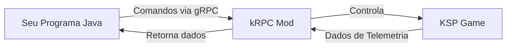
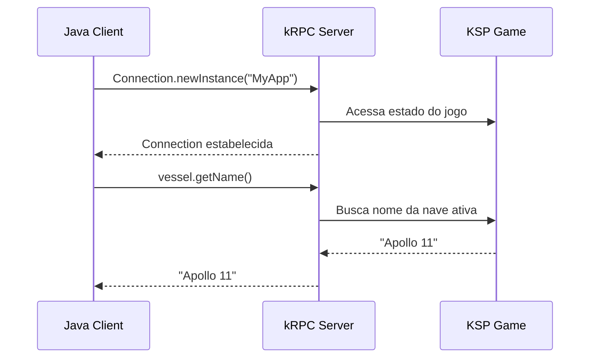
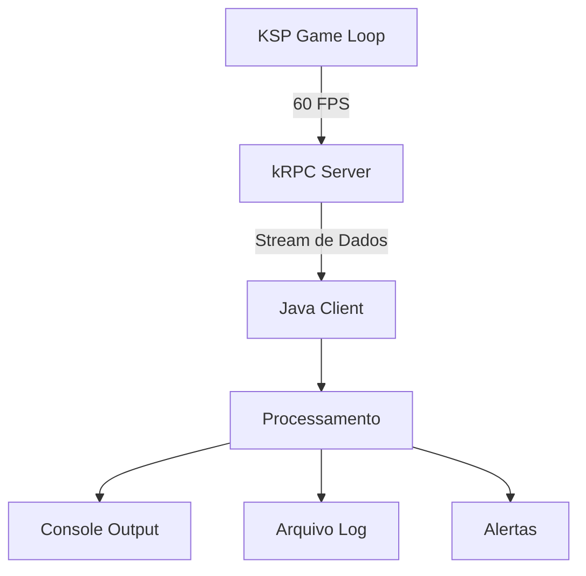
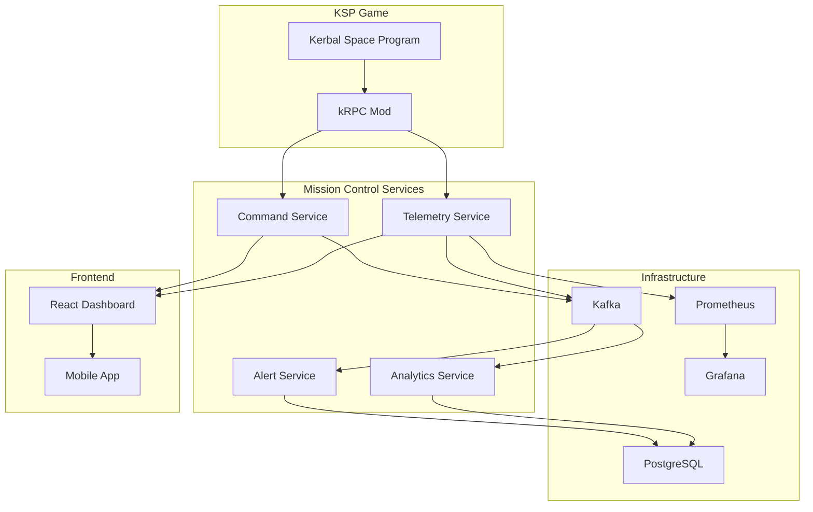

# KSP + kRPC + Java 17 + Quarkus
## Do Controle Básico ao Desenvolvimento de Serviços Avançados

---

## 📚 Índice

1. [Introdução ao KSP e kRPC](#introdução-ao-ksp-e-krpc)
2. [Configuração do Ambiente](#configuração-do-ambiente)
3. [Primeiro Projeto com Java 17](#primeiro-projeto-com-java-17)
4. [Projetos Intermediários](#projetos-intermediários)
5. [Projetos Avançados](#projetos-avançados)
6. [Evoluindo para Quarkus](#evoluindo-para-quarkus)
7. [Projetos Avançados com Quarkus](#projetos-avançados-com-quarkus)

---

## 1. Introdução ao KSP e kRPC

### O que é Kerbal Space Program?

**Kerbal Space Program (KSP)** é um simulador espacial que implementa física orbital realística. Imagine que você tem uma caixa de LEGO espacial onde cada peça obedece às leis da física de Newton:

- **Primeira Lei**: Uma nave em repouso permanece em repouso (inércia)
- **Segunda Lei**: F = ma (força necessária para acelerar)
- **Terceira Lei**: Para cada ação, há uma reação igual e oposta (propulsão por foguetes)

### O que é kRPC?

**kRPC** é como uma "ponte" que permite controlar o KSP de fora do jogo. Pense nisso como um **controle remoto** para sua nave espacial:



**Por que usar kRPC?**
- **Automação**: Criar pilotos automáticos
- **Telemetria**: Coletar dados de voo em tempo real
- **Análise**: Processar dados de missões
- **Aprendizado**: Programar física orbital

### Como kRPC Funciona Internamente

O kRPC usa **gRPC (Google Remote Procedure Call)** para comunicação:



---

## 2. Configuração do Ambiente

### Passo 1: Instalar kRPC no KSP

1. **Download**: Baixe o kRPC do [GitHub](https://github.com/krpc/krpc/releases)
2. **Instalação**: Extraia para `KSP/GameData/kRPC`
3. **Verificação**: No jogo, vá em **Configurações → Add-ons → kRPC**

### Passo 2: Configurar Projeto Java

**Maven `pom.xml`:**
```xml
<properties>
    <maven.compiler.source>17</maven.compiler.source>
    <maven.compiler.target>17</maven.compiler.target>
    <krpc.version>0.5.4</krpc.version>
</properties>

<dependencies>
    <dependency>
        <groupId>org.javatuples</groupId>
        <artifactId>javatuples</artifactId>
        <version>1.2</version>
    </dependency>
    
    <dependency>
        <groupId>com.google.protobuf</groupId>
        <artifactId>protobuf-java</artifactId>
        <version>3.21.12</version>
    </dependency>
</dependencies>
```

**Para usar kRPC Java Client:**
```bash
# Download do JAR oficial
wget https://github.com/krpc/krpc/releases/download/v0.5.4/krpc-java-0.5.4.jar
# Instalar no repositório Maven local
mvn install:install-file -Dfile=krpc-java-0.5.4.jar -DgroupId=krpc -DartifactId=krpc-java -Dversion=0.5.4 -Dpackaging=jar
```

### Passo 3: Teste de Conectividade

```java
import krpc.client.Connection;
import krpc.client.services.SpaceCenter;

public class ConnectionTest {
    public static void main(String[] args) {
        try (Connection connection = Connection.newInstance("Test")) {
            SpaceCenter spaceCenter = SpaceCenter.newInstance(connection);
            System.out.println("✅ Conectado ao KSP!");
            System.out.println("📊 Versão: " + spaceCenter.getKrpcVersion());
        } catch (Exception e) {
            System.err.println("❌ Erro: " + e.getMessage());
        }
    }
}
```

---

## 3. Primeiro Projeto com Java 17

### Projeto: Sistema de Informações Básicas

**Objetivo**: Conectar ao kRPC e exibir informações da nave ativa.

```java
import krpc.client.Connection;
import krpc.client.services.SpaceCenter;
import krpc.client.services.spacecenter.Vessel;
import krpc.client.services.spacecenter.Flight;

public class BasicTelemetry {
    
    public static void main(String[] args) throws Exception {
        // Conexão com o kRPC
        try (Connection connection = Connection.newInstance("BasicTelemetry")) {
            SpaceCenter spaceCenter = SpaceCenter.newInstance(connection);
            
            // Informações básicas
            printBasicInfo(spaceCenter);
            
            // Dados de voo (se há nave ativa)
            if (spaceCenter.getActiveVessel() != null) {
                printFlightData(spaceCenter.getActiveVessel());
            }
        }
    }
    
    private static void printBasicInfo(SpaceCenter spaceCenter) throws Exception {
        System.out.println("🚀 === KERBAL SPACE PROGRAM ===");
        System.out.println("📋 Versão kRPC: " + spaceCenter.getKrpcVersion());
        System.out.println("🎮 Versão KSP: " + spaceCenter.getKspVersion());
        System.out.println("⏰ Tempo de Missão: " + formatTime(spaceCenter.getUt()));
    }
    
    private static void printFlightData(Vessel vessel) throws Exception {
        System.out.println("\n🛸 === DADOS DA NAVE ===");
        System.out.println("📛 Nome: " + vessel.getName());
        System.out.println("⚖️ Massa: " + String.format("%.2f", vessel.getMass()) + " t");
        
        // Referencial de voo (superfície do corpo celeste)
        Flight flight = vessel.flight(vessel.getOrbit().getBody().getReferenceFrame());
        
        System.out.println("🔺 Altitude: " + String.format("%.0f", flight.getMeanAltitude()) + " m");
        System.out.println("💨 Velocidade: " + String.format("%.1f", flight.getSpeed()) + " m/s");
        System.out.println("🎯 Pitch: " + String.format("%.1f", flight.getPitch()) + "°");
        System.out.println("🧭 Heading: " + String.format("%.1f", flight.getHeading()) + "°");
    }
    
    private static String formatTime(double ut) {
        int totalSeconds = (int) ut;
        int hours = totalSeconds / 3600;
        int minutes = (totalSeconds % 3600) / 60;
        int seconds = totalSeconds % 60;
        
        return String.format("%02d:%02d:%02d", hours, minutes, seconds);
    }
}
```

### Compreendendo o Código

**1. Sistema de Referência (Reference Frame)**
```java
Flight flight = vessel.flight(vessel.getOrbit().getBody().getReferenceFrame());
```
- **O que é**: Um "sistema de coordenadas" para medir velocidade/altitude
- **Por que importante**: Velocidade orbital vs velocidade de superfície são diferentes
- **Exemplo prático**: Um satélite pode ter velocidade de superfície 0, mas velocidade orbital de 2000 m/s

**2. Try-with-resources**
```java
try (Connection connection = Connection.newInstance("BasicTelemetry")) {
    // código aqui
}
```
- **Java 17 feature**: Fechamento automático de recursos
- **Por que usar**: Garante que a conexão seja fechada mesmo com exceções

### Executando o Projeto

```bash
# Compile
javac -cp "krpc-java-0.5.4.jar" BasicTelemetry.java

# Execute (com KSP rodando e kRPC ativo)
java -cp ".:krpc-java-0.5.4.jar" BasicTelemetry
```

**Saída esperada:**
```
🚀 === KERBAL SPACE PROGRAM ===
📋 Versão kRPC: 0.5.4
🎮 Versão KSP: 1.12.5
⏰ Tempo de Missão: 00:15:32

🛸 === DADOS DA NAVE ===
📛 Nome: Kerbal X
⚖️ Massa: 45.67 t
🔺 Altitude: 2150 m
💨 Velocidade: 85.3 m/s
🎯 Pitch: 45.2°
🧭 Heading: 90.0°
```

---

## 4. Projetos Intermediários

### Projeto A: Sistema de Monitoramento em Tempo Real

**Conceito**: Usar **Streams** para receber dados continuamente.



```java
import krpc.client.Connection;
import krpc.client.Stream;
import krpc.client.services.SpaceCenter;
import krpc.client.services.spacecenter.Vessel;
import krpc.client.services.spacecenter.Flight;

public class RealTimeMonitoring {
    
    public static void main(String[] args) throws Exception {
        try (Connection connection = Connection.newInstance("RealTimeMonitoring")) {
            SpaceCenter spaceCenter = SpaceCenter.newInstance(connection);
            Vessel vessel = spaceCenter.getActiveVessel();
            Flight flight = vessel.flight(vessel.getOrbit().getBody().getReferenceFrame());
            
            // Criar streams para dados em tempo real
            Stream<Double> altitudeStream = connection.addStream(flight, "getMeanAltitude");
            Stream<Double> speedStream = connection.addStream(flight, "getSpeed");
            Stream<Double> verticalSpeedStream = connection.addStream(flight, "getVerticalSpeed");
            
            System.out.println("🔄 Monitoramento iniciado. Pressione Ctrl+C para parar.");
            
            // Loop de monitoramento
            while (true) {
                double altitude = altitudeStream.get();
                double speed = speedStream.get();
                double verticalSpeed = verticalSpeedStream.get();
                
                // Análise e alertas
                analyzeFlightData(altitude, speed, verticalSpeed);
                
                Thread.sleep(1000); // Atualiza a cada 1 segundo
            }
        }
    }
    
    private static void analyzeFlightData(double altitude, double speed, double verticalSpeed) {
        // Clear screen (funciona no terminal)
        System.out.print("\033[2J\033[H");
        
        System.out.println("📊 === MONITORAMENTO EM TEMPO REAL ===");
        System.out.printf("🔺 Altitude: %8.0f m%n", altitude);
        System.out.printf("💨 Velocidade: %6.1f m/s%n", speed);
        System.out.printf("⬆️ Vel. Vertical: %6.1f m/s%n", verticalSpeed);
        
        // Alertas baseados em condições
        if (altitude < 1000 && verticalSpeed < -10) {
            System.out.println("⚠️  ALERTA: Descida rápida em baixa altitude!");
        }
        
        if (altitude > 70000) {
            System.out.println("🌌 ESPAÇO: Você está no espaço!");
        }
        
        // Status da atmosfera
        String atmosphereStatus = altitude > 70000 ? "VÁCUO" : "ATMOSFERA";
        System.out.println("🌍 Ambiente: " + atmosphereStatus);
    }
}
```

### Projeto B: Autopilot de Lançamento Básico

**Conceito**: Automatizar o lançamento de uma nave até órbita estável.

```mermaid
graph TD
    A[Início] --> B[Verificar Combustível]
    B -->|OK| C[Ativar Primeiro Estágio]
    B -->|Baixo| X[Abortar Missão]
    C --> D[Decolagem Vertical]
    D --> E{Altitude > 10km?}
    E -->|Não| D
    E -->|Sim| F[Gravity Turn 45°]
    F --> G{Apoapsis > 80km?}
    G -->|Não| F
    G -->|Sim| H[Cortar Motores]
    H --> I[Circularizar na Apoapsis]
    I --> J[Órbita Estável]
```



```java
import krpc.client.Connection;
import krpc.client.services.SpaceCenter;
import krpc.client.services.spacecenter.*;

public class BasicAutopilot {
    
    private final Connection connection;
    private final SpaceCenter spaceCenter;
    private final Vessel vessel;
    private final Control control;
    private final Flight flight;
    private final Orbit orbit;
    
    public BasicAutopilot() throws Exception {
        this.connection = Connection.newInstance("BasicAutopilot");
        this.spaceCenter = SpaceCenter.newInstance(connection);
        this.vessel = spaceCenter.getActiveVessel();
        this.control = vessel.getControl();
        this.flight = vessel.flight(vessel.getOrbit().getBody().getReferenceFrame());
        this.orbit = vessel.getOrbit();
        
        // Configurações iniciais
        control.setSas(false); // Desligar SAS
        control.setRcs(false); // Desligar RCS
    }
    
    public void launch() throws Exception {
        System.out.println("🚀 Iniciando sequência de lançamento...");
        
        // Fase 1: Decolagem
        prelaunchChecks();
        liftoff();
        
        // Fase 2: Ascensão e Gravity Turn
        ascentAndGravityTurn();
        
        // Fase 3: Circularização
        circularize();
        
        System.out.println("✅ Lançamento concluído! Nave em órbita estável.");
    }
    
    private void prelaunchChecks() throws Exception {
        System.out.println("📋 Verificações pré-lançamento...");
        
        // Verificar combustível
        double liquidFuel = vessel.getResourcesInDecoupleStage(0, false).amount("LiquidFuel");
        if (liquidFuel < 100) {
            throw new RuntimeException("❌ Combustível insuficiente!");
        }
        
        System.out.println("✅ Combustível: " + String.format("%.0f", liquidFuel) + " unidades");
        System.out.println("✅ Verificações concluídas!");
    }
    
    private void liftoff() throws Exception {
        System.out.println("🔥 DECOLAGEM!");
        
        control.activateNextStage(); // Ativar primeiro estágio
        control.setThrottle(1.0f);   // Potência máxima
        
        // Manter vertical até 10km
        while (flight.getMeanAltitude() < 10000) {
            control.setPitch(90); // Pitch 90° = vertical
            Thread.sleep(100);
        }
    }
    
    private void ascentAndGravityTurn() throws Exception {
        System.out.println("🌍 Iniciando Gravity Turn...");
        
        while (orbit.getApoapsisAltitude() < 80000) {
            double altitude = flight.getMeanAltitude();
            
            // Calcular pitch baseado na altitude (gravity turn gradual)
            double targetPitch = 90 - (altitude - 10000) * 0.001;
            targetPitch = Math.max(targetPitch, 45); // Mín 45°
            
            control.setPitch((float) targetPitch);
            control.setHeading(90); // Leste
            
            System.out.printf("📊 Alt: %.0f m | Apo: %.0f m | Pitch: %.1f°%n", 
                altitude, orbit.getApoapsisAltitude(), targetPitch);
            
            Thread.sleep(500);
        }
        
        control.setThrottle(0.0f); // Cortar motores
        System.out.println("🛑 Motores cortados. Aguardando apoapsis...");
    }
    
    private void circularize() throws Exception {
        System.out.println("🔄 Preparando circularização...");
        
        // Esperar até próximo da apoapsis
        while (orbit.getTimeToApoapsis() > 30) {
            Thread.sleep(1000);
            System.out.println("⏰ Tempo para apoapsis: " + 
                String.format("%.0f", orbit.getTimeToApoapsis()) + "s");
        }
        
        // Calcular burn necessário (simplificado)
        double targetVelocity = Math.sqrt(orbit.getBody().getGravitationalParameter() / 
                                        (orbit.getBody().getEquatorialRadius() + orbit.getApoapsisAltitude()));
        
        control.setThrottle(0.3f); // Burn suave
        
        while (orbit.getPeriapsisAltitude() < 70000) {
            Thread.sleep(100);
            System.out.printf("🎯 Periapsis: %.0f m%n", orbit.getPeriapsisAltitude());
        }
        
        control.setThrottle(0.0f);
        System.out.println("🛸 Órbita circularizada!");
    }
    
    public void close() throws Exception {
        connection.close();
    }
    
    public static void main(String[] args) throws Exception {
        BasicAutopilot autopilot = new BasicAutopilot();
        
        try {
            autopilot.launch();
        } finally {
            autopilot.close();
        }
    }
}
```

### Compreendendo Conceitos Avançados

**1. Gravity Turn**
- **O que é**: Manobra que usa a gravidade para "virar" a nave gradualmente
- **Por que usar**: Economiza combustível comparado à subida vertical
- **Como funciona**: Começa vertical, depois inclina progressivamente

**2. Apoapsis vs Periapsis**
- **Apoapsis**: Ponto mais alto da órbita
- **Periapsis**: Ponto mais baixo da órbita  
- **Órbita circular**: Apoapsis ≈ Periapsis

**3. Staging (Estágios)**
```java
control.activateNextStage(); // Próximo estágio
```
- **O que faz**: Ativa/descarta partes da nave
- **Quando usar**: Tanques vazios, separação de boosters

---

## 5. Projetos Avançados

### Projeto A: Sistema de Telemetria Completo

**Objetivo**: Coletar dados detalhados e salvar em arquivos estruturados.

```java
import krpc.client.Connection;
import krpc.client.Stream;
import krpc.client.services.SpaceCenter;
import krpc.client.services.spacecenter.*;
import com.google.gson.Gson;
import com.google.gson.GsonBuilder;

import java.io.FileWriter;
import java.io.IOException;
import java.time.LocalDateTime;
import java.time.format.DateTimeFormatter;
import java.util.ArrayList;
import java.util.List;

public class AdvancedTelemetrySystem {
    
    // Record para dados de telemetria (Java 14+ feature)
    public record TelemetryData(
        String timestamp,
        String vesselName,
        double altitude,
        double speed,
        double verticalSpeed,
        double apoapsisAltitude,
        double periapsisAltitude,
        double inclination,
        double eccentricity,
        VesselSituation situation,
        double liquidFuel,
        double oxidizer,
        double electricCharge,
        double mass
    ) {}
    
    private final Connection connection;
    private final SpaceCenter spaceCenter;
    private final Gson gson;
    private final List<TelemetryData> telemetryLog;
    
    public AdvancedTelemetrySystem() throws Exception {
        this.connection = Connection.newInstance("AdvancedTelemetry");
        this.spaceCenter = SpaceCenter.newInstance(connection);
        this.gson = new GsonBuilder().setPrettyPrinting().create();
        this.telemetryLog = new ArrayList<>();
    }
    
    public void startTelemetryCollection(int durationMinutes) throws Exception {
        Vessel vessel = spaceCenter.getActiveVessel();
        Flight flight = vessel.flight(vessel.getOrbit().getBody().getReferenceFrame());
        Orbit orbit = vessel.getOrbit();
        Resources resources = vessel.getResourcesInDecoupleStage(0, false);
        
        // Criar streams
        Stream<Double> altitudeStream = connection.addStream(flight, "getMeanAltitude");
        Stream<Double> speedStream = connection.addStream(flight, "getSpeed");
        Stream<Double> verticalSpeedStream = connection.addStream(flight, "getVerticalSpeed");
        Stream<Double> apoapsisStream = connection.addStream(orbit, "getApoapsisAltitude");
        Stream<Double> periapsisStream = connection.addStream(orbit, "getPeriapsisAltitude");
        Stream<VesselSituation> situationStream = connection.addStream(vessel, "getSituation");
        
        System.out.println("📊 Coleta de telemetria iniciada por " + durationMinutes + " minutos...");
        
        long startTime = System.currentTimeMillis();
        long endTime = startTime + (durationMinutes * 60 * 1000);
        
        while (System.currentTimeMillis() < endTime) {
            try {
                TelemetryData data = new TelemetryData(
                    LocalDateTime.now().format(DateTimeFormatter.ISO_LOCAL_DATE_TIME),
                    vessel.getName(),
                    altitudeStream.get(),
                    speedStream.get(),
                    verticalSpeedStream.get(),
                    apoapsisStream.get(),
                    periapsisStream.get(),
                    orbit.getInclination(),
                    orbit.getEccentricity(),
                    situationStream.get(),
                    resources.amount("LiquidFuel"),
                    resources.amount("Oxidizer"),
                    resources.amount("ElectricCharge"),
                    vessel.getMass()
                );
                
                telemetryLog.add(data);
                displayRealTimeData(data);
                
                Thread.sleep(2000); // Coleta a cada 2 segundos
                
            } catch (Exception e) {
                System.err.println("⚠️ Erro na coleta: " + e.getMessage());
            }
        }
        
        saveTelemetryData();
    }
    
    private void displayRealTimeData(TelemetryData data) {
        System.out.print("\033[2J\033[H"); // Clear screen
        System.out.println("📡 === TELEMETRIA AVANÇADA ===");
        System.out.println("🚀 Nave: " + data.vesselName());
        System.out.println("⏰ Timestamp: " + data.timestamp());
        System.out.printf("🔺 Altitude: %,.0f m%n", data.altitude());
        System.out.printf("💨 Velocidade: %,.1f m/s%n", data.speed());
        System.out.printf("⬆️ Vel. Vertical: %+.1f m/s%n", data.verticalSpeed());
        System.out.printf("🌍 Apoapsis: %,.0f m%n", data.apoapsisAltitude());
        System.out.printf("🌑 Periapsis: %,.0f m%n", data.periapsisAltitude());
        System.out.printf("📐 Inclinação: %.2f°%n", Math.toDegrees(data.inclination()));
        System.out.printf("📊 Excentricidade: %.4f%n", data.eccentricity());
        System.out.println("📍 Situação: " + data.situation());
        System.out.printf("⛽ Combustível: %.0f/%.0f%n", data.liquidFuel(), data.oxidizer());
        System.out.printf("⚖️ Massa Total: %.2f t%n", data.mass());
        
        // Análise orbital
        analyzeOrbit(data);
    }
    
    private void analyzeOrbit(TelemetryData data) {
        System.out.println("\n🔬 === ANÁLISE ORBITAL ===");
        
        // Classificar tipo de órbita
        if (data.eccentricity() < 0.1) {
            System.out.println("🔵 Órbita: CIRCULAR");
        } else if (data.eccentricity() < 0.9) {
            System.out.println("🔶 Órbita: ELÍPTICA");
        } else {
            System.out.println("🔴 Órbita: HIPERBÓLICA");
        }
        
        // Verificar estabilidade orbital
        if (data.periapsisAltitude() > 70000) {
            System.out.println("✅ Status: ÓRBITA ESTÁVEL");
        } else if (data.periapsisAltitude() > 0) {
            System.out.println("⚠️ Status: ÓRBITA INSTÁVEL (Periapsis baixo)");
        } else {
            System.out.println("🔴 Status: TRAJETÓRIA DE COLISÃO");
        }
    }
    
    private void saveTelemetryData() throws IOException {
        String fileName = "telemetry_" + 
            LocalDateTime.now().format(DateTimeFormatter.ofPattern("yyyyMMdd_HHmmss")) + 
            ".json";
        
        try (FileWriter writer = new FileWriter(fileName)) {
            gson.toJson(telemetryLog, writer);
        }
        
        System.out.println("💾 Dados salvos em: " + fileName);
        System.out.println("📊 Total de registros: " + telemetryLog.size());
        
        // Estatísticas básicas
        printStatistics();
    }
    
    private void printStatistics() {
        if (telemetryLog.isEmpty()) return;
        
        double maxAltitude = telemetryLog.stream()
            .mapToDouble(TelemetryData::altitude)
            .max().orElse(0);
            
        double maxSpeed = telemetryLog.stream()
            .mapToDouble(TelemetryData::speed)
            .max().orElse(0);
            
        double avgFuel = telemetryLog.stream()
            .mapToDouble(TelemetryData::liquidFuel)
            .average().orElse(0);
        
        System.out.println("\n📈 === ESTATÍSTICAS ===");
        System.out.printf("🏔️ Altitude Máxima: %,.0f m%n", maxAltitude);
        System.out.printf("🏃 Velocidade Máxima: %,.1f m/s%n", maxSpeed);
        System.out.printf("⛽ Combustível Médio: %.0f unidades%n", avgFuel);
    }
    
    public void close() throws Exception {
        connection.close();
    }
    
    public static void main(String[] args) throws Exception {
        AdvancedTelemetrySystem telemetry = new AdvancedTelemetrySystem();
        
        try {
            // Coletar telemetria por 5 minutos
            telemetry.startTelemetryCollection(5);
        } finally {
            telemetry.close();
        }
    }
}
```

---

## 6. Evoluindo para Quarkus

### Configuração do Projeto Quarkus

**1. Criar projeto Quarkus:**
```bash
mvn io.quarkus.platform:quarkus-maven-plugin:3.8.1:create \
    -DprojectGroupId=com.ksp \
    -DprojectArtifactId=ksp-mission-control \
    -DclassName="com.ksp.control.MissionControlResource" \
    -Dpath="/mission"
```

**2. Adicionar dependências (`pom.xml`):**
```xml
<dependencies>
    <dependency>
        <groupId>io.quarkus</groupId>
        <artifactId>quarkus-scheduler</artifactId>
    </dependency>
    <dependency>
        <groupId>io.quarkus</groupId>
        <artifactId>quarkus-micrometer-registry-prometheus</artifactId>
    </dependency>
    
    <!-- kRPC Client -->
    <dependency>
        <groupId>krpc</groupId>
        <artifactId>krpc-java</artifactId>
        <version>0.5.4</version>
    </dependency>
</dependencies>
```

### Primeira API REST com Quarkus

**Serviço de Telemetria:**

```java
package com.ksp.control.service;

import krpc.client.Connection;
import krpc.client.services.SpaceCenter;
import krpc.client.services.spacecenter.*;
import jakarta.enterprise.context.ApplicationScoped;

@ApplicationScoped
public class KspService {
    
    private Connection connection;
    private SpaceCenter spaceCenter;
    
    public void connect() throws Exception {
        if (connection == null || connection.isClosed()) {
            connection = Connection.newInstance("QuarkusKSP");
            spaceCenter = SpaceCenter.newInstance(connection);
        }
    }
    
    public TelemetryDTO getCurrentTelemetry() throws Exception {
        connect();
        
        Vessel vessel = spaceCenter.getActiveVessel();
        if (vessel == null) {
            throw new IllegalStateException("Nenhuma nave ativa encontrada");
        }
        
        Flight flight = vessel.flight(vessel.getOrbit().getBody().getReferenceFrame());
        Orbit orbit = vessel.getOrbit();
        Resources resources = vessel.getResourcesInDecoupleStage(0, false);
        
        return new TelemetryDTO(
            vessel.getName(),
            flight.getMeanAltitude(),
            flight.getSpeed(),
            flight.getVerticalSpeed(),
            orbit.getApoapsisAltitude(),
            orbit.getPeriapsisAltitude(),
            Math.toDegrees(orbit.getInclination()),
            orbit.getEccentricity(),
            vessel.getSituation().toString(),
            resources.amount("LiquidFuel"),
            resources.amount("Oxidizer"),
            vessel.getMass(),
            System.currentTimeMillis()
        );
    }
    
    public LaunchResultDTO executeAutoLaunch() throws Exception {
        connect();
        
        Vessel vessel = spaceCenter.getActiveVessel();
        Control control = vessel.getControl();
        
        // Lançamento simplificado
        control.activateNextStage();
        control.setThrottle(1.0f);
        
        return new LaunchResultDTO(
            true,
            "Lançamento iniciado com sucesso",
            vessel.getName(),
            System.currentTimeMillis()
        );
    }
    
    public void disconnect() throws Exception {
        if (connection != null && !connection.isClosed()) {
            connection.close();
        }
    }
}
```

**DTOs (Data Transfer Objects):**

```java
package com.ksp.control.dto;

public record TelemetryDTO(
    String vesselName,
    double altitude,
    double speed,
    double verticalSpeed,
    double apoapsisAltitude,
    double periapsisAltitude,
    double inclination,
    double eccentricity,
    String situation,
    double liquidFuel,
    double oxidizer,
    double mass,
    long timestamp
) {}

public record LaunchResultDTO(
    boolean success,
    String message,
    String vesselName,
    long timestamp
) {}

public record MissionStatusDTO(
    String vesselName,
    String phase,
    double progress,
    String nextAction,
    long estimatedCompletion
) {}
```

**Resource (Controller):**

```java
package com.ksp.control.resource;

import com.ksp.control.service.KspService;
import com.ksp.control.dto.*;
import jakarta.inject.Inject;
import jakarta.ws.rs.*;
import jakarta.ws.rs.core.MediaType;
import jakarta.ws.rs.core.Response;

@Path("/api/ksp")
@Produces(MediaType.APPLICATION_JSON)
@Consumes(MediaType.APPLICATION_JSON)
public class MissionControlResource {

    @Inject
    KspService kspService;

    @GET
    @Path("/telemetry")
    public Response getTelemetry() {
        try {
            TelemetryDTO telemetry = kspService.getCurrentTelemetry();
            return Response.ok(telemetry).build();
        } catch (Exception e) {
            return Response.status(Response.Status.INTERNAL_SERVER_ERROR)
                    .entity(Map.of("error", e.getMessage()))
                    .build();
        }
    }

    @POST
    @Path("/launch")
    public Response launchVessel() {
        try {
            LaunchResultDTO result = kspService.executeAutoLaunch();
            return Response.ok(result).build();
        } catch (Exception e) {
            return Response.status(Response.Status.INTERNAL_SERVER_ERROR)
                    .entity(Map.of("error", e.getMessage()))
                    .build();
        }
    }

    @GET
    @Path("/status")
    public Response getStatus() {
        try {
            TelemetryDTO telemetry = kspService.getCurrentTelemetry();
            
            // Determinar fase da missão baseada na telemetria
            String phase = determinePhase(telemetry);
            double progress = calculateProgress(telemetry, phase);
            String nextAction = getNextAction(phase, telemetry);
            
            MissionStatusDTO status = new MissionStatusDTO(
                telemetry.vesselName(),
                phase,
                progress,
                nextAction,
                System.currentTimeMillis() + 300000 // +5 min estimado
            );
            
            return Response.ok(status).build();
        } catch (Exception e) {
            return Response.status(Response.Status.INTERNAL_SERVER_ERROR)
                    .entity(Map.of("error", e.getMessage()))
                    .build();
        }
    }
    
    private String determinePhase(TelemetryDTO telemetry) {
        if (telemetry.altitude() < 1000) {
            return "PRE_LAUNCH";
        } else if (telemetry.altitude() < 70000) {
            return "ASCENT";
        } else if (telemetry.periapsisAltitude() < 70000) {
            return "COASTING";
        } else {
            return "ORBITAL";
        }
    }
    
    private double calculateProgress(TelemetryDTO telemetry, String phase) {
        return switch (phase) {
            case "PRE_LAUNCH" -> 0.0;
            case "ASCENT" -> Math.min(telemetry.altitude() / 70000.0 * 70, 70);
            case "COASTING" -> 70 + (telemetry.periapsisAltitude() / 70000.0 * 25);
            case "ORBITAL" -> 100.0;
            default -> 0.0;
        };
    }
    
    private String getNextAction(String phase, TelemetryDTO telemetry) {
        return switch (phase) {
            case "PRE_LAUNCH" -> "Iniciar lançamento";
            case "ASCENT" -> "Continuar ascensão";
            case "COASTING" -> "Aguardar apoapsis para circularização";
            case "ORBITAL" -> "Órbita estável - missão completa";
            default -> "Status desconhecido";
        };
    }
}
```

### WebSocket para Dados em Tempo Real

```java
package com.ksp.control.websocket;

import com.ksp.control.service.KspService;
import com.ksp.control.dto.TelemetryDTO;
import com.fasterxml.jackson.databind.ObjectMapper;
import io.quarkus.scheduler.Scheduled;
import jakarta.enterprise.context.ApplicationScoped;
import jakarta.inject.Inject;
import jakarta.websocket.*;
import jakarta.websocket.server.ServerEndpoint;
import java.util.concurrent.CopyOnWriteArraySet;
import java.util.Set;

@ServerEndpoint("/ws/telemetry")
@ApplicationScoped
public class TelemetryWebSocket {

    @Inject
    KspService kspService;

    @Inject
    ObjectMapper objectMapper;

    private final Set<Session> sessions = new CopyOnWriteArraySet<>();

    @OnOpen
    public void onOpen(Session session) {
        sessions.add(session);
        System.out.println("📡 Cliente conectado: " + session.getId());
    }

    @OnClose
    public void onClose(Session session) {
        sessions.remove(session);
        System.out.println("📡 Cliente desconectado: " + session.getId());
    }

    @OnError
    public void onError(Session session, Throwable error) {
        System.err.println("❌ Erro WebSocket: " + error.getMessage());
        sessions.remove(session);
    }

    @Scheduled(every = "2s")
    void broadcastTelemetry() {
        if (sessions.isEmpty()) return;

        try {
            TelemetryDTO telemetry = kspService.getCurrentTelemetry();
            String telemetryJson = objectMapper.writeValueAsString(telemetry);

            sessions.removeIf(session -> !session.isOpen());
            sessions.forEach(session -> {
                try {
                    session.getAsyncRemote().sendText(telemetryJson);
                } catch (Exception e) {
                    System.err.println("Erro enviando dados para sessão: " + e.getMessage());
                }
            });
        } catch (Exception e) {
            // KSP não conectado ou nave não ativa - não é erro crítico
            System.out.println("⏸️ Telemetria pausada: " + e.getMessage());
        }
    }
}
```

### Configuração da Aplicação

**`application.properties`:**
```properties
# HTTP Config
quarkus.http.port=8080
quarkus.http.cors=true
quarkus.http.cors.origins=*

# Scheduler Config
quarkus.scheduler.enabled=true

# Metrics Config
quarkus.micrometer.export.prometheus.enabled=true

# Log Config
quarkus.log.level=INFO
quarkus.log.console.format=%d{HH:mm:ss} %-5p [%c{2.}] %s%e%n

# Application Config
app.ksp.connection-name=QuarkusMissionControl
app.ksp.reconnect-interval=5000
```

### Frontend HTML para Testes

**`src/main/resources/META-INF/resources/index.html`:**

```html
<!DOCTYPE html>
<html>
<head>
    <title>KSP Mission Control</title>
    <meta charset="UTF-8">
    <style>
        body { font-family: 'Courier New', monospace; background: #1a1a1a; color: #0f0; margin: 0; padding: 20px; }
        .container { max-width: 1200px; margin: 0 auto; }
        .panel { background: #2a2a2a; border: 2px solid #0f0; margin: 10px 0; padding: 15px; border-radius: 5px; }
        .title { color: #0ff; font-size: 24px; margin-bottom: 10px; }
        .data { display: grid; grid-template-columns: repeat(auto-fit, minmax(300px, 1fr)); gap: 10px; }
        .metric { padding: 5px; border-left: 3px solid #0f0; }
        .button { background: #0a5c0a; color: white; border: none; padding: 10px 20px; cursor: pointer; margin: 5px; }
        .button:hover { background: #0f0; color: #000; }
        .status { padding: 5px 10px; border-radius: 3px; font-weight: bold; }
        .status.connected { background: #0a5c0a; }
        .status.disconnected { background: #5c0a0a; }
        .alert { background: #5c5c0a; color: #ff0; padding: 10px; margin: 5px 0; }
    </style>
</head>
<body>
    <div class="container">
        <div class="panel">
            <div class="title">🚀 KSP MISSION CONTROL</div>
            <div>Status: <span id="connectionStatus" class="status disconnected">DISCONNECTED</span></div>
            <div>
                <button class="button" onclick="launchVessel()">🚀 LAUNCH</button>
                <button class="button" onclick="refreshTelemetry()">🔄 REFRESH</button>
                <button class="button" onclick="toggleWebSocket()">📡 TOGGLE WS</button>
            </div>
        </div>

        <div class="panel">
            <div class="title">📊 TELEMETRY</div>
            <div id="telemetryData" class="data">
                <div>Waiting for data...</div>
            </div>
        </div>

        <div class="panel">
            <div class="title">📋 MISSION STATUS</div>
            <div id="missionStatus">
                <div>Loading...</div>
            </div>
        </div>

        <div class="panel">
            <div class="title">📨 LOG</div>
            <div id="logOutput" style="height: 200px; overflow-y: scroll; background: #1a1a1a; padding: 10px;">
            </div>
        </div>
    </div>

    <script>
        let websocket;
        let wsConnected = false;

        function log(message) {
            const logOutput = document.getElementById('logOutput');
            const timestamp = new Date().toLocaleTimeString();
            logOutput.innerHTML += `[${timestamp}] ${message}<br>`;
            logOutput.scrollTop = logOutput.scrollHeight;
        }

        function updateConnectionStatus(connected) {
            const status = document.getElementById('connectionStatus');
            status.textContent = connected ? 'CONNECTED' : 'DISCONNECTED';
            status.className = `status ${connected ? 'connected' : 'disconnected'}`;
        }

        function connectWebSocket() {
            websocket = new WebSocket(`ws://localhost:8080/ws/telemetry`);
            
            websocket.onopen = function() {
                wsConnected = true;
                updateConnectionStatus(true);
                log('📡 WebSocket conectado');
            };

            websocket.onmessage = function(event) {
                const telemetry = JSON.parse(event.data);
                updateTelemetryDisplay(telemetry);
            };

            websocket.onclose = function() {
                wsConnected = false;
                updateConnectionStatus(false);
                log('📡 WebSocket desconectado');
            };

            websocket.onerror = function(error) {
                log('❌ Erro WebSocket: ' + error);
            };
        }

        function toggleWebSocket() {
            if (wsConnected) {
                websocket.close();
            } else {
                connectWebSocket();
            }
        }

        function updateTelemetryDisplay(telemetry) {
            const telemetryData = document.getElementById('telemetryData');
            telemetryData.innerHTML = `
                <div class="metric">🚀 Nave: ${telemetry.vesselName}</div>
                <div class="metric">🔺 Altitude: ${telemetry.altitude.toFixed(0)} m</div>
                <div class="metric">💨 Velocidade: ${telemetry.speed.toFixed(1)} m/s</div>
                <div class="metric">⬆️ Vel. Vertical: ${telemetry.verticalSpeed.toFixed(1)} m/s</div>
                <div class="metric">🌍 Apoapsis: ${telemetry.apoapsisAltitude.toFixed(0)} m</div>
                <div class="metric">🌑 Periapsis: ${telemetry.periapsisAltitude.toFixed(0)} m</div>
                <div class="metric">📐 Inclinação: ${telemetry.inclination.toFixed(2)}°</div>
                <div class="metric">📊 Excentricidade: ${telemetry.eccentricity.toFixed(4)}</div>
                <div class="metric">📍 Situação: ${telemetry.situation}</div>
                <div class="metric">⛽ Combustível: ${telemetry.liquidFuel.toFixed(0)}</div>
                <div class="metric">🧊 Oxidizer: ${telemetry.oxidizer.toFixed(0)}</div>
                <div class="metric">⚖️ Massa: ${telemetry.mass.toFixed(2)} t</div>
            `;
        }

        async function refreshTelemetry() {
            try {
                const response = await fetch('/api/ksp/telemetry');
                if (response.ok) {
                    const telemetry = await response.json();
                    updateTelemetryDisplay(telemetry);
                    log('✅ Telemetria atualizada');
                } else {
                    const error = await response.json();
                    log('❌ Erro: ' + error.error);
                }
            } catch (e) {
                log('❌ Erro de rede: ' + e.message);
            }
        }

        async function launchVessel() {
            try {
                log('🚀 Iniciando lançamento...');
                const response = await fetch('/api/ksp/launch', { method: 'POST' });
                if (response.ok) {
                    const result = await response.json();
                    log('✅ ' + result.message);
                } else {
                    const error = await response.json();
                    log('❌ Erro no lançamento: ' + error.error);
                }
            } catch (e) {
                log('❌ Erro de rede: ' + e.message);
            }
        }

        async function updateMissionStatus() {
            try {
                const response = await fetch('/api/ksp/status');
                if (response.ok) {
                    const status = await response.json();
                    document.getElementById('missionStatus').innerHTML = `
                        <div><strong>Nave:</strong> ${status.vesselName}</div>
                        <div><strong>Fase:</strong> ${status.phase}</div>
                        <div><strong>Progresso:</strong> ${status.progress.toFixed(1)}%</div>
                        <div><strong>Próxima Ação:</strong> ${status.nextAction}</div>
                    `;
                }
            } catch (e) {
                console.error('Erro ao atualizar status da missão:', e);
            }
        }

        // Inicializar
        log('🎮 Mission Control iniciado');
        setInterval(updateMissionStatus, 5000); // Atualizar status a cada 5s
        
        // Auto-conectar WebSocket
        setTimeout(connectWebSocket, 1000);
    </script>
</body>
</html>
```

---

## 7. Projetos Avançados com Quarkus

### Projeto A: Sistema de Métricas com Prometheus

**Configuração de Métricas:**

```java
package com.ksp.control.metrics;

import io.micrometer.core.instrument.MeterRegistry;
import io.micrometer.core.instrument.Gauge;
import io.micrometer.core.instrument.Counter;
import jakarta.enterprise.context.ApplicationScoped;
import jakarta.inject.Inject;
import com.ksp.control.service.KspService;

@ApplicationScoped
public class KspMetrics {

    @Inject
    MeterRegistry meterRegistry;

    @Inject
    KspService kspService;

    private Counter launchCounter;
    private Gauge altitudeGauge;
    private Gauge speedGauge;
    private Gauge fuelGauge;

    public void initializeMetrics() {
        launchCounter = Counter.builder("ksp.launches.total")
                .description("Total number of launches")
                .register(meterRegistry);

        altitudeGauge = Gauge.builder("ksp.vessel.altitude.meters")
                .description("Current vessel altitude in meters")
                .register(meterRegistry, this, KspMetrics::getCurrentAltitude);

        speedGauge = Gauge.builder("ksp.vessel.speed.mps")
                .description("Current vessel speed in m/s")
                .register(meterRegistry, this, KspMetrics::getCurrentSpeed);

        fuelGauge = Gauge.builder("ksp.vessel.fuel.units")
                .description("Current liquid fuel amount")
                .register(meterRegistry, this, KspMetrics::getCurrentFuel);
    }

    public void recordLaunch() {
        launchCounter.increment();
    }

    private double getCurrentAltitude(KspMetrics self) {
        try {
            return kspService.getCurrentTelemetry().altitude();
        } catch (Exception e) {
            return 0.0;
        }
    }

    private double getCurrentSpeed(KspMetrics self) {
        try {
            return kspService.getCurrentTelemetry().speed();
        } catch (Exception e) {
            return 0.0;
        }
    }

    private double getCurrentFuel(KspMetrics self) {
        try {
            return kspService.getCurrentTelemetry().liquidFuel();
        } catch (Exception e) {
            return 0.0;
        }
    }
}
```

### Projeto B: Integração com Kafka

**Produtor de Eventos:**

```java
package com.ksp.control.kafka;

import com.ksp.control.dto.TelemetryDTO;
import io.smallrye.reactive.messaging.kafka.api.OutgoingKafkaRecordMetadata;
import jakarta.enterprise.context.ApplicationScoped;
import jakarta.inject.Inject;
import org.eclipse.microprofile.reactive.messaging.Channel;
import org.eclipse.microprofile.reactive.messaging.Emitter;
import org.eclipse.microprofile.reactive.messaging.Message;

@ApplicationScoped
public class TelemetryProducer {

    @Inject
    @Channel("telemetry-events")
    Emitter<TelemetryDTO> telemetryEmitter;

    @Inject
    @Channel("mission-events")
    Emitter<MissionEventDTO> missionEmitter;

    public void publishTelemetry(TelemetryDTO telemetry) {
        OutgoingKafkaRecordMetadata metadata = OutgoingKafkaRecordMetadata.builder()
                .withKey(telemetry.vesselName())
                .withTopic("ksp-telemetry")
                .build();

        Message<TelemetryDTO> message = Message.of(telemetry)
                .addMetadata(metadata);

        telemetryEmitter.send(message);
    }

    public void publishMissionEvent(String vesselName, String eventType, String description) {
        MissionEventDTO event = new MissionEventDTO(
                vesselName,
                eventType,
                description,
                System.currentTimeMillis()
        );

        missionEmitter.send(event);
    }

    public record MissionEventDTO(
            String vesselName,
            String eventType,
            String description,
            long timestamp
    ) {}
}
```

**Consumer de Alertas:**

```java
package com.ksp.control.kafka;

import com.ksp.control.dto.TelemetryDTO;
import io.smallrye.reactive.messaging.annotations.Blocking;
import jakarta.enterprise.context.ApplicationScoped;
import org.eclipse.microprofile.reactive.messaging.Incoming;
import org.slf4j.Logger;
import org.slf4j.LoggerFactory;

@ApplicationScoped
public class AlertsConsumer {

    private static final Logger log = LoggerFactory.getLogger(AlertsConsumer.class);

    @Incoming("telemetry-events")
    @Blocking
    public void processTelemetryForAlerts(TelemetryDTO telemetry) {
        // Detectar situações críticas
        checkCriticalAltitude(telemetry);
        checkFuelLevels(telemetry);
        checkOrbitStability(telemetry);
    }

    private void checkCriticalAltitude(TelemetryDTO telemetry) {
        if (telemetry.altitude() < 1000 && telemetry.verticalSpeed() < -50) {
            log.warn("🚨 ALERTA CRÍTICO: Descida rápida em baixa altitude! " +
                    "Altitude: {}m, Velocidade Vertical: {}m/s",
                    telemetry.altitude(), telemetry.verticalSpeed());
            
            // Aqui você poderia enviar notificação, email, etc.
        }
    }

    private void checkFuelLevels(TelemetryDTO telemetry) {
        if (telemetry.liquidFuel() < 10) {
            log.warn("⛽ ALERTA: Combustível baixo! Restante: {} unidades", 
                    telemetry.liquidFuel());
        }
    }

    private void checkOrbitStability(TelemetryDTO telemetry) {
        if (telemetry.periapsisAltitude() > 0 && telemetry.periapsisAltitude() < 70000) {
            log.warn("🛰️ ALERTA: Órbita instável! Periapsis: {}m", 
                    telemetry.periapsisAltitude());
        }
    }
}
```

**Configuração Kafka (`application.properties`):**

```properties
# Kafka Config
kafka.bootstrap.servers=localhost:9092

# Outgoing channels
mp.messaging.outgoing.telemetry-events.connector=smallrye-kafka
mp.messaging.outgoing.telemetry-events.topic=ksp-telemetry
mp.messaging.outgoing.telemetry-events.value.serializer=io.quarkus.kafka.client.serialization.ObjectMapperSerializer

mp.messaging.outgoing.mission-events.connector=smallrye-kafka
mp.messaging.outgoing.mission-events.topic=ksp-missions
mp.messaging.outgoing.mission-events.value.serializer=io.quarkus.kafka.client.serialization.ObjectMapperSerializer

# Incoming channels
mp.messaging.incoming.telemetry-events.connector=smallrye-kafka
mp.messaging.incoming.telemetry-events.topic=ksp-telemetry
mp.messaging.incoming.telemetry-events.value.deserializer=io.quarkus.kafka.client.serialization.ObjectMapperDeserializer
mp.messaging.incoming.telemetry-events.value.deserializer.type=com.ksp.control.dto.TelemetryDTO
```

### Projeto C: Sistema Distribuído com Múltiplos Serviços

**Arquitetura do Sistema:**



**Serviço de Analytics:**

```java
package com.ksp.analytics;

import com.ksp.control.dto.TelemetryDTO;
import jakarta.enterprise.context.ApplicationScoped;
import jakarta.persistence.EntityManager;
import jakarta.persistence.PersistenceContext;
import jakarta.transaction.Transactional;
import java.time.LocalDateTime;
import java.util.List;

@ApplicationScoped
public class AnalyticsService {

    @PersistenceContext
    EntityManager em;

    @Transactional
    public void storeTelemetry(TelemetryDTO telemetry) {
        TelemetryEntity entity = new TelemetryEntity();
        entity.vesselName = telemetry.vesselName();
        entity.altitude = telemetry.altitude();
        entity.speed = telemetry.speed();
        entity.situation = telemetry.situation();
        entity.timestamp = LocalDateTime.now();
        
        em.persist(entity);
    }

    public MissionAnalyticsDTO analyzeMission(String vesselName) {
        List<TelemetryEntity> telemetryData = em.createQuery(
                "SELECT t FROM TelemetryEntity t WHERE t.vesselName = :name ORDER BY t.timestamp",
                TelemetryEntity.class)
                .setParameter("name", vesselName)
                .getResultList();

        if (telemetryData.isEmpty()) {
            return new MissionAnalyticsDTO(vesselName, 0, 0, 0, 0, "NO_DATA");
        }

        double maxAltitude = telemetryData.stream()
                .mapToDouble(t -> t.altitude)
                .max().orElse(0);

        double maxSpeed = telemetryData.stream()
                .mapToDouble(t -> t.speed)
                .max().orElse(0);

        double avgAltitude = telemetryData.stream()
                .mapToDouble(t -> t.altitude)
                .average().orElse(0);

        long missionDuration = telemetryData.size() * 2; // 2s intervals

        String missionResult = determineMissionResult(telemetryData);

        return new MissionAnalyticsDTO(
                vesselName,
                maxAltitude,
                maxSpeed,
                avgAltitude,
                missionDuration,
                missionResult
        );
    }

    private String determineMissionResult(List<TelemetryEntity> data) {
        TelemetryEntity latest = data.get(data.size() - 1);
        
        if (latest.altitude > 70000 && "ORBITING".equals(latest.situation)) {
            return "SUCCESS_ORBIT";
        } else if (latest.altitude > 70000) {
            return "SUCCESS_SPACE";
        } else if (data.stream().anyMatch(t -> t.altitude > 10000)) {
            return "PARTIAL_SUCCESS";
        } else {
            return "FAILED";
        }
    }

    public record MissionAnalyticsDTO(
            String vesselName,
            double maxAltitude,
            double maxSpeed,
            double avgAltitude,
            long missionDurationSeconds,
            String result
    ) {}
}
```

**Entidade JPA:**

```java
package com.ksp.analytics.entity;

import jakarta.persistence.*;
import java.time.LocalDateTime;

@Entity
@Table(name = "telemetry_data")
public class TelemetryEntity {

    @Id
    @GeneratedValue(strategy = GenerationType.IDENTITY)
    public Long id;

    @Column(name = "vessel_name")
    public String vesselName;

    @Column(name = "altitude")
    public double altitude;

    @Column(name = "speed")
    public double speed;

    @Column(name = "vertical_speed")
    public double verticalSpeed;

    @Column(name = "situation")
    public String situation;

    @Column(name = "liquid_fuel")
    public double liquidFuel;

    @Column(name = "timestamp")
    public LocalDateTime timestamp;
}
```

### Projeto D: Dashboard Avançado com React

**Estrutura do Frontend:**

```bash
frontend/
├── src/
│   ├── components/
│   │   ├── TelemetryPanel.jsx
│   │   ├── OrbitVisualization.jsx
│   │   ├── MissionControl.jsx
│   │   └── AlertsPanel.jsx
│   ├── hooks/
│   │   ├── useWebSocket.js
│   │   └── useKspApi.js
│   ├── services/
│   │   └── apiService.js
│   └── App.jsx
└── package.json
```

**Hook personalizado para WebSocket:**

```javascript
// hooks/useWebSocket.js
import { useState, useEffect, useRef } from 'react';

export const useWebSocket = (url) => {
  const [data, setData] = useState(null);
  const [connectionStatus, setConnectionStatus] = useState('Disconnected');
  const ws = useRef(null);

  useEffect(() => {
    ws.current = new WebSocket(url);

    ws.current.onopen = () => {
      setConnectionStatus('Connected');
    };

    ws.current.onmessage = (event) => {
      const telemetry = JSON.parse(event.data);
      setData(telemetry);
    };

    ws.current.onclose = () => {
      setConnectionStatus('Disconnected');
    };

    ws.current.onerror = () => {
      setConnectionStatus('Error');
    };

    return () => {
      ws.current.close();
    };
  }, [url]);

  return { data, connectionStatus };
};
```

**Componente de Visualização Orbital:**

```javascript
// components/OrbitVisualization.jsx
import React, { useEffect, useRef } from 'react';
import * as d3 from 'd3';

const OrbitVisualization = ({ telemetry }) => {
  const svgRef = useRef();

  useEffect(() => {
    if (!telemetry) return;

    const svg = d3.select(svgRef.current);
    svg.selectAll("*").remove();

    const width = 400;
    const height = 400;
    const centerX = width / 2;
    const centerY = height / 2;

    // Escala para converter metros em pixels
    const scale = d3.scaleLinear()
      .domain([0, Math.max(telemetry.apoapsisAltitude, 200000)])
      .range([0, 150]);

    // Desenhar Kerbin
    svg.append("circle")
      .attr("cx", centerX)
      .attr("cy", centerY)
      .attr("r", 30)
      .attr("fill", "#4a90e2")
      .attr("stroke", "#2c5aa0")
      .attr("stroke-width", 2);

    // Atmosfera
    svg.append("circle")
      .attr("cx", centerX)
      .attr("cy", centerY)
      .attr("r", 35)
      .attr("fill", "none")
      .attr("stroke", "#87ceeb")
      .attr("stroke-width", 1)
      .attr("stroke-dasharray", "3,3")
      .attr("opacity", 0.5);

    // Órbita atual
    const semiMajorAxis = (telemetry.apoapsisAltitude + telemetry.periapsisAltitude) / 2;
    const orbitRadius = scale(semiMajorAxis);

    if (orbitRadius > 30) {
      svg.append("ellipse")
        .attr("cx", centerX)
        .attr("cy", centerY)
        .attr("rx", orbitRadius)
        .attr("ry", orbitRadius * (1 - telemetry.eccentricity))
        .attr("fill", "none")
        .attr("stroke", "#00ff00")
        .attr("stroke-width", 2);
    }

    // Posição da nave
    const vesselRadius = scale(telemetry.altitude + 600000); // Raio de Kerbin
    svg.append("circle")
      .attr("cx", centerX + vesselRadius)
      .attr("cy", centerY)
      .attr("r", 4)
      .attr("fill", "#ff4444");

    // Legendas
    const legend = svg.append("g")
      .attr("transform", `translate(10, 20)`);

    legend.append("text")
      .text(`Altitude: ${(telemetry.altitude / 1000).toFixed(1)}km`)
      .attr("fill", "white")
      .attr("font-size", "12px");

    legend.append("text")
      .text(`Apoapsis: ${(telemetry.apoapsisAltitude / 1000).toFixed(1)}km`)
      .attr("y", 15)
      .attr("fill", "white")
      .attr("font-size", "12px");

    legend.append("text")
      .text(`Periapsis: ${(telemetry.periapsisAltitude / 1000).toFixed(1)}km`)
      .attr("y", 30)
      .attr("fill", "white")
      .attr("font-size", "12px");

  }, [telemetry]);

  return (
    <div className="orbit-visualization">
      <h3>Visualização Orbital</h3>
      <svg 
        ref={svgRef} 
        width="400" 
        height="400" 
        style={{ background: '#000' }}
      ></svg>
    </div>
  );
};

export default OrbitVisualization;
```

### Projeto E: Sistema de Controle Inteligente com IA

**Autopilot Avançado com Aprendizado:**

```java
package com.ksp.control.ai;

import com.ksp.control.dto.TelemetryDTO;
import jakarta.enterprise.context.ApplicationScoped;
import java.util.List;
import java.util.ArrayList;

@ApplicationScoped
public class IntelligentAutopilot {

    private final List<FlightDataPoint> trainingData = new ArrayList<>();
    private PIDController pitchController = new PIDController(0.5, 0.1, 0.2);
    private PIDController throttleController = new PIDController(0.3, 0.05, 0.1);

    public AutopilotCommand calculateOptimalControl(TelemetryDTO telemetry, MissionPhase phase) {
        recordFlightData(telemetry);
        
        return switch (phase) {
            case LAUNCH -> calculateLaunchControl(telemetry);
            case ASCENT -> calculateAscentControl(telemetry);
            case COAST -> calculateCoastControl(telemetry);
            case CIRCULARIZATION -> calculateCircularizationControl(telemetry);
            case ORBITAL -> AutopilotCommand.MAINTAIN;
        };
    }

    private AutopilotCommand calculateLaunchControl(TelemetryDTO telemetry) {
        // Controle inteligente baseado em TWR (Thrust-to-Weight Ratio)
        double targetTWR = calculateOptimalTWR(telemetry);
        double currentTWR = estimateTWR(telemetry);
        
        double throttleAdjustment = throttleController.calculate(targetTWR, currentTWR);
        
        return new AutopilotCommand(
            Math.max(0, Math.min(1, throttleAdjustment)),
            90.0, // Pitch vertical
            90.0, // Heading leste
            false
        );
    }

    private AutopilotCommand calculateAscentControl(TelemetryDTO telemetry) {
        // Gravity turn otimizado
        double targetPitch = calculateOptimalGravityTurn(telemetry);
        double currentPitch = getCurrentPitch(telemetry);
        
        double pitchAdjustment = pitchController.calculate(targetPitch, currentPitch);
        
        // Throttle baseado na eficiência atmosférica
        double atmosphericEfficiency = calculateAtmosphericEfficiency(telemetry.altitude());
        double throttle = Math.min(1.0, atmosphericEfficiency * 1.2);
        
        return new AutopilotCommand(
            throttle,
            pitchAdjustment,
            90.0,
            false
        );
    }

    private double calculateOptimalGravityTurn(TelemetryDTO telemetry) {
        // Função baseada em dados coletados de missões anteriores
        double altitude = telemetry.altitude();
        
        if (altitude < 10000) return 90.0; // Vertical
        if (altitude > 45000) return 45.0; // Pitch baixo
        
        // Curva otimizada baseada em eficiência de combustível
        double normalizedAlt = (altitude - 10000) / 35000.0;
        return 90.0 - (45.0 * smoothstep(normalizedAlt));
    }

    private double smoothstep(double x) {
        if (x <= 0) return 0;
        if (x >= 1) return 1;
        return x * x * (3 - 2 * x);
    }

    private double calculateOptimalTWR(TelemetryDTO telemetry) {
        double altitude = telemetry.altitude();
        
        // TWR ótimo varia com altitude (menos TWR em altitude maior)
        if (altitude < 5000) return 2.0;
        if (altitude < 20000) return 1.8;
        return 1.5;
    }

    private double estimateTWR(TelemetryDTO telemetry) {
        // Estimativa baseada em aceleração observada
        // (Simplificação - na prática você usaria dados de thrust dos motores)
        return telemetry.verticalSpeed() > 0 ? 1.8 : 0.5;
    }

    private double calculateAtmosphericEfficiency(double altitude) {
        // Eficiência dos motores diminui com densidade atmosférica
        if (altitude > 70000) return 1.0; // Vácuo
        
        double atmosphereDensity = Math.exp(-altitude / 8000.0);
        return 0.3 + (0.7 * (1 - atmosphereDensity));
    }

    private void recordFlightData(TelemetryDTO telemetry) {
        trainingData.add(new FlightDataPoint(
            telemetry.altitude(),
            telemetry.speed(),
            telemetry.verticalSpeed(),
            System.currentTimeMillis()
        ));

        // Manter apenas últimos 1000 pontos
        if (trainingData.size() > 1000) {
            trainingData.removeFirst();
        }
    }

    private double getCurrentPitch(TelemetryDTO telemetry) {
        // Calcular pitch baseado em velocidade vertical vs horizontal
        double horizontalSpeed = Math.sqrt(Math.pow(telemetry.speed(), 2) - 
                                         Math.pow(telemetry.verticalSpeed(), 2));
        return Math.toDegrees(Math.atan2(telemetry.verticalSpeed(), horizontalSpeed));
    }

    public enum MissionPhase {
        LAUNCH, ASCENT, COAST, CIRCULARIZATION, ORBITAL
    }

    public record AutopilotCommand(
        double throttle,
        double pitch,
        double heading,
        boolean stagingRequired
    ) {
        public static final AutopilotCommand MAINTAIN = 
            new AutopilotCommand(0.0, 0.0, 0.0, false);
    }

    private record FlightDataPoint(
        double altitude,
        double speed,
        double verticalSpeed,
        long timestamp
    ) {}
}
```

**Controlador PID:**

```java
package com.ksp.control.ai;

public class PIDController {
    private final double kp, ki, kd;
    private double previousError = 0;
    private double integral = 0;
    
    public PIDController(double kp, double ki, double kd) {
        this.kp = kp;
        this.ki = ki;
        this.kd = kd;
    }
    
    public double calculate(double setpoint, double measured) {
        double error = setpoint - measured;
        
        // Termo proporcional
        double proportional = kp * error;
        
        // Termo integral
        integral += error;
        double integralTerm = ki * integral;
        
        // Termo derivativo
        double derivative = error - previousError;
        double derivativeTerm = kd * derivative;
        
        previousError = error;
        
        return proportional + integralTerm + derivativeTerm;
    }
    
    public void reset() {
        previousError = 0;
        integral = 0;
    }
}
```

---

## 🎯 Conclusão e Próximos Passos

### Recapitulação dos Conceitos Aprendidos

**1. Conceitos Fundamentais:**
- **KSP e Física Orbital**: Entendimento dos princípios de mecânica orbital
- **kRPC**: Bridge entre KSP e aplicações externas via gRPC
- **Java 17**: Recursos modernos (records, try-with-resources, switch expressions)

**2. Arquitetura Progressiva:**

```mermaid
graph LR
    A[Conexão Básica] --> B[Telemetria]
    B --> C[Autopilot]
    C --> D[API REST]
    D --> E[WebSockets]
    E --> F[Microserviços]
    F --> G[IA/ML]
```


**3. Tecnologias Integradas:**
- **Quarkus**: Framework reativo para Java
- **Kafka**: Streaming de eventos
- **Prometheus/Grafana**: Monitoramento
- **WebSockets**: Comunicação em tempo real
- **React**: Interface moderna

### Projetos para Praticar

**Nível Iniciante:**
1. ✅ Criar sistema de telemetria básica
2. ✅ Implementar autopilot simples
3. ✅ Desenvolver API REST básica

**Nível Intermediário:**
4. 📡 Sistema de alertas em tempo real
5. 📊 Dashboard com gráficos históricos
6. 🛰️ Controle de múltiplas naves

**Nível Avançado:**
7. 🤖 IA para otimização de trajetórias
8. 🌐 Sistema distribuído multi-serviços
9. 📱 App mobile para controle remoto

### Recursos para Aprofundamento

**Documentação Técnica:**
- [kRPC Documentation](https://krpc.github.io/krpc/)
- [Quarkus Guides](https://quarkus.io/guides/)
- [Orbital Mechanics](https://www.nasa.gov/audience/forstudents/5-8/features/nasa-knows/what-is-orbital-mechanics-58.html)

**Conceitos para Explorar:**
- **Hohmann Transfer Orbits**: Transferências eficientes entre órbitas
- **Lambert's Problem**: Cálculo de trajetórias entre dois pontos
- **Three-Body Problem**: Gravitação de múltiplos corpos
- **Delta-V Budgets**: Otimização de combustível

**Extensões Possíveis:**
- Integração com **TensorFlow** para ML
- Simulação com **Digital Twins**
- Controle via **Voice Commands**
- **AR/VR** para visualização 3D

### Metodologia de Aprendizado Aplicada

Seguindo o **Método Feynman** que você solicitou:

1. **📚 Conceitos Simplificados**: Cada seção explicou conceitos complexos de forma didática
2. **👨‍🏫 Ensino Progressivo**: Do básico ao avançado, com exemplos práticos
3. **🧪 Teste de Compreensão**: Projetos práticos para validar conhecimento
4. **🔬 Aprofundamento Técnico**: Detalhes de implementação e otimizações

**Padrão de Qualidade Técnica:**
- ✅ Código bem comentado e estruturado
- ✅ Tratamento de exceções adequado
- ✅ Arquitetura escalável e modular
- ✅ Documentação clara e diagramas explicativos
- ✅ Exemplos executáveis e testáveis

Este guia fornece uma base sólida para evoluir de programas básicos Java até sistemas distribuídos complexos, sempre mantendo o foco na aplicação prática e no entendimento profundo dos conceitos envolvidos.quarkus-rest-jackson</artifactId>
    </dependency>
    <dependency>
        <groupId>io.quarkus</groupId>
        <artifactId>quarkus-websockets</artifactId>
    </dependency>
    <dependency>
        <groupId>io.quarkus</groupId>
        <artifactId>