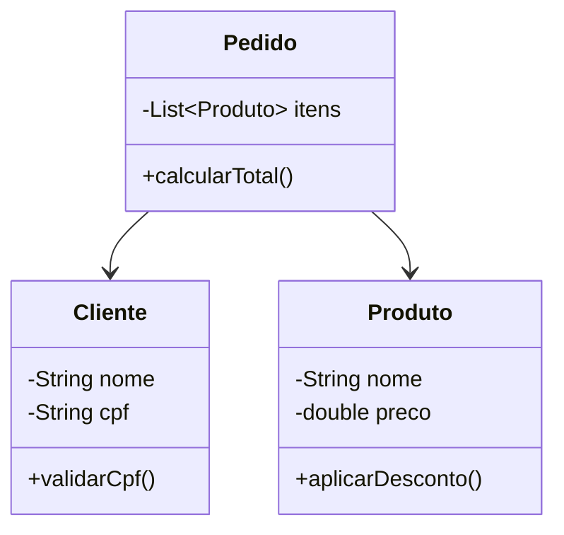
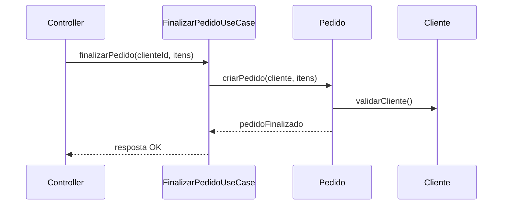
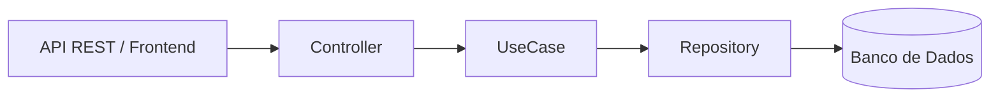
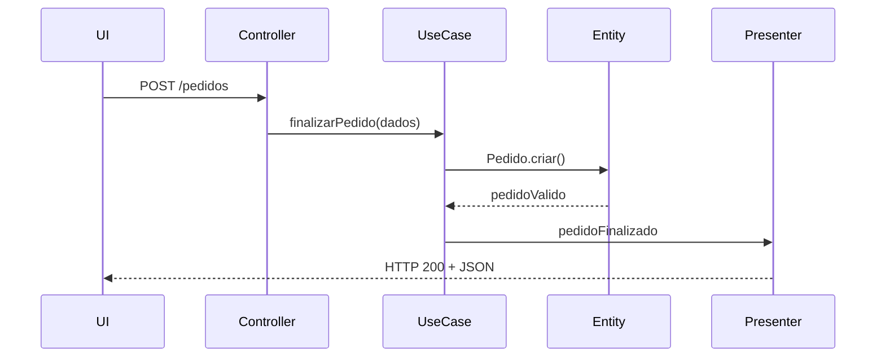
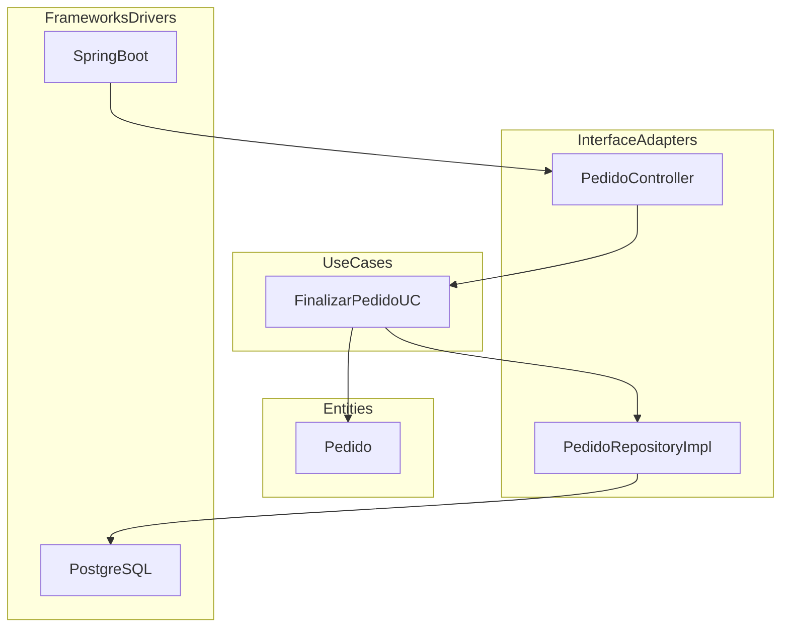
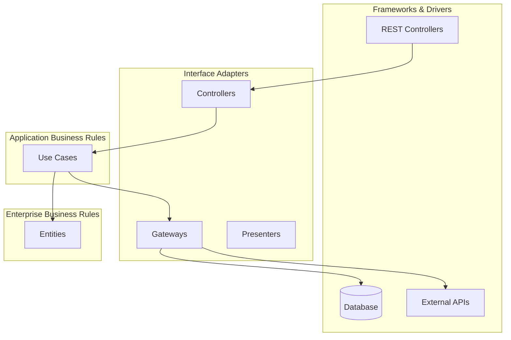
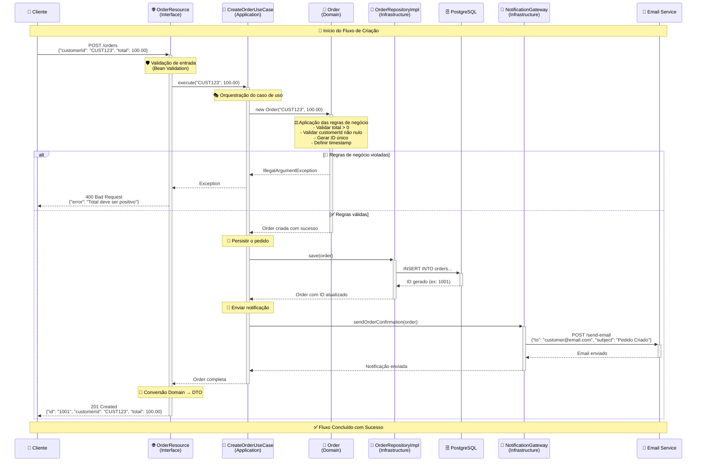
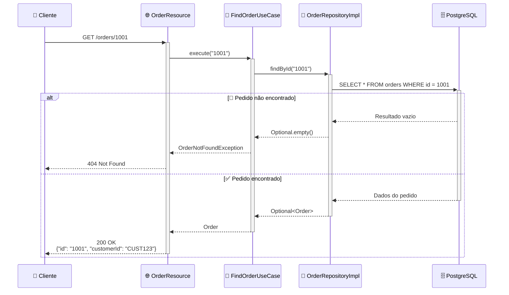
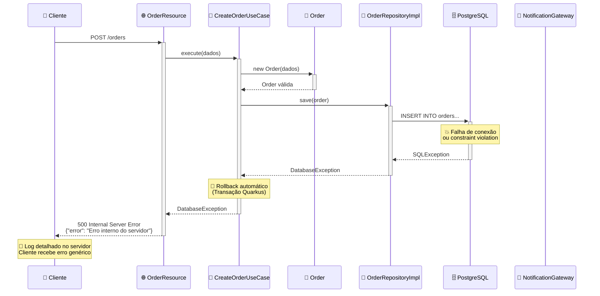

Ótimo! Você trouxe a famosa imagem da **Clean Architecture** do Uncle Bob.
Vamos fazer uma **aula completa**, passo a passo, em estilo bem didático, como você pediu, usando analogias simples, exemplos práticos e diagramas em **Mermaid** para visualizar. 🚀

---

# 1. O que é Clean Architecture?

A Clean Architecture é uma forma de organizar o código de um sistema em **camadas concêntricas** (como círculos), onde:

* **O que é mais importante (regras de negócio)** fica no centro.
* **O que é menos importante (frameworks, banco, UI, APIs externas)** fica na borda.
* **A regra de ouro**: **as dependências só apontam para dentro**, nunca para fora.

👉 Isso garante que mudanças em tecnologia (ex: trocar banco, trocar framework web) **não afetem** a regra de negócio.

---

# 2. As Camadas (da imagem)

### 2.1 Entidades (Entities)

* **O núcleo** do sistema.
* São as regras de negócio mais puras (independentes de tecnologia).
* Exemplo: `Pedido`, `Produto`, `Cliente`.



---

### 2.2 Casos de Uso (Use Cases / Application Business Rules)

* Orquestram as regras de negócio.
* Definem **como as entidades são usadas** em cada cenário.
* Exemplo: "Finalizar Pedido", "Cadastrar Cliente", "Aplicar Cupom".



---

### 2.3 Adaptadores de Interface (Interface Adapters)

* Fazem a ponte entre **os casos de uso** e **o mundo externo**.
* Aqui ficam:

  * **Controllers** (HTTP, CLI, gRPC…)
  * **Presenters/ViewModels** (para preparar saída para UI)
  * **Gateways/Repositories** (adaptadores para o banco ou APIs externas).



---

### 2.4 Frameworks e Drivers (External Interfaces)

* A casca mais externa.
* Tecnologias específicas: **Spring Boot, Quarkus, NestJS, Angular, React, PostgreSQL, MongoDB, Kafka, etc.**
* **Podem ser trocadas sem impactar o núcleo**.

Exemplo:

* Trocar PostgreSQL por MongoDB não deve quebrar o `Pedido` ou o `FinalizarPedidoUseCase`.
* Só o adaptador de repositório muda.

---

# 3. O Fluxo de Controle (explicando o lado direito da imagem)

* O **Controller** recebe a entrada (ex: requisição HTTP).
* Ele chama o **Use Case (Interactor)**.
* O Use Case usa as **Entities** para aplicar regras.
* O resultado vai para o **Presenter**, que adapta para a **UI**.



---

# 4. Exemplo Prático (E-commerce)

Imagine um sistema de **E-commerce**.

* **Entidade**: `Pedido`
* **Caso de Uso**: `FinalizarPedido`
* **Adaptador**: `PedidoController` (REST)
* **Framework**: Spring Boot ou Quarkus



---

# 5. Principais Benefícios

✅ Independência de frameworks.
✅ Testabilidade (você pode testar casos de uso sem precisar de banco ou HTTP).
✅ Separação clara de responsabilidades.
✅ Facilidade de manutenção e evolução.

---

📌 **Resumo da Regrinha de Ouro**:

* **De fora → para dentro**: frameworks, UI e banco **dependem** da regra de negócio.
* **De dentro → para fora**: as regras de negócio **não sabem** nada sobre frameworks, UI ou banco.

---

# Guia Definitivo: Clean Architecture aplicada ao Quarkus

## 1. O que é Clean Architecture? (Conceito Fundamental)

Imagine sua aplicação como uma **cebola** 🧅. Cada camada tem sua responsabilidade e as camadas internas não conhecem as externas.

**Analogia simples**: Pense numa empresa:
- **CEO** (Entities): Define as regras fundamentais do negócio
- **Gerentes** (Use Cases): Organizam e coordenam as ações
- **Supervisores** (Adapters): Fazem a ponte entre departamentos
- **Funcionários** (Frameworks): Executam tarefas específicas

### Principais Objetivos
- **Independência de frameworks**: Trocar Spring por Quarkus sem quebrar regras de negócio
- **Testabilidade**: Testar lógica sem banco de dados
- **Desacoplamento**: Mudanças numa camada não afetam outras
- **Manutenção**: Código organizado e previsível

### As 4 Camadas em Círculos Concêntricos



**Regra Fundamental**: As dependências sempre apontam para dentro. A camada interna nunca conhece a externa.

## 2. Comparando com Outras Arquiteturas

| Arquitetura | Características | Quando Usar |
|------------|----------------|-------------|
| **MVC** | Controller → Service → Repository | Projetos simples, prototipagem |
| **Hexagonal** | Ports & Adapters | Quando precisa de múltiplos adapters |
| **Onion** | Camadas concêntricas | Similar à Clean, menos formal |
| **Clean** | Use Cases explícitos, regras rígidas | Projetos complexos, longo prazo |

**Por que Clean Architecture?**
- Mais **disciplinada** que MVC
- Mais **estruturada** que Hexagonal
- **Use Cases** explícitos (diferente da Onion)

## 3. Estrutura de Pacotes no Quarkus

```
src/main/java/com/example/
├── domain/                    # 🎯 Regras de Negócio Puras
│   ├── entities/             # Objetos fundamentais
│   └── gateways/            # Contratos (interfaces)
├── application/              # 🎪 Orquestração
│   └── usecases/            # Casos de uso específicos
├── infrastructure/          # 🔧 Implementações técnicas
│   ├── repositories/        # Persistência
│   └── external/           # APIs externas
└── interfaces/              # 🌐 Pontos de entrada
    └── rest/               # Controllers REST
```

## 4. Exemplo Prático: Sistema de Pedidos

Vamos construir um sistema de pedidos passo a passo, da camada mais interna para a externa.

### 4.1 Entidade (Coração do Sistema)

```java
// domain/entities/Order.java
public class Order {
    private final String id;
    private final String customerId;
    private final BigDecimal total;
    private final LocalDateTime createdAt;

    public Order(String customerId, BigDecimal total) {
        // 🛡️ Regras de negócio SEMPRE na entidade
        if (total == null || total.compareTo(BigDecimal.ZERO) <= 0) {
            throw new IllegalArgumentException("Total deve ser positivo");
        }
        if (customerId == null || customerId.trim().isEmpty()) {
            throw new IllegalArgumentException("Cliente é obrigatório");
        }
        
        this.id = UUID.randomUUID().toString();
        this.customerId = customerId;
        this.total = total;
        this.createdAt = LocalDateTime.now();
    }
    
    // Construtor para reconstrução (vindo do banco)
    public Order(String id, String customerId, BigDecimal total, LocalDateTime createdAt) {
        this.id = id;
        this.customerId = customerId;
        this.total = total;
        this.createdAt = createdAt;
    }

    // 💰 Lógica de negócio: calcular desconto
    public BigDecimal calculateDiscountedTotal(BigDecimal discountPercent) {
        if (discountPercent.compareTo(BigDecimal.ZERO) < 0 || 
            discountPercent.compareTo(new BigDecimal("100")) > 0) {
            throw new IllegalArgumentException("Desconto deve estar entre 0% e 100%");
        }
        
        BigDecimal discount = total.multiply(discountPercent).divide(new BigDecimal("100"));
        return total.subtract(discount);
    }

    // Getters
    public String getId() { return id; }
    public String getCustomerId() { return customerId; }
    public BigDecimal getTotal() { return total; }
    public LocalDateTime getCreatedAt() { return createdAt; }
}
```

### 4.2 Gateway (Contrato/Interface)

```java
// domain/gateways/OrderRepository.java
public interface OrderRepository {
    Order save(Order order);
    Optional<Order> findById(String id);
    List<Order> findByCustomerId(String customerId);
}

// domain/gateways/NotificationGateway.java
public interface NotificationGateway {
    void sendOrderConfirmation(Order order);
}
```

### 4.3 Caso de Uso (Orquestrador)

```java
// application/usecases/CreateOrderUseCase.java
@ApplicationScoped
public class CreateOrderUseCase {
    private final OrderRepository orderRepository;
    private final NotificationGateway notificationGateway;

    public CreateOrderUseCase(OrderRepository orderRepository, 
                             NotificationGateway notificationGateway) {
        this.orderRepository = orderRepository;
        this.notificationGateway = notificationGateway;
    }

    public Order execute(String customerId, BigDecimal total) {
        // 1. Criar pedido (regras na entidade)
        Order order = new Order(customerId, total);
        
        // 2. Salvar
        Order savedOrder = orderRepository.save(order);
        
        // 3. Notificar (orquestração)
        notificationGateway.sendOrderConfirmation(savedOrder);
        
        return savedOrder;
    }
}
```

### 4.4 Implementação da Infraestrutura

```java
// infrastructure/repositories/OrderEntity.java
@Entity
@Table(name = "orders")
public class OrderEntity extends PanacheEntity {
    public String customerId;
    public BigDecimal total;
    public LocalDateTime createdAt;

    // Conversão para Domain
    public Order toDomain() {
        return new Order(
            this.id.toString(),
            this.customerId,
            this.total,
            this.createdAt
        );
    }

    // Conversão do Domain
    public static OrderEntity fromDomain(Order order) {
        OrderEntity entity = new OrderEntity();
        entity.customerId = order.getCustomerId();
        entity.total = order.getTotal();
        entity.createdAt = order.getCreatedAt();
        return entity;
    }
}

// infrastructure/repositories/OrderRepositoryImpl.java
@ApplicationScoped
public class OrderRepositoryImpl implements OrderRepository {

    @Override
    public Order save(Order order) {
        OrderEntity entity = OrderEntity.fromDomain(order);
        entity.persist();
        
        // Retorna com ID gerado
        return new Order(
            entity.id.toString(),
            order.getCustomerId(),
            order.getTotal(),
            order.getCreatedAt()
        );
    }

    @Override
    public Optional<Order> findById(String id) {
        return OrderEntity.findByIdOptional(Long.valueOf(id))
                .map(entity -> ((OrderEntity) entity).toDomain());
    }

    @Override
    public List<Order> findByCustomerId(String customerId) {
        return OrderEntity.list("customerId", customerId)
                .stream()
                .map(entity -> ((OrderEntity) entity).toDomain())
                .toList();
    }
}
```

### 4.5 Controller (Interface Externa)

```java
// interfaces/rest/OrderResource.java
@Path("/orders")
@Produces(MediaType.APPLICATION_JSON)
@Consumes(MediaType.APPLICATION_JSON)
public class OrderResource {

    private final CreateOrderUseCase createOrderUseCase;

    public OrderResource(CreateOrderUseCase createOrderUseCase) {
        this.createOrderUseCase = createOrderUseCase;
    }

    @POST
    public Response createOrder(@Valid CreateOrderRequest request) {
        try {
            Order order = createOrderUseCase.execute(
                request.customerId, 
                request.total
            );
            
            return Response.status(201)
                    .entity(OrderResponse.fromDomain(order))
                    .build();
                    
        } catch (IllegalArgumentException e) {
            return Response.status(400)
                    .entity(Map.of("error", e.getMessage()))
                    .build();
        }
    }
}

// DTOs
public class CreateOrderRequest {
    @NotNull
    public String customerId;
    
    @NotNull
    @DecimalMin("0.01")
    public BigDecimal total;
}

public class OrderResponse {
    public String id;
    public String customerId;
    public BigDecimal total;
    public String createdAt;

    public static OrderResponse fromDomain(Order order) {
        OrderResponse response = new OrderResponse();
        response.id = order.getId();
        response.customerId = order.getCustomerId();
        response.total = order.getTotal();
        response.createdAt = order.getCreatedAt().toString();
        return response;
    }
}
```

## 5. Testabilidade: O Grande Benefício

### Teste da Entidade (Regras de Negócio)

```java
class OrderTest {

    @Test
    void shouldCreateValidOrder() {
        Order order = new Order("CUST123", new BigDecimal("100.00"));
        
        assertNotNull(order.getId());
        assertEquals("CUST123", order.getCustomerId());
        assertEquals(new BigDecimal("100.00"), order.getTotal());
    }

    @Test
    void shouldRejectNegativeTotal() {
        assertThrows(IllegalArgumentException.class, () -> 
            new Order("CUST123", new BigDecimal("-10.00"))
        );
    }

    @Test
    void shouldCalculateDiscount() {
        Order order = new Order("CUST123", new BigDecimal("100.00"));
        BigDecimal discounted = order.calculateDiscountedTotal(new BigDecimal("10"));
        
        assertEquals(new BigDecimal("90.00"), discounted);
    }
}
```

### Teste do Caso de Uso (Sem Infraestrutura)

```java
@ExtendWith(MockitoExtension.class)
class CreateOrderUseCaseTest {

    @Mock
    private OrderRepository orderRepository;
    
    @Mock
    private NotificationGateway notificationGateway;

    private CreateOrderUseCase useCase;

    @BeforeEach
    void setUp() {
        useCase = new CreateOrderUseCase(orderRepository, notificationGateway);
    }

    @Test
    void shouldCreateOrderSuccessfully() {
        // Given
        String customerId = "CUST123";
        BigDecimal total = new BigDecimal("100.00");
        
        when(orderRepository.save(any(Order.class)))
            .thenAnswer(invocation -> {
                Order order = invocation.getArgument(0);
                // Simula ID gerado pelo banco
                return new Order("ORDER123", order.getCustomerId(), 
                               order.getTotal(), order.getCreatedAt());
            });

        // When
        Order result = useCase.execute(customerId, total);

        // Then
        assertEquals("ORDER123", result.getId());
        assertEquals(customerId, result.getCustomerId());
        assertEquals(total, result.getTotal());
        
        verify(orderRepository).save(any(Order.class));
        verify(notificationGateway).sendOrderConfirmation(result);
    }
}
```

## 6. Benefícios da Clean Architecture com Quarkus

### ✅ Independência de Frameworks
```java
// Posso trocar Panache por JPA puro, MongoDB, etc.
// Apenas mudo a implementação do OrderRepositoryImpl
```

### ✅ Testabilidade Máxima
```java
// Testo regras de negócio sem banco
// Testo casos de uso com mocks
// Testo controllers com TestRestTemplate
```

### ✅ Flexibilidade
```java
// Posso ter múltiplos adapters:
// - OrderRepositoryJpaImpl
// - OrderRepositoryMongoImpl  
// - OrderRepositoryRedisImpl
```

### ✅ Evolução Gradual
```java
// Começar simples e evoluir:
// 1. CRUD básico
// 2. Adicionar validações
// 3. Integrar APIs externas
// 4. Adicionar eventos
```

## 7. Projeto Prático: Implementação Completa

### Estrutura Final do Projeto

```
order-service/
├── src/main/java/com/example/orders/
│   ├── domain/
│   │   ├── entities/Order.java
│   │   ├── gateways/OrderRepository.java
│   │   └── gateways/NotificationGateway.java
│   ├── application/
│   │   └── usecases/
│   │       ├── CreateOrderUseCase.java
│   │       ├── FindOrderUseCase.java
│   │       └── ListOrdersByCustomerUseCase.java
│   ├── infrastructure/
│   │   ├── repositories/
│   │   │   ├── OrderEntity.java
│   │   │   └── OrderRepositoryImpl.java
│   │   └── notifications/
│   │       └── EmailNotificationGateway.java
│   └── interfaces/
│       └── rest/
│           ├── OrderResource.java
│           ├── requests/CreateOrderRequest.java
│           └── responses/OrderResponse.java
├── src/test/java/
└── pom.xml
```

### Configuração do pom.xml

```xml
<dependencies>
    <dependency>
        <groupId>io.quarkus</groupId>
        <artifactId>quarkus-resteasy-reactive-jackson</artifactId>
    </dependency>
    <dependency>
        <groupId>io.quarkus</groupId>
        <artifactId>quarkus-hibernate-orm-panache</artifactId>
    </dependency>
    <dependency>
        <groupId>io.quarkus</groupId>
        <artifactId>quarkus-jdbc-postgresql</artifactId>
    </dependency>
    <dependency>
        <groupId>io.quarkus</groupId>
        <artifactId>quarkus-hibernate-validator</artifactId>
    </dependency>
</dependencies>
```

## 8. Próximos Passos: Projetos Evolutivos

### 🚀 Nível Iniciante: CRUD Completo
- Implementar todas operações CRUD
- Adicionar validações robustas
- Testes unitários completos

### 🚀 Nível Intermediário: Integrações
- Gateway para API externa de clientes
- Sistema de notificações por email
- Implementar diferentes repositórios (PostgreSQL + Redis)

### 🚀 Nível Avançado: Microserviço Completo
- Integração com Apache Kafka
- Observabilidade com Micrometer + Prometheus
- Deploy com containers
- Circuit Breaker para resiliência

## 9. Diagrama de Sequência: Fluxo Completo

Vamos visualizar como funciona o fluxo de criação de um pedido através de todas as camadas:

### 9.1 Fluxo Principal: Criação de Pedido



### 9.2 Fluxo de Busca de Pedido



### 9.3 Fluxo com Falha de Infraestrutura



### 9.4 Análise dos Benefícios Arquiteturais

**🎯 Separação Clara de Responsabilidades**
- **Controller**: Apenas conversão HTTP ↔ Domain
- **UseCase**: Orquestração e regras de aplicação
- **Entity**: Regras de negócio puras
- **Repository**: Apenas persistência

**🛡️ Proteção das Regras de Negócio**
- Validações na Entity são invioláveis
- UseCase não conhece detalhes HTTP ou banco
- Mudanças na infraestrutura não afetam o domínio

**🧪 Facilidade de Testes**
- **Entity**: Teste unitário puro (sem mocks)
- **UseCase**: Mock apenas dos gateways
- **Controller**: Teste de integração com TestRestTemplate

**🔄 Flexibilidade de Evolução**
- Trocar PostgreSQL por MongoDB: apenas Repository
- Adicionar cache: decorator no Repository
- Mudar notificação: apenas NotificationGateway

## Conclusão

A Clean Architecture com Quarkus oferece:

1. **Código Limpo**: Cada camada tem sua responsabilidade
2. **Flexibilidade**: Troque tecnologias sem dor
3. **Testabilidade**: Teste tudo, até regras complexas
4. **Manutenibilidade**: Evolua o código com confiança
5. **Performance**: Quarkus + arquitetura limpa = velocidade

**Lembre-se**: Comece simples, aplique os conceitos gradualmente e sempre mantenha as regras de dependência: **de fora para dentro, nunca o contrário**.