# Guia Completo da Arquitetura Hexagonal (Ports & Adapters) aplicada ao Quarkus

## 1. Introdução - O que é Arquitetura Hexagonal?

Imagine que você está construindo uma casa. A **Arquitetura Hexagonal** é como criar um núcleo central (sua sala de estar) completamente isolado do mundo exterior, mas com **portas** bem definidas para se conectar com diferentes ambientes (cozinha, quarto, banheiro).

### Conceito Fundamental: Ports & Adapters

A arquitetura hexagonal, criada por Alistair Cockburn, segue um princípio simples:

**"O núcleo da aplicação (domínio) não deve conhecer detalhes de infraestrutura"**

- **Core/Domínio**: Contém as regras de negócio puras
- **Ports (Portas)**: Interfaces que definem contratos
- **Adapters (Adaptadores)**: Implementações concretas que "plugam" na infraestrutura

### Por que "Hexagonal"?

O formato hexagonal é apenas visual - representa que podemos ter múltiplas conexões (6 lados = múltiplos adapters). Não é obrigatório ter exatamente 6 adapters.

## 2. Comparação com Outras Arquiteturas

### Arquitetura em Camadas (Tradicional)
```
Controller → Service → Repository → Database
```
**Problema**: Dependência direta entre camadas, dificulta testes e mudanças.

### Arquitetura Hexagonal
```
REST Adapter → Port → Domain ← Port ← Database Adapter
```
**Vantagem**: O domínio não conhece adaptadores, apenas contratos (ports).

### Clean Architecture vs Hexagonal vs Onion

| Aspecto | Camadas | Hexagonal | Clean | Onion |
|---------|---------|-----------|-------|-------|
| **Dependências** | Acopladas | Invertidas | Invertidas | Invertidas |
| **Testabilidade** | Difícil | Fácil | Fácil | Fácil |
| **Flexibilidade** | Baixa | Alta | Alta | Alta |
| **Complexidade** | Baixa | Média | Alta | Média |

## 3. Benefícios da Arquitetura Hexagonal

1. **Testabilidade**: Mock fácil de dependências externas
2. **Desacoplamento**: Mudança de banco não afeta regras de negócio  
3. **Flexibilidade**: Trocar REST por GraphQL sem impacto no domínio
4. **Manutenibilidade**: Código organizado e responsabilidades claras

## 4. Diagrama da Arquitetura

```mermaid
graph TB
    subgraph "Adapters Primários (Driving)"
        REST[REST API]
        CLI[CLI]
        WEB[Web UI]
    end
    
    subgraph "Núcleo da Aplicação"
        subgraph "Application Layer"
            APP[Application Services]
        end
        
        subgraph "Domain Layer"
            DOM[Domain Models]
            PORT1[Repository Port]
            PORT2[External Service Port]
            PORT3[Notification Port]
        end
    end
    
    subgraph "Adapters Secundários (Driven)"
        DB[(Database)]
        EXT[External API]
        KAFKA[Kafka]
        EMAIL[Email Service]
    end
    
    REST --> APP
    CLI --> APP
    WEB --> APP
    
    APP --> DOM
    APP --> PORT1
    APP --> PORT2
    APP --> PORT3
    
    PORT1 -.-> DB
    PORT2 -.-> EXT
    PORT3 -.-> KAFKA
    PORT3 -.-> EMAIL
    
    style DOM fill:#e1f5fe
    style APP fill:#f3e5f5
    style REST fill:#fff3e0
    style DB fill:#fff3e0
```



## 5. Estrutura de Pacotes Recomendada

```
com.example.customer
├── application/          # Casos de uso e serviços de aplicação
│   ├── services/
│   └── usecases/
├── domain/              # Núcleo do negócio
│   ├── entities/        # Entidades de domínio
│   ├── ports/           # Interfaces (contratos)
│   └── services/        # Serviços de domínio
├── infrastructure/      # Implementações concretas
│   ├── adapters/
│   │   ├── persistence/ # Banco de dados
│   │   ├── messaging/   # Kafka, RabbitMQ
│   │   └── external/    # APIs externas
│   └── config/          # Configurações
└── interfaces/          # Controllers, CLI, etc.
    └── rest/
```

## 6. Implementação Prática - Gerenciamento de Clientes

### 6.1 Domínio (Core)

**Entidade de Domínio:**
```java
// domain/entities/Customer.java
public class Customer {
    private final String id;
    private final String name;
    private final String email;
    private final LocalDateTime createdAt;
    
    public Customer(String id, String name, String email) {
        // Validações de negócio
        if (name == null || name.trim().isEmpty()) {
            throw new IllegalArgumentException("Nome não pode estar vazio");
        }
        if (!isValidEmail(email)) {
            throw new IllegalArgumentException("Email inválido");
        }
        
        this.id = id;
        this.name = name.trim();
        this.email = email.toLowerCase().trim();
        this.createdAt = LocalDateTime.now();
    }
    
    private boolean isValidEmail(String email) {
        return email != null && email.matches("^[A-Za-z0-9+_.-]+@([A-Za-z0-9.-]+\\.[A-Za-z]{2,})$");
    }
    
    // Getters
    public String getId() { return id; }
    public String getName() { return name; }
    public String getEmail() { return email; }
    public LocalDateTime getCreatedAt() { return createdAt; }
}
```

**Port (Interface do Repositório):**
```java
// domain/ports/CustomerRepositoryPort.java
public interface CustomerRepositoryPort {
    Customer save(Customer customer);
    Optional<Customer> findById(String id);
    Optional<Customer> findByEmail(String email);
    List<Customer> findAll();
    boolean existsByEmail(String email);
    void deleteById(String id);
}
```

**Port para Notificação:**
```java
// domain/ports/NotificationPort.java
public interface NotificationPort {
    void sendWelcomeEmail(Customer customer);
}
```

### 6.2 Application Service (Casos de Uso)

```java
// application/services/CustomerService.java
@ApplicationScoped
public class CustomerService {
    
    private final CustomerRepositoryPort customerRepository;
    private final NotificationPort notificationService;
    
    // Injeção via construtor (CDI)
    public CustomerService(
            CustomerRepositoryPort customerRepository,
            NotificationPort notificationService) {
        this.customerRepository = customerRepository;
        this.notificationService = notificationService;
    }
    
    public Customer registerCustomer(String name, String email) {
        // Regra de negócio: não permitir email duplicado
        if (customerRepository.existsByEmail(email)) {
            throw new IllegalArgumentException("Email já está em uso");
        }
        
        // Criar nova instância
        Customer customer = new Customer(
            UUID.randomUUID().toString(),
            name,
            email
        );
        
        // Persistir
        Customer savedCustomer = customerRepository.save(customer);
        
        // Notificar (operação assíncrona)
        try {
            notificationService.sendWelcomeEmail(savedCustomer);
        } catch (Exception e) {
            // Log do erro, mas não falha o cadastro
            System.err.println("Erro ao enviar email: " + e.getMessage());
        }
        
        return savedCustomer;
    }
    
    public Optional<Customer> findCustomerById(String id) {
        return customerRepository.findById(id);
    }
    
    public List<Customer> getAllCustomers() {
        return customerRepository.findAll();
    }
    
    public void deleteCustomer(String id) {
        customerRepository.deleteById(id);
    }
}
```

### 6.3 Adapter de Persistência (Quarkus + Panache)

**Entidade JPA:**
```java
// infrastructure/adapters/persistence/CustomerEntity.java
@Entity
@Table(name = "customers")
public class CustomerEntity extends PanacheEntityBase {
    
    @Id
    public String id;
    
    @Column(nullable = false)
    public String name;
    
    @Column(nullable = false, unique = true)
    public String email;
    
    @Column(name = "created_at")
    public LocalDateTime createdAt;
    
    // Métodos de conversão
    public static CustomerEntity fromDomain(Customer customer) {
        CustomerEntity entity = new CustomerEntity();
        entity.id = customer.getId();
        entity.name = customer.getName();
        entity.email = customer.getEmail();
        entity.createdAt = customer.getCreatedAt();
        return entity;
    }
    
    public Customer toDomain() {
        return new Customer(this.id, this.name, this.email);
    }
}
```

**Implementação do Adapter:**
```java
// infrastructure/adapters/persistence/CustomerRepositoryAdapter.java
@ApplicationScoped
public class CustomerRepositoryAdapter implements CustomerRepositoryPort {
    
    @Override
    @Transactional
    public Customer save(Customer customer) {
        CustomerEntity entity = CustomerEntity.fromDomain(customer);
        entity.persist();
        return entity.toDomain();
    }
    
    @Override
    public Optional<Customer> findById(String id) {
        return CustomerEntity.findByIdOptional(id)
                .map(entity -> ((CustomerEntity) entity).toDomain());
    }
    
    @Override
    public Optional<Customer> findByEmail(String email) {
        return CustomerEntity.find("email", email)
                .firstResultOptional()
                .map(entity -> ((CustomerEntity) entity).toDomain());
    }
    
    @Override
    public List<Customer> findAll() {
        return CustomerEntity.listAll()
                .stream()
                .map(entity -> ((CustomerEntity) entity).toDomain())
                .collect(Collectors.toList());
    }
    
    @Override
    public boolean existsByEmail(String email) {
        return CustomerEntity.count("email", email) > 0;
    }
    
    @Override
    @Transactional
    public void deleteById(String id) {
        CustomerEntity.deleteById(id);
    }
}
```

### 6.4 Adapter de Notificação

```java
// infrastructure/adapters/messaging/EmailNotificationAdapter.java
@ApplicationScoped
public class EmailNotificationAdapter implements NotificationPort {
    
    @Override
    public void sendWelcomeEmail(Customer customer) {
        // Simulação de envio de email
        // Em produção, seria integração com SES, SendGrid, etc.
        System.out.println("📧 Enviando email de boas-vindas para: " + customer.getEmail());
        System.out.println("   Olá " + customer.getName() + ", seja bem-vindo!");
        
        // Simulação de delay de rede
        try {
            Thread.sleep(100);
        } catch (InterruptedException e) {
            Thread.currentThread().interrupt();
        }
    }
}
```

### 6.5 Adapter de Interface REST

**DTO para Request/Response:**
```java
// interfaces/rest/dto/CustomerDTO.java
public class CustomerDTO {
    public String id;
    public String name;
    public String email;
    public LocalDateTime createdAt;
    
    public CustomerDTO() {}
    
    public CustomerDTO(Customer customer) {
        this.id = customer.getId();
        this.name = customer.getName();
        this.email = customer.getEmail();
        this.createdAt = customer.getCreatedAt();
    }
}

public class CreateCustomerRequest {
    @NotBlank(message = "Nome é obrigatório")
    public String name;
    
    @NotBlank(message = "Email é obrigatório")
    @Email(message = "Email deve ter formato válido")
    public String email;
}
```

**Controller REST:**
```java
// interfaces/rest/CustomerResource.java
@Path("/api/customers")
@Produces(MediaType.APPLICATION_JSON)
@Consumes(MediaType.APPLICATION_JSON)
public class CustomerResource {
    
    @Inject
    CustomerService customerService;
    
    @POST
    public Response createCustomer(@Valid CreateCustomerRequest request) {
        try {
            Customer customer = customerService.registerCustomer(
                request.name, 
                request.email
            );
            
            CustomerDTO dto = new CustomerDTO(customer);
            return Response.status(Response.Status.CREATED)
                    .entity(dto)
                    .build();
                    
        } catch (IllegalArgumentException e) {
            return Response.status(Response.Status.BAD_REQUEST)
                    .entity(Map.of("error", e.getMessage()))
                    .build();
        }
    }
    
    @GET
    @Path("/{id}")
    public Response getCustomer(@PathParam("id") String id) {
        Optional<Customer> customer = customerService.findCustomerById(id);
        
        if (customer.isPresent()) {
            CustomerDTO dto = new CustomerDTO(customer.get());
            return Response.ok(dto).build();
        } else {
            return Response.status(Response.Status.NOT_FOUND)
                    .entity(Map.of("error", "Cliente não encontrado"))
                    .build();
        }
    }
    
    @GET
    public Response getAllCustomers() {
        List<Customer> customers = customerService.getAllCustomers();
        List<CustomerDTO> dtos = customers.stream()
                .map(CustomerDTO::new)
                .collect(Collectors.toList());
                
        return Response.ok(dtos).build();
    }
    
    @DELETE
    @Path("/{id}")
    public Response deleteCustomer(@PathParam("id") String id) {
        try {
            customerService.deleteCustomer(id);
            return Response.noContent().build();
        } catch (Exception e) {
            return Response.status(Response.Status.INTERNAL_SERVER_ERROR)
                    .entity(Map.of("error", "Erro ao deletar cliente"))
                    .build();
        }
    }
}
```

## 7. Configuração do Quarkus

**application.properties:**
```properties
# Database
quarkus.datasource.db-kind=h2
quarkus.datasource.jdbc.url=jdbc:h2:mem:testdb
quarkus.hibernate-orm.database.generation=drop-and-create

# Logging
quarkus.log.level=INFO
quarkus.log.category."com.example".level=DEBUG
```

**pom.xml (dependências principais):**
```xml
<dependencies>
    <dependency>
        <groupId>io.quarkus</groupId>
        <artifactId>quarkus-resteasy-reactive-jackson</artifactId>
    </dependency>
    <dependency>
        <groupId>io.quarkus</groupId>
        <artifactId>quarkus-hibernate-orm-panache</artifactId>
    </dependency>
    <dependency>
        <groupId>io.quarkus</groupId>
        <artifactId>quarkus-jdbc-h2</artifactId>
    </dependency>
    <dependency>
        <groupId>io.quarkus</groupId>
        <artifactId>quarkus-hibernate-validator</artifactId>
    </dependency>
</dependencies>
```

## 8. Testabilidade

### Teste Unitário do Domínio

```java
class CustomerTest {
    
    @Test
    void shouldCreateValidCustomer() {
        Customer customer = new Customer("123", "João Silva", "joao@email.com");
        
        assertThat(customer.getName()).isEqualTo("João Silva");
        assertThat(customer.getEmail()).isEqualTo("joao@email.com");
        assertThat(customer.getCreatedAt()).isNotNull();
    }
    
    @Test
    void shouldThrowExceptionForInvalidEmail() {
        assertThatThrownBy(() -> 
            new Customer("123", "João", "email-invalido")
        ).isInstanceOf(IllegalArgumentException.class)
         .hasMessage("Email inválido");
    }
}
```

### Teste do Service com Mocks

```java
@QuarkusTest
class CustomerServiceTest {
    
    @Mock
    CustomerRepositoryPort mockRepository;
    
    @Mock
    NotificationPort mockNotification;
    
    @InjectMocks
    CustomerService customerService;
    
    @Test
    void shouldRegisterNewCustomer() {
        // Given
        String name = "Maria Silva";
        String email = "maria@email.com";
        Customer expectedCustomer = new Customer("123", name, email);
        
        when(mockRepository.existsByEmail(email)).thenReturn(false);
        when(mockRepository.save(any(Customer.class))).thenReturn(expectedCustomer);
        
        // When
        Customer result = customerService.registerCustomer(name, email);
        
        // Then
        assertThat(result.getName()).isEqualTo(name);
        assertThat(result.getEmail()).isEqualTo(email);
        
        verify(mockRepository).existsByEmail(email);
        verify(mockRepository).save(any(Customer.class));
        verify(mockNotification).sendWelcomeEmail(any(Customer.class));
    }
    
    @Test
    void shouldThrowExceptionWhenEmailAlreadyExists() {
        // Given
        when(mockRepository.existsByEmail("existing@email.com")).thenReturn(true);
        
        // When & Then
        assertThatThrownBy(() -> 
            customerService.registerCustomer("Nome", "existing@email.com")
        ).isInstanceOf(IllegalArgumentException.class)
         .hasMessage("Email já está em uso");
    }
}
```

## 9. Integrações Avançadas

### 9.1 Adapter para Kafka

```java
// domain/ports/EventPublisherPort.java
public interface EventPublisherPort {
    void publishCustomerCreated(Customer customer);
}

// infrastructure/adapters/messaging/KafkaEventPublisher.java
@ApplicationScoped
public class KafkaEventPublisher implements EventPublisherPort {
    
    @Inject
    @Channel("customer-events")
    Emitter<String> customerEventsEmitter;
    
    @Override
    public void publishCustomerCreated(Customer customer) {
        String event = createCustomerCreatedEvent(customer);
        customerEventsEmitter.send(event);
    }
    
    private String createCustomerCreatedEvent(Customer customer) {
        return String.format("""
            {
                "eventType": "CustomerCreated",
                "timestamp": "%s",
                "data": {
                    "id": "%s",
                    "name": "%s",
                    "email": "%s"
                }
            }
            """, 
            Instant.now(),
            customer.getId(),
            customer.getName(),
            customer.getEmail()
        );
    }
}
```

### 9.2 Adapter para API Externa

```java
// domain/ports/AddressServicePort.java
public interface AddressServicePort {
    Optional<Address> findAddressByZipCode(String zipCode);
}

// infrastructure/adapters/external/ViaCepAddressAdapter.java
@ApplicationScoped
@RegisterRestClient
public class ViaCepAddressAdapter implements AddressServicePort {
    
    @RestClient
    ViaCepClient viaCepClient;
    
    @Override
    public Optional<Address> findAddressByZipCode(String zipCode) {
        try {
            ViaCepResponse response = viaCepClient.getAddress(zipCode);
            return Optional.of(new Address(
                response.logradouro,
                response.bairro,
                response.localidade,
                response.uf
            ));
        } catch (Exception e) {
            return Optional.empty();
        }
    }
}

@RegisterRestClient(baseUri = "https://viacep.com.br/ws")
interface ViaCepClient {
    @GET
    @Path("/{cep}/json/")
    ViaCepResponse getAddress(@PathParam("cep") String cep);
}
```

## 10. Fluxo Completo da Arquitetura


## 11. Comparação: Antes vs Depois

### Arquitetura Tradicional (Camadas)
```java
@RestController
public class CustomerController {
    @Autowired
    CustomerService service; // Dependência direta
    
    @PostMapping
    public Customer create(@RequestBody Customer customer) {
        return service.save(customer); // Service conhece JPA
    }
}

@Service
public class CustomerService {
    @Autowired
    CustomerRepository repository; // Acoplado ao Spring Data
    
    public Customer save(Customer customer) {
        return repository.save(customer); // Entidade = DTO = Domínio
    }
}
```

### Arquitetura Hexagonal
```java
// Controller não conhece implementação
@Path("/customers")
public class CustomerResource {
    @Inject
    CustomerService service; // Dependência de abstração
    
    @POST
    public Response create(CreateCustomerRequest request) {
        Customer domain = service.registerCustomer(request.name, request.email);
        return Response.ok(new CustomerDTO(domain)).build();
    }
}

// Service não conhece infraestrutura
@ApplicationScoped
public class CustomerService {
    private final CustomerRepositoryPort repository; // Interface!
    
    public Customer registerCustomer(String name, String email) {
        Customer customer = new Customer(UUID.randomUUID().toString(), name, email);
        return repository.save(customer); // Não sabe se é JPA, MongoDB, etc.
    }
}
```

## 12. Projetos Práticos Sugeridos

### Básico: E-commerce Simples
- **Entidades**: Product, Order, Customer
- **Ports**: ProductRepository, OrderRepository, PaymentService
- **Adapters**: H2Database, MockPaymentGateway

### Intermediário: Sistema de Notificações
- **Entidades**: Notification, User, Template  
- **Ports**: NotificationRepository, EmailService, SMSService
- **Adapters**: PostgreSQL, SendGrid, Twilio

### Avançado: Microserviço de Pedidos
- **Entidades**: Order, OrderItem, Customer
- **Ports**: OrderRepository, PaymentService, InventoryService, NotificationService
- **Adapters**: PostgreSQL, Stripe, Kafka, REST Clients

## Conclusão

A Arquitetura Hexagonal oferece:

✅ **Testabilidade superior**: Fácil mock de dependências
✅ **Flexibilidade**: Trocar implementações sem afetar o core
✅ **Manutenibilidade**: Separação clara de responsabilidades
✅ **Evolução**: Facilita refatorações e novas funcionalidades

O **investimento inicial** em estruturação compensa rapidamente em projetos de médio/grande porte, especialmente quando há necessidade de:
- Múltiplas interfaces (REST, GraphQL, CLI)
- Integrações diversas (bancos, APIs, filas)
- Evolução constante de requisitos
- Equipes grandes com responsabilidades divididas
