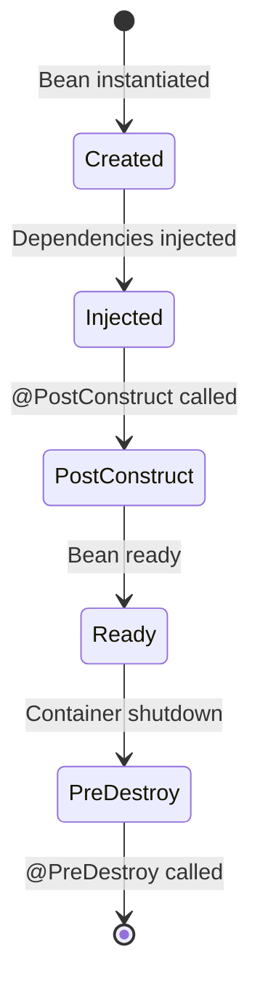
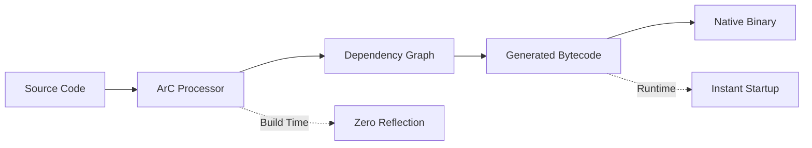

# CDI e Injeção de Dependências no Quarkus

## 📑 Índice

1. [Introdução](#1-introdução)
2. [Conceitos Fundamentais](#2-conceitos-fundamentais)
3. [Escopos (Scopes)](#3-escopos-scopes)
4. [Injeção de Dependências](#4-injeção-de-dependências)
5. [Producers](#5-producers)
6. [Qualifiers](#6-qualifiers)
7. [Interceptors](#7-interceptors)
8. [Decorators](#8-decorators)
9. [Events](#9-events)
10. [Stereotypes](#10-stereotypes)
11. [Lifecycle Callbacks](#11-lifecycle-callbacks)
12. [ArC (Quarkus CDI)](#12-arc-quarkus-cdi)
13. [Testes](#13-testes)
14. [Best Practices](#14-best-practices)
15. [Troubleshooting](#15-troubleshooting)

---

## 1. 📚 **Introdução**

### 1.1. O que é CDI?

**CDI (Contexts and Dependency Injection)** é uma especificação Java EE/Jakarta EE para gerenciamento de ciclo de vida de objetos e injeção de dependências.

**Analogia:** CDI é como um **gerente de recursos** em uma empresa:
- Contrata funcionários (cria beans)
- Define onde trabalham (contextos/escopos)
- Conecta departamentos (injeção de dependências)
- Organiza eventos corporativos (eventos CDI)
- Gerencia contratos (lifecycle)

### 1.2. ArC - Quarkus CDI Container

Quarkus usa **ArC** (um subset do CDI otimizado para build-time):

```mermaid
graph TB
    A[CDI Full Spec] --> B[ArC - Quarkus CDI]
    B --> C[Build-time DI]
    B --> D[Minimal Runtime]
    C --> E[Startup rápido]
    C --> F[Footprint pequeno]
    D --> E
    D --> F
    E --> G[Cloud Native]
    F --> G
```



**Características do ArC:**
- ✅ DI resolvida em build-time (não runtime)
- ✅ Zero reflection (GraalVM native friendly)
- ✅ Startup ultra-rápido
- ✅ Memória reduzida
- ⚠️ Alguns recursos CDI não suportados (portable extensions)

### 1.3. Setup

CDI vem automaticamente em qualquer projeto Quarkus:

```xml
<!-- CDI já incluído no quarkus-core -->
<dependency>
    <groupId>io.quarkus</groupId>
    <artifactId>quarkus-arc</artifactId>
</dependency>
```

---

## 2. 🧩 **Conceitos Fundamentais**

### 2.1. Bean

**Bean** é um objeto gerenciado pelo container CDI.

```java
package com.example.beans;

import jakarta.enterprise.context.ApplicationScoped;

/**
 * Bean CDI básico.
 */
@ApplicationScoped
public class GreetingService {
    
    public String greet(String name) {
        return "Hello, " + name + "!";
    }
}
```

**Requisitos para ser um Bean:**
- ✅ Ter um scope annotation (@ApplicationScoped, @RequestScoped, etc.)
- ✅ Ter construtor sem argumentos (ou @Inject no construtor)
- ✅ Não ser final (opcional no ArC)

### 2.2. Container CDI

O **container** gerencia todo o ciclo de vida dos beans:



### 2.3. Contextos

**Contexto** define o escopo de vida de um bean:

| Contexto | Ciclo de Vida | Uso |
|----------|---------------|-----|
| **@ApplicationScoped** | Aplicação toda | Singletons, services |
| **@RequestScoped** | HTTP request | Request handlers |
| **@SessionScoped** | HTTP session | User session data |
| **@Dependent** | Bean pai | Utilitários |
| **@Singleton** | Eager singleton | Inicialização startup |

---

## 3. 🎯 **Escopos (Scopes)**

### 3.1. @ApplicationScoped

**Um bean por aplicação** (singleton lazy).

```java
package com.example.scopes;

import jakarta.enterprise.context.ApplicationScoped;
import org.jboss.logging.Logger;

/**
 * Bean ApplicationScoped - singleton compartilhado.
 */
@ApplicationScoped
public class CacheService {
    
    private static final Logger LOG = Logger.getLogger(CacheService.class);
    private final Map<String, Object> cache = new ConcurrentHashMap<>();
    
    public CacheService() {
        LOG.info("CacheService criado - apenas uma vez!");
    }
    
    public void put(String key, Object value) {
        cache.put(key, value);
    }
    
    public Object get(String key) {
        return cache.get(key);
    }
    
    public int size() {
        return cache.size();
    }
}
```

**Uso:**
```java
@Path("/cache")
public class CacheResource {
    
    @Inject
    CacheService cacheService;  // Mesma instância em toda aplicação
    
    @GET
    @Path("/size")
    public int getCacheSize() {
        return cacheService.size();
    }
}
```

### 3.2. @Singleton

**Singleton eager** (criado no startup).

```java
package com.example.scopes;

import io.quarkus.runtime.Startup;
import jakarta.inject.Singleton;
import org.jboss.logging.Logger;

/**
 * Bean Singleton - criado no startup da aplicação.
 */
@Singleton
@Startup  // Força criação no startup
public class ConfigurationLoader {
    
    private static final Logger LOG = Logger.getLogger(ConfigurationLoader.class);
    private final Map<String, String> configs = new HashMap<>();
    
    public ConfigurationLoader() {
        LOG.info("Loading configurations at startup...");
        loadConfigurations();
    }
    
    private void loadConfigurations() {
        // Carregar configurações pesadas
        configs.put("version", "1.0.0");
        configs.put("environment", "production");
    }
    
    public String getConfig(String key) {
        return configs.get(key);
    }
}
```

**Diferença @ApplicationScoped vs @Singleton:**

```java
@ApplicationScoped  // Lazy: criado no primeiro uso
public class LazyService {
    public LazyService() {
        System.out.println("Criado quando primeiro injetado");
    }
}

@Singleton         // Eager: criado no startup
@Startup
public class EagerService {
    public EagerService() {
        System.out.println("Criado no startup da aplicação");
    }
}
```

### 3.3. @RequestScoped

**Um bean por requisição HTTP**.

```java
package com.example.scopes;

import jakarta.enterprise.context.RequestScoped;
import java.time.LocalDateTime;
import java.util.UUID;

/**
 * Bean RequestScoped - nova instância por request.
 */
@RequestScoped
public class RequestContext {
    
    private final String requestId;
    private final LocalDateTime startTime;
    private String userId;
    
    public RequestContext() {
        this.requestId = UUID.randomUUID().toString();
        this.startTime = LocalDateTime.now();
    }
    
    public String getRequestId() {
        return requestId;
    }
    
    public void setUserId(String userId) {
        this.userId = userId;
    }
    
    public String getUserId() {
        return userId;
    }
    
    public Duration getElapsedTime() {
        return Duration.between(startTime, LocalDateTime.now());
    }
}
```

**Uso:**
```java
@Path("/api/users")
public class UserResource {
    
    @Inject
    RequestContext requestContext;  // Nova instância por request
    
    @GET
    @Path("/{id}")
    public Response getUser(@PathParam("id") Long id) {
        LOG.info("Request ID: " + requestContext.getRequestId());
        
        User user = userService.findById(id);
        requestContext.setUserId(user.getUsername());
        
        return Response.ok(user).build();
    }
    
    @GET
    @Path("/context")
    public Response getContext() {
        return Response.ok(Map.of(
            "requestId", requestContext.getRequestId(),
            "elapsedTime", requestContext.getElapsedTime().toMillis() + "ms"
        )).build();
    }
}
```

### 3.4. @Dependent

**Pseudo-scope** - não é compartilhado, cria nova instância.

```java
package com.example.scopes;

import jakarta.enterprise.context.Dependent;
import java.time.LocalDateTime;

/**
 * Bean Dependent - nova instância para cada injection point.
 */
@Dependent
public class TimestampGenerator {
    
    private final LocalDateTime created;
    
    public TimestampGenerator() {
        this.created = LocalDateTime.now();
    }
    
    public LocalDateTime getCreatedTime() {
        return created;
    }
    
    public String generateTimestamp() {
        return LocalDateTime.now().toString();
    }
}
```

```java
@ApplicationScoped
public class ServiceA {
    @Inject
    TimestampGenerator generator;  // Instância 1
}

@ApplicationScoped
public class ServiceB {
    @Inject
    TimestampGenerator generator;  // Instância 2 (diferente!)
}
```

### 3.5. @SessionScoped

**Um bean por sessão HTTP**.

```java
package com.example.scopes;

import jakarta.enterprise.context.SessionScoped;
import java.io.Serializable;
import java.util.ArrayList;
import java.util.List;

/**
 * Bean SessionScoped - mantém estado por sessão de usuário.
 */
@SessionScoped
public class ShoppingCart implements Serializable {
    
    private static final long serialVersionUID = 1L;
    
    private final List<CartItem> items = new ArrayList<>();
    private String userId;
    
    public void addItem(CartItem item) {
        items.add(item);
    }
    
    public void removeItem(String itemId) {
        items.removeIf(item -> item.getId().equals(itemId));
    }
    
    public List<CartItem> getItems() {
        return new ArrayList<>(items);
    }
    
    public double getTotal() {
        return items.stream()
            .mapToDouble(CartItem::getPrice)
            .sum();
    }
    
    public void clear() {
        items.clear();
    }
    
    public void setUserId(String userId) {
        this.userId = userId;
    }
    
    public String getUserId() {
        return userId;
    }
}
```

**Configuração:**
```properties
# ═══════════════════════════════════════════════════════════════
# SESSION - CONFIGURAÇÕES
# ═══════════════════════════════════════════════════════════════

quarkus.http.enable-session=true
quarkus.http.session.timeout=30M
```

---

## 4. 💉 **Injeção de Dependências**

### 4.1. Field Injection

Injeção via campo (mais comum no Quarkus):

```java
package com.example.injection;

import jakarta.inject.Inject;
import jakarta.enterprise.context.ApplicationScoped;

/**
 * Field injection.
 */
@ApplicationScoped
public class OrderService {
    
    @Inject
    CustomerRepository customerRepository;
    
    @Inject
    PaymentService paymentService;
    
    @Inject
    EmailService emailService;
    
    public Order createOrder(OrderRequest request) {
        Customer customer = customerRepository.findById(request.customerId());
        Payment payment = paymentService.process(request.payment());
        
        Order order = new Order(customer, payment);
        emailService.sendConfirmation(customer.getEmail(), order);
        
        return order;
    }
}
```

### 4.2. Constructor Injection

Injeção via construtor (recomendado para testes):

```java
package com.example.injection;

import jakarta.enterprise.context.ApplicationScoped;

/**
 * Constructor injection - melhor para testes.
 */
@ApplicationScoped
public class InvoiceService {
    
    private final OrderRepository orderRepository;
    private final TaxCalculator taxCalculator;
    private final PdfGenerator pdfGenerator;
    
    @Inject
    public InvoiceService(
        OrderRepository orderRepository,
        TaxCalculator taxCalculator,
        PdfGenerator pdfGenerator
    ) {
        this.orderRepository = orderRepository;
        this.taxCalculator = taxCalculator;
        this.pdfGenerator = pdfGenerator;
    }
    
    public Invoice generateInvoice(Long orderId) {
        Order order = orderRepository.findById(orderId);
        double tax = taxCalculator.calculate(order);
        
        Invoice invoice = new Invoice(order, tax);
        pdfGenerator.generate(invoice);
        
        return invoice;
    }
}
```

**Vantagens Constructor Injection:**
- ✅ Imutabilidade (campos final)
- ✅ Facilita testes (mock via construtor)
- ✅ Dependências explícitas
- ✅ Detecção de dependências circulares

### 4.3. Setter Injection

Injeção via setter (raramente usado):

```java
package com.example.injection;

import jakarta.inject.Inject;
import jakarta.enterprise.context.ApplicationScoped;

/**
 * Setter injection.
 */
@ApplicationScoped
public class ReportService {
    
    private DataSource dataSource;
    
    @Inject
    public void setDataSource(DataSource dataSource) {
        this.dataSource = dataSource;
    }
    
    public Report generateReport() {
        return new Report(dataSource.fetchData());
    }
}
```

### 4.4. Injeção de Interface

```java
// Interface
public interface NotificationService {
    void send(String message);
}

// Implementação
@ApplicationScoped
public class EmailNotificationService implements NotificationService {
    
    @Override
    public void send(String message) {
        System.out.println("Email: " + message);
    }
}

// Injeção
@ApplicationScoped
public class UserService {
    
    @Inject
    NotificationService notificationService;  // Injeta implementação
    
    public void registerUser(User user) {
        // ...
        notificationService.send("Welcome " + user.getName());
    }
}
```

### 4.5. @Inject vs @Autowired

No Quarkus, use **@Inject** (padrão CDI):

```java
// ✅ Correto - CDI padrão
@Inject
UserRepository userRepository;

// ❌ Evitar - Spring annotation
@Autowired
UserRepository userRepository;
```

---

## 5. 🏭 **Producers**

### 5.1. Producer Method

**Producer** cria beans customizados:

```java
package com.example.producers;

import jakarta.enterprise.context.ApplicationScoped;
import jakarta.enterprise.inject.Produces;
import jakarta.inject.Named;
import org.eclipse.microprofile.config.inject.ConfigProperty;
import java.time.Clock;
import java.time.ZoneId;

/**
 * Producer methods para beans customizados.
 */
@ApplicationScoped
public class Producers {
    
    @ConfigProperty(name = "app.timezone", defaultValue = "UTC")
    String timezone;
    
    /**
     * Produz Clock configurado com timezone.
     */
    @Produces
    @ApplicationScoped
    public Clock clock() {
        return Clock.system(ZoneId.of(timezone));
    }
    
    /**
     * Produz ObjectMapper customizado.
     */
    @Produces
    @ApplicationScoped
    public ObjectMapper objectMapper() {
        ObjectMapper mapper = new ObjectMapper();
        mapper.registerModule(new JavaTimeModule());
        mapper.configure(SerializationFeature.WRITE_DATES_AS_TIMESTAMPS, false);
        mapper.setSerializationInclusion(JsonInclude.Include.NON_NULL);
        return mapper;
    }
    
    /**
     * Produz RestTemplate com timeout.
     */
    @Produces
    @ApplicationScoped
    @Named("restTemplate")
    public RestTemplate restTemplate() {
        RestTemplate template = new RestTemplate();
        
        HttpComponentsClientHttpRequestFactory factory = 
            new HttpComponentsClientHttpRequestFactory();
        factory.setConnectTimeout(5000);
        factory.setReadTimeout(5000);
        
        template.setRequestFactory(factory);
        return template;
    }
}
```

**Uso:**
```java
@ApplicationScoped
public class TimeService {
    
    @Inject
    Clock clock;  // Produzido por producer method
    
    public LocalDateTime getCurrentTime() {
        return LocalDateTime.now(clock);
    }
}
```

### 5.2. Producer Field

```java
package com.example.producers;

import jakarta.enterprise.inject.Produces;
import jakarta.inject.Named;
import java.util.concurrent.ExecutorService;
import java.util.concurrent.Executors;

/**
 * Producer fields.
 */
public class ExecutorProducers {
    
    @Produces
    @Named("fixedPool")
    ExecutorService fixedThreadPool = Executors.newFixedThreadPool(10);
    
    @Produces
    @Named("cachedPool")
    ExecutorService cachedThreadPool = Executors.newCachedThreadPool();
}
```

**Uso:**
```java
@ApplicationScoped
public class AsyncService {
    
    @Inject
    @Named("fixedPool")
    ExecutorService executor;
    
    public void processAsync(Task task) {
        executor.submit(() -> task.execute());
    }
}
```

### 5.3. Disposer Method

Limpar recursos quando bean é destruído:

```java
package com.example.producers;

import jakarta.enterprise.inject.Produces;
import jakarta.enterprise.inject.Disposes;
import jakarta.enterprise.context.ApplicationScoped;
import java.sql.Connection;
import java.sql.DriverManager;

/**
 * Producer com disposer.
 */
@ApplicationScoped
public class ConnectionProducer {
    
    @Produces
    @ApplicationScoped
    public Connection createConnection() throws SQLException {
        return DriverManager.getConnection(
            "jdbc:postgresql://localhost:5432/mydb",
            "user",
            "password"
        );
    }
    
    public void closeConnection(@Disposes Connection connection) {
        try {
            if (connection != null && !connection.isClosed()) {
                connection.close();
                System.out.println("Connection closed");
            }
        } catch (SQLException e) {
            e.printStackTrace();
        }
    }
}
```

---

## 6. 🏷️ **Qualifiers**

### 6.1. Custom Qualifier

Qualifiers diferenciam implementações da mesma interface:

```java
package com.example.qualifiers;

import jakarta.inject.Qualifier;
import java.lang.annotation.Retention;
import java.lang.annotation.Target;
import static java.lang.annotation.ElementType.*;
import static java.lang.annotation.RetentionPolicy.RUNTIME;

/**
 * Qualifier para tipo de pagamento.
 */
@Qualifier
@Retention(RUNTIME)
@Target({TYPE, METHOD, FIELD, PARAMETER})
public @interface PaymentType {
    PaymentMethod value();
}

enum PaymentMethod {
    CREDIT_CARD,
    PAYPAL,
    BANK_TRANSFER,
    CRYPTO
}
```

### 6.2. Implementações com Qualifiers

```java
package com.example.payments;

import com.example.qualifiers.PaymentType;
import com.example.qualifiers.PaymentMethod;
import jakarta.enterprise.context.ApplicationScoped;

/**
 * Interface de pagamento.
 */
public interface PaymentProcessor {
    PaymentResult process(PaymentRequest request);
}

/**
 * Processador de cartão de crédito.
 */
@ApplicationScoped
@PaymentType(PaymentMethod.CREDIT_CARD)
public class CreditCardProcessor implements PaymentProcessor {
    
    @Override
    public PaymentResult process(PaymentRequest request) {
        // Processar cartão de crédito
        return new PaymentResult("SUCCESS", "CC-" + UUID.randomUUID());
    }
}

/**
 * Processador PayPal.
 */
@ApplicationScoped
@PaymentType(PaymentMethod.PAYPAL)
public class PayPalProcessor implements PaymentProcessor {
    
    @Override
    public PaymentResult process(PaymentRequest request) {
        // Processar PayPal
        return new PaymentResult("SUCCESS", "PP-" + UUID.randomUUID());
    }
}

/**
 * Processador de transferência bancária.
 */
@ApplicationScoped
@PaymentType(PaymentMethod.BANK_TRANSFER)
public class BankTransferProcessor implements PaymentProcessor {
    
    @Override
    public PaymentResult process(PaymentRequest request) {
        // Processar transferência
        return new PaymentResult("PENDING", "BT-" + UUID.randomUUID());
    }
}
```

### 6.3. Injeção com Qualifiers

```java
package com.example.payments;

import com.example.qualifiers.PaymentType;
import com.example.qualifiers.PaymentMethod;
import jakarta.inject.Inject;
import jakarta.enterprise.context.ApplicationScoped;

/**
 * Service usando qualifiers.
 */
@ApplicationScoped
public class CheckoutService {
    
    @Inject
    @PaymentType(PaymentMethod.CREDIT_CARD)
    PaymentProcessor creditCardProcessor;
    
    @Inject
    @PaymentType(PaymentMethod.PAYPAL)
    PaymentProcessor paypalProcessor;
    
    @Inject
    @PaymentType(PaymentMethod.BANK_TRANSFER)
    PaymentProcessor bankTransferProcessor;
    
    public PaymentResult processPayment(PaymentRequest request) {
        return switch (request.method()) {
            case CREDIT_CARD -> creditCardProcessor.process(request);
            case PAYPAL -> paypalProcessor.process(request);
            case BANK_TRANSFER -> bankTransferProcessor.process(request);
            default -> throw new IllegalArgumentException("Unknown payment method");
        };
    }
}
```

### 6.4. Instance + Qualifiers Dinâmicos

```java
package com.example.payments;

import jakarta.enterprise.inject.Instance;
import jakarta.inject.Inject;
import jakarta.enterprise.context.ApplicationScoped;

/**
 * Seleção dinâmica com Instance.
 */
@ApplicationScoped
public class DynamicPaymentService {
    
    @Inject
    Instance<PaymentProcessor> processors;
    
    public PaymentResult processPayment(PaymentRequest request) {
        // Selecionar processador dinamicamente
        PaymentProcessor processor = processors
            .select(PaymentType.Literal.of(request.method()))
            .get();
        
        return processor.process(request);
    }
    
    /**
     * Verifica se processador existe.
     */
    public boolean isPaymentMethodSupported(PaymentMethod method) {
        return processors.select(PaymentType.Literal.of(method))
            .isResolvable();
    }
}

// Literal helper
@PaymentType(PaymentMethod.CREDIT_CARD)
class PaymentTypeLiteral extends AnnotationLiteral<PaymentType> 
    implements PaymentType {
    
    private final PaymentMethod value;
    
    private PaymentTypeLiteral(PaymentMethod value) {
        this.value = value;
    }
    
    public static PaymentType of(PaymentMethod method) {
        return new PaymentTypeLiteral(method);
    }
    
    @Override
    public PaymentMethod value() {
        return value;
    }
}
```

### 6.5. @Named Qualifier

Qualifier simples por nome:

```java
@ApplicationScoped
@Named("primary")
public class PrimaryDatabase implements Database {
    // ...
}

@ApplicationScoped
@Named("replica")
public class ReplicaDatabase implements Database {
    // ...
}

// Uso
@Inject
@Named("primary")
Database primaryDb;

@Inject
@Named("replica")
Database replicaDb;
```

---

## 7. 🔧 **Interceptors**

### 7.1. Custom Interceptor Binding

```java
package com.example.interceptors;

import jakarta.interceptor.InterceptorBinding;
import java.lang.annotation.Retention;
import java.lang.annotation.Target;
import static java.lang.annotation.ElementType.*;
import static java.lang.annotation.RetentionPolicy.RUNTIME;

/**
 * Interceptor binding para logging.
 */
@InterceptorBinding
@Retention(RUNTIME)
@Target({TYPE, METHOD})
public @interface Logged {
}
```

### 7.2. Interceptor Implementation

```java
package com.example.interceptors;

import jakarta.interceptor.Interceptor;
import jakarta.interceptor.InvocationContext;
import jakarta.interceptor.AroundInvoke;
import org.jboss.logging.Logger;
import java.time.Duration;
import java.time.Instant;

/**
 * Interceptor para logging de execução.
 */
@Logged
@Interceptor
@Priority(Interceptor.Priority.APPLICATION)
public class LoggingInterceptor {
    
    private static final Logger LOG = Logger.getLogger(LoggingInterceptor.class);
    
    @AroundInvoke
    public Object logMethodExecution(InvocationContext context) throws Exception {
        String methodName = context.getMethod().getName();
        String className = context.getTarget().getClass().getSimpleName();
        
        LOG.infof("Entering %s.%s()", className, methodName);
        
        Instant start = Instant.now();
        
        try {
            Object result = context.proceed();
            
            Duration duration = Duration.between(start, Instant.now());
            LOG.infof("Exiting %s.%s() - Duration: %dms", 
                className, methodName, duration.toMillis());
            
            return result;
        } catch (Exception e) {
            LOG.errorf("Exception in %s.%s(): %s", 
                className, methodName, e.getMessage());
            throw e;
        }
    }
}
```

### 7.3. Usando Interceptors

```java
package com.example.services;

import com.example.interceptors.Logged;
import jakarta.enterprise.context.ApplicationScoped;

/**
 * Service com logging interceptor.
 */
@ApplicationScoped
@Logged  // Todos os métodos são interceptados
public class UserService {
    
    public User findById(Long id) {
        // Método automaticamente logado
        return repository.findById(id);
    }
    
    public User create(User user) {
        // Método automaticamente logado
        return repository.save(user);
    }
}

// Ou aplicar em métodos específicos
@ApplicationScoped
public class ProductService {
    
    @Logged  // Apenas este método
    public Product create(Product product) {
        return repository.save(product);
    }
    
    public Product findById(Long id) {
        // Este método NÃO é interceptado
        return repository.findById(id);
    }
}
```

### 7.4. Interceptor com Parâmetros

```java
package com.example.interceptors;

import jakarta.interceptor.InterceptorBinding;
import java.lang.annotation.Retention;
import java.lang.annotation.Target;
import static java.lang.annotation.ElementType.*;
import static java.lang.annotation.RetentionPolicy.RUNTIME;

/**
 * Interceptor binding com cache.
 */
@InterceptorBinding
@Retention(RUNTIME)
@Target({TYPE, METHOD})
public @interface Cached {
    int ttlSeconds() default 300;  // 5 minutos
}
```

```java
package com.example.interceptors;

import jakarta.interceptor.Interceptor;
import jakarta.interceptor.InvocationContext;
import jakarta.interceptor.AroundInvoke;
import jakarta.inject.Inject;
import java.util.Arrays;

/**
 * Cache interceptor.
 */
@Cached
@Interceptor
@Priority(Interceptor.Priority.APPLICATION)
public class CacheInterceptor {
    
    @Inject
    CacheService cacheService;
    
    @AroundInvoke
    public Object cache(InvocationContext context) throws Exception {
        Cached cached = context.getMethod().getAnnotation(Cached.class);
        int ttl = cached.ttlSeconds();
        
        // Gerar chave do cache
        String cacheKey = generateCacheKey(context);
        
        // Verificar cache
        Object cachedValue = cacheService.get(cacheKey);
        if (cachedValue != null) {
            return cachedValue;
        }
        
        // Executar método
        Object result = context.proceed();
        
        // Armazenar no cache
        cacheService.put(cacheKey, result, ttl);
        
        return result;
    }
    
    private String generateCacheKey(InvocationContext context) {
        return context.getMethod().getName() + ":" + 
               Arrays.toString(context.getParameters());
    }
}
```

**Uso:**
```java
@ApplicationScoped
public class ProductService {
    
    @Cached(ttlSeconds = 600)  // Cache por 10 minutos
    public Product findById(Long id) {
        return repository.findById(id);
    }
}
```

### 7.5. Múltiplos Interceptors

```java
@ApplicationScoped
@Logged
@Transactional
@Cached(ttlSeconds = 300)
public class OrderService {
    
    // Ordem de execução:
    // 1. LoggingInterceptor (entra)
    // 2. TransactionalInterceptor (entra)
    // 3. CacheInterceptor (entra)
    // 4. Método real
    // 5. CacheInterceptor (sai)
    // 6. TransactionalInterceptor (sai)
    // 7. LoggingInterceptor (sai)
    
    public Order findById(Long id) {
        return repository.findById(id);
    }
}
```

---

## 8. 🎨 **Decorators**

### 8.1. Decorator Pattern com CDI

```java
package com.example.decorators;

import jakarta.decorator.Decorator;
import jakarta.decorator.Delegate;
import jakarta.inject.Inject;
import jakarta.enterprise.inject.Any;
import org.jboss.logging.Logger;

/**
 * Interface de serviço.
 */
public interface MessageService {
    void send(String message);
}

/**
 * Implementação base.
 */
@ApplicationScoped
public class SimpleMessageService implements MessageService {
    
    @Override
    public void send(String message) {
        System.out.println("Sending: " + message);
    }
}

/**
 * Decorator que adiciona logging.
 */
@Decorator
@Priority(Interceptor.Priority.APPLICATION)
public abstract class LoggingMessageDecorator implements MessageService {
    
    private static final Logger LOG = Logger.getLogger(LoggingMessageDecorator.class);
    
    @Inject
    @Delegate
    @Any
    MessageService delegate;
    
    @Override
    public void send(String message) {
        LOG.info("Before sending message: " + message);
        delegate.send(message);
        LOG.info("After sending message");
    }
}

/**
 * Decorator que adiciona validação.
 */
@Decorator
@Priority(Interceptor.Priority.APPLICATION + 10)
public abstract class ValidationMessageDecorator implements MessageService {
    
    @Inject
    @Delegate
    @Any
    MessageService delegate;
    
    @Override
    public void send(String message) {
        if (message == null || message.isBlank()) {
            throw new IllegalArgumentException("Message cannot be empty");
        }
        
        if (message.length() > 1000) {
            throw new IllegalArgumentException("Message too long");
        }
        
        delegate.send(message);
    }
}
```

**Configuração:**
```properties
# Habilitar decorators
quarkus.arc.selected-alternatives=com.example.decorators.*
```

---

## 9. 📡 **Events**

### 9.1. Event Producer e Observer

```java
package com.example.events;

import jakarta.enterprise.context.ApplicationScoped;
import jakarta.enterprise.event.Event;
import jakarta.enterprise.event.Observes;
import jakarta.inject.Inject;
import org.jboss.logging.Logger;

/**
 * Evento de criação de usuário.
 */
public class UserCreatedEvent {
    private final User user;
    private final LocalDateTime timestamp;
    
    public UserCreatedEvent(User user) {
        this.user = user;
        this.timestamp = LocalDateTime.now();
    }
    
    public User getUser() {
        return user;
    }
    
    public LocalDateTime getTimestamp() {
        return timestamp;
    }
}

/**
 * Producer do evento.
 */
@ApplicationScoped
public class UserService {
    
    @Inject
    Event<UserCreatedEvent> userCreatedEvent;
    
    public User createUser(UserRequest request) {
        User user = new User(request.name(), request.email());
        repository.save(user);
        
        // Disparar evento
        userCreatedEvent.fire(new UserCreatedEvent(user));
        
        return user;
    }
}

/**
 * Observer do evento - Email.
 */
@ApplicationScoped
public class EmailNotificationService {
    
    private static final Logger LOG = Logger.getLogger(EmailNotificationService.class);
    
    public void onUserCreated(@Observes UserCreatedEvent event) {
        User user = event.getUser();
        LOG.infof("Sending welcome email to: %s", user.getEmail());
        
        // Enviar email
        emailSender.send(user.getEmail(), "Welcome!", "Welcome to our platform!");
    }
}

/**
 * Observer do evento - Analytics.
 */
@ApplicationScoped
public class AnalyticsService {
    
    private static final Logger LOG = Logger.getLogger(AnalyticsService.class);
    
    public void onUserCreated(@Observes UserCreatedEvent event) {
        LOG.infof("Recording user registration: %s", event.getUser().getId());
        
        // Registrar analytics
        analyticsClient.track("user.registered", event.getUser().getId());
    }
}
```

### 9.2. Async Events

```java
package com.example.events;

import jakarta.enterprise.event.ObservesAsync;
import jakarta.enterprise.event.Event;
import jakarta.inject.Inject;
import jakarta.enterprise.context.ApplicationScoped;
import java.util.concurrent.CompletionStage;

/**
 * Producer de evento assíncrono.
 */
@ApplicationScoped
public class OrderService {
    
    @Inject
    Event<OrderPlacedEvent> orderEvent;
    
    public Order placeOrder(OrderRequest request) {
        Order order = new Order(request);
        repository.save(order);
        
        // Disparar evento assíncrono
        orderEvent.fireAsync(new OrderPlacedEvent(order));
        
        return order;
    }
}

/**
 * Observer assíncrono.
 */
@ApplicationScoped
public class InventoryService {
    
    public void onOrderPlaced(@ObservesAsync OrderPlacedEvent event) {
        // Executado em thread separada
        Order order = event.getOrder();
        
        for (OrderItem item : order.getItems()) {
            inventory.reserve(item.getProductId(), item.getQuantity());
        }
    }
}

/**
 * Observer assíncrono com CompletionStage.
 */
@ApplicationScoped
public class EmailService {
    
    public CompletionStage<Void> onOrderPlaced(@ObservesAsync OrderPlacedEvent event) {
        return CompletableFuture.runAsync(() -> {
            sendOrderConfirmation(event.getOrder());
        });
    }
}
```

### 9.3. Event Qualifiers

```java
package com.example.events;

import jakarta.inject.Qualifier;
import java.lang.annotation.Retention;
import java.lang.annotation.Target;
import static java.lang.annotation.ElementType.*;
import static java.lang.annotation.RetentionPolicy.RUNTIME;

/**
 * Qualifier para eventos.
 */
@Qualifier
@Retention(RUNTIME)
@Target({FIELD, PARAMETER})
public @interface Priority {
    Level value();
    
    enum Level {
        LOW, NORMAL, HIGH, CRITICAL
    }
}

/**
 * Evento com qualifier.
 */
@ApplicationScoped
public class AlertService {
    
    @Inject
    @Priority(Priority.Level.CRITICAL)
    Event<AlertEvent> criticalAlert;
    
    @Inject
    @Priority(Priority.Level.NORMAL)
    Event<AlertEvent> normalAlert;
    
    public void sendAlert(String message, Priority.Level level) {
        AlertEvent event = new AlertEvent(message);
        
        if (level == Priority.Level.CRITICAL) {
            criticalAlert.fire(event);
        } else {
            normalAlert.fire(event);
        }
    }
}

/**
 * Observer específico para críticos.
 */
@ApplicationScoped
public class SmsAlertService {
    
    public void onCriticalAlert(
        @Observes @Priority(Priority.Level.CRITICAL) AlertEvent event
    ) {
        // Enviar SMS apenas para alertas críticos
        smsGateway.send(event.getMessage());
    }
}
```

### 9.4. Conditional Observers

```java
package com.example.events;

import jakarta.enterprise.event.Observes;
import jakarta.enterprise.event.Reception;
import jakarta.enterprise.event.TransactionPhase;
import jakarta.enterprise.context.ApplicationScoped;

/**
 * Observer condicional.
 */
@ApplicationScoped
public class AuditService {
    
    /**
     * Observar apenas se bean já foi criado.
     */
    public void onUserUpdated(
        @Observes(notifyObserver = Reception.IF_EXISTS) UserUpdatedEvent event
    ) {
        audit.log("User updated: " + event.getUser().getId());
    }
    
    /**
     * Observar após commit da transação.
     */
    public void onOrderCreated(
        @Observes(during = TransactionPhase.AFTER_SUCCESS) OrderCreatedEvent event
    ) {
        // Executado apenas se transação foi commitada
        notifications.sendOrderConfirmation(event.getOrder());
    }
    
    /**
     * Observar após rollback.
     */
    public void onOrderFailed(
        @Observes(during = TransactionPhase.AFTER_FAILURE) OrderCreatedEvent event
    ) {
        // Executado apenas se transação falhou
        logger.error("Order creation failed: " + event.getOrder().getId());
    }
}
```

---

## 10. 🎭 **Stereotypes**

### 10.1. Custom Stereotype

Stereotype combina múltiplas anotações:

```java
package com.example.stereotypes;

import jakarta.enterprise.context.RequestScoped;
import jakarta.enterprise.inject.Stereotype;
import jakarta.transaction.Transactional;
import com.example.interceptors.Logged;
import java.lang.annotation.Retention;
import java.lang.annotation.Target;
import static java.lang.annotation.ElementType.TYPE;
import static java.lang.annotation.RetentionPolicy.RUNTIME;

/**
 * Stereotype para services.
 */
@Stereotype
@RequestScoped
@Transactional
@Logged
@Retention(RUNTIME)
@Target(TYPE)
public @interface Service {
}
```

**Uso:**
```java
@Service  // Equivalente a @RequestScoped + @Transactional + @Logged
public class OrderService {
    
    public Order createOrder(OrderRequest request) {
        // Método automaticamente transacional e logado
        return repository.save(new Order(request));
    }
}
```

### 10.2. Múltiplos Stereotypes

```java
/**
 * Stereotype para APIs REST.
 */
@Stereotype
@ApplicationScoped
@Logged
@Path("/api")
@Produces(MediaType.APPLICATION_JSON)
@Consumes(MediaType.APPLICATION_JSON)
@Retention(RUNTIME)
@Target(TYPE)
public @interface RestApi {
}

/**
 * Stereotype para repositories.
 */
@Stereotype
@ApplicationScoped
@Transactional
@Retention(RUNTIME)
@Target(TYPE)
public @interface Repository {
}

// Uso
@RestApi
@Path("/users")
public class UserResource {
    // Automaticamente: ApplicationScoped + Logged + REST config
}

@Repository
public class UserRepository extends PanacheRepository<User> {
    // Automaticamente: ApplicationScoped + Transactional
}
```

---

## 11. ⏰ **Lifecycle Callbacks**

### 11.1. @PostConstruct e @PreDestroy

```java
package com.example.lifecycle;

import jakarta.annotation.PostConstruct;
import jakarta.annotation.PreDestroy;
import jakarta.enterprise.context.ApplicationScoped;
import org.jboss.logging.Logger;

/**
 * Bean com lifecycle callbacks.
 */
@ApplicationScoped
public class DatabaseConnectionPool {
    
    private static final Logger LOG = Logger.getLogger(DatabaseConnectionPool.class);
    private HikariDataSource dataSource;
    
    /**
     * Chamado após construção e injeção de dependências.
     */
    @PostConstruct
    void initialize() {
        LOG.info("Initializing database connection pool...");
        
        HikariConfig config = new HikariConfig();
        config.setJdbcUrl("jdbc:postgresql://localhost:5432/mydb");
        config.setUsername("user");
        config.setPassword("password");
        config.setMaximumPoolSize(20);
        config.setMinimumIdle(5);
        
        dataSource = new HikariDataSource(config);
        
        LOG.info("Database connection pool initialized");
    }
    
    /**
     * Chamado antes da destruição do bean.
     */
    @PreDestroy
    void cleanup() {
        LOG.info("Closing database connection pool...");
        
        if (dataSource != null && !dataSource.isClosed()) {
            dataSource.close();
        }
        
        LOG.info("Database connection pool closed");
    }
    
    public Connection getConnection() throws SQLException {
        return dataSource.getConnection();
    }
}
```

### 11.2. Startup Events

```java
package com.example.lifecycle;

import io.quarkus.runtime.StartupEvent;
import io.quarkus.runtime.ShutdownEvent;
import jakarta.enterprise.context.ApplicationScoped;
import jakarta.enterprise.event.Observes;
import org.jboss.logging.Logger;

/**
 * Listeners de startup e shutdown.
 */
@ApplicationScoped
public class ApplicationLifecycle {
    
    private static final Logger LOG = Logger.getLogger(ApplicationLifecycle.class);
    
    /**
     * Executado quando aplicação inicia.
     */
    void onStart(@Observes StartupEvent event) {
        LOG.info("════════════════════════════════════════");
        LOG.info("    Application Starting...            ");
        LOG.info("════════════════════════════════════════");
        
        // Inicializações
        loadCachedData();
        warmupConnections();
        startScheduledJobs();
    }
    
    /**
     * Executado quando aplicação para.
     */
    void onStop(@Observes ShutdownEvent event) {
        LOG.info("════════════════════════════════════════");
        LOG.info("    Application Stopping...            ");
        LOG.info("════════════════════════════════════════");
        
        // Limpezas
        flushCaches();
        closeConnections();
        stopScheduledJobs();
    }
    
    private void loadCachedData() {
        LOG.info("Loading cached data...");
    }
    
    private void warmupConnections() {
        LOG.info("Warming up connections...");
    }
    
    private void startScheduledJobs() {
        LOG.info("Starting scheduled jobs...");
    }
    
    private void flushCaches() {
        LOG.info("Flushing caches...");
    }
    
    private void closeConnections() {
        LOG.info("Closing connections...");
    }
    
    private void stopScheduledJobs() {
        LOG.info("Stopping scheduled jobs...");
    }
}
```

---

## 12. 🔥 **ArC (Quarkus CDI)**

### 12.1. Build-time DI

ArC resolve dependências em **build-time**:



### 12.2. Unused Beans Removal

ArC remove beans não utilizados:

```java
@ApplicationScoped
public class UsedBean {
    // Bean usado - será mantido
}

@ApplicationScoped
public class UnusedBean {
    // Bean não usado - será removido no build
}
```

**Forçar manutenção:**
```java
@ApplicationScoped
@Unremovable  // Bean nunca será removido
public class ImportantBean {
    // Mantido mesmo se não for injetado
}
```

### 12.3. ArC Dev UI

```properties
# Dev Mode - UI de debug do ArC
http://localhost:8080/q/arc
```

**Features:**
- ✅ Lista todos os beans
- ✅ Dependency graph
- ✅ Observer methods
- ✅ Interceptors/Decorators
- ✅ Removed beans

### 12.4. ArC Configuration

```properties
# ═══════════════════════════════════════════════════════════════
# ARC - CONFIGURAÇÕES
# ═══════════════════════════════════════════════════════════════

# Remover beans não utilizados
quarkus.arc.remove-unused-beans=all

# Detectar beans não proxyáveis
quarkus.arc.detect-wrong-annotations=true

# Transformações de beans
quarkus.arc.auto-producer-methods=true

# Gerar metadata adicional
quarkus.arc.generate-metadata=true

# Strict mode
quarkus.arc.strict-compatibility=false
```

---

## 13. 🧪 **Testes**

### 13.1. Testes Básicos com CDI

```java
package com.example.tests;

import io.quarkus.test.junit.QuarkusTest;
import jakarta.inject.Inject;
import org.junit.jupiter.api.Test;
import static org.junit.jupiter.api.Assertions.*;

/**
 * Testes com injeção de dependências.
 */
@QuarkusTest
class UserServiceTest {
    
    @Inject
    UserService userService;
    
    @Test
    void testCreateUser() {
        User user = userService.create(new UserRequest("John", "john@example.com"));
        
        assertNotNull(user);
        assertNotNull(user.getId());
        assertEquals("John", user.getName());
    }
}
```

### 13.2. Mocking com @InjectMock

```java
package com.example.tests;

import io.quarkus.test.junit.QuarkusTest;
import io.quarkus.test.junit.mockito.InjectMock;
import jakarta.inject.Inject;
import org.junit.jupiter.api.Test;
import org.mockito.Mockito;
import static org.junit.jupiter.api.Assertions.*;

/**
 * Testes com mocks.
 */
@QuarkusTest
class OrderServiceTest {
    
    @Inject
    OrderService orderService;
    
    @InjectMock
    PaymentService paymentService;
    
    @InjectMock
    InventoryService inventoryService;
    
    @Test
    void testCreateOrder() {
        // Configurar mocks
        Mockito.when(inventoryService.hasStock(anyLong(), anyInt()))
            .thenReturn(true);
        
        Mockito.when(paymentService.process(any()))
            .thenReturn(new PaymentResult("SUCCESS", "TXN-123"));
        
        // Executar
        Order order = orderService.createOrder(new OrderRequest(...));
        
        // Verificar
        assertNotNull(order);
        assertEquals("SUCCESS", order.getPaymentStatus());
        
        Mockito.verify(inventoryService).reserveStock(anyLong(), anyInt());
        Mockito.verify(paymentService).process(any());
    }
}
```

### 13.3. Testes com Qualifiers

```java
package com.example.tests;

import io.quarkus.test.junit.QuarkusTest;
import com.example.qualifiers.PaymentType;
import com.example.qualifiers.PaymentMethod;
import jakarta.inject.Inject;
import org.junit.jupiter.api.Test;

/**
 * Testes com qualifiers.
 */
@QuarkusTest
class PaymentProcessorTest {
    
    @Inject
    @PaymentType(PaymentMethod.CREDIT_CARD)
    PaymentProcessor creditCardProcessor;
    
    @Inject
    @PaymentType(PaymentMethod.PAYPAL)
    PaymentProcessor paypalProcessor;
    
    @Test
    void testCreditCardProcessor() {
        PaymentResult result = creditCardProcessor.process(
            new PaymentRequest(100.0, "4111111111111111")
        );
        
        assertEquals("SUCCESS", result.status());
        assertTrue(result.transactionId().startsWith("CC-"));
    }
    
    @Test
    void testPayPalProcessor() {
        PaymentResult result = paypalProcessor.process(
            new PaymentRequest(100.0, "user@paypal.com")
        );
        
        assertEquals("SUCCESS", result.status());
        assertTrue(result.transactionId().startsWith("PP-"));
    }
}
```

### 13.4. Testes de Events

```java
package com.example.tests;

import io.quarkus.test.junit.QuarkusTest;
import jakarta.inject.Inject;
import jakarta.enterprise.event.Event;
import org.junit.jupiter.api.Test;
import org.mockito.ArgumentCaptor;

/**
 * Testes de eventos CDI.
 */
@QuarkusTest
class EventTest {
    
    @Inject
    UserService userService;
    
    @InjectMock
    EmailService emailService;
    
    @Test
    void testUserCreatedEventFired() {
        // Criar usuário (dispara evento)
        userService.create(new UserRequest("John", "john@example.com"));
        
        // Verificar que observer foi chamado
        ArgumentCaptor<User> captor = ArgumentCaptor.forClass(User.class);
        Mockito.verify(emailService).sendWelcomeEmail(captor.capture());
        
        assertEquals("john@example.com", captor.getValue().getEmail());
    }
}
```

---

## 14. 📋 **Best Practices**

### 14.1. Scopes

✅ **Boas Práticas:**
- Use @ApplicationScoped para singletons stateless
- Use @RequestScoped para beans com estado por request
- Use @Dependent para utilitários sem estado
- @Singleton + @Startup para inicialização eager
- Evite @SessionScoped em APIs stateless

❌ **Evitar:**
- Manter estado mutável em @ApplicationScoped
- Usar @Dependent para beans pesados
- Escopos incompatíveis (RequestScoped injetado em ApplicationScoped)

### 14.2. Injeção

✅ **Boas Práticas:**
- Constructor injection para imutabilidade
- Field injection para simplicidade
- Injete interfaces, não implementações
- Use qualifiers para múltiplas implementações
- Evite @Inject em campos estáticos

❌ **Evitar:**
- Dependências circulares
- Injeção de beans com escopo menor em maior
- @Inject em construtores privados

### 14.3. Producers

✅ **Boas Práticas:**
- Use producers para objetos de terceiros
- Configure producers com @ConfigProperty
- Implemente disposers para cleanup
- Use qualifiers em producers
- Documente comportamento do producer

❌ **Evitar:**
- Lógica complexa em producers
- Producers sem tratamento de erro
- Esquecer disposers para recursos

### 14.4. Events

✅ **Boas Práticas:**
- Use eventos para desacoplamento
- Eventos assíncronos para I/O
- Qualifiers para eventos específicos
- Eventos imutáveis
- Documente contrato do evento

❌ **Evitar:**
- Eventos para comunicação síncrona crítica
- Modificar estado no evento
- Observers com side-effects inesperados

---

## 15. 🐛 **Troubleshooting**

### 15.1. Unsatisfied Dependency

**Problema:** `Unsatisfied dependency for type X`

**Causas:**
- Bean sem scope annotation
- Interface sem implementação
- Implementação não escaneada

**Solução:**
```java
// ❌ Problema
public class MyService {  // Sem @ApplicationScoped
    // ...
}

// ✅ Solução
@ApplicationScoped
public class MyService {
    // ...
}
```

### 15.2. Ambiguous Dependency

**Problema:** `Ambiguous dependencies for type X`

**Causa:** Múltiplas implementações sem qualifier

**Solução:**
```java
// Use qualifiers
@Inject
@Named("primary")
Database database;

// Ou @Alternative
@Alternative
@Priority(100)
@ApplicationScoped
public class MockDatabase implements Database {
    // ...
}
```

### 15.3. Circular Dependency

**Problema:** `Circular dependency detected`

**Solução:**
```java
// ❌ Problema
@ApplicationScoped
public class ServiceA {
    @Inject ServiceB serviceB;
}

@ApplicationScoped
public class ServiceB {
    @Inject ServiceA serviceA;
}

// ✅ Solução 1: Usar Instance
@ApplicationScoped
public class ServiceA {
    @Inject Instance<ServiceB> serviceB;
    
    void method() {
        serviceB.get().doSomething();
    }
}

// ✅ Solução 2: Refatorar
@ApplicationScoped
public class ServiceC {
    // Extrair lógica comum
}

@ApplicationScoped
public class ServiceA {
    @Inject ServiceC serviceC;
}

@ApplicationScoped
public class ServiceB {
    @Inject ServiceC serviceC;
}
```

### 15.4. NullPointerException em @PostConstruct

**Problema:** NPE ao acessar dependências injetadas

**Causa:** Ordem de execução

**Solução:**
```java
@ApplicationScoped
public class MyService {
    
    @Inject
    Database database;
    
    private List<String> cache;
    
    @PostConstruct
    void init() {
        // ✅ Dependências já foram injetadas
        cache = database.loadData();
    }
}
```

### 15.5. Bean Não Proxyável

**Problema:** `Bean X is not proxyable`

**Causa:** Classe final ou sem construtor público

**Solução:**
```java
// ❌ Problema
@ApplicationScoped
public final class MyService {  // final
    // ...
}

// ✅ Solução
@ApplicationScoped
public class MyService {  // Remover final
    // ...
}
```

---

## 16. 📚 **Recursos**

### Documentação Oficial

- [Quarkus CDI Reference](https://quarkus.io/guides/cdi-reference)
- [ArC](https://quarkus.io/guides/cdi)
- [Jakarta CDI](https://jakarta.ee/specifications/cdi/)

### Exemplos

```bash
# Clone exemplos
git clone https://github.com/quarkusio/quarkus-quickstarts.git

cd quarkus-quickstarts/getting-started
cd quarkus-quickstarts/cdi-alternative
```

---

## 17. 🎯 **Resumo**

### Tabela de Referência

| Conceito | Anotação | Uso |
|----------|----------|-----|
| **Scope** | @ApplicationScoped | Singleton lazy |
| **Scope** | @Singleton | Singleton eager |
| **Scope** | @RequestScoped | Por request HTTP |
| **Scope** | @Dependent | Sem compartilhamento |
| **Injection** | @Inject | Injetar dependência |
| **Producer** | @Produces | Criar bean customizado |
| **Qualifier** | @Qualifier | Diferenciar implementações |
| **Interceptor** | @InterceptorBinding | Cross-cutting concerns |
| **Event** | @Observes | Observer pattern |
| **Lifecycle** | @PostConstruct | Após criação |
| **Lifecycle** | @PreDestroy | Antes destruição |

### Comandos Úteis

```bash
# Ver beans no Dev Mode
http://localhost:8080/q/arc

# Build com análise de beans
./mvnw clean package -Dquarkus.arc.remove-unused-beans=all

# Debug de DI
./mvnw quarkus:dev -Dquarkus.log.category.\"io.quarkus.arc\".level=DEBUG
```

---

**Documentação CDI e Injeção de Dependências completa! 🎉**

Este guia cobre todos os aspectos de CDI no Quarkus com exemplos práticos, padrões e troubleshooting.
