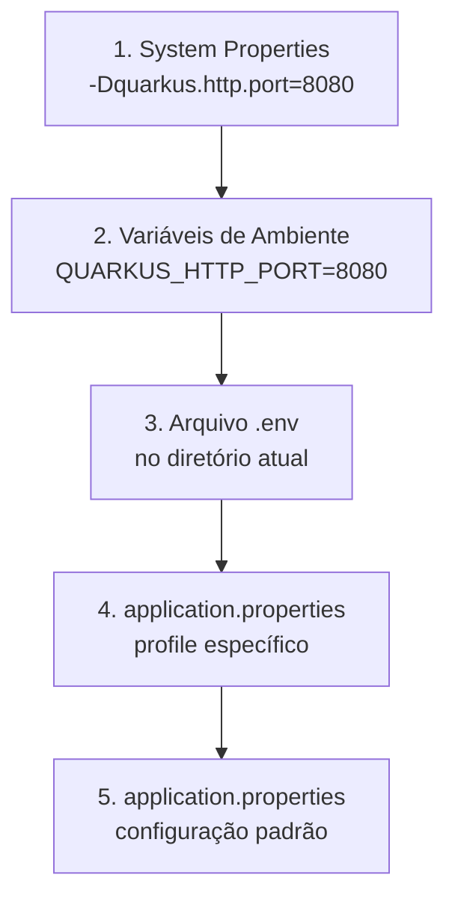

# ⚙️ Guia Completo de Configurações no Quarkus

> **Domine as configurações do Quarkus: de properties básicas até Kubernetes e Vault**  
> Aprenda a criar aplicações flexíveis, seguras e prontas para qualquer ambiente.

---

## 📖 Índice Rápido

1. [Por que Configurações São Importantes?](#-por-que-configurações-são-importantes)
2. [Properties vs YAML - Qual Escolher?](#-properties-vs-yaml)
3. [Profiles - Configurações por Ambiente](#-profiles)
4. [Injeção de Configuração - @ConfigProperty](#-injeção-de-configuração)
5. [Configurações Complexas - @ConfigMapping](#-configurações-complexas)
6. [Configurações Externas - Env Vars, K8s, Vault](#-configurações-externas)
7. [Boas Práticas e Segurança](#-boas-práticas)
8. [Troubleshooting](#-troubleshooting)

---

## 🤔 Por que Configurações São Importantes?

### O Problema Sem Configurações

```java
// ❌ RUIM - Valores hardcoded
public class PedidoService {
    
    private static final String DB_URL = "jdbc:postgresql://localhost:5432/dev";
    private static final int MAX_RETRY = 3;
    private static final boolean FEATURE_NOVA = true;
    
    // E se quiser mudar para produção? Recompilar tudo! 😱
}
```

**Problemas:**
- ❌ Impossível mudar sem recompilar
- ❌ Mesmo código para DEV/TEST/PROD
- ❌ Senhas expostas no código
- ❌ Deploy complexo e arriscado

### A Solução com Configurações

```java
// ✅ BOM - Valores configuráveis
@ApplicationScoped
public class PedidoService {
    
    @ConfigProperty(name = "app.database.url")
    String dbUrl;
    
    @ConfigProperty(name = "app.max-retry", defaultValue = "3")
    int maxRetry;
    
    @ConfigProperty(name = "app.feature.nova")
    boolean featureNova;
    
    // Muda por ambiente SEM recompilar! 🎉
}
```

**Benefícios:**
- ✅ Muda comportamento sem recompilar
- ✅ Configurações diferentes por ambiente
- ✅ Secrets seguros (variáveis de ambiente, Vault)
- ✅ Deploy simples e seguro

### Analogia: A Casa Inteligente

Imagine sua aplicação como uma **casa inteligente**:

```
🏠 Casa (Aplicação)
├── 💡 Interruptores (Configurações simples)
│   └── Liga/Desliga features
├── 🌡️ Termostato (Configurações numéricas)
│   └── Ajusta performance, timeouts
├── 🔐 Cofre (Secrets)
│   └── Senhas, tokens, chaves
└── 🎛️ Painel Central (Profiles)
    └── Modo Casa/Trabalho/Férias
```

**Você NÃO reconstrói a casa para mudar a temperatura!**  
Da mesma forma, você NÃO recompila a aplicação para mudar configurações.

---

## 📄 Properties vs YAML

### Qual Formato Escolher?

**TL;DR (Resumo Rápido):**
- 🟢 **Iniciante ou app simples?** → `application.properties`
- 🟡 **App complexo ou Kubernetes?** → `application.yaml`
- 🔵 **Prefere hierarquia visual?** → `application.yaml`
- 🟠 **Quer menos erros de sintaxe?** → `application.properties`

### application.properties - Formato Linha por Linha

**Formato**: Chave-valor simples, uma configuração por linha.

```bash

# Configurações básicas
quarkus.application.name=minha-aplicacao
quarkus.http.port=8080

# Configurações de banco de dados
quarkus.datasource.db-kind=postgresql
quarkus.datasource.username=admin
quarkus.datasource.password=123456
quarkus.datasource.jdbc.url=jdbc:postgresql://localhost:5432/meudb

# Configurações de logging
quarkus.log.level=INFO
quarkus.log.category."com.meuapp".level=DEBUG

```

**Características:**
- ✅ **Simples e direto** - Uma linha, uma configuração
- ✅ **Familiar** para desenvolvedores Java
- ✅ **Menos propenso a erros** - Não depende de indentação
- ✅ **Fácil busca** - Ctrl+F encontra tudo
- ❌ Verboso em configurações muito aninhadas

**Quando usar:**
- ✅ Primeira vez com Quarkus
- ✅ Configurações simples e diretas
- ✅ Equipe prefere formato tradicional

### application.yaml - Formato Hierárquico

**Formato**: Estrutura hierárquica baseada em indentação.

```yaml
quarkus:
  application:
    name: minha-aplicacao
  http:
    port: 8080

  datasource:
    db-kind: postgresql
    username: admin
    password: 123456
    jdbc:
      url: jdbc:postgresql://localhost:5432/meudb

  log:
    level: INFO
    category:
      "com.meuapp":
        level: DEBUG

```

**Características:**
- ✅ **Legibilidade superior** - Hierarquia visual clara
- ✅ **Menos repetição** - Prefixos agrupados
- ✅ **Compatível com K8s** - ConfigMaps usam YAML
- ✅ **Estrutura clara** - Fácil ver relações entre configs
- ❌ **Indentação crítica** - Espaços importam (2 espaços padrão)
- ❌ **Curva de aprendizado** - Requer atenção à sintaxe

**Quando usar:**
- ✅ Configurações complexas e aninhadas
- ✅ Deploy em Kubernetes
- ✅ Preferência por hierarquia visual
- ✅ Equipe experiente com YAML

### Comparação Lado a Lado

**Configuração simples:**

```properties
# application.properties (6 linhas)
quarkus.application.name=minha-app
quarkus.http.port=8080
quarkus.log.level=INFO
```

```yaml
# application.yaml (6 linhas - empate!)
quarkus:
  application:
    name: minha-app
  http:
    port: 8080
  log:
    level: INFO
```

**Configuração complexa:**

```properties
# application.properties (12 linhas - muito repetitivo!)
quarkus.datasource.db-kind=postgresql
quarkus.datasource.username=admin
quarkus.datasource.password=secret
quarkus.datasource.jdbc.url=jdbc:postgresql://localhost:5432/db
quarkus.datasource.jdbc.min-size=5
quarkus.datasource.jdbc.max-size=20
quarkus.hibernate-orm.database.generation=update
quarkus.hibernate-orm.log.sql=true
quarkus.hibernate-orm.sql-load-script=import.sql
```

```yaml
# application.yaml (10 linhas - mais organizado!)
quarkus:
  datasource:
    db-kind: postgresql
    username: admin
    password: secret
    jdbc:
      url: jdbc:postgresql://localhost:5432/db
      min-size: 5
      max-size: 20
  hibernate-orm:
    database:
      generation: update
    log:
      sql: true
    sql-load-script: import.sql
```

### Tabela de Decisão

| Critério | Properties | YAML | Vencedor |
|----------|------------|------|----------|
| Simplicidade | ⭐⭐⭐⭐⭐ | ⭐⭐⭐ | Properties |
| Legibilidade (configs complexas) | ⭐⭐ | ⭐⭐⭐⭐⭐ | YAML |
| Resistência a erros | ⭐⭐⭐⭐⭐ | ⭐⭐⭐ | Properties |
| Integração Kubernetes | ⭐⭐⭐ | ⭐⭐⭐⭐⭐ | YAML |
| Curva de aprendizado | ⭐⭐⭐⭐⭐ | ⭐⭐⭐ | Properties |
| Redução de duplicação | ⭐⭐ | ⭐⭐⭐⭐⭐ | YAML |

**Dica:** Você pode **misturar os dois!** O Quarkus permite ter ambos os arquivos, com `application.properties` tendo precedência.

---

## 🎭 Profiles

### O Conceito - Roupas para Cada Ocasião

Profiles são como ter **diferentes "versões" das configurações** para diferentes situações.

**Analogia:**
```
👔 Trabalho (prod)    → Terno, configurações otimizadas
👕 Casa (dev)         → Confortável, logs verbose
🏃 Academia (test)    → Leve, rápido, banco em memória
```

### Por que Usar Profiles?

**Sem Profiles (❌ Ruim):**
```java
// Código cheio de IFs para cada ambiente
if (ambiente.equals("dev")) {
    porta = 8080;
    banco = "h2:mem";
} else if (ambiente.equals("prod")) {
    porta = 80;
    banco = "postgresql://prod";
}
```

**Com Profiles (✅ Bom):**
```properties
# Limpo, declarativo, sem IFs!
%dev.quarkus.http.port=8080
%dev.quarkus.datasource.db-kind=h2

%prod.quarkus.http.port=80
%prod.quarkus.datasource.db-kind=postgresql
```

### Profiles Padrão do Quarkus

| Profile | Como Ativar | Quando Usar | Características |
|---------|-------------|-------------|-----------------|
| `%dev` | `mvn quarkus:dev` | Desenvolvimento local | Hot reload, logs DEBUG, banco local |
| `%test` | Testes automáticos | JUnit, integração | Banco H2 memória, logs mínimos |
| `%prod` | `java -jar app.jar` | Produção | Otimizado, logs INFO, configs reais |

### Exemplo Completo - Aplicação Real

**Em application.properties:**

```properties
# ============================================
# CONFIGURAÇÕES GLOBAIS (todos os profiles)
# ============================================
quarkus.application.name=pedidos-service
quarkus.application.version=1.2.3

# ============================================
# PROFILE: DEV (Desenvolvimento)
# ============================================
%dev.quarkus.http.port=8080
%dev.quarkus.http.cors=true

# Banco H2 em memória (rápido, descartável)
%dev.quarkus.datasource.db-kind=h2
%dev.quarkus.datasource.jdbc.url=jdbc:h2:mem:dev;DB_CLOSE_DELAY=-1
%dev.quarkus.hibernate-orm.database.generation=drop-and-create
%dev.quarkus.hibernate-orm.sql-load-script=import-dev.sql

# Logs verbosos
%dev.quarkus.log.level=DEBUG
%dev.quarkus.log.category."com.empresa".level=TRACE
%dev.quarkus.hibernate-orm.log.sql=true

# Features experimentais habilitadas
%dev.app.feature.nova-funcionalidade=true
%dev.app.cache.enabled=false

# ============================================
# PROFILE: TEST (Testes Automatizados)
# ============================================
%test.quarkus.http.test-port=8081

# Banco H2 para testes
%test.quarkus.datasource.db-kind=h2
%test.quarkus.datasource.jdbc.url=jdbc:h2:mem:test
%test.quarkus.hibernate-orm.database.generation=drop-and-create

# Logs mínimos (só erros)
%test.quarkus.log.level=ERROR
%test.quarkus.log.category."com.empresa".level=WARN

# Desabilita features desnecessárias em testes
%test.app.cache.enabled=false
%test.app.email.enabled=false

# ============================================
# PROFILE: PROD (Produção)
# ============================================
%prod.quarkus.http.port=8080
%prod.quarkus.http.cors=false

# Banco PostgreSQL real
%prod.quarkus.datasource.db-kind=postgresql
%prod.quarkus.datasource.jdbc.url=jdbc:postgresql://db-prod.empresa.com:5432/pedidos
%prod.quarkus.datasource.username=${DB_USER}  # ← Variável de ambiente
%prod.quarkus.datasource.password=${DB_PASSWORD}
%prod.quarkus.datasource.jdbc.min-size=10
%prod.quarkus.datasource.jdbc.max-size=50

# NUNCA DROP em produção!
%prod.quarkus.hibernate-orm.database.generation=none

# Logs otimizados
%prod.quarkus.log.level=INFO
%prod.quarkus.log.category."com.empresa".level=INFO
%prod.quarkus.hibernate-orm.log.sql=false

# Formato JSON para ferramentas de observabilidade
%prod.quarkus.log.console.json=true

# Features controladas
%prod.app.feature.nova-funcionalidade=false
%prod.app.cache.enabled=true
```

**Resultado ao executar:**

```bash
# Desenvolvimento
mvn quarkus:dev
# → Porta 8080, H2 em memória, logs DEBUG

# Testes
mvn test
# → Porta 8081, H2 em memória, logs ERROR

# Produção
java -jar target/quarkus-app/quarkus-run.jar
# → Porta 8080, PostgreSQL, logs INFO em JSON
```

### Profiles Customizados

Você pode criar seus próprios profiles para cenários específicos:

```properties
# ============================================
# PROFILE CUSTOMIZADO: staging
# ============================================
%staging.quarkus.http.port=8090
%staging.quarkus.datasource.jdbc.url=jdbc:postgresql://db-staging:5432/app
%staging.quarkus.log.level=DEBUG
%staging.app.feature.nova-funcionalidade=true

# ============================================
# PROFILE CUSTOMIZADO: performance-test
# ============================================
%performance-test.quarkus.datasource.jdbc.max-size=200
%performance-test.quarkus.log.level=WARN
%performance-test.app.cache.enabled=true
```

**Ativando profiles customizados:**

```bash
# Via linha de comando
java -Dquarkus.profile=staging -jar app.jar

# Via variável de ambiente
export QUARKUS_PROFILE=staging
java -jar app.jar

# Via Maven (dev mode)
mvn quarkus:dev -Dquarkus.profile=staging

# Via Docker
docker run -e QUARKUS_PROFILE=staging minha-app:latest
```

### Multiplos Profiles Simultaneamente

```bash
# Ativar múltiplos profiles (separados por vírgula)
java -Dquarkus.profile=prod,monitoring -jar app.jar

# Configuração para o profile combinado
%prod.quarkus.log.level=INFO
%monitoring.quarkus.micrometer.enabled=true
%monitoring.quarkus.micrometer.export.prometheus.enabled=true
```

---

## 💉 Injeção de Configuração

### O Conceito - Assistente Pessoal de Configurações

`@ConfigProperty` é como ter um **assistente que busca configurações para você**.

**Sem @ConfigProperty (❌ Ruim):**
```java
// Acoplamento forte, difícil testar
public class PedidoService {
    private static final int MAX_TENTATIVAS = 3; // hardcoded!
    
    public void processar() {
        for (int i = 0; i < MAX_TENTATIVAS; i++) {
            // ...
        }
    }
}
```

**Com @ConfigProperty (✅ Bom):**
```java
// Flexível, testável, configurável
@ApplicationScoped
public class PedidoService {
    
    @ConfigProperty(name = "app.max-tentativas", defaultValue = "3")
    int maxTentativas;
    
    public void processar() {
        for (int i = 0; i < maxTentativas; i++) {
            // ...
        }
    }
}
```

### Uso Básico - Tipos Simples

**Arquivo de configuração (`application.properties`):**

```properties
# Configurações da aplicação
app.nome=Sistema de Pedidos
app.versao=2.1.5
app.max-usuarios=100
app.timeout-segundos=30
app.feature.pagamento-pix=true
app.taxa-desconto=0.15
```

**Código Java - Injetando configurações:**

```java
package com.empresa.service;

import org.eclipse.microprofile.config.inject.ConfigProperty;
import jakarta.enterprise.context.ApplicationScoped;

@ApplicationScoped
public class ConfiguracaoService {
    
    // ✅ String simples
    @ConfigProperty(name = "app.nome")
    String nomeApp;
    
    // ✅ Inteiro
    @ConfigProperty(name = "app.max-usuarios")
    int maxUsuarios;
    
    // ✅ Com valor padrão (usa se não encontrar no arquivo)
    @ConfigProperty(name = "app.timeout-segundos", defaultValue = "60")
    int timeoutSegundos;
    
    // ✅ Boolean
    @ConfigProperty(name = "app.feature.pagamento-pix")
    boolean pagamentoPixHabilitado;
    
    // ✅ Double
    @ConfigProperty(name = "app.taxa-desconto")
    double taxaDesconto;
    
    public void exibirConfiguracoes() {
        System.out.println("=== Configurações da Aplicação ===");
        System.out.println("Nome: " + nomeApp);
        System.out.println("Versão: " + versao);
        System.out.println("Máx. Usuários: " + maxUsuarios);
        System.out.println("Timeout: " + timeoutSegundos + "s");
        System.out.println("PIX habilitado: " + pagamentoPixHabilitado);
        System.out.println("Taxa de desconto: " + (taxaDesconto * 100) + "%");
    }
    
    public double calcularDesconto(double valor) {
        if (pagamentoPixHabilitado) {
            return valor * taxaDesconto;
        }
        return 0;
    }
}
```

**Output ao executar:**
```
=== Configurações da Aplicação ===
Nome: Sistema de Pedidos
Versão: 2.1.5
Máx. Usuários: 100
Timeout: 30s
PIX habilitado: true
Taxa de desconto: 15.0%
```

### Tipos Avançados - Conversão Automática

O Quarkus converte automaticamente valores para vários tipos Java:

```java
package com.empresa.config;

import org.eclipse.microprofile.config.inject.ConfigProperty;
import jakarta.enterprise.context.ApplicationScoped;
import java.time.*;
import java.util.*;

@ApplicationScoped
public class ConversaoAutomaticaExemplo {
    
    // ═══════════════════════════════════════════
    // TIPOS PRIMITIVOS E WRAPPERS
    // ═══════════════════════════════════════════
    
    @ConfigProperty(name = "app.porta")
    int porta;  // 8080
    
    @ConfigProperty(name = "app.porta-wrapper")
    Integer portaWrapper;  // 8080
    
    @ConfigProperty(name = "app.preco")
    double preco;  // 29.99
    
    @ConfigProperty(name = "app.ativo")
    boolean ativo;  // true
    
    @ConfigProperty(name = "app.percentual")
    float percentual;  // 0.15
    
    @ConfigProperty(name = "app.contador")
    long contador;  // 1000000
    
    // ═══════════════════════════════════════════
    // TIPOS DE DATA E HORA
    // ═══════════════════════════════════════════
    
    // Formato: 2024-09-30
    @ConfigProperty(name = "app.data-lancamento")
    LocalDate dataLancamento;
    
    // Formato: 14:30:00
    @ConfigProperty(name = "app.horario-backup")
    LocalTime horarioBackup;
    
    // Formato: 2024-09-30T14:30:00
    @ConfigProperty(name = "app.ultima-atualizacao")
    LocalDateTime ultimaAtualizacao;
    
    // Formato: PT30M (30 minutos), PT2H (2 horas), P1D (1 dia)
    @ConfigProperty(name = "app.timeout-cache")
    Duration timeoutCache;
    
    // Formato: P30D (30 dias), P1Y (1 ano)
    @ConfigProperty(name = "app.periodo-retencao")
    Period periodoRetencao;
    
    // ═══════════════════════════════════════════
    // COLEÇÕES (separadas por vírgula)
    // ═══════════════════════════════════════════
    
    // Formato: tag1,tag2,tag3
    @ConfigProperty(name = "app.tags")
    List<String> tags;
    
    // Formato: 100,200,300,400
    @ConfigProperty(name = "app.portas-permitidas")
    Set<Integer> portasPermitidas;
    
    // Formato: admin,user,guest
    @ConfigProperty(name = "app.roles")
    String[] roles;
    
    // ═══════════════════════════════════════════
    // OPTIONAL (para valores que podem não existir)
    // ═══════════════════════════════════════════
    
    @ConfigProperty(name = "app.feature.experimental")
    Optional<Boolean> featureExperimental;
    
    @ConfigProperty(name = "app.api-key-opcional")
    Optional<String> apiKey;
    
    // ═══════════════════════════════════════════
    // ENUMS
    // ═══════════════════════════════════════════
    
    @ConfigProperty(name = "app.nivel-log")
    LogLevel nivelLog;  // INFO, DEBUG, WARN, ERROR
    
    @ConfigProperty(name = "app.ambiente")
    Ambiente ambiente;  // DEV, TEST, PROD
    
    // ═══════════════════════════════════════════
    // EXEMPLO DE USO
    // ═══════════════════════════════════════════
    
    public void exibirTodasConfiguracoes() {
        System.out.println("Porta: " + porta);
        System.out.println("Preço: R$ " + preco);
        System.out.println("Ativo: " + ativo);
        System.out.println("Data lançamento: " + dataLancamento);
        System.out.println("Timeout cache: " + timeoutCache);
        System.out.println("Tags: " + String.join(", ", tags));
        System.out.println("Nível de log: " + nivelLog);
        
        // Optional - verifica se existe
        if (featureExperimental.isPresent()) {
            System.out.println("Feature experimental: " + featureExperimental.get());
        } else {
            System.out.println("Feature experimental não configurada");
        }
    }
}

// Enums necessários
enum LogLevel {
    TRACE, DEBUG, INFO, WARN, ERROR
}

enum Ambiente {
    DEV, TEST, STAGING, PROD
}
```

**Configurações correspondentes (`application.properties`):**

```properties
# Primitivos
app.porta=8080
app.porta-wrapper=8080
app.preco=29.99
app.ativo=true
app.percentual=0.15
app.contador=1000000

# Data e hora
app.data-lancamento=2024-09-30
app.horario-backup=03:00:00
app.ultima-atualizacao=2024-09-30T14:30:00
app.timeout-cache=PT30M
app.periodo-retencao=P30D

# Coleções (separadas por vírgula)
app.tags=java,quarkus,microservices,cloud
app.portas-permitidas=8080,8443,9090
app.roles=admin,user,guest

# Optional (pode ou não estar presente)
# app.feature.experimental=true  ← Comentado = não existe
app.api-key-opcional=abc123

# Enums (usa o nome do enum)
app.nivel-log=INFO
app.ambiente=PROD
```

### Valores Padrão Inteligentes

```java
@ApplicationScoped
public class ValoresPadraoExemplo {
    
    // ✅ Valor padrão simples
    @ConfigProperty(name = "app.timeout", defaultValue = "30")
    int timeout;
    
    // ✅ Valor padrão para lista
    @ConfigProperty(name = "app.tags", defaultValue = "default,sistema")
    List<String> tags;
    
    // ✅ Valor padrão para boolean
    @ConfigProperty(name = "app.feature.nova", defaultValue = "false")
    boolean featureNova;
    
    // ✅ Valor padrão para Duration
    @ConfigProperty(name = "app.cache-ttl", defaultValue = "PT5M")
    Duration cacheTtl;  // 5 minutos por padrão
    
    // ❌ NÃO use defaultValue com Optional (não faz sentido)
    @ConfigProperty(name = "app.opcional")
    Optional<String> opcional;  // Se não existir, será Optional.empty()
}
```

---

## 🏗️ Configurações Complexas

### @ConfigMapping - Para Configurações Agrupadas

Quando você tem **muitas configurações relacionadas**, usar `@ConfigProperty` fica verboso. `@ConfigMapping` cria uma estrutura organizada.

**Problema com @ConfigProperty (❌ Verboso):**

```java
@ApplicationScoped
public class DatabaseService {
    
    @ConfigProperty(name = "database.host")
    String host;
    
    @ConfigProperty(name = "database.port")
    int port;
    
    @ConfigProperty(name = "database.name")
    String name;
    
    @ConfigProperty(name = "database.username")
    String username;
    
    @ConfigProperty(name = "database.password")
    String password;
    
    @ConfigProperty(name = "database.pool.min-size")
    int poolMinSize;
    
    @ConfigProperty(name = "database.pool.max-size")
    int poolMaxSize;
    
    // 7 anotações! Muito verboso! 😫
}
```

**Solução com @ConfigMapping (✅ Organizado):**

**1. Defina a interface de configuração:**

```java
package com.empresa.config;

import io.smallrye.config.ConfigMapping;
import io.smallrye.config.WithName;
import io.smallrye.config.WithDefault;
import jakarta.validation.constraints.*;

@ConfigMapping(prefix = "database")
public interface DatabaseConfig {
    
    // ═══════════════════════════════════════════
    // PROPRIEDADES SIMPLES
    // ═══════════════════════════════════════════
    
    @NotBlank  // Validação: não pode ser vazio
    String host();
    
    @Min(1)    // Validação: mínimo 1
    @Max(65535) // Validação: máximo 65535
    int port();
    
    @NotBlank
    String name();
    
    // ═══════════════════════════════════════════
    // SUB-INTERFACE (configurações aninhadas)
    // ═══════════════════════════════════════════
    
    CredentialsConfig credentials();
    
    PoolConfig pool();
    
    // ═══════════════════════════════════════════
    // SUB-INTERFACES
    // ═══════════════════════════════════════════
    
    interface CredentialsConfig {
        @NotBlank
        String username();
        
        @NotBlank
        String password();
    }
    
    interface PoolConfig {
        
        @WithDefault("5")  // Valor padrão
        int minSize();
        
        @WithDefault("20")
        int maxSize();
        
        @WithDefault("PT30S")  // 30 segundos
        Duration connectionTimeout();
    }
}
```

**2. Configuração (`application.properties`):**

```properties
# Configurações do banco
database.host=localhost
database.port=5432
database.name=pedidos_db

# Credenciais (sub-interface)
database.credentials.username=admin
database.credentials.password=secret123

# Pool de conexões (sub-interface com defaults)
database.pool.min-size=10
database.pool.max-size=50
database.pool.connection-timeout=PT45S
```

**3. Usando no código:**

```java
package com.empresa.service;

import jakarta.enterprise.context.ApplicationScoped;
import jakarta.inject.Inject;

@ApplicationScoped
public class DatabaseService {
    
    // ✅ Injeta a interface completa!
    @Inject
    DatabaseConfig dbConfig;
    
    public void conectar() {
        // Acesso simples e organizado
        String url = String.format("jdbc:postgresql://%s:%d/%s",
            dbConfig.host(),
            dbConfig.port(),
            dbConfig.name()
        );
        
        String username = dbConfig.credentials().username();
        String password = dbConfig.credentials().password();
        
        int minSize = dbConfig.pool().minSize();
        int maxSize = dbConfig.pool().maxSize();
        Duration timeout = dbConfig.pool().connectionTimeout();
        
        System.out.println("Conectando em: " + url);
        System.out.println("Usuário: " + username);
        System.out.println("Pool: " + minSize + "-" + maxSize);
        System.out.println("Timeout: " + timeout.getSeconds() + "s");
    }
}
```

### Exemplo Completo - Configuração de Email

```java
package com.empresa.config;

import io.smallrye.config.ConfigMapping;
import io.smallrye.config.WithDefault;
import io.smallrye.config.WithName;
import jakarta.validation.constraints.*;

@ConfigMapping(prefix = "email")
public interface EmailConfig {
    
    // Servidor SMTP
    SmtpConfig smtp();
    
    // Configurações de envio
    SendConfig send();
    
    // Templates
    TemplateConfig template();
    
    // ═══════════════════════════════════════════
    // SUB-CONFIGURAÇÕES
    // ═══════════════════════════════════════════
    
    interface SmtpConfig {
        @NotBlank
        String host();
        
        @WithDefault("587")
        int port();
        
        @WithDefault("false")
        boolean ssl();
        
        @NotBlank
        String username();
        
        @NotBlank
        String password();
    }
    
    interface SendConfig {
        @Email
        @NotBlank
        @WithName("from-address")  // ← Nome diferente na config!
        String fromAddress();
        
        @NotBlank
        @WithName("from-name")
        String fromName();
        
        @WithDefault("3")
        int maxRetries();
        
        @WithDefault("PT5S")
        Duration retryDelay();
    }
    
    interface TemplateConfig {
        @NotBlank
        String path();
        
        @WithDefault("UTF-8")
        String encoding();
        
        @WithDefault("true")
        boolean cache();
    }
}
```

**Configuração:**

```properties
# SMTP
email.smtp.host=smtp.gmail.com
email.smtp.port=587
email.smtp.ssl=true
email.smtp.username=app@empresa.com
email.smtp.password=${EMAIL_PASSWORD}

# Envio
email.send.from-address=noreply@empresa.com
email.send.from-name=Sistema de Pedidos
email.send.max-retries=5
email.send.retry-delay=PT10S

# Templates
email.template.path=/templates/email
email.template.encoding=UTF-8
email.template.cache=true
```

**Uso:**

```java
@ApplicationScoped
public class EmailService {
    
    @Inject
    EmailConfig emailConfig;
    
    public void enviarEmail(String destinatario, String assunto, String corpo) {
        // Configuração SMTP
        String host = emailConfig.smtp().host();
        int port = emailConfig.smtp().port();
        boolean ssl = emailConfig.smtp().ssl();
        
        // Configuração de envio
        String from = emailConfig.send().fromAddress();
        String fromName = emailConfig.send().fromName();
        int maxRetries = emailConfig.send().maxRetries();
        
        System.out.println("Enviando email de: " + fromName + " <" + from + ">");
        System.out.println("Servidor: " + host + ":" + port);
        System.out.println("Máximo de tentativas: " + maxRetries);
        
        // Lógica de envio...
    }
}
```

### @ConfigMapping vs @ConfigProperty - Quando Usar?

| Cenário | Use | Motivo |
|---------|-----|--------|
| 1-3 configurações | `@ConfigProperty` | Mais simples |
| 4+ configurações relacionadas | `@ConfigMapping` | Melhor organização |
| Configurações aninhadas | `@ConfigMapping` | Suporte nativo |
| Validações complexas | `@ConfigMapping` | Bean Validation integrado |
| Configurações dinâmicas | `@ConfigProperty` | Mais flexível |

---

## 🌍 Configurações Externas

### O Conceito - Controle Remoto da Aplicação

Configurações externas permitem **mudar o comportamento SEM tocar no JAR/Container**.

**Analogia:**
```
📱 Controle Remoto (Configs Externas)
├── 🎚️ Variáveis de Ambiente
├── 📁 Arquivos Externos
├── ☸️ Kubernetes ConfigMaps/Secrets
└── 🔐 Vault (HashiCorp)

Você muda o canal SEM abrir a TV!
```

### Hierarquia de Precedência

O Quarkus resolve configurações nesta ordem (da **maior** para **menor** precedência):

```
1. System Properties (-D)           ← VENCE TUDO
   ↓
2. Variáveis de Ambiente (ENV)      ← Segunda prioridade
   ↓
3. Arquivo .env (diretório atual)   ← Terceira prioridade
   ↓
4. application.properties (%prod)   ← Profile específico
   ↓
5. application.properties (padrão)  ← Fallback final
```

**Exemplo prático:**

```properties
# application.properties
quarkus.http.port=8080
%prod.quarkus.http.port=80
```

```bash
# Variável de ambiente
export QUARKUS_HTTP_PORT=9000

# System property
java -Dquarkus.http.port=7000 -jar app.jar
```

**Resultado:** Aplicação roda na porta **7000** (system property vence!)

### Variáveis de Ambiente - O Padrão Cloud Native

**Regras de Conversão (Properties → Env Vars):**

1. **Substitua `.` por `_`**
2. **Coloque em UPPER_CASE**
3. **Adicione prefixo se necessário**

**Tabela de Conversão:**

| Property | Variável de Ambiente | Exemplo |
|----------|---------------------|---------|
| `quarkus.http.port` | `QUARKUS_HTTP_PORT` | `8080` |
| `quarkus.datasource.username` | `QUARKUS_DATASOURCE_USERNAME` | `admin` |
| `app.max-usuarios` | `APP_MAX_USUARIOS` | `100` |
| `database.pool.min-size` | `DATABASE_POOL_MIN_SIZE` | `10` |

**Exemplo Completo:**

```bash
# ═══════════════════════════════════════════
# Linux/Mac - Terminal/Shell
# ═══════════════════════════════════════════

# Exportar variáveis
export QUARKUS_HTTP_PORT=8090
export QUARKUS_DATASOURCE_USERNAME=app_user
export QUARKUS_DATASOURCE_PASSWORD=secret123
export APP_MAX_USUARIOS=200
export APP_FEATURE_PIX=true

# Executar aplicação
java -jar target/quarkus-app/quarkus-run.jar

# ═══════════════════════════════════════════
# Windows PowerShell
# ═══════════════════════════════════════════

# Definir variáveis
$env:QUARKUS_HTTP_PORT="8090"
$env:QUARKUS_DATASOURCE_USERNAME="app_user"
$env:QUARKUS_DATASOURCE_PASSWORD="secret123"

# Executar
java -jar target\quarkus-app\quarkus-run.jar
```

### Dockerfile com Variáveis de Ambiente

```dockerfile
FROM registry.access.redhat.com/ubi8/openjdk-17:latest

# Copiar JAR
COPY target/quarkus-app/lib/ /deployments/lib/
COPY target/quarkus-app/*.jar /deployments/
COPY target/quarkus-app/app/ /deployments/app/
COPY target/quarkus-app/quarkus/ /deployments/quarkus/

# ═══════════════════════════════════════════
# VARIÁVEIS DE AMBIENTE PADRÃO
# ═══════════════════════════════════════════
ENV QUARKUS_HTTP_PORT=8080
ENV QUARKUS_LOG_LEVEL=INFO
ENV APP_MAX_USUARIOS=50

# Pode ser sobrescrito no docker run
# docker run -e QUARKUS_HTTP_PORT=9000 minha-app

EXPOSE 8080

ENTRYPOINT ["java", "-jar", "/deployments/quarkus-run.jar"]
```

**Executando o container:**

```bash
# Usar defaults do Dockerfile
docker run -p 8080:8080 minha-app

# Sobrescrever variáveis
docker run \
  -p 9000:9000 \
  -e QUARKUS_HTTP_PORT=9000 \
  -e QUARKUS_DATASOURCE_USERNAME=prod_user \
  -e QUARKUS_DATASOURCE_PASSWORD=prod_secret \
  -e APP_MAX_USUARIOS=500 \
  minha-app

# Usando arquivo .env
docker run --env-file .env.prod -p 8080:8080 minha-app
```

**Arquivo `.env.prod`:**

```bash
QUARKUS_HTTP_PORT=8080
QUARKUS_DATASOURCE_USERNAME=prod_user
QUARKUS_DATASOURCE_PASSWORD=prod_secret_from_vault
APP_MAX_USUARIOS=1000
APP_FEATURE_PIX=true
```

### Docker Compose com Configurações

```yaml
version: '3.8'

services:
  # ═══════════════════════════════════════════
  # APLICAÇÃO QUARKUS
  # ═══════════════════════════════════════════
  app:
    image: pedidos-service:latest
    ports:
      - "8080:8080"
    
    # Variáveis de ambiente
    environment:
      # Quarkus
      QUARKUS_HTTP_PORT: 8080
      QUARKUS_PROFILE: prod
      
      # Database
      QUARKUS_DATASOURCE_DB_KIND: postgresql
      QUARKUS_DATASOURCE_USERNAME: ${DB_USER:-app}
      QUARKUS_DATASOURCE_PASSWORD: ${DB_PASSWORD}
      QUARKUS_DATASOURCE_JDBC_URL: jdbc:postgresql://db:5432/pedidos
      
      # Logging
      QUARKUS_LOG_LEVEL: INFO
      QUARKUS_LOG_CONSOLE_JSON: "true"
      
      # App específica
      APP_MAX_USUARIOS: 500
      APP_FEATURE_PIX: "true"
    
    # Ou use arquivo externo
    env_file:
      - .env.prod
    
    depends_on:
      - db
  
  # ═══════════════════════════════════════════
  # BANCO DE DADOS
  # ═══════════════════════════════════════════
  db:
    image: postgres:15
    environment:
      POSTGRES_DB: pedidos
      POSTGRES_USER: app
      POSTGRES_PASSWORD: ${DB_PASSWORD}
    volumes:
      - postgres-data:/var/lib/postgresql/data

volumes:
  postgres-data:
```

### Kubernetes - ConfigMaps e Secrets

**ConfigMap - Configurações Não-Sensíveis:**

```yaml
apiVersion: v1
kind: ConfigMap
metadata:
  name: pedidos-config
  namespace: production
data:
  # Configurações da aplicação
  QUARKUS_HTTP_PORT: "8080"
  QUARKUS_LOG_LEVEL: "INFO"
  QUARKUS_LOG_CONSOLE_JSON: "true"
  
  # App settings
  APP_MAX_USUARIOS: "1000"
  APP_FEATURE_PIX: "true"
  APP_TIMEOUT_SEGUNDOS: "30"
  
  # Database (não-sensível)
  QUARKUS_DATASOURCE_DB_KIND: "postgresql"
  QUARKUS_DATASOURCE_JDBC_URL: "jdbc:postgresql://postgres-service:5432/pedidos"
```

**Secret - Informações Sensíveis:**

```yaml
apiVersion: v1
kind: Secret
metadata:
  name: pedidos-secrets
  namespace: production
type: Opaque
data:
  # Valores em base64!
  # echo -n 'admin' | base64
  QUARKUS_DATASOURCE_USERNAME: YWRtaW4=
  # echo -n 'senha-super-secreta' | base64
  QUARKUS_DATASOURCE_PASSWORD: c2VuaGEtc3VwZXItc2VjcmV0YQ==
  # echo -n 'jwt-secret-key-256-bits' | base64
  APP_JWT_SECRET: and0LXNlY3JldC1rZXktMjU2LWJpdHM=
```

**Deployment usando ConfigMap e Secret:**

```yaml
apiVersion: apps/v1
kind: Deployment
metadata:
  name: pedidos-service
  namespace: production
spec:
  replicas: 3
  selector:
    matchLabels:
      app: pedidos-service
  template:
    metadata:
      labels:
        app: pedidos-service
    spec:
      containers:
      - name: app
        image: empresa/pedidos-service:1.2.3
        ports:
        - containerPort: 8080
        
        # ═══════════════════════════════════════════
        # INJETAR TODAS AS VARIÁVEIS DO CONFIGMAP
        # ═══════════════════════════════════════════
        envFrom:
        - configMapRef:
            name: pedidos-config
        - secretRef:
            name: pedidos-secrets
        
        # ═══════════════════════════════════════════
        # OU: INJETAR VARIÁVEIS ESPECÍFICAS
        # ═══════════════════════════════════════════
        env:
        - name: QUARKUS_HTTP_PORT
          valueFrom:
            configMapKeyRef:
              name: pedidos-config
              key: QUARKUS_HTTP_PORT
        
        - name: QUARKUS_DATASOURCE_PASSWORD
          valueFrom:
            secretKeyRef:
              name: pedidos-secrets
              key: QUARKUS_DATASOURCE_PASSWORD
        
        # Health checks
        livenessProbe:
          httpGet:
            path: /q/health/live
            port: 8080
          initialDelaySeconds: 30
          periodSeconds: 10
        
        readinessProbe:
          httpGet:
            path: /q/health/ready
            port: 8080
          initialDelaySeconds: 10
          periodSeconds: 5
```

**Criar recursos no Kubernetes:**

```bash
# Aplicar ConfigMap
kubectl apply -f configmap.yaml

# Aplicar Secret
kubectl apply -f secret.yaml

# Aplicar Deployment
kubectl apply -f deployment.yaml

# Verificar pods
kubectl get pods -n production

# Ver logs
kubectl logs -f deployment/pedidos-service -n production

# Ver configurações injetadas
kubectl exec -it deployment/pedidos-service -n production -- env | grep QUARKUS
```

### HashiCorp Vault - Secrets Seguros

O Quarkus pode buscar secrets diretamente do Vault:

**Dependência:**

```xml
<dependency>
    <groupId>io.quarkus</groupId>
    <artifactId>quarkus-vault</artifactId>
</dependency>

```

**Configuração:**

```
# Configurações do Vault
quarkus.vault.url=http://localhost:8200
quarkus.vault.authentication.userpass.username=quarkus
quarkus.vault.authentication.userpass.password=pwd

# Mapeamento de secrets
quarkus.vault.secret-config-kv-path.mydb.path=secret/mydb
quarkus.vault.secret-config-kv-path.mydb.key=password

```

**Uso no código:**

```java
@ApplicationScoped
public class VaultConfigService {

    // Esta senha será buscada automaticamente do Vault
    @ConfigProperty(name = "mydb.password")
    String dbPassword;

    public void conectarBanco() {
        // Usar dbPassword para conexão
        System.out.println("Conectando com senha do Vault");
    }
}

```

### 5.5 Ordem de Precedência das Configurações

O Quarkus segue uma ordem específica para resolver configurações (da maior para menor precedência):



**Exemplo prático:**

```
# application.properties
quarkus.http.port=8080
%prod.quarkus.http.port=80

```

```bash
# Variável de ambiente
export QUARKUS_HTTP_PORT=9000

# System property
java -Dquarkus.http.port=7000 -jar app.jar

```

**Resultado**: A aplicação rodará na porta **7000** (system property tem maior precedência).

---

## 6. Boas Práticas e Dicas 🎯

### 📁 Organização - Agrupe por Contexto

**✅ BOM - Agrupado e Comentado:**
```properties
# ════════════════════════════════════════════════
# 🗄️ DATABASE
# ════════════════════════════════════════════════
quarkus.datasource.db-kind=postgresql
quarkus.datasource.username=admin
quarkus.datasource.password=${DB_PASSWORD:defaultpwd}
quarkus.datasource.jdbc.max-size=20

# ════════════════════════════════════════════════
# 💾 CACHE
# ════════════════════════════════════════════════
quarkus.cache.caffeine.expire-after-write=10M
quarkus.cache.caffeine.maximum-size=1000
```

**❌ RUIM - Misturado:**
```properties
quarkus.datasource.db-kind=postgresql
quarkus.cache.caffeine.expire-after-write=10M
quarkus.datasource.username=admin
```

### 🔗 Placeholders - Reutilize Valores

```properties
# Definir base
app.nome=PedidosAPI
app.versao=2.1.0
app.url-base=https://api.empresa.com

# Compor a partir da base
app.nome-completo=${app.nome} v${app.versao}
app.health-url=${app.url-base}/q/health

# Fallback com variável de ambiente
quarkus.datasource.password=${DB_PASSWORD:senha-padrao-dev}
app.api-key=${API_KEY:dev-key-1234}
```

### ✅ Validação - Garanta Configurações Corretas

```java
@ConfigMapping(prefix = "app")
public interface AppConfig {
    
    @NotBlank
    String nome();
    
    @Min(1) @Max(65535)
    int porta();
    
    @Email
    String emailAdmin();
    
    @Pattern(regexp = "^(dev|test|prod)$")
    String ambiente();
    
    @Size(min = 32, max = 64)
    String jwtSecret();
}
```

### 🔒 Segurança - NUNCA Comite Secrets!

| ❌ **NUNCA**  | ✅ **SEMPRE** |
|---|---|
| `password=senha123` | `password=${DB_PWD}` |
| `api-key=sk_live_abc` | `api-key=${API_KEY}` |
| Commit `.env` | Adicione `.env` no `.gitignore` |

**Estrutura recomendada:**
```
├── application.properties          # Configs públicas + placeholders
├── .env.example                    # Template (SEM valores reais!)
├── .env                            # Valores reais (GIT IGNORE!)
└── .gitignore                      # Adicione: .env
```

**.env.example (commitar):**
```bash
DB_PASSWORD=coloque-aqui
API_KEY=sua-chave
```

**.env (NÃO commitar):**
```bash
DB_PASSWORD=senha-real-producao
API_KEY=sk_live_real_key_123
```

---

## 7. Troubleshooting 🔧

### ❌ "Config property not found"

**Problema:** Propriedade não encontrada.

```
ConfigValidationException: app.nome was not found
```

**Solução:**
```java
// ✅ Adicione defaultValue
@ConfigProperty(name = "app.nome", defaultValue = "MinhaApp")
String nome;

// ✅ Use Optional
@ConfigProperty(name = "app.nome")
Optional<String> nome;
```

### ❌ Variável de ambiente não funciona

**Problema:** `QUARKUS_HTTP_PORT` não sobrescreve config.

**Causas:**
1. **Nome errado** → Use `_` no lugar de `.` e `-`
   ```bash
   # ❌ Errado
   export QUARKUS.HTTP.PORT=9000
   
   # ✅ Correto
   export QUARKUS_HTTP_PORT=9000
   ```

2. **Caractere especial** → Substitua `-` por `_`
   ```bash
   # Para: app.max-tentativas
   # ❌ Errado
   export APP_MAX-TENTATIVAS=10
   
   # ✅ Correto
   export APP_MAX_TENTATIVAS=10
   ```

### ❌ Profile não ativa

**Problema:** Configurações de profile não aplicadas.

**Solução:**
```bash
# Verificar profile ativo
./mvnw quarkus:dev -Dquarkus.profile=prod

# Ou via variável
export QUARKUS_PROFILE=prod
./mvnw quarkus:dev

# Ver qual profile está ativo (log de startup)
__  ____  __  _____   ___  __ ____  ______ 
 --/ __ \/ / / / _ | / _ \/ //_/ / / / __/ 
 -/ /_/ / /_/ / __ |/ , _/ ,< / /_/ /\ \   
--\___\_\____/_/ |_/_/|_/_/|_|\____/___/   
Profile prod activated.  ← Aqui!
```

### ❌ @ConfigMapping não injeta

**Problema:** `NullPointerException` ao usar interface de config.

**Causas:**
1. **Faltou `@Inject`:**
   ```java
   // ❌ Errado
   DatabaseConfig config;
   
   // ✅ Correto
   @Inject
   DatabaseConfig config;
   ```

2. **Classe não é CDI bean:**
   ```java
   // ❌ Errado
   public class MeuService {
       @Inject DatabaseConfig config;  // NPE!
   }
   
   // ✅ Correto
   @ApplicationScoped
   public class MeuService {
       @Inject DatabaseConfig config;
   }
   ```

---

## 8. Resumo Visual 📋

### 🎯 Quando Usar Cada Abordagem

| **Cenário** | **Use** | **Exemplo** |
|-------------|---------|-------------|
| Propriedade simples | `@ConfigProperty` | `@ConfigProperty(name = "app.nome") String nome;` |
| Grupo de configs relacionadas | `@ConfigMapping` | `@ConfigMapping(prefix = "database") interface DatabaseConfig` |
| Config externa (K8s) | Environment Variables | `QUARKUS_HTTP_PORT=8080` |
| Secrets sensíveis | Vault ou Secrets | `quarkus.vault.secret-config-kv-path=myapp/config` |
| Ambientes diferentes | Profiles | `%prod.quarkus.log.level=WARN` |

### 🗺️ Mapa Mental

```
CONFIGURAÇÕES QUARKUS
│
├─📁 FORMATOS
│  ├─ application.properties (simples, chave=valor)
│  └─ application.yaml (hierárquico, aninhado)
│
├─🎭 PROFILES
│  ├─ %dev (desenvolvimento)
│  ├─ %test (testes)
│  ├─ %prod (produção)
│  └─ Custom (%staging, %monitoring...)
│
├─💉 INJEÇÃO
│  ├─ @ConfigProperty (propriedade única)
│  └─ @ConfigMapping (grupo de propriedades)
│
├─🌍 EXTERNAS
│  ├─ Environment Variables (QUARKUS_HTTP_PORT)
│  ├─ System Properties (-Dquarkus.http.port)
│  ├─ .env file
│  ├─ Kubernetes (ConfigMaps + Secrets)
│  └─ Vault (secrets seguros)
│
└─🎯 BOAS PRÁTICAS
   ├─ Agrupe configs relacionadas
   ├─ Use placeholders ${VAR:default}
   ├─ Valide com @NotBlank, @Min, @Max
   └─ NUNCA comite secrets!
```

### ⚡ Cheat Sheet - Referência Rápida

**Propriedades Properties → Environment Variables:**
```
application.properties → BASH
───────────────────────────────────────
quarkus.http.port      → QUARKUS_HTTP_PORT
app.max-tentativas     → APP_MAX_TENTATIVAS
database.pool.max-size → DATABASE_POOL_MAX_SIZE
```

**Ordem de Precedência (maior → menor):**
```
1. System Properties (-D)
2. Environment Variables
3. .env file
4. application.properties (profile)
5. application.properties (default)
```

**Injeção Rápida:**
```java
// Simples
@ConfigProperty(name = "app.nome", defaultValue = "App")
String nome;

// Conversão automática
@ConfigProperty(name = "app.timeout")
Duration timeout;  // PT30S → 30 segundos

// Opcional
@ConfigProperty(name = "app.feature")
Optional<Boolean> feature;

// Grupo
@Inject
DatabaseConfig dbConfig;  // Interface com @ConfigMapping
```

---

## 🎓 Conclusão

Configurações no Quarkus são **flexíveis e poderosas**:

✅ Use **`application.properties`** para começar simples  
✅ Organize com **profiles** (`%dev`, `%prod`)  
✅ Injete com **`@ConfigProperty`** ou **`@ConfigMapping`**  
✅ Externalize com **env vars**, **ConfigMaps**, **Vault**  
✅ **NUNCA** comite secrets - use placeholders!  

**Links úteis:**
- [Quarkus Config Reference](https://quarkus.io/guides/config-reference)
- [MicroProfile Config Spec](https://github.com/eclipse/microprofile-config)
- [SmallRye Config](https://smallrye.io/smallrye-config)

---

**Pronto! Sua aplicação agora tem configurações profissionais! 🚀**