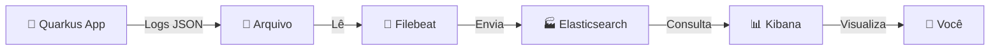
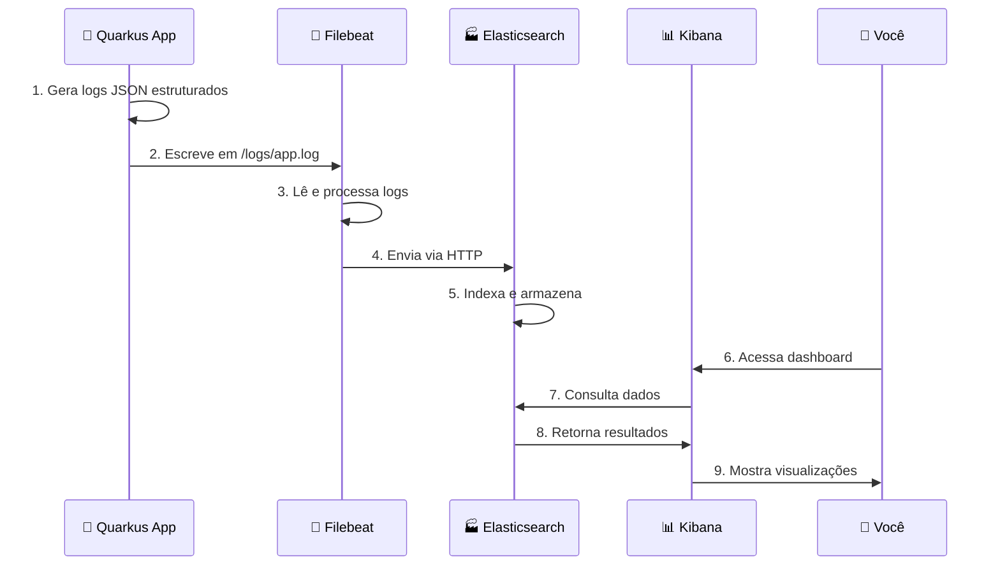
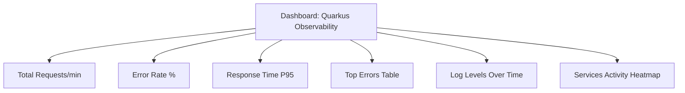

# Kibana e Observabilidade - Guia Completo e Didático 🔍

## 📑 Índice

1. [🎯 Introdução ao Kibana](#-introdução-ao-kibana)
2. [🏗️ O Elastic Stack (ELK)](#️-o-elastic-stack-elk)
3. [🎪 Casos de Uso Principais](#-casos-de-uso-principais)
4. [🔄 Arquitetura de Observabilidade](#-arquitetura-de-observabilidade-com-quarkus--elk)
5. [🐳 Configuração de Ambiente com Docker](#-configuração-de-ambiente)
6. [⚙️ Configurando Logging no Quarkus](#️-configurando-logging-no-quarkus)
7. [📤 Enviando Logs para o Elasticsearch](#-enviando-logs-para-o-elasticsearch)
8. [📊 Usando Kibana](#-usando-kibana)
9. [💻 Exemplo Prático - E-commerce](#-exemplo-prático--quarkus--kibana)
10. [✅ Boas Práticas](#-boas-práticas)
11. [🎓 Exercícios Práticos](#-exercícios-práticos)
12. [🚀 Recursos Extras e Próximos Passos](#-recursos-extras-e-próximos-passos)

---

## 🎯 Introdução ao Kibana

### O Que É Kibana? - A Analogia do Painel de Controle 🎛️

Imagine que você está pilotando um avião:

| **Sem Kibana** ❌ | **Com Kibana** ✅ |
|-------------------|-------------------|
| Olhar pela janela e adivinhar a altitude | Painel com velocidade, altitude, combustível |
| Não saber se há problemas no motor | Alertas automáticos de anomalias |
| Depender de "sorte" para detectar falhas | Visão completa em tempo real |

**Kibana = Painel de Controle da Sua Aplicação**

### 💡 O Que Kibana Faz?

✅ **Visualiza dados** do Elasticsearch em dashboards interativos  
✅ **Analisa logs** em tempo real com buscas poderosas  
✅ **Cria alertas** automáticos para problemas  
✅ **Explora métricas** de performance e comportamento  
✅ **Detecta anomalias** usando Machine Learning  

**TL;DR:** Kibana transforma dados brutos em insights visuais acionáveis!

---

## 🏗️ O Elastic Stack (ELK)

### Os 3 Pilares - Analogia da Fábrica 🏭

```
📦 APLICAÇÃO QUARKUS
    ↓ Produz logs/métricas (matéria-prima)
    
🚚 FILEBEAT/LOGSTASH
    ↓ Coleta e transporta dados
    
🏭 ELASTICSEARCH
    ↓ Processa e armazena (fábrica)
    
📊 KIBANA
    ↓ Apresenta produtos finais (showroom)
```

### Componentes Explicados

| Componente | Função | Analogia |
|------------|--------|----------|
| **Elasticsearch** 🔍 | Armazena e indexa dados | Biblioteca gigante com índice perfeito |
| **Logstash/Filebeat** 🚚 | Coleta e processa logs | Caminhão de entrega |
| **Kibana** 📊 | Interface de visualização | Dashboard do carro |

### Fluxo Completo



---

## 🎪 Casos de Uso Principais

### 1️⃣ Análise de Logs - Encontre Agulha no Palheiro

**Problema:** "Por que o pedido #12345 falhou às 3h da manhã?"

**Com Kibana:**
```kql
orderId: "12345" AND level: "ERROR" AND @timestamp: [2025-01-01T03:00 TO 2025-01-01T04:00]
```
💥 Encontra o erro em 2 segundos!

### 2️⃣ Dashboards Operacionais - Visão em Tempo Real

**Antes:** "Será que a API está funcionando?"  
**Depois:** Dashboard mostrando:
- ✅ 99.9% uptime
- ⚡ 150ms tempo médio de resposta
- 📈 1.2K requests/minuto

### 3️⃣ Alertas Proativos - Seja Avisado Antes do Desastre

```
🚨 ALERTA: Taxa de erro subiu para 15% nos últimos 5 minutos!
📧 Email enviado para: ops@empresa.com
📱 Slack notificado: #alerts-prod
```

### 4️⃣ Monitoramento em Tempo Real

```
AGORA (12:34:56)
────────────────────────
Requests/s:    245 ⬆️
Erros:         2   ✅
Response Time: 89ms ⚡
CPU:          45%  ✅
```

### 5️⃣ Análise de Segurança

```
🔒 ANOMALIA DETECTADA
────────────────────────
- 1000 tentativas de login do IP 192.168.1.100
- Possível ataque de força bruta
- Ação: Bloquear IP automaticamente
```

---

## 🔄 Arquitetura de Observabilidade com Quarkus + ELK

### Fluxo Completo de Dados - Passo a Passo



### 🎯 Benefícios da Integração

| **Recurso** | **Benefício** | **Impacto** |
|-------------|---------------|-------------|
| **Logs JSON** | Estruturados e fáceis de consultar | ⚡ Buscas 10x mais rápidas |
| **Tempo Real** | Dados em Kibana em segundos | 🚀 Debugging instantâneo |
| **Escalabilidade** | Elasticsearch distribui dados | 📈 Suporta bilhões de logs |
| **Flexibilidade** | Visualizações customizadas | 🎨 Dashboards sob medida |
| **Correlação** | Une logs, métricas e traces | 🔗 Visão 360° da aplicação |

### 💻 Exemplo Real - O Que Acontece?

**Você faz uma requisição:**
```bash
curl -X POST http://localhost:8080/api/pedidos \
  -H "Content-Type: application/json" \
  -d '{"produtoId": 123, "quantidade": 2}'
```

**Quarkus gera log:**
```json
{
  "timestamp": "2025-09-30T14:30:15.123Z",
  "level": "INFO",
  "message": "Pedido criado com sucesso",
  "orderId": "abc-123",
  "userId": "user-42",
  "duration": "45ms"
}
```

**Filebeat captura → Elasticsearch armazena → Kibana mostra:**
```
✅ Pedido abc-123 criado
⏱️ Tempo: 45ms
👤 Usuário: user-42
📅 2025-09-30 14:30:15
```

**Você vê tudo em 1-2 segundos! 🚀**

---

## 🐳 Configuração de Ambiente

### Docker Compose para ELK Stack Completo

**TL;DR:** Um comando para subir tudo: Elasticsearch + Kibana + Filebeat

**Crie `docker-compose.yml`:**

```yaml
version: '3.8'

services:
  # ════════════════════════════════════════════════
  # 🏭 ELASTICSEARCH - Armazena os dados
  # ════════════════════════════════════════════════
  elasticsearch:
    image: docker.elastic.co/elasticsearch/elasticsearch:9.1.2
    container_name: elasticsearch
    environment:
      # Modo single-node (desenvolvimento)
      - discovery.type=single-node
      # Desabilitar segurança (só para DEV!)
      - xpack.security.enabled=false
      # Memória JVM (ajuste conforme necessário)
      - "ES_JAVA_OPTS=-Xms1g -Xmx1g"
    ports:
      - "9200:9200"  # API REST
      - "9300:9300"  # Comunicação entre nós
    volumes:
      - elasticsearch-data:/usr/share/elasticsearch/data
    networks:
      - elk-network
    healthcheck:
      test: ["CMD-SHELL", "curl -f http://localhost:9200 || exit 1"]
      interval: 30s
      timeout: 10s
      retries: 5

  # ════════════════════════════════════════════════
  # 📊 KIBANA - Interface de visualização
  # ════════════════════════════════════════════════
  kibana:
    image: docker.elastic.co/kibana/kibana:9.1.2
    container_name: kibana
    ports:
      - "5601:5601"  # Interface web
    environment:
      - ELASTICSEARCH_HOSTS=http://elasticsearch:9200
      - xpack.security.enabled=false
    depends_on:
      elasticsearch:
        condition: service_healthy
    networks:
      - elk-network
    healthcheck:
      test: ["CMD-SHELL", "curl -f http://localhost:5601/api/status || exit 1"]
      interval: 30s
      timeout: 10s
      retries: 5

  # ════════════════════════════════════════════════
  # 🚚 FILEBEAT - Coleta logs
  # ════════════════════════════════════════════════
  filebeat:
    image: docker.elastic.co/beats/filebeat:9.1.2
    container_name: filebeat
    user: root  # Necessário para ler logs Docker
    volumes:
      - ./filebeat.yml:/usr/share/filebeat/filebeat.yml:ro
      - /var/lib/docker/containers:/var/lib/docker/containers:ro
      - /var/run/docker.sock:/var/run/docker.sock:ro
      - ./logs:/logs:ro  # Seus logs da aplicação
    networks:
      - elk-network
    depends_on:
      elasticsearch:
        condition: service_healthy

volumes:
  elasticsearch-data:
    driver: local

networks:
  elk-network:
    driver: bridge
```

### 🚀 Inicializando o Ambiente

```bash
# ════════════════════════════════════════════════
# 1️⃣ PREPARAR ESTRUTURA
# ════════════════════════════════════════════════
mkdir -p logs

# ════════════════════════════════════════════════
# 2️⃣ SUBIR OS SERVIÇOS
# ════════════════════════════════════════════════
docker-compose up -d

# ════════════════════════════════════════════════
# 3️⃣ VERIFICAR STATUS
# ════════════════════════════════════════════════
docker-compose ps

# ════════════════════════════════════════════════
# 4️⃣ TESTAR ELASTICSEARCH
# ════════════════════════════════════════════════
curl http://localhost:9200
# Resposta esperada: {"name":"...", "cluster_name":"...", "version":{...}}

# ════════════════════════════════════════════════
# 5️⃣ ACESSAR KIBANA
# ════════════════════════════════════════════════
# Browser: http://localhost:5601
```

**⏱️ Tempo de inicialização:** ~2-3 minutos para tudo estar pronto!

---

## 4. Configurando Logging no Quarkus

### Dependências Maven

Adicione as dependências necessárias no `pom.xml`:

```xml
<dependencies>
    <!-- Quarkus Logging JSON -->
    <dependency>
        <groupId>io.quarkus</groupId>
        <artifactId>quarkus-logging-json</artifactId>
    </dependency>

    <!-- Para métricas (opcional) -->
    <dependency>
        <groupId>io.quarkus</groupId>
        <artifactId>quarkus-micrometer-registry-prometheus</artifactId>
    </dependency>

    <!-- Para health checks -->
    <dependency>
        <groupId>io.quarkus</groupId>
        <artifactId>quarkus-smallrye-health</artifactId>
    </dependency>
</dependencies>

```

### Configuração de Logging

Configure o `application.properties`:

```bash
# Logging básico
quarkus.log.level=INFO
quarkus.log.console.json=true
quarkus.log.console.json.pretty-print=false

# Configurações específicas para diferentes pacotes
quarkus.log.category."com.example.service".level=DEBUG
quarkus.log.category."org.hibernate".level=WARN

# Logging para arquivo (para coleta via Filebeat)
quarkus.log.file.enable=true
quarkus.log.file.path=logs/application.log
quarkus.log.file.format=%d{yyyy-MM-dd HH:mm:ss,SSS} %-5p [%c{3.}] (%t) %s%e%n
quarkus.log.file.json=true

# Configurações de performance
quarkus.log.console.async=true
quarkus.log.file.async=true

```

### Exemplo de Estrutura de Log

Com a configuração acima, seus logs ficarão assim:

```json
{
  "timestamp": "2025-08-22T10:15:30.123Z",
  "sequence": 1234,
  "loggerClassName": "org.jboss.logging.Logger",
  "loggerName": "com.example.service.OrderService",
  "level": "INFO",
  "message": "Pedido processado com sucesso",
  "threadName": "executor-thread-1",
  "threadId": 23,
  "mdc": {
    "orderId": "12345",
    "userId": "user123",
    "correlationId": "abc-def-ghi"
  },
  "ndc": "",
  "hostName": "quarkus-app-01",
  "processId": 1
}

```

## 5. Enviando Logs para o Elasticsearch

### Configuração do Filebeat

Crie o arquivo `filebeat.yml`:

```yaml
filebeat.inputs:
- type: log
  enabled: true
  paths:
    - /logs/application.log
  json.keys_under_root: true
  json.add_error_key: true
  json.message_key: message
  fields:
    service: quarkus-app
    environment: development
  fields_under_root: true

# Processamento adicional
processors:
  - add_host_metadata:
      when.not.contains.tags: forwarded
  - add_docker_metadata: ~
  - decode_json_fields:
      fields: ["message"]
      target: ""
      overwrite_keys: true

# Output para Elasticsearch
output.elasticsearch:
  hosts: ["elasticsearch:9200"]
  index: "quarkus-logs-%{+yyyy.MM.dd}"
  template.enabled: true
  template.pattern: "quarkus-logs-*"
  template.settings:
    index.number_of_shards: 1
    index.number_of_replicas: 0

# Logging do Filebeat
logging.level: info
logging.to_files: true
logging.files:
  path: /var/log/filebeat
  name: filebeat
  keepfiles: 7
  permissions: 0644

```

### Alternativa: Logstash

Para casos mais complexos, use Logstash com este pipeline:

```ruby
# pipeline/quarkus-logs.conf
input {
  file {
    path => "/logs/application.log"
    start_position => "beginning"
    codec => json
    tags => ["quarkus", "application"]
  }
}

filter {
  if [level] == "ERROR" {
    mutate {
      add_tag => ["error"]
    }
  }

  if [loggerName] =~ /Controller/ {
    mutate {
      add_tag => ["controller"]
    }
  }

  # Parse de métricas customizadas
  if [message] =~ /duration=(\d+)ms/ {
    grok {
      match => { "message" => "duration=(?<request_duration>\d+)ms" }
    }
    mutate {
      convert => { "request_duration" => "integer" }
    }
  }
}

output {
  elasticsearch {
    hosts => ["elasticsearch:9200"]
    index => "quarkus-logs-%{+YYYY.MM.dd}"
  }

  # Debug output
  stdout { codec => rubydebug }
}

```

## 6. Usando Kibana

### Configuração Inicial

1. **Acesse o Kibana**: `http://localhost:5601`
2. **Configure Index Patterns**:
    - Vá para **Stack Management > Index Patterns**
    - Clique em **Create Index Pattern**
    - Digite `quarkus-logs-*`
    - Escolha `@timestamp` como time field

### Descoberta de Dados

Na aba **Discover**, você pode:

- Explorar logs em tempo real
- Aplicar filtros por nível de log, serviço, etc.
- Buscar por texto específico
- Analisar campos estruturados

```
# Exemplos de consultas KQL (Kibana Query Language)
level: "ERROR"
loggerName: "com.example.service.OrderService"
mdc.orderId: "12345"
message: "timeout" AND level: "WARN"

```

### Criando Visualizações

### 1. Gráfico de Barras - Logs por Nível

```yaml
Visualização: Vertical Bar Chart
X-Axis:
  - Aggregation: Date Histogram
  - Field: @timestamp
  - Interval: Auto
Y-Axis:
  - Aggregation: Count
Split Series:
  - Aggregation: Terms
  - Field: level.keyword
  - Size: 10

```

### 2. Tabela de Top Erros

```yaml
Visualização: Data Table
Metrics:
  - Aggregation: Count
Buckets:
  - Aggregation: Terms
  - Field: message.keyword
  - Size: 20
  - Order: Metric Count (Descending)
Filters: level: "ERROR"

```

### 3. Mapa de Calor - Atividade por Hora

```yaml
Visualização: Heat Map
Y-Axis:
  - Aggregation: Terms
  - Field: loggerName.keyword
X-Axis:
  - Aggregation: Date Histogram
  - Field: @timestamp
  - Interval: Hourly

```

### Dashboard Completo

Crie um dashboard combinando as visualizações:



## 7. Exemplo Prático — Quarkus + Kibana

### Aplicação de Exemplo

Vamos criar uma aplicação de e-commerce simples:

```java
@RestController
@RequestMapping("/api/orders")
@Slf4j
public class OrderController {

    @Autowired
    private OrderService orderService;

    @PostMapping
    public ResponseEntity<Order> createOrder(@RequestBody CreateOrderRequest request) {
        String correlationId = UUID.randomUUID().toString();
        MDC.put("correlationId", correlationId);
        MDC.put("operation", "create_order");
        MDC.put("userId", request.getUserId());

        try {
            log.info("Iniciando criação de pedido para usuário: {}", request.getUserId());

            Order order = orderService.createOrder(request);

            log.info("Pedido criado com sucesso: orderId={}, total={}",
                    order.getId(), order.getTotal());

            return ResponseEntity.ok(order);
        } catch (InsufficientStockException e) {
            log.warn("Estoque insuficiente para o pedido: productId={}, requested={}, available={}",
                    e.getProductId(), e.getRequestedQuantity(), e.getAvailableQuantity());
            throw e;
        } catch (Exception e) {
            log.error("Erro inesperado ao criar pedido", e);
            throw e;
        } finally {
            MDC.clear();
        }
    }

    @GetMapping("/{orderId}")
    public ResponseEntity<Order> getOrder(@PathVariable String orderId) {
        MDC.put("orderId", orderId);

        try {
            long startTime = System.currentTimeMillis();
            Order order = orderService.findById(orderId);
            long duration = System.currentTimeMillis() - startTime;

            log.info("Pedido recuperado com sucesso: duration={}ms", duration);
            return ResponseEntity.ok(order);
        } catch (OrderNotFoundException e) {
            log.warn("Pedido não encontrado: orderId={}", orderId);
            throw e;
        } finally {
            MDC.clear();
        }
    }
}

```

```java
@Service
@Slf4j
public class OrderService {

    @Autowired
    private ProductService productService;

    @Autowired
    private PaymentService paymentService;

    @Timed(name = "order_creation_time", description = "Time taken to create an order")
    public Order createOrder(CreateOrderRequest request) {
        MDC.put("method", "createOrder");

        log.debug("Validando itens do pedido: itemCount={}", request.getItems().size());

        // Simular algum processamento
        List<OrderItem> items = validateAndProcessItems(request.getItems());

        BigDecimal total = items.stream()
                .map(OrderItem::getSubtotal)
                .reduce(BigDecimal.ZERO, BigDecimal::add);

        log.debug("Total calculado: {}", total);

        // Processar pagamento
        boolean paymentSuccess = paymentService.processPayment(request.getPaymentInfo(), total);

        if (!paymentSuccess) {
            log.error("Falha no processamento do pagamento: amount={}", total);
            throw new PaymentProcessingException("Falha no pagamento");
        }

        Order order = Order.builder()
                .id(UUID.randomUUID().toString())
                .userId(request.getUserId())
                .items(items)
                .total(total)
                .status(OrderStatus.CONFIRMED)
                .createdAt(Instant.now())
                .build();

        log.info("Pedido processado: orderId={}, itemCount={}, total={}",
                order.getId(), items.size(), total);

        return order;
    }

    private List<OrderItem> validateAndProcessItems(List<CreateOrderItemRequest> items) {
        return items.stream().map(item -> {
            log.debug("Validando item: productId={}, quantity={}",
                    item.getProductId(), item.getQuantity());

            Product product = productService.findById(item.getProductId());

            if (product.getStock() < item.getQuantity()) {
                throw new InsufficientStockException(
                    item.getProductId(),
                    item.getQuantity(),
                    product.getStock()
                );
            }

            return OrderItem.builder()
                    .productId(item.getProductId())
                    .productName(product.getName())
                    .quantity(item.getQuantity())
                    .unitPrice(product.getPrice())
                    .subtotal(product.getPrice().multiply(new BigDecimal(item.getQuantity())))
                    .build();
        }).collect(Collectors.toList());
    }
}

```

### Gerando Dados de Teste

Script para gerar dados de teste:

```java
@Component
@Profile("dev")
public class DataGenerator {

    @Autowired
    private OrderController orderController;

    @Scheduled(fixedDelay = 5000) // A cada 5 segundos
    public void generateRandomOrders() {
        try {
            CreateOrderRequest request = generateRandomRequest();
            orderController.createOrder(request);
        } catch (Exception e) {
            // Erros intencionais para gerar logs interessantes
            log.error("Erro simulado na geração de dados", e);
        }
    }

    private CreateOrderRequest generateRandomRequest() {
        Random random = new Random();

        // Simular falhas ocasionais
        if (random.nextDouble() < 0.1) { // 10% de chance de erro
            throw new RuntimeException("Erro simulado de rede");
        }

        return CreateOrderRequest.builder()
                .userId("user" + random.nextInt(100))
                .items(generateRandomItems())
                .paymentInfo(generatePaymentInfo())
                .build();
    }
}

```

### Logs Resultantes

Com a aplicação rodando, você verá logs como:

```json
{
  "timestamp": "2025-08-22T14:30:15.123Z",
  "level": "INFO",
  "loggerName": "com.example.controller.OrderController",
  "message": "Iniciando criação de pedido para usuário: user42",
  "mdc": {
    "correlationId": "550e8400-e29b-41d4-a716-446655440000",
    "operation": "create_order",
    "userId": "user42"
  }
}

{
  "timestamp": "2025-08-22T14:30:15.456Z",
  "level": "INFO",
  "loggerName": "com.example.service.OrderService",
  "message": "Pedido processado: orderId=abc-123, itemCount=3, total=299.97",
  "mdc": {
    "correlationId": "550e8400-e29b-41d4-a716-446655440000",
    "method": "createOrder",
    "userId": "user42"
  }
}

{
  "timestamp": "2025-08-22T14:30:16.789Z",
  "level": "ERROR",
  "loggerName": "com.example.service.OrderService",
  "message": "Falha no processamento do pagamento: amount=599.99",
  "mdc": {
    "correlationId": "550e8400-e29b-41d4-a716-446655440001",
    "operation": "create_order",
    "userId": "user15"
  },
  "stackTrace": "com.example.exception.PaymentProcessingException: Falha no pagamento\n\tat com.example.service.OrderService.createOrder(OrderService.java:45)"
}

```

## 8. Boas Práticas

### Estruturação de Logs com MDC

Use o **Mapped Diagnostic Context** para enriquecer logs:

```java
@Component
public class LoggingInterceptor implements HandlerInterceptor {

    @Override
    public boolean preHandle(HttpServletRequest request, HttpServletResponse response, Object handler) {
        String correlationId = request.getHeader("X-Correlation-ID");
        if (correlationId == null) {
            correlationId = UUID.randomUUID().toString();
        }

        MDC.put("correlationId", correlationId);
        MDC.put("requestUri", request.getRequestURI());
        MDC.put("httpMethod", request.getMethod());
        MDC.put("userAgent", request.getHeader("User-Agent"));
        MDC.put("remoteAddr", request.getRemoteAddr());

        return true;
    }

    @Override
    public void afterCompletion(HttpServletRequest request, HttpServletResponse response, Object handler, Exception ex) {
        MDC.clear(); // Importante para evitar memory leaks
    }
}

```

### Configuração por Ambiente

```yaml
# application-dev.yml
quarkus:
  log:
    level: DEBUG
    console:
      json: true
    file:
      enable: true
      level: DEBUG

# application-prod.yml
quarkus:
  log:
    level: INFO
    console:
      json: true
    file:
      enable: true
      level: WARN
    category:
      "com.example":
        level: INFO
      "root":
        level: WARN

```

### Segurança nos Logs

```java
@Component
public class SecuritySanitizer {

    private static final Set<String> SENSITIVE_FIELDS = Set.of(
        "password", "token", "authorization", "credit_card", "ssn"
    );

    public String sanitizeMessage(String message) {
        return SENSITIVE_FIELDS.stream()
                .reduce(message, (msg, field) ->
                    msg.replaceAll("(?i)" + field + "=[^\\s,}]+", field + "=***"));
    }
}

// Uso em logs
log.info("User login attempt: {}", sanitizer.sanitizeMessage(loginData.toString()));

```

### Índices por Ambiente

Configure índices separados para cada ambiente:

```yaml
# filebeat-prod.yml
output.elasticsearch:
  hosts: ["elasticsearch-prod:9200"]
  index: "prod-quarkus-logs-%{+yyyy.MM.dd}"

# filebeat-staging.yml
output.elasticsearch:
  hosts: ["elasticsearch-staging:9200"]
  index: "staging-quarkus-logs-%{+yyyy.MM.dd}"

```

### Retenção de Dados

Configure políticas de retenção no Elasticsearch:

```json
{
  "policy": {
    "phases": {
      "hot": {
        "actions": {
          "rollover": {
            "max_size": "50gb",
            "max_age": "30d"
          }
        }
      },
      "warm": {
        "min_age": "30d",
        "actions": {
          "allocate": {
            "number_of_replicas": 0
          }
        }
      },
      "cold": {
        "min_age": "90d",
        "actions": {
          "allocate": {
            "number_of_replicas": 0
          }
        }
      },
      "delete": {
        "min_age": "365d"
      }
    }
  }
}

```

## 9. Exercícios Práticos

### Exercício 1: Dashboard de Performance

**Objetivo**: Criar um dashboard mostrando métricas de performance da aplicação.

**Passos**:

1. Modifique os logs para incluir tempo de resposta:

```java
@Around("@annotation(org.springframework.web.bind.annotation.GetMapping)")
public Object logExecutionTime(ProceedingJoinPoint joinPoint) throws Throwable {
    long start = System.currentTimeMillis();
    Object result = joinPoint.proceed();
    long duration = System.currentTimeMillis() - start;

    log.info("Request completed: endpoint={}, duration={}ms",
            joinPoint.getSignature().getName(), duration);
    return result;
}

```

1. Configure Logstash para extrair métricas:

```ruby
filter {
  grok {
    match => { "message" => "Request completed: endpoint=%{WORD:endpoint}, duration=%{NUMBER:response_time:int}ms" }
  }
}

```

1. No Kibana, crie visualizações para:
    - **Line Chart**: Tempo médio de resposta por endpoint ao longo do tempo
    - **Metric**: P95 de tempo de resposta
    - **Data Table**: Top endpoints mais lentos

### Exercício 2: Alertas de Erro

**Objetivo**: Configurar alertas para detectar picos de erro.

**Configuração no Kibana**:

```json
{
  "trigger": {
    "schedule": {
      "interval": "1m"
    }
  },
  "input": {
    "search": {
      "request": {
        "search_type": "query_then_fetch",
        "indices": ["quarkus-logs-*"],
        "body": {
          "query": {
            "bool": {
              "filter": [
                {
                  "term": {
                    "level.keyword": "ERROR"
                  }
                },
                {
                  "range": {
                    "@timestamp": {
                      "gte": "now-5m"
                    }
                  }
                }
              ]
            }
          }
        }
      }
    }
  },
  "condition": {
    "compare": {
      "ctx.payload.hits.total": {
        "gt": 10
      }
    }
  },
  "actions": {
    "send_email": {
      "email": {
        "to": ["admin@company.com"],
        "subject": "High Error Rate Detected",
        "body": "More than 10 errors in the last 5 minutes"
      }
    }
  }
}

```

### Exercício 3: Integração com Micrometer

**Objetivo**: Combinar logs com métricas do Micrometer.

1. Adicione métricas customizadas:

```java
@Component
public class MetricsService {

    private final Counter orderCounter;
    private final Timer orderProcessingTimer;

    public MetricsService(MeterRegistry meterRegistry) {
        this.orderCounter = Counter.builder("orders.created.total")
                .description("Total orders created")
                .register(meterRegistry);

        this.orderProcessingTimer = Timer.builder("orders.processing.duration")
                .description("Order processing time")
                .register(meterRegistry);
    }

    public void recordOrderCreated(String userId, BigDecimal amount) {
        orderCounter.increment(
            Tags.of(
                "user_type", determineUserType(userId),
                "amount_range", determineAmountRange(amount)
            )
        );
    }
}

```

1. Envie métricas para Elasticsearch via Metricbeat:

```yaml
metricbeat.modules:
- module: prometheus
  period: 10s
  hosts: ["localhost:8080"]
  metrics_path: /q/metrics
  namespace: "quarkus"

```

1. Correlacione logs e métricas no Kibana usando correlation IDs.

## 10. Recursos Extras e Próximos Passos

### Documentação Oficial

- [Quarkus Logging Guide](https://quarkus.io/guides/logging)
- [Elastic Stack Documentation](https://www.elastic.co/guide/index.html)
- [Kibana User Guide](https://www.elastic.co/guide/en/kibana/current/index.html)

### Ferramentas Complementares

**APM (Application Performance Monitoring)**:

```yaml
# Elastic APM para Quarkus
quarkus.elastic-apm.service-name=quarkus-order-service
quarkus.elastic-apm.server-url=http://apm-server:8200
quarkus.elastic-apm.environment=production

```

**Machine Learning no Elastic**:

- Detecção automática de anomalias
- Previsão de tendências
- Clustering de logs similares

### Exemplo Completo no GitHub

```bash
git clone https://github.com/elastic/examples
cd examples/quarkus-observability
docker-compose up -d

```

### Próximos Passos

1. **Distributed Tracing**: Integre com Jaeger ou Zipkin
2. **Correlação Cross-Service**: Use correlation IDs entre microserviços
3. **Synthetic Monitoring**: Configure testes automáticos de endpoints
4. **Cost Optimization**: Implemente hot/warm/cold storage tiers
5. **Security**: Configure autenticação e autorização no Elastic Stack

### Template de Projeto

Use este template para iniciar rapidamente:

```bash
# Estrutura de projeto recomendada
quarkus-observability-project/
├── src/main/java/
│   ├── controller/
│   ├── service/
│   ├── exception/
│   └── config/
├── src/main/resources/
│   └── application.yml
├── docker-compose.yml
├── filebeat.yml
├── kibana/
│   ├── dashboards/
│   ├── index-patterns/
│   └── visualizations/
└── scripts/
    ├── setup-elasticsearch.sh
    └── import-kibana-objects.sh

```

Com este guia completo, você tem todas as ferramentas necessárias para implementar observabilidade robusta em suas aplicações Quarkus usando o Elastic Stack. A combinação de logs estruturados, visualizações interativas e alertas proativos fornece visibilidade completa sobre o comportamento e a performance das suas aplicações em produção.