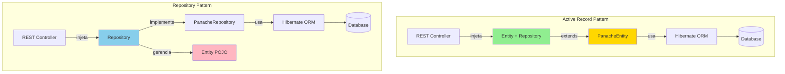
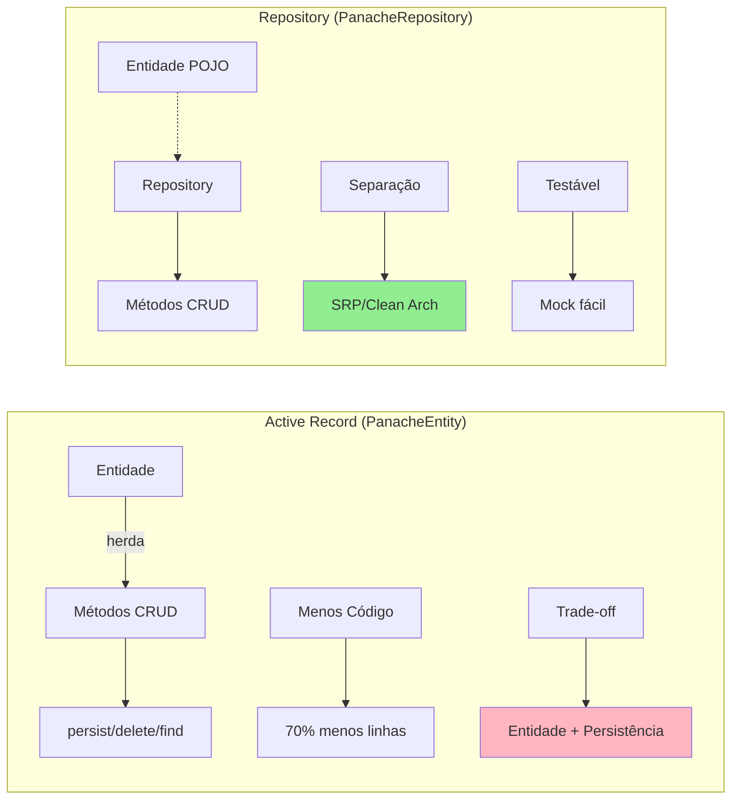
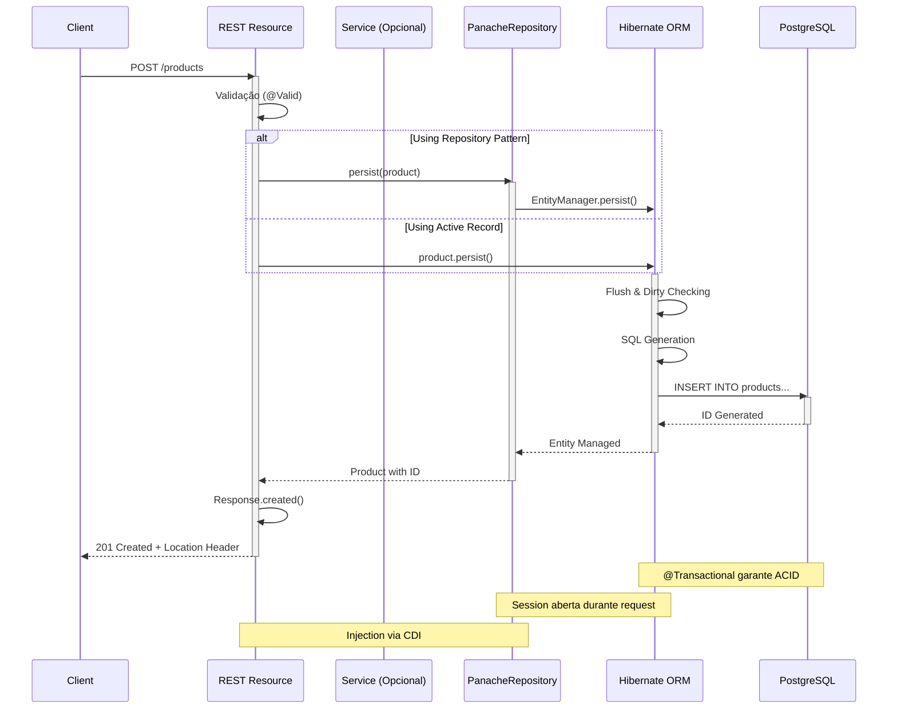

# Hibernate ORM com Panache — Guia Completo de Persistência Simplificada

## Índice

1. [O que é Panache?](#1-o-que-é-panache)
2. [Conceitos Fundamentais](#2-conceitos-fundamentais)
3. [Setup do Projeto](#3-setup-do-projeto)
4. [Active Record Pattern](#4-active-record-pattern)
5. [Repository Pattern](#5-repository-pattern)
6. [Queries Avançadas](#6-queries-avançadas)
7. [Relacionamentos JPA](#7-relacionamentos-jpa)
8. [Transações e Performance](#8-transações-e-performance)
9. [Testes e Qualidade](#9-testes-e-qualidade)
10. [Padrões e Boas Práticas](#10-padrões-e-boas-práticas)
11. [Troubleshooting](#11-troubleshooting)
12. [Recursos e Referências](#12-recursos-e-referências)

---

## 1. O que é Panache?

### 1.1. Definição

**Panache** é uma biblioteca do Quarkus que simplifica radicalmente o uso do Hibernate ORM, eliminando boilerplate e oferecendo APIs elegantes para persistência de dados. 

Criado pela equipe do Quarkus (Red Hat), Panache oferece:
- 🚀 **70% menos código** comparado ao JPA tradicional
- 🎯 **Dois padrões arquiteturais**: Active Record e Repository
- ⚡ **Integração nativa** com CDI, transações e validações
- 🔧 **Compatibilidade total** com Hibernate/JPA
- 📊 **Type-safe queries** sem magic strings

### 1.2. Por que usar Panache?

#### Comparação de Código

**❌ JPA Tradicional (Verbose)**
```java
@Stateless
public class PersonService {
    @PersistenceContext
    EntityManager em;
    
    public List<Person> findByName(String name) {
        TypedQuery<Person> query = em.createQuery(
            "SELECT p FROM Person p WHERE p.name = :name", 
            Person.class
        );
        query.setParameter("name", name);
        return query.getResultList();
    }
    
    public void save(Person person) {
        em.getTransaction().begin();
        try {
            em.persist(person);
            em.getTransaction().commit();
        } catch (Exception e) {
            em.getTransaction().rollback();
            throw e;
        }
    }
}
```

**✅ Panache (Conciso)**
```java
@ApplicationScoped
public class PersonRepository implements PanacheRepository<Person> {
    
    public List<Person> findByName(String name) {
        return find("name", name).list();
    }
    
    // save() já está disponível via PanacheRepository
    // Transação gerenciada automaticamente via @Transactional
}
```

**📊 Redução:**
- **Linhas de código**: 25 → 8 (68% menor)
- **Conceitos**: EntityManager, TypedQuery, Transaction → find(), list()
- **Complexidade**: Alta → Baixa

### 1.3. Arquitetura do Panache

```
┌─────────────────────────────────────────────────────────────┐
│                    QUARKUS APPLICATION                      │
│                                                             │
│  ┌──────────────────┐              ┌────────────────────┐   │
│  │  REST Resource   │──────────────│  Service Layer     │   │
│  │  @Path("/api")   │              │  Business Logic    │   │
│  └──────────────────┘              └─────────┬──────────┘   │
│                                               │             │
│  ┌────────────────────────────────────────────┼───────────┐ │
│  │              PANACHE LAYER                │            │ │
│  │                                           ▼            │ │
│  │  ┌──────────────────┐      ┌──────────────────────┐    │ │
│  │  │  PanacheEntity   │      │ PanacheRepository    │    │ │
│  │  │  (Active Record) │      │   (Repository)       │    │ │
│  │  └────────┬─────────┘      └──────────┬───────────┘    │ │
│  └───────────┼────────────────────────────┼───────────────┘ │
│              │                            │                 │
│  ┌───────────┴────────────────────────────┴───────────────┐ │
│  │              HIBERNATE ORM CORE                        │ │
│  │  - Session Management                                  │ │
│  │  - Lazy Loading                                        │ │
│  │  - Dirty Checking                                      │ │
│  │  - Query Generation                                    │ │
│  └──────────────────────────┬─────────────────────────────┘ │
│                             │                               │
└─────────────────────────────┼───────────────────────────────┘
                              │
                  ┌───────────┴──────────────┐
                  │                          │
                  ▼                          ▼
        ┌──────────────────┐      ┌──────────────────┐
        │    PostgreSQL    │      │      MySQL       │
        │  (ou qualquer    │      │   H2, Oracle,    │
        │   JDBC driver)   │      │   SQL Server...  │
        └──────────────────┘      └──────────────────┘
```

### 1.4. Dois Padrões, Uma Escolha

Panache oferece dois estilos de API para você escolher:

#### Padrão 1: Active Record (PanacheEntity)

**Conceito:** A entidade **contém** os métodos de persistência.

```java
@Entity
public class Person extends PanacheEntity {
    public String name;
    public int age;
    
    // Métodos herdados: persist(), delete(), findById()...
    
    public static List<Person> findByAge(int age) {
        return find("age", age).list();
    }
}

// Uso:
Person person = new Person();
person.name = "João";
person.persist();  // ← Método da própria entidade

List<Person> adults = Person.findByAge(18);  // ← Método estático
```

**Prós:**
- ✅ Menos arquivos (entidade = repository)
- ✅ Código ultra-conciso
- ✅ Ideal para CRUD simples
- ✅ RAD (Rapid Application Development)

**Contras:**
- ❌ Entidade mistura persistência e domínio
- ❌ Dificulta testes (mock de métodos estáticos)
- ❌ Viola Single Responsibility Principle

#### Padrão 2: Repository (PanacheRepository)

**Conceito:** Separação entre entidade POJO e lógica de persistência.

```java
@Entity
public class Person {
    @Id
    @GeneratedValue
    public Long id;
    public String name;
    public int age;
    
    // Apenas campos e lógica de domínio
}

@ApplicationScoped
public class PersonRepository implements PanacheRepository<Person> {
    
    public List<Person> findByAge(int age) {
        return find("age", age).list();
    }
    
    // Métodos herdados: persist(), delete(), findById()...
}

// Uso:
@Inject
PersonRepository repository;

Person person = new Person();
person.name = "João";
repository.persist(person);  // ← Método do repository

List<Person> adults = repository.findByAge(18);
```

**Prós:**
- ✅ Separação de responsabilidades (SRP)
- ✅ Facilita testes (mock do repository)
- ✅ Alinhado com DDD e Clean Architecture
- ✅ Entidades POJO puras

**Contras:**
- ❌ Mais arquivos para gerenciar
- ❌ Pouco mais verboso

### 1.5. Comparação Visual



### 1.6. Quando usar cada padrão?

| Critério | Active Record | Repository |
|----------|---------------|------------|
| **Complexidade** | Baixa/Média | Média/Alta |
| **Tamanho do Projeto** | Pequeno/Médio | Médio/Grande |
| **Arquitetura** | Pragmática | Clean/Hexagonal |
| **DDD** | ❌ Dificulta | ✅ Facilita |
| **Testabilidade** | ⚠️ Moderada | ✅ Excelente |
| **Protótipos/MVPs** | ✅ Ideal | ⚠️ Overkill |
| **Sistemas Empresariais** | ⚠️ Limitado | ✅ Recomendado |

**Recomendação Geral:**
- 🚀 **Protótipos, APIs CRUD, MVPs**: `PanacheEntity`
- 🏢 **Sistemas empresariais, DDD, equipes grandes**: `PanacheRepository`
- 🎯 **Híbrido**: Comece com Active Record, migre para Repository conforme necessário

---

## 2. Conceitos Fundamentais
### 2.1. Entendendo o Hibernate ORM

Antes de mergulhar no Panache, é essencial entender o que o Hibernate faz.

#### O Problema: Impedância Objeto-Relacional

```
┌─────────────────────────────────────────────────────────────┐
│              MUNDO ORIENTADO A OBJETOS (Java)               │
│                                                             │
│  Person person = new Person();                              │
│  person.setName("João");                                    │
│  person.setAge(30);                                         │
│  person.getAddress().setCity("São Paulo");                  │
│                                                             │
│  ↓ Como salvar isso em tabelas SQL? ↓                       │
└─────────────────────────────────────────────────────────────┘
                              ↓
┌─────────────────────────────────────────────────────────────┐
│                MUNDO RELACIONAL (SQL)                       │
│                                                             │
│  INSERT INTO persons (name, age) VALUES ('João', 30);       │
│  INSERT INTO addresses (person_id, city)                    │
│    VALUES (1, 'São Paulo');                                 │
└─────────────────────────────────────────────────────────────┘
```

**Hibernate ORM resolve isso através de:**
- **Mapeamento**: Anotações `@Entity`, `@Table`, `@Column`
- **Persistência**: Salvar objetos automaticamente
- **Queries**: JPQL (SQL orientado a objetos)
- **Lazy Loading**: Carregar dados sob demanda
- **Caching**: Otimizar performance

#### Ciclo de Vida de uma Entidade

```java
// 1. TRANSIENT (não gerenciado)
Person person = new Person();
person.name = "João";

// 2. MANAGED (gerenciado pelo EntityManager)
em.persist(person);  // ou person.persist() com Panache

// 3. DETACHED (desconectado)
em.detach(person);

// 4. REMOVED (marcado para deleção)
em.remove(person);
```

### 2.2. Operações CRUD com Panache

#### CREATE (Criar)

```java
// Active Record
Person person = new Person();
person.name = "João";
person.age = 30;
person.persist();  // INSERT INTO persons...

// Repository
@Inject PersonRepository repository;
Person person = new Person();
person.name = "João";
repository.persist(person);
```

#### READ (Ler)

```java
// Buscar por ID
Person person = Person.findById(1L);

// Buscar todos
List<Person> all = Person.listAll();

// Buscar com filtro
List<Person> adults = Person.find("age >= 18").list();

// Buscar um único resultado
Person john = Person.find("name", "João").firstResult();
```

#### UPDATE (Atualizar)

```java
// Hibernate faz UPDATE automático (Dirty Checking)
@Transactional
public void updateAge(Long id, int newAge) {
    Person person = Person.findById(id);
    person.age = newAge;  // ← Modificação detectada automaticamente
    // Sem necessidade de persist() ou update()!
}
```

#### DELETE (Deletar)

```java
// Deletar por instância
Person person = Person.findById(1L);
person.delete();

// Deletar por ID
Person.deleteById(1L);

// Deletar em lote
Person.delete("age < 18");  // DELETE FROM persons WHERE age < 18
```

### 2.3. Métodos Herdados do Panache

Ao usar `PanacheEntity` ou `PanacheRepository`, você automaticamente herda:

#### Métodos de Persistência

```java
// Salvar
persist()           // Salva a entidade
persist(entity)     // Salva entidade passada
persistAndFlush()   // Salva e força flush imediato

// Deletar
delete()            // Deleta a entidade
delete(String query, Object... params)  // Deleta por query
deleteById(Object id)                    // Deleta por ID
deleteAll()         // Deleta TODAS as entidades

// Verificar existência
isPersistent()      // Verifica se entidade está gerenciada
```

#### Métodos de Consulta

```java
// Buscar
findById(Object id)              // Busca por ID
find(String query, Object... params)  // Query parametrizada
findAll()                        // Busca todas
listAll()                        // Lista todas
streamAll()                      // Stream de todas

// Contar
count()                          // Conta todas
count(String query, Object... params)  // Conta com filtro

// Verificar
exists(Object id)                // Verifica se ID existe
```

#### Métodos com Paginação e Ordenação

```java
// Paginação
Person.findAll()
    .page(Page.of(0, 20))  // Página 0, 20 itens
    .list();

// Ordenação
Person.findAll()
    .page(Page.of(0, 20))
    .sorted(Sort.by("name").ascending())
    .list();

// Combinado
Person.find("age >= ?1", 18)
    .page(Page.of(0, 10))
    .list();
```

### 2.4. Sintaxe de Queries do Panache

Panache aceita várias formas de queries:

#### 1. Query Simples (campo = valor)

```java
// Forma abreviada
Person.find("name", "João").list();

// Equivalente JPQL
Person.find("name = ?1", "João").list();

// Múltiplos campos
Person.find("name = ?1 and age = ?2", "João", 30).list();
```

#### 2. Queries Nomeadas (Named Parameters)

```java
Person.find("name = :name and age >= :minAge", 
    Parameters.with("name", "João").and("minAge", 18))
    .list();
```

#### 3. Queries com Operadores

```java
// Comparação
find("age > 18")
find("age >= 18")
find("age < 65")
find("age != 30")

// LIKE
find("name LIKE ?1", "Jo%")

// IN
find("status IN (?1, ?2)", "ACTIVE", "PENDING")

// BETWEEN
find("age BETWEEN 18 AND 65")

// IS NULL
find("deletedAt IS NULL")

// ORDER BY
find("status = ?1 ORDER BY name ASC", "ACTIVE")
```

#### 4. JPQL Completo

```java
Person.find("""
    SELECT p FROM Person p 
    JOIN p.address a 
    WHERE a.city = ?1 
    ORDER BY p.name
    """, "São Paulo").list();
```

### 2.5. Transações no Quarkus

#### Transações Automáticas

```java
@Path("/persons")
public class PersonResource {
    
    @POST
    @Transactional  // ← Inicia transação, commita ao fim, rollback em exceção
    public Response create(Person person) {
        person.persist();
        return Response.ok().build();
    }
}
```

**Comportamento:**
1. `@Transactional` inicia transação
2. Código executa
3. Se sucesso → `commit()`
4. Se exceção → `rollback()`
5. Transação fecha automaticamente

#### Transações Manuais (Evitar)

```java
// ❌ NÃO RECOMENDADO - Use @Transactional
@Inject
TransactionManager tm;

public void save(Person person) {
    try {
        tm.begin();
        person.persist();
        tm.commit();
    } catch (Exception e) {
        tm.rollback();
        throw e;
    }
}
```

#### Configurando Transações

```java
@Transactional(
    value = TxType.REQUIRED,     // Padrão: cria ou reutiliza
    rollbackOn = Exception.class, // Rollback em qualquer exceção
    dontRollbackOn = ValidationException.class  // Exceto validação
)
public void complexOperation() {
    // ...
}
```

**Tipos de Transação:**
```java
TxType.REQUIRED      // Padrão - cria nova ou usa existente
TxType.REQUIRES_NEW  // Sempre cria nova (suspende existente)
TxType.MANDATORY     // Exige transação existente (erro se não houver)
TxType.SUPPORTS      // Usa se existir, continua sem se não houver
TxType.NOT_SUPPORTED // Suspende transação existente
TxType.NEVER         // Erro se houver transação
```

### 2.6. Validações com Bean Validation

```java
import jakarta.validation.constraints.*;

@Entity
public class Person extends PanacheEntity {
    
    @NotBlank(message = "Nome é obrigatório")
    @Size(min = 2, max = 100, message = "Nome deve ter entre 2 e 100 caracteres")
    public String name;
    
    @Min(value = 0, message = "Idade não pode ser negativa")
    @Max(value = 150, message = "Idade inválida")
    public int age;
    
    @Email(message = "Email inválido")
    @NotNull
    public String email;
    
    @Pattern(regexp = "\\d{3}\\.\\d{3}\\.\\d{3}-\\d{2}", 
             message = "CPF inválido")
    public String cpf;
    
    @Future(message = "Data deve ser futura")
    public LocalDate expirationDate;
}

// Uso no REST
@POST
@Transactional
public Response create(@Valid Person person) {  // ← @Valid dispara validação
    person.persist();
    return Response.ok().build();
}
```

**Validações Disponíveis:**
- `@NotNull`: Não pode ser null
- `@NotBlank`: String não pode ser vazia/apenas espaços
- `@NotEmpty`: Coleção/Array não pode ser vazia
- `@Size(min, max)`: Tamanho de string/coleção
- `@Min(value)`: Valor mínimo numérico
- `@Max(value)`: Valor máximo numérico
- `@Email`: Formato de email
- `@Pattern(regexp)`: Regex customizado
- `@Past/@Future`: Datas passadas/futuras
- `@Positive/@Negative`: Números positivos/negativos

---

## 3. Setup do Projeto

### 3.1. Criando o Projeto

#### Opção 1: Quarkus CLI

```powershell
# Instalar Quarkus CLI (se necessário)
iex "& { $(irm https://ps.jbang.dev) } app install --fresh --force quarkus@quarkusio"

# Criar projeto
quarkus create app com.example:panache-demo `
    --extension='hibernate-orm-panache,jdbc-postgresql,rest-jackson' `
    --java=21
```

#### Opção 2: Maven

```powershell
mvn io.quarkus.platform:quarkus-maven-plugin:3.15.1:create `
    -DprojectGroupId=com.example `
    -DprojectArtifactId=panache-demo `
    -Dextensions="hibernate-orm-panache,jdbc-postgresql,rest-jackson" `
    -DjavaVersion=21
```

#### Opção 3: Code.quarkus.io

1. Acesse https://code.quarkus.io
2. Configure:
   - **Group:** com.example
   - **Artifact:** panache-demo
   - **Java Version:** 21
3. Adicione extensões:
   - Hibernate ORM with Panache
   - JDBC Driver - PostgreSQL
   - REST
   - REST Jackson
4. Generate e baixe

### 3.2. Estrutura do Projeto

```
panache-demo/
├── src/
│   ├── main/
│   │   ├── java/
│   │   │   └── com/
│   │   │       └── example/
│   │   │           ├── entity/
│   │   │           │   ├── Person.java
│   │   │           │   ├── Address.java
│   │   │           │   └── Order.java
│   │   │           ├── repository/
│   │   │           │   ├── PersonRepository.java
│   │   │           │   └── OrderRepository.java
│   │   │           ├── service/
│   │   │           │   └── PersonService.java
│   │   │           └── resource/
│   │   │               └── PersonResource.java
│   │   └── resources/
│   │       ├── application.properties
│   │       └── import.sql
│   └── test/
│       └── java/
│           └── com/
│               └── example/
│                   └── PersonResourceTest.java
├── pom.xml
└── docker-compose.yml
```

### 3.3. Dependências (pom.xml)

```xml
<?xml version="1.0" encoding="UTF-8"?>
<project xmlns="http://maven.apache.org/POM/4.0.0"
         xmlns:xsi="http://www.w3.org/2001/XMLSchema-instance"
         xsi:schemaLocation="http://maven.apache.org/POM/4.0.0 
         https://maven.apache.org/xsd/maven-4.0.0.xsd">
    <modelVersion>4.0.0</modelVersion>
    
    <groupId>com.example</groupId>
    <artifactId>panache-demo</artifactId>
    <version>1.0.0-SNAPSHOT</version>
    
    <properties>
        <quarkus.platform.version>3.15.1</quarkus.platform.version>
        <maven.compiler.release>21</maven.compiler.release>
        <project.build.sourceEncoding>UTF-8</project.build.sourceEncoding>
    </properties>
    
    <dependencyManagement>
        <dependencies>
            <dependency>
                <groupId>io.quarkus.platform</groupId>
                <artifactId>quarkus-bom</artifactId>
                <version>${quarkus.platform.version}</version>
                <type>pom</type>
                <scope>import</scope>
            </dependency>
        </dependencies>
    </dependencyManagement>
    
    <dependencies>
        <!-- Panache ORM -->
        <dependency>
            <groupId>io.quarkus</groupId>
            <artifactId>quarkus-hibernate-orm-panache</artifactId>
        </dependency>
        
        <!-- PostgreSQL Driver -->
        <dependency>
            <groupId>io.quarkus</groupId>
            <artifactId>quarkus-jdbc-postgresql</artifactId>
        </dependency>
        
        <!-- REST -->
        <dependency>
            <groupId>io.quarkus</groupId>
            <artifactId>quarkus-rest</artifactId>
        </dependency>
        
        <!-- JSON Serialization -->
        <dependency>
            <groupId>io.quarkus</groupId>
            <artifactId>quarkus-rest-jackson</artifactId>
        </dependency>
        
        <!-- Bean Validation -->
        <dependency>
            <groupId>io.quarkus</groupId>
            <artifactId>quarkus-hibernate-validator</artifactId>
        </dependency>
        
        <!-- SmallRye Health -->
        <dependency>
            <groupId>io.quarkus</groupId>
            <artifactId>quarkus-smallrye-health</artifactId>
        </dependency>
        
        <!-- OpenAPI/Swagger -->
        <dependency>
            <groupId>io.quarkus</groupId>
            <artifactId>quarkus-smallrye-openapi</artifactId>
        </dependency>
        
        <!-- Testing -->
        <dependency>
            <groupId>io.quarkus</groupId>
            <artifactId>quarkus-junit5</artifactId>
            <scope>test</scope>
        </dependency>
        
        <dependency>
            <groupId>io.rest-assured</groupId>
            <artifactId>rest-assured</artifactId>
            <scope>test</scope>
        </dependency>
        
        <!-- H2 para testes -->
        <dependency>
            <groupId>io.quarkus</groupId>
            <artifactId>quarkus-jdbc-h2</artifactId>
            <scope>test</scope>
        </dependency>
    </dependencies>
    
    <build>
        <plugins>
            <plugin>
                <groupId>io.quarkus.platform</groupId>
                <artifactId>quarkus-maven-plugin</artifactId>
                <version>${quarkus.platform.version}</version>
                <executions>
                    <execution>
                        <goals>
                            <goal>build</goal>
                            <goal>generate-code</goal>
                            <goal>generate-code-tests</goal>
                        </goals>
                    </execution>
                </executions>
            </plugin>
        </plugins>
    </build>
</project>
```

### 3.4. Configuração (application.properties)

```properties
# ============================================================================
# APPLICATION
# ============================================================================
quarkus.application.name=panache-demo
quarkus.application.version=1.0.0

# ============================================================================
# DATASOURCE - PostgreSQL
# ============================================================================
quarkus.datasource.db-kind=postgresql
quarkus.datasource.username=postgres
quarkus.datasource.password=postgres
quarkus.datasource.jdbc.url=jdbc:postgresql://localhost:5432/panache_db

# Pool de Conexões
quarkus.datasource.jdbc.min-size=5
quarkus.datasource.jdbc.max-size=20
quarkus.datasource.jdbc.acquisition-timeout=10

# ============================================================================
# HIBERNATE ORM
# ============================================================================
# Estratégia de criação de schema
quarkus.hibernate-orm.database.generation=drop-and-create
# Opções: none, create, drop-and-create, drop, update, validate

# SQL Logging
quarkus.hibernate-orm.log.sql=true
quarkus.hibernate-orm.log.format-sql=true
quarkus.hibernate-orm.log.bind-parameters=true

# Script de inicialização
quarkus.hibernate-orm.sql-load-script=import.sql

# Dialeto (auto-detectado, mas pode ser explícito)
quarkus.hibernate-orm.dialect=org.hibernate.dialect.PostgreSQLDialect

# Performance
quarkus.hibernate-orm.jdbc.statement-batch-size=50
quarkus.hibernate-orm.jdbc.statement-fetch-size=100

# Segunda via de cache (opcional)
quarkus.hibernate-orm.cache.enabled=false

# ============================================================================
# LOGGING
# ============================================================================
quarkus.log.level=INFO
quarkus.log.category."com.example".level=DEBUG
quarkus.log.category."org.hibernate".level=INFO
quarkus.log.category."org.hibernate.SQL".level=DEBUG
quarkus.log.category."org.hibernate.type.descriptor.sql.BasicBinder".level=TRACE

# Formato de log
quarkus.log.console.format=%d{HH:mm:ss} %-5p [%c{2.}] (%t) %s%e%n

# ============================================================================
# DEV MODE
# ============================================================================
%dev.quarkus.hibernate-orm.database.generation=drop-and-create
%dev.quarkus.hibernate-orm.log.sql=true
%dev.quarkus.datasource.devservices.enabled=true
%dev.quarkus.datasource.devservices.image-name=postgres:16-alpine

# ============================================================================
# TEST MODE
# ============================================================================
%test.quarkus.datasource.db-kind=h2
%test.quarkus.datasource.jdbc.url=jdbc:h2:mem:test;DB_CLOSE_DELAY=-1
%test.quarkus.hibernate-orm.database.generation=drop-and-create
%test.quarkus.hibernate-orm.log.sql=false

# ============================================================================
# PRODUCTION MODE
# ============================================================================
%prod.quarkus.hibernate-orm.database.generation=validate
%prod.quarkus.hibernate-orm.log.sql=false
%prod.quarkus.datasource.jdbc.url=${DATABASE_URL}
%prod.quarkus.datasource.username=${DATABASE_USER}
%prod.quarkus.datasource.password=${DATABASE_PASSWORD}

# ============================================================================
# OPENAPI / SWAGGER
# ============================================================================
quarkus.swagger-ui.always-include=true
quarkus.swagger-ui.path=/swagger-ui

# ============================================================================
# HEALTH CHECKS
# ============================================================================
quarkus.smallrye-health.root-path=/health
```

### 3.5. Docker Compose (docker-compose.yml)

```yaml
version: '3.8'

services:
  postgres:
    image: postgres:16-alpine
    container_name: panache-postgres
    ports:
      - "5432:5432"
    environment:
      POSTGRES_USER: postgres
      POSTGRES_PASSWORD: postgres
      POSTGRES_DB: panache_db
    volumes:
      - postgres_data:/var/lib/postgresql/data
    healthcheck:
      test: ["CMD-SHELL", "pg_isready -U postgres"]
      interval: 10s
      timeout: 5s
      retries: 5
    networks:
      - panache-network

  pgadmin:
    image: dpage/pgadmin4:latest
    container_name: panache-pgadmin
    ports:
      - "5050:80"
    environment:
      PGADMIN_DEFAULT_EMAIL: admin@example.com
      PGADMIN_DEFAULT_PASSWORD: admin
    depends_on:
      postgres:
        condition: service_healthy
    networks:
      - panache-network

volumes:
  postgres_data:
    driver: local

networks:
  panache-network:
    driver: bridge
```

**Comandos:**
```powershell
# Iniciar PostgreSQL
docker-compose up -d postgres

# Ver logs
docker-compose logs -f postgres

# Parar tudo
docker-compose down

# Parar e remover volumes
docker-compose down -v
```

### 3.6. Script de Inicialização (import.sql)

```sql
-- src/main/resources/import.sql
-- Executado automaticamente quando database.generation != none

-- Inserir pessoas
INSERT INTO person (id, name, email, age, status, created_at) 
VALUES 
  (nextval('person_seq'), 'João Silva', 'joao@example.com', 30, 'ACTIVE', CURRENT_TIMESTAMP),
  (nextval('person_seq'), 'Maria Santos', 'maria@example.com', 25, 'ACTIVE', CURRENT_TIMESTAMP),
  (nextval('person_seq'), 'Pedro Oliveira', 'pedro@example.com', 35, 'INACTIVE', CURRENT_TIMESTAMP);

-- Inserir endereços
INSERT INTO address (id, street, city, state, zip_code, person_id)
VALUES
  (nextval('address_seq'), 'Rua A, 123', 'São Paulo', 'SP', '01234-567', 1),
  (nextval('address_seq'), 'Av. B, 456', 'Rio de Janeiro', 'RJ', '20000-000', 2);
```

### 3.7. Executando o Projeto

```powershell
# Modo desenvolvimento (hot reload)
./mvnw quarkus:dev

# Acessar aplicação
# - REST API: http://localhost:8080
# - Swagger UI: http://localhost:8080/swagger-ui
# - Health Check: http://localhost:8080/health
# - Dev UI: http://localhost:8080/q/dev

# Build para produção
./mvnw package

# Executar JAR
java -jar target/quarkus-app/quarkus-run.jar

# Build nativo (requer GraalVM)
./mvnw package -Dnative

# Executar nativo
./target/panache-demo-1.0.0-SNAPSHOT-runner
```

---

## 4. Active Record Pattern
```java
package com.example.entity;

import io.quarkus.hibernate.orm.panache.PanacheEntity;
import jakarta.persistence.*;
import jakarta.validation.constraints.Email;
import jakarta.validation.constraints.NotBlank;
import jakarta.validation.constraints.Size;
import org.slf4j.Logger;
import org.slf4j.LoggerFactory;

import java.time.LocalDateTime;
import java.util.List;
import java.util.Optional;

/**
 * Entidade Customer usando Active Record Pattern.
 * 
 * TRADE-OFF: A entidade herda métodos de persistência (find, persist, delete).
 * Viola parcialmente Object Calisthenics (regra: não usar métodos estáticos),
 * mas justifica-se pela simplicidade em 80% dos casos de CRUD.
 */
@Entity
@Table(
    name = "customers",
    indexes = @Index(name = "idx_customer_email", columnList = "email")
)
public class Customer extends PanacheEntity {
    private static final Logger LOG = LoggerFactory.getLogger(Customer.class);
    
    @NotBlank
    @Size(min = 2, max = 100)
    @Column(nullable = false, length = 100)
    public String name;
    
    @Email
    @NotBlank
    @Column(nullable = false, unique = true, length = 150)
    public String email;
    
    @Enumerated(EnumType.STRING)
    @Column(nullable = false, length = 20)
    public CustomerStatus status = CustomerStatus.ACTIVE;
    
    @Column(name = "created_at", nullable = false, updatable = false)
    public LocalDateTime createdAt = LocalDateTime.now();
    
    @Column(name = "updated_at")
    public LocalDateTime updatedAt;
    
    // ====================
    // Custom Queries
    // ====================
    
    public static List<Customer> findByStatus(CustomerStatus status) {
        LOG.debug("Buscando customers com status: {}", status);
        return find("status", status).list();
    }
    
    public static Optional<Customer> findByEmail(String email) {
        LOG.debug("Buscando customer por email: {}", email);
        return find("email", email).firstResultOptional();
    }
    
    public static List<Customer> findActiveCustomersCreatedAfter(LocalDateTime date) {
        LOG.debug("Buscando customers ativos criados após: {}", date);
        return find(
            "status = ?1 and createdAt > ?2", 
            CustomerStatus.ACTIVE, 
            date
        ).list();
    }
    
    // ====================
    // Business Methods
    // ====================
    
    @PreUpdate
    protected void onUpdate() {
        this.updatedAt = LocalDateTime.now();
        LOG.info("Customer {} atualizado", this.id);
    }
    
    public void activate() {
        if (this.status == CustomerStatus.ACTIVE) {
            LOG.warn("Customer {} já está ativo", this.id);
            return;
        }
        this.status = CustomerStatus.ACTIVE;
        LOG.info("Customer {} ativado", this.id);
    }
    
    public void deactivate() {
        if (this.status == CustomerStatus.INACTIVE) {
            LOG.warn("Customer {} já está inativo", this.id);
            return;
        }
        this.status = CustomerStatus.INACTIVE;
        LOG.info("Customer {} desativado", this.id);
    }
    
    @Override
    public String toString() {
        return "Customer{id=%d, name='%s', email='%s', status=%s}"
            .formatted(id, name, email, status);
    }
}

enum CustomerStatus {
    ACTIVE,
    INACTIVE,
    BLOCKED
}
```
---

### 3.3 Pattern Repository com PanacheRepository

```java

```
---

### 3.4 PanacheRepositoryBase (ID Customizado)

---

## 4. Exercícios de Verificação

### Exercício 1: Implementação Básica
Crie uma entidade `Book` usando **PanacheEntity** com os campos:
- `title` (String, obrigatório)
- `author` (String, obrigatório)
- `isbn` (String, único)
- `publishYear` (Integer)
- `available` (Boolean, padrão `true`)

Implemente:
1. Método estático `findByAuthor(String author)`
2. Método estático `findAvailableBooks()`
3. Método de instância `borrow()` que marca `available = false`
4. REST endpoint para emprestar livro (`PATCH /books/{id}/borrow`)

---

### Exercício 2: Repository Pattern
Converta a entidade `Book` do Exercício 1 para usar **PanacheRepository**:
1. Remova herança de `PanacheEntity`
2. Crie `BookRepository implements PanacheRepository<Book>`
3. Implemente query que busca livros publicados em determinada década
4. Adicione aggregação: `countBooksByAuthor(String author)`

---

### Exercício 3: UUID e Relacionamentos
Crie sistema de empréstimos com UUID:
1. Entidade `Loan` (UUID como ID) com:
   - `bookId` (Long, FK para Book)
   - `borrowerName` (String)
   - `loanDate` (LocalDateTime)
   - `returnDate` (LocalDateTime, nullable)
2. `LoanRepository extends PanacheRepositoryBase<Loan, UUID>`
3. Queries:
   - Empréstimos ativos (sem `returnDate`)
   - Empréstimos atrasados (> 15 dias)
   - Histórico por usuário
4. Operação bulk: marcar empréstimos como retornados

---

## 5. Aprofundamento

### 5.1 Comparativo: Active Record vs Repository

### 5.2 Quando Usar Cada Padrão

| Critério                    | PanacheEntity (Active Record)  | PanacheRepository                 |
| --------------------------- | ------------------------------ | --------------------------------- |
| **Complexidade do Domínio** | Baixa/Média (CRUD simples)     | Média/Alta (DDD, lógica complexa) |
| **Tamanho do Projeto**      | Pequeno/Médio                  | Médio/Grande                      |
| **Arquitetura**             | Pragmática, RAD                | Clean Architecture, Hexagonal     |
| **Testabilidade**           | Dificulta mock da entidade     | Facilita mock do repository       |
| **Encapsulamento**          | Campos públicos (violação OOP) | Getters/Setters tradicionais      |
| **Performance**             | Igual (mesma engine Hibernate) | Igual                             |
| **Curva de Aprendizado**    | Menor (menos conceitos)        | Maior (mais abstrações)           |

**Recomendação Geral:**
- **Protótipos, MVPs, APIs CRUD**: PanacheEntity
- **Sistemas empresariais, equipes grandes**: PanacheRepository
- **DDD com Aggregates**: PanacheRepository + Private Setters

---

### 5.3 Query Methods e Performance

#### Named Queries (Compile-time)
```java
@Entity
@NamedQueries({
    @NamedQuery(
        name = "Product.findExpensive",
        query = "SELECT p FROM Product p WHERE p.price > :threshold"
    )
})
public class Product extends PanacheEntity {
    public static List<Product> findExpensive(BigDecimal threshold) {
        return find("#Product.findExpensive", 
            Parameters.with("threshold", threshold)).list();
    }
}
```

**Vantagem:** Validação em compile-time, melhor cache de queries.

#### Panache Query Shortcuts
```java
// Ordenação
Product.find("category", Sort.by("price").descending(), category).list();

// Paginação
Product.find("active", true).page(Page.of(0, 10)).list();

// Stream (batch processing)
Product.streamAll()
    .filter(p -> p.getStockQuantity() > 0)
    .forEach(p -> LOG.info("Product: {}", p));
```

---

### 5.4 Transações e Pitfalls

#### Problema: LazyInitializationException
```java
// ❌ ERRADO - fora da transação
@GET
@Path("/{id}/items")
public List<OrderItem> getItems(@PathParam("id") Long id) {
    Order order = Order.findById(id);
    return order.items; // LazyInitializationException!
}

// ✅ CORRETO - fetch explícito
@GET
@Path("/{id}/items")
public List<OrderItem> getItems(@PathParam("id") Long id) {
    return Order.find(
        "SELECT o FROM Order o JOIN FETCH o.items WHERE o.id = ?1", 
        id
    ).firstResult().items;
}
```

#### Problema: N+1 Queries
```java
// ❌ ERRADO - 1 query + N queries
List<Order> orders = Order.listAll();
orders.forEach(o -> LOG.info("Customer: {}", o.customer.name)); // N queries!

// ✅ CORRETO - JOIN FETCH
List<Order> orders = Order.find(
    "SELECT DISTINCT o FROM Order o JOIN FETCH o.customer"
).list();
```

---

### 5.5 Alternativas e Comparação

#### JPA Tradicional (EntityManager)
```java
@Inject
EntityManager em;

public List<Product> findByCategory(ProductCategory category) {
    return em.createQuery(
        "SELECT p FROM Product p WHERE p.category = :cat", 
        Product.class
    )
    .setParameter("cat", category)
    .getResultList();
}
```
**Trade-off:** Mais verboso, mas controle total sobre contexto de persistência.

#### Spring Data JPA
```java
public interface ProductRepository extends JpaRepository<Product, Long> {
    List<Product> findByCategoryAndActiveTrue(ProductCategory category);
}
```
**Comparação:**
- **Spring Data:** Inferência de query por nome do método (mais mágica)
- **Panache:** Queries explícitas (menos surpresas)
- **Performance:** Equivalente

#### jOOQ (Type-safe SQL)


---

## 9. Exemplo Completo: Sistema de E-commerce
```java
package com.example.ecommerce;

import io.quarkus.hibernate.orm.panache.PanacheRepository;
import jakarta.enterprise.context.ApplicationScoped;
import jakarta.inject.Inject;
import jakarta.persistence.*;
import jakarta.transaction.Transactional;
import jakarta.validation.Valid;
import jakarta.validation.constraints.NotNull;
import jakarta.validation.constraints.Positive;
import jakarta.ws.rs.*;
import jakarta.ws.rs.core.MediaType;
import jakarta.ws.rs.core.Response;
import org.slf4j.Logger;
import org.slf4j.LoggerFactory;

import java.math.BigDecimal;
import java.time.LocalDateTime;
import java.util.ArrayList;
import java.util.List;

// ====================
// ENTITIES
// ====================

@Entity
@Table(name = "customers")
class Customer {
    @Id
    @GeneratedValue(strategy = GenerationType.IDENTITY)
    private Long id;
    
    @Column(nullable = false)
    private String name;
    
    @Column(nullable = false, unique = true)
    private String email;
    
    @OneToMany(mappedBy = "customer", cascade = CascadeType.ALL)
    private List<Order> orders = new ArrayList<>();
    
    // Getters/Setters
    public Long getId() { return id; }
    public String getName() { return name; }
    public void setName(String name) { this.name = name; }
    public String getEmail() { return email; }
    public void setEmail(String email) { this.email = email; }
    public List<Order> getOrders() { return orders; }
}

@Entity
@Table(name = "orders")
class Order {
    @Id
    @GeneratedValue(strategy = GenerationType.IDENTITY)
    private Long id;
    
    @ManyToOne(fetch = FetchType.LAZY)
    @JoinColumn(name = "customer_id", nullable = false)
    private Customer customer;
    
    @OneToMany(mappedBy = "order", cascade = CascadeType.ALL, orphanRemoval = true)
    private List<OrderItem> items = new ArrayList<>();
    
    @Enumerated(EnumType.STRING)
    private OrderStatus status = OrderStatus.PENDING;
    
    @Column(name = "total_amount")
    private BigDecimal totalAmount = BigDecimal.ZERO;
    
    @Column(name = "created_at")
    private LocalDateTime createdAt = LocalDateTime.now();
    
    // Business Logic
    public void addItem(Product product, Integer quantity) {
        if (!product.hasStock(quantity)) {
            throw new IllegalStateException("Estoque insuficiente");
        }
        
        OrderItem item = new OrderItem();
        item.setOrder(this);
        item.setProduct(product);
        item.setQuantity(quantity);
        item.setPrice(product.getPrice());
        
        this.items.add(item);
        this.calculateTotal();
    }
    
    public void calculateTotal() {
        this.totalAmount = items.stream()
            .map(OrderItem::getSubtotal)
            .reduce(BigDecimal.ZERO, BigDecimal::add);
    }
    
    public void checkout() {
        if (items.isEmpty()) {
            throw new IllegalStateException("Pedido vazio");
        }
        
        // Reserva estoque
        items.forEach(item -> 
            item.getProduct().removeStock(item.getQuantity())
        );
        
        this.status = OrderStatus.CONFIRMED;
    }
    
    // Getters/Setters
    public Long getId() { return id; }
    public Customer getCustomer() { return customer; }
    public void setCustomer(Customer customer) { this.customer = customer; }
    public List<OrderItem> getItems() { return items; }
    public OrderStatus getStatus() { return status; }
    public BigDecimal getTotalAmount() { return totalAmount; }
    public LocalDateTime getCreatedAt() { return createdAt; }
}

@Entity
@Table(name = "order_items")
class OrderItem {
    @Id
    @GeneratedValue(strategy = GenerationType.IDENTITY)
    private Long id;
    
    @ManyToOne(fetch = FetchType.LAZY)
    @JoinColumn(name = "order_id")
    private Order order;
    
    @ManyToOne(fetch = FetchType.EAGER)
    @JoinColumn(name = "product_id")
    private Product product;
    
    private Integer quantity;
    
    private BigDecimal price;
    
    public BigDecimal getSubtotal() {
        return price.multiply(new BigDecimal(quantity));
    }
    
    // Getters/Setters
    public Long getId() { return id; }
    public Order getOrder() { return order; }
    public void setOrder(Order order) { this.order = order; }
    public Product getProduct() { return product; }
    public void setProduct(Product product) { this.product = product; }
    public Integer getQuantity() { return quantity; }
    public void setQuantity(Integer quantity) { this.quantity = quantity; }
    public BigDecimal getPrice() { return price; }
    public void setPrice(BigDecimal price) { this.price = price; }
}

@Entity
@Table(name = "products")
class Product {
    @Id
    @GeneratedValue(strategy = GenerationType.IDENTITY)
    private Long id;
    
    private String name;
    private BigDecimal price;
    private Integer stock = 0;
    
    public boolean hasStock(Integer quantity) {
        return this.stock >= quantity;
    }
    
    public void removeStock(Integer quantity) {
        if (!hasStock(quantity)) {
            throw new IllegalStateException("Estoque insuficiente");
        }
        this.stock -= quantity;
    }
    
    // Getters/Setters
    public Long getId() { return id; }
    public String getName() { return name; }
    public void setName(String name) { this.name = name; }
    public BigDecimal getPrice() { return price; }
    public void setPrice(BigDecimal price) { this.price = price; }
    public Integer getStock() { return stock; }
    public void setStock(Integer stock) { this.stock = stock; }
}

enum OrderStatus {
    PENDING,
    CONFIRMED,
    SHIPPED,
    DELIVERED,
    CANCELLED
}

// ====================
// REPOSITORIES
// ====================

@ApplicationScoped
class CustomerRepository implements PanacheRepository<Customer> {
    public Customer findByEmail(String email) {
        return find("email", email).firstResult();
    }
}

@ApplicationScoped
class OrderRepository implements PanacheRepository<Order> {
    private static final Logger LOG = LoggerFactory.getLogger(OrderRepository.class);
    
    public List<Order> findByCustomer(Long customerId) {
        return find(
            "SELECT o FROM Order o JOIN FETCH o.items WHERE o.customer.id = ?1",
            customerId
        ).list();
    }
    
    public BigDecimal calculateRevenueByPeriod(LocalDateTime start, LocalDateTime end) {
        LOG.info("Calculando receita entre {} e {}", start, end);
        return getEntityManager()
            .createQuery(
                """
                SELECT COALESCE(SUM(o.totalAmount), 0)
                FROM Order o
                WHERE o.status = :status
                AND o.createdAt BETWEEN :start AND :end
                """,
                BigDecimal.class
            )
            .setParameter("status", OrderStatus.DELIVERED)
            .setParameter("start", start)
            .setParameter("end", end)
            .getSingleResult();
    }
}

@ApplicationScoped
class ProductRepository implements PanacheRepository<Product> {
    public List<Product> findInStock() {
        return list("stock > 0");
    }
}

// ====================
// DTOs
// ====================

record CreateOrderRequest(
    @NotNull Long customerId,
    @NotNull List<OrderItemRequest> items
) {}

record OrderItemRequest(
    @NotNull Long productId,
    @Positive Integer quantity
) {}

record OrderResponse(
    Long id,
    String customerName,
    List<OrderItemResponse> items,
    BigDecimal totalAmount,
    OrderStatus status
) {
    static OrderResponse from(Order order) {
        return new OrderResponse(
            order.getId(),
            order.getCustomer().getName(),
            order.getItems().stream()
                .map(OrderItemResponse::from)
                .toList(),
            order.getTotalAmount(),
            order.getStatus()
        );
    }
}

record OrderItemResponse(
    String productName,
    Integer quantity,
    BigDecimal price,
    BigDecimal subtotal
) {
    static OrderItemResponse from(OrderItem item) {
        return new OrderItemResponse(
            item.getProduct().getName(),
            item.getQuantity(),
            item.getPrice(),
            item.getSubtotal()
        );
    }
}

// ====================
// SERVICES
// ====================

@ApplicationScoped
class OrderService {
    private static final Logger LOG = LoggerFactory.getLogger(OrderService.class);
    
    @Inject
    OrderRepository orderRepository;
    
    @Inject
    CustomerRepository customerRepository;
    
    @Inject
    ProductRepository productRepository;
    
    @Transactional
    public Order createOrder(CreateOrderRequest request) {
        LOG.info("Criando pedido para customer {}", request.customerId());
        
        Customer customer = customerRepository.findById(request.customerId());
        if (customer == null) {
            throw new NotFoundException("Cliente não encontrado");
        }
        
        Order order = new Order();
        order.setCustomer(customer);
        
        for (OrderItemRequest itemReq : request.items()) {
            Product product = productRepository.findById(itemReq.productId());
            if (product == null) {
                throw new NotFoundException("Produto não encontrado: " + itemReq.productId());
            }
            
            order.addItem(product, itemReq.quantity());
        }
        
        order.checkout();
        orderRepository.persist(order);
        
        LOG.info("Pedido {} criado com sucesso. Total: {}", 
            order.getId(), order.getTotalAmount());
        
        return order;
    }
}

// ====================
// REST RESOURCE
// ====================

@Path("/orders")
@Produces(MediaType.APPLICATION_JSON)
@Consumes(MediaType.APPLICATION_JSON)
class OrderResource {
    private static final Logger LOG = LoggerFactory.getLogger(OrderResource.class);
    
    @Inject
    OrderService orderService;
    
    @Inject
    OrderRepository orderRepository;
    
    @POST
    public Response createOrder(@Valid CreateOrderRequest request) {
        LOG.info("Recebendo pedido: {}", request);
        
        try {
            Order order = orderService.createOrder(request);
            OrderResponse response = OrderResponse.from(order);
            
            return Response.status(Response.Status.CREATED)
                .entity(response)
                .build();
                
        } catch (NotFoundException e) {
            LOG.warn("Erro ao criar pedido: {}", e.getMessage());
            return Response.status(Response.Status.NOT_FOUND)
                .entity(e.getMessage())
                .build();
                
        } catch (IllegalStateException e) {
            LOG.warn("Erro de validação: {}", e.getMessage());
            return Response.status(Response.Status.CONFLICT)
                .entity(e.getMessage())
                .build();
        }
    }
    
    @GET
    @Path("/customer/{customerId}")
    public List<OrderResponse> findByCustomer(@PathParam("customerId") Long customerId) {
        LOG.info("Buscando pedidos do cliente {}", customerId);
        
        return orderRepository.findByCustomer(customerId)
            .stream()
            .map(OrderResponse::from)
            .toList();
    }
    
    @GET
    @Path("/revenue")
    public Response getRevenue(
        @QueryParam("start") String start,
        @QueryParam("end") String end
    ) {
        LocalDateTime startDate = LocalDateTime.parse(start);
        LocalDateTime endDate = LocalDateTime.parse(end);
        
        BigDecimal revenue = orderRepository.calculateRevenueByPeriod(startDate, endDate);
        
        return Response.ok()
            .entity(STR."Revenue: \{revenue}")
            .build();
    }
}
```
---

## 10. Troubleshooting Comum

### Problema 1: `Could not determine type for: java.time.LocalDateTime`
**Solução:**
```properties
# application.properties
quarkus.hibernate-orm.dialect=org.hibernate.dialect.PostgreSQLDialect
```

### Problema 2: `TransactionRequiredException`
**Causa:** Operação de escrita fora de transação.
**Solução:**
```java
@POST
@Transactional  // ← Adicione esta anotação
public Response create(Product product) {
    productRepository.persist(product);
    return Response.ok().build();
}
```

### Problema 3: `LazyInitializationException`
**Causa:** Acesso a relacionamento lazy fora da sessão.
**Solução:**
```java
// Opção 1: JOIN FETCH
Order.find("SELECT o FROM Order o JOIN FETCH o.items WHERE o.id = ?1", id)

// Opção 2: EAGER
@ManyToOne(fetch = FetchType.EAGER)

// Opção 3: DTO Projection
```

### Problema 4: Performance em `listAll()`
**Causa:** Carregando milhares de registros sem paginação.
**Solução:**
```java
@GET
public List<Product> listAll(
    @QueryParam("page") @DefaultValue("0") int page,
    @QueryParam("size") @DefaultValue("20") int size
) {
    return Product.findAll(Sort.by("name"))
        .page(Page.of(page, size))
        .list();
}
```

### Problema 5: Testes com `PanacheQuery not mocked`
**Solução:**
```java
@QuarkusTest
class ProductRepositoryTest {
    @Inject
    ProductRepository repository;
    
    // ✅ Use injeção real em @QuarkusTest
    // Ou use @QuarkusTestResource com banco H2
}

// Para mock unit test:
@ExtendWith(MockitoExtension.class)
class ProductServiceTest {
    @Mock
    ProductRepository repository;
    
    @InjectMocks
    ProductService service;
    
    @Test
    void test() {
        when(repository.findById(1L)).thenReturn(new Product());
        // ...
    }
}
```

---

## Conclusão

Panache revoluciona o desenvolvimento com Hibernate no Quarkus ao:
- **Reduzir código boilerplate em até 70%**
- **Oferecer dois padrões arquiteturais** (Active Record vs Repository)
- **Manter 100% de compatibilidade** com JPA/Hibernate
- **Facilitar testes e manutenção**

**Escolha consciente:**
- **PanacheEntity**: Agilidade, protótipos, CRUDs simples
- **PanacheRepository**: Arquitetura limpa, DDD, projetos enterprise
- **PanacheRepositoryBase**: IDs customizados (UUID, String, etc)

A documentação oficial e a comunidade Quarkus são recursos valiosos para aprofundamento contínuo.