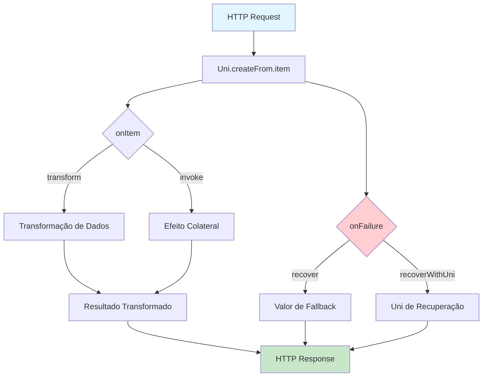
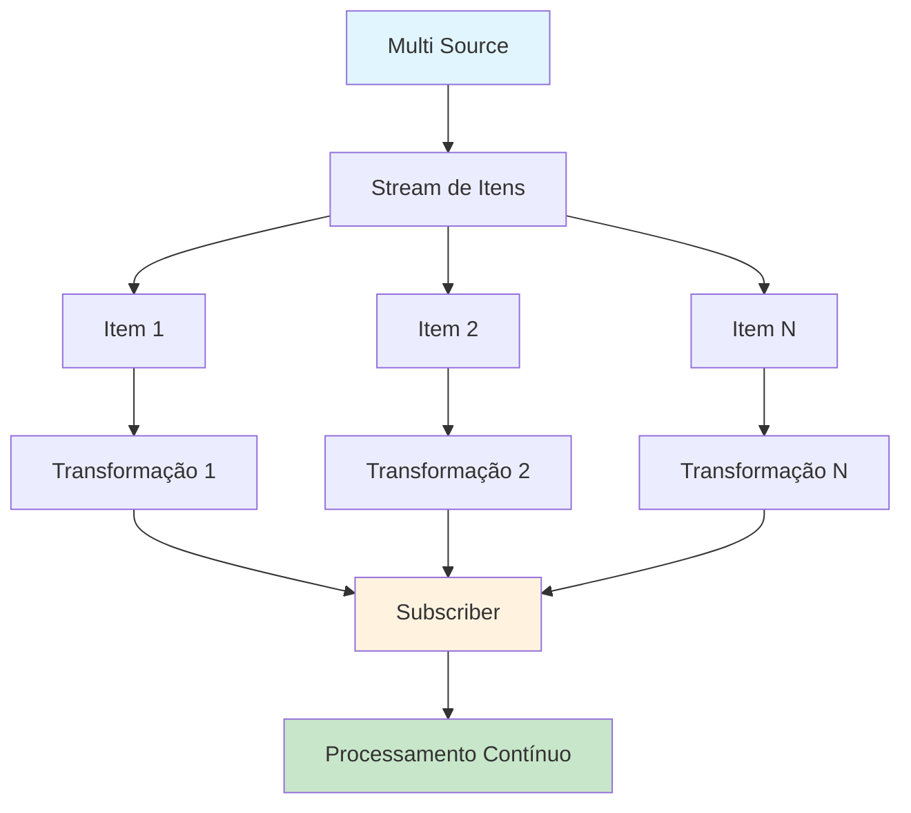
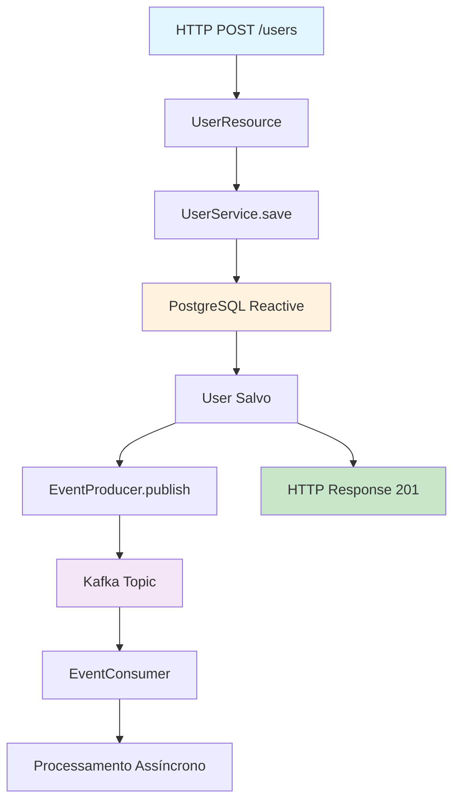

# Programação Reativa no Quarkus com Mutiny - Guia Completo 🌊

## 📑 Índice

1. [🎯 Introdução - O Que É Programação Reativa?](#-introdução---o-que-é-programação-reativa)
2. [💡 Conceitos Fundamentais do Mutiny](#-conceitos-fundamentais-do-mutiny)
3. [⚙️ Setup do Projeto](#️-setup-do-projeto)
4. [💻 Exemplos Práticos](#-exemplos-práticos)
5. [📊 Diagramas de Fluxo](#-diagramas-de-fluxo)
6. [✅ Boas Práticas](#-boas-práticas)
7. [🎓 Exercícios Práticos](#-exercícios-práticos)
8. [🔧 Troubleshooting Comum](#-troubleshooting-comum)
9. [📈 Monitoramento e Observabilidade](#-monitoramento-e-observabilidade)
10. [🚀 Próximos Passos](#-próximos-passos)

---

## 🎯 Introdução - O Que É Programação Reativa?

### A Analogia do Restaurante 🍽️

Imagine que você está em um **restaurante movimentado**:

| **Modelo Imperativo** ❌ | **Modelo Reativo** ✅ |
|--------------------------|----------------------|
| Você pede um prato | Você pede um prato |
| Fica **parado esperando** 30min | Recebe um **buzzer** (notificação) |
| Não pode fazer nada enquanto espera | Vai conversar, pedir bebidas, usar celular |
| **1 garçom** = 1 cliente por vez | **1 garçom** = 20 clientes simultâneos |
| Thread **bloqueada** = desperdício | Thread **liberada** = eficiência |

**Resultado:** No modelo reativo, o mesmo garçom (thread) atende muito mais clientes!

### 🔄 Diferença Técnica - Código Real

```java
// ════════════════════════════════════════════════════════════
// ❌ IMPERATIVO - Thread BLOQUEADA esperando banco de dados
// ════════════════════════════════════════════════════════════
@GET
@Path("/user/{id}")
public User getUser(@PathParam("id") Long id) {
    // Thread PARA aqui e fica esperando o banco responder
    // Se demora 2 segundos, a thread fica PRESA por 2 segundos
    return userRepository.findById(id);  // 💤 Thread bloqueada!
}

// ════════════════════════════════════════════════════════════
// ✅ REATIVO - Thread LIBERADA imediatamente
// ════════════════════════════════════════════════════════════
@GET
@Path("/user/{id}")
public Uni<User> getUser(@PathParam("id") Long id) {
    // Thread é LIBERADA imediatamente para atender outras requests
    // Quando o banco responder, a thread é notificada
    return userRepository.findByIdAsync(id);  // 🚀 Thread livre!
}
```

**Visualização:**

```
IMPERATIVO (Bloqueante):
━━━━━━━━━━━━━━━━━━━━━━━━━━━━━━━━━
Request 1: [Thread 1] ████████████ (2s bloqueada)
Request 2: [Thread 2] ████████████ (2s bloqueada)  
Request 3: [Thread 3] ████████████ (2s bloqueada)
━━━━━━━━━━━━━━━━━━━━━━━━━━━━━━━━━
Resultado: 3 threads para 3 requests

REATIVO (Non-Blocking):
━━━━━━━━━━━━━━━━━━━━━━━━━━━━━━━━━
Request 1: [Thread 1] ▓░░░░░░░░░░░ (liberada!)
Request 2: [Thread 1] ░▓░░░░░░░░░░ (mesma thread!)
Request 3: [Thread 1] ░░▓░░░░░░░░░ (mesma thread!)
Request 100: [Thread 1] ainda disponível!
━━━━━━━━━━━━━━━━━━━━━━━━━━━━━━━━━
Resultado: 1 thread para 100+ requests
```

### 💪 Por Que Usar Programação Reativa?

| **Benefício** | **Explicação** | **Impacto** |
|---------------|----------------|-------------|
| **🚀 Alta Concorrência** | 1 thread atende milhares de requests | 10x-100x mais throughput |
| **📊 Streams de Dados** | Processa dados em tempo real | Dashboards live, IoT |
| **💾 Eficiência de Recursos** | Menos threads = menos memória | 50-200MB economizados |
| **⚡ Melhor Experiência** | Aplicações mais responsivas | UX superior |
| **☁️ Perfeito para Cloud** | Menor custo com containers | $$ economia |

### 🎯 O Papel do Mutiny no Quarkus

**Mutiny = O "Tradutor" do Mundo Reativo**

```
┌─────────────────────────────────────────────────┐
│  MUNDO BLOQUEANTE (Tradicional)                 │
│  • Thread.sleep()                               │
│  • JDBC bloqueante                              │
│  • IO bloqueante                                │
└─────────────────────────────────────────────────┘
                    ↓
            [ MUTINY TRADUZ ]
                    ↓
┌─────────────────────────────────────────────────┐
│  MUNDO NÃO-BLOQUEANTE (Reativo)                 │
│  • Uni.delay()                                  │
│  • Reactive SQL Client                          │
│  • Non-blocking IO                              │
└─────────────────────────────────────────────────┘
```

**Mutiny é:**
- ✅ **Simples** - API intuitiva, não precisa conhecer Reactive Streams
- ✅ **Integrado** - Funciona naturalmente com Quarkus
- ✅ **Poderoso** - Operadores ricos para transformações complexas
- ✅ **Type-safe** - Erros em tempo de compilação

---

## 💡 Conceitos Fundamentais do Mutiny

### 🎁 Uni\<T\> - "Uma Promessa de Valor Único"

**Analogia:** `Uni` é como um **ticket de entrega da Amazon**. Você tem o ticket agora, mas o produto chega depois.

```java
// ════════════════════════════════════════════════
// CRIANDO Unis
// ════════════════════════════════════════════════

// Valor imediato
Uni<String> nome = Uni.createFrom().item("João");

// Valor de função (lazy evaluation)
Uni<String> tempo = Uni.createFrom().item(() -> {
    return Instant.now().toString();  // Só executa quando subscribed
});

// Valor futuro (assíncrono)
Uni<User> usuario = userService.findByIdAsync(123);

// Valor com delay
Uni<String> delayed = Uni.createFrom().item("Atrasado")
    .onItem().delayIt().by(Duration.ofSeconds(5));

// Valor que pode falhar
Uni<Integer> resultado = Uni.createFrom().item(() -> {
    if (Math.random() > 0.5) {
        throw new RuntimeException("Ops!");
    }
    return 42;
});
```

**Quando usar `Uni`:**
- ✅ Buscar **1 usuário** por ID
- ✅ Salvar **1 registro** no banco
- ✅ Fazer **1 chamada** HTTP
- ✅ Qualquer operação que retorna **um único valor**

---

### 🌊 Multi\<T\> - "Rio de Dados"

**Analogia:** `Multi` é como uma **esteira de produção**. Os itens vão passando continuamente.

```java
// ════════════════════════════════════════════════
// CRIANDO Multis
// ════════════════════════════════════════════════

// Lista finita
Multi<String> mensagens = Multi.createFrom()
    .items("msg1", "msg2", "msg3");

// Range de números
Multi<Integer> numeros = Multi.createFrom()
    .range(1, 100);  // 1 até 99

// Ticks periódicos (infinito!)
Multi<Long> ticks = Multi.createFrom().ticks()
    .every(Duration.ofSeconds(1));

// Stream de dados de sensor
Multi<SensorData> sensores = sensorService.streamData();

// Iterable para Multi
List<String> lista = Arrays.asList("a", "b", "c");
Multi<String> multi = Multi.createFrom().iterable(lista);
```

**Quando usar `Multi`:**
- ✅ Listar **todos os usuários** (stream)
- ✅ **Stream de eventos** (Kafka, WebSocket)
- ✅ **Server-Sent Events** (SSE)
- ✅ **Dados de sensores** em tempo real
- ✅ Qualquer operação que retorna **múltiplos valores ao longo do tempo**

---

### 🔧 Operações Comuns - O Poder do Mutiny

#### 1️⃣ **Transformação de Dados** (`transform`)

```java
// ════════════════════════════════════════════════
// TRANSFORMAR Uni
// ════════════════════════════════════════════════
Uni<String> nome = Uni.createFrom().item("joão");

Uni<String> nomeCapitalizado = nome
    .onItem().transform(String::toUpperCase);  // "JOÃO"

Uni<Integer> tamanho = nomeCapitalizado
    .onItem().transform(String::length);  // 4

// Encadeamento (chaining)
Uni<String> resultado = Uni.createFrom().item("hello")
    .onItem().transform(String::toUpperCase)     // "HELLO"
    .onItem().transform(s -> s + " WORLD")       // "HELLO WORLD"
    .onItem().transform(s -> s.replace(" ", "_")); // "HELLO_WORLD"
```

```java
// ════════════════════════════════════════════════
// TRANSFORMAR Multi
// ════════════════════════════════════════════════
Multi<Integer> numeros = Multi.createFrom().range(1, 6);

Multi<Integer> quadrados = numeros
    .onItem().transform(n -> n * n);  // 1, 4, 9, 16, 25

Multi<String> formatados = quadrados
    .onItem().transform(n -> "Número: " + n);
```

#### 2️⃣ **Tratamento de Nulos** (`ifNull`, `ifNotNull`)

```java
Uni<String> nomeOuNull = getUserName();  // Pode retornar null

// Se não for null, transforma
Uni<String> saudacao = nomeOuNull
    .onItem().ifNotNull().transform(n -> "Olá, " + n)
    .onItem().ifNull().continueWith("Olá, Visitante");

// Exemplo completo
Uni<User> user = findUserById(123);

Uni<Response> response = user
    .onItem().ifNotNull().transform(u -> 
        Response.ok(u).build())
    .onItem().ifNull().continueWith(
        Response.status(404).entity("Usuário não encontrado").build()
    );
```

#### 3️⃣ **Tratamento de Erros** (`onFailure`)

```java
// ════════════════════════════════════════════════
// RECUPERAR COM VALOR PADRÃO
// ════════════════════════════════════════════════
Uni<String> resultado = operacaoQuePodefFalhar()
    .onFailure().recoverWithItem("Valor padrão");

// ════════════════════════════════════════════════
// RECUPERAR POR TIPO DE EXCEÇÃO
// ════════════════════════════════════════════════
Uni<User> user = findUser(id)
    .onFailure(SQLException.class)
        .recoverWithItem(new User("Usuário Padrão"))
    .onFailure(TimeoutException.class)
        .recoverWithItem(new User("Timeout - tente novamente"));

// ════════════════════════════════════════════════
// RECUPERAR COM OUTRO Uni
// ════════════════════════════════════════════════
Uni<User> userFromCache = getUserFromCache(id)
    .onFailure().recoverWithUni(() -> 
        getUserFromDatabase(id)  // Fallback para DB
    );

// ════════════════════════════════════════════════
// RETRY em caso de falha
// ════════════════════════════════════════════════
Uni<String> comRetry = apiExterna.chamar()
    .onFailure().retry().atMost(3)  // Tenta até 3 vezes
    .onFailure().retry().withBackOff(
        Duration.ofSeconds(1),      // Espera inicial
        Duration.ofSeconds(10)      // Espera máxima
    );
```

#### 4️⃣ **Efeitos Colaterais** (`invoke`) - Logging, Métricas

```java
// ════════════════════════════════════════════════
// INVOKE não altera o valor, apenas executa ação
// ════════════════════════════════════════════════
Uni<User> user = userService.save(novoUser)
    .onItem().invoke(u -> 
        System.out.println("✅ Usuário salvo: " + u.getId()))
    .onFailure().invoke(ex -> 
        System.err.println("❌ Erro: " + ex.getMessage()));

// Com logging profissional
Uni<Order> order = orderService.create(newOrder)
    .onItem().invoke(o -> {
        logger.info("Order created: id={}, total={}", 
            o.getId(), o.getTotal());
        metrics.counter("orders.created").increment();
    })
    .onFailure().invoke(ex -> {
        logger.error("Failed to create order", ex);
        metrics.counter("orders.failed").increment();
    });
```

#### 5️⃣ **Combinar Múltiplos Unis** (`combine`)

```java
// ════════════════════════════════════════════════
// COMBINAR 2 Unis
// ════════════════════════════════════════════════
Uni<User> userUni = getUser(userId);
Uni<List<Order>> ordersUni = getOrders(userId);

Uni<UserWithOrders> combined = Uni.combine()
    .all().unis(userUni, ordersUni)
    .asTuple()
    .onItem().transform(tuple -> {
        User user = tuple.getItem1();
        List<Order> orders = tuple.getItem2();
        return new UserWithOrders(user, orders);
    });

// ════════════════════════════════════════════════
// COMBINAR 3+ Unis
// ════════════════════════════════════════════════
Uni<User> user = getUser(id);
Uni<Address> address = getAddress(id);
Uni<PaymentInfo> payment = getPayment(id);

Uni<UserProfile> profile = Uni.combine()
    .all().unis(user, address, payment)
    .asTuple()
    .onItem().transform(tuple -> 
        new UserProfile(
            tuple.getItem1(),  // User
            tuple.getItem2(),  // Address
            tuple.getItem3()   // PaymentInfo
        )
    );
```

#### 6️⃣ **Encadear Unis** (`chain`, `flatMap`)

```java
// ════════════════════════════════════════════════
// QUANDO UM Uni DEPENDE DO RESULTADO DE OUTRO
// ════════════════════════════════════════════════

// Buscar usuário, depois buscar seu endereço
Uni<Address> address = getUser(userId)
    .onItem().transformToUni(user -> 
        getAddress(user.getAddressId())  // Retorna outro Uni
    );

// Ou usando chain (mais legível)
Uni<Address> address2 = getUser(userId)
    .chain(user -> getAddress(user.getAddressId()));

// Pipeline completo
Uni<OrderConfirmation> confirmation = 
    validateUser(userId)
        .chain(user -> validateStock(productId))
        .chain(stock -> processPayment(amount))
        .chain(payment -> createOrder(userId, productId))
        .chain(order -> sendConfirmationEmail(order))
        .onItem().transform(OrderConfirmation::new);
```

---

## 3. Setup do Projeto

### 3.1 Dependências Maven

O Mutiny já vem integrado no Quarkus, mas para usar recursos reativos específicos:

```xml
<dependencies>
    <!-- REST Reativo -->
    <dependency>
        <groupId>io.quarkus</groupId>
        <artifactId>quarkus-resteasy-reactive-jackson</artifactId>
    </dependency>

    <!-- Banco de Dados Reativo (PostgreSQL) -->
    <dependency>
        <groupId>io.quarkus</groupId>
        <artifactId>quarkus-reactive-pg-client</artifactId>
    </dependency>

    <!-- Messaging Reativo (Kafka) -->
    <dependency>
        <groupId>io.quarkus</groupId>
        <artifactId>quarkus-smallrye-reactive-messaging-kafka</artifactId>
    </dependency>
</dependencies>

```

### 3.2 Configuração application.properties

```
# Database reativo
quarkus.datasource.reactive.url=postgresql://localhost:5432/mydb
quarkus.datasource.username=user
quarkus.datasource.password=pass

# Kafka
kafka.bootstrap.servers=localhost:9092

```

## 4. Exemplos Práticos

### 4.1 Básico: REST Reativo com Uni

```java
@Path("/hello")
public class HelloResource {

    @GET
    @Path("/simples")
    public Uni<String> helloSimples() {
        // Cria um Uni com valor imediato
        return Uni.createFrom().item("Olá, Quarkus Reativo!");
    }

    @GET
    @Path("/async")
    public Uni<String> helloAsync() {
        // Simula operação assíncrona
        return Uni.createFrom().item(() -> {
            // Simula processamento
            return "Processamento concluído!";
        }).runSubscriptionOn(Infrastructure.getDefaultExecutor());
    }

    @GET
    @Path("/delayed/{seconds}")
    public Uni<String> helloDelayed(@PathParam("seconds") int seconds) {
        // Resposta com delay
        return Uni.createFrom().item("Resposta após delay")
            .onItem().delayIt().by(Duration.ofSeconds(seconds));
    }
}

```

**Explicação linha a linha**:

- `Uni.createFrom().item()`: Cria um Uni com valor conhecido
- `runSubscriptionOn()`: Executa em thread separada
- `delayIt().by()`: Adiciona delay artificial

**Diferença do Imperativo**:

```java
// IMPERATIVO - Thread bloqueada
@GET
public String hello() {
    Thread.sleep(5000); // Bloqueia thread por 5s
    return "Olá!";
}

// REATIVO - Thread liberada
@GET
public Uni<String> hello() {
    return Uni.createFrom().item("Olá!")
        .onItem().delayIt().by(Duration.ofSeconds(5)); // Não bloqueia
}

```

### 4.2 Médio: Banco de Dados Reativo

```java
@ApplicationScoped
public class UserService {

    @Inject
    PgPool client; // Cliente PostgreSQL reativo

    public Uni<User> findById(Long id) {
        return client
            .preparedQuery("SELECT id, name, email FROM users WHERE id = $1")
            .execute(Tuple.of(id))
            .onItem().transform(pgRowSet -> {
                if (pgRowSet.rowCount() == 0) {
                    return null;
                }
                Row row = pgRowSet.iterator().next();
                return new User(
                    row.getLong("id"),
                    row.getString("name"),
                    row.getString("email")
                );
            });
    }

    public Uni<User> save(User user) {
        return client
            .preparedQuery("INSERT INTO users (name, email) VALUES ($1, $2) RETURNING id")
            .execute(Tuple.of(user.getName(), user.getEmail()))
            .onItem().transform(pgRowSet -> {
                Long id = pgRowSet.iterator().next().getLong("id");
                user.setId(id);
                return user;
            });
    }

    public Multi<User> findAll() {
        return client
            .preparedQuery("SELECT id, name, email FROM users ORDER BY name")
            .execute()
            .onItem().transformToMulti(pgRowSet ->
                Multi.createFrom().iterable(() -> pgRowSet.iterator())
            )
            .onItem().transform(row -> new User(
                row.getLong("id"),
                row.getString("name"),
                row.getString("email")
            ));
    }
}

```

**Resource usando o Service**:

```java
@Path("/users")
public class UserResource {

    @Inject
    UserService userService;

    @GET
    @Path("/{id}")
    public Uni<Response> getUser(@PathParam("id") Long id) {
        return userService.findById(id)
            .onItem().ifNotNull().transform(user -> Response.ok(user).build())
            .onItem().ifNull().continueWith(Response.status(404).build());
    }

    @POST
    @Consumes(MediaType.APPLICATION_JSON)
    public Uni<Response> createUser(User user) {
        return userService.save(user)
            .onItem().transform(savedUser ->
                Response.status(201).entity(savedUser).build())
            .onFailure().recoverWithItem(
                Response.status(500).entity("Erro interno").build());
    }
}

```

### 4.3 Avançado: Streams com Multi

```java
@Path("/streams")
public class StreamResource {

    @GET
    @Path("/ticks")
    @Produces(MediaType.SERVER_SENT_EVENTS)
    public Multi<String> streamTicks() {
        // Envia um tick a cada segundo
        return Multi.createFrom()
            .ticks().every(Duration.ofSeconds(1))
            .onItem().transform(tick -> "Tick: " + tick + " - " + Instant.now());
    }

    @GET
    @Path("/sensor-data")
    @Produces(MediaType.SERVER_SENT_EVENTS)
    public Multi<SensorData> streamSensorData() {
        return Multi.createFrom().ticks().every(Duration.ofMillis(500))
            .onItem().transform(tick -> new SensorData(
                "sensor-" + (tick % 3 + 1),
                Math.random() * 100,
                Instant.now()
            ));
    }

    @GET
    @Path("/fibonacci/{limit}")
    @Produces(MediaType.SERVER_SENT_EVENTS)
    public Multi<Long> streamFibonacci(@PathParam("limit") int limit) {
        return Multi.createFrom().range(0, limit)
            .onItem().transform(this::fibonacci);
    }

    private long fibonacci(int n) {
        if (n <= 1) return n;
        long a = 0, b = 1;
        for (int i = 2; i <= n; i++) {
            long temp = a + b;
            a = b;
            b = temp;
        }
        return b;
    }
}

```

**Testando com curl**:

```bash
# Stream infinito de ticks
curl -N http://localhost:8080/streams/ticks

# Stream de dados de sensores
curl -N http://localhost:8080/streams/sensor-data

# Sequência Fibonacci limitada
curl -N http://localhost:8080/streams/fibonacci/10

```

### 4.4 Kafka + Mutiny

### Configuração

```
# application.properties

# Canal de saída (producer)
mp.messaging.outgoing.user-events.connector=smallrye-kafka
mp.messaging.outgoing.user-events.topic=user-events
mp.messaging.outgoing.user-events.key.serializer=org.apache.kafka.common.serialization.StringSerializer
mp.messaging.outgoing.user-events.value.serializer=io.quarkus.kafka.client.serialization.ObjectMapperSerializer

# Canal de entrada (consumer)
mp.messaging.incoming.user-events-in.connector=smallrye-kafka
mp.messaging.incoming.user-events-in.topic=user-events
mp.messaging.incoming.user-events-in.key.deserializer=org.apache.kafka.common.serialization.StringDeserializer
mp.messaging.incoming.user-events-in.value.deserializer=io.quarkus.kafka.client.serialization.ObjectMapperDeserializer
mp.messaging.incoming.user-events-in.value.deserializer.type=com.example.UserEvent

```

### Producer Reativo

```java
@ApplicationScoped
public class UserEventProducer {

    @Channel("user-events")
    Emitter<UserEvent> eventEmitter;

    public Uni<Void> publishUserCreated(User user) {
        UserEvent event = new UserEvent("USER_CREATED", user.getId(), user.getName());

        return Uni.createFrom().completionStage(
            eventEmitter.send(event).thenApply(__ -> null)
        );
    }

    public Uni<Void> publishUserUpdated(User user) {
        UserEvent event = new UserEvent("USER_UPDATED", user.getId(), user.getName());

        return Uni.createFrom().completionStage(
            eventEmitter.send(event).thenApply(__ -> null)
        );
    }
}

```

### Consumer Reativo

```java
@ApplicationScoped
public class UserEventConsumer {

    private static final Logger LOG = Logger.getLogger(UserEventConsumer.class);

    @Incoming("user-events-in")
    public Uni<Void> processUserEvent(UserEvent event) {
        return Uni.createFrom().item(event)
            .onItem().invoke(e -> LOG.info("Processando evento: " + e))
            .onItem().transformToUni(this::handleEvent)
            .onFailure().invoke(ex -> LOG.error("Erro ao processar evento", ex))
            .onFailure().recoverWithItem((Void) null);
    }

    private Uni<Void> handleEvent(UserEvent event) {
        return switch (event.getType()) {
            case "USER_CREATED" -> handleUserCreated(event);
            case "USER_UPDATED" -> handleUserUpdated(event);
            default -> Uni.createFrom().voidItem();
        };
    }

    private Uni<Void> handleUserCreated(UserEvent event) {
        // Simula processamento assíncrono
        return Uni.createFrom().item(() -> {
            LOG.info("Usuário criado: " + event.getUserName());
            // Aqui poderia enviar email, criar cache, etc.
            return null;
        }).runSubscriptionOn(Infrastructure.getDefaultExecutor());
    }

    private Uni<Void> handleUserUpdated(UserEvent event) {
        return Uni.createFrom().item(() -> {
            LOG.info("Usuário atualizado: " + event.getUserName());
            // Aqui poderia invalidar cache, etc.
            return null;
        }).runSubscriptionOn(Infrastructure.getDefaultExecutor());
    }
}

```

### Integrando no UserService

```java
@ApplicationScoped
public class UserService {

    @Inject
    PgPool client;

    @Inject
    UserEventProducer eventProducer;

    public Uni<User> save(User user) {
        return client
            .preparedQuery("INSERT INTO users (name, email) VALUES ($1, $2) RETURNING id")
            .execute(Tuple.of(user.getName(), user.getEmail()))
            .onItem().transform(pgRowSet -> {
                Long id = pgRowSet.iterator().next().getLong("id");
                user.setId(id);
                return user;
            })
            .onItem().transformToUni(savedUser ->
                // Publica evento após salvar
                eventProducer.publishUserCreated(savedUser)
                    .onItem().transform(__ -> savedUser)
            );
    }
}

```

## 5. Diagramas de Fluxo

### 5.1 Fluxo Uni Básico



### 5.2 Fluxo Multi (Stream)



### 5.3 Fluxo Completo com Banco + Kafka



## 6. Boas Práticas

### 6.1 Não Misturar Imperativo com Reativo

❌ **Ruim**:

```java
@GET
public Uni<String> bad() {
    // Thread.sleep bloqueia a thread!
    Thread.sleep(1000);
    return Uni.createFrom().item("Bad practice");
}

```

✅ **Bom**:

```java
@GET
public Uni<String> good() {
    return Uni.createFrom().item("Good practice")
        .onItem().delayIt().by(Duration.ofSeconds(1));
}

```

### 6.2 Sempre Tratar Falhas

❌ **Ruim**:

```java
public Uni<User> getUser(Long id) {
    // Se der erro, aplicação pode quebrar
    return userService.findById(id);
}

```

✅ **Bom**:

```java
public Uni<User> getUser(Long id) {
    return userService.findById(id)
        .onFailure(SQLException.class).recoverWithItem(new User())
        .onFailure().invoke(ex -> logger.error("Erro", ex));
}

```

### 6.3 Use Uni para Valores Únicos, Multi para Streams

```java
// ✅ Correto: Uni para um usuário
public Uni<User> getUser(Long id) { ... }

// ✅ Correto: Multi para lista de usuários
public Multi<User> getAllUsers() { ... }

// ✅ Correto: Multi para stream de eventos
public Multi<SensorData> streamSensorData() { ... }

```

### 6.4 Atenção ao Backpressure com Multi

```java
@GET
@Path("/slow-stream")
public Multi<String> slowStream() {
    return Multi.createFrom().ticks().every(Duration.ofMillis(1))
        .onItem().transform(i -> "Item " + i)
        // ✅ Controla a velocidade para evitar sobrecarga
        .onOverflow().drop(); // ou .buffer(1000)
}

```

### 6.5 Use Infrastructure.getDefaultExecutor() para CPU-Bound

```java
public Uni<String> cpuIntensiveOperation() {
    return Uni.createFrom().item(() -> {
        // Operação pesada de CPU
        return heavyCalculation();
    }).runSubscriptionOn(Infrastructure.getDefaultExecutor());
}

```

## 7. Exercícios Práticos

### Exercício 1: Endpoint Reativo Básico

Crie um endpoint que retorna a hora atual com delay de 2 segundos.

**Solução**:

```java
@GET
@Path("/time")
public Uni<String> getCurrentTime() {
    return Uni.createFrom().item(() -> Instant.now().toString())
        .onItem().delayIt().by(Duration.ofSeconds(2));
}

```

### Exercício 2: Consulta com Fallback

Crie um serviço que busca um produto por ID, mas retorna um produto padrão se não encontrar.

**Solução**:

```java
public Uni<Product> findProductWithFallback(Long id) {
    return productRepository.findById(id)
        .onItem().ifNull().continueWith(new Product(0L, "Produto não encontrado", BigDecimal.ZERO));
}

```

### Exercício 3: Stream de Números Aleatórios

Crie um endpoint SSE que envia números aleatórios a cada 500ms.

**Solução**:

```java
@GET
@Path("/random")
@Produces(MediaType.SERVER_SENT_EVENTS)
public Multi<Double> randomNumbers() {
    return Multi.createFrom().ticks().every(Duration.ofMillis(500))
        .onItem().transform(tick -> Math.random());
}

```

### Exercício 4: Pipeline Complexo

Combine múltiplas operações: buscar usuário, buscar pedidos, calcular total.

**Solução**:

```java
public Uni<UserSummary> getUserSummary(Long userId) {
    Uni<User> userUni = userService.findById(userId);
    Uni<List<Order>> ordersUni = orderService.findByUserId(userId);

    return Uni.combine().all().unis(userUni, ordersUni)
        .asTuple()
        .onItem().transform(tuple -> {
            User user = tuple.getItem1();
            List<Order> orders = tuple.getItem2();
            BigDecimal total = orders.stream()
                .map(Order::getTotal)
                .reduce(BigDecimal.ZERO, BigDecimal::add);
            return new UserSummary(user, orders.size(), total);
        });
}

```

## 8. Troubleshooting Comum

### 8.1 "Blocking call detected"

**Problema**: Tentativa de bloquear thread reativa.

**Solução**:

```java
// ❌ Erro
public Uni<String> wrong() {
    Thread.sleep(1000); // Bloqueia!
    return Uni.createFrom().item("result");
}

// ✅ Correto
public Uni<String> correct() {
    return Uni.createFrom().item("result")
        .onItem().delayIt().by(Duration.ofSeconds(1));
}

```

### 8.2 Uni nunca resolve

**Problema**: Esquecer de fazer subscribe.

**Solução**:

```java
// ❌ Uni criado mas nunca executado
Uni<String> uni = Uni.createFrom().item("test");

// ✅ Retornar o Uni para o Quarkus fazer subscribe
return uni;

```

### 8.3 Multi não para

**Problema**: Stream infinito sem controle.

**Solução**:

```java
// ✅ Limitando o stream
Multi<Long> limitedTicks = Multi.createFrom().ticks()
    .every(Duration.ofSeconds(1))
    .select().first(10); // Para após 10 itens

```

## 9. Monitoramento e Observabilidade

### 9.1 Métricas com Micrometer

```java
@Inject
MeterRegistry meterRegistry;

public Uni<User> findById(Long id) {
    Timer.Sample sample = Timer.start(meterRegistry);

    return userRepository.findById(id)
        .onItem().invoke(user -> sample.stop(Timer.builder("user.find")
            .tag("found", user != null ? "true" : "false")
            .register(meterRegistry)))
        .onFailure().invoke(ex -> sample.stop(Timer.builder("user.find")
            .tag("error", ex.getClass().getSimpleName())
            .register(meterRegistry)));
}

```

### 9.2 Health Checks Reativos

```java
@ApplicationScoped
public class DatabaseHealthCheck implements ReactiveHealthCheck {

    @Inject
    PgPool client;

    @Override
    public Uni<HealthCheckResponse> call() {
        return client.query("SELECT 1").execute()
            .onItem().transform(rs ->
                HealthCheckResponse.up("database"))
            .onFailure().recoverWithItem(
                HealthCheckResponse.down("database"));
    }
}

```

## Conclusão

A programação reativa com Mutiny no Quarkus oferece uma maneira elegante e eficiente de construir aplicações altamente concorrentes e responsivas. Os conceitos principais são:

1. **Uni** para valores únicos assíncronos
2. **Multi** para streams de dados
3. **Transformações** para processar dados
4. **Tratamento de erros** sempre presente
5. **Integração** natural com Kafka, bancos reativos e SSE

Comece com exemplos simples usando `Uni`, depois evolua para `Multi` e integrações mais complexas. A chave é pensar em **fluxos de dados** ao invés de **bloqueios de threads**.

**Próximos passos**:

- Pratique os exercícios propostos
- Explore reactive streams com Kafka
- Implemente circuit breakers reativos
- Estude backpressure e buffering avançado