# Scheduling no Quarkus

## 📑 Índice

1. [Introdução](#1-introdução)
2. [@Scheduled - Agendamento Simples](#2-scheduled---agendamento-simples)
3. [Cron Expressions](#3-cron-expressions)
4. [Quartz Scheduler](#4-quartz-scheduler)
5. [Scheduled Methods Avançados](#5-scheduled-methods-avançados)
6. [Programmatic Scheduling](#6-programmatic-scheduling)
7. [Clustering e Distributed Scheduling](#7-clustering-e-distributed-scheduling)
8. [Observabilidade](#8-observabilidade)
9. [Testes](#9-testes)
10. [Best Practices](#10-best-practices)
11. [Troubleshooting](#11-troubleshooting)
12. [Recursos](#12-recursos)

---

## 1. 📚 **Introdução**

### 1.1. O que é Scheduling?

**Scheduling** permite executar tarefas automaticamente em intervalos ou horários específicos.

**Analogia:** Scheduling é como um **despertador inteligente**:
- ⏰ Toca em horários específicos (Cron)
- 🔄 Repete em intervalos (Fixed Rate)
- ⏸️ Aguarda término anterior (Fixed Delay)
- 🌍 Funciona em cluster (Quartz)

### 1.2. Opções de Scheduling no Quarkus

```mermaid
graph TB
    A[Scheduling no Quarkus] --> B[@Scheduled Simples]
    A --> C[Quartz Scheduler]
    
    B --> D[Cron Expression]
    B --> E[Fixed Rate]
    B --> E[Fixed Delay]
    
    C --> F[Persistent Jobs]
    C --> G[Clustering]
    C --> H[Misfire Handling]
    
    style A fill:#4CAF50
    style B fill:#2196F3
    style C fill:#FF9800
```

| Opção | Uso | Persistência | Clustering |
|-------|-----|--------------|------------|
| **@Scheduled** | Tarefas simples | Não | Não |
| **Quartz** | Tarefas complexas | Sim | Sim |

### 1.3. Setup

**@Scheduled (Built-in):**
```xml
<!-- Já incluído no quarkus-core -->
```

**Quartz:**
```xml
<dependency>
    <groupId>io.quarkus</groupId>
    <artifactId>quarkus-quartz</artifactId>
</dependency>
```

---

## 2. ⏰ **@Scheduled - Agendamento Simples**

### 2.1. Fixed Rate

Executa em **intervalos fixos** (não espera término anterior).

```java
package com.example.scheduled;

import io.quarkus.scheduler.Scheduled;
import jakarta.enterprise.context.ApplicationScoped;
import org.jboss.logging.Logger;
import java.time.LocalDateTime;

/**
 * Tarefas agendadas com Fixed Rate.
 */
@ApplicationScoped
public class HeartbeatScheduler {
    
    private static final Logger LOG = Logger.getLogger(HeartbeatScheduler.class);
    
    /**
     * Executa a cada 10 segundos.
     */
    @Scheduled(every = "10s")
    public void heartbeat() {
        LOG.info("Heartbeat: " + LocalDateTime.now());
    }
    
    /**
     * Executa a cada 1 minuto.
     */
    @Scheduled(every = "1m")
    public void healthCheck() {
        LOG.info("Checking system health...");
        
        boolean healthy = performHealthCheck();
        
        if (!healthy) {
            LOG.warn("System health check failed!");
            sendAlert();
        }
    }
    
    /**
     * Executa a cada 1 hora.
     */
    @Scheduled(every = "1h")
    public void cleanupOldData() {
        LOG.info("Cleaning up old data...");
        
        int deleted = database.deleteOldRecords();
        
        LOG.infof("Deleted %d old records", deleted);
    }
    
    private boolean performHealthCheck() {
        // Verificar saúde do sistema
        return true;
    }
    
    private void sendAlert() {
        // Enviar alerta
    }
}
```

**Unidades de tempo:**
- `s` - segundos
- `m` - minutos
- `h` - horas
- `d` - dias

**Exemplos:**
```java
@Scheduled(every = "5s")      // 5 segundos
@Scheduled(every = "30s")     // 30 segundos
@Scheduled(every = "2m")      // 2 minutos
@Scheduled(every = "12h")     // 12 horas
@Scheduled(every = "1d")      // 1 dia
```

### 2.2. Fixed Delay

Executa após **delay fixo do término** da execução anterior.

```java
package com.example.scheduled;

import io.quarkus.scheduler.Scheduled;
import jakarta.enterprise.context.ApplicationScoped;
import org.jboss.logging.Logger;

/**
 * Tarefas agendadas com Fixed Delay.
 */
@ApplicationScoped
public class DataSyncScheduler {
    
    private static final Logger LOG = Logger.getLogger(DataSyncScheduler.class);
    
    /**
     * Executa 30 segundos APÓS término da execução anterior.
     */
    @Scheduled(delay = 30, delayUnit = TimeUnit.SECONDS)
    public void syncData() {
        LOG.info("Starting data sync...");
        
        try {
            // Simulando operação demorada (10s)
            Thread.sleep(10000);
            
            externalApi.syncData();
            
            LOG.info("Data sync completed");
        } catch (Exception e) {
            LOG.error("Data sync failed", e);
        }
        
        // Próxima execução em 30s após este método terminar
    }
    
    /**
     * Executa 5 minutos após término anterior.
     */
    @Scheduled(delay = 5, delayUnit = TimeUnit.MINUTES)
    public void processQueue() {
        LOG.info("Processing message queue...");
        
        int processed = 0;
        while (messageQueue.hasMessages()) {
            Message msg = messageQueue.poll();
            processMessage(msg);
            processed++;
        }
        
        LOG.infof("Processed %d messages", processed);
    }
}
```

**Fixed Rate vs Fixed Delay:**

```mermaid
gantt
    title Fixed Rate vs Fixed Delay
    dateFormat ss
    axisFormat %S
    
    section Fixed Rate
    Exec 1 (5s) :a1, 00, 5s
    Wait       :a2, 05, 5s
    Exec 2 (5s) :a3, 10, 5s
    Wait       :a4, 15, 5s
    Exec 3 (5s) :a5, 20, 5s
    
    section Fixed Delay
    Exec 1 (5s) :b1, 00, 5s
    Delay (10s) :b2, 05, 10s
    Exec 2 (5s) :b3, 15, 5s
    Delay (10s) :b4, 20, 10s
    Exec 3 (5s) :b5, 30, 5s
```



### 2.3. Delayed Start

Atrasar primeira execução:

```java
package com.example.scheduled;

import io.quarkus.scheduler.Scheduled;
import jakarta.enterprise.context.ApplicationScoped;

/**
 * Tarefas com delayed start.
 */
@ApplicationScoped
public class StartupScheduler {
    
    /**
     * Aguarda 1 minuto após startup, depois executa a cada 10 minutos.
     */
    @Scheduled(
        every = "10m",
        delay = 1,
        delayUnit = TimeUnit.MINUTES
    )
    public void warmupCache() {
        LOG.info("Warming up cache...");
        cacheService.warmup();
    }
    
    /**
     * Aguarda 30 segundos após startup, depois executa a cada hora.
     */
    @Scheduled(
        every = "1h",
        delay = 30,
        delayUnit = TimeUnit.SECONDS
    )
    public void generateReports() {
        LOG.info("Generating hourly reports...");
        reportService.generate();
    }
}
```

### 2.4. Configuração Via Properties

```java
package com.example.scheduled;

import io.quarkus.scheduler.Scheduled;
import jakarta.enterprise.context.ApplicationScoped;

/**
 * Agendamento configurável via properties.
 */
@ApplicationScoped
public class ConfigurableScheduler {
    
    /**
     * Intervalo definido em application.properties.
     */
    @Scheduled(every = "{backup.interval}")
    public void backupDatabase() {
        LOG.info("Starting database backup...");
        backupService.backup();
    }
    
    /**
     * Cron configurável.
     */
    @Scheduled(cron = "{reports.schedule}")
    public void generateReport() {
        LOG.info("Generating scheduled report...");
        reportService.generate();
    }
}
```

```properties
# ═══════════════════════════════════════════════════════════════
# SCHEDULING - CONFIGURAÇÕES
# ═══════════════════════════════════════════════════════════════

# Intervalos
backup.interval=6h
cleanup.interval=1d

# Cron expressions
reports.schedule=0 0 9 * * ?
sync.schedule=0 */15 * * * ?

# Habilitar/desabilitar scheduling
quarkus.scheduler.enabled=true

# Threads do scheduler
quarkus.scheduler.thread-count=10
```

### 2.5. Execução Condicional

```java
package com.example.scheduled;

import io.quarkus.scheduler.Scheduled;
import io.quarkus.scheduler.SkipPredicate;
import jakarta.enterprise.context.ApplicationScoped;
import org.eclipse.microprofile.config.inject.ConfigProperty;

/**
 * Scheduled com execução condicional.
 */
@ApplicationScoped
public class ConditionalScheduler {
    
    @ConfigProperty(name = "maintenance.mode", defaultValue = "false")
    boolean maintenanceMode;
    
    /**
     * Executa apenas se não estiver em manutenção.
     */
    @Scheduled(
        every = "5m",
        skipExecutionIf = MaintenanceCheck.class
    )
    public void processOrders() {
        LOG.info("Processing pending orders...");
        orderService.processPending();
    }
    
    /**
     * Skip predicate customizado.
     */
    public static class MaintenanceCheck implements SkipPredicate {
        
        @ConfigProperty(name = "maintenance.mode", defaultValue = "false")
        boolean maintenanceMode;
        
        @Override
        public boolean test(ScheduledExecution execution) {
            if (maintenanceMode) {
                LOG.info("Skipping execution - maintenance mode");
                return true;  // Pular execução
            }
            return false;  // Executar normalmente
        }
    }
}
```

### 2.6. Identity e Metadata

```java
package com.example.scheduled;

import io.quarkus.scheduler.Scheduled;
import io.quarkus.scheduler.ScheduledExecution;
import jakarta.enterprise.context.ApplicationScoped;

/**
 * Scheduled com identity e metadata.
 */
@ApplicationScoped
public class IdentifiedScheduler {
    
    /**
     * Task com identidade.
     */
    @Scheduled(
        identity = "daily-backup",
        every = "1d"
    )
    public void dailyBackup(ScheduledExecution execution) {
        LOG.infof("Task: %s", execution.getTrigger().getId());
        LOG.infof("Scheduled fire time: %s", execution.getScheduledFireTime());
        LOG.infof("Previous fire time: %s", execution.getTrigger().getPreviousFireTime());
        LOG.infof("Next fire time: %s", execution.getTrigger().getNextFireTime());
        
        backupService.backup();
    }
}
```

### 2.7. Concurrent Execution

```java
package com.example.scheduled;

import io.quarkus.scheduler.Scheduled;
import io.quarkus.scheduler.Scheduled.ConcurrentExecution;
import jakarta.enterprise.context.ApplicationScoped;

/**
 * Controle de execução concorrente.
 */
@ApplicationScoped
public class ConcurrentScheduler {
    
    /**
     * Pular execução se anterior ainda estiver rodando.
     */
    @Scheduled(
        every = "10s",
        concurrentExecution = ConcurrentExecution.SKIP
    )
    public void skipIfRunning() {
        LOG.info("Starting long task...");
        
        // Tarefa longa (15 segundos)
        longRunningTask();
        
        LOG.info("Task completed");
        // Se próxima execução for agendada enquanto esta roda, será pulada
    }
    
    /**
     * Permitir múltiplas execuções concorrentes.
     */
    @Scheduled(
        every = "5s",
        concurrentExecution = ConcurrentExecution.PROCEED
    )
    public void allowConcurrent() {
        LOG.info("Concurrent task started");
        // Múltiplas instâncias podem rodar simultaneamente
    }
}
```

---

## 3. 📅 **Cron Expressions**

### 3.1. Sintaxe Cron

```
 ┌───────────── segundo (0-59)
 │ ┌───────────── minuto (0-59)
 │ │ ┌───────────── hora (0-23)
 │ │ │ ┌───────────── dia do mês (1-31)
 │ │ │ │ ┌───────────── mês (1-12 ou JAN-DEC)
 │ │ │ │ │ ┌───────────── dia da semana (0-7 ou SUN-SAT, 0 e 7 = domingo)
 │ │ │ │ │ │
 │ │ │ │ │ │
 * * * * * *
```

### 3.2. Exemplos Práticos

```java
package com.example.scheduled;

import io.quarkus.scheduler.Scheduled;
import jakarta.enterprise.context.ApplicationScoped;

/**
 * Exemplos de Cron Expressions.
 */
@ApplicationScoped
public class CronScheduler {
    
    /**
     * Todos os dias às 9:00 AM.
     */
    @Scheduled(cron = "0 0 9 * * ?")
    public void dailyMorningReport() {
        LOG.info("Generating daily morning report...");
        reportService.generateDailyReport();
    }
    
    /**
     * A cada 15 minutos.
     */
    @Scheduled(cron = "0 */15 * * * ?")
    public void every15Minutes() {
        LOG.info("Running 15-minute task...");
    }
    
    /**
     * Toda segunda-feira às 8:00 AM.
     */
    @Scheduled(cron = "0 0 8 ? * MON")
    public void mondayMorning() {
        LOG.info("Monday morning task...");
        weeklyReportService.start();
    }
    
    /**
     * Primeiro dia de cada mês à meia-noite.
     */
    @Scheduled(cron = "0 0 0 1 * ?")
    public void firstDayOfMonth() {
        LOG.info("Monthly task - first day");
        monthlyBillingService.process();
    }
    
    /**
     * Último dia útil do mês às 18:00.
     */
    @Scheduled(cron = "0 0 18 L * ?")
    public void lastWorkingDay() {
        LOG.info("Last working day of month");
        monthlyReportService.finalize();
    }
    
    /**
     * De segunda a sexta às 12:00 PM.
     */
    @Scheduled(cron = "0 0 12 ? * MON-FRI")
    public void weekdayNoon() {
        LOG.info("Weekday noon task");
    }
    
    /**
     * A cada 30 segundos.
     */
    @Scheduled(cron = "*/30 * * * * ?")
    public void every30Seconds() {
        LOG.info("30-second interval task");
    }
    
    /**
     * De 2 em 2 horas (8h, 10h, 12h, 14h, 16h, 18h).
     */
    @Scheduled(cron = "0 0 8-18/2 * * ?")
    public void everyTwoHoursBusinessHours() {
        LOG.info("Every 2 hours during business hours");
    }
    
    /**
     * Às 23:59 de domingo.
     */
    @Scheduled(cron = "0 59 23 ? * SUN")
    public void sundayNight() {
        LOG.info("Sunday night weekly summary");
        weeklyService.summarize();
    }
}
```

### 3.3. Caracteres Especiais

| Caractere | Significado | Exemplo |
|-----------|-------------|---------|
| `*` | Qualquer valor | `* * * * * ?` (todo segundo) |
| `?` | Nenhum valor específico | `0 0 12 ? * MON` (segundas ao meio-dia) |
| `-` | Range | `0 0 9-17 * * ?` (9h às 17h) |
| `,` | Lista de valores | `0 0 9,12,15 * * ?` (9h, 12h, 15h) |
| `/` | Incremento | `0 */5 * * * ?` (a cada 5 minutos) |
| `L` | Último | `0 0 0 L * ?` (último dia do mês) |
| `W` | Dia útil mais próximo | `0 0 0 15W * ?` (dia útil mais próximo do dia 15) |
| `#` | N-ésima ocorrência | `0 0 9 ? * MON#2` (segunda segunda-feira do mês) |

### 3.4. Exemplos Complexos

```java
/**
 * Segunda segunda-feira de cada mês às 10:00.
 */
@Scheduled(cron = "0 0 10 ? * MON#2")
public void secondMondayOfMonth() {
    LOG.info("Second Monday of the month");
}

/**
 * Dia útil mais próximo do dia 15 de cada mês.
 */
@Scheduled(cron = "0 0 9 15W * ?")
public void nearestWeekdayTo15th() {
    LOG.info("Nearest weekday to 15th");
}

/**
 * Última sexta-feira do mês às 17:00.
 */
@Scheduled(cron = "0 0 17 ? * FRI#L")
public void lastFridayOfMonth() {
    LOG.info("Last Friday of month");
}

/**
 * Entre 9h-17h, a cada hora, de segunda a sexta.
 */
@Scheduled(cron = "0 0 9-17 ? * MON-FRI")
public void businessHoursHourly() {
    LOG.info("Hourly during business hours");
}
```

### 3.5. Timezone

```java
package com.example.scheduled;

import io.quarkus.scheduler.Scheduled;
import jakarta.enterprise.context.ApplicationScoped;

/**
 * Cron com timezone.
 */
@ApplicationScoped
public class TimezoneScheduler {
    
    /**
     * 9 AM no timezone de São Paulo.
     */
    @Scheduled(
        cron = "0 0 9 * * ?",
        timeZone = "America/Sao_Paulo"
    )
    public void saoPauloMorning() {
        LOG.info("9 AM in Sao Paulo");
    }
    
    /**
     * 10 AM UTC.
     */
    @Scheduled(
        cron = "0 0 10 * * ?",
        timeZone = "UTC"
    )
    public void utcMorning() {
        LOG.info("10 AM UTC");
    }
    
    /**
     * Múltiplos horários em diferentes timezones.
     */
    @Scheduled(
        cron = "0 0 8 * * ?",
        timeZone = "America/New_York"
    )
    public void newYorkMorning() {
        LOG.info("8 AM in New York");
    }
}
```

### 3.6. Cron Generator Helper

```java
package com.example.scheduled;

import java.time.DayOfWeek;
import java.time.Month;

/**
 * Helper para gerar Cron expressions.
 */
public class CronBuilder {
    
    private String second = "0";
    private String minute = "0";
    private String hour = "*";
    private String dayOfMonth = "*";
    private String month = "*";
    private String dayOfWeek = "?";
    
    public CronBuilder atSecond(int second) {
        this.second = String.valueOf(second);
        return this;
    }
    
    public CronBuilder atMinute(int minute) {
        this.minute = String.valueOf(minute);
        return this;
    }
    
    public CronBuilder atHour(int hour) {
        this.hour = String.valueOf(hour);
        return this;
    }
    
    public CronBuilder everyMinutes(int minutes) {
        this.minute = "*/" + minutes;
        return this;
    }
    
    public CronBuilder everyHours(int hours) {
        this.hour = "*/" + hours;
        return this;
    }
    
    public CronBuilder onDayOfMonth(int day) {
        this.dayOfMonth = String.valueOf(day);
        this.dayOfWeek = "?";
        return this;
    }
    
    public CronBuilder onLastDayOfMonth() {
        this.dayOfMonth = "L";
        this.dayOfWeek = "?";
        return this;
    }
    
    public CronBuilder onDayOfWeek(DayOfWeek day) {
        this.dayOfWeek = day.name().substring(0, 3).toUpperCase();
        this.dayOfMonth = "?";
        return this;
    }
    
    public CronBuilder inMonth(Month month) {
        this.month = String.valueOf(month.getValue());
        return this;
    }
    
    public String build() {
        return String.join(" ", second, minute, hour, dayOfMonth, month, dayOfWeek);
    }
    
    // Atalhos comuns
    public static String daily(int hour, int minute) {
        return new CronBuilder()
            .atHour(hour)
            .atMinute(minute)
            .build();
    }
    
    public static String everyWeekday(int hour, int minute) {
        return String.format("0 %d %d ? * MON-FRI", minute, hour);
    }
    
    public static String everyMinutes(int minutes) {
        return new CronBuilder()
            .everyMinutes(minutes)
            .build();
    }
}
```

**Uso:**
```java
@ApplicationScoped
public class BuilderScheduler {
    
    @Scheduled(cron = "{daily.cron}")
    public void dailyTask() {
        // ...
    }
}
```

```properties
# application.properties
daily.cron=${CronBuilder.daily(9, 0)}  # 9:00 AM diariamente
```

---

## 4. 🔷 **Quartz Scheduler**

### 4.1. Setup Quartz

```xml
<dependency>
    <groupId>io.quarkus</groupId>
    <artifactId>quarkus-quartz</artifactId>
</dependency>

<!-- Opcional: PostgreSQL para persistência -->
<dependency>
    <groupId>io.quarkus</groupId>
    <artifactId>quarkus-jdbc-postgresql</artifactId>
</dependency>
<dependency>
    <groupId>io.quarkus</groupId>
    <artifactId>quarkus-agroal</artifactId>
</dependency>
```

```properties
# ═══════════════════════════════════════════════════════════════
# QUARTZ - CONFIGURAÇÕES
# ═══════════════════════════════════════════════════════════════

# Store type (ram ou jdbc)
quarkus.quartz.store-type=ram

# Thread pool
quarkus.quartz.thread-count=25
quarkus.quartz.thread-priority=5

# Clustering (apenas com JDBC store)
quarkus.quartz.clustered=false

# Instance name
quarkus.quartz.instance-name=QuarkusQuartzScheduler
quarkus.quartz.instance-id=AUTO

# Misfire threshold
quarkus.quartz.misfire-threshold=60s
```

### 4.2. Quartz Job Básico

```java
package com.example.quartz;

import io.quarkus.scheduler.Scheduled;
import jakarta.enterprise.context.ApplicationScoped;
import org.quartz.*;
import jakarta.inject.Inject;
import org.jboss.logging.Logger;

/**
 * Job básico do Quartz.
 */
@ApplicationScoped
public class ReportJob implements Job {
    
    private static final Logger LOG = Logger.getLogger(ReportJob.class);
    
    @Inject
    ReportService reportService;
    
    @Override
    public void execute(JobExecutionContext context) throws JobExecutionException {
        JobDataMap dataMap = context.getMergedJobDataMap();
        String reportType = dataMap.getString("reportType");
        
        LOG.infof("Executing report job: %s", reportType);
        
        try {
            reportService.generate(reportType);
            LOG.info("Report generated successfully");
        } catch (Exception e) {
            LOG.error("Failed to generate report", e);
            throw new JobExecutionException(e);
        }
    }
}
```

### 4.3. Scheduling Programático

```java
package com.example.quartz;

import io.quarkus.runtime.StartupEvent;
import jakarta.enterprise.context.ApplicationScoped;
import jakarta.enterprise.event.Observes;
import jakarta.inject.Inject;
import org.quartz.*;
import org.jboss.logging.Logger;

/**
 * Configuração programática de jobs Quartz.
 */
@ApplicationScoped
public class QuartzSchedulerConfig {
    
    private static final Logger LOG = Logger.getLogger(QuartzSchedulerConfig.class);
    
    @Inject
    Scheduler scheduler;
    
    void onStart(@Observes StartupEvent event) throws SchedulerException {
        LOG.info("Configuring Quartz jobs...");
        
        // Job 1: Relatório diário
        scheduleDailyReport();
        
        // Job 2: Limpeza de cache
        scheduleCacheCleanup();
        
        // Job 3: Sincronização de dados
        scheduleDataSync();
    }
    
    private void scheduleDailyReport() throws SchedulerException {
        JobDetail job = JobBuilder.newJob(ReportJob.class)
            .withIdentity("dailyReport", "reports")
            .withDescription("Daily sales report")
            .usingJobData("reportType", "daily_sales")
            .storeDurably()
            .build();
        
        Trigger trigger = TriggerBuilder.newTrigger()
            .withIdentity("dailyReportTrigger", "reports")
            .withDescription("Trigger for daily report")
            .withSchedule(
                CronScheduleBuilder.dailyAtHourAndMinute(9, 0)
                    .inTimeZone(TimeZone.getTimeZone("America/Sao_Paulo"))
            )
            .build();
        
        scheduler.scheduleJob(job, trigger);
        LOG.info("Daily report job scheduled");
    }
    
    private void scheduleCacheCleanup() throws SchedulerException {
        JobDetail job = JobBuilder.newJob(CacheCleanupJob.class)
            .withIdentity("cacheCleanup", "maintenance")
            .withDescription("Cleanup old cache entries")
            .build();
        
        Trigger trigger = TriggerBuilder.newTrigger()
            .withIdentity("cacheCleanupTrigger", "maintenance")
            .startNow()
            .withSchedule(
                SimpleScheduleBuilder.simpleSchedule()
                    .withIntervalInHours(6)
                    .repeatForever()
            )
            .build();
        
        scheduler.scheduleJob(job, trigger);
        LOG.info("Cache cleanup job scheduled");
    }
    
    private void scheduleDataSync() throws SchedulerException {
        JobDetail job = JobBuilder.newJob(DataSyncJob.class)
            .withIdentity("dataSync", "integration")
            .withDescription("Sync data with external API")
            .usingJobData("apiUrl", "https://api.example.com")
            .usingJobData("timeout", 30000)
            .build();
        
        Trigger trigger = TriggerBuilder.newTrigger()
            .withIdentity("dataSyncTrigger", "integration")
            .withSchedule(
                CronScheduleBuilder.cronSchedule("0 */15 * * * ?")  // A cada 15 min
                    .withMisfireHandlingInstructionFireAndProceed()
            )
            .build();
        
        scheduler.scheduleJob(job, trigger);
        LOG.info("Data sync job scheduled");
    }
}
```

### 4.4. Job com Injeção de Dependências

```java
package com.example.quartz;

import jakarta.enterprise.context.Dependent;
import jakarta.inject.Inject;
import org.quartz.Job;
import org.quartz.JobExecutionContext;
import org.quartz.JobExecutionException;

/**
 * Job Quartz com CDI injection.
 */
@Dependent
public class OrderProcessingJob implements Job {
    
    @Inject
    OrderRepository orderRepository;
    
    @Inject
    PaymentService paymentService;
    
    @Inject
    NotificationService notificationService;
    
    @Override
    public void execute(JobExecutionContext context) throws JobExecutionException {
        LOG.info("Processing pending orders...");
        
        List<Order> pendingOrders = orderRepository.findPending();
        
        for (Order order : pendingOrders) {
            try {
                // Processar pagamento
                Payment payment = paymentService.process(order);
                
                // Atualizar pedido
                order.setStatus(OrderStatus.PAID);
                order.setPayment(payment);
                orderRepository.save(order);
                
                // Enviar notificação
                notificationService.sendOrderConfirmation(order);
                
            } catch (Exception e) {
                LOG.errorf("Failed to process order %d: %s", 
                    order.getId(), e.getMessage());
            }
        }
        
        LOG.infof("Processed %d orders", pendingOrders.size());
    }
}
```

### 4.5. Job Listeners

```java
package com.example.quartz;

import org.quartz.JobExecutionContext;
import org.quartz.JobExecutionException;
import org.quartz.JobListener;
import jakarta.enterprise.context.ApplicationScoped;
import org.jboss.logging.Logger;
import java.time.Duration;
import java.time.Instant;

/**
 * Listener para monitorar execução de jobs.
 */
@ApplicationScoped
public class JobExecutionListener implements JobListener {
    
    private static final Logger LOG = Logger.getLogger(JobExecutionListener.class);
    private final Map<String, Instant> jobStartTimes = new ConcurrentHashMap<>();
    
    @Override
    public String getName() {
        return "JobExecutionListener";
    }
    
    @Override
    public void jobToBeExecuted(JobExecutionContext context) {
        String jobName = context.getJobDetail().getKey().toString();
        jobStartTimes.put(jobName, Instant.now());
        
        LOG.infof("Job starting: %s", jobName);
    }
    
    @Override
    public void jobExecutionVetoed(JobExecutionContext context) {
        String jobName = context.getJobDetail().getKey().toString();
        LOG.warnf("Job vetoed: %s", jobName);
    }
    
    @Override
    public void jobWasExecuted(JobExecutionContext context, JobExecutionException exception) {
        String jobName = context.getJobDetail().getKey().toString();
        Instant startTime = jobStartTimes.remove(jobName);
        
        if (startTime != null) {
            Duration duration = Duration.between(startTime, Instant.now());
            LOG.infof("Job completed: %s - Duration: %dms", 
                jobName, duration.toMillis());
        }
        
        if (exception != null) {
            LOG.errorf("Job failed: %s - Error: %s", 
                jobName, exception.getMessage());
        }
    }
}
```

**Registrar listener:**
```java
@ApplicationScoped
public class QuartzConfig {
    
    @Inject
    Scheduler scheduler;
    
    @Inject
    JobExecutionListener listener;
    
    void onStart(@Observes StartupEvent event) throws SchedulerException {
        scheduler.getListenerManager()
            .addJobListener(listener);
    }
}
```

### 4.6. Persistent Jobs (JDBC Store)

```properties
# ═══════════════════════════════════════════════════════════════
# QUARTZ JDBC STORE
# ═══════════════════════════════════════════════════════════════

quarkus.quartz.store-type=jdbc

# Datasource
quarkus.datasource.db-kind=postgresql
quarkus.datasource.username=quartz_user
quarkus.datasource.password=quartz_pass
quarkus.datasource.jdbc.url=jdbc:postgresql://localhost:5432/quartz_db

# Clustering
quarkus.quartz.clustered=true

# Tabelas Quartz
quarkus.quartz.table-prefix=QRTZ_

# Inicializar schema automaticamente
quarkus.flyway.migrate-at-start=true
```

**Migration SQL (Flyway):**
```sql
-- V1__quartz_tables.sql
-- Tabelas do Quartz para PostgreSQL

CREATE TABLE QRTZ_JOB_DETAILS (
    SCHED_NAME VARCHAR(120) NOT NULL,
    JOB_NAME VARCHAR(200) NOT NULL,
    JOB_GROUP VARCHAR(200) NOT NULL,
    DESCRIPTION VARCHAR(250) NULL,
    JOB_CLASS_NAME VARCHAR(250) NOT NULL,
    IS_DURABLE BOOLEAN NOT NULL,
    IS_NONCONCURRENT BOOLEAN NOT NULL,
    IS_UPDATE_DATA BOOLEAN NOT NULL,
    REQUESTS_RECOVERY BOOLEAN NOT NULL,
    JOB_DATA BYTEA NULL,
    PRIMARY KEY (SCHED_NAME, JOB_NAME, JOB_GROUP)
);

CREATE TABLE QRTZ_TRIGGERS (
    SCHED_NAME VARCHAR(120) NOT NULL,
    TRIGGER_NAME VARCHAR(200) NOT NULL,
    TRIGGER_GROUP VARCHAR(200) NOT NULL,
    JOB_NAME VARCHAR(200) NOT NULL,
    JOB_GROUP VARCHAR(200) NOT NULL,
    DESCRIPTION VARCHAR(250) NULL,
    NEXT_FIRE_TIME BIGINT NULL,
    PREV_FIRE_TIME BIGINT NULL,
    PRIORITY INTEGER NULL,
    TRIGGER_STATE VARCHAR(16) NOT NULL,
    TRIGGER_TYPE VARCHAR(8) NOT NULL,
    START_TIME BIGINT NOT NULL,
    END_TIME BIGINT NULL,
    CALENDAR_NAME VARCHAR(200) NULL,
    MISFIRE_INSTR SMALLINT NULL,
    JOB_DATA BYTEA NULL,
    PRIMARY KEY (SCHED_NAME, TRIGGER_NAME, TRIGGER_GROUP),
    FOREIGN KEY (SCHED_NAME, JOB_NAME, JOB_GROUP)
        REFERENCES QRTZ_JOB_DETAILS(SCHED_NAME, JOB_NAME, JOB_GROUP)
);

CREATE TABLE QRTZ_CRON_TRIGGERS (
    SCHED_NAME VARCHAR(120) NOT NULL,
    TRIGGER_NAME VARCHAR(200) NOT NULL,
    TRIGGER_GROUP VARCHAR(200) NOT NULL,
    CRON_EXPRESSION VARCHAR(120) NOT NULL,
    TIME_ZONE_ID VARCHAR(80),
    PRIMARY KEY (SCHED_NAME, TRIGGER_NAME, TRIGGER_GROUP),
    FOREIGN KEY (SCHED_NAME, TRIGGER_NAME, TRIGGER_GROUP)
        REFERENCES QRTZ_TRIGGERS(SCHED_NAME, TRIGGER_NAME, TRIGGER_GROUP)
);

CREATE TABLE QRTZ_FIRED_TRIGGERS (
    SCHED_NAME VARCHAR(120) NOT NULL,
    ENTRY_ID VARCHAR(95) NOT NULL,
    TRIGGER_NAME VARCHAR(200) NOT NULL,
    TRIGGER_GROUP VARCHAR(200) NOT NULL,
    INSTANCE_NAME VARCHAR(200) NOT NULL,
    FIRED_TIME BIGINT NOT NULL,
    SCHED_TIME BIGINT NOT NULL,
    PRIORITY INTEGER NOT NULL,
    STATE VARCHAR(16) NOT NULL,
    JOB_NAME VARCHAR(200) NULL,
    JOB_GROUP VARCHAR(200) NULL,
    IS_NONCONCURRENT BOOLEAN NULL,
    REQUESTS_RECOVERY BOOLEAN NULL,
    PRIMARY KEY (SCHED_NAME, ENTRY_ID)
);

CREATE TABLE QRTZ_SCHEDULER_STATE (
    SCHED_NAME VARCHAR(120) NOT NULL,
    INSTANCE_NAME VARCHAR(200) NOT NULL,
    LAST_CHECKIN_TIME BIGINT NOT NULL,
    CHECKIN_INTERVAL BIGINT NOT NULL,
    PRIMARY KEY (SCHED_NAME, INSTANCE_NAME)
);

CREATE TABLE QRTZ_LOCKS (
    SCHED_NAME VARCHAR(120) NOT NULL,
    LOCK_NAME VARCHAR(40) NOT NULL,
    PRIMARY KEY (SCHED_NAME, LOCK_NAME)
);

CREATE INDEX IDX_QRTZ_J_REQ_RECOVERY ON QRTZ_JOB_DETAILS(SCHED_NAME, REQUESTS_RECOVERY);
CREATE INDEX IDX_QRTZ_J_GRP ON QRTZ_JOB_DETAILS(SCHED_NAME, JOB_GROUP);
CREATE INDEX IDX_QRTZ_T_J ON QRTZ_TRIGGERS(SCHED_NAME, JOB_NAME, JOB_GROUP);
CREATE INDEX IDX_QRTZ_T_JG ON QRTZ_TRIGGERS(SCHED_NAME, JOB_GROUP);
CREATE INDEX IDX_QRTZ_T_C ON QRTZ_TRIGGERS(SCHED_NAME, CALENDAR_NAME);
CREATE INDEX IDX_QRTZ_T_G ON QRTZ_TRIGGERS(SCHED_NAME, TRIGGER_GROUP);
CREATE INDEX IDX_QRTZ_T_STATE ON QRTZ_TRIGGERS(SCHED_NAME, TRIGGER_STATE);
CREATE INDEX IDX_QRTZ_T_N_STATE ON QRTZ_TRIGGERS(SCHED_NAME, TRIGGER_NAME, TRIGGER_GROUP, TRIGGER_STATE);
CREATE INDEX IDX_QRTZ_T_N_G_STATE ON QRTZ_TRIGGERS(SCHED_NAME, TRIGGER_GROUP, TRIGGER_STATE);
CREATE INDEX IDX_QRTZ_T_NEXT_FIRE_TIME ON QRTZ_TRIGGERS(SCHED_NAME, NEXT_FIRE_TIME);
CREATE INDEX IDX_QRTZ_T_NFT_ST ON QRTZ_TRIGGERS(SCHED_NAME, TRIGGER_STATE, NEXT_FIRE_TIME);
CREATE INDEX IDX_QRTZ_T_NFT_MISFIRE ON QRTZ_TRIGGERS(SCHED_NAME, MISFIRE_INSTR, NEXT_FIRE_TIME);
CREATE INDEX IDX_QRTZ_T_NFT_ST_MISFIRE ON QRTZ_TRIGGERS(SCHED_NAME, MISFIRE_INSTR, NEXT_FIRE_TIME, TRIGGER_STATE);
CREATE INDEX IDX_QRTZ_T_NFT_ST_MISFIRE_GRP ON QRTZ_TRIGGERS(SCHED_NAME, MISFIRE_INSTR, NEXT_FIRE_TIME, TRIGGER_GROUP, TRIGGER_STATE);
CREATE INDEX IDX_QRTZ_FT_TRIG_INST_NAME ON QRTZ_FIRED_TRIGGERS(SCHED_NAME, INSTANCE_NAME);
CREATE INDEX IDX_QRTZ_FT_INST_JOB_REQ_RCVRY ON QRTZ_FIRED_TRIGGERS(SCHED_NAME, INSTANCE_NAME, REQUESTS_RECOVERY);
CREATE INDEX IDX_QRTZ_FT_J_G ON QRTZ_FIRED_TRIGGERS(SCHED_NAME, JOB_NAME, JOB_GROUP);
CREATE INDEX IDX_QRTZ_FT_JG ON QRTZ_FIRED_TRIGGERS(SCHED_NAME, JOB_GROUP);
CREATE INDEX IDX_QRTZ_FT_T_G ON QRTZ_FIRED_TRIGGERS(SCHED_NAME, TRIGGER_NAME, TRIGGER_GROUP);
CREATE INDEX IDX_QRTZ_FT_TG ON QRTZ_FIRED_TRIGGERS(SCHED_NAME, TRIGGER_GROUP);
```

### 4.7. Misfire Handling

```java
package com.example.quartz;

import org.quartz.*;
import jakarta.enterprise.context.ApplicationScoped;

/**
 * Configuração de misfire handling.
 */
@ApplicationScoped
public class MisfireConfig {
    
    /**
     * Fire immediately se misfire (padrão).
     */
    public Trigger withDefaultMisfire() {
        return TriggerBuilder.newTrigger()
            .withSchedule(
                CronScheduleBuilder.cronSchedule("0 0 9 * * ?")
                    .withMisfireHandlingInstructionFireAndProceed()
            )
            .build();
    }
    
    /**
     * Ignorar misfires.
     */
    public Trigger withIgnoreMisfire() {
        return TriggerBuilder.newTrigger()
            .withSchedule(
                CronScheduleBuilder.cronSchedule("0 0 9 * * ?")
                    .withMisfireHandlingInstructionIgnoreMisfires()
            )
            .build();
    }
    
    /**
     * Não fazer nada em caso de misfire.
     */
    public Trigger withDoNothingMisfire() {
        return TriggerBuilder.newTrigger()
            .withSchedule(
                CronScheduleBuilder.cronSchedule("0 0 9 * * ?")
                    .withMisfireHandlingInstructionDoNothing()
            )
            .build();
    }
}
```

**Cenários de Misfire:**

```mermaid
gantt
    title Misfire Scenarios
    dateFormat HH:mm
    axisFormat %H:%M
    
    section Normal
    Scheduled  :a1, 09:00, 1m
    Executed   :a2, 09:00, 1m
    
    section Misfire (App Down)
    Scheduled  :b1, 09:00, 1m
    App Down   :crit, b2, 09:00, 30m
    Misfire!   :b3, 09:30, 1m
    
    section Fire and Proceed
    Missed     :c1, 09:00, 1m
    Fire Now   :c2, 09:30, 1m
    Resume     :c3, 09:30, 1m
    
    section Ignore Misfires
    Missed     :d1, 09:00, 1m
    Skip       :d2, 09:30, 1m
    Next Time  :d3, 10:00, 1m
```



### 4.8. Dynamic Job Management

```java
package com.example.quartz;

import org.quartz.*;
import jakarta.enterprise.context.ApplicationScoped;
import jakarta.inject.Inject;
import jakarta.ws.rs.*;
import jakarta.ws.rs.core.MediaType;
import jakarta.ws.rs.core.Response;

/**
 * API REST para gerenciar jobs Quartz dinamicamente.
 */
@Path("/api/scheduler")
@Produces(MediaType.APPLICATION_JSON)
@Consumes(MediaType.APPLICATION_JSON)
@ApplicationScoped
public class SchedulerResource {
    
    @Inject
    Scheduler scheduler;
    
    /**
     * Criar novo job.
     */
    @POST
    @Path("/jobs")
    public Response createJob(JobRequest request) throws SchedulerException {
        JobDetail job = JobBuilder.newJob(getJobClass(request.jobType()))
            .withIdentity(request.jobName(), request.groupName())
            .withDescription(request.description())
            .usingJobData(new JobDataMap(request.parameters()))
            .storeDurably()
            .build();
        
        Trigger trigger = TriggerBuilder.newTrigger()
            .withIdentity(request.jobName() + "Trigger", request.groupName())
            .withSchedule(CronScheduleBuilder.cronSchedule(request.cronExpression()))
            .build();
        
        scheduler.scheduleJob(job, trigger);
        
        return Response.status(Response.Status.CREATED)
            .entity(Map.of("message", "Job created successfully"))
            .build();
    }
    
    /**
     * Listar todos os jobs.
     */
    @GET
    @Path("/jobs")
    public Response listJobs() throws SchedulerException {
        List<JobInfo> jobs = new ArrayList<>();
        
        for (String groupName : scheduler.getJobGroupNames()) {
            for (JobKey jobKey : scheduler.getJobKeys(GroupMatcher.jobGroupEquals(groupName))) {
                JobDetail jobDetail = scheduler.getJobDetail(jobKey);
                List<? extends Trigger> triggers = scheduler.getTriggersOfJob(jobKey);
                
                jobs.add(new JobInfo(
                    jobKey.getName(),
                    jobKey.getGroup(),
                    jobDetail.getDescription(),
                    triggers.isEmpty() ? null : triggers.get(0).getNextFireTime()
                ));
            }
        }
        
        return Response.ok(jobs).build();
    }
    
    /**
     * Pausar job.
     */
    @POST
    @Path("/jobs/{group}/{name}/pause")
    public Response pauseJob(@PathParam("group") String group, 
                            @PathParam("name") String name) throws SchedulerException {
        JobKey jobKey = new JobKey(name, group);
        scheduler.pauseJob(jobKey);
        
        return Response.ok(Map.of("message", "Job paused")).build();
    }
    
    /**
     * Resumir job.
     */
    @POST
    @Path("/jobs/{group}/{name}/resume")
    public Response resumeJob(@PathParam("group") String group, 
                             @PathParam("name") String name) throws SchedulerException {
        JobKey jobKey = new JobKey(name, group);
        scheduler.resumeJob(jobKey);
        
        return Response.ok(Map.of("message", "Job resumed")).build();
    }
    
    /**
     * Executar job imediatamente.
     */
    @POST
    @Path("/jobs/{group}/{name}/trigger")
    public Response triggerJob(@PathParam("group") String group, 
                              @PathParam("name") String name) throws SchedulerException {
        JobKey jobKey = new JobKey(name, group);
        scheduler.triggerJob(jobKey);
        
        return Response.ok(Map.of("message", "Job triggered")).build();
    }
    
    /**
     * Deletar job.
     */
    @DELETE
    @Path("/jobs/{group}/{name}")
    public Response deleteJob(@PathParam("group") String group, 
                             @PathParam("name") String name) throws SchedulerException {
        JobKey jobKey = new JobKey(name, group);
        scheduler.deleteJob(jobKey);
        
        return Response.ok(Map.of("message", "Job deleted")).build();
    }
    
    /**
     * Obter próximas execuções.
     */
    @GET
    @Path("/jobs/{group}/{name}/next-executions")
    public Response getNextExecutions(@PathParam("group") String group, 
                                     @PathParam("name") String name,
                                     @QueryParam("count") @DefaultValue("5") int count) 
            throws SchedulerException {
        JobKey jobKey = new JobKey(name, group);
        List<? extends Trigger> triggers = scheduler.getTriggersOfJob(jobKey);
        
        if (triggers.isEmpty()) {
            return Response.ok(List.of()).build();
        }
        
        List<Date> nextExecutions = new ArrayList<>();
        Trigger trigger = triggers.get(0);
        Date nextFireTime = trigger.getNextFireTime();
        
        for (int i = 0; i < count && nextFireTime != null; i++) {
            nextExecutions.add(nextFireTime);
            nextFireTime = trigger.getFireTimeAfter(nextFireTime);
        }
        
        return Response.ok(nextExecutions).build();
    }
    
    private Class<? extends Job> getJobClass(String jobType) {
        return switch (jobType) {
            case "REPORT" -> ReportJob.class;
            case "DATA_SYNC" -> DataSyncJob.class;
            case "CLEANUP" -> CacheCleanupJob.class;
            default -> throw new IllegalArgumentException("Unknown job type: " + jobType);
        };
    }
}

record JobRequest(
    String jobName,
    String groupName,
    String jobType,
    String description,
    String cronExpression,
    Map<String, Object> parameters
) {}

record JobInfo(
    String name,
    String group,
    String description,
    Date nextFireTime
) {}
```

---

## 5. 🚀 **Scheduled Methods Avançados**

### 5.1. Multiple Triggers no Mesmo Método

```java
package com.example.scheduled;

import io.quarkus.scheduler.Scheduled;
import jakarta.enterprise.context.ApplicationScoped;

/**
 * Método com múltiplos triggers.
 */
@ApplicationScoped
public class MultiTriggerScheduler {
    
    /**
     * Executa:
     * - A cada 30 segundos (every)
     * - Diariamente às 9h (cron)
     */
    @Scheduled(every = "30s")
    @Scheduled(cron = "0 0 9 * * ?")
    public void processData() {
        LOG.info("Processing data from multiple triggers");
        dataService.process();
    }
}
```

### 5.2. Conditional Execution Avançada

```java
package com.example.scheduled;

import io.quarkus.scheduler.Scheduled;
import io.quarkus.scheduler.ScheduledExecution;
import io.quarkus.scheduler.SkipPredicate;
import jakarta.enterprise.context.ApplicationScoped;
import org.eclipse.microprofile.config.inject.ConfigProperty;
import java.time.DayOfWeek;
import java.time.LocalDateTime;

/**
 * Execução condicional avançada.
 */
@ApplicationScoped
public class ConditionalAdvancedScheduler {
    
    /**
     * Executa apenas em dias úteis.
     */
    @Scheduled(
        every = "1h",
        skipExecutionIf = WeekdayCheck.class
    )
    public void businessHoursTask() {
        LOG.info("Running business hours task");
    }
    
    /**
     * Executa apenas durante horário comercial.
     */
    @Scheduled(
        every = "30m",
        skipExecutionIf = BusinessHoursCheck.class
    )
    public void officeHoursTask() {
        LOG.info("Running during office hours");
    }
    
    /**
     * Skip se carga do sistema estiver alta.
     */
    @Scheduled(
        every = "5m",
        skipExecutionIf = HighLoadCheck.class
    )
    public void lowPriorityTask() {
        LOG.info("Running low priority task");
    }
    
    // ═══════════════════════════════════════════════════════════
    // SKIP PREDICATES
    // ═══════════════════════════════════════════════════════════
    
    public static class WeekdayCheck implements SkipPredicate {
        @Override
        public boolean test(ScheduledExecution execution) {
            DayOfWeek day = LocalDateTime.now().getDayOfWeek();
            boolean isWeekend = day == DayOfWeek.SATURDAY || day == DayOfWeek.SUNDAY;
            
            if (isWeekend) {
                LOG.info("Skipping - weekend");
            }
            
            return isWeekend;
        }
    }
    
    public static class BusinessHoursCheck implements SkipPredicate {
        @Override
        public boolean test(ScheduledExecution execution) {
            int hour = LocalDateTime.now().getHour();
            boolean outsideBusinessHours = hour < 9 || hour >= 18;
            
            if (outsideBusinessHours) {
                LOG.info("Skipping - outside business hours");
            }
            
            return outsideBusinessHours;
        }
    }
    
    public static class HighLoadCheck implements SkipPredicate {
        
        @Inject
        SystemMetrics metrics;
        
        @Override
        public boolean test(ScheduledExecution execution) {
            double cpuLoad = metrics.getCpuLoad();
            boolean highLoad = cpuLoad > 0.8;  // > 80%
            
            if (highLoad) {
                LOG.warnf("Skipping - high CPU load: %.2f%%", cpuLoad * 100);
            }
            
            return highLoad;
        }
    }
}
```

### 5.3. Error Handling

```java
package com.example.scheduled;

import io.quarkus.scheduler.Scheduled;
import io.quarkus.scheduler.ScheduledExecution;
import jakarta.enterprise.context.ApplicationScoped;
import io.github.resilience4j.retry.Retry;
import io.github.resilience4j.retry.RetryConfig;

/**
 * Scheduled com tratamento de erros.
 */
@ApplicationScoped
public class ErrorHandlingScheduler {
    
    private final Retry retry;
    
    public ErrorHandlingScheduler() {
        RetryConfig config = RetryConfig.custom()
            .maxAttempts(3)
            .waitDuration(Duration.ofSeconds(5))
            .build();
        
        this.retry = Retry.of("scheduledRetry", config);
    }
    
    /**
     * Com retry automático.
     */
    @Scheduled(every = "10m")
    public void taskWithRetry() {
        Retry.decorateRunnable(retry, () -> {
            try {
                riskyOperation();
            } catch (Exception e) {
                LOG.error("Task failed, will retry", e);
                throw e;
            }
        }).run();
    }
    
    /**
     * Com fallback.
     */
    @Scheduled(every = "5m")
    public void taskWithFallback() {
        try {
            primaryOperation();
        } catch (Exception e) {
            LOG.warn("Primary operation failed, using fallback", e);
            fallbackOperation();
        }
    }
    
    /**
     * Com circuit breaker.
     */
    @Scheduled(every = "2m")
    public void taskWithCircuitBreaker(ScheduledExecution execution) {
        try {
            externalApiCall();
        } catch (Exception e) {
            LOG.error("Task failed", e);
            
            // Pausar próximas execuções se falhar muito
            if (shouldPauseScheduler(e)) {
                LOG.warn("Pausing scheduler due to repeated failures");
                execution.getTrigger().setPaused(true);
            }
        }
    }
    
    /**
     * Com dead letter queue.
     */
    @Scheduled(every = "1m")
    public void taskWithDLQ() {
        try {
            processMessages();
        } catch (Exception e) {
            LOG.error("Failed to process messages", e);
            sendToDeadLetterQueue(e);
        }
    }
    
    private void riskyOperation() {
        // Operação que pode falhar
    }
    
    private void primaryOperation() {
        // Operação principal
    }
    
    private void fallbackOperation() {
        // Operação de fallback
    }
    
    private void externalApiCall() {
        // Chamada API externa
    }
    
    private boolean shouldPauseScheduler(Exception e) {
        // Lógica para decidir pausar scheduler
        return false;
    }
    
    private void processMessages() {
        // Processar mensagens
    }
    
    private void sendToDeadLetterQueue(Exception e) {
        // Enviar para DLQ
    }
}
```

### 5.4. Metrics e Monitoring

```java
package com.example.scheduled;

import io.quarkus.scheduler.Scheduled;
import io.quarkus.scheduler.ScheduledExecution;
import io.micrometer.core.instrument.MeterRegistry;
import io.micrometer.core.instrument.Timer;
import jakarta.enterprise.context.ApplicationScoped;
import jakarta.inject.Inject;

/**
 * Scheduled com metrics.
 */
@ApplicationScoped
public class MonitoredScheduler {
    
    @Inject
    MeterRegistry registry;
    
    private Timer taskTimer;
    private Counter successCounter;
    private Counter failureCounter;
    
    @PostConstruct
    void init() {
        taskTimer = registry.timer("scheduled.task.duration", 
            "task", "data-sync");
        successCounter = registry.counter("scheduled.task.success", 
            "task", "data-sync");
        failureCounter = registry.counter("scheduled.task.failure", 
            "task", "data-sync");
    }
    
    @Scheduled(every = "10m", identity = "data-sync")
    public void monitoredTask(ScheduledExecution execution) {
        taskTimer.record(() -> {
            try {
                LOG.infof("Starting task: %s", execution.getTrigger().getId());
                
                syncData();
                
                successCounter.increment();
                LOG.info("Task completed successfully");
                
            } catch (Exception e) {
                failureCounter.increment();
                LOG.error("Task failed", e);
                throw e;
            }
        });
    }
    
    private void syncData() {
        // Sincronizar dados
    }
}
```

### 5.5. Async Scheduled Tasks

```java
package com.example.scheduled;

import io.quarkus.scheduler.Scheduled;
import io.smallrye.mutiny.Uni;
import jakarta.enterprise.context.ApplicationScoped;
import jakarta.inject.Inject;
import java.util.concurrent.CompletableFuture;
import java.util.concurrent.ExecutorService;
import java.util.concurrent.Executors;

/**
 * Scheduled tasks assíncronos.
 */
@ApplicationScoped
public class AsyncScheduler {
    
    private final ExecutorService executor = Executors.newFixedThreadPool(10);
    
    @Inject
    DataService dataService;
    
    /**
     * Task assíncrono com CompletableFuture.
     */
    @Scheduled(every = "5m")
    public void asyncTaskWithCompletableFuture() {
        LOG.info("Starting async task");
        
        CompletableFuture.supplyAsync(() -> {
            return dataService.fetchData();
        }, executor)
        .thenApply(data -> {
            return dataService.processData(data);
        })
        .thenAccept(result -> {
            LOG.infof("Async task completed: %s", result);
        })
        .exceptionally(ex -> {
            LOG.error("Async task failed", ex);
            return null;
        });
    }
    
    /**
     * Task assíncrono com Mutiny.
     */
    @Scheduled(every = "10m")
    public void asyncTaskWithMutiny() {
        LOG.info("Starting Mutiny async task");
        
        Uni.createFrom().item(() -> dataService.fetchData())
            .onItem().transform(data -> dataService.processData(data))
            .subscribe().with(
                result -> LOG.infof("Mutiny task completed: %s", result),
                failure -> LOG.error("Mutiny task failed", failure)
            );
    }
    
    /**
     * Múltiplas tasks paralelas.
     */
    @Scheduled(every = "15m")
    public void parallelTasks() {
        LOG.info("Starting parallel tasks");
        
        CompletableFuture<String> task1 = CompletableFuture.supplyAsync(
            () -> dataService.task1(), executor
        );
        
        CompletableFuture<String> task2 = CompletableFuture.supplyAsync(
            () -> dataService.task2(), executor
        );
        
        CompletableFuture<String> task3 = CompletableFuture.supplyAsync(
            () -> dataService.task3(), executor
        );
        
        CompletableFuture.allOf(task1, task2, task3)
            .thenRun(() -> {
                LOG.info("All parallel tasks completed");
            })
            .exceptionally(ex -> {
                LOG.error("Parallel tasks failed", ex);
                return null;
            });
    }
    
    @PreDestroy
    void cleanup() {
        executor.shutdown();
    }
}
```

---

## 6. 🎮 **Programmatic Scheduling**

### 6.1. Dynamic Job Creation

```java
package com.example.scheduler;

import io.quarkus.scheduler.Scheduler;
import jakarta.enterprise.context.ApplicationScoped;
import jakarta.inject.Inject;
import java.time.Duration;

/**
 * Criar jobs programaticamente.
 */
@ApplicationScoped
public class DynamicSchedulerService {
    
    @Inject
    Scheduler scheduler;
    
    /**
     * Criar job dinamicamente.
     */
    public void scheduleTask(String taskId, String cronExpression, Runnable task) {
        scheduler.newJob(taskId)
            .setCron(cronExpression)
            .setTask(executionContext -> {
                LOG.infof("Executing dynamic task: %s", taskId);
                task.run();
            })
            .schedule();
        
        LOG.infof("Scheduled dynamic task: %s with cron: %s", taskId, cronExpression);
    }
    
    /**
     * Agendar com intervalo.
     */
    public void scheduleInterval(String taskId, Duration interval, Runnable task) {
        scheduler.newJob(taskId)
            .setInterval(interval)
            .setTask(executionContext -> {
                LOG.infof("Executing interval task: %s", taskId);
                task.run();
            })
            .schedule();
        
        LOG.infof("Scheduled interval task: %s every %s", taskId, interval);
    }
    
    /**
     * Agendar com delay.
     */
    public void scheduleDelayed(String taskId, Duration delay, Runnable task) {
        scheduler.newJob(taskId)
            .setInterval(Duration.ofDays(1))  // Diariamente
            .setDelayed(delay)
            .setTask(executionContext -> task.run())
            .schedule();
    }
    
    /**
     * Pausar job.
     */
    public void pauseJob(String taskId) {
        scheduler.pause(taskId);
        LOG.infof("Paused job: %s", taskId);
    }
    
    /**
     * Resumir job.
     */
    public void resumeJob(String taskId) {
        scheduler.resume(taskId);
        LOG.infof("Resumed job: %s", taskId);
    }
    
    /**
     * Remover job.
     */
    public void removeJob(String taskId) {
        scheduler.unscheduleJob(taskId);
        LOG.infof("Removed job: %s", taskId);
    }
    
    /**
     * Listar jobs ativos.
     */
    public List<String> getActiveJobs() {
        return scheduler.getScheduledJobs().stream()
            .map(job -> job.getTrigger().getId())
            .collect(Collectors.toList());
    }
}
```

### 6.2. API REST para Scheduling Dinâmico

```java
package com.example.scheduler;

import jakarta.inject.Inject;
import jakarta.ws.rs.*;
import jakarta.ws.rs.core.MediaType;
import jakarta.ws.rs.core.Response;
import java.time.Duration;

/**
 * API para gerenciar scheduling dinamicamente.
 */
@Path("/api/tasks")
@Produces(MediaType.APPLICATION_JSON)
@Consumes(MediaType.APPLICATION_JSON)
public class TaskSchedulerResource {
    
    @Inject
    DynamicSchedulerService schedulerService;
    
    @Inject
    TaskRegistry taskRegistry;
    
    /**
     * Criar nova task agendada.
     */
    @POST
    public Response createTask(TaskRequest request) {
        Runnable task = taskRegistry.getTask(request.taskType());
        
        if (task == null) {
            return Response.status(Response.Status.BAD_REQUEST)
                .entity(Map.of("error", "Unknown task type"))
                .build();
        }
        
        if (request.cronExpression() != null) {
            schedulerService.scheduleTask(
                request.taskId(), 
                request.cronExpression(), 
                task
            );
        } else if (request.intervalSeconds() != null) {
            schedulerService.scheduleInterval(
                request.taskId(),
                Duration.ofSeconds(request.intervalSeconds()),
                task
            );
        } else {
            return Response.status(Response.Status.BAD_REQUEST)
                .entity(Map.of("error", "Must provide cron or interval"))
                .build();
        }
        
        return Response.status(Response.Status.CREATED)
            .entity(Map.of(
                "message", "Task scheduled",
                "taskId", request.taskId()
            ))
            .build();
    }
    
    /**
     * Listar tasks agendadas.
     */
    @GET
    public Response listTasks() {
        List<String> tasks = schedulerService.getActiveJobs();
        return Response.ok(tasks).build();
    }
    
    /**
     * Pausar task.
     */
    @POST
    @Path("/{taskId}/pause")
    public Response pauseTask(@PathParam("taskId") String taskId) {
        schedulerService.pauseJob(taskId);
        return Response.ok(Map.of("message", "Task paused")).build();
    }
    
    /**
     * Resumir task.
     */
    @POST
    @Path("/{taskId}/resume")
    public Response resumeTask(@PathParam("taskId") String taskId) {
        schedulerService.resumeJob(taskId);
        return Response.ok(Map.of("message", "Task resumed")).build();
    }
    
    /**
     * Remover task.
     */
    @DELETE
    @Path("/{taskId}")
    public Response deleteTask(@PathParam("taskId") String taskId) {
        schedulerService.removeJob(taskId);
        return Response.ok(Map.of("message", "Task removed")).build();
    }
}

record TaskRequest(
    String taskId,
    String taskType,
    String cronExpression,
    Integer intervalSeconds
) {}
```

### 6.3. Task Registry

```java
package com.example.scheduler;

import jakarta.enterprise.context.ApplicationScoped;
import jakarta.inject.Inject;
import java.util.Map;
import java.util.concurrent.ConcurrentHashMap;

/**
 * Registro de tasks disponíveis.
 */
@ApplicationScoped
public class TaskRegistry {
    
    private final Map<String, Runnable> tasks = new ConcurrentHashMap<>();
    
    @Inject
    DataService dataService;
    
    @Inject
    ReportService reportService;
    
    @Inject
    BackupService backupService;
    
    @PostConstruct
    void registerTasks() {
        // Registrar tasks disponíveis
        tasks.put("DATA_SYNC", () -> dataService.sync());
        tasks.put("GENERATE_REPORT", () -> reportService.generate());
        tasks.put("BACKUP_DATABASE", () -> backupService.backup());
        tasks.put("CLEANUP_CACHE", () -> cacheService.cleanup());
        tasks.put("SEND_NOTIFICATIONS", () -> notificationService.sendPending());
    }
    
    public Runnable getTask(String taskType) {
        return tasks.get(taskType);
    }
    
    public void registerTask(String taskType, Runnable task) {
        tasks.put(taskType, task);
    }
    
    public void unregisterTask(String taskType) {
        tasks.remove(taskType);
    }
    
    public Set<String> getAvailableTasks() {
        return tasks.keySet();
    }
}
```

---

## 7. 🌐 **Clustering e Distributed Scheduling**

### 7.1. Quartz Clustering

```properties
# ═══════════════════════════════════════════════════════════════
# QUARTZ CLUSTERING
# ═══════════════════════════════════════════════════════════════

# Habilitar clustering
quarkus.quartz.clustered=true

# JDBC store (obrigatório para clustering)
quarkus.quartz.store-type=jdbc

# Instance ID (único por nó)
quarkus.quartz.instance-id=AUTO

# Check-in interval
quarkus.quartz.cluster-checkin-interval=15000

# Datasource
quarkus.datasource.db-kind=postgresql
quarkus.datasource.jdbc.url=jdbc:postgresql://db-cluster:5432/quartz
quarkus.datasource.username=quartz
quarkus.datasource.password=${DB_PASSWORD}

# Connection pool para cluster
quarkus.datasource.jdbc.min-size=5
quarkus.datasource.jdbc.max-size=20
```

### 7.2. Cluster-Aware Job

```java
package com.example.cluster;

import org.quartz.DisallowConcurrentExecution;
import org.quartz.Job;
import org.quartz.JobExecutionContext;
import org.quartz.JobExecutionException;
import org.quartz.PersistJobDataAfterExecution;
import jakarta.enterprise.context.Dependent;
import jakarta.inject.Inject;

/**
 * Job que roda apenas em uma instância do cluster.
 */
@Dependent
@DisallowConcurrentExecution  // Não rodar concorrentemente
@PersistJobDataAfterExecution  // Salvar dados após execução
public class ClusterAwareJob implements Job {
    
    @Inject
    ClusterService clusterService;
    
    @Override
    public void execute(JobExecutionContext context) throws JobExecutionException {
        String instanceId = clusterService.getInstanceId();
        
        LOG.infof("Executing on instance: %s", instanceId);
        
        try {
            // Apenas uma instância executa por vez
            processTask();
            
            // Atualizar job data
            JobDataMap dataMap = context.getJobDetail().getJobDataMap();
            dataMap.put("lastExecutedBy", instanceId);
            dataMap.put("lastExecutedAt", System.currentTimeMillis());
            
        } catch (Exception e) {
            LOG.error("Job failed on instance: " + instanceId, e);
            throw new JobExecutionException(e);
        }
    }
    
    private void processTask() {
        // Processar tarefa
    }
}
```

### 7.3. Leader Election

```java
package com.example.cluster;

import jakarta.enterprise.context.ApplicationScoped;
import jakarta.inject.Inject;
import org.jboss.logging.Logger;
import java.util.concurrent.atomic.AtomicBoolean;

/**
 * Leader election para tarefas que devem rodar apenas em um nó.
 */
@ApplicationScoped
public class LeaderElectionService {
    
    private static final Logger LOG = Logger.getLogger(LeaderElectionService.class);
    private final AtomicBoolean isLeader = new AtomicBoolean(false);
    
    @Inject
    ClusterCoordinator coordinator;
    
    /**
     * Tentar se tornar líder.
     */
    public boolean tryBecomeLeader() {
        boolean becameLeader = coordinator.acquireLeadership();
        isLeader.set(becameLeader);
        
        if (becameLeader) {
            LOG.info("Became cluster leader");
        }
        
        return becameLeader;
    }
    
    /**
     * Verificar se é líder.
     */
    public boolean isLeader() {
        return isLeader.get();
    }
    
    /**
     * Renunciar liderança.
     */
    public void resignLeadership() {
        if (isLeader.get()) {
            coordinator.releaseLeadership();
            isLeader.set(false);
            LOG.info("Resigned from leadership");
        }
    }
}
```

**Scheduled com Leader Election:**
```java
@ApplicationScoped
public class LeaderOnlyScheduler {
    
    @Inject
    LeaderElectionService leaderElection;
    
    /**
     * Executa apenas no nó líder.
     */
    @Scheduled(every = "1m")
    public void leaderOnlyTask() {
        if (!leaderElection.isLeader()) {
            LOG.debug("Skipping - not the leader");
            return;
        }
        
        LOG.info("Executing leader-only task");
        performCriticalTask();
    }
}
```

### 7.4. Distributed Lock

```java
package com.example.cluster;

import io.quarkus.redis.datasource.RedisDataSource;
import io.quarkus.redis.datasource.keys.KeyCommands;
import io.quarkus.redis.datasource.value.ValueCommands;
import jakarta.enterprise.context.ApplicationScoped;
import java.time.Duration;
import java.util.UUID;

/**
 * Distributed lock com Redis.
 */
@ApplicationScoped
public class DistributedLockService {
    
    private final ValueCommands<String, String> commands;
    private final String instanceId;
    
    public DistributedLockService(RedisDataSource ds) {
        this.commands = ds.value(String.class);
        this.instanceId = UUID.randomUUID().toString();
    }
    
    /**
     * Tentar adquirir lock.
     */
    public boolean tryLock(String lockKey, Duration ttl) {
        String key = "lock:" + lockKey;
        boolean acquired = commands.setnx(key, instanceId);
        
        if (acquired) {
            commands.expire(key, ttl);
            LOG.infof("Lock acquired: %s", lockKey);
        }
        
        return acquired;
    }
    
    /**
     * Liberar lock.
     */
    public void unlock(String lockKey) {
        String key = "lock:" + lockKey;
        String owner = commands.get(key);
        
        if (instanceId.equals(owner)) {
            commands.getdel(key);
            LOG.infof("Lock released: %s", lockKey);
        }
    }
    
    /**
     * Executar com lock.
     */
    public <T> T executeWithLock(String lockKey, Duration ttl, Supplier<T> task) {
        if (!tryLock(lockKey, ttl)) {
            throw new IllegalStateException("Could not acquire lock: " + lockKey);
        }
        
        try {
            return task.get();
        } finally {
            unlock(lockKey);
        }
    }
}
```

**Scheduled com Distributed Lock:**
```java
@ApplicationScoped
public class DistributedScheduler {
    
    @Inject
    DistributedLockService lockService;
    
    @Scheduled(every = "5m")
    public void distributedTask() {
        String lockKey = "task:distributed-job";
        Duration lockTtl = Duration.ofMinutes(10);
        
        if (!lockService.tryLock(lockKey, lockTtl)) {
            LOG.info("Another instance is executing this task");
            return;
        }
        
        try {
            LOG.info("Executing distributed task");
            performTask();
        } finally {
            lockService.unlock(lockKey);
        }
    }
}
```

---

## 8. 📊 **Observabilidade**

### 8.1. Metrics de Scheduled Tasks

```java
package com.example.observability;

import io.quarkus.scheduler.Scheduled;
import io.quarkus.scheduler.ScheduledExecution;
import io.micrometer.core.instrument.*;
import jakarta.enterprise.context.ApplicationScoped;
import jakarta.inject.Inject;
import java.time.Instant;
import java.util.concurrent.atomic.AtomicLong;

/**
 * Scheduled tasks com metrics completas.
 */
@ApplicationScoped
public class ObservableScheduler {
    
    @Inject
    MeterRegistry registry;
    
    private Timer executionTimer;
    private Counter successCounter;
    private Counter failureCounter;
    private Gauge lastExecutionGauge;
    private AtomicLong lastExecutionTime;
    
    @PostConstruct
    void initMetrics() {
        lastExecutionTime = new AtomicLong(0);
        
        executionTimer = Timer.builder("scheduled.task.duration")
            .description("Tempo de execução da task")
            .tag("task", "data-sync")
            .register(registry);
        
        successCounter = Counter.builder("scheduled.task.success")
            .description("Tasks executadas com sucesso")
            .tag("task", "data-sync")
            .register(registry);
        
        failureCounter = Counter.builder("scheduled.task.failure")
            .description("Tasks que falharam")
            .tag("task", "data-sync")
            .register(registry);
        
        lastExecutionGauge = Gauge.builder("scheduled.task.last.execution", 
                lastExecutionTime, AtomicLong::get)
            .description("Timestamp da última execução")
            .tag("task", "data-sync")
            .register(registry);
    }
    
    @Scheduled(every = "10m", identity = "data-sync-task")
    public void monitoredDataSync(ScheduledExecution execution) {
        executionTimer.record(() -> {
            try {
                LOG.infof("Task: %s", execution.getTrigger().getId());
                
                syncData();
                
                successCounter.increment();
                lastExecutionTime.set(Instant.now().toEpochMilli());
                
                LOG.info("Task completed successfully");
                
            } catch (Exception e) {
                failureCounter.increment();
                LOG.error("Task failed", e);
                throw e;
            }
        });
    }
    
    private void syncData() {
        // Sincronizar dados
    }
}
```

### 8.2. Health Checks para Scheduler

```java
package com.example.observability;

import io.quarkus.scheduler.Scheduler;
import org.eclipse.microprofile.health.HealthCheck;
import org.eclipse.microprofile.health.HealthCheckResponse;
import org.eclipse.microprofile.health.Liveness;
import org.eclipse.microprofile.health.Readiness;
import jakarta.enterprise.context.ApplicationScoped;
import jakarta.inject.Inject;
import org.quartz.SchedulerException;

/**
 * Health checks para scheduler.
 */
@Liveness
@ApplicationScoped
public class SchedulerLivenessCheck implements HealthCheck {
    
    @Inject
    Scheduler scheduler;
    
    @Override
    public HealthCheckResponse call() {
        boolean running = scheduler.isRunning();
        
        return HealthCheckResponse.named("scheduler-liveness")
            .status(running)
            .withData("running", running)
            .build();
    }
}

@Readiness
@ApplicationScoped
class SchedulerReadinessCheck implements HealthCheck {
    
    @Inject
    org.quartz.Scheduler quartzScheduler;
    
    @Override
    public HealthCheckResponse call() {
        try {
            boolean started = quartzScheduler.isStarted();
            boolean inStandbyMode = quartzScheduler.isInStandbyMode();
            int runningJobs = quartzScheduler.getCurrentlyExecutingJobs().size();
            
            boolean ready = started && !inStandbyMode;
            
            return HealthCheckResponse.named("scheduler-readiness")
                .status(ready)
                .withData("started", started)
                .withData("standby", inStandbyMode)
                .withData("running_jobs", runningJobs)
                .build();
                
        } catch (SchedulerException e) {
            return HealthCheckResponse.named("scheduler-readiness")
                .down()
                .withData("error", e.getMessage())
                .build();
        }
    }
}
```

### 8.3. Logging Estruturado

```java
package com.example.observability;

import io.quarkus.scheduler.Scheduled;
import io.quarkus.scheduler.ScheduledExecution;
import org.jboss.logging.Logger;
import org.jboss.logging.MDC;
import jakarta.enterprise.context.ApplicationScoped;
import java.time.Duration;
import java.time.Instant;
import java.util.UUID;

/**
 * Scheduled com logging estruturado.
 */
@ApplicationScoped
public class StructuredLoggingScheduler {
    
    private static final Logger LOG = Logger.getLogger(StructuredLoggingScheduler.class);
    
    @Scheduled(every = "5m", identity = "report-generation")
    public void generateReport(ScheduledExecution execution) {
        String executionId = UUID.randomUUID().toString();
        Instant startTime = Instant.now();
        
        // Adicionar contexto ao MDC
        MDC.put("execution_id", executionId);
        MDC.put("task_id", execution.getTrigger().getId());
        MDC.put("scheduled_time", execution.getScheduledFireTime().toString());
        
        try {
            LOG.info("Task started");
            
            performReportGeneration();
            
            Duration duration = Duration.between(startTime, Instant.now());
            MDC.put("duration_ms", String.valueOf(duration.toMillis()));
            MDC.put("status", "SUCCESS");
            
            LOG.info("Task completed successfully");
            
        } catch (Exception e) {
            MDC.put("status", "FAILURE");
            MDC.put("error", e.getMessage());
            
            LOG.error("Task failed", e);
            throw e;
            
        } finally {
            MDC.clear();
        }
    }
    
    private void performReportGeneration() {
        // Gerar relatório
    }
}
```

### 8.4. Dashboard Grafana

```json
{
  "dashboard": {
    "title": "Quarkus Scheduler Dashboard",
    "panels": [
      {
        "title": "Task Execution Rate",
        "targets": [
          {
            "expr": "rate(scheduled_task_success_total[5m])",
            "legendFormat": "{{task}} - Success"
          },
          {
            "expr": "rate(scheduled_task_failure_total[5m])",
            "legendFormat": "{{task}} - Failure"
          }
        ]
      },
      {
        "title": "Task Duration (p95)",
        "targets": [
          {
            "expr": "histogram_quantile(0.95, rate(scheduled_task_duration_seconds_bucket[5m]))",
            "legendFormat": "{{task}} - p95"
          }
        ]
      },
      {
        "title": "Success vs Failure Rate",
        "targets": [
          {
            "expr": "sum(rate(scheduled_task_success_total[5m]))",
            "legendFormat": "Success"
          },
          {
            "expr": "sum(rate(scheduled_task_failure_total[5m]))",
            "legendFormat": "Failure"
          }
        ]
      },
      {
        "title": "Last Execution Time",
        "targets": [
          {
            "expr": "scheduled_task_last_execution",
            "legendFormat": "{{task}}"
          }
        ]
      },
      {
        "title": "Quartz Jobs State",
        "targets": [
          {
            "expr": "quartz_scheduler_running_jobs",
            "legendFormat": "Running Jobs"
          }
        ]
      }
    ]
  }
}
```

---

## 9. 🧪 **Testes**

### 9.1. Testes de @Scheduled

```java
package com.example.tests;

import io.quarkus.test.junit.QuarkusTest;
import io.quarkus.scheduler.Scheduler;
import jakarta.inject.Inject;
import org.junit.jupiter.api.Test;
import org.mockito.Mockito;
import java.util.concurrent.CountDownLatch;
import java.util.concurrent.TimeUnit;

import static org.junit.jupiter.api.Assertions.*;

/**
 * Testes de scheduled tasks.
 */
@QuarkusTest
class ScheduledTaskTest {
    
    @Inject
    Scheduler scheduler;
    
    @InjectMock
    DataService dataService;
    
    @Test
    void testScheduledMethodIsCalled() throws InterruptedException {
        CountDownLatch latch = new CountDownLatch(1);
        
        // Configurar mock
        Mockito.doAnswer(invocation -> {
            latch.countDown();
            return null;
        }).when(dataService).sync();
        
        // Forçar execução
        scheduler.trigger("data-sync-task");
        
        // Aguardar execução
        boolean executed = latch.await(5, TimeUnit.SECONDS);
        
        assertTrue(executed, "Task should have been executed");
        Mockito.verify(dataService, Mockito.times(1)).sync();
    }
    
    @Test
    void testScheduledTaskWithException() {
        // Configurar mock para lançar exceção
        Mockito.doThrow(new RuntimeException("Test error"))
            .when(dataService).sync();
        
        // Executar task
        assertThrows(RuntimeException.class, () -> {
            scheduler.trigger("data-sync-task");
        });
        
        Mockito.verify(dataService).sync();
    }
}
```

### 9.2. Testes de Quartz Jobs

```java
package com.example.tests;

import io.quarkus.test.junit.QuarkusTest;
import org.quartz.*;
import jakarta.inject.Inject;
import org.junit.jupiter.api.Test;
import java.util.concurrent.TimeUnit;

import static org.junit.jupiter.api.Assertions.*;
import static org.awaitility.Awaitility.await;

/**
 * Testes de Quartz jobs.
 */
@QuarkusTest
class QuartzJobTest {
    
    @Inject
    org.quartz.Scheduler scheduler;
    
    @InjectMock
    ReportService reportService;
    
    @Test
    void testQuartzJobExecution() throws SchedulerException {
        // Criar job de teste
        JobDetail job = JobBuilder.newJob(ReportJob.class)
            .withIdentity("test-report", "test")
            .usingJobData("reportType", "test")
            .build();
        
        // Trigger imediato
        Trigger trigger = TriggerBuilder.newTrigger()
            .withIdentity("test-trigger", "test")
            .startNow()
            .build();
        
        // Agendar
        scheduler.scheduleJob(job, trigger);
        
        // Aguardar execução
        await().atMost(5, TimeUnit.SECONDS)
            .untilAsserted(() -> {
                Mockito.verify(reportService).generate("test");
            });
        
        // Limpar
        scheduler.deleteJob(new JobKey("test-report", "test"));
    }
    
    @Test
    void testCronExpression() throws SchedulerException {
        String cronExpression = "0 0 9 * * ?";  // 9 AM diariamente
        
        assertTrue(CronExpression.isValidExpression(cronExpression));
        
        CronExpression cron = new CronExpression(cronExpression);
        Date now = new Date();
        Date nextExecution = cron.getNextValidTimeAfter(now);
        
        assertNotNull(nextExecution);
        assertTrue(nextExecution.after(now));
    }
}
```

### 9.3. Testes de Skip Predicates

```java
package com.example.tests;

import io.quarkus.test.junit.QuarkusTest;
import io.quarkus.scheduler.ScheduledExecution;
import com.example.scheduled.ConditionalAdvancedScheduler.WeekdayCheck;
import org.junit.jupiter.api.Test;
import org.mockito.Mockito;

import static org.junit.jupiter.api.Assertions.*;

/**
 * Testes de skip predicates.
 */
@QuarkusTest
class SkipPredicateTest {
    
    @Test
    void testWeekdayCheckOnWeekday() {
        WeekdayCheck check = new WeekdayCheck();
        ScheduledExecution execution = Mockito.mock(ScheduledExecution.class);
        
        // Assumindo que hoje é dia útil
        // boolean shouldSkip = check.test(execution);
        
        // assertFalse(shouldSkip, "Should not skip on weekday");
    }
    
    @Test
    void testWeekdayCheckOnWeekend() {
        WeekdayCheck check = new WeekdayCheck();
        ScheduledExecution execution = Mockito.mock(ScheduledExecution.class);
        
        // Mockar para final de semana
        // boolean shouldSkip = check.test(execution);
        
        // assertTrue(shouldSkip, "Should skip on weekend");
    }
}
```

### 9.4. Testes de Programmatic Scheduling

```java
package com.example.tests;

import io.quarkus.test.junit.QuarkusTest;
import com.example.scheduler.DynamicSchedulerService;
import jakarta.inject.Inject;
import org.junit.jupiter.api.Test;
import java.time.Duration;
import java.util.concurrent.CountDownLatch;
import java.util.concurrent.TimeUnit;
import java.util.concurrent.atomic.AtomicBoolean;

import static org.junit.jupiter.api.Assertions.*;

/**
 * Testes de programmatic scheduling.
 */
@QuarkusTest
class DynamicSchedulingTest {
    
    @Inject
    DynamicSchedulerService schedulerService;
    
    @Test
    void testDynamicJobCreation() throws InterruptedException {
        AtomicBoolean executed = new AtomicBoolean(false);
        CountDownLatch latch = new CountDownLatch(1);
        
        // Criar job dinâmico
        schedulerService.scheduleInterval(
            "test-job",
            Duration.ofSeconds(1),
            () -> {
                executed.set(true);
                latch.countDown();
            }
        );
        
        // Aguardar execução
        boolean completed = latch.await(3, TimeUnit.SECONDS);
        
        assertTrue(completed);
        assertTrue(executed.get());
        
        // Limpar
        schedulerService.removeJob("test-job");
    }
    
    @Test
    void testPauseAndResumeJob() {
        String jobId = "pausable-job";
        
        schedulerService.scheduleInterval(
            jobId,
            Duration.ofMinutes(1),
            () -> {}
        );
        
        // Pausar
        schedulerService.pauseJob(jobId);
        
        // Verificar que está pausado
        // (implementação específica)
        
        // Resumir
        schedulerService.resumeJob(jobId);
        
        // Verificar que está ativo
        // (implementação específica)
        
        // Limpar
        schedulerService.removeJob(jobId);
    }
}
```

---

## 10. 📋 **Best Practices**

### 10.1. @Scheduled

✅ **Boas Práticas:**
- Use `every` para intervalos simples
- Use `cron` para horários específicos
- Configure timeout para tasks longas
- Use `identity` para identificar tasks
- Implemente skip predicates para execução condicional
- Configure timezone em cron expressions
- Use ConcurrentExecution.SKIP para evitar overlap

❌ **Evitar:**
- Tasks muito longas sem timeout
- Intervalos muito curtos (< 1s)
- Lógica complexa dentro de @Scheduled
- Esquecer tratamento de erros
- Hardcode de configurações

### 10.2. Quartz

✅ **Boas Práticas:**
- Use JDBC store para persistência
- Configure clustering para alta disponibilidade
- Implemente DisallowConcurrentExecution
- Use job listeners para monitoring
- Configure misfire handling apropriado
- Mantenha jobs stateless quando possível
- Use grupos para organizar jobs

❌ **Evitar:**
- Jobs com estado mutável sem sincronização
- Dependências circulares entre jobs
- Jobs que não tratam misfires
- Configuração inadequada de thread pool
- Esquecer cleanup de jobs temporários

### 10.3. Performance

✅ **Boas Práticas:**
- Use async tasks para I/O
- Configure thread pool adequado
- Implemente batching quando aplicável
- Use distributed locks em cluster
- Monitor performance com metrics
- Configure connection pool apropriado
- Use caching quando possível

❌ **Evitar:**
- Operações síncronas bloqueantes
- Thread pool muito pequeno
- Processamento de todos itens sequencialmente
- Múltiplas instâncias executando mesma task
- Ignorar métricas de performance

### 10.4. Observabilidade

✅ **Boas Práticas:**
- Adicione metrics em todas tasks críticas
- Use structured logging com MDC
- Implemente health checks
- Configure alertas para falhas
- Monitor duração de execução
- Track success/failure rates
- Use distributed tracing

❌ **Evitar:**
- Tasks sem logging
- Ignorar falhas silenciosas
- Não monitorar performance
- Logs sem contexto
- Métricas sem tags

### 10.5. Error Handling

✅ **Boas Práticas:**
- Implemente retry com backoff
- Use circuit breaker para proteção
- Configure dead letter queue
- Log erros com stack trace
- Implemente fallback quando possível
- Notifique falhas críticas
- Monitore taxa de erros

❌ **Evitar:**
- Catch genérico sem tratamento
- Retry infinito
- Ignorar exceções
- Não logar erros
- Falhar silenciosamente

---

## 11. 🐛 **Troubleshooting**

### 11.1. Task Não Executa

**Problema:** Método @Scheduled não é executado

**Causas:**
- Scheduler desabilitado
- Bean não é @ApplicationScoped
- Sintaxe cron incorreta
- Skip predicate sempre retorna true

**Solução:**
```properties
# Verificar se scheduler está habilitado
quarkus.scheduler.enabled=true
```

```java
// Verificar scope do bean
@ApplicationScoped  // ✅ Correto
public class MyScheduler {
    
    @Scheduled(every = "10s")
    public void myTask() {
        // ...
    }
}
```

### 11.2. Cron Expression Inválida

**Problema:** `Invalid cron expression`

**Solução:**
```java
// ❌ Errado - 6 campos apenas
@Scheduled(cron = "0 0 9 * *")

// ✅ Correto - 6 campos + dia da semana
@Scheduled(cron = "0 0 9 * * ?")

// Testar expressão
CronExpression.isValidExpression("0 0 9 * * ?");
```

### 11.3. Quartz Jobs Não Persistem

**Problema:** Jobs desaparecem após restart

**Causa:** Store type = RAM

**Solução:**
```properties
# Usar JDBC store
quarkus.quartz.store-type=jdbc

# Configurar datasource
quarkus.datasource.db-kind=postgresql
quarkus.datasource.jdbc.url=jdbc:postgresql://localhost:5432/quartz
```

### 11.4. Múltiplas Execuções em Cluster

**Problema:** Job executa em todas instâncias do cluster

**Solução:**
```java
// Use DisallowConcurrentExecution
@DisallowConcurrentExecution
public class ClusteredJob implements Job {
    // ...
}
```

```properties
# Habilitar clustering
quarkus.quartz.clustered=true
quarkus.quartz.store-type=jdbc
```

### 11.5. Misfire Excessivo

**Problema:** Muitos misfires no log

**Causa:** Threshold muito baixo ou jobs muito demorados

**Solução:**
```properties
# Aumentar threshold
quarkus.quartz.misfire-threshold=120s

# Aumentar thread pool
quarkus.quartz.thread-count=50
```

### 11.6. Memory Leak

**Problema:** Memória crescendo continuamente

**Causas:**
- Jobs acumulando dados
- Listeners não removidos
- Connection pool não fechado

**Solução:**
```java
// Limpar recursos em @PreDestroy
@PreDestroy
void cleanup() {
    scheduler.clear();
    connectionPool.close();
}

// Não acumular dados em campos
@ApplicationScoped
public class MyScheduler {
    // ❌ Evitar
    private List<Data> cache = new ArrayList<>();
    
    @Scheduled(every = "1m")
    public void task() {
        cache.add(fetchData());  // Memory leak!
    }
}
```

---

## 12. 📚 **Recursos**

### 12.1. Documentação Oficial

- [Quarkus Scheduler](https://quarkus.io/guides/scheduler)
- [Quarkus Quartz](https://quarkus.io/guides/quartz)
- [Quartz Documentation](http://www.quartz-scheduler.org/documentation/)
- [Cron Expression](https://en.wikipedia.org/wiki/Cron)

### 12.2. Tools

**Cron Expression Generators:**
- https://crontab.guru/
- https://www.freeformatter.com/cron-expression-generator-quartz.html

**Testing:**
- https://www.cronmaker.com/

### 12.3. Exemplos

```bash
# Clone exemplos oficiais
git clone https://github.com/quarkusio/quarkus-quickstarts.git

cd quarkus-quickstarts/scheduler-quickstart
cd quarkus-quickstarts/quartz-quickstart
```

---

## 13. 🎯 **Resumo**

### Tabela de Referência Rápida

| Recurso | @Scheduled | Quartz |
|---------|-----------|--------|
| **Simplicidade** | ✅ Muito simples | ⚠️ Mais complexo |
| **Cron** | ✅ Sim | ✅ Sim |
| **Persistência** | ❌ Não | ✅ JDBC Store |
| **Clustering** | ❌ Não | ✅ Sim |
| **Dynamic Jobs** | ⚠️ Limitado | ✅ Completo |
| **Misfire Handling** | ❌ Básico | ✅ Avançado |
| **Listeners** | ❌ Não | ✅ Sim |
| **Job Data** | ❌ Não | ✅ Sim |

### Quando Usar Cada Um

**Use @Scheduled quando:**
- ✅ Tasks simples e leves
- ✅ Não precisa de persistência
- ✅ Single instance
- ✅ Configuração estática

**Use Quartz quando:**
- ✅ Tasks críticas que precisam persistir
- ✅ Ambiente clusterizado
- ✅ Criação dinâmica de jobs
- ✅ Misfire handling complexo
- ✅ Job listeners necessários

### Comandos Úteis

```bash
# Verificar cron expression
curl "https://crontab.guru/#0_0_9_*_*_?"

# Health check do scheduler
curl http://localhost:8080/q/health | jq '.checks[] | select(.name | contains("scheduler"))'

# Métricas do scheduler
curl http://localhost:8080/q/metrics | grep scheduled

# Listar jobs Quartz (via API customizada)
curl http://localhost:8080/api/scheduler/jobs

# Executar job imediatamente
curl -X POST http://localhost:8080/api/scheduler/jobs/group/name/trigger
```

### Exemplo Completo

```java
// Scheduler simples e robusto
@ApplicationScoped
public class ProductionScheduler {
    
    @Inject
    MeterRegistry metrics;
    
    @Inject
    NotificationService notifications;
    
    private Timer taskTimer;
    
    @PostConstruct
    void init() {
        taskTimer = metrics.timer("production.task.duration");
    }
    
    @Scheduled(
        cron = "0 0 2 * * ?",           // 2 AM diariamente
        identity = "nightly-backup",
        timeZone = "America/Sao_Paulo",
        concurrentExecution = ConcurrentExecution.SKIP,
        skipExecutionIf = MaintenanceCheck.class
    )
    public void nightlyBackup(ScheduledExecution execution) {
        String taskId = execution.getTrigger().getId();
        
        MDC.put("task_id", taskId);
        MDC.put("execution_time", execution.getScheduledFireTime().toString());
        
        try {
            taskTimer.record(() -> {
                LOG.info("Starting nightly backup");
                
                backupService.performBackup();
                
                LOG.info("Backup completed successfully");
                notifications.sendSuccess("Backup completed");
            });
            
        } catch (Exception e) {
            LOG.error("Backup failed", e);
            notifications.sendAlert("Backup failed: " + e.getMessage());
            throw e;
            
        } finally {
            MDC.clear();
        }
    }
    
    public static class MaintenanceCheck implements SkipPredicate {
        @ConfigProperty(name = "maintenance.mode")
        boolean maintenanceMode;
        
        @Override
        public boolean test(ScheduledExecution execution) {
            return maintenanceMode;
        }
    }
}
```

---

**Documentação de Scheduling completa! 🎉**

Este guia cobre todas as funcionalidades de scheduling no Quarkus, desde @Scheduled simples até Quartz clustering avançado, com exemplos práticos e best practices.
